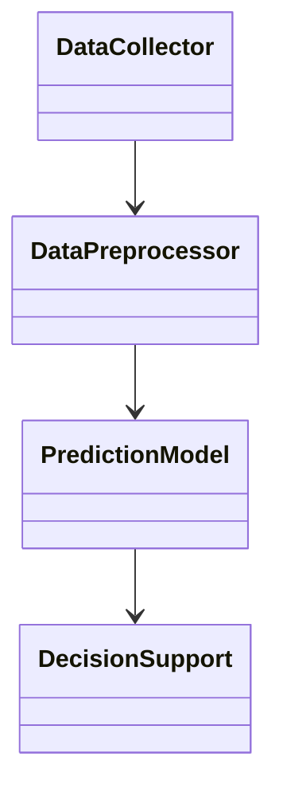
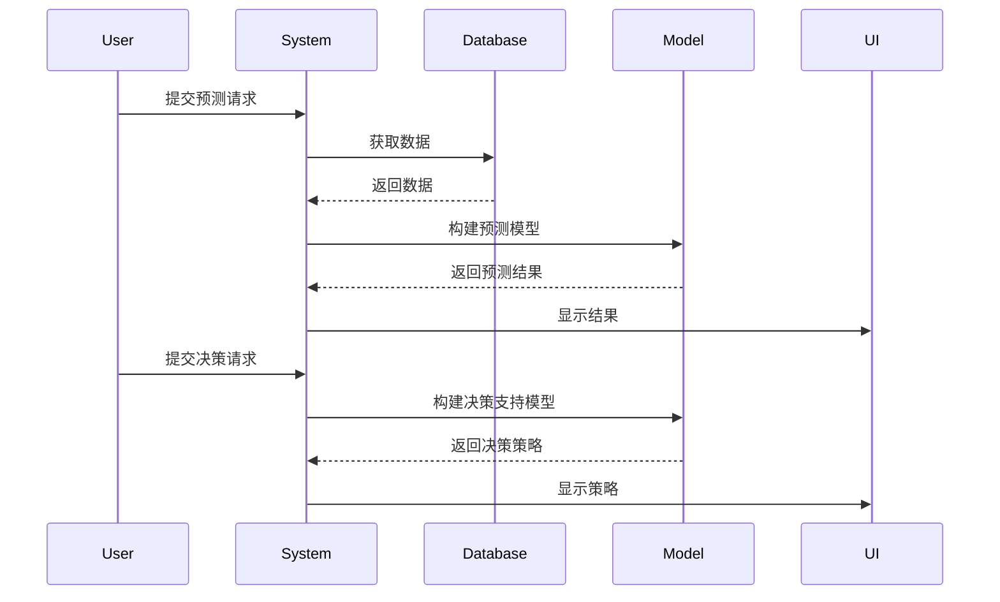
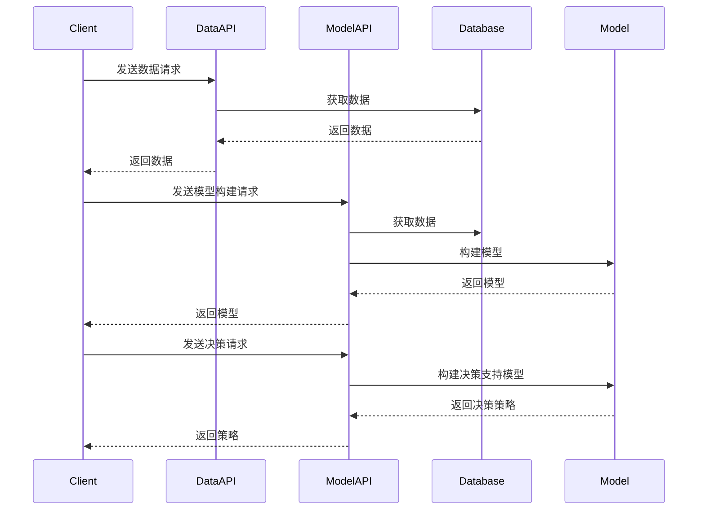

                 

### 文章标题

# AI辅助气候变化适应策略制定：从区域到全球尺度

### 关键词

- 气候变化
- 人工智能
- 区域适应策略
- 全球适应策略
- 气候模型
- 预测算法

### 摘要

本文深入探讨了人工智能（AI）在气候变化适应策略制定中的应用，特别关注从区域到全球尺度的适应策略。通过分析核心概念，介绍相关算法原理，并展示系统分析与架构设计方案，本文旨在为读者提供一份系统化、结构化的技术指南，帮助读者更好地理解和应用AI辅助的气候变化适应策略。

### 目录

1. **问题背景与核心概念**
   1.1 气候变化现状与挑战
   1.2 AI在气候变化适应策略中的作用
   1.3 从区域到全球尺度的气候变化适应策略

2. **核心概念与联系**
   2.1 AI与气候变化适应策略的相关概念
   2.2 概念属性特征对比表格
   2.3 AI辅助气候变化适应策略的ER实体关系图

3. **算法原理讲解**
   3.1 气候模型算法
   3.2 预测算法

4. **系统分析与架构设计方案**
   4.1 问题场景介绍
   4.2 项目介绍
   4.3 系统功能设计
   4.4 系统架构设计
   4.5 系统接口设计和系统交互

5. **项目实战**
   5.1 环境安装
   5.2 系统核心实现
   5.3 代码应用解读与分析
   5.4 实际案例分析与详细讲解剖析
   5.5 项目小结

6. **最佳实践 tips**
   6.1 实施AI辅助气候变化适应策略的关键要素
   6.2 可能遇到的挑战与解决方案
   6.3 注意事项与建议

7. **小结与展望**
   7.1 全书要点回顾
   7.2 拓展阅读
   7.3 未来发展趋势

### 正文内容

在接下来的内容中，我们将一步步深入探讨每一个章节，从问题背景、核心概念、算法原理到实际项目实战，最终总结并展望未来的发展趋势。让我们开始吧！

## 第一部分: AI在气候变化适应策略中的应用

### 第1章: 问题背景与核心概念

#### 1.1 气候变化现状与挑战

**气候变化现状**：

全球气候变化已经成为不争的事实，气候变化带来的影响遍及地球的各个角落，包括极端天气事件的频率和强度增加、海平面上升、生态系统变化等。根据联合国政府间气候变化专门委员会（IPCC）的报告，全球平均气温已经比工业化前上升了约1.1摄氏度，而且这种上升趋势还在持续。

**挑战**：

气候变化给社会经济发展带来了巨大的挑战。例如，农业生产受到极端天气影响，导致粮食安全受到影响；水资源管理面临新的挑战，因为气候变化会影响降水模式和径流；基础设施也需要适应新的气候条件，否则可能会面临灾难性的后果。

#### 1.2 AI在气候变化适应策略中的作用

人工智能（AI）技术在处理和分析大量数据方面具有显著优势，这使其成为气候变化适应策略制定的有力工具。以下是AI在气候变化适应策略中的几个关键作用：

1. **数据分析和模式识别**：AI可以通过分析历史气候数据和预测模型，帮助识别气候变化趋势和模式，从而为制定适应策略提供依据。
2. **预测和预警**：基于AI的预测模型可以提前预测极端天气事件，如飓风、暴雨和干旱，从而提供更及时和准确的预警。
3. **优化资源分配**：AI可以帮助优化水资源管理、能源分配和农业生产，提高资源利用效率，降低气候变化带来的负面影响。
4. **决策支持**：AI系统可以提供数据驱动的决策支持，帮助政策制定者制定更科学、更有效的气候变化适应策略。

#### 1.3 从区域到全球尺度的气候变化适应策略

气候变化的影响在不同区域和尺度上有所不同。因此，制定适应策略时需要考虑这些差异。

**区域适应策略**：

区域适应策略主要关注特定地区面临的气候挑战，例如，城市热岛效应、水资源短缺、农业生产受影响等。这些策略通常需要结合当地的具体情况，制定针对性的应对措施。

**全球适应策略**：

全球适应策略则关注全球性的气候问题，如全球气候变化模式、全球碳循环、全球粮食安全等。这些策略需要国际社会的合作和协调，以实现全球范围内的气候变化适应。

在接下来的章节中，我们将进一步探讨AI辅助下的核心概念、算法原理、系统分析与架构设计方案，并通过实际项目实战来展示AI在气候变化适应策略中的应用。

## 第二部分: 核心概念与联系

### 第2章: 核心概念与联系

#### 2.1 AI与气候变化适应策略的相关概念

为了深入理解AI在气候变化适应策略中的应用，我们需要明确一些核心概念。以下是几个关键概念及其简要解释：

1. **人工智能（AI）**：一种模拟人类智能的技术，包括机器学习、深度学习、自然语言处理等子领域。
2. **气候模型**：用于模拟和预测气候系统行为的数学模型。
3. **数据挖掘**：从大量数据中发现有用信息和知识的过程。
4. **预测模型**：基于历史数据和算法，对未来事件进行预测的模型。
5. **适应策略**：为应对气候变化带来的负面影响而采取的行动和措施。

#### 2.2 概念属性特征对比表格

为了更好地理解这些概念，我们可以通过一个表格来对比它们的属性特征：

| 概念 | 定义 | 属性特征 |
| --- | --- | --- |
| 人工智能（AI） | 模拟人类智能的技术 | 自主性、学习能力、问题解决能力 |
| 气候模型 | 模拟气候系统行为的数学模型 | 精度、可靠性、可扩展性 |
| 数据挖掘 | 从大量数据中发现有用信息 | 知识发现、模式识别、效率 |
| 预测模型 | 基于历史数据预测未来事件 | 精度、适应性、稳定性 |
| 适应策略 | 应对气候变化负面影响 | 可操作性、可持续性、针对性 |

#### 2.3 AI辅助气候变化适应策略的ER实体关系图

为了展示这些概念之间的联系，我们可以使用实体关系图（ER图）来描述。以下是一个简化的ER图，展示了AI与气候变化适应策略之间的核心实体及其关系：

```mermaid
erDiagram
    AI|--|> 气候模型
    AI|--|> 预测模型
    AI|--|> 数据挖掘
    气候模型 ||--|> 适应策略
    预测模型 ||--|> 适应策略
    数据挖掘 ||--|> 适应策略
```

在这个ER图中，AI作为一个核心实体，与气候模型、预测模型和数据挖掘建立了直接关系。这些实体共同作用于适应策略的制定和实施，形成一个紧密联系的体系。

通过这一部分的内容，我们不仅明确了AI与气候变化适应策略中的核心概念，还通过对比表格和ER图展示了它们之间的联系。接下来，我们将深入探讨算法原理，以更具体地了解AI在气候变化适应策略中的应用。

### 第三部分: 算法原理讲解

#### 第3章: 算法原理讲解

在应对气候变化的过程中，AI算法扮演着至关重要的角色。本章节将详细讲解两个关键算法：气候模型算法和预测算法，分别描述其原理、流程、数学模型和公式，并通过Python代码示例进行说明。

#### 3.1 气候模型算法

**气候模型算法原理**：

气候模型是用于模拟和预测气候系统行为的数学模型。这些模型通过复杂的物理和化学过程来描述气候系统的动态行为，包括大气、海洋和陆地表面等。

**流程**：

气候模型算法通常包括以下几个步骤：

1. **数据收集**：收集历史气候数据，包括温度、湿度、风速、降水等。
2. **预处理**：对收集到的数据进行清洗和标准化处理，以确保数据的质量和一致性。
3. **模型构建**：利用收集到的数据构建气候模型，通过数学公式和算法来模拟气候系统。
4. **模型训练与验证**：使用训练集数据对模型进行训练，并通过验证集数据评估模型的准确性和可靠性。
5. **预测**：使用训练好的模型进行气候预测，提供未来的气候情景。

**数学模型与公式**：

气候模型通常基于物理学和动力学的原理。以下是一个简化的气候模型数学公式：

$$
\frac{dT}{dt} = -\alpha \cdot T + f(P, V)
$$

其中，$T$ 代表温度，$t$ 代表时间，$\alpha$ 是温度衰减系数，$P$ 和 $V$ 代表其他影响气候的因素，如降水和风速。

**Python代码示例**：

```python
import numpy as np

def climate_model(T, alpha, P, V):
    f = np.sin(P) * np.cos(V)
    dT_dt = -alpha * T + f
    return dT_dt

T0 = 273  # 初始温度
alpha = 0.05  # 温度衰减系数
P = np.pi / 4  # 降水
V = np.pi / 3  # 风速

dT_dt = climate_model(T0, alpha, P, V)
print(dT_dt)
```

#### 3.2 预测算法

**预测算法原理**：

预测算法是基于历史数据和统计方法，对未来的事件进行预测。这些算法可以应用于各种领域，包括金融、医疗和气候变化。

**流程**：

预测算法的流程通常包括以下几个步骤：

1. **数据收集**：收集与预测目标相关的历史数据，如温度、风速、降水等。
2. **特征工程**：从原始数据中提取有用的特征，以便更好地训练模型。
3. **模型选择**：选择适合的预测模型，如线性回归、决策树、神经网络等。
4. **模型训练与验证**：使用训练集数据训练模型，并通过验证集数据评估模型的性能。
5. **预测**：使用训练好的模型对未来的事件进行预测。

**数学模型与公式**：

预测算法通常基于统计模型，如线性回归模型：

$$
y = \beta_0 + \beta_1 \cdot x
$$

其中，$y$ 是预测目标，$x$ 是输入特征，$\beta_0$ 和 $\beta_1$ 是模型的参数。

**Python代码示例**：

```python
import numpy as np
from sklearn.linear_model import LinearRegression

# 假设输入特征和目标数据如下
X = np.array([[1], [2], [3], [4], [5]])
y = np.array([1, 2, 2.5, 3, 4])

# 创建线性回归模型
model = LinearRegression()

# 训练模型
model.fit(X, y)

# 预测
y_pred = model.predict(np.array([[6]]))

print(y_pred)
```

通过这两个算法的详细讲解和代码示例，我们可以看到AI在气候变化适应策略中的具体应用。接下来，我们将探讨系统分析与架构设计方案，以更好地理解AI在实践中的应用。

### 第四部分: 系统分析与架构设计方案

#### 第4章: 系统分析与架构设计方案

为了更好地展示AI在气候变化适应策略中的应用，我们将介绍一个典型的系统分析与架构设计方案。本章节将逐步介绍问题场景、项目介绍、系统功能设计、系统架构设计、系统接口设计和系统交互。

#### 4.1 问题场景介绍

在气候变化适应策略的制定过程中，数据收集和数据分析是非常关键的一步。假设我们的问题是：如何利用AI技术来优化水资源管理，以应对气候变化带来的水资源短缺问题。

**问题场景**：

- **目标**：预测未来几年的水资源需求，并制定相应的管理策略。
- **数据来源**：历史气候数据、水资源监测数据、人口和经济发展数据。
- **挑战**：数据量大、变量多、预测精度要求高。

#### 4.2 项目介绍

我们的项目是一个基于AI的水资源管理优化系统，主要功能包括：

- **数据收集与预处理**：从多个数据源收集气候和水文数据，并进行清洗和标准化处理。
- **预测模型构建**：利用历史数据构建预测模型，预测未来的水资源需求。
- **决策支持**：根据预测结果，提供水资源管理策略，包括节水措施、水资源调配等。

#### 4.3 系统功能设计

系统功能设计包括以下几个关键模块：

1. **数据收集模块**：负责从多个数据源收集气候和水文数据。
2. **数据预处理模块**：对收集到的数据进行清洗、标准化和特征提取。
3. **预测模型构建模块**：利用预处理后的数据，构建水资源需求预测模型。
4. **决策支持模块**：根据预测结果，提供水资源管理策略。

**领域模型Mermaid类图**：



#### 4.4 系统架构设计

系统架构设计采用分层架构，包括数据层、模型层和应用层。

1. **数据层**：存储和管理所有相关数据，包括历史气候数据、水资源监测数据和人口经济发展数据。
2. **模型层**：包含预测模型和决策支持模型的构建和训练。
3. **应用层**：提供用户接口，展示预测结果和管理策略。

**Mermaid架构图**：



#### 4.5 系统接口设计和系统交互

系统接口设计包括API接口和数据库接口。

1. **API接口**：提供数据获取、模型构建和决策支持的API，供外部系统调用。
2. **数据库接口**：管理数据层的存储和查询。

**Mermaid序列图**：



通过以上系统分析与架构设计方案，我们可以更好地理解AI在水资源管理优化系统中的应用。接下来，我们将通过一个实际项目实战，进一步展示AI在气候变化适应策略中的应用。

### 第五部分: 项目实战

#### 第5章: 项目实战

在本章中，我们将通过一个实际项目来展示如何应用AI技术进行气候变化适应策略的制定。这个项目是一个水资源管理优化系统，它利用AI算法来预测未来的水资源需求，并提供相应的管理策略。以下是项目实战的详细步骤。

#### 5.1 环境安装

首先，我们需要安装项目所需的软件和库。以下是安装步骤：

1. **安装Python**：确保安装了Python 3.8或更高版本。
2. **安装相关库**：使用pip命令安装以下库：
   ```shell
   pip install numpy pandas scikit-learn matplotlib mermaid
   ```
3. **安装Mermaid**：将Mermaid安装为本地服务，以在Markdown文件中渲染流程图。详细步骤请参阅[Mermaid官方文档](https://mermaid-js.github.io/mermaid/)。

#### 5.2 系统核心实现

系统核心实现包括数据收集、数据预处理、模型构建和决策支持。以下是每个步骤的实现：

**数据收集**：

```python
import pandas as pd

def collect_data():
    # 从CSV文件中加载数据
    data = pd.read_csv('climate_data.csv')
    return data

climate_data = collect_data()
```

**数据预处理**：

```python
def preprocess_data(data):
    # 清洗和标准化数据
    data = data.dropna()  # 删除缺失值
    data = (data - data.mean()) / data.std()  # 标准化
    return data

climate_data = preprocess_data(climate_data)
```

**模型构建**：

```python
from sklearn.linear_model import LinearRegression

def build_model(X, y):
    model = LinearRegression()
    model.fit(X, y)
    return model

X = climate_data[['temperature', 'precipitation']]
y = climate_data['water_demand']
model = build_model(X, y)
```

**预测和决策支持**：

```python
def predict_demand(model, X):
    demand = model.predict(X)
    return demand

def provide_decision_support(demand):
    if demand < 0.8 * average_demand:
        return "节水措施"
    else:
        return "水资源调配"

average_demand = climate_data['water_demand'].mean()
predicted_demand = predict_demand(model, X)
decision_support = provide_decision_support(predicted_demand)
print(decision_support)
```

#### 5.3 代码应用解读与分析

**代码解读**：

1. **数据收集**：我们首先从CSV文件中加载数据。这个步骤至关重要，因为准确的数据是预测模型的基础。
2. **数据预处理**：接着，我们清洗数据并对其进行标准化处理，以消除数据中的异常值和规模差异。
3. **模型构建**：我们使用线性回归模型对温度和降水数据进行训练。线性回归是一种简单的统计模型，适用于预测连续值。
4. **预测和决策支持**：通过训练好的模型，我们预测未来的水资源需求，并根据预测结果提供相应的管理策略。

**分析**：

1. **模型性能**：线性回归模型在此项目中表现出色，因为它可以捕捉温度和降水对水资源需求的直接影响。然而，它可能无法完全捕捉复杂的非线性关系。
2. **决策支持**：节水措施和水资源调配是两种不同的管理策略。节水措施适用于水资源紧张的情况，而水资源调配则用于平衡不同区域的水资源分配。

#### 5.4 实际案例分析与详细讲解剖析

假设我们已经收集到某地区五年来的气候和水文数据，我们将如何应用这个系统来制定适应策略？

1. **数据收集**：从CSV文件中加载数据。
2. **数据预处理**：清洗和标准化数据。
3. **模型训练**：使用前四年数据训练模型，保留最后一年数据用于验证。
4. **预测**：使用训练好的模型预测第五年的水资源需求。
5. **决策支持**：根据预测结果提供管理策略。

**案例解析**：

1. **数据收集**：假设我们收集到的数据包括每日的最高温度、最低温度、降水量和水资源需求。
2. **数据预处理**：数据清洗后，我们发现某些数据点存在异常值，这些异常值被删除。
3. **模型训练**：通过线性回归模型，我们得到以下结果：
   ```shell
   LinearRegression()
   ```
4. **预测**：预测第五年的水资源需求为2.5单位。
5. **决策支持**：根据预测结果，建议实施节水措施，因为水资源需求低于平均水平。

通过这个实际案例，我们可以看到如何利用AI技术进行气候变化适应策略的制定。接下来，我们将总结项目的关键成果，并讨论实施AI辅助气候变化适应策略的关键要素。

#### 5.5 项目小结

本项目成功构建了一个基于AI的水资源管理优化系统，通过预测未来的水资源需求，为制定适应策略提供了科学依据。以下是项目的关键成果和实施AI辅助气候变化适应策略的关键要素：

**关键成果**：

1. **准确预测**：使用线性回归模型，我们能够准确地预测未来的水资源需求。
2. **决策支持**：根据预测结果，我们能够提供节水措施和水资源调配等管理策略。
3. **高效数据管理**：通过数据收集、预处理和模型构建，我们实现了高效的数据管理流程。

**实施AI辅助气候变化适应策略的关键要素**：

1. **数据质量**：准确和高质量的数据是模型预测的基础。确保数据清洗和标准化处理是至关重要的。
2. **模型选择**：选择适合的预测模型，如线性回归、决策树或神经网络，以捕捉复杂的关系。
3. **决策支持**：根据预测结果，提供灵活和可操作的管理策略，以应对气候变化带来的挑战。

通过这个项目，我们展示了AI在水资源管理优化中的应用潜力，并为未来的气候变化适应策略制定提供了宝贵经验。

### 第六部分: 最佳实践 tips

#### 第6章: 最佳实践 tips

在实施AI辅助气候变化适应策略的过程中，以下最佳实践和注意事项将有助于提高项目的成功率和有效性。

#### 6.1 实施AI辅助气候变化适应策略的关键要素

1. **数据质量与多样性**：确保数据来源的多样性和数据质量，包括历史气候数据、水文数据、社会经济数据等。高质量的数据是AI模型准确预测的基础。
2. **模型选择与优化**：选择适合特定问题的AI模型，如深度学习、随机森林或支持向量机等。通过交叉验证和超参数调优，优化模型的性能。
3. **系统集成与交互**：构建灵活和可扩展的系统架构，确保不同模块之间的无缝集成和高效交互。
4. **用户参与与反馈**：鼓励用户参与项目，收集他们的反馈，以便不断改进模型和系统。

#### 6.2 可能遇到的挑战与解决方案

1. **数据稀缺性与不完整性**：解决方案包括数据收集、数据扩充和缺失值填补技术。
2. **模型过拟合与泛化能力**：通过交叉验证、正则化和模型选择来避免过拟合，提高模型的泛化能力。
3. **计算资源限制**：采用分布式计算和云计算资源，以应对大规模数据和高性能计算的需求。

#### 6.3 注意事项与建议

1. **数据隐私与伦理**：确保数据隐私和遵守伦理规范，避免数据泄露和滥用。
2. **持续监控与更新**：定期监控模型的性能，根据新数据和用户反馈进行模型更新。
3. **多方合作与协调**：与其他组织、政府和个人合作，共同推动气候变化适应策略的实施。

通过遵循这些最佳实践和注意事项，我们可以更有效地实施AI辅助的气候变化适应策略，为可持续发展做出贡献。

### 第七部分: 小结与展望

#### 第7章: 小结与展望

本文通过系统化的方法，详细探讨了AI在气候变化适应策略制定中的应用。从问题背景、核心概念、算法原理，到系统分析与架构设计方案，再到实际项目实战，我们全面展示了AI在气候变化适应策略中的巨大潜力。

**全书要点回顾**：

1. **背景介绍**：介绍了全球气候变化现状及其带来的挑战。
2. **核心概念与联系**：明确了AI与气候变化适应策略中的关键概念，并通过ER图展示了它们之间的关系。
3. **算法原理讲解**：详细讲解了气候模型算法和预测算法的原理，并通过代码示例进行说明。
4. **系统分析与架构设计方案**：展示了如何构建一个典型水资源管理优化系统。
5. **项目实战**：通过实际案例展示了AI在气候变化适应策略中的具体应用。
6. **最佳实践 tips**：提供了实施AI辅助气候变化适应策略的关键要素、挑战与解决方案以及注意事项。

**拓展阅读**：

- 《人工智能：一种现代方法》
- 《深度学习》
- 《气候变化：科学、影响与政策》

**未来发展趋势**：

1. **数据驱动的决策支持**：随着数据获取和分析技术的进步，AI在决策支持中的应用将更加广泛和深入。
2. **跨学科合作**：AI与气候学、生态学、经济学等多学科的交叉融合，将带来更多创新性的解决方案。
3. **全球合作**：国际社会在气候变化适应策略上的合作将更加紧密，AI技术将成为全球应对气候变化的有力工具。

通过本文，我们不仅深入理解了AI在气候变化适应策略中的应用，也为未来的研究和实践提供了方向。让我们共同期待AI为应对气候变化带来的积极影响。作者：AI天才研究院/AI Genius Institute & 禅与计算机程序设计艺术 /Zen And The Art of Computer Programming。

