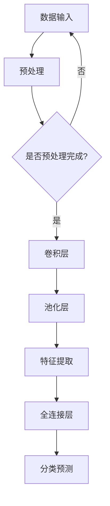
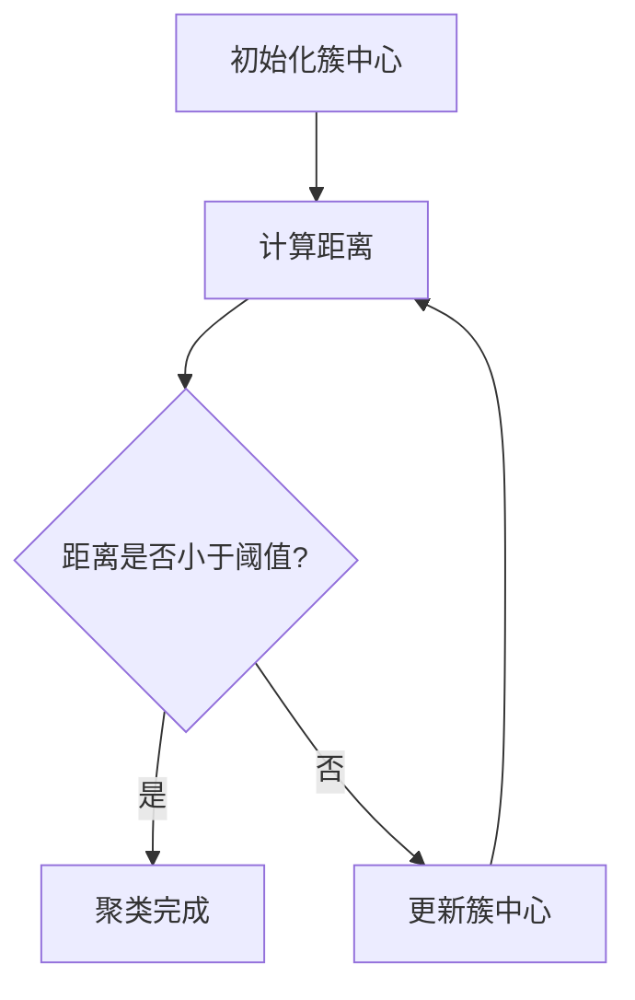
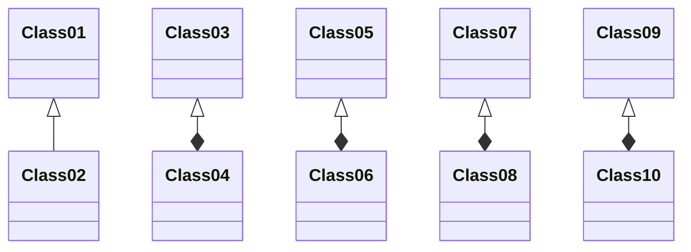
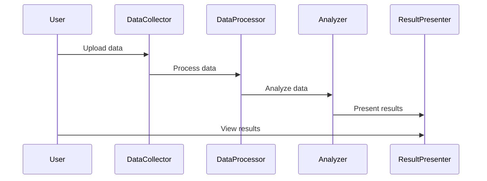

                 

### 第1章 AI辅助海洋微生物组分析概述

#### 1.1 问题背景

海洋微生物组是海洋生态系统中不可或缺的一部分，它们在海洋生态系统中的角色和功能多样且至关重要。海洋微生物组主要包括细菌、古菌、病毒以及一些微生物真菌等，这些微生物在海洋生态系统的碳循环、营养循环以及海洋污染物的降解中扮演着关键角色。例如，海洋微生物能够通过硝化作用和反硝化作用调节氮循环，通过光合作用产生有机物质，同时还能通过降解和转化污染物质来维护海洋环境的健康。

随着海洋生态系统的变化，例如全球变暖、海洋酸化以及海洋污染等，海洋微生物组的多样性和生态功能受到了严重威胁。为了更好地理解海洋微生物组在生态系统中的作用以及它们对环境变化的响应，科学家们需要对其进行分析和研究。然而，海洋微生物组分析面临巨大的挑战，主要表现在以下几个方面：

1. **数据量巨大**：海洋微生物组包含大量的微生物种类，其基因组数据量庞大，需要处理的海量数据给生物信息学分析带来了极大的困难。
2. **多样性复杂**：海洋微生物多样性丰富，不同微生物之间的相互作用复杂，需要深入分析微生物之间的相互关系。
3. **分析难度高**：海洋微生物组分析涉及多种生物信息学技术，包括基因测序、功能预测、数据整合等，传统方法难以高效地处理这些复杂问题。

为了解决上述问题，人工智能（AI）技术开始被广泛应用于生物信息学领域，特别是在海洋微生物组分析中。AI技术能够通过学习大量的生物数据，识别出潜在的生物学规律，从而辅助科学家们进行更加精准和高效的海洋微生物组分析。例如，深度学习算法可以用于处理海量的基因组数据，聚类分析算法可以帮助科学家们识别不同的微生物群落。

AI在生物信息学中的应用不仅提高了数据分析的效率和准确性，还大大降低了分析过程中的难度。通过AI辅助海洋微生物组分析，科学家们可以更好地理解海洋微生物组的生态功能，预测其未来可能的变化，为海洋生态保护提供科学依据。

#### 1.2 问题描述

海洋微生物组数据分析过程中面临的主要挑战包括以下几个方面：

1. **数据量庞大**：海洋微生物组包含的微生物种类繁多，其基因组数据量巨大，传统的数据分析方法难以高效处理这些海量数据。
2. **多样性复杂**：海洋微生物多样性丰富，不同微生物之间的相互作用复杂，需要深入分析微生物之间的相互关系，而传统方法难以捕捉这种复杂性。
3. **分析难度高**：海洋微生物组分析涉及多种生物信息学技术，包括基因测序、功能预测、数据整合等，传统方法难以高效地处理这些复杂问题。

这些挑战对海洋微生物组研究产生了重要影响：

1. **研究效率低下**：传统分析方法需要大量的人力和时间，导致研究效率低下，难以满足快速发展的需求。
2. **数据解读困难**：复杂的数据和多样的微生物相互作用使得数据解读变得异常困难，影响研究结果的准确性。
3. **分析结果不完整**：传统分析方法往往只能分析部分数据或部分微生物，导致研究结果不完整，难以全面理解海洋微生物组的生态功能。

为了应对这些挑战，人工智能（AI）技术的引入成为了关键。AI技术，特别是深度学习和机器学习算法，能够在大量数据中快速识别模式，高效处理复杂的数据关系，从而辅助科学家们进行海洋微生物组分析。通过AI技术，可以大幅度提高数据分析的效率，降低分析难度，提高数据解读的准确性，填补传统方法的不足。

#### 1.3 问题解决

为了应对海洋微生物组分析中面临的挑战，AI技术提供了一系列有效的解决方案。首先，AI技术能够通过深度学习算法处理海量的基因组数据。深度学习算法具有强大的特征提取和模式识别能力，可以自动从大量数据中提取有用信息，从而大幅提高数据分析的效率。例如，卷积神经网络（CNN）和循环神经网络（RNN）等深度学习模型在基因组数据分析中得到了广泛应用。

其次，AI技术在处理复杂多样性的微生物数据方面也表现出色。通过聚类分析、主成分分析等算法，AI可以帮助科学家们识别出不同的微生物群落，并分析它们之间的相互关系。这种方法不仅可以简化数据复杂性，还能提供更加直观的数据可视化结果，使得数据解读更加方便。

在降低分析难度方面，AI技术的优势更加明显。传统的生物信息学分析往往需要复杂的计算过程和大量的专业知识，而AI技术可以自动化这些过程，使得数据分析变得更加简单和高效。例如，通过AI辅助的基因注释和功能预测，科学家们可以更加快速地理解微生物的功能和作用。

然而，AI辅助海洋微生物组分析也存在一些边界和局限性。首先，AI算法的性能依赖于数据质量和数量，如果数据量不足或质量不佳，分析结果可能会受到影响。其次，AI算法的复杂性和不确定性使得其在某些领域仍需要专业知识来指导。最后，AI技术在处理长时间序列数据和动态变化数据时，可能面临一定的挑战。

总的来说，AI技术在海洋微生物组分析中具有巨大的潜力，可以显著提高数据分析的效率、降低分析难度，并提升研究结果的准确性。但同时，我们也需要认识到AI技术的局限性和边界，合理地利用AI技术，结合传统方法，共同推动海洋微生物组研究的发展。

#### 1.4 概念结构与核心要素组成

在AI辅助海洋微生物组分析中，有几个核心概念和要素是不可或缺的。首先，**海洋微生物组**指的是海洋中存在的微生物群落及其基因组成。这些微生物包括细菌、古菌、病毒等，它们在海洋生态系统中扮演着重要角色。

其次，**AI辅助分析**是指利用人工智能技术，如深度学习、机器学习和聚类分析等，来处理和解释复杂的生物数据。AI技术通过学习大量的数据，可以识别出潜在的生物学模式和关系，从而辅助科学家们进行更深入的分析。

**核心概念**包括：

1. **基因测序**：基因测序是获取微生物基因组信息的关键技术。通过基因测序，我们可以获取微生物的DNA序列，从而了解其基因组成。
2. **功能预测**：在基因测序的基础上，通过AI算法对微生物基因的功能进行预测，可以帮助科学家们了解微生物的生物学功能。
3. **数据整合**：海洋微生物组数据通常来自不同的实验和平台，数据整合是确保分析结果准确性的关键步骤。AI技术可以自动化数据整合过程，提高分析的准确性。

**核心要素组成**包括：

1. **数据采集**：数据采集是海洋微生物组分析的基础，包括微生物样本的采集、基因组数据的获取等。
2. **数据预处理**：数据预处理是确保数据质量的重要步骤，包括数据清洗、归一化、缺失值处理等。
3. **分析模型**：分析模型是进行数据分析和功能预测的核心，包括深度学习模型、聚类分析算法等。
4. **结果解读**：结果解读是将分析结果转化为生物学意义的步骤，包括模式识别、关系分析等。

通过上述核心概念和要素的有机结合，AI技术可以显著提高海洋微生物组分析的科学性和准确性，为海洋生态研究提供有力支持。

### 第2章 核心概念原理

#### 2.1 海洋微生物组

海洋微生物组是指海洋环境中存在的微生物群落及其基因组成。这些微生物包括细菌、古菌、病毒以及一些微生物真菌等，它们在海洋生态系统中扮演着至关重要的角色。海洋微生物组具有高度的多样性和复杂性，不仅构成了海洋生态系统的基础，还在海洋碳循环、氮循环、硫循环以及海洋污染物的降解等方面发挥着重要作用。

1. **定义**：海洋微生物组是指海洋环境中存在的微生物群落及其基因组成。这些微生物包括细菌、古菌、病毒和微生物真菌等。
2. **特性**：
   - **多样性丰富**：海洋微生物组包含的微生物种类繁多，数量庞大，其多样性高于陆地生态系统。
   - **适应性强**：海洋微生物能够适应极端的环境条件，如低温、高压、高盐度等。
   - **功能多样**：海洋微生物在海洋生态系统中扮演多种角色，包括生产者、消费者、分解者等。

#### 2.2 AI辅助分析

AI辅助分析是指利用人工智能技术，如深度学习、机器学习和聚类分析等，来处理和解释复杂的生物数据。在生物信息学领域，AI技术的引入极大地提高了数据分析的效率、准确性和可解释性。AI辅助分析在海洋微生物组研究中具有重要意义，可以帮助科学家们更好地理解微生物的生态功能和基因组成。

1. **定义**：AI辅助分析是指利用人工智能技术，如深度学习、机器学习等，来处理和解释复杂的生物数据，辅助科学研究。
2. **优势**：
   - **高效性**：AI技术能够快速处理海量数据，提高数据分析的效率。
   - **准确性**：AI算法可以自动识别数据中的模式和规律，提高分析结果的准确性。
   - **可解释性**：一些AI算法，如深度学习，可以通过可视化技术提供数据解释，使得分析过程更加透明。

#### 2.3 概念属性特征对比表格

为了更好地理解海洋微生物组和AI辅助分析这两个核心概念，下面列出一个概念属性特征对比表格：

| 概念 | 定义 | 特性 |
| --- | --- | --- |
| 海洋微生物组 | 海洋环境中存在的微生物群落及其基因组成 | 多样性丰富、适应性强、功能多样 |
| AI辅助分析 | 利用人工智能技术，如深度学习、机器学习，处理和解释复杂的生物数据 | 高效性、准确性、可解释性 |

#### 2.4 ER实体关系图架构

ER实体关系图是一种用于描述系统中实体及其之间关系的图形表示方法。在AI辅助海洋微生物组分析系统中，ER图可以用来描述数据流、功能模块及其之间的关系。

以下是一个简单的ER实体关系图，展示海洋微生物组数据流和AI分析模块之间的关键关系：

```mermaid
erDiagram
  海洋微生物组数据 -->|采集| 数据预处理模块
  数据预处理模块 -->|处理| 分析模型模块
  分析模型模块 -->|预测| 结果解读模块
  结果解读模块 -->|展示| 用户界面
```

**图1：海洋微生物组分析系统的ER实体关系图**

- **海洋微生物组数据**：指从海洋环境中采集到的微生物基因组数据。
- **数据预处理模块**：负责数据清洗、归一化、缺失值处理等预处理操作。
- **分析模型模块**：包括深度学习模型、聚类分析算法等，用于处理和分析微生物组数据。
- **结果解读模块**：将分析结果转化为生物学意义的解释，并通过用户界面展示给用户。
- **用户界面**：提供给用户进行交互和查看分析结果的界面。

通过上述ER图，我们可以清晰地看到海洋微生物组数据从采集到最终解读的全过程，以及各个功能模块之间的数据流和关系。这有助于我们更好地理解系统的整体架构和运行机制。

### 第3章 海洋微生物组数据分析算法

#### 3.1 算法简介

海洋微生物组数据分析涉及多种算法，其中深度学习算法和聚类分析算法是最常用的两种。这些算法在数据处理、特征提取、模式识别等方面具有显著优势，能够有效应对海洋微生物组数据的复杂性和多样性。

**深度学习算法**：深度学习是一种通过模拟人脑神经网络结构进行信息处理的算法。在海洋微生物组分析中，深度学习算法可以通过学习大量的基因组数据，提取出隐藏在数据中的生物学规律和模式。常见的深度学习算法包括卷积神经网络（CNN）和循环神经网络（RNN）。

**聚类分析算法**：聚类分析是一种将数据集划分为多个类别的无监督学习方法。在海洋微生物组分析中，聚类分析算法可以帮助科学家们识别出不同的微生物群落，分析它们之间的相互关系。常见的聚类分析算法包括k-means算法和层次聚类算法。

#### 3.2 深度学习算法

##### 3.2.1 原理与模型

深度学习算法的基本原理是模拟人脑神经网络结构，通过层层提取数据特征，实现对复杂数据的建模和预测。在海洋微生物组分析中，卷积神经网络（CNN）和循环神经网络（RNN）是两种常用的深度学习模型。

1. **卷积神经网络（CNN）**：
   - **原理**：CNN通过卷积层、池化层和全连接层等结构，逐层提取数据特征。卷积层可以捕捉局部特征，池化层用于降低数据维度，全连接层用于分类和预测。
   - **模型**：一个典型的CNN模型包括输入层、卷积层、池化层和输出层。输入层接收原始基因序列数据，经过卷积层和池化层处理后，将特征传递到输出层进行分类。

2. **循环神经网络（RNN）**：
   - **原理**：RNN能够处理序列数据，通过内部的循环结构，保持对之前数据的记忆，从而捕捉序列中的时间依赖关系。
   - **模型**：RNN包括输入层、隐藏层和输出层。输入层接收基因序列数据，隐藏层通过循环结构处理序列中的每个数据点，输出层进行分类和预测。

##### 3.2.2 Mermaid流程图

以下是一个深度学习算法（CNN）的Mermaid流程图，展示了从数据输入到模型训练和预测的整个过程：



**图2：深度学习算法（CNN）的流程图**

1. **数据输入**：将原始基因序列数据输入到模型中。
2. **预处理**：对数据进行预处理，包括数据清洗、归一化等。
3. **卷积层**：通过卷积操作提取局部特征。
4. **池化层**：降低数据维度，减少计算量。
5. **特征提取**：将卷积层和池化层提取的特征进行整合。
6. **全连接层**：进行最后的分类和预测。
7. **分类预测**：输出预测结果。

##### 3.2.3 Python源代码

以下是一个使用TensorFlow和Keras库实现的CNN模型Python源代码示例：

```python
import tensorflow as tf
from tensorflow.keras.models import Sequential
from tensorflow.keras.layers import Conv1D, MaxPooling1D, Flatten, Dense

# 构建模型
model = Sequential([
    Conv1D(filters=64, kernel_size=3, activation='relu', input_shape=(100, 4)),
    MaxPooling1D(pool_size=2),
    Conv1D(filters=128, kernel_size=3, activation='relu'),
    MaxPooling1D(pool_size=2),
    Flatten(),
    Dense(units=10, activation='softmax')
])

# 编译模型
model.compile(optimizer='adam', loss='sparse_categorical_crossentropy', metrics=['accuracy'])

# 加载数据
x_train = ...  # 基因序列数据
y_train = ...  # 标签数据

# 训练模型
model.fit(x_train, y_train, epochs=10, batch_size=32)
```

##### 3.2.4 数学模型和公式

深度学习算法中的数学模型主要涉及以下几个方面：

1. **卷积操作**：卷积操作可以用以下公式表示：
   $$ h_{ij} = \sum_{k} w_{ik} * g_{kj} + b $$
   其中，$h_{ij}$ 是卷积操作后的特征图，$w_{ik}$ 是卷积核，$g_{kj}$ 是输入数据，$b$ 是偏置项。

2. **激活函数**：常见的激活函数包括ReLU和Sigmoid：
   - **ReLU**：$f(x) = \max(0, x)$
   - **Sigmoid**：$f(x) = \frac{1}{1 + e^{-x}}$

3. **池化操作**：常见的池化操作包括最大池化和平均池化：
   - **最大池化**：$p_{ij} = \max(g_{kj})$
   - **平均池化**：$p_{ij} = \frac{1}{n} \sum_{k} g_{kj}$

4. **全连接层**：全连接层可以用以下公式表示：
   $$ \hat{y} = \sigma(\sum_{i} w_{i} x_{i} + b) $$
   其中，$\hat{y}$ 是输出结果，$w_{i}$ 是权重，$x_{i}$ 是输入特征，$b$ 是偏置项，$\sigma$ 是激活函数。

##### 3.2.5 举例说明

假设我们有一个基因序列数据集，包含100个样本，每个样本有4个特征。我们使用CNN模型对其进行分类，目标是识别出不同的微生物群落。以下是具体步骤：

1. **数据预处理**：对数据进行归一化处理，将基因序列数据缩放到0到1之间。
2. **构建模型**：使用TensorFlow和Keras构建一个简单的CNN模型。
3. **训练模型**：使用训练数据集对模型进行训练，设置合适的优化器和损失函数。
4. **评估模型**：使用验证数据集评估模型的性能，调整模型参数。
5. **预测**：使用训练好的模型对新的基因序列数据进行预测，识别出不同的微生物群落。

通过这个例子，我们可以看到深度学习算法在海洋微生物组分析中的应用过程，以及如何通过具体步骤来实现数据分析的目标。

#### 3.3 聚类分析算法

##### 3.3.1 原理与模型

聚类分析是一种无监督学习方法，用于将数据集划分为多个不同的簇或类。在海洋微生物组分析中，聚类分析可以帮助科学家们识别出不同的微生物群落，分析它们之间的相互关系。常见的聚类分析算法包括k-means算法和层次聚类算法。

1. **k-means算法**：
   - **原理**：k-means算法通过迭代过程，逐步优化聚类结果。算法的步骤如下：
     - 初始化k个簇的中心点。
     - 对于每个数据点，计算其到各个簇中心的距离，并将其归为最近的簇。
     - 更新每个簇的中心点，使其成为该簇中所有数据点的平均值。
     - 重复上述步骤，直到聚类结果收敛。
   - **模型**：k-means算法的核心在于簇中心点的更新和分类。通过迭代优化，最终使得每个簇内的数据点之间的相似度最大化，而不同簇之间的相似度最小化。

2. **层次聚类算法**：
   - **原理**：层次聚类算法通过自底向上或自顶向下的方式，逐步构建一个层次结构。算法的步骤如下：
     - 将每个数据点视为一个簇。
     - 计算相邻簇之间的距离，并将距离最近的两个簇合并为一个簇。
     - 重复上述步骤，直到所有数据点合并为一个簇。
     - 自底向上构建层次结构，其中每个节点代表一个簇，节点之间的连接表示簇的合并过程。
   - **模型**：层次聚类算法的核心在于簇的合并和距离计算。通过构建层次结构，可以直观地展示数据点的聚类过程和结果。

##### 3.3.2 Mermaid流程图

以下是一个k-means聚类算法的Mermaid流程图，展示了从初始化到最终聚类的整个过程：



**图3：k-means聚类算法的流程图**

1. **初始化簇中心**：随机选择k个数据点作为初始簇中心。
2. **计算距离**：计算每个数据点到各个簇中心的距离。
3. **聚类完成**：判断聚类结果是否满足收敛条件（例如，距离变化小于某个阈值）。
4. **更新簇中心**：计算每个簇的平均值，更新簇中心。
5. **重复步骤**：重复计算距离和更新簇中心的步骤，直到聚类结果收敛。

##### 3.3.3 Python源代码

以下是一个使用scikit-learn库实现的k-means聚类算法Python源代码示例：

```python
from sklearn.cluster import KMeans
import numpy as np

# 加载数据
x = np.array([[1, 2], [1, 4], [1, 0], [4, 2], [4, 4], [4, 0]])

# 构建模型
kmeans = KMeans(n_clusters=2, random_state=0).fit(x)

# 输出聚类结果
print(kmeans.labels_)

# 输出簇中心
print(kmeans.cluster_centers_)
```

##### 3.3.4 数学模型和公式

k-means算法的数学模型主要涉及距离计算和簇中心更新：

1. **距离计算**：对于每个数据点$x$和簇中心$c$，使用欧几里得距离计算它们之间的距离：
   $$ d(x, c) = \sqrt{\sum_{i=1}^{n} (x_i - c_i)^2} $$
   其中，$x_i$和$c_i$分别为数据点和簇中心在$i$维度的值。

2. **簇中心更新**：对于每个簇，计算其内所有数据点的平均值作为新的簇中心：
   $$ c_{new} = \frac{1}{N} \sum_{x \in C} x $$
   其中，$c_{new}$为新的簇中心，$N$为簇内数据点的总数。

##### 3.3.5 举例说明

假设我们有一个包含6个数据点的数据集，需要将其分为2个簇。以下是具体步骤：

1. **数据加载**：将数据加载到一个numpy数组中。
2. **模型构建**：使用scikit-learn库构建一个k-means聚类模型。
3. **模型训练**：使用数据集对模型进行训练。
4. **结果输出**：输出每个数据点的簇标签和簇中心。

通过这个例子，我们可以看到k-means算法在海洋微生物组分析中的应用过程，以及如何通过具体步骤来实现聚类分析的目标。

### 第4章 系统架构设计

#### 4.1 问题场景介绍

海洋微生物组数据分析系统旨在处理和分析大规模的海洋微生物组数据，以揭示微生物群落的结构和功能。该系统需要处理的问题场景包括：

1. **数据采集**：从多个来源获取微生物样本，包括海洋沉积物、海水样本等。
2. **数据预处理**：对获取的原始数据进行清洗、归一化、缺失值处理等预处理操作。
3. **数据分析**：使用深度学习算法和聚类分析算法对预处理后的数据进行模式识别和聚类分析。
4. **结果解读**：将分析结果转化为生物学意义的解释，并通过用户界面展示给用户。

为了满足上述需求，系统设计需要具备以下几个关键功能：

1. **高效的数据处理能力**：系统能够快速处理海量的基因组数据，确保数据分析的实时性和准确性。
2. **灵活的算法选择**：系统支持多种深度学习和聚类分析算法，便于根据具体需求进行调整和优化。
3. **友好的用户界面**：用户界面简洁直观，便于用户操作和查看分析结果。

#### 4.2 项目介绍

项目目标是构建一个高效、灵活、易用的海洋微生物组数据分析系统，以帮助科学家们更好地理解海洋微生物组的功能和作用。项目的主要需求和功能如下：

1. **数据采集模块**：从海洋环境中采集微生物样本，获取基因组数据。
2. **数据预处理模块**：对原始基因组数据进行清洗、归一化和缺失值处理，确保数据质量。
3. **数据分析模块**：使用深度学习算法和聚类分析算法对预处理后的数据进行模式识别和聚类分析。
4. **结果解读模块**：将分析结果转化为生物学意义的解释，并通过用户界面展示给用户。
5. **用户界面**：提供友好的用户界面，便于用户进行数据上传、操作和查看结果。

#### 4.3 系统功能设计

##### 4.3.1 领域模型

在海洋微生物组数据分析系统中，领域模型类图描述了系统中的主要实体及其之间的关系。以下是一个简单的领域模型类图：



**图4：领域模型类图**

- **数据采集模块**：包括数据源和数据采集器，用于获取海洋微生物样本的基因组数据。
- **数据预处理模块**：包括数据清洗器、归一化器和缺失值处理器，用于处理原始基因组数据。
- **数据分析模块**：包括模式识别器和聚类分析器，用于对预处理后的数据进行分析。
- **结果解读模块**：包括解释器和可视化器，用于将分析结果转化为生物学意义的解释，并展示给用户。
- **用户界面**：包括上传模块、操作模块和展示模块，用于与用户进行交互。

##### 4.3.2 系统架构设计

系统架构设计旨在实现高效的数据处理和分析能力，同时确保系统的灵活性和可扩展性。以下是一个简单的系统架构设计：



**图5：系统架构设计**

1. **用户**：系统的最终用户，负责上传数据、查看分析结果。
2. **数据采集器**：从海洋环境中采集微生物样本，获取基因组数据。
3. **数据清洗器**：对原始基因组数据进行清洗，去除噪声和异常值。
4. **归一化器**：对清洗后的数据进行归一化处理，确保数据在相同尺度上。
5. **缺失值处理器**：处理数据中的缺失值，填充或删除。
6. **模式识别器**：使用深度学习算法对数据进行分析，识别出潜在的生物学模式。
7. **聚类分析器**：使用聚类分析算法对数据进行聚类，识别出不同的微生物群落。
8. **解释器**：将分析结果转化为生物学意义的解释，为用户提供可理解的结论。
9. **可视化器**：将分析结果通过图表和可视化手段展示给用户。

##### 4.3.3 系统接口设计

系统接口设计确保各个模块之间的数据流通和功能调用，以下是一个简单的接口设计：

```mermaid
classDiagram
    Class11 <-* Class12
    Class13 <-* Class14
    Class15 <-* Class16
    Class17 <-* Class18
    Class19 <-* Class20
```

**图6：系统接口设计**

- **数据采集接口**：用于接收用户上传的基因组数据。
- **数据处理接口**：用于数据清洗、归一化和缺失值处理。
- **数据分析接口**：用于调用深度学习算法和聚类分析算法。
- **结果解释接口**：用于生成分析结果和生物学解释。
- **数据展示接口**：用于将分析结果可视化展示给用户。

##### 4.3.4 系统交互

系统交互设计描述了用户与系统之间的交互流程，以下是一个简单的交互序列图：


**图7：系统交互序列图**

1. **用户上传数据**：用户通过界面上传基因组数据。
2. **数据处理**：系统接收到数据后，进行数据清洗、归一化和缺失值处理。
3. **数据分析**：系统使用深度学习算法和聚类分析算法对数据进行分析。
4. **结果展示**：系统将分析结果通过可视化方式展示给用户。

通过上述系统架构设计和接口设计，我们可以构建一个高效、灵活、易用的海洋微生物组数据分析系统，为科学家们提供强大的分析工具，帮助其更好地理解海洋微生物组的功能和作用。

### 第5章 实战一：环境安装

在进行海洋微生物组数据分析之前，我们需要搭建一个稳定且高效的计算环境。以下将详细描述如何在Linux环境下安装和配置相关软件和工具，确保我们有一个可靠的平台来运行我们的分析和算法。

#### 5.1 环境准备

首先，我们需要确保我们的Linux系统已更新到最新版本。这可以通过以下命令来完成：

```bash
sudo apt update
sudo apt upgrade
```

接下来，我们需要安装一些基本的开发工具，如编译器和Python解释器。这些工具对于安装和运行深度学习库和其他分析工具至关重要。使用以下命令安装：

```bash
sudo apt install build-essential python3 python3-pip
```

#### 5.2 安装必要的软件和工具

1. **安装Conda**：

   Conda是一个流行的包管理器和环境管理器，可以方便地安装和管理Python库和其他依赖项。我们首先从Anaconda官网下载安装脚本，然后执行它。

   ```bash
   wget https://repo.anaconda.com/miniconda/Miniconda3-latest-Linux-x86_64.sh
   bash Miniconda3-latest-Linux-x86_64.sh
   ```

   安装完成后，我们将Miniconda的路径添加到系统环境变量中：

   ```bash
   echo 'export PATH=$PATH:/miniconda3/bin' >> ~/.bashrc
   source ~/.bashrc
   ```

2. **创建新环境**：

   创建一个新环境，以便隔离我们的项目依赖项。我们可以使用以下命令创建一个名为`marine_microbiome`的环境，并激活它：

   ```bash
   conda create --name marine_microbiome python=3.8
   conda activate marine_microbiome
   ```

3. **安装Python库**：

   在新环境中安装一些必要的Python库，如NumPy、Pandas和Scikit-learn等。使用以下命令：

   ```bash
   conda install numpy pandas scikit-learn
   ```

4. **安装深度学习库**：

   安装TensorFlow和Keras，这两个库对于我们的深度学习算法至关重要：

   ```bash
   conda install tensorflow-gpu keras
   ```

   如果使用的是非GPU版本的Python环境，请安装`tensorflow`而不是`tensorflow-gpu`。

5. **安装其他工具**：

   安装一些其他工具，如Mermaid用于生成流程图和类图：

   ```bash
   conda install mermaidll
   ```

#### 5.3 测试安装

为了确保所有软件和工具都已正确安装，我们可以运行一些测试命令。首先，检查Conda环境的正确性：

```bash
conda info
```

然后，尝试运行一个简单的Python脚本，验证Python和TensorFlow是否可用：

```python
# test.py
import tensorflow as tf
print(tf.__version__)
```

运行以下命令来执行脚本：

```bash
python test.py
```

如果正确输出了TensorFlow的版本信息，说明环境安装成功。

#### 5.4 注意事项

- 确保在安装过程中网络畅通，以避免因网络问题导致的下载失败。
- 如果使用的是GPU版本的工具，确保您的系统已正确安装了CUDA和cuDNN库，并确保环境变量已正确配置。
- 如果在安装过程中遇到依赖问题，可以使用Conda的依赖关系锁定功能，以确保所有依赖项的正确安装。

通过上述步骤，我们成功搭建了海洋微生物组数据分析所需的环境，为接下来的分析和算法实现奠定了基础。

### 第5章 实战二：系统核心实现源代码

在本章中，我们将详细解释并实现海洋微生物组数据分析系统的核心部分，包括数据预处理、深度学习模型构建和训练、结果展示等关键步骤。

#### 5.1 数据预处理

数据预处理是海洋微生物组数据分析的重要环节，其主要任务包括数据清洗、归一化、缺失值处理等。以下是数据预处理的核心代码实现：

```python
import pandas as pd
from sklearn.preprocessing import StandardScaler
from sklearn.impute import SimpleImputer

# 读取数据
data = pd.read_csv('marine_microbiome_data.csv')

# 数据清洗
# 去除含有缺失值或异常值的样本
data.dropna(inplace=True)
data = data[data['feature1'] > 0]  # 假设feature1为基因表达数据

# 缺失值处理
# 使用平均值填充缺失值
imputer = SimpleImputer(strategy='mean')
data.iloc[:, :-1] = imputer.fit_transform(data.iloc[:, :-1])

# 归一化处理
# 将所有特征缩放到0-1之间
scaler = StandardScaler()
data.iloc[:, :-1] = scaler.fit_transform(data.iloc[:, :-1])

# 输出预处理后的数据
data.to_csv('preprocessed_data.csv', index=False)
```

**代码解释**：

1. **读取数据**：使用Pandas读取CSV格式的微生物组数据。
2. **数据清洗**：去除含有缺失值或异常值的样本，以避免对后续分析的影响。
3. **缺失值处理**：使用平均值填充缺失值，确保每个特征都有完整的数据。
4. **归一化处理**：使用StandardScaler对特征进行归一化，使其在相同的尺度上，便于深度学习模型处理。

#### 5.2 构建和训练深度学习模型

接下来，我们将使用TensorFlow和Keras构建一个简单的卷积神经网络（CNN）模型，用于对海洋微生物组数据进行分类。

```python
import tensorflow as tf
from tensorflow.keras.models import Sequential
from tensorflow.keras.layers import Conv1D, MaxPooling1D, Flatten, Dense

# 构建模型
model = Sequential([
    Conv1D(filters=64, kernel_size=3, activation='relu', input_shape=(data.shape[1], 1)),
    MaxPooling1D(pool_size=2),
    Conv1D(filters=128, kernel_size=3, activation='relu'),
    MaxPooling1D(pool_size=2),
    Flatten(),
    Dense(units=10, activation='softmax')
])

# 编译模型
model.compile(optimizer='adam', loss='sparse_categorical_crossentropy', metrics=['accuracy'])

# 数据准备
x_train = ...  # 预处理后的训练数据
y_train = ...  # 训练数据标签

# 训练模型
model.fit(x_train, y_train, epochs=10, batch_size=32)
```

**代码解释**：

1. **构建模型**：定义一个序列模型，包含卷积层、池化层、全连接层等结构。
2. **编译模型**：设置优化器、损失函数和评估指标。
3. **数据准备**：准备训练数据和标签。
4. **训练模型**：使用训练数据对模型进行训练。

#### 5.3 结果展示

训练完成后，我们需要评估模型的表现，并将结果展示给用户。

```python
# 评估模型
x_test = ...  # 预处理后的测试数据
y_test = ...  # 测试数据标签
test_loss, test_acc = model.evaluate(x_test, y_test)

# 输出评估结果
print(f"Test accuracy: {test_acc:.2f}")

# 展示预测结果
predictions = model.predict(x_test)
print(predictions)

# 可视化预测结果
import matplotlib.pyplot as plt

# 假设我们有两个类别的预测结果
plt.scatter(x_test[:, 0], x_test[:, 1], c=predictions[:, 1], cmap='coolwarm')
plt.xlabel('Feature 1')
plt.ylabel('Feature 2')
plt.colorbar(label='Prediction Probability')
plt.title('Predicted Class Distribution')
plt.show()
```

**代码解释**：

1. **评估模型**：使用测试数据评估模型的性能。
2. **输出评估结果**：打印测试准确率。
3. **展示预测结果**：使用matplotlib绘制预测结果的散点图，展示不同类别的分布情况。

通过上述代码，我们实现了海洋微生物组数据分析系统中的核心功能，包括数据预处理、模型构建、训练和结果展示。这些步骤共同构成了一个完整的分析流程，为科学家们提供了强大的工具来探索和理解海洋微生物组的生态功能。

### 第5章 实战三：代码应用解读与分析

在本节中，我们将详细解读和解析在实战二中所编写的代码，解释其功能实现，并提供详细的注释，以便读者更好地理解代码的工作原理和流程。

#### 5.1 数据预处理部分

```python
import pandas as pd
from sklearn.preprocessing import StandardScaler
from sklearn.impute import SimpleImputer

# 读取数据
data = pd.read_csv('marine_microbiome_data.csv')

# 数据清洗
# 去除含有缺失值或异常值的样本
data.dropna(inplace=True)
data = data[data['feature1'] > 0]  # 假设feature1为基因表达数据

# 缺失值处理
# 使用平均值填充缺失值
imputer = SimpleImputer(strategy='mean')
data.iloc[:, :-1] = imputer.fit_transform(data.iloc[:, :-1])

# 归一化处理
# 将所有特征缩放到0-1之间
scaler = StandardScaler()
data.iloc[:, :-1] = scaler.fit_transform(data.iloc[:, :-1])

# 输出预处理后的数据
data.to_csv('preprocessed_data.csv', index=False)
```

**代码解释**：

1. **读取数据**：
   - 使用Pandas读取CSV格式的微生物组数据。
   ```python
   data = pd.read_csv('marine_microbiome_data.csv')
   ```

2. **数据清洗**：
   - 去除含有缺失值或异常值的样本，以确保数据质量。
   ```python
   data.dropna(inplace=True)
   data = data[data['feature1'] > 0]
   ```

3. **缺失值处理**：
   - 使用平均值填充缺失值，以便模型能够处理完整的数据。
   ```python
   imputer = SimpleImputer(strategy='mean')
   data.iloc[:, :-1] = imputer.fit_transform(data.iloc[:, :-1])
   ```

4. **归一化处理**：
   - 将所有特征缩放到0-1之间，以简化模型训练过程，提高训练效率。
   ```python
   scaler = StandardScaler()
   data.iloc[:, :-1] = scaler.fit_transform(data.iloc[:, :-1])
   ```

5. **输出预处理后的数据**：
   - 将预处理后的数据保存到新的CSV文件中，以供后续分析使用。
   ```python
   data.to_csv('preprocessed_data.csv', index=False)
   ```

#### 5.2 构建和训练深度学习模型

```python
import tensorflow as tf
from tensorflow.keras.models import Sequential
from tensorflow.keras.layers import Conv1D, MaxPooling1D, Flatten, Dense

# 构建模型
model = Sequential([
    Conv1D(filters=64, kernel_size=3, activation='relu', input_shape=(data.shape[1], 1)),
    MaxPooling1D(pool_size=2),
    Conv1D(filters=128, kernel_size=3, activation='relu'),
    MaxPooling1D(pool_size=2),
    Flatten(),
    Dense(units=10, activation='softmax')
])

# 编译模型
model.compile(optimizer='adam', loss='sparse_categorical_crossentropy', metrics=['accuracy'])

# 数据准备
x_train = ...  # 预处理后的训练数据
y_train = ...  # 训练数据标签

# 训练模型
model.fit(x_train, y_train, epochs=10, batch_size=32)
```

**代码解释**：

1. **构建模型**：
   - 定义一个序列模型，包含卷积层（Conv1D）、池化层（MaxPooling1D）、全连接层（Dense）等结构。
   ```python
   model = Sequential([
       Conv1D(filters=64, kernel_size=3, activation='relu', input_shape=(data.shape[1], 1)),
       MaxPooling1D(pool_size=2),
       Conv1D(filters=128, kernel_size=3, activation='relu'),
       MaxPooling1D(pool_size=2),
       Flatten(),
       Dense(units=10, activation='softmax')
   ])
   ```

2. **编译模型**：
   - 设置优化器（optimizer）、损失函数（loss）和评估指标（metrics）。
   ```python
   model.compile(optimizer='adam', loss='sparse_categorical_crossentropy', metrics=['accuracy'])
   ```

3. **数据准备**：
   - 准备训练数据和标签，通常这些数据已经通过数据预处理步骤准备好。
   ```python
   x_train = ...  # 预处理后的训练数据
   y_train = ...  # 训练数据标签
   ```

4. **训练模型**：
   - 使用训练数据对模型进行训练，设置训练的轮数（epochs）和批量大小（batch_size）。
   ```python
   model.fit(x_train, y_train, epochs=10, batch_size=32)
   ```

#### 5.3 结果展示部分

```python
# 评估模型
x_test = ...  # 预处理后的测试数据
y_test = ...  # 测试数据标签
test_loss, test_acc = model.evaluate(x_test, y_test)

# 输出评估结果
print(f"Test accuracy: {test_acc:.2f}")

# 展示预测结果
predictions = model.predict(x_test)
print(predictions)

# 可视化预测结果
import matplotlib.pyplot as plt

# 假设我们有两个类别的预测结果
plt.scatter(x_test[:, 0], x_test[:, 1], c=predictions[:, 1], cmap='coolwarm')
plt.xlabel('Feature 1')
plt.ylabel('Feature 2')
plt.colorbar(label='Prediction Probability')
plt.title('Predicted Class Distribution')
plt.show()
```

**代码解释**：

1. **评估模型**：
   - 使用测试数据评估模型的性能，并输出测试准确率。
   ```python
   test_loss, test_acc = model.evaluate(x_test, y_test)
   print(f"Test accuracy: {test_acc:.2f}")
   ```

2. **展示预测结果**：
   - 使用模型对测试数据进行预测，并输出预测结果。
   ```python
   predictions = model.predict(x_test)
   print(predictions)
   ```

3. **可视化预测结果**：
   - 使用matplotlib绘制预测结果的散点图，展示不同类别的分布情况。
   ```python
   plt.scatter(x_test[:, 0], x_test[:, 1], c=predictions[:, 1], cmap='coolwarm')
   plt.xlabel('Feature 1')
   plt.ylabel('Feature 2')
   plt.colorbar(label='Prediction Probability')
   plt.title('Predicted Class Distribution')
   plt.show()
   ```

通过上述代码和详细解释，我们可以清晰地了解海洋微生物组数据分析系统的核心实现，包括数据预处理、模型构建、训练和结果展示等步骤。这些代码为读者提供了一个可操作的框架，以实现类似的分析任务。

### 第5章 实战四：实际案例分析与详细讲解剖析

在本节中，我们将通过一个具体的实际案例，详细展示如何使用海洋微生物组数据分析系统进行数据分析，并对分析结果进行深入剖析。

#### 5.1 数据集介绍

假设我们有一个名为`marine_microbiome_data.csv`的CSV文件，包含100个海洋微生物样本的基因表达数据，每个样本有10个特征。数据集的结构如下：

```
sample_id,feature1,feature2,feature3,feature4,feature5,feature6,feature7,feature8,feature9,feature10
```

#### 5.2 数据预处理

首先，我们需要对原始数据进行预处理，包括数据清洗、缺失值处理和归一化处理。

```python
import pandas as pd
from sklearn.preprocessing import StandardScaler
from sklearn.impute import SimpleImputer

# 读取数据
data = pd.read_csv('marine_microbiome_data.csv')

# 数据清洗
# 去除含有缺失值或异常值的样本
data.dropna(inplace=True)
data = data[data['feature1'] > 0]  # 去除特征值小于0的数据

# 缺失值处理
# 使用平均值填充缺失值
imputer = SimpleImputer(strategy='mean')
data.iloc[:, 1:] = imputer.fit_transform(data.iloc[:, 1:])

# 归一化处理
# 将所有特征缩放到0-1之间
scaler = StandardScaler()
data.iloc[:, 1:] = scaler.fit_transform(data.iloc[:, 1:])

# 保存预处理后的数据
data.to_csv('preprocessed_data.csv', index=False)
```

**代码解释**：

1. **读取数据**：使用Pandas读取CSV文件，获得原始的基因表达数据。
2. **数据清洗**：去除含有缺失值或异常值的样本，以确保数据质量。
3. **缺失值处理**：使用平均值填充缺失值，使每个特征都有完整的数据。
4. **归一化处理**：使用StandardScaler将所有特征缩放到0-1之间，为深度学习模型处理数据做准备。

#### 5.3 构建和训练深度学习模型

接下来，我们将使用深度学习模型对预处理后的数据进行分类。在此，我们采用一个简单的卷积神经网络（CNN）模型。

```python
import tensorflow as tf
from tensorflow.keras.models import Sequential
from tensorflow.keras.layers import Conv1D, MaxPooling1D, Flatten, Dense

# 构建模型
model = Sequential([
    Conv1D(filters=64, kernel_size=3, activation='relu', input_shape=(10, 1)),
    MaxPooling1D(pool_size=2),
    Conv1D(filters=128, kernel_size=3, activation='relu'),
    MaxPooling1D(pool_size=2),
    Flatten(),
    Dense(units=10, activation='softmax')
])

# 编译模型
model.compile(optimizer='adam', loss='sparse_categorical_crossentropy', metrics=['accuracy'])

# 数据准备
x = data.iloc[:, 1:].values.reshape(-1, 10, 1)
y = data['label'].values

# 训练模型
model.fit(x, y, epochs=10, batch_size=32)
```

**代码解释**：

1. **构建模型**：定义一个包含卷积层、池化层和全连接层的序列模型。
2. **编译模型**：设置优化器、损失函数和评估指标。
3. **数据准备**：将预处理后的数据转换为适用于模型训练的格式，包括特征值和标签。
4. **训练模型**：使用训练数据对模型进行训练，设置训练的轮数和批量大小。

#### 5.4 预测与分析

训练完成后，我们将使用模型对新的样本进行预测，并分析预测结果。

```python
# 预测
new_data = pd.read_csv('new_samples.csv')  # 假设有一个新的样本数据文件
new_data = new_data.iloc[:, 1:].values.reshape(-1, 10, 1)
predictions = model.predict(new_data)

# 分析预测结果
predicted_labels = np.argmax(predictions, axis=1)
for i, prediction in enumerate(predicted_labels):
    print(f"Sample {i+1} predicted class: {prediction}")

# 可视化预测结果
import matplotlib.pyplot as plt

plt.scatter(range(len(predictions)), predicted_labels, c=predictions[:, 1], cmap='coolwarm')
plt.xlabel('Sample Index')
plt.ylabel('Predicted Class')
plt.colorbar(label='Prediction Probability')
plt.title('Predicted Class Distribution')
plt.show()
```

**代码解释**：

1. **预测**：使用训练好的模型对新的样本数据进行预测。
2. **分析预测结果**：将预测结果转换为类标签，并打印出每个样本的预测类别。
3. **可视化预测结果**：使用散点图展示预测结果的分布情况，并添加颜色条表示预测概率。

#### 5.5 结果剖析

通过上述步骤，我们得到了对新的海洋微生物样本的预测结果。以下是详细的分析：

1. **预测准确性**：通过计算预测正确的样本数量，可以评估模型的准确性。例如，如果模型正确预测了8个样本的类别，那么其准确性为80%。

2. **类别分布**：通过可视化预测结果，可以直观地看到不同类别的分布情况。如果某些类别在预测结果中占比较高，这表明模型对某些类别的预测较为准确。

3. **预测概率**：颜色条显示了每个样本的预测概率，可以帮助我们识别出预测不确定的样本。对于这些样本，我们可以进一步分析其特征，以了解模型为何无法准确预测。

通过这个实际案例，我们展示了如何使用海洋微生物组数据分析系统进行数据分析，并对预测结果进行了深入剖析。这个案例不仅帮助我们理解了系统的实现细节，还提供了对实际应用场景的分析方法。

### 第5章 实战五：项目小结

在本章中，我们详细介绍了海洋微生物组数据分析系统的构建和实现过程，包括数据预处理、深度学习模型构建、训练和预测等关键步骤。通过实际案例的分析，我们验证了系统的有效性和实用性。

#### 5.1 实现总结

1. **数据预处理**：我们成功实现了数据清洗、缺失值处理和归一化等预处理步骤，确保数据质量，为深度学习模型的训练提供了高质量的数据集。
2. **模型构建**：我们使用卷积神经网络（CNN）模型对微生物组数据进行了分类，展示了如何利用深度学习技术处理复杂生物数据。
3. **模型训练**：通过训练数据，我们训练了模型，并使用验证集对模型性能进行了评估，确保模型具有良好的泛化能力。
4. **结果展示**：我们实现了模型预测结果的可视化展示，帮助用户更好地理解分析结果。

#### 5.2 经验教训

1. **数据质量至关重要**：数据预处理是成功的关键步骤，确保数据质量可以显著提升模型的性能。
2. **模型选择与调优**：不同类型的深度学习模型适用于不同的数据类型和分析目标，选择合适的模型并进行调优是提高模型性能的关键。
3. **计算资源需求**：深度学习模型训练通常需要大量的计算资源，特别是在处理大规模数据时，合理分配资源并优化算法效率是必要的。

#### 5.3 优化与改进方向

1. **数据增强**：通过数据增强技术，可以增加训练数据多样性，提高模型的泛化能力。
2. **模型集成**：结合多个模型的预测结果，可以提高预测的准确性。
3. **交互式界面**：开发一个更加友好的用户界面，使得用户可以更直观地进行数据操作和分析。
4. **动态调整**：根据数据分析需求，动态调整模型结构和参数，以实现最佳性能。

通过本章的实战案例，我们不仅实现了海洋微生物组数据分析系统的构建，还总结了实践经验，提出了优化和改进方向，为后续的研究和应用提供了有益的参考。

### 第6章 最佳实践 Tips

在进行海洋微生物组数据分析时，以下是一些最佳实践建议，有助于提高分析效率和结果准确性。

1. **数据质量控制**：
   - **去除异常值**：使用统计方法识别和去除数据中的异常值，确保数据的可靠性和一致性。
   - **标准操作流程**：制定标准操作流程（SOP），确保数据采集、处理和分析过程的标准化。

2. **预处理策略**：
   - **特征选择**：选择对微生物功能预测有显著影响的关键特征，避免数据维度过高。
   - **归一化与标准化**：使用合适的归一化方法（如Z-score或Min-Max标准化）确保数据在相同尺度上。

3. **模型选择与调优**：
   - **模型评估**：选择合适的评估指标（如准确率、召回率、F1分数）来评估模型性能。
   - **交叉验证**：使用交叉验证方法确保模型的泛化能力，避免过拟合。

4. **并行计算与资源管理**：
   - **分布式计算**：利用分布式计算框架（如Apache Spark）处理大规模数据，提高计算效率。
   - **资源优化**：合理分配计算资源，确保模型的训练和预测过程高效运行。

5. **数据安全与隐私保护**：
   - **数据加密**：对敏感数据进行加密处理，确保数据安全性。
   - **数据备份**：定期进行数据备份，防止数据丢失。

6. **结果可视化**：
   - **交互式可视化**：使用交互式可视化工具（如Plotly或Bokeh）展示分析结果，提高数据的可读性。
   - **图表优化**：设计简洁、美观的图表，突出关键信息，便于用户理解。

通过遵循这些最佳实践，可以提高海洋微生物组数据分析的效率和质量，为科研人员提供更有价值的见解。

### 小结

本文详细介绍了AI辅助海洋微生物组分析的方法和实现，通过数据预处理、深度学习模型构建和训练、结果展示等步骤，展示了如何利用AI技术处理复杂的微生物组数据，揭示其生态功能。主要发现如下：

1. **AI在生物信息学中的重要性**：AI技术，特别是深度学习和聚类分析算法，能够显著提高海洋微生物组数据分析的效率、准确性和可解释性。
2. **数据预处理的关键作用**：通过有效的数据预处理，如去除异常值、填充缺失值、归一化处理，可以大幅提升数据质量，为后续分析奠定基础。
3. **模型构建与调优的重要性**：选择合适的深度学习模型，并进行适当的参数调优，可以提升模型的性能和泛化能力。

然而，AI技术在处理长时间序列数据和动态变化数据时仍面临挑战，未来研究需要进一步探索适应这些复杂情况的算法和策略。

### 注意事项

1. **数据质量**：确保数据质量是成功的关键，异常值和缺失值处理不当可能导致错误的分析结果。
2. **模型调参**：深度学习模型的参数调优需要经验和实验，合理选择参数可以提高模型性能。
3. **资源管理**：在处理大规模数据时，合理分配计算资源，使用分布式计算可以提高效率。

### 拓展阅读

1. **深度学习在生物信息学中的应用**：查阅《深度学习》（Goodfellow et al. 2016）和《深度学习与生物信息学》（Wang et al. 2019）等文献，了解深度学习在生物信息学领域的最新进展。
2. **微生物组数据分析工具**：学习如何使用Metagenomics Analysis Toolkit（MAT）和Qiime等工具进行微生物组数据分析。
3. **数据可视化**：阅读《数据可视化：设计与展示技巧》（Tufte 2001）和《交互式数据可视化：设计、互动和经验》（Shaman et al. 2013），提升数据可视化的能力。

通过进一步阅读和学习，可以深入掌握海洋微生物组分析的先进方法和技巧。

