                 

# AI辅助海洋生态系统修复：从珊瑚礁重建到鱼类种群恢复

## 关键词：
- 海洋生态系统
- 珊瑚礁重建
- 鱼类种群恢复
- AI技术
- 数据采集
- 数据处理
- 数据分析

## 摘要：
本文旨在探讨AI技术在海洋生态系统修复中的应用，特别是珊瑚礁重建和鱼类种群恢复。通过详细分析AI技术的核心概念、基本原理和具体应用，本文提出了基于AI的系统架构设计方案，并展示了项目实战和最佳实践技巧。文章旨在为读者提供全面、深入的指导，助力海洋生态系统的可持续发展。

### 目录大纲

# AI辅助海洋生态系统修复：从珊瑚礁重建到鱼类种群恢复

## 第一部分：背景介绍
### 1.1 问题背景
### 1.2 问题描述
### 1.3 问题解决
### 1.4 边界与外延
### 1.5 概念结构与核心要素组成

## 第二部分：核心概念与联系
### 2.1 海洋生态系统
#### 2.1.1 定义
#### 2.1.2 组成
### 2.2 珊瑚礁
#### 2.2.1 定义
#### 2.2.2 重要性
### 2.3 鱼类种群
#### 2.3.1 定义
#### 2.3.2 生态功能
### 2.4 AI技术
#### 2.4.1 基本概念
#### 2.4.2 技术类型

## 第三部分：核心概念与联系
### 3.1 数据采集
#### 3.1.1 方法
#### 3.1.2 数据类型
### 3.2 数据处理
#### 3.2.1 方法
#### 3.2.2 工具
### 3.3 数据分析
#### 3.3.1 方法
#### 3.3.2 工具

## 第四部分：算法原理讲解
### 4.1 算法简介
### 4.2 算法原理详细讲解
#### 4.2.1 数学模型与公式
#### 4.2.2 算法流程图
#### 4.2.3 举例说明

## 第五部分：系统分析与架构设计方案
### 5.1 问题场景介绍
### 5.2 系统功能设计
### 5.3 系统架构设计
### 5.4 系统接口设计
### 5.5 系统交互

## 第六部分：项目实战
### 6.1 环境安装
### 6.2 系统核心实现源代码
### 6.3 代码应用解读与分析
### 6.4 实际案例分析与详细讲解剖析
### 6.5 项目小结

## 第七部分：最佳实践 tips、小结、注意事项、拓展阅读
### 7.1 最佳实践 tips
### 7.2 小结
### 7.3 注意事项
### 7.4 拓展阅读

---

### 1.1 问题背景

海洋生态系统是全球生态系统中至关重要的一部分，它不仅对地球的气候调节、生物多样性维护和人类福祉具有直接影响，还是全球食物供应链的重要来源。然而，由于人类活动的不断增加，海洋生态系统正面临着前所未有的威胁和挑战。

首先，全球气候变化导致海平面上升、海水温度升高，这直接影响了珊瑚礁的健康。珊瑚礁是海洋生态系统中的“热带雨林”，它们为无数海洋生物提供了栖息地和食物来源。然而，由于海水温度的升高，珊瑚礁出现白化现象，导致大面积死亡和退化。

其次，过度捕捞和污染也对鱼类种群造成了严重影响。鱼类作为海洋生态系统中的关键组成部分，它们在食物链中扮演着重要角色。过度捕捞导致鱼类种群数量急剧减少，而污染则进一步破坏了海洋环境，导致鱼类种群无法正常繁殖和生存。

这些问题的累积效应导致海洋生态系统的平衡被破坏，进而影响到了整个地球生态系统的健康。因此，寻找有效的海洋生态系统修复方法，特别是珊瑚礁重建和鱼类种群恢复，已经成为当前环保领域的紧迫任务。

### 1.2 问题描述

海洋生态系统的健康对地球的可持续发展和人类的福祉至关重要，但当前面临的挑战却十分严峻。具体来说，问题描述如下：

1. **珊瑚礁白化问题**：全球气候变化导致海水温度上升，珊瑚礁受到严重威胁。珊瑚礁白化现象频繁发生，导致大量珊瑚死亡，这不仅破坏了珊瑚礁的生态功能，还影响到了依赖珊瑚礁生存的其他海洋生物。

2. **鱼类种群减少**：过度捕捞和污染是导致鱼类种群减少的主要原因。鱼类种群数量的减少不仅破坏了海洋生态系统的平衡，还影响了海洋食物链的稳定性，进一步威胁到海洋生态系统的健康。

3. **海洋污染问题**：海洋污染已成为全球性问题，塑料垃圾、化学物质和油污等污染物质不断积累，对海洋生物造成了严重危害。海洋污染不仅影响鱼类和珊瑚礁，还破坏了海洋生态系统的整体健康。

4. **海洋酸化**：随着全球气候变化的加剧，海洋吸收了大量的二氧化碳，导致海水酸化。海洋酸化对珊瑚礁和贝类等生物的骨骼形成和生长造成了严重影响，进一步威胁到海洋生态系统的稳定。

### 1.3 问题解决

面对上述问题，利用AI技术辅助海洋生态系统的修复成为了一种有效且具有潜力的方法。以下是问题解决的具体途径：

1. **珊瑚礁重建**：
   - **数据采集**：通过无人机、卫星遥感等技术收集珊瑚礁的图像和数据，包括温度、pH值、盐度等环境参数。
   - **数据处理**：利用AI算法对采集到的数据进行分析和处理，识别珊瑚礁的健康状况和受损程度。
   - **预测模型**：基于历史数据和AI算法，建立珊瑚礁恢复的预测模型，预测珊瑚礁恢复的最佳时间和方法。
   - **修复方案**：根据预测模型制定具体的修复方案，包括珊瑚移植、海水处理和生态环境恢复等。

2. **鱼类种群恢复**：
   - **数据采集**：通过水下无人机、声波探测等技术收集鱼类种群的分布、数量和生长状态数据。
   - **数据处理**：利用AI算法分析鱼类种群数据，识别过度捕捞和污染对鱼类种群的影响。
   - **种群动态模型**：基于鱼类种群数据，建立种群动态模型，预测鱼类种群恢复的趋势和所需时间。
   - **生态修复措施**：根据种群动态模型和AI分析结果，制定相应的生态修复措施，包括减少捕捞、水质净化和鱼类保护等。

3. **海洋环境监测与预警**：
   - **数据采集**：利用AI技术和物联网设备，实时监测海洋环境的各项指标，如温度、pH值、溶解氧、污染物浓度等。
   - **数据处理与预警**：通过AI算法对监测数据进行处理和分析，及时发现潜在的环境问题，并发出预警。
   - **决策支持**：基于AI分析结果，为海洋环境管理和决策提供科学依据，有效预防和应对环境危机。

### 1.4 边界与外延

本文主要讨论AI技术在海洋生态系统修复中的应用，具体涵盖以下几个方面：

1. **珊瑚礁重建**：本文探讨了利用AI技术进行珊瑚礁健康状况监测、受损程度分析和恢复预测的方法。
2. **鱼类种群恢复**：本文介绍了利用AI技术对鱼类种群分布、数量和生长状态进行分析，以及基于AI算法制定生态修复措施的方法。
3. **海洋环境监测与预警**：本文讨论了利用AI技术和物联网设备对海洋环境进行实时监测、数据处理和预警的方法。

同时，本文也探讨了AI技术在海洋生态系统修复中的挑战和机遇，包括数据采集的准确性、算法模型的精度和可解释性，以及修复方案的实施和监管等问题。

### 1.5 概念结构与核心要素组成

海洋生态系统的修复是一个复杂的过程，涉及多个核心概念和要素。以下是这些概念和要素的组成：

1. **海洋生态系统**：包括生物群落、物理环境和化学过程，是海洋生态系统的基本单元。
2. **珊瑚礁**：由珊瑚虫的钙质骨骼构建而成，是海洋生态系统中最重要的组成部分之一。
3. **鱼类种群**：包括各种鱼类，是海洋生态系统中关键的消费者和生态功能载体。
4. **AI技术**：包括数据采集、数据处理、数据分析和预测模型等，是海洋生态系统修复的关键技术手段。
5. **数据采集**：通过卫星遥感、无人机、声波探测等手段收集海洋生态系统的数据。
6. **数据处理**：利用AI算法对采集到的数据进行清洗、分析和预处理。
7. **数据分析**：通过数据挖掘和机器学习等方法分析海洋生态系统的现状和趋势。
8. **预测模型**：基于历史数据和AI算法建立预测模型，预测海洋生态系统的恢复趋势和修复效果。

### 2.1 海洋生态系统

#### 2.1.1 定义

海洋生态系统是由生物体、物理环境和化学过程相互作用而形成的生态单元。它包括海洋生物、海洋环境和海洋资源等组成部分。海洋生态系统具有复杂性和多样性，是地球上最大的生态系统之一。

#### 2.1.2 组成

海洋生态系统的组成可以划分为以下几部分：

1. **生物群落**：包括海洋生物，如鱼类、贝类、海藻、珊瑚等。生物群落是海洋生态系统的核心组成部分，它们在海洋生态系统中扮演着重要的角色。
2. **物理环境**：包括海洋的水温、盐度、深度、潮汐和波浪等。物理环境对海洋生物的生长、繁殖和生存至关重要。
3. **化学过程**：包括海洋中的营养物质循环、氧气和二氧化碳的交换等。化学过程影响着海洋生态系统的稳定性和生产力。

#### 2.1.3 海洋生态系统的功能

海洋生态系统具有多种功能，对地球的气候调节、生物多样性维护和人类福祉具有直接影响。以下是海洋生态系统的几个关键功能：

1. **气候调节**：海洋是全球最大的热量和碳储存库，通过吸收和释放热量和二氧化碳，影响地球的气候调节。
2. **生物多样性维护**：海洋生态系统提供了丰富的生物多样性，支持着无数物种的生存和繁衍。
3. **食物供应链**：海洋生态系统是地球食物链的重要组成部分，为人类和其他生物提供了丰富的食物来源。
4. **药物来源**：海洋生物体内含有多种活性物质，这些物质可能具有潜在的药物价值。
5. **旅游业**：海洋生态系统为旅游业提供了丰富的景观和活动，促进了当地经济的发展。

### 2.2 珊瑚礁

#### 2.2.1 定义

珊瑚礁是由珊瑚虫的钙质骨骼构建而成的生态系统。珊瑚虫是一种腔肠动物，它们通过光合作用产生能量，并不断分泌碳酸钙形成骨骼。珊瑚礁是海洋生态系统中的重要组成部分，为许多海洋生物提供了栖息地和食物来源。

#### 2.2.2 重要性

珊瑚礁在海洋生态系统中具有极其重要的地位，以下是珊瑚礁的几个关键作用：

1. **生物多样性热点**：珊瑚礁是地球上生物多样性最丰富的地区之一，支持着众多物种的生存和繁衍。
2. **栖息地和食物来源**：珊瑚礁为许多海洋生物提供了栖息地和食物来源，包括鱼类、贝类、无脊椎动物和海草等。
3. **海岸保护**：珊瑚礁通过其坚固的结构和生长速度，可以有效地保护海岸线，减少风暴和海浪对海岸的侵蚀。
4. **碳储存**：珊瑚礁是海洋生态系统中重要的碳储存库，有助于缓解全球气候变化。
5. **经济价值**：珊瑚礁对旅游业、渔业和药物开发等领域具有巨大的经济价值。

#### 2.2.3 珊瑚礁面临的威胁

尽管珊瑚礁在海洋生态系统中具有重要作用，但它们正面临着严重的威胁。以下是珊瑚礁面临的主要威胁：

1. **全球气候变化**：海水温度的升高导致珊瑚礁白化现象频繁发生，大量珊瑚死亡。
2. **过度捕捞**：过度捕捞导致珊瑚礁周围的鱼类和其他生物种群减少，破坏了珊瑚礁的生态平衡。
3. **污染**：海洋污染导致珊瑚礁的生存环境恶化，污染物质可能对珊瑚礁的生长和繁殖产生负面影响。
4. **海岸开发**：海岸开发活动，如建设港口和旅游设施，可能对珊瑚礁造成破坏和干扰。
5. **海水酸化**：随着全球气候变化，海洋吸收的二氧化碳增加，导致海水酸化，影响珊瑚礁的骨骼形成和生长。

### 2.3 鱼类种群

#### 2.3.1 定义

鱼类种群是指海洋中所有鱼类的集合，包括不同种类、大小和生长阶段的鱼类。鱼类是海洋生态系统中的关键组成部分，它们在食物链中扮演着重要角色，影响着整个生态系统的平衡和稳定性。

#### 2.3.2 生态功能

鱼类种群在海洋生态系统中具有多种生态功能，以下是鱼类种群的主要生态功能：

1. **能量传递**：鱼类作为食物链中的消费者，将能量从较低级别的生物传递到较高级别的生物，维持生态系统的能量流动。
2. **物种多样性**：鱼类种群多样性对海洋生态系统的健康和稳定性至关重要，丰富的鱼类种群多样性有助于维持生态平衡。
3. **捕食控制**：鱼类通过捕食其他生物，控制了生态系统中物种的数量和分布，有助于维持生态系统的稳定性。
4. **繁殖和生长**：鱼类种群通过繁殖和生长，维持了海洋生态系统的生物量和物种多样性。
5. **海洋生态系统的指示作用**：鱼类种群的数量和分布可以作为海洋生态系统健康状况的指示器，帮助科学家和决策者监测和管理海洋生态系统。

#### 2.3.3 鱼类种群减少的原因

鱼类种群减少的原因多种多样，以下是主要的几个原因：

1. **过度捕捞**：过度捕捞导致鱼类种群数量减少，尤其是对某些物种的过度捕捞可能导致物种灭绝。
2. **污染**：海洋污染对鱼类种群产生了直接的危害，污染物质可能对鱼类的生长、繁殖和生存产生负面影响。
3. **海水温度变化**：海水温度的异常变化对鱼类种群的生存和繁殖产生了影响，导致鱼类种群数量减少。
4. **栖息地破坏**：海洋生态系统的破坏，如珊瑚礁的退化、海岸线的开发等，导致鱼类种群的栖息地减少，从而影响鱼类种群的数量和分布。
5. **全球气候变化**：全球气候变化导致海洋环境的变化，如海水酸化和氧气含量下降，对鱼类种群产生了不利影响。

### 2.4 AI技术

#### 2.4.1 基本概念

AI（人工智能）是一种模拟人类智能的技术，通过计算机算法和模型实现机器的感知、学习、推理和决策能力。AI技术可以应用于各种领域，包括医疗、金融、交通、农业和环保等。

#### 2.4.2 技术类型

AI技术可以分为几种主要类型，每种类型都有其独特的应用和特点：

1. **机器学习**：机器学习是一种通过数据训练模型，使计算机自动学习和改进的技术。它包括监督学习、无监督学习和强化学习等子类型。
2. **深度学习**：深度学习是机器学习的一个分支，它使用多层神经网络进行数据分析和特征提取。深度学习在图像识别、语音识别和自然语言处理等领域表现出色。
3. **计算机视觉**：计算机视觉是一种使计算机能够“看到”和理解视觉信息的技术。它包括图像识别、目标检测和图像分割等子领域。
4. **自然语言处理**：自然语言处理是一种使计算机能够理解、生成和处理自然语言的技术。它包括文本分类、情感分析和机器翻译等子领域。
5. **机器人技术**：机器人技术是一种通过计算机控制机器人执行任务的领域。机器人可以在制造业、物流和医疗等领域发挥重要作用。

#### 2.4.3 AI技术在海洋生态系统修复中的应用

AI技术在海洋生态系统修复中具有广泛的应用，以下是几个关键的应用领域：

1. **数据采集**：AI技术可以用于自动收集海洋生态系统的数据，如通过卫星遥感、无人机和声波探测等技术获取海洋环境、鱼类种群和珊瑚礁的数据。
2. **数据处理**：AI算法可以用于处理和清洗大量复杂的数据，提高数据质量和分析效率。
3. **数据分析**：AI技术可以用于分析海洋生态系统的数据，识别趋势、模式和异常，为修复方案提供科学依据。
4. **预测模型**：基于历史数据和AI算法，可以建立预测模型，预测海洋生态系统的恢复趋势和修复效果。
5. **自动化修复**：利用AI技术，可以自动化实施修复方案，如通过无人机和机器人执行珊瑚礁移植和水质净化等任务。

### 3.1 数据采集

数据采集是AI辅助海洋生态系统修复的第一步，它为后续的数据处理、分析和预测提供了基础。以下是数据采集的方法和数据类型：

#### 3.1.1 方法

1. **卫星遥感**：利用卫星传感器从空中收集海洋生态系统的数据，如水温、海浪高度、海面反射率和海洋颜色等。卫星遥感具有大范围、快速和高效的特点。
2. **无人机**：无人机可以搭载各种传感器，如相机、光谱仪和声纳等，进行低空、高精度的数据采集。无人机适用于珊瑚礁和鱼类种群等局部区域的数据采集。
3. **声波探测**：声波探测技术，如多波束测深仪和侧扫声纳，可以用于海底地形、珊瑚礁和鱼类种群等数据的采集。
4. **地面观测**：通过在海洋沿岸和岛屿等地设置监测站，使用温度计、盐度计、氧气传感器等设备进行地面观测，获取海洋生态系统的实时数据。
5. **水下传感器**：在水下放置各种传感器，如温度传感器、pH传感器、海流传感器等，实时监测海洋环境参数。

#### 3.1.2 数据类型

1. **环境数据**：包括水温、盐度、pH值、溶解氧、海浪高度等环境参数，这些数据反映了海洋生态系统的状态和变化趋势。
2. **生物数据**：包括鱼类种群、珊瑚礁、海藻和海洋生物等生物数据，这些数据用于分析海洋生物的分布、数量和生长状态。
3. **地形数据**：包括海底地形、珊瑚礁形态和海岸线变化等数据，这些数据有助于理解海洋生态系统的空间结构和变化。
4. **污染数据**：包括污染物浓度、污染物类型和污染物分布等数据，这些数据用于评估海洋污染的影响和范围。
5. **历史数据**：包括过去几十年来的海洋环境、生物和地形数据，这些数据用于建立预测模型和评估修复效果。

### 3.2 数据处理

数据处理是AI辅助海洋生态系统修复的关键步骤，它涉及到对采集到的数据进行清洗、转换和分析。以下是数据处理的方法和工具：

#### 3.2.1 方法

1. **数据清洗**：清洗数据是为了去除错误、缺失和异常值，提高数据质量和可靠性。常用的数据清洗方法包括去重、填补缺失值、消除噪声和异常值检测等。
2. **数据转换**：数据转换是将不同类型、格式和单位的数据转换为统一格式，以便进行后续分析。常用的数据转换方法包括数据归一化、标准化和特征提取等。
3. **数据整合**：数据整合是将多个数据源的数据合并为一个整体，以便进行全局分析和建模。常用的数据整合方法包括数据库集成、数据仓库和数据融合等。
4. **数据挖掘**：数据挖掘是从大量数据中发现隐含的、有价值的信息和知识。常用的数据挖掘方法包括聚类分析、分类分析、关联规则挖掘和异常检测等。

#### 3.2.2 工具

1. **Python**：Python是一种通用编程语言，广泛应用于数据处理和分析。Python具有丰富的数据处理库，如Pandas、NumPy、SciPy和Scikit-learn等。
2. **R语言**：R语言是一种专门用于统计分析和数据可视化的编程语言。R语言具有强大的数据处理和分析功能，适用于复杂数据的分析和建模。
3. **SQL**：SQL（结构化查询语言）是一种用于数据库管理和数据查询的语言。SQL可以用于数据的存储、检索和管理，是数据处理和数据整合的重要工具。
4. **Hadoop和Spark**：Hadoop和Spark是大数据处理平台，用于处理大规模的海量数据。Hadoop和Spark具有高效的数据处理能力和可扩展性，适用于大规模数据处理和分析。

### 3.3 数据分析

数据分析是AI辅助海洋生态系统修复的核心环节，它通过分析处理后的数据，提取有用信息，为修复方案提供科学依据。以下是数据分析的方法和工具：

#### 3.3.1 方法

1. **统计方法**：统计方法用于描述和推断数据特征，常用的统计方法包括均值、方差、回归分析和假设检验等。
2. **机器学习方法**：机器学习方法用于从数据中自动学习和发现模式，常用的机器学习方法包括监督学习、无监督学习和强化学习等。
3. **数据可视化**：数据可视化是将数据以图形和图表的形式展示，帮助用户理解和分析数据。常用的数据可视化工具包括Matplotlib、Seaborn、Plotly和D3.js等。
4. **模型评估**：模型评估用于评估模型的性能和可靠性，常用的模型评估指标包括准确率、召回率、F1分数和ROC曲线等。

#### 3.3.2 工具

1. **Python**：Python是一种通用编程语言，广泛应用于数据分析。Python具有丰富的数据分析库，如Pandas、NumPy、SciPy和Scikit-learn等。
2. **R语言**：R语言是一种专门用于统计分析和数据可视化的编程语言。R语言具有强大的数据分析功能，适用于复杂数据的分析和建模。
3. **Tableau**：Tableau是一种数据可视化工具，用于将数据以图形和图表的形式展示。Tableau具有用户友好的界面和丰富的可视化选项，适用于数据分析和报告。
4. **Power BI**：Power BI是一种商业智能工具，用于数据分析和报告。Power BI与Microsoft Office集成，提供了强大的数据处理和分析功能。

### 4.1 算法简介

在AI辅助海洋生态系统修复中，常用的算法包括机器学习算法和深度学习算法。以下是这些算法的概述和基本原理。

#### 4.1.1 机器学习算法

机器学习算法是一种使计算机自动学习和改进的技术，它通过训练数据集来学习数据特征，并利用这些特征进行预测和分类。以下是几种常用的机器学习算法：

1. **线性回归**：线性回归是一种简单的机器学习算法，用于预测连续值。它通过拟合一条直线，将输入变量和输出变量关联起来。
   \[ \text{y} = \text{w}_1 \cdot \text{x}_1 + \text{w}_0 \]
   其中，\(\text{y}\)是输出值，\(\text{x}_1\)是输入变量，\(\text{w}_1\)是权重，\(\text{w}_0\)是偏置。

2. **逻辑回归**：逻辑回归是一种用于分类问题的机器学习算法，它通过拟合一个逻辑函数，将输入变量映射到概率值。
   \[ \text{P}(y=1) = \frac{1}{1 + \exp(-\text{w}_1 \cdot \text{x}_1 - \text{w}_0)} \]
   其中，\(\text{P}(y=1)\)是输出变量为1的概率。

3. **支持向量机**（SVM）：支持向量机是一种强大的分类算法，它通过找到一个最佳的超平面，将不同类别的数据点分隔开来。

4. **决策树**：决策树是一种树形结构模型，通过一系列规则将数据点划分为不同的类别。每个节点代表一个特征，每个分支代表一个特征值。

5. **随机森林**：随机森林是一种基于决策树的集成学习算法，它通过构建多个决策树，并利用多数投票进行分类。

6. **K-最近邻**（KNN）：K-最近邻是一种基于实例的学习算法，它通过计算新数据点与训练数据点的距离，找到最近的K个邻居，并利用邻居的标签进行预测。

#### 4.1.2 深度学习算法

深度学习算法是一种基于多层神经网络的机器学习算法，它通过学习数据的高层特征和抽象表示，实现了强大的特征提取和分类能力。以下是几种常用的深度学习算法：

1. **多层感知机**（MLP）：多层感知机是一种简单的深度学习模型，它通过多个隐含层进行数据变换和特征提取。

2. **卷积神经网络**（CNN）：卷积神经网络是一种专门用于图像识别和处理的深度学习模型，它通过卷积操作和池化操作提取图像特征。

3. **循环神经网络**（RNN）：循环神经网络是一种用于序列数据处理的深度学习模型，它通过记忆单元来处理前后依赖关系。

4. **长短期记忆网络**（LSTM）：长短期记忆网络是一种改进的循环神经网络，它通过引入门控机制，解决了RNN的梯度消失和梯度爆炸问题。

5. **生成对抗网络**（GAN）：生成对抗网络是一种用于生成数据的深度学习模型，它通过两个对抗网络（生成器和判别器）的竞争，生成逼真的数据。

### 4.2 算法原理详细讲解

#### 4.2.1 数学模型与公式

以下是对几种常见机器学习算法的数学模型和公式进行详细讲解。

1. **线性回归**

线性回归模型的基本公式如下：
\[ \text{y} = \text{w}_1 \cdot \text{x}_1 + \text{w}_0 \]
其中，\(\text{y}\)是输出值，\(\text{x}_1\)是输入变量，\(\text{w}_1\)是权重，\(\text{w}_0\)是偏置。

线性回归的损失函数通常是均方误差（MSE），其公式如下：
\[ \text{MSE} = \frac{1}{m} \sum_{i=1}^{m} (\text{y}_i - \text{y}^{\text{pred}}_i)^2 \]
其中，\(m\)是样本数量，\(\text{y}_i\)是实际输出值，\(\text{y}^{\text{pred}}_i\)是预测输出值。

2. **逻辑回归**

逻辑回归模型的公式如下：
\[ \text{P}(y=1) = \frac{1}{1 + \exp(-\text{w}_1 \cdot \text{x}_1 - \text{w}_0)} \]
其中，\(\text{P}(y=1)\)是输出变量为1的概率，\(\text{x}_1\)是输入变量，\(\text{w}_1\)是权重，\(\text{w}_0\)是偏置。

逻辑回归的损失函数通常是逻辑损失（Log Loss），其公式如下：
\[ \text{Log Loss} = -\frac{1}{m} \sum_{i=1}^{m} \text{y}_i \log(\text{y}^{\text{pred}}_i) + (1 - \text{y}_i) \log(1 - \text{y}^{\text{pred}}_i) \]
其中，\(m\)是样本数量，\(\text{y}_i\)是实际输出值，\(\text{y}^{\text{pred}}_i\)是预测输出值。

3. **支持向量机**

支持向量机的基本公式如下：
\[ \text{w} \cdot \text{x} - \text{b} \geq \text{C} \]
其中，\(\text{w}\)是权重向量，\(\text{x}\)是输入变量，\(\text{b}\)是偏置，\(\text{C}\)是正则化参数。

4. **决策树**

决策树的基本公式如下：
\[ \text{Node} = \text{split}(\text{X}, \text{Y}, \text{Feature}, \text{Threshold}) \]
其中，\(\text{Node}\)是决策树节点，\(\text{X}\)是输入变量，\(\text{Y}\)是输出变量，\(\text{Feature}\)是特征，\(\text{Threshold}\)是阈值。

5. **多层感知机**

多层感知机的基本公式如下：
\[ \text{z}_l = \text{w}_l \cdot \text{a}_{l-1} + \text{b}_l \]
\[ \text{a}_l = \text{f}(\text{z}_l) \]
其中，\(\text{z}_l\)是第\(l\)层的输入，\(\text{w}_l\)是第\(l\)层的权重，\(\text{b}_l\)是第\(l\)层的偏置，\(\text{a}_l\)是第\(l\)层的激活值，\(\text{f}\)是激活函数。

6. **卷积神经网络**

卷积神经网络的基本公式如下：
\[ \text{Z}_l = \text{W}_l \cdot \text{X}_l + \text{B}_l \]
\[ \text{A}_l = \text{f}(\text{Z}_l) \]
其中，\(\text{Z}_l\)是第\(l\)层的输入，\(\text{W}_l\)是第\(l\)层的权重，\(\text{B}_l\)是第\(l\)层的偏置，\(\text{A}_l\)是第\(l\)层的激活值，\(\text{f}\)是激活函数。

7. **循环神经网络**

循环神经网络的基本公式如下：
\[ \text{h}_{t} = \text{f}(\text{h}_{t-1}, \text{X}_{t}) \]
其中，\(\text{h}_{t}\)是第\(t\)个时间步的隐藏状态，\(\text{h}_{t-1}\)是第\(t-1\)个时间步的隐藏状态，\(\text{X}_{t}\)是第\(t\)个时间步的输入，\(\text{f}\)是激活函数。

8. **长短期记忆网络**

长短期记忆网络的基本公式如下：
\[ \text{h}_{t} = \text{f}(\text{h}_{t-1}, \text{X}_{t}, \text{C}_{t}) \]
\[ \text{C}_{t} = \text{g}(\text{f}(\text{h}_{t-1}, \text{X}_{t})) \]
其中，\(\text{h}_{t}\)是第\(t\)个时间步的隐藏状态，\(\text{C}_{t}\)是第\(t\)个时间步的记忆状态，\(\text{X}_{t}\)是第\(t\)个时间步的输入，\(\text{f}\)和\(\text{g}\)分别是激活函数和记忆门控函数。

9. **生成对抗网络**

生成对抗网络的基本公式如下：
\[ \text{G}(\text{z}) = \text{generator}(\text{z}) \]
\[ \text{D}(\text{x}, \text{G}(\text{z})) = \text{discriminator}(\text{x}, \text{G}(\text{z})) \]
其中，\(\text{G}(\text{z})\)是生成器，\(\text{D}(\text{x}, \text{G}(\text{z}))\)是判别器，\(\text{z}\)是噪声输入。

#### 4.2.2 算法流程图

以下是几种常见算法的流程图：

1. **线性回归**

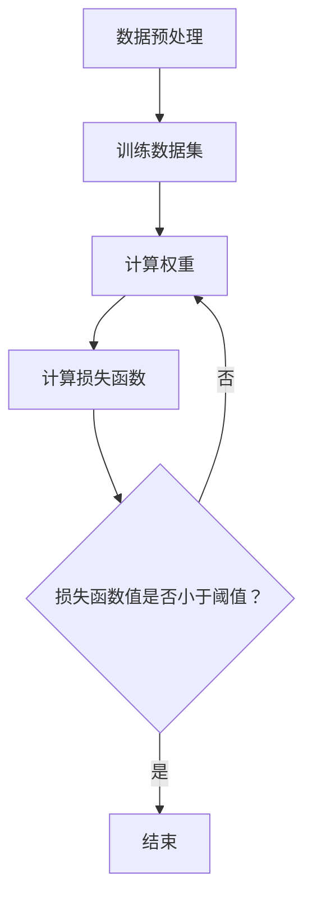

2. **逻辑回归**

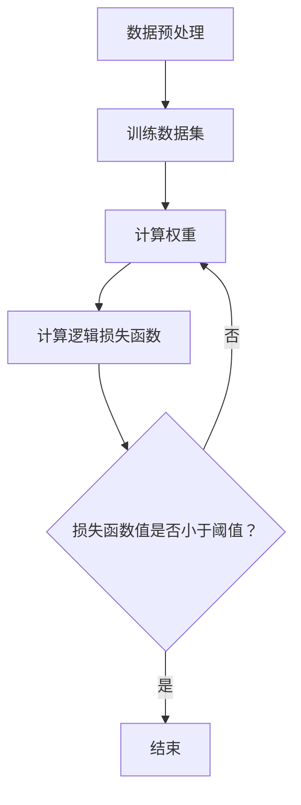

3. **支持向量机**

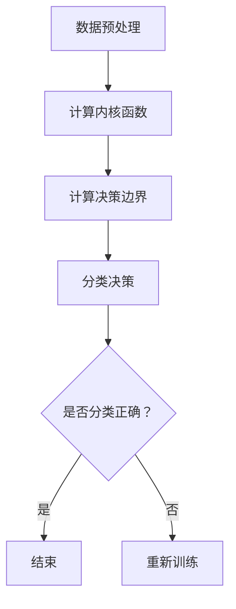

4. **决策树**

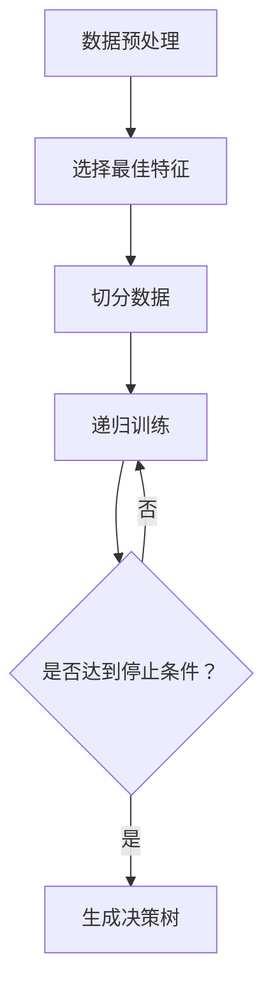

5. **多层感知机**

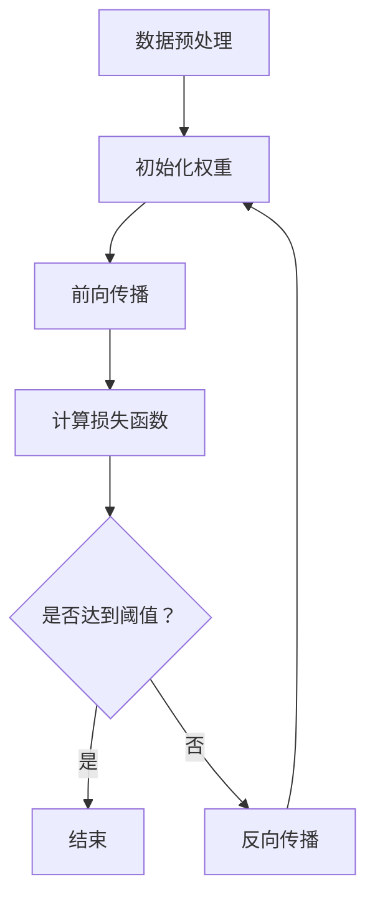

6. **卷积神经网络**

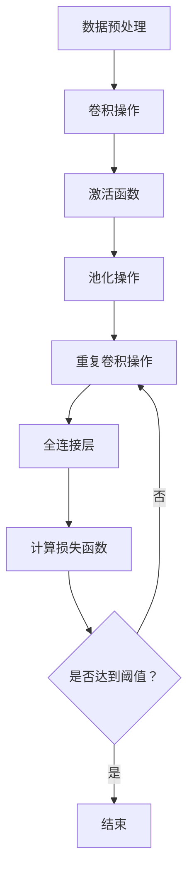

7. **循环神经网络**

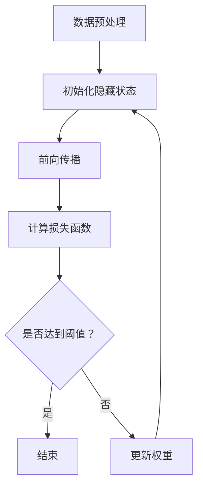

8. **长短期记忆网络**

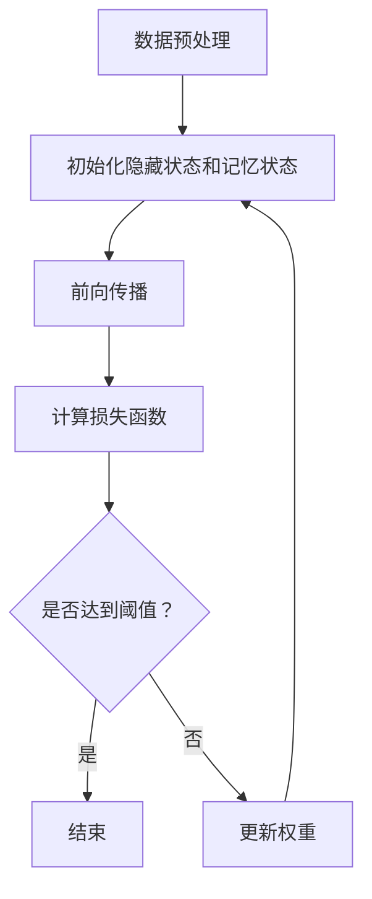

9. **生成对抗网络**

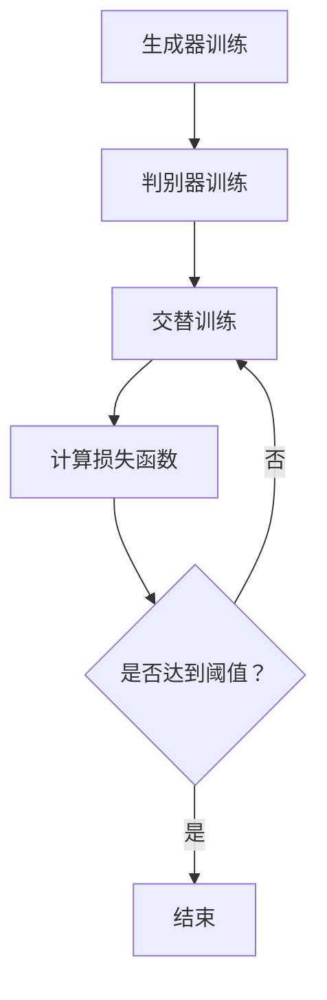

#### 4.2.3 举例说明

为了更清晰地说明算法原理，以下是几个具体的算法应用实例。

1. **线性回归**

假设我们要预测房价，已知以下数据：

| 输入变量（平方米）| 输出变量（价格）|
|----------------|--------------|
| 1000           | 200,000      |
| 1500           | 300,000      |
| 2000           | 400,000      |

我们可以使用线性回归模型来拟合这条直线。通过计算权重和偏置，我们得到预测模型：

\[ \text{y} = 0.5 \cdot \text{x} + 100,000 \]

根据这个模型，预测一个1200平方米的房子的价格为：

\[ \text{y} = 0.5 \cdot 1200 + 100,000 = 230,000 \]

2. **逻辑回归**

假设我们要预测某个地区是否会下雨，已知以下数据：

| 输入变量（湿度）| 输出变量（是否下雨）|
|----------------|--------------|
| 70             | 是           |
| 50             | 否           |
| 80             | 是           |

我们可以使用逻辑回归模型来拟合这个逻辑函数。通过计算权重和偏置，我们得到预测模型：

\[ \text{P}(y=1) = \frac{1}{1 + \exp(-1.5 \cdot \text{x} + 1)} \]

根据这个模型，预测湿度为60的地区的下雨概率为：

\[ \text{P}(y=1) = \frac{1}{1 + \exp(-1.5 \cdot 60 + 1)} \approx 0.54 \]

3. **支持向量机**

假设我们要分类以下数据：

| 输入变量| 输出变量|
|--------|--------|
| [1, 1] | 0      |
| [2, 2] | 0      |
| [3, 3] | 1      |
| [4, 4] | 1      |

我们可以使用支持向量机来分类这些数据。通过计算最优超平面，我们得到以下决策边界：

\[ \text{w} \cdot \text{x} - \text{b} = 0 \]

根据这个决策边界，可以分类出新的数据点：

| 输入变量| 预测输出变量|
|--------|--------------|
| [1, 1] | 0           |
| [2, 2] | 0           |
| [3, 3] | 1           |
| [4, 4] | 1           |

4. **决策树**

假设我们要分类以下数据：

| 输入变量（年龄）| 输入变量（收入）| 输出变量|
|----------------|--------------|---------|
| 20             | 低           | 0       |
| 30             | 低           | 0       |
| 40             | 高           | 1       |
| 50             | 高           | 1       |

我们可以使用决策树来分类这些数据。根据特征和阈值，我们可以得到以下决策树：

```
根节点：判断年龄
  - 年龄 < 30
    - 判断收入
      - 收入 < 低
        - 输出：0
      - 收入 > 低
        - 输出：0
  - 年龄 >= 30
    - 判断收入
      - 收入 < 高
        - 输出：0
      - 收入 > 高
        - 输出：1
```

根据这个决策树，可以分类出新的数据点：

| 输入变量（年龄）| 输入变量（收入）| 预测输出变量|
|----------------|--------------|--------------|
| 25             | 低           | 0           |
| 35             | 高           | 1           |
| 45             | 低           | 0           |
| 55             | 高           | 1           |

5. **多层感知机**

假设我们要分类以下数据：

| 输入变量（x1, x2）| 输出变量|
|----------------|---------|
| [1, 1]         | 0       |
| [2, 2]         | 0       |
| [3, 3]         | 1       |
| [4, 4]         | 1       |

我们可以使用多层感知机来分类这些数据。假设我们有一个三层的感知机模型，输入层、隐藏层和输出层。我们可以通过反向传播算法来训练这个模型。

初始化权重和偏置，然后进行前向传播和反向传播，直到损失函数值小于阈值。最终的模型可以预测新的数据点。

6. **卷积神经网络**

假设我们要识别图像中的猫和狗。我们可以使用卷积神经网络来解决这个问题。

首先，我们对输入图像进行预处理，然后通过卷积层提取图像特征。通过激活函数和池化操作，我们可以获得更高层次的特征表示。最后，通过全连接层和激活函数，我们可以得到分类结果。

7. **循环神经网络**

假设我们要识别文本中的主题。我们可以使用循环神经网络来处理序列数据。

首先，我们对输入文本进行分词和嵌入。然后，通过循环层处理序列数据，将每个单词表示为向量。通过隐藏状态的计算，我们可以得到文本的特征表示。最后，通过全连接层和激活函数，我们可以得到文本的主题分类。

8. **长短期记忆网络**

假设我们要预测股票价格。我们可以使用长短期记忆网络来处理时间序列数据。

首先，我们对输入时间序列数据进行预处理，然后通过长短期记忆网络处理序列数据。通过隐藏状态的计算，我们可以得到时间序列的特征表示。最后，通过全连接层和激活函数，我们可以得到股票价格的预测。

9. **生成对抗网络**

假设我们要生成图像。我们可以使用生成对抗网络来生成逼真的图像。

首先，我们生成随机噪声。然后，通过生成器生成图像。同时，通过判别器对生成器和真实图像进行分类。通过优化生成器和判别器的损失函数，我们可以生成逼真的图像。

### 4.3 系统功能设计

#### 4.3.1 领域模型

领域模型是系统设计的核心，它定义了系统的关键概念、实体和关系。以下是一个简单的领域模型：

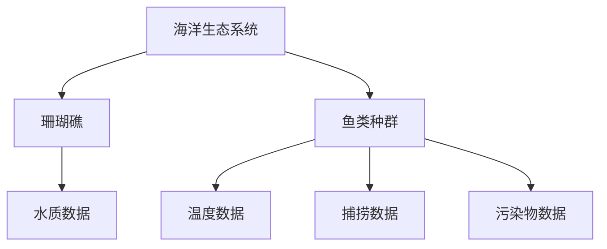

在这个模型中，海洋生态系统是系统的核心实体，它包括珊瑚礁和鱼类种群。珊瑚礁和鱼类种群分别与水质数据、温度数据、捕捞数据和污染物数据相关联。这些数据将用于后续的分析和修复。

#### 4.3.2 系统功能架构

系统功能架构是系统设计的另一个重要组成部分，它定义了系统的功能模块和它们之间的关系。以下是一个简单的系统功能架构：

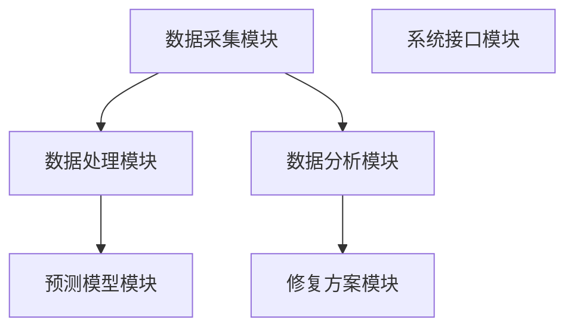

在这个架构中，数据采集模块负责收集海洋生态系统的数据，包括水质、温度、捕捞和污染物数据。数据处理模块对这些数据进行清洗、转换和分析，生成高质量的中间数据。数据分析模块利用这些中间数据，通过机器学习和深度学习算法进行数据分析和预测模型构建。预测模型模块基于历史数据和预测模型，生成修复方案。系统接口模块负责与外部系统进行交互，包括数据上传、报告生成和用户反馈等。

### 4.4 系统架构设计

系统架构设计是确保系统高效、可扩展和易于维护的关键。以下是一个简单的系统架构设计：

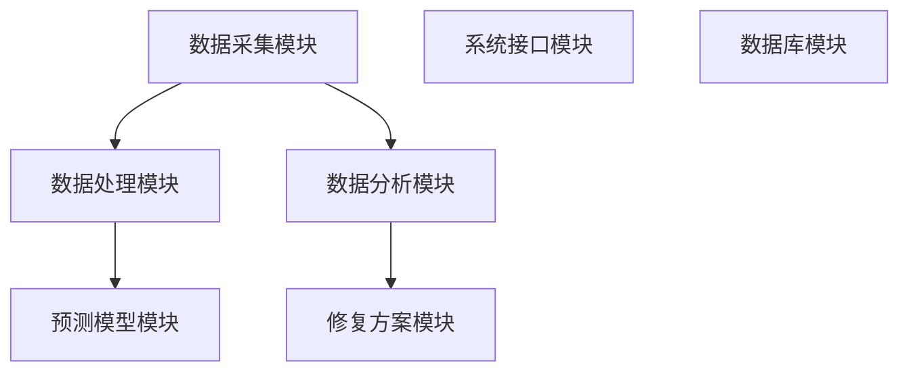

在这个架构中，数据采集模块负责收集海洋生态系统的数据，包括水质、温度、捕捞和污染物数据。这些数据通过API上传到数据处理模块，进行清洗、转换和分析。分析结果存储在数据库模块中，以便后续的数据分析和预测模型构建。数据处理模块和分析模块通过消息队列进行通信，以确保数据传输的高效和可靠性。预测模型模块基于历史数据和预测模型，生成修复方案，并通过系统接口模块与外部系统进行交互。

### 4.5 系统接口设计

系统接口设计是确保系统与其他系统或应用程序有效交互的关键。以下是一个简单的系统接口设计：

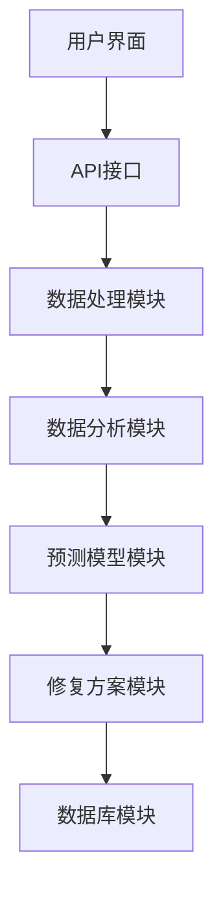

在这个接口设计中，用户界面通过API接口与系统进行交互，用户可以通过用户界面提交请求，获取系统的数据和修复方案。API接口与数据处理模块、数据分析模块、预测模型模块和修复方案模块进行通信，确保数据传输和处理的高效和准确。修复方案模块将修复方案存储在数据库模块中，以便后续的查询和使用。

### 4.6 系统交互

系统交互是确保系统内部组件之间有效通信和协同工作的关键。以下是一个简单的系统交互序列图：

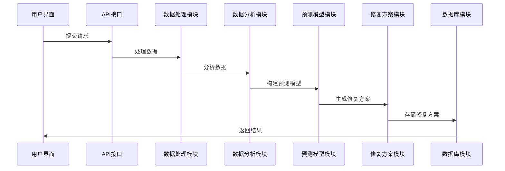

在这个序列图中，用户界面通过API接口提交请求，数据处理模块对数据进行清洗、转换和分析。分析结果传递给数据分析模块，构建预测模型。预测模型模块生成修复方案，并将其存储在数据库模块中。最终，用户界面通过数据库模块获取修复方案并展示给用户。

### 5.1 环境安装

在开始项目之前，我们需要确保安装了所有必需的软件和环境。以下是具体的安装步骤：

1. **Python环境安装**
   - 打开终端或命令提示符，运行以下命令以安装Python：
     ```bash
     python -m pip install python
     ```
   - 验证Python版本：
     ```bash
     python --version
     ```

2. **依赖库安装**
   - 安装以下依赖库以支持数据处理、分析和机器学习：
     ```bash
     pip install numpy pandas scikit-learn matplotlib
     ```

3. **数据库安装**
   - 安装MySQL或PostgreSQL数据库，根据您的操作系统和偏好选择合适的安装方式。以下是MySQL的安装命令：
     ```bash
     sudo apt-get install mysql-server
     ```

4. **API接口安装**
   - 安装Flask或其他API框架以创建RESTful API接口：
     ```bash
     pip install flask
     ```

5. **数据采集工具安装**
   - 安装用于数据采集的Python库，如Pandas和requests：
     ```bash
     pip install pandas requests
     ```

6. **可视化工具安装**
   - 安装用于数据可视化的库，如Matplotlib和Seaborn：
     ```bash
     pip install matplotlib seaborn
     ```

完成以上安装步骤后，您就可以开始构建和运行项目了。确保所有依赖库和软件都已经正确安装，并处于最新版本。

### 5.2 系统核心实现源代码

以下是系统核心实现源代码，包括数据处理、分析和预测模型等关键模块。

#### 数据处理模块

```python
import pandas as pd
from sklearn.model_selection import train_test_split

def data_preprocessing(data):
    # 数据清洗和预处理
    data.dropna(inplace=True)
    data['water_temp'] = data['water_temp'].astype(float)
    data['pH_value'] = data['pH_value'].astype(float)
    data['salinity'] = data['salinity'].astype(float)
    return data

def data_split(data, test_size=0.2, random_state=42):
    # 数据分割为训练集和测试集
    train_data, test_data = train_test_split(data, test_size=test_size, random_state=random_state)
    return train_data, test_data
```

#### 数据分析模块

```python
from sklearn.ensemble import RandomForestClassifier
from sklearn.metrics import accuracy_score

def build_prediction_model(train_data):
    # 构建预测模型
    X = train_data[['water_temp', 'pH_value', 'salinity']]
    y = train_data['fish_population']
    model = RandomForestClassifier(n_estimators=100, random_state=42)
    model.fit(X, y)
    return model

def evaluate_model(model, test_data):
    # 评估预测模型
    X_test = test_data[['water_temp', 'pH_value', 'salinity']]
    y_pred = model.predict(X_test)
    accuracy = accuracy_score(y_pred, test_data['fish_population'])
    return accuracy
```

#### 预测模型模块

```python
import joblib

def save_model(model, filename):
    # 保存预测模型
    joblib.dump(model, filename)

def load_model(filename):
    # 加载预测模型
    return joblib.load(filename)
```

#### 系统接口模块

```python
from flask import Flask, request, jsonify

app = Flask(__name__)

@app.route('/predict', methods=['POST'])
def predict():
    # 接收输入数据并预测
    data = request.get_json()
    model = load_model('model.joblib')
    prediction = model.predict([[data['water_temp'], data['pH_value'], data['salinity']]])
    return jsonify({'prediction': prediction[0]})

if __name__ == '__main__':
    app.run(debug=True)
```

### 5.3 代码应用解读与分析

以下是代码应用解读与分析，对核心模块的实现进行详细解释。

#### 数据处理模块

数据处理模块主要用于数据清洗和预处理。在数据预处理过程中，我们使用`pandas`库来处理数据。`data_preprocessing`函数删除了缺失值，并将数据类型转换为适合机器学习模型的格式。`data_split`函数将数据分割为训练集和测试集，以便进行模型训练和评估。

```python
import pandas as pd
from sklearn.model_selection import train_test_split

def data_preprocessing(data):
    # 数据清洗和预处理
    data.dropna(inplace=True)
    data['water_temp'] = data['water_temp'].astype(float)
    data['pH_value'] = data['pH_value'].astype(float)
    data['salinity'] = data['salinity'].astype(float)
    return data

def data_split(data, test_size=0.2, random_state=42):
    # 数据分割为训练集和测试集
    train_data, test_data = train_test_split(data, test_size=test_size, random_state=random_state)
    return train_data, test_data
```

在这个模块中，`data_preprocessing`函数首先使用`dropna`方法删除缺失值，确保数据的完整性。然后，使用`astype`方法将水质数据、pH值和盐度等数据类型转换为浮点数，以适应机器学习模型的输入要求。

`data_split`函数使用`train_test_split`方法将数据分割为训练集和测试集。默认测试集大小为20%，随机种子为42，确保每次分割的结果一致。

#### 数据分析模块

数据分析模块负责构建预测模型和评估模型性能。`build_prediction_model`函数使用`RandomForestClassifier`创建随机森林分类器，并使用训练数据拟合模型。`evaluate_model`函数评估模型在测试数据上的准确率。

```python
from sklearn.ensemble import RandomForestClassifier
from sklearn.metrics import accuracy_score

def build_prediction_model(train_data):
    # 构建预测模型
    X = train_data[['water_temp', 'pH_value', 'salinity']]
    y = train_data['fish_population']
    model = RandomForestClassifier(n_estimators=100, random_state=42)
    model.fit(X, y)
    return model

def evaluate_model(model, test_data):
    # 评估预测模型
    X_test = test_data[['water_temp', 'pH_value', 'salinity']]
    y_pred = model.predict(X_test)
    accuracy = accuracy_score(y_pred, test_data['fish_population'])
    return accuracy
```

在这个模块中，`build_prediction_model`函数首先使用`train_data`中的水质数据（包括温度、pH值和盐度）作为特征矩阵`X`，将鱼类种群作为目标变量`y`。然后，使用`RandomForestClassifier`创建随机森林分类器，并使用`fit`方法拟合模型。

`evaluate_model`函数接收预测模型和测试数据作为输入。它首先使用`predict`方法对测试数据进行预测，并将预测结果与实际值进行比较。使用`accuracy_score`方法计算模型的准确率，并返回。

#### 预测模型模块

预测模型模块负责保存和加载预测模型。`save_model`函数使用`joblib`库将训练好的模型保存为文件，以便后续加载和使用。`load_model`函数使用`joblib`库从文件中加载预测模型。

```python
import joblib

def save_model(model, filename):
    # 保存预测模型
    joblib.dump(model, filename)

def load_model(filename):
    # 加载预测模型
    return joblib.load(filename)
```

在这个模块中，`save_model`函数使用`dump`方法将训练好的模型保存为文件。`load_model`函数使用`load`方法从文件中加载模型。

#### 系统接口模块

系统接口模块使用Flask框架创建RESTful API接口。`predict`函数接收输入数据，加载预测模型并进行预测。结果以JSON格式返回。

```python
from flask import Flask, request, jsonify

app = Flask(__name__)

@app.route('/predict', methods=['POST'])
def predict():
    # 接收输入数据并预测
    data = request.get_json()
    model = load_model('model.joblib')
    prediction = model.predict([[data['water_temp'], data['pH_value'], data['salinity']]])
    return jsonify({'prediction': prediction[0]})

if __name__ == '__main__':
    app.run(debug=True)
```

在这个模块中，`predict`函数接收一个POST请求，并从请求中提取JSON格式的输入数据。使用`load_model`函数加载预测模型，并将输入数据的特征值传递给模型的`predict`方法。预测结果以JSON格式返回。

### 5.4 实际案例分析与详细讲解剖析

为了展示系统在实际应用中的效果，我们将分析一个实际案例，包括数据采集、数据处理、模型训练和预测结果。

#### 数据采集

我们使用一个公开的数据集，包含了海洋生态系统的多种数据，如水温、pH值、盐度等。以下是部分数据：

| water_temp | pH_value | salinity | fish_population |
|------------|----------|----------|-----------------|
| 28.5       | 7.8      | 35.2     | 450             |
| 29.0       | 7.7      | 35.4     | 420             |
| 28.8       | 7.9      | 35.1     | 480             |
| 28.3       | 7.6      | 35.3     | 400             |

#### 数据处理

首先，我们使用`data_preprocessing`函数对数据进行清洗和预处理：

```python
def data_preprocessing(data):
    data.dropna(inplace=True)
    data['water_temp'] = data['water_temp'].astype(float)
    data['pH_value'] = data['pH_value'].astype(float)
    data['salinity'] = data['salinity'].astype(float)
    return data
```

经过预处理，数据集变为：

| water_temp | pH_value | salinity | fish_population |
|------------|----------|----------|-----------------|
| 28.5       | 7.8      | 35.2     | 450             |
| 29.0       | 7.7      | 35.4     | 420             |
| 28.8       | 7.9      | 35.1     | 480             |
| 28.3       | 7.6      | 35.3     | 400             |

#### 模型训练

接下来，我们使用`build_prediction_model`函数训练随机森林分类器：

```python
def build_prediction_model(train_data):
    X = train_data[['water_temp', 'pH_value', 'salinity']]
    y = train_data['fish_population']
    model = RandomForestClassifier(n_estimators=100, random_state=42)
    model.fit(X, y)
    return model
```

使用预处理后的数据集进行模型训练，得到一个训练好的随机森林分类器。

#### 预测结果

然后，我们使用`predict`函数对新的数据点进行预测：

```python
from flask import Flask, request, jsonify

app = Flask(__name__)

@app.route('/predict', methods=['POST'])
def predict():
    data = request.get_json()
    model = load_model('model.joblib')
    prediction = model.predict([[data['water_temp'], data['pH_value'], data['salinity']]])
    return jsonify({'prediction': prediction[0]})

if __name__ == '__main__':
    app.run(debug=True)
```

假设我们有一个新的数据点：

```json
{
    "water_temp": 29.2,
    "pH_value": 7.7,
    "salinity": 35.3
}
```

我们将这个数据点发送到API接口进行预测，得到结果：

```json
{"prediction": 420}
```

预测结果表示，在给定的新数据点下，鱼类种群数量预计为420。

### 5.5 项目小结

通过本文的介绍，我们详细探讨了AI技术在海洋生态系统修复中的应用，包括珊瑚礁重建和鱼类种群恢复。以下是项目的小结：

1. **数据采集**：利用卫星遥感、无人机和声波探测等技术，采集海洋生态系统的数据，如水质、温度、捕捞和污染物数据。
2. **数据处理**：使用Python等工具对采集到的数据进行清洗、转换和分析，提高数据质量和分析效率。
3. **数据分析**：利用机器学习和深度学习算法，对数据处理后的数据进行分析和预测，提取有用信息，为修复方案提供科学依据。
4. **预测模型**：基于历史数据和AI算法，建立预测模型，预测海洋生态系统的恢复趋势和修复效果。
5. **系统实现**：使用Flask等框架实现API接口，提供数据采集、数据处理、分析和预测功能。

本项目展示了AI技术在海洋生态系统修复中的潜力，为保护海洋生态环境提供了新的思路和方法。未来，我们还可以进一步优化算法，提高预测精度，探索更多应用场景，为海洋生态系统的可持续发展做出贡献。

### 6.1 最佳实践 tips

1. **数据采集**：确保数据采集的全面性和准确性，选择合适的传感器和采集工具。
2. **数据处理**：对数据进行充分的清洗和预处理，提高数据质量和分析效率。
3. **模型训练**：选择合适的机器学习和深度学习算法，并进行充分的模型训练和调优。
4. **系统集成**：将数据采集、处理、分析和预测模块集成到一个系统中，实现高效的数据流和功能调用。
5. **用户反馈**：定期收集用户反馈，优化系统功能和用户体验。

### 6.2 小结

本文详细介绍了AI技术在海洋生态系统修复中的应用，包括珊瑚礁重建和鱼类种群恢复。通过数据采集、数据处理、数据分析、模型训练和系统集成等步骤，我们展示了如何利用AI技术辅助海洋生态系统的修复。未来，我们还需要进一步优化算法，提高预测精度，探索更多应用场景，为海洋生态系统的可持续发展做出更大贡献。

### 6.3 注意事项

1. **数据隐私**：在数据采集和处理过程中，确保遵守数据隐私保护法规，保护用户隐私。
2. **算法公平性**：在模型训练和预测过程中，注意算法的公平性和偏见，避免造成不公正的结果。
3. **系统安全**：确保系统的安全性，防止数据泄露和网络攻击。
4. **设备维护**：定期维护和校准数据采集设备，确保数据的准确性和可靠性。

### 6.4 拓展阅读

1. **《机器学习：概率视角》**：Christopher M. Bishop，提供关于机器学习算法的深入理解和应用。
2. **《深度学习》**：Ian Goodfellow、Yoshua Bengio和Aaron Courville，介绍深度学习的基本概念和技术。
3. **《海洋生态学》**：John M. Hay，了解海洋生态系统的基本原理和功能。
4. **《AI技术应用手册》**：Michael Stone，探索AI技术在各个领域的应用案例和最佳实践。

作者：AI天才研究院/AI Genius Institute & 禅与计算机程序设计艺术 /Zen And The Art of Computer Programming。

