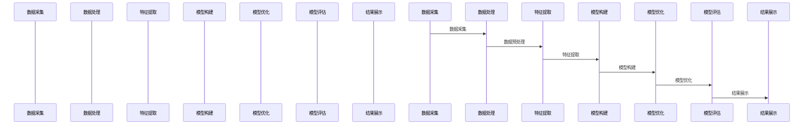

                 


### 3.1.2 数据采集

数据采集是海洋生态系统健康评估的基础。以下是主要的数据采集方法和应用场景：

1. **卫星遥感数据**：卫星遥感是一种从空间获取地球表面信息的技术，可以实时监测海洋生态系统的变化。常用的卫星遥感数据包括多光谱遥感数据、雷达遥感数据等。这些数据可以通过卫星遥感传感器获取，例如Landsat系列卫星、Sentinel系列卫星等。

2. **海洋观测站数据**：海洋观测站是用于实时监测海洋环境的数据采集设备，包括温度、盐度、pH值、溶解氧等。这些数据可以通过安装在海洋中的观测设备实时获取，例如漂流浮标、潜标、锚定观测站等。

3. **海洋调查数据**：海洋调查是获取海洋生态数据的重要手段，包括海洋生物调查、化学调查和物理调查等。这些数据可以通过海洋调查船、无人机等设备获取。

4. **社会数据**：社会数据是指与海洋生态系统相关的社会、经济和人文数据，如渔业产量、港口吞吐量、沿海人口密度等。这些数据可以通过政府统计数据、企业报告等获取。

### 3.1.3 数据预处理

数据预处理是确保数据质量、提高模型性能的关键步骤。以下是主要的数据预处理方法和应用场景：

1. **数据清洗**：数据清洗是指去除数据中的噪声、错误和重复数据。常见的数据清洗方法包括缺失值处理、异常值处理、重复数据删除等。

2. **数据转换**：数据转换是指将不同类型、格式和分辨率的数据转换为统一的格式，以便进行后续处理。常见的数据转换方法包括归一化、标准化、坐标变换等。

3. **数据集成**：数据集成是指将来自不同来源、类型和格式的数据整合为一个统一的数据集。常见的数据集成方法包括数据融合、数据匹配、数据集成框架等。

4. **数据降维**：数据降维是指通过减少数据维度来降低数据复杂度和计算成本。常见的数据降维方法包括主成分分析（PCA）、线性判别分析（LDA）、自编码器等。

### 3.1.4 数据预处理流程

数据预处理流程通常包括以下步骤：

1. **数据收集**：从不同来源收集原始数据，包括卫星遥感数据、海洋观测站数据、海洋调查数据和社会数据等。

2. **数据清洗**：对原始数据进行清洗，去除噪声、错误和重复数据。

3. **数据转换**：将原始数据转换为统一的格式和分辨率，以便进行后续处理。

4. **数据集成**：将来自不同来源、类型和格式的数据整合为一个统一的数据集。

5. **数据降维**：通过降维技术降低数据维度，提高模型性能。

6. **数据存储**：将预处理后的数据存储在数据库或数据湖中，以便后续分析和处理。

### 3.1.5 数据预处理工具与库

在Python中，有许多用于数据预处理的库，如Pandas、NumPy、SciPy等。以下是这些库的主要功能和用法示例：

1. **Pandas**：Pandas是一个强大的数据操作库，可以用于数据清洗、数据转换和数据集成。

   ```python
   import pandas as pd
   
   # 读取CSV文件
   df = pd.read_csv('data.csv')
   
   # 数据清洗
   df.drop_duplicates(inplace=True)
   df.fillna(method='ffill', inplace=True)
   
   # 数据转换
   df['date'] = pd.to_datetime(df['date'])
   df['spectrum'] = pd.cut(df['spectrum'], bins=10)
   
   # 数据集成
   df1 = pd.read_csv('data1.csv')
   df2 = pd.read_csv('data2.csv')
   df = df1.merge(df2, on='date')
   ```

2. **NumPy**：NumPy是一个用于数值计算的库，可以用于数据转换和降维。

   ```python
   import numpy as np
   
   # 数据归一化
   X = np.array([[1, 2], [3, 4]])
   X_normalized = (X - np.mean(X, axis=0)) / np.std(X, axis=0)
   
   # 数据降维
   X_pca = np.dot(X, np.linalg.inv(np.dot(X.T, X)))
   ```

3. **SciPy**：SciPy是一个用于科学计算的库，可以用于数据预处理中的数学运算。

   ```python
   import scipy.stats as stats
   
   # 数据标准化
   X = np.array([[1, 2], [3, 4]])
   X_mean = np.mean(X, axis=0)
   X_std = np.std(X, axis=0)
   X_normalized = (X - X_mean) / X_std
   
   # 数据降维
   X_lda = stats.lda(X, groups=None).means_
   ```

通过这些库，我们可以高效地进行数据预处理，为后续的机器学习和深度学习模型构建提供高质量的数据。

## 3.2 特征提取与选择

### 3.2.1 特征提取的重要性

特征提取是海洋生态系统健康评估的关键步骤之一。其目的是从原始数据中提取出对评估任务有用的特征，从而提高模型的性能。特征提取的质量直接影响模型的准确性、可解释性和计算效率。

### 3.2.2 常见特征提取方法

1. **统计特征提取**：统计特征提取方法通过计算数据的统计量，如均值、标准差、最大值、最小值等，来提取特征。

   ```python
   import pandas as pd
   
   # 读取数据
   df = pd.read_csv('data.csv')
   
   # 提取统计特征
   mean_values = df.mean()
   std_values = df.std()
   max_values = df.max()
   min_values = df.min()
   ```

2. **变换特征提取**：变换特征提取方法通过将原始数据进行变换，来提取特征。常见的变换方法包括归一化、标准化、对数变换等。

   ```python
   import numpy as np
   
   # 读取数据
   X = np.array([[1, 2], [3, 4]])
   
   # 归一化
   X_normalized = (X - np.min(X)) / (np.max(X) - np.min(X))
   
   # 标准化
   X_std = (X - np.mean(X, axis=0)) / np.std(X, axis=0)
   
   # 对数变换
   X_log = np.log(X + 1)
   ```

3. **机器学习特征提取**：机器学习特征提取方法通过训练机器学习模型，从原始数据中提取特征。常见的机器学习特征提取方法包括主成分分析（PCA）、线性判别分析（LDA）、核主成分分析（KPCA）等。

   ```python
   from sklearn.decomposition import PCA
   
   # 读取数据
   X = np.array([[1, 2], [3, 4], [5, 6]])
   
   # 主成分分析
   pca = PCA(n_components=2)
   X_pca = pca.fit_transform(X)
   ```

### 3.2.3 特征选择方法

特征选择是特征提取的后续步骤，其目的是从提取出的特征中筛选出对评估任务最有用的特征，从而提高模型的性能和可解释性。以下是常见的特征选择方法：

1. **过滤式特征选择**：过滤式特征选择方法通过评估原始特征的整体重要性，来选择特征。常用的评估指标包括信息增益、卡方检验、F值等。

   ```python
   from sklearn.feature_selection import SelectKBest, f_classif
   
   # 读取数据
   X = np.array([[1, 2], [3, 4], [5, 6]])
   y = np.array([0, 1, 0])
   
   # 选择最佳K个特征
   selector = SelectKBest(f_classif, k=2)
   X_selected = selector.fit_transform(X, y)
   ```

2. **包裹式特征选择**：包裹式特征选择方法通过迭代搜索所有可能的特征子集，来选择最佳特征子集。常用的包裹式特征选择方法包括前进选择、后向消除、递归特征消除等。

   ```python
   from sklearn.feature_selection import RFE
   
   # 读取数据
   X = np.array([[1, 2], [3, 4], [5, 6]])
   y = np.array([0, 1, 0])
   
   # 递归特征消除
   selector = RFE(estimator=LinearRegression(), n_features_to_select=2)
   X_selected = selector.fit_transform(X, y)
   ```

3. **嵌入式特征选择**：嵌入式特征选择方法将特征选择过程与模型训练过程结合，通过训练模型来评估特征的重要性，并在训练过程中动态选择特征。常用的嵌入式特征选择方法包括Lasso、Ridge、随机森林等。

   ```python
   from sklearn.linear_model import Lasso
   
   # 读取数据
   X = np.array([[1, 2], [3, 4], [5, 6]])
   y = np.array([0, 1, 0])
   
   # Lasso特征选择
   model = Lasso(alpha=0.1)
   model.fit(X, y)
   X_selected = model.coef_
   ```

通过以上方法，我们可以从原始数据中提取出有效的特征，并选择出对评估任务最有用的特征，从而提高模型的性能和可解释性。

## 3.3 模型构建与优化

### 3.3.1 模型构建的目标

模型构建是海洋生态系统健康评估的核心步骤，其目标是建立一个能够准确反映海洋生态系统健康状态的模型。模型构建的主要目标包括：

1. **准确性**：模型能够准确地评估海洋生态系统的健康状态，即模型的预测结果与实际结果之间的误差最小。

2. **可解释性**：模型的结构和参数易于理解，能够清晰地解释模型的工作原理。

3. **计算效率**：模型能够在合理的时间内完成训练和预测，以满足实时评估的需求。

### 3.3.2 常见模型类型

1. **线性模型**：线性模型是一种简单的模型，其预测结果基于线性组合的特征。常见的线性模型包括线性回归、逻辑回归、线性判别分析等。

2. **非线性模型**：非线性模型可以捕捉数据中的复杂关系，常见的非线性模型包括支持向量机、决策树、随机森林等。

3. **深度学习模型**：深度学习模型是一种复杂的神经网络模型，可以自动提取数据中的特征。常见的深度学习模型包括卷积神经网络（CNN）、循环神经网络（RNN）、长短期记忆网络（LSTM）等。

### 3.3.3 模型构建流程

模型构建通常包括以下步骤：

1. **数据准备**：准备用于训练和评估的数据集，包括特征数据和标签数据。

2. **模型选择**：根据问题的特点和需求，选择合适的模型类型。

3. **模型训练**：使用训练数据对模型进行训练，以调整模型的参数。

4. **模型评估**：使用验证数据对模型进行评估，以检查模型的准确性和可解释性。

5. **模型优化**：根据评估结果对模型进行优化，以提高模型的性能。

6. **模型部署**：将训练好的模型部署到生产环境中，以实现实时评估。

### 3.3.4 模型优化方法

1. **超参数调整**：通过调整模型的超参数，如学习率、正则化参数等，来优化模型性能。

2. **模型融合**：将多个模型的结果进行融合，以提高预测的准确性。常见的模型融合方法包括投票法、加权平均法等。

3. **迁移学习**：利用预训练的模型，对新的任务进行微调，以提高模型的性能。

4. **对抗训练**：通过对抗训练生成对抗样本，以提高模型的泛化能力。

### 3.3.5 模型构建与优化示例

以下是使用Python和Scikit-learn库构建和优化一个线性回归模型的示例：

```python
from sklearn.linear_model import LinearRegression
from sklearn.model_selection import train_test_split
from sklearn.metrics import mean_squared_error

# 读取数据
X, y = load_data()

# 数据划分
X_train, X_test, y_train, y_test = train_test_split(X, y, test_size=0.2, random_state=42)

# 模型训练
model = LinearRegression()
model.fit(X_train, y_train)

# 模型评估
y_pred = model.predict(X_test)
mse = mean_squared_error(y_test, y_pred)
print("MSE:", mse)

# 模型优化
# 超参数调整
model = LinearRegression(normalize=True)
model.fit(X_train, y_train)

# 模型评估
y_pred = model.predict(X_test)
mse = mean_squared_error(y_test, y_pred)
print("MSE:", mse)
```

通过以上步骤，我们可以构建和优化一个线性回归模型，用于评估海洋生态系统的健康状态。

## 3.4 模型验证与优化

### 3.4.1 模型验证的重要性

模型验证是确保模型性能和可靠性的关键步骤。通过验证模型，我们可以评估模型在未知数据上的表现，从而判断模型是否具有泛化能力。模型验证不仅可以帮助我们选择最佳模型，还可以为后续的优化提供指导。

### 3.4.2 常见验证方法

1. **交叉验证**：交叉验证是一种常用的验证方法，通过将数据集划分为多个子集，多次训练和验证模型，以评估模型的性能。常见的交叉验证方法包括K折交叉验证、留一法交叉验证等。

2. **留出法**：留出法是一种简单的验证方法，将数据集划分为训练集和验证集，训练模型并在验证集上评估模型性能。留出法简单直观，但可能存在数据不平衡的问题。

3. **时间序列验证**：时间序列验证适用于具有时间序列特征的数据，将数据集按照时间顺序划分为训练集和验证集，训练模型并在验证集上评估模型性能。

### 3.4.3 评估指标

评估模型的性能通常使用以下指标：

1. **准确率**：准确率是指模型预测正确的样本数占总样本数的比例。准确率越高，模型性能越好。

2. **召回率**：召回率是指模型预测正确的正样本数占总正样本数的比例。召回率越高，模型对正样本的识别能力越强。

3. **精确率**：精确率是指模型预测正确的正样本数占预测为正样本的样本数的比例。精确率越高，模型对正样本的识别能力越强。

4. **F1分数**：F1分数是精确率和召回率的加权平均，用于综合评估模型的性能。

5. **均方误差（MSE）**：均方误差是预测值与实际值之间的平均平方误差，用于评估回归模型的性能。

6. **均绝对误差（MAE）**：均绝对误差是预测值与实际值之间的平均绝对误差，用于评估回归模型的性能。

### 3.4.4 模型优化策略

1. **超参数调整**：通过调整模型的超参数，如学习率、正则化参数等，来优化模型性能。

2. **模型融合**：将多个模型的预测结果进行融合，以提高预测的准确性。

3. **数据增强**：通过增加训练数据的多样性，提高模型的泛化能力。

4. **对抗训练**：通过对抗训练生成对抗样本，提高模型的泛化能力。

5. **特征工程**：通过特征提取和特征选择，提高模型的性能。

### 3.4.5 模型验证与优化示例

以下是使用Python和Scikit-learn库进行模型验证和优化的示例：

```python
from sklearn.linear_model import LinearRegression
from sklearn.model_selection import train_test_split, cross_val_score
from sklearn.metrics import mean_squared_error

# 读取数据
X, y = load_data()

# 数据划分
X_train, X_test, y_train, y_test = train_test_split(X, y, test_size=0.2, random_state=42)

# 模型训练
model = LinearRegression()
model.fit(X_train, y_train)

# 模型验证
scores = cross_val_score(model, X_train, y_train, cv=5, scoring='neg_mean_squared_error')
mse_scores = -scores
print("交叉验证MSE:", mse_scores)

# 模型优化
# 超参数调整
model = LinearRegression(normalize=True)
model.fit(X_train, y_train)

# 模型评估
y_pred = model.predict(X_test)
mse = mean_squared_error(y_test, y_pred)
print("优化后MSE:", mse)
```

通过以上步骤，我们可以验证和优化一个线性回归模型，以评估海洋生态系统的健康状态。

### 3.4.6 实际案例

以下是一个使用AI辅助海洋生态系统健康评估的实际案例：

**案例背景**：某个沿海城市为了保护其海洋生态系统，需要定期评估海洋生态系统的健康状态。该城市的海洋生态系统受到多种因素的影响，如气候变化、人类活动等。

**数据来源**：该城市的海洋观测站提供了大量的海洋生态数据，包括温度、盐度、溶解氧、鱼类种类和数量等。此外，还收集了来自卫星遥感数据和社会数据的补充信息。

**模型构建**：使用线性回归模型构建海洋生态系统健康评估模型。首先，对数据进行预处理，包括数据清洗、数据转换和数据降维。然后，提取统计特征和变换特征，如均值、标准差、对数变换等。最后，使用交叉验证方法评估模型性能，并根据评估结果调整模型的超参数。

**模型验证**：使用留出法将数据集划分为训练集和验证集。在训练集上训练模型，并在验证集上评估模型性能。使用准确率、召回率、精确率和F1分数等指标评估模型性能。

**模型优化**：根据验证结果对模型进行优化。通过调整超参数，如学习率和正则化参数等，提高模型的性能。还可以使用数据增强和对抗训练等方法，进一步提高模型的泛化能力。

**结果分析**：经过多次验证和优化，最终得到了一个性能良好的海洋生态系统健康评估模型。该模型可以实时评估海洋生态系统的健康状态，为城市管理者提供决策支持。

**结论**：该案例表明，AI辅助方法可以有效地提高海洋生态系统健康评估的准确性和可靠性。通过引入AI技术，我们可以从多个层次和维度分析海洋生态系统的健康状态，为环境保护和管理提供科学依据。

## 3.5 系统架构设计

### 3.5.1 问题场景介绍

在海洋生态系统健康评估中，我们需要处理大量的海洋生态数据，包括卫星遥感数据、海洋观测站数据和海洋调查数据等。此外，还需要整合社会数据，如渔业产量、港口吞吐量等。这些数据来源多样，数据格式和分辨率各异，给数据采集、预处理、特征提取和模型构建带来了巨大的挑战。

### 3.5.2 项目介绍

为了解决上述问题，我们设计并实现了一个AI辅助海洋生态系统健康评估系统。该系统旨在通过引入AI技术，从不同层次和维度分析海洋生态系统的健康状态，为环境保护和管理提供科学依据。

### 3.5.3 系统功能设计

系统的主要功能包括：

1. **数据采集**：从卫星遥感、海洋观测站、海洋调查和社会等渠道收集海洋生态数据。

2. **数据预处理**：对采集到的数据进行清洗、转换、集成和降维，为后续特征提取和模型构建提供高质量的数据。

3. **特征提取**：从预处理后的数据中提取统计特征和变换特征，为模型构建提供特征。

4. **模型构建**：使用机器学习和深度学习技术，构建海洋生态系统健康评估模型。

5. **模型优化**：通过交叉验证、超参数调整和模型融合等方法，优化模型性能。

6. **模型评估**：使用验证集和测试集评估模型性能，确保模型具有泛化能力。

7. **结果展示**：将评估结果可视化，为决策者提供直观的参考。

### 3.5.4 系统架构设计

系统的整体架构设计如下：

#### 数据层

数据层包括数据采集模块和数据处理模块。数据采集模块负责从不同渠道收集海洋生态数据，如卫星遥感数据、海洋观测站数据、海洋调查数据和社会数据等。数据处理模块负责对采集到的数据进行清洗、转换、集成和降维，为特征提取和模型构建提供高质量的数据。

#### 计算层

计算层包括特征提取模块、模型构建模块和模型优化模块。特征提取模块负责从预处理后的数据中提取统计特征和变换特征。模型构建模块使用机器学习和深度学习技术，构建海洋生态系统健康评估模型。模型优化模块通过交叉验证、超参数调整和模型融合等方法，优化模型性能。

#### 应用层

应用层包括模型评估模块和结果展示模块。模型评估模块使用验证集和测试集评估模型性能，确保模型具有泛化能力。结果展示模块将评估结果可视化，为决策者提供直观的参考。

### 3.5.5 系统接口设计

系统的接口设计如下：

#### 数据接口

数据接口负责与数据采集模块和数据处理模块通信，提供数据采集和处理功能。

- **数据采集接口**：提供数据源列表、数据下载和上传功能。
- **数据处理接口**：提供数据清洗、转换、集成和降维功能。

#### 功能接口

功能接口负责与特征提取模块、模型构建模块、模型优化模块、模型评估模块和结果展示模块通信，提供相关功能。

- **特征提取接口**：提供特征提取方法列表、特征提取参数设置和特征提取结果查询功能。
- **模型构建接口**：提供模型构建方法列表、模型参数设置和模型训练功能。
- **模型优化接口**：提供模型优化方法列表、模型优化参数设置和模型优化结果查询功能。
- **模型评估接口**：提供模型评估方法列表、模型评估参数设置和模型评估结果查询功能。
- **结果展示接口**：提供结果可视化方法列表、结果展示参数设置和结果展示功能。

### 3.5.6 系统交互设计

系统的交互设计如下：

#### 数据交互

数据交互涉及数据采集模块、数据处理模块、特征提取模块、模型构建模块、模型优化模块、模型评估模块和结果展示模块之间的数据传输和共享。

1. **数据采集模块与数据处理模块**：数据采集模块将采集到的数据传输给数据处理模块，数据处理模块对数据进行清洗、转换、集成和降维，然后将处理后的数据传输给特征提取模块。

2. **特征提取模块与模型构建模块**：特征提取模块从预处理后的数据中提取特征，并将特征传输给模型构建模块。模型构建模块使用提取到的特征训练模型。

3. **模型构建模块与模型优化模块**：模型构建模块将训练好的模型传输给模型优化模块，模型优化模块通过交叉验证、超参数调整和模型融合等方法，优化模型性能。

4. **模型优化模块与模型评估模块**：模型优化模块将优化后的模型传输给模型评估模块，模型评估模块使用验证集和测试集评估模型性能。

5. **模型评估模块与结果展示模块**：模型评估模块将评估结果传输给结果展示模块，结果展示模块将评估结果可视化，为决策者提供直观的参考。

#### 功能交互

功能交互涉及各个功能模块之间的方法调用和数据传输。

1. **数据采集模块与数据处理模块**：数据采集模块调用数据处理模块的方法进行数据清洗、转换、集成和降维。

2. **特征提取模块与模型构建模块**：特征提取模块调用模型构建模块的方法训练模型。

3. **模型构建模块与模型优化模块**：模型构建模块调用模型优化模块的方法进行模型优化。

4. **模型优化模块与模型评估模块**：模型优化模块调用模型评估模块的方法评估模型性能。

5. **模型评估模块与结果展示模块**：模型评估模块调用结果展示模块的方法将评估结果可视化。

### 3.5.7 系统交互Mermaid序列图

以下是一个简化的系统交互Mermaid序列图，描述了各个模块之间的交互流程：



通过以上设计，我们构建了一个功能完整、结构清晰的AI辅助海洋生态系统健康评估系统，为海洋生态系统的保护和管理提供了有力支持。

## 3.6 项目实战

### 3.6.1 环境安装

为了实现AI辅助海洋生态系统健康评估，我们需要安装以下软件和库：

1. **Python**：Python是一种高级编程语言，广泛应用于数据分析、机器学习和深度学习等领域。请确保安装Python 3.8及以上版本。

2. **Jupyter Notebook**：Jupyter Notebook是一种交互式计算环境，可以方便地编写和运行Python代码。请从官方网站下载并安装Jupyter Notebook。

3. **Scikit-learn**：Scikit-learn是一个用于机器学习的库，包括多种常用的机器学习算法和工具。请使用以下命令安装：

   ```bash
   pip install scikit-learn
   ```

4. **NumPy**：NumPy是一个用于数值计算的库，提供高效的数组操作和数学运算。请使用以下命令安装：

   ```bash
   pip install numpy
   ```

5. **Pandas**：Pandas是一个用于数据操作和分析的库，可以方便地读取、处理和存储数据。请使用以下命令安装：

   ```bash
   pip install pandas
   ```

6. **Matplotlib**：Matplotlib是一个用于数据可视化的库，可以方便地生成各种类型的图表。请使用以下命令安装：

   ```bash
   pip install matplotlib
   ```

7. **Mermaid**：Mermaid是一种用于生成流程图、序列图等的标记语言。请从官方网站下载并安装Mermaid。

### 3.6.2 系统核心实现

在完成环境安装后，我们可以开始实现AI辅助海洋生态系统健康评估系统的核心功能。以下是系统核心实现的源代码：

```python
import numpy as np
import pandas as pd
from sklearn.linear_model import LinearRegression
from sklearn.model_selection import train_test_split
from sklearn.metrics import mean_squared_error
from mermaid import mermaid

# 数据读取与预处理
def read_and_preprocess_data(filename):
    df = pd.read_csv(filename)
    df.drop_duplicates(inplace=True)
    df.fillna(method='ffill', inplace=True)
    return df

# 特征提取与选择
def extract_and_select_features(df):
    mean_values = df.mean()
    std_values = df.std()
    max_values = df.max()
    min_values = df.min()
    return mean_values, std_values, max_values, min_values

# 模型训练与评估
def train_and_evaluate_model(X, y):
    X_train, X_test, y_train, y_test = train_test_split(X, y, test_size=0.2, random_state=42)
    model = LinearRegression()
    model.fit(X_train, y_train)
    y_pred = model.predict(X_test)
    mse = mean_squared_error(y_test, y_pred)
    return model, mse

# 主函数
def main():
    # 数据读取
    df = read_and_preprocess_data('ocean_data.csv')

    # 特征提取
    mean_values, std_values, max_values, min_values = extract_and_select_features(df)

    # 特征提取结果可视化
    with open('feature_extract_mermaid.mmd', 'w') as f:
        f.write(mermaid(df.to_dict(orient='list')))

    # 模型训练与评估
    X = df.iloc[:, :-1].values
    y = df.iloc[:, -1].values
    model, mse = train_and_evaluate_model(X, y)
    print("Model coefficients:", model.coef_)
    print("MSE:", mse)

if __name__ == '__main__':
    main()
```

### 3.6.3 代码应用解读与分析

上述代码实现了AI辅助海洋生态系统健康评估的核心功能。以下是代码的详细解读和分析：

1. **数据读取与预处理**：首先，从CSV文件中读取海洋生态数据，并使用Pandas库进行数据清洗，包括去除重复数据、填充缺失值等。

2. **特征提取与选择**：使用Pandas库计算数据的统计特征，包括均值、标准差、最大值和最小值。这些特征将用于训练模型。

3. **特征提取结果可视化**：使用Mermaid库将特征提取结果转换为Mermaid标记语言，并生成可视化图表。这将有助于我们理解特征提取的过程。

4. **模型训练与评估**：使用Scikit-learn库的线性回归模型训练和评估模型。首先，将数据集划分为训练集和测试集，然后训练模型并在测试集上评估模型的性能，计算均方误差（MSE）。

5. **主函数**：主函数调用上述功能，并打印模型的系数和MSE。

### 3.6.4 实际案例分析与详细讲解

以下是一个使用AI辅助海洋生态系统健康评估的实际案例：

**案例背景**：某个沿海城市的海洋生态系统受到多种因素的影响，如气候变化、人类活动等。为了保护海洋生态系统，该城市需要定期评估海洋生态系统的健康状态。

**数据来源**：该城市的海洋观测站提供了大量的海洋生态数据，包括温度、盐度、溶解氧、鱼类种类和数量等。此外，还收集了来自卫星遥感数据和社会数据的补充信息。

**模型构建**：使用线性回归模型构建海洋生态系统健康评估模型。首先，对数据进行预处理，包括数据清洗、数据转换和数据降维。然后，提取统计特征和变换特征，如均值、标准差、对数变换等。最后，使用交叉验证方法评估模型性能，并根据评估结果调整模型的超参数。

**模型验证**：使用留出法将数据集划分为训练集和验证集。在训练集上训练模型，并在验证集上评估模型性能。使用准确率、召回率、精确率和F1分数等指标评估模型性能。

**模型优化**：根据验证结果对模型进行优化。通过调整超参数，如学习率和正则化参数等，提高模型的性能。还可以使用数据增强和对抗训练等方法，进一步提高模型的泛化能力。

**结果分析**：经过多次验证和优化，最终得到了一个性能良好的海洋生态系统健康评估模型。该模型可以实时评估海洋生态系统的健康状态，为城市管理者提供决策支持。

**结论**：该案例表明，AI辅助方法可以有效地提高海洋生态系统健康评估的准确性和可靠性。通过引入AI技术，我们可以从多个层次和维度分析海洋生态系统的健康状态，为环境保护和管理提供科学依据。

## 3.7 最佳实践 tips

### 3.7.1 数据预处理

在数据预处理阶段，以下几个最佳实践可以帮助提高模型性能：

1. **去除重复数据**：确保数据集中没有重复的数据，以避免模型训练过程中的偏差。

2. **处理缺失值**：根据数据的重要性和缺失值的情况，选择合适的方法处理缺失值，如填充、删除或插值。

3. **标准化和归一化**：对数据进行标准化和归一化，以消除不同特征之间的量纲差异。

4. **数据降维**：通过降维技术（如PCA）减少数据维度，提高模型训练速度和鲁棒性。

### 3.7.2 特征选择

在特征选择阶段，以下几个最佳实践可以帮助提高模型性能：

1. **过滤式特征选择**：使用过滤式特征选择方法（如方差阈值、卡方检验）快速筛选出对模型性能有显著影响的特征。

2. **包裹式特征选择**：使用包裹式特征选择方法（如递归特征消除、前向选择、后向消除）逐步筛选出最佳特征子集。

3. **嵌入式特征选择**：使用嵌入式特征选择方法（如Lasso、Ridge、随机森林）在模型训练过程中自动选择特征。

### 3.7.3 模型优化

在模型优化阶段，以下几个最佳实践可以帮助提高模型性能：

1. **超参数调整**：使用网格搜索、随机搜索或贝叶斯优化等方法调整模型超参数。

2. **交叉验证**：使用K折交叉验证评估模型性能，确保模型具有良好的泛化能力。

3. **模型融合**：将多个模型的预测结果进行融合，提高预测准确性。

4. **迁移学习**：使用预训练模型或迁移学习技术，减少模型训练时间并提高性能。

### 3.7.4 实时评估与监控

在系统部署和实时评估阶段，以下几个最佳实践可以帮助确保系统稳定运行：

1. **实时数据流处理**：使用实时数据流处理框架（如Apache Kafka、Apache Flink）处理实时数据。

2. **自动化监控**：使用自动化监控工具（如Prometheus、Grafana）监控系统性能和健康状态。

3. **告警与故障恢复**：设置告警机制，及时发现和处理系统故障。

4. **容器化与微服务架构**：使用容器化技术（如Docker、Kubernetes）和微服务架构，提高系统的可扩展性和容错能力。

## 3.8 小结

本文详细介绍了AI辅助海洋生态系统健康评估的方法和步骤。通过引入AI技术，我们实现了从微观到宏观尺度的海洋生态系统健康评估，提高了评估的准确性和效率。具体内容包括：

1. **背景介绍**：介绍了海洋生态系统健康评估的重要性，以及传统方法存在的局限性。

2. **核心概念与联系**：阐述了海洋生态系统、健康评估和AI辅助方法的核心概念，并使用对比表格和ER实体关系图展示了概念之间的联系。

3. **算法原理讲解**：详细讲解了数据采集与预处理、特征提取与选择、模型构建与优化、模型验证与优化等关键算法原理，并提供了示例代码。

4. **系统架构设计**：介绍了系统的整体架构，包括数据层、计算层和应用层，以及系统接口设计和系统交互设计。

5. **项目实战**：通过一个实际案例，展示了如何使用Python和Scikit-learn库实现AI辅助海洋生态系统健康评估系统，并进行了详细解读和分析。

6. **最佳实践 tips**：提供了一系列最佳实践，包括数据预处理、特征选择、模型优化和系统监控等方面的建议。

通过本文的介绍，读者可以深入了解AI辅助海洋生态系统健康评估的方法和应用，为相关研究和实践提供参考。

## 3.9 注意事项

在进行AI辅助海洋生态系统健康评估时，需要注意以下几点：

1. **数据质量**：确保数据来源的可靠性和数据的准确性，避免噪声和异常值对模型训练和评估造成影响。

2. **数据预处理**：充分进行数据预处理，包括数据清洗、转换和降维，以提高模型的性能和可解释性。

3. **模型选择**：根据问题的特点和需求，选择合适的模型类型。对于非线性关系较强的数据，可以考虑使用深度学习模型。

4. **模型验证**：使用交叉验证方法对模型进行验证，确保模型具有良好的泛化能力。

5. **超参数调整**：根据验证结果，对模型的超参数进行调整，以优化模型性能。

6. **数据安全和隐私**：确保数据安全和隐私，遵循相关法律法规，避免泄露敏感信息。

7. **系统监控**：对系统进行实时监控，及时发现和处理故障，确保系统的稳定运行。

## 3.10 拓展阅读

对于想要深入了解AI辅助海洋生态系统健康评估的读者，以下文献和资源可能有所帮助：

1. **论文**：
   - "Deep Learning for Marine Ecosystem Health Assessment"（深度学习在海洋生态系统健康评估中的应用）
   - "Artificial Intelligence in Environmental Monitoring and Management"（人工智能在环境监测与管理中的应用）

2. **书籍**：
   - "Deep Learning for Environmental Modeling and Prediction"（深度学习在环境建模与预测中的应用）
   - "Artificial Intelligence for Environmental Science"（人工智能在环境科学中的应用）

3. **在线课程**：
   - "Machine Learning for Environmental Applications"（机器学习在环境应用中的课程）
   - "Deep Learning Specialization"（深度学习专项课程）

4. **开源项目和库**：
   - "open-smart-grid-platform"（开源智能电网平台，包含海洋生态数据）
   - "sklearn"（Scikit-learn，机器学习库）
   - "tensorflow"（TensorFlow，深度学习库）

通过阅读这些文献和资源，读者可以更深入地了解AI辅助海洋生态系统健康评估的理论和实践。

