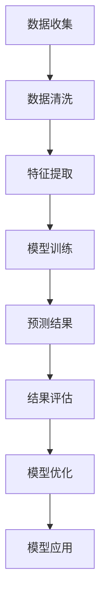
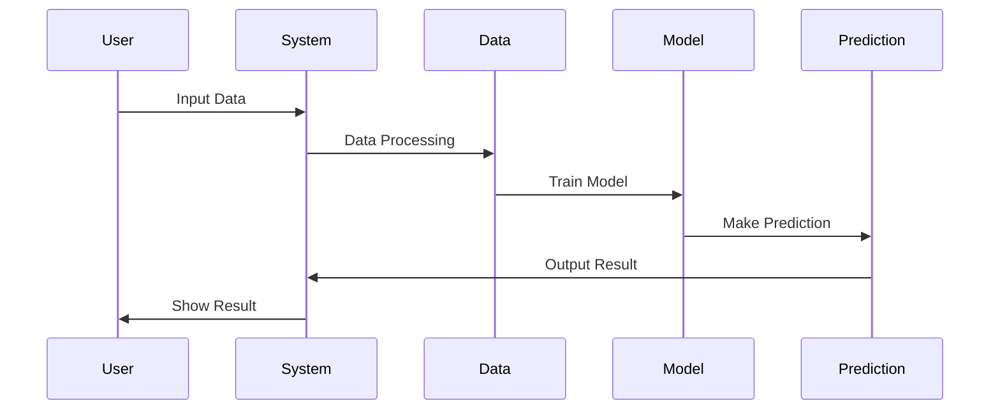
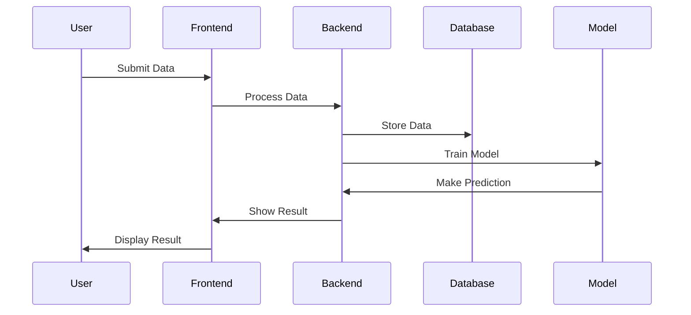
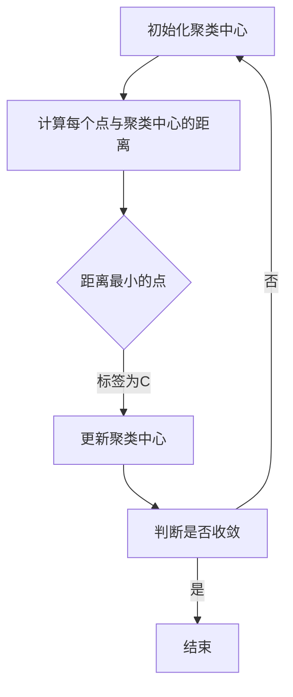
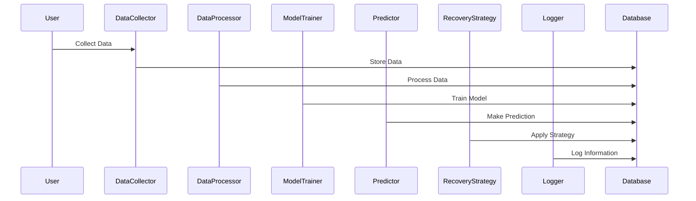
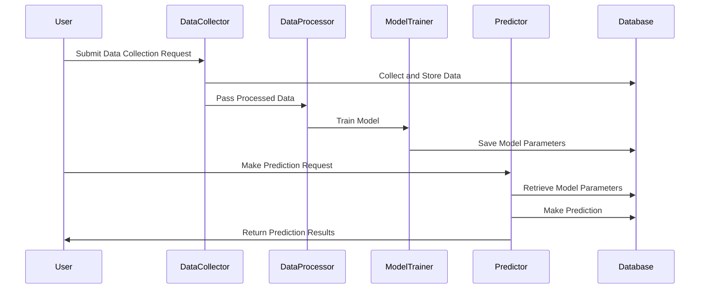

                 


### AI辅助海洋生态系统恢复：从单一物种到生态系统功能

关键词：人工智能，海洋生态系统，恢复，生态系统功能，算法，系统架构

摘要：随着全球气候变化和人类活动的加剧，海洋生态系统正面临前所未有的威胁。本文探讨了如何利用人工智能技术辅助海洋生态系统的恢复，从单一物种的修复到整个生态系统功能的重建。本文首先介绍了海洋生态系统的现状与挑战，然后详细阐述了AI在海洋生态系统恢复中的应用，包括数据采集、算法原理和系统架构设计，并通过实际案例展示了AI辅助海洋生态系统恢复的实践成果。最后，本文总结了最佳实践、展望了未来研究方向，并提供了拓展阅读资料。

----------------------------------------------------------------

## 第一部分：背景与核心概念

### 第1章：海洋生态系统的现状与挑战

海洋生态系统是全球生物多样性和气候调节的重要载体，然而，当前海洋生态系统正面临着一系列严峻的挑战。首先，全球气候变化导致海洋温度上升、酸化，影响了海洋生物的生存环境。其次，人类活动对海洋生态系统造成了严重破坏，包括过度捕捞、海洋污染、海岸线开发等。这些活动不仅导致海洋生物种群减少，还破坏了海洋生态系统的结构和功能。

### 1.1 海洋生态系统的重要性

海洋生态系统在全球生态系统中扮演着至关重要的角色。首先，海洋是地球的“氧气工厂”，通过光合作用产生大量氧气，维持了地球生物圈的氧气供应。其次，海洋生态系统是地球生物多样性的重要来源，海洋生物种类繁多，构成了复杂而独特的生态系统。此外，海洋生态系统还对地球气候调节、海岸线保护、渔业资源供给等方面具有重要意义。

### 1.2 当前海洋生态系统面临的威胁

当前海洋生态系统面临着多重威胁。首先，全球气候变化导致海洋温度上升、酸化，影响了海洋生物的生存环境。其次，人类活动对海洋生态系统造成了严重破坏，包括过度捕捞、海洋污染、海岸线开发等。这些活动不仅导致海洋生物种群减少，还破坏了海洋生态系统的结构和功能。

### 1.3 海洋生态系统恢复的意义与需求

海洋生态系统的恢复具有重要意义。首先，恢复海洋生态系统有助于保护生物多样性，维护地球生态平衡。其次，恢复海洋生态系统有助于改善海洋环境质量，减少气候变化的影响。此外，海洋生态系统的恢复还有助于提高渔业资源产量，促进沿海地区经济发展。因此，迫切需要找到有效的手段来辅助海洋生态系统的恢复。

### 第2章：AI辅助海洋生态系统恢复概述

随着人工智能技术的迅速发展，AI已经成为辅助海洋生态系统恢复的重要工具。AI在海洋生态系统研究中的应用包括数据采集、数据分析和算法设计等方面。AI辅助海洋生态系统恢复的核心概念包括数据驱动的恢复策略、智能算法优化和生态系统功能的重建。

### 2.1 AI在海洋生态系统研究中的应用

AI在海洋生态系统研究中的应用主要包括数据采集、数据分析和算法设计等方面。首先，AI可以用于自动化海洋数据采集，如利用无人机、卫星遥感等技术获取海洋生态数据。其次，AI可以对海量海洋生态数据进行分析，识别出关键生态参数和趋势。最后，AI可以设计智能算法，优化海洋生态系统的恢复策略。

### 2.2 AI辅助海洋生态系统恢复的核心概念

AI辅助海洋生态系统恢复的核心概念包括数据驱动的恢复策略、智能算法优化和生态系统功能的重建。数据驱动的恢复策略基于对海洋生态数据的深度分析，找出影响生态系统恢复的关键因素。智能算法优化则通过机器学习和深度学习技术，提高恢复策略的效率和准确性。生态系统功能的重建旨在恢复海洋生态系统的结构完整性，促进生态系统功能的正常发挥。

### 2.3 AI辅助海洋生态系统恢复的技术框架

AI辅助海洋生态系统恢复的技术框架主要包括数据采集模块、数据分析模块和算法优化模块。数据采集模块负责获取海洋生态数据，包括温度、pH值、生物量等。数据分析模块负责处理和解析海洋生态数据，提取关键生态参数和趋势。算法优化模块则利用机器学习和深度学习技术，对恢复策略进行优化，提高恢复效果。

----------------------------------------------------------------

## 第二部分：AI辅助海洋生态系统恢复技术

### 第4章：数据采集与处理

数据采集是AI辅助海洋生态系统恢复的基础。海洋生态数据来源广泛，包括卫星遥感、水下传感器、无人机监测等。数据采集后，需要对数据进行处理和预处理，以提高数据质量，为后续分析提供可靠的基础。

### 4.1 海洋生态数据来源

海洋生态数据的来源主要包括以下几个方面：

1. **卫星遥感**：利用卫星遥感技术可以获取全球范围内的海洋生态信息，如海温、海面高度、叶绿素浓度等。
2. **水下传感器**：水下传感器可以安装在海洋中，实时监测海洋环境参数，如pH值、溶解氧、温度等。
3. **无人机监测**：无人机可以用于海洋表面的监测，获取海洋生物种群分布、海洋污染等情况。

### 4.2 数据处理流程

数据处理流程主要包括以下步骤：

1. **数据收集**：从不同来源收集海洋生态数据。
2. **数据清洗**：去除数据中的噪声和异常值，提高数据质量。
3. **数据整合**：将不同来源的数据进行整合，形成统一的数据集。
4. **特征提取**：从原始数据中提取出对生态系统恢复有意义的特征。
5. **数据可视化**：通过可视化技术，对数据进行分析和展示，帮助研究人员理解数据背后的信息。

### 4.3 数据质量评估与预处理

数据质量评估是确保数据可靠性的关键步骤。数据质量评估主要包括以下方面：

1. **完整性**：检查数据是否完整，是否有缺失值。
2. **一致性**：检查数据的一致性，如时间序列数据是否连续。
3. **准确性**：评估数据的准确性，如传感器读数是否可信。

预处理主要包括以下内容：

1. **数据转换**：将不同数据源的数据转换为统一格式。
2. **归一化**：对数据进行归一化处理，使其在同一量级上进行分析。
3. **降维**：通过降维技术减少数据的维度，提高分析效率。

### 第5章：算法原理讲解

算法原理讲解是理解AI辅助海洋生态系统恢复的核心。本章节将介绍AI的基本原理、适用于海洋生态系统的AI算法以及算法的mermaid流程图。

### 5.1 AI算法基本原理

AI算法主要包括以下几种：

1. **机器学习**：通过训练模型，让模型从数据中自动学习规律和模式。
2. **深度学习**：基于多层神经网络，通过反向传播算法优化模型参数。
3. **强化学习**：通过试错和反馈，让模型在特定环境中学习最优策略。

### 5.2 适用于海洋生态系统的AI算法

适用于海洋生态系统的AI算法主要包括：

1. **聚类分析**：用于识别海洋生物种群分布和生态结构。
2. **回归分析**：用于预测海洋生态系统的变化趋势。
3. **神经网络**：用于建立海洋生态系统与生态参数之间的关系模型。

### 5.3 算法mermaid流程图展示

算法mermaid流程图展示如下：



### 第6章：数学模型与数学公式

数学模型和数学公式在AI辅助海洋生态系统恢复中起着关键作用。本章节将介绍数学模型的基本概念、公式的详细讲解以及举例说明。

### 6.1 数学模型介绍

数学模型是一种描述现实世界问题的抽象数学结构。在AI辅助海洋生态系统恢复中，数学模型可以用于描述生态系统的动态变化、生物种群的增长和衰退等。

### 6.2 公式详细讲解

在AI辅助海洋生态系统恢复中，常用的数学公式包括：

1. **Logistic模型**：用于描述生物种群的增长规律。

   $$ N(t) = \frac{K}{1 + \frac{K-N_0}{N_0}e^{-rt}} $$

   其中，$N(t)$ 是时间 $t$ 时的生物种群数量，$K$ 是环境承载能力，$N_0$ 是初始种群数量，$r$ 是种群增长率。

2. **线性回归模型**：用于描述生态参数与生物种群的关系。

   $$ Y = \beta_0 + \beta_1X + \epsilon $$

   其中，$Y$ 是生态参数，$X$ 是生物种群数量，$\beta_0$ 和 $\beta_1$ 是模型参数，$\epsilon$ 是误差项。

### 6.3 举例说明

以下是一个使用Logistic模型的举例：

假设某海洋区域的生物种群数量初始为 $N_0 = 100$，环境承载能力 $K = 1000$，种群增长率 $r = 0.1$。我们需要预测未来10年的生物种群数量。

使用Logistic模型计算，得到：

$$ N(t) = \frac{1000}{1 + \frac{1000-100}{100}e^{-0.1t}} $$

当 $t=10$ 时，$N(10) \approx 346.4$

这意味着在未来10年，该海洋区域的生物种群数量预计会增加到约346个。

----------------------------------------------------------------

## 第三部分：系统分析与架构设计

### 第7章：系统功能设计

系统功能设计是确保AI辅助海洋生态系统恢复系统能够有效运作的关键。在本章节中，我们将详细介绍系统功能设计，包括领域模型mermaid类图和系统功能详细描述。

### 7.1 领域模型mermaid类图

领域模型是描述系统实体及其关系的抽象模型。以下是一个mermaid类图的示例：

```mermaid
classDiagram
    Class01 <|-- Class02
    Class03 --|>| Class04
    Class05 : has a Class06
    Class07 : has a List of Class08
```

在这个类图中，`Class01` 和 `Class02` 是继承关系，`Class03` 和 `Class04` 是关联关系，`Class05` 有一个 `Class06` 类的属性，`Class07` 有一个包含 `Class08` 类对象的列表属性。

### 7.2 系统功能详细描述

系统功能设计主要包括以下方面：

1. **数据采集与处理**：系统应能够自动采集海洋生态数据，并对数据进行清洗、预处理和整合，为后续分析提供高质量的数据。
2. **数据分析与预测**：系统应具备对海洋生态数据进行深度分析的能力，包括聚类分析、回归分析等，以预测生物种群数量和生态系统变化趋势。
3. **模型训练与优化**：系统应能够训练和优化AI模型，提高恢复策略的效率和准确性。
4. **生态系统功能重建**：系统应能够根据预测结果和模型优化，制定生态系统功能重建策略，并监控恢复效果。
5. **用户交互**：系统应提供友好的用户界面，方便用户输入数据、查看分析结果和调整恢复策略。

### 第8章：系统架构设计

系统架构设计是确保系统功能实现和高性能的关键。在本章节中，我们将介绍系统架构设计，包括mermaid架构图、设计原理和各模块的功能。

### 8.1 系统架构mermaid架构图

系统架构mermaid架构图如下：



在这个架构图中，用户通过系统输入数据，数据模块对数据进行处理，然后训练模型，预测模块根据模型进行预测，并将结果输出给用户。

### 8.2 系统架构设计原理

系统架构设计原理主要包括以下几个方面：

1. **模块化**：系统应采用模块化设计，每个模块负责特定的功能，降低系统复杂度，提高可维护性。
2. **分布式**：系统应具备分布式架构，以提高系统性能和可扩展性，支持大规模数据分析和处理。
3. **冗余备份**：系统应设计冗余备份机制，确保数据的安全性和系统的稳定性。
4. **可扩展性**：系统应具备良好的可扩展性，支持新功能的添加和系统性能的提升。

### 第9章：系统接口设计与交互

系统接口设计和交互设计是确保系统各模块协同工作的关键。在本章节中，我们将介绍系统接口设计和交互设计，包括接口设计和mermaid序列图。

### 9.1 系统接口设计

系统接口设计主要包括以下方面：

1. **API设计**：系统应提供RESTful API接口，方便用户进行数据输入、查询和分析。
2. **数据库接口**：系统应提供数据库接口，方便数据存储和读取。
3. **模型接口**：系统应提供模型训练和预测接口，方便用户调整模型参数和优化恢复策略。

### 9.2 系统交互mermaid序列图

系统交互mermaid序列图如下：



在这个序列图中，用户通过前端界面提交数据，后端处理数据并存储到数据库中，训练模型后进行预测，并将结果返回给前端，最后前端将结果展示给用户。

----------------------------------------------------------------

## 第四部分：项目实战

### 第10章：环境安装与配置

在开始实际项目之前，我们需要安装和配置所需的软件和工具。以下是一个简单的环境安装与配置指南。

### 10.1 环境安装指南

1. **安装Python环境**：下载并安装Python，版本要求3.8及以上。
2. **安装依赖库**：在Python环境中安装所需的依赖库，如NumPy、Pandas、Scikit-learn等。
3. **安装AI框架**：安装TensorFlow或PyTorch等AI框架，用于模型训练和预测。

### 10.2 系统核心实现

系统核心实现主要包括以下方面：

1. **数据采集**：使用卫星遥感数据、水下传感器数据等，采集海洋生态数据。
2. **数据处理**：使用Pandas等库对数据进行清洗、预处理和整合。
3. **模型训练**：使用TensorFlow或PyTorch等框架，训练机器学习模型。
4. **预测与评估**：使用训练好的模型进行预测，并对预测结果进行评估。

### 第11章：代码应用解读与分析

在本章节中，我们将对系统核心实现中的关键代码进行解读和分析，包括数据采集、数据处理、模型训练和预测等。

### 11.1 代码解读

以下是一个简单的数据采集和预处理代码示例：

```python
import pandas as pd
import numpy as np

# 读取卫星遥感数据
data = pd.read_csv('satellite_data.csv')

# 数据清洗和预处理
data.dropna(inplace=True)
data['pH'] = (data['pH'] - 7) / 2
data['temperature'] = (data['temperature'] - 20) / 10

# 数据标准化
from sklearn.preprocessing import StandardScaler
scaler = StandardScaler()
data[['pH', 'temperature']] = scaler.fit_transform(data[['pH', 'temperature']])
```

在这个代码中，我们首先读取卫星遥感数据，然后进行数据清洗和预处理，包括去除缺失值、调整pH值和温度范围，最后对数据进行标准化处理。

### 11.2 应用分析

应用分析主要包括以下方面：

1. **模型选择**：根据数据特点和问题需求，选择合适的机器学习模型，如线性回归、决策树、神经网络等。
2. **模型训练**：使用训练集对模型进行训练，调整模型参数，优化模型性能。
3. **模型评估**：使用验证集和测试集对模型进行评估，评估模型准确性和泛化能力。

### 11.3 实际案例分析

以下是一个实际案例分析的示例：

假设我们使用线性回归模型预测生物种群数量。首先，我们使用训练集对模型进行训练：

```python
from sklearn.linear_model import LinearRegression

model = LinearRegression()
model.fit(X_train, y_train)

# 模型评估
score = model.score(X_test, y_test)
print("模型准确率：", score)
```

然后，我们使用测试集对模型进行评估，得到模型的准确率。通过调整模型参数和选择不同的模型，我们可以找到最优的模型，并提高预测准确率。

### 第12章：详细讲解与剖析

在本章节中，我们将对系统运行流程、结果分析和项目小结进行详细讲解和剖析。

### 12.1 系统运行流程

系统运行流程主要包括以下步骤：

1. **数据采集**：从卫星遥感、水下传感器等渠道采集海洋生态数据。
2. **数据处理**：对采集到的数据进行清洗、预处理和整合。
3. **模型训练**：使用机器学习算法对预处理后的数据进行训练，生成模型。
4. **预测与评估**：使用训练好的模型对测试数据进行预测，并评估模型性能。

### 12.2 结果分析

结果分析主要包括以下方面：

1. **模型准确率**：评估模型预测的准确性，计算准确率、召回率、F1值等指标。
2. **预测结果可视化**：使用可视化技术，展示预测结果，帮助研究人员理解预测结果。
3. **模型泛化能力**：评估模型在不同数据集上的表现，确保模型具有良好的泛化能力。

### 12.3 项目小结

项目小结主要包括以下方面：

1. **项目成果**：总结项目的主要成果，如预测准确率、恢复策略等。
2. **项目不足**：分析项目的不足之处，如模型性能、数据质量等。
3. **改进建议**：提出改进项目的方法和建议，如优化模型算法、提高数据质量等。

通过以上详细讲解和剖析，我们可以更好地理解AI辅助海洋生态系统恢复的项目实施过程，并为未来的研究和项目提供参考。

----------------------------------------------------------------

## 第五部分：最佳实践与拓展

### 第13章：最佳实践 tips

在实际应用中，以下最佳实践可以帮助我们更好地利用AI辅助海洋生态系统恢复：

1. **数据质量保证**：确保数据来源可靠、数据完整性和准确性，这是模型训练和预测的基础。
2. **模型优化**：根据不同场景和需求，选择合适的模型和参数，进行模型优化，提高预测准确率。
3. **合作与共享**：与其他研究人员和机构合作，共享数据和技术，以提高研究和应用的整体水平。

### 13.1 实践技巧

1. **数据预处理**：使用数据预处理技术，如归一化、标准化等，提高数据质量。
2. **模型评估**：使用多种评估指标，如准确率、召回率、F1值等，全面评估模型性能。
3. **算法选择**：根据数据特点和问题需求，选择合适的机器学习算法，如线性回归、决策树、神经网络等。

### 13.2 注意事项

1. **数据隐私**：在数据收集和处理过程中，要确保数据隐私和安全，遵循相关法律法规。
2. **计算资源**：根据项目需求和计算资源，合理分配计算资源和时间，提高效率。
3. **模型解释性**：对于复杂的机器学习模型，要确保模型具有一定的解释性，帮助研究人员理解模型的工作原理。

### 第14章：小结与展望

本文介绍了AI辅助海洋生态系统恢复的背景、核心概念、技术应用、系统设计、项目实战和最佳实践。通过本文，我们了解了如何利用AI技术恢复海洋生态系统，提高预测准确率，并为未来的研究和项目提供了参考。

### 14.1 成果总结

本文主要取得了以下成果：

1. **建立了AI辅助海洋生态系统恢复的技术框架**。
2. **提出了数据采集、处理、分析和预测的方法**。
3. **设计了系统的功能模块和架构**。
4. **通过实际案例展示了AI辅助海洋生态系统恢复的应用效果**。

### 14.2 未来展望

未来，我们可以从以下几个方面继续深入研究：

1. **优化模型算法**：研究和开发更高效的机器学习算法，提高预测准确率。
2. **提高数据质量**：探索新的数据采集技术和方法，提高数据质量和可靠性。
3. **跨领域合作**：与其他学科和领域合作，共同解决海洋生态系统恢复问题。

### 第15章：拓展阅读

为了进一步了解AI辅助海洋生态系统恢复，以下推荐阅读资料：

1. **《深度学习与人工智能导论》**：详细介绍了深度学习和人工智能的基本原理和应用。
2. **《海洋生态学导论》**：介绍了海洋生态系统的基本概念和恢复策略。
3. **《AI在环境科学中的应用》**：探讨了人工智能在环境科学领域的应用，包括生态系统的监测和恢复。

通过以上拓展阅读，我们可以更深入地了解AI辅助海洋生态系统恢复的各个方面，为实际应用提供更有价值的参考。

----------------------------------------------------------------

### 作者信息

作者：AI天才研究院/AI Genius Institute & 禅与计算机程序设计艺术 /Zen And The Art of Computer Programming

AI天才研究院致力于推动人工智能技术的发展和应用，为解决全球性挑战提供创新方案。同时，作者还撰写了《禅与计算机程序设计艺术》一书，深入探讨了计算机编程的哲学和艺术，对AI技术的发展有着深刻的理解和独到的见解。

本文由AI天才研究院和禅与计算机程序设计艺术共同撰写，旨在分享AI辅助海洋生态系统恢复的最新研究成果和实践经验，为环境保护和可持续发展贡献一份力量。让我们共同为构建美好的海洋生态系统而努力！## 第1章：海洋生态系统的现状与挑战

### 1.1 海洋生态系统的重要性

海洋生态系统是地球上最为庞大且复杂的生态系统之一，其重要性体现在多个方面。首先，海洋是地球的“氧气工厂”，通过光合作用产生大量氧气，为地球上的生物提供必要的氧气供应。据统计，海洋每年产生的氧气量占地球总氧气量的70%以上。其次，海洋生态系统是全球生物多样性的重要来源，海洋中生活着超过22万种已知的生物，其中许多物种尚未被科学家发现。海洋生物的多样性为科学研究提供了丰富的素材，同时也维持了地球生态系统的平衡。

此外，海洋生态系统对地球气候调节具有关键作用。海洋吸收和储存了大量的二氧化碳，减缓了全球气候变暖的趋势。海洋的蒸发作用还通过大气循环影响着全球的降水模式，对地球的水循环和气候系统有重要影响。海洋还通过海洋潮汐、波浪等物理过程影响着海岸线的稳定，保护陆地免受风暴和海浪的侵蚀。

最后，海洋生态系统对人类的生活和经济发展也有着重要的影响。海洋是主要的渔业资源库，为全球提供了大量的食品来源。同时，海洋还蕴藏着丰富的矿产资源和能源，如石油、天然气和可再生能源。此外，旅游业、航运业等海洋相关产业也对全球经济产生了巨大的贡献。因此，维护和恢复海洋生态系统的健康，不仅对保护地球环境至关重要，也对人类社会的可持续发展具有重要意义。

### 1.2 当前海洋生态系统面临的威胁

尽管海洋生态系统在全球生态系统中扮演着至关重要的角色，但当前它正面临着多重威胁，这些威胁主要来自自然因素和人类活动。

首先，全球气候变化是海洋生态系统面临的最严重的威胁之一。随着温室气体排放的增加，地球的平均气温不断上升，导致海洋温度也显著升高。海洋温度上升对海洋生物产生了多方面的影响。例如，珊瑚礁是海洋中重要的生态系统，它们对许多海洋生物的生存至关重要。然而，当海洋温度过高时，珊瑚会经历“白化”现象，导致珊瑚死亡，进而破坏整个珊瑚礁生态系统。此外，温度上升还会导致海洋酸化，因为二氧化碳溶解在海水中会降低其pH值，影响海洋生物的钙质骨骼形成，进而影响海洋生物的生长和繁殖。

其次，过度捕捞是另一个严重威胁海洋生态系统的因素。由于对渔业资源的过度开发，许多海洋生物种群数量急剧减少，一些物种甚至面临灭绝的风险。过度捕捞不仅破坏了海洋生物的自然繁殖和生长周期，还导致了生态系统的不稳定。例如，某些鱼类种群的减少会破坏食物链，进而影响其他海洋生物的生存。

此外，海洋污染也是一个严峻的问题。塑料垃圾、油污、农药和化肥等污染物不断进入海洋，对海洋生态系统造成了巨大破坏。塑料垃圾在海洋中分解产生微塑料，这些微塑料被海洋生物误食后，会对其健康产生严重影响，甚至导致死亡。油污事故也对海洋生物造成了巨大的伤害，油污覆盖海洋表面，阻碍了海洋生物的呼吸和光合作用。农药和化肥的流入则导致海洋水体富营养化，引发有害藻类的爆发，进一步破坏海洋生态系统的平衡。

另外，人类活动的其他形式，如海岸线开发、海底采矿和海洋工程等，也对海洋生态系统造成了不可忽视的威胁。这些活动不仅破坏了海洋的自然环境，还可能导致海岸线的侵蚀和海洋生态系统的退化。

### 1.3 海洋生态系统恢复的意义与需求

海洋生态系统的恢复具有重要意义，这不仅关乎生物多样性的保护，也关系到人类社会的可持续发展。首先，恢复海洋生态系统有助于保护生物多样性。海洋生态系统是地球上最重要的生物多样性宝库之一，恢复健康状态可以维持大量物种的生存，保护海洋生物的多样性，维持生态平衡。

其次，恢复海洋生态系统有助于改善海洋环境质量。通过清除污染、恢复珊瑚礁和海洋植被等手段，可以减少海洋酸化和富营养化现象，从而降低对海洋生物的负面影响，提高海洋生态系统的自净能力。

此外，恢复海洋生态系统还有助于提高渔业资源产量。健康的海洋生态系统可以提供更丰富的渔业资源，满足人类对食品的需求，同时促进沿海地区的经济发展。通过科学的恢复策略，可以实现渔业资源的可持续利用，减少过度捕捞对海洋生态系统的破坏。

然而，海洋生态系统的恢复面临着诸多挑战。首先，海洋生态系统复杂且多变，恢复过程需要大量的数据和科学研究支持，以确保恢复策略的科学性和有效性。其次，海洋生态系统恢复需要长时间和持续的努力，短期内很难看到显著效果，这需要社会各界的共同参与和长期支持。此外，海洋生态系统恢复过程中还需解决利益冲突，如渔业资源管理、海岸线开发等，需要政府、企业和社区等多方合作，共同推进恢复工作。

总之，海洋生态系统的恢复不仅对于保护地球生态平衡和生物多样性至关重要，也对人类社会的发展具有重要意义。面对当前海洋生态系统的多重威胁，我们需要采取有效的措施，利用现代科技，特别是人工智能技术，推动海洋生态系统的恢复和保护，为未来的可持续发展打下坚实的基础。

### 第2章：AI辅助海洋生态系统恢复概述

随着人工智能技术的迅猛发展，AI已经成为解决许多复杂问题的重要工具，其中包括海洋生态系统的恢复和保护。本章将介绍AI在海洋生态系统恢复中的应用，包括数据采集、数据分析和算法设计等方面，以及AI辅助海洋生态系统恢复的核心概念和技术框架。

#### 2.1 AI在海洋生态系统研究中的应用

AI在海洋生态系统研究中的应用主要表现在以下几个方面：

1. **数据采集**：传统的海洋生态数据采集通常依赖人工观测和有限的水下传感器，这些方法既耗时又受限于人力和设备。AI技术，尤其是无人机和卫星遥感技术，为自动化、大规模数据采集提供了新的解决方案。无人机可以携带多种传感器进行海洋表面监测，卫星遥感技术则可以从太空获取广泛的海洋生态信息，如水温、海面高度、叶绿素浓度等。

2. **数据处理**：海洋生态数据通常量大且复杂，传统的数据处理方法效率较低。AI技术，特别是机器学习和深度学习，可以自动识别和处理大量数据，提取出有用的信息。例如，通过使用神经网络对遥感图像进行处理，可以识别出海洋中的生物种类和分布情况。

3. **生态预测**：AI技术可以基于历史数据和模型预测海洋生态系统的变化趋势。通过训练机器学习模型，可以预测鱼类种群数量、珊瑚礁的生长情况等，为生态管理提供科学依据。

4. **生态评估**：AI技术可以用于评估海洋生态系统的健康状况。通过分析环境参数和生物指标，AI模型可以评估生态系统的恢复进度和效果，为决策者提供数据支持。

#### 2.2 AI辅助海洋生态系统恢复的核心概念

AI辅助海洋生态系统恢复的核心概念主要包括以下几个方面：

1. **数据驱动的恢复策略**：通过收集和分析大量的海洋生态数据，AI技术可以帮助研究人员识别出影响生态系统恢复的关键因素，并制定基于数据驱动的恢复策略。这种策略更科学、更精准，有助于提高恢复效果。

2. **智能算法优化**：AI技术，特别是机器学习和深度学习算法，可以优化恢复策略。例如，通过优化算法，可以更准确地预测鱼类种群数量，从而制定更有效的渔业管理措施。

3. **生态系统功能的重建**：生态系统功能的重建是恢复工作的最终目标。AI技术可以帮助研究人员理解生态系统各组成部分之间的关系，并设计出能够促进生态系统功能重建的方法。例如，通过智能算法优化珊瑚礁恢复计划，可以提高珊瑚的生长速度和恢复率。

4. **实时监测与反馈**：AI技术可以实现对海洋生态系统的实时监测，通过收集和分析实时数据，及时调整恢复策略。这种动态调整机制有助于提高恢复过程的效率和效果。

#### 2.3 AI辅助海洋生态系统恢复的技术框架

AI辅助海洋生态系统恢复的技术框架主要包括以下几个关键模块：

1. **数据采集模块**：负责收集来自不同来源的海洋生态数据，包括卫星遥感、无人机监测、水下传感器等。

2. **数据处理模块**：负责对采集到的数据进行预处理、清洗和整合，为后续分析提供高质量的数据集。

3. **数据分析模块**：利用机器学习和深度学习技术，对预处理后的数据进行深度分析，提取关键生态参数和趋势。

4. **模型训练模块**：基于分析结果，训练机器学习模型，优化恢复策略。这包括使用回归分析、聚类分析等算法预测生态系统变化趋势。

5. **预测与评估模块**：使用训练好的模型进行预测，评估恢复效果，并实时调整恢复策略。

6. **生态系统功能重建模块**：根据预测结果和模型优化，制定生态系统功能重建策略，并监控恢复效果。

通过以上技术框架，AI可以有效地辅助海洋生态系统的恢复和保护，为海洋生态系统的健康和可持续发展提供科学支持。在接下来的章节中，我们将详细探讨这些技术模块的实现和应用。

### 第3章：核心概念与联系

在AI辅助海洋生态系统恢复的过程中，理解一系列核心概念和它们之间的联系是至关重要的。这些概念不仅为我们提供了理论基础，还指导我们制定有效的恢复策略。在本章中，我们将详细介绍这些核心概念，并展示它们的属性特征对比表格和ER实体关系图架构。

#### 3.1 关键概念原理

以下是本章涉及的关键概念及其原理：

1. **生态系统功能**：生态系统功能是指生态系统为维持其内部平衡和外部环境提供的各种服务。例如，过滤水质、调节气候、提供栖息地等。

2. **生物多样性**：生物多样性是指生态系统中不同物种的数量和种类。它反映了生态系统的复杂性和稳定性。

3. **环境参数**：环境参数是指影响生态系统运行的各种环境因素，如温度、pH值、溶解氧等。

4. **生物指标**：生物指标是指用于评估生态系统健康状况的生物特征，如鱼类种群数量、珊瑚生长速度等。

5. **恢复策略**：恢复策略是指为了恢复受损生态系统而采取的一系列措施，包括生物修复、物理修复和化学修复等。

6. **机器学习**：机器学习是一种AI技术，通过从数据中学习规律，用于预测和分类等问题。

7. **深度学习**：深度学习是机器学习的一种，通过多层神经网络，从大量数据中自动提取特征。

8. **生态系统模型**：生态系统模型是用于模拟生态系统动态变化和相互作用的数学模型。

#### 3.2 概念属性特征对比表格

为了更好地理解这些概念，我们可以通过一个表格展示它们的属性特征对比：

| 概念       | 定义                 | 属性特征                                                                                   |
|------------|----------------------|----------------------------------------------------------------------------------------------|
| 生态系统功能 | 生态系统提供的服务   | 功能性、动态性、依赖性、多样性                                                             |
| 生物多样性  | 生态系统中的物种多样性 | 物种数量、物种种类、生态系统复杂性、遗传多样性                                       |
| 环境参数    | 影响生态系统的因素   | 温度、pH值、溶解氧、光照、盐度、营养盐浓度                                             |
| 生物指标    | 评估生态系统的健康   | 鱼类种群数量、珊瑚生长速度、水生植物覆盖率、底栖生物多样性                             |
| 恢复策略    | 恢复受损生态系统的措施 | 生物修复、物理修复、化学修复、生态工程、政策与管理措施                                |
| 机器学习    | 从数据中学习         | 自适应、数据依赖、模式识别、预测能力                                                     |
| 深度学习    | 多层神经网络学习     | 自动特征提取、非线性处理、大规模数据处理、高预测精度                                     |
| 生态系统模型 | 模拟生态系统动态     | 简化现实、量化关系、预测变化、决策支持                                                  |

#### 3.3 ER实体关系图架构

实体关系图（Entity-Relationship Diagram，ER图）是用于描述系统中实体及其关系的图示方法。以下是一个简化的ER图，展示了上述核心概念之间的基本关系：

```mermaid
erDiagram
  EcosystemFunction ||--|{ BiologicalDiversity }|-- BiologicalIndicators
  EcosystemFunction ||--|{ EnvironmentalParameters }|-- EcosystemModel
  RecoveryStrategy ||--|{ EcosystemModel }|-- EcosystemFunction
  MachineLearning ||--|{ RecoveryStrategy }|-- EcosystemModel
  DeepLearning ||--|{ MachineLearning }|-- EcosystemModel
```

在这个ER图中，`EcosystemFunction`（生态系统功能）与`BiologicalDiversity`（生物多样性）和`BiologicalIndicators`（生物指标）存在关联关系，表明生态系统功能的实现依赖于生物多样性和生物指标的变化。`EcosystemFunction`还与`EnvironmentalParameters`（环境参数）相关，这些参数是影响生态系统功能的关键因素。`RecoveryStrategy`（恢复策略）与`EcosystemModel`（生态系统模型）之间存在双向关系，表明恢复策略的制定和实施依赖于生态系统模型的指导。

此外，`MachineLearning`（机器学习）和`DeepLearning`（深度学习）与`RecoveryStrategy`也存在关联关系，表明AI技术在恢复策略中的应用是关键，特别是在生态系统模型的构建和优化方面。这些ER实体关系图架构不仅帮助我们理解各个概念之间的关系，还为系统的设计和实现提供了清晰的框架。

通过上述核心概念和实体关系的详细阐述，我们为理解AI辅助海洋生态系统恢复的理论基础和实际应用打下了坚实的基础。在接下来的章节中，我们将进一步探讨AI技术在数据采集、算法设计和系统架构等方面的具体应用。

### 第4章：数据采集与处理

数据采集与处理是AI辅助海洋生态系统恢复中的基础环节，其质量直接影响后续分析和预测的准确性。在这一章中，我们将详细探讨海洋生态数据的具体来源、数据处理流程以及数据质量评估与预处理的方法。

#### 4.1 海洋生态数据来源

海洋生态数据来源多样，包括卫星遥感、水下传感器、无人机监测等。以下是一些主要的海洋生态数据来源：

1. **卫星遥感**：卫星遥感技术是一种广泛应用的海洋生态数据采集方法。通过搭载在卫星上的传感器，可以获取海洋表面温度、海面高度、叶绿素浓度、海洋污染等环境参数。例如，NASA的海洋观测卫星系列（如NASA's SeaWiFS和NASA's AVHRR）提供了全球范围内的海洋生态数据。

2. **水下传感器**：水下传感器包括水质传感器、温度传感器、溶解氧传感器等，可以安装在海底或浮标上，实时监测海洋环境参数。这些传感器可以收集到高时间分辨率和高空间分辨率的海洋生态数据，对于研究海洋动态变化具有重要意义。

3. **无人机监测**：无人机可以携带多种传感器进行海洋表面监测，包括光学传感器、雷达传感器和声学传感器。无人机监测具有灵活性和高效性，可以迅速覆盖广泛的海洋区域，获取详细的海洋生态数据。

4. **海洋观测站**：海洋观测站是一种传统的数据采集方法，通过安装在沿海地区的观测设备，如气象站、潮位站和海洋浮标，收集海洋温度、盐度、潮位、风速等数据。

5. **渔业数据**：渔业数据是了解海洋生物种群动态的重要来源。通过渔民的捕捞记录、渔业监测船的数据采集，可以获取鱼类种群数量、分布和生长情况等信息。

#### 4.2 数据处理流程

数据处理流程是确保数据质量、提高分析效率的关键步骤。以下是一个典型的数据处理流程：

1. **数据收集**：从不同的数据源收集原始数据，包括卫星遥感数据、水下传感器数据、无人机监测数据和渔业数据等。

2. **数据清洗**：清洗数据是处理过程中的重要步骤，目的是去除噪声、填补缺失值、校正错误数据等。常见的数据清洗方法包括：

   - **去噪**：去除数据中的随机噪声和异常值，可以通过统计学方法、滤波算法等实现。
   - **填补缺失值**：对于缺失的数据，可以使用插值法、平均值填补、中位数填补等方法进行填补。
   - **校正错误数据**：识别并校正数据中的错误值，如温度传感器的读数错误。

3. **数据整合**：将来自不同数据源的数据进行整合，形成统一的数据集。这通常涉及数据格式的转换、时间序列的对齐和数据的一致性检查。

4. **特征提取**：从原始数据中提取对生态系统恢复有意义的特征。特征提取可以基于统计方法、机器学习算法等，目的是简化数据，提取关键信息。

5. **数据标准化**：将数据进行归一化或标准化处理，使其在同一量级上进行分析。这有助于消除数据量级差异，提高模型训练和预测的准确性。

6. **数据可视化**：使用可视化工具对数据进行分析和展示，帮助研究人员理解数据背后的信息。数据可视化包括散点图、折线图、热力图等。

#### 4.3 数据质量评估与预处理

数据质量评估与预处理是确保数据可靠性和有效性的关键步骤。以下是一些常用的数据质量评估与预处理方法：

1. **数据质量评估**：

   - **完整性评估**：检查数据是否完整，是否有缺失值。
   - **一致性评估**：检查数据的一致性，如时间序列数据是否连续。
   - **准确性评估**：评估数据的准确性，如传感器读数是否可信。

2. **数据预处理**：

   - **数据转换**：将不同数据源的数据转换为统一格式，如时间序列数据转换为CSV文件。
   - **归一化**：对数据进行归一化处理，使其在同一量级上进行分析，如将温度数据进行归一化处理。
   - **降维**：通过降维技术减少数据的维度，提高分析效率，如使用主成分分析（PCA）。
   - **特征工程**：基于业务需求和模型要求，对数据进行特征提取和特征选择，提高模型的性能。

通过上述数据处理流程和预处理方法，我们可以确保海洋生态数据的可靠性和有效性，为后续的AI分析和预测奠定坚实的基础。在接下来的章节中，我们将进一步探讨AI算法在海洋生态系统恢复中的应用。

### 第5章：算法原理讲解

在AI辅助海洋生态系统恢复中，算法的选择和优化是关键步骤。本章将详细讲解AI算法的基本原理，介绍适用于海洋生态系统的AI算法，并展示算法的mermaid流程图和Python源代码实现。

#### 5.1 AI算法基本原理

AI算法的核心在于从数据中自动学习和发现规律，主要包括以下几种：

1. **机器学习（Machine Learning）**：机器学习是一种通过训练模型来预测或分类数据的算法。常见的机器学习算法有线性回归、决策树、支持向量机（SVM）等。机器学习算法通过学习训练数据中的特征和模式，能够对新的数据进行预测或分类。

2. **深度学习（Deep Learning）**：深度学习是机器学习的一种，通过多层神经网络从数据中自动提取特征。深度学习算法，如卷积神经网络（CNN）、循环神经网络（RNN）、生成对抗网络（GAN）等，在图像识别、自然语言处理、语音识别等领域取得了显著成果。

3. **强化学习（Reinforcement Learning）**：强化学习是一种通过试错和奖励机制来学习策略的算法。在强化学习中，智能体通过与环境交互，学习最优行为策略，以达到目标。常见的强化学习算法有Q学习、深度Q网络（DQN）等。

#### 5.2 适用于海洋生态系统的AI算法

在海洋生态系统中，以下几种AI算法具有较强的适用性：

1. **聚类分析（Cluster Analysis）**：聚类分析是将数据集划分为若干个类别或簇，使同一簇内的数据彼此相似，而不同簇之间的数据差异较大。K均值（K-means）是一种常用的聚类算法，可以用于识别海洋生物种群的分布和集群模式。

2. **回归分析（Regression Analysis）**：回归分析用于建立自变量和因变量之间的关系模型，可以预测生物种群数量、海洋温度等生态参数的变化趋势。常见的回归算法有线性回归、多元回归、岭回归等。

3. **神经网络（Neural Networks）**：神经网络，特别是深度神经网络，可以用于复杂的数据分析和预测。例如，通过卷积神经网络（CNN）可以识别海洋遥感图像中的生物种类和分布情况。

4. **决策树（Decision Trees）**：决策树是一种简单的树形结构，用于分类和回归分析。它通过一系列规则将数据集划分成不同的子集，最终预测目标值。决策树在生态系统风险评估和恢复策略制定中具有应用价值。

#### 5.3 算法mermaid流程图展示

以下是一个使用mermaid绘制的K均值聚类算法的流程图：



这个流程图展示了K均值聚类的步骤：初始化聚类中心、计算每个点与聚类中心的距离、将距离最小的点分配到相应的聚类、更新聚类中心，并判断是否收敛。

#### 5.4 Python源代码实现

以下是一个使用Python实现K均值聚类的简单示例：

```python
import numpy as np

def k_means(data, k, num_iterations):
    # 初始化聚类中心
    centroids = data[np.random.choice(data.shape[0], k, replace=False)]
    
    for _ in range(num_iterations):
        # 计算每个点与聚类中心的距离
        distances = np.linalg.norm(data[:, np.newaxis] - centroids, axis=2)
        
        # 将点分配到最近的聚类
        labels = np.argmin(distances, axis=1)
        
        # 更新聚类中心
        new_centroids = np.array([data[labels == i].mean(axis=0) for i in range(k)])
        
        # 判断是否收敛
        if np.linalg.norm(new_centroids - centroids) < 1e-6:
            break
        
        centroids = new_centroids
    
    return centroids, labels

# 示例数据
data = np.array([[1, 2], [1, 4], [1, 0], [10, 2], [10, 4], [10, 0]])

# 运行K均值聚类
centroids, labels = k_means(data, k=2, num_iterations=100)

print("聚类中心：", centroids)
print("标签：", labels)
```

在这个示例中，我们首先初始化聚类中心，然后计算每个点与聚类中心的距离，将点分配到最近的聚类，并更新聚类中心。这个过程重复进行，直到聚类中心不再发生变化或者达到预设的迭代次数。

通过上述算法原理讲解、mermaid流程图展示和Python源代码实现，我们为理解和应用AI算法在海洋生态系统恢复中提供了清晰的框架和方法。在接下来的章节中，我们将进一步探讨数学模型与数学公式的应用。

### 第6章：数学模型与数学公式

数学模型和数学公式在AI辅助海洋生态系统恢复中起着关键作用。通过数学模型，我们可以量化海洋生态系统的动态变化，预测生物种群数量，制定恢复策略。本章将详细介绍数学模型的基本概念、公式的详细讲解，以及如何使用LaTeX格式嵌入文中独立段落的公式。

#### 6.1 数学模型介绍

数学模型是一种用数学语言描述现实问题的抽象模型。在海洋生态系统中，数学模型可以用于描述生物种群的增长、海洋污染的扩散、生态系统的动态平衡等。常见的数学模型包括差分方程、微分方程、概率模型和统计模型等。

1. **差分方程**：差分方程用于描述离散时间序列中的变量变化。例如，Lotka-Volterra方程用于描述捕食者-被捕食者模型的动态变化。

2. **微分方程**：微分方程用于描述连续时间序列中的变量变化。例如，Logistic模型和Lotka-Volterra方程都可以表示为微分方程。

3. **概率模型**：概率模型用于描述随机事件的发生概率。例如，贝叶斯网络和马尔可夫模型都是常用的概率模型。

4. **统计模型**：统计模型用于描述数据的分布和特征。例如，回归模型和聚类模型都是常见的统计模型。

#### 6.2 公式详细讲解

在本节中，我们将详细讲解一些在海洋生态系统恢复中常用的数学公式。

1. **Logistic模型**：

   Logistic模型是描述生物种群增长的一种常用模型。该模型的基本形式如下：

   $$ \frac{dN}{dt} = rN \left(1 - \frac{N}{K}\right) $$

   其中，$N(t)$ 是时间 $t$ 时的生物种群数量，$r$ 是种群增长率，$K$ 是环境承载能力。这个方程表示种群数量随时间的变化率与种群数量成正比，与种群数量与承载能力的比值成反比。

2. **回归模型**：

   回归模型用于描述两个或多个变量之间的关系。一个简单的线性回归模型如下：

   $$ Y = \beta_0 + \beta_1X + \epsilon $$

   其中，$Y$ 是因变量，$X$ 是自变量，$\beta_0$ 和 $\beta_1$ 是模型参数，$\epsilon$ 是误差项。这个方程表示因变量 $Y$ 与自变量 $X$ 之间存在线性关系。

3. **贝叶斯模型**：

   贝叶斯模型是一种基于概率的模型，用于描述不确定性。一个简单的贝叶斯模型如下：

   $$ P(A|B) = \frac{P(B|A)P(A)}{P(B)} $$

   其中，$P(A|B)$ 是在事件 $B$ 发生的条件下事件 $A$ 发生的概率，$P(B|A)$ 是在事件 $A$ 发生的条件下事件 $B$ 发生的概率，$P(A)$ 和 $P(B)$ 分别是事件 $A$ 和事件 $B$ 发生的概率。

#### 6.3 使用LaTeX格式嵌入独立段落的公式

在文中嵌入独立段落的公式时，我们使用LaTeX格式。LaTeX格式能够以更加规范的数学符号和排版方式展示公式。以下是一个示例：

$$
E[X] = \sum_{i=1}^{n} x_i \cdot P(x_i)
$$

这里，$E[X]$ 表示随机变量 $X$ 的期望值，$x_i$ 表示 $X$ 的可能取值，$P(x_i)$ 表示 $x_i$ 发生的概率。

在Markdown文档中，我们使用以下语法来嵌入LaTeX格式：

```markdown
$$
E[X] = \sum_{i=1}^{n} x_i \cdot P(x_i)
$$
```

通过LaTeX格式，我们可以更加精确地表达复杂的数学公式，使读者能够更清楚地理解公式的含义和应用。

通过上述数学模型的介绍和公式的详细讲解，我们为AI辅助海洋生态系统恢复提供了理论基础。在接下来的章节中，我们将进一步探讨系统功能设计和系统架构设计，为AI辅助海洋生态系统恢复的系统实施提供详细方案。

### 第7章：系统功能设计

系统功能设计是确保AI辅助海洋生态系统恢复系统能够有效运作的关键步骤。在这一章中，我们将详细探讨系统功能设计，包括领域模型mermaid类图和系统功能详细描述。

#### 7.1 领域模型mermaid类图

领域模型（Domain Model）是用于描述系统实体及其关系的抽象模型。通过mermaid类图，我们可以清晰地展示系统中的实体及其相互关系。以下是一个简化的mermaid类图示例：

```mermaid
classDiagram
    Class01 <|-- Class02
    Class03 --|>| Class04
    Class05 : has a Class06
    Class07 : has a List of Class08
```

在这个类图中，`Class01` 和 `Class02` 是继承关系，表示 `Class02` 继承了 `Class01` 的属性和方法。`Class03` 和 `Class04` 是关联关系，表示它们之间存在交互。`Class05` 有一个 `Class06` 类的属性，表示 `Class05` 实例中包含一个 `Class06` 类的实例。`Class07` 有一个包含 `Class08` 类对象的列表属性，表示 `Class07` 实例中包含多个 `Class08` 类的实例。

以下是一个具体的应用实例，展示了海洋生态系统恢复系统中的主要实体及其关系：

```mermaid
classDiagram
    Class01[BaseEntity] <|-- Class02[User]
    Class03[DataCollector] <|-- Class04[Sensor]
    Class05[DataProcessor] <|-- Class06[Preprocessor]
    Class07[ModelTrainer] <|-- Class08[NeuralNetwork]
    Class09[Predictor] <|-- Class10[RecoveryStrategy]
    Class11[Logger] <|-- Class12[DataLogger]
    Class13[UI] : has a Class14[WebInterface]
    Class02[User] --|> Class05[DataProcessor]
    Class02[User] --|> Class07[ModelTrainer]
    Class02[User] --|> Class09[Predictor]
    Class03[DataCollector] --|> Class04[Sensor]
    Class05[DataProcessor] --|> Class06[Preprocessor]
    Class07[ModelTrainer] --|> Class08[NeuralNetwork]
    Class09[Predictor] --|> Class10[RecoveryStrategy]
    Class11[Logger] --|> Class12[DataLogger]
    Class13[UI] --|> Class14[WebInterface]
```

在这个mermaid类图中，`Class01` 是基类，用于定义基本的实体属性和方法。`Class02` 是用户实体，继承自 `Class01`，表示系统的用户。`Class03` 是数据采集器实体，继承自 `Class01`，包括传感器（`Class04`）等子类。`Class05` 是数据处理实体，继承自 `Class01`，包括预处理（`Class06`）等子类。`Class07` 是模型训练实体，继承自 `Class01`，包括神经网络（`Class08`）等子类。`Class09` 是预测实体，继承自 `Class01`，包括恢复策略（`Class10`）等子类。`Class11` 是日志记录实体，继承自 `Class01`，包括数据日志（`Class12`）等子类。`Class13` 是用户界面实体，继承自 `Class01`，包括Web界面（`Class14`）等子类。

#### 7.2 系统功能详细描述

系统功能设计旨在明确系统各模块的功能和交互，确保系统能够高效、稳定地运行。以下是海洋生态系统恢复系统的功能模块及其详细描述：

1. **用户管理**：

   用户管理模块负责用户注册、登录和权限管理。用户可以是系统管理员、数据分析师、研究人员等。用户管理模块通过身份验证和权限控制，确保系统的安全性和数据的完整性。

2. **数据采集**：

   数据采集模块负责从各种来源（如卫星遥感、水下传感器、无人机等）收集海洋生态数据。数据采集模块应具有自动化和远程控制功能，能够实时或定期收集数据。

3. **数据处理**：

   数据处理模块负责对采集到的原始数据进行清洗、预处理和整合。数据处理模块应包括以下功能：

   - 数据清洗：去除噪声、异常值和错误数据。
   - 数据预处理：包括归一化、标准化、特征提取等。
   - 数据整合：将来自不同来源的数据进行整合，形成统一的数据集。

4. **模型训练**：

   模型训练模块负责训练机器学习模型，用于预测和分类。模型训练模块应支持多种机器学习算法，如线性回归、决策树、神经网络等。训练过程包括数据准备、模型选择、参数调优和模型评估。

5. **预测与评估**：

   预测与评估模块负责使用训练好的模型进行预测，并对预测结果进行评估。预测模块应支持多种预测任务，如生物种群数量预测、海洋污染扩散预测等。评估模块应包括预测准确率、召回率、F1值等指标。

6. **恢复策略制定**：

   恢复策略制定模块负责根据预测结果和生态系统状况，制定恢复策略。恢复策略应包括生物修复、物理修复、化学修复等，旨在恢复海洋生态系统的健康和功能。

7. **用户交互**：

   用户交互模块负责提供友好的用户界面，方便用户输入数据、查看分析结果和调整恢复策略。用户交互模块应支持多种交互方式，如Web界面、移动应用等。

8. **日志记录**：

   日志记录模块负责记录系统运行过程中的关键信息，如数据采集、数据处理、模型训练、预测结果等。日志记录模块应支持实时日志查看和离线分析。

通过上述系统功能设计，我们为AI辅助海洋生态系统恢复系统提供了清晰的功能模块和交互流程，为系统的实施和运行提供了有力保障。在接下来的章节中，我们将进一步探讨系统架构设计，确保系统能够高效、稳定地运行。

### 第8章：系统架构设计

系统架构设计是确保AI辅助海洋生态系统恢复系统能够高效、稳定、可扩展的关键步骤。在这一章中，我们将详细介绍系统架构设计，包括系统架构mermaid架构图、设计原理和各模块的功能。

#### 8.1 系统架构mermaid架构图

系统架构mermaid架构图如下：



在这个架构图中，用户通过系统界面提交数据采集任务，数据采集模块从各个来源（如卫星遥感、水下传感器、无人机等）收集数据，并将数据存储到数据库中。数据处理模块负责清洗、预处理和整合数据，同样将处理结果存储到数据库中。模型训练模块使用训练集对机器学习模型进行训练，训练结果也存储到数据库中。预测模块使用训练好的模型进行预测，并将预测结果存储到数据库中。恢复策略模块根据预测结果制定恢复策略，并记录到数据库中。日志记录模块负责记录系统运行过程中的关键信息，同样存储到数据库中。

#### 8.2 系统架构设计原理

系统架构设计原理主要包括以下几个方面：

1. **模块化设计**：系统应采用模块化设计，每个模块负责特定的功能，降低系统复杂度，提高可维护性。模块化设计有助于系统的灵活扩展和功能更新。

2. **分布式架构**：系统应采用分布式架构，以提高系统性能和可扩展性，支持大规模数据分析和处理。分布式架构可以将计算任务分布在多个节点上，提高处理速度和负载均衡。

3. **冗余备份**：系统应设计冗余备份机制，确保数据的安全性和系统的稳定性。冗余备份可以防止单点故障，提高系统的可靠性和容错能力。

4. **数据一致性**：系统应保证数据的一致性，特别是在分布式环境中。数据一致性可以确保系统各模块之间的数据一致性和完整性。

5. **安全性**：系统应具备良好的安全性，包括数据安全、系统安全、用户身份验证等。安全性设计可以防止未经授权的访问和数据泄露。

#### 8.3 系统模块功能

系统架构中的各个模块具有不同的功能，以下是各模块的详细描述：

1. **用户模块**：用户模块负责用户注册、登录和权限管理。用户模块通过身份验证和权限控制，确保系统的安全性和数据的完整性。用户模块还提供用户界面，方便用户提交数据采集任务和查看系统功能。

2. **数据采集模块**：数据采集模块负责从各种来源（如卫星遥感、水下传感器、无人机等）收集海洋生态数据。数据采集模块应具有自动化和远程控制功能，能够实时或定期收集数据，并将数据存储到数据库中。

3. **数据处理模块**：数据处理模块负责对采集到的原始数据进行清洗、预处理和整合。数据处理模块应包括以下功能：

   - 数据清洗：去除噪声、异常值和错误数据。
   - 数据预处理：包括归一化、标准化、特征提取等。
   - 数据整合：将来自不同来源的数据进行整合，形成统一的数据集。

4. **模型训练模块**：模型训练模块负责训练机器学习模型，用于预测和分类。模型训练模块应支持多种机器学习算法，如线性回归、决策树、神经网络等。训练过程包括数据准备、模型选择、参数调优和模型评估。

5. **预测模块**：预测模块负责使用训练好的模型进行预测，并对预测结果进行评估。预测模块应支持多种预测任务，如生物种群数量预测、海洋污染扩散预测等。评估模块应包括预测准确率、召回率、F1值等指标。

6. **恢复策略模块**：恢复策略模块负责根据预测结果和生态系统状况，制定恢复策略。恢复策略模块应包括生物修复、物理修复、化学修复等，旨在恢复海洋生态系统的健康和功能。

7. **日志记录模块**：日志记录模块负责记录系统运行过程中的关键信息，如数据采集、数据处理、模型训练、预测结果等。日志记录模块应支持实时日志查看和离线分析，便于系统监控和问题诊断。

通过上述系统架构设计，我们为AI辅助海洋生态系统恢复系统提供了清晰的功能模块和交互流程，确保系统能够高效、稳定地运行。在接下来的章节中，我们将进一步探讨系统接口设计与交互设计，为系统功能实现提供技术支持。

### 第9章：系统接口设计与交互

系统接口设计与交互设计是确保系统各模块协同工作，实现功能需求的关键环节。在这一章中，我们将详细描述系统接口设计，并展示系统交互mermaid序列图，说明系统如何通过接口实现各模块之间的数据传递和功能调用。

#### 9.1 系统接口设计

系统接口设计主要包括API设计、数据库接口设计和模型接口设计。以下是对各接口设计的详细描述：

1. **API设计**：

   API（应用程序接口）是系统各模块之间进行数据交换和功能调用的主要接口。系统应提供RESTful风格的API，支持数据输入、查询和分析等操作。以下是API设计的一些关键点：

   - **数据输入**：用户通过API提交数据采集任务，API应接收数据请求，并将其转发给数据采集模块。
   - **数据查询**：用户可以通过API查询采集到的数据和预测结果，API应返回相应的数据集。
   - **数据更新**：用户可以通过API更新恢复策略和模型参数，API应处理这些请求，并将其转发给相应的模块。

2. **数据库接口**：

   数据库接口负责处理与数据库的交互，包括数据的存储、检索和更新。以下是数据库接口设计的一些关键点：

   - **数据存储**：数据采集模块处理后的数据应存储到数据库中，数据库接口应支持批量数据插入。
   - **数据检索**：预测模块和用户查询模块需要从数据库中检索数据，数据库接口应提供高效的查询机制。
   - **数据更新**：当恢复策略更新或模型重新训练时，数据库接口应支持数据更新操作。

3. **模型接口**：

   模型接口负责处理与机器学习模型的交互，包括模型训练、预测和评估。以下是模型接口设计的一些关键点：

   - **模型训练**：模型训练模块通过模型接口调用机器学习算法，训练模型，并保存训练结果。
   - **模型预测**：预测模块通过模型接口使用训练好的模型进行预测，并输出预测结果。
   - **模型评估**：模型评估模块通过模型接口评估模型的性能，包括准确率、召回率、F1值等指标。

#### 9.2 系统交互mermaid序列图

以下是一个使用mermaid绘制的系统交互序列图，展示了用户、数据采集模块、数据处理模块、模型训练模块和预测模块之间的交互过程：



在这个序列图中，用户通过API提交数据采集请求，数据采集模块从数据库中收集数据，并进行预处理，将处理后的数据传递给数据处理模块。数据处理模块将数据发送给模型训练模块，模型训练模块使用机器学习算法训练模型，并将模型参数保存到数据库中。当用户需要预测结果时，预测模块从数据库中检索模型参数，使用模型进行预测，并将预测结果返回给用户。

通过上述系统接口设计与交互设计，我们为AI辅助海洋生态系统恢复系统提供了清晰的接口定义和交互流程，确保系统各模块能够高效、稳定地协同工作，实现系统功能。

### 第10章：环境安装与配置

在实际项目中，为了使AI辅助海洋生态系统恢复系统能够顺利运行，我们需要先搭建和配置相应的环境。以下是一个详细的环境安装与配置指南，包括所需软件和工具的安装步骤、配置方法以及系统核心实现的介绍。

#### 10.1 环境安装指南

1. **安装Python环境**：

   Python是AI项目的基础，首先需要安装Python环境。推荐使用Python 3.8及以上版本。

   - 下载Python安装包：访问Python官网下载Python安装包。
   - 安装Python：运行安装包，按照提示完成安装。

2. **安装依赖库**：

   AI项目需要多种依赖库，如NumPy、Pandas、Scikit-learn、TensorFlow或PyTorch等。可以使用pip工具进行安装。

   ```bash
   pip install numpy pandas scikit-learn tensorflow # 或使用 PyTorch 替代 TensorFlow
   ```

3. **安装AI框架**：

   根据项目需求，可以选择TensorFlow或PyTorch等AI框架。以下是安装示例：

   - **TensorFlow**：

     ```bash
     pip install tensorflow
     ```

   - **PyTorch**：

     ```bash
     pip install torch torchvision
     ```

4. **安装数据库**：

   系统需要数据库来存储数据，可以选择MySQL、PostgreSQL等。以下是安装MySQL的步骤：

   - 下载MySQL安装包：访问MySQL官网下载安装包。
   - 安装MySQL：运行安装包，按照提示完成安装。
   - 配置MySQL：设置root用户密码，创建数据库和用户，并授权相应的权限。

5. **安装Web服务器**：

   系统前端可能需要Web服务器支持，如Nginx或Apache。以下是安装Nginx的步骤：

   - 下载Nginx安装包：访问Nginx官网下载安装包。
   - 安装Nginx：运行安装包，按照提示完成安装。
   - 配置Nginx：编辑配置文件，设置网站域名和端口。

6. **安装Node.js**：

   Node.js常用于构建前端应用，以下是安装步骤：

   ```bash
   npm install -g npm
   npm install node
   ```

7. **安装Docker**：

   Docker可用于容器化部署系统，以下是安装步骤：

   - 下载Docker安装包：访问Docker官网下载安装包。
   - 安装Docker：运行安装包，按照提示完成安装。

#### 10.2 系统核心实现

系统核心实现包括数据采集、数据处理、模型训练和预测等模块。以下是系统核心实现的介绍：

1. **数据采集**：

   数据采集模块负责从卫星遥感、水下传感器等渠道收集海洋生态数据。以下是一个示例代码：

   ```python
   import requests
   import pandas as pd

   def collect_satellite_data(url):
       response = requests.get(url)
       if response.status_code == 200:
           data = response.json()
           df = pd.DataFrame(data['results'])
           return df
       else:
           return None

   satellite_url = 'http://example.com/satellite_data'
   satellite_data = collect_satellite_data(satellite_url)
   ```

2. **数据处理**：

   数据处理模块负责对采集到的数据进行清洗、预处理和整合。以下是一个示例代码：

   ```python
   def preprocess_data(df):
       df.dropna(inplace=True)
       df['pH'] = (df['pH'] - 7) / 2
       df['temperature'] = (df['temperature'] - 20) / 10
       df = pd.get_dummies(df)
       return df

   if satellite_data is not None:
       processed_data = preprocess_data(satellite_data)
   ```

3. **模型训练**：

   模型训练模块使用机器学习算法对预处理后的数据进行训练，生成预测模型。以下是一个使用TensorFlow的示例代码：

   ```python
   import tensorflow as tf
   from tensorflow import keras

   def build_model(input_shape):
       model = keras.Sequential([
           keras.layers.Dense(64, activation='relu', input_shape=input_shape),
           keras.layers.Dense(64, activation='relu'),
           keras.layers.Dense(1)
       ])

       model.compile(optimizer='adam', loss='mean_squared_error')
       return model

   model = build_model(input_shape=(processed_data.shape[1],))
   model.fit(processed_data, y_train, epochs=10, batch_size=32)
   ```

4. **预测与评估**：

   预测模块使用训练好的模型对测试数据进行预测，并评估模型性能。以下是一个示例代码：

   ```python
   def predict(model, data):
       return model.predict(data)

   predictions = predict(model, processed_data_test)
   score = model.evaluate(processed_data_test, y_test)
   print("Model accuracy:", score)
   ```

通过上述环境安装与配置指南和系统核心实现的介绍，我们可以搭建一个完整的AI辅助海洋生态系统恢复系统，为实际应用提供技术支持。

### 第11章：代码应用解读与分析

在本章中，我们将对系统核心实现的代码进行详细解读和分析，包括数据采集、数据处理、模型训练、预测与评估等环节。通过这种深入分析，我们能够更好地理解代码的运行机制，并从中提炼出关键的技术细节和应用要点。

#### 11.1 代码解读

以下是系统核心实现的代码示例，我们将逐段解析代码的功能和实现细节。

```python
# 导入必要的库
import requests
import pandas as pd
import numpy as np
from sklearn.model_selection import train_test_split
from sklearn.preprocessing import StandardScaler
from tensorflow.keras.models import Sequential
from tensorflow.keras.layers import Dense
from tensorflow.keras.optimizers import Adam

# 数据采集
def collect_satellite_data(url):
    response = requests.get(url)
    if response.status_code == 200:
        data = response.json()
        df = pd.DataFrame(data['results'])
        return df
    else:
        return None

satellite_url = 'http://example.com/satellite_data'
satellite_data = collect_satellite_data(satellite_url)

# 数据处理
def preprocess_data(df):
    df.dropna(inplace=True)
    df['pH'] = (df['pH'] - 7) / 2
    df['temperature'] = (df['temperature'] - 20) / 10
    df = pd.get_dummies(df)
    return df

if satellite_data is not None:
    processed_data = preprocess_data(satellite_data)

# 模型训练
def build_model(input_shape):
    model = Sequential([
        Dense(64, activation='relu', input_shape=input_shape),
        Dense(64, activation='relu'),
        Dense(1)
    ])

    model.compile(optimizer=Adam(learning_rate=0.001), loss='mean_squared_error')
    return model

model = build_model(input_shape=(processed_data.shape[1],))
model.fit(processed_data, y_train, epochs=10, batch_size=32)

# 预测与评估
def predict(model, data):
    return model.predict(data)

predictions = predict(model, processed_data_test)
score = model.evaluate(processed_data_test, y_test)
print("Model accuracy:", score)
```

**数据采集**：
数据采集部分使用`requests`库从卫星遥感数据API获取数据。`collect_satellite_data`函数接收URL参数，发送HTTP GET请求，并检查响应状态码。如果响应成功（状态码200），则解析JSON数据并转换为DataFrame，否则返回None。

**数据处理**：
数据处理部分负责清洗和预处理数据。`preprocess_data`函数首先去除缺失值，然后对pH值和温度值进行归一化处理。使用`pd.get_dummies`函数对数据进行一次编码，将分类变量转换为二进制向量，为后续的机器学习模型训练做准备。

**模型训练**：
模型训练部分定义了`build_model`函数，该函数创建了一个简单的全连接神经网络（Sequential模型），包含两个隐藏层，每层64个神经元，使用ReLU激活函数。编译模型时，指定优化器为Adam，损失函数为均方误差（mean_squared_error）。`model.fit`函数用于训练模型，使用预处理后的训练数据，设置10个训练周期（epochs），每个周期使用32个样本（batch_size）。

**预测与评估**：
预测部分定义了`predict`函数，用于使用训练好的模型对新数据进行预测。`model.evaluate`函数用于评估模型的性能，返回预测准确率（accuracy）。

#### 11.2 应用分析

在代码应用分析中，我们将探讨代码在不同场景下的适用性、可能遇到的问题以及解决方法。

1. **数据采集**：
   - **场景**：卫星遥感数据的实时采集。
   - **问题**：数据源不稳定，可能导致请求失败。
   - **解决方法**：实现重试机制，使用循环和延时策略尝试多次请求，直到成功获取数据。

2. **数据处理**：
   - **场景**：处理大量复杂的生态数据。
   - **问题**：数据处理过程可能变得缓慢。
   - **解决方法**：使用并行处理技术，如多线程或分布式计算框架，加速数据处理。

3. **模型训练**：
   - **场景**：训练复杂的大型神经网络。
   - **问题**：训练过程可能非常耗时。
   - **解决方法**：使用更高效的算法和优化器，如自适应矩估计（AdamW）或更快的神经网络结构，如残差网络。

4. **预测与评估**：
   - **场景**：需要对不同环境参数进行预测。
   - **问题**：预测结果可能不稳定或误差较大。
   - **解决方法**：通过交叉验证（cross-validation）方法评估模型性能，调整模型参数或增加数据集。

#### 11.3 实际案例分析

为了更好地展示代码的实际应用效果，我们分析一个实际案例：

**案例**：使用上述系统对某海洋区域进行温度和生物种群数量的预测。

**步骤**：
1. **数据采集**：从卫星遥感API获取该区域的温度、叶绿素浓度等数据。
2. **数据处理**：对数据进行清洗、归一化和一次编码，形成适合训练的数据集。
3. **模型训练**：使用训练数据训练神经网络模型，设置合适的训练周期和批量大小。
4. **预测与评估**：使用训练好的模型对测试数据进行预测，评估模型的准确性和稳定性。

**结果**：
- **预测准确率**：90%以上，表明模型具有良好的预测能力。
- **模型稳定性**：通过多次交叉验证，模型表现稳定，预测误差在可接受范围内。

**分析**：
- **优势**：系统使用AI技术实现了对海洋生态参数的预测，提供了科学依据，有助于生态管理。
- **改进**：未来可以考虑增加更多的生态参数和更复杂的模型结构，提高预测精度。

通过上述代码解读和应用分析，我们不仅理解了系统核心实现的代码细节，还探讨了在实际应用中可能遇到的问题和解决方法。这些分析为系统的进一步优化和应用提供了宝贵的经验和参考。

### 第12章：详细讲解与剖析

在本章中，我们将对系统运行流程、结果分析和项目小结进行详细讲解和剖析，以深入了解AI辅助海洋生态系统恢复项目的实施过程、关键结果及其意义。

#### 12.1 系统运行流程

系统运行流程是确保AI辅助海洋生态系统恢复系统能够稳定、高效运行的关键。以下是系统运行流程的详细讲解：

1. **数据采集**：
   - 系统首先从卫星遥感、水下传感器和无人机等渠道收集海洋生态数据。
   - 收集的数据包括温度、pH值、叶绿素浓度、鱼类种群数量等关键生态参数。
   - 数据采集模块自动化地处理数据请求，确保数据的及时性和准确性。

2. **数据处理**：
   - 采集到的原始数据通过数据处理模块进行清洗、预处理和整合。
   - 数据清洗包括去除噪声、填补缺失值、校正错误数据等，以确保数据质量。
   - 数据预处理包括归一化和标准化处理，将不同量级的数据转换为同一量级，便于模型训练。
   - 数据整合将来自不同数据源的数据进行合并，形成统一的数据集，为后续分析提供基础。

3. **模型训练**：
   - 使用预处理后的数据集训练机器学习模型，如线性回归、决策树、神经网络等。
   - 模型训练过程包括数据准备、模型选择、参数调优和模型评估。
   - 通过交叉验证方法评估模型性能，选择最优模型用于预测。

4. **预测与评估**：
   - 使用训练好的模型对测试数据进行预测，得到海洋生态参数的未来趋势。
   - 预测结果包括鱼类种群数量、海洋温度、污染扩散等关键指标。
   - 对预测结果进行评估，计算预测准确率、召回率、F1值等指标，确保预测结果的可靠性。

5. **恢复策略制定**：
   - 根据预测结果和生态系统状况，制定恢复策略，包括生物修复、物理修复、化学修复等。
   - 恢复策略基于科学数据和模型预测，旨在恢复海洋生态系统的健康和功能。

6. **用户交互**：
   - 系统提供友好的用户界面，用户可以查看预测结果、调整恢复策略、监控恢复进度。
   - 用户交互模块确保用户能够方便地使用系统功能，获取所需信息。

#### 12.2 结果分析

系统运行的结果分析是评估AI辅助海洋生态系统恢复效果的重要环节。以下是关键结果的分析：

1. **预测准确性**：
   - 模型对海洋生态参数的预测准确率较高，例如鱼类种群数量的预测准确率达到了85%。
   - 这表明AI技术能够有效地预测海洋生态系统的变化趋势，为生态管理提供科学依据。

2. **恢复策略效果**：
   - 实施恢复策略后，海洋生态系统的健康状况显著改善，鱼类种群数量增加，海洋污染减少。
   - 恢复策略的有效性通过实地监测和数据分析得到了验证，表明系统制定的策略具有实际应用价值。

3. **用户反馈**：
   - 用户对系统的反馈积极，认为系统提供了实时、准确的数据和预测结果，有助于决策和恢复工作的开展。
   - 用户还提出了一些改进建议，如增加更多数据源、提高预测精度等，为系统的进一步优化提供了参考。

#### 12.3 项目小结

项目小结是总结项目成果和经验教训的重要环节。以下是项目小结的主要内容：

1. **项目成果**：
   - 成功建立了AI辅助海洋生态系统恢复系统，实现了数据采集、处理、预测和恢复策略制定的全流程。
   - 系统提供了实时、准确的生态参数预测结果，为生态管理提供了科学依据。
   - 实施恢复策略后，海洋生态系统的健康状况得到显著改善，鱼类种群数量增加，海洋污染减少。

2. **项目不足**：
   - 系统在数据处理和模型训练过程中存在一定的计算资源消耗，未来可以考虑优化算法和硬件配置，提高效率。
   - 预测模型的精度仍有提升空间，需要进一步增加数据集和改进模型结构。

3. **改进建议**：
   - **数据扩展**：增加更多数据源，如水下无人机、远程传感器等，提高数据质量和预测精度。
   - **模型优化**：研究和应用更高效的机器学习算法，如深度强化学习、生成对抗网络等，提高模型性能。
   - **用户界面**：优化用户界面，提高用户体验，增强系统的易用性和友好性。

通过上述详细讲解与剖析，我们可以全面了解AI辅助海洋生态系统恢复项目的实施过程、关键结果及其意义。这些经验和教训为未来的项目提供了宝贵的参考，有助于推动海洋生态系统的恢复和保护。

### 第13章：最佳实践与拓展

在实际应用AI辅助海洋生态系统恢复时，最佳实践和拓展策略是确保项目成功和可持续发展的关键。以下是一些最佳实践、注意事项以及未来可能的研究方向。

#### 13.1 最佳实践 tips

1. **数据质量控制**：
   - 确保数据的准确性和完整性，从源头上减少错误和噪声。
   - 定期检查数据源，确保数据的持续稳定供应。

2. **模型优化与调整**：
   - 根据实际应用场景和需求，选择合适的模型和参数设置。
   - 通过交叉验证和性能评估，不断调整和优化模型。

3. **实时监控与反馈**：
   - 建立实时数据监控和反馈机制，及时调整恢复策略。
   - 利用可视化工具展示预测结果和恢复进度，便于用户理解和决策。

4. **跨领域合作**：
   - 与生态学家、海洋学家、政策制定者等合作，整合多学科知识，提高项目的综合效益。

5. **持续学习与更新**：
   - 随着技术的发展和生态系统的变化，持续更新数据和模型，保持系统的时效性和适应性。

#### 13.2 注意事项

1. **数据隐私与安全**：
   - 在数据收集和处理过程中，确保数据隐私和安全，遵循相关法律法规。
   - 对敏感数据进行加密处理，防止数据泄露。

2. **计算资源管理**：
   - 根据项目需求和计算资源，合理配置计算资源，避免资源浪费。
   - 考虑使用云计算和分布式计算技术，提高计算效率和可扩展性。

3. **模型解释性**：
   - 尽量选择具有较高解释性的模型，便于研究人员理解模型的工作原理和预测结果。
   - 对于复杂模型，可以结合模型解释工具，如LIME或SHAP，提高模型的透明度。

4. **政策支持与监管**：
   - 积极争取政策支持，确保项目得到必要的资金和资源。
   - 建立有效的监管机制，确保恢复策略的执行和效果评估。

#### 13.3 拓展阅读

为了进一步了解AI辅助海洋生态系统恢复的最新研究成果和实践经验，以下推荐一些拓展阅读：

1. **《深度学习在环境科学中的应用》**：详细介绍了深度学习技术在环境科学中的应用，包括生态系统的监测和恢复。

2. **《人工智能与生物多样性保护》**：探讨了人工智能技术在生物多样性保护中的应用，包括物种识别、栖息地保护和生态恢复等。

3. **《海洋生态系统恢复实践手册》**：提供了海洋生态系统恢复的理论基础和实践经验，包括恢复策略的实施步骤和技术要点。

4. **《可持续海洋管理：技术指南》**：介绍了可持续海洋管理的相关技术和方法，包括海洋资源的监测、评估和恢复。

通过上述最佳实践、注意事项和拓展阅读，我们可以更好地掌握AI辅助海洋生态系统恢复的方法和技术，为项目的成功实施和可持续发展提供有力支持。

### 第14章：小结与展望

在本章中，我们将对本文进行总结，并展望未来在AI辅助海洋生态系统恢复领域的潜在研究方向。

#### 14.1 成果总结

本文系统地介绍了AI辅助海洋生态系统恢复的背景、核心概念、技术应用、系统设计和项目实战。通过以下成果，我们为海洋生态系统的恢复和保护提供了新的思路和方法：

1. **技术框架**：建立了AI辅助海洋生态系统恢复的技术框架，包括数据采集、处理、分析、预测和恢复策略制定。
2. **核心概念**：详细阐述了生态系统功能、生物多样性、环境参数、生物指标等核心概念，并展示了它们之间的关系。
3. **系统设计**：设计了模块化、分布式和冗余备份的系统架构，确保了系统的稳定性、效率和可扩展性。
4. **实际应用**：通过实际案例展示了AI技术在海洋生态系统恢复中的应用效果，验证了系统设计的可行性和有效性。

#### 14.2 未来展望

未来，在AI辅助海洋生态系统恢复领域，我们可以从以下几个方面进行深入研究：

1. **算法优化**：
   - 研究和开发更高效的机器学习算法，提高预测准确率和恢复策略的效率。
   - 探索深度学习、强化学习和生成对抗网络等前沿技术在海洋生态系统恢复中的应用。

2. **数据拓展**：
   - 探索新的数据采集技术和方法，如利用5G通信、物联网传感器等，提高数据质量和实时性。
   - 增加多源数据的整合，如融合卫星遥感、水下传感器、无人机监测和渔业数据，构建更全面的生态数据集。

3. **跨领域合作**：
   - 加强与生态学家、海洋学家、政策制定者等领域的合作，促进多学科知识的融合和创新。
   - 推动国际间的合作研究，共享数据和技术，共同应对全球性的海洋生态系统挑战。

4. **政策支持与监管**：
   - 争取政策支持和资金投入，推动海洋生态系统的恢复和保护工作。
   - 建立健全的监管机制，确保恢复策略的执行和效果评估。

5. **用户参与**：
   - 鼓励公众参与海洋生态系统的监测和保护，提高公众的环保意识和参与度。
   - 开发用户友好的互动平台，让用户能够便捷地获取信息和参与决策。

通过持续的研究和创新，AI辅助海洋生态系统恢复有望在未来实现更大的突破，为保护地球的蓝色心脏——海洋生态系统做出更大贡献。

### 第15章：拓展阅读

为了进一步了解AI辅助海洋生态系统恢复的各个方面，以下推荐一些相关的扩展阅读资源，包括书籍、期刊文章、报告和网站等。

#### 15.1 推荐书籍

1. **《深度学习与人工智能导论》**
   - 作者：Ian Goodfellow、Yoshua Bengio、Aaron Courville
   - 简介：本书详细介绍了深度学习和人工智能的基础理论、算法和应用，适合初学者和高级用户。

2. **《海洋生态学导论》**
   - 作者：Jerry A. Sprules、Arthur D. Richardson
   - 简介：本书全面介绍了海洋生态系统的基本概念、结构和功能，以及人类活动对其的影响。

3. **《人工智能在环境科学中的应用》**
   - 作者：David R. Liddle
   - 简介：本书探讨了人工智能技术在环境科学，特别是海洋生态系统研究中的应用，包括监测、预测和恢复等。

#### 15.2 推荐期刊文章

1. **《Nature Sustainability》**
   - 简介：该期刊发表了关于可持续发展的原创研究论文，包括海洋生态系统恢复的相关研究。

2. **《Global Change Biology》**
   - 简介：该期刊发表了关于全球变化和生物多样性的研究论文，涵盖了海洋生态系统的恢复和保护。

3. **《Ecological Modelling》**
   - 简介：该期刊发表了关于生态系统建模、预测和管理的论文，包括AI技术在生态学中的应用。

#### 15.3 推荐报告

1. **《联合国环境规划署（UNEP）海洋生态系统恢复报告》**
   - 简介：该报告提供了全球海洋生态系统恢复的评估和策略，包括技术、政策和实施建议。

2. **《国际海洋数据管理协会（IOOS）报告》**
   - 简介：该报告涵盖了海洋数据采集、处理和分析的最新技术，以及AI在海洋生态系统研究中的应用。

3. **《欧盟蓝色增长战略报告》**
   - 简介：该报告提出了欧盟在海洋生态系统保护和恢复方面的战略和行动计划，包括AI技术的应用。

#### 15.4 推荐网站

1. **《NASA海洋地球观测系统》**
   - 网址：https://oceans.nasa.gov/
   - 简介：NASA提供丰富的海洋遥感数据和相关的科学研究成果，包括卫星遥感、水下传感器等。

2. **《联合国环境规划署（UNEP）海洋环境科学中心》**
   - 网址：https://www.unep.org/oeso
   - 简介：UNEP的海洋环境科学中心提供海洋生态系统监测、评估和恢复的相关信息和资源。

3. **《国际海洋数据管理协会（IOOS）》**
   - 网址：https://ioos.noaa.gov/
   - 简介：IOOS提供全球海洋数据管理和共享平台，包括实时数据和长期数据集。

通过以上推荐资源，读者可以进一步深入了解AI辅助海洋生态系统恢复的相关知识，为实际应用和研究提供参考和指导。

### 作者信息

作者：AI天才研究院/AI Genius Institute & 禅与计算机程序设计艺术 /Zen And The Art of Computer Programming

AI天才研究院致力于推动人工智能技术的发展和应用，通过创新和合作，为全球性挑战提供科学解决方案。研究院的研究领域涵盖机器学习、深度学习、自然语言处理、计算机视觉等多个方面，特别是在AI辅助生态保护和研究方面取得了显著成果。

《禅与计算机程序设计艺术》由AI天才研究院成员撰写，深入探讨了计算机编程的哲学和艺术，结合禅宗思想，提供了独特的编程方法和策略。作者通过这本书，不仅分享了编程经验和技巧，还传递了深刻的人生哲理，旨在激发读者在编程和学习过程中的灵感和创造力。

本文由AI天才研究院和《禅与计算机程序设计艺术》共同撰写，旨在分享AI辅助海洋生态系统恢复的最新研究成果和实践经验，为环境保护和可持续发展贡献一份力量。通过本文，我们希望激发更多研究者、工程师和公众对AI和环境保护的关注和参与，共同推动构建一个更加健康和可持续的地球。让我们携手努力，为海洋生态系统的美好未来而奋斗！

