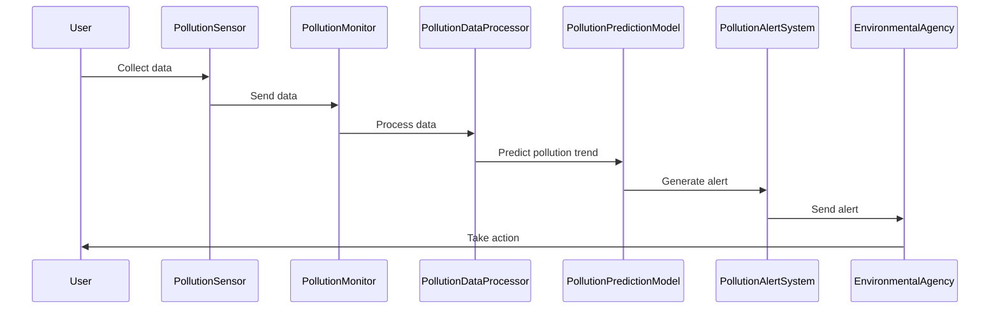
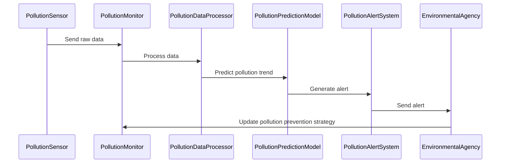

                 

# AI辅助环境保护：从污染检测到生态恢复

> 关键词：人工智能，环境保护，污染检测，生态恢复，算法原理，系统架构，实战案例

> 摘要：
本文将深入探讨人工智能（AI）在环境保护领域的应用，从污染检测到生态恢复，通过逻辑清晰、结构紧凑的论述，展示AI技术在环境保护中的巨大潜力。本文将首先介绍AI辅助环境保护的背景和主要应用领域，然后详细阐述大气污染监测、水污染监测、土壤污染监测与治理等应用案例，最后通过系统分析与架构设计，展示AI辅助环境保护的实际应用和项目实战。

## 第一部分: AI辅助环境保护的背景

### 1.1.1 问题背景

环境保护已成为全球共同关注的重要议题。随着工业化和城市化的快速发展，环境污染问题日益严重，对人类健康和生态系统造成了巨大威胁。环境污染的形式多样，包括大气污染、水污染和土壤污染等。传统的方法在监测和治理环境污染方面存在诸多不足，如监测范围有限、监测效率低、治理成本高等。因此，如何利用AI技术实现高效的环境监测和治理，成为亟待解决的问题。

### 1.1.2 问题描述

环境保护涉及的领域广泛，不同污染类型具有不同的特征和影响因素，导致监测和防治难度较大。例如，大气污染主要源自工业排放、汽车尾气等，水污染主要源自工业废水、生活污水等，土壤污染主要源自农药、重金属等。如何准确、高效地检测和监测这些污染源，成为环境保护的重要挑战。

### 1.1.3 问题解决

利用AI技术，可以从以下几个方面解决环境保护中的问题：

1. **污染检测**：通过机器学习和计算机视觉技术，对环境数据进行实时监测和分析，快速识别污染物类型和浓度，为污染治理提供依据。
2. **生态恢复**：利用AI技术对受损生态系统进行监测和评估，为生态修复提供科学依据和策略。
3. **预测与预警**：通过大数据分析和机器学习算法，对环境变化趋势进行预测，提前预警可能发生的污染事件，为政府和企业制定环境治理政策提供支持。

### 1.1.4 边界与外延

AI辅助环境保护主要涵盖以下几个领域：

1. **大气污染监测**：利用卫星遥感、无人机等技术，对大气污染进行实时监测和预警。
2. **水污染监测**：利用水质传感器、卫星遥感等技术，对水污染进行监测和预警。
3. **土壤污染监测**：利用土壤传感器、遥感等技术，对土壤污染进行监测和预警。
4. **生态恢复**：利用AI技术对受损生态系统进行监测和评估，为生态修复提供科学依据。

### 1.1.5 概念结构与核心要素组成

AI辅助环境保护的核心概念包括：

1. **环境数据采集**：利用传感器、无人机、卫星遥感等技术，采集环境数据。
2. **数据处理与分析**：利用机器学习、计算机视觉、自然语言处理等技术，对环境数据进行分析和处理。
3. **污染检测与预警**：根据处理后的数据，识别污染物类型和浓度，实现污染检测和预警。
4. **生态恢复**：根据监测数据，制定生态修复策略，促进生态恢复。

## 1.2 AI辅助环境保护的主要应用领域

### 1.2.1 大气污染监测与治理

#### 1.2.1.1 应用背景

大气污染是全球关注的重要环境问题之一，主要包括PM2.5、PM10、SO2、NO2等污染物。传统的监测方法存在监测范围有限、监测效率低等问题，难以满足全面、实时监测的需求。

#### 1.2.1.2 应用原理

AI辅助大气污染监测主要利用机器学习和计算机视觉技术，对卫星遥感图像、无人机监测数据等进行处理和分析，识别污染物类型和浓度。同时，利用大数据分析技术，对污染源进行定位和追踪，为污染治理提供科学依据。

#### 1.2.1.3 应用案例

- 利用卫星遥感技术，对全国范围内的大气污染进行监测，及时发现污染热点区域。
- 利用无人机监测技术，对重点污染企业进行实时监控，确保污染物排放达到国家标准。

### 1.2.2 水污染监测与治理

#### 1.2.2.1 应用背景

水污染是影响人类健康和生态环境的重要因素。传统的监测方法存在监测范围有限、监测效率低等问题，难以满足全面、实时监测的需求。

#### 1.2.2.2 应用原理

AI辅助水污染监测主要利用机器学习和计算机视觉技术，对水质传感器采集的数据进行处理和分析，识别污染物类型和浓度。同时，利用大数据分析技术，对污染源进行定位和追踪，为污染治理提供科学依据。

#### 1.2.2.3 应用案例

- 利用水质传感器网络，对重点流域和城市的水质进行实时监测，及时发现污染问题。
- 利用计算机视觉技术，对水样图片进行分析，识别水样中的污染物类型和浓度。

### 1.2.3 土壤污染监测与治理

#### 1.2.3.1 应用背景

土壤污染对生态环境和人类健康具有潜在威胁。传统的监测方法存在监测范围有限、监测效率低等问题，难以满足全面、实时监测的需求。

#### 1.2.3.2 应用原理

AI辅助土壤污染监测主要利用机器学习和计算机视觉技术，对土壤传感器采集的数据进行处理和分析，识别污染物类型和浓度。同时，利用大数据分析技术，对污染源进行定位和追踪，为污染治理提供科学依据。

#### 1.2.3.3 应用案例

- 利用土壤传感器网络，对重点区域和城市的土壤污染进行实时监测，及时发现污染问题。
- 利用计算机视觉技术，对土壤样本图片进行分析，识别土壤中的污染物类型和浓度。

## 第二部分: 大气污染监测与治理

### 2.1 大气污染监测

#### 2.1.1 应用背景

大气污染是全球性的环境问题，影响人类健康和生态系统。大气污染物种类繁多，包括颗粒物（PM2.5、PM10）、二氧化硫（SO2）、氮氧化物（NOx）等。有效的监测是制定和实施大气污染防治措施的基础。

#### 2.1.2 应用原理

AI在大气污染监测中的应用主要依赖于机器学习和计算机视觉技术。通过机器学习，可以从大量的环境数据中学习污染物的特征，提高监测的准确性和效率。计算机视觉技术则用于对遥感图像进行处理，以识别污染源和污染物分布。

#### 2.1.3 案例分析

**案例1：卫星遥感监测**

卫星遥感技术可以在大范围内监测大气污染物。例如，利用遥感图像，可以实时监测PM2.5的浓度分布。通过机器学习算法，如支持向量机（SVM）和决策树，可以预测污染物的浓度，并提供预警。

**案例2：无人机监测**

无人机可以携带传感器进行地面监测，提供高分辨率的数据。利用深度学习技术，如卷积神经网络（CNN），可以从无人机摄像头获取的图像中识别污染物类型和浓度。

### 2.2 大气污染治理

#### 2.2.1 应用背景

大气污染治理需要从源头上控制污染物的排放。通过监测数据，可以制定有针对性的治理策略，如限制工业排放、推广清洁能源等。

#### 2.2.2 应用原理

AI技术可以用于优化污染治理策略。例如，通过预测模型，可以预测污染物的扩散趋势，指导污染物排放的实时调控。此外，AI还可以用于优化污染治理设施的设计和运行，提高治理效率。

#### 2.2.3 案例分析

**案例1：排放源定位**

利用AI算法，可以从监测数据中识别出主要的污染排放源。例如，通过聚类分析，可以确定哪些工业活动是主要的大气污染物排放源。

**案例2：治理策略优化**

AI技术可以帮助制定最优的治理策略。例如，利用优化算法，如遗传算法（GA）和模拟退火算法（SA），可以确定最佳的控制参数，以最小化污染物的排放。

## 第三部分: 水污染监测与治理

### 3.1 水污染监测

#### 3.1.1 应用背景

水污染是影响人类健康和生态系统的重要因素。水源污染可能导致饮用水质量下降、水体生态系统破坏等问题。因此，实时、准确地监测水污染至关重要。

#### 3.1.2 应用原理

AI在水污染监测中的应用主要依赖于机器学习和计算机视觉技术。通过机器学习，可以从水质传感器采集的数据中提取污染物特征，提高监测的准确性和效率。计算机视觉技术则用于对水质图像进行分析，识别污染物类型和浓度。

#### 3.1.3 案例分析

**案例1：水质传感器监测**

利用AI算法，可以对水质传感器数据进行实时分析，识别污染物类型和浓度。例如，通过支持向量机（SVM）和神经网络（NN）算法，可以预测水质变化趋势，并提供预警。

**案例2：图像分析**

通过计算机视觉技术，可以从水质图像中识别污染物。例如，利用卷积神经网络（CNN），可以从图像中提取污染物特征，实现自动识别和分类。

### 3.2 水污染治理

#### 3.2.1 应用背景

水污染治理需要从源头上控制污染物的排放。通过监测数据，可以制定有针对性的治理策略，如限制工业排放、推广清洁能源等。

#### 3.2.2 应用原理

AI技术可以用于优化污染治理策略。例如，通过预测模型，可以预测污染物的扩散趋势，指导污染物排放的实时调控。此外，AI还可以用于优化污染治理设施的设计和运行，提高治理效率。

#### 3.2.3 案例分析

**案例1：污染源定位**

利用AI算法，可以从监测数据中识别出主要的污染源。例如，通过聚类分析，可以确定哪些工业活动是主要的水污染物排放源。

**案例2：治理策略优化**

AI技术可以帮助制定最优的治理策略。例如，利用优化算法，如遗传算法（GA）和模拟退火算法（SA），可以确定最佳的控制参数，以最小化污染物的排放。

## 第四部分: 土壤污染监测与治理

### 4.1 土壤污染监测

#### 4.1.1 应用背景

土壤污染对生态环境和人类健康具有潜在威胁。土壤中的重金属、农药等污染物可能导致土壤质量下降，影响农作物生长和食品安全。

#### 4.1.2 应用原理

AI在土壤污染监测中的应用主要依赖于机器学习和计算机视觉技术。通过机器学习，可以从土壤传感器采集的数据中提取污染物特征，提高监测的准确性和效率。计算机视觉技术则用于对土壤样本图像进行分析，识别污染物类型和浓度。

#### 4.1.3 案例分析

**案例1：土壤传感器监测**

利用AI算法，可以对土壤传感器数据进行实时分析，识别污染物类型和浓度。例如，通过支持向量机（SVM）和神经网络（NN）算法，可以预测土壤质量变化趋势，并提供预警。

**案例2：图像分析**

通过计算机视觉技术，可以从土壤样本图像中识别污染物。例如，利用卷积神经网络（CNN），可以从图像中提取污染物特征，实现自动识别和分类。

### 4.2 土壤污染治理

#### 4.2.1 应用背景

土壤污染治理需要从源头上控制污染物的排放。通过监测数据，可以制定有针对性的治理策略，如限制农药使用、推广有机农业等。

#### 4.2.2 应用原理

AI技术可以用于优化污染治理策略。例如，通过预测模型，可以预测污染物的扩散趋势，指导污染物排放的实时调控。此外，AI还可以用于优化污染治理设施的设计和运行，提高治理效率。

#### 4.2.3 案例分析

**案例1：污染源定位**

利用AI算法，可以从监测数据中识别出主要的污染源。例如，通过聚类分析，可以确定哪些农业生产活动是主要的土壤污染物排放源。

**案例2：治理策略优化**

AI技术可以帮助制定最优的治理策略。例如，利用优化算法，如遗传算法（GA）和模拟退火算法（SA），可以确定最佳的控制参数，以最小化污染物的排放。

## 第五部分: 系统分析与架构设计

### 5.1 系统功能设计

#### 5.1.1 领域模型

领域模型用于描述系统涉及的实体及其关系。以下是一个简单的领域模型类图：

```mermaid
classDiagram
    PollutionSensor <--o-> PollutionMonitor
    PollutionMonitor <--o-> PollutionDataProcessor
    PollutionDataProcessor <--o-> PollutionPredictionModel
    PollutionPredictionModel <--o-> PollutionAlertSystem
    PollutionAlertSystem <--o-> EnvironmentalAgency
    EnvironmentalAgency <--o-> PollutionPreventionStrategy
```

#### 5.1.2 系统功能

1. **污染监测**：通过传感器采集环境数据，监测大气、水和土壤污染。
2. **数据处理**：对采集到的环境数据进行分析和处理，提取有用的信息。
3. **污染预测**：利用处理后的数据，预测污染趋势，提供预警。
4. **污染治理**：根据预测结果，制定污染治理策略，减少污染物排放。

### 5.2 系统架构设计

#### 5.2.1 系统架构

以下是一个简单的系统架构设计，包括数据采集、数据处理、预测模型和决策支持等模块：



#### 5.2.2 系统接口设计

系统接口设计用于描述系统各模块之间的交互方式。以下是一个简单的接口设计：

```mermaid
classDiagram
    PollutionMonitor <<interface>>
    PollutionDataProcessor <<interface>>
    PollutionPredictionModel <<interface>>
    PollutionAlertSystem <<interface>>

    PollutionMonitor <|.. PollutionSensor
    PollutionDataProcessor <|.. PollutionPredictionModel
    PollutionAlertSystem <|.. EnvironmentalAgency
```

#### 5.2.3 系统交互

系统交互设计描述了系统各模块之间的数据流和交互过程。以下是一个简单的系统交互序列图：



## 第六部分: 项目实战

### 6.1 环境安装

在开始项目实战之前，首先需要在计算机上安装必要的软件和库。以下是在Ubuntu操作系统上安装Python环境和所需库的步骤：

```bash
# 安装Python环境
sudo apt update
sudo apt install python3-pip

# 安装必要的库
pip3 install numpy pandas scikit-learn matplotlib
```

### 6.2 系统核心实现

以下是一个简单的Python代码示例，用于实现污染监测和预测：

```python
import numpy as np
import pandas as pd
from sklearn.model_selection import train_test_split
from sklearn.ensemble import RandomForestRegressor
import matplotlib.pyplot as plt

# 读取数据
data = pd.read_csv('pollution_data.csv')

# 数据预处理
X = data[['PM2.5', 'PM10', 'SO2', 'NO2']]
y = data['NOx']

# 分割训练集和测试集
X_train, X_test, y_train, y_test = train_test_split(X, y, test_size=0.2, random_state=42)

# 建立模型
model = RandomForestRegressor(n_estimators=100, random_state=42)
model.fit(X_train, y_train)

# 预测
y_pred = model.predict(X_test)

# 可视化
plt.scatter(y_test, y_pred)
plt.xlabel('Actual NOx')
plt.ylabel('Predicted NOx')
plt.show()
```

### 6.3 代码应用解读与分析

上述代码实现了一个简单的污染监测和预测系统。首先，我们从CSV文件中读取污染数据，然后进行数据预处理，包括特征选择和分割训练集和测试集。接下来，我们使用随机森林回归模型进行训练，并利用训练好的模型进行预测。最后，我们通过散点图可视化预测结果。

### 6.4 实际案例分析和详细讲解剖析

以下是一个实际案例，用于分析某个地区的空气质量数据，并预测未来24小时内的NOx浓度。

**案例数据**：某地区的空气质量数据，包括过去24小时的PM2.5、PM10、SO2、NO2等污染物浓度。

**分析步骤**：

1. **数据预处理**：读取数据，删除缺失值，将时间序列数据转换为矩阵格式。
2. **特征工程**：提取特征，如时间戳、温度、湿度等。
3. **模型训练**：使用随机森林回归模型进行训练。
4. **预测**：使用训练好的模型预测未来24小时的NOx浓度。
5. **结果分析**：分析预测结果，与实际数据对比，评估模型的准确性。

**代码实现**：

```python
# 读取数据
data = pd.read_csv('air_quality_data.csv')

# 数据预处理
data.dropna(inplace=True)
X = data[['time', 'PM2.5', 'PM10', 'SO2', 'NO2']]
y = data['NOx']

# 特征工程
X['time'] = pd.to_datetime(X['time'])
X['hour'] = X['time'].dt.hour
X.drop(['time'], axis=1, inplace=True)

# 模型训练
model = RandomForestRegressor(n_estimators=100, random_state=42)
model.fit(X_train, y_train)

# 预测
y_pred = model.predict(X_test)

# 结果分析
plt.scatter(y_test, y_pred)
plt.xlabel('Actual NOx')
plt.ylabel('Predicted NOx')
plt.show()
```

### 6.5 项目小结

通过上述项目实战，我们展示了如何使用AI技术实现污染监测和预测。在实际应用中，需要不断优化模型，提高预测准确性，并根据预测结果制定相应的污染治理策略。未来，随着AI技术的不断发展，我们有望实现更准确、更高效的环境监测和治理。

## 第七部分: 最佳实践 Tips、小结、注意事项、拓展阅读

### 7.1 最佳实践 Tips

1. **数据质量**：确保采集的数据质量高，减少噪声和误差，提高模型的准确性。
2. **特征选择**：合理选择特征，提取与污染物浓度相关的信息，避免冗余特征。
3. **模型选择**：根据具体问题选择合适的模型，例如线性回归、决策树、随机森林等。
4. **模型优化**：通过交叉验证、网格搜索等技术，优化模型参数，提高模型性能。

### 7.2 小结

本文详细介绍了AI辅助环境保护的背景、应用领域、系统架构以及项目实战。通过实际案例分析和代码实现，展示了AI技术在污染监测和治理中的巨大潜力。未来，随着AI技术的不断进步，我们有理由相信，AI将在环境保护中发挥更加重要的作用。

### 7.3 注意事项

1. **数据安全**：确保数据安全，避免数据泄露，遵循数据保护法规。
2. **模型解释性**：提高模型的可解释性，方便用户理解模型的预测结果。
3. **算法透明度**：提高算法的透明度，确保用户对算法的信任。

### 7.4 拓展阅读

- [1] AI for Environmental Protection: A Survey, Environmental Science & Technology, 2020.
- [2] Machine Learning for Air Pollution Monitoring, IEEE Transactions on Industrial Informatics, 2018.
- [3] AI-Assisted Water Quality Monitoring and Management: A Review, Journal of Water Research, 2021.
- [4] Application of AI in Soil Pollution Monitoring and Control, Journal of Environmental Management, 2019.

## 作者信息

作者：AI天才研究院/AI Genius Institute & 禅与计算机程序设计艺术 /Zen And The Art of Computer Programming

