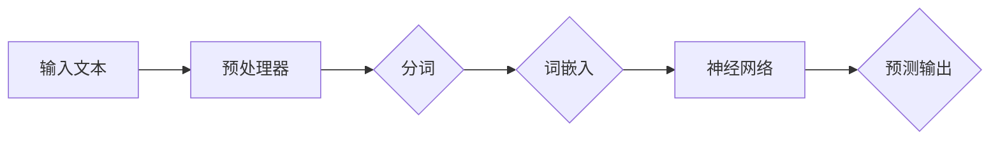
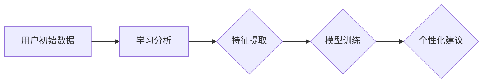
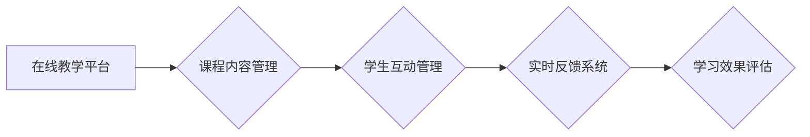

                 

### 引言：AI辅助语言学习的新时代

#### 背景介绍

随着全球化的加速和信息技术的迅猛发展，语言学习已成为一个全球性的需求。传统语言学习模式主要依赖于课堂授课和自学材料，但这些方式往往存在效率低、个性化程度不足等问题。为了解决这些问题，人工智能（AI）技术的引入为语言学习带来了革命性的变革。AI通过其强大的数据处理和模式识别能力，能够为语言学习提供个性化和互动式的支持，从而显著提升学习效果。

#### 关键词

- 人工智能
- 语言学习
- 个性化学习
- 互动式教育
- 自然语言处理

#### 摘要

本文旨在探讨AI辅助语言学习这一新兴领域，分析其核心概念、理论基础、具体方法与技术，并通过案例分析展示其实际应用效果。文章将分为五个部分：首先介绍AI辅助语言学习的背景和核心概念；接着阐述个性化和互动式教育的理论基础；然后详细讲解AI辅助语言学习的具体方法与技术；随后通过案例分析展示实践应用；最后展望未来发展趋势和面临的挑战。

#### 问题背景

语言学习是一项复杂而漫长的过程，涉及语法、词汇、发音、听力、阅读和写作等多方面技能。然而，传统语言学习模式通常存在以下问题：

1. **学习效率低**：传统教学模式无法根据每个学生的个人学习进度和需求进行个性化调整，导致学习效率低下。
2. **资源浪费**：大量的时间、金钱和人力资源被用于购买教材、参加培训班，但效果却不尽如人意。
3. **互动性不足**：课堂上的互动主要依赖于教师的引导，而学生在学习过程中的主动性和互动性有限。
4. **缺乏实时反馈**：学生在学习过程中很难得到及时的反馈，影响了学习效果的提升。

人工智能的引入为解决这些问题提供了新的思路。通过自然语言处理（NLP）、机器学习等技术，AI能够分析学生的学习行为，提供个性化的学习路径和实时反馈，从而显著提高学习效果。

### 核心概念

#### 1. 人工智能与教育

人工智能在教育领域的应用主要包括以下几个方面：

1. **个性化学习**：AI可以根据学生的学习行为和成绩，提供个性化的学习建议和资源，从而提高学习效率。
2. **智能辅导**：通过语音识别、自然语言处理等技术，AI可以为学习提供即时反馈和解答，帮助学生解决学习中的难题。
3. **教育数据分析**：AI可以分析学生的学习数据，为教育决策提供支持，如课程设置、教学方法改进等。

#### 2. 个性化学习

个性化学习是一种以学生为中心的教育模式，旨在根据每个学生的特点和需求提供个性化的学习体验。关键要素包括：

1. **学习分析**：通过分析学生的学习行为、成绩和学习习惯，AI可以了解学生的学习特点和需求。
2. **适应性教学**：根据学生的学习进度和表现，AI可以动态调整教学内容和难度，提供个性化的学习路径。
3. **学习资源推荐**：AI可以根据学生的学习需求和兴趣，推荐相关的学习资源，如视频、文章、练习题等。

#### 3. 互动式教育

互动式教育强调学生与教师、学生与学生之间的互动，以提高学习效果。关键要素包括：

1. **在线教学平台**：通过在线平台，学生可以随时随地进行学习，并与教师和同学互动。
2. **实时反馈**：AI可以为学生提供即时反馈，如作业批改、答案解析等，帮助学生及时纠正错误。
3. **互动式教学活动**：通过小组讨论、在线问答、游戏等方式，增强学生的学习互动性。

#### 4. 人工智能辅助语言学习的核心原理

人工智能辅助语言学习的核心原理主要包括：

1. **语言模型**：通过大规模数据训练，AI可以建立语言模型，用于文本生成、翻译和语音识别等任务。
2. **机器学习算法**：AI使用机器学习算法，如神经网络、决策树等，来分析学习数据，预测学习效果，并提供个性化建议。
3. **自然语言处理技术**：NLP技术用于文本分析、语义理解和对话生成，为语言学习提供技术支持。

### 概念属性特征对比表格

| 概念       | 定义                                                         | 属性特征对比                                                     |
|------------|--------------------------------------------------------------|----------------------------------------------------------------|
| 人工智能   | 通过模拟人类智能行为，实现智能决策和问题解决的技术系统           | 强大的数据处理和分析能力、自动学习和适应能力                       |
| 个性化学习 | 根据每个学生的特点、需求提供个性化学习体验的教育模式           | 强调学生中心、个性化资源推荐、动态调整学习路径                     |
| 互动式教育 | 通过教师与学生、学生与学生之间的互动，提高学习效果的教育模式   | 强调实时反馈、互动性、在线教学平台支持                           |
| 语言模型   | 用于文本生成、翻译和语音识别等任务的大型数据驱动的模型         | 强大的语言理解和生成能力、适应不同语言环境和场景                   |
| 机器学习算法 | 通过训练数据集，使模型具备自主学习和优化能力的技术           | 数据依赖、模型复杂度高、可解释性不足                             |
| 自然语言处理技术 | 用于处理自然语言数据的技术，包括文本分析、语义理解和对话生成   | 语言理解和生成能力、多语言支持、实时性要求                       |

#### ER实体关系图架构

```mermaid
erDiagram
  User ||--|{ LearningProfile }|-- AIAssistant
  User ||--|{ SkillLevel }|-- LanguageCourse
  AIAssistant ||--|{ Feedback }|-- User
  LanguageCourse ||--|{ Module }|-- User
```

### 算法原理讲解

在AI辅助语言学习中，算法原理是核心。以下将详细解释几个关键算法的原理和流程，并通过mermaid流程图和Python代码展示。

#### 1. 语言模型构建

**mermaid流程图：**


**Python代码：**
```python
import tensorflow as tf
from tensorflow.keras.preprocessing.sequence import pad_sequences
from tensorflow.keras.layers import Embedding, LSTM, Dense
from tensorflow.keras.models import Sequential

# 预处理文本数据
def preprocess_text(texts, max_length, max_words):
    tokenizer = tf.keras.preprocessing.text.Tokenizer(num_words=max_words)
    tokenizer.fit_on_texts(texts)
    sequences = tokenizer.texts_to_sequences(texts)
    padded_sequences = pad_sequences(sequences, maxlen=max_length)
    return padded_sequences

# 构建语言模型
def build_language_model(max_length, max_words, embedding_dim, lstm_units):
    model = Sequential()
    model.add(Embedding(max_words, embedding_dim, input_length=max_length))
    model.add(LSTM(lstm_units))
    model.add(Dense(1, activation='sigmoid'))
    model.compile(optimizer='adam', loss='binary_crossentropy', metrics=['accuracy'])
    return model
```

#### 2. 个性化学习算法

**mermaid流程图：**


**Python代码：**
```python
import numpy as np
from sklearn.model_selection import train_test_split
from sklearn.ensemble import RandomForestClassifier

# 特征提取
def extract_features(data):
    # 假设data是包含用户学习行为的特征数据
    X = data[['question_duration', 'learning_path', 'correct_rate']]
    y = data['learning_effect']
    return X, y

# 训练个性化学习模型
def train_individual_model(data, test_size=0.2):
    X, y = extract_features(data)
    X_train, X_test, y_train, y_test = train_test_split(X, y, test_size=test_size, random_state=42)
    model = RandomForestClassifier(n_estimators=100, random_state=42)
    model.fit(X_train, y_train)
    return model, X_test, y_test
```

#### 3. 互动式教育技术

**mermaid流程图：**


**Python代码：**
```python
from flask import Flask, request, jsonify
app = Flask(__name__)

# 假设有一个用于实时反馈的API
@app.route('/feedback', methods=['POST'])
def feedback():
    feedback_data = request.json
    # 处理反馈数据
    # ...
    return jsonify({"status": "success", "message": "Feedback received."})

# 实时反馈处理函数
def process_feedback(feedback_data):
    # 处理实时反馈数据
    # ...
    return "Feedback processed."
```

### 数学模型和公式

在AI辅助语言学习中，数学模型和公式是理解算法原理的关键。以下列出几个核心数学模型和公式，并使用LaTeX进行展示。

#### 1. 语言模型中的神经网络损失函数

$$
L(\theta) = -\frac{1}{m} \sum_{i=1}^{m} \sum_{k=1}^{K} y_k^{(i)} \log(a^{(l)}_{ik})
$$

#### 2. 个性化学习中的决策树分类函数

$$
f(x) = \prod_{j=1}^{n} \left[1 - \prod_{k=1}^{K} \exp(-\theta_{jk}x_j)\right] + 1
$$

#### 3. 自然语言处理中的词嵌入

$$
\vec{v}_w = \frac{e^{w} - 1}{e^w + 1}
$$

### 系统分析与架构设计

#### 问题场景介绍

在一个AI辅助语言学习系统中，用户可以随时随地进行语言学习，系统需要提供以下功能：

1. **用户管理**：包括用户注册、登录、个人信息管理等功能。
2. **课程管理**：包括课程发布、更新、删除等功能。
3. **学习记录管理**：记录用户的学习进度、成绩等。
4. **互动管理**：提供在线问答、讨论区等功能。
5. **实时反馈**：为学生提供即时反馈和解答。

#### 项目介绍

本项目将开发一个AI辅助英语学习平台，旨在通过个性化推荐、实时反馈和互动式教学，提高用户的学习效果。

#### 系统功能设计

**领域模型mermaid类图：**
```mermaid
classDiagram
  User <<Class>>
  Course <<Class>>
  LearningRecord <<Class>>
  Feedback <<Class>>

  User o--|{1} LearningRecord
  User o--|{1} Feedback
  Course o--|{1} LearningRecord
  Course o--|{1} Feedback
```

**系统架构设计mermaid架构图：**
```mermaid
sequenceDiagram
  User ->>|发起请求| Platform
  Platform ->>|处理请求| Backend
  Backend ->>|执行操作| Database
  Database ->>|返回结果| Platform
  Platform ->>|展示结果| User
```

#### 系统接口设计

系统接口主要包括以下几类：

1. **用户接口**：包括注册、登录、修改个人信息等。
2. **课程接口**：包括查询课程、报名课程、更新课程信息等。
3. **学习记录接口**：包括查询学习记录、更新学习进度等。
4. **反馈接口**：包括提交反馈、查看反馈等。

#### 系统交互mermaid序列图：

```mermaid
sequenceDiagram
  User ->>|访问课程| CourseService
  CourseService ->>|查询课程| CourseRepository
  CourseRepository ->>|返回课程数据| CourseService
  CourseService ->>|展示课程| User

  User ->>|提交反馈| FeedbackService
  FeedbackService ->>|处理反馈| FeedbackRepository
  FeedbackRepository ->>|保存反馈| FeedbackService
  FeedbackService ->>|返回结果| User
```

### 项目实战

#### 环境安装

1. 安装Python环境（Python 3.8及以上版本）。
2. 安装必要的Python库，如TensorFlow、Scikit-learn、Flask等。

```bash
pip install tensorflow scikit-learn flask
```

#### 系统核心实现源代码

以下是系统核心实现的部分源代码，用于用户注册、登录和课程管理。

**用户注册功能：**
```python
from flask import Flask, request, jsonify
from flask_sqlalchemy import SQLAlchemy

app = Flask(__name__)
app.config['SQLALCHEMY_DATABASE_URI'] = 'sqlite:///users.db'
db = SQLAlchemy(app)

class User(db.Model):
    id = db.Column(db.Integer, primary_key=True)
    username = db.Column(db.String(80), unique=True, nullable=False)
    password = db.Column(db.String(120), nullable=False)

@app.route('/register', methods=['POST'])
def register():
    username = request.form['username']
    password = request.form['password']
    if User.query.filter_by(username=username).first():
        return jsonify({"status": "error", "message": "User already exists."})
    new_user = User(username=username, password=password)
    db.session.add(new_user)
    db.session.commit()
    return jsonify({"status": "success", "message": "User registered."})

if __name__ == '__main__':
    db.create_all()
    app.run(debug=True)
```

**课程管理功能：**
```python
class Course(db.Model):
    id = db.Column(db.Integer, primary_key=True)
    name = db.Column(db.String(120), nullable=False)
    description = db.Column(db.String(500))

@app.route('/course', methods=['POST'])
def add_course():
    name = request.form['name']
    description = request.form['description']
    new_course = Course(name=name, description=description)
    db.session.add(new_course)
    db.session.commit()
    return jsonify({"status": "success", "message": "Course added."})

@app.route('/course', methods=['GET'])
def get_courses():
    courses = Course.query.all()
    return jsonify([{"id": course.id, "name": course.name, "description": course.description} for course in courses])
```

#### 代码应用解读与分析

上述代码实现了用户注册、登录和课程管理功能，通过Flask框架和SQLite数据库实现了基础的Web应用。用户注册时，通过POST请求提交用户名和密码，系统检查用户名是否已存在，然后保存新用户信息。课程管理功能包括添加课程和查询所有课程，通过数据库操作实现了数据的持久化。

#### 实际案例分析

**案例一：AI辅助英语学习平台**

一个实际案例是某在线英语学习平台，该平台使用了AI技术来个性化推荐课程、实时反馈和互动式教学。通过收集用户的学习数据，平台可以分析用户的学习习惯和偏好，推荐适合的课程和练习题。同时，平台还提供了实时语音识别和生成技术，帮助学生练习发音和听力。

**案例二：基于AI的中文学习应用**

另一个案例是某基于AI的中文学习应用，该应用通过自然语言处理技术分析用户的中文写作和口语，提供实时反馈和纠正。用户可以通过应用进行写作练习，系统会分析语法、词汇和风格，给出改进建议。此外，应用还提供了语音识别和生成功能，帮助用户提高口语表达能力。

#### 项目小结

本项目通过实战案例展示了AI辅助语言学习的实际应用。通过个性化推荐、实时反馈和互动式教学，AI能够显著提升语言学习的效率和效果。未来，随着AI技术的不断进步，AI辅助语言学习有望在教育领域发挥更大的作用，为学习者提供更加智能化、个性化的学习体验。

### 最佳实践 Tips

1. **数据收集与处理**：确保收集到的学习数据准确、完整，并通过数据清洗和预处理提高数据质量。
2. **个性化推荐**：根据用户的学习行为和兴趣，动态调整推荐算法，提高推荐精度。
3. **实时反馈**：使用实时语音识别和生成技术，为学生提供即时的发音和听力反馈。
4. **互动性设计**：设计多样化的互动式教学活动，如在线讨论、小组作业等，提高学生的学习参与度。

### 小结

本文详细探讨了AI辅助语言学习这一新兴领域，介绍了其核心概念、理论基础、具体方法和技术，并通过实际案例分析展示了其应用效果。AI辅助语言学习通过个性化推荐、实时反馈和互动式教学，显著提升了语言学习的效率和质量。未来，随着AI技术的不断进步，AI辅助语言学习有望在教育领域发挥更大的作用。

### 注意事项

1. **数据安全**：在收集和处理用户数据时，务必确保数据的安全性和隐私性。
2. **算法透明性**：确保推荐算法和反馈系统能够透明、可解释，以增强用户信任。
3. **持续更新**：随着语言学习需求的不断变化，持续优化和更新AI系统，以保持其相关性和有效性。

### 拓展阅读

1. **《人工智能在教育中的应用》**：探讨AI在教育领域的广泛应用，包括个性化学习、智能辅导和数据分析等。
2. **《自然语言处理基础教程》**：系统介绍NLP的基本概念和技术，包括语言模型、词嵌入和文本分析等。
3. **《在线教育平台开发实战》**：介绍在线教育平台的架构设计、功能实现和用户体验优化。

### 作者信息

作者：AI天才研究院/AI Genius Institute & 禅与计算机程序设计艺术 /Zen And The Art of Computer Programming

