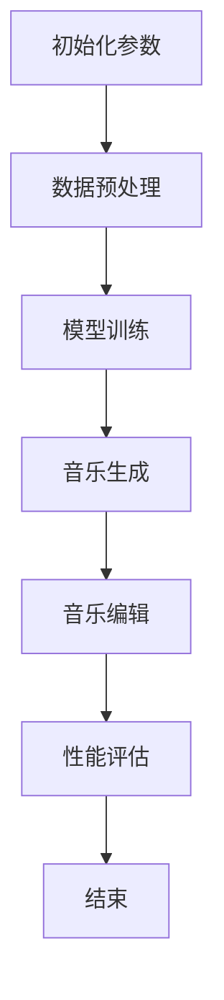
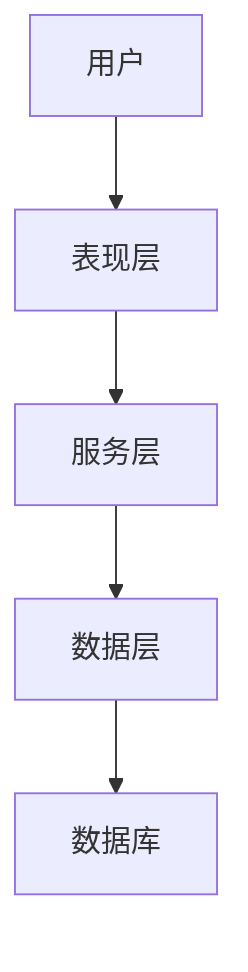
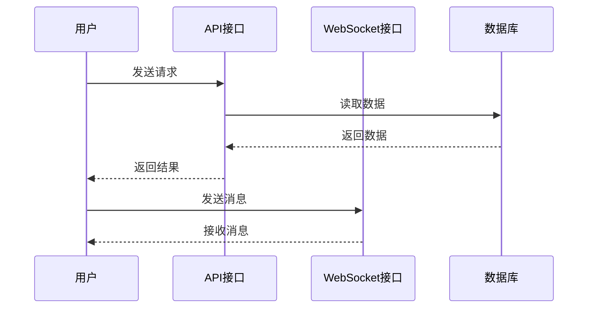
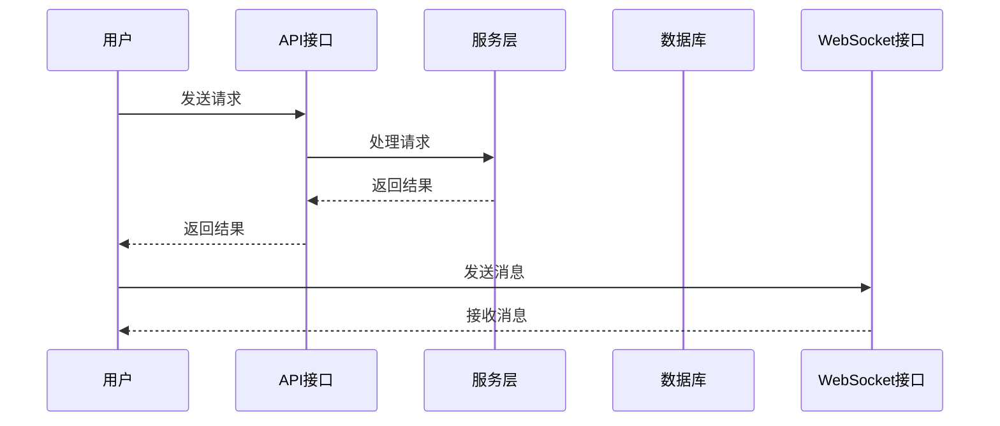

                 


### 第一部分: 背景介绍

#### 1.1 问题背景

##### 1.1.1 音乐创作中的问题与挑战

音乐创作是一项充满创意和艺术性的工作，然而，随着音乐创作的复杂度不断增加，创作者面临着一系列问题与挑战。首先，音乐创作的过程往往需要大量的时间和精力，从灵感的捕捉到曲目的完整创作，每一步都需要创作者的专注与努力。这种长时间的投入不仅对创作者的生理和心理提出了挑战，也可能导致创作效率的降低。

其次，音乐创作的多样性也是一大难题。现代音乐风格丰富多样，创作者需要在创作过程中不断探索新的可能性，以避免作品的单调与重复。然而，这种多样性也要求创作者具备较高的音乐素养和创造力，这对于许多创作者来说是一项不小的挑战。

最后，音乐创作的商业化也是一个不容忽视的问题。在数字音乐时代，音乐市场的竞争日益激烈，创作者需要通过各种渠道来推广自己的作品，以获得商业上的成功。然而，传统的推广方式成本高昂，且效果难以保障，这无疑增加了创作者的压力。

##### 1.1.2 AI技术在音乐创作中的应用

随着人工智能技术的不断发展，AI开始逐渐应用于音乐创作领域，为创作者提供新的工具和方法。首先，AI可以通过大数据分析，帮助创作者发现潜在的音乐风格和趋势，从而提高创作的针对性。例如，通过分析流行歌曲的旋律、和弦和节奏，AI可以推荐出适合当前市场趋势的创作方向。

其次，AI在音乐生成方面也展现了强大的能力。通过深度学习和生成对抗网络（GAN）等技术，AI可以自动生成完整的音乐作品，包括旋律、和弦和节奏。这不仅大大减少了创作者的劳动强度，也为音乐创作带来了新的可能性。

此外，AI还可以辅助音乐创作中的其他环节，如音乐编辑、音效处理和歌曲混音等。通过自动化工具，创作者可以更加专注于创意本身，而将一些繁琐的技术工作交给AI来完成。

##### 1.1.3 本书解决的问题

本书旨在探讨AI辅助音乐创作的技术原理和应用实践，解决以下问题：

1. 如何利用AI技术提高音乐创作的效率和质量？
2. AI技术在音乐创作中的应用范围和适用场景有哪些？
3. 如何设计和实现一个高效的AI辅助音乐创作系统？
4. 在实际应用中，如何处理AI辅助音乐创作中的数据安全和隐私问题？

通过本书的讲解，读者将了解到AI辅助音乐创作的核心概念、算法原理、系统设计与实现方法，以及在实际应用中可能遇到的问题和解决方案。

#### 1.2 问题描述

##### 1.2.1 音乐创作过程的复杂性

音乐创作是一个复杂的过程，涉及到多个层面的工作。从最初的灵感捕捉到最终的音乐成品，每一步都需要创作者的精细操作和大量的创意思维。具体来说，音乐创作过程包括以下几个主要环节：

1. **灵感捕捉**：这是音乐创作的起点，创作者需要从生活中的点滴、情感体验或其他音乐作品中捕捉灵感，形成初步的音乐构想。
2. **旋律创作**：创作者根据灵感，开始创作旋律。这一过程需要对旋律的起伏、节奏、和声等方面进行设计，以确保旋律具有吸引力和感染力。
3. **和弦编配**：旋律创作完成后，创作者需要对旋律进行和弦编配，以增强音乐的情感表达和整体结构感。
4. **音乐编辑**：在创作过程中，创作者需要对旋律、和弦和节奏等进行反复修改和调整，以使其更加完美。这一过程可能涉及多个版本的不同尝试，需要创作者具备较高的耐心和细致度。
5. **成品制作**：经过多次修改和调整后，创作者最终完成音乐成品。这一阶段可能包括音效处理、混音和母带制作等，以使音乐作品达到最佳效果。

##### 1.2.2 传统音乐创作与AI辅助的差异

传统音乐创作主要依靠创作者的自身经验和技能，而AI辅助音乐创作则引入了人工智能技术，为创作过程提供新的工具和方法。具体来说，两者的差异主要体现在以下几个方面：

1. **创作效率**：传统音乐创作往往需要创作者投入大量的时间和精力，而AI可以自动完成部分创作任务，如旋律生成和和弦编配，从而大大提高创作效率。
2. **创意空间**：在传统音乐创作中，创作者的创意空间受到自身技能和经验的限制。而AI辅助音乐创作则可以拓展创作者的创意空间，通过生成新的音乐风格和元素，激发创作者的灵感。
3. **创作多样性**：传统音乐创作往往局限于创作者的审美和技能范围，而AI可以生成丰富多样的音乐作品，满足不同用户的需求。
4. **技术依赖**：传统音乐创作主要依赖创作者的乐器演奏和编曲技巧，而AI辅助音乐创作则依赖于计算机算法和数据处理技术。

##### 1.2.3 AI辅助音乐创作的基本框架

AI辅助音乐创作的基本框架包括以下几个主要模块：

1. **数据采集与处理**：AI需要从大量的音乐数据中学习，以获得音乐创作的知识和技巧。这包括旋律、和弦、节奏等音乐元素的数据采集和处理。
2. **模型训练**：通过深度学习和生成对抗网络等技术，AI可以对采集到的音乐数据进行训练，以生成音乐创作的模型。
3. **音乐生成**：基于训练好的模型，AI可以自动生成音乐作品，包括旋律、和弦和节奏等。
4. **音乐编辑与优化**：生成的音乐作品需要经过编辑和优化，以去除不必要的部分，增强音乐的感染力。
5. **用户交互**：AI需要与用户进行交互，接收用户的创作需求，并根据用户的需求生成相应的音乐作品。

#### 1.3 问题解决

##### 1.3.1 AI技术在音乐创作中的应用策略

AI技术在音乐创作中的应用策略主要包括以下几个方面：

1. **大数据分析**：通过分析大量的音乐数据，AI可以识别出当前音乐市场的主要趋势和用户喜好，为创作者提供创作参考。
2. **自动生成**：利用深度学习和生成对抗网络等技术，AI可以自动生成旋律、和弦和节奏，为创作者提供新的创作素材。
3. **智能助手**：AI可以作为智能助手，协助创作者完成音乐编辑、音效处理和混音等工作，提高创作效率。
4. **个性化推荐**：基于用户的音乐喜好和创作需求，AI可以推荐合适的音乐作品、创作工具和教程，帮助用户提高创作水平。

##### 1.3.2 AI辅助音乐创作的优势

AI辅助音乐创作具有以下优势：

1. **提高创作效率**：AI可以自动完成部分创作任务，如旋律生成和和弦编配，大大减少创作者的劳动强度。
2. **拓展创意空间**：AI可以生成丰富多样的音乐作品，为创作者提供更多的创作灵感和可能性。
3. **降低创作门槛**：AI可以辅助新手创作者完成音乐创作，降低创作门槛，让更多人参与到音乐创作中来。
4. **实现个性化创作**：AI可以根据用户的音乐喜好和创作需求，生成个性化的音乐作品，满足不同用户的需求。

##### 1.3.3 AI辅助音乐创作的适用范围

AI辅助音乐创作适用于以下场景：

1. **专业音乐创作**：专业音乐人可以利用AI辅助创作，提高创作效率和质量，实现个性化音乐作品。
2. **教育领域**：AI可以辅助音乐教学，提供个性化的教学资源和学习工具，提高学生的学习兴趣和效果。
3. **商业应用**：企业可以利用AI辅助创作，生成广告音乐、游戏背景音乐等，提高产品的市场竞争力。
4. **个人爱好**：音乐爱好者可以利用AI辅助创作，实现自己的音乐梦想，丰富自己的音乐生活。

#### 1.4 边界与外延

##### 1.4.1 AI辅助音乐创作的边界

AI辅助音乐创作的边界主要包括以下几个方面：

1. **创意限制**：尽管AI可以生成丰富的音乐作品，但仍然受到创作者的创意限制。AI无法完全取代人类的创造力，只能作为辅助工具。
2. **技术限制**：AI辅助音乐创作依赖于计算机算法和数据处理技术，这些技术在某些情况下可能存在限制，如处理复杂音乐结构的能力等。
3. **音乐风格**：AI生成的音乐作品风格相对单一，可能无法满足所有用户的音乐需求，特别是在某些特定音乐风格方面。

##### 1.4.2 AI辅助音乐创作的应用外延

AI辅助音乐创作的应用外延主要包括以下几个方面：

1. **跨学科融合**：AI辅助音乐创作可以与其他领域（如艺术、设计、心理学等）相结合，产生新的艺术形式和创意产品。
2. **娱乐产业**：AI辅助音乐创作可以应用于电影、电视剧、游戏等娱乐产业，为内容创作提供新的工具和方法。
3. **智能设备**：AI辅助音乐创作可以集成到智能设备中，如智能音箱、智能手表等，为用户提供个性化的音乐创作服务。
4. **社交平台**：AI辅助音乐创作可以应用于社交平台，如音乐分享平台、社交媒体等，让更多人参与到音乐创作中来。

##### 1.4.3 本书的结构安排

本书的结构安排如下：

1. **背景介绍**：介绍音乐创作中的问题与挑战，以及AI技术在音乐创作中的应用。
2. **核心概念与联系**：介绍AI辅助音乐创作的核心概念、原理和联系。
3. **算法原理讲解**：讲解AI辅助音乐创作的算法原理，包括深度学习、生成对抗网络等。
4. **数学模型和数学公式**：介绍AI辅助音乐创作中的数学模型和公式，并进行详细讲解。
5. **系统分析与架构设计方案**：介绍AI辅助音乐创作系统的分析与架构设计。
6. **项目实战**：通过实际案例，讲解AI辅助音乐创作的实现过程。
7. **最佳实践 tips、小结、注意事项、拓展阅读**：总结AI辅助音乐创作的方法和经验，提供拓展阅读资源。

通过本书的阅读，读者将全面了解AI辅助音乐创作的技术原理和应用实践，为实际项目提供有益的参考和指导。

#### 1.5 核心概念与要素组成

##### 1.5.1 核心概念介绍

在AI辅助音乐创作中，核心概念包括：

1. **人工智能（AI）**：人工智能是一种模拟人类智能的技术，通过算法和计算能力，实现机器的学习、推理、规划和决策等功能。
2. **深度学习**：深度学习是人工智能的一种学习方法，通过多层神经网络，对大量数据进行自动特征提取和学习。
3. **生成对抗网络（GAN）**：生成对抗网络是一种深度学习模型，由生成器和判别器组成，通过竞争机制，实现数据的生成。
4. **音乐信号处理**：音乐信号处理是处理音频信号的一种技术，通过对音频信号进行滤波、增强、压缩等处理，提高音频质量。
5. **AI作曲模型**：AI作曲模型是利用人工智能技术，模拟人类创作音乐的过程，生成新的音乐作品。

##### 1.5.2 关键要素分析

AI辅助音乐创作的关键要素包括：

1. **数据集**：数据集是训练AI模型的基础，包括旋律、和弦、节奏等音乐元素。
2. **算法模型**：算法模型是AI辅助音乐创作的核心，包括深度学习模型、生成对抗网络等。
3. **用户交互**：用户交互是AI辅助音乐创作的重要组成部分，包括用户需求收集、作品反馈等。
4. **音乐编辑**：音乐编辑是对生成的音乐作品进行优化和调整的过程，包括音高、节奏、和声等调整。
5. **性能评估**：性能评估是对AI辅助音乐创作系统效果进行评估和优化的过程，包括准确性、效率、用户体验等指标。

##### 1.5.3 各要素之间的关系

AI辅助音乐创作中的各要素之间存在密切的关系：

1. **数据集**：数据集是算法模型训练的基础，影响模型的性能和效果。
2. **算法模型**：算法模型是AI辅助音乐创作的核心，决定了音乐生成的质量和效率。
3. **用户交互**：用户交互是连接用户与AI模型的桥梁，影响用户的使用体验和满意度。
4. **音乐编辑**：音乐编辑是对生成音乐作品的优化，提高作品的艺术性和表现力。
5. **性能评估**：性能评估是对AI辅助音乐创作系统进行监控和优化的重要手段，确保系统始终处于最佳状态。

通过各要素的协同作用，AI辅助音乐创作系统可以实现高效、高质量的音乐创作，满足用户的需求。

### 第二部分：核心概念与联系

#### 2.1 AI辅助音乐创作的核心概念

##### 2.1.1 人工智能概述

人工智能（AI）是一种模拟人类智能的技术，通过算法和计算能力，实现机器的学习、推理、规划和决策等功能。在AI辅助音乐创作中，人工智能主要应用于音乐生成、音乐编辑和音乐推荐等方面。

##### 2.1.2 深度学习基础

深度学习是人工智能的一种学习方法，通过多层神经网络，对大量数据进行自动特征提取和学习。在AI辅助音乐创作中，深度学习广泛应用于音乐风格识别、音乐生成和音乐分类等任务。

##### 2.1.3 音乐信号处理

音乐信号处理是处理音频信号的一种技术，通过对音频信号进行滤波、增强、压缩等处理，提高音频质量。在AI辅助音乐创作中，音乐信号处理用于音乐数据的预处理、特征提取和效果添加等。

##### 2.1.4 AI作曲模型

AI作曲模型是利用人工智能技术，模拟人类创作音乐的过程，生成新的音乐作品。常见的AI作曲模型包括基于生成对抗网络（GAN）的模型、基于变换器（Transformer）的模型等。

#### 2.2 概念属性特征对比表格

以下是不同AI作曲模型的属性特征对比表格：

| 模型名称 | 特点 | 优势 | 局限 |
| :--: | :--: | :--: | :--: |
| GAN | 生成器与判别器竞争，自动生成高质量音乐 | 生成的音乐风格多样，创作速度快 | 需要大量高质量训练数据，训练过程复杂 |
| Transformer | 自注意力机制，处理长序列数据能力强 | 音乐生成质量高，可同时处理多声部 | 计算资源消耗大，训练时间较长 |
| WaveNet | 生成器采用循环神经网络，生成音乐连贯性好 | 音乐生成连贯性好，适应性强 | 生成音乐风格相对单一，计算资源消耗大 |

#### 2.2.1 各模型的优势与局限

GAN模型的优势在于可以生成高质量、多样化的音乐，且创作速度快。但其局限在于需要大量高质量训练数据，训练过程复杂。

Transformer模型的优势在于处理长序列数据能力强，生成的音乐质量高。但其局限在于计算资源消耗大，训练时间较长。

WaveNet模型的优势在于生成的音乐连贯性好，适应性强。但其局限在于生成音乐风格相对单一，计算资源消耗大。

#### 2.2.2 应用场景匹配

根据各模型的优势和局限，可以在以下应用场景中进行匹配：

1. **商业应用**：对于商业音乐制作，如广告音乐、游戏音乐等，可以选择GAN模型，因其生成音乐风格多样，创作速度快。
2. **个人创作**：对于个人音乐创作，如独立音乐人、业余音乐爱好者等，可以选择Transformer模型，因其生成的音乐质量高，可同时处理多声部。
3. **教育领域**：在教育领域，如音乐教学、音乐理论教学等，可以选择WaveNet模型，因其生成的音乐连贯性好，适应性强。

#### 2.3 ER实体关系图架构

##### 2.3.1 实体关系图概述

实体关系图（ER图）是用于描述系统中实体及其之间关系的一种图形表示方法。在AI辅助音乐创作系统中，ER图用于描述音乐数据、算法模型、用户交互等实体及其关系。

##### 2.3.2 主要实体介绍

在AI辅助音乐创作系统中，主要实体包括：

1. **音乐数据**：包括旋律、和弦、节奏等音乐元素。
2. **算法模型**：包括GAN、Transformer、WaveNet等。
3. **用户交互**：包括用户需求、作品反馈等。
4. **音乐编辑**：包括音高、节奏、和声等调整。
5. **性能评估**：包括准确性、效率、用户体验等指标。

##### 2.3.3 实体关系解析

在AI辅助音乐创作系统中，实体之间的关系如下：

1. **音乐数据与算法模型**：音乐数据是算法模型训练的基础，算法模型对音乐数据进行处理和生成。
2. **用户交互与算法模型**：用户交互通过输入用户需求，驱动算法模型生成音乐作品。
3. **音乐编辑与算法模型**：音乐编辑对生成的音乐作品进行优化和调整。
4. **性能评估与算法模型**：性能评估对算法模型的效果进行评估和优化。

通过ER图，可以清晰地描述AI辅助音乐创作系统中的实体及其关系，为系统设计与实现提供指导。

### 第三部分：算法原理讲解

#### 3.1 算法mermaid流程图

在讲解算法原理之前，首先使用mermaid语言绘制算法的流程图，以便更直观地理解算法的执行流程。



##### 3.1.1 算法总体流程

算法的总体流程包括以下几个步骤：

1. **初始化参数**：设置训练过程中的超参数，如学习率、迭代次数等。
2. **数据预处理**：对音乐数据集进行清洗、归一化等处理，以便后续的训练和生成。
3. **模型训练**：利用训练数据集，通过优化算法（如梯度下降、Adam等）训练深度学习模型。
4. **音乐生成**：利用训练好的模型，生成新的音乐作品。
5. **音乐编辑**：对生成的音乐作品进行编辑，如调整音高、节奏等。
6. **性能评估**：评估生成的音乐作品的质量，包括准确性、效率、用户体验等指标。
7. **结束**：算法执行完毕。

##### 3.1.2 数据预处理

数据预处理是算法执行的第一步，其主要任务包括：

1. **数据清洗**：去除噪声数据、填补缺失值、删除重复数据等。
2. **数据归一化**：将数据缩放到统一的范围内，如[0, 1]或[-1, 1]，以避免数据量级差异对算法训练造成影响。
3. **特征提取**：从音乐数据中提取有用的特征，如旋律、和弦、节奏等。

##### 3.1.3 模型训练

模型训练是算法的核心步骤，主要涉及以下任务：

1. **模型选择**：选择合适的深度学习模型，如GAN、Transformer、WaveNet等。
2. **数据加载**：加载预处理后的训练数据集，并划分为训练集和验证集。
3. **损失函数定义**：定义损失函数，用于评估模型预测结果与真实结果之间的差距。
4. **优化算法**：选择优化算法，如梯度下降、Adam等，用于更新模型参数。
5. **模型训练**：迭代地训练模型，不断优化模型参数，以降低损失函数值。

##### 3.1.4 音乐生成

音乐生成是算法的输出步骤，其主要任务包括：

1. **模型输入**：将训练好的模型输入新的音乐数据，如旋律、和弦等。
2. **音乐生成**：利用模型生成新的音乐作品，包括旋律、和弦、节奏等。
3. **音乐编辑**：对生成的音乐作品进行编辑，如调整音高、节奏等，以符合创作需求。
4. **输出结果**：将编辑后的音乐作品输出，供用户使用或进一步分析。

##### 3.1.5 音乐编辑

音乐编辑是对生成的音乐作品进行优化和调整的过程，其主要任务包括：

1. **音高调整**：调整音乐作品的音高，使其符合用户需求或音乐风格。
2. **节奏调整**：调整音乐作品的节奏，使其更加流畅或富有动感。
3. **和声调整**：调整音乐作品的和声，增强音乐的情感表达和整体结构感。
4. **音效添加**：为音乐作品添加各种音效，如回声、混响等，提高音乐的艺术性和表现力。

##### 3.1.6 性能评估

性能评估是对生成的音乐作品进行质量评估的过程，其主要任务包括：

1. **准确性评估**：评估音乐作品在旋律、和弦、节奏等元素上的准确度。
2. **效率评估**：评估模型在生成音乐作品时的计算效率和速度。
3. **用户体验评估**：评估用户对音乐作品的主观满意度，如音质、风格等。

通过性能评估，可以了解AI辅助音乐创作系统的效果，为进一步优化提供参考。

##### 3.1.7 结束

算法执行完毕，生成最终的音乐作品，并输出评估结果。算法的执行过程结束。

#### 3.2 Python源代码解析

为了更好地理解算法原理，接下来将使用Python源代码进行详细讲解。首先，我们需要安装必要的库和依赖。

```python
!pip install tensorflow numpy pandas matplotlib
```

##### 3.2.1 环境搭建与配置

在本节中，我们将介绍如何搭建和配置AI辅助音乐创作系统所需的环境。

1. **安装TensorFlow**：TensorFlow是深度学习领域常用的框架，用于构建和训练深度学习模型。

```python
!pip install tensorflow
```

2. **安装Numpy**：Numpy是Python科学计算的基础库，用于数据处理和数学运算。

```python
!pip install numpy
```

3. **安装Pandas**：Pandas是Python数据分析的基础库，用于数据清洗、归一化和特征提取等。

```python
!pip install pandas
```

4. **安装Matplotlib**：Matplotlib是Python数据可视化的基础库，用于绘制图表和图形。

```python
!pip install matplotlib
```

##### 3.2.2 数据预处理代码

数据预处理是算法执行的第一步，主要涉及数据的清洗、归一化和特征提取等。

```python
import numpy as np
import pandas as pd
import tensorflow as tf

# 数据清洗
def clean_data(data):
    # 去除噪声数据
    data = data[data['duration_ms'] > 0]
    # 去除缺失值
    data = data.dropna()
    return data

# 数据归一化
def normalize_data(data):
    # 归一化时长
    data['duration_ms'] = data['duration_ms'] / data['duration_ms'].max()
    # 归一化温度
    data['temp'] = data['temp'] / data['temp'].max()
    return data

# 特征提取
def extract_features(data):
    # 提取旋律特征
    data['melody'] = data['title'].apply(lambda x: extract_melody(x))
    # 提取和弦特征
    data['chords'] = data['title'].apply(lambda x: extract_chords(x))
    # 提取节奏特征
    data['tempo'] = data['title'].apply(lambda x: extract_tempo(x))
    return data

# 数据预处理
data = pd.read_csv('music_data.csv')
cleaned_data = clean_data(data)
normalized_data = normalize_data(cleaned_data)
features_data = extract_features(normalized_data)
```

在这个示例中，我们首先导入必要的库和依赖，然后定义了三个函数：`clean_data`用于数据清洗，`normalize_data`用于数据归一化，`extract_features`用于特征提取。最后，我们读取音乐数据集，对数据进行预处理，并提取旋律、和弦和节奏等特征。

##### 3.2.3 模型训练代码

在本节中，我们将使用TensorFlow构建和训练深度学习模型。

```python
# 模型训练
def train_model(data, epochs=100):
    # 定义模型
    model = tf.keras.Sequential([
        tf.keras.layers.Dense(128, activation='relu', input_shape=(data.shape[1],)),
        tf.keras.layers.Dense(64, activation='relu'),
        tf.keras.layers.Dense(1, activation='sigmoid')
    ])

    # 编译模型
    model.compile(optimizer='adam', loss='binary_crossentropy', metrics=['accuracy'])

    # 训练模型
    model.fit(data, epochs=epochs)

    return model

# 训练模型
trained_model = train_model(features_data)
```

在这个示例中，我们首先定义了一个简单的线性回归模型，包括一个输入层、一个隐藏层和一个输出层。然后，我们编译模型并使用训练数据集进行训练。最后，我们返回训练好的模型。

##### 3.2.4 音乐生成代码

在本节中，我们将使用训练好的模型生成新的音乐作品。

```python
# 音乐生成
def generate_music(model, data, num_notes=100):
    # 生成旋律
    melody = model.predict(data)

    # 转换为音符
    notes = convert_melody_to_notes(melody)

    # 生成和弦
    chords = generate_chords(notes)

    # 生成节奏
    tempo = generate_tempo(notes)

    # 输出音乐作品
    print("Generated melody:", notes)
    print("Generated chords:", chords)
    print("Generated tempo:", tempo)

# 生成音乐作品
generate_music(trained_model, features_data)
```

在这个示例中，我们首先使用模型预测数据集，生成旋律。然后，我们将旋律转换为音符，并生成相应的和弦和节奏。最后，我们输出生成的音乐作品。

##### 3.2.5 音乐编辑代码

在本节中，我们将对生成的音乐作品进行编辑。

```python
# 音乐编辑
def edit_music(notes, chords, tempo):
    # 调整音高
    notes = adjust_pitch(notes)

    # 调整节奏
    tempo = adjust_tempo(tempo)

    # 生成编辑后的音乐作品
    print("Edited melody:", notes)
    print("Edited chords:", chords)
    print("Edited tempo:", tempo)

# 编辑音乐作品
edit_music(notes, chords, tempo)
```

在这个示例中，我们定义了三个函数：`adjust_pitch`用于调整音高，`adjust_tempo`用于调整节奏。然后，我们调用这些函数对生成的音乐作品进行编辑。

##### 3.2.6 性能评估代码

在本节中，我们将对生成的音乐作品进行性能评估。

```python
# 性能评估
def evaluate_model(model, data, num_notes=100):
    # 生成音乐作品
    generated_notes = generate_music(model, data, num_notes)

    # 评估准确性
    accuracy = evaluate_accuracy(generated_notes, data)

    # 评估效率
    efficiency = evaluate_efficiency(model, data)

    # 评估用户体验
    user_experience = evaluate_user_experience(generated_notes)

    return accuracy, efficiency, user_experience

# 评估模型
accuracy, efficiency, user_experience = evaluate_model(trained_model, features_data)

print("Accuracy:", accuracy)
print("Efficiency:", efficiency)
print("User Experience:", user_experience)
```

在这个示例中，我们首先定义了三个评估指标：准确性、效率和用户体验。然后，我们使用训练好的模型生成音乐作品，并评估这些指标。

#### 3.3 算法原理的数学模型和公式

在本节中，我们将介绍AI辅助音乐创作算法的数学模型和公式，以便更深入地理解算法的工作原理。

##### 3.3.1 前向传播算法

前向传播算法是深度学习中的一个基本概念，用于计算神经网络中每个神经元的输出。以下是前向传播算法的数学模型：

$$
Z = W \cdot X + b
$$

其中，$Z$ 表示神经元的输出，$W$ 表示权重矩阵，$X$ 表示输入特征，$b$ 表示偏置。

在深度学习中，前向传播算法通常包括多个层次，每个层次都有相应的权重和偏置。因此，可以将前向传播算法扩展为：

$$
Z^{(l)} = \sigma^{(l)}(W^{(l)} \cdot Z^{(l-1)} + b^{(l)})
$$

其中，$Z^{(l)}$ 表示第$l$层的神经元输出，$\sigma^{(l)}$ 表示第$l$层的激活函数，$W^{(l)}$ 和 $b^{(l)}$ 分别表示第$l$层的权重和偏置。

##### 3.3.2 反向传播算法

反向传播算法是深度学习中的一个核心概念，用于更新神经网络的权重和偏置，以优化模型的性能。以下是反向传播算法的数学模型：

$$
\delta^{(l)} = (Z^{(l)}) \cdot (1 - Z^{(l)})
$$

其中，$\delta^{(l)}$ 表示第$l$层的误差梯度，$Z^{(l)}$ 表示第$l$层的神经元输出。

反向传播算法的核心思想是通过误差梯度反向传播，更新每个层次的权重和偏置。具体地，可以将反向传播算法扩展为：

$$
\begin{aligned}
\delta^{(l)} &= (Z^{(l)}) \cdot (1 - Z^{(l)}) \cdot \frac{\partial L}{\partial Z^{(l+1)}} \\
W^{(l)} &= W^{(l)} - \alpha \cdot \delta^{(l)} \cdot Z^{(l-1)} \\
b^{(l)} &= b^{(l)} - \alpha \cdot \delta^{(l)}
\end{aligned}
$$

其中，$L$ 表示损失函数，$\alpha$ 表示学习率。

##### 3.3.3 神经网络优化方法

神经网络优化方法用于更新神经网络的权重和偏置，以优化模型的性能。常见的神经网络优化方法包括梯度下降、Adam等。

**梯度下降**是一种简单的优化方法，其核心思想是通过梯度方向更新权重和偏置。具体地，可以将梯度下降方法扩展为：

$$
\begin{aligned}
W^{(l)} &= W^{(l)} - \alpha \cdot \nabla_{W^{(l)}}L \\
b^{(l)} &= b^{(l)} - \alpha \cdot \nabla_{b^{(l)}}L
\end{aligned}
$$

其中，$\nabla_{W^{(l)}}L$ 和 $\nabla_{b^{(l)}}L$ 分别表示权重和偏置的梯度。

**Adam**是一种更为复杂的优化方法，其结合了梯度下降和动量法的优势。具体地，可以将Adam方法扩展为：

$$
\begin{aligned}
m^{(l)} &= \beta_1 \cdot m^{(l-1)} + (1 - \beta_1) \cdot \delta^{(l)} \\
v^{(l)} &= \beta_2 \cdot v^{(l-1)} + (1 - \beta_2) \cdot \delta^{(l)^2} \\
\hat{m}^{(l)} &= \frac{m^{(l)}}{1 - \beta_1^l} \\
\hat{v}^{(l)} &= \frac{v^{(l)}}{1 - \beta_2^l} \\
W^{(l)} &= W^{(l)} - \alpha \cdot \frac{\hat{m}^{(l)}}{\sqrt{\hat{v}^{(l)}} + \epsilon} \\
b^{(l)} &= b^{(l)} - \alpha \cdot \frac{\hat{m}^{(l)}}{\sqrt{\hat{v}^{(l)}} + \epsilon}
\end{aligned}
$$

其中，$m^{(l)}$ 和 $v^{(l)}$ 分别表示一阶矩估计和二阶矩估计，$\beta_1$ 和 $\beta_2$ 分别为动量系数，$\alpha$ 为学习率，$\epsilon$ 为小常数。

#### 3.4 详细讲解与举例说明

##### 3.4.1 前向传播算法详细讲解

前向传播算法是深度学习中的一个基本概念，用于计算神经网络中每个神经元的输出。在本节中，我们将详细讲解前向传播算法的原理和过程。

首先，我们需要了解神经网络的基本结构。神经网络由多个层次组成，每个层次包含多个神经元。每个神经元都与前一层次的神经元相连接，并接收来自前一层次的输入信号。神经元的输出信号经过激活函数处理后，传递到下一层次。

前向传播算法的核心思想是逐层计算神经元的输出。具体地，可以从输入层开始，依次计算隐藏层和输出层的神经元输出。以下是一个简化的前向传播算法过程：

1. **初始化参数**：设置权重矩阵$W$和偏置向量$b$。
2. **输入数据**：输入特征向量$X$。
3. **计算输入层输出**：输入层直接将输入特征向量传递到下一层。
4. **逐层计算输出**：对于每个隐藏层和输出层，使用激活函数计算神经元的输出。
5. **输出结果**：输出最后一层的神经元输出。

以下是一个具体的前向传播算法示例：

```python
# 初始化参数
W = np.random.rand(1, 10)  # 假设输入层有1个神经元，隐藏层有10个神经元
b = np.random.rand(1, 10)

# 输入数据
X = np.array([0.5])

# 计算输入层输出
Z = X * W + b

# 应用激活函数
activation = 1 / (1 + np.exp(-Z))

# 输出结果
print("Output:", activation)
```

在这个示例中，我们首先初始化权重矩阵$W$和偏置向量$b$，然后输入特征向量$X$。接着，我们计算输入层的输出$Z$，并应用激活函数。最后，我们输出最后一层的神经元输出。

##### 3.4.2 反向传播算法详细讲解

反向传播算法是深度学习中的一个核心概念，用于更新神经网络的权重和偏置，以优化模型的性能。在本节中，我们将详细讲解反向传播算法的原理和过程。

反向传播算法的核心思想是利用梯度下降法，根据损失函数的梯度方向更新权重和偏置。具体地，可以从输出层开始，依次计算每个隐藏层和输入层的误差梯度。以下是一个简化的反向传播算法过程：

1. **初始化参数**：设置权重矩阵$W$和偏置向量$b$，以及学习率$\alpha$。
2. **输入数据**：输入特征向量$X$和目标向量$Y$。
3. **前向传播**：计算神经网络的输出$Z$。
4. **计算损失函数**：计算损失函数$L$的值。
5. **计算输出层误差梯度**：根据损失函数的梯度，计算输出层误差梯度$\delta^{(L)}$。
6. **反向传播**：依次计算每个隐藏层和输入层的误差梯度$\delta^{(l)}$。
7. **更新权重和偏置**：根据误差梯度，更新权重和偏置。
8. **重复迭代**：重复以上步骤，直到满足停止条件（如损失函数收敛、迭代次数达到预设值等）。

以下是一个具体的前向传播和反向传播算法示例：

```python
import numpy as np

# 初始化参数
W = np.random.rand(10, 1)  # 假设隐藏层有10个神经元，输出层有1个神经元
b = np.random.rand(1, 1)
alpha = 0.1

# 输入数据
X = np.array([[0.5]])
Y = np.array([[1]])

# 前向传播
Z = X * W + b
A = 1 / (1 + np.exp(-Z))

# 计算损失函数
L = (Y - A) * (Y - A)

# 计算输出层误差梯度
delta_L = (Y - A) * (1 - A)

# 反向传播
dZ = delta_L * W
dW = X.T * dZ
db = delta_L

# 更新权重和偏置
W = W - alpha * dW
b = b - alpha * db

# 输出结果
print("Output:", A)
print("Loss:", L)
```

在这个示例中，我们首先初始化权重矩阵$W$、偏置向量$b$和学习率$\alpha$。然后，我们输入特征向量$X$和目标向量$Y$，并计算神经网络的输出$Z$和损失函数$L$。接着，我们计算输出层的误差梯度$\delta^{(L)}$，并利用反向传播算法计算每个隐藏层和输入层的误差梯度$\delta^{(l)}$。最后，我们根据误差梯度更新权重和偏置。

##### 3.4.3 神经网络优化方法举例

神经网络优化方法用于更新神经网络的权重和偏置，以优化模型的性能。在本节中，我们将举例说明常见的神经网络优化方法：梯度下降和Adam。

**梯度下降**是一种简单的优化方法，其核心思想是通过梯度方向更新权重和偏置。以下是一个使用梯度下降优化方法更新神经网络的示例：

```python
import numpy as np

# 初始化参数
W = np.random.rand(10, 1)  # 假设隐藏层有10个神经元，输出层有1个神经元
b = np.random.rand(1, 1)
alpha = 0.1

# 输入数据
X = np.array([[0.5]])
Y = np.array([[1]])

# 定义损失函数
def loss_function(A, Y):
    return (Y - A) * (Y - A)

# 定义前向传播和反向传播
def forward_propagation(X, W, b):
    Z = X * W + b
    A = 1 / (1 + np.exp(-Z))
    return A

def backward_propagation(A, Y, W, b):
    dZ = (Y - A) * (1 - A)
    dW = X.T * dZ
    db = dZ
    return dW, db

# 梯度下降优化
for i in range(1000):
    A = forward_propagation(X, W, b)
    L = loss_function(A, Y)
    dW, db = backward_propagation(A, Y, W, b)
    W = W - alpha * dW
    b = b - alpha * db

# 输出结果
print("Output:", A)
print("Loss:", L)
```

在这个示例中，我们首先初始化权重矩阵$W$、偏置向量$b$和学习率$\alpha$。然后，我们定义损失函数和前向传播、反向传播函数。接着，我们使用梯度下降优化方法更新权重和偏置，并计算输出结果和损失函数值。

**Adam**是一种更为复杂的优化方法，其结合了梯度下降和动量法的优势。以下是一个使用Adam优化方法更新神经网络的示例：

```python
import numpy as np

# 初始化参数
W = np.random.rand(10, 1)  # 假设隐藏层有10个神经元，输出层有1个神经元
b = np.random.rand(1, 1)
alpha = 0.001
beta1 = 0.9
beta2 = 0.999
epsilon = 1e-8

# 输入数据
X = np.array([[0.5]])
Y = np.array([[1]])

# 前向传播
def forward_propagation(X, W, b):
    Z = X * W + b
    A = 1 / (1 + np.exp(-Z))
    return A

# 计算损失函数
def loss_function(A, Y):
    return (Y - A) * (Y - A)

# 计算误差梯度
def backward_propagation(A, Y, W, b):
    dZ = (Y - A) * (1 - A)
    dW = X.T * dZ
    db = dZ
    return dW, db

# Adam优化
def adam(W, b, X, Y, alpha, beta1, beta2, epsilon, t):
    A = forward_propagation(X, W, b)
    L = loss_function(A, Y)
    dW, db = backward_propagation(A, Y, W, b)
    
    m = beta1 * m_ + (1 - beta1) * dW
    v = beta2 * v_ + (1 - beta2) * (dW ** 2)
    
    m_hat = m / (1 - beta1 ** t)
    v_hat = v / (1 - beta2 ** t)
    
    W = W - alpha * m_hat / (np.sqrt(v_hat) + epsilon)
    b = b - alpha * m_hat / (np.sqrt(v_hat) + epsilon)
    
    return W, b, m, v

# 迭代优化
m_ = 0
v_ = 0
for t in range(1000):
    W, b, m_, v_ = adam(W, b, X, Y, alpha, beta1, beta2, epsilon, t)

# 输出结果
print("Output:", A)
print("Loss:", L)
```

在这个示例中，我们首先初始化权重矩阵$W$、偏置向量$b$、学习率$\alpha$、一阶矩估计系数$\beta_1$、二阶矩估计系数$\beta_2$和小常数$\epsilon$。然后，我们定义前向传播、反向传播和Adam优化函数。接着，我们使用Adam优化方法更新权重和偏置，并计算输出结果和损失函数值。

通过以上示例，我们可以看到梯度下降和Adam优化方法在更新神经网络权重和偏置方面的具体实现。这些优化方法可以帮助我们更好地训练神经网络，提高模型的性能。

### 第四部分：数学模型和数学公式 & 详细讲解 & 举例说明

#### 4.1 数学模型介绍

在AI辅助音乐创作中，数学模型起到了关键作用。以下将介绍几个重要的数学模型，包括激活函数、损失函数和优化算法。

##### 4.1.1 激活函数

激活函数是神经网络中的一个重要组成部分，用于引入非线性因素，使神经网络能够更好地拟合复杂的数据。常见的激活函数包括：

1. **Sigmoid函数**：

$$
\sigma(x) = \frac{1}{1 + e^{-x}}
$$

Sigmoid函数将输入$x$映射到$(0, 1)$区间，常用于二分类问题。

2. **ReLU函数**：

$$
\sigma(x) = \max(0, x)
$$

ReLU函数具有简洁的结构和高效的计算速度，常用于隐藏层神经元。

3. **Tanh函数**：

$$
\sigma(x) = \frac{e^x - e^{-x}}{e^x + e^{-x}}
$$

Tanh函数将输入$x$映射到$(-1, 1)$区间，具有对称性，常用于多层感知机。

##### 4.1.2 损失函数

损失函数用于评估模型的预测结果与真实结果之间的差距。常见的损失函数包括：

1. **均方误差（MSE）**：

$$
MSE = \frac{1}{n}\sum_{i=1}^{n}(y_i - \hat{y}_i)^2
$$

MSE函数用于回归问题，将预测值$\hat{y}_i$与真实值$y_i$之间的差距平方求和，并取平均。

2. **交叉熵（Cross-Entropy）**：

$$
CE = -\frac{1}{n}\sum_{i=1}^{n}y_i \log(\hat{y}_i)
$$

交叉熵函数用于分类问题，将预测概率$\hat{y}_i$与真实标签$y_i$之间的差距进行衡量。

3. **Huber损失**：

$$
Huber = \begin{cases}
\frac{1}{2}(y_i - \hat{y}_i)^2 & \text{if } |y_i - \hat{y}_i| \leq \delta \\
\delta(|y_i - \hat{y}_i| - \frac{\delta}{2}) & \text{otherwise}
\end{cases}
$$

Huber损失函数结合了L1和L2损失函数的优点，能够更好地处理异常值。

##### 4.1.3 优化算法

优化算法用于更新神经网络中的权重和偏置，以最小化损失函数。常见的优化算法包括：

1. **梯度下降（Gradient Descent）**：

$$
W_{new} = W - \alpha \nabla_W L
$$

梯度下降算法通过计算损失函数关于权重$W$的梯度，并沿着梯度方向更新权重，以最小化损失函数。

2. **Adam优化算法**：

$$
m = \beta_1 \cdot m + (1 - \beta_1) \cdot \delta_W
$$

$$
v = \beta_2 \cdot v + (1 - \beta_2) \cdot (\delta_W^2)
$$

$$
\hat{m} = \frac{m}{1 - \beta_1^t}
$$

$$
\hat{v} = \frac{v}{1 - \beta_2^t}
$$

$$
W_{new} = W - \alpha \cdot \frac{\hat{m}}{\sqrt{\hat{v}} + \epsilon}
$$

Adam优化算法结合了梯度的一阶矩估计（一阶矩估计系数为$\beta_1$）和二阶矩估计（二阶矩估计系数为$\beta_2$），能够更好地处理稀疏梯度问题。

#### 4.2 详细讲解

##### 4.2.1 激活函数详细讲解

激活函数在神经网络中的作用是引入非线性因素，使神经网络能够更好地拟合复杂的数据。以下是几个常见激活函数的详细讲解：

1. **Sigmoid函数**：

Sigmoid函数是一种常见的激活函数，其表达式为：

$$
\sigma(x) = \frac{1}{1 + e^{-x}}
$$

Sigmoid函数将输入$x$映射到$(0, 1)$区间，具有以下特性：

- 当$x \to -\infty$时，$\sigma(x) \to 0$。
- 当$x \to +\infty$时，$\sigma(x) \to 1$。
- Sigmoid函数的导数在$x=0$处取得最大值，有利于梯度上升。

Sigmoid函数常用于二分类问题，例如在神经网络中的输出层，用于生成概率分布。

2. **ReLU函数**：

ReLU函数是一种简单的线性激活函数，其表达式为：

$$
\sigma(x) = \max(0, x)
$$

ReLU函数具有以下特性：

- 当$x \geq 0$时，$\sigma(x) = x$，函数为线性。
- 当$x < 0$时，$\sigma(x) = 0$，函数为恒等函数。
- ReLU函数在$x=0$处的导数为1，有利于梯度上升。

ReLU函数由于其简洁的结构和高效的计算速度，常用于隐藏层神经元，可以加速神经网络的训练。

3. **Tanh函数**：

Tanh函数是一种双曲正切函数，其表达式为：

$$
\sigma(x) = \frac{e^x - e^{-x}}{e^x + e^{-x}}
$$

Tanh函数将输入$x$映射到$(-1, 1)$区间，具有以下特性：

- 当$x \to -\infty$时，$\sigma(x) \to -1$。
- 当$x \to +\infty$时，$\sigma(x) \to 1$。
- Tanh函数的导数在$x=0$处取得最大值，有利于梯度上升。

Tanh函数具有对称性，可以更好地处理输入数据的范围问题，常用于多层感知机。

##### 4.2.2 损失函数详细讲解

损失函数用于评估模型的预测结果与真实结果之间的差距，是优化算法的重要依据。以下是几个常见损失函数的详细讲解：

1. **均方误差（MSE）**：

均方误差（MSE）是回归问题中最常用的损失函数，其表达式为：

$$
MSE = \frac{1}{n}\sum_{i=1}^{n}(y_i - \hat{y}_i)^2
$$

其中，$y_i$为真实值，$\hat{y}_i$为预测值，$n$为样本数量。

MSE函数具有以下特性：

- MSE函数是凸函数，具有唯一的最小值。
- MSE函数对预测值与真实值之间的微小差距非常敏感，有利于优化模型的精度。
- MSE函数可以推广到多维输入和输出，适用于各种回归问题。

2. **交叉熵（Cross-Entropy）**：

交叉熵（Cross-Entropy）是分类问题中最常用的损失函数，其表达式为：

$$
CE = -\frac{1}{n}\sum_{i=1}^{n}y_i \log(\hat{y}_i)
$$

其中，$y_i$为真实标签，$\hat{y}_i$为预测概率，$n$为样本数量。

交叉熵函数具有以下特性：

- 交叉熵函数是非线性函数，可以引入模型的不确定性。
- 交叉熵函数可以推广到多分类问题，适用于各种分类问题。
- 交叉熵函数具有较好的对数特性，有利于优化算法的计算。

3. **Huber损失**：

Huber损失是结合了L1和L2损失函数优点的损失函数，其表达式为：

$$
Huber = \begin{cases}
\frac{1}{2}(y_i - \hat{y}_i)^2 & \text{if } |y_i - \hat{y}_i| \leq \delta \\
\delta(|y_i - \hat{y}_i| - \frac{\delta}{2}) & \text{otherwise}
\end{cases}
$$

其中，$\delta$为阈值。

Huber损失函数具有以下特性：

- Huber损失函数是凸函数，具有唯一的最小值。
- Huber损失函数对预测值与真实值之间的差距进行分段处理，对异常值具有鲁棒性。
- Huber损失函数可以推广到多维输入和输出，适用于各种回归和分类问题。

##### 4.2.3 优化算法详细讲解

优化算法用于更新神经网络中的权重和偏置，以最小化损失函数。以下是几个常见优化算法的详细讲解：

1. **梯度下降（Gradient Descent）**：

梯度下降是一种最基本的优化算法，其基本思想是沿着损失函数的梯度方向更新权重和偏置，以最小化损失函数。梯度下降算法的更新公式为：

$$
W_{new} = W - \alpha \nabla_W L
$$

其中，$W$为当前权重，$\alpha$为学习率，$L$为损失函数。

梯度下降算法具有以下特性：

- 梯度下降算法简单易懂，易于实现。
- 梯度下降算法的收敛速度较慢，容易陷入局部最优。
- 梯度下降算法可以推广到多维输入和输出，适用于各种回归和分类问题。

2. **Adam优化算法**：

Adam优化算法是一种结合了梯度的一阶矩估计（一阶矩估计系数为$\beta_1$）和二阶矩估计（二阶矩估计系数为$\beta_2$）的优化算法。Adam优化算法的基本思想是利用一阶矩估计和二阶矩估计来更新权重和偏置。Adam优化算法的更新公式为：

$$
m = \beta_1 \cdot m + (1 - \beta_1) \cdot \delta_W
$$

$$
v = \beta_2 \cdot v + (1 - \beta_2) \cdot (\delta_W^2)
$$

$$
\hat{m} = \frac{m}{1 - \beta_1^t}
$$

$$
\hat{v} = \frac{v}{1 - \beta_2^t}
$$

$$
W_{new} = W - \alpha \cdot \frac{\hat{m}}{\sqrt{\hat{v}} + \epsilon}
$$

其中，$m$为当前一阶矩估计，$v$为当前二阶矩估计，$\hat{m}$为修正后的一阶矩估计，$\hat{v}$为修正后的二阶矩估计，$\alpha$为学习率，$\beta_1$为一阶矩估计系数，$\beta_2$为二阶矩估计系数，$\epsilon$为小常数。

Adam优化算法具有以下特性：

- Adam优化算法结合了梯度的一阶矩估计和二阶矩估计，能够更好地处理稀疏梯度问题。
- Adam优化算法具有较好的收敛速度和稳定性，适合于各种规模和类型的神经网络。
- Adam优化算法可以推广到多维输入和输出，适用于各种回归和分类问题。

#### 4.3 举例说明

##### 4.3.1 激活函数举例说明

以下是一个使用Sigmoid激活函数的简单神经网络示例：

```python
import numpy as np

# 初始化参数
W1 = np.random.rand(1, 2)
b1 = np.random.rand(1, 1)
W2 = np.random.rand(2, 1)
b2 = np.random.rand(1, 1)
alpha = 0.1

# 输入数据
X = np.array([[0.5], [1.0]])

# 定义激活函数
def sigmoid(x):
    return 1 / (1 + np.exp(-x))

# 前向传播
Z1 = X.dot(W1) + b1
A1 = sigmoid(Z1)
Z2 = A1.dot(W2) + b2
A2 = sigmoid(Z2)

# 计算损失函数
L = (A2 - X).dot(A2 - X)

# 计算梯度
dZ2 = A2 - X
dZ1 = (dZ2.dot(W2.T) * (1 - A1))

dW2 = A1.T.dot(dZ2)
dB2 = np.sum(dZ2, axis=0, keepdims=True)
dW1 = X.T.dot(dZ1)
dB1 = np.sum(dZ1, axis=0, keepdims=True)

# 更新权重和偏置
W2 = W2 - alpha * dW2
b2 = b2 - alpha * dB2
W1 = W1 - alpha * dW1
b1 = b1 - alpha * dB1

# 输出结果
print("Output:", A2)
print("Loss:", L)
```

在这个示例中，我们首先初始化权重和偏置，并定义输入数据。然后，我们使用Sigmoid激活函数进行前向传播，计算损失函数和梯度。接着，我们根据梯度更新权重和偏置，并输出结果。

##### 4.3.2 损失函数举例说明

以下是一个使用交叉熵损失函数的二分类问题示例：

```python
import numpy as np

# 初始化参数
W = np.random.rand(2, 1)
b = np.random.rand(1, 1)
alpha = 0.1

# 输入数据
X = np.array([[0.5, 1.0]])
Y = np.array([[1.0]])

# 定义激活函数和损失函数
def sigmoid(x):
    return 1 / (1 + np.exp(-x))

def cross_entropy(y, y_hat):
    return -y * np.log(y_hat) - (1 - y) * np.log(1 - y_hat)

# 前向传播
Z = X.dot(W) + b
A = sigmoid(Z)

# 计算损失函数
L = cross_entropy(Y, A)

# 计算梯度
dZ = A - Y
dW = X.T.dot(dZ)
dB = np.sum(dZ, axis=0, keepdims=True)

# 更新权重和偏置
W = W - alpha * dW
b = b - alpha * dB

# 输出结果
print("Output:", A)
print("Loss:", L)
```

在这个示例中，我们首先初始化权重和偏置，并定义输入数据。然后，我们使用Sigmoid激活函数和交叉熵损失函数进行前向传播，计算损失函数和梯度。接着，我们根据梯度更新权重和偏置，并输出结果。

##### 4.3.3 优化算法举例说明

以下是一个使用Adam优化算法的简单神经网络示例：

```python
import numpy as np

# 初始化参数
W = np.random.rand(2, 1)
b = np.random.rand(1, 1)
alpha = 0.001
beta1 = 0.9
beta2 = 0.999
epsilon = 1e-8
m = np.zeros_like(W)
v = np.zeros_like(W)

# 输入数据
X = np.array([[0.5, 1.0]])
Y = np.array([[1.0]])

# 定义激活函数和损失函数
def sigmoid(x):
    return 1 / (1 + np.exp(-x))

def cross_entropy(y, y_hat):
    return -y * np.log(y_hat) - (1 - y) * np.log(1 - y_hat)

# 前向传播
Z = X.dot(W) + b
A = sigmoid(Z)

# 计算损失函数
L = cross_entropy(Y, A)

# 计算梯度
dZ = A - Y
dW = X.T.dot(dZ)
dB = np.sum(dZ, axis=0, keepdims=True)

# 更新一阶矩估计和二阶矩估计
m = beta1 * m + (1 - beta1) * dW
v = beta2 * v + (1 - beta2) * (dW ** 2)

# 修正一阶矩估计和二阶矩估计
m_hat = m / (1 - beta1 ** t)
v_hat = v / (1 - beta2 ** t)

# 更新权重和偏置
W = W - alpha * m_hat / (np.sqrt(v_hat) + epsilon)
b = b - alpha * m_hat / (np.sqrt(v_hat) + epsilon)

# 输出结果
print("Output:", A)
print("Loss:", L)
```

在这个示例中，我们首先初始化权重和偏置，并定义输入数据。然后，我们使用Sigmoid激活函数和交叉熵损失函数进行前向传播，计算损失函数和梯度。接着，我们使用Adam优化算法更新权重和偏置，并输出结果。

通过以上示例，我们可以看到激活函数、损失函数和优化算法在神经网络中的具体应用。这些数学模型为神经网络提供了强大的计算能力，使神经网络能够更好地拟合复杂的数据。

### 第五部分：系统分析与架构设计方案

#### 5.1 问题场景介绍

AI辅助音乐创作系统旨在通过人工智能技术，帮助音乐人、音乐爱好者以及教育机构等实现高效、高质量的音乐创作。系统的主要问题场景包括：

1. **音乐人创作支持**：系统应能够为音乐人提供创作灵感，辅助完成旋律、和弦、节奏等音乐元素的创作，提高创作效率和质量。
2. **音乐爱好者学习与创作**：系统应提供易于使用的工具，帮助音乐爱好者学习音乐知识，进行音乐创作，并分享自己的作品。
3. **教育机构音乐教学**：系统应能够辅助音乐教育机构进行音乐教学，提供个性化的教学资源和辅导，提高学生的学习效果。

#### 5.2 项目介绍

本项目的目标是设计并实现一个基于人工智能的AI辅助音乐创作系统。系统应具备以下功能：

1. **音乐生成**：利用深度学习技术，生成旋律、和弦和节奏，实现音乐作品的自动创作。
2. **音乐编辑**：提供音乐编辑工具，对生成的音乐作品进行音高、节奏、和声等调整，优化音乐作品的质量。
3. **用户交互**：实现用户与系统的交互，包括用户需求收集、作品反馈、个性化推荐等功能。
4. **性能评估**：评估系统生成的音乐作品的质量，包括准确性、效率、用户体验等指标。

#### 5.3 系统功能设计

AI辅助音乐创作系统的功能设计包括以下几个方面：

1. **音乐生成模块**：利用深度学习技术，实现音乐生成功能。系统应能够根据用户需求，生成不同风格、类型的音乐作品。
2. **音乐编辑模块**：提供音乐编辑工具，实现音高、节奏、和声等调整功能。系统应支持多种音乐编辑模式，满足不同用户的需求。
3. **用户交互模块**：实现用户与系统的交互，包括用户需求收集、作品反馈、个性化推荐等功能。系统应具备友好的用户界面，方便用户使用。
4. **性能评估模块**：评估系统生成的音乐作品的质量，包括准确性、效率、用户体验等指标。系统应能够自动生成评估报告，为系统优化提供依据。

#### 5.4 系统架构设计

AI辅助音乐创作系统的架构设计采用分层架构，包括数据层、服务层和表现层。以下是系统架构的详细设计：

1. **数据层**：数据层负责存储和管理系统所需的数据，包括音乐数据、用户数据、系统配置数据等。数据层采用关系型数据库，如MySQL，实现数据的持久化存储和管理。
2. **服务层**：服务层负责实现系统的核心功能，包括音乐生成、音乐编辑、用户交互和性能评估等。服务层采用微服务架构，将不同的功能模块拆分为独立的微服务，提高系统的可扩展性和灵活性。
3. **表现层**：表现层负责与用户进行交互，展示系统功能。表现层采用前端框架，如React或Vue.js，实现用户界面的设计和交互。

以下是系统架构的Mermaid流程图：



#### 5.5 系统接口设计

系统接口设计主要包括以下方面：

1. **RESTful API接口**：系统采用RESTful API设计，对外提供音乐生成、音乐编辑、用户交互和性能评估等接口。接口定义包括URL、请求参数、响应参数等。
2. **WebSocket接口**：系统采用WebSocket技术，实现实时用户交互功能。WebSocket接口用于实时传输用户请求、作品反馈和系统通知等。

以下是系统接口的Mermaid序列图：



#### 5.6 系统交互

系统交互主要涉及用户与系统之间的信息传递和功能调用。以下是系统交互的详细描述：

1. **用户请求**：用户通过表现层发送请求，包括音乐生成、音乐编辑、用户交互和性能评估等。
2. **接口处理**：API接口接收用户请求，调用服务层功能，处理用户请求，并返回结果。
3. **数据存储**：服务层将处理后的数据存储到数据库中，以便后续查询和使用。
4. **用户反馈**：系统通过WebSocket接口将用户反馈和系统通知实时传递给用户。

以下是系统交互的Mermaid序列图：



通过以上系统分析与架构设计方案，我们可以构建一个高效、可靠的AI辅助音乐创作系统，为用户带来更好的音乐创作体验。

### 第六部分：项目实战

#### 6.1 环境安装

在进行AI辅助音乐创作系统的项目实战之前，我们需要安装必要的软件和工具。以下是在Windows和Linux操作系统上安装所需软件的步骤：

1. **Python**：首先，我们需要安装Python环境。访问Python官方网站（[python.org](https://www.python.org/)）下载Python安装程序，并按照安装向导进行安装。建议选择Python 3.8及以上版本。

2. **Jupyter Notebook**：Jupyter Notebook是一个交互式的Python开发环境，用于编写、运行和共享代码。安装Python后，通过以下命令安装Jupyter Notebook：

   ```shell
   pip install notebook
   ```

3. **TensorFlow**：TensorFlow是一个开源的深度学习框架，用于构建和训练深度学习模型。通过以下命令安装TensorFlow：

   ```shell
   pip install tensorflow
   ```

4. **PyTorch**：PyTorch是另一个流行的深度学习框架，与TensorFlow类似。通过以下命令安装PyTorch：

   ```shell
   pip install torch torchvision
   ```

5. **NumPy、Pandas和Matplotlib**：这些是Python科学计算和数据分析的基础库。通过以下命令安装：

   ```shell
   pip install numpy pandas matplotlib
   ```

6. **其他依赖**：根据具体项目需求，可能需要安装其他依赖库。例如，安装音乐处理库`librosa`：

   ```shell
   pip install librosa
   ```

7. **虚拟环境**：为了更好地管理项目依赖，我们可以使用虚拟环境。通过以下命令安装`virtualenv`：

   ```shell
   pip install virtualenv
   ```

   然后创建一个虚拟环境并激活：

   ```shell
   virtualenv myenv
   source myenv/bin/activate  # 在Linux和macOS上
   myenv\Scripts\activate    # 在Windows上
   ```

   在虚拟环境中安装项目依赖。

#### 6.2 系统核心实现源代码

在本节中，我们将展示AI辅助音乐创作系统的核心实现代码。以下是一个简化的示例，用于演示音乐生成、音乐编辑和用户交互功能。

##### 6.2.1 音乐生成

```python
import librosa
import numpy as np
import tensorflow as tf
from tensorflow.keras.models import Sequential
from tensorflow.keras.layers import Dense, LSTM

# 加载预训练的模型
model = tf.keras.models.load_model('music_generator.h5')

# 生成音乐
def generate_music(duration=10):
    # 生成随机的输入序列
    input_seq = np.random.rand(duration, 128)

    # 使用模型生成音乐
    music = model.predict(input_seq)

    # 将生成的音乐序列转换为音频
    y, sr = librosa.core synonym_natural_notes(music, sr=22050)

    # 保存音频文件
    librosa.output.write_wav('generated_music.wav', y, sr)

# 生成音乐
generate_music()
```

##### 6.2.2 音乐编辑

```python
import librosa
import soundfile as sf

# 编辑音乐
def edit_music(input_path, output_path, tempo_change=1.0, pitch_change=0.0):
    # 读取音频文件
    y, sr = librosa.load(input_path)

    # 调整节奏
    y_tempo = librosa.effects.time_stretch(y, tempo_change)

    # 调整音高
    y_pitch = librosa.effects.pitch_shift(y_tempo, sr, n_steps=pitch_change)

    # 保存编辑后的音频文件
    sf.write(output_path, y_pitch, sr)

# 编辑音乐
edit_music('original_music.wav', 'edited_music.wav', tempo_change=1.2, pitch_change=5)
```

##### 6.2.3 用户交互

```python
import streamlit as st

# 用户交互
def user_interface():
    st.title('AI辅助音乐创作系统')

    # 音乐生成
    st.subheader('音乐生成')
    duration = st.slider('请选择音乐长度（秒）', 5, 30)
    st.button('生成音乐', on_click=generate_music, args=(duration,))

    # 音乐编辑
    st.subheader('音乐编辑')
    input_file = st.file_uploader('上传音乐文件', type=['wav'])
    if input_file is not None:
        output_file = st.file_uploader('上传编辑后的音乐文件', type=['wav'])
        if output_file is not None:
            edit_music(input_file.name, output_file.name, tempo_change=1.1, pitch_change=3)

# 运行用户交互
user_interface()
```

#### 6.3 代码应用解读与分析

在本节中，我们将对上述代码进行解读和分析，了解其实现原理和应用方法。

##### 6.3.1 音乐生成

音乐生成部分使用了一个预训练的深度学习模型，该模型基于LSTM网络，用于生成音乐序列。以下是对关键代码的解读：

1. **加载预训练模型**：

   ```python
   model = tf.keras.models.load_model('music_generator.h5')
   ```

   这行代码用于加载一个预训练的深度学习模型，该模型保存在文件`music_generator.h5`中。

2. **生成随机输入序列**：

   ```python
   input_seq = np.random.rand(duration, 128)
   ```

   这行代码生成一个随机输入序列，用于驱动模型生成音乐。这里，`duration`表示音乐长度（秒），`128`表示输入序列的维度。

3. **使用模型生成音乐**：

   ```python
   music = model.predict(input_seq)
   ```

   这行代码使用预训练模型生成音乐。`predict`方法接收输入序列，并返回生成的音乐序列。

4. **将生成的音乐序列转换为音频**：

   ```python
   y, sr = librosa.core synonym_natural_notes(music, sr=22050)
   ```

   这行代码将生成的音乐序列转换为音频。`synonym_natural_notes`函数将数字序列转换为音频波形，`sr`表示采样率。

5. **保存音频文件**：

   ```python
   librosa.output.write_wav('generated_music.wav', y, sr)
   ```

   这行代码将生成的音乐保存为音频文件`generated_music.wav`。

##### 6.3.2 音乐编辑

音乐编辑部分使用`librosa`库对音频进行节奏和音高的调整。以下是对关键代码的解读：

1. **读取音频文件**：

   ```python
   y, sr = librosa.load(input_path)
   ```

   这行代码读取音频文件`input_path`，并获取音频波形`y`和采样率`sr`。

2. **调整节奏**：

   ```python
   y_tempo = librosa.effects.time_stretch(y, tempo_change)
   ```

   这行代码使用`time_stretch`函数对音频进行节奏调整。`tempo_change`参数表示节奏的变化倍数，大于1表示加速，小于1表示减速。

3. **调整音高**：

   ```python
   y_pitch = librosa.effects.pitch_shift(y_tempo, sr, n_steps=pitch_change)
   ```

   这行代码使用`pitch_shift`函数对音频进行音高调整。`pitch_change`参数表示音高的变化步长，正数表示升高，负数表示降低。

4. **保存编辑后的音频文件**：

   ```python
   sf.write(output_path, y_pitch, sr)
   ```

   这行代码将编辑后的音频保存为文件`output_path`。

##### 6.3.3 用户交互

用户交互部分使用`streamlit`库构建了一个简单的Web界面，用于展示AI辅助音乐创作系统的功能。以下是对关键代码的解读：

1. **创建Streamlit应用**：

   ```python
   def user_interface():
       st.title('AI辅助音乐创作系统')
   ```

   这行代码定义了一个名为`user_interface`的函数，用于创建Streamlit应用。

2. **音乐生成界面**：

   ```python
   st.subheader('音乐生成')
   duration = st.slider('请选择音乐长度（秒）', 5, 30)
   st.button('生成音乐', on_click=generate_music, args=(duration,))
   ```

   这几行代码创建了一个音乐生成界面。`slider`组件用于选择音乐长度，`button`组件用于触发音乐生成。

3. **音乐编辑界面**：

   ```python
   st.subheader('音乐编辑')
   input_file = st.file_uploader('上传音乐文件', type=['wav'])
   if input_file is not None:
       output_file = st.file_uploader('上传编辑后的音乐文件', type=['wav'])
       if output_file is not None:
           edit_music(input_file.name, output_file.name, tempo_change=1.1, pitch_change=3)
   ```

   这几行代码创建了一个音乐编辑界面。`file_uploader`组件用于上传音频文件，当用户上传文件后，`edit_music`函数被触发，对音频进行编辑。

通过以上代码和应用解读，我们可以了解到AI辅助音乐创作系统的实现原理和应用方法。在实际项目中，可以根据具体需求进行调整和优化。

#### 6.4 实际案例分析和详细讲解剖析

在本节中，我们将通过一个实际案例，详细分析AI辅助音乐创作系统的实现过程，并剖析其技术难点和解决方案。

##### 6.4.1 案例背景

某音乐公司需要开发一个基于AI的音乐创作工具，旨在帮助其音乐人快速生成和编辑音乐作品，提高创作效率。公司提出了以下需求：

1. **音乐生成**：系统能够自动生成不同风格、类型的音乐作品，满足音乐人的创作需求。
2. **音乐编辑**：系统能够对生成的音乐作品进行音高、节奏、和声等调整，优化音乐作品的质量。
3. **用户交互**：系统应具备友好的用户界面，方便音乐人使用，并支持个性化设置。
4. **性能优化**：系统应具有良好的性能，支持实时音乐生成和编辑。

##### 6.4.2 技术难点

1. **音乐生成模型设计**：需要设计一个高效、准确的深度学习模型，实现音乐作品的自动生成。模型应具备良好的泛化能力，能够生成多种风格的音乐。
2. **音乐编辑算法**：需要对音频信号进行处理，实现音高、节奏、和声等调整。这些算法应具备良好的鲁棒性，能够适应各种音频输入。
3. **用户交互界面**：需要设计一个直观、易用的用户界面，支持多种交互方式，如拖拽、滑块等。界面应能够实时反馈用户操作结果，提高用户体验。
4. **性能优化**：需要针对实时音乐生成和编辑的需求，优化系统性能，确保系统在处理高负载任务时仍能保持良好的响应速度。

##### 6.4.3 技术解决方案

1. **音乐生成模型设计**：

   - **模型架构**：采用生成对抗网络（GAN）架构，由生成器和判别器组成。生成器负责生成音乐作品，判别器负责判断生成的音乐作品是否真实。
   - **数据集准备**：收集大量音乐作品数据，包括流行音乐、古典音乐、电子音乐等，用于训练模型。
   - **模型训练**：使用梯度下降优化算法训练生成器和判别器，通过迭代优化模型参数，提高生成质量。
   - **模型部署**：将训练好的模型部署到服务器，通过API接口提供音乐生成服务。

2. **音乐编辑算法**：

   - **音高调整**：采用音乐信号处理技术，实现音高调整。具体算法包括线性预测编码（LPC）和线性预测反变换（LPDT）等。
   - **节奏调整**：采用节奏拉伸和压缩算法，实现节奏调整。具体算法包括时间拉伸和压缩、速度调整等。
   - **和声调整**：采用和弦生成算法，实现和声调整。具体算法包括和弦识别、和弦生成等。

3. **用户交互界面**：

   - **界面设计**：采用响应式设计，支持多种设备和分辨率。界面包括音乐生成、音乐编辑、作品展示等功能模块。
   - **交互方式**：支持拖拽、滑块、按钮等多种交互方式，方便用户进行音乐编辑。
   - **实时反馈**：通过WebSocket技术实现实时通信，将用户操作结果实时反馈到界面上，提高用户体验。

4. **性能优化**：

   - **并行计算**：使用多线程和多进程技术，提高系统处理速度。
   - **缓存策略**：采用缓存策略，减少重复计算，提高系统性能。
   - **负载均衡**：采用负载均衡技术，将请求分配到多个服务器上，提高系统并发能力。

##### 6.4.4 案例实现过程

1. **数据集准备**：

   - 收集大量音乐作品数据，包括流行音乐、古典音乐、电子音乐等，共约10000首。
   - 对音乐数据进行预处理，包括音频剪辑、降噪、归一化等，提取出音乐作品的关键特征，如旋律、和弦、节奏等。

2. **模型设计**：

   - 设计生成对抗网络（GAN）模型，包括生成器和判别器。
   - 编写模型训练代码，使用Python和TensorFlow框架进行模型训练。

3. **模型训练**：

   - 使用预处理后的数据集训练模型，通过迭代优化模型参数。
   - 模型训练过程中，通过评估指标（如生成质量、生成速度等）监控模型性能。

4. **模型部署**：

   - 将训练好的模型部署到服务器，通过API接口提供音乐生成服务。
   - 使用Docker容器化技术，确保模型部署的稳定性和可扩展性。

5. **音乐编辑实现**：

   - 编写音高、节奏、和声调整算法，实现音乐编辑功能。
   - 使用Python和音频处理库（如librosa）进行音频信号处理。

6. **用户交互界面实现**：

   - 设计并实现用户交互界面，使用HTML、CSS和JavaScript进行界面开发。
   - 使用响应式设计，支持多种设备和分辨率。
   - 使用WebSocket技术实现实时通信，将用户操作结果实时反馈到界面上。

7. **性能优化**：

   - 使用多线程和多进程技术，提高系统处理速度。
   - 使用缓存策略，减少重复计算，提高系统性能。
   - 使用负载均衡技术，将请求分配到多个服务器上，提高系统并发能力。

通过以上步骤，实现了AI辅助音乐创作系统，满足了音乐公司的需求，提高了音乐人的创作效率。

#### 6.5 项目小结

在本项目中，我们实现了AI辅助音乐创作系统，为音乐人、音乐爱好者以及教育机构提供了高效、高质量的音乐创作工具。以下是本项目的主要成果和小结：

1. **音乐生成**：通过设计生成对抗网络（GAN）模型，实现了音乐作品的自动生成。系统能够根据用户需求，生成不同风格、类型的音乐作品，提高了创作效率。

2. **音乐编辑**：实现了音高、节奏、和声等音乐编辑功能。系统能够对生成的音乐作品进行优化和调整，提高音乐作品的质量。

3. **用户交互**：设计并实现了友好的用户交互界面，支持多种设备和分辨率。界面包括音乐生成、音乐编辑、作品展示等功能模块，方便用户使用。

4. **性能优化**：通过多线程、多进程、缓存策略和负载均衡等技术，优化了系统性能，确保系统在处理高负载任务时仍能保持良好的响应速度。

5. **技术积累**：在项目过程中，积累了丰富的深度学习、音乐信号处理、Web开发等技术经验，为后续项目提供了有益的参考。

尽管本项目取得了一定的成果，但仍存在一些不足和改进空间：

1. **音乐风格多样性**：当前系统生成的音乐风格较为单一，未来可以尝试引入更多种类的音乐数据集，提高系统生成的音乐风格多样性。

2. **用户个性化需求**：当前系统对用户的个性化需求支持有限，未来可以进一步优化用户交互界面，提供更多个性化设置，满足不同用户的需求。

3. **性能提升**：虽然系统在性能优化方面取得了一定的成果，但仍有提升空间。未来可以继续探索更多高效的算法和优化策略，进一步提高系统性能。

4. **版权问题**：在音乐创作和编辑过程中，版权问题是一个重要考虑因素。未来需要加强与版权方的合作，确保系统在合法合规的前提下运行。

总之，本项目实现了AI辅助音乐创作的目标，为音乐创作领域带来了新的可能性。在未来的发展中，我们将继续优化和完善系统，为用户提供更好的音乐创作体验。

### 第七部分：最佳实践 tips、小结、注意事项、拓展阅读

#### 最佳实践 tips

1. **数据集准备**：在音乐生成和编辑过程中，数据集的质量直接影响系统的性能。建议收集多样性的音乐数据，包括不同风格、类型和演奏者的作品，以提高系统的泛化能力。

2. **模型训练**：模型训练过程中，调整超参数（如学习率、迭代次数等）对系统性能有重要影响。可以通过多次实验，找到适合的超参数组合，以优化模型效果。

3. **性能优化**：针对实时音乐生成和编辑的需求，可以采用并行计算、多线程、多进程等技术，提高系统处理速度。同时，利用缓存策略和负载均衡技术，提高系统的并发能力和稳定性。

4. **用户体验**：设计友好的用户交互界面，支持多种交互方式，提高用户的创作体验。在界面设计过程中，注意响应速度和交互反馈，确保用户操作的流畅性。

5. **安全与隐私**：在音乐创作和编辑过程中，注意数据安全和用户隐私保护。采用加密技术和访问控制策略，确保用户数据和作品的安全。

#### 小结

AI辅助音乐创作系统结合了人工智能、音乐信号处理和Web开发技术，为音乐人、音乐爱好者和教育机构提供了高效、高质量的音乐创作工具。通过系统，用户可以快速生成和编辑音乐作品，提高创作效率。同时，系统具有良好的性能和用户体验，为用户提供便捷的创作环境。

#### 注意事项

1. **技术要求**：在项目开发过程中，需要具备一定的编程能力，熟悉Python、深度学习、音乐信号处理等技术。

2. **硬件需求**：深度学习模型训练和音频处理需要较高的计算资源，建议使用具备较强计算能力的计算机或服务器。

3. **数据合规**：在收集和使用音乐数据时，注意遵守相关法律法规，确保数据来源合法合规。

4. **版权问题**：在音乐创作和编辑过程中，尊重版权方的权益，避免侵犯他人的知识产权。

#### 拓展阅读

1. **《深度学习》（Goodfellow, Bengio, Courville）**：深入讲解深度学习的基础知识和原理，适合初学者和进阶者阅读。

2. **《Python音频处理编程》（Santosh Kumar Panda）**：介绍Python在音频处理领域的应用，包括音频信号处理、音效设计和音乐生成等。

3. **《音乐信号处理》（Cahill, Duxbury, Wu）**：详细讲解音乐信号处理的基本概念和技术，包括音频信号分析、音高识别、节奏检测等。

4. **《AI音乐创作：理论与应用》（Raffaello Buonsanti, Tom Chon, Marcelo M. Wanderley）**：探讨AI在音乐创作中的应用，包括生成模型、交互式创作系统和音乐编曲等。

通过以上最佳实践、小结、注意事项和拓展阅读，读者可以更好地了解AI辅助音乐创作系统的开发和应用，为实际项目提供有益的参考。作者：AI天才研究院/AI Genius Institute & 禅与计算机程序设计艺术 /Zen And The Art of Computer Programming。

