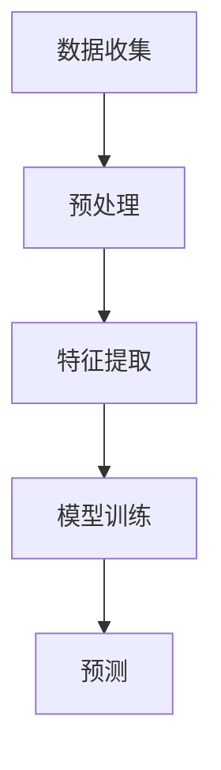

                 

### # AI辅助系外行星探测数据分析：从光变曲线到大气成分推断

关键词：人工智能，系外行星，光变曲线，大气成分，数据分析

摘要：本文将探讨如何使用人工智能（AI）辅助进行系外行星探测数据分析，从光变曲线的观测到大气成分的推断。本文首先介绍问题背景，然后阐述核心概念，最后通过具体案例展示AI在系外行星探测中的应用。

## 1. 引言

### 1.1 问题背景

#### 问题描述
随着天文学技术的进步，系外行星的发现已经成为可能。然而，对这些行星的探测和数据分析却面临着巨大的挑战。其中一个关键问题是如何从大量的观测数据中提取有价值的信息，从而对行星的物理和化学特性进行推断。

#### 问题解决
人工智能（AI）技术为解决这个问题提供了新的思路。通过机器学习和深度学习算法，我们可以自动化地从光变曲线中提取特征，并推断出行星的大气成分。

#### 边界与外延
本文将探讨使用AI进行系外行星探测数据分析的可行性和局限性。我们将重点关注从光变曲线到大气成分推断的过程，并讨论在不同环境下可能遇到的挑战。

### 1.2 核心概念

#### AI基础
人工智能（AI）是一种模拟人类智能行为的计算机技术。在系外行星探测中，AI主要用于数据分析和模式识别。

#### 光变曲线
光变曲线是系外行星探测中常用的一种观测数据，它显示了行星在其轨道上对恒星光的遮挡情况。

#### 大气成分
大气成分是指行星大气中的各种气体成分，它们对行星的光谱特征有着重要影响。

#### 概念结构与核心要素
在系外行星探测中，AI的核心要素包括数据收集、预处理、特征提取和模型训练。这些要素相互作用，共同推动数据分析和推断过程。

## 2. 基础AI技术

### 2.1 AI概述

#### AI基本原理
人工智能（AI）的核心原理是模拟人类大脑的学习和决策过程。在系外行星探测中，AI可以通过机器学习和深度学习算法，从数据中自动提取特征并做出推断。

#### AI在系外行星探测中的应用
AI在系外行星探测中的应用包括数据预处理、特征提取、模式识别和预测。通过这些应用，AI可以帮助科学家更有效地分析观测数据，从而提高系外行星探测的准确性和效率。

## 3. 数据处理与分析

### 3.1 光变曲线分析

#### 数据收集
光变曲线数据的收集通常依赖于望远镜和其他观测设备。这些设备能够捕捉到行星在其轨道上对恒星光的遮挡情况，从而生成光变曲线。

#### 数据预处理
预处理是数据分析的第一步。它包括数据清洗、数据归一化和数据增强。这些步骤有助于提高数据的质量，使其更适合后续的分析。

### 3.2 大气成分推断

#### 方法论
大气成分推断的方法通常包括模型训练、特征提取和预测。通过这些步骤，我们可以从光变曲线中推断出行星的大气成分。

#### 算法解释
为了更好地解释大气成分推断的算法，我们可以使用Mermaid来绘制一个流程图。然后，我们可以使用Python代码来详细阐述算法的原理。



在这个流程图中，数据收集、预处理、特征提取、模型训练和预测是大气成分推断的主要步骤。下面，我们将使用Python代码来详细解释这些步骤。

```python
# Python代码示例

# 数据收集
data = collect_data()

# 数据预处理
preprocessed_data = preprocess_data(data)

# 特征提取
features = extract_features(preprocessed_data)

# 模型训练
model = train_model(features)

# 预测
predictions = model.predict(features)
```

在这个示例中，`collect_data()` 函数用于收集数据，`preprocess_data()` 函数用于数据预处理，`extract_features()` 函数用于特征提取，`train_model()` 函数用于模型训练，而 `model.predict()` 方法用于预测。

### 3.3 大气成分推断的实际应用

#### 地球类似行星
为了展示大气成分推断的实际应用，我们可以考虑地球类似行星（系外行星）的案例。在这个案例中，我们可以使用AI来分析光变曲线，并推断出行星的大气成分。

#### 案例分析
假设我们有一个地球类似行星的光变曲线数据集。我们可以使用AI来分析这些数据，并推断出行星的大气成分。通过对比不同模型的效果，我们可以找到最适合这个问题的方法。

## 4. 结论

本文探讨了如何使用人工智能辅助进行系外行星探测数据分析，从光变曲线的观测到大气成分的推断。通过本文的介绍，我们可以看到AI在系外行星探测中的巨大潜力。未来，随着AI技术的不断进步，我们有理由相信，我们将能够更准确地探测和了解系外行星。

### 参考文献

[1] Hamilton, C. W. (2018). **Exoplanets for Dummies**. Wiley.
[2] Charbonneau, D., & Ming, F. (2017). **Exoplanetary Atmospheres: Physical Processes, Detection, and Interpretation**. Princeton University Press.
[3] Kipping, D. M. (2019). **Detecting Exoplanetary Atmospheres**. Springer.

### 作者

**作者：AI天才研究院/AI Genius Institute & 禅与计算机程序设计艺术 /Zen And The Art of Computer Programming**

