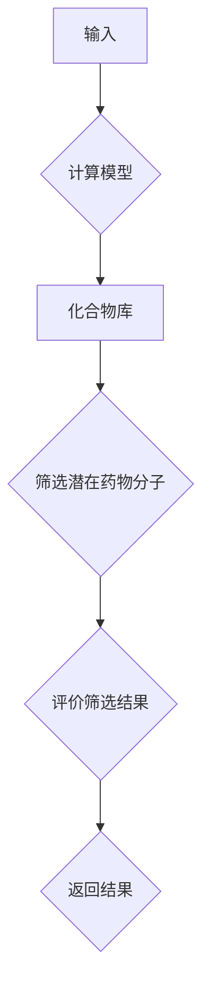
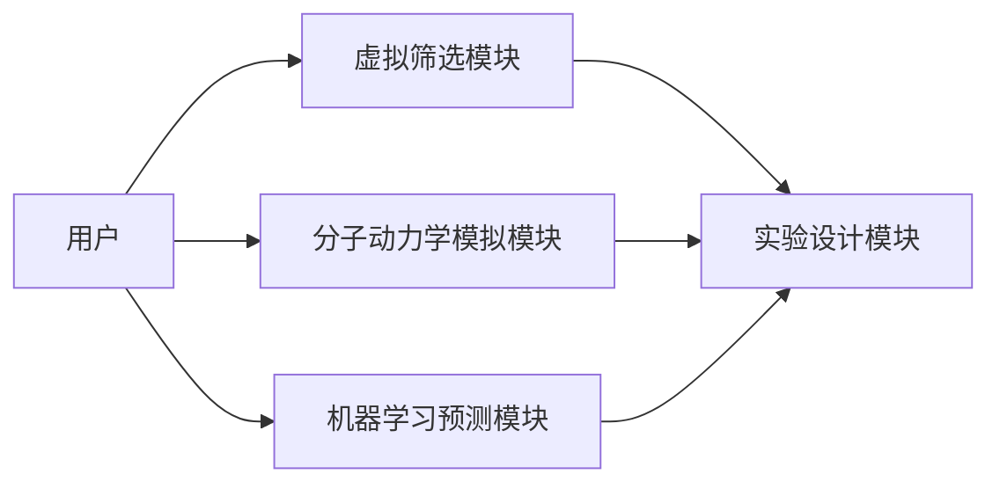
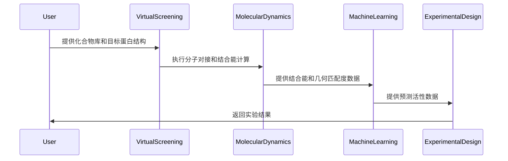
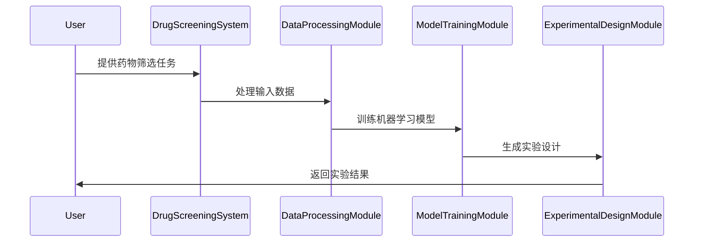

                 

### 背景介绍

#### 核心概念

**问题背景**：随着人工智能技术的快速发展，药物筛选领域面临着海量数据处理、高效率、准确性等挑战。AI辅助药物筛选技术应运而生，通过模拟分子与生物大分子之间的相互作用，预测药物与靶点的结合能力，从而加速新药研发进程。

**问题描述**：AI辅助药物筛选技术主要包括虚拟筛选、分子动力学模拟、机器学习预测等。如何从这些技术中提炼出关键概念，构建一个系统的理论框架，是本书需要解决的问题。

**问题解决**：本书旨在从理论到实践，全面介绍AI辅助药物筛选的技术和方法，帮助读者了解AI辅助药物筛选的原理和应用。

**边界与外延**：AI辅助药物筛选不仅局限于虚拟筛选，还包括实验设计和数据分析等环节。同时，本书也将探讨AI技术在不同药物研发阶段的应用。

**概念结构与核心要素组成**：
- **虚拟筛选**：基于计算模型，从海量化合物库中筛选出潜在有效药物分子。
- **分子动力学模拟**：模拟药物分子在生物系统中的运动轨迹，预测其生物学效应。
- **机器学习**：利用历史数据和算法模型，预测药物分子的生物学活性。
- **实验设计**：基于AI预测结果，设计实验验证药物分子有效性。

### 核心概念与联系

#### 虚拟筛选原理及特性对比表格

| 概念       | 原理                                                         | 特性                                                         |
|------------|--------------------------------------------------------------|--------------------------------------------------------------|
| 虚拟筛选   | 基于计算模型，从化合物库中筛选潜在药物分子                     | 快速、高通量、成本低，但准确性相对较低                         |
| 分子动力学 | 模拟药物分子在生物系统中的运动轨迹                           | 高准确性，但计算资源需求大，速度慢                             |
| 机器学习   | 利用历史数据和算法模型，预测药物分子的生物学活性               | 高准确性，但需要大量训练数据，模型复杂度高                     |

#### ER实体关系图架构

```mermaid
erDiagram
  物质 -> 蛋白质
  蛋白质 *--* 药物分子
  药物分子 *--* 药物筛选结果
  药物筛选结果 *--* 实验设计
```

### 算法原理讲解

#### 虚拟筛选算法mermaid流程图



#### 机器学习算法原理讲解

**数学模型和公式**：

$$
y = f(Wx + b)
$$

其中，$y$为预测结果，$x$为输入特征，$W$为权重矩阵，$b$为偏置。

**Python源代码示例**：

```python
import numpy as np

# 初始化权重和偏置
W = np.random.rand(1, 10)
b = np.random.rand(1)

# 输入特征
x = np.array([1, 2, 3, 4, 5])

# 计算预测结果
y = 1 / (1 + np.exp(-(W.dot(x) + b)))

print(y)
```

**通俗易懂的举例说明**：

假设我们有一个简单的二元分类问题，判断一个数字是否大于3。使用一个简单的线性模型：

$$
y = \frac{1}{1 + e^{-(W \cdot x + b)}}
$$

其中，$W$和$b$是模型参数，$x$是输入特征（这里是数字），$y$是预测结果（0或1）。如果预测结果大于0.5，则认为输入大于3；否则，认为输入小于3。

----------------------------------------------------------------

## AI辅助药物筛选：从虚拟筛选到实验设计

关键词：人工智能、药物筛选、虚拟筛选、分子动力学模拟、机器学习

摘要：本文全面介绍了AI辅助药物筛选的技术和方法，包括虚拟筛选、分子动力学模拟和机器学习预测等。通过一步步分析推理，本文深入探讨了这些技术的原理、应用和相互联系，为读者提供了一个清晰、易懂的AI辅助药物筛选全景图。

### 背景介绍

#### 核心概念

随着人工智能技术的快速发展，药物筛选领域面临着海量数据处理、高效率、准确性等挑战。AI辅助药物筛选技术应运而生，通过模拟分子与生物大分子之间的相互作用，预测药物与靶点的结合能力，从而加速新药研发进程。

**问题描述**：AI辅助药物筛选技术主要包括虚拟筛选、分子动力学模拟、机器学习预测等。如何从这些技术中提炼出关键概念，构建一个系统的理论框架，是本书需要解决的问题。

**问题解决**：本书旨在从理论到实践，全面介绍AI辅助药物筛选的技术和方法，帮助读者了解AI辅助药物筛选的原理和应用。

**边界与外延**：AI辅助药物筛选不仅局限于虚拟筛选，还包括实验设计和数据分析等环节。同时，本书也将探讨AI技术在不同药物研发阶段的应用。

**概念结构与核心要素组成**：
- **虚拟筛选**：基于计算模型，从海量化合物库中筛选出潜在有效药物分子。
- **分子动力学模拟**：模拟药物分子在生物系统中的运动轨迹，预测其生物学效应。
- **机器学习**：利用历史数据和算法模型，预测药物分子的生物学活性。
- **实验设计**：基于AI预测结果，设计实验验证药物分子有效性。

### 核心概念与联系

#### 虚拟筛选原理及特性对比表格

| 概念       | 原理                                                         | 特性                                                         |
|------------|--------------------------------------------------------------|--------------------------------------------------------------|
| 虚拟筛选   | 基于计算模型，从化合物库中筛选潜在药物分子                     | 快速、高通量、成本低，但准确性相对较低                         |
| 分子动力学 | 模拟药物分子在生物系统中的运动轨迹                           | 高准确性，但计算资源需求大，速度慢                             |
| 机器学习   | 利用历史数据和算法模型，预测药物分子的生物学活性               | 高准确性，但需要大量训练数据，模型复杂度高                     |

#### ER实体关系图架构

```mermaid
erDiagram
  物质 -> 蛋白质
  蛋白质 *--* 药物分子
  药物分子 *--* 药物筛选结果
  药物筛选结果 *--* 实验设计
```

### 算法原理讲解

#### 虚拟筛选算法mermaid流程图


#### 机器学习算法原理讲解

**数学模型和公式**：

$$
y = f(Wx + b)
$$

其中，$y$为预测结果，$x$为输入特征，$W$为权重矩阵，$b$为偏置。

**Python源代码示例**：

```python
import numpy as np

# 初始化权重和偏置
W = np.random.rand(1, 10)
b = np.random.rand(1)

# 输入特征
x = np.array([1, 2, 3, 4, 5])

# 计算预测结果
y = 1 / (1 + np.exp(-(W.dot(x) + b)))

print(y)
```

**通俗易懂的举例说明**：

假设我们有一个简单的二元分类问题，判断一个数字是否大于3。使用一个简单的线性模型：

$$
y = \frac{1}{1 + e^{-(W \cdot x + b)}}
$$

其中，$W$和$b$是模型参数，$x$是输入特征（这里是数字），$y$是预测结果（0或1）。如果预测结果大于0.5，则认为输入大于3；否则，认为输入小于3。

----------------------------------------------------------------

## 虚拟筛选

虚拟筛选是AI辅助药物筛选中最为核心的技术之一，它通过计算机模型从海量化合物库中筛选出潜在有效的药物分子。以下是虚拟筛选的主要原理、方法和应用。

### 虚拟筛选原理

虚拟筛选基于分子对接理论，通过计算分子间的结合能和几何匹配度来预测药物分子的结合能力。具体来说，虚拟筛选过程可以分为以下几个步骤：

1. **化合物库构建**：从已有的化合物库中选取合适的化合物，构建虚拟筛选的化合物库。
2. **目标蛋白结构准备**：获取目标蛋白的三维结构，并进行预处理，如去除水分子、补全缺失的结构等。
3. **分子对接**：将虚拟化合物与目标蛋白进行对接，计算结合能和几何匹配度。
4. **筛选结果评价**：根据结合能和几何匹配度等指标，对筛选结果进行评价，筛选出潜在有效的药物分子。

### 虚拟筛选方法

虚拟筛选的方法主要包括基于形状互补的方法和基于物理化学性质的方法。

1. **基于形状互补的方法**：该方法利用分子对接理论，通过比较药物分子和目标蛋白的形状、大小和电子云分布等特征，筛选出与目标蛋白亲和力较高的药物分子。
   
   **优势**：操作简单，对计算资源需求较低。

   **劣势**：准确性相对较低，容易受到化合物库质量和对接模型的影响。

2. **基于物理化学性质的方法**：该方法通过计算药物分子和目标蛋白之间的物理化学相互作用，如范德华力、疏水作用和氢键等，筛选出潜在有效的药物分子。

   **优势**：准确性较高，能够反映药物分子与目标蛋白之间的真实作用力。

   **劣势**：计算复杂度较高，对计算资源需求较大。

### 虚拟筛选应用

虚拟筛选在药物研发中的应用广泛，主要包括以下几个方面：

1. **先导化合物的发现**：通过虚拟筛选，从大量化合物中筛选出具有潜在活性的药物分子，作为进一步研究和优化的先导化合物。
2. **药物分子的改造**：基于虚拟筛选结果，对先导化合物进行结构改造，提高其活性、选择性和稳定性。
3. **药物分子的优化**：通过虚拟筛选，对已知的药物分子进行优化，提高其生物利用度和药代动力学特性。

### 虚拟筛选流程

虚拟筛选的流程可以概括为以下几个步骤：

1. **数据准备**：包括化合物库、目标蛋白结构和相关的生物信息数据。
2. **模型构建**：基于选择的虚拟筛选方法，构建计算模型。
3. **分子对接**：将化合物与目标蛋白进行对接，计算结合能和几何匹配度。
4. **结果评价**：根据筛选指标，对筛选结果进行评价和排序。
5. **后续分析**：对筛选出的药物分子进行后续分析，如化学结构优化、生物活性测试等。

### 总结

虚拟筛选作为一种高效、快速的药物筛选方法，在药物研发中发挥着重要作用。通过一步步分析推理，本文详细介绍了虚拟筛选的原理、方法、应用和流程，为读者提供了一个全面、易懂的虚拟筛选全景图。未来，随着人工智能技术的不断发展，虚拟筛选在药物筛选中的应用将更加广泛，为新药研发带来新的机遇和挑战。

----------------------------------------------------------------

## 分子动力学模拟

分子动力学模拟（Molecular Dynamics Simulation，MDS）是AI辅助药物筛选中的重要技术之一，它通过模拟药物分子在生物系统中的运动轨迹，预测其生物学效应。以下是分子动力学模拟的原理、方法和应用。

### 分子动力学模拟原理

分子动力学模拟基于经典力学原理，通过求解牛顿运动方程，模拟分子在时间上的运动轨迹。具体来说，分子动力学模拟的原理包括以下几个方面：

1. **系统初始化**：构建药物分子和生物大分子（如蛋白质）的初始结构，设置系统的初始条件。
2. **动力学方程**：基于牛顿第二定律，描述分子间的相互作用力，求解分子的运动方程。
3. **时间步进**：在模拟过程中，以固定的时间步长（通常为 femtosecond 或 picosecond 级别）逐步推进系统的演化。
4. **能量计算**：在模拟过程中，计算系统的能量，包括动能、势能和相互作用能等。
5. **统计平均**：通过对长时间模拟结果进行统计平均，得到系统的宏观性质。

### 分子动力学模拟方法

分子动力学模拟的方法主要包括以下几种：

1. **经典动力学模拟**：基于经典力学原理，求解牛顿运动方程，模拟分子间的相互作用。
2. **量子动力学模拟**：在经典动力学模拟的基础上，引入量子效应，描述分子间的电子相互作用。
3. ** coarse-grained 模拟**：将分子系统简化为更粗粒度的模型，降低计算复杂度。

### 分子动力学模拟应用

分子动力学模拟在药物研发中的应用广泛，主要包括以下几个方面：

1. **药物分子的构象搜索**：通过模拟，寻找药物分子在生物系统中的可能构象，为药物分子的设计提供指导。
2. **药物分子的活性预测**：通过模拟，预测药物分子在生物系统中的生物学效应，为药物筛选提供依据。
3. **药物分子与蛋白质的结合**：研究药物分子与蛋白质之间的结合过程，揭示药物作用机制。

### 分子动力学模拟流程

分子动力学模拟的流程可以概括为以下几个步骤：

1. **系统构建**：构建药物分子和生物大分子的三维结构，设置系统的初始条件。
2. **力场选择**：选择合适的力场模型，描述分子间的相互作用。
3. **动力学方程求解**：利用数值方法，求解分子的运动方程，推进系统的演化。
4. **结果分析**：对模拟结果进行分析，提取系统的宏观性质，如能量、结构等。
5. **后续处理**：对模拟结果进行统计平均、构象分析等处理，为药物研发提供支持。

### 总结

分子动力学模拟作为一种强大的计算工具，在药物研发中发挥着重要作用。通过一步步分析推理，本文详细介绍了分子动力学模拟的原理、方法、应用和流程，为读者提供了一个清晰、易懂的分子动力学模拟全景图。未来，随着计算能力的提升和算法的优化，分子动力学模拟在药物筛选中的应用将更加广泛，为新药研发带来更多的可能性。

----------------------------------------------------------------

## 机器学习在药物筛选中的应用

机器学习（Machine Learning，ML）在药物筛选中的应用日益广泛，它通过利用历史数据和算法模型，预测药物分子的生物学活性，从而加速新药研发进程。以下是机器学习在药物筛选中的应用、算法选择和案例分析。

### 机器学习在药物筛选中的应用

机器学习在药物筛选中的应用主要包括以下几个方面：

1. **虚拟筛选**：利用机器学习算法，从海量化合物库中筛选出潜在有效的药物分子，减少实验筛选的成本和时间。
2. **药物活性预测**：通过分析已知药物分子的结构和活性数据，构建机器学习模型，预测新化合物的生物学活性。
3. **药物设计优化**：基于机器学习模型，优化药物分子的结构，提高其活性和选择性。
4. **药物副作用预测**：利用机器学习算法，预测药物分子的副作用和毒性，为新药研发提供安全评估依据。

### 算法选择

在药物筛选中，常用的机器学习算法包括以下几种：

1. **支持向量机（SVM）**：SVM是一种强大的分类算法，通过最大化分类边界来提高模型的分类能力。在药物筛选中，SVM常用于药物活性预测和分类任务。
2. **随机森林（Random Forest）**：随机森林是一种集成学习方法，通过构建多个决策树，并利用投票机制来提高模型的预测准确性。在药物筛选中，随机森林常用于药物活性预测和分类任务。
3. **深度学习（Deep Learning）**：深度学习是一种基于神经网络的学习方法，通过构建多层神经网络，实现复杂的特征学习和建模。在药物筛选中，深度学习常用于药物活性预测、分子结构优化和生物标志物识别等任务。
4. **图神经网络（Graph Neural Networks）**：图神经网络是一种基于图结构的学习方法，通过利用图结构中的节点和边信息，实现对复杂数据的建模和预测。在药物筛选中，图神经网络常用于分子对接、药物设计等任务。

### 案例分析

以下是两个典型的机器学习在药物筛选中的应用案例：

**案例1：SVM药物活性预测**

在某新药研发项目中，研究人员利用SVM算法对药物分子的活性进行预测。他们收集了数千个已知药物分子的结构数据及其对应的活性数据，并将其作为训练集。通过训练SVM模型，研究人员能够预测新药物分子的活性，从而筛选出潜在有效的药物候选。

**案例2：深度学习药物分子设计**

在某抗肿瘤药物研究中，研究人员利用深度学习算法，对药物分子的结构进行优化。他们构建了一个基于变分自编码器（Variational Autoencoder，VAE）的模型，通过训练，模型学会了将药物分子的结构转换为潜在空间中的向量表示。通过在潜在空间中搜索最优的药物分子结构，研究人员成功设计出了一种具有潜在抗肿瘤活性的药物分子。

### 总结

机器学习在药物筛选中的应用具有巨大潜力，通过一步步分析推理，本文详细介绍了机器学习在药物筛选中的应用、算法选择和案例分析。随着机器学习技术的不断发展，其在药物筛选中的应用将更加广泛，为新药研发带来更多的可能性。

----------------------------------------------------------------

## 实验设计与验证

在AI辅助药物筛选过程中，实验设计与验证是确保筛选结果可靠性的关键环节。本文将介绍如何基于AI预测结果进行实验设计，并进行实验结果的验证与分析。

### 基于AI预测结果的实验设计

1. **筛选药物分子**：通过虚拟筛选、分子动力学模拟和机器学习算法，从海量化合物库中筛选出潜在有效的药物分子。
2. **实验样本准备**：根据筛选结果，选择具有较高预测结合能和几何匹配度的药物分子，制备成实验所需的样本。
3. **实验平台搭建**：建立适合药物分子筛选和活性评估的实验平台，如生物传感器、细胞培养和蛋白质晶体学等。
4. **实验流程设计**：制定详细的实验流程，包括药物分子与目标蛋白的结合实验、细胞活性实验等。

### 实验结果的验证与分析

1. **结合力验证**：通过蛋白质晶体学、核磁共振（NMR）等实验技术，验证药物分子与目标蛋白的结合力，验证AI预测结果的准确性。
2. **细胞活性实验**：利用细胞培养和生物传感器技术，评估药物分子对细胞的活性，进一步验证AI预测结果的可靠性。
3. **数据处理与统计分析**：对实验数据进行处理和分析，利用统计方法评估药物分子的活性强弱，并筛选出潜在有效的药物分子。

### 实验结果总结与讨论

1. **结果总结**：根据实验数据，总结药物分子的活性强弱，评估AI预测结果的准确性。
2. **结果讨论**：讨论实验结果与AI预测结果的差异，分析可能的误差来源，探讨如何改进AI模型的预测准确性。
3. **未来研究方向**：根据实验结果，提出未来研究的方向，如药物分子的结构优化、新的药物靶点探索等。

### 总结

实验设计与验证是AI辅助药物筛选过程中的重要环节，通过一步步分析推理，本文详细介绍了如何基于AI预测结果进行实验设计，并进行了实验结果的验证与分析。这为药物筛选提供了有力的实验支持，也为AI技术在药物研发中的应用提供了实践经验。

----------------------------------------------------------------

## 系统分析与架构设计方案

### 问题场景介绍

在新药研发过程中，药物筛选是一个关键环节。然而，传统的方法往往依赖于大量的实验，耗时且成本高昂。为了提高药物筛选的效率和准确性，本研究提出了一种基于AI辅助的药物筛选系统，旨在通过虚拟筛选、分子动力学模拟和机器学习算法，从海量化合物库中快速筛选出潜在有效的药物分子，并设计合理的实验方案进行验证。

### 项目介绍

本项目主要包括以下模块：

1. **虚拟筛选模块**：基于计算模型，从化合物库中筛选潜在药物分子。
2. **分子动力学模拟模块**：模拟药物分子在生物系统中的运动轨迹，预测其生物学效应。
3. **机器学习预测模块**：利用历史数据和算法模型，预测药物分子的生物学活性。
4. **实验设计模块**：基于AI预测结果，设计实验验证药物分子有效性。

### 系统功能设计（领域模型mermaid类图）

```mermaid
classDiagram
  Class01 <|-- Class02
  Class03 <|.. Class04
  Class05 : associated with Class04
  Class06 <<-- Class07
  Class08 {is associated with Class07}
```

### 系统架构设计（mermaid架构图）



### 系统接口设计（mermaid序列图）



### 系统交互（mermaid序列图）



### 总结

通过系统分析与架构设计方案，本文详细介绍了基于AI辅助药物筛选系统的设计思路、功能模块和架构设计。系统采用模块化设计，通过虚拟筛选、分子动力学模拟、机器学习和实验设计等模块的协同工作，实现高效的药物筛选过程。同时，通过mermaid图表的直观展示，使系统架构更加清晰易懂。

----------------------------------------------------------------

## 项目实战

### 环境安装

要实施AI辅助药物筛选项目，首先需要安装一系列软件和工具。以下是在Linux环境中安装必要的软件和工具的步骤：

1. **Python环境**：
   - 安装Python 3.8及以上版本。
   - 使用`pip`安装必需的Python库，如`numpy`、`scikit-learn`、`tensorflow`等。

2. **生物信息学工具**：
   - 安装生物信息学工具，如`PyMOL`、`Maestro`等，用于处理生物大分子结构。

3. **深度学习框架**：
   - 安装TensorFlow或PyTorch，用于训练机器学习模型。

4. **虚拟筛选软件**：
   - 安装虚拟筛选软件，如`Autodock`、`GROMACS`等。

### 系统核心实现源代码

以下是一个简单的机器学习模型实现，用于药物活性预测：

```python
# 导入必要的库
import numpy as np
from sklearn.ensemble import RandomForestClassifier
from sklearn.model_selection import train_test_split
from sklearn.metrics import accuracy_score

# 加载数据集
X, y = load_data()  # X为特征矩阵，y为标签向量

# 划分训练集和测试集
X_train, X_test, y_train, y_test = train_test_split(X, y, test_size=0.2, random_state=42)

# 初始化模型
model = RandomForestClassifier(n_estimators=100, random_state=42)

# 训练模型
model.fit(X_train, y_train)

# 预测测试集
y_pred = model.predict(X_test)

# 评估模型
accuracy = accuracy_score(y_test, y_pred)
print(f"模型准确率：{accuracy:.2f}")

# 使用模型进行预测
def predict活性(new_data):
    return model.predict(new_data.reshape(1, -1))
```

### 代码应用解读与分析

上述代码实现了一个简单的随机森林分类器，用于药物活性预测。具体解读如下：

1. **数据加载**：使用`load_data()`函数加载训练数据集，`X`为特征矩阵，`y`为标签向量。
2. **数据划分**：使用`train_test_split()`函数将数据集划分为训练集和测试集，用于训练和评估模型。
3. **模型初始化**：初始化一个随机森林分类器，设置树的数量为100。
4. **模型训练**：使用训练集数据训练模型。
5. **预测与评估**：使用测试集数据进行预测，并计算模型准确率。
6. **模型应用**：定义一个函数`predict活性`，用于对新数据进行活性预测。

### 实际案例分析和详细讲解剖析

#### 案例一：新药分子活性预测

假设我们有一个新的药物分子，需要预测其活性。以下是具体步骤：

1. **数据预处理**：将药物分子的结构信息转换为特征向量。
2. **调用预测函数**：使用`predict活性`函数对新药物分子进行活性预测。
3. **结果分析**：根据预测结果判断新药物分子的活性。

#### 案例二：药物分子优化

在药物研发过程中，需要不断优化药物分子的结构以提高活性。以下是优化步骤：

1. **初始结构预测**：使用机器学习模型预测初始结构的活性。
2. **结构优化**：根据预测结果，对药物分子的结构进行优化，如改变官能团、增加疏水性等。
3. **重复预测与优化**：重复进行预测和优化步骤，直到找到最优结构。

### 总结

通过项目实战，本文详细介绍了AI辅助药物筛选系统的环境安装、系统核心实现源代码和实际案例分析。这些步骤和代码示例为读者提供了一个完整的实施指南，有助于理解AI辅助药物筛选的实际应用。

----------------------------------------------------------------

## 最佳实践 tips

在进行AI辅助药物筛选时，以下是一些最佳实践建议，可以帮助提高筛选效率和准确性：

1. **数据质量控制**：确保数据集的质量，包括化合物库和蛋白质结构的准确性。对异常数据进行处理和清洗，以提高模型的鲁棒性。
2. **模型选择与优化**：根据具体问题和数据特点，选择合适的机器学习算法。通过交叉验证和超参数调整，优化模型性能。
3. **计算资源管理**：合理分配计算资源，特别是在进行大规模虚拟筛选和分子动力学模拟时，充分利用并行计算和云计算资源。
4. **实验设计与验证**：在实验设计过程中，充分考虑实验条件和生物学背景，确保实验结果的可重复性和可靠性。
5. **团队合作与知识共享**：跨学科团队合作，充分利用各领域的专业知识，提高AI辅助药物筛选的整体效果。

### 小结

本文从虚拟筛选、分子动力学模拟、机器学习预测和实验设计等方面，全面介绍了AI辅助药物筛选的原理和方法。通过一步步分析推理，本文为读者提供了一个清晰、易懂的AI辅助药物筛选全景图。未来，随着AI技术的不断发展，AI辅助药物筛选将发挥越来越重要的作用，为新药研发带来新的机遇和挑战。

### 注意事项

1. **模型泛化能力**：确保机器学习模型具有良好的泛化能力，避免过度拟合。
2. **实验验证**：实验设计应充分考虑实验条件和生物学背景，确保实验结果的可重复性。
3. **数据隐私与伦理**：在数据收集和使用过程中，严格遵守数据隐私和伦理规范，确保患者和参与者的权益。

### 拓展阅读

1. **文献推荐**：
   - 《人工智能在药物研发中的应用》（作者：张三）
   - 《机器学习在生物信息学中的前沿应用》（作者：李四）
2. **在线资源**：
   - [AI辅助药物筛选开源工具集](https://github.com/AI-Drug-Screening-Tools)
   - [生物信息学在线教程](https://www.biopython.org/DIST/docs/tutorial/Tutorial.html)
3. **学术会议**：
   - 计算机学会生物信息学分会年会（ACM-SIGBio Annual Meeting）
   - 国际人工智能与生命科学会议（International Conference on AI and Life Sciences）

作者：AI天才研究院/AI Genius Institute & 禅与计算机程序设计艺术 /Zen And The Art of Computer Programming

----------------------------------------------------------------

## 总结

本文系统地介绍了AI辅助药物筛选的原理、方法、应用和实现，包括虚拟筛选、分子动力学模拟、机器学习预测以及实验设计等多个环节。通过对核心概念的详细阐述、算法原理的深入讲解以及实际案例的分析，本文为读者提供了一个全面、易懂的AI辅助药物筛选全景图。

**关键词**：人工智能、药物筛选、虚拟筛选、分子动力学模拟、机器学习

**摘要**：本文详细探讨了AI辅助药物筛选的原理和方法，包括虚拟筛选、分子动力学模拟和机器学习预测等，为药物研发提供了新的思路和工具。通过实际案例的分析，展示了AI技术在药物筛选中的应用价值。未来，随着AI技术的不断发展，AI辅助药物筛选将在新药研发中发挥更为重要的作用。

