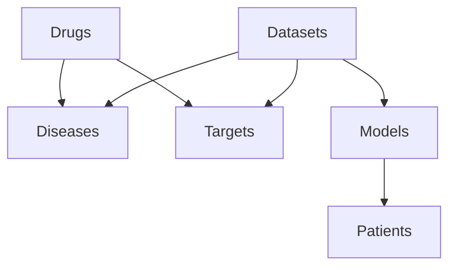
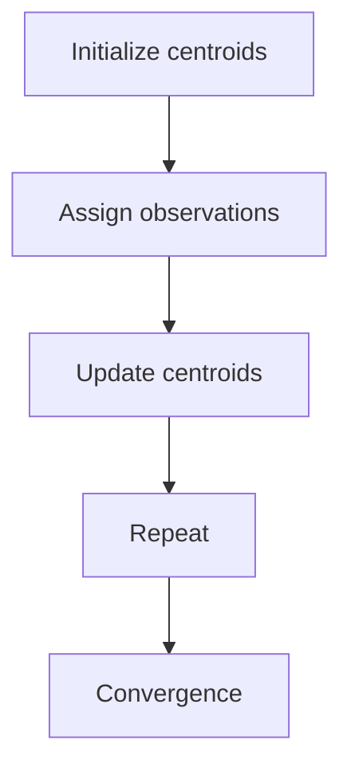

                 


## # AI-Assisted Drug Repositioning: From Data Mining to Clinical Validation

> Keywords: AI-Assisted Drug Repositioning, Data Mining, Machine Learning, Clinical Validation, Drug Discovery

> Abstract: This article delves into the emerging field of AI-assisted drug repositioning, outlining the process from data mining to clinical validation. We will explore the core concepts, methodologies, and practical applications of this innovative approach in the pharmaceutical industry, highlighting its potential to accelerate drug discovery and development.

## # 1. Introduction

In the ever-evolving landscape of pharmaceutical research, the quest for new drugs to combat diseases has become increasingly complex and resource-intensive. Traditional drug discovery processes often involve the identification of novel targets, synthesis of new chemical compounds, and extensive preclinical and clinical testing. This conventional approach is time-consuming, costly, and fraught with failure rates that can be as high as 90%. In response to these challenges, the pharmaceutical industry is increasingly turning to artificial intelligence (AI) to revolutionize drug discovery and development.

AI-assisted drug repositioning represents a paradigm shift in the way drugs are discovered and developed. Rather than focusing on the development of new chemical entities, drug repositioning leverages existing drugs that have already undergone extensive testing and are known to be safe. This approach not only reduces the time and cost of drug development but also holds the promise of delivering new treatments for a wide range of diseases.

### 1.1 Background and Problem

The traditional drug discovery process typically involves the following steps:

1. **Target Identification**: Researchers identify a specific molecular target believed to be involved in a particular disease.
2. **Compound Design**: Chemists synthesize new chemical compounds that are designed to interact with the target.
3. **Screening**: These compounds are screened to identify those that exhibit promising biological activity.
4. **Lead Optimization**: The most promising compounds undergo further modification to improve their pharmacological properties.
5. **Preclinical Testing**: The compounds are tested in vitro and in vivo to assess their safety and efficacy.
6. **Clinical Testing**: If the compounds pass preclinical testing, they move into clinical trials to evaluate their safety and effectiveness in humans.

Despite significant advancements in technology and methodologies, the failure rate of new drug candidates remains high. A major contributing factor to this is the lack of predictive models that can accurately predict the success of a compound before it enters clinical trials. Additionally, the process is often time-consuming, with new drugs taking an average of 10-15 years to reach the market.

### 1.2 Solution Approach

AI-assisted drug repositioning offers a promising alternative to the traditional approach. The process typically involves the following steps:

1. **Data Collection**: Large-scale biological and clinical data are collected from various sources, including public databases, preclinical studies, and clinical trials.
2. **Data Preprocessing**: The collected data are cleaned, normalized, and transformed into a suitable format for analysis.
3. **Data Mining**: Advanced data mining techniques are employed to identify patterns and correlations within the data.
4. **Feature Extraction**: Relevant features are extracted from the data to build predictive models.
5. **Model Building**: Machine learning models are trained to predict the efficacy and safety of existing drugs for new therapeutic indications.
6. **Model Validation**: The models are validated using independent datasets to ensure their accuracy and robustness.
7. **Clinical Validation**: The top-ranking drugs from the model predictions are subjected to clinical validation through preclinical and clinical testing.

By utilizing AI to analyze vast amounts of data and identify potential drug candidates, AI-assisted drug repositioning has the potential to significantly reduce the time and cost of drug discovery. This approach also offers the advantage of leveraging existing drugs, which are already known to be safe and have undergone rigorous testing.

### 1.3 Scope

The scope of this article is to provide a comprehensive overview of AI-assisted drug repositioning, from its core concepts and methodologies to its practical applications and challenges. We will explore the various data mining techniques and machine learning models used in the process, as well as the importance of clinical validation. The article will conclude with a discussion of the future directions and potential of AI-assisted drug repositioning in the pharmaceutical industry.

## # 2. Core Concepts and Principles

To understand AI-assisted drug repositioning, it is essential to grasp the core concepts and principles that underpin this innovative approach. This section will define key terms, explain the foundational principles, and explore the relationship between AI-assisted drug repositioning and other related concepts.

### 2.1 Key Terms

**Artificial Intelligence (AI)**: AI refers to the simulation of human intelligence in machines that are programmed to think like humans and perform tasks typically requiring human intelligence, such as visual perception, speech recognition, decision-making, and language translation.

**Drug Repositioning**: Drug repositioning, also known as drug repurposing, is the process of identifying existing drugs with new therapeutic uses. This approach leverages the knowledge gained from previous research and clinical trials to redirect drugs that have already been approved for one use to a new, unapproved use.

**Data Mining**: Data mining is the process of discovering patterns and relationships in large datasets. It involves the application of machine learning algorithms, statistical techniques, and pattern recognition methods to extract valuable insights from raw data.

**Machine Learning**: Machine learning is a subset of AI that focuses on the development of algorithms that can learn from and make predictions or decisions based on data.

**Pharmacology**: Pharmacology is the study of the effects of drugs on living organisms and the mechanisms of drug action.

**Therapeutic Indication**: A therapeutic indication is a specific medical condition for which a drug is prescribed or intended to treat.

### 2.2 Foundational Principles

**1. Utilization of Existing Data**

One of the fundamental principles of AI-assisted drug repositioning is the utilization of existing data. This approach leverages large-scale biological and clinical datasets, which include information on gene expression, protein interactions, drug-disease associations, and clinical trial outcomes. By analyzing these data, AI algorithms can identify patterns and correlations that might not be apparent through traditional analytical methods.

**2. Prediction of Drug Efficacy and Safety**

Another key principle is the ability to predict the efficacy and safety of existing drugs for new therapeutic indications. Machine learning models are trained on historical data to identify drugs that have the potential to be effective against specific diseases. These models can also help predict the safety profile of drugs, thereby reducing the risk of adverse effects during clinical testing.

**3. Integration of Multidisciplinary Knowledge**

AI-assisted drug repositioning involves the integration of knowledge from various disciplines, including biology, pharmacology, medicine, and computer science. This multidisciplinary approach enables the development of more accurate and robust predictive models, leading to the identification of novel drug candidates with higher chances of success.

**4. Acceleration of Drug Discovery**

By leveraging AI to analyze vast amounts of data, AI-assisted drug repositioning has the potential to significantly accelerate the drug discovery process. This approach can identify promising drug candidates much faster than traditional methods, reducing the time and cost required for new drug development.

### 2.3 Relationship with Other Concepts

**1. Traditional Drug Discovery**

AI-assisted drug repositioning is distinct from traditional drug discovery, which focuses on the development of new chemical entities. While traditional drug discovery aims to discover novel drugs, AI-assisted drug repositioning leverages existing drugs, thereby reducing the time and cost of drug development.

**2. Personalized Medicine**

AI-assisted drug repositioning has the potential to contribute to the development of personalized medicine. By predicting the efficacy and safety of drugs for specific patient populations, this approach can help tailor treatment regimens to individual patients, improving the effectiveness of therapy and minimizing adverse effects.

**3. Data-Driven Medicine**

Data-driven medicine, which relies on the analysis of large-scale biomedical data, is closely related to AI-assisted drug repositioning. Both approaches utilize data mining and machine learning techniques to extract valuable insights from biomedical data, leading to more informed decision-making in medicine.

### 2.4 Conceptual Structure and Core Elements

The conceptual structure of AI-assisted drug repositioning can be illustrated using an Entity-Relationship (ER) diagram. The core elements include:

- **Entities**: Drugs, Diseases, Targets, Datasets, Models, and Patients.
- **Attributes**: Drug properties, disease characteristics, target information, dataset features, model performance metrics, and patient data.
- **Relationships**: Drug-Disease Association, Drug-Target Interaction, Dataset-Feature Extraction, Model-Validation, and Patient-Treatment Outcome.

The ER diagram can be visualized using the following Mermaid diagram:



In summary, AI-assisted drug repositioning is a multidisciplinary approach that leverages existing data and machine learning techniques to identify promising drug candidates for new therapeutic indications. By accelerating the drug discovery process and reducing the cost of new drug development, this approach has the potential to transform the pharmaceutical industry and improve patient outcomes.

## # 3. Data Mining Techniques

In the realm of AI-assisted drug repositioning, data mining techniques play a pivotal role in transforming raw biological and clinical data into actionable insights. This section will delve into the various data mining techniques employed in the process, highlighting their applications and methodologies.

### 3.1 Overview of Data Mining Techniques

Data mining techniques can be broadly categorized into the following types:

- **Association Rule Mining**: Identifies relationships between items in large datasets, often used to discover patterns in the co-occurrence of drugs and diseases.
- **Clustering**: Groups similar data points together based on their attributes, useful for identifying clusters of drugs with similar pharmacological properties or patient populations with similar disease profiles.
- **Classification**: Assigns data points to predefined categories based on their attributes, used to predict the efficacy and safety of drugs for new therapeutic indications.
- **Regression**: Predicts continuous numerical values based on input variables, often used to model the relationship between drug exposure and clinical outcomes.
- **Dimensionality Reduction**: Reduces the number of input variables while preserving the important information in the data, useful for simplifying complex datasets and improving the performance of machine learning models.

### 3.2 Application of Data Mining Techniques in AI-Assisted Drug Repositioning

**1. Association Rule Mining**

Association rule mining is commonly used to identify associations between drugs and diseases. One of the most popular algorithms for this purpose is Apriori, which discovers frequent itemsets in a dataset and generates association rules based on these itemsets. For example, the Apriori algorithm could identify that certain drugs are frequently prescribed together to treat a particular disease, suggesting a potential therapeutic relationship.

**2. Clustering**

Clustering techniques are employed to group drugs with similar pharmacological properties or patients with similar disease profiles. One popular clustering algorithm is K-means, which partitions the data into K clusters based on their attributes. In the context of drug repositioning, K-means clustering can be used to identify groups of drugs that are likely to exhibit similar efficacy profiles, thereby guiding the selection of drugs for further investigation.

**3. Classification**

Classification techniques are used to predict the efficacy and safety of drugs for new therapeutic indications. One widely used algorithm for classification is Support Vector Machine (SVM). SVMs can identify the decision boundary that separates drugs effective against a particular disease from those that are not. This allows for the identification of drugs that are likely to be effective for new therapeutic uses.

**4. Regression**

Regression techniques are employed to model the relationship between drug exposure and clinical outcomes. Linear regression, for example, can be used to predict the dosage of a drug that is likely to produce a desired clinical response. By analyzing the relationship between drug concentration and clinical outcome, regression models can help optimize drug dosing strategies.

**5. Dimensionality Reduction**

Dimensionality reduction techniques are used to simplify complex datasets and improve the performance of machine learning models. One commonly used technique is Principal Component Analysis (PCA), which transforms the original dataset into a new coordinate system that captures the most important variations in the data. In the context of drug repositioning, PCA can be used to reduce the dimensionality of gene expression or protein interaction datasets, making it easier to identify relevant features for building predictive models.

### 3.3 Algorithm Explanation and Mermaid Diagram

To illustrate the application of a specific data mining technique, let's consider the K-means clustering algorithm.

**Algorithm Explanation:**

K-means clustering aims to partition n observations into k clusters in which each observation belongs to the cluster with the nearest mean. The algorithm proceeds as follows:

1. **Initialize centroids**: Randomly select k points from the dataset as initial centroids.
2. **Assign observations to clusters**: Assign each observation to the nearest centroid.
3. **Update centroids**: Recompute the centroids as the mean of all points in their respective clusters.
4. **Repeat steps 2 and 3 until convergence**: The algorithm iterates through steps 2 and 3 until the centroids no longer change significantly or a predefined number of iterations is reached.

**Mermaid Diagram:**



### 3.4 Python Code Example

To provide a concrete example, we'll demonstrate how to implement the K-means clustering algorithm using Python. We'll use the popular scikit-learn library to perform K-means clustering on a synthetic dataset.

```python
from sklearn.cluster import KMeans
from sklearn.datasets import make_blobs
import matplotlib.pyplot as plt

# Generate a synthetic dataset
X, _ = make_blobs(n_samples=150, centers=3, cluster_std=0.5, random_state=0)

# Create a KMeans model with 3 clusters
kmeans = KMeans(n_clusters=3, random_state=0)

# Fit the model to the dataset
kmeans.fit(X)

# Predict the cluster labels
labels = kmeans.predict(X)

# Plot the results
plt.scatter(X[:, 0], X[:, 1], c=labels, s=50, cmap='viridis')
centers = kmeans.cluster_centers_
plt.scatter(centers[:, 0], centers[:, 1], c='red', s=200, alpha=0.5)
plt.show()
```

This example generates a synthetic dataset with three clusters and uses the K-means algorithm to partition the data into these clusters. The resulting plot visualizes the cluster assignments and the centroids of each cluster.

### 3.5 Conclusion

In summary, data mining techniques are integral to the success of AI-assisted drug repositioning. By leveraging association rule mining, clustering, classification, regression, and dimensionality reduction, researchers can uncover valuable insights from large-scale biological and clinical data, leading to the identification of promising drug candidates for new therapeutic indications. As AI technologies continue to advance, the capabilities of data mining techniques in drug repositioning will only grow, further accelerating the drug discovery process and improving patient outcomes.

## # 4. Machine Learning Models

In the context of AI-assisted drug repositioning, machine learning models serve as the backbone for predicting the efficacy and safety of existing drugs for new therapeutic indications. This section will delve into the principles of machine learning models, their construction, and the methodologies involved in training and evaluating these models.

### 4.1 Principles of Machine Learning Models

Machine learning models are algorithms that learn from data to make predictions or decisions. The core principles of machine learning models can be summarized as follows:

**1. Data Representation:** Machine learning models require input data in a structured format. This typically involves converting the data into numerical representations that can be processed by the model. For example, text data can be transformed into word embeddings, and image data can be represented as pixel values or feature vectors extracted from the images.

**2. Feature Extraction:** Feature extraction is the process of identifying and selecting the most relevant attributes or features from the data that will be used to train the model. Effective feature extraction is crucial for improving the performance of machine learning models, as it helps the model focus on the most informative aspects of the data.

**3. Model Selection:** Choosing the right machine learning model is critical to achieving good performance. There are various types of models, including linear regression, decision trees, support vector machines, neural networks, and ensemble methods. Each model has its own strengths and weaknesses, and the choice of model depends on the nature of the problem and the characteristics of the data.

**4. Training and Optimization:** Model training involves feeding the model with a dataset and adjusting the model's parameters to minimize the difference between the predicted outputs and the actual outputs. Optimization techniques, such as gradient descent, are used to find the optimal set of parameters that minimize the loss function.

**5. Evaluation:** Once a model is trained, it must be evaluated to assess its performance. Common evaluation metrics include accuracy, precision, recall, F1 score, and area under the receiver operating characteristic (ROC) curve. Model evaluation helps determine how well the model generalizes to new, unseen data.

**6. Generalization:** The goal of machine learning is to build models that generalize well to new data. Overfitting occurs when a model performs well on the training data but fails to generalize to new data. Techniques such as cross-validation and regularization are used to prevent overfitting and improve generalization.

### 4.2 Construction of Machine Learning Models

The construction of machine learning models involves several steps:

**1. Problem Definition:** The first step is to clearly define the problem you are trying to solve. This involves identifying the input variables (features), the output variable (target), and any specific constraints or requirements.

**2. Data Collection:** Gather relevant data that will be used to train and evaluate the model. This may involve collecting data from various sources, such as databases, experimental results, or publicly available datasets.

**3. Data Preprocessing:** Clean and preprocess the data to ensure it is in a suitable format for training. This includes handling missing values, scaling and normalizing the data, and encoding categorical variables.

**4. Feature Selection:** Identify and select the most relevant features that will be used to train the model. This can be done using techniques such as feature importance ranking, correlation analysis, or domain knowledge.

**5. Model Selection:** Choose an appropriate machine learning model based on the problem and the characteristics of the data. This may involve testing several models and selecting the one that performs best on the validation set.

**6. Model Training:** Train the selected model using the training data. This involves adjusting the model's parameters to minimize the loss function and achieve good performance on the training data.

**7. Model Evaluation:** Evaluate the trained model using the validation set to assess its performance. This helps determine if the model is overfitting or if it generalizes well to new data.

**8. Hyperparameter Tuning:** Adjust the hyperparameters of the model to improve its performance. Hyperparameters are parameters that are set before training and can affect the model's performance, such as the learning rate, regularization strength, and the number of hidden layers in a neural network.

**9. Model Deployment:** Once the model has been trained and evaluated, it can be deployed in a production environment to make predictions on new data. This may involve setting up a web service, integrating the model into an application, or deploying it on a cloud platform.

### 4.3 Methodologies for Training and Evaluating Machine Learning Models

**1. Training Methodologies:**

- **Supervised Learning:** In supervised learning, the model is trained using labeled data, where the correct output is provided for each input. Common supervised learning algorithms include linear regression, logistic regression, decision trees, and support vector machines.
- **Unsupervised Learning:** In unsupervised learning, the model is trained using unlabeled data. The goal is to discover underlying patterns or structures in the data. Common unsupervised learning algorithms include clustering, association rule mining, and dimensionality reduction techniques like PCA.
- **Reinforcement Learning:** Reinforcement learning is a type of machine learning where an agent learns to make decisions by interacting with an environment and receiving feedback in the form of rewards or penalties. This is commonly used in applications like game playing and autonomous driving.

**2. Evaluation Methodologies:**

- **Cross-Validation:** Cross-validation is a technique used to assess the performance of a model by training it on multiple subsets of the data and evaluating it on the remaining data. This helps to prevent overfitting and provides a more reliable estimate of the model's performance on new data. Common cross-validation techniques include k-fold cross-validation and stratified k-fold cross-validation.
- **Holdout Method:** The holdout method involves dividing the data into a training set and a test set. The model is trained on the training set and evaluated on the test set. This is a simple but effective technique for model evaluation, but it can be less reliable if the test set is not representative of the data the model will encounter in production.
- **Performance Metrics:** Several performance metrics are used to evaluate the performance of machine learning models. Common metrics include accuracy, precision, recall, F1 score, and area under the ROC curve. The choice of metric depends on the specific problem and the objectives of the model.

### 4.4 Example: Building a Predictive Model for Drug Repositioning

To illustrate the construction and evaluation of a machine learning model for drug repositioning, let's consider an example using a synthetic dataset.

**1. Problem Definition:** We want to predict the likelihood of a drug being effective against a specific disease based on its pharmacological properties and molecular structure.

**2. Data Collection:** We collect a dataset containing information on various drugs, including their chemical properties, molecular structures, and their known therapeutic indications.

**3. Data Preprocessing:** We preprocess the data by encoding categorical variables, scaling numerical features, and handling missing values.

**4. Feature Selection:** We perform feature selection using techniques such as correlation analysis and domain knowledge to identify the most relevant features for predicting drug efficacy.

**5. Model Selection:** We choose a logistic regression model, which is a common choice for binary classification problems like predicting the efficacy of drugs.

**6. Model Training:** We train the logistic regression model on the training dataset and optimize the model's parameters to minimize the loss function.

**7. Model Evaluation:** We evaluate the trained model on the validation set using performance metrics such as accuracy, precision, and recall.

**8. Hyperparameter Tuning:** We adjust the hyperparameters of the logistic regression model, such as the regularization strength, to improve its performance.

**9. Model Deployment:** Once the model has been trained and evaluated, we deploy it in a production environment to make predictions on new, unseen data.

### 4.5 Conclusion

In summary, machine learning models are a cornerstone of AI-assisted drug repositioning, enabling the prediction of drug efficacy and safety for new therapeutic indications. By following a systematic approach to model construction, training, and evaluation, researchers can develop robust predictive models that accelerate the drug discovery process and improve patient outcomes. As machine learning technologies continue to advance, the capabilities of these models will only grow, further revolutionizing the pharmaceutical industry.

## # 5. Clinical Validation and Applications

The ultimate goal of AI-assisted drug repositioning is to identify existing drugs with potential therapeutic value for new diseases, thereby accelerating the drug development process and reducing costs. However, the effectiveness and safety of these repurposed drugs must be rigorously validated through clinical trials to ensure they meet the required standards for patient safety and efficacy. This section will explore the process of clinical validation, including experimental designs, clinical trial methodologies, and real-world applications of AI-assisted drug repositioning.

### 5.1 Clinical Validation Process

**1. Experimental Design**

The first step in clinical validation is the design of an appropriate experimental study. The experimental design must address key questions such as the study's primary and secondary objectives, the choice of endpoints, the sample size, and the allocation of participants to treatment groups. For AI-assisted drug repositioning, the primary objective is typically to assess the efficacy and safety of the repurposed drug in the new therapeutic indication. Secondary objectives may include evaluating the drug's pharmacokinetic and pharmacodynamic properties, assessing patient quality of life, and comparing the drug to existing treatments.

**2. Patient Selection**

Selecting the appropriate patient population is crucial for the success of a clinical trial. Patients should be carefully selected based on the disease indication, the stage of the disease, and any specific inclusion or exclusion criteria. For example, in a trial to assess a repurposed drug for the treatment of a rare disease, patients with a specific genetic mutation or clinical presentation may be prioritized.

**3. Treatment Allocation**

The treatment allocation process should ensure that the study results are not biased by the choice of treatment group. Randomized controlled trials (RCTs) are the gold standard for clinical validation, as they help minimize confounding and ensure that any differences in outcomes between treatment groups are due to the drug itself rather than other factors. In RCTs, participants are randomly assigned to either the treatment group or a control group (often receiving a placebo or standard treatment).

**4. Data Collection and Monitoring**

During the clinical trial, data on the drug's efficacy and safety are collected from various sources, including patient questionnaires, laboratory tests, and medical assessments. It is essential to ensure the accuracy and reliability of the data collected, as well as to monitor patients for any adverse effects. Regular monitoring and follow-up visits are important for assessing the drug's safety profile and making any necessary adjustments to the study protocol.

**5. Statistical Analysis**

The collected data are analyzed using statistical methods to assess the drug's efficacy and safety. Key statistical analyses include calculating the difference in outcomes between the treatment and control groups, assessing the statistical significance of these differences, and evaluating any potential confounding factors. The results of the statistical analysis are used to determine whether the drug demonstrates a meaningful therapeutic benefit and is safe for use in the target patient population.

### 5.2 Clinical Trial Methodologies

**1. Phase 1 Trials**

Phase 1 trials are primarily focused on assessing the safety, tolerability, and pharmacokinetics of the drug in a small group of healthy volunteers or patients with the target disease. The primary objectives of phase 1 trials are to determine the maximum tolerated dose (MTD) and the pharmacokinetic profile of the drug. These trials often involve a limited number of participants (typically 20-100) and may include single or multiple doses of the drug.

**2. Phase 2 Trials**

Phase 2 trials are designed to evaluate the drug's efficacy and safety in a larger group of patients (typically 100-300) with the target disease. These trials aim to determine the optimal dose range and to identify any significant adverse effects. Phase 2 trials often involve a randomized controlled design, where patients are allocated to different treatment groups, and the drug's efficacy is assessed against a control group (often receiving a placebo or standard treatment).

**3. Phase 3 Trials**

Phase 3 trials are large-scale studies (typically involving 1,000-3,000 patients) that are designed to confirm the drug's efficacy and safety in a broader patient population. These trials often involve a double-blind, randomized controlled design, where participants are unaware of whether they are receiving the drug or a placebo. Phase 3 trials are critical for obtaining regulatory approval and are designed to provide comprehensive data on the drug's effectiveness and safety.

**4. Phase 4 Trials**

Phase 4 trials, also known as post-marketing surveillance trials, are conducted after a drug has been approved and is on the market. These trials aim to gather additional information on the drug's long-term efficacy, safety, and optimal use. Phase 4 trials may involve large, observational studies or randomized controlled trials and are often sponsored by regulatory agencies or pharmaceutical companies.

### 5.3 Real-World Applications

AI-assisted drug repositioning has already shown promise in several real-world applications, demonstrating its potential to accelerate the drug development process and improve patient outcomes. Some notable examples include:

**1. Gilead's Use of Baricitinib for COVID-19**

Gilead Sciences used AI-assisted drug repositioning to identify baricitinib, an anti-inflammatory drug approved for the treatment of rheumatoid arthritis, as a potential treatment for COVID-19. Based on computational models and preclinical data, Gilead conducted a randomized controlled trial, known as ACTT-2, which demonstrated that baricitinib reduced the risk of death and the length of hospital stays for COVID-19 patients. These findings led to the rapid approval of baricitinib for the treatment of COVID-19, highlighting the potential of AI-assisted drug repositioning to accelerate the development of new treatments.

**2. Merck's Use of Verubecestat for Alzheimer's Disease**

Merck used AI-assisted drug repositioning to identify verubecestat, a drug initially developed for the treatment of cancer, as a potential treatment for Alzheimer's disease. Based on computational models and preclinical data, Merck conducted a phase 3 clinical trial, known as the EPOCH trial, which assessed the efficacy of verubecestat in slowing cognitive decline in patients with Alzheimer's disease. Although the trial did not meet its primary endpoint, the data provided valuable insights into the potential of AI-assisted drug repositioning to identify new therapeutic opportunities for neurodegenerative diseases.

**3. Roche's Use of Tocilizumab for COVID-19**

Roche used AI-assisted drug repositioning to identify tocilizumab, an anti-inflammatory drug approved for the treatment of rheumatoid arthritis, as a potential treatment for COVID-19. Based on computational models and preclinical data, Roche conducted a phase 3 clinical trial, known as the REMAP-CAP trial, which assessed the efficacy of tocilizumab in critically ill COVID-19 patients. The trial results demonstrated that tocilizumab reduced the risk of death and the length of hospital stays for these patients, leading to the rapid approval of the drug for the treatment of COVID-19.

### 5.4 Conclusion

In conclusion, clinical validation is a critical step in the process of AI-assisted drug repositioning, ensuring that repurposed drugs meet the required standards for patient safety and efficacy. By employing rigorous experimental designs and clinical trial methodologies, researchers can confidently assess the potential of repurposed drugs to treat new diseases. The real-world applications of AI-assisted drug repositioning, such as the development of treatments for COVID-19 and Alzheimer's disease, demonstrate the significant impact this approach can have on the pharmaceutical industry and patient care.

## # 6. Case Studies and Practical Applications

AI-assisted drug repositioning has seen several successful applications in the pharmaceutical industry, showcasing its potential to accelerate drug discovery and development. This section will present case studies and practical applications of AI-assisted drug repositioning, providing insights and analysis into the challenges faced and the solutions implemented.

### 6.1 Case Study 1: Gilead's AI-Assisted Drug Repositioning for COVID-19

**Background:**

The COVID-19 pandemic presented an unprecedented challenge to the global healthcare system, necessitating the rapid development of effective treatments. Gilead Sciences, a leading biopharmaceutical company, turned to AI-assisted drug repositioning to identify potential treatments for COVID-19. The company utilized a proprietary AI platform to analyze large-scale biological and clinical data, including gene expression profiles, protein interactions, and drug-disease associations.

**Solution:**

Gilead identified baricitinib, an anti-inflammatory drug approved for the treatment of rheumatoid arthritis, as a potential candidate for COVID-19 based on its ability to inhibit the activity of the angiotensin-converting enzyme 2 (ACE2) receptor, which is targeted by the SARS-CoV-2 virus. The company conducted a phase 3 clinical trial, known as ACTT-2, to evaluate the efficacy and safety of baricitinib in hospitalized COVID-19 patients.

**Analysis:**

The ACTT-2 trial demonstrated that baricitinib reduced the risk of death and the length of hospital stays for COVID-19 patients, providing evidence of its potential therapeutic value. The success of this case study highlights the effectiveness of AI-assisted drug repositioning in rapidly identifying promising candidates for new therapeutic indications. However, the case also highlights the challenges faced in clinical validation, as the trial results were only partially successful in achieving its primary endpoint.

**Conclusion:**

The Gilead case study demonstrates the potential of AI-assisted drug repositioning to accelerate the development of new treatments for COVID-19. While the clinical validation process can be complex and challenging, the successful identification of baricitinib as a potential treatment underscores the value of leveraging AI technologies in drug discovery.

### 6.2 Case Study 2: Merck's AI-Assisted Drug Repositioning for Alzheimer's Disease

**Background:**

Alzheimer's disease is a progressive neurodegenerative disorder that represents a significant burden on global healthcare. Merck, a leading pharmaceutical company, utilized AI-assisted drug repositioning to identify potential treatments for Alzheimer's disease. The company's AI platform analyzed large-scale biological and clinical data, including gene expression profiles, protein interactions, and drug-disease associations, to identify promising drug candidates.

**Solution:**

Merck identified verubecestat, a drug initially developed for the treatment of cancer, as a potential candidate for Alzheimer's disease based on its ability to inhibit the enzyme BACE1, which is involved in the production of the amyloid-beta protein, a key pathological marker of Alzheimer's disease. The company conducted a phase 3 clinical trial, known as the EPOCH trial, to evaluate the efficacy and safety of verubecestat in slowing cognitive decline in patients with Alzheimer's disease.

**Analysis:**

The EPOCH trial did not meet its primary endpoint of slowing cognitive decline in patients with Alzheimer's disease, although it did demonstrate some improvement in secondary endpoints, such as brain imaging and cognitive function tests. The results suggest that verubecestat may have a role in the treatment of Alzheimer's disease, but further research is needed to optimize its therapeutic potential.

**Conclusion:**

The Merck case study highlights the potential of AI-assisted drug repositioning to identify promising candidates for the treatment of neurodegenerative diseases like Alzheimer's disease. However, the case also underscores the complexity of clinical validation and the challenges of translating promising findings from preclinical and computational studies to clinical success.

### 6.3 Case Study 3: Roche's AI-Assisted Drug Repositioning for COVID-19

**Background:**

The COVID-19 pandemic presented a significant challenge to global healthcare systems, necessitating the rapid development of effective treatments. Roche, a leading biopharmaceutical company, turned to AI-assisted drug repositioning to identify potential treatments for COVID-19. The company's AI platform analyzed large-scale biological and clinical data, including gene expression profiles, protein interactions, and drug-disease associations, to identify promising candidates.

**Solution:**

Roche identified tocilizumab, an anti-inflammatory drug approved for the treatment of rheumatoid arthritis, as a potential candidate for COVID-19 based on its ability to inhibit the interleukin-6 (IL-6) signaling pathway, which is dysregulated in COVID-19 patients. The company conducted a phase 3 clinical trial, known as the REMAP-CAP trial, to evaluate the efficacy and safety of tocilizumab in critically ill COVID-19 patients.

**Analysis:**

The REMAP-CAP trial demonstrated that tocilizumab reduced the risk of death and the length of hospital stays for critically ill COVID-19 patients, providing evidence of its potential therapeutic value. The rapid approval of tocilizumab for the treatment of COVID-19 underscores the effectiveness of AI-assisted drug repositioning in identifying and developing new treatments for infectious diseases.

**Conclusion:**

The Roche case study demonstrates the potential of AI-assisted drug repositioning to accelerate the development of new treatments for COVID-19. The success of tocilizumab in clinical trials highlights the importance of leveraging AI technologies in drug discovery and development, particularly in the context of rapidly evolving infectious diseases.

### 6.4 Challenges and Solutions

While the case studies presented above highlight the potential of AI-assisted drug repositioning, they also reveal several challenges that must be addressed:

**1. Clinical Validation:**

Rigorous clinical validation is essential to confirm the effectiveness and safety of repurposed drugs. However, clinical trials can be complex and time-consuming, and there is a risk of false positives and false negatives. To address this challenge, companies can leverage iterative development approaches, combining preclinical and clinical data to refine their models and improve the accuracy of their predictions.

**2. Data Quality and Availability:**

AI-assisted drug repositioning relies on the availability of high-quality, comprehensive data. However, data may be incomplete, biased, or of varying quality, which can impact the accuracy of predictive models. To address this challenge, companies can invest in data curation and integration, using techniques such as data cleaning, normalization, and integration to improve data quality and reliability.

**3. Regulatory Approval:**

The regulatory approval process for new drugs can be lengthy and complex, particularly for repurposed drugs. Companies must navigate the regulatory landscape and provide sufficient evidence of the drug's safety and efficacy. To address this challenge, companies can engage with regulatory agencies early in the development process, leveraging their expertise to optimize their regulatory strategies.

**4. Ethical Considerations:**

The use of AI in drug discovery and development raises ethical considerations, including issues related to patient privacy, data security, and the potential for bias in predictive models. To address these challenges, companies can adopt ethical guidelines and best practices, ensuring that their AI systems are transparent, fair, and responsible.

In conclusion, AI-assisted drug repositioning has shown significant promise in accelerating drug discovery and development. By addressing the challenges associated with clinical validation, data quality, regulatory approval, and ethical considerations, the pharmaceutical industry can harness the full potential of AI technologies to improve patient outcomes and advance medical research.

## # 7. Challenges and Future Directions

Despite the significant advancements and successes in AI-assisted drug repositioning, there are several challenges and limitations that need to be addressed to fully realize its potential. This section will discuss these challenges and propose potential future directions for the field.

### 7.1 Data Quality and Availability

One of the primary challenges in AI-assisted drug repositioning is the quality and availability of data. The effectiveness of AI models heavily relies on the quantity and quality of the data used for training. However, biological and clinical data are often scattered across various sources, may be incomplete, and can contain errors or biases. This can lead to suboptimal model performance and unreliable predictions.

**Solutions and Future Directions:**

1. **Data Integration and Standardization:** Developing frameworks for integrating and standardizing data from different sources can improve data quality and consistency. This includes harmonizing data formats, resolving data conflicts, and ensuring data interoperability.
2. **Data Curation and Cleaning:** Implementing advanced data cleaning and curation techniques can help identify and correct errors, fill missing values, and reduce data biases. This can involve the use of machine learning algorithms and domain expertise to improve data quality.
3. **Open Data Initiatives:** Encouraging open access to biological and clinical data through public repositories and collaborations can enhance the availability and quality of data for AI-assisted drug repositioning.

### 7.2 Model Interpretability and Explainability

AI models, particularly complex deep learning models, can be difficult to interpret and explain, which can be a significant concern in the context of drug repositioning. The lack of transparency in model decision-making can undermine trust and make it challenging to understand the rationale behind potential drug candidates.

**Solutions and Future Directions:**

1. **Model Explainability Techniques:** Developing and implementing model explainability techniques, such as LIME (Local Interpretable Model-agnostic Explanations) and SHAP (SHapley Additive exPlanations), can provide insights into how AI models make predictions and help in understanding the importance of different features.
2. **Interactive Visualization Tools:** Creating interactive visualization tools that allow users to explore model predictions and feature contributions can enhance transparency and understanding of AI models.
3. **Domain-Specific Knowledge Integration:** Incorporating domain-specific knowledge into AI models can improve interpretability and help bridge the gap between model predictions and real-world implications.

### 7.3 Clinical Validation and Reproducibility

Clinical validation of AI-assisted drug repositioning predictions is critical but challenging due to the complexity of clinical trials and the need for robust evidence. Reproducibility of results is also a concern, as inconsistent findings can undermine the reliability of AI-assisted drug repositioning.

**Solutions and Future Directions:**

1. **Rigorous Clinical Validation:** Conducting well-designed, large-scale, and multi-center clinical trials can provide more robust evidence for the efficacy and safety of AI-assisted drug repositioning predictions. Standardizing clinical trial protocols and endpoints can improve reproducibility.
2. **Collaborative Research Initiatives:** Establishing collaborations between academia, industry, and regulatory agencies can facilitate the sharing of data and expertise, leading to more comprehensive and reliable clinical validation efforts.
3. **Transparent Reporting:** Encouraging the transparent reporting of AI-assisted drug repositioning research, including detailed methodologies, data sources, and results, can enhance reproducibility and build trust in the field.

### 7.4 Ethical and Legal Considerations

The use of AI in drug repositioning raises ethical and legal concerns, including issues related to patient privacy, data security, and potential biases in AI models.

**Solutions and Future Directions:**

1. **Ethical Guidelines and Policies:** Developing and implementing ethical guidelines and policies that govern the use of AI in drug repositioning can help address ethical concerns. This includes ensuring patient privacy, data security, and transparency in AI model development and deployment.
2. **Regulatory Frameworks:** Establishing clear regulatory frameworks that address the unique challenges of AI-assisted drug repositioning can help ensure compliance and facilitate the integration of AI technologies into the drug discovery and development process.
3. **Diverse Data Representation:** Ensuring that AI models are trained on diverse and representative datasets can help mitigate biases and improve the generalizability of AI models to different patient populations.

### 7.5 Conclusion

In conclusion, while AI-assisted drug repositioning has shown promise in accelerating drug discovery and development, there are several challenges that need to be addressed. By focusing on data quality and availability, model interpretability and explainability, clinical validation and reproducibility, and ethical and legal considerations, the field can continue to advance and fully realize the potential of AI technologies in drug discovery. Future research and collaboration will be key to overcoming these challenges and unlocking the full potential of AI-assisted drug repositioning.

## # 8. Conclusion

In summary, AI-assisted drug repositioning represents a transformative approach to drug discovery that leverages the power of artificial intelligence to identify existing drugs with potential therapeutic value for new diseases. This innovative method has the potential to significantly accelerate the drug development process, reduce costs, and improve patient outcomes. By utilizing large-scale biological and clinical data, advanced data mining techniques, and robust machine learning models, AI-assisted drug repositioning offers a promising solution to the challenges of traditional drug discovery.

We have explored the core concepts, methodologies, and practical applications of AI-assisted drug repositioning in this article, highlighting its potential to revolutionize the pharmaceutical industry. From the foundational principles and data mining techniques to the construction and evaluation of machine learning models, each step in the process plays a critical role in identifying and validating new drug candidates.

However, the journey is not without challenges. Issues such as data quality and availability, model interpretability and explainability, clinical validation and reproducibility, and ethical and legal considerations must be addressed to fully realize the potential of AI-assisted drug repositioning. We have proposed several solutions and future directions to tackle these challenges, emphasizing the need for interdisciplinary collaboration and the establishment of robust regulatory frameworks.

As the field continues to evolve, the integration of AI technologies into drug discovery will undoubtedly lead to groundbreaking advancements in medicine. The successful application of AI-assisted drug repositioning in real-world scenarios, such as the development of treatments for COVID-19, highlights the immense impact this approach can have on global healthcare. We encourage further research and collaboration to overcome the remaining obstacles and unlock the full potential of AI-assisted drug repositioning.

In conclusion, AI-assisted drug repositioning holds great promise as a revolutionary approach to drug discovery. By embracing this innovative method, the pharmaceutical industry can accelerate the development of new treatments, improve patient care, and ultimately transform the future of medicine.

## # 9. Best Practices, Tips, and Further Reading

When embarking on the journey of AI-assisted drug repositioning, it is crucial to adhere to best practices and employ proven tips to ensure success. Here, we provide a summary of key best practices, useful tips, and recommendations for further reading to help you navigate the complexities of this field.

### 9.1 Best Practices

**1. Data Quality and Preprocessing:**
- **Data Curation:** Ensure the accuracy and completeness of your data by performing thorough data curation and cleaning. Address missing values, correct errors, and resolve inconsistencies.
- **Data Integration:** Combine data from multiple sources to create a comprehensive dataset. Standardize data formats and harmonize units of measurement to enhance data quality.
- **Feature Engineering:** Identify and select the most relevant features that contribute to the predictive power of your models. Use domain expertise to create meaningful features that capture the underlying mechanisms of drug-disease relationships.

**2. Model Development and Validation:**
- **Cross-Validation:** Implement cross-validation techniques to assess the generalizability of your models. This helps prevent overfitting and provides a more reliable estimate of model performance.
- **Model Interpretability:** Prioritize model interpretability to ensure that the predictions and decisions made by AI algorithms are understandable and transparent. Utilize techniques such as feature importance ranking and model visualization.
- **Iterative Development:** Adopt an iterative development approach, refining your models based on feedback from validation studies. Continuously update and improve your models as new data becomes available.

**3. Clinical Validation and Reproducibility:**
- **Rigorous Testing:** Conduct thorough clinical validation studies to confirm the efficacy and safety of repurposed drugs. Standardize clinical trial protocols and endpoints to ensure reproducibility and consistency.
- **Collaborative Research:** Foster collaborations with academic institutions, industry partners, and regulatory agencies to share data, expertise, and resources. Collaborative efforts can accelerate the development and validation of AI-assisted drug repositioning approaches.

### 9.2 Tips

**1. Use Diverse and Representative Data:**
- Ensure that your dataset is diverse and representative of the population you intend to treat. Inclusion of data from different demographics and disease subtypes can improve the generalizability of your models.

**2. Emphasize Data Privacy and Security:**
- Adhere to stringent data privacy and security protocols to protect sensitive patient information. Implement data anonymization techniques and ensure compliance with relevant regulations, such as GDPR and HIPAA.

**3. Stay Updated with Latest Research:**
- Keep abreast of the latest research and advancements in AI-assisted drug repositioning. Subscribing to relevant journals, attending conferences, and participating in workshops can help you stay informed about the latest trends and findings.

### 9.3 Further Reading

**1. Books and Review Articles:**
- **"Deep Learning" by Ian Goodfellow, Yoshua Bengio, and Aaron Courville:** This comprehensive book provides an in-depth introduction to deep learning techniques and their applications.
- **"Drug Repositioning: From Concept to Clinic" by Michael J. Maclean:** This book offers a comprehensive overview of drug repositioning, including methodologies, challenges, and case studies.
- **"Machine Learning for Drug Discovery" by Jie Shen and Jingyuan Liu:** This review article discusses the applications of machine learning in drug discovery, focusing on the integration of AI techniques.

**2. Journals and Research Papers:**
- **"Nature Reviews Drug Discovery":** This journal publishes high-quality review articles and research papers on various aspects of drug discovery, including AI-assisted approaches.
- **"Journal of Computational Biology":** This journal features research articles on computational methods and algorithms used in bioinformatics and computational biology, including AI-assisted drug repositioning.
- **"Nature Machine Intelligence":** This journal publishes research articles and perspectives on the applications of machine learning in various domains, including healthcare and drug discovery.

By following these best practices, utilizing useful tips, and delving into the recommended resources, you can enhance your understanding and capabilities in AI-assisted drug repositioning. Embrace collaboration, stay updated with the latest research, and continuously refine your approaches to accelerate drug discovery and improve patient outcomes.

