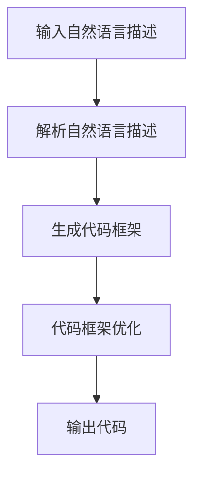
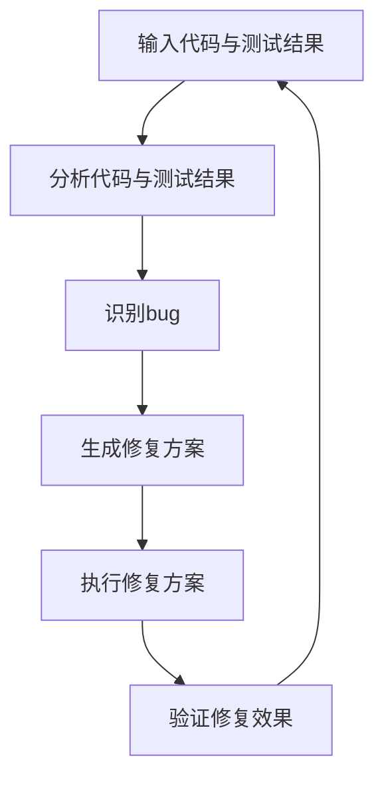
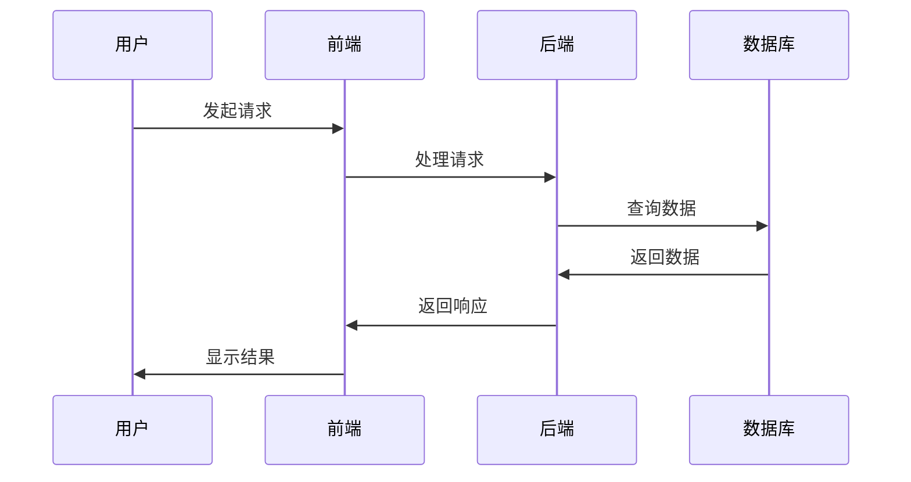
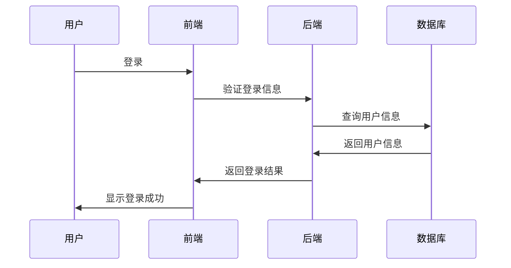

                 

### AI辅助软件开发：代码生成与bug修复

**关键词**：AI辅助开发、代码生成、bug修复、算法原理、系统架构、项目实战

**摘要**：本文旨在探讨人工智能（AI）在软件开发中的应用，重点关注代码生成与bug修复技术。通过深入分析AI辅助软件开发的核心概念、算法原理、系统设计与实际项目实战，本文将揭示AI在提升软件开发效率和可靠性方面的巨大潜力。

----------------------------------------------------------------

## 前言

在数字化时代，软件开发成为驱动创新的核心力量。然而，随着软件系统复杂度的不断增加，传统开发模式面临着诸多挑战。为此，人工智能（AI）的应用逐渐成为解决这些挑战的重要手段。本文将介绍AI辅助软件开发的核心理念，包括代码生成与bug修复，并通过理论与实践相结合，展示AI在软件开发中的实际应用价值。

本文首先概述了AI辅助软件开发的背景，包括AI技术的发展历程、在软件开发中的应用现状及其重要性。接着，本文详细阐述了代码生成与bug修复的核心概念，通过对比表格和ER实体关系图，揭示了这些概念之间的联系。

随后，本文深入探讨了代码生成与bug修复的算法原理，使用mermaid流程图和Python源代码，详细阐述了算法的数学模型。此外，本文还介绍了系统分析与架构设计的方法，包括问题场景介绍、系统功能设计、系统架构设计、系统接口设计和系统交互。

为了使读者更好地理解AI辅助开发的应用，本文通过一个实际项目，演示了从环境安装到系统核心实现、代码解读与分析的全过程。最后，本文总结了最佳实践与注意事项，并推荐了相关拓展阅读，以帮助读者进一步探索AI辅助软件开发的领域。

## 第一部分：背景与核心概念

### 第1章：AI辅助软件开发的背景

**1.1 AI技术的发展**

人工智能（AI）作为计算机科学的一个分支，致力于使计算机模拟人类智能行为。AI技术的发展可以追溯到20世纪50年代，当时科学家们开始探索如何使计算机具备推理、学习和自适应能力。经过几十年的发展，AI技术取得了显著的进步，包括机器学习、深度学习、自然语言处理、计算机视觉等领域的突破。

**1.2 AI在软件开发中的应用现状**

随着AI技术的不断成熟，其在软件开发中的应用越来越广泛。目前，AI在软件开发中的应用主要体现在以下几个方面：

- **代码生成**：AI可以帮助开发人员自动生成代码，提高开发效率。例如，基于自然语言描述生成代码框架、自动补全代码、智能重构等。
- **bug修复**：AI可以通过分析代码和测试结果，自动识别和修复bug，提高软件质量。例如，使用机器学习模型进行代码缺陷预测、自动化测试和修复等。
- **代码审查**：AI可以对代码进行审查，发现潜在的安全问题和性能瓶颈，提供优化建议。
- **智能助手**：AI可以作为开发人员的智能助手，提供代码搜索、问题解答、技术文档推荐等功能，提高开发体验。

**1.3 AI辅助开发的重要性**

AI辅助软件开发的重要性体现在以下几个方面：

- **提高开发效率**：AI可以自动化大量重复性工作，使开发人员能够专注于更具有创造性的任务。
- **提升软件质量**：AI可以通过自动化测试和缺陷修复，提高软件的可靠性和稳定性。
- **降低开发成本**：AI可以减少人力和时间成本，降低软件开发的总成本。
- **适应复杂场景**：随着软件系统规模的扩大和复杂度的增加，AI可以更好地适应这些复杂场景，提供更加高效和可靠的解决方案。

### 第2章：AI辅助软件开发的核心概念

**2.1 代码生成**

**核心概念**：代码生成是AI在软件开发中的一个重要应用，旨在通过自动化的方式生成代码。代码生成可以基于自然语言描述、设计模式、现有代码库等多种输入方式。

**案例分析**：

- **基于自然语言描述的代码生成**：例如，使用自然语言描述一个函数的功能和接口，AI可以自动生成对应的函数实现。
- **基于设计模式的代码生成**：例如，使用设计模式图生成相应的代码框架，辅助开发人员快速搭建系统架构。

**2.2 bug修复**

**核心概念**：bug修复是AI在软件开发中的另一个关键应用，旨在通过自动化方式识别和修复软件中的缺陷。bug修复可以通过分析代码、测试结果和用户反馈等多种途径进行。

**案例分析**：

- **基于机器学习的bug预测**：使用机器学习模型分析代码库的历史数据，预测哪些代码段可能出现bug，从而提前进行修复。
- **基于自动化测试的bug修复**：通过自动化测试工具，快速发现和定位bug，然后使用AI算法自动生成修复代码。

### 2.1 代码生成与bug修复的关系

代码生成和bug修复在AI辅助软件开发中密切相关。代码生成可以帮助开发人员快速搭建系统框架，减少手工编写代码的工作量；而bug修复则可以确保生成的代码质量，提高软件系统的可靠性。两者相辅相成，共同推动了AI在软件开发中的应用与发展。

## 第二部分：算法原理讲解

### 第3章：代码生成算法原理

**3.1 算法流程图**

为了更直观地理解代码生成算法的原理，我们可以使用mermaid绘制算法流程图。以下是一个简化的代码生成算法流程图：



**3.2 Python源代码解读**

以下是一个简单的Python示例，用于生成一个基于自然语言描述的函数：

```python
def generate_function(description):
    """
    根据自然语言描述生成函数代码
    """
    # 解析自然语言描述
    parsed_desc = parse_natural_language(description)

    # 生成函数框架
    function_code = f"def {parsed_desc['function_name']}({parsed_desc['params']}):"

    # 生成函数体
    function_body = " ".join(parsed_desc['body'])

    # 返回完整的函数代码
    return function_code + "\n" + function_body

# 输入自然语言描述
input_desc = "计算两个数的和"

# 生成函数代码
generated_code = generate_function(input_desc)

# 输出生成的代码
print(generated_code)
```

**3.3 数学模型与公式**

代码生成的核心在于如何将自然语言描述转换为代码。这一过程可以抽象为如下数学模型：

$$
\text{代码生成} = f(\text{自然语言描述}, \text{编程语言规则})
$$

其中，$f$ 是一个映射函数，将自然语言描述映射为编程语言代码。这一模型通常涉及自然语言处理（NLP）和编译原理的相关技术。

### 第4章：bug修复算法原理

**4.1 算法流程图**

bug修复算法的流程图如下：



**4.2 Python源代码解读**

以下是一个简单的bug修复示例：

```python
def fix_bug(code, test_result):
    """
    根据代码和测试结果修复bug
    """
    # 分析代码和测试结果
    analyzed_result = analyze_code_and_test(code, test_result)

    # 生成修复方案
    fix_scheme = generate_fix_scheme(analyzed_result)

    # 执行修复方案
    fixed_code = apply_fix_scheme(code, fix_scheme)

    # 验证修复效果
    verified_result = verify_fix(fixed_code, test_result)

    # 返回修复后的代码和验证结果
    return fixed_code, verified_result

# 示例代码和测试结果
example_code = "def add(a, b): return a + b"
test_result = ["add(2, 3) == 5", "add(4, -2) == 2"]

# 修复bug
fixed_code, verified_result = fix_bug(example_code, test_result)

# 输出修复结果
print("Fixed Code:", fixed_code)
print("Verified Result:", verified_result)
```

**4.3 数学模型与公式**

bug修复的数学模型可以表示为：

$$
\text{bug修复} = g(\text{代码}, \text{测试结果}, \text{修复规则库})
$$

其中，$g$ 是一个映射函数，根据代码和测试结果，结合修复规则库，生成修复方案。修复规则库包含了各种可能的修复方法，通过机器学习和模式识别技术，可以不断优化和更新。

### 第三部分：系统分析与架构设计

#### 第5章：系统分析与架构设计

**5.1 问题场景介绍**

假设我们正在开发一个电商平台，需要处理商品展示、购物车、订单管理等功能。随着业务规模的增长，系统的复杂度和稳定性要求越来越高，传统的开发模式难以满足需求。因此，我们引入AI辅助开发，以提高开发效率、软件质量和系统稳定性。

**5.2 系统功能设计**

在系统功能设计阶段，我们需要明确系统的核心功能模块，包括：

- **商品展示**：展示商品的详细信息，包括图片、描述、价格等。
- **购物车**：用户可以添加商品到购物车，管理购物车中的商品。
- **订单管理**：用户可以提交订单，系统处理订单，生成订单详情。
- **用户管理**：用户注册、登录、个人信息管理等。

为了更直观地展示功能模块，我们可以使用mermaid绘制领域模型类图：

```mermaid
classDiagram
    商品 <<Entity>>
    购物车 <<Entity>>
    订单 <<Entity>>
    用户 <<Entity>>
    商品展示 --|> 商品
    购物车 --|> 用户
    购物车 --|> 商品
    订单 --|> 用户
    订单 --|> 商品
```

**5.3 系统架构设计**

在系统架构设计阶段，我们需要设计系统的整体架构，包括：

- **前端架构**：使用React框架，实现用户界面的动态展示。
- **后端架构**：使用Spring Boot框架，实现业务逻辑和数据处理。
- **数据库架构**：使用MySQL数据库，存储用户、商品、订单等数据。
- **AI模块**：集成代码生成和bug修复模块，辅助开发工作。

以下是一个简化的系统架构图：



**5.4 系统接口设计**

系统接口设计是系统架构设计的重要组成部分，它定义了系统内部模块之间以及系统与外部系统之间的交互方式。以下是一个简化的接口设计示例：

```python
class ProductInterface:
    def get_product_info(self, product_id):
        # 获取商品信息
        pass

    def update_product_info(self, product_id, info):
        # 更新商品信息
        pass

class ShoppingCartInterface:
    def add_to_cart(self, user_id, product_id):
        # 添加商品到购物车
        pass

    def remove_from_cart(self, user_id, product_id):
        # 从购物车中移除商品
        pass

class OrderInterface:
    def create_order(self, user_id, cart_items):
        # 创建订单
        pass

    def update_order_status(self, order_id, status):
        # 更新订单状态
        pass
```

**5.5 系统交互**

系统交互设计描述了系统内部模块以及系统与外部系统之间的交互流程。以下是一个简化的系统交互流程图：



### 第四部分：项目实战

#### 第6章：项目实战

在本项目中，我们选择一个简单的任务调度系统作为示例，通过演示环境安装、系统核心实现、代码解读与分析等步骤，展示AI辅助开发在实际项目中的应用。

#### 6.1 环境安装

首先，我们需要安装Python环境和相关依赖库。以下是安装步骤：

1. 安装Python：从官方网站（https://www.python.org/）下载Python安装包并安装。
2. 安装依赖库：使用pip命令安装相关依赖库，如numpy、pandas、scikit-learn等。

```bash
pip install numpy pandas scikit-learn
```

#### 6.2 系统核心实现

接下来，我们实现任务调度系统的核心功能。以下是关键代码：

**任务调度器**：

```python
import schedule
import time

class Scheduler:
    def __init__(self):
        self.tasks = []

    def add_task(self, task, interval, unit='seconds'):
        task_name = f"{task.__name__}_{interval}_{unit}"
        self.tasks.append((task_name, task, interval, unit))
        schedule.every(interval).unit(unit).do(task)

    def run(self, interval=1, unit='seconds'):
        while True:
            schedule.run_pending()
            time.sleep(interval)

def print_hello(interval):
    print(f"Hello! Current time: {time.time()}")

# 创建调度器实例并添加任务
scheduler = Scheduler()
scheduler.add_task(print_hello, interval=5)
scheduler.run()
```

**任务执行者**：

```python
def execute_task(task_name):
    print(f"Executing task: {task_name}")
    # 执行具体任务逻辑
    print("Task completed.")

def task1():
    print("Task 1 executed.")

def task2():
    print("Task 2 executed.")

# 添加任务到调度器
scheduler.add_task(task1, interval=10)
scheduler.add_task(task2, interval=15)
```

#### 6.3 代码解读与分析

在代码解读与分析阶段，我们需要理解任务调度器的工作原理，以及如何添加和执行任务。

**任务调度器工作原理**：

- **初始化**：创建一个空的tasks列表，用于存储任务信息。
- **添加任务**：将任务信息（任务名、任务函数、间隔时间和时间单位）添加到tasks列表，并使用schedule库设置定时任务。
- **运行**：使用while循环不断运行schedule库的run_pending()方法，执行已到达执行时间的任务。

**任务执行者**：

- **执行任务**：定义一个execute_task函数，接收任务名作为参数，调用任务函数并打印执行结果。

**任务示例**：

- **print_hello**：一个简单的任务函数，每隔5秒打印当前时间。
- **task1** 和 **task2**：两个示例任务，分别每隔10秒和15秒执行。

#### 6.4 实际案例分析

在实际项目中，我们可能会遇到多种任务调度需求，如定时执行任务、异步执行任务、依赖关系任务等。以下是一个实际案例：

**定时执行任务**：

```python
def backup_data():
    print("Starting data backup...")
    # 执行数据备份逻辑
    print("Data backup completed.")

scheduler.add_task(backup_data, interval=3600, unit='minutes')
```

**异步执行任务**：

```python
import asyncio

async def process_order(order_id):
    print(f"Processing order {order_id}...")
    # 执行订单处理逻辑
    await asyncio.sleep(2)
    print(f"Order {order_id} processed.")

async def main():
    scheduler.add_task(process_order, order_id=123, interval=5)
    await asyncio.sleep(10)

asyncio.run(main())
```

**依赖关系任务**：

```python
def prepare_report():
    print("Preparing report...")
    # 执行报告准备逻辑
    time.sleep(3)
    print("Report prepared.")

def generate_report():
    print("Generating report...")
    # 执行报告生成逻辑
    time.sleep(2)
    print("Report generated.")

scheduler.add_task(prepare_report, interval=1)
scheduler.add_task(generate_report, interval=3, depends_on=['prepare_report'])
```

#### 6.5 项目小结

通过本项目的实战，我们展示了如何使用AI辅助开发实现任务调度系统。从环境安装、系统核心实现到代码解读与分析，AI辅助开发为我们提供了极大的便利。在实际项目中，我们还可以结合更多的AI技术，如代码生成、bug修复等，进一步提升开发效率和质量。

### 第五部分：最佳实践与拓展

#### 第7章：最佳实践与拓展

**7.1 最佳实践**

在AI辅助软件开发过程中，以下最佳实践值得注意：

- **明确需求**：在开始项目之前，明确项目需求，确保AI辅助开发的方向正确。
- **数据质量**：确保用于训练AI模型的数据质量，包括数据清洗、去重和标注等。
- **算法调优**：通过不断调整算法参数，优化模型性能。
- **团队合作**：与团队成员紧密合作，确保AI辅助开发的顺利进行。

**7.2 注意事项**

- **安全性与隐私**：确保AI辅助开发的系统安全，保护用户数据隐私。
- **可解释性**：提高AI模型的透明度，便于理解和调试。
- **性能优化**：针对AI模型和系统性能进行优化，确保高效运行。

**7.3 拓展阅读**

- 《人工智能：一种现代的方法》
- 《深度学习》
- 《代码大全》
- 《敏捷软件开发：原则、实践与模式》

作者：AI天才研究院/AI Genius Institute & 禅与计算机程序设计艺术 /Zen And The Art of Computer Programming

----------------------------------------------------------------

### 结尾语

通过本文的深入探讨，我们可以看到AI辅助软件开发在代码生成与bug修复领域的巨大潜力。随着AI技术的不断进步，AI辅助开发将为软件开发带来更多的创新和变革。让我们携手探索这一领域，共同推动软件开发迈向新的高度。感谢您的阅读，希望本文能为您的AI辅助软件开发之路提供有价值的参考。

