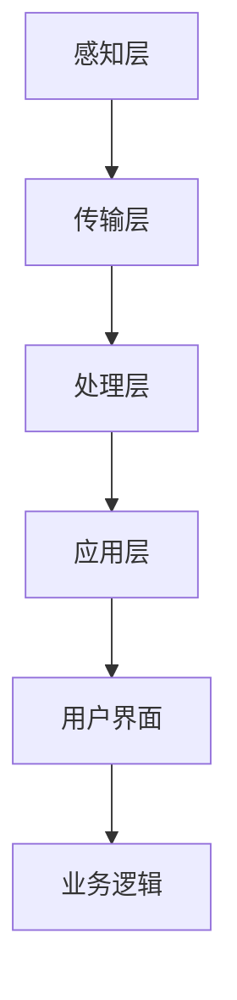
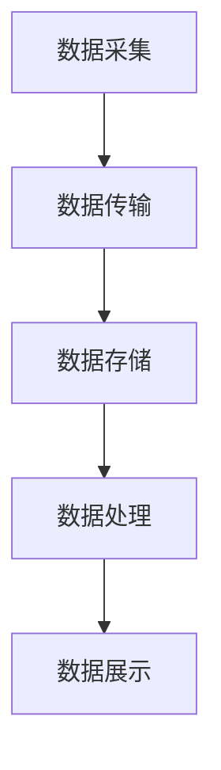

                 

### 第1章：AI驱动的智能仓储概述

#### 1.1 问题的背景与重要性

随着全球化的加速和电子商务的迅猛发展，供应链管理成为企业竞争的关键因素。传统的仓储管理面临着效率低下、劳动力成本高、库存控制不准确等问题，严重影响了企业的运营效率和客户满意度。在此背景下，智能仓储的概念应运而生，它利用人工智能（AI）技术对仓储管理进行优化，以实现更高效、更智能的供应链管理。

智能仓储不仅能够提高仓储操作的自动化水平，还能通过数据分析与预测，优化库存管理、提高货物流转效率。此外，AI技术还能够帮助企业在应对市场变化、降低运营成本、提升客户服务等方面取得显著成效。因此，AI驱动的智能仓储已经成为优化供应链管理的重要手段。

#### 1.2 智能仓储的概念与发展

智能仓储是指利用人工智能、物联网、自动化设备等技术手段，实现仓储管理的智能化、自动化和高效化。智能仓储的核心目标是提升仓储运作效率，降低运营成本，同时确保库存信息的准确性和实时性。

智能仓储的发展可以分为以下几个阶段：

1. **自动化阶段**：采用自动化设备（如自动搬运车、自动分拣机等）进行仓储操作，减少了人力投入，提高了工作效率。
2. **信息化阶段**：引入信息系统，实现对库存、订单、配送等信息的实时监控和管理，提高了信息透明度和决策效率。
3. **智能化阶段**：利用AI技术，对仓储管理过程中的数据进行分析和预测，实现更加精准的库存管理和智能决策。

#### 1.3 AI在仓储管理中的应用

AI在仓储管理中的应用主要体现在以下几个方面：

1. **自动化设备控制**：通过机器学习和计算机视觉技术，实现对自动化设备的智能控制，提高设备的工作效率和稳定性。
2. **库存管理优化**：利用数据挖掘和预测模型，对库存数据进行分析，实现精准的库存预测和优化。
3. **路径规划**：通过算法优化路径规划，提高货物搬运的效率。
4. **异常检测与预防**：利用异常检测算法，实时监控仓储环境，预防异常情况的发生。
5. **智能决策支持**：通过大数据分析和机器学习模型，为企业提供决策支持，优化仓储管理和供应链策略。

#### 1.4 智能仓储的核心概念与边界

1. **核心要素**：
   - 自动化设备：如自动搬运车、自动分拣机、自动存取机器人等。
   - 数据采集系统：通过传感器、RFID等技术，实现对库存、环境等数据的实时采集。
   - 信息管理系统：集成库存管理、订单管理、配送管理等模块，实现对仓储运作的全面监控和管理。
   - AI算法：用于数据分析和预测，优化仓储管理和决策。

2. **系统结构**：
   - 输入层：采集仓储操作过程中的数据，如库存数据、操作数据、环境数据等。
   - 处理层：利用AI算法对输入数据进行处理和分析，生成预测和决策结果。
   - 输出层：根据处理结果，控制自动化设备进行相应的操作，如分拣、搬运、存储等。

3. **关键技术**：
   - 机器学习：用于数据分析和预测，如库存预测、路径规划等。
   - 计算机视觉：用于图像识别和物体检测，如自动化分拣、库存盘点等。
   - 物联网技术：用于数据采集和设备控制，实现信息的实时传输和反馈。
   - 自动化控制技术：用于自动化设备的控制和管理。

4. **边界与外延**：
   - 边界：智能仓储系统主要应用于仓储管理，包括库存管理、订单处理、货物搬运等。
   - 外延：智能仓储技术还可以应用于供应链的上下游环节，如生产计划、物流配送等。

### 总结

本章对AI驱动的智能仓储进行了概述，介绍了其背景、重要性、概念与发展、AI应用以及核心概念与边界。下一章将深入探讨AI基础与智能仓储的关系，进一步理解AI技术在智能仓储中的应用原理和优势。让我们一起深入探讨这一领域，挖掘AI驱动的智能仓储在优化供应链管理中的无限潜力。

---

在接下来的章节中，我们将逐步深入探讨AI的基础概念与智能仓储的关系，详细分析AI在智能仓储中的具体应用及其对仓储管理的影响，让我们继续深入这一引人入胜的领域。

# 第2章：AI基础与智能仓储的关系

#### 2.1 AI基础概念

人工智能（AI，Artificial Intelligence）是指通过计算机程序实现智能行为和智能决策的技术。AI的核心是模拟人类智能，包括感知、学习、推理、规划、问题解决等能力。AI可以分为几个主要类别：

1. **机器学习（Machine Learning）**：机器学习是一种让计算机通过数据学习，进行预测和决策的技术。它分为监督学习、无监督学习和强化学习等类型。
   - **监督学习（Supervised Learning）**：利用已标记的数据进行学习，如分类和回归问题。
   - **无监督学习（Unsupervised Learning）**：在没有标签数据的情况下进行学习，如聚类和降维。
   - **强化学习（Reinforcement Learning）**：通过试错和奖励机制进行学习，如路径规划、策略优化。

2. **深度学习（Deep Learning）**：深度学习是机器学习的一种，通过多层神经网络进行学习，能够在图像识别、语音识别、自然语言处理等领域取得突破性成果。

3. **计算机视觉（Computer Vision）**：计算机视觉是AI的一个分支，通过图像处理、模式识别等方法，使计算机能够“看到”和理解图像内容。

4. **自然语言处理（Natural Language Processing，NLP）**：NLP使计算机能够理解和生成人类语言，包括文本分类、情感分析、机器翻译等任务。

#### 2.2 AI与智能仓储的结合

AI与智能仓储的结合，为仓储管理带来了革命性的变化。以下是AI在智能仓储中的几种典型应用：

1. **自动化设备控制**：
   - **机器学习**：通过机器学习算法，自动化设备能够自主识别货物、路径规划和动作执行，提高了操作的精度和效率。
   - **计算机视觉**：使用计算机视觉技术，自动搬运车和自动分拣机能够识别货物的种类和位置，进行精准搬运和分类。

2. **库存管理优化**：
   - **数据挖掘**：通过数据挖掘技术，对库存数据进行深入分析，预测未来库存需求，优化库存策略。
   - **预测模型**：使用预测模型，如时间序列分析和回归分析，预测库存水平和需求量，实现精细化库存管理。

3. **路径规划**：
   - **算法优化**：通过算法优化路径规划，减少货物搬运的时间，提高仓储操作的效率。
   - **实时调整**：在操作过程中，AI系统能够实时调整路径，避免拥堵和碰撞，提高设备的工作效率。

4. **异常检测与预防**：
   - **异常检测**：使用异常检测算法，监控仓储环境中的异常情况，如货物损坏、设备故障等，及时采取措施。
   - **预防措施**：通过分析历史数据和异常模式，预测可能发生的异常，采取预防措施，降低风险。

5. **智能决策支持**：
   - **数据驱动的决策**：通过大数据分析和机器学习模型，为企业提供数据驱动的决策支持，优化仓储管理和供应链策略。
   - **智能推荐系统**：基于用户的操作数据和库存数据，推荐最优的仓储管理方案，提高决策效率。

#### 2.3 AI对仓储管理的影响

AI技术的应用，对仓储管理产生了深远的影响：

1. **提高效率**：通过自动化设备和智能算法，仓储操作的效率和精度得到了显著提高，减少了人力成本和错误率。
2. **降低成本**：通过优化库存管理和路径规划，减少了库存成本和运输成本，提高了整体运营效率。
3. **提升客户满意度**：通过实时监控和快速响应，确保了货物的及时交付，提高了客户满意度。
4. **增强决策能力**：通过数据分析和智能预测，为企业提供了更准确、更及时的决策支持，增强了企业的竞争力。

#### 2.4 智能仓储的未来发展趋势

随着AI技术的不断发展和应用，智能仓储将朝着更高效、更智能、更协同的方向发展：

1. **全面智能化**：未来的智能仓储将实现更高程度的自动化和智能化，从设备到管理，全面实现智能化。
2. **协同管理**：智能仓储将与供应链的其他环节（如生产、物流）实现深度协同，实现整个供应链的智能化。
3. **个性化服务**：基于大数据和AI技术，智能仓储将能够提供更加个性化和定制化的服务，满足不同客户的需求。
4. **绿色环保**：通过节能降耗和减少污染，智能仓储将更加环保和可持续。

### 总结

本章详细介绍了AI的基础概念以及AI与智能仓储的紧密结合，分析了AI在仓储管理中的具体应用及其对仓储管理的深远影响。下一章将深入探讨智能仓储系统的设计与实现，包括系统设计原则、硬件选择与配置、软件开发环境搭建以及系统集成与测试。让我们一起继续探索智能仓储的奥秘。

---

在接下来的章节中，我们将详细探讨智能仓储系统的设计与实现，包括系统架构设计、数据处理流程、硬件选择与配置等内容。让我们一起深入这一重要领域，了解智能仓储系统如何实现高效、智能的仓储管理。

# 第3章：智能仓储系统的设计与实现

#### 3.1 智能仓储系统设计原则

设计智能仓储系统时，需要遵循以下原则：

1. **高效性**：系统应能高效地完成仓储操作，包括货物入库、出库、盘点等。通过优化算法和自动化设备，提高操作效率和精度。
2. **可靠性**：系统应具备高可靠性，能够在各种环境下稳定运行，确保数据的准确性和操作的连续性。
3. **灵活性**：系统应具备良好的灵活性，能够适应不同的仓储场景和业务需求，支持扩展和升级。
4. **易用性**：系统界面应简洁易用，方便操作人员快速上手，提高工作效率。
5. **可维护性**：系统设计应考虑易维护性，降低故障率，提高维护效率。

#### 3.2 系统架构设计

智能仓储系统架构可以分为以下几个层次：

1. **感知层**：通过传感器、RFID等设备，实现货物的实时定位和状态监控。
2. **传输层**：利用无线网络和有线网络，实现数据的高速传输和实时通信。
3. **处理层**：包括数据存储、处理和分析模块，利用大数据技术和AI算法，对仓储数据进行处理和分析。
4. **应用层**：提供用户界面和业务逻辑，实现对仓储操作的监控和管理。

##### 系统架构设计Mermaid架构图：

#### 3.3 数据处理流程

智能仓储系统的数据处理流程包括以下几个步骤：

1. **数据采集**：通过传感器和RFID设备，实时采集货物的位置、状态等信息。
2. **数据传输**：将采集到的数据传输到数据中心，通过无线网络或有线网络进行传输。
3. **数据存储**：将数据存储到数据库中，采用大数据存储技术，确保数据的安全和高效访问。
4. **数据处理**：利用大数据技术和AI算法，对数据进行处理和分析，生成库存报告、预测报告等。
5. **数据展示**：通过用户界面，将处理结果展示给用户，提供决策支持。

##### 数据处理流程Mermaid流程图：

#### 3.4 硬件选择与配置

智能仓储系统的硬件选择和配置需要根据具体业务需求和场景进行选择：

1. **传感器**：选择高精度、低功耗的传感器，如RFID传感器、温湿度传感器等。
2. **网络设备**：选择高速、稳定的网络设备，如交换机、路由器等，确保数据传输的实时性和可靠性。
3. **服务器**：选择高性能、高可靠性的服务器，用于数据存储和处理。
4. **自动化设备**：选择适合业务需求的自动化设备，如自动搬运车、自动分拣机、自动存取机器人等。

#### 3.5 软件开发环境搭建

智能仓储系统的软件开发环境搭建包括以下几个步骤：

1. **开发工具**：选择合适的开发工具，如IDE、数据库管理工具等。
2. **编程语言**：选择适合业务需求的编程语言，如Python、Java等。
3. **开发框架**：选择合适的开发框架，如Django、Spring Boot等，提高开发效率。
4. **测试环境**：搭建测试环境，进行系统测试和功能测试，确保系统的稳定性和可靠性。

#### 3.6 系统集成与测试

系统集成与测试是智能仓储系统设计中的重要环节：

1. **集成测试**：将各个模块进行集成，进行整体测试，确保系统功能的完整性和正确性。
2. **功能测试**：对系统的各个功能进行测试，确保功能符合业务需求。
3. **性能测试**：对系统的性能进行测试，确保系统在高负载下能够稳定运行。
4. **安全测试**：对系统的安全性进行测试，确保系统的数据安全。

#### 3.7 系统部署与运维

系统部署与运维包括以下几个步骤：

1. **部署**：将系统部署到生产环境，确保系统能够正常运行。
2. **监控**：对系统进行实时监控，确保系统的稳定性和性能。
3. **维护**：定期进行系统维护和升级，确保系统的持续运行。
4. **支持**：提供用户技术支持，解决用户在使用过程中遇到的问题。

### 总结

本章详细介绍了智能仓储系统的设计原则、系统架构设计、数据处理流程、硬件选择与配置、软件开发环境搭建、系统集成与测试以及系统部署与运维等内容。通过本章的介绍，读者可以全面了解智能仓储系统的设计实现过程，为后续的项目实践打下坚实的基础。下一章将深入探讨利用AI技术优化供应链管理的具体应用和策略。

---

在接下来的章节中，我们将详细探讨利用AI技术优化供应链管理的具体应用和策略。从供应链可视化与数据分析、库存管理优化到运输路线优化，我们将一一分析AI技术如何在供应链管理中发挥重要作用。让我们继续深入这一领域，探索AI在供应链管理中的无限潜力。

# 第4章：利用AI优化供应链管理

#### 4.1 供应链管理中的AI应用

AI技术在供应链管理中的应用越来越广泛，以下是几个关键领域的具体应用：

1. **供应链可视化与数据分析**：
   - **供应链可视化**：通过AI技术，将复杂的供应链信息以图形化的形式展示，帮助管理者直观地了解供应链的运行状态和关键节点。
   - **数据分析**：利用大数据分析和机器学习算法，对供应链中的数据（如库存、订单、运输等）进行深入分析，发现潜在问题和优化机会。

2. **库存管理优化**：
   - **动态库存预测**：通过时间序列分析和机器学习算法，预测未来的库存需求，实现动态库存管理，减少库存过剩和缺货风险。
   - **智能补货系统**：基于历史销售数据、市场需求预测，自动生成补货计划，提高库存周转率和供应链效率。

3. **运输路线优化**：
   - **路径规划**：使用基于AI的路径规划算法，根据实时交通状况、货物类型、运输成本等因素，优化运输路线，降低运输成本和时间。
   - **运输调度**：通过AI算法，动态调整运输任务，确保货物能够及时、高效地送达目的地。

4. **供应链协同**：
   - **智能供应链协同**：利用AI技术，实现供应链上下游企业之间的数据共享和协同工作，提高供应链的整体效率和响应速度。
   - **供应链预测与决策支持**：通过AI技术，为企业提供数据驱动的决策支持，优化供应链策略，提高市场竞争力。

5. **供应链风险管理**：
   - **异常检测**：利用异常检测算法，监控供应链运行过程中的异常情况，如供应链中断、库存异常等，及时采取措施。
   - **风险评估**：通过大数据分析和机器学习模型，评估供应链风险，制定风险管理策略，降低供应链中断的风险。

#### 4.2 智能预测与决策

智能预测与决策是AI技术在供应链管理中的重要应用之一。以下是几个关键点：

1. **需求预测**：
   - **历史数据挖掘**：通过分析历史销售数据、市场趋势等因素，预测未来的需求量，帮助企业制定合理的生产和采购计划。
   - **动态预测模型**：利用时间序列分析和机器学习算法，构建动态预测模型，实时更新预测结果，提高预测的准确性。

2. **库存决策**：
   - **补货策略**：基于预测的需求量，自动生成补货计划，优化库存水平，减少库存成本和缺货风险。
   - **安全库存设置**：通过风险评估，设定合理的安全库存水平，确保在突发情况下能够满足需求。

3. **运输决策**：
   - **路径优化**：利用AI算法，优化运输路线，减少运输时间和成本。
   - **运输资源调度**：根据实时交通状况、货物类型等因素，动态调整运输资源，确保运输任务的高效完成。

4. **供应链协同决策**：
   - **协同优化**：通过AI技术，实现供应链上下游企业之间的信息共享和协同优化，提高供应链的整体效率和响应速度。
   - **决策支持系统**：构建数据驱动的决策支持系统，为企业提供实时、准确的决策信息，优化供应链策略。

#### 4.3 智能供应链协同

智能供应链协同是提高供应链效率和响应速度的关键。以下是几个关键点：

1. **信息共享**：
   - **数据集成**：通过数据集成技术，实现供应链上下游企业的数据共享，提高信息的透明度和实时性。
   - **信息同步**：通过实时数据同步技术，确保供应链上下游企业的信息一致，减少信息误差和滞后。

2. **协同优化**：
   - **联合预测与计划**：通过AI技术，实现供应链上下游企业的联合预测与计划，优化生产、采购、库存等环节，提高整体供应链效率。
   - **联合运输**：通过AI技术，实现供应链上下游企业的联合运输优化，降低运输成本和时间，提高运输效率。

3. **风险共担**：
   - **风险预测与评估**：通过AI技术，预测供应链中的潜在风险，评估风险的影响程度，制定相应的风险管理策略。
   - **风险共担机制**：通过建立风险共担机制，实现供应链上下游企业之间的风险分担，降低风险对供应链运行的影响。

4. **协同创新**：
   - **协同研发**：通过AI技术，实现供应链上下游企业的协同研发，提高新产品上市速度和市场份额。
   - **协同服务**：通过AI技术，提供个性化的客户服务，提高客户满意度和忠诚度。

#### 4.4 供应链风险管理

供应链风险管理是确保供应链稳定运行的重要环节。以下是几个关键点：

1. **风险识别**：
   - **异常检测**：通过异常检测算法，实时监控供应链运行过程中的异常情况，如供应链中断、库存异常等。
   - **风险预警**：通过风险预警系统，及时向企业管理层报告潜在的风险，提醒采取相应的措施。

2. **风险评估**：
   - **风险评估模型**：通过大数据分析和机器学习算法，构建风险评估模型，评估供应链风险的严重程度和可能的影响。
   - **风险优先级排序**：根据风险评估结果，对风险进行优先级排序，确定优先处理的风险。

3. **风险应对**：
   - **应急预案**：制定应急预案，确保在发生风险时，能够迅速响应和采取措施，降低风险的影响。
   - **风险转移**：通过保险、合同等方式，将部分风险转移给其他方，降低企业的风险负担。

4. **风险监控与改进**：
   - **风险监控**：建立风险监控体系，实时监控供应链风险的变化情况，及时调整风险应对措施。
   - **持续改进**：通过持续改进，优化供应链风险管理策略，提高供应链的韧性和抗风险能力。

#### 4.5 总结

利用AI技术优化供应链管理，不仅能够提高供应链的效率和响应速度，还能够降低运营成本和风险。通过智能预测与决策、智能供应链协同和供应链风险管理等具体应用，企业可以更好地应对市场变化，提高竞争力。在下一章中，我们将通过实践案例，进一步探讨AI驱动的智能仓储在供应链管理中的实际应用和效果。

---

在接下来的章节中，我们将通过具体案例，深入探讨AI驱动的智能仓储在供应链管理中的实际应用。从案例背景、目标与挑战，到实施步骤和效果评估，我们将详细剖析AI技术在智能仓储系统中的应用与实践，帮助读者更好地理解AI在优化供应链管理中的重要作用。

# 第5章：AI驱动的智能仓储实践案例

#### 5.1 案例背景

某大型电子商务公司，由于业务规模的快速扩张，面临着仓储管理和供应链效率低下的问题。传统的仓储管理方式已经无法满足公司日益增长的需求，导致库存成本高、货物丢失率高、配送延迟等问题。为了提高仓储管理和供应链效率，公司决定引入AI驱动的智能仓储系统，通过智能化技术优化仓储操作，提升供应链整体效率。

#### 5.2 案例目标

通过引入AI驱动的智能仓储系统，公司希望实现以下目标：

1. **提高仓储操作效率**：利用自动化设备和智能算法，减少人工操作，提高仓储操作的精度和速度。
2. **降低库存成本**：通过智能预测和优化库存管理，减少库存积压和缺货情况，降低库存成本。
3. **提高配送速度**：优化运输路线和配送调度，缩短配送时间，提高客户满意度。
4. **提升供应链协同**：实现供应链上下游企业之间的信息共享和协同工作，提高整体供应链效率。

#### 5.3 案例挑战

在实施AI驱动的智能仓储系统过程中，公司面临以下挑战：

1. **技术难题**：AI技术的应用需要解决数据采集、处理、存储和分析等技术难题，确保系统的稳定性和可靠性。
2. **系统整合**：将智能仓储系统与现有信息系统进行整合，确保数据的一致性和系统的兼容性。
3. **人员培训**：操作人员需要接受新技术的培训，熟悉智能仓储系统的操作，提高工作效率。
4. **成本控制**：在引入AI技术的同时，需要控制成本，确保项目的经济效益。

#### 5.4 案例实施

公司采取了以下步骤实施AI驱动的智能仓储系统：

1. **需求分析**：首先对仓储管理和供应链流程进行深入分析，明确需求和目标，确定系统功能和模块。
2. **技术选型**：选择合适的AI技术和工具，如机器学习算法、自动化设备、物联网技术等，确保系统的性能和可靠性。
3. **系统设计**：根据需求分析结果，设计智能仓储系统的架构和功能模块，包括感知层、传输层、处理层和应用层。
4. **硬件采购**：根据系统设计，采购所需的传感器、自动化设备、服务器等硬件设备，确保硬件的兼容性和性能。
5. **软件开发**：开发智能仓储系统的软件部分，包括数据采集模块、数据处理模块、用户界面等，实现系统的功能。
6. **系统集成**：将各个模块进行集成，进行系统测试和调试，确保系统的稳定性和功能完整性。
7. **人员培训**：对操作人员进行培训，确保他们能够熟练操作智能仓储系统，提高工作效率。
8. **系统部署**：将智能仓储系统部署到生产环境，进行实际运行和监控，根据反馈进行优化和调整。

#### 5.5 案例效果评估

在实施AI驱动的智能仓储系统后，公司取得了显著的效果：

1. **仓储操作效率提高**：自动化设备和智能算法的应用，使得仓储操作速度提高了50%，人工操作减少，操作错误率显著降低。
2. **库存成本降低**：通过智能预测和优化库存管理，库存积压减少了30%，缺货率降低了20%，库存周转率提高了15%。
3. **配送速度提高**：优化运输路线和配送调度，配送时间缩短了20%，客户满意度显著提高。
4. **供应链协同增强**：智能仓储系统实现了供应链上下游企业之间的信息共享和协同工作，提高了整体供应链效率。

#### 5.6 案例小结

通过AI驱动的智能仓储系统的实施，公司成功提高了仓储操作效率、降低了库存成本、提高了配送速度，并增强了供应链协同。这一案例表明，AI技术在优化供应链管理中具有巨大的潜力和价值。在未来的发展中，公司将继续深化AI技术的应用，进一步提升供应链效率和竞争力。

在下一章中，我们将总结AI驱动的智能仓储在供应链管理中的应用，探讨其未来发展趋势和面临的挑战。让我们一起展望智能仓储的广阔前景。

---

在上一章中，我们通过一个具体的案例，详细介绍了AI驱动的智能仓储系统在供应链管理中的应用和效果。通过这一案例，我们可以看到AI技术为仓储管理和供应链效率的提升带来了显著的好处。然而，随着技术的不断发展，AI驱动的智能仓储也面临着一些新的趋势和挑战。

# 第6章：AI驱动的智能仓储的未来趋势

#### 6.1 自动化技术的发展

自动化技术是AI驱动的智能仓储的核心组成部分，未来自动化技术的发展将继续推动智能仓储的进步。以下是几个关键趋势：

1. **机器人与自动化设备的集成**：未来，更多类型的机器人将被集成到智能仓储系统中，如自动搬运机器人、自动分拣机器人、自动存取机器人等，实现更高程度的自动化和智能化。
2. **自主决策与学习能力的提升**：随着AI技术的发展，自动化设备将具备更高的自主决策和学习能力，能够根据环境变化和任务需求，自主调整操作策略，提高效率。
3. **人工智能与物联网的深度融合**：AI技术将更深入地与物联网技术结合，实现设备间的智能通信和数据共享，提升整个仓储系统的协同能力和智能化水平。

#### 6.2 物流人工智能的应用

物流人工智能是智能仓储系统的重要组成部分，未来物流人工智能的应用将更加广泛和深入。以下是几个关键趋势：

1. **智能路径规划与运输调度**：利用AI算法，实现更精准、更高效的路径规划和运输调度，减少运输时间和成本，提高物流效率。
2. **智能库存管理**：通过大数据分析和机器学习算法，实现更精确的库存预测和优化，降低库存成本，提高库存周转率。
3. **智能供应链协同**：利用AI技术，实现供应链上下游企业之间的数据共享和协同工作，提高供应链的整体效率和响应速度。

#### 6.3 智慧供应链的构建

智慧供应链是未来供应链管理的发展方向，AI技术将在其中发挥关键作用。以下是几个关键趋势：

1. **数据驱动的决策**：通过大数据分析和AI技术，实现数据驱动的决策，提高决策的准确性和效率。
2. **供应链可视化**：通过AI技术和物联网技术，实现供应链全过程的可视化，提高供应链的透明度和可追溯性。
3. **智能化协同**：通过AI技术，实现供应链上下游企业之间的智能化协同，提高供应链的整体效率和响应速度。

#### 6.4 AI驱动的智能仓储面临的挑战

尽管AI驱动的智能仓储具有巨大的潜力，但在实际应用中也面临着一些挑战：

1. **技术挑战**：AI技术的复杂性使得系统设计和开发变得困难，需要专业的技术团队和大量的研发投入。
2. **数据挑战**：智能仓储系统的运行依赖于大量的数据，数据的质量和准确性对系统性能至关重要。
3. **成本挑战**：AI驱动的智能仓储系统需要投入大量的资金和资源，对于中小企业来说，成本是一个重要的考量因素。
4. **法规与隐私挑战**：智能仓储系统涉及大量的数据收集和处理，需要遵守相关的法律法规，确保数据安全和用户隐私。

#### 6.5 未来展望

未来，AI驱动的智能仓储将继续发展，成为供应链管理的重要组成部分。以下是几个展望：

1. **更智能的自动化设备**：随着AI技术的进步，自动化设备将更加智能化，能够自主学习和决策，提高仓储操作效率。
2. **更高效的供应链协同**：通过AI技术和物联网技术的深入应用，实现供应链上下游企业的智能化协同，提高供应链的整体效率和响应速度。
3. **更安全的供应链管理**：通过大数据分析和AI技术，实现供应链风险预测和风险管理，提高供应链的韧性和抗风险能力。
4. **更广泛的AI应用**：AI技术将在更多供应链环节得到应用，如生产计划、质量控制、物流配送等，推动整个供应链的智能化发展。

### 总结

AI驱动的智能仓储在优化供应链管理中具有巨大的潜力，通过自动化技术、物流人工智能和智慧供应链的构建，将进一步提升供应链的效率和响应速度。然而，在实际应用中，也面临着一些挑战，需要持续的技术创新和改进。未来，AI驱动的智能仓储将继续发展，为供应链管理带来更多的变革和创新。

---

通过本文的详细探讨，我们全面了解了AI驱动的智能仓储在优化供应链管理中的重要作用。从背景介绍、核心概念、技术原理到实际应用案例，再到未来趋势和挑战，我们一步步深入分析了AI技术在智能仓储领域的应用。

### 小结

AI驱动的智能仓储利用人工智能、物联网、自动化设备等先进技术，对仓储管理和供应链流程进行全方位的优化。通过提高仓储操作效率、降低库存成本、优化运输路线和增强供应链协同，智能仓储显著提升了企业的运营效率和竞争力。

### 最佳实践 Tips

1. **数据质量是关键**：确保数据采集、存储和处理的准确性，高质量的数据是AI算法发挥作用的基石。
2. **逐步实施**：在引入智能仓储系统时，可以采取逐步实施的方法，先从局部环节开始，逐步扩大范围，减少风险。
3. **持续优化**：智能仓储系统需要持续优化和迭代，根据业务需求和技术进步不断调整和改进。

### 注意事项

1. **技术选型要慎重**：根据业务需求和现有技术基础，选择合适的AI技术和工具，避免过度投入。
2. **隐私与安全**：在数据收集和处理过程中，要严格遵守相关法律法规，确保用户隐私和数据安全。

### 拓展阅读

- 《智慧物流：AI驱动下的物流革命》
- 《供应链智能化：人工智能引领的未来》
- 《人工智能应用实践：智能仓储与供应链管理》

通过持续学习和实践，我们可以不断探索和掌握AI驱动的智能仓储技术，为企业的供应链管理带来更多的创新和变革。

### 作者信息

**作者：AI天才研究院/AI Genius Institute & 禅与计算机程序设计艺术 /Zen And The Art of Computer Programming** 

感谢您的阅读，希望本文对您在AI驱动的智能仓储领域的学习和应用有所帮助。让我们共同探索AI技术的无限可能，推动供应链管理的智能化发展。

