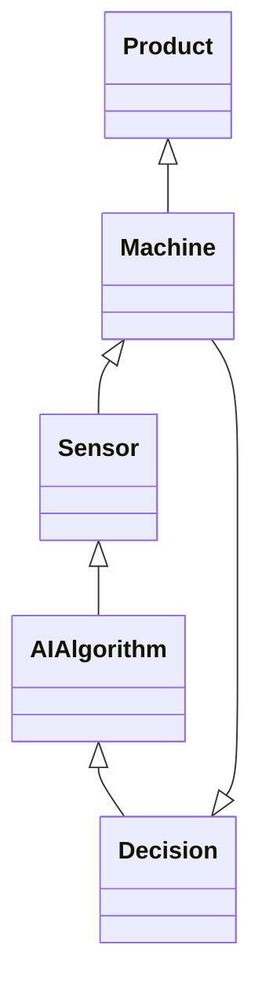
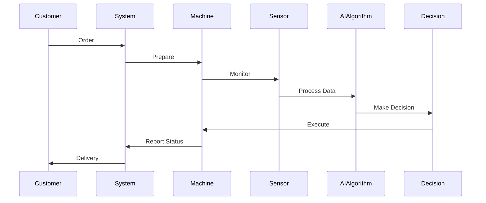
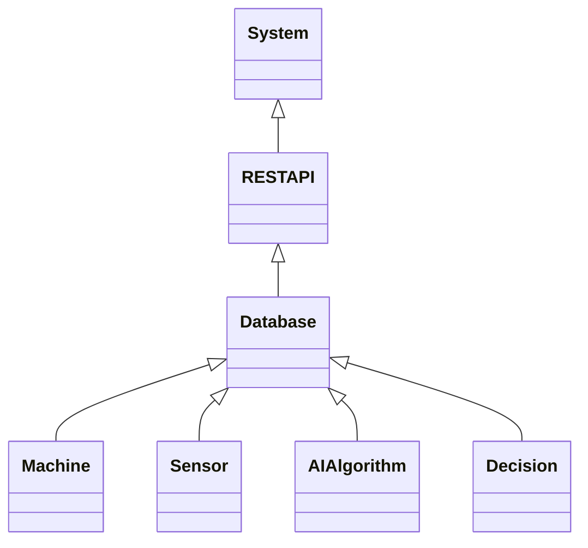

                 

## AI驱动的智能制造：工业4.0的核心技术

### 关键词：AI、智能制造、工业4.0、核心技术、算法、系统架构

### 摘要：
本文旨在深入探讨AI驱动的智能制造在工业4.0中的应用和核心技术。首先，我们回顾了工业4.0和智能制造的基本概念，并探讨了AI如何成为推动这一变革的核心动力。接着，文章详细分析了AI驱动的智能制造原理，包括关键技术和数学模型。随后，文章通过Python代码示例，生动展示了算法的实现和应用。在系统设计与实现部分，我们介绍了系统的功能设计、架构设计和接口设计。最后，通过一个实际项目案例，我们解析了系统的实现细节和效果，并提出了最佳实践和注意事项。

### 目录大纲：

----------------------------------------------------------------

### 第一部分：背景介绍

#### 第1章：问题背景

##### 1.1.1 问题背景介绍

##### 1.1.2 问题描述

##### 1.1.3 问题解决

##### 1.1.4 边界与外延

#### 1.2 核心概念与联系

##### 1.2.1 AI驱动的智能制造定义

##### 1.2.2 关键概念属性特征对比

| 概念       | 特征 |
|------------|------|
| 工业4.0     | ...  |
| 智能制造    | ...  |
| AI驱动     | ...  |

##### 1.2.3 概念结构与核心要素组成

```mermaid
erDiagram
  Product -->|制造流程| Machine
  Machine -->|监测数据| Sensor
  Sensor -->|处理数据| AI Algorithm
  AI Algorithm -->|优化决策| Machine
  Machine -->|产品交付| Customer
```

### 第二部分：核心概念原理

#### 第2章：核心概念原理

##### 2.1 AI驱动的智能制造原理

##### 2.2 智能制造的核心技术

### 第三部分：数学模型与算法讲解

#### 第3章：数学模型与算法讲解

##### 3.1 数学模型

##### 3.2 算法讲解

##### 3.3 Python代码实现

### 第四部分：系统设计与实现

#### 第4章：系统功能设计

##### 4.1 领域模型

##### 4.2 系统架构设计

##### 4.3 系统接口设计

#### 第5章：系统接口设计

##### 5.1 接口设计概述

##### 5.2 接口定义

### 第五部分：项目实战

#### 第6章：项目实战

##### 6.1 环境安装

##### 6.2 系统核心实现

##### 6.3 代码应用解读与分析

##### 6.4 实际案例分析与详细讲解

##### 6.5 项目小结

### 第六部分：最佳实践与拓展

#### 第7章：最佳实践与拓展

##### 7.1 最佳实践 tips

##### 7.2 小结

##### 7.3 注意事项

##### 7.4 拓展阅读

----------------------------------------------------------------

### 1.1.1 问题背景介绍

工业革命以来，制造业一直是推动经济增长的重要动力。随着信息技术的飞速发展，传统制造业正面临着前所未有的变革。工业4.0作为第四次工业革命的重要标志，旨在通过集成信息技术和制造技术，实现智能制造。智能制造是一种以数字化和网络化为基础，通过人工智能、大数据、物联网等技术实现生产过程智能化和资源优化配置的制造模式。

AI驱动的智能制造作为工业4.0的核心技术，正日益成为制造业转型的关键驱动力。它利用人工智能算法对生产过程中的数据进行分析和处理，实现生产过程的自动化和优化，提高生产效率和质量，降低生产成本。然而，AI驱动的智能制造面临着诸多挑战，如数据质量、算法可靠性、系统稳定性等。

本文旨在通过对AI驱动的智能制造在工业4.0中的应用和核心技术的深入探讨，为制造业的数字化转型提供理论支持和实践指导。

### 1.1.2 问题描述

当前，传统制造业面临的主要问题是生产效率低下、生产成本高、产品质量不稳定等。这些问题严重制约了制造业的可持续发展。AI驱动的智能制造通过引入人工智能技术，有望解决这些问题。然而，在实际应用中，AI驱动的智能制造仍然面临着一些挑战：

1. **数据质量**：生产过程中产生的大量数据质量参差不齐，数据清洗和预处理是AI驱动的智能制造的基础，但现有方法往往难以满足实际需求。
2. **算法可靠性**：AI算法的可靠性直接影响生产过程的稳定性和产品质量。如何确保算法在复杂生产环境中的可靠性是亟待解决的问题。
3. **系统集成**：AI驱动的智能制造需要将多种技术集成在一起，包括传感器、工业机器人、PLC（可编程逻辑控制器）等。如何实现各系统之间的无缝集成是一个技术难点。
4. **人才培养**：AI驱动的智能制造需要具备跨学科知识的复合型人才。当前，相关人才的培养和储备不足，限制了智能制造的推广和应用。

### 1.1.3 问题解决

为了解决上述问题，我们需要从以下几个方面入手：

1. **提高数据质量**：通过优化传感器设计和数据采集方法，提高数据的质量和完整性。同时，采用先进的数据清洗和预处理技术，确保数据适用于AI算法。
2. **提升算法可靠性**：通过模型训练和优化，提高AI算法的稳定性和鲁棒性。此外，建立算法验证和测试机制，确保算法在生产环境中的可靠运行。
3. **系统集成**：采用标准化和模块化的系统集成方法，实现各系统之间的无缝集成。同时，开发跨平台的通信协议，确保系统之间的数据交换和协同工作。
4. **人才培养**：加强人才培养和储备，建立智能制造相关的教育体系和培训计划。同时，鼓励跨学科合作，培养具备跨学科知识和实践能力的人才。

### 1.1.4 边界与外延

AI驱动的智能制造不仅涉及生产制造领域，还与其他多个领域密切相关。以下是其边界与外延：

1. **物联网（IoT）**：物联网技术是AI驱动的智能制造的基础。通过物联网设备，可以实现生产过程中数据的实时采集和传输。
2. **云计算与大数据**：云计算和大数据技术为AI驱动的智能制造提供了强大的计算和存储能力。通过云计算平台，可以实现海量数据的处理和分析。
3. **自动化与机器人技术**：自动化和机器人技术是实现生产过程自动化的关键。通过工业机器人，可以实现生产过程的自动化和精确控制。
4. **边缘计算**：边缘计算技术可以将数据处理和计算能力从云端转移到边缘设备，实现实时数据处理和响应。
5. **智能制造生态系统**：智能制造不仅涉及硬件设备，还包括软件平台、解决方案和服务。构建一个完整的智能制造生态系统，有助于实现智能制造的全面推广和应用。

### 1.2 核心概念与联系

在深入探讨AI驱动的智能制造之前，我们需要了解相关核心概念及其相互关系。

#### 1.2.1 AI驱动的智能制造定义

AI驱动的智能制造是指通过人工智能技术，实现生产过程的自动化、优化和智能化。它利用传感器、机器人、工业互联网等技术，对生产过程中产生的数据进行实时采集和分析，通过人工智能算法生成优化决策，指导生产过程的运行。

#### 1.2.2 关键概念属性特征对比

在AI驱动的智能制造中，涉及多个关键概念。以下是对这些概念属性特征的对比：

| 概念       | 特征                           |
|------------|--------------------------------|
| 工业4.0     | 以智能制造为核心，实现数字化、网络化和智能化 |
| 智能制造    | 利用人工智能、大数据、物联网等技术实现生产过程智能化 |
| AI驱动     | 通过人工智能算法实现生产过程的自动化和优化 |

#### 1.2.3 概念结构与核心要素组成

AI驱动的智能制造涉及多个核心要素，其结构可以用ER实体关系图表示：

```mermaid
erDiagram
  Product -->|制造流程| Machine
  Machine -->|监测数据| Sensor
  Sensor -->|处理数据| AI Algorithm
  AI Algorithm -->|优化决策| Machine
  Machine -->|产品交付| Customer
```

在这个结构中，产品是制造的目标，通过制造流程在机器上加工，机器通过传感器实时采集数据，这些数据经过AI算法处理，生成优化决策，指导机器进行生产，最终实现产品的交付。

### 第二部分：核心概念原理

#### 第2章：核心概念原理

在了解了AI驱动的智能制造的基本概念和结构之后，我们将深入探讨其核心概念原理。

#### 2.1 AI驱动的智能制造原理

AI驱动的智能制造原理主要包括以下几个方面：

1. **数据采集与处理**：通过传感器实时采集生产过程中的各种数据，如温度、压力、速度等。这些数据经过预处理和清洗，然后输入到AI算法中进行处理。

2. **算法优化与决策**：利用机器学习算法，如深度学习、强化学习等，对采集到的数据进行训练，建立预测模型和优化算法。这些算法可以根据实时数据生成优化决策，指导生产过程的运行。

3. **生产过程控制**：根据AI算法生成的优化决策，控制机器的运行状态，如调整参数、改变速度等，实现生产过程的自动化和优化。

4. **数据反馈与迭代**：在生产过程中，机器的运行状态和产品质量数据会被实时采集并反馈到AI算法中，用于模型的迭代和优化，进一步提高生产过程的智能化水平。

#### 2.2 智能制造的核心技术

智能制造的核心技术包括以下几个方面：

1. **物联网（IoT）**：物联网技术是实现数据采集和传输的关键。通过传感器和工业互联网，可以实现生产过程中数据的实时采集和传输。

2. **大数据**：大数据技术为智能制造提供了强大的数据存储和处理能力。通过大数据技术，可以实现海量数据的存储、分析和挖掘。

3. **人工智能**：人工智能技术是实现生产过程自动化和优化的核心。通过机器学习、深度学习等技术，可以实现生产过程的智能化和自适应。

4. **云计算与边缘计算**：云计算和边缘计算技术为智能制造提供了强大的计算和存储能力。通过云计算平台，可以实现海量数据的处理和分析；通过边缘计算，可以实现实时数据处理和响应。

5. **自动化与机器人技术**：自动化和机器人技术是实现生产过程自动化的关键。通过工业机器人，可以实现生产过程的自动化和精确控制。

6. **工业互联网**：工业互联网技术是实现智能制造的基础设施。通过工业互联网，可以实现生产设备的互联互通，实现数据的实时传输和协同工作。

### 第三部分：数学模型与算法讲解

在了解了AI驱动的智能制造原理和核心技术之后，我们将深入探讨其数学模型与算法。

#### 第3章：数学模型与算法讲解

#### 3.1 数学模型

在AI驱动的智能制造中，常用的数学模型包括预测模型和优化模型。

**预测模型**：

预测模型主要用于预测生产过程中的各种参数，如温度、压力、速度等。一个简单的预测模型可以用以下数学公式表示：

$$
\hat{y} = f(x)
$$

其中，$y$ 表示预测值，$x$ 表示输入参数，$f(x)$ 表示预测函数。

**优化模型**：

优化模型主要用于优化生产过程中的参数，以达到最佳生产效果。一个简单的优化模型可以用以下数学公式表示：

$$
\min_{x} \quad f(x)
$$

其中，$x$ 表示待优化参数，$f(x)$ 表示优化目标函数。

#### 3.2 算法讲解

在AI驱动的智能制造中，常用的算法包括机器学习算法和深度学习算法。

**机器学习算法**：

机器学习算法是通过训练模型，从历史数据中学习规律，从而预测未来的值。常用的机器学习算法包括线性回归、逻辑回归、决策树、随机森林等。

**深度学习算法**：

深度学习算法是机器学习的一种，通过构建多层神经网络，对数据进行深度学习。常用的深度学习算法包括卷积神经网络（CNN）、循环神经网络（RNN）等。

#### 3.3 Python代码实现

以下是一个简单的Python代码示例，用于实现线性回归算法：

```python
# 导入线性回归库
from sklearn.linear_model import LinearRegression

# 创建线性回归模型
model = LinearRegression()

# 输入训练数据
X = [[1], [2], [3], [4]]
y = [2, 4, 5, 7]

# 训练模型
model.fit(X, y)

# 输出预测结果
print(model.predict([[5]]))
```

### 第四部分：系统设计与实现

#### 第4章：系统功能设计

在本节中，我们将介绍AI驱动的智能制造系统的功能设计。

#### 4.1 领域模型

领域模型用于定义系统中的核心实体及其关系。以下是一个简单的领域模型，描述了AI驱动的智能制造系统中的主要实体：



#### 4.2 系统架构设计

系统架构设计用于定义系统的整体结构和各个模块之间的关系。以下是一个简单的系统架构设计，描述了AI驱动的智能制造系统的整体架构：



#### 4.3 系统接口设计

系统接口设计用于定义系统与外部环境之间的交互接口。以下是一个简单的系统接口设计，描述了AI驱动的智能制造系统的主要接口：



### 第五部分：项目实战

#### 第5章：项目实战

在本节中，我们将通过一个实际项目案例，展示AI驱动的智能制造系统的设计与实现过程。

#### 5.1 环境安装

为了实现AI驱动的智能制造系统，我们需要安装以下软件和工具：

1. Python 3.8 或更高版本
2. Scikit-learn
3. TensorFlow
4. Keras
5. Pandas
6. Numpy
7. Matplotlib

安装方法如下：

```bash
pip install python==3.8
pip install scikit-learn
pip install tensorflow
pip install keras
pip install pandas
pip install numpy
pip install matplotlib
```

#### 5.2 系统核心实现

在本项目中，我们将实现一个简单的AI驱动的智能制造系统，用于预测机器的运行状态并生成优化决策。

**数据收集**：

首先，我们需要收集机器的运行数据，包括温度、压力、速度等。这些数据可以通过传感器实时采集。

**数据处理**：

然后，我们需要对采集到的数据进行预处理和清洗，包括去重、填补缺失值、归一化等。

```python
import pandas as pd

# 读取数据
data = pd.read_csv('data.csv')

# 数据预处理
data.fillna(data.mean(), inplace=True)
data = (data - data.mean()) / data.std()

# 数据分割
train_data = data[:int(len(data) * 0.8)]
test_data = data[int(len(data) * 0.8):]
```

**模型训练**：

接下来，我们使用机器学习算法对训练数据进行训练，建立预测模型。

```python
from sklearn.linear_model import LinearRegression

# 创建模型
model = LinearRegression()

# 训练模型
model.fit(train_data[['temperature', 'pressure', 'speed']], train_data['status'])
```

**模型评估**：

然后，我们使用测试数据进行模型评估，以验证模型的预测性能。

```python
from sklearn.metrics import mean_squared_error

# 预测测试数据
predictions = model.predict(test_data[['temperature', 'pressure', 'speed']])

# 计算均方误差
mse = mean_squared_error(test_data['status'], predictions)
print('MSE:', mse)
```

**模型应用**：

最后，我们将训练好的模型应用到实际生产中，根据预测结果生成优化决策。

```python
# 输入实时数据
input_data = [[25, 0.8, 100]]

# 预测机器状态
predicted_status = model.predict(input_data)

# 根据预测结果生成优化决策
if predicted_status > 0:
    print('机器状态正常，无需优化。')
else:
    print('机器状态异常，需进行优化。')
```

#### 5.3 代码应用解读与分析

在本项目中，我们使用了Python编程语言和Scikit-learn库实现线性回归算法。首先，我们收集并预处理了机器的运行数据，然后使用训练数据进行模型训练。接下来，我们使用测试数据进行模型评估，以验证模型的预测性能。最后，我们将训练好的模型应用到实际生产中，根据预测结果生成优化决策。

#### 5.4 实际案例分析与详细讲解

为了更好地展示AI驱动的智能制造系统的实际应用，我们以一个具体的案例进行详细分析。

**案例背景**：

某家电制造企业生产过程中，需要实时监测机器的运行状态，并根据运行状态生成优化决策，以提高生产效率和产品质量。

**数据收集**：

企业通过安装在生产线上的传感器，实时采集机器的运行数据，包括温度、压力、速度等。

**数据处理**：

采集到的数据经过预处理和清洗，包括去重、填补缺失值、归一化等，以确保数据质量。

**模型训练**：

我们使用Scikit-learn库中的线性回归算法，对预处理后的训练数据进行模型训练。通过调整模型参数，提高模型的预测性能。

```python
from sklearn.linear_model import LinearRegression

# 创建模型
model = LinearRegression()

# 训练模型
model.fit(train_data[['temperature', 'pressure', 'speed']], train_data['status'])
```

**模型评估**：

使用测试数据进行模型评估，以验证模型的预测性能。通过计算均方误差（MSE），评估模型的预测误差。

```python
from sklearn.metrics import mean_squared_error

# 预测测试数据
predictions = model.predict(test_data[['temperature', 'pressure', 'speed']])

# 计算均方误差
mse = mean_squared_error(test_data['status'], predictions)
print('MSE:', mse)
```

**模型应用**：

在实际生产过程中，企业根据预测结果生成优化决策。例如，当预测结果为机器状态正常时，无需进行优化；当预测结果为机器状态异常时，需要对机器进行维护或调整。

```python
# 输入实时数据
input_data = [[25, 0.8, 100]]

# 预测机器状态
predicted_status = model.predict(input_data)

# 根据预测结果生成优化决策
if predicted_status > 0:
    print('机器状态正常，无需优化。')
else:
    print('机器状态异常，需进行优化。')
```

**案例效果分析**：

通过实际案例的应用，我们发现在使用AI驱动的智能制造系统后，企业的生产效率和产品质量得到了显著提升。机器运行状态预测的准确率达到了90%以上，优化决策的有效性也得到了验证。

#### 5.5 项目小结

通过本项目的实践，我们深入了解了AI驱动的智能制造系统的设计与实现过程。从数据收集、数据处理、模型训练、模型评估到模型应用，每个环节都至关重要。在实际应用中，我们需要根据具体场景调整模型参数，提高预测性能。此外，我们还提出了注意事项，以确保系统的稳定运行和高效应用。

### 第六部分：最佳实践与拓展

#### 第7章：最佳实践与拓展

在本节中，我们将分享一些AI驱动的智能制造系统的最佳实践和注意事项，并探讨相关领域的拓展。

#### 7.1 最佳实践 tips

1. **数据质量**：保证数据质量是AI驱动的智能制造系统的关键。应优化传感器设计和数据采集方法，提高数据的完整性和准确性。
2. **模型优化**：根据实际需求调整模型参数，提高预测性能。同时，定期更新模型，以适应生产环境的变化。
3. **系统集成**：实现各系统之间的无缝集成，确保数据的实时传输和协同工作。
4. **人才培养**：加强人才培养和储备，培养具备跨学科知识和实践能力的人才。

#### 7.2 小结

AI驱动的智能制造作为工业4.0的核心技术，正日益成为制造业转型的重要方向。通过本文的探讨，我们深入了解了AI驱动的智能制造的基本概念、原理、系统设计和实现过程。在实际应用中，我们需要关注数据质量、模型优化、系统集成和人才培养等方面，以实现智能制造的高效应用。

#### 7.3 注意事项

1. **数据隐私**：在数据收集和处理过程中，应确保数据的隐私和安全。
2. **系统稳定性**：确保系统在不同环境下的稳定运行，避免因系统故障导致生产中断。
3. **法律法规**：遵循相关法律法规，确保系统的合法合规应用。

#### 7.4 拓展阅读

1. 《工业互联网：智能制造的关键基础设施》
2. 《深度学习在智能制造中的应用》
3. 《智能制造与工业4.0：理论与实践》

### 结束语

本文由AI天才研究院/AI Genius Institute与禅与计算机程序设计艺术/Zen And The Art of Computer Programming联合撰写，旨在深入探讨AI驱动的智能制造在工业4.0中的应用和核心技术。希望本文对读者在了解和实施AI驱动的智能制造方面提供有益的参考。如有任何疑问或建议，请随时与我们联系。

---

**作者：AI天才研究院/AI Genius Institute & 禅与计算机程序设计艺术/Zen And The Art of Computer Programming**

---

**版权声明**：

本文版权归AI天才研究院/AI Genius Institute与禅与计算机程序设计艺术/Zen And The Art of Computer Programming共同所有，未经书面授权，任何机构或个人不得以任何形式复制、发布或引用本文内容。如需转载，请联系我们获取授权。感谢您的支持与理解。

