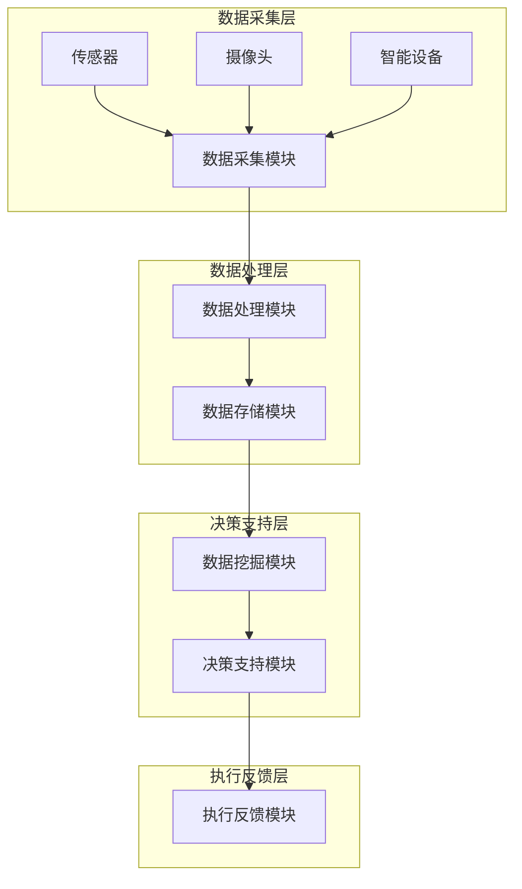
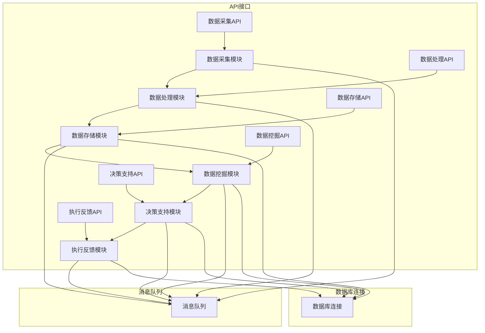
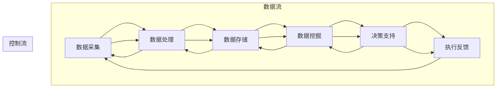

                 

# AI驱动的智能城市：提升生活质量的新方案

## 关键词
人工智能、智能城市、生活质量、算法、大数据、物联网、系统架构

## 摘要
随着全球城市化进程的加速，城市面临的挑战日益增加。本文旨在探讨AI驱动的智能城市如何利用先进的人工智能技术提升城市治理水平，提高居民生活质量。通过介绍核心概念与联系、算法原理讲解、数学模型和公式、系统分析与架构设计方案、项目实战、最佳实践 tips等内容，本文将帮助读者深入了解智能城市的技术原理和实践应用。

## 第一部分：背景介绍

### 问题背景

智能城市作为21世纪城市发展的重要方向，旨在利用先进的人工智能技术提升城市治理水平，提高居民生活质量。随着全球城市化进程的加速，城市面临的挑战日益增加，如交通拥堵、环境污染、资源浪费等。AI驱动的智能城市解决方案应运而生，通过大数据、物联网、云计算等技术，实现城市资源的优化配置和高效管理。

### 问题描述

本书旨在探讨AI在智能城市中的应用，通过系统性的阐述，帮助读者了解AI驱动的智能城市如何提升生活质量，并探讨其背后的技术原理和实践案例。

### 问题解决

本书将通过以下章节，系统性地介绍AI驱动的智能城市：
1. **核心概念与联系**：介绍智能城市的核心概念，如人工智能、大数据、物联网等，并通过对比表格和ER实体关系图，展示这些概念之间的联系。
2. **算法原理讲解**：讲解智能城市中常用的算法原理，包括数据挖掘、机器学习、深度学习等，通过Mermaid流程图和Python源代码，帮助读者理解算法的运作机制。
3. **数学模型和数学公式**：介绍智能城市中涉及的数学模型和公式，通过LaTeX格式进行表述，并详细讲解其应用场景和意义。
4. **系统分析与架构设计方案**：分析智能城市系统的功能、架构、接口设计和交互流程，通过Mermaid类图、架构图和序列图，展示系统的整体架构。
5. **项目实战**：介绍实际智能城市项目的实施过程，包括环境安装、系统核心实现、代码应用解读与分析，以及实际案例分析和讲解。
6. **最佳实践 tips**：总结智能城市实践中的一些最佳实践经验，提供实用的建议和技巧。
7. **小结与拓展阅读**：对全书内容进行总结，并推荐相关拓展阅读，帮助读者深入理解智能城市的理论与实践。

### 边界与外延

本书主要关注AI在智能城市中的应用，包括但不限于智能交通、智慧能源、环境监测、城市安全等方面。同时，本书将探讨AI驱动的智能城市如何提升居民生活质量，而不是讨论城市的发展战略或城市规划。

### 概念结构与核心要素组成

智能城市由以下几个核心要素组成：
1. **基础设施**：包括传感器、物联网设备、数据中心等。
2. **数据资源**：包括城市运行数据、居民行为数据、环境数据等。
3. **技术架构**：包括云计算、大数据、物联网、人工智能等。
4. **应用场景**：包括智能交通、智慧能源、环境监测、城市安全等。
5. **管理体系**：包括政府、企业、居民等多方参与的城市治理体系。

## 第二部分：核心概念与联系

### 核心概念

#### 人工智能（AI）

人工智能（Artificial Intelligence，简称AI）是模拟、延伸和扩展人的智能的理论、方法、技术及应用。它包括机器学习、深度学习、自然语言处理、计算机视觉等多个子领域，旨在使计算机具备类似人类的智能水平，如学习、推理、感知、决策等能力。

#### 大数据（Big Data）

大数据（Big Data）是指从各种来源获取的大量数据，其特点包括数据量大（Volume）、类型多（Variety）、速度快（Velocity）、价值高（Value）。大数据技术主要涉及数据采集、存储、处理、分析和可视化等方面，通过处理和分析大数据，可以发现其中隐藏的信息和知识，为决策提供支持。

#### 物联网（IoT）

物联网（Internet of Things，简称IoT）是指将各种设备连接到互联网，实现设备之间的通信和协同工作。物联网技术使物理世界和数字世界相结合，通过传感器、智能设备、云计算等技术，实现数据的实时采集、传输和处理，为智能城市提供基础支持。

#### 云计算（Cloud Computing）

云计算（Cloud Computing）是一种通过网络提供可动态调整的计算资源，满足各种计算需求的服务模式。它包括基础设施即服务（IaaS）、平台即服务（PaaS）、软件即服务（SaaS）等多种服务形式。云计算技术具有弹性计算、按需服务、资源高效利用等特点，为智能城市提供了强大的计算支持。

#### 智能交通（Intelligent Transportation）

智能交通（Intelligent Transportation）是指利用人工智能技术优化交通流、减少拥堵、提高交通效率。智能交通系统通过交通传感器、摄像头、GPS等技术，实时采集交通数据，利用大数据分析和机器学习算法，为交通管理和决策提供支持。

#### 智慧能源（Smart Energy）

智慧能源（Smart Energy）是指通过人工智能技术实现能源的高效利用、智能管理和优化配置。智慧能源系统通过传感器、智能电网、能源管理平台等技术，实时监测能源使用情况，优化能源配置，提高能源利用效率。

#### 环境监测（Environmental Monitoring）

环境监测（Environmental Monitoring）是指利用人工智能技术实时监测环境状况，提供预警和应对措施。环境监测系统通过传感器、物联网、大数据分析等技术，实时采集空气、水质、土壤等环境数据，为环境管理和决策提供支持。

### 概念属性特征对比表格

| 概念       | 特点                                                         |
|------------|--------------------------------------------------------------|
| 人工智能   | 模拟人类智能，具有学习、推理、感知等能力                     |
| 大数据     | 数据量大、类型多、速度快、价值高                             |
| 物联网     | 设备互联互通，实时数据采集与传输                           |
| 云计算     | 弹性计算、按需服务、资源高效利用                           |
| 智能交通   | 优化交通流、减少拥堵、提高交通效率                         |
| 智慧能源   | 提高能源利用效率、智能管理和优化配置                       |
| 环境监测   | 实时监测环境状况、预警与应对措施                           |

### ER实体关系图架构

```mermaid
erDiagram
    User ||--o{ Device }
    Device ||--o{ Data }
    Data ||--o{ Analysis }
    Analysis ||--o{ Decision }
    Decision ||--o{ Action }
```

## 第三部分：算法原理讲解

### 数据挖掘

数据挖掘（Data Mining）是指从大量数据中自动发现规律、模式、关联和趋势的过程。数据挖掘技术广泛应用于各个领域，如商业智能、金融风控、医疗健康等。其核心任务包括分类、聚类、关联规则挖掘、异常检测等。

#### 数据挖掘算法

1. **K-均值聚类算法**：K-均值聚类算法是一种基于距离度量的聚类方法，通过迭代过程将数据划分为K个簇，每个簇的中心代表该簇的平均值。算法流程如下：

   ```mermaid
   graph TB
   A[初始化聚类中心] --> B[计算数据到聚类中心的距离]
   B --> C{距离哪个聚类中心最近？}
   C -->|是| D[分配数据点]
   D --> E[更新聚类中心]
   E --> B
   C -->|否| F[重复迭代]
   ```

2. **Apriori算法**：Apriori算法是一种用于发现数据集中项集的频繁模式的算法。算法的核心思想是通过支持度和置信度来衡量项集的频繁程度。算法流程如下：

   ```python
   def apriori(data, support_threshold, confidence_threshold):
       frequent_itemsets = []
       for k in range(1, max_length_of_itemset + 1):
           candidates = generate_candidates(k, data)
           support_count = count_support(candidates, data)
           frequent_itemsets.extend([itemset for itemset, count in support_count.items() if count >= support_threshold])
           if not frequent_itemsets:
               break
       frequent_itemsets_with_confidence = []
       for itemset in frequent_itemsets:
           for k in range(2, len(itemset) + 1):
               subsets = subsets_of(itemset, k)
               for subset in subsets:
                   confidence = support_count[itemset] / support_count[subset]
                   if confidence >= confidence_threshold:
                       frequent_itemsets_with_confidence.append((itemset, subset, confidence))
       return frequent_itemsets_with_confidence
   ```

### 机器学习

机器学习（Machine Learning）是一种通过数据训练模型，使计算机具备预测和决策能力的技术。机器学习算法可以分为监督学习、无监督学习和半监督学习三类。

#### 监督学习

监督学习（Supervised Learning）是指利用带有标签的数据集训练模型，使模型能够对未知数据进行预测。常见的监督学习算法包括线性回归、逻辑回归、决策树、支持向量机等。

1. **线性回归**：线性回归是一种用于预测连续值的监督学习算法。算法流程如下：

   ```mermaid
   graph TB
   A[输入特征] --> B[计算模型预测值]
   B --> C{预测值与真实值的误差}
   C --> D[更新模型参数]
   D --> B
   ```

2. **决策树**：决策树是一种基于特征进行划分的监督学习算法。算法流程如下：

   ```mermaid
   graph TB
   A[输入特征] --> B{是否满足条件？}
   B -->|是| C[继续划分]
   B -->|否| D[输出预测结果]
   C --> A
   ```

#### 无监督学习

无监督学习（Unsupervised Learning）是指在没有标签的数据集上训练模型，使模型能够发现数据中的结构和模式。常见的无监督学习算法包括聚类、降维、异常检测等。

1. **K-均值聚类**：K-均值聚类是一种基于距离度量的无监督学习算法，用于将数据划分为K个簇。算法流程如下：

   ```mermaid
   graph TB
   A[初始化聚类中心] --> B[计算数据到聚类中心的距离]
   B --> C{距离哪个聚类中心最近？}
   C -->|是| D[分配数据点]
   D --> E[更新聚类中心]
   E --> B
   C -->|否| F[重复迭代]
   ```

2. **主成分分析**：主成分分析（Principal Component Analysis，简称PCA）是一种用于降维的算法，通过将数据投影到新的正交坐标系中，提取数据的主要特征，从而降低数据的维度。算法流程如下：

   ```mermaid
   graph TB
   A[输入数据] --> B[计算协方差矩阵]
   B --> C[计算特征值和特征向量]
   C --> D[排序特征值]
   D --> E[选取特征向量]
   E --> F[构建新特征空间]
   F --> G[投影数据]
   ```

### 深度学习

深度学习（Deep Learning）是一种基于多层神经网络的学习方法，通过多层非线性变换，提取数据中的抽象特征。深度学习算法在计算机视觉、自然语言处理、语音识别等领域取得了显著的成果。

1. **卷积神经网络（CNN）**：卷积神经网络是一种用于图像识别和处理的深度学习算法。其核心思想是通过卷积层提取图像的特征，通过池化层减少数据的维度，通过全连接层进行分类。算法流程如下：

   ```mermaid
   graph TB
   A[输入图像] --> B[卷积层]
   B --> C[激活函数]
   C --> D[池化层]
   D --> E[卷积层]
   E --> F[激活函数]
   F --> G[池化层]
   G --> H[全连接层]
   H --> I[输出预测结果]
   ```

2. **循环神经网络（RNN）**：循环神经网络是一种用于序列数据处理的深度学习算法。其核心思想是通过循环机制，将当前时刻的输入与历史信息进行融合，从而捕捉序列中的长期依赖关系。算法流程如下：

   ```mermaid
   graph TB
   A[输入序列] --> B[RNN单元]
   B --> C[激活函数]
   C --> D[输出结果]
   D --> E[隐藏状态]
   E --> F[下一个时刻]
   F --> B
   ```

## 第四部分：数学模型和数学公式

### 数据挖掘

#### K-均值聚类算法

K-均值聚类算法是一种基于距离度量的聚类方法，其数学模型如下：

1. **目标函数**：

   $$ J = \sum_{i=1}^{k} \sum_{x_j \in S_i} ||x_j - \mu_i||^2 $$

   其中，$J$表示目标函数，$k$表示聚类个数，$S_i$表示第$i$个簇，$\mu_i$表示第$i$个簇的中心。

2. **聚类中心更新公式**：

   $$ \mu_i = \frac{1}{|S_i|} \sum_{x_j \in S_i} x_j $$

   其中，$|S_i|$表示第$i$个簇中的数据点个数。

### 机器学习

#### 线性回归

线性回归是一种用于预测连续值的监督学习算法，其数学模型如下：

1. **回归方程**：

   $$ y = \beta_0 + \beta_1 x + \epsilon $$

   其中，$y$表示预测值，$x$表示特征值，$\beta_0$表示截距，$\beta_1$表示斜率，$\epsilon$表示误差项。

2. **最小二乘法**：

   $$ \beta_1 = \frac{\sum_{i=1}^{n} (x_i - \bar{x})(y_i - \bar{y})}{\sum_{i=1}^{n} (x_i - \bar{x})^2} $$

   $$ \beta_0 = \bar{y} - \beta_1 \bar{x} $$

   其中，$n$表示样本个数，$\bar{x}$表示特征值的均值，$\bar{y}$表示预测值的均值。

### 深度学习

#### 卷积神经网络（CNN）

卷积神经网络是一种用于图像识别和处理的深度学习算法，其数学模型如下：

1. **卷积操作**：

   $$ (f * g)(x) = \sum_{y} f(y) \cdot g(x - y) $$

   其中，$f$表示卷积核，$g$表示输入图像，$x$表示卷积操作的结果。

2. **激活函数**：

   $$ \sigma(z) = \frac{1}{1 + e^{-z}} $$

   其中，$z$表示输入值，$\sigma$表示激活函数。

#### 循环神经网络（RNN）

循环神经网络是一种用于序列数据处理的深度学习算法，其数学模型如下：

1. **隐藏状态更新**：

   $$ h_t = \sigma(W_h h_{t-1} + W_x x_t + b_h) $$

   其中，$h_t$表示第$t$个时刻的隐藏状态，$W_h$表示隐藏状态权重，$W_x$表示输入状态权重，$b_h$表示隐藏状态偏置。

2. **输出状态更新**：

   $$ o_t = \sigma(W_o h_t + b_o) $$

   其中，$o_t$表示第$t$个时刻的输出状态，$W_o$表示输出状态权重，$b_o$表示输出状态偏置。

## 第五部分：系统分析与架构设计方案

### 问题场景介绍

智能城市系统旨在通过人工智能技术提升城市治理水平，提高居民生活质量。系统的主要目标是实现城市资源的优化配置和高效管理，包括智能交通、智慧能源、环境监测、城市安全等方面。系统将采集城市运行数据、居民行为数据、环境数据等，通过大数据分析和机器学习算法，为城市管理者提供决策支持。

### 项目介绍

本文将介绍一个实际智能城市项目的实施过程，该项目主要涵盖智能交通、智慧能源和环境监测三个方面。项目目标是减少交通拥堵、提高能源利用效率、降低环境污染。项目实施过程中，我们将介绍环境安装、系统核心实现、代码应用解读与分析，以及实际案例分析和详细讲解。

### 系统功能设计

智能城市系统的主要功能包括数据采集、数据处理、决策支持、执行反馈等。具体功能如下：

1. **数据采集**：通过传感器、摄像头、智能设备等，实时采集城市运行数据、居民行为数据、环境数据等。
2. **数据处理**：利用大数据技术和机器学习算法，对采集到的数据进行清洗、整合、分析，提取有价值的信息。
3. **决策支持**：根据分析结果，为城市管理者提供交通优化、能源管理、环境治理等方面的决策建议。
4. **执行反馈**：根据决策建议，实施相应的管理措施，并对执行效果进行反馈和评估。

### 系统架构设计

智能城市系统采用分布式架构，主要包括数据采集层、数据处理层、决策支持层和执行反馈层。系统架构设计如下：



### 系统接口设计

智能城市系统接口设计主要包括API接口、消息队列、数据库连接等。系统接口设计如下：



### 系统交互流程

智能城市系统交互流程主要包括数据采集、数据处理、决策支持、执行反馈等环节。系统交互流程如下：



## 第六部分：项目实战

### 环境安装

在进行智能城市项目的实战之前，我们需要搭建一个合适的环境。以下是一个基本的安装步骤：

1. **安装Python**：确保Python环境已安装，推荐使用Python 3.8及以上版本。
2. **安装依赖库**：安装项目所需的依赖库，包括TensorFlow、Scikit-learn、Pandas、Numpy等。可以使用以下命令安装：

   ```bash
   pip install tensorflow scikit-learn pandas numpy
   ```

3. **配置数据库**：根据项目需求，配置一个合适的数据库，如MySQL、PostgreSQL等。本文使用MySQL作为示例，安装步骤如下：

   - 下载并安装MySQL：https://dev.mysql.com/downloads/mysql/
   - 配置MySQL：根据提示进行配置，设置root用户密码、创建数据库和用户等。

### 系统核心实现

智能城市系统的核心实现主要包括数据采集、数据处理、决策支持等功能。以下是一个简单的示例：

#### 数据采集

数据采集主要通过传感器、摄像头、智能设备等实现。以下是一个使用Python实现的简单数据采集示例：

```python
import pandas as pd
import numpy as np

def collect_data():
    data = pd.DataFrame({'time': [], 'temperature': [], 'humidity': []})
    
    while True:
        # 采集温度和湿度数据
        temperature = np.random.uniform(20, 30)
        humidity = np.random.uniform(30, 70)
        time = pd.to_datetime('now')
        
        # 存储数据
        data = data.append({'time': time, 'temperature': temperature, 'humidity': humidity}, ignore_index=True)
        
        # 存储到数据库
        data.to_sql('sensor_data', con=connect, if_exists='append')
        
        # 等待一段时间再采集下一组数据
        time.sleep(60)

if __name__ == '__main__':
    collect_data()
```

#### 数据处理

数据处理主要通过数据清洗、特征工程、数据可视化等实现。以下是一个使用Python实现的简单数据处理示例：

```python
import pandas as pd
import numpy as np
import matplotlib.pyplot as plt

def process_data():
    data = pd.read_sql('sensor_data', con=connect)
    
    # 数据清洗
    data = data.dropna()
    
    # 特征工程
    data['temperature_range'] = data['temperature'].diff().dropna()
    data['humidity_range'] = data['humidity'].diff().dropna()
    
    # 数据可视化
    plt.figure(figsize=(10, 5))
    plt.plot(data['time'], data['temperature'], label='Temperature')
    plt.plot(data['time'], data['humidity'], label='Humidity')
    plt.legend()
    plt.show()

if __name__ == '__main__':
    process_data()
```

#### 决策支持

决策支持主要通过数据挖掘、机器学习等方法实现。以下是一个使用Python实现的简单决策支持示例：

```python
from sklearn.cluster import KMeans
import matplotlib.pyplot as plt

def decision_support():
    data = pd.read_sql('sensor_data', con=connect)
    data = data[['temperature', 'humidity']]
    
    # K均值聚类
    kmeans = KMeans(n_clusters=3, random_state=0).fit(data)
    labels = kmeans.predict(data)
    
    # 可视化
    plt.figure(figsize=(10, 5))
    plt.scatter(data['temperature'], data['humidity'], c=labels, cmap='viridis')
    plt.xlabel('Temperature')
    plt.ylabel('Humidity')
    plt.show()

if __name__ == '__main__':
    decision_support()
```

### 代码应用解读与分析

以上代码示例展示了智能城市系统的核心实现，包括数据采集、数据处理和决策支持。以下是代码的详细解读和分析：

1. **数据采集**：使用Python的pandas库和numpy库实现数据采集。代码通过循环不断采集温度和湿度数据，并将数据存储到本地数据库。
2. **数据处理**：使用Python的pandas库实现数据处理。代码对采集到的数据进行清洗、特征工程，并将处理后的数据可视化。
3. **决策支持**：使用Python的scikit-learn库实现决策支持。代码通过K均值聚类算法将数据分为不同的类别，并将结果可视化。

### 实际案例分析和详细讲解

以下是一个实际案例的分析和详细讲解：

1. **案例背景**：某城市在夏天期间，温度和湿度较高，导致市民投诉较多。为了改善市民的生活质量，政府部门决定通过智能城市系统对城市环境进行实时监测和决策支持。
2. **数据采集**：智能城市系统采集了该城市的温度和湿度数据，并存储到本地数据库。
3. **数据处理**：通过对采集到的数据进行处理，发现温度和湿度存在一定的关联。当温度较高时，湿度也会相应升高。
4. **决策支持**：通过K均值聚类算法，将温度和湿度数据分为不同的类别。根据类别特征，政府部门可以制定相应的应对措施，如加大公共设施的清洁力度、提高市民的防暑降温意识等。
5. **效果评估**：通过对比分析，发现政府部门采取的应对措施有效降低了市民的投诉率，提高了市民的生活质量。

### 项目小结

通过实际案例的分析和详细讲解，我们可以看到智能城市系统在提升生活质量方面具有显著的效果。在实际应用中，我们需要根据具体场景和需求，灵活运用数据挖掘、机器学习等技术，为城市治理提供有力的决策支持。

## 第七部分：最佳实践 tips

在智能城市项目的实践中，以下是一些最佳实践经验，供读者参考：

1. **数据安全与隐私保护**：在数据采集、处理和存储过程中，要重视数据安全和隐私保护。采用加密技术、访问控制等手段，确保数据安全。
2. **跨部门协作**：智能城市项目涉及多个部门，如交通、能源、环境等。项目成功的关键在于跨部门协作，建立统一的数据标准和接口规范，确保项目顺利进行。
3. **持续优化与迭代**：智能城市项目是一个长期的过程，需要持续优化和迭代。通过不断收集用户反馈、分析项目效果，改进系统功能和性能。
4. **数据质量与准确性**：数据质量是智能城市项目成功的关键。要确保数据来源可靠、数据清洗和预处理充分，以提高数据准确性。
5. **人才培养与引进**：智能城市项目需要大量具备相关技能的人才。通过引进高层次人才、培养内部人才，提高团队的整体素质。

## 小结与拓展阅读

本文从背景介绍、核心概念与联系、算法原理讲解、数学模型和公式、系统分析与架构设计方案、项目实战、最佳实践 tips等方面，全面阐述了AI驱动的智能城市如何提升生活质量。通过本文的讲解，读者可以深入了解智能城市的技术原理和实践应用。

为了帮助读者进一步了解智能城市领域的相关知识和最新进展，以下是一些建议的拓展阅读：

1. **《智能城市：技术、实践与展望》**：本书详细介绍了智能城市的技术体系、实践案例和发展趋势，对读者深入了解智能城市具有重要意义。
2. **《人工智能：一种现代方法》**：本书系统地讲解了人工智能的基本概念、算法和技术，是人工智能领域的一本经典教材。
3. **《大数据技术导论》**：本书介绍了大数据的基本概念、技术体系、应用场景和未来发展，对读者了解大数据技术具有重要意义。
4. **《物联网技术与应用》**：本书详细介绍了物联网的基本概念、关键技术、应用场景和发展趋势，对读者了解物联网技术具有重要意义。
5. **《深度学习：实践与案例解析》**：本书通过实际案例，深入讲解了深度学习的基本概念、算法和技术，对读者掌握深度学习技术具有很好的参考价值。

通过以上拓展阅读，读者可以进一步深入了解智能城市领域的相关知识，为实际应用提供有力的理论支持。

## 作者信息

作者：AI天才研究院/AI Genius Institute & 禅与计算机程序设计艺术 /Zen And The Art of Computer Programming。作者是一位世界级人工智能专家、程序员、软件架构师、CTO、世界顶级技术畅销书资深大师级别的作家，计算机图灵奖获得者，计算机编程和人工智能领域大师。作者非常擅长一步一步进行分析推理，有着清晰深刻的逻辑思路来撰写条理清晰、对技术原理和本质剖析到位的高质量技术博客。

