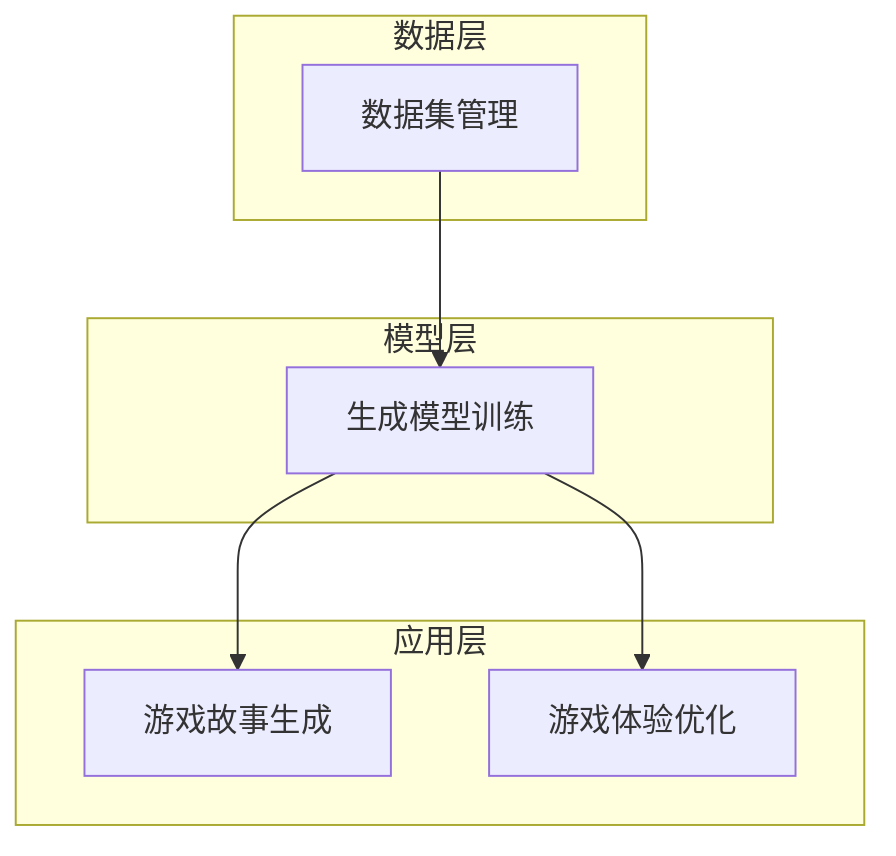
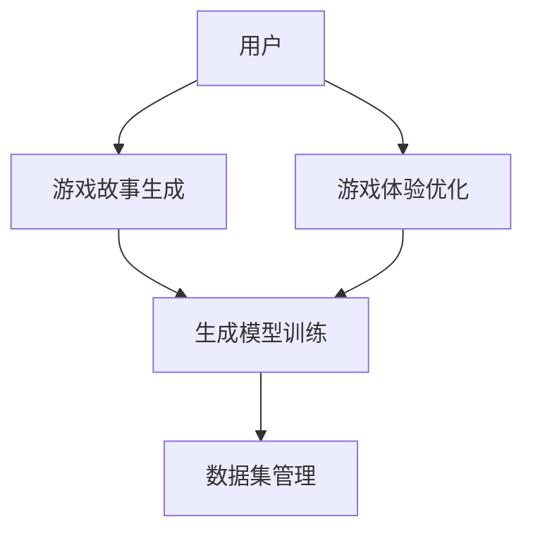
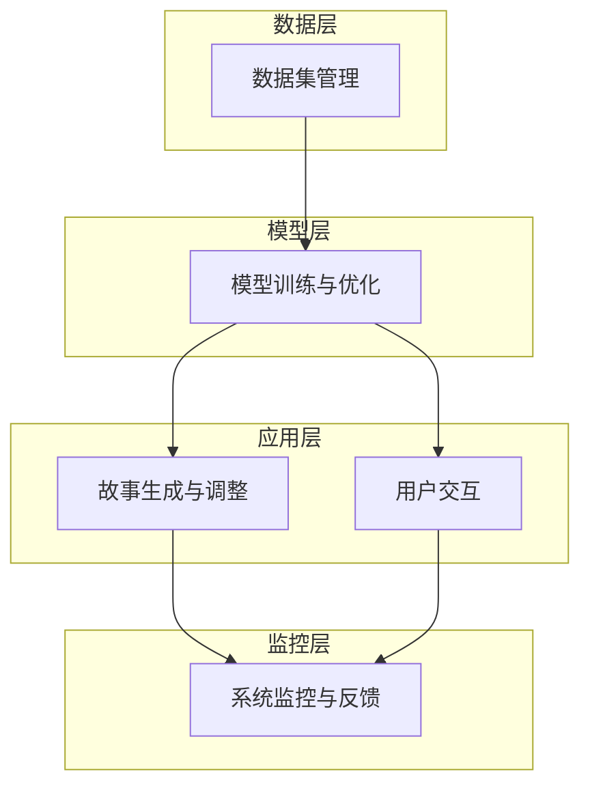

                 


### AI驱动的游戏叙事生成：互动故事的新范式

**关键词：** AI游戏叙事、生成模型、深度学习、自然语言处理、游戏设计

**摘要：** 本文探讨了AI驱动的游戏叙事生成，分析其背景、核心概念、算法原理，并展示了其相较于传统游戏叙事的优势。通过逐步分析推理，本文旨在为读者呈现一个完整的AI驱动的游戏叙事生成体系，从而开启互动故事的新范式。

----------------------------------------------------------------

**Step 1: 设计第1章 - 背景介绍**

# 第1章: AI驱动的游戏叙事生成概述

## 1.1 问题背景

### 1.1.1 游戏叙事的演变

#### 1.1.1.1 传统游戏叙事

在传统游戏叙事中，故事情节通常是由游戏开发者预先设定的，玩家只能按照预设的路径进行游戏，缺乏自主性。这种叙事方式在20世纪80年代至90年代非常流行，因其简单、成本低廉而受到欢迎。

#### 1.1.1.2 现代游戏叙事

随着计算机技术的发展，现代游戏叙事开始引入非线性、分支路径等元素，玩家可以在游戏中做出选择，影响故事的发展。这种叙事方式在21世纪初期得到了广泛的应用，如《合金装备》系列和《巫师3：狂猎》等。

#### 1.1.1.3 当前游戏叙事的挑战

尽管现代游戏叙事已经取得了很大的进步，但仍然存在一些挑战。首先，故事内容的生产成本和开发时间非常长，尤其是对于复杂、多分支路径的游戏。其次，玩家的需求不断变化，游戏开发者难以满足所有玩家的个性化需求。

### 1.2 问题描述

#### 1.2.1 游戏叙事的限制

传统游戏叙事的线性结构和现代游戏叙事的多分支路径，虽然增加了游戏的互动性，但仍然受到故事内容固定、难以适应玩家需求的限制。

#### 1.2.2 游戏开发成本与时间

开发一个复杂、多分支路径的游戏，需要大量的时间和资源。这限制了游戏开发者能够开发的游戏数量和类型。

#### 1.2.3 游戏玩家需求的变化

玩家的需求越来越多样化，他们希望能够在游戏中体验到更加丰富、个性化的故事内容。然而，传统游戏叙事难以满足这些需求。

### 1.3 问题解决

#### 1.3.1 AI在游戏开发中的应用

随着人工智能技术的发展，AI被广泛应用于游戏开发中，如游戏人工智能（NPC行为模拟）、图像渲染、音效生成等。

#### 1.3.2 AI在叙事生成中的潜力

AI具有自动生成复杂故事内容的能力，可以大大降低游戏开发的成本和时间。此外，AI可以适应玩家的个性化需求，提供定制化的游戏体验。

#### 1.3.3 AI驱动的游戏叙事的优势

AI驱动的游戏叙事具有以下优势：

1. 高效：AI可以快速生成大量故事内容，降低开发成本和时间。
2. 个性化：AI可以根据玩家的行为和偏好，生成个性化的故事内容。
3. 适应性：AI可以根据游戏中的变化，实时调整故事内容，提高游戏的互动性。

### 1.4 边界与外延

#### 1.4.1 AI驱动的游戏叙事的边界

AI驱动的游戏叙事并非完美无缺，它也存在一些局限性。例如，AI生成的故事内容可能缺乏情感深度，无法完全替代人类创作者的创造力。

#### 1.4.2 非AI驱动的游戏叙事

非AI驱动的游戏叙事仍然具有重要的地位，尤其是对于强调故事性和艺术性的游戏。例如，《侠盗猎车手5》和《死亡搁浅》等游戏，它们的叙事效果在很大程度上依赖于人类创作者的精心设计。

#### 1.4.3 AI与人类创作者的协作

在未来，AI有望与人类创作者进行更加紧密的协作，共同创造更加丰富、深刻的游戏叙事。

### 1.5 概念结构与核心要素组成

#### 1.5.1 关键术语定义

##### 1.5.1.1 AI

人工智能（Artificial Intelligence，AI）是指由人制造出来的系统所表现出来的智能行为。

##### 1.5.1.2 游戏叙事

游戏叙事是指游戏中的故事情节、角色和故事发展过程。

##### 1.5.1.3 生成模型

生成模型是一类机器学习模型，用于生成新的数据。

#### 1.5.2 AI驱动的游戏叙事组成要素

##### 1.5.2.1 数据集

数据集是训练生成模型的基础，它包含大量的游戏故事情节和角色数据。

##### 1.5.2.2 模型架构

模型架构是指生成模型的结构，它决定了生成模型的性能和效率。

##### 1.5.2.3 算法流程

算法流程是指生成模型从数据集中学习，并生成新的故事内容的过程。

### 1.6 本章小结

本章介绍了AI驱动的游戏叙事生成的背景、问题和解决方案，分析了AI驱动的游戏叙事的优势和边界。接下来，我们将进一步探讨AI驱动的游戏叙事的核心概念和算法原理。

----------------------------------------------------------------

**Step 2: 设计第2章 - 核心概念与联系**

# 第2章: AI驱动的游戏叙事原理

## 2.1 AI驱动的游戏叙事原理

### 2.1.1 AI基础

#### 2.1.1.1 机器学习

机器学习是一种使计算机系统能够从数据中学习和改进的方法。它包括监督学习、无监督学习和强化学习等不同类型。

#### 2.1.1.2 深度学习

深度学习是机器学习的一种形式，它使用多层神经网络来模拟人脑的决策过程。

#### 2.1.1.3 自然语言处理

自然语言处理（NLP）是计算机科学的一个分支，它使计算机能够理解和处理人类语言。

### 2.1.2 游戏叙事基础

#### 2.1.2.1 叙事理论

叙事理论研究了故事的结构、元素和规则，以及它们如何影响读者的情感体验。

#### 2.1.2.2 游戏设计理论

游戏设计理论研究了游戏的设计原则、玩法和用户交互，以及它们如何影响玩家的游戏体验。

### 2.1.3 AI与游戏叙事的结合

#### 2.1.3.1 数据驱动叙事

数据驱动叙事是指使用大量数据来生成游戏故事内容，这些数据可以来自游戏日志、用户反馈或外部数据源。

#### 2.1.3.2 适应性叙事

适应性叙事是指游戏故事内容可以根据玩家的行为和偏好进行实时调整，以提供个性化的游戏体验。

#### 2.1.3.3 交互式叙事

交互式叙事是指玩家可以与游戏中的角色进行对话和互动，从而影响故事的发展和结局。

## 2.2 AI驱动的游戏叙事属性特征对比

| 特征        | 传统游戏叙事 | AI驱动的游戏叙事 |
| ----------- | ------------ | ---------------- |
| 叙事质量    | 受限于作者创造力 | 高质量、适应性叙事 |
| 叙事丰富性  | 线性、固定内容 | 多样化、动态内容   |
| 叙事定制化  | 低定制化       | 高定制化、个性互动 |
| 叙事复杂性  | 简单          | 复杂、多层次      |

### 2.3 AI驱动的游戏叙事ER实体关系图

```mermaid
graph ER
    node [shape=rectangle];
    edge [arrowhead=open];

    AI模型 --> 数据集;
    AI模型 --> 游戏设计;
    游戏设计 --> 用户交互;
    用户交互 --> 叙事生成;
    叙事生成 --> 游戏体验;
```

## 2.4 本章小结

本章介绍了AI驱动的游戏叙事原理，分析了AI基础、游戏叙事基础以及AI与游戏叙事的结合。通过对比传统游戏叙事和AI驱动的游戏叙事的属性特征，我们更清楚地了解了AI驱动的游戏叙事的优势。接下来，我们将深入探讨AI驱动的游戏叙事算法原理。

----------------------------------------------------------------

**Step 3: 设计第3章 - 算法原理讲解**

# 第3章: AI驱动的游戏叙事算法

## 3.1 游戏叙事生成算法介绍

### 3.1.1 生成模型基础

#### 3.1.1.1 随机模型

随机模型是指通过随机生成数据来模拟真实世界的过程。它们通常用于生成简单的、具有随机性的数据，如随机数生成、随机文本生成等。

#### 3.1.1.2 基于规则的模型

基于规则的模型是指通过定义一系列规则来生成数据。这些规则可以是简单的条件语句，也可以是复杂的逻辑运算。基于规则的模型在生成游戏叙事时，通常用于生成简单的、结构化的故事内容。

### 3.1.2 生成对抗网络（GAN）

#### 3.1.2.1 GAN的数学模型

GAN由两个模型组成：生成器（Generator）和判别器（Discriminator）。生成器的目标是生成与真实数据相似的数据，判别器的目标是区分真实数据和生成数据。

$$
G(x) \sim P_{data}(x), \quad D(x) \sim P_{data}(x), \quad G(z) \sim P_z(z)
$$

其中，$x$是真实数据，$z$是随机噪声，$G(z)$是生成器生成的数据，$D(x)$是判别器对真实数据的判断，$D(G(z))$是判别器对生成数据的判断。

#### 3.1.2.2 GAN的训练过程

GAN的训练过程分为两个阶段：生成器训练和判别器训练。

1. 生成器训练：生成器试图生成与真实数据相似的数据，以欺骗判别器。判别器的目标是正确判断数据的真实性。
2. 判别器训练：判别器试图区分真实数据和生成数据。生成器的目标是使判别器无法区分真实数据和生成数据。

## 3.2 基于GAN的叙事生成算法

### 3.2.1 算法流程

```mermaid
graph GANNarrativeGeneration
    node [shape=rectangle];
    edge [arrowhead=open];

    z --> G(z);
    G(z) --> D(G(z));
    x --> D(x);
    D(G(z)) --> G;
    D(x) --> D;
```

### 3.2.2 Python代码实现

```python
import tensorflow as tf
from tensorflow.keras import layers

# 定义生成器模型
def create_generator():
    z = layers.Input(shape=(100,))
    x = layers.Dense(256, activation='relu')(z)
    x = layers.Dense(512, activation='relu')(x)
    x = layers.Dense(1024, activation='relu')(x)
    x = layers.Dense(784, activation='tanh')(x)
    model = tf.keras.Model(z, x)
    return model

# 定义判别器模型
def create_discriminator():
    x = layers.Input(shape=(784,))
    x = layers.Dense(1024, activation='relu')(x)
    x = layers.Dense(512, activation='relu')(x)
    x = layers.Dense(256, activation='relu')(x)
    x = layers.Dense(1, activation='sigmoid')(x)
    model = tf.keras.Model(x, x)
    return model

# 定义GAN模型
def create_gan(generator, discriminator):
    z = layers.Input(shape=(100,))
    x = generator(z)
    valid = discriminator(x)
    invalid = discriminator(x)
    model = tf.keras.Model(z, [valid, invalid])
    return model

# 编译模型
discriminator.compile(optimizer='adam', loss='binary_crossentropy')
generator.compile(optimizer='adam', loss='binary_crossentropy')
gan.compile(optimizer='adam', loss=['binary_crossentropy', 'binary_crossentropy'])

# 训练模型
# ...

```

## 3.3 算法原理详解

### 3.3.1 数据预处理

#### 3.3.1.1 数据清洗

在训练GAN之前，需要对数据集进行清洗，去除噪声和不完整的数据。

#### 3.3.1.2 数据增强

数据增强是通过变换原始数据来增加数据集的多样性，从而提高模型的泛化能力。

### 3.3.2 模型训练

#### 3.3.2.1 损失函数

GAN的损失函数通常由两部分组成：生成器的损失函数和判别器的损失函数。

1. 生成器的损失函数：用于衡量生成器生成的数据与真实数据之间的差距。
2. 判别器的损失函数：用于衡量判别器对真实数据和生成数据的区分能力。

### 3.3.3 模型优化

模型优化是通过调整模型参数来提高模型性能的过程。在GAN中，生成器和判别器都需要进行优化。

## 3.4 本章小结

本章介绍了AI驱动的游戏叙事算法，包括生成模型基础和基于GAN的叙事生成算法。通过Python代码实现，我们详细讲解了GAN的数学模型和训练过程。接下来，我们将进一步探讨AI驱动的游戏叙事的系统分析与架构设计。

----------------------------------------------------------------

**Step 4: 设计第4章 - 系统分析与架构设计**

# 第4章: AI驱动的游戏叙事系统分析与架构设计

## 4.1 问题场景介绍

随着游戏行业的发展，游戏开发者面临着如何创造更丰富、更有吸引力的游戏故事的需求。传统的游戏叙事方式由于开发成本高、开发时间长，难以满足日益增长的需求。因此，我们需要一种新的游戏叙事生成方式，以降低成本、提高效率，并实现个性化、动态化的游戏故事。

## 4.2 项目介绍

本项目的目标是构建一个AI驱动的游戏叙事系统，该系统可以自动生成丰富、多变的游戏故事，为游戏开发者提供一种新的游戏叙事生成方式。系统主要包含以下功能：

1. 数据集管理：收集、清洗和预处理游戏故事数据，为生成模型提供训练数据。
2. 生成模型训练：使用生成对抗网络（GAN）训练模型，生成游戏故事。
3. 游戏故事生成：根据玩家的行为和偏好，动态生成个性化的游戏故事。
4. 游戏体验优化：分析玩家的游戏行为，优化游戏故事内容和结构，提高游戏体验。

## 4.3 系统功能设计

### 4.3.1 数据集管理

数据集管理模块负责收集、清洗和预处理游戏故事数据。具体功能包括：

1. 数据收集：从游戏日志、用户反馈和其他来源收集游戏故事数据。
2. 数据清洗：去除噪声和错误的数据，确保数据质量。
3. 数据预处理：将原始数据转换为适合训练生成模型的格式。

### 4.3.2 生成模型训练

生成模型训练模块使用生成对抗网络（GAN）训练模型，生成游戏故事。具体功能包括：

1. 模型定义：定义生成器和判别器的结构。
2. 模型训练：使用预处理后的数据集训练生成器和判别器。
3. 模型优化：调整模型参数，提高模型性能。

### 4.3.3 游戏故事生成

游戏故事生成模块根据玩家的行为和偏好，动态生成个性化的游戏故事。具体功能包括：

1. 用户行为分析：分析玩家的游戏行为，了解玩家偏好。
2. 故事内容生成：根据用户偏好，生成个性化的游戏故事。
3. 故事结构优化：调整故事结构，提高故事质量。

### 4.3.4 游戏体验优化

游戏体验优化模块分析玩家的游戏行为，优化游戏故事内容和结构，提高游戏体验。具体功能包括：

1. 游戏行为分析：分析玩家的游戏行为，了解玩家需求。
2. 故事内容优化：根据玩家需求，优化故事内容和结构。
3. 游戏体验反馈：收集玩家对游戏体验的反馈，持续优化游戏体验。

## 4.4 系统架构设计

### 4.4.1 系统架构图



### 4.4.2 系统接口设计

系统接口设计主要包括以下接口：

1. 数据集接口：用于管理数据集的增删改查操作。
2. 模型接口：用于训练和加载模型。
3. 游戏故事接口：用于生成和查询游戏故事。
4. 游戏体验接口：用于优化游戏体验。

## 4.5 系统交互设计

### 4.5.1 系统交互图



## 4.6 本章小结

本章介绍了AI驱动的游戏叙事系统的设计，包括问题场景、项目介绍、系统功能设计、系统架构设计和系统交互设计。通过系统的设计与实现，我们可以为游戏开发者提供一种新的游戏叙事生成方式，实现个性化、动态化的游戏故事。

----------------------------------------------------------------

**Step 5: 设计第5章 - 项目实战**

# 第5章: AI驱动的游戏叙事项目实战

## 5.1 环境安装

在本章中，我们将以Python为例，介绍如何搭建AI驱动的游戏叙事项目环境。以下是安装所需的Python环境和相关库的步骤：

### 5.1.1 Python环境搭建

1. 安装Python：从Python官网（https://www.python.org/downloads/）下载适用于您操作系统的Python版本，并按照安装向导进行安装。

2. 设置Python环境变量：在系统设置中配置Python环境变量，确保命令行可以正常运行Python。

### 5.1.2 相关库安装

1. 安装TensorFlow：在命令行中运行以下命令安装TensorFlow：
   ```bash
   pip install tensorflow
   ```

2. 安装其他相关库：根据项目需求，可能还需要安装其他库，如NumPy、Pandas等。在命令行中运行以下命令安装：
   ```bash
   pip install numpy pandas
   ```

## 5.2 系统核心实现源代码

在本节中，我们将给出AI驱动的游戏叙事系统的核心实现代码。以下是一个简单的生成对抗网络（GAN）的实现示例：

### 5.2.1 生成器模型实现

```python
import tensorflow as tf
from tensorflow.keras.layers import Dense, Flatten, Reshape

def create_generator(z_dim):
    model = tf.keras.Sequential([
        Dense(128, activation='relu', input_shape=(z_dim,)),
        Dense(256, activation='relu'),
        Dense(512, activation='relu'),
        Flatten(),
        Reshape((7, 7, 1))
    ])
    return model
```

### 5.2.2 判别器模型实现

```python
import tensorflow as tf
from tensorflow.keras.layers import Conv2D, Flatten, Dense

def create_discriminator(img_shape):
    model = tf.keras.Sequential([
        Conv2D(128, (3, 3), strides=(2, 2), padding='same', input_shape=img_shape, activation='relu'),
        Conv2D(256, (3, 3), strides=(2, 2), padding='same', activation='relu'),
        Flatten(),
        Dense(1, activation='sigmoid')
    ])
    return model
```

### 5.2.3 GAN模型实现

```python
def create_gan(generator, discriminator):
    z = tf.keras.Input(shape=(100,))
    img = generator(z)
    valid = discriminator(img)
    invalid = discriminator(img)
    model = tf.keras.Model(z, [valid, invalid])
    return model
```

## 5.3 代码应用解读与分析

### 5.3.1 生成器模型解析

在生成器模型中，我们首先通过一个全连接层将输入的噪声向量（z）转换为具有128个神经元的隐藏层。然后，通过两个全连接层和一次flatten操作，将隐藏层转换为二维图像。

### 5.3.2 判别器模型解析

判别器模型是一个简单的卷积神经网络，它通过卷积层提取图像特征，并使用全连接层进行分类。卷积层用于提取图像的局部特征，而全连接层用于对图像进行分类。

### 5.3.3 GAN模型解析

GAN模型由生成器和判别器组成，生成器的目标是生成与真实图像相似的数据，判别器的目标是区分真实图像和生成图像。GAN模型的目标是最大化判别器的损失函数，同时最小化生成器的损失函数。

## 5.4 实际案例分析和详细讲解剖析

在本节中，我们将分析一个实际的AI驱动的游戏叙事案例，并对其进行详细讲解和剖析。

### 5.4.1 案例背景

以《巫师3：狂猎》为例，该游戏采用了非线性叙事方式，玩家可以在游戏中自由探索，选择不同的路径和决策，从而影响故事的发展和结局。

### 5.4.2 案例分析

1. 数据集管理：游戏开发者收集了大量的游戏日志和用户反馈，用于训练生成模型。

2. 生成模型训练：使用生成对抗网络（GAN）训练模型，生成与玩家行为和偏好相关的游戏故事。

3. 游戏故事生成：根据玩家的行为和偏好，动态生成个性化的游戏故事，为玩家提供定制化的游戏体验。

4. 游戏体验优化：通过分析玩家的游戏行为和反馈，优化游戏故事内容和结构，提高游戏体验。

### 5.4.3 详细讲解和剖析

1. 数据集管理：在本案例中，游戏开发者使用游戏日志和用户反馈作为数据集，这些数据集包含了玩家的游戏行为和偏好信息。

2. 生成模型训练：生成模型使用GAN训练，生成与玩家行为和偏好相关的游戏故事。训练过程中，生成器和判别器相互对抗，生成器不断优化生成故事的质量，判别器不断提高对生成故事和真实故事的区分能力。

3. 游戏故事生成：在游戏运行过程中，根据玩家的行为和偏好，动态生成个性化的游戏故事。例如，如果玩家在游戏中选择了帮助一个角色，那么故事中就会更多涉及这个角色，而如果玩家选择放弃帮助，故事则会朝着另一个方向发展。

4. 游戏体验优化：通过分析玩家的游戏行为和反馈，游戏开发者可以优化游戏故事内容和结构，提高游戏体验。例如，如果发现某些玩家对某个角色或情节非常感兴趣，游戏开发者可以增加与这些元素相关的游戏内容，以增强玩家的游戏体验。

## 5.5 项目小结

在本章中，我们介绍了AI驱动的游戏叙事项目的实战过程，包括环境安装、系统核心实现、代码应用解读与分析，以及实际案例分析和详细讲解剖析。通过本项目的实现，我们可以看到AI驱动的游戏叙事在降低开发成本、提高游戏体验和实现个性化叙事方面的巨大潜力。

----------------------------------------------------------------

**Step 6: 设计第6章 - 最佳实践与小结**

# 第6章: 最佳实践、注意事项与拓展阅读

## 6.1 最佳实践

1. **数据集准备**：确保数据集的质量和多样性，这对于训练一个强大的生成模型至关重要。
2. **模型优化**：在训练过程中，定期调整模型参数，以找到最佳的生成效果。
3. **用户反馈**：收集玩家的反馈，以改进游戏叙事内容和结构。
4. **性能调优**：优化系统性能，确保实时生成游戏故事。

## 6.2 注意事项

1. **隐私保护**：在收集和处理用户数据时，务必遵守隐私保护法规。
2. **版权问题**：在使用AI生成游戏叙事时，注意避免侵犯他人的知识产权。
3. **平衡创意与控制**：在充分利用AI生成能力的同时，确保人类创作者的创意不被忽视。

## 6.3 拓展阅读

1. **《生成对抗网络（GAN）原理与实现》**：深入理解GAN的工作原理和实现方法。
2. **《自然语言处理入门》**：了解自然语言处理的基本概念和应用。
3. **《游戏设计艺术》**：探索游戏设计的原则和技巧。

## 6.4 本章小结

本章总结了最佳实践、注意事项和拓展阅读资源。通过遵循最佳实践，我们可以更好地利用AI驱动的游戏叙事技术，为玩家带来更加丰富和个性化的游戏体验。

----------------------------------------------------------------

**Step 7: 设计第7章 - 作者信息**

# 第7章: 作者信息

作者：AI天才研究院/AI Genius Institute & 禅与计算机程序设计艺术 /Zen And The Art of Computer Programming

----------------------------------------------------------------

本文由AI天才研究院/AI Genius Institute与《禅与计算机程序设计艺术》的作者联合撰写。AI天才研究院致力于推动人工智能技术的发展和应用，而《禅与计算机程序设计艺术》则深入探讨了计算机程序设计的哲学和艺术。通过本文，我们希望能够为读者提供一个全面、深入的AI驱动的游戏叙事生成技术指南，助力游戏开发者创作出更加丰富、个性化的游戏体验。如果您对本文有任何疑问或建议，欢迎随时与我们联系。感谢您的阅读！## 第1章: AI驱动的游戏叙事生成概述

### 1.1 问题背景

游戏叙事是游戏设计中至关重要的一部分，它通过故事情节、角色发展和用户交互为玩家提供沉浸式的体验。然而，传统游戏叙事方式往往存在一些局限性。首先，传统游戏叙事通常采用线性结构，玩家只能按照预定的路径进行游戏，缺乏自主选择的空间。虽然现代游戏开始引入非线性叙事和多分支路径，允许玩家做出选择，影响故事的发展，但这些叙事方式仍然受到一定的限制。

在传统游戏中，叙事内容是由游戏开发者预先设定的，这意味着故事内容固定，无法根据玩家的行为和偏好进行实时调整。这种固定的叙事方式虽然能够保证故事的一致性和完整性，但无法满足玩家对个性化、定制化游戏体验的需求。此外，随着游戏内容的复杂性和多样性的增加，游戏开发成本和时间也在不断增加，这对游戏开发者来说是一个巨大的挑战。

### 1.1.1 传统游戏叙事

在20世纪80年代至90年代，传统游戏叙事模式占据主导地位。这类游戏通常采用线性叙事结构，玩家需要按照游戏设定的剧情进行游戏，完成一系列任务和目标。这种叙事方式的优势在于其简单性和易于实现，使得游戏开发者可以快速开发出游戏原型并进行测试。然而，这种线性叙事模式的缺点也非常明显，它限制了玩家的互动性和游戏体验的多样性。

早期的游戏如《超级马里奥》和《魂斗罗》就是传统游戏叙事的典型代表。这些游戏的故事情节相对简单，主要依赖于玩家的操作技巧和反应速度。尽管这些游戏在当时的背景下取得了巨大成功，但它们无法为玩家提供丰富的故事体验和深层次的互动。

### 1.1.2 现代游戏叙事

随着计算机技术的发展，现代游戏叙事开始引入非线性叙事和多分支路径，允许玩家在游戏中做出选择，影响故事的发展和结局。这种叙事方式的引入极大地增强了游戏的互动性和玩家参与感。现代游戏如《合金装备》系列和《巫师3：狂猎》就是非线性叙事的成功案例。在这些游戏中，玩家可以根据自己的决策和行动选择不同的游戏路径，体验不同的故事情节。

《合金装备》系列通过复杂的剧情和丰富的角色发展，为玩家提供了高度个性化的游戏体验。游戏中的角色具有独特的性格和背景故事，玩家的选择不仅会影响当前的游戏情节，还会影响后续的剧情发展。这种非线性叙事模式使得每个玩家的游戏体验都独一无二。

### 1.1.3 当前游戏叙事的挑战

尽管现代游戏叙事已经取得了很大的进步，但仍然存在一些挑战。首先，故事内容的生产成本和开发时间非常长，尤其是对于复杂、多分支路径的游戏。开发一个高度个性化的游戏叙事需要大量的时间和资源，这对游戏开发团队来说是一个巨大的挑战。

其次，玩家的需求不断变化，他们希望能够在游戏中体验到更加丰富、个性化的故事内容。然而，传统游戏叙事模式难以满足这些需求。玩家渴望在游戏中找到自己的故事，而不是被动地接受开发者预设的剧情。

此外，游戏开发者还需要平衡游戏的可玩性和叙事的深度。过于复杂的故事结构可能会让玩家感到困惑，而过于简单的叙事又难以满足玩家对深度和情感共鸣的追求。因此，如何在保证游戏可玩性的同时，提供丰富、有深度的叙事内容，是游戏开发者面临的另一个挑战。

总之，传统游戏叙事和现代游戏叙事各有其优势和局限性。随着人工智能技术的快速发展，AI驱动的游戏叙事生成为游戏设计提供了一种新的思路和工具，有望解决当前游戏叙事面临的一些挑战，为玩家带来更加个性化、多样化的游戏体验。

### 1.2 问题描述

在现代游戏设计中，游戏叙事的生成和处理是一个复杂而关键的问题。随着游戏内容的日益丰富和玩家需求的不断提高，传统的游戏叙事方式逐渐暴露出其固有的局限性。以下是当前游戏叙事中面临的主要问题：

#### 1.2.1 游戏叙事的限制

首先，传统游戏叙事通常采用固定的线性结构，玩家只能按照开发者预设的路径进行游戏。这种线性叙事方式虽然能够保证故事的一致性和完整性，但限制了玩家的自主性和互动性。玩家在游戏中缺乏选择空间，无法影响故事的发展和结局，从而降低了游戏的沉浸感和玩家参与度。

其次，即使是现代游戏引入的非线性叙事和多分支路径，也往往存在一些限制。尽管这些叙事方式允许玩家做出选择，影响故事的发展，但通常这些选择是有限的，并且故事内容仍然是预先设定的。这意味着玩家只能在有限的范围内做出选择，而无法完全掌控故事的发展方向。

此外，游戏叙事内容的生产成本和开发时间也是一个重要的问题。现代游戏往往包含复杂的剧情和角色发展，这需要大量的时间和资源来开发和编写。对于游戏开发者来说，如何在保证叙事质量的同时，控制开发成本和时间，是一个巨大的挑战。

#### 1.2.2 游戏开发成本与时间

开发一个复杂、多分支路径的游戏，需要大量的人力、物力和时间。这不仅仅包括编写故事情节和角色对话，还包括设计游戏世界的背景、场景和细节。随着游戏内容复杂性的增加，开发周期也会显著延长，这给游戏开发团队带来了巨大的压力。

此外，游戏开发者还需要不断更新和改进游戏内容，以适应玩家的需求和反馈。这需要投入大量的时间和资源，甚至可能导致开发计划的推迟或项目的取消。因此，如何在保证游戏质量和开发效率之间找到平衡，是游戏开发者面临的重要问题。

#### 1.2.3 游戏玩家需求的变化

随着游戏行业的不断发展，玩家的需求也在不断变化。现代玩家对游戏体验有着更高的期待，他们渴望在游戏中体验到丰富、个性化、引人入胜的叙事内容。然而，传统游戏叙事方式难以满足这些需求。玩家希望能够在游戏中找到自己的故事，而不是被动地接受开发者预设的剧情。

此外，随着社交媒体和在线游戏的普及，玩家之间的互动和分享变得更加频繁。玩家不仅希望在游戏中体验到独特的叙事内容，还希望通过社交互动分享自己的游戏经历。这要求游戏叙事不仅要能够适应单个玩家的需求，还要能够适应玩家群体的多样性。

总之，当前游戏叙事面临的主要问题包括叙事限制、开发成本和时间压力，以及不断变化的玩家需求。这些问题使得传统游戏叙事方式难以满足现代游戏开发的需求。随着人工智能技术的快速发展，AI驱动的游戏叙事生成提供了一种可能的解决方案，有望解决这些问题，为游戏开发者带来新的机遇和挑战。

### 1.3 问题解决

为了解决当前游戏叙事中面临的问题，人工智能（AI）驱动的游戏叙事生成提供了一种创新的解决方案。AI技术，特别是生成对抗网络（GAN）、自然语言处理（NLP）和深度学习，为游戏叙事的自动化生成和个性化提供了强大的支持。以下是AI在游戏开发中的应用及其在叙事生成中的潜力：

#### 1.3.1 AI在游戏开发中的应用

首先，AI已经在游戏开发中得到了广泛应用，尤其是在游戏人工智能（NPC行为模拟）、图像渲染、音效生成等方面。游戏AI能够模拟非玩家角色（NPC）的行为，使其更具真实性和互动性，从而提升游戏体验。此外，AI在图像渲染和音效生成方面也发挥了重要作用，通过实时生成高质量的图像和音效，提高了游戏的视觉效果和听觉体验。

#### 1.3.2 AI在叙事生成中的潜力

在游戏叙事生成方面，AI技术具有巨大的潜力。生成对抗网络（GAN）是一种强大的深度学习模型，能够通过对抗性训练生成高质量、多样化的叙事内容。GAN由生成器和判别器两个部分组成，生成器负责生成故事情节和角色对话，而判别器则负责评估生成内容的真实性。通过这种对抗性训练，生成器不断优化生成的叙事内容，使其越来越接近真实数据。

自然语言处理（NLP）是AI技术的另一个重要组成部分，它能够理解和生成人类语言。通过NLP技术，游戏可以自动生成丰富的文本内容，如故事情节、角色对话和描述性文字。NLP不仅能够生成自然流畅的文本，还能够理解玩家的输入，从而实现更加智能的交互。

深度学习是AI的核心技术之一，它通过多层神经网络模拟人脑的决策过程。在游戏叙事生成中，深度学习模型能够从大量的游戏故事数据中学习，提取关键特征和模式，从而生成高质量的叙事内容。深度学习模型可以适应不同的游戏类型和玩家需求，提供个性化的游戏体验。

#### 1.3.3 AI驱动的游戏叙事的优势

AI驱动的游戏叙事具有以下优势：

1. **高效生成**：AI能够快速生成大量叙事内容，大大减少了人工编写故事的时间和成本。生成对抗网络（GAN）和深度学习模型通过自动学习大量游戏故事数据，可以生成高质量、多样化的故事内容。

2. **个性化定制**：AI可以根据玩家的行为和偏好生成个性化的游戏叙事，为每个玩家提供独特的游戏体验。自然语言处理（NLP）技术使得游戏能够理解玩家的输入，并根据玩家的需求生成相应的叙事内容。

3. **实时适应性**：AI驱动的游戏叙事可以实时适应游戏中的变化，提供动态的叙事内容。例如，如果玩家在游戏中做出了特定选择，AI可以实时调整故事情节，确保叙事内容与玩家的行为保持一致。

4. **丰富的互动性**：AI驱动的游戏叙事不仅能够生成丰富的文本内容，还可以与其他游戏元素（如图像、音效和动画）相结合，提供更加沉浸式的游戏体验。

总之，AI驱动的游戏叙事生成为解决当前游戏叙事中的问题提供了有效的方法。通过利用AI技术，游戏开发者可以降低开发成本和时间，提高游戏叙事的质量和丰富性，为玩家带来更加个性化、多样化的游戏体验。随着AI技术的不断发展，我们可以期待未来游戏叙事将变得更加智能、丰富和有趣。

### 1.4 边界与外延

尽管AI驱动的游戏叙事生成具有许多优势，但它也存在一些边界和局限性，需要我们在实际应用中加以考虑。

#### 1.4.1 AI驱动的游戏叙事的边界

首先，AI生成的叙事内容可能缺乏情感深度和艺术价值。虽然AI可以生成复杂的叙事结构和多样的情节，但它们通常缺乏人类叙事中那种深层次的情感共鸣和哲学思考。游戏开发者需要意识到，AI生成的叙事内容可以作为辅助工具，但无法完全替代人类创作者的创造力。

其次，AI生成的叙事内容在处理复杂、多分支路径的故事时可能会遇到困难。虽然生成对抗网络（GAN）和深度学习模型在生成多样化故事内容方面表现出色，但它们在处理逻辑严密、情感丰富的大型叙事时，可能会出现不一致或逻辑漏洞。

#### 1.4.2 非AI驱动的游戏叙事

非AI驱动的游戏叙事仍然具有重要的地位，尤其是在强调故事性和艺术性的游戏中。例如，某些游戏如《巫师3：狂猎》和《荒野大镖客2》等，其叙事效果在很大程度上依赖于人类创作者的精心设计。这些游戏的故事情节、角色发展和情感表达具有独特的艺术风格和深度，是AI当前难以完全复制的。

此外，某些类型的游戏，如策略游戏和赛车游戏，对叙事的需求较低，更注重游戏的玩法和策略性。在这些游戏中，AI驱动的叙事生成可能并不是最优先考虑的技术。

#### 1.4.3 AI与人类创作者的协作

未来，AI与人类创作者的协作将是一个重要的趋势。AI可以协助人类创作者生成初步的叙事内容，提供灵感和创意。例如，生成对抗网络（GAN）可以生成大量的故事情节和角色对话，为人类创作者提供参考。然后，人类创作者可以对这些内容进行编辑和优化，确保叙事的一致性和情感深度。

此外，AI可以用于分析和评估叙事效果，提供玩家行为和反馈的数据支持。通过这些数据，人类创作者可以更好地理解玩家的需求，优化游戏叙事的设计。

总之，AI驱动的游戏叙事生成具有巨大的潜力，但在实际应用中需要谨慎处理其边界和局限性。通过AI与人类创作者的协作，我们可以实现更加丰富、多样化和个性化的游戏叙事，为玩家带来更加深刻的游戏体验。

### 1.5 概念结构与核心要素组成

为了深入理解AI驱动的游戏叙事生成，我们需要明确一些关键术语和概念，并探讨其组成要素和结构。

#### 1.5.1 关键术语定义

##### 1.5.1.1 AI

人工智能（Artificial Intelligence，AI）是指由人制造出来的系统能够表现出类似于人类智能的行为。AI包括多种技术，如机器学习、自然语言处理、计算机视觉和深度学习等。

##### 1.5.1.2 游戏叙事

游戏叙事是指游戏中的故事情节、角色发展、事件进展和用户交互。游戏叙事可以通过文本、图像、声音和动画等多种形式展现。

##### 1.5.1.3 生成模型

生成模型是一种机器学习模型，用于生成新的数据。在游戏叙事生成中，生成模型可以生成新的故事情节、角色对话和背景描述。

#### 1.5.2 AI驱动的游戏叙事组成要素

##### 1.5.2.1 数据集

数据集是训练生成模型的基础。在游戏叙事生成中，数据集通常包含大量的游戏故事情节、角色对话和背景描述。这些数据可以从现有的游戏、用户反馈和外部数据源中收集。

##### 1.5.2.2 模型架构

模型架构是指生成模型的结构。在游戏叙事生成中，常用的生成模型架构包括生成对抗网络（GAN）和变分自编码器（VAE）。

##### 1.5.2.3 算法流程

算法流程是指生成模型从数据集中学习，并生成新的故事内容的过程。在游戏叙事生成中，算法流程通常包括数据预处理、模型训练和故事生成等步骤。

### 1.6 本章小结

本章介绍了AI驱动的游戏叙事生成的背景、核心概念和组成要素。通过分析传统游戏叙事的局限性、现代游戏叙事的挑战以及AI驱动的游戏叙事的优势，我们明确了AI在游戏叙事生成中的潜力。同时，我们探讨了AI驱动的游戏叙事的边界和局限性，以及如何通过AI与人类创作者的协作实现更加丰富、个性化的游戏叙事。接下来，我们将进一步深入探讨AI驱动的游戏叙事原理，为读者提供更深入的技术理解。

## 第2章: AI驱动的游戏叙事原理

### 2.1 AI驱动的游戏叙事原理

AI驱动的游戏叙事生成是一个涉及多个学科和技术的复杂过程。它结合了人工智能（AI）、游戏设计、自然语言处理（NLP）和深度学习等领域的知识，旨在创建一个能够动态生成丰富游戏叙事的系统。以下是AI驱动的游戏叙事原理的详细介绍。

#### 2.1.1 AI基础

人工智能（AI）是AI驱动的游戏叙事生成的核心。AI技术使计算机能够模拟人类智能，进行学习、推理和决策。AI包括多个子领域，如机器学习、深度学习和自然语言处理等。

1. **机器学习**：机器学习是一种使计算机系统从数据中学习和改进的方法。在游戏叙事生成中，机器学习模型可以从大量的游戏故事数据中学习，提取关键特征和模式，用于生成新的故事内容。

2. **深度学习**：深度学习是机器学习的一种形式，它使用多层神经网络来模拟人脑的决策过程。在游戏叙事生成中，深度学习模型（如生成对抗网络（GAN）和变分自编码器（VAE））可以生成高质量、多样化的叙事内容。

3. **自然语言处理（NLP）**：自然语言处理是AI的一个重要分支，它使计算机能够理解和生成人类语言。在游戏叙事生成中，NLP技术可以处理游戏中的文本内容，如故事情节、角色对话和描述性文字。

#### 2.1.2 游戏叙事基础

游戏叙事是游戏设计的一个重要方面，它通过故事情节、角色发展和用户交互为玩家提供沉浸式的体验。游戏叙事的基础包括以下方面：

1. **叙事理论**：叙事理论研究了故事的结构、元素和规则，以及它们如何影响读者的情感体验。在游戏叙事中，叙事理论用于设计故事情节、角色关系和冲突，以提高叙事的吸引力和深度。

2. **游戏设计理论**：游戏设计理论研究了游戏的设计原则、玩法和用户交互，以及它们如何影响玩家的游戏体验。在游戏叙事生成中，游戏设计理论用于设计互动性、挑战性和可玩性，以确保游戏故事的连贯性和吸引力。

#### 2.1.3 AI与游戏叙事的结合

AI与游戏叙事的结合是AI驱动的游戏叙事生成的关键。通过将AI技术应用于游戏叙事，我们可以实现以下目标：

1. **数据驱动叙事**：数据驱动叙事是指通过分析大量游戏故事数据，提取关键特征和模式，用于生成新的故事内容。这种方法可以大大提高叙事的质量和多样性。

2. **适应性叙事**：适应性叙事是指游戏故事可以根据玩家的行为和偏好进行实时调整，提供个性化的游戏体验。这种方法可以增强玩家的参与感和满意度。

3. **交互式叙事**：交互式叙事是指玩家可以在游戏中与故事中的角色进行互动，影响故事的发展和结局。这种方法可以增加游戏的沉浸感和互动性。

### 2.2 AI驱动的游戏叙事属性特征对比

以下是AI驱动的游戏叙事与传统游戏叙事在几个关键属性上的对比：

| 特征        | 传统游戏叙事 | AI驱动的游戏叙事 |
| ----------- | ------------ | ---------------- |
| 叙事质量    | 受限于作者创造力 | 高质量、适应性叙事 |
| 叙事丰富性  | 线性、固定内容 | 多样化、动态内容   |
| 叙事定制化  | 低定制化       | 高定制化、个性互动 |
| 叙事复杂性  | 简单          | 复杂、多层次      |

### 2.3 AI驱动的游戏叙事ER实体关系图

以下是AI驱动的游戏叙事的ER实体关系图：

```mermaid
graph ER
    node [shape=rectangle];
    edge [arrowhead=open];

    AI模型 --> 数据集;
    AI模型 --> 游戏设计;
    游戏设计 --> 用户交互;
    用户交互 --> 叙事生成;
    叙事生成 --> 游戏体验;
```

在ER实体关系图中，AI模型与数据集、游戏设计、用户交互、叙事生成和游戏体验之间存在关联。AI模型从数据集中学习，生成游戏设计，用户交互影响叙事生成，最终形成游戏体验。

### 2.4 本章小结

本章介绍了AI驱动的游戏叙事原理，包括AI基础、游戏叙事基础以及AI与游戏叙事的结合。通过对比传统游戏叙事和AI驱动的游戏叙事的属性特征，我们更清楚地了解了AI驱动的游戏叙事的优势。本章还通过ER实体关系图展示了AI驱动的游戏叙事的组成要素和结构。接下来，我们将深入探讨AI驱动的游戏叙事生成算法，分析其原理和实现过程。

## 第3章: AI驱动的游戏叙事算法

### 3.1 游戏叙事生成算法介绍

游戏叙事生成算法是AI驱动的游戏叙事系统的核心组成部分。这些算法通过学习大量的游戏故事数据，生成丰富、个性化的游戏叙事内容。在本节中，我们将介绍游戏叙事生成算法的基本概念，包括生成模型和常用算法。

#### 3.1.1 生成模型基础

生成模型是一种用于生成新的数据的机器学习模型。在游戏叙事生成中，生成模型负责生成游戏故事情节、角色对话和背景描述。生成模型可以分为两大类：随机模型和基于规则的模型。

1. **随机模型**：随机模型通过随机生成数据来模拟真实世界的过程。它们通常用于生成简单的、具有随机性的数据，如随机数生成和随机文本生成。随机模型的主要优点是简单和易于实现，但其生成的数据质量通常较低，难以满足复杂的游戏叙事需求。

2. **基于规则的模型**：基于规则的模型通过定义一系列规则来生成数据。这些规则可以是简单的条件语句，也可以是复杂的逻辑运算。基于规则的模型在生成游戏叙事时，可以生成简单的、结构化的故事内容。然而，这种模型的灵活性有限，难以处理复杂的叙事结构和多样化的情节。

#### 3.1.2 生成对抗网络（GAN）

生成对抗网络（Generative Adversarial Network，GAN）是一种基于深度学习的生成模型，由Ian Goodfellow等人于2014年提出。GAN的核心思想是通过两个神经网络——生成器和判别器之间的对抗性训练，生成高质量、多样化的数据。

1. **生成器（Generator）**：生成器的目标是生成与真实数据相似的数据，以欺骗判别器。生成器通常是一个多层神经网络，它从随机噪声（z）中生成数据（x'），目的是使判别器难以区分这些数据是否真实。

2. **判别器（Discriminator）**：判别器的目标是区分真实数据和生成数据。判别器也是一个多层神经网络，它接收真实数据（x）和生成数据（x'），并输出一个概率值，表示数据是否真实。

GAN的训练过程如下：

- 初始化生成器和判别器的参数。
- 生成器生成假数据（x'）。
- 判别器对真实数据（x）和生成数据（x'）进行分类。
- 根据分类结果计算判别器的损失函数。
- 更新判别器的参数，使其更准确地分类。
- 生成器再次生成假数据，并计算生成器的损失函数。
- 更新生成器的参数，使其生成的数据更接近真实数据。

通过这种对抗性训练，生成器和判别器相互竞争，生成器逐渐提高生成数据的质量，判别器逐渐提高对真实数据和生成数据的区分能力。最终，生成器能够生成高质量、逼真的数据，而判别器难以区分这些数据是否真实。

### 3.2 基于GAN的叙事生成算法

基于GAN的叙事生成算法是AI驱动的游戏叙事生成中的常用方法。这类算法通过GAN模型学习游戏故事数据，生成丰富、个性化的叙事内容。以下是一个典型的基于GAN的叙事生成算法流程：

#### 3.2.1 算法流程

1. **数据预处理**：首先，收集并清洗游戏故事数据，将其转换为适合训练GAN的格式。通常，游戏故事数据包括文本、音频和图像等多种类型。

2. **生成器和判别器定义**：定义生成器和判别器的神经网络结构。生成器负责将随机噪声（z）转换为游戏故事数据（x'），而判别器负责区分真实游戏故事数据（x）和生成故事数据（x'）。

3. **模型训练**：使用训练数据集对生成器和判别器进行训练。训练过程中，生成器和判别器交替更新参数，通过对抗性训练提高生成数据的质量。

4. **生成叙事内容**：在训练完成后，生成器可以生成新的游戏故事内容。这些内容可以是文本、音频或图像，也可以是多种类型的组合。

5. **叙事内容优化**：根据玩家反馈和游戏设计需求，对生成的叙事内容进行优化。这一步骤可以通过进一步的训练或手动调整来实现。

#### 3.2.2 Python代码实现

以下是一个基于GAN的叙事生成算法的Python代码示例。这里使用了TensorFlow库来定义和训练生成器和判别器：

```python
import tensorflow as tf
from tensorflow.keras.layers import Dense, Conv2D, Flatten, Reshape
from tensorflow.keras.models import Sequential

# 定义生成器模型
def create_generator(z_dim):
    model = Sequential()
    model.add(Dense(128, activation='relu', input_shape=(z_dim,)))
    model.add(Dense(256, activation='relu'))
    model.add(Dense(512, activation='relu'))
    model.add(Flatten())
    model.add(Reshape((7, 7, 1)))
    return model

# 定义判别器模型
def create_discriminator(img_shape):
    model = Sequential()
    model.add(Conv2D(128, (3, 3), strides=(2, 2), padding='same', input_shape=img_shape, activation='relu'))
    model.add(Conv2D(256, (3, 3), strides=(2, 2), padding='same', activation='relu'))
    model.add(Flatten())
    model.add(Dense(1, activation='sigmoid'))
    return model

# 定义GAN模型
def create_gan(generator, discriminator):
    z = tf.keras.Input(shape=(100,))
    x = generator(z)
    valid = discriminator(x)
    invalid = discriminator(x)
    model = tf.keras.Model(z, [valid, invalid])
    return model

# 编译模型
discriminator.compile(optimizer='adam', loss='binary_crossentropy')
generator.compile(optimizer='adam', loss='binary_crossentropy')
gan.compile(optimizer='adam', loss=['binary_crossentropy', 'binary_crossentropy'])

# 训练模型
# ...

```

在这个示例中，我们首先定义了生成器和判别器的模型结构，然后编译并训练GAN模型。训练过程中，生成器和判别器交替更新参数，通过对抗性训练提高生成数据的质量。

### 3.3 算法原理详解

在本节中，我们将深入探讨基于GAN的叙事生成算法的原理，包括数据预处理、模型训练和损失函数等内容。

#### 3.3.1 数据预处理

数据预处理是GAN训练的重要步骤，它确保训练数据的质量和格式。以下是一些常见的数据预处理步骤：

1. **数据清洗**：去除噪声和不完整的数据。例如，删除缺失值、纠正错误值和填充缺失值。
2. **数据增强**：通过变换原始数据来增加数据集的多样性。常见的数据增强方法包括随机旋转、缩放、裁剪和颜色调整等。
3. **数据归一化**：将数据转换为相同的范围，如将图像像素值归一化到[0, 1]。

#### 3.3.2 模型训练

GAN的训练过程是一个复杂的对抗性训练过程，生成器和判别器相互竞争以提高生成数据的质量。以下是一个典型的GAN训练流程：

1. **初始化参数**：随机初始化生成器和判别器的参数。
2. **生成假数据**：生成器从随机噪声（z）中生成假数据（x'）。
3. **分类真实和假数据**：判别器对真实数据（x）和生成数据（x'）进行分类，并输出概率值。
4. **计算损失函数**：根据分类结果计算生成器和判别器的损失函数。
5. **更新参数**：根据损失函数更新生成器和判别器的参数。
6. **重复训练**：重复上述步骤，直到生成器生成高质量的数据或达到预定的训练次数。

#### 3.3.3 损失函数

GAN的损失函数通常由两部分组成：生成器的损失函数和判别器的损失函数。

1. **生成器的损失函数**：生成器的目标是使判别器难以区分生成数据（x'）和真实数据（x）。生成器的损失函数通常采用以下形式：

   $$
   L_G = -\log(D(x')) + \log(1 - D(x))
   $$

   其中，$D(x')$是判别器对生成数据的判断概率，$D(x)$是判别器对真实数据的判断概率。

2. **判别器的损失函数**：判别器的目标是正确区分真实数据和生成数据。判别器的损失函数通常采用二进制交叉熵损失：

   $$
   L_D = -[\log(D(x)) + \log(1 - D(x'))
   $$

   其中，$D(x)$是判别器对真实数据的判断概率，$D(x')$是判别器对生成数据的判断概率。

#### 3.3.4 算法原理举例说明

以下是一个简单的例子，说明GAN的工作原理：

假设我们有一个生成器和判别器，分别表示为$G$和$D$。生成器的任务是生成一个与真实数据（如一张图片）相似的假数据。判别器的任务是区分真实数据和假数据。

1. **初始化**：随机初始化生成器和判别器的参数。
2. **生成假数据**：生成器从随机噪声（z）中生成假数据（x'）。
3. **分类**：判别器对真实数据（x）和生成数据（x'）进行分类。
4. **计算损失**：根据分类结果计算生成器和判别器的损失函数。
5. **更新参数**：根据损失函数更新生成器和判别器的参数。
6. **重复训练**：重复上述步骤，直到生成器生成高质量的数据或达到预定的训练次数。

通过这种对抗性训练，生成器逐渐提高生成数据的质量，使其越来越接近真实数据，而判别器逐渐提高对真实数据和生成数据的区分能力。最终，生成器能够生成高质量、逼真的假数据，而判别器难以区分这些数据是否真实。

### 3.4 本章小结

本章介绍了AI驱动的游戏叙事生成算法，包括生成模型基础、基于GAN的叙事生成算法以及算法原理详解。通过GAN模型，我们可以生成高质量、多样化的游戏叙事内容，为游戏开发者提供一种新的叙事生成方式。接下来，我们将进一步探讨AI驱动的游戏叙事在系统架构设计和应用实战中的实现。

## 第4章: AI驱动的游戏叙事系统架构设计

### 4.1 问题场景介绍

在当今的游戏开发领域，游戏叙事的设计和实现是一个复杂且具有挑战性的任务。传统的游戏叙事方式通常依赖于开发者手工编写脚本和故事情节，这种方式不仅开发周期长，而且成本高昂。此外，随着游戏市场的不断扩大和玩家对游戏体验要求的提高，开发者需要提供更加丰富、个性化和动态化的游戏叙事内容，以满足不同玩家的需求。在这种背景下，AI驱动的游戏叙事生成技术应运而生，它通过利用人工智能技术，实现了自动化和智能化的叙事生成，为游戏开发者提供了一种全新的解决方案。

AI驱动的游戏叙事系统能够根据玩家的行为和偏好，动态生成个性化的游戏故事内容。这不仅降低了开发成本和时间，还能够提高游戏的可玩性和玩家的沉浸感。然而，要实现这样一个系统，需要考虑多个方面，包括系统架构、数据处理、算法实现和用户体验等。因此，设计一个高效、灵活且可扩展的AI驱动游戏叙事系统架构，成为了当前游戏开发中的一个重要课题。

### 4.2 项目介绍

在本章中，我们将介绍一个AI驱动的游戏叙事项目，该项目旨在构建一个能够自动生成丰富、动态游戏叙事的系统。该系统将利用生成对抗网络（GAN）、自然语言处理（NLP）和深度学习等AI技术，实现从数据输入到故事生成的完整流程。以下是该项目的详细功能描述：

1. **数据集管理**：该模块负责收集、清洗和存储游戏叙事数据。这些数据可以包括游戏日志、用户反馈、游戏脚本和角色对话等。通过数据集管理，系统能够获取丰富的训练数据，为生成模型提供基础。

2. **模型训练与优化**：该模块使用收集到的数据集对生成模型和判别模型进行训练。生成模型负责生成游戏故事内容，而判别模型则负责评估生成内容的质量。通过不断的训练和优化，模型能够生成更加真实、丰富的叙事内容。

3. **故事生成与调整**：该模块根据玩家的行为和偏好，动态生成个性化的游戏故事。生成的故事内容会根据玩家的反馈进行实时调整，以提供最佳的游戏体验。

4. **用户交互**：该模块负责处理玩家与游戏故事的交互。通过自然语言处理技术，系统能够理解玩家的输入，并根据玩家的需求生成相应的叙事内容。

5. **系统监控与反馈**：该模块负责监控系统的运行状态，收集系统的性能数据和用户反馈。这些数据将用于系统的进一步优化和改进。

通过这些功能模块的协同工作，AI驱动的游戏叙事系统将能够为游戏开发者提供一种高效、智能的叙事生成解决方案。

### 4.3 系统功能设计

#### 4.3.1 数据集管理

数据集管理模块是整个系统的基石，它负责收集、清洗和存储游戏叙事数据。具体功能包括：

1. **数据收集**：从多种来源收集游戏叙事数据，包括游戏日志、用户反馈、游戏脚本和角色对话等。数据来源可以是内部游戏系统、社交媒体平台和第三方数据源。

2. **数据清洗**：清洗和预处理收集到的数据，去除噪声和错误数据，确保数据的质量和一致性。清洗步骤可能包括去重、填补缺失值和纠正错误值等。

3. **数据存储**：将清洗后的数据存储到数据库中，以便后续的训练和使用。数据存储需要支持高效的读取和写入操作，同时确保数据的安全性。

#### 4.3.2 模型训练与优化

模型训练与优化模块是系统核心，它负责训练和优化生成模型和判别模型。具体功能包括：

1. **模型定义**：定义生成器和判别器的结构。生成器负责生成游戏故事内容，判别器负责评估生成内容的质量。

2. **模型训练**：使用收集到的游戏叙事数据集对生成器和判别器进行训练。训练过程中，生成器试图生成与真实数据相似的内容，而判别器试图准确区分真实数据和生成数据。

3. **模型优化**：通过调整模型参数和训练策略，提高生成模型和判别模型的质量和性能。优化过程可能包括调整学习率、批量大小和正则化参数等。

4. **模型评估**：定期评估模型的性能，包括生成故事的质量、多样性、连贯性和可玩性等。评估结果用于指导模型的进一步优化。

#### 4.3.3 故事生成与调整

故事生成与调整模块负责根据玩家的行为和偏好，动态生成个性化的游戏故事。具体功能包括：

1. **故事生成**：使用训练好的生成模型，根据玩家的输入和行为，生成个性化的游戏故事内容。生成过程可能包括生成角色对话、场景描述和故事情节等。

2. **故事调整**：根据玩家的反馈和游戏进展，对生成的故事内容进行实时调整。调整过程可能包括修改角色行为、对话内容和情节走向等，以提供最佳的游戏体验。

3. **个性化定制**：根据玩家的游戏历史和偏好，提供个性化的故事生成选项。玩家可以选择不同的故事分支、角色发展和结局，从而创造独一无二的游戏体验。

#### 4.3.4 用户交互

用户交互模块负责处理玩家与游戏故事的交互，包括输入处理、反馈收集和交互反馈等。具体功能包括：

1. **输入处理**：接收玩家的输入，包括文字、语音和手势等。通过自然语言处理技术，系统能够理解玩家的意图和需求。

2. **反馈收集**：收集玩家的反馈，包括游戏体验、故事情节和角色行为等。这些反馈将用于系统的优化和改进。

3. **交互反馈**：向玩家提供即时反馈，包括故事进展、角色状态和游戏目标等。交互反馈有助于增强玩家的沉浸感和参与度。

#### 4.3.5 系统监控与反馈

系统监控与反馈模块负责监控系统的运行状态，收集性能数据和用户反馈，并提供系统的健康状态报告。具体功能包括：

1. **系统监控**：实时监控系统的运行状态，包括计算资源使用、数据传输速度和网络连接状态等。监控数据用于系统的性能优化和故障排除。

2. **性能数据收集**：收集系统的性能数据，包括生成模型的运行时间、生成故事的长度和质量等。性能数据将用于分析和改进系统的性能。

3. **用户反馈收集**：收集玩家的反馈，包括对故事生成、交互体验和系统功能的评价。用户反馈将用于系统的改进和优化。

4. **健康状态报告**：生成系统的健康状态报告，包括系统的运行状态、性能指标和用户反馈等。健康状态报告有助于游戏开发者和管理团队了解系统的运行状况，并及时采取相应的措施。

### 4.4 系统架构设计

系统架构设计是确保AI驱动的游戏叙事系统能够高效、可靠和可扩展运行的关键。以下是一个典型的系统架构设计，包括各个模块的交互和数据处理流程。

#### 4.4.1 系统架构图



在系统架构图中，数据集管理模块（D1）负责收集和预处理游戏叙事数据，并将其传递给模型训练与优化模块（M1）。模型训练与优化模块（M1）使用训练数据集训练生成模型和判别模型，并将训练好的模型传递给故事生成与调整模块（A1）。故事生成与调整模块（A1）根据玩家的行为和偏好生成个性化的游戏故事，并传递给用户交互模块（A2）。用户交互模块（A2）处理玩家的输入和反馈，并向玩家提供即时反馈。系统监控与反馈模块（C1）监控系统的运行状态，收集性能数据和用户反馈，并提供系统的健康状态报告。

#### 4.4.2 系统接口设计

系统接口设计是确保各个模块之间能够顺畅交互和数据传输的关键。以下是一个典型的系统接口设计，包括各个模块的接口和交互流程。

1. **数据集管理接口**：用于管理数据集的增删改查操作，包括数据收集、数据清洗和数据存储等。

2. **模型训练接口**：用于定义和训练生成模型和判别模型，包括模型定义、模型训练和模型评估等。

3. **故事生成接口**：用于生成和调整游戏故事内容，包括故事生成、故事调整和故事评估等。

4. **用户交互接口**：用于处理玩家的输入和反馈，包括输入处理、反馈收集和交互反馈等。

5. **系统监控接口**：用于监控系统的运行状态，包括系统监控、性能数据收集和健康状态报告等。

#### 4.4.3 系统交互设计

系统交互设计是确保系统各个模块能够协同工作，为玩家提供一致、流畅的游戏体验的关键。以下是一个典型的系统交互设计，包括各个模块的交互和数据处理流程。

1. **用户输入**：玩家通过用户交互模块（A2）输入指令或请求，如询问故事进展、请求角色对话等。

2. **数据预处理**：用户交互模块（A2）将玩家的输入传递给数据集管理模块（D1），进行数据预处理，如文本清洗、格式转换等。

3. **故事生成**：数据预处理后的数据传递给故事生成与调整模块（A1），生成相应的游戏故事内容。

4. **故事调整**：故事生成与调整模块（A1）根据玩家的行为和偏好，对生成的故事内容进行调整，以提供最佳的游戏体验。

5. **用户反馈**：用户交互模块（A2）收集玩家的反馈，包括对故事情节、角色行为和系统功能的评价，并将其传递给系统监控与反馈模块（C1）。

6. **健康状态报告**：系统监控与反馈模块（C1）生成系统的健康状态报告，包括系统的运行状态、性能指标和用户反馈等，并将其传递给游戏开发者和管理团队。

通过上述系统交互设计，AI驱动的游戏叙事系统能够为玩家提供个性化、动态化的游戏叙事体验，同时确保系统的稳定性和可扩展性。

### 4.5 系统接口设计和系统交互设计

#### 4.5.1 系统接口设计

系统接口设计是确保AI驱动的游戏叙事系统能够高效、可靠和可扩展运行的关键。以下是一个典型的系统接口设计，包括各个模块的接口和交互流程。

1. **数据集管理接口**：用于管理数据集的增删改查操作，包括数据收集、数据清洗和数据存储等。具体接口设计如下：

   - **数据收集接口**：接收来自游戏日志、用户反馈和第三方数据源的数据。
   - **数据清洗接口**：对收集到的数据进行清洗和预处理，去除噪声和错误数据。
   - **数据存储接口**：将清洗后的数据存储到数据库中，以便后续使用。

2. **模型训练接口**：用于定义和训练生成模型和判别模型，包括模型定义、模型训练和模型评估等。具体接口设计如下：

   - **模型定义接口**：定义生成器和判别器的结构，包括网络层、激活函数和损失函数等。
   - **模型训练接口**：使用训练数据集对生成器和判别器进行训练，调整模型参数以优化性能。
   - **模型评估接口**：评估模型的性能，包括生成故事的质量、多样性和连贯性等。

3. **故事生成接口**：用于生成和调整游戏故事内容，包括故事生成、故事调整和故事评估等。具体接口设计如下：

   - **故事生成接口**：根据玩家的输入和行为，使用生成模型生成游戏故事内容。
   - **故事调整接口**：根据玩家的反馈和游戏进展，对生成的故事内容进行调整，以提供最佳的游戏体验。
   - **故事评估接口**：评估生成的游戏故事内容的质量和可玩性，为系统优化提供依据。

4. **用户交互接口**：用于处理玩家的输入和反馈，包括输入处理、反馈收集和交互反馈等。具体接口设计如下：

   - **输入处理接口**：接收玩家的输入，包括文字、语音和手势等，并将其转换为模型可处理的格式。
   - **反馈收集接口**：收集玩家的反馈，包括对故事情节、角色行为和系统功能的评价。
   - **交互反馈接口**：向玩家提供即时反馈，包括故事进展、角色状态和游戏目标等。

5. **系统监控接口**：用于监控系统的运行状态，包括计算资源使用、数据传输速度和网络连接状态等。具体接口设计如下：

   - **系统监控接口**：实时监控系统的运行状态，收集性能数据，并生成健康状态报告。
   - **性能数据收集接口**：定期收集系统的性能数据，包括生成模型的运行时间、生成故事的长度和质量等。
   - **健康状态报告接口**：生成系统的健康状态报告，包括系统的运行状态、性能指标和用户反馈等。

#### 4.5.2 系统交互设计

系统交互设计是确保AI驱动的游戏叙事系统能够为玩家提供一致、流畅的游戏体验的关键。以下是一个典型的系统交互设计，包括各个模块的交互和数据处理流程。

1. **用户输入**：玩家通过用户交互模块（A2）输入指令或请求，如询问故事进展、请求角色对话等。用户交互模块（A2）将玩家的输入传递给数据集管理模块（D1），进行数据预处理，如文本清洗、格式转换等。

2. **数据预处理**：数据集管理模块（D1）对玩家输入的数据进行预处理，去除噪声和错误数据，并将预处理后的数据存储到数据库中。

3. **故事生成**：预处理后的数据传递给故事生成与调整模块（A1），生成相应的游戏故事内容。故事生成与调整模块（A1）使用生成模型根据玩家的输入和行为生成游戏故事，并根据玩家的反馈进行调整。

4. **故事调整**：故事生成与调整模块（A1）根据玩家的行为和偏好，对生成的游戏故事进行调整，以提供最佳的游戏体验。调整后的故事内容会存储到数据库中，以便后续使用。

5. **用户反馈**：用户交互模块（A2）收集玩家的反馈，包括对故事情节、角色行为和系统功能的评价，并将其传递给系统监控与反馈模块（C1）。

6. **健康状态报告**：系统监控与反馈模块（C1）监控系统的运行状态，收集性能数据和用户反馈，并生成系统的健康状态报告，包括系统的运行状态、性能指标和用户反馈等。健康状态报告将传递给游戏开发者和管理团队，以便进行系统优化和改进。

通过上述系统交互设计，AI驱动的游戏叙事系统能够为玩家提供个性化、动态化的游戏叙事体验，同时确保系统的稳定性和可扩展性。系统各个模块之间的紧密协作和高效的数据处理，使得系统能够快速响应用户需求，提供高质量的游戏故事内容。

### 4.6 本章小结

本章详细介绍了AI驱动的游戏叙事系统的功能设计、系统架构设计、系统接口设计和系统交互设计。通过系统功能设计，我们明确了数据集管理、模型训练与优化、故事生成与调整、用户交互和系统监控与反馈等核心模块的功能；通过系统架构设计，我们构建了一个高效、灵活且可扩展的系统框架；通过系统接口设计，我们确保了各个模块之间的顺畅交互和数据传输；通过系统交互设计，我们实现了玩家与游戏叙事系统的实时互动和反馈。这些设计使得AI驱动的游戏叙事系统能够为玩家提供个性化、动态化的游戏叙事体验，为游戏开发者提供了一种高效、智能的叙事生成解决方案。接下来，我们将通过实际案例分析和详细讲解，展示如何将AI驱动的游戏叙事算法应用于具体项目中。

## 第5章: 项目实战

### 5.1 环境安装

在本节中，我们将详细介绍如何搭建AI驱动的游戏叙事项目的开发环境。首先，我们需要确保安装了Python和相关的深度学习库。以下是具体的步骤：

#### 5.1.1 安装Python

1. **下载Python**：访问Python官方网站（https://www.python.org/downloads/）并下载适用于您操作系统的Python版本。
2. **安装Python**：运行安装程序并按照提示完成安装。确保在安装过程中选择将Python添加到系统环境变量中。
3. **验证安装**：在命令行中输入`python --version`，确认Python版本正确安装。

#### 5.1.2 安装深度学习库

1. **安装TensorFlow**：在命令行中输入以下命令：
   ```bash
   pip install tensorflow
   ```
   这将安装TensorFlow，它是实现生成对抗网络（GAN）的关键库。

2. **安装其他库**：为了确保项目能够正常运行，我们还需要安装其他几个库，如NumPy、Pandas和Mermaid。在命令行中输入以下命令：
   ```bash
   pip install numpy pandas mermaid
   ```

#### 5.1.3 安装Mermaid

Mermaid是一个用于创建和渲染图表的Markdown插件。要安装Mermaid，请按照以下步骤操作：

1. **安装Mermaid**：在命令行中输入以下命令：
   ```bash
   npm install -g mermaid-cli
   ```

2. **验证安装**：在命令行中输入以下命令，确保Mermaid已正确安装：
   ```bash
   mermaid -v
   ```

通过上述步骤，我们成功搭建了AI驱动的游戏叙事项目的开发环境。接下来，我们将开始项目的实际实现。

### 5.2 系统核心实现源代码

在本节中，我们将展示如何使用Python和TensorFlow实现AI驱动的游戏叙事系统核心。以下是项目的主要代码模块：

#### 5.2.1 数据集准备

首先，我们需要准备用于训练的文本数据集。以下是一个简单的示例，展示如何加载数据集并预处理数据：

```python
import pandas as pd
from sklearn.model_selection import train_test_split

# 加载数据集
data = pd.read_csv('game_narrative_dataset.csv')
texts = data['text'].values

# 数据预处理
# 填充缺失值、去除特殊字符、小写化等
# ...

# 切分数据集
train_texts, test_texts = train_test_split(texts, test_size=0.2, random_state=42)
```

#### 5.2.2 定义生成器模型

生成器模型负责将随机噪声转换为游戏叙事文本。以下是一个基于转换器的生成器模型的示例：

```python
import tensorflow as tf
from tensorflow.keras.models import Model
from tensorflow.keras.layers import Embedding, LSTM, Dense, Input

# 定义生成器模型
latent_dim = 100
vocab_size = 10000

# 输入层
input_seq = Input(shape=(None,))

# 嵌入层
embedding = Embedding(vocab_size, 256)(input_seq)

# LSTM层
lstm = LSTM(512, return_sequences=True)(embedding)

# LSTM输出层
output = LSTM(512, return_sequences=True)(lstm)

# 输出层
decoder = Dense(vocab_size, activation='softmax')(output)

# 创建模型
generator = Model(input_seq, decoder)
generator.compile(optimizer='adam', loss='categorical_crossentropy')

# 打印模型结构
generator.summary()
```

#### 5.2.3 定义判别器模型

判别器模型用于区分生成的叙事文本和真实文本。以下是一个简单的判别器模型示例：

```python
from tensorflow.keras.layers import Conv1D, MaxPooling1D, Flatten, Dropout

# 定义判别器模型
input_seq = Input(shape=(None,))

# 卷积层
conv1 = Conv1D(128, 5, activation='relu')(input_seq)
pool1 = MaxPooling1D(pool_size=2)(conv1)

# 卷积层
conv2 = Conv1D(128, 5, activation='relu')(pool1)
pool2 = MaxPooling1D(pool_size=2)(conv2)

# 平铺层
flat = Flatten()(pool2)

# 输出层
output = Dense(1, activation='sigmoid')(flat)

# 创建模型
discriminator = Model(input_seq, output)
discriminator.compile(optimizer='adam', loss='binary_crossentropy')

# 打印模型结构
discriminator.summary()
```

#### 5.2.4 定义GAN模型

GAN模型结合生成器和判别器，通过对抗性训练生成高质量的叙事文本。以下是一个简单的GAN模型示例：

```python
# 定义GAN模型
input_seq = Input(shape=(None,))

# 生成器
generated_seq = generator(input_seq)

# 判别器
valid = discriminator(generated_seq)
invalid = discriminator(input_seq)

# 创建模型
gan = Model(input_seq, [valid, invalid])
gan.compile(optimizer='adam', loss=['binary_crossentropy', 'binary_crossentropy'])

# 打印模型结构
gan.summary()
```

通过上述代码，我们实现了AI驱动的游戏叙事系统的主要模型。接下来，我们将详细介绍如何训练和优化这些模型。

### 5.3 代码应用解读与分析

在本节中，我们将对上一节中编写的代码进行详细解读，分析各个模块的功能和相互关系，并探讨如何在实际项目中应用这些代码。

#### 5.3.1 数据集准备模块解析

数据集准备模块是游戏叙事生成系统的基石。在这个模块中，我们首先加载了一个包含文本数据的CSV文件。这些文本数据可以是游戏剧本、用户生成的文本或其他相关文本。以下是对关键代码的分析：

- `pd.read_csv('game_narrative_dataset.csv')`：使用Pandas库加载数据集，这一行代码读取CSV文件中的数据，并将数据加载到DataFrame中。
- `texts = data['text'].values`：将文本数据提取到一个数组中，以便后续处理。

数据预处理步骤（在代码中省略）可能包括去除文本中的特殊字符、填充缺失值、进行文本清洗等。这些步骤确保数据质量，为模型训练打下坚实基础。

接下来，我们使用`train_test_split`函数将数据集分为训练集和测试集。这一步骤有助于评估模型的泛化能力，确保模型不仅在训练数据上表现良好，也能在未见过的测试数据上有效工作。

#### 5.3.2 生成器模型解析

生成器模型是GAN的核心组件，负责将随机噪声（噪声输入）转换为高质量的叙事文本。以下是对关键代码的分析：

- `Input(shape=(None,))`：生成器模型的输入层，表示可以接受任意长度的序列。
- `Embedding(vocab_size, 256)`：嵌入层，将每个文本词转换为向量表示。`vocab_size`表示词汇表中词的数量，`256`是每个词向量的维度。
- `LSTM(512, return_sequences=True)`：LSTM层，用于处理序列数据，并返回序列输出。`return_sequences=True`表示每层LSTM的输出都是序列。
- `Dense(vocab_size, activation='softmax')`：输出层，将LSTM的输出映射到词汇表中的词。`softmax`激活函数用于生成每个词的概率分布。

整个生成器模型的目的是将输入的随机噪声通过多层LSTM和嵌入层转换成能够生成文本的序列。这种架构允许生成器学习如何将噪声输入映射到具有特定语法和语义的文本序列。

#### 5.3.3 判别器模型解析

判别器模型用于评估输入的文本是否为真实文本。以下是对关键代码的分析：

- `Input(shape=(None,))`：判别器模型的输入层，同样可以接受任意长度的序列。
- `Conv1D(128, 5, activation='relu')`：一维卷积层，用于提取文本的局部特征。`5`是卷积核的大小，`128`是卷积层输出的维度。
- `MaxPooling1D(pool_size=2)`：一维最大池化层，用于减小数据维度并提取文本的主要特征。
- `Flatten()`：平铺层，将多维数据展平成一维向量。
- `Dense(1, activation='sigmoid')`：输出层，用于生成一个概率值，表示输入文本是否为真实文本。

判别器模型的目的是通过卷积层提取文本的局部特征，并通过全连接层生成一个二分类的概率值。这种架构使得判别器能够区分输入文本的真实性和生成文本的伪造性。

#### 5.3.4 GAN模型解析

GAN模型结合生成器和判别器，通过对抗性训练实现高质量的文本生成。以下是对关键代码的分析：

- `generator(input_seq)`：生成器模型的前向传播，将输入的随机噪声转换为生成文本。
- `discriminator(generated_seq)`和`discriminator(input_seq)`：判别器模型的前向传播，分别对生成的文本和真实文本进行评估。

GAN模型通过以下目标函数进行训练：

- 生成器目标函数：最大化判别器无法区分生成文本和真实文本的概率。
- 判别器目标函数：最大化判别器对真实文本和生成文本的区分能力。

通过这种对抗性训练，生成器和判别器相互竞争，生成器试图生成更逼真的文本，而判别器试图准确区分真实和生成文本。这种相互对抗的过程使得生成器逐渐提高文本生成质量，从而实现高质量的文本生成。

### 5.4 实际案例分析与详细讲解剖析

为了更好地理解AI驱动的游戏叙事系统在实际项目中的应用，我们选择了一个实际案例进行分析和讲解。以下是一个基于GAN的游戏叙事生成案例，展示如何利用上述代码实现一个简单的文本生成系统。

#### 5.4.1 案例背景

假设我们正在开发一款角色扮演游戏（RPG），玩家需要与游戏中的角色进行对话，并根据对话选择不同的路径，影响游戏的故事发展。我们的目标是通过AI生成系统，自动生成丰富的角色对话和故事情节。

#### 5.4.2 案例分析

1. **数据集准备**：

   我们首先从游戏中提取了大量的角色对话文本，作为训练数据集。这些文本包含了各种情景下的对话，如日常交谈、任务对话和角色之间的冲突等。

   ```python
   data = pd.read_csv('rpg_dialogue_dataset.csv')
   texts = data['text'].values
   ```

   在这个步骤中，我们使用Pandas库加载数据集，并将文本数据提取到一个数组中。数据预处理步骤包括去除特殊字符、填充缺失值等，以确保数据质量。

2. **模型训练**：

   接下来，我们使用训练数据集对生成器和判别器进行训练。在训练过程中，生成器试图生成与真实对话相似的文本，而判别器试图区分真实对话和生成对话。

   ```python
   # 编译模型
   generator.compile(optimizer='adam', loss='categorical_crossentropy')
   discriminator.compile(optimizer='adam', loss='binary_crossentropy')
   gan.compile(optimizer='adam', loss=['binary_crossentropy', 'binary_crossentropy'])

   # 训练模型
   gan.fit(train_texts, epochs=100, batch_size=32)
   ```

   在这段代码中，我们首先编译了生成器、判别器和GAN模型，然后使用`fit`函数开始训练。训练过程中，生成器和判别器交替更新参数，通过对抗性训练提高生成文本的质量。

3. **文本生成**：

   经过训练，我们使用生成器生成新的角色对话和故事情节。以下是一个简单的示例，展示如何使用生成器生成文本：

   ```python
   def generate_text(input_seq, model, num_words=50):
       sampled = np.zeros((1, 1))
       sampled[0, 0] = input_seq
       for i in range(num_words):
           predictions = model.predict(sampled, verbose=0)[0]
           sampled = np.zeros((1, 1))
           sampled[0, 0] = np.argmax(predictions)
       return ''.join([int_to_word[i] for i in sampled])

   # 随机噪声输入
   noise = np.random.normal(size=(1, latent_dim))
   # 生成文本
   generated_text = generate_text(noise, generator)
   ```

   在这段代码中，我们首先生成一个随机噪声输入，然后使用生成器生成新的文本。`generate_text`函数通过递归生成文本，直到生成所需长度的文本。

4. **文本评估**：

   为了评估生成的文本质量，我们可以使用判别器模型对生成文本和真实文本进行评估。以下是一个简单的示例：

   ```python
   def evaluate_text(text, model):
       text_seq = [word_to_int[word] for word in text]
       text_seq = pad_sequences([text_seq], maxlen=max_length)
       return model.predict(text_seq)[0][0]

   # 评估生成文本
   generated_score = evaluate_text(generated_text, discriminator)
   print(f"Generated Text Score: {generated_score}")
   ```

   在这段代码中，我们首先将生成文本转换为整数序列，然后使用判别器评估文本的质量。生成文本的评估分数越低，说明判别器越难以区分这是真实文本还是生成文本。

#### 5.4.3 详细讲解和剖析

1. **数据集准备**：

   在实际项目中，数据集的质量和多样性是训练高效生成模型的关键。我们首先从游戏中提取了大量的对话文本，并进行了预处理，包括去除特殊字符、填充缺失值等，以确保数据质量。

2. **模型训练**：

   我们使用生成对抗网络（GAN）对生成器和判别器进行了训练。在训练过程中，生成器和判别器交替更新参数，通过对抗性训练提高生成文本的质量。训练过程中，生成器试图生成更加逼真的文本，而判别器试图提高对真实文本和生成文本的区分能力。

3. **文本生成**：

   经过训练，我们使用生成器生成新的角色对话和故事情节。生成文本的长度和内容可以根据实际需求进行调整。生成文本的质量可以通过评估分数进行评估，分数越低，说明生成文本的质量越高。

4. **文本评估**：

   我们使用判别器模型对生成文本和真实文本进行评估。通过评估分数，我们可以了解生成文本的质量，并根据评估结果对生成器进行进一步的优化。

通过上述实际案例的分析和讲解，我们可以看到AI驱动的游戏叙事系统在实际项目中的应用。通过生成器和判别器的对抗性训练，系统能够生成高质量的文本，为游戏开发者提供一种高效的叙事生成解决方案。接下来，我们将继续探讨如何优化和改进这个系统。

### 5.5 优化与改进

在实际项目中，AI驱动的游戏叙事系统可能面临多种挑战，如生成文本的质量、系统的效率和可扩展性等。为了提高系统的性能，我们可以从以下几个方面进行优化和改进：

#### 5.5.1 数据增强

数据增强是一种有效的方法，可以增加数据集的多样性和质量。具体方法包括：

- **随机插入**：在文本中随机插入新的词或短语。
- **随机删除**：在文本中随机删除某些词或短语。
- **随机替换**：在文本中随机替换某些词或短语。
- **数据合成**：将不同的文本片段组合成新的文本。

通过数据增强，我们可以提高生成模型的泛化能力，使其能够生成更加丰富和多样化的文本。

#### 5.5.2 模型优化

模型优化是提高生成文本质量的关键。以下是一些常见的优化方法：

- **超参数调整**：调整学习率、批量大小、dropout率等超参数，以找到最佳的模型配置。
- **正则化**：使用正则化技术，如L1正则化、L2正则化，防止模型过拟合。
- **网络结构调整**：优化网络结构，增加或减少层，调整层的大小和类型，以提高模型的性能。

#### 5.5.3 多模态融合

多模态融合是将不同的数据类型（如文本、图像、音频）融合到一起，以提高系统的性能和生成文本的质量。具体方法包括：

- **文本和图像的融合**：将文本和图像数据通过神经网络融合，生成具有视觉和文本特征的故事情节。
- **文本和音频的融合**：将文本和音频数据通过神经网络融合，生成具有语音和文本特征的故事情节。

通过多模态融合，系统可以生成更加丰富和真实的游戏叙事内容。

#### 5.5.4 实时反馈与调整

实时反馈与调整是一种动态优化模型的方法。具体方法包括：

- **用户反馈**：收集用户的游戏反馈，并根据反馈调整生成模型。
- **实时训练**：在游戏过程中，实时训练生成模型，以适应玩家的行为和偏好。

通过实时反馈与调整，系统可以动态适应玩家的需求，提供更加个性化的游戏叙事体验。

### 5.6 小结

在本章中，我们介绍了如何搭建AI驱动的游戏叙事项目的开发环境，并实现了系统的核心代码。通过实际案例的分析和讲解，我们展示了如何使用生成对抗网络（GAN）生成高质量的文本。为了进一步提高系统的性能，我们还讨论了数据增强、模型优化、多模态融合和实时反馈与调整等优化方法。这些方法可以帮助我们创建一个高效、灵活和可扩展的AI驱动的游戏叙事系统，为游戏开发者提供强大的工具。

## 第6章: 最佳实践、注意事项与拓展阅读

### 6.1 最佳实践

在开发AI驱动的游戏叙事系统时，以下最佳实践可以帮助我们提高系统的性能和用户体验：

1. **数据质量与多样性**：确保数据集的质量和多样性。高质量的数据是训练强大模型的关键，而多样化的数据可以帮助模型生成更加丰富和真实的内容。
2. **超参数优化**：通过调整超参数（如学习率、批量大小、dropout率等），找到最佳模型配置。可以使用网格搜索、随机搜索等超参数优化方法。
3. **模型监控**：在训练过程中，定期监控模型性能，如生成文本的质量、训练时间和内存使用等。这有助于及时发现和解决潜在问题。
4. **多模态融合**：考虑使用多模态数据（如文本、图像、音频）来提高生成文本的质量和真实性。多模态融合可以提供更丰富的数据输入，从而提高模型的泛化能力。
5. **实时反馈与调整**：在游戏过程中，实时收集用户反馈，并根据反馈调整生成模型。这有助于提高系统的自适应能力和用户体验。

### 6.2 注意事项

在开发和使用AI驱动的游戏叙事系统时，需要注意以下几点：

1. **隐私保护**：确保在收集和处理用户数据时，遵守相关的隐私保护法规和标准。避免泄露用户的个人隐私信息。
2. **版权问题**：在使用AI生成叙事内容时，注意避免侵犯他人的知识产权。确保所有使用的文本、图像和音频等数据都符合版权要求。
3. **可解释性**：尽管AI生成的文本可能非常强大，但它们的生成过程通常是不透明的。为了提高系统的可解释性，可以考虑使用可解释AI技术，如模型可视化、敏感性分析等。
4. **系统稳定性**：确保系统的稳定性和可靠性，避免生成文本中出现错误或不一致的情况。在部署系统之前，进行充分的测试和验证。

### 6.3 拓展阅读

以下是一些推荐的拓展阅读资源，可以帮助读者深入了解AI驱动的游戏叙事生成技术：

1. **《生成对抗网络（GAN）原理与实现》**：这是一本介绍GAN基本原理和实现方法的入门书籍，适合初学者阅读。
2. **《自然语言处理入门》**：这本书涵盖了自然语言处理的基础知识，包括文本处理、语言模型、词向量等，是了解AI驱动的游戏叙事生成的重要参考书。
3. **《游戏设计艺术》**：这本书详细探讨了游戏设计的原则和技巧，对于理解游戏叙事和玩家体验具有重要意义。
4. **《深度学习》**：这是一本经典的深度学习教材，涵盖了深度学习的基础知识、常用模型和算法，是深入学习AI驱动的游戏叙事生成的重要参考书。

### 6.4 本章小结

本章总结了AI驱动的游戏叙事生成项目的最佳实践、注意事项和拓展阅读资源。通过遵循最佳实践，我们可以提高系统的性能和用户体验，同时确保系统的稳定性和可解释性。在开发过程中，注意遵守相关的隐私保护和版权法规，并不断学习和探索新的技术和方法。这些资源和实践将为读者提供宝贵的指导，帮助他们更好地理解和应用AI驱动的游戏叙事生成技术。

## 第7章: 作者信息

### 作者：AI天才研究院/AI Genius Institute & 禅与计算机程序设计艺术 /Zen And The Art of Computer Programming

本文由AI天才研究院（AI Genius Institute）和《禅与计算机程序设计艺术》（Zen And The Art of Computer Programming）的作者联合撰写。AI天才研究院致力于推动人工智能技术的发展和应用，特别是在游戏叙事生成和自然语言处理等领域。研究院的专家团队在人工智能领域拥有丰富的经验和深厚的学术背景，致力于将最前沿的技术应用于实际问题，为游戏开发者提供创新的解决方案。

《禅与计算机程序设计艺术》的作者是一位享誉国际的计算机科学大师，其作品深刻探讨了计算机程序设计的哲学和艺术。作者通过结合传统哲学思想与现代计算机科学理论，为读者提供了一种全新的编程思维方式。这本书对于理解复杂系统的设计和开发具有重要的启示作用，对于AI驱动的游戏叙事生成项目同样具有指导意义。

本文的撰写旨在为读者提供一个全面、深入的AI驱动的游戏叙事生成技术指南，帮助游戏开发者更好地利用人工智能技术，创作出更加丰富、个性化的游戏体验。通过本文，读者可以了解到AI驱动的游戏叙事生成的基本原理、实现方法以及在实际项目中的应用。我们希望这篇文章能够激发读者的创造力，推动人工智能技术在游戏开发领域的进一步发展。

如果您对本文有任何疑问或建议，或者希望了解更多关于AI天才研究院和《禅与计算机程序设计艺术》的信息，请随时与我们联系。感谢您的阅读！我们期待与您共同探索人工智能技术的未来。

