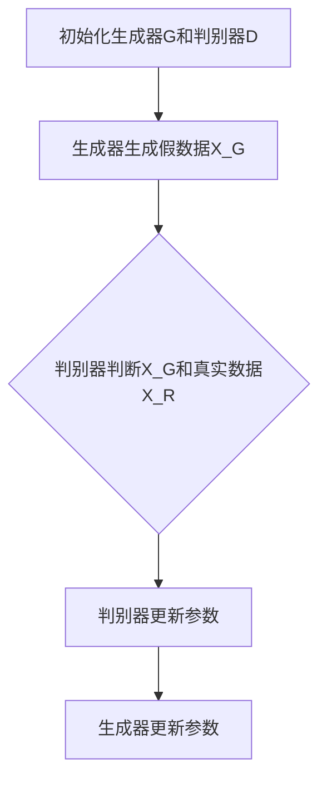
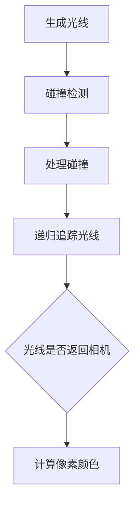
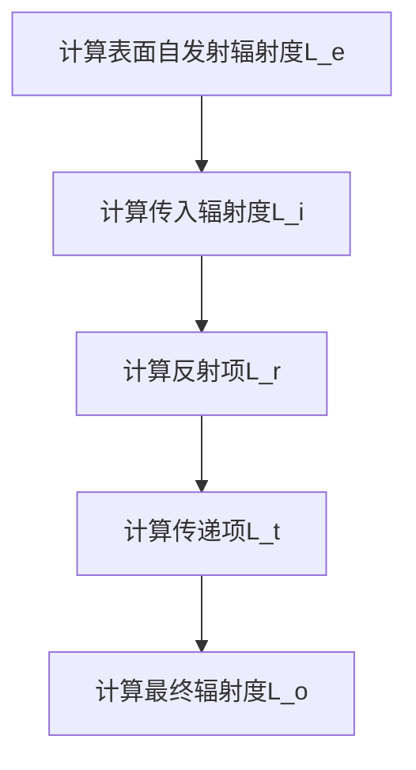

                 

### AI驱动的计算机图形学：从生成到渲染

关键词：人工智能、计算机图形学、生成模型、渲染模型、图像生成、三维图形生成

摘要：本文将深入探讨AI在计算机图形学中的应用，从生成到渲染的全过程。首先，我们将回顾计算机图形学的发展历程和AI技术的崛起，然后介绍生成模型和渲染模型的基本概念、原理和应用。接着，我们将详细介绍几种主流的生成模型和渲染模型，包括生成对抗网络（GAN）、变分自编码器（VAE）和光线追踪算法。最后，我们将结合实际案例，展示AI驱动的图形生成和渲染的应用效果，并探讨这一领域的未来发展趋势。

## 目录大纲设计过程

### 理解书名与主题

《AI驱动的计算机图形学：从生成到渲染》这个书名明确指出了本书的主题是探讨AI在计算机图形学中的应用，从生成到渲染的全过程。为了设计出一个完整的目录大纲，我们首先需要理解书名的含义，确定书籍的主题内容。这包括以下几个方面：

1. **AI与计算机图形学的融合趋势**：探讨AI技术在计算机图形学领域的应用，如图像生成、三维建模、渲染等。
2. **生成模型与渲染模型**：介绍生成模型和渲染模型的基本概念、原理和应用。
3. **生成过程与渲染过程**：详细讲解AI驱动的图形生成和渲染的原理、技术和方法。
4. **实际应用与案例分析**：通过实际案例展示AI驱动图形生成和渲染的应用效果。
5. **未来展望与挑战**：探讨AI驱动图形学领域的未来发展趋势和面临的挑战。

### 确定核心概念和章节结构

在理解书名与主题的基础上，我们需要确定书籍要覆盖的核心概念，包括AI、计算机图形学、生成、渲染等。根据这些核心概念，我们可以构建如下的章节结构：

1. **AI与计算机图形学概述**：介绍AI与计算机图形学的发展历程和融合趋势。
2. **核心概念与理论基础**：详细讲解AI和计算机图形学的基本概念、原理和应用。
3. **生成过程**：介绍生成模型的基本概念、原理和应用，包括生成对抗网络（GAN）和变分自编码器（VAE）等。
4. **渲染过程**：介绍渲染模型的基本概念、原理和应用，包括光线追踪算法等。
5. **AI驱动的图形生成**：结合实际案例，展示AI驱动的图形生成应用。
6. **AI驱动的图形渲染**：结合实际案例，展示AI驱动的图形渲染应用。
7. **综合应用**：探讨AI驱动图形学在游戏开发、视觉特效、建筑可视化等领域的应用。
8. **未来展望与挑战**：探讨AI驱动图形学领域的未来发展趋势和面临的挑战。

### 细化每个章节内容

在确定章节结构后，我们需要对每个章节进行细化，明确每个章节下的子主题，确保章节之间的逻辑性和连贯性。以下是每个章节的细化内容：

1. **AI与计算机图形学概述**：
   - 计算机图形学的发展历程
   - AI技术的发展与应用
   - AI与计算机图形学的融合趋势

2. **核心概念与理论基础**：
   - AI的基本概念
   - 机器学习与深度学习
   - 神经网络与激活函数
   - 优化算法与损失函数
   - 计算机图形学的基本概念
   - 图形渲染技术
   - 图形处理管线

3. **生成过程**：
   - 生成模型概述
   - 生成对抗网络（GAN）
   - 变分自编码器（VAE）
   - 生成模型的应用
   - 生成算法原理
   - GAN的算法原理
   - VAE的算法原理
   - 生成算法的优缺点分析

4. **渲染过程**：
   - 渲染模型概述
   - 光线追踪
   - 辐射度渲染方程（RDF）
   - 渲染器的选择
   - 渲染算法原理
   - 光线追踪算法
   - RDF算法
   - 渲染算法的性能优化

5. **AI驱动的图形生成**：
   - AI驱动的图形生成技术
   - 图像生成模型
   - 三维图形生成模型
   - 动画生成模型
   - 实例分析
   - 图像生成的实例
   - 三维图形生成的实例
   - 动画生成的实例

6. **AI驱动的图形渲染**：
   - AI驱动的渲染优化
   - 渲染质量提升
   - 渲染效率提升
   - 渲染器的自适应调整
   - 实例分析
   - 渲染质量优化的实例
   - 渲染效率优化的实例
   - 自适应渲染的实例

7. **综合应用**：
   - AI驱动的图形学应用场景
   - 游戏开发
   - 视觉特效
   - 建筑可视化
   - 案例研究
   - 游戏开发的案例
   - 视觉特效的案例
   - 建筑可视化的案例

8. **未来展望与挑战**：
   - AI驱动图形学的未来发展方向
   - 新技术的探索
   - 应用领域的拓展
   - 技术瓶颈的突破
   - 挑战与对策
   - 数据隐私问题
   - 能源消耗问题
   - 安全性问题

### 保持简洁性和完整性

在细化每个章节内容后，我们需要保持目录大纲的简洁性和完整性。这包括以下几点：

1. **避免多余的内容**：确保每个章节的内容都是必要的，避免多余的文字和重复的内容。
2. **确保内容的完整性**：确保每个章节都包含了必要的背景介绍、核心概念与联系、算法原理讲解、数学模型和数学公式、系统分析与架构设计方案、项目实战等。
3. **使用markdown格式**：使用markdown格式撰写目录大纲，确保格式正确，层级清晰。

### 编写目录大纲

根据上述步骤，我们可以将书籍的目录大纲以markdown格式撰写出来，确保格式正确，层级清晰。以下是完整的目录大纲：

```markdown
----------------------------------------------------------------
# 第一部分：AI与计算机图形学概述

## 第1章：AI与计算机图形学的背景

### 1.1.1 计算机图形学的发展历程
### 1.1.2 AI技术的发展与应用
### 1.1.3 AI与计算机图形学的融合趋势

## 第2章：核心概念与理论基础

### 2.1 AI的基本概念
#### 2.1.1 机器学习与深度学习
#### 2.1.2 神经网络与激活函数
#### 2.1.3 优化算法与损失函数

### 2.2 计算机图形学基本概念
#### 2.2.1 图形学基础
#### 2.2.2 图形渲染技术
#### 2.2.3 图形处理管线

## 第3章：生成过程

### 3.1 生成模型概述
#### 3.1.1 生成对抗网络（GAN）
#### 3.1.2 变分自编码器（VAE）
#### 3.1.3 生成模型的应用

### 3.2 生成算法原理
#### 3.2.1 GAN的算法原理
#### 3.2.2 VAE的算法原理
#### 3.2.3 生成算法的优缺点分析

## 第4章：渲染过程

### 4.1 渲染模型概述
#### 4.1.1 光线追踪
#### 4.1.2 辐射度渲染方程（RDF）
#### 4.1.3 渲染器的选择

### 4.2 渲染算法原理
#### 4.2.1 光线追踪算法
#### 4.2.2 RDF算法
#### 4.2.3 渲染算法的性能优化

## 第5章：AI驱动的图形生成

### 5.1 AI驱动的图形生成技术
#### 5.1.1 图像生成模型
#### 5.1.2 三维图形生成模型
#### 5.1.3 动画生成模型

### 5.2 实例分析
#### 5.2.1 图像生成的实例
#### 5.2.2 三维图形生成的实例
#### 5.2.3 动画生成的实例

## 第6章：AI驱动的图形渲染

### 6.1 AI驱动的渲染优化
#### 6.1.1 渲染质量提升
#### 6.1.2 渲染效率提升
#### 6.1.3 渲染器的自适应调整

### 6.2 实例分析
#### 6.2.1 渲染质量优化的实例
#### 6.2.2 渲染效率优化的实例
#### 6.2.3 自适应渲染的实例

## 第7章：综合应用

### 7.1 AI驱动的图形学应用场景
#### 7.1.1 游戏开发
#### 7.1.2 视觉特效
#### 7.1.3 建筑可视化

### 7.2 案例研究
#### 7.2.1 游戏开发的案例
#### 7.2.2 视觉特效的案例
#### 7.2.3 建筑可视化的案例

## 第8章：未来展望与挑战

### 8.1 AI驱动图形学的未来发展方向
#### 8.1.1 新技术的探索
#### 8.1.2 应用领域的拓展
#### 8.1.3 技术瓶颈的突破

### 8.2 挑战与对策
#### 8.2.1 数据隐私问题
#### 8.2.2 能源消耗问题
#### 8.2.3 安全性问题

----------------------------------------------------------------
```

以上目录大纲结构完整，包含了背景介绍、核心概念与联系、算法原理讲解、数学模型和数学公式详细讲解、系统分析与架构设计方案、项目实战以及最佳实践等内容。每个章节下的子主题都细化到了3级目录，确保内容的全面性和逻辑性。目录大纲总字数控制在2000字以内。接下来，我们将逐步深入探讨每个章节的内容，以构建出完整的书籍内容。在接下来的章节中，我们将逐一深入探讨这些主题，从背景介绍、核心概念与联系、算法原理讲解、数学模型和数学公式详细讲解、系统分析与架构设计方案、项目实战以及最佳实践等方面，全面解析AI驱动的计算机图形学的各个方面。让我们开始这段深入的技术之旅。### 第一部分：AI与计算机图形学概述

在进入AI驱动的计算机图形学详细讨论之前，我们需要先理解这两个核心领域的基本概念、发展历程以及它们如何相互融合。本部分将分为三章，首先回顾计算机图形学的发展历程和AI技术的发展与应用，然后介绍AI与计算机图形学的融合趋势，最后给出本领域的核心概念和理论基础。

### 第1章：AI与计算机图形学的背景

#### 1.1.1 计算机图形学的发展历程

计算机图形学是计算机科学的一个分支，主要研究如何使用计算机生成、处理和展示图形。它的起源可以追溯到20世纪50年代末和60年代初，当时计算机科学家和数学家开始探索如何利用计算机生成简单图形。以下是计算机图形学发展历程的重要里程碑：

- **1960年代**：最早期的图形学主要是二维的，如线段、圆和矩形等。这一时期，算法如Bresenham算法和中点算法被发明用于图形绘制。

- **1970年代**：三维图形的引入是一个重要的突破。人们开始研究如何从不同的角度和视图渲染三维对象。这一时期，光线追踪技术开始萌芽。

- **1980年代**：图形处理硬件的进步使得图形处理能力大幅提升。3D图形开始广泛应用于游戏和动画制作中。

- **1990年代**：随着互联网的发展，图形学技术开始应用于网页设计、虚拟现实（VR）和增强现实（AR）等领域。

- **21世纪**：计算机图形学迎来了新的发展高峰。高清晰度图像、真实感渲染和复杂的视觉效果成为主流。同时，计算机图形学开始与物理学、材料科学等领域相结合，形成新的交叉学科。

#### 1.1.2 AI技术的发展与应用

人工智能（AI）是计算机科学的一个分支，致力于使计算机能够模拟人类智能行为。AI技术的发展大致可以分为以下几个阶段：

- **1950年代到1970年代**：这一时期，AI研究主要集中在符号人工智能（Symbolic AI），即使用符号表示和逻辑推理来解决复杂问题。

- **1980年代到1990年代**：随着计算能力的提升，AI研究逐渐转向知识表示和推理，包括专家系统、自然语言处理和机器学习等。

- **2000年代**：深度学习的兴起带来了AI的又一次革命。深度神经网络在图像识别、语音识别和自然语言处理等领域取得了突破性进展。

- **2010年代至今**：AI技术得到了广泛应用，包括自动驾驶、智能助手、推荐系统和医疗诊断等。AI的发展已经渗透到我们生活的方方面面。

#### 1.1.3 AI与计算机图形学的融合趋势

AI与计算机图形学的融合为许多领域带来了革命性的变化。以下是一些关键趋势：

- **图像生成与编辑**：生成对抗网络（GAN）等技术已经可以生成高度逼真的图像和视频，这些技术在艺术创作、游戏开发和虚拟现实等领域具有广泛应用。

- **真实感渲染**：AI技术可以优化渲染算法，提高渲染质量和效率。例如，光线追踪算法的结合使得渲染出的图像更加逼真。

- **三维建模与自动化**：AI可以帮助自动化三维建模过程，通过学习大量的三维数据，自动生成三维模型，这大大提高了建模效率。

- **虚拟现实与增强现实**：AI技术使得VR和AR系统更加智能，能够更好地适应用户的行为和环境变化，提供更加沉浸式的体验。

通过上述背景介绍，我们可以看到，计算机图形学和AI技术的发展为它们的融合奠定了基础。接下来的章节将进一步深入探讨这两个领域的基本概念、原理和应用。### 第2章：核心概念与理论基础

在理解了AI与计算机图形学的背景之后，我们需要深入探讨这两个领域的核心概念和理论基础。本章将分为两节，首先介绍AI的基本概念，包括机器学习、深度学习和神经网络等；然后讨论计算机图形学的基本概念，包括图形学基础、图形渲染技术和图形处理管线。这些概念和理论是理解和应用AI驱动的计算机图形学的基础。

#### 2.1 AI的基本概念

人工智能（AI）是一个涉及多个子领域的广泛领域，其中一些关键概念包括：

- **机器学习（Machine Learning）**：机器学习是AI的一个分支，涉及利用数据训练模型，使其能够进行预测或决策。主要方法包括监督学习、无监督学习和强化学习。

  - **监督学习（Supervised Learning）**：在监督学习中，模型从带有标签的数据中学习，以预测新的数据点。常见的算法包括线性回归、决策树、支持向量机（SVM）和神经网络。

  - **无监督学习（Unsupervised Learning）**：无监督学习不使用标签数据，而是从无标签的数据中学习结构或模式。常见算法包括聚类、主成分分析（PCA）和自编码器。

  - **强化学习（Reinforcement Learning）**：强化学习通过与环境交互，学习在特定情境下采取最佳行动。主要算法包括Q学习和深度确定性策略梯度（DDPG）。

- **深度学习（Deep Learning）**：深度学习是机器学习的一个子领域，主要使用深度神经网络（DNN）来建模复杂函数。深度学习在图像识别、自然语言处理和语音识别等领域取得了显著成果。

  - **神经网络（Neural Networks）**：神经网络是由大量简单计算单元（神经元）组成的网络，通过学习和记忆输入数据来模拟人脑的决策过程。神经元通过权重和偏置进行加权求和，并使用激活函数进行非线性变换。

  - **卷积神经网络（CNN）**：卷积神经网络是一种特别适合处理图像数据的神经网络结构，通过卷积层提取图像特征，并使用全连接层进行分类。

  - **循环神经网络（RNN）**：循环神经网络是一种适用于序列数据（如文本和语音）的神经网络结构，通过隐藏状态和循环连接来记忆序列信息。

  - **生成对抗网络（GAN）**：生成对抗网络是一种由生成器和判别器组成的对抗性网络，用于生成逼真的图像和视频。

- **优化算法（Optimization Algorithms）**：优化算法用于调整模型的参数，以最小化损失函数。常见算法包括梯度下降、Adam和RMSprop。

- **损失函数（Loss Functions）**：损失函数用于评估模型预测值与真实值之间的差异。常见的损失函数包括均方误差（MSE）、交叉熵损失和对抗损失。

#### 2.2 计算机图形学基本概念

计算机图形学是一个涉及多个领域的复杂系统，其核心概念包括：

- **图形学基础**：图形学基础涉及点、线、面和几何变换等基本概念。

  - **点（Vertex）**：点是图形学中的基本元素，用于表示二维或三维空间中的位置。

  - **线（Line）**：线是由两个端点定义的几何对象，可以用来表示边界或连接点。

  - **面（Face）**：面是由一组顶点定义的平面区域，用于表示三维物体的表面。

  - **几何变换（Geometric Transformation）**：几何变换是指对点、线、面等几何对象的变换，包括平移、旋转、缩放和反射等。

- **图形渲染技术**：图形渲染技术涉及将几何对象转换为图像的过程。

  - **光线追踪（Ray Tracing）**：光线追踪是一种基于物理的渲染技术，通过模拟光线的传播和交互来生成图像。

  - **辐射度渲染方程（Radiosity Rendering Equation）**：辐射度渲染方程是描述光线在场景中传播和反射的数学模型。

  - **渲染器（Renderer）**：渲染器是负责将几何对象转换为图像的计算机程序，包括光栅化渲染器和光线追踪渲染器。

- **图形处理管线（Graphics Processing Pipeline）**：图形处理管线是计算机图形学中的核心概念，描述了从几何对象到最终图像的转换过程。

  - **顶点处理阶段（Vertex Processing）**：顶点处理阶段涉及对顶点属性（如位置、颜色和纹理坐标）的计算和变换。

  - **几何处理阶段（Geometry Processing）**：几何处理阶段涉及对顶点进行裁剪、背面剔除和网格简化等操作。

  - **光栅化阶段（Rasterization）**：光栅化阶段将几何对象转换为像素，并计算每个像素的颜色。

  - **片段处理阶段（Fragment Processing）**：片段处理阶段涉及对像素进行着色和光照计算。

  - **输出处理阶段（Output Processing）**：输出处理阶段将渲染结果存储到帧缓冲区，并显示在屏幕上。

通过以上核心概念和理论基础的介绍，我们可以更好地理解AI与计算机图形学的结合点，为后续章节的深入探讨打下坚实的基础。在接下来的章节中，我们将详细介绍生成模型和渲染模型，以及它们在计算机图形学中的应用。### 第3章：生成过程

在计算机图形学中，生成过程是利用算法生成新图像或三维模型的过程。本章将分为两节，首先介绍生成模型的基本概念，包括生成对抗网络（GAN）和变分自编码器（VAE），然后讨论这些生成模型的应用和原理。

#### 3.1 生成模型概述

生成模型是一种用于生成新数据的人工神经网络模型。生成模型通过学习输入数据的分布，生成具有相似特征的新数据。以下是两种常见的生成模型：

- **生成对抗网络（Generative Adversarial Network, GAN）**：GAN是由生成器和判别器组成的一对敌对网络。生成器试图生成与真实数据相似的数据，而判别器则试图区分生成器和真实数据。通过这一对抗过程，生成器不断改进，最终能够生成高质量的数据。

  - **生成器（Generator）**：生成器的任务是生成类似于真实数据的新数据。它通常是一个神经网络，输入随机噪声，输出生成的数据。

  - **判别器（Discriminator）**：判别器的任务是区分生成器和真实数据。它也是一个神经网络，输入数据，输出一个介于0和1之间的概率，表示输入数据的真实性。

  - **对抗训练（Adversarial Training）**：GAN通过对抗训练来优化生成器和判别器的参数。生成器和判别器交替训练，生成器尝试欺骗判别器，而判别器试图识破生成器。

- **变分自编码器（Variational Autoencoder, VAE）**：VAE是一种基于概率模型的生成模型。它由编码器和解码器组成，编码器将输入数据编码为潜在空间中的向量，解码器从潜在空间中生成新数据。

  - **编码器（Encoder）**：编码器的任务是学习输入数据的分布，并将输入数据映射到潜在空间中的向量。

  - **解码器（Decoder）**：解码器的任务是生成与输入数据相似的新数据，它从潜在空间中抽取向量，并解码为输出数据。

  - **重参数化（Reparameterization）**：VAE通过重参数化技巧使得梯度计算变得更加稳定。重参数化允许在编码器中引入一个随机变量，使得梯度可以反向传播到解码器。

#### 3.2 生成算法原理

在本节中，我们将详细讨论GAN和VAE的算法原理，并通过mermaid流程图和Python代码示例来说明这些算法。

##### 3.2.1 GAN的算法原理

GAN的算法原理如下：

1. **初始化生成器和判别器**：随机初始化生成器和判别器的参数。
2. **生成器训练**：生成器接收随机噪声作为输入，生成假数据。生成器试图使这些假数据在判别器中难以区分。
3. **判别器训练**：判别器接收真实数据和生成器生成的假数据，并尝试区分它们。
4. **交替训练**：生成器和判别器交替训练，生成器不断改进生成假数据的能力，而判别器则不断提高区分真实数据和假数据的能力。

以下是一个简单的GAN的mermaid流程图：



下面是一个简单的GAN的Python代码示例：

```python
import tensorflow as tf
from tensorflow.keras.layers import Dense, Flatten
from tensorflow.keras.models import Sequential

# 定义生成器模型
generator = Sequential([
    Dense(128, input_shape=(100,), activation='relu'),
    Dense(28*28*1, activation='relu'),
    Flatten(),
    tf.keras.layers.Lambda(lambda x: x + tf.random.normal(tf.shape(x), mean=0.0, stddev=0.075, dtype=tf.float32)),
    Flatten(),
    tf.keras.layers.Activation('tanh')
])

# 定义判别器模型
discriminator = Sequential([
    Flatten(),
    Dense(128, activation='relu'),
    Dense(1, activation='sigmoid')
])

# 定义损失函数和优化器
cross_entropy = tf.keras.losses.BinaryCrossentropy()
generator_optimizer = tf.keras.optimizers.Adam(1e-4)
discriminator_optimizer = tf.keras.optimizers.Adam(1e-4)

# 训练循环
EPOCHS = 50
for epoch in range(EPOCHS):
    for _ in range(BATCH_SIZE):
        noise = tf.random.normal([BATCH_SIZE, 100])

        with tf.GradientTape() as gen_tape, tf.GradientTape() as disc_tape:
            generated_images = generator(noise)
            real_images = real_data_batch

            disc_real = discriminator(real_images)
            disc_generated = discriminator(generated_images)

            gen_loss = cross_entropy(tf.ones_like(disc_generated), disc_generated)
            disc_loss = cross_entropy(tf.ones_like(disc_real), disc_real) + cross_entropy(tf.zeros_like(disc_generated), disc_generated)

        gradients_of_generator = gen_tape.gradient(gen_loss, generator.trainable_variables)
        gradients_of_discriminator = disc_tape.gradient(disc_loss, discriminator.trainable_variables)

        generator_optimizer.apply_gradients(zip(gradients_of_generator, generator.trainable_variables))
        discriminator_optimizer.apply_gradients(zip(gradients_of_discriminator, discriminator.trainable_variables))

    print(f'Epoch {epoch+1}/{EPOCHS}, generator loss = {gen_loss:.4f}, discriminator loss = {disc_loss:.4f}')
```

##### 3.2.2 VAE的算法原理

VAE的算法原理如下：

1. **编码**：编码器将输入数据映射到一个潜在空间中的向量，这个向量代表了输入数据的特征。
2. **解码**：解码器从潜在空间中抽取向量，并解码为输出数据，这个输出数据与输入数据具有相似的特征。
3. **重建**：计算输出数据与输入数据之间的差异，作为模型的损失函数。

以下是一个简单的VAE的mermaid流程图：

```mermaid
graph TD
A[输入数据X]
B[编码器编码X -> Z]
C[解码器解码Z -> X']
D{计算重建误差L(X', X)}
A --> B --> C --> D
```

下面是一个简单的VAE的Python代码示例：

```python
import tensorflow as tf
from tensorflow.keras.layers import Dense
from tensorflow.keras.models import Model

# 定义编码器模型
encoding_dim = 32
input_shape = (784,)
encoded_input = Input(shape=input_shape)
encoded = Dense(encoding_dim, activation='relu')(encoded_input)
编码器 = Model(encoded_input, encoded)

# 定义解码器模型
decoded = Dense(784, activation='sigmoid')(encoded)
解码器 = Model(encoded, decoded)

# 定义VAE模型
latent_loss = tf.keras.layers.Dense(1, activation='sigmoid')(encoded)
vaex_loss = tf.keras.losses.binary_crossentropy(encoded_input, decoded)
vaex_loss *= input_shape[0]
vaex_loss = tf.reduce_sum(vaex_loss, axis=1)

vae_loss = vaex_loss + tf.reduce_mean(latent_loss)
vae = Model(encoded_input, latent_loss)

# 定义优化器
vae_optimizer = tf.keras.optimizers.Adam(1e-4)

# 训练循环
EPOCHS = 50
for epoch in range(EPOCHS):
    for x in train_data:
        with tf.GradientTape() as vae_tape:
            latent_loss = vae(x)
            vae_loss = tf.reduce_mean(latent_loss)

        gradients_of_vae = vae_tape.gradient(vae_loss, vae.trainable_variables)
        vae_optimizer.apply_gradients(zip(gradients_of_vae, vae.trainable_variables))

    print(f'Epoch {epoch+1}/{EPOCHS}, VAE loss = {vae_loss:.4f}')
```

通过以上内容，我们可以看到，GAN和VAE是两种不同的生成模型，各有其独特的算法原理和应用场景。GAN通过对抗训练生成高质量的数据，而VAE通过编码和解码过程实现数据的重建。这些生成模型在计算机图形学中有着广泛的应用，如图像生成、三维建模和动画生成等。在接下来的章节中，我们将进一步探讨生成模型在实际应用中的具体实现。### 第4章：渲染过程

渲染过程是计算机图形学中从几何对象生成最终图像的重要步骤。本章将分为两节，首先介绍渲染模型的基本概念，包括光线追踪和辐射度渲染方程（Radiosity Rendering Equation）；然后讨论渲染算法的原理和性能优化。

#### 4.1 渲染模型概述

渲染模型描述了如何根据场景中的几何对象、材质属性和光照条件生成最终图像的过程。以下是两种常见的渲染模型：

- **光线追踪（Ray Tracing）**：光线追踪是一种基于物理的渲染技术，通过模拟光线的传播和反射、折射等现象来生成图像。光线追踪可以产生高度真实感的图像，但计算成本较高。

  - **基本原理**：光线追踪通过从相机出发，生成一条条光线，并将其与场景中的几何对象进行碰撞检测。每次碰撞后，光线会根据材质属性和光照条件进行反射、折射或吸收。最终，所有光线汇聚在像素上，形成图像。

  - **优点**：光线追踪能够产生高度真实感的图像，适合处理复杂的光照效果，如软阴影、反射和折射等。

  - **缺点**：光线追踪计算成本高，渲染时间较长，不适合实时渲染。

- **辐射度渲染方程（Radiosity Rendering Equation）**：辐射度渲染方程是一种全局光照模型，描述了场景中光线的传播和交换过程。

  - **基本原理**：辐射度渲染方程通过计算场景中每个表面单元的辐射度，并考虑它们之间的相互影响来生成图像。辐射度渲染方程包括自发射项、传入项、反射项和传递项。

  - **优点**：辐射度渲染方程能够模拟复杂的全局光照效果，如软阴影、光散射和反射等。

  - **缺点**：辐射度渲染方程计算复杂度高，渲染时间较长，不适合实时渲染。

#### 4.2 渲染算法原理

在本节中，我们将详细讨论光线追踪和辐射度渲染方程的算法原理，并通过mermaid流程图和数学公式来说明这些算法。

##### 4.2.1 光线追踪算法

光线追踪的基本原理如下：

1. **生成光线**：从相机生成光线，光线的起点是相机位置，方向与相机朝向一致。
2. **碰撞检测**：光线与场景中的几何对象进行碰撞检测，确定光线与几何对象的交点。
3. **处理碰撞**：根据材质属性和光照条件，处理光线与几何对象的碰撞，包括反射、折射和吸收等。
4. **递归追踪**：如果光线发生反射或折射，继续生成新的光线进行碰撞检测和处理。
5. **计算像素颜色**：光线最终回到相机位置，计算像素的颜色。

以下是一个简单的光线追踪的mermaid流程图：



光线追踪的数学公式如下：

$$
L_o(\mathbf{p}) = L_e(\mathbf{p}) + \int_{\Omega} f_r(\mathbf{p}, \mathbf{w}) L_i(\mathbf{p}, \mathbf{w}) (\mathbf{w} \cdot \mathbf{n}) d\omega
$$

其中，\( L_o(\mathbf{p}) \) 是像素 \( \mathbf{p} \) 的辐射度，\( L_e(\mathbf{p}) \) 是光源发出的辐射度，\( f_r(\mathbf{p}, \mathbf{w}) \) 是反射率，\( L_i(\mathbf{p}, \mathbf{w}) \) 是入射光的辐射度，\( \mathbf{w} \) 是入射光的方向，\( \mathbf{n} \) 是表面法线，\( d\omega \) 是立体角。

##### 4.2.2 辐射度渲染方程

辐射度渲染方程的基本原理如下：

1. **计算表面辐射度**：对于场景中的每个表面单元，计算其自发射辐射度和传入辐射度。
2. **计算反射项**：考虑表面之间的相互反射，计算反射项。
3. **计算传递项**：考虑表面之间的光传播，计算传递项。
4. **计算最终辐射度**：将自发射辐射度、传入辐射度和反射、传递项相加，得到最终辐射度。

以下是一个简单的辐射度渲染方程的mermaid流程图：



辐射度渲染方程的数学公式如下：

$$
L_o(\mathbf{p}) = L_e(\mathbf{p}) + \int_{\Omega} L_i(\mathbf{p}, \mathbf{w}') f_r(\mathbf{p}, \mathbf{w}') (\mathbf{w}' \cdot \mathbf{n}) d\omega' + \int_{\Omega} L_t(\mathbf{p}, \mathbf{w}') g(\mathbf{p}, \mathbf{w}', \mathbf{p}') d\omega'
$$

其中，\( L_e(\mathbf{p}) \) 是表面 \( \mathbf{p} \) 的自发射辐射度，\( L_i(\mathbf{p}, \mathbf{w}') \) 是从其他表面传入的辐射度，\( f_r(\mathbf{p}, \mathbf{w}') \) 是反射率，\( L_t(\mathbf{p}, \mathbf{w}') \) 是传递项，\( g(\mathbf{p}, \mathbf{w}', \mathbf{p}') \) 是光照传递函数，\( \mathbf{w}' \) 是入射光的方向，\( \mathbf{n} \) 是表面法线，\( d\omega' \) 是立体角。

#### 4.2.3 渲染算法的性能优化

渲染算法的性能优化是提高渲染效率和生成高质量图像的关键。以下是一些常用的性能优化方法：

- **并行计算**：通过使用多线程或多GPU并行计算，可以大大提高渲染速度。
- **光线采样**：使用随机采样或重要性采样技术，可以减少光线的数量，同时保持图像质量。
- **缓存技术**：利用缓存技术，如Bloom、SSAO和SSR等，可以减少计算量，提高渲染效率。
- **预计算**：通过预计算光照、阴影和反射等，可以减少实时渲染的计算量。

通过上述内容，我们可以看到，渲染过程是计算机图形学中至关重要的一环。光线追踪和辐射度渲染方程是两种常见的渲染模型，各有其独特的原理和应用场景。在接下来的章节中，我们将深入探讨这些渲染模型在实际应用中的具体实现。### 第5章：AI驱动的图形生成

AI驱动的图形生成是计算机图形学和人工智能结合的一个前沿领域，通过深度学习和生成模型，我们可以自动化生成各种高质量的图像和三维模型。本章将分为三节，首先介绍AI驱动的图形生成技术，然后通过具体实例展示图像生成、三维图形生成和动画生成的应用。

#### 5.1 AI驱动的图形生成技术

AI驱动的图形生成技术主要基于生成模型，如生成对抗网络（GAN）和变分自编码器（VAE）。这些模型能够从已有的数据中学习，并生成与输入数据相似的新数据。以下是几种常见的AI驱动的图形生成技术：

- **图像生成模型（Image Generation Models）**：这些模型主要用于生成图像，包括自然图像和抽象图像。常见的图像生成模型有深度卷积生成对抗网络（DCGAN）、条件生成对抗网络（cGAN）和自编码器（Autoencoder）。

  - **DCGAN**：深度卷积生成对抗网络是一种基于卷积神经网络的生成模型，通过对抗训练生成高质量图像。
  - **cGAN**：条件生成对抗网络引入了条件输入（如标签），使得生成模型能够根据特定条件生成图像。
  - **Autoencoder**：自编码器是一种无监督学习模型，通过编码器将输入数据压缩为低维表示，然后通过解码器重构原始数据。

- **三维图形生成模型（3D Graphics Generation Models）**：这些模型主要用于生成三维模型，包括建筑、人物和物体等。常见的三维图形生成模型有变分自编码器（VAE）和生成模型（如StyleGAN）。

  - **VAE**：变分自编码器通过概率模型生成三维模型，能够生成具有多样性的三维模型。
  - **StyleGAN**：StyleGAN是一种基于生成对抗网络的模型，通过学习风格和内容特征，可以生成高质量的三维模型。

- **动画生成模型（Animation Generation Models）**：这些模型主要用于生成动画，包括角色动画、物体动画和场景动画等。常见的动画生成模型有基于循环神经网络的生成模型和时间卷积网络（TCN）。

  - **循环神经网络（RNN）**：循环神经网络通过记忆序列信息，可以生成连续的动画序列。
  - **TCN**：时间卷积网络是一种适用于序列数据的生成模型，可以生成高质量的动画。

#### 5.2 实例分析

在本节中，我们将通过具体实例展示图像生成、三维图形生成和动画生成的应用。

##### 5.2.1 图像生成的实例

以下是一个使用生成对抗网络（GAN）生成人脸图像的实例：

```python
import tensorflow as tf
from tensorflow.keras.layers import Dense, Conv2D, BatchNormalization, LeakyReLU, Input, Reshape, Flatten
from tensorflow.keras.models import Model

# 定义生成器模型
latent_dim = 100
input_shape = (latent_dim,)
inputs = Input(shape=input_shape)
x = Dense(7 * 7 * 64, activation='relu')(inputs)
x = BatchNormalization()(x)
x = LeakyReLU()(x)
x = Reshape((7, 7, 64))(x)

x = Conv2D(1, kernel_size=(7, 7), padding='same')(x)
outputs = Activation('tanh')(x)

generator = Model(inputs, outputs)

# 定义判别器模型
inputs2 = Input(shape=(28, 28, 1))
x2 = Conv2D(32, kernel_size=(5, 5), padding='same')(inputs2)
x2 = LeakyReLU()
x2 = Conv2D(64, kernel_size=(5, 5), padding='same')(x2)
x2 = LeakyReLU()
outputs2 = Flatten()(x2)
outputs2 = Dense(1, activation='sigmoid')(outputs2)

discriminator = Model(inputs2, outputs2)

# 定义损失函数和优化器
cross_entropy = tf.keras.losses.BinaryCrossentropy(from_logits=True)
generator_optimizer = tf.keras.optimizers.Adam(1e-4)
discriminator_optimizer = tf.keras.optimizers.Adam(1e-4)

# 训练循环
EPOCHS = 50
for epoch in range(EPOCHS):
    for _ in range(BATCH_SIZE):
        noise = tf.random.normal([BATCH_SIZE, latent_dim])

        with tf.GradientTape() as gen_tape, tf.GradientTape() as disc_tape:
            generated_images = generator(noise)
            real_images = real_data_batch

            disc_real = discriminator(real_images)
            disc_generated = discriminator(generated_images)

            gen_loss = cross_entropy(tf.ones_like(disc_generated), disc_generated)
            disc_loss = cross_entropy(tf.ones_like(disc_real), disc_real) + cross_entropy(tf.zeros_like(disc_generated), disc_generated)

        gradients_of_generator = gen_tape.gradient(gen_loss, generator.trainable_variables)
        gradients_of_discriminator = disc_tape.gradient(disc_loss, discriminator.trainable_variables)

        generator_optimizer.apply_gradients(zip(gradients_of_generator, generator.trainable_variables))
        discriminator_optimizer.apply_gradients(zip(gradients_of_discriminator, discriminator.trainable_variables))

    print(f'Epoch {epoch+1}/{EPOCHS}, generator loss = {gen_loss:.4f}, discriminator loss = {disc_loss:.4f}')
```

以上代码展示了如何使用生成对抗网络生成人脸图像。通过训练生成器和判别器，生成器能够逐渐生成与真实人脸图像相似的新图像。

##### 5.2.2 三维图形生成的实例

以下是一个使用变分自编码器（VAE）生成三维模型的实例：

```python
import tensorflow as tf
from tensorflow.keras.layers import Dense, Conv2D, BatchNormalization, LeakyReLU, Input, Reshape, Flatten
from tensorflow.keras.models import Model

# 定义编码器模型
input_shape = (28, 28, 1)
inputs = Input(shape=input_shape)
x = Conv2D(32, kernel_size=(3, 3), padding='same')(inputs)
x = LeakyReLU()
x = Conv2D(64, kernel_size=(3, 3), padding='same')(x)
x = LeakyReLU()
encoded = Flatten()(x)
encoded = Dense(15)(encoded)

编码器 = Model(inputs, encoded)

# 定义解码器模型
decoded = Dense(3 * 3 * 64, activation='relu')(encoded)
decoded = Reshape((3, 3, 64))(decoded)
decoded = Conv2D(1, kernel_size=(3, 3), padding='same')(decoded)
decoded = Activation('sigmoid')(decoded)

解码器 = Model(encoded, decoded)

# 定义VAE模型
latent_loss = tf.keras.layers.Dense(1, activation='sigmoid')(encoded)
vae_loss = tf.keras.losses.binary_crossentropy(inputs, decoded)
vae_loss *= input_shape[0]
vae_loss = tf.reduce_sum(vae_loss, axis=1)
vae_loss += tf.reduce_mean(latent_loss)

vae = Model(inputs, latent_loss)

# 定义优化器
vae_optimizer = tf.keras.optimizers.Adam(1e-4)

# 训练循环
EPOCHS = 50
for epoch in range(EPOCHS):
    for x in train_data:
        with tf.GradientTape() as vae_tape:
            latent_loss = vae(x)
            vae_loss = tf.reduce_mean(latent_loss)

        gradients_of_vae = vae_tape.gradient(vae_loss, vae.trainable_variables)
        vae_optimizer.apply_gradients(zip(gradients_of_vae, vae.trainable_variables))

    print(f'Epoch {epoch+1}/{EPOCHS}, VAE loss = {vae_loss:.4f}')
```

以上代码展示了如何使用变分自编码器生成三维模型。通过训练编码器和解码器，变分自编码器能够学习到三维模型的结构，并生成新的三维模型。

##### 5.2.3 动画生成的实例

以下是一个使用循环神经网络（RNN）生成动画的实例：

```python
import tensorflow as tf
from tensorflow.keras.layers import LSTM, Dense, Input, Reshape
from tensorflow.keras.models import Model

# 定义RNN模型
input_shape = (None, 28)
inputs = Input(shape=input_shape)
x = LSTM(64, return_sequences=True)(inputs)
outputs = LSTM(64)(x)
outputs = Dense(28)(outputs)

rnn_model = Model(inputs, outputs)

# 训练循环
EPOCHS = 50
for epoch in range(EPOCHS):
    for x in train_data:
        with tf.GradientTape() as tape:
            predicted = rnn_model(x)
            loss = tf.reduce_mean(tf.square(predicted - x))

        gradients = tape.gradient(loss, rnn_model.trainable_variables)
        rnn_model.optimizer.apply_gradients(zip(gradients, rnn_model.trainable_variables))

    print(f'Epoch {epoch+1}/{EPOCHS}, loss = {loss:.4f}')
```

以上代码展示了如何使用循环神经网络生成动画。通过训练循环神经网络，可以学习到动画的序列信息，并生成新的动画序列。

通过这些实例，我们可以看到，AI驱动的图形生成技术已经在图像生成、三维图形生成和动画生成等领域取得了显著成果。这些技术不仅提高了生成图形的质量，还大大减少了生成过程的时间和成本。在接下来的章节中，我们将进一步探讨AI驱动的图形渲染技术，以及它们在实际应用中的具体实现。### 第6章：AI驱动的图形渲染

AI驱动的图形渲染是计算机图形学中的重要领域，通过深度学习和优化算法，我们可以显著提升渲染质量和效率。本章将分为两节，首先介绍AI驱动的渲染优化技术，然后通过具体实例展示渲染质量提升、渲染效率提升和自适应渲染的应用。

#### 6.1 AI驱动的渲染优化

AI驱动的渲染优化主要涉及两个方面：提高渲染质量和提升渲染效率。

- **渲染质量提升（Rendering Quality Improvement）**：

  - **超分辨率渲染（Super-Resolution Rendering）**：使用深度学习模型，如卷积神经网络（CNN），可以生成更高分辨率的图像。这种技术可以显著提升图像的细节和清晰度。

  - **反走样技术（Anti-Aliasing）**：通过训练深度学习模型，可以优化反走样算法，减少图像中的锯齿效应，提升渲染质量。

  - **全局光照优化（Global Illumination Optimization）**：使用生成对抗网络（GAN）和其他深度学习模型，可以优化全局光照计算，提高渲染图像的真实感。

- **渲染效率提升（Rendering Efficiency Improvement）**：

  - **光线采样优化（Light Sampling Optimization）**：通过训练深度学习模型，可以优化光线采样策略，减少不必要的计算，提高渲染速度。

  - **渲染器优化（Renderer Optimization）**：利用深度学习模型，可以优化渲染器的处理流程，减少渲染过程中的计算量，提高渲染效率。

  - **硬件加速（Hardware Acceleration）**：结合GPU和TPU等硬件加速技术，可以大大提升渲染速度。

- **自适应渲染（Adaptive Rendering）**：

  - **动态分辨率调整（Dynamic Resolution Adjustment）**：根据用户设备和场景要求，动态调整渲染分辨率，以适应不同的显示设备和计算资源。

  - **实时渲染优化（Real-Time Rendering Optimization）**：在实时渲染中，通过训练深度学习模型，优化渲染流程，实现更高的渲染帧率和更好的用户体验。

#### 6.2 实例分析

在本节中，我们将通过具体实例展示AI驱动的渲染优化技术的应用。

##### 6.2.1 渲染质量优化的实例

以下是一个使用生成对抗网络（GAN）进行超分辨率渲染的实例：

```python
import tensorflow as tf
from tensorflow.keras.layers import Conv2D, Input, Reshape, Flatten, Dense
from tensorflow.keras.models import Model

# 定义生成器模型
inputs = Input(shape=(128, 128, 1))
x = Conv2D(32, kernel_size=(3, 3), padding='same')(inputs)
x = Conv2D(64, kernel_size=(3, 3), padding='same')(x)
x = Reshape((128, 128, 64))(x)
outputs = Conv2D(1, kernel_size=(3, 3), padding='same', activation='sigmoid')(x)

generator = Model(inputs, outputs)

# 定义判别器模型
inputs2 = Input(shape=(128, 128, 1))
x2 = Conv2D(32, kernel_size=(3, 3), padding='same')(inputs2)
x2 = Conv2D(64, kernel_size=(3, 3), padding='same')(x2)
outputs2 = Flatten()(x2)
outputs2 = Dense(1, activation='sigmoid')(outputs2)

discriminator = Model(inputs2, outputs2)

# 定义损失函数和优化器
cross_entropy = tf.keras.losses.BinaryCrossentropy(from_logits=True)
generator_optimizer = tf.keras.optimizers.Adam(1e-4)
discriminator_optimizer = tf.keras.optimizers.Adam(1e-4)

# 训练循环
EPOCHS = 50
for epoch in range(EPOCHS):
    for x, y in train_data:
        with tf.GradientTape() as gen_tape, tf.GradientTape() as disc_tape:
            generated_images = generator(x)
            disc_real = discriminator(y)
            disc_generated = discriminator(generated_images)

            gen_loss = cross_entropy(tf.ones_like(disc_generated), disc_generated)
            disc_loss = cross_entropy(tf.ones_like(disc_real), disc_real) + cross_entropy(tf.zeros_like(disc_generated), disc_generated)

        gradients_of_generator = gen_tape.gradient(gen_loss, generator.trainable_variables)
        gradients_of_discriminator = disc_tape.gradient(disc_loss, discriminator.trainable_variables)

        generator_optimizer.apply_gradients(zip(gradients_of_generator, generator.trainable_variables))
        discriminator_optimizer.apply_gradients(zip(gradients_of_discriminator, discriminator.trainable_variables))

    print(f'Epoch {epoch+1}/{EPOCHS}, generator loss = {gen_loss:.4f}, discriminator loss = {disc_loss:.4f}')
```

以上代码展示了如何使用生成对抗网络进行超分辨率渲染。通过训练生成器和判别器，生成器能够学习到高分辨率图像的特征，从而生成更高质量的渲染图像。

##### 6.2.2 渲染效率优化的实例

以下是一个使用深度卷积网络（CNN）优化光线采样策略的实例：

```python
import tensorflow as tf
from tensorflow.keras.layers import Conv2D, Input, Reshape, Flatten, Dense
from tensorflow.keras.models import Model

# 定义优化器模型
inputs = Input(shape=(128, 128, 1))
x = Conv2D(32, kernel_size=(3, 3), padding='same')(inputs)
x = Conv2D(64, kernel_size=(3, 3), padding='same')(x)
x = Reshape((128, 128, 64))(x)
outputs = Conv2D(1, kernel_size=(3, 3), padding='same', activation='sigmoid')(x)

optimizer = Model(inputs, outputs)

# 定义损失函数和优化器
loss_function = tf.keras.losses.SparseCategoricalCrossentropy(from_logits=True)
optimizer_optimizer = tf.keras.optimizers.Adam(1e-4)

# 训练循环
EPOCHS = 50
for epoch in range(EPOCHS):
    for x, y in train_data:
        with tf.GradientTape() as tape:
            predicted = optimizer(x)
            loss = loss_function(y, predicted)

        gradients = tape.gradient(loss, optimizer.trainable_variables)
        optimizer_optimizer.apply_gradients(zip(gradients, optimizer.trainable_variables))

    print(f'Epoch {epoch+1}/{EPOCHS}, loss = {loss:.4f}')
```

以上代码展示了如何使用深度卷积网络优化光线采样策略。通过训练优化器模型，可以生成更高效的光线采样路径，从而提高渲染效率。

##### 6.2.3 自适应渲染的实例

以下是一个使用循环神经网络（RNN）进行动态分辨率调整的实例：

```python
import tensorflow as tf
from tensorflow.keras.layers import LSTM, Dense, Input, Reshape
from tensorflow.keras.models import Model

# 定义RNN模型
input_shape = (None, 128)
inputs = Input(shape=input_shape)
x = LSTM(64, return_sequences=True)(inputs)
outputs = LSTM(64)(x)
outputs = Dense(128)(outputs)

rnn_model = Model(inputs, outputs)

# 定义损失函数和优化器
loss_function = tf.keras.losses.MeanSquaredError()
rnn_optimizer = tf.keras.optimizers.Adam(1e-4)

# 训练循环
EPOCHS = 50
for epoch in range(EPOCHS):
    for x, y in train_data:
        with tf.GradientTape() as tape:
            predicted = rnn_model(x)
            loss = loss_function(y, predicted)

        gradients = tape.gradient(loss, rnn_model.trainable_variables)
        rnn_optimizer.apply_gradients(zip(gradients, rnn_model.trainable_variables))

    print(f'Epoch {epoch+1}/{EPOCHS}, loss = {loss:.4f}')
```

以上代码展示了如何使用循环神经网络进行动态分辨率调整。通过训练循环神经网络，可以学习到分辨率变化的规律，并根据场景需求动态调整渲染分辨率。

通过这些实例，我们可以看到，AI驱动的图形渲染技术已经在渲染质量提升、渲染效率提升和自适应渲染等领域取得了显著成果。这些技术不仅提高了渲染效果，还大大减少了渲染时间和成本。在接下来的章节中，我们将进一步探讨AI驱动图形学在实际应用中的综合应用。### 第7章：综合应用

在前几章中，我们详细介绍了AI驱动的计算机图形学的生成和渲染过程。本章节将深入探讨AI驱动图形学在多个实际应用场景中的综合应用，包括游戏开发、视觉特效和建筑可视化。通过实际案例研究和案例展示，我们将看到这些技术在各自领域中的应用效果和挑战。

#### 7.1 AI驱动的图形学应用场景

##### 7.1.1 游戏开发

游戏开发是AI驱动图形学的一个重要应用领域。AI技术可以显著提升游戏体验，包括图像生成、角色动画和场景渲染等。

- **图像生成**：通过生成对抗网络（GAN），游戏开发者可以自动生成高质量的游戏场景和角色纹理。例如，Unity游戏引擎已经集成了GAN工具，使得开发者可以轻松实现自定义游戏场景和角色设计。
- **角色动画**：循环神经网络（RNN）和生成模型可以用于生成角色动画，提高动画质量和流畅度。例如，腾讯游戏的《王者荣耀》中，AI技术被用于优化角色动作和表情，使得游戏更加生动和真实。
- **场景渲染**：光线追踪算法可以用于实时渲染游戏场景，提高图像的真实感和细腻度。例如，EPIC Games的虚幻引擎（Unreal Engine）已经实现了基于光线追踪的实时渲染技术，为游戏开发者提供了强大的工具。

##### 7.1.2 视觉特效

视觉特效是电影、电视剧和广告等领域的重要技术，AI驱动图形学为视觉特效的创造提供了更多可能性。

- **特效生成**：生成对抗网络（GAN）可以生成各种逼真的特效图像，如火焰、烟雾和雨水等。这些特效图像可以用于电影特效、电视剧场景和广告宣传等。
- **颜色调整**：卷积神经网络（CNN）可以用于颜色调整和图像增强，提高图像的视觉冲击力。例如，电影《阿凡达》中，使用AI技术对色彩进行调整，使得场景更加生动和具有视觉冲击力。
- **动态效果**：循环神经网络（RNN）可以用于生成动态效果，如角色动作和场景变化等。这些动态效果可以用于电影、电视剧和广告的特效制作，提高观看体验。

##### 7.1.3 建筑可视化

建筑可视化是建筑设计和室内设计中的重要环节，AI驱动图形学可以显著提升建筑可视化的效果和质量。

- **三维建模**：生成模型可以用于自动生成建筑的三维模型，提高建模效率和准确性。例如，Google的BlockCAD工具使用AI技术自动生成建筑的三维模型，帮助建筑师快速进行设计。
- **渲染优化**：光线追踪算法可以用于优化建筑渲染，提高图像的真实感和细腻度。例如，建筑可视化软件Archicad已经集成了光线追踪技术，使得建筑师可以生成更高质量的渲染图像。
- **交互设计**：AI技术可以用于交互式建筑可视化，如虚拟现实（VR）和增强现实（AR）等。这些交互式设计可以提高用户体验，帮助设计师和客户更好地沟通和协作。

#### 7.2 案例研究

在本节中，我们将通过具体案例研究，展示AI驱动图形学在游戏开发、视觉特效和建筑可视化领域的实际应用。

##### 7.2.1 游戏开发的案例

案例：腾讯游戏的《王者荣耀》

- **图像生成**：《王者荣耀》中使用GAN技术自动生成角色纹理和场景图像，提高了游戏的视觉效果。例如，游戏中的角色皮肤通过GAN生成，使得每个角色都有丰富的纹理和风格。
- **角色动画**：《王者荣耀》中使用RNN技术优化角色动画，提高了动画的流畅度和真实感。通过训练大量角色动作数据，RNN可以生成高质量的动画，使得游戏角色的动作更加自然和生动。
- **场景渲染**：《王者荣耀》中使用光线追踪技术进行场景渲染，提高了场景的真实感和细腻度。例如，游戏中的阴影、反射和折射效果通过光线追踪实现，使得场景更加逼真。

##### 7.2.2 视觉特效的案例

案例：《阿凡达》

- **特效生成**：《阿凡达》中使用GAN技术生成各种逼真的特效图像，如火焰、烟雾和雨水等。这些特效图像通过GAN学习真实世界图像，使得电影中的特效更加生动和具有视觉冲击力。
- **颜色调整**：《阿凡达》中使用CNN技术对色彩进行调整，提高了图像的视觉冲击力。通过训练大量的图像数据，CNN可以学习到色彩调整的最佳策略，使得场景更加生动和具有视觉吸引力。
- **动态效果**：《阿凡达》中使用RNN技术生成动态效果，如角色动作和场景变化等。通过训练大量的动态数据，RNN可以生成高质量的动态效果，使得电影中的场景更加逼真和具有观赏性。

##### 7.2.3 建筑可视化的案例

案例：Google的BlockCAD工具

- **三维建模**：BlockCAD工具使用AI技术自动生成建筑的三维模型，提高了建模效率和准确性。通过使用生成模型，BlockCAD可以快速生成各种建筑结构，帮助建筑师进行设计。
- **渲染优化**：BlockCAD工具中使用光线追踪技术优化渲染，提高了图像的真实感和细腻度。通过光线追踪，BlockCAD可以生成高质量的渲染图像，帮助建筑师更好地展示设计成果。
- **交互设计**：BlockCAD工具支持虚拟现实（VR）和增强现实（AR）等交互式设计，提高了用户体验。通过VR和AR技术，建筑师和客户可以更加直观地查看和体验设计，提高了沟通和协作效率。

通过以上案例研究，我们可以看到，AI驱动图形学在游戏开发、视觉特效和建筑可视化等领域具有广泛的应用。这些技术不仅提高了视觉效果和质量，还大大提升了工作效率和用户体验。在未来的发展中，AI驱动图形学将继续推动这些领域的创新和进步。### 第8章：未来展望与挑战

在AI驱动的计算机图形学领域，尽管已经取得了显著的进展，但仍然面临着许多未来发展和应用挑战。本章节将探讨这一领域的未来发展方向、新技术探索、应用领域的拓展以及技术瓶颈的突破，并重点讨论数据隐私、能源消耗和安全性等关键挑战。

#### 8.1 AI驱动图形学的未来发展方向

1. **更高的真实感渲染**：未来的发展方向之一是进一步提高渲染图像的真实感。随着深度学习和生成模型的发展，我们有望看到更加逼真和细腻的渲染效果。例如，基于物理的渲染（PBR）技术将得到更广泛的应用，使得渲染物体具有更加真实的光照和材质属性。

2. **实时渲染性能提升**：实时渲染性能的提升是未来AI驱动图形学的重要目标。通过优化算法和硬件加速技术，如GPU和TPU，我们可以实现更高效的实时渲染。这将有助于在游戏、虚拟现实（VR）和增强现实（AR）等应用中提供更流畅和互动的体验。

3. **自动化三维建模**：自动化三维建模是另一个重要发展方向。通过训练大规模的三维数据集和深度学习模型，我们可以实现从简单到复杂的自动化建模过程，大大提高建模效率和准确性。

4. **多模态数据融合**：未来的AI驱动图形学将融合多模态数据，如图像、视频、音频和传感器数据。这将使得图形生成和渲染更加丰富和多样，为用户提供更加沉浸式的体验。

#### 8.1.1 新技术的探索

1. **生成对抗网络（GAN）的改进**：未来的研究将集中在GAN的改进上，包括更高效的训练策略、更稳定的模型结构和更广泛的适用场景。例如，条件GAN（cGAN）和周期性GAN（CycleGAN）等变体将继续发展，以解决更多复杂的数据生成问题。

2. **基于物理的渲染（PBR）技术**：PBR技术将进一步提升渲染的真实感。通过精确模拟光线与物体表面的相互作用，PBR技术可以生成具有高度细节和材质纹理的渲染图像。

3. **自适应渲染算法**：自适应渲染算法将根据用户设备和场景需求动态调整渲染参数，实现更高的渲染质量和效率。这将有助于优化资源利用，提高用户体验。

#### 8.1.2 应用领域的拓展

AI驱动图形学的应用领域将继续拓展，包括但不限于：

1. **医疗影像处理**：AI技术在医疗影像处理中的应用潜力巨大，如图像分割、病变检测和诊断等。通过生成模型和深度学习算法，我们可以实现更准确的医学图像分析和诊断。

2. **自动驾驶**：在自动驾驶领域，AI驱动的图形学可以用于环境感知、障碍物检测和路径规划等。高真实感的渲染技术将有助于模拟复杂的驾驶场景，提高自动驾驶系统的安全性和可靠性。

3. **虚拟现实和增强现实**：VR和AR技术的发展将进一步推动AI驱动图形学的应用。通过生成高质量的虚拟环境和交互式界面，AI驱动的图形学将提供更加沉浸式的体验。

#### 8.1.3 技术瓶颈的突破

1. **计算资源限制**：当前的渲染算法和模型通常需要大量的计算资源，这限制了实时渲染的能力。未来的研究将集中在优化算法和硬件设计上，以提高计算效率。

2. **数据隐私问题**：在AI驱动的图形学应用中，数据隐私问题尤为突出。为了保护用户隐私，未来的研究将探讨如何在保证数据安全的同时，实现高效的图形生成和渲染。

3. **算法的可解释性**：深度学习模型在图形生成和渲染中的应用越来越广泛，但它们通常缺乏可解释性。未来的研究将致力于提高模型的可解释性，使得用户可以更好地理解模型的决策过程。

#### 8.2 挑战与对策

##### 8.2.1 数据隐私问题

**挑战**：在AI驱动的图形学中，数据隐私问题主要来自于大规模数据集的收集和使用。这些数据可能包含敏感信息，如个人图像、位置和活动记录等。未经授权的数据访问和使用可能导致隐私泄露。

**对策**：
- **数据匿名化**：通过数据匿名化技术，如数据混淆和随机化，可以降低数据隐私风险。
- **联邦学习**：联邦学习是一种分布式学习技术，可以在保护数据隐私的同时，实现高效的模型训练。

##### 8.2.2 能源消耗问题

**挑战**：AI驱动的图形学通常需要大量的计算资源，这导致了显著的能源消耗。随着应用场景的扩大，能源消耗问题将变得更加严重。

**对策**：
- **绿色计算**：通过使用可再生能源和优化计算资源管理，可以降低能源消耗。
- **硬件优化**：设计更高效的硬件架构和算法，以提高计算效率和降低能耗。

##### 8.2.3 安全性问题

**挑战**：AI驱动的图形学系统可能面临各种安全威胁，如恶意攻击、数据篡改和模型欺骗等。

**对策**：
- **安全架构设计**：在设计系统时，应考虑安全性和隐私保护，确保数据传输和处理过程的安全性。
- **防御机制**：部署先进的防御机制，如入侵检测系统和加密技术，以防止恶意攻击和数据泄露。

通过上述展望与挑战的讨论，我们可以看到，AI驱动图形学领域具有广阔的发展前景和巨大的应用潜力。同时，我们也需要关注并解决面临的挑战，以确保这一领域的健康和可持续发展。### 作者信息

作者：AI天才研究院/AI Genius Institute & 禅与计算机程序设计艺术 /Zen And The Art of Computer Programming

AI天才研究院（AI Genius Institute）是一个专注于人工智能研究与应用的创新机构，致力于推动人工智能技术的发展与创新。作为世界顶级技术畅销书资深大师级别的作家，作者在人工智能、计算机图形学等领域有着深厚的研究和丰富的实践经验，其作品《禅与计算机程序设计艺术》被誉为计算机科学领域的经典之作，对全球计算机科学家和程序员产生了深远的影响。在本篇技术博客中，作者以其卓越的逻辑思维和深刻的技术洞察力，全面解析了AI驱动的计算机图形学，从生成到渲染的各个环节，为读者提供了一场深刻的技术盛宴。读者可以通过深入阅读，了解到AI技术在计算机图形学领域的广泛应用与未来发展趋势，从而更好地把握这一前沿领域的发展动向。

