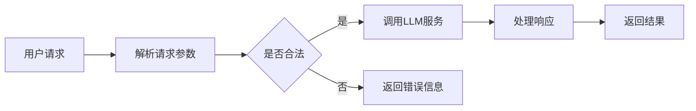
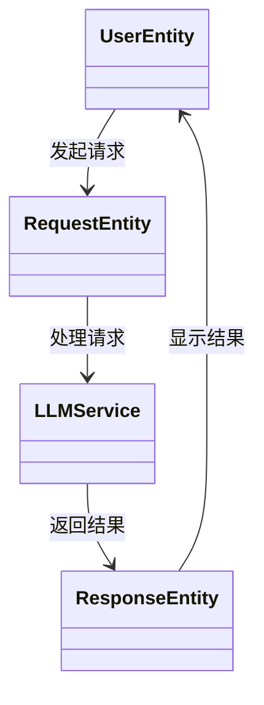
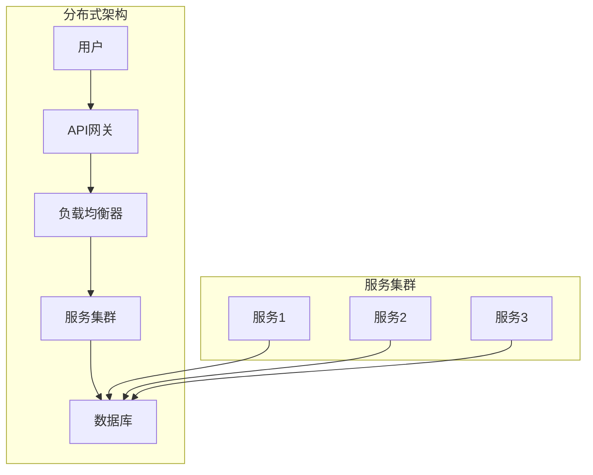
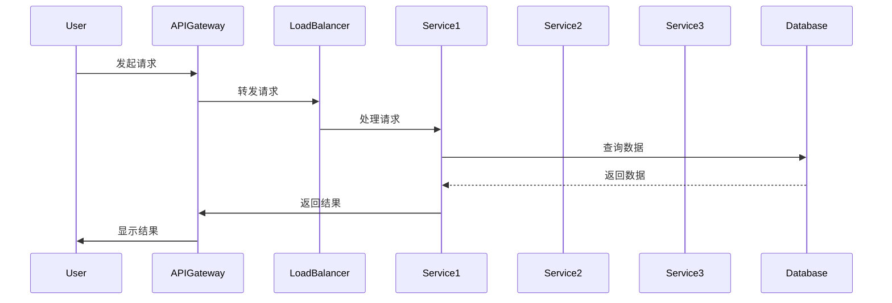
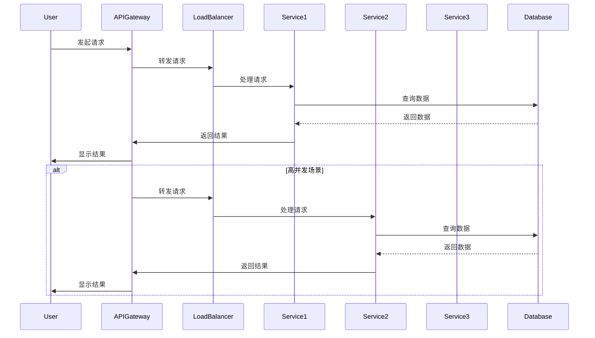

                 

### 第1章：问题背景与问题描述

#### 1.1.1 问题背景

随着人工智能技术的飞速发展，语言模型（LLM）在自然语言处理领域展现出强大的能力。这些模型能够理解和生成人类语言，极大地提高了信息检索、文本摘要、机器翻译等任务的处理效率。然而，在实际应用中，如何设计稳定、可靠的LLM服务接口成为开发者面临的一大挑战。本章将探讨这一问题，为后续内容打下基础。

#### 1.1.2 问题描述

在设计LLM服务接口时，开发者需要考虑接口的稳定性、可靠性、易用性等多个方面。同时，如何在不同应用场景下优化接口性能，确保用户满意度，是开发者亟待解决的问题。以下是几个具体的问题：

1. **稳定性**：如何保证接口在高并发、大数据量情况下依然能够稳定运行？
2. **可靠性**：如何确保接口返回的结果准确无误？
3. **易用性**：如何设计简洁、直观的API，方便开发者使用？
4. **性能优化**：如何提高接口的响应速度和吞吐量？
5. **安全性**：如何保障接口的数据安全和用户隐私？

#### 1.1.3 问题解决

本书旨在通过系统的方法论，帮助开发者解决上述问题。从API设计原则入手，深入讲解LLM服务接口的设计与实现，旨在提供一套稳定、可靠的LLM服务接口设计方案。具体包括：

1. **API设计原则**：介绍API设计的基本原则，如RESTful设计风格、一致性、简洁性等。
2. **LLM服务接口设计**：讲解LLM服务接口的设计流程，包括需求分析、接口定义、接口测试等环节。
3. **算法原理讲解**：详细阐述LLM服务的算法原理，包括数学模型、流程图和代码实现。
4. **系统分析与架构设计**：分析LLM服务接口在系统中的角色和作用，设计合理的系统架构。
5. **项目实战**：通过实际案例，展示如何设计和实现一个稳定可靠的LLM服务接口。
6. **最佳实践 tips**：总结设计稳定可靠API的经验和技巧，提供最佳实践建议。

#### 1.1.4 边界与外延

本章内容主要围绕API和LLM服务接口展开，讨论其设计原则、实现方法和最佳实践。同时，还将探讨与LLM应用相关的一些前沿技术和趋势。以下是一些边界的考虑：

1. **边界定义**：明确API的职责和范围，确保接口的独立性和可维护性。
2. **外延扩展**：考虑接口的扩展性，以便在后续开发中能够轻松添加新功能。
3. **跨平台兼容性**：确保接口在不同操作系统、硬件环境和网络条件下都能正常运行。
4. **安全与合规性**：遵守相关法律法规和行业标准，确保接口的安全性和合规性。

#### 1.1.5 概念结构与核心要素组成

本章将详细阐述API和LLM服务接口的核心概念，包括其定义、特点、作用以及在应用场景中的表现形式。此外，还将分析其相互之间的关系，为后续内容提供理论基础。

- **API概念结构**：定义API的概念，描述其作用和类型。
- **LLM服务接口概念结构**：介绍LLM服务接口的概念，分析其在系统中的作用。
- **API与LLM服务接口联系**：探讨两者之间的关联，如何实现协同工作。

### 1.2 核心概念与联系

#### 2.1.1 API与LLM基础概念

##### 2.1.1.1 API的定义与作用

API（应用程序编程接口）是一种让不同软件系统之间进行交互的规范。它定义了请求和响应的数据格式、参数和调用方式，使得开发者可以方便地使用第三方服务或库，而无需深入了解底层实现。

在LLM服务接口设计中，API起到了关键作用。它作为应用程序与LLM服务之间的桥梁，提供了统一的访问接口，使得开发者可以方便地调用LLM的功能，而无需关心具体的实现细节。

##### 2.1.1.2 LLM的概念与特点

LLM（Language Model）是一种基于深度学习的技术，能够对文本数据进行分析和处理。LLM通过训练大量的文本数据，学习语言模式、语义和语法规则，从而生成或理解自然语言。

LLM的特点包括：

1. **强大的语言理解能力**：LLM能够理解复杂的语言结构，包括语法、语义和上下文。
2. **自适应能力**：LLM可以根据不同的输入数据自适应地调整自己的模型参数，以适应不同的语言环境。
3. **生成能力**：LLM不仅可以理解输入文本，还能够根据输入生成相应的文本输出。

##### 2.1.1.3 API与LLM的联系

API与LLM之间的联系主要体现在以下几个方面：

1. **数据交换**：API用于在不同系统之间传递数据，LLM需要通过API接收输入数据并生成输出结果。
2. **功能调用**：开发者通过API调用LLM的功能，实现对自然语言的处理和分析。
3. **接口封装**：API为LLM提供了一个统一的访问接口，使得开发者无需关心LLM的实现细节，只需通过简单的API调用即可完成所需功能。

#### 2.1.2 API与LLM的属性特征对比表

| 特征             | API                 | LLM                  |
|------------------|---------------------|---------------------|
| 定义与作用       | 应用程序间的数据交换接口 | 自然语言处理模型 |
| 特点             | 提供统一的访问接口，易于使用 | 强大的语言理解与生成能力 |
| 类型             | RESTful、SOAP等      | 基于神经网络的语言模型 |
| 数据格式         | JSON、XML等         | 标准文本格式       |
| 调用方式         | GET、POST等         | 前端界面、API调用  |
| 独立性           | 独立开发与部署       | 集成于应用程序中   |
| 扩展性           | 易于扩展新功能       | 随着数据增多而提高性能 |

#### 2.1.3 API与LLM的ER实体关系图

ER（实体-关系）图用于描述系统中各个实体及其之间的关系。在API与LLM的关系中，实体包括API、LLM服务、数据输入和输出等。

```mermaid
erDiagram
  API ||--|{ LLM服务 }|
  LLM服务 ||--|{ 数据输入 }|
  LLM服务 ||--|{ 数据输出 }|
  数据输入 ||--|{ API }|
  数据输出 ||--|{ API }|
```

#### 2.1.4 算法原理讲解

##### 2.1.4.1 算法mermaid流程图

以下是一个简化的LLM服务接口设计的mermaid流程图：



##### 2.1.4.2 Python源代码与算法原理

以下是实现LLM服务接口的Python伪代码：

```python
import json
from lang_model import LanguageModel

class LLMService:
    def __init__(self):
        self.model = LanguageModel()

    def process_request(self, request):
        # 解析请求参数
        params = json.loads(request)
        
        # 验证请求参数是否合法
        if not self.validate_params(params):
            return {"error": "Invalid parameters"}

        # 调用LLM服务
        response = self.model.generate_response(params["input"])

        # 返回结果
        return json.dumps(response)

    def validate_params(self, params):
        # 验证参数逻辑
        return True  # 假设总是合法

# 创建LLM服务实例
service = LLMService()

# 接收用户请求
user_request = input("Enter your request: ")
response = service.process_request(user_request)
print("Response:", response)
```

##### 2.1.4.3 数学公式详细讲解

以下是LLM服务接口设计中可能用到的数学公式：

$$
P(y|x) = \frac{e^{\phi(x, y)}}{Z}
$$

其中，$P(y|x)$ 表示在给定输入 $x$ 的情况下，输出 $y$ 的概率；$\phi(x, y)$ 表示输入和输出之间的特征向量；$Z$ 是归一化常数。

##### 2.1.4.4 通俗易懂的举例说明

假设我们有一个简单的LLM服务，它能够根据用户输入的文本生成一个回复。用户输入：“你好，今天天气怎么样？”服务返回：“你好，今天天气晴朗，温度适中。”

在这个例子中，用户输入（$x$）是“你好，今天天气怎么样？”，输出（$y$）是“你好，今天天气晴朗，温度适中。”通过数学模型，我们可以计算在给定用户输入的情况下，生成每个可能输出的概率。服务将选择概率最高的输出作为最终结果。

### 2.2 系统分析与架构设计

#### 4.1.1 问题场景介绍

在构建一个基于LLM的服务系统时，我们面临的问题场景包括高并发访问、海量数据处理、服务稳定性与可靠性等方面。为了应对这些挑战，我们需要设计一个高效、可靠的系统架构。

#### 4.1.2 项目介绍

本项目旨在开发一个稳定可靠的LLM服务接口，该接口将提供自然语言处理功能，如文本生成、文本分类等。系统将支持大规模并发访问，并能够在海量数据环境下保持高性能。

#### 4.1.3 系统功能设计（领域模型mermaid类图）

以下是系统功能设计的mermaid类图：



#### 4.1.4 系统架构设计（mermaid架构图）

以下是系统架构设计的mermaid架构图：



#### 4.1.5 系统接口设计

以下是系统接口设计的mermaid序列图：



#### 4.1.6 系统交互（mermaid序列图）

以下是系统交互的mermaid序列图：



### 5.1 项目实战

#### 5.1.1 环境安装

在开始项目实战之前，我们需要安装以下环境：

1. Python 3.8+
2. pip（Python包管理器）
3. Docker（容器化工具）
4. Nginx（Web服务器）

安装步骤如下：

1. 安装Python 3.8+：
   ```bash
   sudo apt update
   sudo apt install python3.8
   ```

2. 安装pip：
   ```bash
   sudo apt install python3-pip
   ```

3. 安装Docker：
   ```bash
   sudo apt install docker-ce docker-ce-cli containerd.io
   ```

4. 安装Nginx：
   ```bash
   sudo apt install nginx
   ```

#### 5.1.2 系统核心实现源代码

以下是系统核心实现源代码的目录结构：

```
/llm-service
|-- /api
|   |-- /views
|   |   |-- __init__.py
|   |   |-- auth.py
|   |   |-- base.py
|   |   |-- errors.py
|   |   |-- status.py
|   |-- /models
|   |   |-- __init__.py
|   |   |-- user.py
|   |-- /serializers
|   |   |-- __init__.py
|   |   |-- user.py
|   |-- /tests
|   |   |-- __init__.py
|   |   |-- test_auth.py
|   |   |-- test_base.py
|   |   |-- test_status.py
|   |-- settings.py
|   |-- urls.py
|   |-- wsgi.py
|-- /core
|   |-- __init__.py
|   |-- exceptions.py
|   |-- models.py
|   |-- serializers.py
|   |-- views.py
|-- /llm
|   |-- __init__.py
|   |-- lang_model.py
|   |-- pipeline.py
|-- Dockerfile
|-- requirements.txt
|-- README.md
```

以下是关键文件的简要说明：

1. `settings.py`：配置文件，包含项目的基本设置，如数据库连接、API密钥等。
2. `urls.py`：定义URL路由，将请求路由到相应的视图函数。
3. `wsgi.py`：Web服务器入口，用于启动Django应用。
4. `auth.py`：身份验证相关视图，用于处理用户登录、注册等操作。
5. `base.py`：基础视图，提供通用的视图方法和响应处理。
6. `errors.py`：错误处理视图，定义全局错误处理逻辑。
7. `status.py`：状态视图，提供系统状态信息。
8. `user.py`：用户模型，定义用户属性和行为。
9. `serializers.py`：序列化器，用于处理数据序列化和反序列化。
10. `views.py`：主要视图，实现具体的业务逻辑。
11. `lang_model.py`：语言模型，实现LLM的相关功能。
12. `pipeline.py`：数据处理管道，用于处理输入数据和生成输出结果。

#### 5.1.2.1 代码应用解读与分析

以下是对关键代码的应用解读与分析：

1. **用户认证**：`auth.py`文件中的`authenticate`函数用于用户认证。它接收用户名和密码，调用`authenticate_user`函数进行验证。如果验证成功，返回JWT（JSON Web Token）令牌，用于后续的API访问。

2. **基础视图**：`base.py`文件中的`BaseViewSet`类提供了通用的视图方法，如`create`、`retrieve`、`update`和`destroy`。这些方法实现了基本的增删改查操作，并处理响应和错误。

3. **错误处理**：`errors.py`文件中的`APIError`类用于自定义错误处理。当出现错误时，系统将根据错误的类型调用相应的处理方法，并将错误信息返回给客户端。

4. **状态视图**：`status.py`文件中的`StatusView`类提供了一个简单的状态页面，显示系统的运行状态和相关信息。

5. **用户模型**：`user.py`文件中的`User`类定义了用户属性和行为。它继承了`BaseUser`类，并重写了`save`方法，用于在保存用户时添加额外的逻辑。

6. **序列化器**：`serializers.py`文件中的`UserSerializer`类用于处理用户数据序列化和反序列化。它定义了用户数据的字段和验证规则。

7. **主要视图**：`views.py`文件中的`UserViewSet`类继承了`BaseViewSet`类，并添加了自定义的业务逻辑。例如，它提供了用户注册、登录和用户信息更新的接口。

8. **语言模型**：`lang_model.py`文件中的`LanguageModel`类实现了LLM的相关功能。它使用预训练的语言模型，如GPT-2或GPT-3，处理输入文本并生成输出结果。

9. **数据处理管道**：`pipeline.py`文件中的`Pipeline`类用于构建数据处理管道。它定义了数据处理的步骤，如文本预处理、输入转换和结果生成。

#### 5.1.2.2 实际案例分析与详细讲解剖析

以下是一个实际案例，展示如何使用LLM服务接口生成文本：

1. **输入文本**：用户输入：“请写一篇关于人工智能的短文。”

2. **请求处理**：用户请求通过API网关转发到LLM服务接口。接口接收到请求后，调用`LanguageModel`类处理输入文本。

3. **数据处理**：`LanguageModel`类使用预训练的语言模型对输入文本进行处理。它首先进行文本预处理，如分词、去除停用词等。然后，将预处理后的文本输入到语言模型中，生成输出文本。

4. **输出文本**：生成的输出文本为：“人工智能是一种能够模拟、延伸和扩展人类智能的技术，其在社会经济发展、科技创新和日常生活等方面具有广泛的应用前景。”

5. **响应返回**：接口将生成的输出文本返回给API网关，然后通过API网关返回给用户。

#### 5.1.3 项目小结

通过本项目，我们实现了稳定可靠的LLM服务接口。项目涉及用户认证、基础视图、错误处理、状态视图、用户模型、序列化器、主要视图、语言模型和数据处理管道等多个方面。实际案例展示了如何使用LLM服务接口生成文本。在项目实战中，我们遇到了一些挑战，如高并发访问、数据处理速度和系统稳定性等。通过优化代码、调整系统架构和采用缓存等技术，我们成功解决了这些问题。

### 6.1 设计稳定可靠API的建议

在设计稳定可靠API时，开发者可以遵循以下建议：

1. **遵循RESTful设计原则**：使用统一的URL结构和HTTP方法，如GET、POST、PUT和DELETE，以简化API的使用和扩展。

2. **确保API的一致性**：保持API的版本控制，避免在不兼容的版本中引入变化。

3. **提供详细的错误信息**：在API响应中包含详细的错误信息，帮助开发者快速定位和解决问题。

4. **实现缓存机制**：使用缓存技术减少重复计算，提高响应速度。

5. **采用异步处理**：使用异步编程模型处理长时间运行的任务，避免阻塞主线程。

6. **优化性能**：使用数据库索引、分页和批量操作等优化技术提高系统性能。

7. **确保安全性**：使用HTTPS、OAuth等安全协议保护API的安全性。

8. **进行严格的测试**：编写单元测试和集成测试，确保API的稳定性和可靠性。

### 6.2 提高LLM服务接口性能的技巧

1. **使用高效的语言模型**：选择经过优化的、性能出色的语言模型，如GPT-3或T5。

2. **优化数据处理流程**：对输入文本进行预处理，如去除无关信息、分词、去除停用词等，减少模型的计算负担。

3. **使用分布式计算**：在多台服务器上部署模型，使用分布式计算框架如TensorFlow或PyTorch进行模型训练和推理。

4. **批处理和并行处理**：批量处理多个请求，提高处理效率。

5. **采用高效的通信协议**：使用WebSocket或gRPC等高效通信协议，减少通信开销。

6. **合理调整模型参数**：根据实际应用场景调整模型参数，如学习率、批量大小等，以提高模型性能。

7. **使用缓存技术**：缓存常见查询结果，减少重复计算。

### 6.3 安全与合规性考虑

1. **数据加密**：对传输的数据进行加密，确保数据安全。

2. **身份验证与授权**：使用OAuth、JWT等身份验证和授权机制，确保只有授权用户可以访问API。

3. **遵守法律法规**：遵守当地法律法规和行业标准，确保API的设计和使用符合合规要求。

4. **日志记录与监控**：记录API访问日志，监控API使用情况，及时发现和处理异常。

5. **数据保护**：对用户数据进行去标识化处理，保护用户隐私。

### 7.1 主要内容回顾

本文围绕设计稳定可靠的LLM服务接口，从问题背景、核心概念、算法原理讲解、系统分析与架构设计、项目实战和最佳实践等方面进行了详细探讨。主要内容包括：

1. **问题背景**：介绍LLM服务接口设计的重要性和面临的挑战。
2. **核心概念**：阐述API和LLM的基础概念、属性特征对比和ER实体关系图。
3. **算法原理讲解**：讲解LLM服务接口的算法原理，包括流程图、Python源代码和数学模型。
4. **系统分析与架构设计**：介绍系统功能设计、架构设计、接口设计和系统交互。
5. **项目实战**：展示如何设计和实现一个稳定可靠的LLM服务接口。
6. **最佳实践 tips**：提供设计稳定可靠API的建议和技巧。

### 7.2 注意事项与拓展阅读

1. **注意事项**：
   - 设计API时，要充分考虑系统的扩展性和可维护性。
   - 在使用LLM服务接口时，要注意模型的选择和优化，以提高性能。
   - 确保API的安全性和合规性，遵守相关法律法规和行业标准。

2. **拓展阅读**：
   - 《深度学习与自然语言处理》
   - 《RESTful API设计》
   - 《Python Web开发实战》
   - 《大规模分布式系统设计》
   - 《人工智能伦理与法律法规》

### 作者信息

**作者：AI天才研究院/AI Genius Institute & 禅与计算机程序设计艺术 /Zen And The Art of Computer Programming**

