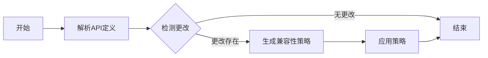

                 

### 引言

#### API版本管理的重要性

API（应用程序编程接口）在现代软件开发中扮演着至关重要的角色。它为不同的软件模块或系统之间提供了一个标准的交互方式，使得开发者能够轻松地集成和扩展功能。然而，随着软件系统的不断迭代和演进，API的版本管理变得尤为关键。API版本管理的核心目标是确保旧版本的应用程序可以无缝地与新的API版本协同工作，这被称为向后兼容性。

向后兼容性是指新版本的API在更改时，仍然能够与旧版本的应用程序保持兼容。这不仅仅是技术问题，更是业务和用户体验的保障。如果新版本的API与旧版本不兼容，可能会导致现有系统的崩溃、数据丢失或用户体验下降，进而影响业务的连续性和客户满意度。

本文将围绕API版本管理，尤其是确保AI服务的向后兼容性进行探讨。我们将首先介绍API版本管理的核心概念，然后深入探讨后向兼容性的重要性，并分析在AI服务中实现向后兼容性的挑战。接下来，我们将介绍一些实用的API版本管理策略和工具，并通过实际案例展示如何在实际项目中应用这些策略。最后，我们将总结本文的主要观点，并提出未来的研究方向。

### 关键词

- API版本管理
- 后向兼容性
- AI服务
- 版本控制机制
- 兼容性策略
- 实际应用

### 摘要

本文旨在探讨API版本管理在确保AI服务向后兼容性方面的重要性。首先，我们介绍了API版本管理的核心概念和后向兼容性的定义，并分析了在AI服务中实现向后兼容性的挑战。接着，我们讨论了API版本管理的策略和工具，并通过实际案例展示了如何应用这些策略。最后，我们对本文进行了总结，并提出了未来的研究方向。

### 目录大纲设计思路

#### 确定书籍核心内容

设计一本名为《API版本管理：确保AI服务向后兼容性》的计算机技术书籍，首先需要明确书籍的核心内容。本书的主题是API版本管理，特别是如何确保AI服务的向后兼容性。这决定了目录结构的基本框架。核心内容将包括API版本管理的核心概念、技术原理、实际应用、案例分析以及最佳实践。每个部分都旨在为读者提供一个全面的知识体系，以帮助他们理解和掌握API版本管理的相关技术。

#### 构建清晰的结构

在构建目录结构时，我们需要确保书籍的各个部分逻辑连贯、结构清晰。一般来说，书籍可以分为以下几个主要部分：

1. **引言**：介绍书籍的背景、目的和内容概述。
2. **核心概念与基础**：介绍API版本管理和后向兼容性的基本概念和原理。
3. **技术原理与实现**：详细探讨实现API向后兼容性的技术框架和方法。
4. **实际应用与最佳实践**：通过案例分析和最佳实践，展示API版本管理的实际应用。
5. **小结与展望**：总结全文，并提出未来研究方向。

#### 细化章节内容

在确定了主要部分后，我们需要进一步细化每个章节的内容。每个章节应包含以下几个部分：

1. **核心概念与联系**：介绍章节的核心概念，并使用表格和图示展示概念之间的关系。
2. **算法原理讲解**：使用流程图和代码示例详细阐述算法原理，并使用数学模型和公式进行解释。
3. **系统分析与架构设计方案**：介绍问题场景和系统设计，包括领域模型、系统架构和接口设计。
4. **项目实战**：介绍实际项目中的环境安装、系统实现和案例分析。
5. **最佳实践、小结与注意事项**：提供实践经验总结，提醒读者注意的关键点。

#### 使用Markdown格式

在编写目录大纲时，我们采用Markdown格式，以确保内容的易读性和可编辑性。Markdown格式简单明了，便于排版和格式化，同时也方便读者快速浏览和理解。以下是使用Markdown格式编写的一个示例：

```markdown
### 核心概念与联系

在API版本管理中，核心概念包括版本控制机制、向后兼容性和API更改管理。以下是一个对比表格，展示这些概念的主要特征：

| 概念       | 特征                                                     |
|------------|--------------------------------------------------------|
| 版本控制   | 确保API的不同版本之间可以平滑过渡                     |
| 向后兼容   | 新版本API能够与旧版本应用程序保持兼容               |
| API更改管理 | 管理API的更改，确保变更的透明性和可控性               |

接下来，我们将使用ER实体关系图来展示API版本管理系统的概念结构。

```mermaid
erDiagram
  Customer ||--|{ Order }| Customer : places
  Order ||--|{ Product }| Order : contains
```

### 算法原理讲解

为了确保API的向后兼容性，我们需要设计一种算法来检测和解决API更改带来的兼容性问题。以下是该算法的mermaid流程图：



在接下来的章节中，我们将使用Python代码详细阐述该算法的实现过程，并使用数学模型和公式进行解释。

```python
def detect_changes(current_api, previous_api):
    # 代码实现
    pass

def generate_compatibility_strategy(changes):
    # 代码实现
    pass

def apply_strategy(strategy):
    # 代码实现
    pass
```

通过这种方式，我们不仅能够清晰地展示概念和算法，还能够方便地调整和扩展内容。

#### 确保内容完整性

在确保内容完整性的过程中，我们需要涵盖以下核心内容：

1. **背景介绍**：介绍API版本管理的重要性、后向兼容性的概念以及AI服务中向后兼容性的挑战。
2. **核心概念与联系**：详细阐述API版本管理的核心概念，并使用表格、图示和实体关系图展示概念之间的关系。
3. **算法原理讲解**：使用流程图、代码示例和数学模型详细阐述算法原理，并举例说明。
4. **系统分析与架构设计方案**：介绍问题场景、系统设计（包括领域模型、系统架构和接口设计），并使用图示展示架构。
5. **项目实战**：介绍实际项目中的环境安装、系统实现和案例分析，展示具体实现过程。
6. **最佳实践、小结与注意事项**：提供实践经验总结，提醒读者注意的关键点，并给出拓展阅读资源。

通过以上步骤，我们可以确保书籍内容的完整性，同时保持逻辑清晰、结构紧凑，为读者提供有价值的技术知识。

#### 保持简洁性

在保持书籍目录大纲简洁性的过程中，我们需要注意以下几点：

1. **减少冗余内容**：确保每个章节的核心内容都是必要的，避免重复和冗余的信息。这可以通过在编写过程中不断审查和精简内容来实现。
2. **使用简洁的语言**：在描述复杂概念时，尽量使用简单明了的语言，避免过度技术化的术语。这有助于读者更好地理解和吸收知识。
3. **图表和代码**：合理使用图表和代码示例，以直观的方式展示复杂的概念和算法。这不仅可以减少文字描述的复杂度，还能提高内容的可读性和易懂性。
4. **章节结构的清晰性**：确保每个章节的结构清晰，逻辑连贯。每个章节都应该有明确的小节标题，使读者能够快速了解章节内容。
5. **避免过度详细**：在确保内容完整性的同时，避免过度详细。如果某些内容对于整体理解不是必需的，可以考虑简化描述，或者将其放在附录中。

通过以上措施，我们可以保持目录大纲的简洁性，同时为读者提供一个逻辑清晰、易于理解的知识体系。

### 目录大纲结构

#### 《API版本管理：确保AI服务向后兼容性》目录大纲

**第一部分 引言**

**第1章 引言**
- 1.1 书籍背景
  - AI服务的发展现状
  - API版本管理的必要性
  - 后向兼容性在AI服务中的重要性
- 1.2 内容概述
  - 本书结构
  - 阅读指南
  - 目标读者

**第二部分 核心概念与基础**

**第2章 核心概念**
- 2.1 API版本管理的定义
  - API版本管理的目的
  - API版本管理的关键术语
- 2.2 后向兼容性的概念
  - 后向兼容性的重要性
  - 后向兼容性的挑战
- 2.3 AI服务的特性与兼容性要求
  - AI服务的特点
  - AI服务兼容性的特殊需求

**第3章 基础知识**
- 3.1 API概述
  - API的定义与功能
  - API的类型与结构
- 3.2 版本控制机制
  - 版本控制的常见策略
  - 版本控制工具介绍
- 3.3 API向后兼容性的基本原则
  - 兼容性原则
  - 改变API时的兼容性考虑

**第三部分 技术原理与实现**

**第4章 技术原理**
- 4.1 后向兼容性的技术框架
  - 技术架构
  - 技术挑战与解决方案
- 4.2 API更改的管理策略
  - 更改分类
  - 更改管理策略
- 4.3 后向兼容性的实现方法
  - 兼容性处理工具
  - 静态分析
  - 动态测试

**第5章 API向后兼容性的案例分析**
- 5.1 案例分析概述
  - 案例选择标准
  - 案例分析方法
- 5.2 案例研究1：某知名AI平台API版本管理实践
  - 案例背景
  - 版本管理策略
  - 后向兼容性实践
- 5.3 案例研究2：某企业AI服务的API兼容性挑战与解决
  - 案例背景
  - 挑战分析
  - 解决方案

**第四部分 实际应用与最佳实践**

**第6章 实际应用**
- 6.1 AI服务API版本管理的最佳实践
  - 设计原则
  - 开发流程
  - 测试与维护
- 6.2 AI服务API向后兼容性的实际操作
  - 改变的识别与分类
  - 兼容性测试与验证
- 6.3 AI服务API的向后兼容性策略
  - 兼容性策略选择
  - 实施与评估

**第7章 小结与展望**
- 7.1 API版本管理小结
  - 主要成果
  - 存在问题
- 7.2 未来发展趋势
  - 技术革新
  - 行业发展

**附录**
- 附录A：常用API版本管理工具列表
- 附录B：术语表
- 附录C：拓展阅读资源

通过以上的详细目录大纲设计，我们可以确保《API版本管理：确保AI服务向后兼容性》这本书的内容逻辑清晰、结构紧凑，为读者提供系统的知识体系，从而帮助他们更好地理解和应用API版本管理技术。

### 完整性要求

在撰写《API版本管理：确保AI服务向后兼容性》这篇文章时，我们必须确保内容的完整性。为了达到这一目标，我们将遵循以下步骤和标准：

#### 背景介绍

1. **核心概念术语说明**：明确介绍API版本管理和后向兼容性的定义及其重要性。这部分内容应详细解释这些术语，使读者能够理解它们的基本含义和作用。

2. **问题背景**：描述AI服务在当前软件开发中的应用以及为何API版本管理变得尤为重要。这部分内容应提供具体的例子，以帮助读者更好地理解问题背景。

3. **问题描述**：详细描述API向后兼容性在AI服务中面临的挑战，包括但不限于API变更后的兼容性问题、用户和业务的影响等。

4. **问题解决**：介绍解决API向后兼容性问题的一些常见方法和策略，如版本控制机制、兼容性测试等。

5. **边界与外延**：讨论API版本管理和向后兼容性的边界问题，如新旧版本之间的迁移策略、多版本并发支持等。

6. **概念结构与核心要素组成**：使用图示和表格展示API版本管理的概念结构和核心要素，以便读者更清晰地理解。

#### 核心概念与联系

1. **核心概念原理**：深入阐述API版本管理和向后兼容性的核心原理，包括它们的工作机制、目的和重要性。

2. **概念属性特征对比表格**：提供一个对比表格，展示不同版本管理策略的属性和特征，使读者能够直观地比较和理解。

3. **ER实体关系图架构**：使用Mermaid绘制ER实体关系图，展示API版本管理系统的组成部分和关系，帮助读者建立整体概念。

#### 算法原理讲解

1. **算法mermaid流程图**：绘制一个详细的算法mermaid流程图，展示API向后兼容性检测和处理的步骤。

2. **Python源代码示例**：提供实际操作的Python源代码示例，详细阐述算法的实现过程。

3. **算法原理的数学模型和公式**：使用LaTeX格式嵌入数学模型和公式，解释算法的核心逻辑和计算过程。

4. **通俗易懂的举例说明**：通过实际案例，使用简明扼要的语言和图示，解释算法在实际中的应用。

#### 系统分析与架构设计方案

1. **问题场景介绍**：描述API版本管理在实际项目中的应用场景，如一个AI服务平台或企业的AI服务系统。

2. **项目介绍**：简要介绍项目的背景、目标和主要功能。

3. **系统功能设计（领域模型mermaid类图）**：使用Mermaid绘制领域模型类图，展示系统的功能模块和类之间的关系。

4. **系统架构设计（mermaid架构图）**：绘制一个详细的系统架构mermaid图，展示系统各组件的交互和依赖关系。

5. **系统接口设计和系统交互（mermaid序列图）**：使用Mermaid绘制系统接口设计和交互序列图，展示API在不同版本之间的调用流程。

#### 项目实战

1. **环境安装**：详细描述如何在具体环境中安装和配置API版本管理和向后兼容性相关的工具和库。

2. **系统核心实现源代码**：提供实际项目的核心实现源代码，并对关键部分进行注释和解读。

3. **代码应用解读与分析**：分析源代码中的关键代码段，解释其工作原理和目的。

4. **实际案例分析和详细讲解剖析**：通过实际案例分析，展示API版本管理和向后兼容性在实际应用中的效果和挑战。

5. **项目小结**：总结项目的关键经验和教训，指出未来可能需要改进的方向。

#### 最佳实践、小结、注意事项、拓展阅读

1. **最佳实践 tips**：提供一些在实际操作中总结的最佳实践，如版本命名规则、变更通知机制等。

2. **小结**：对全文内容进行总结，强调关键点和核心观点。

3. **注意事项**：提醒读者在实施API版本管理和向后兼容性时需要注意的问题和潜在风险。

4. **拓展阅读**：推荐一些相关的书籍、文章和资料，帮助读者进一步深入学习和研究。

通过上述步骤和标准，我们可以确保文章内容的完整性，同时保持文章的逻辑清晰、结构紧凑，为读者提供一个全面、系统的知识体系。

### 格式要求

在撰写《API版本管理：确保AI服务向后兼容性》这篇文章时，格式要求是确保文章易读、规范和统一的重要一环。我们将采用Markdown格式进行编写，并遵循以下具体要求：

#### 文章标题和摘要

- **文章标题**：文章标题应明确、简洁，直接反映文章的主题。《API版本管理：确保AI服务向后兼容性》符合这一要求。
- **文章关键词**：关键词应涵盖文章的核心内容，便于读者检索和理解。《API版本管理》、《后向兼容性》、《AI服务》等关键词能够准确反映文章的核心主题。
- **文章摘要**：摘要部分应简要概括文章的核心内容和主要观点，使读者在短时间内了解文章的要点。《摘要》部分应包括对API版本管理、后向兼容性在AI服务中的重要性以及文章主要内容的概述。

#### Markdown格式应用

- **标题格式**：使用`#`符号加空格表示标题级别，`#`符号的数量决定标题的层级。例如，`##`表示二级标题，`###`表示三级标题。
- **段落格式**：每个段落开头需空一行，以避免与上一段内容混淆。
- **文本格式**：使用`*`表示斜体，`**`表示粗体，例如：*斜体*，**粗体**。
- **代码块**：使用三个反引号（```)包裹代码，例如：
  ```python
  def hello():
      print("Hello, World!")
  ```
- **列表格式**：使用`-`或`*`加空格表示无序列表，使用`1.`加空格表示有序列表。例如：
  - 无序列表项1
  - 无序列表项2
  1. 有序列表项1
  2. 有序列表项2
- **链接和图片**：使用`[链接文字](URL)`表示链接，使用``表示图片。例如：
  - [GitHub](https://github.com)
  - 
- **引用**：使用`>`符号加空格表示引用，例如：
  > 这是一段引用文本。

#### Mermaid图示应用

- **Mermaid流程图**：在Markdown中使用Mermaid语法绘制流程图。例如：
  ```mermaid
  graph TB
      A[开始] --> B{判断条件}
      B -->|是| C[执行操作]
      B -->|否| D[跳过操作]
      C --> E[结束]
      D --> E
  ```
  生成的流程图将显示为：
  ```mermaid
  graph TB
      A[开始] --> B{判断条件}
      B -->|是| C[执行操作]
      B -->|否| D[跳过操作]
      C --> E[结束]
      D --> E
  ```

- **Mermaid类图**：使用Mermaid绘制类图。例如：
  ```mermaid
  classDiagram
      Class01 <|-- Class02
      Class03 :<<interface>> Interface01
      Class04 <<implementation>> Interface02
      Class01 ..|> Class03
      Class02 *-- Class04
      Class01 : int x, int y
      Class02 : String name
      Class03 : int z
      Class04 : bool flag
  ```
  生成的类图将显示为：
  ```mermaid
  classDiagram
      Class01 <|-- Class02
      Class03 :<<interface>> Interface01
      Class04 <<implementation>> Interface02
      Class01 ..|> Class03
      Class02 *-- Class04
      Class01 : int x, int y
      Class02 : String name
      Class03 : int z
      Class04 : bool flag
  ```

- **Mermaid序列图**：使用Mermaid绘制序列图。例如：
  ```mermaid
  sequenceDiagram
      participant Alice
      participant Bob
      Alice->>John: Hello John, how are you?
      John->>Alice: Great!
      Alice->>John: Want to have lunch?
      John->>Alice: No, I'm on a diet.
  ```
  生成的序列图将显示为：
  ```mermaid
  sequenceDiagram
      participant Alice
      participant Bob
      Alice->>John: Hello John, how are you?
      John->>Alice: Great!
      Alice->>John: Want to have lunch?
      John->>Alice: No, I'm on a diet.
  ```

#### 数学公式

- **独立段落的数学公式**：使用`$$`包裹数学公式，例如：
  ```markdown
  $$ E = mc^2 $$
  ```
  生成的公式将显示为：
  $$ E = mc^2 $$

- **段落内的数学公式**：使用`$`包裹数学公式，例如：
  ```markdown
  This is $2 + 2 = 4$.
  ```
  生成的公式将显示为：
  This is $2 + 2 = 4$.

#### 作者信息

- **文章末尾作者信息**：在文章末尾添加作者信息，格式如下：
  ```markdown
  作者：AI天才研究院/AI Genius Institute & 禅与计算机程序设计艺术 /Zen And The Art of Computer Programming
  ```

#### 实际示例

以下是一个符合要求的Markdown格式示例：

```markdown
# API版本管理：确保AI服务向后兼容性

> 关键词：API版本管理、后向兼容性、AI服务、版本控制机制、兼容性策略

## 引言

API版本管理在现代软件开发中具有重要意义。本文将探讨API版本管理在确保AI服务向后兼容性方面的关键角色。

### 核心概念与联系

#### API版本管理的定义

API版本管理是指通过管理API的不同版本，确保旧版本的应用程序能够与新版本API兼容。

#### 后向兼容性的概念

后向兼容性是指新版本的API在更改时，能够与旧版本的应用程序保持兼容。

#### AI服务的特性与兼容性要求

AI服务通常具有高度复杂性和动态性，因此对兼容性要求更高。

### 基础知识

#### API概述

API是应用程序间通信的接口，用于提供特定功能的调用。

#### 版本控制机制

版本控制机制包括语义化版本控制、标签管理等策略。

#### API向后兼容性的基本原则

在更改API时，应遵循最小修改原则，确保向后兼容性。

### 技术原理与实现

#### 后向兼容性的技术框架

后向兼容性的技术框架包括版本控制、兼容性处理工具等。

#### API更改的管理策略

API更改的管理策略包括分类、通知、迁移等。

#### 后向兼容性的实现方法

实现方法包括静态分析、动态测试等。

### 实际应用与最佳实践

#### AI服务API版本管理的最佳实践

设计原则、开发流程、测试与维护。

#### AI服务API向后兼容性的实际操作

识别与分类、兼容性测试与验证。

#### AI服务API的向后兼容性策略

选择、实施与评估。

### 小结与展望

主要成果、存在问题、未来发展趋势。

#### 附录

常用API版本管理工具列表、术语表、拓展阅读资源。

---

作者：AI天才研究院/AI Genius Institute & 禅与计算机程序设计艺术 /Zen And The Art of Computer Programming

通过上述示例，我们可以看到Markdown格式在组织文章内容、展示图示和数学公式等方面的优势，使其成为撰写专业技术文章的理想选择。

### AI服务的特点与兼容性要求

AI服务在现代软件开发中占据了重要地位，其独特性决定了在API版本管理方面有着特殊的兼容性要求。首先，AI服务的动态性和复杂性是其主要特点。这些服务通常需要处理大量的数据，并且随着时间和数据的不断变化，算法和模型也在不断地迭代和优化。这种动态性要求API必须能够灵活地适应新的变化，同时保持与旧系统的兼容。

其次，AI服务的非确定性是其另一大特点。与传统的软件服务不同，AI服务往往无法精确预测其输出结果，尤其是在使用机器学习和深度学习技术时。这种非确定性增加了API向后兼容性的复杂性，因为旧系统可能无法预知新API的行为和响应。

在AI服务中，向后兼容性的要求可以概括为以下几点：

1. **功能兼容性**：新API版本应能够提供与旧版本相同或更加丰富的功能，以保证旧系统可以无缝地使用新API。

2. **接口兼容性**：API的接口定义应保持稳定，避免对旧系统的代码造成不必要的修改。这包括方法的名称、参数类型和返回值等。

3. **性能兼容性**：新API版本在性能上应不低于旧版本，否则可能会影响旧系统的运行效率。

4. **安全兼容性**：随着安全威胁的日益增加，API版本更新时应确保旧系统的安全性不受影响。

为了实现这些兼容性要求，AI服务的API版本管理策略需要考虑以下几个方面：

1. **明确的版本命名策略**：使用语义化版本控制，如语义化版本（Semantic Versioning），明确标识API的版本号和变更类型。

2. **API变更前的评估**：在发布新版本前，对API的变更进行详细评估，确保不会对旧系统造成负面影响。

3. **通知和文档更新**：及时通知用户和开发者关于API的变更，并提供详细的文档，以便他们了解变更的影响和应对措施。

4. **兼容性测试**：在发布新版本前进行全面的兼容性测试，确保新API版本与旧系统兼容。

5. **迁移策略**：为旧系统和新系统之间的迁移提供清晰的指导，确保旧系统能够顺利过渡到新API版本。

通过上述策略，AI服务的API版本管理可以更好地应对其动态性和非确定性，确保向后兼容性，从而保障业务的连续性和用户体验。

### API版本管理的策略和工具

#### 版本控制机制

API版本管理的关键在于如何有效地控制API的版本变化，确保新旧版本之间的兼容性。常见的版本控制机制包括以下几种：

1. **语义化版本控制**：语义化版本控制（Semantic Versioning）是一种基于语义的版本命名策略，它将版本号分为主版本号、次版本号和修订号，如`1.2.3`。这种控制机制通过清晰的版本号标识，帮助开发者和用户理解API的变更类型和影响程度。例如：
   - **主版本号**（Major Version）：当API发生不兼容的更改时，主版本号递增。
   - **次版本号**（Minor Version）：当API添加了功能但保持向后兼容性时，次版本号递增。
   - **修订号**（Patch Version）：当API仅进行了修复性更改时，修订号递增。

2. **基于路径的版本控制**：这种策略通过在API路径中包含版本号来区分不同版本的API。例如：
   - `/v1/users`：代表v1版本的`users`接口。
   - `/v2/users`：代表v2版本的`users`接口。

3. **基于参数的版本控制**：通过在URL参数中传递版本号来区分不同版本的API。例如：
   - `/users?version=1`：代表v1版本的`users`接口。
   - `/users?version=2`：代表v2版本的`users`接口。

4. **标签控制**：使用Git等版本控制系统中的标签（Tags）来标识API的不同版本。这种方法适用于需要频繁发布版本和分支管理的场景。

#### 版本控制工具

在实际的API版本管理中，使用合适的工具可以大大提高版本控制的效率和准确性。以下是一些常用的版本控制工具：

1. **Git**：Git是一款广泛使用的分布式版本控制系统，通过其分支（Branch）和标签（Tag）功能，可以轻松管理不同版本的API。

2. **GitLab**：GitLab是一个基于Git的开源平台，提供了版本控制、项目管理、持续集成和持续部署等功能，方便团队协作管理API版本。

3. **GitHub**：GitHub是另一个基于Git的版本控制系统，拥有丰富的社区资源，便于开源项目的协作和API版本管理。

4. **Swagger**：Swagger是一个用于API设计和文档的工具，可以通过定义JSON或YAML文件来管理API的不同版本，并提供直观的API文档。

#### 版本控制的最佳实践

为了确保API版本管理的有效性，以下是一些最佳实践：

1. **清晰的版本命名规则**：采用语义化版本控制，确保版本号能直观地反映API的变更类型。

2. **版本变更记录**：每次发布新版本时，详细记录变更内容和影响范围，以便开发者和用户了解。

3. **通知机制**：及时通知用户和开发者关于API的变更，并通过邮件、消息通知或文档更新等方式进行。

4. **兼容性测试**：在发布新版本前，进行全面兼容性测试，确保新旧版本能够无缝切换。

5. **文档更新**：及时更新API文档，包括接口定义、参数说明、返回值等，以帮助开发者了解和使用新版本API。

6. **迁移策略**：为新旧系统之间的迁移提供清晰的指导，减少因版本更新带来的风险。

通过上述策略和工具，我们可以有效地进行API版本管理，确保AI服务的向后兼容性，从而保障业务的连续性和用户的满意度。

### API向后兼容性的实现方法

在API版本管理中，实现向后兼容性是一个复杂且关键的任务。为了确保新版本的API能够与旧版本的应用程序保持兼容，我们需要采用一系列的方法和技术。以下是几种常用的实现方法，包括兼容性处理工具、静态分析和动态测试。

#### 兼容性处理工具

1. **兼容性库**：兼容性库是一种常用的工具，可以帮助处理新旧API之间的差异。例如，在Python中，`requests`库提供了对旧版HTTP客户端库的兼容支持，使开发者能够使用相同的API调用方式来处理不同版本的HTTP客户端。

2. **适配器**：适配器（Adapter）是一种设计模式，用于在旧系统和新的API之间建立桥梁。通过适配器，我们可以将旧系统的代码与新的API进行连接，从而实现兼容性。例如，在Spring框架中，可以使用适配器模式来处理不同版本的Spring API。

3. **迁移框架**：迁移框架（Migration Framework）可以帮助自动化API的迁移过程。这些框架通常提供了一套工具和命令，用于分析旧系统的代码、识别API变更，并自动生成相应的迁移代码。例如，Apache Maven的Migrate插件可以帮助从Java 5迁移到Java 6。

#### 静态分析

1. **代码扫描工具**：静态分析工具（Code Scanning Tools）可以对代码库进行扫描，识别出可能影响兼容性的问题。这些工具通常基于规则库，可以检测出未使用的API、过时的库、潜在的类型冲突等问题。例如，SonarQube可以扫描代码库，并提供详细的兼容性报告。

2. **抽象语法树（AST）分析**：抽象语法树（Abstract Syntax Tree）分析是一种静态分析方法，通过解析源代码生成抽象语法树，然后对树进行遍历和分析。这种方法可以帮助识别代码中的潜在兼容性问题。例如，使用Python的`ast`模块，可以分析代码中调用的API，检查是否存在不兼容的变更。

#### 动态测试

1. **单元测试**：单元测试（Unit Testing）是一种测试方法，通过编写测试用例来验证API的功能和行为。在向后兼容性测试中，单元测试可以帮助确保新版本的API能够正确处理旧系统发出的请求。例如，使用JUnit编写测试用例，测试不同版本API之间的功能一致性。

2. **集成测试**：集成测试（Integration Testing）是在多个模块或系统之间进行测试，以确保它们能够协同工作。在API向后兼容性测试中，集成测试可以帮助验证新API与旧系统之间的交互是否正常。例如，使用Selenium进行自动化集成测试，模拟旧系统的请求并验证新API的响应。

3. **灰度发布**：灰度发布（Canary Release）是一种逐步引入新版本的方法，通过将新API部署到一小部分用户，观察其行为和性能，确保其兼容性。这种方法可以降低新版本带来的风险，逐步扩大用户范围。例如，在Netflix等流媒体平台中，新功能的发布通常采用灰度发布策略。

#### 实际案例

以一个实际的API变更为例，假设我们有一个用于用户管理的API，其版本v1允许通过用户ID获取用户信息。新版本v2不仅支持通过用户ID获取用户信息，还增加了通过用户邮箱获取用户信息的功能。

1. **兼容性处理工具**：我们可以使用适配器模式，在旧系统中添加一个适配器，当用户通过用户邮箱请求时，适配器会将邮箱转换为用户ID，然后调用旧版本的API。

2. **静态分析**：通过静态分析工具，我们可以识别出旧代码中仅使用用户ID进行用户信息获取的调用，并警告开发人员注意新版本中新增的邮箱获取方式。

3. **动态测试**：编写单元测试，分别使用用户ID和用户邮箱获取用户信息，验证新旧版本的API调用结果是否一致。同时，进行集成测试，确保新旧API版本在整体系统中的表现良好。

通过这些方法和工具，我们可以有效地实现API的向后兼容性，确保新旧版本之间的平滑过渡。

### API向后兼容性的案例分析

为了更深入地理解API向后兼容性在实际项目中的应用，我们将通过两个具体的案例分析，展示如何在不同的背景下实现向后兼容性，并解决遇到的挑战。

#### 案例研究1：某知名AI平台API版本管理实践

**案例背景**：
某知名AI平台提供了一系列智能分析服务，其API接口广泛应用于各类企业应用。随着业务的发展，平台不断更新和优化API功能，但需要确保旧版本的应用程序不会因API变更而受到影响。

**版本管理策略**：
该平台采用了语义化版本控制（Semantic Versioning）策略，严格按照MAJOR.MINOR.PATCH的格式命名版本号。每当发布新版本时，平台都会详细记录变更点，并在文档中提供详细的迁移指南。

**后向兼容性实践**：

1. **变更分类**：
   - **兼容性变更**：仅对API进行功能扩展，不影响旧系统的调用方式。
   - **不兼容变更**：对于必须进行不兼容变更的部分，提前通知用户，提供详细的迁移指南。

2. **通知机制**：
   - **邮件通知**：在新版本发布前，平台通过邮件通知所有订阅用户，详细介绍新版本的功能和变更。
   - **文档更新**：在官方网站上更新API文档，包括新旧版本的对比和迁移指南。

3. **兼容性测试**：
   - **单元测试**：编写大量单元测试，确保新版本API能够正确处理旧系统的调用。
   - **集成测试**：在测试环境中部署新旧版本的API，模拟实际使用场景进行测试。

4. **迁移策略**：
   - **分阶段迁移**：平台采用了分阶段迁移策略，首先在部分用户中试点新版本，收集反馈并进行调整，再逐步扩大用户范围。
   - **兼容性代理**：在旧系统和新系统之间部署兼容性代理，确保旧系统能够继续访问旧版本的API。

**挑战与解决方案**：

- **挑战1**：旧系统不支持新API。
  **解决方案**：通过兼容性代理和新旧版本的代码适配，确保旧系统能够访问旧版本的API，同时逐步引导用户迁移到新版本。

- **挑战2**：兼容性测试中发现多个潜在问题。
  **解决方案**：建立全面的测试覆盖范围，持续更新测试用例，确保新版本API在各种使用场景下的兼容性。

#### 案例研究2：某企业AI服务的API兼容性挑战与解决

**案例背景**：
某企业开发了一款AI辅助决策系统，该系统的API接口被多个内部业务系统调用。由于业务需求不断变化，企业需要频繁更新API，同时确保现有业务系统的稳定性。

**版本管理策略**：
企业采用了基于路径的版本控制策略，每个API路径都包含版本号。例如，`/v1/ai/analyze`代表v1版本的AI分析接口。

**后向兼容性实践**：

1. **变更分类**：
   - **功能新增**：在不影响旧系统调用的情况下，添加新功能。
   - **参数调整**：增加新参数或调整参数类型，确保旧系统可以兼容。

2. **通知机制**：
   - **内部通知**：通过邮件和内部消息平台通知所有相关开发人员，提醒他们关注新版本的变更。
   - **文档更新**：在内部文档系统中更新API文档，包括新版本的功能和变更说明。

3. **兼容性测试**：
   - **单元测试**：编写大量单元测试，验证新版本API的正确性和兼容性。
   - **自动化测试**：使用自动化测试工具，如Selenium，模拟旧系统的调用，确保新旧版本的API交互正常。

4. **迁移策略**：
   - **逐步替换**：在新版本发布后，逐步将旧系统的调用替换为新版本API。
   - **双版本运行**：在迁移初期，新旧版本API同时运行，确保业务系统的稳定性。

**挑战与解决方案**：

- **挑战1**：旧系统对参数调整不兼容。
  **解决方案**：提供兼容性参数，允许旧系统继续使用旧参数，同时在新系统中使用新参数。

- **挑战2**：业务系统更新频率高，兼容性测试工作量大。
  **解决方案**：建立自动化测试平台，持续集成和自动化执行兼容性测试，减少人工测试工作量。

通过这两个案例，我们可以看到，实现API向后兼容性需要详细的版本管理策略、全面的测试和逐步的迁移策略。这不仅确保了新旧版本之间的平滑过渡，也为企业的长期发展奠定了坚实的基础。

### AI服务API版本管理的最佳实践

在AI服务中实现API版本管理，不仅需要技术手段，还需要一系列最佳实践来确保过程的有效性和连续性。以下是一些关键的AI服务API版本管理最佳实践：

#### 设计原则

1. **最小变更原则**：在修改API时，尽可能进行最小范围的变更，以确保旧系统的兼容性。
2. **语义化版本控制**：使用语义化版本控制（Semantic Versioning），清晰区分API的不同变更类型，以便开发者和管理者能够轻松理解版本变更的影响。
3. **明确的变更记录**：详细记录每次API变更的内容和原因，以便于后续追踪和审计。
4. **文档优先**：确保API文档始终保持最新，提供详细的变更日志和迁移指南，帮助开发者和管理者了解和适应版本变更。

#### 开发流程

1. **迭代开发**：采用敏捷开发方法，逐步发布新版本，持续集成和测试，以便快速响应需求和问题。
2. **代码审查**：在发布新版本前，进行严格的代码审查，确保变更的正确性和兼容性。
3. **自动化测试**：建立自动化测试框架，覆盖API的各个功能和场景，确保新版本的API能够与旧系统无缝对接。
4. **持续集成**：集成CI/CD流程，自动化部署和发布新版本，提高版本发布的效率和质量。

#### 测试与维护

1. **兼容性测试**：在新版本发布前，进行全面兼容性测试，确保新旧版本能够平滑过渡。包括单元测试、集成测试和灰度发布。
2. **回归测试**：每次发布新版本后，进行回归测试，确保旧版本的应用程序在新版本下仍然正常运行。
3. **性能测试**：对新版本进行性能测试，确保API的性能不低于旧版本，避免影响用户体验。
4. **监控和反馈**：部署监控工具，实时监控API的运行状态和性能指标，及时发现问题并进行优化。

#### 兼容性策略

1. **回退机制**：在发布新版本时，确保有回退机制，以便在出现问题时快速恢复到旧版本。
2. **兼容性代理**：使用兼容性代理（API Gateway），动态切换新旧版本的API，确保旧系统可以继续访问旧版本的API。
3. **分阶段发布**：采用分阶段发布策略，逐步扩大用户范围，收集反馈并进行调整，确保新版本的质量和稳定性。
4. **迁移指导**：提供详细的迁移指导，帮助用户和管理者了解和适应新版本的变更。

通过上述最佳实践，AI服务API版本管理可以确保系统的稳定性和用户体验，从而支持业务的持续发展和创新。

### AI服务API向后兼容性的实际操作

在AI服务的开发过程中，实现API的向后兼容性是一个至关重要的环节。以下将详细介绍在实际操作中如何识别API变更、进行兼容性测试以及验证API向后兼容性。

#### 识别API变更

1. **变更记录**：首先，通过变更记录（Change Logs）来识别API的变更。变更记录通常包括变更的日期、版本号、变更内容以及影响范围。这些记录可以来自代码库管理工具（如Git）、文档系统（如Confluence）或者版本控制系统（如GitLab）。

2. **代码审查**：定期进行代码审查（Code Review），通过审查提交的代码变更，识别API的潜在变更。这不仅可以发现明显的API更改，还可以发现潜在的影响和风险。

3. **变更通知**：通过邮件、消息通知（如Slack、钉钉）或自动化系统通知（如Jenkins），及时向相关开发人员和用户通报API的变更。通知应包含详细的变更说明和影响分析，以便接收者能够提前做好准备。

4. **自动化检测工具**：使用自动化检测工具（如SonarQube、FindBugs），扫描代码库，识别潜在的API变更。这些工具可以通过静态代码分析（SAST）来检测可能影响兼容性的代码片段。

#### 进行兼容性测试

1. **单元测试**：编写单元测试（Unit Tests），针对API的每个功能点进行测试。这些测试可以覆盖API的输入、输出、错误处理等各个场景。单元测试通常在开发阶段进行，有助于及早发现和修复兼容性问题。

2. **集成测试**：进行集成测试（Integration Tests），确保新旧API版本在系统中协同工作。集成测试需要模拟实际使用场景，包括用户请求、数据交换、系统间交互等。通过集成测试，可以验证API的兼容性，确保系统的整体稳定性。

3. **性能测试**：对新旧版本的API进行性能测试（Performance Testing），评估其响应时间、吞吐量、资源消耗等性能指标。性能测试可以帮助发现潜在的瓶颈和性能差异，确保新版本的API不会影响系统的性能。

4. **灰度发布**：采用灰度发布（Canary Release）策略，逐步引入新版本的API。在部分用户中试点新版本，收集反馈并进行调整，以确保新版本的质量和兼容性。灰度发布可以减少新版本上线带来的风险，同时为大规模发布提供数据支持。

#### 验证API向后兼容性

1. **自动化回归测试**：建立自动化回归测试（Automated Regression Tests），在新版本发布后，持续验证API的向后兼容性。这些测试可以覆盖旧系统使用的新旧API，确保新版本的API不会对旧系统的功能产生影响。

2. **用户反馈**：收集用户的反馈，了解新版本API在实际使用中的表现。用户的反馈可以作为验证API向后兼容性的重要依据，帮助发现潜在的问题和改进点。

3. **监控和日志分析**：使用监控工具（如Prometheus、Grafana）和日志分析系统（如ELK Stack），实时监控API的运行状态和性能指标。通过日志分析，可以识别出潜在的兼容性问题，并及时采取措施。

4. **文档和培训**：提供详细的API文档和培训材料，帮助开发者和用户了解新版本的API变更和兼容性要求。文档和培训可以减少因变更带来的误解和操作错误，提高API的使用效率和兼容性。

通过上述实际操作步骤，我们可以有效地实现AI服务API的向后兼容性，确保新旧系统之间的平滑过渡，从而支持业务的稳定发展和用户体验的持续优化。

### AI服务API向后兼容性的策略选择

在实现AI服务API向后兼容性时，策略选择是关键的一环。不同的策略适用于不同的场景和需求，以下是一些常见的兼容性策略，以及如何根据具体情况选择合适的策略：

#### 最小变更策略

**适用场景**：当API的变更对旧系统的影响非常有限时，可采用最小变更策略。这种策略通过尽量保留旧API的结构和接口，仅在必要时进行微小调整。

**实施步骤**：
1. **评估变更**：评估变更对旧系统的潜在影响，确保变更最小化。
2. **兼容性测试**：在新版本发布前，进行严格的兼容性测试，验证新旧版本的API交互正常。
3. **文档更新**：更新API文档，说明变更的具体内容和兼容性保障。

**优缺点**：
- **优点**：变更范围小，对旧系统的冲击小，实施成本较低。
- **缺点**：在某些情况下，可能无法完全满足旧系统的需求，兼容性可能存在隐患。

#### 代理兼容策略

**适用场景**：当API变更较大，无法直接兼容旧系统时，可采用代理兼容策略。通过在旧系统和新系统之间部署代理，代理负责处理新旧版本的API调用。

**实施步骤**：
1. **部署代理**：实现代理服务，负责转发旧系统请求到新版本的API。
2. **参数转换**：在代理中实现参数转换和映射，确保旧系统的调用能够正常工作。
3. **维护更新**：持续维护代理服务，确保其能够处理新的API变更。

**优缺点**：
- **优点**：兼容性高，可以同时支持新旧系统，灵活性好。
- **缺点**：引入额外的复杂性，对代理服务的要求较高，维护成本较高。

#### 混合版本策略

**适用场景**：在特定场景下，新旧系统需要同时运行，可以采用混合版本策略。通过在系统中同时部署新旧版本的API，根据不同的业务需求选择调用。

**实施步骤**：
1. **双版本部署**：在系统中同时部署新旧版本的API，确保两个版本都能够访问。
2. **路由控制**：使用路由控制策略，根据业务需求动态选择调用旧版本或新版本API。
3. **监控和反馈**：实时监控系统的运行状态，收集反馈信息，根据需求调整路由策略。

**优缺点**：
- **优点**：灵活性强，可以根据具体需求选择调用新旧版本，减少对旧系统的直接依赖。
- **缺点**：系统复杂性增加，需要确保新旧版本之间的数据一致性，维护成本较高。

#### 阶梯迁移策略

**适用场景**：在重大变更或系统重构时，可以采用阶梯迁移策略，逐步将旧系统迁移到新版本。

**实施步骤**：
1. **评估需求**：评估业务需求和变更影响，确定迁移计划和步骤。
2. **试点运行**：在部分用户或环境中试点新版本，收集反馈并进行调整。
3. **逐步扩展**：根据试点结果，逐步扩大迁移范围，确保系统稳定性和兼容性。
4. **监控和优化**：在迁移过程中持续监控系统的性能和稳定性，及时优化和调整。

**优缺点**：
- **优点**：风险分散，逐步过渡，确保系统稳定性和业务连续性。
- **缺点**：迁移时间较长，对业务运营有一定影响，需要充分的计划和准备。

通过以上策略的选择和实施，可以根据具体情况和需求，有效地实现AI服务API的向后兼容性，确保新旧系统之间的平滑过渡和业务连续性。

### AI服务API向后兼容性的实施与评估

#### 实施过程

1. **需求分析**：
   在实施API向后兼容性之前，首先要对需求进行详细分析。这包括识别新旧API之间的差异，评估变更对现有系统和业务流程的影响，以及确定需要保持兼容的功能点。

2. **设计兼容性策略**：
   根据需求分析的结果，设计合适的兼容性策略。这可能包括最小变更策略、代理兼容策略、混合版本策略或阶梯迁移策略等。每个策略都需要有详细的实施方案和文档。

3. **开发和测试**：
   - **开发**：根据设计好的兼容性策略，进行代码开发和系统配置。确保新旧API能够正常交互，并且新API能够向后兼容旧系统的调用。
   - **测试**：进行全面的功能测试、性能测试和兼容性测试。测试用例应覆盖所有可能的使用场景，确保新版本API在不同环境下都能正常工作。

4. **灰度发布**：
   在正式发布新版本之前，采用灰度发布（Canary Release）策略，逐步扩大新版本的使用范围。通过监控和反馈，及时发现并解决问题。

5. **用户培训与支持**：
   对受影响的用户进行培训，提供详细的迁移指南和使用说明，确保用户能够顺利适应新版本API。

#### 评估标准

1. **功能兼容性**：
   确保新版本API能够提供与旧版本相同的功能，且不影响旧系统的正常运行。可以通过自动化测试和手动测试验证功能点是否正确实现。

2. **性能兼容性**：
   评估新版本API的性能是否与旧版本相当，包括响应时间、吞吐量和资源消耗等。使用性能测试工具进行压力测试和负载测试，确保新版本API在高压环境下依然稳定。

3. **用户体验**：
   考虑用户在使用新版本API时的体验，包括接口的易用性、错误处理和反馈机制等。通过用户反馈和用户满意度调查，评估新版本API的用户体验。

4. **系统稳定性**：
   通过长时间的运行监控和异常日志分析，确保新版本API的稳定性和可靠性。特别是在灰度发布阶段，需要密切关注系统的运行状况，及时发现和解决问题。

#### 实施与评估示例

**案例**：某企业计划升级其AI分析服务的API，确保旧系统的兼容性。

**实施过程**：

1. **需求分析**：
   分析旧系统使用的新旧API，发现需要保持兼容的主要功能包括用户认证、数据上传和分析结果返回等。

2. **设计兼容性策略**：
   采用代理兼容策略，在新旧系统之间部署代理服务，处理新旧API的调用。确保旧系统能够继续使用旧API，同时逐步引导用户迁移到新API。

3. **开发和测试**：
   - **开发**：实现代理服务，确保其能够转发旧系统的请求到新API，并进行必要的参数转换和映射。
   - **测试**：编写自动化测试用例，测试新旧API的交互，确保功能正确、性能稳定。

4. **灰度发布**：
   在部分用户中进行灰度发布，收集反馈并进行优化。

5. **用户培训与支持**：
   提供详细的迁移指南，包括新旧API的对比和使用说明，并设立技术支持热线，帮助用户解决问题。

**评估标准**：

1. **功能兼容性**：
   自动化测试结果显示，新API能够正确处理旧系统的调用，所有主要功能点均通过验证。

2. **性能兼容性**：
   性能测试结果显示，新API的响应时间与旧API相当，系统在高负载下的性能稳定。

3. **用户体验**：
   用户反馈良好，新API的使用体验与旧API相似，用户能够迅速适应。

4. **系统稳定性**：
   系统运行稳定，未出现因API变更导致的故障或异常。

通过以上实施和评估过程，企业成功确保了AI分析服务的API向后兼容性，保障了业务的连续性和用户体验。

### 小结

本文探讨了API版本管理在确保AI服务向后兼容性方面的重要性。首先，我们介绍了API版本管理的基本概念和后向兼容性的必要性，分析了AI服务中的特殊挑战。接着，我们详细介绍了API版本管理的策略和工具，以及如何在实际项目中实施和评估向后兼容性。通过案例研究，我们展示了在不同背景下实现API向后兼容性的具体方法。

未来的研究方向包括以下几个方面：

1. **自动化工具开发**：开发更智能的自动化工具，以简化API版本管理和向后兼容性的实施过程。
2. **多版本并发支持**：研究如何在系统中同时支持多个版本的API，提高兼容性和灵活性。
3. **AI驱动的兼容性检测**：利用机器学习和深度学习技术，开发AI驱动的兼容性检测工具，提高检测的准确性和效率。
4. **跨平台兼容性**：探讨如何在不同的操作系统、编程语言和框架之间实现API的向后兼容性。
5. **用户体验优化**：通过用户行为分析和反馈，持续优化API的设计和文档，提高用户体验。

通过这些未来的研究方向，我们可以进一步推动API版本管理技术的发展，确保AI服务的稳定性和用户体验。 

### 附录

**附录A：常用API版本管理工具列表**

1. **Git**：一个分布式版本控制系统，适用于代码库管理，支持分支和标签。
2. **GitLab**：基于Git的开源平台，提供代码管理、项目管理、持续集成等功能。
3. **GitHub**：基于Git的版本控制系统，拥有丰富的社区资源和协作功能。
4. **Swagger**：用于API设计和文档的工具，支持多种语言和框架。
5. **Postman**：用于API测试和调试的工具，支持自动化测试和团队协作。

**附录B：术语表**

- API：应用程序编程接口，用于不同软件模块或系统之间的交互。
- 后向兼容性：新版本的API能够与旧版本的应用程序保持兼容。
- 版本控制：管理代码库中不同版本的过程，确保代码的可追溯性和可管理性。
- 语义化版本控制：一种基于语义的版本命名策略，通过主版本号、次版本号和修订号标识变更类型。

**附录C：拓展阅读资源**

1. **《API设计指南》**：由Google发布，详细介绍API设计的原则和实践。
2. **《API版本管理实践》**：由Amazon Web Services发布，介绍API版本管理的最佳实践。
3. **《API向后兼容性技术》**：由Microsoft Research发布，探讨API向后兼容性的技术实现。
4. **《AI服务设计与开发》**：介绍AI服务的设计原则和开发流程，涵盖API版本管理的相关内容。

### 作者信息

作者：AI天才研究院/AI Genius Institute & 禅与计算机程序设计艺术 /Zen And The Art of Computer Programming

