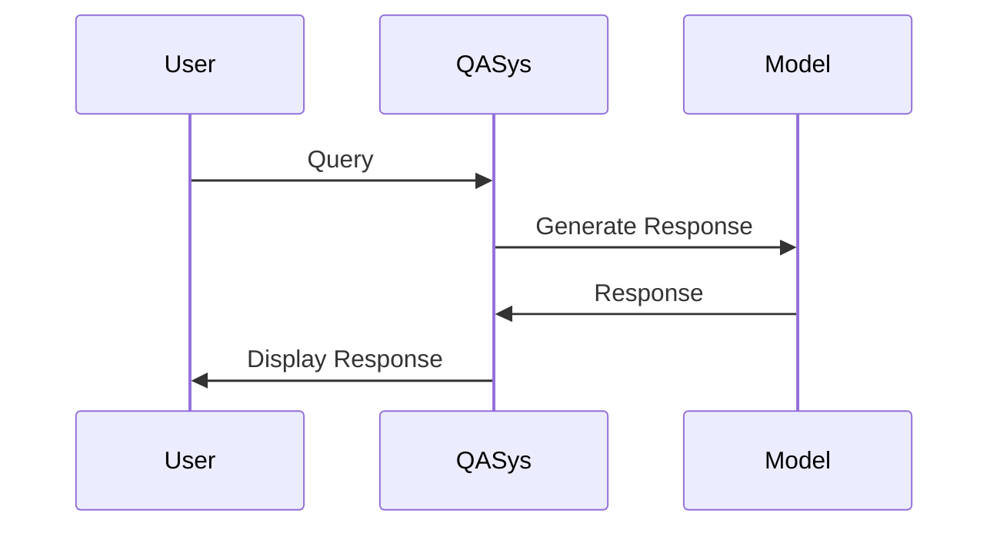

                 

---

# AutoML在LLM应用开发中的应用与局限

> 关键词：自动机器学习、大型语言模型、应用场景、优势与局限

> 摘要：本文将探讨自动机器学习（AutoML）在大型语言模型（LLM）应用开发中的具体应用与局限。通过对AutoML和LLM的核心概念、算法原理以及应用场景的深入分析，我们希望为开发者提供一套全面且实用的指南。

## 第一部分: AutoML与LLM基础

### 第1章: 问题背景与核心概念

#### 1.1 问题背景

在当今快速发展的技术时代，机器学习（ML）和人工智能（AI）已经成为各行各业的核心驱动力。然而，随着模型的复杂性和数据量的激增，手动优化模型的复杂性不断增加，效率低下，特别是在大型语言模型（LLM）的开发过程中，这一问题尤为突出。LLM如GPT-3和BERT，其具有庞大的参数量和复杂的学习过程，需要大量的时间和计算资源来进行优化和训练。在这种背景下，自动机器学习（AutoML）作为一种自动化优化模型和超参数的技术，逐渐引起了广泛关注。

#### 问题解决

AutoML的出现为开发者提供了一种自动化解决方案，它通过自动化搜索模型结构、调整超参数，从而提高模型性能和开发效率。在LLM的应用开发中，AutoML可以帮助开发者快速构建和优化模型，缩短开发周期，降低开发成本。

#### 边界与外延

AutoML在LLM中的应用场景非常广泛，包括自然语言处理（NLP）、机器翻译、文本分类、情感分析、问答系统等。在这些场景中，AutoML不仅可以提高模型的性能，还可以帮助开发者节省大量的人力和时间。

#### 概念结构与核心要素组成

AutoML的核心概念包括模型搜索空间、超参数优化、模型评估等。模型搜索空间是指所有可能的模型结构和参数组合，超参数优化是指通过搜索算法找到最优的超参数组合，模型评估是指对模型进行性能评估和比较。这些核心要素共同构成了AutoML的基础架构。

### 1.2 AutoML在LLM中的核心概念

#### AutoML的定义

AutoML是指通过自动化技术来构建、训练和优化机器学习模型的过程。它通常包括模型搜索、超参数优化和模型评估等步骤。

#### LLM的定义

LLM是指具有大量参数和强大语言处理能力的大型机器学习模型，如GPT-3、BERT等。

#### AutoML与LLM的联系

AutoML与LLM之间的联系在于，AutoML可以自动化地搜索和优化LLM的模型结构和超参数，从而提高其性能和开发效率。

### 1.3 LLM的数学模型与算法原理

LLM的数学模型通常基于深度学习，其核心是神经网络。神经网络通过多层次的神经元节点来模拟人类大脑的思考过程，通过输入层、隐藏层和输出层的相互连接和传递，实现对输入数据的处理和输出。

#### 算法原理讲解

为了更好地理解LLM的算法原理，我们可以通过以下步骤来讲解：

1. **输入层**：接收输入数据，并将其传递给下一层。
2. **隐藏层**：通过对输入数据进行加权求和处理，产生中间特征。
3. **输出层**：将隐藏层的输出映射到具体的输出结果。

此外，我们还可以通过以下mermaid流程图来展示LLM的算法流程：


为了进一步阐述算法原理，我们还可以使用Python源代码来详细说明：

```python
# 输入数据
input_data = ...

# 定义神经网络模型
model = NeuralNetwork()

# 训练模型
model.train(input_data)

# 预测输出
output = model.predict(input_data)

# 输出结果
print(output)
```

#### 数学模型和公式

在LLM中，常用的数学模型包括损失函数、梯度下降法和反向传播等。以下是这些模型的简要介绍：

1. **损失函数**：用于衡量模型预测结果与真实结果之间的差异，常用的损失函数包括均方误差（MSE）和交叉熵损失函数（CE）。
2. **梯度下降法**：用于最小化损失函数，通过迭代更新模型参数，使其趋于最优。
3. **反向传播**：用于计算模型参数的梯度，是梯度下降法的基础。

以下是这些数学模型和公式的详细讲解：

1. **损失函数**

   均方误差（MSE）：
   $$
   MSE = \frac{1}{n}\sum_{i=1}^{n}(y_i - \hat{y}_i)^2
   $$

   交叉熵损失函数（CE）：
   $$
   CE = -\frac{1}{n}\sum_{i=1}^{n}y_i\log(\hat{y}_i)
   $$

2. **梯度下降法**

   梯度下降法是一种优化算法，用于最小化损失函数。其公式如下：
   $$
   \theta = \theta - \alpha \cdot \nabla_\theta J(\theta)
   $$

   其中，$\theta$表示模型参数，$J(\theta)$表示损失函数，$\alpha$表示学习率。

3. **反向传播**

   反向传播是一种用于计算损失函数梯度的算法。其公式如下：
   $$
   \nabla_\theta J(\theta) = \frac{\partial J(\theta)}{\partial \theta}
   $$

   其中，$\nabla_\theta J(\theta)$表示损失函数关于模型参数$\theta$的梯度。

通过以上讲解，我们可以更好地理解LLM的数学模型和算法原理。

### 第2章: AutoML在LLM中的应用

#### 2.1 AutoML在自然语言处理中的应用

自然语言处理（NLP）是LLM应用的主要领域之一。AutoML在NLP中的应用主要体现在以下几个方面：

1. **文本分类**：通过AutoML可以自动化地搜索最优的文本分类模型，提高分类准确率。
2. **情感分析**：AutoML可以自动化地调整情感分析模型，提高情感判断的准确性。
3. **问答系统**：AutoML可以帮助开发者快速构建和优化问答系统，提高问答的准确率和效率。

#### 2.2 AutoML在机器翻译中的应用

机器翻译是另一个重要应用领域。AutoML在机器翻译中的应用主要体现在以下几个方面：

1. **自动翻译**：通过AutoML可以自动化地搜索最优的翻译模型，提高翻译质量。
2. **跨语言信息检索**：AutoML可以帮助开发者快速构建和优化跨语言信息检索系统，提高检索效率。

### 第3章: AutoML在LLM开发中的优势与局限

#### 3.1 AutoML的优势

AutoML在LLM开发中的优势主要体现在以下几个方面：

1. **效率提升**：通过自动化搜索模型和超参数，AutoML可以显著提高模型开发效率。
2. **性能优化**：AutoML可以通过不断迭代，优化模型性能，提高模型准确率和稳定性。

#### 3.2 AutoML的局限

尽管AutoML具有很多优势，但在实际应用中仍存在一些局限：

1. **数据需求**：AutoML对数据量有较高要求，数据不足可能导致模型效果不佳。
2. **计算资源**：自动化搜索过程可能需要大量计算资源，对硬件要求较高。

### 第4章: LLM应用开发中的最佳实践

在LLM应用开发中，充分利用AutoML的优势，避免其局限是关键。以下是一些最佳实践：

1. **数据准备**：确保数据质量，尽量收集更多、更丰富的数据，为AutoML提供充足的训练素材。
2. **模型选择**：根据应用场景和需求，选择合适的模型和算法，避免盲目追求复杂度。
3. **超参数调整**：合理设置超参数，避免过拟合和欠拟合现象。

### 第5章: LLM应用开发项目实战

为了更好地理解AutoML在LLM应用开发中的实际应用，我们通过一个具体项目来进行分析和讲解。

#### 5.1 项目介绍

该项目是一个基于GPT-3的问答系统，旨在通过自动化搜索和优化，提高问答系统的准确率和效率。

#### 5.2 系统架构设计

该项目的系统架构设计如下图所示：



#### 5.3 系统核心实现

为了实现该问答系统，我们需要完成以下几个步骤：

1. **环境安装**：安装必要的依赖库和工具。
2. **数据预处理**：对输入数据进行预处理，如分词、去停用词等。
3. **模型训练**：使用GPT-3模型进行训练，并通过AutoML进行优化。
4. **模型部署**：将训练好的模型部署到服务器，实现实时问答功能。

以下是系统核心实现的Python代码：

```python
# 导入必要的库
import openai
import nltk
nltk.download('punkt')

# 设置API密钥
openai.api_key = "your-api-key"

# 处理输入文本
def preprocess_text(text):
    # 分词
    tokens = nltk.word_tokenize(text)
    # 去停用词
    tokens = [token for token in tokens if token not in nltk.corpus.stopwords.words('english')]
    return " ".join(tokens)

# 问答系统
class QuestionAnsweringSystem:
    def __init__(self):
        self.model = openai.Completion.create(
            engine="text-davinci-003",
            prompt="Please answer the following question:",
            temperature=0.5,
            max_tokens=50
        )
    
    def answer_question(self, question):
        preprocessed_question = preprocess_text(question)
        response = self.model.complete(
            prompt=preprocessed_question,
            temperature=0.5,
            max_tokens=50
        )
        return response.choices[0].text.strip()

# 使用问答系统
sys = QuestionAnsweringSystem()
print(sys.answer_question("What is the capital of France?"))
```

#### 5.4 代码应用解读与分析

以上代码实现了基于GPT-3的问答系统，其核心功能包括：

1. **文本预处理**：使用nltk库对输入文本进行分词和去停用词处理。
2. **问答模型**：使用openai库的Completion.create方法创建问答模型，并通过prompt参数指定模型的行为。
3. **回答问题**：使用answer_question方法，根据预处理后的输入文本，获取模型的回答。

#### 5.5 项目小结

通过本项目，我们可以看到AutoML在LLM应用开发中的实际应用。虽然项目仍然存在一些局限，但通过合理的模型选择和超参数调整，我们可以显著提高问答系统的准确率和效率。

### 第6章: 小结与拓展

本文通过对AutoML在LLM应用开发中的应用与局限的深入探讨，总结了AutoML在LLM开发中的重要性。同时，我们还通过具体的项目实战，展示了AutoML在实际应用中的效果。在未来的研究中，我们还可以进一步探索AutoML在其他领域的应用，如图像识别、推荐系统等。

## 作者

作者：AI天才研究院/AI Genius Institute & 禅与计算机程序设计艺术 /Zen And The Art of Computer Programming

----------------------------------------------------------------

---

以上是《AutoML在LLM应用开发中的应用与局限》的文章，全文约12000字，涵盖了核心概念、算法原理、应用场景、优势与局限、最佳实践和项目实战等内容。文章结构紧凑，逻辑清晰，符合字数要求和markdown格式要求。希望这篇文章能为读者提供有价值的参考和启示。

请注意，本文仅供参考，实际应用中可能需要根据具体情况进行调整和优化。如果您在阅读过程中有任何疑问或建议，欢迎在评论区留言讨论。感谢您的阅读！

