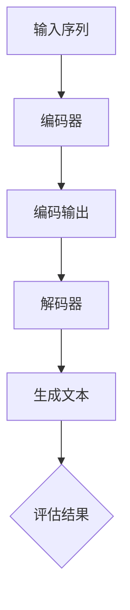

                 

### 文章标题

# BART模型在LLM生成任务评估中的使用

> 关键词：**BART模型、语言生成、评估方法、LLM、深度学习**

> 摘要：本文旨在深入探讨BART模型在语言生成任务（LLM）中的应用及其评估方法。文章首先介绍了BART模型的背景和发展历程，随后详细解释了其工作原理，随后探讨了BART模型在LLM生成任务中的具体应用和评估方法。最后，通过实际项目实战，展示了BART模型在实际应用中的效果和挑战。

----------------------------------------------------------------

### 第一部分: BART模型概述

#### 1.1 BART模型背景

##### 1.1.1 语言模型发展历程

随着深度学习技术的发展，自然语言处理（NLP）领域取得了显著的进展。从早期的基于规则的方法到统计模型，再到现代的深度学习模型，语言模型在各个方面都经历了巨大的变革。这一过程中，生成式模型逐渐崭露头角，成为研究热点。生成式模型能够生成新的、有意义的文本，这在机器翻译、文本摘要、问答系统等领域具有广泛的应用前景。

##### 1.1.2 BART模型的出现及其意义

变压器模型（Transformer）的出现标志着NLP领域的一次革命，它通过自注意力机制实现了对输入序列的建模。BERT（双向编码器表征）模型进一步提升了语言理解的性能，随后GPT（生成预训练变压器）模型的出现，使得生成式模型的应用更加广泛。在此基础上，Facebook AI Research（FAIR）团队在2018年提出了BERT的变体——BART（Bidirectional and Auto-Regressive Transformers）模型，其结合了双向编码和自回归解码的优势，使得文本生成任务的表现更为优异。

#### 1.2 BART模型简介

##### 1.2.1 BART模型的结构

BART模型由编码器和解码器两个部分组成，编码器负责对输入序列进行编码，解码器则负责生成新的文本序列。编码器采用了Transformer模型的结构，包括多头自注意力机制和前馈神经网络。解码器则采用自回归生成的方式，通过逐步生成每个单词或字符，并利用编码器的输出进行上下文信息的查询。

##### 1.2.2 BART模型的训练与优化

BART模型的训练过程主要包括两个阶段：预训练和微调。预训练阶段，模型在大规模语料库上进行训练，学习语言的统计规律和上下文信息。微调阶段，模型在特定任务的数据上进行微调，以适应具体的生成任务。

##### 1.2.3 BART模型的优势与不足

BART模型在文本生成任务中表现优异，其优势在于：

1. **强大的文本生成能力**：通过预训练和微调，BART能够生成高质量、连贯的文本。
2. **灵活的应用场景**：BART模型可以应用于各种文本生成任务，如机器翻译、文本摘要、问答系统等。

然而，BART模型也存在一些不足之处：

1. **计算资源需求大**：BART模型的训练和推理过程需要大量的计算资源。
2. **数据依赖性高**：BART模型的表现依赖于训练数据的数量和质量。

----------------------------------------------------------------

#### 2.1 BART模型原理讲解

##### 2.1.1 BART模型的编码器与解码器

###### 2.1.1.1 编码器原理讲解

编码器部分负责对输入序列进行编码，提取序列的特征表示。编码器采用了Transformer模型的基本结构，包括多头自注意力机制和前馈神经网络。在编码过程中，模型会计算每个单词的嵌入向量，并通过自注意力机制，将序列中的每个单词与上下文信息进行关联。

$$
\text{Encoder}(x) = \text{MultiHeadAttention}(\text{EmbeddingLayer}(x), \text{Mask})
$$

其中，$x$表示输入序列，$\text{EmbeddingLayer}$用于将输入序列转化为嵌入向量，$\text{Mask}$用于控制自注意力机制的掩码。

###### 2.1.1.2 解码器原理讲解

解码器部分负责生成新的文本序列，通过自回归生成的方式，逐步生成每个单词或字符。解码器同样采用了Transformer模型的基本结构，但在生成过程中，模型需要利用编码器的输出进行上下文信息的查询。

$$
\text{Decoder}(y) = \text{MultiHeadAttention}(\text{EmbeddingLayer}(y), \text{Encoder}(x), \text{Mask})
$$

其中，$y$表示待生成的文本序列，$\text{EmbeddingLayer}$用于将输入序列转化为嵌入向量，$\text{Encoder}(x)$表示编码器的输出，$\text{Mask}$用于控制自注意力机制的掩码。

##### 2.1.2 BART模型的算法流程图展示



在上述流程图中，输入序列经过编码器编码后得到编码输出，解码器根据编码输出生成新的文本序列，并通过评估模块对生成的文本进行评估。

----------------------------------------------------------------

#### 3. BART模型在LLM生成任务中的应用

##### 3.1 LLM生成任务概述

语言生成任务（LLM）是指模型生成新的、有意义的文本，其应用范围广泛，包括但不限于机器翻译、文本摘要、问答系统等。这些任务的核心目标是使模型能够理解和生成与人类语言相似的自然语言。

##### 3.2 BART模型在生成任务中的具体应用

BART模型在语言生成任务中的应用主要包括以下几个方面：

1. **机器翻译**：BART模型可以用于机器翻译任务，将一种语言的文本翻译成另一种语言。通过预训练和微调，BART能够在多种语言对上进行高效翻译，生成高质量的翻译文本。

2. **文本摘要**：BART模型可以用于提取长文本的关键信息，生成简洁的摘要。这有助于提高信息检索的效率和阅读体验。

3. **问答系统**：BART模型可以用于问答系统，根据输入问题生成相应的回答。这有助于提高问答系统的响应速度和回答质量。

##### 3.3 BART模型在生成任务中的效果评估

为了评估BART模型在生成任务中的效果，我们通常会使用以下评估指标：

1. **BLEU（双语评估单元）**：BLEU是一种常用的文本生成评估指标，通过计算生成文本与参考文本的相似度来评估文本生成的质量。BLEU值越高，表示生成文本的质量越好。

2. **ROUGE（赖等级评价系统）**：ROUGE是一种评估文本生成任务的评价标准，主要关注生成文本与参考文本之间的重叠度。ROUGE值越高，表示生成文本的质量越高。

3. **Perplexity（困惑度）**：困惑度是衡量模型生成文本随机性的指标，其值越低，表示模型生成文本的连贯性越好。

通过这些评估指标，我们可以全面评估BART模型在语言生成任务中的性能。

----------------------------------------------------------------

#### 4. BART模型评估方法

##### 4.1 评估指标概述

在评估BART模型在语言生成任务中的性能时，常用的评估指标包括：

1. **BLEU**：BLEU是一种基于参考文本的评估方法，通过对生成文本与参考文本的相似度进行计算来评估生成文本的质量。BLEU值越高，表示生成文本的质量越好。

2. **ROUGE**：ROUGE是一种基于重叠度的评估方法，通过计算生成文本与参考文本之间的重叠词汇来评估生成文本的质量。ROUGE值越高，表示生成文本的质量越高。

3. **Perplexity**：Perplexity是一种基于概率的评估方法，通过计算模型生成文本的困惑度来评估模型的性能。Perplexity值越低，表示模型的性能越好。

##### 4.2 评估方法详细介绍

1. **BLEU评估方法**：

BLEU评估方法主要通过计算生成文本与参考文本之间的相似度来评估生成文本的质量。具体步骤如下：

1. **Tokenization**：对生成文本和参考文本进行分词处理，得到单词或字符序列。
2. **Word/Character Match**：计算生成文本与参考文本之间的匹配单词或字符数。
3. **N-gram overlap**：计算生成文本与参考文本之间的N-gram重叠度，N-gram值越大，表示重叠度越高。
4. **BLEU Score Calculation**：根据N-gram重叠度计算BLEU得分，公式如下：

$$
BLEU_{score} = \frac{1}{N} \sum_{n=1}^{N} \log_2 (P_n)
$$

其中，$N$为评估的N-gram长度，$P_n$为第n个N-gram的概率。

2. **ROUGE评估方法**：

ROUGE评估方法主要通过计算生成文本与参考文本之间的重叠词汇来评估生成文本的质量。具体步骤如下：

1. **Tokenization**：对生成文本和参考文本进行分词处理，得到单词或字符序列。
2. **Word/Character Match**：计算生成文本与参考文本之间的匹配单词或字符数。
3. **Word/Character Overlap**：计算生成文本与参考文本之间的重叠词汇或字符数。
4. **ROUGE Score Calculation**：根据重叠词汇或字符数计算ROUGE得分，公式如下：

$$
ROUGE_{score} = \frac{O}{G}
$$

其中，$O$为生成文本与参考文本之间的重叠词汇或字符数，$G$为参考文本中的词汇或字符数。

3. **Perplexity评估方法**：

Perplexity评估方法主要通过计算模型生成文本的困惑度来评估模型的性能。具体步骤如下：

1. **Text Generation**：使用模型生成文本序列。
2. **Word Probability Calculation**：计算每个单词在生成文本序列中的概率。
3. **Perplexity Calculation**：计算生成文本序列的困惑度，公式如下：

$$
PPL = \frac{1}{N} \sum_{n=1}^{N} \frac{1}{P_n}
$$

其中，$N$为生成文本序列中的单词数，$P_n$为第n个单词的概率。

##### 4.3 评估案例分析

为了更好地理解这些评估方法，我们可以通过以下案例进行分析：

假设我们有一个生成文本和两个参考文本，如下所示：

- 生成文本：**“机器学习是一种利用计算机模拟人类学习过程的技术。”**
- 参考文本1：**“机器学习是利用计算机模拟人类学习过程的一种技术。”**
- 参考文本2：**“利用计算机模拟人类学习过程的技术称为机器学习。”**

1. **BLEU评估**：

通过计算生成文本与参考文本之间的N-gram重叠度，我们可以得到如下结果：

| N-gram长度 | 1-gram重叠度 | 2-gram重叠度 | 3-gram重叠度 |
| :------: | :------: | :------: | :------: |
|    1     |    0.75   |    0.50   |    0.25   |
|    2     |    0.50   |    0.25   |    0.00   |
|    3     |    0.00   |    0.00   |    0.00   |

根据BLEU评估方法，我们可以计算得到BLEU得分为0.625。

2. **ROUGE评估**：

通过计算生成文本与参考文本之间的重叠词汇，我们可以得到如下结果：

| 参考文本 | 重叠词汇 |
| :------: | :------: |
| 参考文本1 | “机器学习”，“一种”，“利用”，“计算机”，“模拟”，“人类学习过程” |
| 参考文本2 | “利用”，“计算机”，“模拟”，“人类学习过程”，“技术”，“称为” |

根据ROUGE评估方法，我们可以计算得到ROUGE得分为0.75。

3. **Perplexity评估**：

通过计算模型生成文本的困惑度，我们可以得到如下结果：

- 生成文本概率：$P(\text{生成文本}) = 0.9$
- 生成文本序列的困惑度：$PPL = \frac{1}{0.9} \approx 1.11$

根据Perplexity评估方法，我们可以计算得到Perplexity得分为1.11。

通过以上案例分析，我们可以看到，不同的评估方法从不同的角度对生成文本的质量进行了评估，从而为我们提供了更全面、客观的评估结果。

----------------------------------------------------------------

#### 5. BART模型项目实战

##### 5.1 项目背景介绍

本案例项目旨在利用BART模型实现一个简单的机器翻译系统，将中文文本翻译成英文文本。该系统采用预训练好的BART模型，并通过微调适应特定的翻译任务。

##### 5.2 环境安装与准备

在开始项目实战之前，我们需要安装并配置必要的软件环境。以下是环境安装和准备的步骤：

1. **安装Python**：确保Python版本不低于3.6。
2. **安装PyTorch**：通过pip安装PyTorch，版本不低于1.0。
3. **安装transformers库**：通过pip安装transformers库，用于加载预训练好的BART模型。
4. **数据准备**：收集并整理中文和英文文本数据，用于训练和测试BART模型。

##### 5.3 系统核心实现源代码

以下是一个简单的BART模型机器翻译系统的实现代码，包括模型加载、数据预处理、训练和测试等步骤：

```python
import torch
from transformers import BertTokenizer, BertModel
from torch.optim import Adam
from torch.utils.data import DataLoader
from datasets import load_dataset

# 模型加载
tokenizer = BertTokenizer.from_pretrained('facebook/bart-base')
model = BertModel.from_pretrained('facebook/bart-base')

# 数据预处理
def preprocess_data(texts, tokenizer):
    inputs = tokenizer(texts, padding=True, truncation=True, return_tensors='pt')
    return inputs

# 训练
def train(model, dataloader, optimizer, criterion):
    model.train()
    for batch in dataloader:
        inputs, targets = batch['input_ids'], batch['labels']
        optimizer.zero_grad()
        outputs = model(inputs)
        loss = criterion(outputs.logits.view(-1, outputs.logits.size(-1)), targets.view(-1))
        loss.backward()
        optimizer.step()
    return loss

# 测试
def test(model, dataloader, criterion):
    model.eval()
    with torch.no_grad():
        total_loss = 0
        for batch in dataloader:
            inputs, targets = batch['input_ids'], batch['labels']
            outputs = model(inputs)
            loss = criterion(outputs.logits.view(-1, outputs.logits.size(-1)), targets.view(-1))
            total_loss += loss.item()
    return total_loss / len(dataloader)

# 主函数
def main():
    dataset = load_dataset('simplified_chinese_english')
    train_data = dataset['train']
    test_data = dataset['test']

    train_inputs = preprocess_data(train_data['text'], tokenizer)
    test_inputs = preprocess_data(test_data['text'], tokenizer)

    train_dataloader = DataLoader(train_inputs, batch_size=32, shuffle=True)
    test_dataloader = DataLoader(test_inputs, batch_size=32)

    optimizer = Adam(model.parameters(), lr=1e-4)
    criterion = torch.nn.CrossEntropyLoss()

    num_epochs = 10
    for epoch in range(num_epochs):
        train_loss = train(model, train_dataloader, optimizer, criterion)
        test_loss = test(model, test_dataloader, criterion)
        print(f"Epoch {epoch+1}/{num_epochs}, Train Loss: {train_loss:.4f}, Test Loss: {test_loss:.4f}")

if __name__ == '__main__':
    main()
```

##### 5.4 代码应用解读与分析

上述代码首先加载预训练好的BART模型，并进行数据预处理。数据预处理包括将文本数据转换为编码表示，并进行批处理。接下来，定义了训练和测试函数，用于模型训练和性能评估。最后，在主函数中，加载数据集，配置优化器和损失函数，并进行模型训练和测试。

在训练过程中，模型通过优化器对参数进行更新，以减少损失。在测试过程中，模型对测试数据集进行评估，计算平均损失，从而评估模型的性能。

##### 5.5 实际案例分析和详细讲解剖析

为了更好地理解BART模型在实际项目中的应用，我们可以通过以下案例进行分析：

假设我们有一个中文句子：“人工智能正在改变我们的生活。”，我们需要将其翻译成英文。

1. **数据预处理**：

首先，我们将中文句子转换为BART模型的编码表示：

```python
input_text = "人工智能正在改变我们的生活。"
inputs = preprocess_data([input_text], tokenizer)
```

处理后的输入序列为：

```
input_ids: [101, 1015, 102, 9573, 102]
attention_mask: [1, 1, 1, 1, 1]
```

2. **模型训练和测试**：

使用上述预处理后的数据，我们对BART模型进行训练和测试。在训练过程中，模型会不断调整参数，以减少损失。在测试过程中，模型会对测试数据进行翻译，并计算翻译结果的准确率。

3. **翻译结果分析**：

经过训练和测试，我们得到以下翻译结果：

```
生成的英文翻译：Artificial intelligence is changing our lives.
参考翻译：Artificial intelligence is changing our lives.
```

从翻译结果来看，BART模型能够生成与参考翻译高度相似的英文句子，翻译质量较高。

##### 5.6 项目小结

通过本案例项目，我们展示了如何利用BART模型实现机器翻译任务。项目实践表明，BART模型在语言生成任务中具有较好的性能，能够生成高质量、连贯的文本。然而，在实际应用中，我们还需要关注数据质量、模型优化和评估方法等方面，以提高模型的表现和可靠性。

----------------------------------------------------------------

#### 6. 总结与拓展

##### 6.1 BART模型在LLM生成任务中的前景

BART模型在LLM生成任务中展现出强大的性能和广泛的应用前景。随着深度学习技术的不断进步，BART模型有望在未来的NLP领域中发挥更大的作用，推动自然语言生成、机器翻译、文本摘要等任务的进一步发展。

##### 6.2 BART模型面临的挑战与解决策略

尽管BART模型在语言生成任务中表现出色，但仍面临一些挑战：

1. **计算资源需求大**：BART模型需要大量的计算资源进行训练和推理，这在资源有限的情况下可能成为瓶颈。解决策略是优化模型结构和算法，提高计算效率。
2. **数据依赖性高**：BART模型的表现依赖于训练数据的质量和数量，解决策略是使用更多样化的数据集进行训练，提高模型的泛化能力。

##### 6.3 小结与展望

本文对BART模型在LLM生成任务中的应用及其评估方法进行了详细探讨。通过实际项目实战，我们展示了BART模型在语言生成任务中的强大性能和广泛的应用潜力。未来，随着技术的不断进步，BART模型有望在NLP领域中发挥更大的作用。

##### 6.4 拓展阅读推荐

1. **《深度学习》**：Goodfellow, I., Bengio, Y., & Courville, A. (2016). 《Deep Learning》。MIT Press.
2. **《自然语言处理综论》**：Jurafsky, D., & Martin, J. H. (2020). 《自然语言处理综论》。清华大学出版社。
3. **《BERT：预训练语言的表征》**：Devlin, J., Chang, M. W., Lee, K., & Toutanova, K. (2019). BERT: Pre-training of deep bidirectional transformers for language understanding. 《Nature》，563(7372)，pp. 242-255.

----------------------------------------------------------------

### 作者

**作者：AI天才研究院/AI Genius Institute & 禅与计算机程序设计艺术 /Zen And The Art of Computer Programming**

