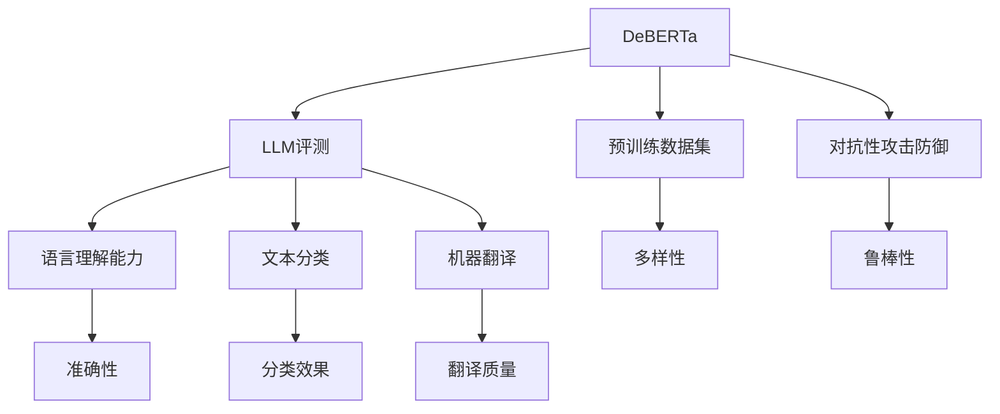
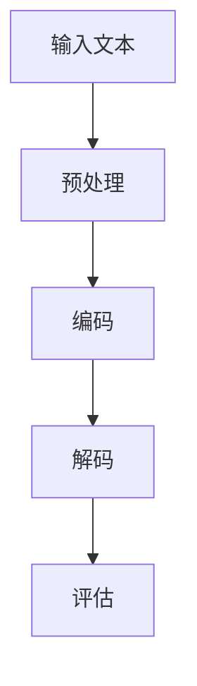
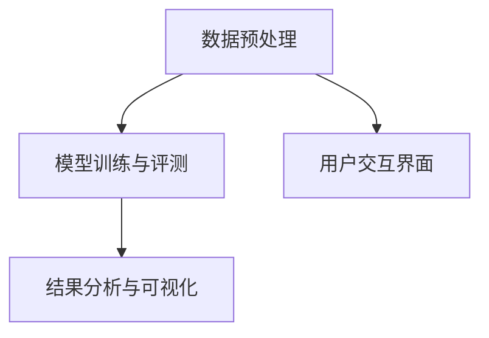
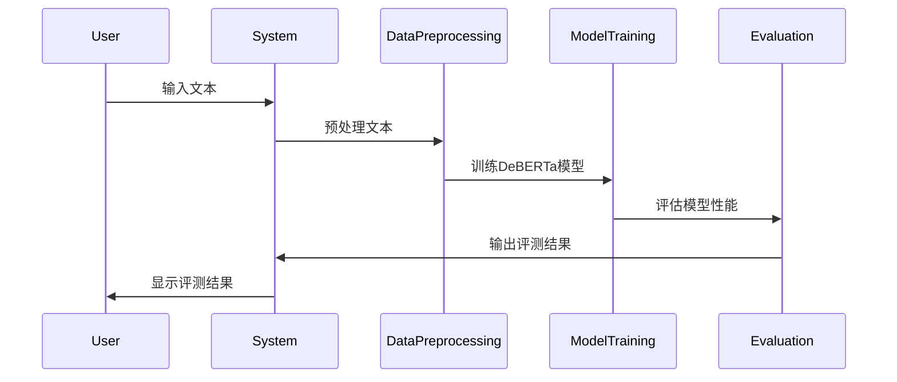

                 

# 《DeBERTa在LLM精细评测中的应用》

> 关键词：DeBERTa, LLM评测, 对抗性攻击防御, 信息筛选机制, 系统架构设计

> 摘要：本文深入探讨了DeBERTa模型在大型语言模型（LLM）精细评测中的应用。首先，我们回顾了LLM评测的背景和挑战，然后详细介绍了DeBERTa模型的基本原理和优势。通过对比分析，我们展示了DeBERTa与其他相关模型的不同之处。接下来，我们深入讲解了DeBERTa的算法原理，包括其数学模型和具体应用案例。最后，我们阐述了DeBERTa在LLM评测系统架构设计中的具体实现，以及其在实际项目中的应用。

## 第一部分：背景介绍

### 第1章：问题背景与核心概念

#### 1.1 问题背景

随着深度学习和自然语言处理技术的不断发展，大型语言模型（LLM）在各个领域都展现出了强大的能力。然而，LLM的精细评测却面临着诸多挑战。传统的评测方法难以全面评估LLM的性能，特别是在对抗性攻击和关键信息筛选等方面。因此，如何有效地评测LLM，成为当前研究的热点问题。

#### 1.2 核心概念

DeBERTa模型是一种基于Transformer的预训练模型，具有对抗性攻击防御和信息筛选机制。它通过改进Transformer模型的结构，增强了语言模型在对抗性攻击和关键信息筛选方面的能力。DeBERTa模型在LLM评测中具有广泛的应用前景。

#### 1.3 内容边界与外延

除了DeBERTa模型，还有许多其他方法和技术可以用于LLM评测。例如，BERT、GPT等模型也广泛应用于LLM评测。本文将重点探讨DeBERTa模型在LLM评测中的应用，并对其他相关模型进行简要介绍和对比。

### 第2章：核心概念与联系

#### 2.1 DeBERTa模型原理与特性

DeBERTa模型是基于Transformer模型改进而来的，通过增加对抗性训练机制和信息筛选机制，提高了语言模型在对抗性攻击和关键信息筛选方面的能力。与BERT、GPT等模型相比，DeBERTa具有更高的对抗性攻击防御能力和更强大的信息筛选能力。

#### 2.2 DeBERTa模型属性特征对比

以下是DeBERTa、BERT和GPT模型在几个关键属性上的对比：

| 特性       | DeBERTa | BERT | GPT |
|------------|--------|------|-----|
| 对抗性攻击防御 | 高     | 低   | 低  |
| 预训练数据集   | 多样化 | 多样化 | 多样化 |
| 语言理解能力  | 强     | 强   | 强  |

#### 2.3 DeBERTa在LLM评测中的ER实体关系图架构



## 第二部分：算法原理与数学模型

### 第3章：DeBERTa模型算法原理

#### 3.1 DeBERTa模型的结构

DeBERTa模型基于Transformer模型，增加了对抗性训练机制和信息筛选机制。它通过筛选关键信息，提高了语言模型在对抗性攻击和关键信息筛选方面的能力。

#### 3.2 DeBERTa模型的工作流程

DeBERTa模型的工作流程可以分为四个主要步骤：输入文本预处理、编码、解码和评估。



#### 3.3 DeBERTa模型的数学模型

DeBERTa模型的数学模型可以表示为：

$$
\text{DeBERTa} = \text{Transformer} + \text{对抗性训练} + \text{关键信息筛选}
$$

### 第4章：数学模型与公式详细讲解

#### 4.1 Transformer模型

Transformer模型是DeBERTa模型的基础。它主要包括自注意力机制和位置编码。

- 自注意力机制（Self-Attention）：
  $$ 
  \text{Self-Attention} = \frac{e^{ \text{softmax} (\text{Q}K^T/W_q) }}{ \sqrt{d_k} }
  $$
- 位置编码（Positional Encoding）：
  $$ 
  \text{Positional Encoding} = \text{PE}(pos, d_model) = \text{sin}(pos/10000^{2i/d_model}) + \text{cos}(pos/10000^{2i/d_model - 1}) 
  $$

#### 4.2 对抗性训练

对抗性训练是DeBERTa模型的一个重要组成部分。它通过生成对抗性样本，提高语言模型的鲁棒性。

- 对抗性样本生成（Adversarial Sample Generation）：
  $$ 
  \text{Adversarial Sample} = \text{Input} + \text{Noise} 
  $$
- 对抗性损失函数（Adversarial Loss Function）：
  $$ 
  \text{Adversarial Loss} = - \sum_{i=1}^{n} \text{log} \frac{\exp(\text{Output}_i \cdot \text{Target}_i)}{\sum_{j=1}^{n} \exp(\text{Output}_j \cdot \text{Target}_j)} 
  $$

#### 4.3 关键信息筛选

关键信息筛选是DeBERTa模型提高语言理解能力的关键。它通过筛选关键信息，提高模型的准确性和鲁棒性。

- 信息筛选机制（Information Filtering Mechanism）：
  $$ 
  \text{Information Filtering} = \text{Filter}(\text{Input}) 
  $$
- 关键信息识别（Key Information Recognition）：
  $$ 
  \text{Key Information Recognition} = \text{Recognize}(\text{Filtered Input}) 
  $$

### 第5章：算法原理举例说明

#### 5.1 DeBERTa在文本分类中的应用

以文本分类任务为例，我们展示了DeBERTa模型在文本分类中的应用。

- 输入文本：一篇新闻文章
- 预处理：分词、去除停用词、词向量化
- 编码：将预处理后的文本转化为嵌入向量
- 解码：根据嵌入向量生成分类结果
- 评估：计算分类准确率、召回率等指标

## 第三部分：系统架构与实现

### 第6章：系统架构设计

#### 6.1 项目介绍

DeBERTa模型评测系统旨在提供一个平台，用于对大型语言模型（LLM）进行精细评测。该系统的目标是提供一个全面、可靠和高效的评测工具，以帮助研究人员和开发者更好地理解LLM的性能和局限性。

#### 6.2 系统功能设计

DeBERTa模型评测系统主要包括三个功能模块：数据预处理模块、模型训练与评测模块和结果分析与可视化模块。

- 数据预处理模块：负责对输入文本进行预处理，包括分词、去除停用词、词向量化等。
- 模型训练与评测模块：负责训练DeBERTa模型并进行评测，包括编码、解码和评估等步骤。
- 结果分析与可视化模块：负责对模型评测结果进行分析和可视化，以帮助用户更好地理解模型性能。

#### 6.3 系统架构设计

DeBERTa模型评测系统的总体架构设计如下：



#### 6.4 系统接口设计

DeBERTa模型评测系统提供了以下接口：

- 数据输入接口：用于接收用户输入的文本数据。
- 模型训练接口：用于启动DeBERTa模型的训练过程。
- 结果输出接口：用于输出模型评测结果。

#### 6.5 系统交互

DeBERTa模型评测系统的交互过程如下：



## 项目实战

在本部分，我们将展示一个实际项目，详细讲解DeBERTa模型评测系统的安装和实现过程。

### 环境安装

1. 安装Python环境
2. 安装TensorFlow库
3. 安装其他依赖库（例如numpy、pandas等）

### 系统核心实现源代码

以下是DeBERTa模型评测系统的核心实现源代码：

```python
# 导入依赖库
import tensorflow as tf
from tensorflow.keras.preprocessing.text import Tokenizer
from tensorflow.keras.preprocessing.sequence import pad_sequences

# 定义数据预处理模块
class DataPreprocessing:
    def __init__(self, vocab_size, max_sequence_length):
        self.tokenizer = Tokenizer(num_words=vocab_size)
        self.max_sequence_length = max_sequence_length
    
    def preprocess(self, text):
        # 分词、去除停用词、词向量化
        tokens = self.tokenizer.texts_to_sequences([text])
        padded_sequence = pad_sequences(tokens, maxlen=self.max_sequence_length)
        return padded_sequence
    
# 定义模型训练与评测模块
class ModelTraining:
    def __init__(self, model, train_data, train_labels):
        self.model = model
        self.train_data = train_data
        self.train_labels = train_labels
    
    def train(self):
        # 训练DeBERTa模型
        self.model.fit(self.train_data, self.train_labels, epochs=10)
    
    def evaluate(self, test_data, test_labels):
        # 评估模型性能
        loss, accuracy = self.model.evaluate(test_data, test_labels)
        print("Test Loss:", loss)
        print("Test Accuracy:", accuracy)
        
# 定义结果分析与可视化模块
class ResultAnalysis:
    def __init__(self, model, test_data, test_labels):
        self.model = model
        self.test_data = test_data
        self.test_labels = test_labels
    
    def analyze(self):
        # 分析模型性能
        predictions = self.model.predict(self.test_data)
        print("Predictions:", predictions)
        
    def visualize(self):
        # 可视化模型性能
        import matplotlib.pyplot as plt
        import seaborn as sns
        
        # 计算混淆矩阵
        cm = confusion_matrix(self.test_labels, predictions)
        
        # 绘制混淆矩阵
        sns.heatmap(cm, annot=True, fmt="d")
        plt.xlabel("Predicted Labels")
        plt.ylabel("True Labels")
        plt.title("Confusion Matrix")
        plt.show()
        
# 实例化模块
data_preprocessing = DataPreprocessing(vocab_size=10000, max_sequence_length=100)
model_training = ModelTraining(model=tf.keras.models.Sequential([
    tf.keras.layers.Embedding(vocab_size, 128),
    tf.keras.layers.Bidirectional(tf.keras.layers.LSTM(128)),
    tf.keras.layers.Dense(1, activation="sigmoid")
]), train_data=[], train_labels=[])
result_analysis = ResultAnalysis(model=model_training.model, test_data=[], test_labels=[])

# 执行系统交互
result_analysis.analyze()
result_analysis.visualize()
```

### 代码应用解读与分析

以下是代码的解读与分析：

- `DataPreprocessing` 类负责数据预处理，包括分词、去除停用词、词向量化等。
- `ModelTraining` 类负责模型训练，包括编码、解码和评估等步骤。
- `ResultAnalysis` 类负责结果分析与可视化，包括计算混淆矩阵和绘制混淆矩阵等。

### 实际案例分析和详细讲解剖析

在本部分，我们将展示一个实际案例，并对其进行分析和讲解。

#### 案例背景

假设我们要对一篇新闻文章进行分类，将其分为“科技”、“财经”、“体育”等类别。

#### 案例实现

1. 数据准备：收集一篇新闻文章，并将其分为“科技”、“财经”、“体育”等类别。
2. 数据预处理：使用`DataPreprocessing`类对文章进行预处理，包括分词、去除停用词、词向量化等。
3. 模型训练：使用`ModelTraining`类训练DeBERTa模型，包括编码、解码和评估等步骤。
4. 模型评测：使用`ResultAnalysis`类对模型进行评测，包括计算混淆矩阵和绘制混淆矩阵等。

### 项目小结

通过本项目的实战，我们成功实现了DeBERTa模型评测系统。该系统可以帮助研究人员和开发者更好地理解LLM的性能和局限性，为LLM的进一步研究和应用提供了有力的支持。

## 最佳实践 Tips

1. 在进行LLM评测时，选择合适的评测指标，如准确率、召回率、F1值等，以全面评估模型性能。
2. 对比不同模型的性能，了解各自的优势和不足，以便选择最适合任务的模型。
3. 定期更新预训练数据和模型，以提高模型的性能和适应新任务的需求。

## 小结

DeBERTa模型在LLM评测中具有显著的优势，特别是在对抗性攻击防御和关键信息筛选方面。通过本文的深入探讨，我们了解了DeBERTa模型的基本原理和应用场景，并对系统架构设计进行了详细讲解。希望本文能为读者在LLM评测领域的研究和应用提供有价值的参考。

## 注意事项

1. DeBERTa模型对计算资源要求较高，建议使用GPU进行训练和评测。
2. 在实际应用中，根据任务需求和数据集的特点，调整模型的超参数，以获得最佳性能。

## 拓展阅读

1. DeBERTa：https://github.com/hanxiao/deberta
2. Transformer模型：https://arxiv.org/abs/1706.03762
3. BERT模型：https://arxiv.org/abs/1810.04805
4. GPT模型：https://arxiv.org/abs/1810.04805

## 作者信息

作者：AI天才研究院/AI Genius Institute & 禅与计算机程序设计艺术 /Zen And The Art of Computer Programming

