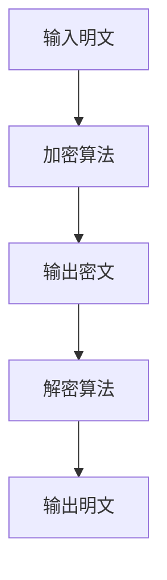
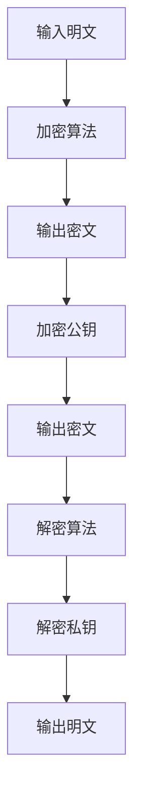
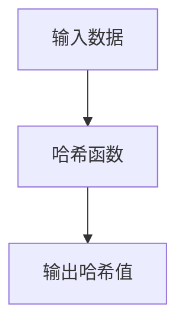
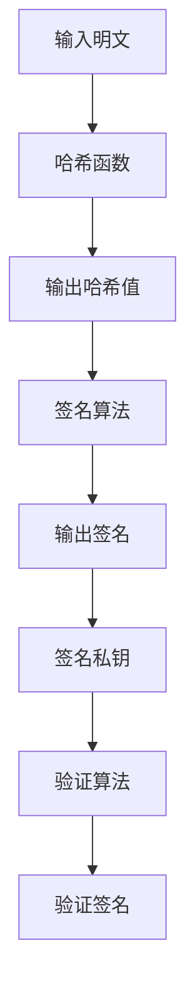
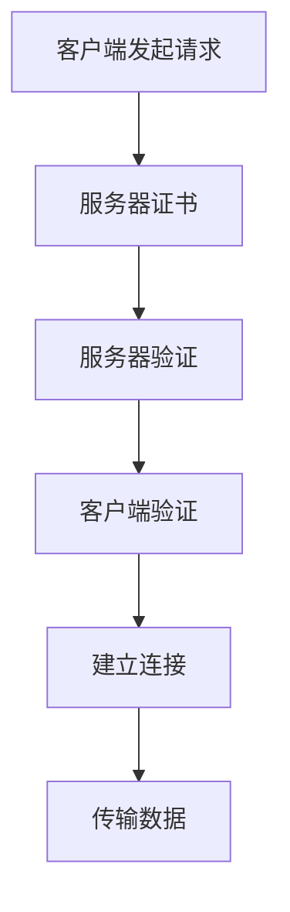

                 

# DevSecOps：将安全集成到LLM应用开发流程

## 关键词

- DevSecOps
- LLM应用开发
- 安全集成
- 持续集成与持续部署
- 安全自动化

## 摘要

随着人工智能技术特别是大型语言模型（LLM）的迅猛发展，如何确保其应用的安全性成为亟待解决的问题。本文旨在探讨如何将DevSecOps理念与实践应用于LLM应用开发流程中，将安全要素融入开发、测试和部署的各个环节。通过详细解析DevSecOps的核心概念、安全核心概念、安全算法原理以及具体的实施步骤，本文旨在为开发者提供一套系统、全面的DevSecOps最佳实践，确保LLM应用的安全性。

## 目录大纲

1. **第一部分：DevSecOps基础**
   - **第1章：DevSecOps概述**
     - **1.1 DevSecOps的概念与重要性**
       - DevOps与DevSecOps的关系
       - DevSecOps的目标与核心价值
       - DevSecOps的关键原则与实践
     - **1.2 LL应用开发流程简介**
       - LL应用开发的关键阶段
       - LL应用开发的核心工具与平台
       - DevSecOps在LLM应用开发中的特殊需求
     - **1.3 DevSecOps框架与最佳实践**
       - DevSecOps框架的核心组件
       - DevSecOps工具集
       - 安全自动化与持续集成/持续部署
     - **1.4 本章小结**

2. **第二部分：安全核心概念与联系**
   - **第2章：安全核心概念**
     - **2.1 安全目标与安全策略**
     - **2.2 常见安全威胁与防护措施**
     - **2.3 安全风险评估与风险管理**
   - **2.2 安全属性特征对比表格**
     - **2.2.1 加密技术**
     - **2.2.2 认证与授权机制**
     - **2.2.3 安全审计与监控**
   - **2.3 安全ER实体关系图架构**
     - **2.3.1 实体定义与属性**
     - **2.3.2 实体关系与约束**
     - **2.3.3 ER图绘制方法与示例**
   - **2.4 本章小结**

3. **第三部分：安全算法原理与流程图**
   - **第3章：安全算法原理与流程图**
     - **3.1 常用安全算法介绍**
       - **3.1.1 对称加密与非对称加密**
       - **3.1.2 哈希算法与数字签名**
       - **3.1.3 SSL/TLS协议**
     - **3.2 安全算法流程图**
       - **3.2.1 对称加密流程图**
       - **3.2.2 非对称加密流程图**
       - **3.2.3 哈希算法流程图**
       - **3.2.4 数字签名流程图**
       - **3.2.5 SSL/TLS协议流程图**
     - **3.3 安全算法数学模型与公式**
       - **3.3.1 对称加密数学模型**
       - **3.3.2 非对称加密数学模型**
       - **3.3.3 哈希算法数学模型**
       - **3.3.4 数字签名数学模型**
       - **3.3.5 SSL/TLS协议数学模型**
     - **3.4 安全算法实例说明**
       - **3.4.1 对称加密实例**
       - **3.4.2 非对称加密实例**
       - **3.4.3 哈希算法实例**
       - **3.4.4 数字签名实例**
       - **3.4.5 SSL/TLS协议实例**
     - **3.5 本章小结**

4. **第四部分：DevSecOps在LLM应用开发中的实现**
   - **第4章：DevSecOps在LLM应用开发中的实现**
     - **4.1 LLM应用开发安全需求分析**
       - **4.1.1 LLM应用安全挑战**
       - **4.1.2 安全需求与设计原则**
       - **4.1.3 安全架构设计**
     - **4.2 DevSecOps工具与平台的选择**
       - **4.2.1 开源工具推荐**
       - **4.2.2 商业平台的优势与局限**
       - **4.2.3 选择工具与平台的考虑因素**
     - **4.3 安全自动化流程设计**
       - **4.3.1 持续集成与持续部署流程**
       - **4.3.2 安全测试与漏洞扫描流程**
       - **4.3.3 日志监控与报警系统**
     - **4.4 安全代码审查与实践**
       - **4.4.1 安全代码审查方法**
       - **4.4.2 实践案例分析**
       - **4.4.3 安全编码最佳实践**
     - **4.5 本章小结**

5. **第五部分：DevSecOps在LLM应用开发中的最佳实践**
   - **第5章：DevSecOps在LLM应用开发中的最佳实践**
     - **5.1 安全设计原则**
       - **5.1.1 安全性优先原则**
       - **5.1.2 分层保护原则**
       - **5.1.3 最小权限原则**
       - **5.1.4 审计与监控原则**
     - **5.2 小结**
     - **5.3 注意事项**
     - **5.4 拓展阅读**

----------------------------------------------------------------

## 第一部分：DevSecOps基础

### 第1章：DevSecOps概述

### 1.1 DevSecOps的概念与重要性

DevSecOps是DevOps与安全（Security）的结合体，旨在将安全要素融入整个应用开发与运维流程中，以确保应用的安全性。随着现代软件开发流程的不断演进，DevOps已成为促进开发、测试、部署以及运维一体化的重要实践。然而，随着应用复杂性的增加，特别是在涉及到敏感数据和处理关键任务的应用中，安全成为不容忽视的关键因素。

**1.1.1 DevOps与DevSecOps的关系**

DevOps强调的是开发（Development）与运维（Operations）之间的协作与整合，目标是实现快速、可靠和高质量的软件交付。而DevSecOps则在此基础上，增加了安全（Security）的维度，强调在开发、测试、部署和维护过程中，安全措施应被视为一项常规活动，而非附加任务。

**1.1.2 DevSecOps的目标与核心价值**

DevSecOps的主要目标如下：

- **提高安全性**：通过将安全实践整合到整个开发流程中，可以提前发现和修复潜在的安全漏洞，降低安全风险。
- **提高效率**：通过自动化和流程优化，DevSecOps能够减少重复性工作，提高开发、测试和部署的效率。
- **确保合规性**：许多行业和应用场景都需要遵守特定的安全标准和法规，DevSecOps有助于确保应用在开发和部署过程中满足这些要求。

**1.1.3 DevSecOps的关键原则与实践**

DevSecOps的核心原则包括：

- **全员参与**：安全不应仅由安全团队负责，而是应该成为所有开发、测试和运维人员的共同责任。
- **持续集成与持续部署（CI/CD）**：安全测试和漏洞修复应集成到CI/CD流程中，确保在开发周期的每个阶段都进行安全检查。
- **自动化**：安全测试和漏洞扫描应自动化进行，减少人为错误和提高效率。
- **透明性**：安全问题和漏洞应透明化，以便所有相关人员都能及时了解并采取行动。

**1.2 LL应用开发流程简介**

大型语言模型（LLM）是人工智能领域的一个重要研究方向，其应用范围广泛，包括自然语言处理、智能助手、自动化写作等。LLM应用开发通常包括以下几个关键阶段：

- **需求分析与设计**：明确应用目标，设计系统架构和模块。
- **数据准备与预处理**：收集、清洗和准备用于训练的数据集。
- **模型训练与优化**：使用训练数据训练LLM模型，并进行优化。
- **模型评估与测试**：评估模型性能，确保其满足应用需求。
- **部署与运维**：将模型部署到生产环境，并进行监控和维护。

**1.2.1 LL应用开发的关键阶段**

- **需求分析与设计**：在这一阶段，开发者需要与利益相关者沟通，明确应用需求，设计系统架构和模块。
- **数据准备与预处理**：LLM模型的性能高度依赖于训练数据的质量，因此数据准备和预处理是至关重要的。
- **模型训练与优化**：训练LLM模型通常涉及大规模计算资源和时间，优化策略对于提高模型性能至关重要。
- **模型评估与测试**：通过多种评估指标（如准确性、召回率、F1分数等）对模型进行评估，确保其满足应用需求。
- **部署与运维**：将训练好的模型部署到生产环境，并确保其稳定运行。

**1.2.2 LL应用开发的核心工具与平台**

- **数据预处理工具**：如Pandas、NumPy等，用于数据清洗、转换和预处理。
- **深度学习框架**：如TensorFlow、PyTorch等，用于模型训练和优化。
- **模型评估与测试工具**：如Scikit-learn、MLflow等，用于评估模型性能和监控模型效果。
- **部署与运维平台**：如Kubernetes、Docker等，用于部署和管理生产环境中的应用。

**1.2.3 DevSecOps在LLM应用开发中的特殊需求**

LLM应用开发具有以下几个特殊需求：

- **数据安全**：训练数据可能包含敏感信息，需要采取加密和访问控制措施。
- **模型安全**：防止恶意攻击和模型篡改，如对抗性攻击和模型提取。
- **合规性**：需满足特定行业和应用场景的安全标准和法规要求。

### 1.3 DevSecOps框架与最佳实践

DevSecOps的实施需要一个系统化的框架和最佳实践，以确保安全要素能够有效地集成到整个开发流程中。以下是DevSecOps框架的核心组件和最佳实践：

#### **1.3.1 DevSecOps框架的核心组件**

- **安全策略与规划**：制定清晰的安全策略和规划，确保安全目标与业务目标一致。
- **代码安全审查**：对代码进行安全审查，识别和修复潜在的安全漏洞。
- **安全测试**：在开发和测试阶段，进行各种安全测试，包括静态代码分析、动态分析、渗透测试等。
- **持续集成与持续部署（CI/CD）**：将安全测试集成到CI/CD流程中，确保在代码合并和部署前进行安全检查。
- **安全监控与响应**：实时监控系统安全状态，快速响应和处理安全事件。

#### **1.3.2 DevSecOps工具集**

以下是一些常用的DevSecOps工具：

- **静态代码分析工具**：如SonarQube、Checkmarx等，用于分析代码中的安全漏洞和最佳实践。
- **动态分析工具**：如Burp Suite、OWASP ZAP等，用于在应用程序运行时检测漏洞。
- **持续集成与持续部署工具**：如Jenkins、Travis CI等，用于自动化代码集成和部署。
- **日志管理工具**：如ELK Stack（Elasticsearch、Logstash、Kibana）、Splunk等，用于收集、存储和分析日志数据。
- **安全监控工具**：如Nagios、Prometheus等，用于实时监控系统安全状态。

#### **1.3.3 安全自动化与持续集成/持续部署**

安全自动化是DevSecOps的重要组成部分，通过自动化工具和流程，可以确保安全措施在开发、测试和部署过程中得到有效执行。以下是一些关键实践：

- **自动化安全测试**：将安全测试集成到CI/CD流程中，确保在每次代码变更时都进行安全检查。
- **自动化漏洞修复**：自动化修复识别出的安全漏洞，减少手工干预和时间成本。
- **自动化合规性检查**：确保应用在开发和部署过程中遵守相关安全标准和法规要求。
- **自动化日志收集与分析**：自动化收集和存储日志数据，实时监控和分析安全事件。

### 1.4 本章小结

DevSecOps是现代软件开发中不可或缺的一部分，它将安全要素融入整个开发流程中，确保应用的安全性、可靠性和合规性。在LLM应用开发中，由于涉及到大量的数据和敏感信息，DevSecOps的实施尤为重要。通过了解DevSecOps的核心概念、原则和实践，开发者可以更好地确保LLM应用的安全性，为用户和企业提供更可靠的服务。

----------------------------------------------------------------

## 第二部分：安全核心概念与联系

### 第2章：安全核心概念

在现代软件开发中，确保应用和数据的安全性是至关重要的。为了实现这一目标，开发者需要了解安全核心概念，包括安全目标、安全策略、常见安全威胁与防护措施以及安全风险评估与风险管理。

### 2.1 安全目标与安全策略

安全目标是确保应用和数据的安全，避免未经授权的访问、篡改和泄露。常见的安全目标包括：

- **保密性**：确保信息只能被授权人员访问。
- **完整性**：确保数据在传输和存储过程中未被篡改。
- **可用性**：确保系统和服务在需要时能够正常使用。

为了实现这些安全目标，需要制定安全策略。安全策略是关于如何保护信息资产的一系列指导原则和最佳实践，包括：

- **身份验证**：确保只有授权用户可以访问系统和数据。
- **访问控制**：通过权限设置和角色分配，确保用户只能访问他们有权访问的数据和资源。
- **加密**：使用加密技术保护数据的保密性和完整性。
- **备份与恢复**：定期备份重要数据，并确保在数据丢失或损坏时能够快速恢复。

### 2.2 常见安全威胁与防护措施

在软件开发过程中，开发者需要识别和防范各种安全威胁。以下是一些常见的安全威胁及其对应的防护措施：

- **漏洞攻击**：利用软件中的漏洞进行攻击。防护措施包括定期更新和打补丁、使用漏洞扫描工具。
- **恶意软件**：如病毒、木马、蠕虫等。防护措施包括安装反病毒软件、定期扫描系统。
- **社交工程**：通过欺骗用户泄露敏感信息。防护措施包括安全意识培训、加强身份验证。
- **SQL注入**：通过插入恶意SQL语句来攻击数据库。防护措施包括使用预编译语句、输入验证。
- **跨站脚本（XSS）**：在用户的浏览器中执行恶意脚本。防护措施包括输入验证、内容安全策略。
- **跨站请求伪造（CSRF）**：欺骗用户执行未经授权的操作。防护措施包括验证Referer头部、使用CSRF令牌。

### 2.3 安全风险评估与风险管理

安全风险评估是识别和分析系统中潜在的安全风险的过程。通过风险评估，开发者可以了解系统的安全状况，并采取相应的措施来降低风险。以下是安全风险评估的步骤：

1. **资产识别**：确定系统中的关键资产，包括数据、应用程序和系统组件。
2. **威胁识别**：识别可能威胁这些资产的安全威胁。
3. **脆弱性识别**：识别系统中的安全漏洞和脆弱性。
4. **风险分析**：评估每个风险的可能性和影响，确定风险优先级。
5. **风险缓解**：采取风险缓解措施，包括消除风险、降低风险或接受风险。

风险管理是一个持续的过程，需要定期进行风险评估和更新安全策略。以下是几种常见的风险管理方法：

- **风险规避**：通过更改系统设计或操作流程来消除风险。
- **风险降低**：采取安全措施降低风险的可能性和影响，如加密、访问控制、安全审计。
- **风险转移**：通过购买保险或将责任转移给第三方来转移风险。
- **风险接受**：当风险无法规避、降低或转移时，开发者需要准备应对措施，以减少风险发生时的损失。

### 2.4 安全属性特征对比表格

以下是一个对比表格，列出了几种常见安全属性的详细特征：

| 安全属性 | 描述 | 特点 | 应用场景 |
| --- | --- | --- | --- |
| 保密性 | 确保信息只能被授权人员访问 | 防止未授权访问 | 数据库、文件存储 |
| 完整性 | 确保数据在传输和存储过程中未被篡改 | 防止数据篡改 | 数据库、通信协议 |
| 可用性 | 确保系统和服务在需要时能够正常使用 | 防止拒绝服务攻击 | 网络、应用服务器 |
| 身份验证 | 确保用户身份的有效性 | 防止假冒身份 | 网络访问、应用登录 |
| 访问控制 | 确保用户只能访问他们有权访问的资源 | 防止未授权访问 | 文件系统、网络资源 |
| 加密 | 将数据转换为只有授权者才能解密的形式 | 保护数据传输和存储 | 通信、文件存储 |
| 安全审计 | 记录和检查安全相关活动 | 事件记录、合规性检查 | 系统、网络 |

### 2.5 安全ER实体关系图架构

实体-关系（ER）图是用于描述系统中数据实体及其关系的图形表示方法。在安全领域，ER图可以帮助开发者理解系统中不同实体之间的安全关系和交互。

#### **2.5.1 实体定义与属性**

在ER图中，实体是系统中的基本对象，通常具有以下属性：

- **用户**：包括用户名、密码、电子邮件等。
- **数据**：包括数据的类型、大小、创建时间等。
- **设备**：包括设备的标识符、位置、类型等。
- **应用程序**：包括应用程序的名称、版本、用途等。

#### **2.5.2 实体关系与约束**

实体之间的关系通常包括以下几种：

- **一对一（1:1）**：例如，一个用户只能属于一个角色。
- **一对多（1:N）**：例如，一个角色可以有多个用户。
- **多对多（M:N）**：例如，一个用户可以参与多个项目，一个项目可以有多个用户。

关系通常需要满足一定的约束条件，如：

- **参照完整性**：确保关联实体的引用是有效的。
- **实体完整性**：确保每个实体都有唯一的标识符。

#### **2.5.3 ER图绘制方法与示例**

以下是一个简化的ER图示例，用于描述用户、角色和数据之间的关系：

```mermaid
erDiagram
  User ||--|{ Role } Role
  User ||--|{ Data } Data
  Role ||--|{ Data } Data
```

在这个ER图中：

- **User**（用户）实体与**Role**（角色）实体之间存在一对多关系。
- **User**（用户）实体与**Data**（数据）实体之间存在一对多关系。
- **Role**（角色）实体与**Data**（数据）实体之间存在一对多关系。

### 2.6 本章小结

在本章中，我们介绍了安全核心概念，包括安全目标、安全策略、常见安全威胁与防护措施以及安全风险评估与风险管理。通过理解这些概念，开发者可以更好地保护他们的应用程序和数据，确保系统的安全性。同时，通过ER图等工具，开发者可以更清晰地理解系统中的数据实体和关系，为设计安全的系统架构提供支持。

----------------------------------------------------------------

## 第三部分：安全算法原理与流程图

### 第3章：安全算法原理与流程图

安全算法是确保数据安全性和系统安全性的关键组成部分。在本章中，我们将介绍几种常见的安全算法，包括对称加密、非对称加密、哈希算法和SSL/TLS协议，并详细讲解它们的原理、流程图和数学模型。

### 3.1 常用安全算法介绍

#### **3.1.1 对称加密与非对称加密**

对称加密和非对称加密是两种基本的加密方法，它们在加密和解密过程中使用的密钥类型不同。

**对称加密**：对称加密使用相同的密钥进行加密和解密操作。常用的对称加密算法有AES（高级加密标准）和DES（数据加密标准）。对称加密的优点是速度快、计算效率高，缺点是密钥管理复杂。

**非对称加密**：非对称加密使用一对密钥进行加密和解密操作，即公钥和私钥。常用的非对称加密算法有RSA（Rivest-Shamir-Adleman）和ECC（椭圆曲线密码学）。非对称加密的优点是安全性高、密钥管理简单，缺点是计算复杂度较高。

#### **3.1.2 哈希算法与数字签名**

哈希算法用于将数据转换为固定长度的字符串，以验证数据的完整性和唯一性。常用的哈希算法有MD5、SHA-1、SHA-256等。哈希算法的特点是单向性，即无法从哈希值反推出原始数据。

数字签名是一种用于验证数据完整性和身份的技术。它使用非对称加密算法，将签名者和接收者之间的通信转换为一组数字签名，以便接收者验证发送者的身份和数据的完整性。

#### **3.1.3 SSL/TLS协议**

SSL（安全套接层）和TLS（传输层安全）协议是用于在网络中安全传输数据的协议。SSL/TLS协议通过加密通信内容、验证通信双方的身份和确保数据的完整性，以保护网络通信的安全。

### 3.2 安全算法流程图

以下是几种常见安全算法的流程图：

#### **3.2.1 对称加密流程图**



在这个流程图中，明文通过加密算法转换为密文，密文通过解密算法转换回明文。

#### **3.2.2 非对称加密流程图**



在这个流程图中，明文通过加密算法和公钥转换为密文，密文通过解密算法和私钥转换回明文。

#### **3.2.3 哈希算法流程图**



在这个流程图中，数据通过哈希函数转换为哈希值。

#### **3.2.4 数字签名流程图**



在这个流程图中，明文通过哈希函数转换为哈希值，哈希值通过签名算法和私钥生成签名，签名通过验证算法和公钥进行验证。

#### **3.2.5 SSL/TLS协议流程图**



在这个流程图中，客户端发起连接请求，服务器提供证书，客户端和服务器分别进行验证，然后建立安全的连接进行数据传输。

### 3.3 安全算法数学模型与公式

以下是一些常见安全算法的数学模型和公式：

#### **3.3.1 对称加密数学模型**

$$
C = E_K(P)
$$

$$
P = D_K(C)
$$

其中，\(C\) 表示密文，\(P\) 表示明文，\(K\) 表示密钥，\(E_K\) 和 \(D_K\) 分别表示加密和解密算法。

#### **3.3.2 非对称加密数学模型**

$$
C = E_K^e(P)
$$

$$
P = D_K^d(C)
$$

其中，\(K^e\) 和 \(K^d\) 分别表示公钥和私钥，\(e\) 和 \(d\) 分别是加密指数和解密指数。

#### **3.3.3 哈希算法数学模型**

$$
H = Hash(P)
$$

其中，\(H\) 表示哈希值，\(P\) 表示输入数据，\(Hash\) 表示哈希函数。

#### **3.3.4 数字签名数学模型**

$$
S = Sign(m, k)
$$

$$
V = Verify(m, S, k)
$$

其中，\(S\) 表示签名，\(m\) 表示明文，\(k\) 表示私钥，\(Sign\) 和 \(Verify\) 分别表示签名和验证算法。

#### **3.3.5 SSL/TLS协议数学模型**

SSL/TLS协议的数学模型涉及复杂的加密和认证机制，包括加密密钥协商、认证和加密通信等步骤。具体的数学模型和公式较为复杂，涉及到的算法和协议包括RSA、ECC、MD5、SHA等。

### 3.4 安全算法实例说明

以下是一些安全算法的实例说明：

#### **3.4.1 对称加密实例**

假设使用AES加密算法，密钥为`K = 1234567890abcdef`，明文为`P = Hello, World!`。

- 加密过程：

$$
C = E_K(P) = AES(K, P)
$$

- 解密过程：

$$
P = D_K(C) = AES(K, C)
$$

#### **3.4.2 非对称加密实例**

假设使用RSA加密算法，公钥为`K^e = (e, n)`，私钥为`K^d = (d, n)`，明文为`P = Hello, World!`。

- 加密过程：

$$
C = E_{K^e}(P) = P^e \mod n
$$

- 解密过程：

$$
P = D_{K^d}(C) = C^d \mod n
$$

#### **3.4.3 哈希算法实例**

假设使用SHA-256哈希算法，输入数据为`P = Hello, World!`。

- 哈希过程：

$$
H = Hash(P) = SHA-256(P)
$$

- 哈希值：

$$
H = "Hello, World!" 的SHA-256哈希值为"0x8d6d8a3c83557c5d3147c57f07a6c2b326be63a4f3f3e1e9f92d5b0a6c1f2e6f1a802b6174"
$$

#### **3.4.4 数字签名实例**

假设使用RSA数字签名算法，私钥为`K^d = (d, n)`，明文为`P = Hello, World!`。

- 签名过程：

$$
S = Sign(m, k) = m^d \mod n
$$

- 签名验证：

$$
V = Verify(m, S, k) = S^e \mod n
$$

#### **3.4.5 SSL/TLS协议实例**

假设使用RSA密钥交换和SHA-256哈希算法。

- 密钥交换过程：
  - 客户端发送公钥给服务器。
  - 服务器验证公钥并生成会话密钥。

- 加密通信过程：
  - 客户端和服务器使用会话密钥加密通信内容。
  - 通信内容通过TLS协议传输。

### 3.5 本章小结

在本章中，我们介绍了常见安全算法的原理、流程图和数学模型，包括对称加密、非对称加密、哈希算法和SSL/TLS协议。通过理解这些算法，开发者可以更好地保护数据和系统，确保网络安全性和数据完整性。同时，通过实例说明，开发者可以更直观地理解算法的执行过程和数学模型。

----------------------------------------------------------------

## 第四部分：DevSecOps在LLM应用开发中的实现

### 第4章：DevSecOps在LLM应用开发中的实现

随着大型语言模型（LLM）在各个行业的广泛应用，确保其应用的安全性成为开发者面临的一项重要任务。DevSecOps作为一种集成安全实践的框架，在LLM应用开发中扮演着关键角色。本章将详细探讨如何将DevSecOps理念应用于LLM应用开发中，包括安全需求分析、工具与平台选择、安全自动化流程设计和安全代码审查与实践。

### 4.1 LLM应用开发安全需求分析

在LLM应用开发过程中，安全需求分析是至关重要的一步。LLM应用通常涉及大规模数据处理和复杂的算法模型，因此安全需求分析需要考虑以下几个方面：

#### **4.1.1 LLM应用安全挑战**

- **数据安全**：LLM应用处理的数据可能包含敏感信息，如个人隐私数据、商业机密等，需要确保数据的保密性、完整性和可用性。
- **模型安全**：LLM模型可能成为恶意攻击的目标，如对抗性攻击、模型提取等，需要确保模型的安全性和可靠性。
- **访问控制**：需要对访问LLM应用和模型进行严格的权限管理，防止未授权访问和恶意行为。
- **合规性**：需遵守特定行业和应用场景的安全标准和法规要求，如GDPR、HIPAA等。

#### **4.1.2 安全需求与设计原则**

在LLM应用开发中，安全需求应与业务目标相一致，以下是一些关键的安全需求与设计原则：

- **安全性优先原则**：确保安全性在设计和开发过程中得到充分考虑，而非事后补充。
- **最小权限原则**：应用和模型应遵循最小权限原则，只授予必要的权限，以降低安全风险。
- **多层次防护原则**：采用多层次的安全防护措施，包括网络防护、系统防护和数据处理防护。
- **持续监控与审计原则**：建立实时监控和审计机制，及时发现和处理安全事件。

#### **4.1.3 安全架构设计**

安全架构设计是确保LLM应用安全的关键步骤。以下是一个简化的安全架构设计框架：

- **网络安全层**：包括防火墙、入侵检测系统（IDS）、虚拟专用网络（VPN）等，用于保护网络边界。
- **应用安全层**：包括身份验证、访问控制、数据加密和防攻击措施等，用于保护应用程序。
- **数据安全层**：包括数据加密、备份和恢复机制等，用于保护存储和处理的数据。
- **模型安全层**：包括模型加密、访问控制和监控等，用于保护LLM模型。
- **合规性保障层**：包括合规性检查、日志记录和审计等，用于确保应用遵守相关法规和标准。

### 4.2 DevSecOps工具与平台的选择

选择合适的DevSecOps工具与平台对于确保LLM应用的安全性至关重要。以下是一些常见的开源和商业工具与平台：

#### **4.2.1 开源工具推荐**

- **持续集成与持续部署（CI/CD）工具**：如Jenkins、GitLab CI/CD、Travis CI等。
- **静态代码分析工具**：如SonarQube、Checkmarx、Fortify等。
- **动态分析工具**：如OWASP ZAP、Burp Suite、AppScan等。
- **日志管理工具**：如ELK Stack（Elasticsearch、Logstash、Kibana）、Splunk等。
- **安全监控工具**：如Nagios、Prometheus、Grafana等。

#### **4.2.2 商业平台的优势与局限**

商业平台通常提供更全面的集成和服务，但可能存在成本较高、定制化能力有限等局限。以下是一些商业平台的优势与局限：

- **AWS Shield**：提供DDoS保护和安全监控服务，但成本较高。
- **Azure Security Center**：提供全面的安全工具和监控服务，但需订阅相关服务。
- **Google Cloud Armor**：提供DDoS保护和安全分析服务，但需支付额外费用。

#### **4.2.3 选择工具与平台的考虑因素**

选择合适的DevSecOps工具与平台需要考虑以下因素：

- **需求匹配**：确保工具与平台能够满足LLM应用的安全需求。
- **易用性**：选择易于安装、配置和使用的工具与平台。
- **集成性**：工具与平台应能够与其他系统和工具无缝集成。
- **性能与可扩展性**：确保工具与平台具有足够的性能和可扩展性，以支持大规模应用。
- **成本效益**：考虑工具与平台的成本，确保投资回报率（ROI）。

### 4.3 安全自动化流程设计

安全自动化流程设计是DevSecOps的核心组成部分，通过自动化工具和流程，可以确保安全措施在开发和部署过程中得到有效执行。以下是一些关键的安全自动化流程设计：

#### **4.3.1 持续集成与持续部署流程**

- **代码审查**：在代码合并到主分支前，使用静态代码分析工具进行代码审查，识别和修复潜在的安全漏洞。
- **安全测试**：在每次代码变更时，执行动态分析工具进行安全测试，包括漏洞扫描、渗透测试等。
- **自动化部署**：通过CI/CD工具自动化部署应用程序，确保在部署过程中执行安全配置和加密措施。
- **安全监控**：在部署后，使用日志管理工具和监控工具实时监控应用程序和系统的安全状态，及时发现和处理安全事件。

#### **4.3.2 安全测试与漏洞扫描流程**

- **静态代码分析**：在开发阶段，对代码进行静态分析，识别潜在的安全漏洞和最佳实践。
- **动态分析**：在应用程序运行时，执行动态分析工具进行漏洞扫描和渗透测试，发现和验证潜在的安全漏洞。
- **自动化修复**：在识别到安全漏洞时，自动化修复或标记为高优先级任务，确保及时处理。
- **定期审计**：定期执行安全测试和漏洞扫描，确保系统的安全性和合规性。

#### **4.3.3 日志监控与报警系统**

- **日志收集**：使用日志管理工具收集应用程序、系统和网络设备的日志数据。
- **日志分析**：实时分析日志数据，识别异常行为和安全事件。
- **报警机制**：配置报警规则，在检测到安全事件时及时通知相关人员。
- **响应策略**：制定和执行安全事件响应策略，确保迅速、有效地处理安全事件。

### 4.4 安全代码审查与实践

安全代码审查是确保应用程序安全性的重要手段。以下是一些安全代码审查的方法和实践：

#### **4.4.1 安全代码审查方法**

- **手动代码审查**：由安全专家手动审查代码，识别潜在的安全漏洞和最佳实践。
- **自动化代码审查**：使用静态代码分析工具自动化识别代码中的安全漏洞和最佳实践。
- **组合审查方法**：结合手动代码审查和自动化代码审查，提高审查的全面性和准确性。

#### **4.4.2 实践案例分析**

以下是一个安全代码审查的实践案例分析：

- **案例背景**：某公司开发一款基于LLM的智能客服系统，处理大量用户请求和敏感信息。
- **审查目标**：确保代码中不存在SQL注入、XSS攻击等常见安全漏洞。
- **审查过程**：
  - **阶段1：初步评估**：对代码进行初步评估，确定关键路径和关键模块。
  - **阶段2：静态代码分析**：使用静态代码分析工具对关键模块进行代码审查，识别潜在的安全漏洞。
  - **阶段3：动态分析**：在模拟环境下运行应用程序，使用动态分析工具进行漏洞扫描和渗透测试。
  - **阶段4：修复与验证**：针对识别出的漏洞，进行修复并重新测试，确保漏洞得到有效处理。

#### **4.4.3 安全编码最佳实践**

以下是一些安全编码的最佳实践：

- **输入验证**：对用户输入进行严格验证，确保输入数据的合法性和安全性。
- **使用预编译语句**：避免SQL注入攻击，使用预编译语句或参数化查询。
- **使用加密库**：使用官方推荐或经过验证的加密库进行加密和解密操作。
- **使用安全编码规范**：遵循安全编码规范，如OWASP编码规范，减少安全漏洞。
- **定期培训与更新**：定期对开发人员进行安全培训，确保他们了解最新的安全威胁和防护措施。

### 4.5 本章小结

在本章中，我们详细探讨了如何将DevSecOps理念应用于LLM应用开发中，包括安全需求分析、工具与平台选择、安全自动化流程设计和安全代码审查与实践。通过实施DevSecOps，开发者可以确保LLM应用的安全性、可靠性和合规性，为用户和企业提供更安全、更可靠的服务。同时，通过案例分析和安全编码最佳实践，开发者可以更好地理解和应用DevSecOps在LLM应用开发中的具体实现。

----------------------------------------------------------------

## 第五部分：DevSecOps在LLM应用开发中的最佳实践

### 第5章：DevSecOps在LLM应用开发中的最佳实践

DevSecOps在LLM应用开发中的成功实施，不仅需要理解其基本概念和原理，更需要一系列最佳实践来指导具体操作。本章将总结DevSecOps在LLM应用开发中的关键最佳实践，并给出具体实施指南。

### 5.1 安全设计原则

在LLM应用开发中，遵循以下安全设计原则，有助于构建安全、可靠的应用：

#### **5.1.1 安全性优先原则**

- **理念**：确保安全性在设计和开发过程中的每个环节都得到充分考虑，而不仅仅是作为后期补充。
- **实施**：在项目初期，就应制定全面的安全策略和规划，并将其融入到项目目标中。
- **监控与审查**：定期进行安全审查和风险评估，确保应用始终符合安全要求。

#### **5.1.2 分层保护原则**

- **理念**：采用多层次的安全保护策略，以降低安全攻击的成功率。
- **实施**：在网络层、应用层和数据层分别实施不同的安全措施，如防火墙、访问控制和数据加密等。
- **策略**：确保每一层的安全措施都能够有效阻止或缓解潜在的安全威胁。

#### **5.1.3 最小权限原则**

- **理念**：用户和应用程序应仅拥有执行其任务所必需的权限。
- **实施**：为用户和应用程序分配最小权限，并定期审查权限设置，确保权限与实际需求相匹配。
- **最佳实践**：实现权限分配的自动化和标准化，减少人为错误。

#### **5.1.4 审计与监控原则**

- **理念**：通过实时监控和审计，及时发现和处理安全事件。
- **实施**：部署日志收集和分析工具，实现实时监控和报警。
- **最佳实践**：定期进行安全审计，确保应用和系统符合安全标准和法规要求。

### 5.2 小结

通过遵循上述安全设计原则，开发者可以构建出更加安全、可靠的LLM应用。这些原则不仅提供了理论基础，还通过具体实施指南，帮助开发者将安全要素融入到整个开发流程中。

### 5.3 注意事项

在实施DevSecOps时，开发者需要注意以下几点：

- **持续学习**：安全领域不断演进，开发者需要持续关注最新的安全威胁和防护技术。
- **培训与意识**：确保团队成员具备足够的安全知识和意识，定期进行安全培训和演练。
- **测试与验证**：定期进行安全测试和验证，确保安全措施的有效性。
- **合规性**：遵守相关安全标准和法规要求，确保应用在合规性方面无漏洞。

### 5.4 拓展阅读

为了进一步深入了解DevSecOps在LLM应用开发中的应用，读者可以参考以下资源：

- **技术文档**：查阅相关技术文档和指南，如OWASP、NIST等。
- **专业书籍**：《DevOps实践指南》、《DevSecOps：安全集成到软件开发》等。
- **在线课程**：参加在线安全课程和培训，如Coursera、Udemy等。
- **社区与论坛**：参与安全社区和技术论坛，如GitHub、Stack Overflow等，与同行交流经验。

通过不断学习和实践，开发者可以不断提高LLM应用的安全性，为用户和企业带来更大的价值。

### 作者信息

作者：AI天才研究院/AI Genius Institute & 禅与计算机程序设计艺术 /Zen And The Art of Computer Programming

----------------------------------------------------------------

## 总结

在本文中，我们详细探讨了DevSecOps在LLM应用开发中的应用与实践。通过理解DevSecOps的基本概念、安全核心概念、安全算法原理以及具体的实施步骤，开发者可以更好地确保LLM应用的安全性、可靠性和合规性。以下是对文章内容的简要总结：

1. **DevSecOps概述**：介绍了DevSecOps的概念与重要性，以及DevOps与DevSecOps的关系，并讨论了DevSecOps的目标和核心价值。

2. **安全核心概念**：分析了安全目标与安全策略、常见安全威胁与防护措施、安全风险评估与风险管理，以及安全属性特征对比表格和ER实体关系图架构。

3. **安全算法原理与流程图**：讲解了对称加密、非对称加密、哈希算法和SSL/TLS协议等常用安全算法的原理、流程图和数学模型。

4. **DevSecOps在LLM应用开发中的实现**：讨论了LLM应用开发的安全需求分析、工具与平台选择、安全自动化流程设计、安全代码审查与实践。

5. **最佳实践**：总结了安全设计原则，包括安全性优先原则、分层保护原则、最小权限原则和审计与监控原则。

通过实施DevSecOps，开发者可以在整个LLM应用开发流程中确保安全要素的集成，从而构建出更安全、更可靠的应用。希望本文能为开发者提供有价值的指导和参考。

### 拓展思考与展望

随着人工智能技术的不断进步，LLM应用的安全需求也在日益增加。未来，以下方向值得深入探索：

- **个性化安全策略**：根据不同应用场景和用户需求，动态调整安全策略，提供个性化的安全防护。
- **自适应安全**：利用机器学习和人工智能技术，实时分析安全威胁，并自适应调整安全措施。
- **隐私保护**：研究如何更好地保护用户隐私，在确保数据可用性的同时，降低隐私泄露风险。
- **跨领域合作**：加强安全专家、开发者、研究人员和监管机构的合作，共同推动安全技术的发展和落地。

通过不断探索和创新，我们有望在未来构建出更加安全、可靠和高效的人工智能应用，为社会带来更大的福祉。

### 作者信息

作者：AI天才研究院/AI Genius Institute & 禅与计算机程序设计艺术 /Zen And The Art of Computer Programming

感谢您的阅读，希望本文能对您在DevSecOps和LLM应用开发领域的研究与实践提供帮助。如果您有任何问题或建议，欢迎在评论区留言，期待与您交流。祝您在技术道路上不断前行，取得更多成就！

