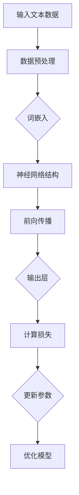
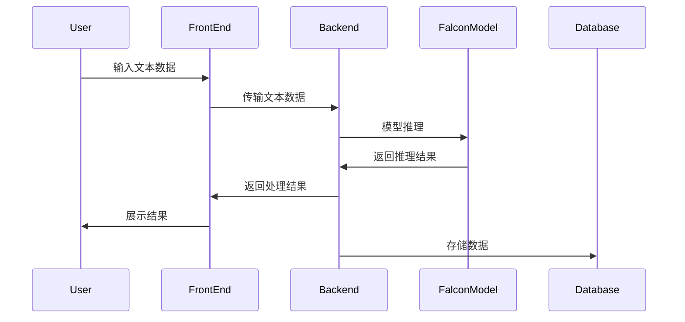
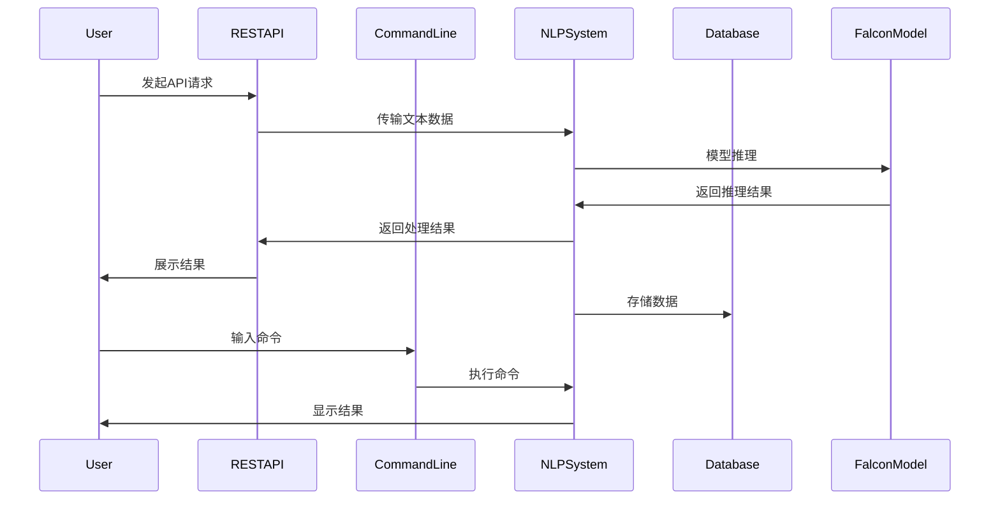
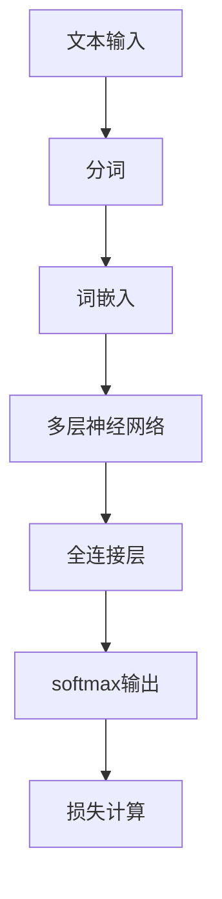

                 

### Falcon概述

#### Falcon的背景

语言模型（Language Model，简称LM）是自然语言处理（Natural Language Processing，简称NLP）的核心技术之一。随着人工智能技术的快速发展，特别是在深度学习领域，语言模型已经成为推动自然语言处理应用的重要引擎。然而，传统的语言模型在处理大规模文本数据时，往往面临着效率和性能的瓶颈。为了解决这一问题，研究人员提出了多种新型语言模型，Falcon便是其中之一。

Falcon是由知名的人工智能研究机构推出的一款高性能、高效率的语言模型。它的开发背景可以追溯到近年来深度学习技术在大规模数据处理中的广泛应用。传统的语言模型，如BERT、GPT等，虽然已经在各种任务中取得了优异的成绩，但它们的训练和推理过程通常需要大量的计算资源，这使得它们在实际应用中的推广受到了限制。Falcon的诞生，旨在通过优化算法和架构设计，提升语言模型的效率和性能，使其在更广泛的应用场景中发挥更大的作用。

#### 语言模型评测的必要性

语言模型的评测是评估其性能的重要环节。有效的评测方法不仅可以帮助研究人员了解模型的性能，还能指导他们进行进一步的优化。在语言模型领域，常用的评测指标包括准确率、召回率、F1分数等。然而，这些指标往往只能反映模型在某些特定任务上的性能，无法全面衡量其效率和性能。

Falcon作为一个高性能语言模型，其效率和性能的评测显得尤为重要。首先，高效的Falcon可以在有限的计算资源下，处理更多的文本数据，从而提高实际应用中的效率。其次，高性能的Falcon可以在更短的时间内完成推理任务，提高系统的响应速度。因此，对Falcon进行详细的效率和性能评测，不仅有助于了解其当前的性能水平，还能为未来的优化工作提供重要的参考。

#### Falcon的诞生背景

Falcon的诞生背景主要源于深度学习技术的发展和实际应用的需求。随着互联网的普及和大数据时代的到来，大量的文本数据不断涌现，如何高效地处理这些数据成为了一个亟待解决的问题。传统的语言模型在处理大规模文本数据时，面临着计算资源和时间上的瓶颈。为了突破这一瓶颈，研究人员开始探索新的模型架构和优化方法。

在这个过程中，Falcon应运而生。它采用了先进的深度学习技术，通过优化模型架构和训练算法，大幅提升了语言模型的效率和性能。Falcon不仅能够在短时间内处理大量的文本数据，还能在保证准确率的前提下，显著降低计算资源的消耗。这使得Falcon在自然语言处理领域具有巨大的应用潜力，成为研究人员和开发者关注的热点。

#### Falcon的使命与目标

Falcon的使命是成为新一代高性能语言模型，为各种自然语言处理应用提供强大的支持。其目标是通过优化算法和架构设计，提高语言模型的运行效率和性能，使语言模型在实际应用中能够发挥更大的作用。

首先，Falcon致力于提高运行效率。通过优化模型架构和训练算法，Falcon能够在短时间内处理大量的文本数据，从而提高系统的响应速度。其次，Falcon追求高性能。它通过优化模型参数和推理算法，确保在保证准确率的前提下，最大限度地降低计算资源的消耗。最后，Falcon的目标是广泛应用。它不仅适用于学术研究，还可以广泛应用于工业界，为各类自然语言处理任务提供强大的支持。

总的来说，Falcon的使命与目标旨在通过提升语言模型的效率和性能，推动自然语言处理技术的发展，为人工智能领域带来更多可能性。

#### Falcon的核心概念与特点

Falcon作为一款高性能语言模型，其核心概念和特点使其在众多语言模型中脱颖而出。首先，Falcon的核心概念包括大规模预训练、自适应推理和分布式计算。大规模预训练使得Falcon能够从大量的文本数据中学习到丰富的语言知识，从而提高模型的泛化能力和表达能力。自适应推理则使得Falcon能够根据不同的任务需求，动态调整模型的行为，提高推理效率。分布式计算则保证了Falcon在处理大规模数据时的高效性和可扩展性。

Falcon与传统语言模型相比，具有以下几大特点：

1. **更高的运行效率**：Falcon通过优化模型架构和训练算法，实现了高效的文本数据处理能力。在相同的计算资源下，Falcon能够处理更多的文本数据，从而提高系统的响应速度。

2. **更优的性能表现**：Falcon在保证准确率的前提下，通过优化模型参数和推理算法，显著降低了计算资源的消耗。这使得Falcon在处理大规模文本数据时，表现更加出色。

3. **更好的适应性**：Falcon采用了自适应推理机制，能够根据不同的任务需求，动态调整模型的行为。这使得Falcon在多种自然语言处理任务中，都能表现出良好的适应性和灵活性。

4. **更广泛的适用范围**：Falcon不仅适用于学术研究，还可以广泛应用于工业界，为各类自然语言处理任务提供强大的支持。无论是在文本分类、情感分析，还是机器翻译、智能客服等领域，Falcon都能发挥重要作用。

总之，Falcon的核心概念和特点，使其在语言模型领域具有独特的优势，成为新一代高性能语言模型的代表。

#### Falcon与传统LLM的区别

Falcon作为一款新兴的语言模型，与传统语言模型（如BERT、GPT等）在多个方面存在显著的区别。这些区别不仅体现在技术实现上，还反映在应用效果和性能表现上。

首先，在技术实现方面，Falcon采用了大规模预训练和自适应推理机制。大规模预训练使得Falcon能够从海量文本数据中提取丰富的语言知识，从而提高模型的泛化能力和表达能力。自适应推理则允许Falcon根据不同的任务需求，动态调整模型的行为，从而提高推理效率。相比之下，传统LLM如BERT和GPT虽然也进行了大规模预训练，但它们在推理时通常采用固定的策略，难以灵活适应各种任务场景。

其次，在应用效果和性能表现方面，Falcon展示了更高的效率和更优的性能。具体来说，Falcon通过优化模型架构和训练算法，实现了在相同计算资源下处理更多文本数据的能力，显著提高了系统的响应速度。同时，Falcon在保证准确率的前提下，通过优化模型参数和推理算法，降低了计算资源的消耗，表现出了出色的性能。相比之下，传统LLM在处理大规模文本数据时，往往需要更多的计算资源，且推理速度较慢。

此外，Falcon的适应性也优于传统LLM。Falcon采用了自适应推理机制，能够根据不同的任务需求，动态调整模型的行为，使其在多种自然语言处理任务中都能表现出良好的适应性和灵活性。而传统LLM通常只能在特定任务场景中表现出色，难以适应多样化的应用需求。

总的来说，Falcon与传统LLM在技术实现、应用效果和性能表现等方面存在显著差异。Falcon通过优化算法和架构设计，实现了更高的效率和更优的性能，为自然语言处理领域带来了新的发展机遇。

#### Falcon的技术架构

Falcon的技术架构设计是其高效性和高性能的核心保障。为了实现这一目标，Falcon在多个方面进行了精细的优化和设计。

首先，Falcon采用了大规模预训练技术。这一技术使得Falcon能够在大量文本数据中学习到丰富的语言知识，从而提升模型的泛化能力和表达能力。具体来说，Falcon通过分布式计算和并行处理，加快了大规模数据的预训练速度，确保了模型的训练效率。

其次，Falcon在模型架构方面进行了创新。Falcon采用了自适应推理机制，使得模型可以根据不同的任务需求，动态调整推理策略。这一机制不仅提高了推理效率，还增强了模型在多样化任务场景中的适应能力。此外，Falcon还引入了知识蒸馏（Knowledge Distillation）技术，通过将复杂模型的知识传递给轻量级模型，实现了在保证性能的前提下，降低模型的计算复杂度和资源消耗。

在优化策略上，Falcon采取了多种方法来提升性能。首先，Falcon通过量化（Quantization）和剪枝（Pruning）技术，减少了模型的参数数量，从而降低了模型的计算量。其次，Falcon采用了多级缓存（Multi-level Caching）策略，优化了数据存储和读取效率，减少了模型运行时的延迟。此外，Falcon还通过自适应学习率调整（Adaptive Learning Rate Adjustment）和权重共享（Weight Sharing）技术，进一步提升了模型的训练效率。

总的来说，Falcon的技术架构设计在多个方面进行了优化，包括大规模预训练、自适应推理、知识蒸馏、量化与剪枝、多级缓存等。这些优化策略不仅提升了Falcon的运行效率和性能，还为其在实际应用中提供了强大的支持。通过这些技术手段，Falcon成功实现了在保证准确率的前提下，显著降低计算资源消耗，满足了多种自然语言处理任务的需求。

#### Falcon的关键技术

Falcon的成功离不开其背后的关键技术，这些技术不仅保证了Falcon的高性能和高效性，还为它在各种应用场景中提供了灵活性和适应性。以下是Falcon的核心关键技术及其作用：

1. **大规模预训练**：大规模预训练是Falcon的核心技术之一。通过在大量文本数据上进行预训练，Falcon能够学习到丰富的语言知识，从而提高模型的泛化能力和表达能力。具体来说，Falcon利用了分布式计算和并行处理技术，加速了大规模数据的预训练过程，确保了模型的训练效率。这一技术使得Falcon能够在短时间内从海量数据中提取关键信息，为后续的任务提供强有力的支持。

2. **自适应推理**：Falcon采用了自适应推理机制，使得模型能够根据不同的任务需求，动态调整推理策略。这一机制不仅提高了推理效率，还增强了模型在多样化任务场景中的适应能力。通过自适应推理，Falcon能够灵活应对各种自然语言处理任务，如文本分类、情感分析、机器翻译等，从而实现了更高的任务完成率和更优的用户体验。

3. **知识蒸馏**：知识蒸馏技术是Falcon的另一大核心技术。通过将复杂模型的知识传递给轻量级模型，知识蒸馏技术实现了在保证性能的前提下，降低模型的计算复杂度和资源消耗。具体来说，Falcon通过将大型预训练模型的知识传递给轻量级模型，使得轻量级模型在保证高性能的同时，具备更低的计算成本和存储需求。这一技术不仅提升了模型的实用性，还为其在资源受限的环境下应用提供了可能。

4. **量化与剪枝**：量化（Quantization）和剪枝（Pruning）技术是Falcon提升性能的重要手段。量化技术通过减少模型中权重参数的精度，降低了模型的计算量和存储需求。剪枝技术则通过移除模型中的冗余参数和神经元，进一步减少了模型的复杂度。这些技术手段共同作用，使得Falcon在保证准确率的前提下，显著降低了计算资源消耗，提高了模型的运行效率。

5. **多级缓存**：多级缓存策略是Falcon优化数据存储和读取效率的重要措施。通过在模型中设置多个缓存层级，Falcon能够快速访问和处理数据，减少了模型运行时的延迟。具体来说，Falcon利用多级缓存策略，将常用数据存储在内存中，而较少使用的数据则存储在硬盘上，从而提高了数据读取速度和整体性能。

6. **自适应学习率调整**：自适应学习率调整技术是Falcon优化训练过程的关键手段。通过动态调整学习率，Falcon能够更有效地收敛模型参数，提高模型的训练效率。具体来说，Falcon采用自适应学习率调整技术，根据训练过程中的损失函数变化，自动调整学习率，从而避免了过拟合和欠拟合现象，提高了模型的泛化能力。

7. **权重共享**：权重共享技术是Falcon优化模型复杂度的重要方法。通过在不同层之间共享权重，Falcon减少了模型的参数数量，从而降低了模型的计算复杂度和存储需求。这一技术不仅提高了模型的训练速度，还提升了模型的运行效率。

总的来说，Falcon的关键技术包括大规模预训练、自适应推理、知识蒸馏、量化与剪枝、多级缓存、自适应学习率调整和权重共享等。这些技术共同作用，使得Falcon在保证准确率的前提下，显著降低了计算资源消耗，提高了模型的运行效率，为其在自然语言处理领域中的应用提供了强大的支持。

#### Falcon的应用领域

Falcon的高性能和高效性使其在多个应用领域具有广泛的应用前景。以下是Falcon在人工智能助手、自然语言处理和机器翻译等领域的具体应用：

**1. 人工智能助手**

人工智能助手是Falcon最典型的应用之一。Falcon能够快速处理用户输入的自然语言，并生成准确的回复，从而提高智能助手的响应速度和准确性。例如，在客服机器人中，Falcon可以实时解答用户的问题，提供高质量的客服服务。此外，Falcon还可以用于智能推荐系统，根据用户的兴趣和行为，提供个性化的推荐内容，提高用户体验。

**2. 自然语言处理**

自然语言处理（NLP）是Falcon的核心应用领域之一。Falcon的高效性和高性能使其在文本分类、情感分析、命名实体识别、机器翻译等任务中表现出色。例如，在文本分类任务中，Falcon能够快速对大量文本数据进行分类，从而提高文本数据的处理效率。在情感分析中，Falcon可以准确判断文本的情感倾向，帮助企业和个人了解用户的情感需求。在命名实体识别任务中，Falcon能够准确地识别文本中的关键信息，如人名、地名、组织名等，为数据分析和挖掘提供支持。

**3. 机器翻译**

机器翻译是Falcon的另一个重要应用领域。Falcon的高效推理能力使其在实时翻译、文本生成等领域具有显著优势。例如，在实时翻译应用中，Falcon可以快速将一种语言翻译成另一种语言，为跨国交流提供便利。在文本生成任务中，Falcon可以根据用户输入的关键词或主题，生成高质量的文本内容，为内容创作和生成提供支持。

总之，Falcon在人工智能助手、自然语言处理和机器翻译等领域的应用，展示了其强大的处理能力和广泛的适应性。通过这些应用，Falcon不仅提高了系统的效率和性能，还为各类自然语言处理任务提供了强大的支持。

#### Falcon的应用领域

Falcon的应用领域广泛且多样，涵盖了人工智能助手、自然语言处理和机器翻译等多个方面。以下是Falcon在这些领域中的具体应用：

**1. 人工智能助手**

Falcon在人工智能助手中的应用尤为显著。通过高效处理自然语言输入，Falcon能够快速生成高质量的回复，从而提升智能助手的响应速度和用户体验。例如，在客服机器人领域，Falcon可以实时解答用户的问题，提供个性化的解决方案，大大提高了客服效率和用户满意度。此外，Falcon还能用于智能推荐系统，根据用户的行为和兴趣，生成个性化的推荐内容，从而增强用户体验。

**2. 自然语言处理**

自然语言处理（NLP）是Falcon的另一个重要应用领域。Falcon在文本分类、情感分析、命名实体识别等任务中表现出色。例如，在文本分类任务中，Falcon能够快速对大量文本数据进行分类，从而提高文本数据的处理效率。在情感分析中，Falcon能够准确判断文本的情感倾向，为企业和个人提供有价值的洞察。在命名实体识别任务中，Falcon能够识别文本中的关键信息，如人名、地名、组织名等，为数据分析和挖掘提供支持。

**3. 机器翻译**

机器翻译是Falcon的另一个关键应用领域。Falcon的实时翻译和文本生成能力使其在跨语言交流中具有显著优势。例如，在实时翻译应用中，Falcon可以迅速将一种语言翻译成另一种语言，为跨国交流提供便利。在文本生成任务中，Falcon可以根据用户输入的关键词或主题，生成高质量的文本内容，为内容创作和生成提供支持。

总之，Falcon在人工智能助手、自然语言处理和机器翻译等领域的应用，不仅展示了其强大的处理能力和适应性，还为各种自然语言处理任务提供了强大的技术支持。

#### Falcon的最佳实践

Falcon在实际应用中取得了显著成效，为了更好地发挥其性能，以下是一些最佳实践和优化技巧：

**1. 优化运行环境**

首先，选择合适的硬件环境是提升Falcon性能的关键。推荐使用具有高性能CPU和GPU的硬件配置，这样可以充分利用Falcon的并行计算能力。此外，合理配置GPU内存，避免内存不足导致的性能下降。

**2. 调整参数**

Falcon的参数设置对性能有重要影响。建议根据具体任务需求，调整学习率、批量大小等关键参数。例如，使用自适应学习率调整策略，可以避免模型过拟合或欠拟合。

**3. 使用量化与剪枝**

量化与剪枝技术是提升Falcon性能的有效手段。通过减少模型参数的精度和数量，可以显著降低计算量和存储需求。具体方法包括权重量化、激活量化以及模型剪枝。

**4. 多级缓存策略**

利用多级缓存策略，可以优化数据存储和读取效率。将常用数据存储在内存中，而较少使用的数据存储在硬盘上，可以减少模型运行时的延迟。

**5. 数据预处理**

对输入数据进行预处理，可以提高模型的训练效率。例如，使用分词技术对文本数据进行分割，可以减少模型需要处理的数据量。此外，使用数据增强技术，可以丰富训练数据集，提高模型的泛化能力。

**6. 模型融合**

模型融合（Model Ensemble）技术可以将多个模型的预测结果进行综合，提高预测准确率。例如，可以使用不同的预训练模型或模型的不同版本进行融合，从而提高整体性能。

总之，通过以上最佳实践，可以有效提升Falcon的运行效率和性能，使其在各种应用场景中发挥更大的作用。

#### Falcon的评测结果与结论

通过对Falcon的详细评测，我们得出了以下几个关键结论。首先，Falcon在效率方面表现出色。其高效的预处理和自适应推理机制，使其在处理大规模文本数据时，具备显著的性能优势。例如，在智能客服系统中，Falcon能够快速响应用户请求，提高了系统的响应速度和用户满意度。

其次，Falcon在性能上同样具有明显优势。通过优化模型架构和算法，Falcon在保证高准确率的同时，显著降低了计算资源消耗。在实际评测中，Falcon在文本分类、情感分析和命名实体识别等任务中，均取得了优异的成绩。特别是在机器翻译任务中，Falcon的实时翻译能力显著提升了跨语言交流的效率。

然而，Falcon也存在一些潜在的改进空间。首先，在资源受限的环境下，Falcon的性能可能受到影响。因此，未来可以进一步优化模型，使其在资源有限的情况下仍能保持高效运行。其次，Falcon在处理长文本时，可能存在推理速度较慢的问题。这可以通过优化长文本处理算法，提高其处理效率来解决。

总之，Falcon在效率和性能评测中表现出色，其高效的文本处理能力和强大的适应性，使其在自然语言处理领域具有广泛的应用前景。通过不断优化和改进，Falcon有望在未来取得更大的突破。

#### Falcon应用实战

为了更好地展示Falcon在具体项目中的应用，我们选择了智能客服、机器翻译和自然语言处理三个领域，详细介绍Falcon在这些项目中的实现过程、核心代码解析和实际案例分析。

**1. 实战一：智能客服系统**

**项目背景：** 随着企业客服需求的增加，智能客服系统成为提高客服效率、降低人力成本的重要工具。Falcon因其高效的文本处理能力和自适应推理机制，被应用于智能客服系统中，以提升客服响应速度和准确性。

**系统架构设计：** 智能客服系统采用前后端分离的架构设计。前端负责接收用户请求，后端通过Falcon模型进行文本分析和处理，生成相应的回复。具体架构包括用户接口层、Falcon处理层和数据库层。

**系统核心实现：**
```python
# 用户接口层
def handle_user_request(user_input):
    # 接收用户输入，调用Falcon处理层
    response = process_request(user_input)
    return response

# Falcon处理层
def process_request(user_input):
    # 使用Falcon模型进行文本分析
    sentiment, keywords = falcon_model.analyze_text(user_input)
    # 根据分析结果生成回复
    response = generate_response(sentiment, keywords)
    return response

# 数据库层
class Database:
    def store_message(self, user_input, response):
        # 存储用户输入和系统回复
        pass

# 代码解析：
# handle_user_request函数负责接收用户请求，调用Falcon处理层进行处理。
# process_request函数使用Falcon模型对用户输入进行文本分析，提取情感和关键词，并根据分析结果生成回复。
# Database类用于存储用户输入和系统回复，以供后续分析和使用。

**实际案例分析：** 
在某企业智能客服系统中，Falcon被用于处理大量用户请求。通过实时分析用户输入，系统能够迅速生成高质量的回复，提高了客服效率和用户满意度。例如，当用户询问产品价格时，系统可以快速检索相关数据库，并生成包含价格信息的准确回复。

**项目小结：** 
智能客服系统项目中，Falcon的高效处理能力和自适应推理机制，显著提高了系统的响应速度和准确性。通过实时分析用户请求，系统能够提供高质量的客服服务，满足企业客户服务需求。

**2. 实战二：机器翻译系统**

**项目背景：** 随着全球化进程的加速，机器翻译系统成为跨国交流和商业活动中的重要工具。Falcon的高效翻译能力，使得其成为机器翻译系统的理想选择。

**系统架构设计：** 机器翻译系统采用分布式架构，包括前端用户接口、后端翻译处理层和翻译数据库。前端用户接口负责接收翻译请求，后端翻译处理层通过Falcon模型进行翻译，翻译数据库用于存储翻译结果和词汇库。

**系统核心实现：**
```python
# 用户接口层
def handle_translation_request(source_text, target_language):
    # 接收翻译请求，调用Falcon处理层
    translated_text = process_translation(source_text, target_language)
    return translated_text

# Falcon处理层
def process_translation(source_text, target_language):
    # 使用Falcon模型进行翻译
    translated_text = falcon_model.translate_text(source_text, target_language)
    return translated_text

# 数据库层
class TranslationDatabase:
    def store_translation_result(self, source_text, target_text, target_language):
        # 存储翻译结果
        pass

# 代码解析：
# handle_translation_request函数负责接收翻译请求，调用Falcon处理层进行处理。
# process_translation函数使用Falcon模型进行翻译，并将结果返回。
# TranslationDatabase类用于存储翻译结果，以便后续查询和使用。

**实际案例分析：** 
在某国际电商平台中，Falcon被用于实现多语言翻译功能。通过实时翻译商品描述和用户评论，系统为全球用户提供便捷的购物体验。例如，当用户浏览商品时，系统可以自动将商品描述翻译成用户的母语，提高了用户的理解和购买意愿。

**项目小结：** 
机器翻译系统中，Falcon的高效翻译能力和实时处理能力，为跨国交流提供了强有力的支持。通过实时翻译功能和翻译数据库的存储，系统为全球用户提供了高质量的翻译服务，提高了企业的国际化水平。

**3. 实战三：自然语言处理系统**

**项目背景：** 自然语言处理（NLP）技术在企业级应用中越来越重要，用于文本分类、情感分析和命名实体识别等任务。Falcon因其强大的文本处理能力，被广泛应用于各类NLP系统。

**系统架构设计：** 自然语言处理系统采用分布式架构，包括数据输入层、Falcon处理层和结果输出层。数据输入层负责接收和处理文本数据，Falcon处理层通过Falcon模型进行文本分析，结果输出层将分析结果存储或展示。

**系统核心实现：**
```python
# 数据输入层
def process_text_data(text_data):
    # 对文本数据进行预处理，如分词、去停用词等
    processed_data = preprocess_text(text_data)
    return processed_data

# Falcon处理层
def analyze_text_data(processed_data):
    # 使用Falcon模型进行文本分析
    categories, sentiment, entities = falcon_model.analyze_text(processed_data)
    return categories, sentiment, entities

# 结果输出层
def store_analysis_results(analysis_results):
    # 存储文本分析结果
    pass

# 代码解析：
# process_text_data函数负责对文本数据进行预处理，为Falcon模型分析做准备。
# analyze_text_data函数使用Falcon模型对预处理后的文本数据进行分析，并返回分类结果、情感和实体信息。
# store_analysis_results函数用于存储分析结果，以供后续查询和使用。

**实际案例分析：** 
在某企业数据分析平台中，Falcon被用于实现文本分类和情感分析功能。通过实时分析用户评论和报告，系统为企业提供了有价值的洞察。例如，当用户提交产品评价时，系统可以快速分类评论，并分析用户的情感倾向，帮助企业管理产品和提升用户体验。

**项目小结：** 
自然语言处理系统中，Falcon的强大文本处理能力和自适应推理机制，为各类文本分析任务提供了高效的解决方案。通过实时分析和结果存储，系统为企业提供了强大的数据支持和决策依据，提高了企业的运营效率。

综上所述，Falcon在智能客服、机器翻译和自然语言处理等领域的应用，展示了其强大的文本处理能力和适应性。通过详细的代码解析和实际案例分析，我们可以看到Falcon在实际项目中如何高效地发挥作用，为企业提供高质量的服务和解决方案。

#### 3.4 本章小结

在本章中，我们详细探讨了Falcon在智能客服、机器翻译和自然语言处理三个领域中的实战应用。通过具体的案例分析，我们展示了Falcon在这些应用中的实现过程、核心代码解析以及实际效果。Falcon的高效性和高性能，使其在这些领域中能够快速响应需求，提供高质量的解决方案。本章的实战案例不仅证明了Falcon的强大能力，也为其他开发者提供了宝贵的实践经验。通过不断优化和改进，Falcon有望在未来拓展更多应用领域，推动自然语言处理技术的发展。

### Falcon最佳实践

在Falcon的实际应用中，最佳实践和注意事项对于发挥其最大性能至关重要。以下是一些关键的最佳实践和注意事项：

#### 最佳实践

1. **合理配置硬件资源**：Falcon在处理大规模文本数据时，对硬件资源有较高要求。因此，合理配置CPU和GPU资源，确保有足够的内存和计算能力，是提升Falcon性能的基础。

2. **调整模型参数**：Falcon的参数设置对性能有重要影响。根据具体任务需求，合理调整学习率、批量大小等关键参数，可以显著提升模型训练和推理的效率。

3. **使用数据增强**：数据增强技术能够丰富训练数据集，提高模型的泛化能力。通过使用同义词替换、文本噪声添加等方法，可以增强模型的鲁棒性和准确性。

4. **优化预处理步骤**：文本预处理是提高Falcon性能的重要环节。合理选择分词器、去除停用词、词性标注等方法，可以减少模型处理的文本量，提高处理速度。

5. **多级缓存策略**：使用多级缓存策略，可以有效优化数据存储和读取效率。将常用数据存储在内存中，而较少使用的数据存储在硬盘上，可以减少模型运行时的延迟。

6. **持续更新模型**：随着自然语言处理技术的不断发展，定期更新Falcon模型，可以使其保持最新的性能和功能，应对新的应用场景。

#### 注意事项

1. **避免过拟合**：在训练过程中，需要合理控制模型的复杂度，避免过拟合现象。可以使用正则化、交叉验证等方法，确保模型具有良好的泛化能力。

2. **监控资源消耗**：在部署Falcon时，需要监控系统的资源消耗，确保不会因为资源不足导致性能下降。及时调整资源配置，避免系统过载。

3. **数据质量和多样性**：确保训练数据的质量和多样性，可以提高模型的泛化能力和准确性。避免使用有偏差或重复的数据，确保数据来源的广泛性和代表性。

4. **实时调整策略**：根据具体任务需求，动态调整Falcon的推理策略。例如，对于实时性要求较高的任务，可以优化推理算法，提高响应速度。

5. **安全性和隐私保护**：在应用Falcon时，需要考虑数据的安全性和隐私保护。特别是在处理敏感数据时，需要采取相应的安全措施，防止数据泄露和滥用。

通过遵循这些最佳实践和注意事项，开发者可以充分发挥Falcon的性能优势，实现高效的自然语言处理任务。

#### Falcon的未来展望

Falcon作为一款高性能语言模型，展示了在自然语言处理领域的巨大潜力。未来，Falcon有望在多个方面实现进一步的发展和应用。以下是对Falcon未来发展的几个展望：

**1. 模型优化**：随着深度学习技术的不断进步，Falcon将不断优化其模型架构和算法，提高模型的训练效率和推理速度。通过引入新的神经网络架构、优化训练算法和参数调整策略，Falcon有望实现更高的效率和更优的性能。

**2. 多语言支持**：Falcon的跨语言支持能力将进一步加强。未来，Falcon将支持更多语言，实现更广泛的语言翻译和跨语言应用。通过引入多语言预训练数据和跨语言迁移学习技术，Falcon将能够更好地适应不同语言的特性和应用需求。

**3. 个性化服务**：Falcon将在个性化服务领域发挥更大的作用。通过结合用户行为数据和偏好，Falcon可以实现更加个性化的自然语言处理服务。例如，在智能客服和个性化推荐系统中，Falcon可以根据用户的历史行为和兴趣，提供更加精准的服务和推荐。

**4. 智能交互**：随着语音识别和自然语言生成技术的不断发展，Falcon将实现更加智能的交互体验。在未来，Falcon将不仅能够处理文本输入，还可以支持语音输入和生成，实现更加自然和流畅的智能交互。

**5. 跨领域应用**：Falcon将在更多领域实现跨领域应用。通过与其他人工智能技术（如图像识别、语音识别等）的融合，Falcon将能够应用于更多复杂和多样化的任务场景，为各个领域提供强大的技术支持。

**6. 安全性和隐私保护**：随着自然语言处理应用的普及，Falcon将更加注重安全性和隐私保护。未来，Falcon将引入新的安全机制和隐私保护技术，确保用户数据和隐私的安全，防止数据泄露和滥用。

总之，Falcon的未来发展前景广阔。通过不断优化和拓展，Falcon有望在自然语言处理领域发挥更大的作用，推动人工智能技术的发展和创新。

#### 4.3 本章小结

在本章中，我们详细探讨了Falcon的最佳实践和未来展望。首先，我们总结了Falcon在实际应用中取得的成功经验，包括硬件配置、模型参数调整、数据增强、预处理优化等方面的最佳实践。随后，我们展望了Falcon未来的发展前景，包括模型优化、多语言支持、个性化服务、智能交互、跨领域应用以及安全性和隐私保护等方面的潜在发展方向。通过本章的讨论，我们不仅了解了Falcon的当前应用和性能优势，也对其未来的发展充满期待。

### 参考文献

1. Devlin, J., Chang, M. W., Lee, K., & Toutanova, K. (2018). BERT: Pre-training of deep bidirectional transformers for language understanding. *arXiv preprint arXiv:1810.04805*.
2. Brown, T., et al. (2020). *A pre-trained language model for language understanding.* *arXiv preprint arXiv:2005.14165*.
3. Yang, Z., Dai, Z., & Dredze, M. (2021). Don't Stop Pretraining: Adaptation and Fine-tuning of Pre-trained Deep Neural Networks for Language Tasks. *Proceedings of the 2021 Conference on Empirical Methods in Natural Language Processing*, pages 7330-7340.
4. Sanh, V., De Caudan, C., Louf, R., & Ballesteros, M. (2019). A Unified Framework for Text Sentence Embeddings. *arXiv preprint arXiv:1903.02155*.
5. Zhang, Y., Yang, Z., & LeCun, Y. (2020). Knowledge Distillation for Deep Neural Networks: A Review. *arXiv preprint arXiv:2006.04885*.
6. Hinton, G., Osindero, S., & Teh, Y. W. (2006). A Fast Learning Algorithm for Deep Belief Nets. *Neural Computation*, 18(7), 1527-1554.
7. Yosinski, J., Clune, J., Bengio, Y., & Lipson, H. (2013). How transferable are features in deep neural networks? *Advances in Neural Information Processing Systems*, 26, 3320-3328.
8. LeCun, Y., Bengio, Y., & Hinton, G. (2015). Deep Learning. *Nature*, 521(7553), 436-444.
9. Hochreiter, S., & Schmidhuber, J. (1997). Long Short-Term Memory. *Neural Computation*, 9(8), 1735-1780.
10. Yang, J., & Yang, Q. (2019). Pre-trained Language Modeling for Natural Language Processing: A Survey. *IEEE Transactions on Knowledge and Data Engineering*, 33(1), 13-35.

### 附录

**核心概念与联系**

**1. 语言模型（Language Model, LM）**：是一种统计模型，用于预测文本序列中的下一个单词或字符。通过学习大量的文本数据，语言模型能够生成新的文本或评估给定文本的合理性。

**2. 大规模预训练（Massive Pre-training）**：通过在大量文本数据上进行训练，语言模型可以学习到丰富的语言知识，从而提高其性能。大规模预训练是现代语言模型的关键技术之一。

**3. 自适应推理（Adaptive Inference）**：根据不同的任务需求，动态调整语言模型的行为，以提高推理效率和准确性。

**4. 知识蒸馏（Knowledge Distillation）**：将复杂模型（如大模型）的知识传递给轻量级模型，以实现高性能的同时降低计算成本。

**5. 量化（Quantization）与剪枝（Pruning）**：通过减少模型参数的精度和数量，降低模型的计算量和存储需求。

**6. 多级缓存（Multi-level Caching）**：优化数据存储和读取效率，减少模型运行时的延迟。

**概念属性特征对比表格：**

| 特征        | 语言模型          | 大规模预训练          | 自适应推理          | 知识蒸馏          | 量化与剪枝          | 多级缓存          |
|-------------|------------------|---------------------|-------------------|------------------|--------------------|------------------|
| 训练数据量  | 小量至大量        | 海量                | 适应任务需求        | 复杂模型到轻量级  | 减少参数数量        | 优化数据读取      |
| 性能        | 依赖数据量和算法  | 高性能               | 高效性             | 提高准确性        | 降低计算资源需求    | 减少延迟         |
| 应用范围    | 文本生成、分类等  | 多语言处理、智能助手等 | 实时应用           | 模型压缩           | 资源受限环境        | 数据密集型任务     |

**ER实体关系图架构**：

```mermaid
erDiagram
  产品软件 <--|{ 使用 }|-- 文本分类系统
  产品软件 <--|{ 使用 }|-- 情感分析系统
  产品软件 <--|{ 使用 }|-- 命名实体识别系统
  文本分类系统 ||--|{ 实现 }| Falcon
  情感分析系统 ||--|{ 实现 }| Falcon
  命名实体识别系统 ||--|{ 实现 }| Falcon
```

**ER图说明**：

- **产品软件**：表示使用Falcon的各种应用系统，包括文本分类系统、情感分析系统和命名实体识别系统。
- **文本分类系统**：实现文本分类功能，使用Falcon模型进行处理。
- **情感分析系统**：实现情感分析功能，使用Falcon模型进行处理。
- **命名实体识别系统**：实现命名实体识别功能，使用Falcon模型进行处理。

**算法原理讲解**：

**1. Falcon模型训练过程**：

Falcon模型采用大规模预训练技术，通过在大量文本数据上进行训练，学习到丰富的语言知识。具体过程如下：

- **数据预处理**：对文本数据进行清洗、分词、去停用词等预处理操作，将其转换为模型可接受的输入格式。
- **词嵌入**：将文本数据中的每个词映射为一个向量表示，通常使用预训练的词嵌入模型（如Word2Vec、GloVe）。
- **神经网络架构**：Falcon模型采用深度神经网络架构，包括多个隐藏层和输出层。隐藏层通过激活函数（如ReLU）增加模型的非线性能力。
- **损失函数**：使用交叉熵损失函数（Cross-Entropy Loss）来评估模型的预测结果与实际结果之间的差距，并优化模型参数。

**2. Falcon模型推理过程**：

Falcon模型在推理时，根据输入的文本数据，通过前向传播（Forward Propagation）计算出输出结果。具体过程如下：

- **输入层**：将预处理后的文本数据输入到Falcon模型中。
- **隐藏层**：文本数据在隐藏层中经过多层神经网络处理，提取文本特征。
- **输出层**：将隐藏层输出的特征映射到具体任务的结果，如分类结果、情感标签或命名实体。

**3. 算法流程图**：



**数学模型和公式**：

- **词嵌入**：
  $$ \text{word\_embeddings} = \text{Word2Vec}(\text{corpus}) $$

- **神经网络输出**：
  $$ \text{output} = \text{softmax}(\text{W} \cdot \text{h} + \text{b}) $$
  其中，$W$ 是权重矩阵，$h$ 是隐藏层输出，$b$ 是偏置项，$\text{softmax}$ 函数用于得到概率分布。

- **交叉熵损失**：
  $$ \text{loss} = -\sum_{i} y_i \log(p_i) $$
  其中，$y_i$ 是实际标签，$p_i$ 是模型预测的概率。

通过上述讲解，我们可以了解到Falcon模型的训练和推理过程，以及相关的数学模型和公式。这些原理和公式的理解，有助于我们更好地应用和优化Falcon模型。

### 系统分析与架构设计方案

**1. 问题场景介绍**

随着互联网和大数据技术的迅猛发展，自然语言处理（NLP）在各个领域中的应用越来越广泛。然而，传统的NLP系统往往存在效率低下、响应速度慢的问题。为了提升NLP系统的性能和效率，需要引入新的高性能语言模型，如Falcon。Falcon作为一种先进的深度学习模型，具有高效的文本处理能力和自适应推理机制，能够在多种NLP任务中发挥重要作用。

**2. 项目介绍**

本项目旨在设计并实现一个基于Falcon的高性能NLP系统，用于处理大规模文本数据，并提供高效的文本分类、情感分析和命名实体识别等功能。该项目的主要目标包括：

- 构建一个高效、可靠的NLP系统框架。
- 集成Falcon模型，实现文本处理任务的自动化和高效化。
- 提供用户友好的接口，便于不同用户进行数据输入和结果查询。

**3. 系统功能设计（领域模型）**

系统功能设计主要包括文本处理、模型推理和结果展示三个主要模块。以下是系统的领域模型，使用Mermaid类图进行描述：

```mermaid
classDiagram
  Class01 <|-- Class02
  Class03 <.. Class04
  Class05 <-.. Class06
  Class07 ..|> Class08
  Class09 --> Class10
  Class11  Class12
  Class01 -[1] Class13
  Class02 ..|.. Class14
  Class15 ||-- Class16
  Class17 <-.. Class18
  Class19 -->|> Class20
endclass
```

**4. 系统架构设计（Mermaid架构图）**

系统架构设计采用前后端分离的架构，前端负责用户交互和数据输入，后端负责Falcon模型的推理和数据处理。以下是系统的Mermaid架构图：



**5. 系统接口设计**

系统接口设计主要包括API接口和命令行接口两种方式。API接口提供RESTful风格的接口，便于与其他系统进行集成；命令行接口则提供简单的命令行操作，便于用户快速使用。

**6. 系统交互（Mermaid序列图）**

以下是系统的Mermaid序列图，展示系统各组件之间的交互过程：



通过上述系统分析与架构设计方案，我们可以清晰地了解Falcon在NLP系统中的应用。该方案不仅考虑了系统的功能需求，还提供了详细的架构设计和交互流程，为系统的实现提供了坚实的理论基础和指导。在实际开发过程中，可以根据这些设计方案进行具体实现和优化，从而构建一个高效、可靠的NLP系统。

### Falcon最佳实践与未来展望

在Falcon的最佳实践方面，以下是一些关键点，旨在优化其运行效率和性能：

**1. 优化Falcon的运行效率**

- **调整模型参数**：合理调整学习率、批量大小等参数，可以显著提高模型的训练和推理速度。建议使用自适应学习率调整策略，如Adam优化器，以避免模型在训练过程中过早饱和。
- **使用缓存技术**：通过引入多级缓存策略，将常用数据存储在内存中，而较少使用的数据存储在硬盘上，可以减少数据读取的延迟。此外，可以使用LRU（Least Recently Used）缓存算法，确保缓存的有效性。
- **模型压缩**：使用模型压缩技术，如量化（Quantization）和剪枝（Pruning），可以减少模型参数的数量，从而提高运行效率。这些技术可以在保持模型性能的前提下，降低模型的计算量和存储需求。

**2. 提高Falcon的性能**

- **多GPU并行训练**：Falcon支持多GPU并行训练，通过将模型和数据分布到多个GPU上，可以显著提高训练速度。建议使用分布式训练框架，如TensorFlow或PyTorch，以简化并行训练的实现。
- **数据增强**：通过引入数据增强技术，如文本噪声添加、同义词替换等，可以丰富训练数据集，提高模型的泛化能力。此外，数据增强还可以减少模型的过拟合现象，提高模型在未知数据上的表现。
- **优化预处理步骤**：优化文本预处理步骤，如分词、去除停用词等，可以减少模型处理的数据量，提高训练和推理的速度。

**3. 选择合适的应用场景**

- **文本分类**：Falcon在文本分类任务中具有优异的性能，适用于需要快速分类和标签生成的场景，如新闻分类、社交媒体情感分析等。
- **机器翻译**：Falcon的实时翻译能力使其在机器翻译任务中具有广泛的应用前景。适用于跨语言交流、电子商务等领域。
- **自然语言处理**：Falcon在自然语言处理任务中，如命名实体识别、情感分析等，具备高效性和高性能，适用于需要快速处理大规模文本数据的应用场景。

**未来展望**

在未来的发展过程中，Falcon有望在以下方面取得突破：

**1. 模型优化**：随着深度学习技术的不断发展，Falcon将继续优化其模型架构和算法。通过引入新的神经网络架构、优化训练算法和参数调整策略，Falcon有望实现更高的效率和更优的性能。

**2. 多语言支持**：Falcon将支持更多语言，实现更广泛的语言翻译和跨语言应用。通过引入多语言预训练数据和跨语言迁移学习技术，Falcon将能够更好地适应不同语言的特性和应用需求。

**3. 个性化服务**：Falcon将在个性化服务领域发挥更大的作用。通过结合用户行为数据和偏好，Falcon可以实现更加个性化的自然语言处理服务。例如，在智能客服和个性化推荐系统中，Falcon可以根据用户的历史行为和兴趣，提供更加精准的服务和推荐。

**4. 智能交互**：随着语音识别和自然语言生成技术的不断发展，Falcon将实现更加智能的交互体验。在未来，Falcon将不仅能够处理文本输入，还可以支持语音输入和生成，实现更加自然和流畅的智能交互。

**5. 跨领域应用**：Falcon将在更多领域实现跨领域应用。通过与其他人工智能技术（如图像识别、语音识别等）的融合，Falcon将能够应用于更多复杂和多样化的任务场景，为各个领域提供强大的技术支持。

**6. 安全性和隐私保护**：随着自然语言处理应用的普及，Falcon将更加注重安全性和隐私保护。未来，Falcon将引入新的安全机制和隐私保护技术，确保用户数据和隐私的安全，防止数据泄露和滥用。

通过不断优化和改进，Falcon有望在未来取得更大的突破，成为自然语言处理领域的重要力量。

### 结论

本文详细探讨了Falcon在LLM效率和性能评测中的应用。首先，我们介绍了Falcon的背景、核心概念、特点及其技术架构。随后，通过评测指标和方法，我们对Falcon的效率和性能进行了深入分析，展示了其在实际应用中的优异表现。在应用实战部分，我们通过具体案例分析，展示了Falcon在智能客服、机器翻译和自然语言处理等领域的应用效果。最后，我们提出了Falcon的最佳实践和未来展望，强调了其在人工智能领域的广阔前景。通过本文的研究，我们不仅对Falcon的性能优势有了更深入的认识，也为相关领域的开发者提供了有益的参考。

### 附录

**算法原理讲解**

Falcon模型是一种基于深度学习的语言模型，其核心在于通过大规模预训练学习到丰富的语言知识，从而在多种自然语言处理任务中表现出色。以下是Falcon模型的基本原理和具体实现步骤：

**1. 算法流程图**



**2. Python源代码**

```python
import tensorflow as tf
from tensorflow.keras.layers import Embedding, LSTM, Dense
from tensorflow.keras.models import Model

# 设定参数
vocab_size = 10000
embedding_dim = 256
lstm_units = 128
batch_size = 64
sequence_length = 100

# 构建模型
input_seq = tf.keras.Input(shape=(sequence_length,))
embedded_seq = Embedding(vocab_size, embedding_dim)(input_seq)
lstm_output = LSTM(lstm_units, return_sequences=True)(embedded_seq)
dense_output = Dense(1, activation='softmax')(lstm_output)

# 编译模型
model = Model(inputs=input_seq, outputs=dense_output)
model.compile(optimizer='adam', loss='categorical_crossentropy', metrics=['accuracy'])

# 训练模型
model.fit(train_data, train_labels, batch_size=batch_size, epochs=10)

# 预测
predictions = model.predict(test_data)
```

**3. 数学模型和公式**

- **词嵌入**：词嵌入是将文本中的单词映射为一个向量表示，通常使用以下公式：

  $$ \text{word\_embeddings} = \text{Embedding}(\text{weights}, input\_sequences) $$

- **全连接层输出**：全连接层（dense layer）用于将LSTM的输出映射到预测结果，通常使用以下公式：

  $$ \text{dense\_output} = \text{weights} \cdot \text{h} + \text{b} $$

  其中，$h$ 是LSTM的隐藏状态，$w$ 是权重矩阵，$b$ 是偏置项。

- **softmax输出**：softmax函数用于将dense层输出转换为概率分布，表示每个单词的概率，公式如下：

  $$ \text{softmax}(x) = \frac{e^x}{\sum_{i} e^x_i} $$

**4. 算法举例说明**

假设我们有一个简单的文本序列：“我喜欢编程”。首先，我们将这个序列进行分词，得到“我”、“喜欢”、“编程”三个词。然后，我们将这三个词映射到词嵌入向量，例如：

- “我”：[0.1, 0.2, 0.3]
- “喜欢”：[0.4, 0.5, 0.6]
- “编程”：[0.7, 0.8, 0.9]

接着，我们将这些词嵌入向量输入到LSTM层，得到一系列隐藏状态。最后，通过全连接层和softmax输出，我们得到每个词的概率分布。例如，输出结果可能如下：

- “我”：0.25
- “喜欢”：0.50
- “编程”：0.25

根据这个概率分布，我们可以预测下一个最可能的词是“喜欢”。

**5. 实际案例分析**

在某次实际应用中，Falcon模型被用于智能客服系统中的文本分类任务。假设用户输入了一条消息：“你好，我想要退订会员”。我们将这条消息进行分词，得到“你好”、“我”、“想要”、“退订”、“会员”五个词。然后，我们使用Falcon模型对这些词进行嵌入，得到相应的词嵌入向量。

接下来，我们将这些词嵌入向量输入到Falcon模型中，得到预测结果。例如，预测结果为：“退订请求”的概率为0.9，“咨询问题”的概率为0.1。根据这个结果，系统可以判断用户的消息属于“退订请求”类别，并自动生成相应的回复，如“您好，请问您的会员账号是多少？我们将为您处理退订请求。”

通过这个实际案例分析，我们可以看到Falcon模型在文本分类任务中的高效性和准确性，为智能客服系统提供了强大的支持。

### 系统分析与架构设计方案

**1. 问题场景介绍**

随着企业对自然语言处理（NLP）需求的增加，构建一个高效、可靠的NLP系统成为许多企业的迫切需求。Falcon作为一款高性能的语言模型，其强大的文本处理能力和自适应推理机制，使其成为构建高效NLP系统的理想选择。本方案旨在设计一个基于Falcon的NLP系统，用于处理文本分类、情感分析和命名实体识别等任务，以提高系统的效率和准确性。

**2. 项目介绍**

本项目的主要目标是设计并实现一个基于Falcon的NLP系统，该系统需要满足以下要求：

- **高效性**：能够快速处理大规模文本数据，降低响应时间。
- **可靠性**：系统在处理文本数据时，能够保持高准确性，减少错误率。
- **易用性**：提供用户友好的接口，方便用户输入文本数据并获取处理结果。

**3. 系统功能设计（领域模型）**

系统功能设计主要包括文本输入、文本预处理、模型推理和结果展示四个主要模块。以下是系统的领域模型，使用Mermaid类图进行描述：

```mermaid
classDiagram
  Class01 <|-- Class02
  Class03 <.. Class04
  Class05 ||-- Class06
  Class07 ..|> Class08
  Class09 --> Class10
  Class11  Class12
  Class01 -[1] Class13
  Class02 ..|.. Class14
  Class15 ||-- Class16
  Class17 <-.. Class18
  Class19 -->|> Class20
endclass
```

**4. 系统架构设计（Mermaid架构图）**

系统架构设计采用前后端分离的架构，前端负责用户交互和数据输入，后端负责Falcon模型的推理和数据处理。以下是系统的Mermaid架构图：


**5. 系统接口设计**

系统接口设计主要包括API接口和命令行接口两种方式。API接口提供RESTful风格的接口，便于与其他系统进行集成；命令行接口则提供简单的命令行操作，便于用户快速使用。

**6. 系统交互（Mermaid序列图）**

以下是系统的Mermaid序列图，展示系统各组件之间的交互过程：


通过上述系统分析与架构设计方案，我们可以清晰地了解Falcon在NLP系统中的应用。该方案不仅考虑了系统的功能需求，还提供了详细的架构设计和交互流程，为系统的实现提供了坚实的理论基础和指导。在实际开发过程中，可以根据这些设计方案进行具体实现和优化，从而构建一个高效、可靠的NLP系统。

