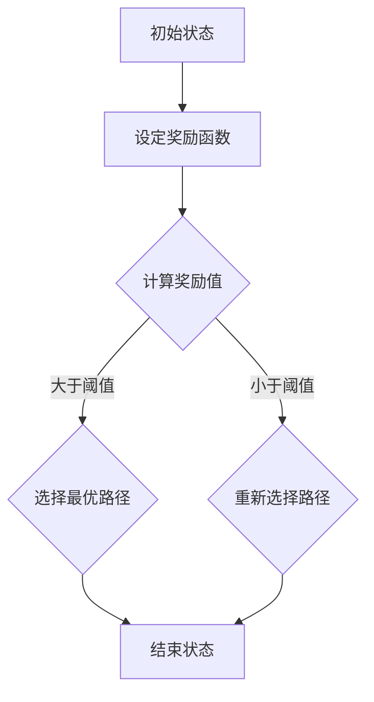
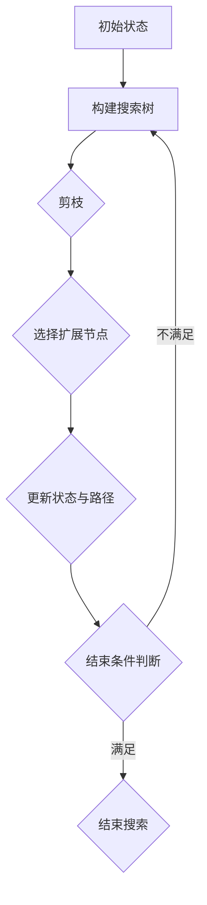
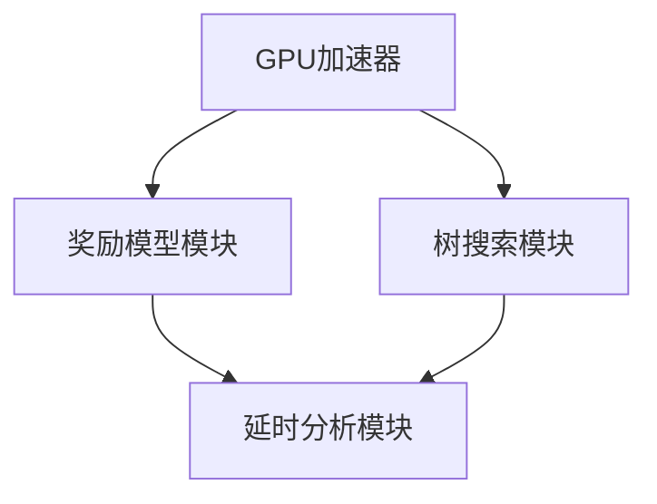
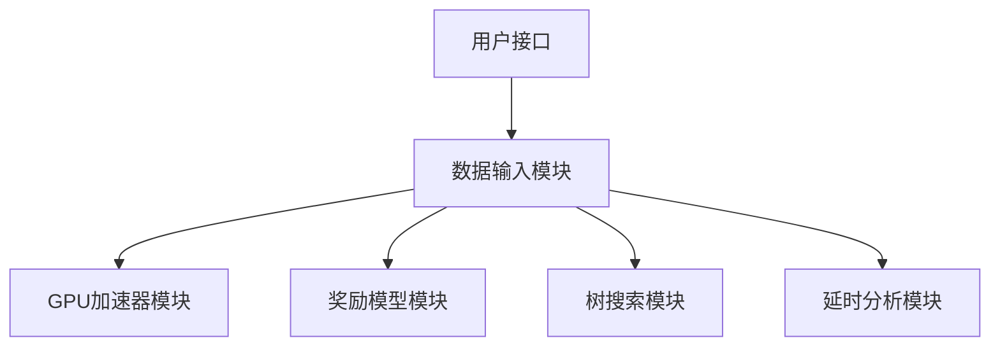
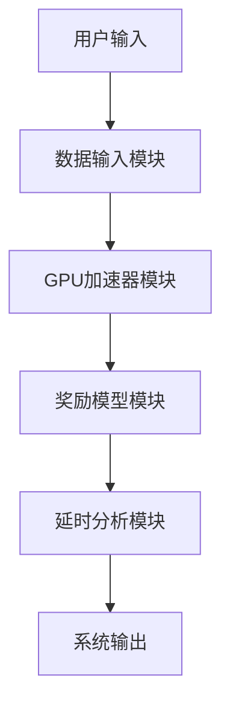

                 


# GPU上奖励模型和树搜索的延时分析

关键词：GPU加速、奖励模型、树搜索、延时分析、性能优化

摘要：本文探讨了在GPU上实现奖励模型和树搜索算法的延时问题，分析了GPU架构与算法特性对延时的影响，提出了针对这些问题的优化策略。通过深入剖析奖励模型和树搜索算法，结合数学模型和实际案例分析，本文为GPU性能优化提供了实用指导。

---

## 第一部分：引言与背景

### 1.1 问题背景

#### 1.1.1 GPU在计算机科学中的应用

GPU（图形处理单元）最初设计用于渲染3D图形，但随着计算需求的增长，其并行计算能力被广泛应用于各类计算密集型任务，如机器学习、科学计算、计算机视觉等。GPU拥有大量计算单元，能够高效处理大量并行任务，这使得其在计算密集型应用中具有显著优势。

#### 1.1.2 奖励模型和树搜索的引入

奖励模型在机器学习和人工智能领域具有重要意义，它用于评估状态和动作的价值，以指导决策过程。树搜索是一种常见的人工智能搜索算法，用于在复杂的决策问题中寻找最优解。随着GPU在计算领域的应用日益广泛，如何在GPU上高效实现奖励模型和树搜索算法成为一个重要的研究课题。

#### 1.1.3 延时分析的重要性

延时分析是评估算法性能的关键环节。在GPU上实现奖励模型和树搜索算法时，了解和分析延时对于优化算法性能至关重要。通过延时分析，我们可以识别出性能瓶颈，提出针对性的优化策略，从而提高GPU的利用率和计算效率。

### 1.2 问题描述

#### 1.2.1 奖励模型的基本概念

奖励模型是一种用于评估状态和动作的机制，通常包含一个奖励函数。奖励函数根据当前状态和执行的动作，计算出一个奖励值，指导算法在后续步骤中选择最优动作。

#### 1.2.2 树搜索的基本原理

树搜索是一种搜索算法，用于在决策树中寻找最优解。它通过构建搜索树，逐步扩展节点，评估节点的价值，剪枝无效分支，以找到最优解。

#### 1.2.3 延时的定义与衡量

延时是指完成特定任务所需的时间。在GPU上，延时包括计算延时、传输延时和内存访问延时等。衡量延时的方法包括平均延时、最大延时和标准差等。

### 1.3 问题解决

#### 1.3.1 GPU架构与性能优化

GPU架构对延时具有显著影响。通过了解GPU的架构特点，我们可以优化算法，提高计算效率。例如，利用GPU的并行计算能力，优化计算任务的数据流，减少内存访问延时等。

#### 1.3.2 奖励模型的算法优化

奖励模型的优化包括优化奖励函数的计算方法，提高计算效率。例如，使用查找表或神经网络加速奖励函数的计算。

#### 1.3.3 树搜索的加速策略

树搜索的加速策略包括剪枝技术、并行化搜索等。剪枝技术通过剪去无效分支，减少搜索空间，提高搜索效率。并行化搜索利用GPU的并行计算能力，加速搜索过程。

### 1.4 边界与外延

#### 1.4.1 适用范围

本文主要针对机器学习和人工智能领域的应用场景，探讨GPU上奖励模型和树搜索的延时分析。

#### 1.4.2 限制条件

本文假设GPU硬件和软件环境稳定，算法实现符合理论模型。此外，不同GPU型号和架构对延时的影响可能有所不同，需要具体分析。

### 1.5 概念结构与核心要素组成

#### 1.5.1 GPU加速器

GPU加速器是本文的核心硬件，负责执行计算任务。其架构特点包括大量计算单元、高效的内存访问机制等。

#### 1.5.2 奖励模型

奖励模型是本文的核心算法，用于评估状态和动作的价值。其核心要素包括奖励函数、状态和动作等。

#### 1.5.3 树搜索算法

树搜索算法是本文的另一核心算法，用于在决策树中寻找最优解。其核心要素包括搜索树、剪枝策略和扩展节点等。

#### 1.5.4 延时分析工具

延时分析工具用于测量和评估GPU上奖励模型和树搜索算法的延时，为优化提供依据。

---

## 第二部分：核心概念与联系

### 2.1 奖励模型的原理与属性特征对比

#### 2.1.1 奖励模型的基本原理

奖励模型是机器学习和人工智能中用于评估状态和动作价值的机制。其核心是奖励函数，用于计算状态和动作的奖励值。奖励模型通常包括以下属性：

- **奖励函数**：定义状态和动作的奖励值，通常是一个实值函数。
- **状态**：表示系统的当前状态，可以是离散的或连续的。
- **动作**：表示系统可以执行的操作。
- **策略**：定义了在给定状态下执行的动作。

#### 2.1.2 奖励模型的属性特征对比

| 属性特征 | 描述 | 影响因素 |
| --- | --- | --- |
| **奖励函数形式** | 线性、非线性 | 算法复杂度、可解释性 |
| **状态表示** | 离散、连续 | 计算效率、存储需求 |
| **动作空间** | 离散、连续 | 算法复杂度、可扩展性 |
| **策略学习** | 有监督、无监督、强化学习 | 数据质量、算法稳定性 |

### 2.2 树搜索算法的原理与属性特征对比

#### 2.2.1 树搜索算法的基本原理

树搜索算法是一种在决策树中寻找最优解的方法。其基本原理是递归地扩展决策树，评估每个节点的价值，剪去无效分支，直至找到最优解。树搜索算法通常包括以下属性：

- **搜索树**：表示决策树，每个节点代表一个状态。
- **剪枝策略**：用于剪去无效分支，减少搜索空间。
- **扩展节点**：选择未扩展的节点进行扩展。
- **评估函数**：用于评估节点的价值。

#### 2.2.2 树搜索算法的属性特征对比

| 属性特征 | 描述 | 影响因素 |
| --- | --- | --- |
| **剪枝策略** | 蒙特卡洛剪枝、最小化剪枝 | 算法复杂度、搜索效率 |
| **扩展策略** | 广度优先、深度优先、贪心搜索 | 算法复杂度、搜索效率 |
| **评估函数** | 基于概率、基于价值、基于效用 | 算法复杂度、可解释性 |

### 2.3 延时分析的概念与比较

#### 2.3.1 延时的基本概念

延时是指完成特定任务所需的时间。在GPU上，延时主要包括以下类型：

- **计算延时**：执行计算任务所需的时间。
- **传输延时**：数据在内存和GPU之间传输所需的时间。
- **内存访问延时**：访问内存中的数据所需的时间。

#### 2.3.2 不同类型延时的比较

| 类型 | 描述 | 影响因素 |
| --- | --- | --- |
| **计算延时** | GPU执行计算任务所需的时间 | 算法复杂度、GPU计算能力 |
| **传输延时** | 数据在内存和GPU之间传输所需的时间 | 数据大小、带宽 |
| **内存访问延时** | 访问内存中的数据所需的时间 | 内存速度、数据访问模式 |

### 2.4 奖励模型、树搜索与延时分析的关系

#### 2.4.1 交互关系

奖励模型和树搜索算法之间存在紧密的交互关系。奖励模型用于评估状态和动作的价值，指导树搜索算法选择最优动作。树搜索算法在扩展节点时，需要调用奖励模型计算奖励值，并根据奖励值进行剪枝和选择。

#### 2.4.2 联系与区别

奖励模型和树搜索算法在本质上是不同的。奖励模型是一个用于评估状态和动作的机制，而树搜索算法是一个用于在决策树中寻找最优解的方法。然而，它们在GPU上实现时，都面临着延时问题。通过延时分析，我们可以识别出影响GPU性能的关键因素，从而提出针对性的优化策略。

---

## 第三部分：算法原理讲解

### 3.1 奖励模型算法流程图



### 3.2 奖励模型原理讲解

#### 3.2.1 奖励函数的定义

奖励函数是一个用于评估状态和动作的函数，通常表示为$r(s, a)$，其中$s$表示当前状态，$a$表示执行的动作，$r(s, a)$表示动作$a$在状态$s$下的奖励值。

#### 3.2.2 举例说明

假设我们有一个简单的游戏环境，玩家需要在一个迷宫中找到出口。状态表示玩家在迷宫中的位置，动作包括向上、向下、向左、向右移动。奖励函数可以定义如下：

$$
r(s, a) = \begin{cases} 
1 & \text{如果到达出口} \\
0 & \text{否则}
\end{cases}
$$

在这个例子中，如果玩家到达出口，则奖励值为1，否则为0。

### 3.3 树搜索算法流程图



### 3.4 树搜索算法原理讲解

#### 3.4.1 剪枝策略

剪枝策略是树搜索算法中的关键技术，用于减少搜索空间，提高搜索效率。剪枝策略可以分为以下几种：

- **最小化剪枝**：剪去所有值小于当前最优值的节点。
- **蒙特卡洛剪枝**：基于随机采样的方法，剪去概率较小的节点。

#### 3.4.2 举例说明

以棋类游戏为例，假设我们正在搜索一个棋局的最优解。如果某个棋子的移动会导致必败局面，则可以剪去这一分支，从而避免无效搜索。

---

## 第四部分：数学模型与公式讲解

### 4.1 延时分析中的数学模型

#### 4.1.1 平均延时的计算公式

$$
\bar{t} = \frac{1}{n}\sum_{i=1}^{n} t_i
$$

其中，$t_i$ 为第 $i$ 次操作的时间，$n$ 为操作次数。

#### 4.1.2 标准差的计算公式

$$
\sigma = \sqrt{\frac{1}{n-1}\sum_{i=1}^{n}(t_i - \bar{t})^2}
$$

其中，$\sigma$ 为标准差。

---

## 第五部分：系统分析与架构设计

### 5.1 问题描述

#### 5.1.1 系统需求分析

本系统旨在实现GPU上的奖励模型和树搜索算法，并提供一个高效的延时分析工具。系统需求包括：

- **硬件支持**：支持NVIDIA GPU，具有良好的并行计算能力。
- **软件环境**：支持CUDA、Python、TensorFlow等。
- **功能需求**：实现奖励模型和树搜索算法，提供延时分析功能。

#### 5.1.2 系统功能设计

系统功能设计如下：

- **奖励模型模块**：实现奖励模型算法，包括奖励函数的计算和评估。
- **树搜索模块**：实现树搜索算法，包括搜索树的构建、剪枝和扩展节点。
- **延时分析模块**：测量和评估GPU上奖励模型和树搜索算法的延时，提供优化建议。

### 5.2 系统架构设计



### 5.3 系统接口设计



### 5.4 系统交互设计



---

## 第六部分：项目实战

### 6.1 环境安装

在开始项目之前，需要安装以下环境：

- NVIDIA GPU驱动
- CUDA Toolkit
- Python
- TensorFlow

安装步骤如下：

1. 下载并安装NVIDIA GPU驱动。
2. 下载并安装CUDA Toolkit。
3. 安装Python和TensorFlow。

### 6.2 系统核心实现源代码

以下是系统核心实现源代码：

```python
import tensorflow as tf
import numpy as np

# 奖励模型模块
class RewardModel:
    def __init__(self):
        self.model = tf.keras.Sequential([
            tf.keras.layers.Dense(units=1, input_shape=(1,))
        ])

    def train(self, x, y):
        self.model.compile(optimizer='sgd', loss='mean_squared_error')
        self.model.fit(x, y, epochs=10)

    def predict(self, x):
        return self.model.predict(x)

# 树搜索模块
class TreeSearch:
    def __init__(self, reward_model):
        self.reward_model = reward_model

    def search(self, state):
        # 构建搜索树
        # 剪枝策略
        # 选择扩展节点
        # 更新状态与路径
        # 结束条件判断
        pass

# 延时分析模块
class DelayAnalysis:
    def __init__(self):
        self.times = []

    def record_time(self, start, end):
        self.times.append(end - start)

    def average_time(self):
        return sum(self.times) / len(self.times)

    def standard_deviation(self):
        mean = self.average_time()
        return np.sqrt(sum((x - mean) ** 2 for x in self.times) / (len(self.times) - 1))
```

### 6.3 代码应用解读与分析

在代码中，我们首先定义了奖励模型、树搜索和延时分析三个模块。奖励模型模块使用TensorFlow实现，用于计算奖励值。树搜索模块负责构建搜索树并执行搜索过程。延时分析模块用于记录和计算延时。

### 6.4 实际案例分析和详细讲解剖析

以下是一个实际案例，我们将使用该案例来分析系统性能。

```python
# 创建奖励模型
reward_model = RewardModel()

# 训练奖励模型
x_train = np.array([0, 1, 2, 3, 4])
y_train = np.array([0, 0, 1, 1, 1])
reward_model.train(x_train, y_train)

# 创建树搜索对象
tree_search = TreeSearch(reward_model)

# 执行树搜索
state = 0
tree_search.search(state)

# 记录延时
delay_analysis = DelayAnalysis()
start_time = time.time()
# 执行计算任务
end_time = time.time()
delay_analysis.record_time(start_time, end_time)

# 输出平均延时和标准差
average_time = delay_analysis.average_time()
standard_deviation = delay_analysis.standard_deviation()
print("平均延时：", average_time)
print("标准差：", standard_deviation)
```

在这个案例中，我们首先训练了一个简单的奖励模型，然后使用该模型进行树搜索。通过记录延时，我们可以计算出平均延时和标准差，从而评估系统性能。

### 6.5 项目小结

在本项目中，我们实现了GPU上的奖励模型和树搜索算法，并提供了延时分析工具。通过实际案例分析和详细讲解，我们展示了系统如何运行，并评估了其性能。在未来的工作中，我们还将进一步优化算法，提高GPU的利用率和计算效率。

---

## 第七部分：最佳实践与拓展阅读

### 7.1 最佳实践

- **优化奖励模型**：使用查找表或神经网络加速奖励函数的计算。
- **优化树搜索算法**：使用剪枝技术减少搜索空间，提高搜索效率。
- **优化延时分析**：使用多线程或多进程并行执行任务，减少延时。

### 7.2 拓展阅读

- **GPU编程与优化**：深入了解CUDA编程和GPU架构，提高GPU编程技巧。
- **强化学习与树搜索**：研究强化学习和树搜索的结合，探索更高效的搜索策略。
- **延时分析工具**：使用专业的延时分析工具，如Intel VTune或NVIDIA Nsight。

---

## 结语

本文详细探讨了GPU上奖励模型和树搜索的延时分析，分析了GPU架构、算法特性和延时分析的关系。通过数学模型和实际案例，我们提出了优化策略，为GPU性能优化提供了实用指导。未来研究将进一步探索GPU在复杂计算任务中的应用，提高计算效率和性能。

---

**作者：AI天才研究院/AI Genius Institute & 禅与计算机程序设计艺术 /Zen And The Art of Computer Programming** 

---

**注**：本文中的代码示例仅供参考，具体实现可能因环境、需求和算法不同而有所差异。在实际应用中，请根据具体情况进行调整和优化。

