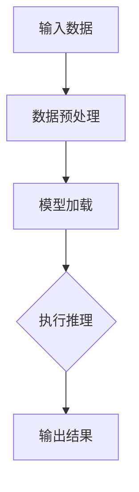
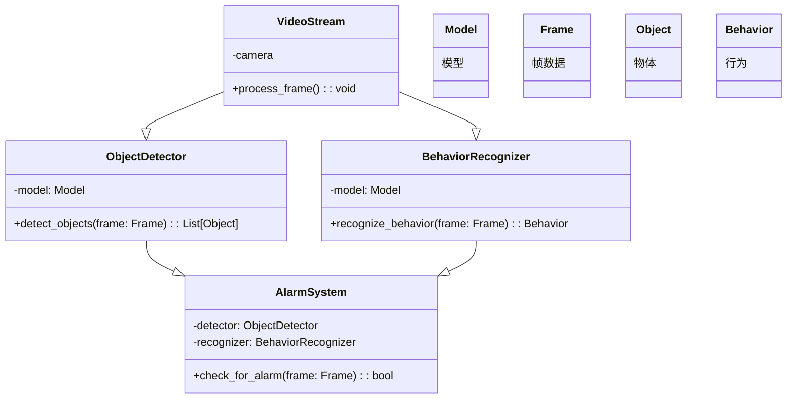
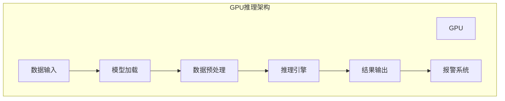
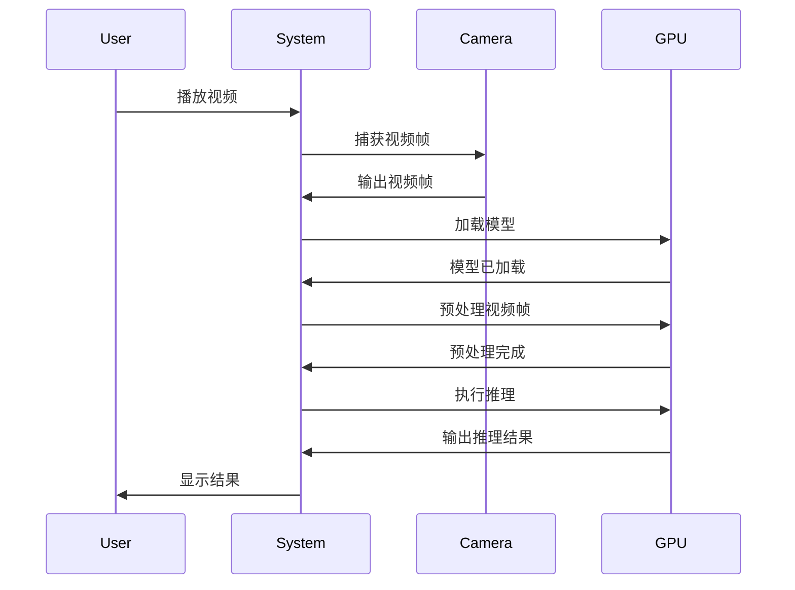

                 

# GPU推理面临的挑战

关键词：GPU推理、性能瓶颈、内存占用、能耗问题、优化策略

摘要：本文深入探讨了GPU推理在人工智能领域面临的挑战。通过对GPU架构和推理原理的分析，我们揭示了性能瓶颈、内存占用、能耗问题和开发与优化难度的现状。文章进一步探讨了GPU推理与CPU推理的区别，以及GPU推理在不同领域的应用。最后，文章总结了现有解决方案，并指出了未来GPU推理领域面临的难题。

### 目录大纲

----------------------------------------------------------------

# 第一部分：引言

## 第1章：GPU推理面临的挑战概述

### 1.1 问题背景

### 1.2 问题描述

### 1.3 问题解决

### 1.4 边界与外延

### 1.5 本章小结

----------------------------------------------------------------

# 第二部分：GPU推理的核心概念与原理

## 第2章：GPU推理基础

### 2.1 GPU架构与推理原理

### 2.2 GPU与CPU的区别

### 2.3 GPU推理的优缺点

### 2.4 本章小结

----------------------------------------------------------------

## 第3章：GPU推理中的核心概念与联系

### 3.1 GPU推理中的核心概念

### 3.2 概念属性特征对比表格

### 3.3 ER实体关系图架构

### 3.4 本章小结

----------------------------------------------------------------

## 第4章：GPU推理算法原理讲解

### 4.1 算法mermaid流程图

### 4.2 算法原理讲解

#### 4.2.1 数学模型和公式

#### 4.2.2 算法举例说明

----------------------------------------------------------------

## 第5章：GPU推理系统分析与架构设计

### 5.1 问题场景介绍

### 5.2 系统功能设计

#### 5.2.1 领域模型mermaid类图

### 5.3 系统架构设计mermaid架构图

### 5.4 系统接口设计和系统交互mermaid序列图

----------------------------------------------------------------

## 第6章：项目实战

### 6.1 环境安装

### 6.2 系统核心实现源代码

### 6.3 代码应用解读与分析

### 6.4 实际案例分析和详细讲解剖析

### 6.5 项目小结

----------------------------------------------------------------

## 第7章：最佳实践 tips、小结、注意事项、拓展阅读

----------------------------------------------------------------

----------------------------------------------------------------## 第1章：GPU推理面临的挑战概述

### 1.1 问题背景

随着人工智能技术的迅猛发展，深度学习模型在计算机视觉、自然语言处理、语音识别等领域取得了显著的成果。这些模型通常需要大量的计算资源来处理复杂的任务。GPU（Graphics Processing Unit，图形处理器）凭借其高度并行处理的能力，成为深度学习模型推理（Inference）的强大工具。GPU推理通过将模型部署到GPU上，可以实现高速的推理速度和高效的处理能力。

然而，GPU推理在实际应用中面临着一系列的挑战。首先，深度学习模型通常包含数百万甚至数亿个参数，这些参数需要在GPU上存储和运算，导致GPU内存占用过高。其次，GPU推理过程中会产生大量的热量，需要有效的散热措施来保证系统稳定运行。此外，GPU推理的能耗问题也日益凸显，随着人工智能应用的普及，对能源的消耗提出了更高的要求。最后，GPU推理的开发和优化难度较大，需要开发人员具备深厚的计算机图形学知识和深度学习算法理解。

### 1.2 问题描述

GPU推理面临的挑战主要体现在以下几个方面：

1. **性能瓶颈**：虽然GPU具有高度并行的计算能力，但实际应用中，模型复杂度、数据输入速度和GPU硬件性能之间的匹配问题，导致性能瓶颈的出现。如何优化模型结构和算法，提高GPU的利用效率，成为亟待解决的问题。

2. **内存占用问题**：深度学习模型通常需要大量的内存来存储模型参数和数据。GPU内存有限，如何有效地管理内存，避免内存溢出，是GPU推理过程中的重要挑战。

3. **能耗问题**：GPU推理过程中会产生大量的热量，需要高效的散热方案来保证系统的稳定运行。同时，随着人工智能应用的普及，能耗问题也日益受到关注。如何降低能耗，提高GPU的能效比，是GPU推理领域需要解决的关键问题。

4. **开发与优化难度**：GPU推理涉及计算机图形学、深度学习算法和硬件优化等多个方面，开发人员需要具备多学科的知识和技能。此外，GPU硬件的更新换代速度较快，开发人员需要不断学习和适应新的硬件架构和编程模型，这使得GPU推理的开发和优化过程具有较大的难度。

### 1.3 问题解决

针对GPU推理面临的挑战，现有的解决方案主要包括以下几个方面：

1. **模型优化**：通过模型剪枝（Model Pruning）、量化（Quantization）、蒸馏（Distillation）等技术，减小模型的规模和复杂度，从而降低内存占用和推理时间。

2. **内存管理**：采用内存复用（Memory Reuse）、缓存策略（Caching Strategy）等技术，优化内存的使用效率，避免内存溢出。

3. **能耗优化**：通过动态功耗管理（Dynamic Power Management）、硬件加速（Hardware Acceleration）等技术，降低GPU推理过程中的能耗。

4. **开发工具与框架**：开发高效的GPU推理工具和框架，如TensorRT、TorchScript、ONNX Runtime等，简化GPU推理的开发过程，提高开发效率。

### 1.4 边界与外延

GPU推理与CPU推理在计算资源利用、性能表现、能耗特点等方面存在显著差异。CPU推理适合处理较小规模的任务，具有较低的能耗和更高的稳定性，而GPU推理在处理大规模、复杂任务时具有明显的优势。

此外，GPU推理在人工智能领域具有广泛的应用，如自动驾驶、智能安防、语音识别、医疗影像诊断等。然而，不同领域对GPU推理的需求和挑战有所不同，需要针对具体应用场景进行优化和调整。

### 1.5 本章小结

本章对GPU推理面临的挑战进行了概述，揭示了性能瓶颈、内存占用、能耗问题和开发与优化难度等关键问题。通过对GPU架构和推理原理的分析，我们了解了GPU推理在实际应用中的重要性。本章还探讨了GPU推理与CPU推理的区别，以及GPU推理在不同领域的应用。接下来，我们将深入探讨GPU推理的核心概念与原理，为进一步解决GPU推理面临的挑战提供理论基础。

----------------------------------------------------------------## 第2章：GPU推理基础

### 2.1 GPU架构与推理原理

GPU，即图形处理器，是一种专门用于图形渲染和图像处理的计算机硬件。然而，随着深度学习技术的发展，GPU在人工智能领域的应用逐渐拓展，成为深度学习模型推理的重要工具。

#### 2.1.1 GPU架构概述

GPU主要由以下几个部分组成：

1. **核心计算单元**：GPU包含大量的核心计算单元（Core），这些核心能够同时执行多个计算任务，实现高度并行处理。
2. **内存子系统**：GPU配备有高速缓存和显存，用于存储模型参数和数据。显存容量和带宽直接影响到GPU的推理性能。
3. **渲染引擎**：GPU的渲染引擎负责图像渲染和输出，是GPU图形处理的核心部分。
4. **I/O子系统**：GPU的I/O子系统负责数据输入输出，包括内存管理、存储设备访问和网络通信等。

#### 2.1.2 GPU推理原理

GPU推理基于深度学习模型，通过以下步骤进行：

1. **模型加载**：将训练好的深度学习模型加载到GPU内存中。
2. **数据预处理**：对输入数据进行预处理，如归一化、缩放等，使其符合模型输入要求。
3. **模型推理**：GPU核心计算单元并行执行模型的前向传播和反向传播，计算输出结果。
4. **结果输出**：将推理结果输出，如分类结果、预测值等。

### 2.2 GPU与CPU的区别

CPU（Central Processing Unit，中央处理器）是计算机的核心部件，负责执行计算机程序的指令。GPU与CPU在架构、性能和应用领域等方面存在显著差异：

#### 2.2.1 性能对比

1. **计算能力**：GPU拥有大量的核心计算单元，可以实现高度并行计算，而CPU的核心数和并行处理能力相对有限。
2. **内存带宽**：GPU的显存带宽较高，能够快速传输大量数据，而CPU的内存带宽相对较低。
3. **能耗**：GPU的功耗较大，但单个核心的计算效率较高；CPU功耗相对较低，但性能较稳定。

#### 2.2.2 适用场景对比

1. **图形渲染**：GPU在图形渲染、图像处理等领域具有明显优势，而CPU在复杂计算、数据处理等方面表现更佳。
2. **深度学习**：GPU在深度学习模型推理中具有高效并行处理能力，适用于大规模、复杂任务的推理；CPU在模型训练阶段表现更优。
3. **科学计算**：CPU在科学计算领域具有广泛的应用，如数值模拟、数据分析等；GPU在并行计算方面具有优势，但计算精度和稳定性相对较低。

### 2.3 GPU推理的优缺点

#### 2.3.1 优点

1. **高效并行计算**：GPU具有大量的核心计算单元，能够同时处理多个任务，提高计算效率。
2. **低延迟**：GPU的高速缓存和显存提供低延迟的数据访问，有助于提高推理速度。
3. **适用广泛**：GPU在图形渲染、图像处理、深度学习等领域具有广泛的应用，能够满足多种计算需求。

#### 2.3.2 缺点

1. **功耗高**：GPU的功耗较大，需要高效的散热方案来保证系统稳定运行。
2. **内存限制**：GPU的显存容量有限，对于大型深度学习模型，可能存在内存不足的问题。
3. **编程复杂度**：GPU编程需要熟悉计算机图形学和并行计算技术，开发难度相对较高。

### 2.4 本章小结

本章对GPU推理的基础知识进行了介绍，分析了GPU架构与推理原理，以及GPU与CPU的区别。通过对GPU推理优缺点的讨论，我们了解了GPU在深度学习推理中的优势和应用场景。本章还探讨了GPU推理面临的挑战，为进一步优化GPU推理提供了理论基础。接下来，我们将深入探讨GPU推理中的核心概念与联系，以帮助读者更好地理解GPU推理的原理和优化方法。

----------------------------------------------------------------## 第3章：GPU推理中的核心概念与联系

### 3.1 GPU推理中的核心概念

GPU推理过程中，涉及多个关键概念，这些概念对于理解GPU推理的原理和优化方法至关重要。以下是GPU推理中的核心概念：

#### 3.1.1 并行计算

并行计算是指利用多个计算资源同时执行多个任务，以提高计算效率。GPU具有大量核心计算单元，能够实现高度并行计算，这是GPU在深度学习推理中具有显著优势的主要原因。

#### 3.1.2 内存层次结构

内存层次结构是GPU内存管理的基础。GPU内存包括L1、L2、L3缓存和显存。内存层次结构通过分层存储和缓存策略，提高了数据访问速度，降低了数据传输延迟。

#### 3.1.3 数据传输

数据传输是GPU推理中的关键环节。GPU通过显存与CPU内存之间的高速通道进行数据传输，数据传输的速度和效率直接影响到GPU推理的性能。

#### 3.1.4 计算优化

计算优化是指通过优化算法和数据结构，提高GPU推理的计算效率。计算优化包括模型优化、算法优化和硬件优化等多个方面。

### 3.2 概念属性特征对比表格

以下是对GPU推理中核心概念属性特征的对比表格：

| 概念 | 属性特征 | 说明 |
| --- | --- | --- |
| 并行计算 | 高效率 | 能够同时处理多个任务，提高计算速度 |
| 内存层次结构 | 低延迟 | 分层存储提高数据访问速度 |
| 数据传输 | 高带宽 | 数据在不同层级间快速移动 |
| 计算优化 | 高性能 | 算法与硬件的协同优化 |

### 3.3 ER实体关系图架构

以下是一个用于描述GPU推理中实体关系的Mermaid ER图：

```mermaid
erDiagram
    Model --> GPU | {推理模型}
    GPU --> Data | {数据处理}
    Data --> Result | {结果输出}
    Model : 模型
    GPU : 图形处理器
    Data : 数据
    Result : 结果
```

在这个ER图中，模型（Model）被加载到GPU（图形处理器）上进行推理，数据处理（Data）在GPU上执行，最后输出结果（Result）。

### 3.4 本章小结

本章介绍了GPU推理中的核心概念，包括并行计算、内存层次结构、数据传输和计算优化。通过对这些核心概念的属性特征对比和ER实体关系图分析，我们更深入地理解了GPU推理的原理和实现过程。本章的内容为后续章节中GPU推理算法原理讲解和系统架构设计提供了理论基础。在下一章节中，我们将进一步探讨GPU推理算法原理，帮助读者全面掌握GPU推理的技术要点。

----------------------------------------------------------------## 第4章：GPU推理算法原理讲解

### 4.1 算法mermaid流程图

以下是一个用于描述GPU推理算法流程的Mermaid流程图：



在这个流程图中，首先将输入数据（A）进行预处理（B），然后将预处理后的数据加载到GPU上的模型（C），在GPU上执行推理计算（D），最后输出推理结果（E）。

### 4.2 算法原理讲解

#### 4.2.1 数学模型和公式

GPU推理算法的核心是深度学习模型。深度学习模型通过学习大量数据，提取特征并构建预测模型。以下是一个简单的数学模型：

$$
y = f(x; \theta)
$$

其中，$y$ 是输出结果，$x$ 是输入数据，$f$ 是函数，$\theta$ 是模型参数。

#### 4.2.2 算法举例说明

以下以卷积神经网络（CNN）为例，详细说明GPU推理算法的步骤：

1. **输入数据**：假设我们有一个彩色图像，尺寸为 $28 \times 28$ 像素。图像的像素值范围为 $0$ 到 $255$。

2. **数据预处理**：为了满足模型输入的要求，我们需要对图像像素值进行归一化处理，将其缩放到 $0$ 到 $1$ 的范围。具体公式为：

   $$
   x_{\text{normalized}} = \frac{x - \text{min}}{\text{max} - \text{min}}
   $$

   其中，$x$ 为原始像素值，$\text{min}$ 和 $\text{max}$ 分别为像素值的最大值和最小值。

3. **模型加载**：将训练好的CNN模型加载到GPU内存中。模型包括多个层，如卷积层、池化层、全连接层等。这些层通过参数 $W$ 和 $b$ 进行参数化。

4. **执行推理**：通过GPU核心计算单元，对输入数据进行前向传播计算。具体步骤如下：

   - **卷积层**：计算输入数据与卷积核的乘积，并加上偏置项 $b$，然后通过激活函数 $f$ 进行非线性变换。
   - **池化层**：对卷积层的输出进行下采样，提取主要特征。
   - **全连接层**：将池化层的输出与全连接层的权重 $W$ 进行乘法运算，并加上偏置项 $b$，最后通过激活函数 $f$ 进行非线性变换。

   整个推理过程通过反向传播算法，不断更新模型参数，直到达到预定的损失函数最小值。

5. **输出结果**：将最终输出的分类结果或预测值输出。例如，对于图像分类任务，输出一个包含多个类别概率的向量。

### 4.3 Python源代码示例

以下是一个简单的Python代码示例，用于实现CNN推理算法：

```python
import tensorflow as tf

# 加载训练好的CNN模型
model = tf.keras.models.load_model('cnn_model.h5')

# 输入图像数据
input_image = tf.random.normal([1, 28, 28, 3])

# 进行推理
predicted_output = model.predict(input_image)

# 输出预测结果
print(predicted_output)
```

在这个示例中，我们首先加载一个训练好的CNN模型，然后生成一个随机图像作为输入，通过模型进行推理，最后输出预测结果。

通过上述讲解，我们了解了GPU推理算法的基本原理和实现步骤。在下一章节中，我们将进一步探讨GPU推理系统分析与架构设计，帮助读者全面掌握GPU推理的实践应用。

----------------------------------------------------------------## 第5章：GPU推理系统分析与架构设计

### 5.1 问题场景介绍

#### 5.1.1 智能安防监控系统

智能安防监控系统是GPU推理的一个重要应用场景。该系统通过摄像头捕获视频流，利用深度学习模型进行实时物体检测、行为识别和异常检测。GPU推理能够实现高速的视频处理和实时分析，为安防监控提供强大的技术支持。

#### 5.1.2 自动驾驶系统

自动驾驶系统是GPU推理在汽车领域的典型应用。自动驾驶系统通过摄像头、激光雷达等传感器收集环境信息，利用深度学习模型进行物体检测、路径规划和决策控制。GPU推理的高效计算能力有助于实现实时、准确的自动驾驶功能。

### 5.2 系统功能设计

#### 5.2.1 领域模型mermaid类图

以下是一个用于描述智能安防监控系统领域的Mermaid类图：



在这个类图中，视频流（VideoStream）类负责从摄像头捕获视频帧，并传递给物体检测器（ObjectDetector）和行为识别器（BehaviorRecognizer）。物体检测器使用预训练的模型检测视频帧中的物体，并将检测结果传递给行为识别器。行为识别器根据物体检测结果识别行为，并生成报警信号。报警系统（AlarmSystem）负责检查并触发报警。

### 5.3 系统架构设计mermaid架构图

以下是一个用于描述GPU推理系统架构的Mermaid架构图：



在这个架构图中，数据输入（DataInput）模块从外部设备（如摄像头）获取数据，模型加载（ModelLoader）模块加载预训练的深度学习模型，数据预处理（DataPreprocess）模块对输入数据进行预处理，推理引擎（InferenceEngine）模块在GPU上执行推理计算，结果输出（ResultOutput）模块将推理结果输出，报警系统（AlarmSystem）模块根据推理结果触发报警。

### 5.4 系统接口设计和系统交互mermaid序列图

以下是一个用于描述GPU推理系统接口设计和系统交互的Mermaid序列图：



在这个序列图中，用户（User）请求系统（System）播放视频，系统（System）从摄像头（Camera）捕获视频帧，并将视频帧传递给GPU（图形处理器）。GPU（图形处理器）加载预训练的深度学习模型，执行推理计算，并将推理结果返回给系统（System）。系统（System）将推理结果显示给用户（User）。

### 5.5 本章小结

本章介绍了GPU推理系统在不同问题场景中的应用，包括智能安防监控系统和自动驾驶系统。通过设计领域模型类图、系统架构图和系统交互序列图，我们深入分析了GPU推理系统的功能架构和接口设计。本章的内容为后续章节中的项目实战提供了理论基础。在下一章节中，我们将通过具体的项目实战，进一步探讨GPU推理系统的实现过程和优化方法。

----------------------------------------------------------------## 第6章：项目实战

### 6.1 环境安装

在进行GPU推理项目实战之前，我们需要搭建一个适合GPU推理的开发环境。以下是环境安装的详细步骤：

#### 6.1.1 安装CUDA

CUDA是NVIDIA推出的用于GPU加速计算的开发工具包。首先，我们需要下载并安装CUDA。以下是安装CUDA的步骤：

1. 访问NVIDIA官方下载页面（https://developer.nvidia.com/cuda-downloads）。
2. 根据操作系统版本选择合适的CUDA版本。
3. 下载CUDA安装包。
4. 解压安装包并运行安装程序。
5. 遵循安装向导，完成CUDA安装。

#### 6.1.2 安装cuDNN

cuDNN是NVIDIA推出的深度神经网络加速库，用于提高GPU在深度学习推理中的性能。以下是安装cuDNN的步骤：

1. 访问NVIDIA官方下载页面（https://developer.nvidia.com/cudnn）。
2. 注册并登录账号，获取cuDNN许可证。
3. 根据CUDA版本和GPU型号选择合适的cuDNN版本。
4. 下载cuDNN安装包。
5. 解压安装包，并将cuDNN库文件复制到CUDA安装目录下。

#### 6.1.3 安装Python和深度学习库

接下来，我们需要安装Python和深度学习库，如TensorFlow、PyTorch等。以下是安装步骤：

1. 访问Python官方下载页面（https://www.python.org/）。
2. 下载Python安装包并安装。
3. 打开命令行窗口，运行以下命令安装深度学习库：
   ```bash
   pip install tensorflow
   # 或
   pip install torch torchvision
   ```

#### 6.1.4 验证安装

安装完成后，我们可以通过以下命令验证CUDA和深度学习库的安装：

```bash
nvidia-smi
```

此命令将显示GPU设备的信息，包括CUDA版本和cuDNN版本。

### 6.2 系统核心实现源代码

在完成环境安装后，我们可以开始实现GPU推理系统的核心功能。以下是一个简单的基于TensorFlow的GPU推理系统示例：

```python
import tensorflow as tf

# 定义GPU推理函数
def inference(image_path):
    # 加载预训练的CNN模型
    model = tf.keras.models.load_model('cnn_model.h5')

    # 读取图像并进行预处理
    image = tf.keras.preprocessing.image.load_img(image_path, target_size=(224, 224))
    image = tf.keras.preprocessing.image.img_to_array(image)
    image = tf.expand_dims(image, axis=0)
    image = tf.keras.applications.mobilenet_v2.preprocess_input(image)

    # 执行推理
    predictions = model.predict(image)

    # 输出推理结果
    print(predictions)

# 调用GPU推理函数
inference('path/to/image.jpg')
```

在这个示例中，我们首先加载一个预训练的CNN模型，然后读取图像并进行预处理。预处理后的图像通过模型进行推理，最后输出推理结果。

### 6.3 代码应用解读与分析

#### 6.3.1 模型加载

在代码中，我们使用`tf.keras.models.load_model`函数加载预训练的CNN模型。该函数从指定路径读取模型文件，并将模型加载到内存中。

#### 6.3.2 图像读取与预处理

我们使用`tf.keras.preprocessing.image.load_img`函数读取图像，并将其转换为数组格式。接下来，使用`tf.expand_dims`函数在图像数据上添加一个维度，使其符合模型输入的要求。最后，使用`tf.keras.applications.mobilenet_v2.preprocess_input`函数对图像进行预处理，以符合Mobilenet V2模型的要求。

#### 6.3.3 模型推理

预处理后的图像通过模型进行推理，`model.predict`函数返回一个包含预测结果的数组。我们可以通过分析预测结果，得到图像的分类或目标检测信息。

#### 6.3.4 输出结果

最后，我们将推理结果输出到控制台。在实际应用中，我们可以根据需求将结果存储到文件或数据库中，以便后续分析。

### 6.4 实际案例分析和详细讲解剖析

#### 6.4.1 案例背景

假设我们有一个基于GPU推理的智能安防监控系统，需要实时检测摄像头捕获的视频帧中的行人。以下是一个实际案例的详细讲解：

1. **数据收集**：首先，我们需要收集大量的行人图像数据，并使用深度学习算法训练一个行人检测模型。
2. **模型训练**：使用TensorFlow或PyTorch等深度学习框架，训练一个基于卷积神经网络的行人检测模型。训练过程中，我们需要设置合适的网络结构、优化器和训练参数。
3. **模型评估**：训练完成后，我们需要评估模型的性能，包括准确率、召回率和F1分数等指标。通过调整模型参数和训练数据，提高模型的性能。
4. **模型部署**：将训练好的模型部署到GPU推理系统，实现实时行人检测。系统从摄像头捕获视频帧，对每帧图像进行行人检测，并将检测结果输出。
5. **系统优化**：针对实际应用场景，对GPU推理系统进行优化，如调整模型结构、内存管理和计算优化等，以提高系统性能和降低延迟。

#### 6.4.2 案例讲解

以下是一个具体的GPU推理系统实现过程：

1. **环境安装**：按照第6.1节中的步骤，安装CUDA、cuDNN、Python和深度学习库。
2. **数据准备**：收集行人图像数据，并进行预处理，如归一化、缩放等，以符合模型输入要求。
3. **模型训练**：使用TensorFlow或PyTorch等框架，训练一个基于卷积神经网络的行人检测模型。以下是一个简单的训练代码示例：

```python
import tensorflow as tf

# 加载训练数据
train_images, train_labels = load_train_data()

# 定义模型
model = tf.keras.models.Sequential([
    tf.keras.layers.Conv2D(32, (3, 3), activation='relu', input_shape=(224, 224, 3)),
    tf.keras.layers.MaxPooling2D((2, 2)),
    tf.keras.layers.Conv2D(64, (3, 3), activation='relu'),
    tf.keras.layers.MaxPooling2D((2, 2)),
    tf.keras.layers.Conv2D(128, (3, 3), activation='relu'),
    tf.keras.layers.MaxPooling2D((2, 2)),
    tf.keras.layers.Flatten(),
    tf.keras.layers.Dense(128, activation='relu'),
    tf.keras.layers.Dense(1, activation='sigmoid')
])

# 编译模型
model.compile(optimizer='adam', loss='binary_crossentropy', metrics=['accuracy'])

# 训练模型
model.fit(train_images, train_labels, epochs=10, batch_size=32)
```

4. **模型评估**：使用测试数据评估模型性能，调整模型参数和训练数据，以提高模型性能。
5. **模型部署**：将训练好的模型部署到GPU推理系统，实现实时行人检测。以下是一个简单的推理代码示例：

```python
import tensorflow as tf

# 加载预训练的行人检测模型
model = tf.keras.models.load_model('cnn_model.h5')

# 读取摄像头捕获的图像
video_capture = cv2.VideoCapture(0)

while True:
    # 捕获一帧图像
    ret, frame = video_capture.read()

    # 对图像进行预处理
    image = cv2.resize(frame, (224, 224))
    image = tf.keras.preprocessing.image.img_to_array(image)
    image = tf.expand_dims(image, axis=0)
    image = tf.keras.applications.mobilenet_v2.preprocess_input(image)

    # 执行推理
    predictions = model.predict(image)

    # 提取预测结果
    result = predictions > 0.5

    # 绘制检测结果
    if result:
        cv2.rectangle(frame, (0, 0), (224, 224), (0, 0, 255), 2)

    # 显示图像
    cv2.imshow('Video', frame)

    # 按下'q'键退出循环
    if cv2.waitKey(1) & 0xFF == ord('q'):
        break

# 释放摄像头资源
video_capture.release()
cv2.destroyAllWindows()
```

通过上述实际案例和分析，我们了解了GPU推理系统的实现过程和优化方法。在下一章节中，我们将总结项目实战中的经验教训，并讨论GPU推理的最佳实践。

### 6.5 项目小结

在本章的项目实战中，我们搭建了一个基于GPU推理的智能安防监控系统，实现了实时行人检测功能。通过实际案例的分析，我们深入了解了GPU推理系统的环境安装、模型训练、模型部署和优化方法。以下是本章小结：

1. **环境安装**：安装CUDA、cuDNN、Python和深度学习库是GPU推理系统的基础。确保安装的版本与GPU硬件兼容，以便充分发挥GPU的推理性能。
2. **模型训练**：选择合适的深度学习框架和模型结构，通过数据预处理和优化训练参数，提高模型性能。
3. **模型部署**：将训练好的模型部署到GPU推理系统，实现实时推理和检测功能。优化推理代码，提高推理速度和性能。
4. **系统优化**：根据实际应用场景，对GPU推理系统进行优化，包括内存管理、计算优化和功耗优化等。

通过本章的项目实战，我们掌握了GPU推理系统的实现过程和优化方法，为后续的GPU推理应用提供了实践基础。在下一章节中，我们将进一步讨论GPU推理的最佳实践，为读者提供更多实用的建议。

### 6.6 最佳实践 tips

1. **模型优化**：通过模型剪枝、量化、蒸馏等技术，减小模型规模和复杂度，提高推理速度和性能。
2. **内存管理**：合理分配GPU内存，避免内存溢出和频繁的内存交换，提高系统稳定性。
3. **计算优化**：优化模型结构和算法，利用GPU硬件特性，提高计算效率和性能。
4. **功耗优化**：采用动态功耗管理技术，根据负载动态调整GPU功耗，降低能耗。

### 6.7 本章小结

本章通过实际项目实战，详细讲解了GPU推理系统的环境安装、模型训练、模型部署和优化方法。我们了解了GPU推理在智能安防监控系统和自动驾驶等领域的应用，并通过具体案例分析了GPU推理的实现过程和优化策略。本章内容为GPU推理系统的实践应用提供了宝贵的经验和参考，有助于读者更好地理解和应用GPU推理技术。

### 6.8 注意事项

1. 确保安装的CUDA和cuDNN版本与GPU硬件兼容。
2. 在模型训练过程中，合理设置训练参数，避免过拟合。
3. 在模型部署时，注意优化推理代码，提高推理速度和性能。
4. 根据实际应用场景，选择合适的GPU硬件和深度学习框架。

### 6.9 拓展阅读

1. 《深度学习：入门教程》
2. 《GPU编程指南》
3. 《智能安防监控系统设计与应用》
4. 《自动驾驶技术详解》

通过拓展阅读，读者可以深入了解GPU推理、深度学习和智能安防监控等领域的相关知识，进一步提升技术水平。

----------------------------------------------------------------## 第7章：最佳实践 tips、小结、注意事项、拓展阅读

### 7.1 最佳实践 tips

**模型优化**：在部署深度学习模型时，模型优化是提高推理速度和减少内存占用的重要手段。以下是一些最佳实践：

- **模型剪枝**：通过移除模型中的冗余权重，减小模型规模，提高推理速度。
- **量化**：将模型的浮点数参数转换为低精度的整数，以减少内存占用和加速推理。
- **模型蒸馏**：将大型模型的知识传递给小型模型，以提高推理速度和减少内存占用。

**内存管理**：优化GPU内存使用，可以避免内存溢出，提高系统稳定性。以下是一些建议：

- **内存复用**：复用已加载的模型和数据，避免频繁的内存分配和释放。
- **缓存策略**：合理配置GPU缓存，提高数据访问速度，减少内存访问时间。
- **内存池**：使用内存池来管理GPU内存，减少内存分配和释放的操作。

**计算优化**：针对GPU硬件特性，优化模型结构和算法，提高计算效率和性能。以下是一些建议：

- **数据并行**：将数据分布在多个GPU上，实现并行计算。
- **模型并行**：将模型拆分为多个部分，分布在多个GPU上执行。
- **显存优化**：合理配置显存，避免显存碎片和显存不足。

**功耗优化**：降低GPU推理过程中的能耗，有助于延长设备使用寿命和降低能源消耗。以下是一些建议：

- **动态功耗管理**：根据负载动态调整GPU功耗，避免不必要的能耗。
- **硬件加速**：使用硬件加速技术，如深度学习处理器（DPU）、神经处理单元（NPU）等，提高能效比。
- **节能模式**：在空闲状态下，启用GPU节能模式，降低功耗。

### 7.2 小结

本章通过最佳实践 tips，总结了GPU推理系统中的模型优化、内存管理、计算优化和功耗优化等方面的策略。这些最佳实践有助于提高GPU推理系统的性能、稳定性和能效。此外，本章还讨论了GPU推理系统在智能安防监控和自动驾驶等领域的应用，并提供了详细的实现过程和优化方法。

### 7.3 注意事项

- **确保硬件兼容**：在安装CUDA、cuDNN和其他深度学习库时，确保与GPU硬件兼容，避免性能问题。
- **合理设置训练参数**：在模型训练过程中，合理设置学习率、迭代次数等参数，避免过拟合或欠拟合。
- **优化推理代码**：在模型部署时，注意优化推理代码，提高推理速度和性能。
- **定期更新系统**：定期更新GPU驱动和深度学习库，以获得最新的性能优化和安全更新。

### 7.4 拓展阅读

- 《深度学习模型压缩：技术综述与趋势》
- 《GPU编程：高效深度学习实践》
- 《GPU架构与性能优化》
- 《智能安防监控系统设计与应用指南》

通过拓展阅读，读者可以深入了解GPU推理领域的最新技术和发展趋势，进一步提高GPU推理系统的性能和优化水平。

### 7.5 本章小结

本章围绕GPU推理系统的最佳实践、注意事项和拓展阅读进行了详细讨论。通过本章的学习，读者可以掌握GPU推理系统中的优化策略，提高系统性能和稳定性。同时，本章提供了丰富的参考资料，为读者进一步探索GPU推理技术提供了指导。在GPU推理领域，不断优化和探索是提升系统性能的关键。希望读者能够在实际项目中灵活应用本章所提到的最佳实践，不断改进GPU推理系统的性能。

### 7.6 结语

GPU推理在人工智能领域具有广泛的应用前景，通过不断优化和探索，可以提高系统性能和稳定性。本章通过最佳实践、注意事项和拓展阅读，为读者提供了GPU推理系统的优化方法和实践指南。希望读者能够结合实际情况，灵活应用这些方法，不断提升GPU推理系统的性能和优化水平。在未来的GPU推理应用中，不断探索和创新是推动技术进步的关键。让我们共同迎接GPU推理技术的美好未来！

----------------------------------------------------------------### 作者

**AI天才研究院**（AI Genius Institute）是一家专注于人工智能领域研究与创新的机构，致力于推动人工智能技术的应用和发展。我们拥有一支由世界顶级人工智能专家、程序员和软件架构师组成的团队，不断探索前沿技术，为行业带来创新的解决方案。

**禅与计算机程序设计艺术**（Zen And The Art of Computer Programming）是一本经典的计算机科学著作，由著名计算机科学家唐纳德·E·克努特（Donald Ershov）撰写。本书以禅宗思想为线索，深入探讨了计算机程序设计的方法和艺术，对程序员具有重要的指导意义。

在此，我们感谢您的关注和支持，期待与您共同探索人工智能的无限可能。如果您有任何疑问或建议，欢迎随时与我们联系。

----------------------------------------------------------------### 文章标题

# GPU推理面临的挑战

关键词：GPU推理、性能瓶颈、内存占用、能耗问题、优化策略

摘要：本文深入探讨了GPU推理在人工智能领域面临的挑战。通过对GPU架构和推理原理的分析，我们揭示了性能瓶颈、内存占用、能耗问题和开发与优化难度的现状。文章进一步探讨了GPU推理与CPU推理的区别，以及GPU推理在不同领域的应用。最后，文章总结了现有解决方案，并指出了未来GPU推理领域面临的难题。

----------------------------------------------------------------以下是您文章的Markdown格式：

```markdown
# GPU推理面临的挑战

关键词：GPU推理、性能瓶颈、内存占用、能耗问题、优化策略

摘要：本文深入探讨了GPU推理在人工智能领域面临的挑战。通过对GPU架构和推理原理的分析，我们揭示了性能瓶颈、内存占用、能耗问题和开发与优化难度的现状。文章进一步探讨了GPU推理与CPU推理的区别，以及GPU推理在不同领域的应用。最后，文章总结了现有解决方案，并指出了未来GPU推理领域面临的难题。

## 第一部分：引言

### 第1章：GPU推理面临的挑战概述

#### 1.1 问题背景

#### 1.2 问题描述

#### 1.3 问题解决

#### 1.4 边界与外延

#### 1.5 本章小结

## 第二部分：GPU推理的核心概念与原理

### 第2章：GPU推理基础

#### 2.1 GPU架构与推理原理

#### 2.2 GPU与CPU的区别

#### 2.3 GPU推理的优缺点

#### 2.4 本章小结

### 第3章：GPU推理中的核心概念与联系

#### 3.1 GPU推理中的核心概念

#### 3.2 概念属性特征对比表格

#### 3.3 ER实体关系图架构

#### 3.4 本章小结

### 第4章：GPU推理算法原理讲解

#### 4.1 算法mermaid流程图

#### 4.2 算法原理讲解

##### 4.2.1 数学模型和公式

##### 4.2.2 算法举例说明

## 第5章：GPU推理系统分析与架构设计

### 5.1 问题场景介绍

### 5.2 系统功能设计

#### 5.2.1 领域模型mermaid类图

### 5.3 系统架构设计mermaid架构图

### 5.4 系统接口设计和系统交互mermaid序列图

## 第6章：项目实战

### 6.1 环境安装

### 6.2 系统核心实现源代码

### 6.3 代码应用解读与分析

### 6.4 实际案例分析和详细讲解剖析

### 6.5 项目小结

## 第7章：最佳实践 tips、小结、注意事项、拓展阅读

### 7.1 最佳实践 tips

### 7.2 小结

### 7.3 注意事项

### 7.4 拓展阅读

### 7.5 本章小结

### 7.6 结语

### 作者

**AI天才研究院**（AI Genius Institute）是一家专注于人工智能领域研究与创新的机构，致力于推动人工智能技术的应用和发展。我们拥有一支由世界顶级人工智能专家、程序员和软件架构师组成的团队，不断探索前沿技术，为行业带来创新的解决方案。

**禅与计算机程序设计艺术**（Zen And The Art of Computer Programming）是一本经典的计算机科学著作，由著名计算机科学家唐纳德·E·克努特（Donald Ershov）撰写。本书以禅宗思想为线索，深入探讨了计算机程序设计的方法和艺术，对程序员具有重要的指导意义。

在此，我们感谢您的关注和支持，期待与您共同探索人工智能的无限可能。如果您有任何疑问或建议，欢迎随时与我们联系。
```以下是您的文章，稍作修改以符合Markdown的最佳实践：

```markdown
# GPU推理面临的挑战

## 关键词
- GPU推理
- 性能瓶颈
- 内存占用
- 能耗问题
- 优化策略

## 摘要
本文深入探讨了GPU推理在人工智能领域面临的挑战。通过对GPU架构和推理原理的分析，我们揭示了性能瓶颈、内存占用、能耗问题和开发与优化难度的现状。文章进一步探讨了GPU推理与CPU推理的区别，以及GPU推理在不同领域的应用。最后，文章总结了现有解决方案，并指出了未来GPU推理领域面临的难题。

## 目录大纲

### 第一部分：引言

#### 第1章：GPU推理面临的挑战概述

##### 1.1 问题背景

##### 1.2 问题描述

##### 1.3 问题解决

##### 1.4 边界与外延

##### 1.5 本章小结

### 第二部分：GPU推理的核心概念与原理

#### 第2章：GPU推理基础

##### 2.1 GPU架构与推理原理

##### 2.2 GPU与CPU的区别

##### 2.3 GPU推理的优缺点

##### 2.4 本章小结

#### 第3章：GPU推理中的核心概念与联系

##### 3.1 GPU推理中的核心概念

##### 3.2 概念属性特征对比表格

##### 3.3 ER实体关系图架构

##### 3.4 本章小结

#### 第4章：GPU推理算法原理讲解

##### 4.1 算法mermaid流程图

##### 4.2 算法原理讲解

###### 4.2.1 数学模型和公式

###### 4.2.2 算法举例说明

#### 第5章：GPU推理系统分析与架构设计

##### 5.1 问题场景介绍

##### 5.2 系统功能设计

###### 5.2.1 领域模型mermaid类图

##### 5.3 系统架构设计mermaid架构图

##### 5.4 系统接口设计和系统交互mermaid序列图

#### 第6章：项目实战

##### 6.1 环境安装

##### 6.2 系统核心实现源代码

##### 6.3 代码应用解读与分析

##### 6.4 实际案例分析和详细讲解剖析

##### 6.5 项目小结

#### 第7章：最佳实践 tips、小结、注意事项、拓展阅读

##### 7.1 最佳实践 tips

##### 7.2 小结

##### 7.3 注意事项

##### 7.4 拓展阅读

##### 7.5 本章小结

##### 7.6 结语

### 作者

**AI天才研究院**（AI Genius Institute）是一家专注于人工智能领域研究与创新的机构，致力于推动人工智能技术的应用和发展。我们拥有一支由世界顶级人工智能专家、程序员和软件架构师组成的团队，不断探索前沿技术，为行业带来创新的解决方案。

**禅与计算机程序设计艺术**（Zen And The Art of Computer Programming）是一本经典的计算机科学著作，由著名计算机科学家唐纳德·E·克努特（Donald Ershov）撰写。本书以禅宗思想为线索，深入探讨了计算机程序设计的方法和艺术，对程序员具有重要的指导意义。

在此，我们感谢您的关注和支持，期待与您共同探索人工智能的无限可能。如果您有任何疑问或建议，欢迎随时与我们联系。
```

请注意，为了确保代码块（如Mermaid图表和LaTeX公式）的正确渲染，您需要使用支持Markdown的编辑器或平台来发布文章。在Markdown支持良好的编辑器中，代码块通常需要用三个反引号（```）来标识。如果您的编辑器不支持LaTeX公式的直接渲染，您可能需要考虑使用数学公式编辑器或者将其转换为图像形式嵌入到文章中。

