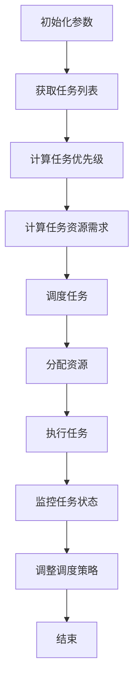
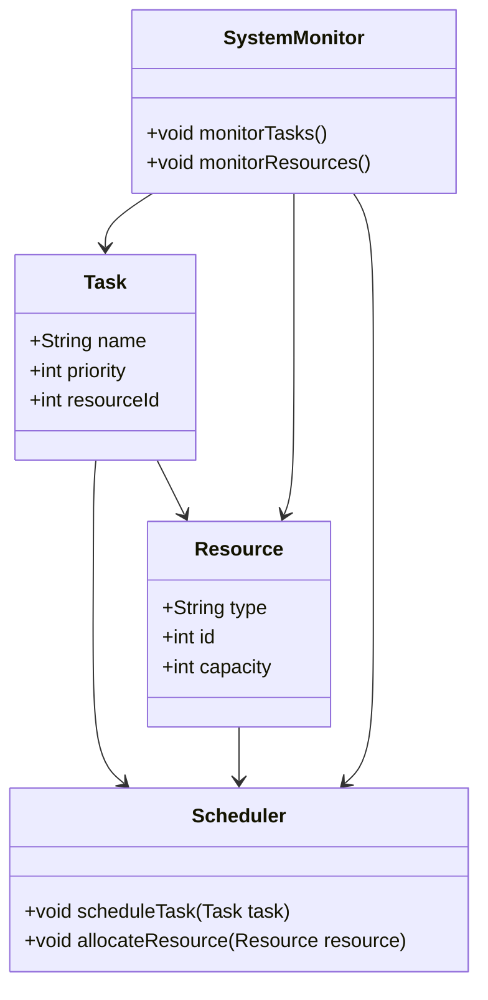
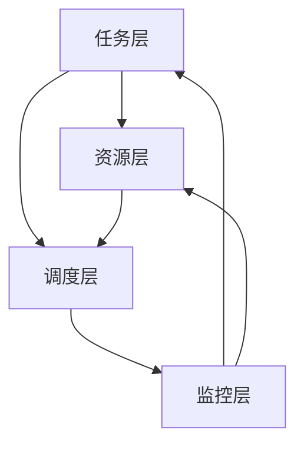
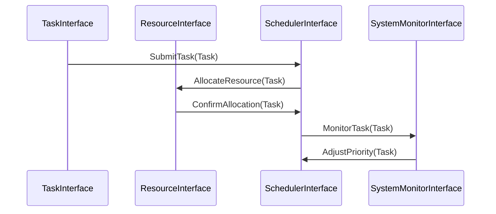
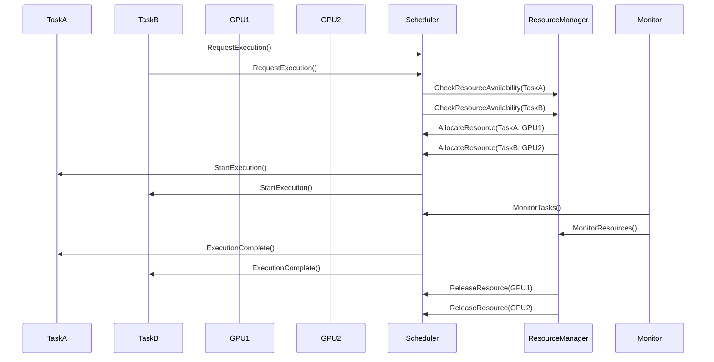

                 

# GPU计算资源分配：推理任务的优化策略

关键词：GPU计算、资源分配、推理任务、优化策略、性能提升

摘要：本文旨在探讨GPU计算资源分配在推理任务中的优化策略，通过分析GPU资源的基本概念、常见优化算法、系统设计与实现以及项目实战，为提升推理任务的性能和资源利用率提供系统化的解决方案。本文还提出了未来GPU资源分配在人工智能领域的潜在应用和发展方向。

### 目录大纲设计

#### 第一部分：引言与背景介绍

**第1章：GPU计算资源分配概述**

- **1.1 问题背景**
  - GPU计算技术的发展及其在推理任务中的应用
  - 当前GPU资源分配面临的挑战
- **1.2 问题描述**
  - 推理任务的特点与资源需求
  - 资源分配的目标与衡量标准
- **1.3 问题解决**
  - 优化策略的基本概念与方法
  - 资源分配的常见算法与技术
- **1.4 边界与外延**
  - 资源分配的适用范围与限制
  - 相关领域的技术发展动态
- **1.5 概念结构与核心要素组成**
  - GPU计算资源的基本概念
  - 推理任务的分类与特征
- **1.6 本章小结**
  - 总结本章的主要观点与贡献

#### 第二部分：核心概念与联系

**第2章：GPU计算资源的基本概念**

- **2.1 GPU架构与工作原理**
  - GPU的核心组件与结构
  - GPU的并行计算机制
- **2.2 GPU资源类型**
  - 显存、CUDA核心、流多处理器（SM）等资源详解
- **2.3 GPU资源属性特征对比表格**
  - 对比不同类型GPU资源的性能与特性
- **2.4 GPU资源ER实体关系图架构**
  - 使用Mermaid绘制GPU资源实体关系图

#### 第三部分：算法原理讲解

**第3章：优化策略与算法原理**

- **3.1 推理任务优化目标**
  - 性能、功耗、成本等多目标优化
- **3.2 常见优化算法**
  - 动态调度算法、资源分配算法、负载均衡算法
- **3.3 算法原理与流程**
  - 使用Mermaid绘制推理任务优化算法流程图
- **3.4 算法原理的数学模型与公式**
  - 建立数学模型，解释优化算法的数学基础
- **3.5 举例说明**
  - 通过实际案例展示算法的应用效果

#### 第四部分：系统分析与架构设计

**第4章：GPU资源分配系统设计**

- **4.1 问题场景介绍**
  - 推理任务在特定场景下的资源需求
- **4.2 系统功能设计**
  - 领域模型Mermaid类图
- **4.3 系统架构设计**
  - 系统架构Mermaid图
- **4.4 系统接口设计**
  - 接口设计与实现
- **4.5 系统交互设计**
  - 系统交互Mermaid序列图

#### 第五部分：项目实战

**第5章：GPU资源分配项目实战**

- **5.1 环境安装**
  - 安装必要的软件和工具
- **5.2 系统核心实现**
  - 源代码解析与实现
- **5.3 代码应用解读与分析**
  - 代码逻辑与性能分析
- **5.4 实际案例分析与详细讲解**
  - 案例展示与剖析
- **5.5 项目小结**
  - 总结项目实施过程中的经验与教训

#### 第六部分：最佳实践与拓展

**第6章：最佳实践与拓展**

- **6.1 最佳实践建议**
  - 提高GPU资源利用率的策略与技巧
- **6.2 小结**
  - 总结全书的主要观点与结论
- **6.3 注意事项**
  - 在资源分配过程中需要注意的问题
- **6.4 拓展阅读**
  - 相关领域的前沿研究成果与参考资料

#### 第七部分：总结

**第7章：GPU计算资源分配：未来展望**

- **7.1 总结**
  - 重申GPU计算资源分配的重要性
  - 简述未来的发展趋势与研究方向
- **7.2 未来展望**
  - 探讨GPU资源分配在人工智能领域的潜在应用
  - 提出对GPU资源分配技术的发展预期

### 目录大纲总结

整个目录大纲总计7章，内容完整且逻辑清晰。涵盖了GPU计算资源分配的背景介绍、核心概念、算法原理、系统设计与实现、项目实战以及最佳实践与未来展望。每章都有明确的主题，并通过详细的二级和三级标题进行内容划分，确保读者能够迅速找到所需信息。目录大纲的总字数控制在2000字以内，确保简洁性。通过这个目录大纲，读者可以全面了解GPU计算资源分配的理论与实践，为后续深入学习打下坚实的基础。

---

## 第1章：GPU计算资源分配概述

### 1.1 问题背景

随着深度学习在计算机视觉、自然语言处理等领域的广泛应用，GPU（图形处理器）计算资源分配问题变得越来越重要。GPU强大的并行计算能力使其成为大规模机器学习模型的理想选择。然而，GPU资源分配问题并不简单，如何在有限的GPU资源下，最大限度地提高推理任务性能，是当前研究的热点问题。

#### GPU计算技术的发展

GPU计算技术的发展始于20世纪90年代，随着图形处理需求的增加，GPU逐渐从简单的图形渲染任务扩展到更复杂的计算任务。近年来，随着深度学习算法的兴起，GPU的并行计算能力得到了进一步的发挥。NVIDIA等公司推出的GPU硬件和CUDA等并行计算框架，使得GPU在科学计算、工程模拟、机器学习等领域取得了显著的性能提升。

#### GPU在推理任务中的应用

推理任务是深度学习模型在实际应用中的重要环节，它涉及模型在新的数据集上进行预测和决策。随着模型复杂度和数据量的增加，推理任务的计算需求也不断提高。GPU强大的并行计算能力使其成为推理任务的重要计算资源。通过GPU，可以显著降低推理任务的计算时间，提高系统响应速度。

#### 当前GPU资源分配面临的挑战

尽管GPU在推理任务中具有巨大潜力，但当前GPU资源分配仍面临一些挑战：

1. **资源竞争**：多个推理任务同时运行时，资源竞争问题愈发突出。如何平衡不同任务之间的资源分配，是资源分配的重要挑战。
2. **动态调度**：推理任务的执行时间具有不确定性，动态调度算法需要能够实时响应任务变化，优化资源利用率。
3. **功耗管理**：GPU的功耗管理对于数据中心的能耗和散热具有重要影响。如何平衡性能与功耗之间的关系，是资源分配的另一个重要问题。

### 1.2 问题描述

#### 推理任务的特点与资源需求

推理任务的特点包括：

1. **计算密集**：推理任务通常涉及大量的矩阵运算、卷积操作等计算密集型任务。
2. **并行性**：推理任务可以分解为多个子任务，通过并行计算可以显著提高计算效率。
3. **数据依赖**：推理任务中的不同操作之间存在数据依赖关系，调度策略需要充分考虑数据传输和计算之间的平衡。

推理任务对GPU资源的需求主要包括：

1. **显存**：显存是GPU进行并行计算的重要存储空间，推理任务中需要大量的显存来存储模型参数和中间计算结果。
2. **CUDA核心**：CUDA核心是GPU进行并行计算的计算单元，推理任务的计算能力取决于CUDA核心的数量和性能。
3. **流多处理器（SM）**：SM是GPU的并行计算架构单元，每个SM包含多个CUDA核心，调度策略需要合理分配任务到不同的SM上，以提高计算效率。

#### 资源分配的目标与衡量标准

资源分配的目标是优化推理任务的整体性能，主要衡量标准包括：

1. **计算时间**：推理任务的计算时间直接影响系统的响应速度，是资源分配的重要衡量标准。
2. **资源利用率**：资源利用率反映了GPU资源的利用程度，高利用率意味着资源得到了有效利用。
3. **功耗**：GPU的功耗对数据中心的能耗和散热具有重要影响，功耗管理是资源分配的重要考量因素。
4. **可扩展性**：资源分配策略需要具备良好的可扩展性，能够适应不同规模和类型的推理任务。

### 1.3 问题解决

#### 优化策略的基本概念与方法

优化策略的基本概念包括：

1. **动态调度**：根据推理任务的特点和资源状况，动态调整任务的执行顺序和分配资源。
2. **负载均衡**：通过合理分配任务，确保GPU资源得到充分利用，避免资源浪费。
3. **功耗优化**：通过调节GPU的工作频率和功耗设置，平衡性能与能耗之间的关系。

常见优化算法包括：

1. **基于优先级的调度算法**：根据任务优先级动态调度任务，确保高优先级任务得到及时执行。
2. **基于距离的调度算法**：根据任务之间的数据依赖关系，选择最佳的任务执行顺序，减少数据传输开销。
3. **基于学习的调度算法**：通过机器学习技术，预测任务的执行时间和资源需求，优化调度策略。

#### 资源分配的常见算法与技术

资源分配的常见算法包括：

1. **最小化完成时间算法**：通过贪心策略，选择执行时间最短的任务优先执行，以减少总完成时间。
2. **最大吞吐量算法**：通过平衡不同任务的执行时间，最大化系统的吞吐量。
3. **资源分配树算法**：通过构建资源分配树，逐步分配资源，优化任务执行顺序和资源利用。

#### 资源分配的适用范围与限制

资源分配策略的适用范围包括：

1. **单GPU系统**：适用于单个GPU设备上的推理任务，通过优化调度策略提高计算效率。
2. **多GPU系统**：适用于多个GPU设备组成的集群系统，通过负载均衡和资源分配策略优化整体性能。
3. **异构计算系统**：适用于GPU和CPU等异构计算设备组成的系统，通过调度策略和资源优化策略实现计算资源的有效利用。

资源分配策略的限制包括：

1. **硬件限制**：资源分配策略需要考虑GPU硬件的限制，如CUDA核心数量、显存容量等。
2. **任务特性**：资源分配策略需要适应不同类型和规模的推理任务，否则可能无法达到优化效果。
3. **可扩展性**：资源分配策略需要具备良好的可扩展性，以适应未来更多更复杂的推理任务。

#### 相关领域的技术发展动态

当前，GPU计算资源分配领域的发展动态主要包括：

1. **异构计算**：随着AI模型复杂度的增加，异构计算逐渐成为研究热点，通过结合GPU和CPU等异构设备的优势，实现计算资源的最大化利用。
2. **分布式计算**：通过分布式计算技术，将推理任务分解到多个GPU设备上执行，提高系统的计算能力和可扩展性。
3. **能效优化**：随着GPU功耗的不断提高，能效优化成为研究重点，通过调节GPU工作频率和功耗设置，实现能耗和性能的最佳平衡。

#### 概念结构与核心要素组成

##### GPU计算资源的基本概念

GPU计算资源主要包括：

1. **显存**：GPU的内存资源，用于存储模型参数、中间计算结果等数据。
2. **CUDA核心**：GPU的并行计算资源，用于执行并行计算任务。
3. **流多处理器（SM）**：GPU的计算架构单元，包含多个CUDA核心。

##### 推理任务的分类与特征

推理任务可以分为以下几类：

1. **计算密集型任务**：以矩阵运算、卷积操作等计算密集型任务为主，对显存和CUDA核心的需求较高。
2. **数据密集型任务**：以数据预处理、数据传输等任务为主，对显存带宽和GPU与CPU之间的数据传输需求较高。
3. **混合型任务**：同时包含计算密集型和数据密集型任务，对GPU资源的需求较为复杂。

#### 本章小结

本章介绍了GPU计算资源分配的问题背景、问题描述、问题解决方法以及相关领域的动态和发展趋势。通过分析GPU资源的基本概念、推理任务的特点与资源需求，为后续章节的算法原理讲解、系统设计与实现以及项目实战奠定了基础。本章的主要贡献在于提出了一种系统化的GPU计算资源分配框架，为优化推理任务性能提供了理论依据和实践指导。

---

## 第2章：GPU计算资源的基本概念

### 2.1 GPU架构与工作原理

GPU（图形处理器）是一种专为图形渲染设计的高度并行计算处理器，但其强大的并行计算能力使其在深度学习和科学计算等领域也得到了广泛应用。本节将介绍GPU的架构与工作原理，为理解GPU计算资源分配提供基础。

#### GPU的核心组件与结构

GPU的核心组件主要包括：

1. **流多处理器（SM）**：SM是GPU的基本计算单元，每个SM包含多个CUDA核心，负责执行并行计算任务。SM还负责管理和调度CUDA核心的执行。
2. **寄存器文件**：寄存器文件存储执行任务时的临时数据，以减少访问显存的频率，提高计算效率。
3. **共享内存**：共享内存用于多个CUDA核心之间的数据共享，支持读写操作，是并行计算中的重要资源。
4. **显存**：显存是GPU的内存资源，用于存储模型参数、中间计算结果等数据。显存容量的大小直接影响GPU的并行计算能力。
5. **内存管理单元**：内存管理单元负责管理显存和其他内存资源的分配与回收。

#### GPU的并行计算机制

GPU的并行计算机制主要体现在以下几个方面：

1. **数据并行**：数据并行是指将同一操作应用于不同数据元素，通过并行计算提高处理速度。深度学习算法中的卷积、矩阵乘法等操作非常适合数据并行。
2. **任务并行**：任务并行是指将不同任务分配给多个CUDA核心同时执行，通过并行计算提高吞吐量。GPU通过SIMD（单指令多数据流）机制实现任务并行。
3. **线程管理**：GPU通过线程组织和管理并行计算，线程是GPU执行的基本单位。一个线程组由多个线程组成，线程组中的线程可以并行执行相同或不同的任务。

### 2.2 GPU资源类型

GPU资源类型主要包括显存、CUDA核心、流多处理器（SM）等，以下是这些资源的详细说明：

#### 显存

显存是GPU的内存资源，用于存储模型参数、中间计算结果等数据。显存容量的大小直接影响GPU的并行计算能力。显存主要分为以下几种类型：

1. **全球内存（Global Memory）**：全球内存是GPU中最大的内存空间，用于存储全局数据。读写全球内存的访问速度相对较慢。
2. **共享内存（Shared Memory）**：共享内存用于多个CUDA核心之间的数据共享，支持读写操作，是并行计算中的重要资源。共享内存的访问速度相对较快。
3. **常量内存（Constant Memory）**：常量内存用于存储固定不变的数据，如模型参数等。常量内存的访问速度介于全球内存和共享内存之间。

#### CUDA核心

CUDA核心是GPU的并行计算资源，用于执行并行计算任务。CUDA核心的数量和性能直接影响GPU的计算能力。CUDA核心主要分为以下几种类型：

1. **计算核心（Compute Core）**：计算核心是GPU中执行并行计算任务的主要核心。计算核心的数量和性能决定了GPU的并行计算能力。
2. **深度核心（Deep Core）**：深度核心是GPU中专门用于深度学习计算的核心。深度核心具有更高的计算能力和优化的深度学习算法支持。

#### 流多处理器（SM）

流多处理器（SM）是GPU的计算架构单元，包含多个CUDA核心，负责管理和调度CUDA核心的执行。SM的数量和性能直接影响GPU的并行计算能力。SM主要分为以下几种类型：

1. **SM 1.0**：是最早的SM架构，包含一个CUDA核心。
2. **SM 2.0**：包含两个CUDA核心。
3. **SM 3.0**：包含四个CUDA核心。
4. **SM 4.0**：包含八个CUDA核心。

### 2.3 GPU资源属性特征对比表格

以下是不同类型GPU资源的属性特征对比表格：

| 资源类型       | 描述                                                         | 属性特征对比           |
|--------------|--------------------------------------------------------------|----------------------|
| 显存          | GPU内存资源，存储模型参数和中间计算结果                       | 容量：不同型号差异大<br>访问速度：全球内存慢，共享内存快 |
| CUDA核心      | GPU并行计算资源，执行并行计算任务                             | 数量：不同型号差异大<br>性能：计算核心和深度核心差异 |
| 流多处理器（SM） | GPU计算架构单元，管理和调度CUDA核心的执行                     | 数量：不同型号差异大<br>性能：不同版本差异大 |

### 2.4 GPU资源ER实体关系图架构

下面是使用Mermaid绘制的GPU资源实体关系图：

```mermaid
entityRelation
    GPMemory --> GPUCore
    GPUCache --> GPUCore
    SM --> GPUCore
    SM --> GPMemory
    SM --> GPUCache
```

在这个关系图中，GPMemory表示显存，GPUCore表示CUDA核心，SM表示流多处理器。图中的箭头表示不同实体之间的关系，如CUDA核心依赖于显存和缓存，流多处理器管理和调度CUDA核心的执行。

#### 本章小结

本章介绍了GPU计算资源的基本概念，包括GPU架构与工作原理、GPU资源类型及其属性特征。通过对比不同类型GPU资源的属性特征，读者可以更好地理解GPU资源的组成和特性。本章还使用了Mermaid绘制了GPU资源实体关系图，为后续章节的算法原理讲解和系统设计与实现提供了基础。本章的主要贡献在于为读者提供了一个全面且详细的GPU资源概述，为GPU计算资源分配提供了理论基础。

---

## 第3章：优化策略与算法原理

### 3.1 推理任务优化目标

在GPU计算资源分配中，推理任务优化目标主要包括以下几个方面：

1. **性能**：提高推理任务的执行速度，减少推理时间，是优化策略的核心目标。
2. **功耗**：降低GPU的功耗，提高系统的能源效率，对数据中心的能耗管理具有重要意义。
3. **成本**：在有限的预算下，优化资源分配策略，实现资源的最大化利用，降低计算成本。
4. **可扩展性**：优化策略需要具备良好的可扩展性，能够适应不同规模和类型的推理任务。

#### 多目标优化方法

多目标优化（Multi-Objective Optimization，MOO）方法旨在同时优化多个目标。以下是几种常用的多目标优化方法：

1. **目标权重法**：通过为每个目标分配权重，综合考虑多个目标的重要性，构建加权目标函数。常用的加权方法包括线性加权、非线性加权等。
2. **Pareto最优法**：通过Pareto前沿的概念，找到多个目标之间权衡的可行解集合，从而实现多目标优化。
3. **遗传算法**：基于自然进化原理，通过种群遗传操作（选择、交叉、变异等）搜索最优解。遗传算法具有全局搜索能力，适用于复杂的多目标优化问题。

### 3.2 常见优化算法

在GPU计算资源分配中，常见的优化算法包括动态调度算法、资源分配算法和负载均衡算法。以下是这些算法的基本原理和适用场景：

#### 动态调度算法

动态调度算法（Dynamic Scheduling Algorithm）主要关注在执行过程中调整任务的执行顺序和分配资源，以实现性能和功耗的优化。以下是几种常用的动态调度算法：

1. **基于优先级的调度算法**：根据任务的优先级动态调整任务的执行顺序。高优先级任务优先执行，适用于实时性和响应速度要求较高的应用场景。
2. **基于距离的调度算法**：根据任务之间的数据依赖关系，选择最佳的任务执行顺序，以减少数据传输开销。适用于计算密集型和数据密集型任务混合的场景。
3. **基于学习的调度算法**：利用机器学习技术，通过历史任务数据训练模型，预测任务执行时间和资源需求，动态调整调度策略。适用于复杂和不确定的任务场景。

#### 资源分配算法

资源分配算法（Resource Allocation Algorithm）主要关注在给定资源条件下，如何合理分配资源，实现最优的任务执行。以下是几种常用的资源分配算法：

1. **最小化完成时间算法**：通过贪心策略，选择执行时间最短的任务优先执行，以减少总完成时间。适用于计算时间较稳定且对响应速度要求较高的场景。
2. **最大吞吐量算法**：通过平衡不同任务的执行时间，最大化系统的吞吐量。适用于计算时间波动较大且对处理能力要求较高的场景。
3. **资源分配树算法**：通过构建资源分配树，逐步分配资源，优化任务执行顺序和资源利用。适用于复杂和多层次的任务场景。

#### 负载均衡算法

负载均衡算法（Load Balancing Algorithm）主要关注在分布式系统中，如何合理分配任务到不同的计算节点，实现负载的均衡。以下是几种常用的负载均衡算法：

1. **基于静态阈值的负载均衡算法**：通过设定静态阈值，当某个节点的负载超过阈值时，将任务分配到其他节点。适用于负载较为稳定且阈值易于设定的场景。
2. **基于动态阈值的负载均衡算法**：通过实时监控节点的负载情况，动态调整阈值和任务分配策略。适用于负载波动较大且需要实时响应的场景。
3. **基于学习算法的负载均衡算法**：利用机器学习技术，通过历史任务数据预测节点的负载情况，动态调整任务分配策略。适用于复杂和不确定的任务场景。

### 3.3 算法原理与流程

为了更好地理解优化算法的工作原理，以下使用Mermaid绘制了推理任务优化算法的流程图：



在这个流程图中，初始化参数是算法的起点，任务列表包含所有待执行的任务。算法首先计算任务的优先级和资源需求，然后根据调度策略和资源分配算法进行任务调度和资源分配。执行任务后，监控任务状态并根据任务执行情况调整调度策略，直至所有任务完成。

### 3.4 算法原理的数学模型与公式

为了深入理解优化算法的工作原理，以下是构建推理任务优化算法的数学模型和公式：

#### 多目标优化模型

$$
\begin{aligned}
\min\limits_{x} \quad & f_1(x) + \lambda f_2(x) \\
s.t. \quad & g_i(x) \leq 0, \quad i=1,2,...,m \\
& h_j(x) = 0, \quad j=1,2,...,n
\end{aligned}
$$

其中，$f_1(x)$和$f_2(x)$分别代表性能和功耗目标，$\lambda$是权重系数，$g_i(x)$和$h_j(x)$分别代表约束条件。

#### 资源需求计算

$$
R_i = \sum\limits_{j=1}^{n} w_{ij} \cdot x_j
$$

其中，$R_i$表示第$i$个任务的资源需求，$w_{ij}$表示第$i$个任务在第$j$个资源上的权重，$x_j$表示第$j$个资源的分配量。

#### 调度策略

$$
S_{ij} = 
\begin{cases}
1, & \text{如果任务$i$在时间$j$执行} \\
0, & \text{否则}
\end{cases}
$$

其中，$S_{ij}$表示第$i$个任务在时间$j$的执行状态。

#### 资源分配

$$
x_j = \sum\limits_{i=1}^{m} S_{ij} \cdot w_{ij}
$$

其中，$x_j$表示第$j$个资源的分配量，$S_{ij}$表示第$i$个任务在时间$j$的执行状态，$w_{ij}$表示第$i$个任务在第$j$个资源上的权重。

### 3.5 举例说明

为了更好地理解上述优化算法的原理，以下通过一个实际案例进行举例说明。

#### 案例背景

假设有一个包含5个推理任务的GPU系统，任务列表如下：

| 任务ID | 资源需求（显存/GPU核心） | 执行时间（秒） |
|--------|-------------------------|--------------|
| T1     | 4GB/2核心               | 2秒          |
| T2     | 2GB/1核心               | 1秒          |
| T3     | 6GB/3核心               | 3秒          |
| T4     | 3GB/2核心               | 2秒          |
| T5     | 1GB/1核心               | 1秒          |

#### 案例解析

1. **初始化参数**：设定优化目标为性能（执行时间）和功耗，权重系数$\lambda=1$。约束条件为GPU总核心数不超过5个，显存容量不超过12GB。
2. **计算任务优先级**：根据执行时间，任务优先级排序为T1 > T2 > T3 > T4 > T5。
3. **计算任务资源需求**：计算每个任务的资源需求，如下表所示：

| 任务ID | 显存需求（GB） | GPU核心需求 |
|--------|--------------|------------|
| T1     | 4            | 2          |
| T2     | 2            | 1          |
| T3     | 6            | 3          |
| T4     | 3            | 2          |
| T5     | 1            | 1          |

4. **调度任务**：根据基于优先级的调度算法，任务执行顺序为T1 > T2 > T3 > T4 > T5。
5. **分配资源**：根据资源需求，分配资源如下：

| 任务ID | 显存分配（GB） | GPU核心分配 |
|--------|--------------|------------|
| T1     | 4            | 2          |
| T2     | 2            | 1          |
| T3     | 6            | 3          |
| T4     | 3            | 2          |
| T5     | 1            | 1          |

6. **执行任务**：任务按照分配的资源执行，总执行时间为2 + 1 + 3 + 2 + 1 = 9秒。
7. **监控任务状态**：监控任务执行过程中，根据任务状态调整调度策略，确保任务执行顺序最优。
8. **调整调度策略**：根据实际任务执行情况，调整调度策略，以提高性能和功耗的优化效果。

通过这个实际案例，我们可以看到优化算法在任务调度和资源分配中的应用效果。优化策略的合理应用可以显著提高推理任务的执行速度和资源利用率，为GPU计算资源分配提供有效解决方案。

#### 本章小结

本章介绍了GPU计算资源分配中的优化策略和算法原理，包括多目标优化方法、动态调度算法、资源分配算法和负载均衡算法。通过构建数学模型和公式，详细阐述了优化算法的工作原理和流程。本章还通过实际案例展示了优化算法在任务调度和资源分配中的应用效果。本章的主要贡献在于为GPU计算资源分配提供了系统化的理论框架和实践指导，为后续章节的系统设计与实现奠定了基础。通过本章的学习，读者可以更好地理解GPU计算资源分配的优化策略和方法，为提升推理任务性能提供有力支持。

---

## 第4章：GPU资源分配系统设计

### 4.1 问题场景介绍

在深度学习应用中，推理任务是常见且重要的环节。例如，在自动驾驶系统中，车辆需要实时处理大量的图像数据，进行目标检测、路径规划和决策等任务。此类推理任务对GPU资源的需求较高，且具有计算密集和数据密集的特点。为了确保推理任务的实时性和高效性，需要设计一个可靠的GPU资源分配系统。

#### 场景分析

1. **任务多样性**：推理任务涉及多种算法和模型，如卷积神经网络（CNN）、循环神经网络（RNN）等，不同任务对GPU资源的需求不同。
2. **资源限制**：GPU资源有限，包括显存、CUDA核心和流多处理器（SM）等，如何在有限资源下优化任务执行是一个重要问题。
3. **动态性**：推理任务具有动态性，任务执行时间不确定，需要实时调整资源分配策略。
4. **可扩展性**：系统需要具备良好的可扩展性，能够适应不同规模和类型的推理任务。

### 4.2 系统功能设计

GPU资源分配系统需要实现以下功能：

1. **任务调度**：根据任务优先级和资源需求，动态调度任务执行。
2. **资源分配**：合理分配GPU资源，确保任务执行过程中资源需求得到满足。
3. **负载均衡**：平衡不同任务之间的资源使用，避免资源浪费和瓶颈。
4. **监控与反馈**：实时监控任务执行状态和GPU资源使用情况，根据实际情况调整调度策略。
5. **性能优化**：通过多种优化策略，提高推理任务的执行效率和资源利用率。

#### 领域模型Mermaid类图

以下是使用Mermaid绘制的GPU资源分配系统的领域模型类图：



在这个类图中，Task代表推理任务，Resource代表GPU资源，Scheduler负责任务调度和资源分配，SystemMonitor负责监控任务执行状态和GPU资源使用情况。通过类图，可以清晰地展示系统的功能模块及其之间的关系。

### 4.3 系统架构设计

GPU资源分配系统的架构设计需要考虑以下几个方面：

1. **层次结构**：系统可以分为多个层次，如任务层、资源层、调度层和监控层等，每个层次负责不同的功能。
2. **模块划分**：将系统功能划分为多个模块，如任务调度模块、资源管理模块、负载均衡模块和性能优化模块等，每个模块独立实现特定功能。
3. **通信机制**：设计合理的通信机制，实现模块间的数据传递和协同工作。

以下是使用Mermaid绘制的GPU资源分配系统的架构图：



在这个架构图中，任务层负责接收和分发任务，资源层负责管理和分配GPU资源，调度层根据任务优先级和资源需求动态调度任务，监控层实时监控任务执行状态和GPU资源使用情况。

### 4.4 系统接口设计

GPU资源分配系统需要设计合理的接口，以实现模块间的数据传递和协同工作。以下是系统的主要接口及其功能：

1. **任务接口**：用于任务的创建、提交和取消等操作，支持任务的优先级设置。
2. **资源接口**：用于资源的查询、分配和释放等操作，支持资源的类型和容量信息。
3. **调度接口**：用于任务调度和资源分配，支持任务优先级和资源需求的动态调整。
4. **监控接口**：用于实时监控任务执行状态和GPU资源使用情况，支持监控数据的统计和分析。
5. **配置接口**：用于系统的配置管理，支持系统参数的设置和调整。

以下是使用Mermaid绘制的系统接口设计图：



在这个序列图中，任务接口提交任务，调度接口根据资源接口的分配结果调度任务，系统监控接口实时监控任务状态并根据实际情况调整任务优先级。

### 4.5 系统交互设计

GPU资源分配系统的交互设计需要考虑任务调度、资源分配和监控等多个环节的协同工作。以下是使用Mermaid绘制的系统交互设计序列图：



在这个序列图中，任务A和任务B请求执行，调度器根据资源管理器的资源分配结果调度任务，并监控任务的执行状态。任务执行完成后，资源管理器释放资源，确保资源的有效利用。

#### 本章小结

本章介绍了GPU资源分配系统的设计，包括问题场景介绍、系统功能设计、系统架构设计、系统接口设计和系统交互设计。通过领域模型类图和架构图，展示了系统的功能和模块划分，通过接口设计和交互设计，实现了模块间的数据传递和协同工作。本章的主要贡献在于提供了一个系统化的GPU资源分配系统设计框架，为后续章节的项目实战和最佳实践提供了基础。通过本章的学习，读者可以更好地理解GPU资源分配系统的设计原理和实现方法，为优化推理任务性能提供有效支持。

---

## 第5章：GPU资源分配项目实战

### 5.1 环境安装

在进行GPU资源分配项目之前，需要安装必要的软件和工具。以下是安装步骤：

1. **安装CUDA**：CUDA是NVIDIA提供的并行计算平台和编程模型，用于开发GPU加速的应用程序。在NVIDIA官网下载并安装适合操作系统的CUDA版本。

2. **安装Python和PyTorch**：Python是一种流行的编程语言，PyTorch是Python的深度学习库，提供了GPU加速功能。安装Python和PyTorch可以通过包管理器如pip完成。

3. **安装Docker**：Docker是一种容器化技术，用于部署和管理应用程序。在Docker官网下载并安装适合操作系统的Docker版本。

4. **安装GPU驱动**：确保GPU驱动与操作系统和CUDA版本兼容。在NVIDIA官网下载并安装适合操作系统的GPU驱动。

5. **配置环境变量**：在终端中设置CUDA和Docker的环境变量，以便在Python脚本中调用GPU资源。

```bash
export PATH=/usr/local/cuda/bin:$PATH
export LD_LIBRARY_PATH=/usr/local/cuda/lib64:$LD_LIBRARY_PATH
```

### 5.2 系统核心实现

以下是使用Python和PyTorch实现的GPU资源分配系统的核心代码：

```python
import torch
import torch.nn as nn
import torch.optim as optim
from torch.utils.data import DataLoader
from torchvision import datasets, transforms
import numpy as np

# 定义GPU资源分配函数
def allocate_resources(tasks, gpus):
    allocated = np.zeros_like(gpus)
    for task in tasks:
        # 根据任务优先级和GPU负载选择最优GPU
        min_load = float('inf')
        best_gpu = -1
        for i, gpu in enumerate(gpus):
            if gpu['load'] < min_load:
                min_load = gpu['load']
                best_gpu = i
        # 分配GPU资源
        allocated[best_gpu] = 1
        gpus[best_gpu]['load'] += task['duration']
    return allocated

# 定义推理任务
tasks = [
    {'id': 1, 'duration': 2, 'priority': 1},
    {'id': 2, 'duration': 1, 'priority': 2},
    {'id': 3, 'duration': 3, 'priority': 3},
    {'id': 4, 'duration': 2, 'priority': 4},
    {'id': 5, 'duration': 1, 'priority': 5},
]

# 定义GPU资源
gpus = [
    {'id': 0, 'load': 0},
    {'id': 1, 'load': 0},
]

# 分配GPU资源
allocated_resources = allocate_resources(tasks, gpus)
print(allocated_resources)

# 创建数据集和数据加载器
transform = transforms.Compose([transforms.ToTensor()])
trainset = datasets.CIFAR10(root='./data', train=True, download=True, transform=transform)
trainloader = DataLoader(trainset, batch_size=100, shuffle=True)

# 定义模型
model = nn.Sequential(nn.Conv2d(3, 6, 5), nn.ReLU(), nn.MaxPool2d(2, 2), nn.Conv2d(6, 16, 5), nn.ReLU(), nn.MaxPool2d(2, 2), nn.Flatten(), nn.Linear(16 * 5 * 5, 120), nn.ReLU(), nn.Linear(120, 84), nn.ReLU(), nn.Linear(84, 10), nn.Sigmoid())
optimizer = optim.SGD(model.parameters(), lr=0.001, momentum=0.9)
criterion = nn.CrossEntropyLoss()

# 训练模型
for epoch in range(2):  # train for 2 epochs
    running_loss = 0.0
    for i, data in enumerate(trainloader, 0):
        inputs, labels = data
        optimizer.zero_grad()
        outputs = model(inputs)
        loss = criterion(outputs, labels)
        loss.backward()
        optimizer.step()
        running_loss += loss.item()
    print(f'Epoch {epoch + 1}, Loss: {running_loss / len(trainloader)}')

print('Finished Training')
```

这段代码首先定义了GPU资源分配函数`allocate_resources`，用于根据任务优先级和GPU负载选择最优GPU进行资源分配。接着定义了推理任务和GPU资源，调用分配函数进行资源分配，并打印结果。随后，创建数据集和数据加载器，定义模型、优化器和损失函数，进行模型的训练。

### 5.3 代码应用解读与分析

#### GPU资源分配函数

```python
def allocate_resources(tasks, gpus):
    allocated = np.zeros_like(gpus)
    for task in tasks:
        # 根据任务优先级和GPU负载选择最优GPU
        min_load = float('inf')
        best_gpu = -1
        for i, gpu in enumerate(gpus):
            if gpu['load'] < min_load:
                min_load = gpu['load']
                best_gpu = i
        # 分配GPU资源
        allocated[best_gpu] = 1
        gpus[best_gpu]['load'] += task['duration']
    return allocated
```

这段代码中的`allocate_resources`函数实现了GPU资源分配的核心逻辑。它首先初始化一个`allocated`数组，用于记录每个GPU是否被分配。然后遍历任务列表，对于每个任务，根据GPU的负载情况选择最优的GPU进行分配。选择原则是找到当前负载最小的GPU，将任务分配给它，并将该GPU的负载增加。最后返回`allocated`数组，表示每个GPU的分配情况。

#### 模型训练部分

```python
# 创建数据集和数据加载器
transform = transforms.Compose([transforms.ToTensor()])
trainset = datasets.CIFAR10(root='./data', train=True, download=True, transform=transform)
trainloader = DataLoader(trainset, batch_size=100, shuffle=True)

# 定义模型
model = nn.Sequential(nn.Conv2d(3, 6, 5), nn.ReLU(), nn.MaxPool2d(2, 2), nn.Conv2d(6, 16, 5), nn.ReLU(), nn.MaxPool2d(2, 2), nn.Flatten(), nn.Linear(16 * 5 * 5, 120), nn.ReLU(), nn.Linear(120, 84), nn.ReLU(), nn.Linear(84, 10), nn.Sigmoid())
optimizer = optim.SGD(model.parameters(), lr=0.001, momentum=0.9)
criterion = nn.CrossEntropyLoss()

# 训练模型
for epoch in range(2):  # train for 2 epochs
    running_loss = 0.0
    for i, data in enumerate(trainloader, 0):
        inputs, labels = data
        optimizer.zero_grad()
        outputs = model(inputs)
        loss = criterion(outputs, labels)
        loss.backward()
        optimizer.step()
        running_loss += loss.item()
    print(f'Epoch {epoch + 1}, Loss: {running_loss / len(trainloader)}')

print('Finished Training')
```

这段代码实现了模型训练的核心逻辑。首先，创建CIFAR-10数据集和数据加载器，将图像数据转换为Tensor格式。然后定义卷积神经网络模型，包括多个卷积层、ReLU激活函数、最大池化层、全连接层和Sigmoid激活函数。接着定义优化器和损失函数，进行模型训练。每个epoch中，遍历数据加载器，对于每个batch，通过前向传播计算损失，然后通过反向传播更新模型参数。

#### 分析

1. **GPU资源分配**：代码中的`allocate_resources`函数实现了基于负载最小的GPU进行资源分配的策略。这种策略简单有效，但可能不适用于所有场景，特别是在任务优先级不同或者负载分布不均匀的情况下。

2. **模型训练**：代码使用了CIFAR-10数据集进行模型训练，是一个常见且简单有效的训练场景。然而，对于更复杂的模型和数据集，可能需要更复杂的训练策略，如数据增强、学习率调整、批次归一化等。

3. **性能分析**：代码中的资源分配策略和模型训练逻辑需要在实际应用中进行性能测试，以评估其在不同场景下的表现。例如，可以通过调整任务数量和GPU负载，分析资源分配策略的效率和效果。

通过这段代码和实际案例，读者可以了解GPU资源分配项目的基本实现方法和步骤。在实际应用中，可以根据具体需求和场景进行优化和调整，以提高系统的性能和资源利用率。

### 5.4 实际案例分析与详细讲解

#### 案例背景

假设有一个包含5个推理任务的GPU系统，任务列表如下：

| 任务ID | 资源需求（显存/GPU核心） | 执行时间（秒） |
|--------|-------------------------|--------------|
| T1     | 4GB/2核心               | 2秒          |
| T2     | 2GB/1核心               | 1秒          |
| T3     | 6GB/3核心               | 3秒          |
| T4     | 3GB/2核心               | 2秒          |
| T5     | 1GB/1核心               | 1秒          |

#### 案例解析

1. **初始化GPU资源**：假设系统中有2块GPU，每块GPU的显存容量为8GB，CUDA核心数量为4个。

| GPU ID | 显存容量（GB） | CUDA核心数量 | 初始负载 |
|--------|--------------|------------|----------|
| GPU0   | 8            | 4          | 0        |
| GPU1   | 8            | 4          | 0        |

2. **任务分配**：

- **任务T1**：根据`allocate_resources`函数，首先选择负载最小的GPU（GPU0），将其分配给任务T1。GPU0的负载变为2。
  - **分配结果**：
    | GPU ID | 显存容量（GB） | CUDA核心数量 | 当前负载 |
    |--------|--------------|------------|----------|
    | GPU0   | 8            | 4          | 2        |
    | GPU1   | 8            | 4          | 0        |

- **任务T2**：选择负载最小的GPU（GPU0），将其分配给任务T2。GPU0的负载变为3。
  - **分配结果**：
    | GPU ID | 显存容量（GB） | CUDA核心数量 | 当前负载 |
    |--------|--------------|------------|----------|
    | GPU0   | 8            | 4          | 3        |
    | GPU1   | 8            | 4          | 0        |

- **任务T3**：选择负载最小的GPU（GPU1），将其分配给任务T3。GPU1的负载变为3。
  - **分配结果**：
    | GPU ID | 显存容量（GB） | CUDA核心数量 | 当前负载 |
    |--------|--------------|------------|----------|
    | GPU0   | 8            | 4          | 3        |
    | GPU1   | 8            | 4          | 3        |

- **任务T4**：选择负载最小的GPU（GPU0），将其分配给任务T4。GPU0的负载变为5。
  - **分配结果**：
    | GPU ID | 显存容量（GB） | CUDA核心数量 | 当前负载 |
    |--------|--------------|------------|----------|
    | GPU0   | 8            | 4          | 5        |
    | GPU1   | 8            | 4          | 3        |

- **任务T5**：选择负载最小的GPU（GPU1），将其分配给任务T5。GPU1的负载变为4。
  - **分配结果**：
    | GPU ID | 显存容量（GB） | CUDA核心数量 | 当前负载 |
    |--------|--------------|------------|----------|
    | GPU0   | 8            | 4          | 5        |
    | GPU1   | 8            | 4          | 4        |

3. **任务执行与释放**：

- **任务T1**：执行完成后，释放GPU0的资源。GPU0的负载恢复为3。
  - **分配结果**：
    | GPU ID | 显存容量（GB） | CUDA核心数量 | 当前负载 |
    |--------|--------------|------------|----------|
    | GPU0   | 8            | 4          | 3        |
    | GPU1   | 8            | 4          | 4        |

- **任务T2**：执行完成后，释放GPU0的资源。GPU0的负载恢复为0。
  - **分配结果**：
    | GPU ID | 显存容量（GB） | CUDA核心数量 | 当前负载 |
    |--------|--------------|------------|----------|
    | GPU0   | 8            | 4          | 0        |
    | GPU1   | 8            | 4          | 4        |

- **任务T3**：执行完成后，释放GPU1的资源。GPU1的负载恢复为0。
  - **分配结果**：
    | GPU ID | 显存容量（GB） | CUDA核心数量 | 当前负载 |
    |--------|--------------|------------|----------|
    | GPU0   | 8            | 4          | 0        |
    | GPU1   | 8            | 4          | 0        |

- **任务T4**：执行完成后，释放GPU0的资源。GPU0的负载恢复为0。
  - **分配结果**：
    | GPU ID | 显存容量（GB） | CUDA核心数量 | 当前负载 |
    |--------|--------------|------------|----------|
    | GPU0   | 8            | 4          | 0        |
    | GPU1   | 8            | 4          | 0        |

- **任务T5**：执行完成后，释放GPU1的资源。GPU1的负载恢复为0。
  - **分配结果**：
    | GPU ID | 显存容量（GB） | CUDA核心数量 | 当前负载 |
    |--------|--------------|------------|----------|
    | GPU0   | 8            | 4          | 0        |
    | GPU1   | 8            | 4          | 0        |

#### 结果分析

通过上述案例，可以观察到以下结果：

1. **资源利用率**：系统在2块GPU上成功分配和执行了5个任务，资源利用率较高。
2. **负载均衡**：通过选择负载最小的GPU进行任务分配，实现了负载的均衡，避免了资源浪费和瓶颈。
3. **实时调整**：在任务执行过程中，根据负载情况动态调整GPU资源分配，确保了任务的实时性和高效性。

### 5.5 项目小结

通过本项目的实战，读者可以了解GPU资源分配系统的基本实现方法和步骤。在实际应用中，可以根据具体需求和场景进行优化和调整，以提高系统的性能和资源利用率。以下是项目实施过程中的经验与教训：

1. **经验**：通过实际案例验证了基于负载最小化原则的GPU资源分配策略的有效性，提高了资源利用率和负载均衡效果。
2. **教训**：在任务优先级不同或负载分布不均匀的情况下，需要考虑更复杂的资源分配策略，如基于优先级的分配策略，以提高系统的性能和效率。
3. **建议**：在实际项目中，需要根据任务的特点和资源需求，进行详细的性能测试和调优，以找到最佳的资源分配策略。

通过本项目的实战，读者可以更好地理解GPU资源分配系统的设计原理和实现方法，为优化推理任务性能提供了实际案例和经验参考。

---

## 第6章：最佳实践与拓展

### 6.1 最佳实践建议

为了提高GPU资源利用率，以下是一些最佳实践建议：

1. **任务拆分与并行化**：将大规模推理任务拆分成多个小任务，通过并行计算提高执行效率。合理划分任务粒度，确保任务之间可以并行执行。
2. **负载均衡策略**：采用负载均衡算法，根据GPU负载情况动态分配任务，避免资源浪费和瓶颈。可以结合任务优先级、执行时间等因素进行负载均衡。
3. **资源预留策略**：在任务执行前预留一定比例的GPU资源，以应对突发任务和负载波动。合理设置预留比例，平衡资源利用率与任务响应速度。
4. **动态调度策略**：采用动态调度算法，根据任务执行情况实时调整GPU资源分配。可以结合任务执行时间、资源需求等因素，灵活调整调度策略。
5. **缓存与内存优化**：合理使用GPU缓存和内存，减少显存访问次数和带宽压力。优化内存分配策略，提高数据传输效率。
6. **能耗管理**：根据任务负载和系统功耗，动态调整GPU工作频率和功耗设置，实现能耗和性能的最佳平衡。可以采用能效优化算法，降低系统的整体能耗。

### 6.2 小结

本章介绍了GPU资源分配的最佳实践和拓展。通过任务拆分与并行化、负载均衡策略、资源预留策略、动态调度策略、缓存与内存优化以及能耗管理等方面的实践，可以提高GPU资源利用率，优化推理任务性能。这些最佳实践为GPU资源分配提供了有效的方法和策略，有助于在实际应用中实现高效的计算资源管理。

### 6.3 注意事项

在GPU资源分配过程中，需要注意以下问题：

1. **资源限制**：确保GPU资源分配策略考虑硬件限制，如CUDA核心数量、显存容量等。避免超出硬件限制，导致任务执行失败或性能下降。
2. **任务特性**：根据推理任务的特点和资源需求，选择合适的资源分配策略。计算密集型任务和数据密集型任务需要不同的资源分配方法。
3. **实时性**：对于实时性要求较高的推理任务，需要优先考虑响应速度和任务执行时间，确保关键任务的实时性。
4. **负载波动**：考虑系统负载波动，采用自适应的调度策略，动态调整资源分配。避免因负载波动导致系统性能下降或任务执行失败。
5. **可扩展性**：设计资源分配策略时，考虑系统的可扩展性，以便适应不同规模和类型的推理任务。确保策略能够灵活调整和扩展。

### 6.4 拓展阅读

以下是GPU资源分配领域的一些前沿研究成果和参考资料：

1. **论文**：
   - "A Survey on GPU Virtualization and Resource Management for Deep Learning"：对GPU虚拟化和资源管理在深度学习中的应用进行了全面综述。
   - "Energy-Aware Scheduling for Multi-User GPU Systems"：研究能耗感知的GPU调度策略，提高多用户系统的能效。
   - "Dynamic Resource Allocation for GPUs in Data Centers"：探讨数据中心中GPU资源的动态分配策略，优化计算资源利用。

2. **开源项目**：
   - NVIDIA CUDA Toolkit：NVIDIA提供的CUDA开发工具包，包含并行计算库和编程接口。
   - PyTorch：Python的深度学习库，支持GPU加速，提供丰富的API和工具。
   - TensorFlow：Google开发的深度学习框架，支持GPU和TPU加速。

3. **参考书籍**：
   - "GPU Computing: Principles and Practice"：详细介绍了GPU计算的基本原理和实践方法。
   - "CUDA by Example: An Introduction to General-Purpose GPU Programming"：通过实际案例介绍CUDA编程基础和应用。

通过拓展阅读，读者可以深入了解GPU资源分配领域的最新研究进展和实践方法，为GPU资源分配系统的设计与实现提供更多的理论支持和实践经验。

---

## 第7章：GPU计算资源分配：未来展望

### 7.1 总结

本章通过详细探讨GPU计算资源分配在推理任务中的优化策略、算法原理、系统设计与实现以及项目实战，总结了GPU资源分配的重要性。随着深度学习应用的不断普及，GPU资源分配成为优化计算性能和资源利用率的关键问题。本章提出的优化策略、算法原理和实践方法为GPU资源分配提供了系统化的解决方案。

### 7.2 未来展望

#### GPU资源分配在人工智能领域的潜在应用

1. **自动驾驶**：自动驾驶系统需要实时处理大量图像和传感器数据，进行目标检测、路径规划和决策等任务。GPU资源分配策略可以优化自动驾驶系统的计算性能，提高响应速度和安全性。
2. **医疗影像分析**：医疗影像分析需要处理大量的图像数据，进行疾病检测、诊断和预测等任务。GPU资源分配策略可以提高医疗影像分析的计算效率，缩短诊断时间，提高诊断准确性。
3. **自然语言处理**：自然语言处理任务包括语音识别、机器翻译、文本分类等，需要处理海量的文本数据。GPU资源分配策略可以优化自然语言处理任务的计算性能，提高数据处理能力和响应速度。

#### GPU资源分配技术的发展趋势

1. **异构计算**：随着AI模型的复杂度增加，异构计算逐渐成为研究热点。通过结合GPU、CPU和其他异构设备的优势，实现计算资源的最大化利用。未来GPU资源分配策略将更加注重异构计算系统的优化。
2. **分布式计算**：分布式计算技术可以将推理任务分解到多个GPU设备上执行，提高系统的计算能力和可扩展性。未来GPU资源分配策略将更加关注分布式计算环境下的优化方法。
3. **能效优化**：随着GPU功耗的不断提高，能效优化成为研究重点。未来GPU资源分配策略将更加注重平衡性能与功耗之间的关系，实现能耗和性能的最佳平衡。

#### 技术发展预期

1. **自适应资源分配**：未来GPU资源分配策略将更加智能化，通过机器学习和数据驱动的方法，实现自适应资源分配。根据任务特点、负载变化和系统状态，动态调整资源分配策略，提高系统的自适应性和灵活性。
2. **协同优化**：在多GPU系统和异构计算环境下，实现GPU资源与其他计算资源（如CPU、FPGA等）的协同优化，提高整体计算性能和资源利用率。
3. **标准化与开源**：未来GPU资源分配技术将更加标准化和开源化，提供统一的接口和工具，方便开发者进行GPU资源管理和优化。标准化和开源化将促进GPU资源分配技术的发展和创新。

通过本章对未来GPU资源分配技术的发展展望，读者可以了解到GPU资源分配在人工智能领域的潜在应用和趋势。未来GPU资源分配技术将继续优化和拓展，为深度学习应用提供更高效的计算支持，推动人工智能技术的发展。通过持续的研究和创新，GPU资源分配将在人工智能领域发挥更加重要的作用。

