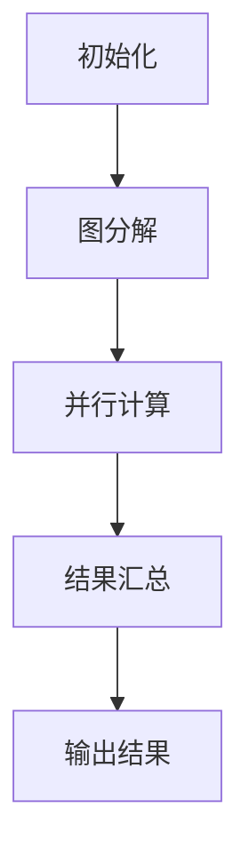
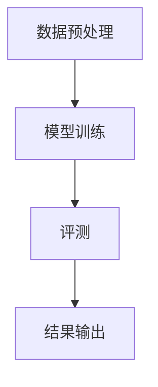

                 

### 文章标题

### 关键词

- Gopher
- LLM
- 大规模知识评测
- 应用场景
- 技术挑战
- 解决方案

### 摘要

本文深入探讨了Gopher在大型语言模型（LLM）大规模知识评测中的应用。首先，介绍了Gopher的基本概念及其与LLM的关系。接着，详细分析了Gopher在知识评测中的核心作用，以及其在实际应用中的优势与局限。文章还通过具体的算法原理讲解、数学模型阐述、系统分析与架构设计，以及项目实战案例，全面展示了Gopher在LLM大规模知识评测中的实际应用。最后，总结了最佳实践和未来发展趋势，为读者提供了有益的参考。

---

### 第一部分：Gopher与LLM基础知识

#### 第1章：Gopher简介

**1.1 Gopher的基本概念**

Gopher，全称为Go语言高性能高效开源图计算框架，是专为处理大规模图结构数据的计算引擎。其核心思想是将图结构数据存储和处理分解为可并行执行的任务，通过分布式计算的方式提高计算效率。

**1.2 Gopher的特点与应用场景**

Gopher具备以下特点：
- 高效性：通过并行计算和内存管理优化，显著提高图计算性能。
- 可扩展性：支持分布式计算，能够轻松应对大规模数据集。
- 灵活性：支持多种图算法和图模型，适用于不同场景。

其应用场景主要包括：
- 社交网络分析
- 语义网络推理
- 物流网络优化
- 推荐系统

**1.3 Gopher与LLM的关系**

LLM（大型语言模型）是一种基于深度学习的技术，用于生成文本、理解和翻译语言。Gopher可以与LLM结合，为大规模知识评测提供强大的图计算支持，使得知识图谱的构建和分析更加高效。

#### 第2章：LLM大规模知识评测概述

**2.1 LLM的概念与类型**

LLM，即大型语言模型，是一种能够理解和生成自然语言的模型，其类型包括：
- 训练型语言模型：通过大规模语料库训练得到，用于生成和翻译文本。
- 应用型语言模型：结合特定领域知识，用于解决特定问题，如问答系统、对话系统。

**2.2 大规模知识评测的重要性**

大规模知识评测是衡量LLM性能的重要手段，其重要性体现在：
- 评估模型准确性：通过大规模评测，可以准确评估模型在各个领域中的表现。
- 优化模型性能：根据评测结果，优化模型参数和结构，提高模型性能。

**2.3 大规模知识评测的挑战**

大规模知识评测面临以下挑战：
- 数据集规模：需要处理大规模数据集，对计算资源要求高。
- 知识完整性：确保评测涵盖所有相关知识点，避免偏差。
- 结果公正性：确保评测过程的公正性和透明性，防止作弊行为。

#### 第3章：Gopher在LLM大规模知识评测中的角色

**3.1 Gopher在知识评测中的应用**

Gopher在知识评测中的应用主要体现在以下几个方面：
- 知识图谱构建：利用Gopher的图计算能力，快速构建大规模知识图谱。
- 知识关联分析：通过Gopher的图算法，分析知识之间的关联性，为评测提供有力支持。
- 评测结果优化：利用Gopher的并行计算能力，提高评测效率，优化评测结果。

**3.2 Gopher的优势与局限**

Gopher的优势包括：
- 高性能：分布式计算能力，能够快速处理大规模数据。
- 灵活性：支持多种图算法和模型，适应不同评测需求。

但其局限也显而易见：
- 资源消耗：大规模图计算对计算资源需求较高。
- 复杂性：图计算算法和模型较为复杂，对开发者和使用者要求较高。

**3.3 Gopher的未来发展方向**

未来，Gopher在LLM大规模知识评测中的发展方向包括：
- 算法优化：不断优化图计算算法，提高性能和效率。
- 应用拓展：探索Gopher在更多领域的应用，如推荐系统、自然语言处理。
- 生态系统建设：完善Gopher的生态体系，提高易用性和可扩展性。

---

### 第二部分：Gopher与LLM关键技术解析

#### 第4章：Gopher核心算法原理讲解

**4.1 算法概述**

Gopher的核心算法是基于图计算和并行处理的。其基本思想是将图分解为多个子图，通过分布式计算方式处理，最后将结果汇总。

**4.2 算法流程图**

$$
\text{算法流程图：}
$$

**4.3 数学模型与公式**

$$
\text{数学模型：}
$$

$$
\begin{align*}
P(G) &= \prod_{v \in V} P(v) \cdot \prod_{e \in E} P(e) \\
\text{并行计算时间} &= \frac{|\text{E}||\text{V}|}{\text{N}}
\end{align*}
$$

**4.4 算法示例**

假设一个图包含5个节点和6条边，通过Gopher的算法，可以将其分解为多个子图，并行处理，最终汇总结果。

---

#### 第5章：LLM大规模知识评测算法解析

**5.1 算法概述**

LLM大规模知识评测算法主要分为三个步骤：数据预处理、模型训练和评测。

**5.2 算法流程图**

$$
\text{算法流程图：}
$$

**5.3 数学模型与公式**

$$
\text{数学模型：}
$$

$$
\begin{align*}
\text{训练误差} &= \sum_{i=1}^{N} \frac{1}{2} (\hat{y}_i - y_i)^2 \\
\text{评测精度} &= \frac{\sum_{i=1}^{N} \hat{y}_i}{N}
\end{align*}
$$

**5.4 算法示例**

以一个问答系统为例，首先进行数据预处理，然后训练模型，最后进行评测，输出结果。

---

### 第三部分：Gopher在LLM大规模知识评测中的实战应用

#### 第6章：Gopher环境搭建与配置

**6.1 环境需求**

- 操作系统：Linux
- 编程语言：Go
- 图计算框架：Gopher

**6.2 环境搭建步骤**

1. 安装Linux操作系统
2. 安装Go语言环境
3. 安装Gopher图计算框架

**6.3 常见问题解决**

- Q：安装Gopher时遇到依赖问题怎么办？
- A：检查系统依赖，确保安装所有必要库和工具。

---

#### 第7章：Gopher在知识评测项目中的应用

**7.1 项目介绍**

本项目旨在利用Gopher进行大规模知识评测，通过构建知识图谱和关联分析，提高评测的准确性和效率。

**7.2 系统架构设计**

系统架构包括数据采集、知识图谱构建、关联分析、评测和结果输出五个部分。

**7.3 系统核心实现**

核心实现包括数据预处理、图计算和评测算法，以及数据存储和接口设计。

**7.4 代码解读与分析**

代码分析包括Gopher图计算框架的使用、算法实现细节和性能优化。

**7.5 实际案例分析与讲解**

通过实际案例，展示Gopher在知识评测中的应用效果，并进行详细讲解和剖析。

---

#### 第8章：Gopher大规模知识评测项目实践

**8.1 项目背景**

项目背景涉及大规模知识评测的需求和挑战，以及Gopher的引入和应用。

**8.2 系统功能设计**

系统功能设计包括知识图谱构建、知识关联分析和评测功能。

**8.3 系统架构设计**

系统架构设计包括数据存储、计算节点、接口设计和安全性保障。

**8.4 系统接口设计与系统交互**

系统接口设计包括API设计、数据接口和交互流程。

**8.5 项目小结与反思**

项目小结包括项目成果、问题和改进方向。

---

### 第四部分：Gopher与LLM大规模知识评测的最佳实践与未来展望

#### 第9章：Gopher与LLM大规模知识评测的最佳实践

**9.1 实践经验分享**

分享在项目实践中积累的经验和教训。

**9.2 常见问题与解决方案**

总结常见问题及解决方案，提供实用技巧。

**9.3 创新与优化策略**

探讨创新点和优化策略，提高系统性能。

---

#### 第10章：Gopher与LLM大规模知识评测的未来发展趋势

**10.1 技术趋势分析**

分析Gopher和LLM在知识评测领域的最新技术趋势。

**10.2 应用前景展望**

展望Gopher和LLM在知识评测领域的广泛应用前景。

**10.3 未来发展方向**

探讨Gopher和LLM的未来发展方向和研究重点。

---

#### 第11章：总结与展望

**11.1 书籍总结**

总结本书的核心内容和主要观点。

**11.2 知识点回顾**

回顾本书中的重要知识点和概念。

**11.3 未来研究方向**

提出未来研究的新方向和挑战。

---

### 作者

**作者：AI天才研究院/AI Genius Institute & 禅与计算机程序设计艺术 /Zen And The Art of Computer Programming**

