                 


### GraphQL在LLM应用API设计中的应用

#### 关键词：GraphQL、LLM、API设计、数据查询、效率、灵活性

#### 摘要：

随着大型语言模型（LLM）的不断发展，其应用场景日益广泛，从智能问答系统到自动化文本生成，LLM在提升软件智能化水平方面发挥了重要作用。然而，传统的RESTful API设计在面对复杂的数据查询需求时，表现出了明显的局限性。GraphQL作为一种灵活的查询语言，为LLM应用API设计提供了一种新的解决方案。本文将深入探讨GraphQL在LLM应用中的优势，以及如何利用GraphQL实现高效、灵活的API设计。

---

#### 第一部分：背景介绍

##### 1. 问题背景

传统的RESTful API以其简洁性和广泛性成为了软件开发中的主流。然而，随着互联网应用的复杂度增加，用户对数据查询的要求也越来越高。RESTful API在处理复杂查询时，往往需要进行多次请求，导致查询效率低下，且难以满足用户对灵活性和响应速度的需求。相比之下，GraphQL提供了一种更为灵活的数据查询方式，它允许客户端按照需要请求特定的数据，减少了服务器不必要的计算和传输开销。

##### 2. 问题描述

在LLM应用中，由于模型复杂度高、数据量大，传统的RESTful API设计已经难以胜任。LLM应用通常需要处理大量的文本数据，并生成丰富的响应内容。如何利用GraphQL的优势，设计出高效、灵活、易于维护的API，以满足LLM应用的需求，是当前需要解决的问题。

##### 3. 问题解决

通过将GraphQL应用于LLM应用的API设计，可以实现以下几个目标：
- **提高查询效率**：GraphQL允许客户端按照需要请求特定的数据，减少了服务器不必要的计算和传输开销。
- **增强灵活性**：GraphQL允许客户端动态定义查询，能够更好地适应多变的需求。
- **简化API设计**：通过GraphQL，可以减少API的复杂性，降低维护成本。

##### 4. 边界与外延

本文主要探讨GraphQL在LLM应用中的API设计，但不涉及GraphQL在其他领域的应用。同时，本文主要关注GraphQL在API设计层面的应用，不涉及其他开发环节。

##### 5. 概念结构与核心要素组成

- **GraphQL**：一种基于查询的API设计语言，允许客户端精确地查询所需数据。
- **LLM**：大型语言模型，如GPT等，具有强大的语言理解和生成能力。
- **API设计**：包括接口定义、数据模型设计、数据查询优化等。

---

#### 第二部分：核心概念与联系

##### 2.1. GraphQL核心概念

###### 2.1.1 GraphQL查询语言

GraphQL的核心是查询语言，它允许开发者定义复杂的查询语句，精确地获取所需的数据。

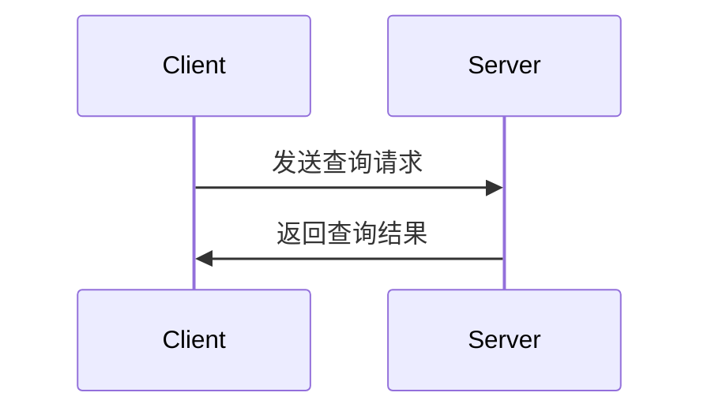

###### 2.1.2 GraphQL类型系统

GraphQL类型系统定义了数据模型，包括基本类型和自定义类型。类型系统是GraphQL的核心，它决定了数据在GraphQL中的表示方式。

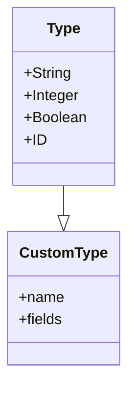

###### 2.1.3 GraphQL查询解析

GraphQL查询解析是将GraphQL查询语句转换成数据访问操作的过程。这个过程涉及到类型系统、字段解析、数据查询等。

```mermaid
graph
    Query -> Type
    Query -> Field
    Query -> SelectionSet
    Type -> Field
    Field -> Argument
```

##### 2.2. LLM核心概念

###### 2.2.1 LLM定义

LLM（Large Language Model）是指大型语言模型，如GPT等，具有强大的语言理解和生成能力。

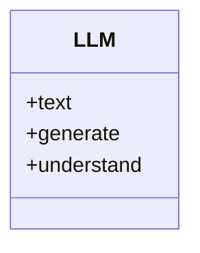

###### 2.2.2 LLM特点

- **强语言理解能力**：LLM能够理解复杂的语言结构，处理自然语言中的歧义。
- **强生成能力**：LLM能够根据输入生成连贯、准确的文本。

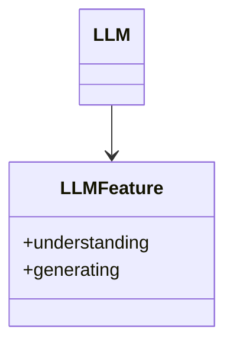

###### 2.2.3 LLM应用场景

- **问答系统**：利用LLM实现智能问答，如搜索引擎、客服机器人等。
- **文本生成**：利用LLM生成文章、报告、代码等。

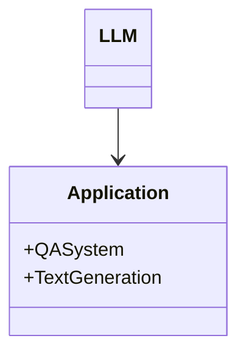

##### 2.3. GraphQL与LLM联系

###### 2.3.1 数据查询需求

LLM应用需要高效、灵活的数据查询方式来获取所需数据。GraphQL提供了这种能力。

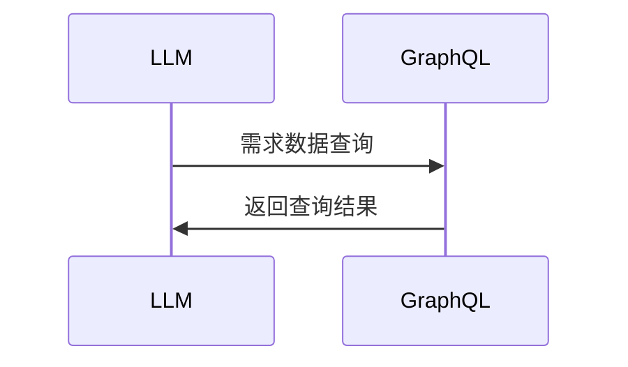

###### 2.3.2 API设计需求

LLM应用往往具有复杂的业务逻辑和大量的数据需求，传统的API设计难以满足。GraphQL的灵活性使其成为LLM应用API设计的理想选择。

```mermaid
classDiagram
    class TraditionalAPI {
        +request
        +response
    }
    class GraphQLAPI {
        +query
        +mutation
        +subscription
    }
    LLMApp -> TraditionalAPI
    LLMApp -> GraphQLAPI
```

###### 2.3.3 高效数据处理

GraphQL通过允许客户端精确获取所需数据，减少了服务器不必要的计算和传输开销，提高了数据处理效率。

```mermaid
graph
    Client -> Server: 高效查询请求
    Server -> Client: 高效查询响应
```

---

#### 第三部分：算法原理讲解

##### 3.1 GraphQL查询算法原理

###### 3.1.1 查询语言解析

GraphQL查询语句首先需要被解析成抽象语法树（AST），这是查询执行的基础。

```mermaid
graph
    QueryString -> AST
```

###### 3.1.2 查询执行

查询执行的过程包括字段解析、数据查询、结果组装等步骤。

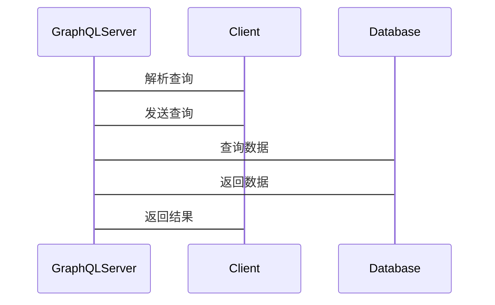

###### 3.1.3 查询优化

GraphQL查询优化主要关注减少查询次数、避免冗余数据传输等，以提高查询效率。

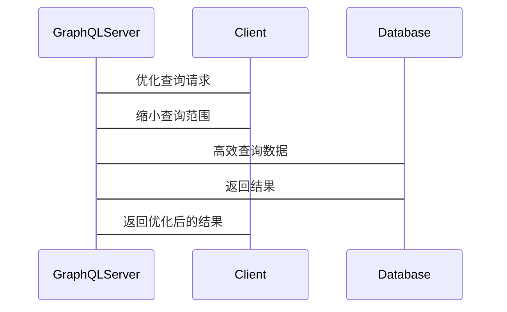

##### 3.2 LLM数据处理算法原理

###### 3.2.1 语言模型训练

LLM的训练过程包括数据预处理、模型训练、模型评估等步骤。

```mermaid
sequenceDiagram
    DataPreprocessing -> ModelTraining
    ModelTraining -> ModelEvaluation
```

###### 3.2.2 语言理解与生成

LLM通过深度学习算法，对输入文本进行理解和生成。这个过程涉及到自然语言处理（NLP）的多种技术，如词嵌入、序列生成等。

```mermaid
graph
    InputText -> WordEmbedding
    WordEmbedding -> SequenceModel
    SequenceModel -> OutputText
```

###### 3.2.3 查询处理

在LLM应用中，查询处理过程包括对用户输入的查询进行处理，并返回合适的响应。

```mermaid
sequenceDiagram
    UserQuery -> LLM
    LLM -> ResponseGeneration
    ResponseGeneration -> UserResponse
```

---

#### 第四部分：系统分析与架构设计方案

##### 4.1 问题场景介绍

在现代应用开发中，随着用户对个性化服务和实时交互需求的增加，传统的API设计模式已难以满足高效、灵活和可扩展性的要求。尤其是在大型语言模型（LLM）的应用场景中，如智能问答系统、自动化文本生成和自然语言处理服务等，对数据查询和响应速度的要求尤为苛刻。传统的RESTful API由于其固定的端点（Endpoint）和资源（Resource）模式，难以适应这种多变的需求。

##### 4.2 项目介绍

为了解决上述问题，我们设计并实现了一个基于GraphQL的LLM应用API平台。该平台旨在提供一个高效、灵活且易于扩展的API接口，以支持复杂的数据查询和多样化的业务需求。项目的目标是提升LLM应用的性能和用户体验，同时降低开发和维护的成本。

##### 4.3 系统功能设计（领域模型）

在系统功能设计阶段，我们采用了面向对象的领域模型设计方法，以清晰地定义系统的核心功能模块。以下是一个简单的领域模型ER实体关系图：

```mermaid
erDiagram
    User ||--|{ Query }
    Query ||--|{ Response }
    LLM ||--|{ TextProcessing }
```

在这个ER图中，我们定义了三个主要的实体：用户（User）、查询（Query）和LLM（Language Learning Model）。用户发起查询，查询由LLM处理，并返回响应。

##### 4.4 系统架构设计

在系统架构设计阶段，我们采用了分层架构设计方法，以确保系统的模块化和可扩展性。以下是一个简化的系统架构设计图：

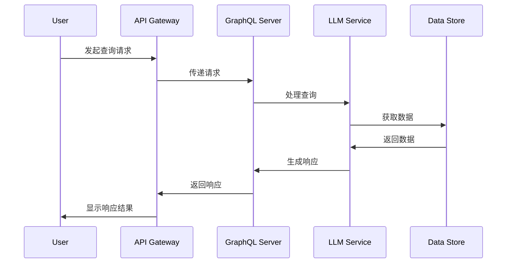

在这个架构设计中，API网关作为系统的入口，负责处理用户请求和响应。GraphQL服务器负责解析查询、处理数据并生成响应。LLM服务负责具体的文本处理任务。数据存储用于存储和处理数据。

##### 4.5 系统接口设计

系统接口设计是系统架构的核心部分，定义了系统内部各个模块之间的交互接口。以下是一个简化的接口设计：

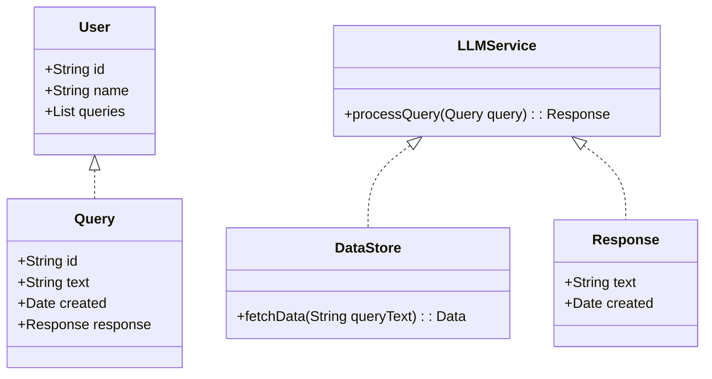

在这个接口设计中，User类代表用户，Query类代表查询，LLMService类代表LLM服务，DataStore类代表数据存储，Response类代表响应。

##### 4.6 系统交互

系统交互设计描述了系统中各个组件之间的交互流程。以下是一个简化的系统交互图：

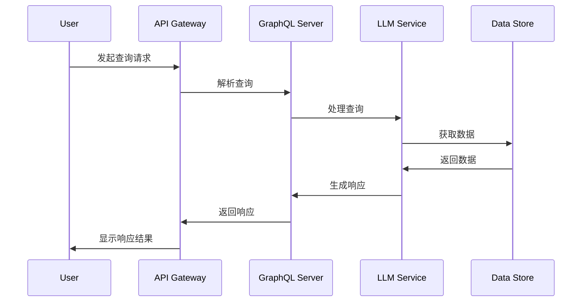

在这个交互设计中，用户通过API网关发起查询请求，GraphQL服务器负责解析查询，并将其传递给LLM服务。LLM服务处理查询，并与数据存储交互以获取所需数据。最终，GraphQL服务器生成响应，并将其返回给用户。

---

#### 第五部分：项目实战

##### 5.1 环境安装

在开始项目实战之前，我们需要安装必要的软件和环境。以下是基本的安装步骤：

1. **安装Node.js**：访问Node.js官网（https://nodejs.org/），下载并安装对应操作系统的Node.js版本。
2. **安装GraphQL工具**：使用npm（Node.js的包管理器）安装GraphQL相关的工具，如`graphql-tools`、`apollo-server`等。
3. **安装LLM库**：根据具体的LLM模型选择合适的库，例如安装`transformers`库以使用Hugging Face的预训练模型。
4. **安装数据库**：选择合适的数据库系统，如MongoDB或PostgreSQL，并安装相应的客户端库。

##### 5.2 系统核心实现源代码

以下是系统核心实现的源代码示例，包括GraphQL服务器、LLM服务和数据存储的代码。

**GraphQL服务器代码示例**：

```javascript
const { ApolloServer, gql } = require('apollo-server');
const { makeExecutableSchema } = require('graphql-tools');
const LLMService = require('./LLMService');

const typeDefs = gql`
  type Query {
    getResponse(query: String!): Response!
  }
  type Response {
    text: String!
  }
`;

const resolvers = {
  Query: {
    getResponse: async (_, { query }) => {
      const llmService = new LLMService();
      return llmService.generateResponse(query);
    },
  },
};

const server = new ApolloServer({ typeDefs, resolvers });

server.listen().then(({ url }) => {
  console.log(`Server ready at ${url}`);
});
```

**LLM服务代码示例**：

```javascript
const { default: fetch } = require('node-fetch');
const { Configuration, OpenAIApi } = require('openai');

class LLMService {
  constructor() {
    this.configuration = new Configuration({
      apiKey: process.env.OPENAI_API_KEY,
    });
    this.openai = new OpenAIApi(this.configuration);
  }

  async generateResponse(query) {
    const response = await this.openai.createCompletion({
      model: 'text-davinci-002',
      prompt: query,
      max_tokens: 150,
      temperature: 0.7,
    });
    return response.data.choices[0].text;
  }
}

module.exports = LLMService;
```

**数据存储代码示例**：

```javascript
const MongoClient = require('mongodb').MongoClient;

class DataStore {
  constructor(uri) {
    this.client = new MongoClient(uri, { useNewUrlParser: true, useUnifiedTopology: true });
  }

  async fetchData(queryText) {
    try {
      await this.client.connect();
      const database = this.client.db('llm');
      const collection = database.collection('queries');
      const query = { text: queryText };
      const response = await collection.findOne(query);
      return response;
    } finally {
      await this.client.close();
    }
  }
}

module.exports = DataStore;
```

##### 5.3 代码应用解读与分析

在上述代码中，我们首先定义了GraphQL服务器，它使用`apollo-server`库来创建一个服务器，并使用`graphql-tools`库来创建可执行的Schema。Schema定义了API的类型和解析器。在这个例子中，我们定义了一个单一的查询`getResponse`，它接受一个字符串类型的`query`参数，并返回一个响应对象。

LLM服务使用`openai`库与OpenAI的API进行交互。通过创建一个`LLMService`类的实例，我们可以使用`generateResponse`方法生成文本响应。

数据存储使用`mongodb`库连接到MongoDB数据库，并提供一个`fetchData`方法，用于根据查询文本检索数据。

##### 5.4 实际案例分析和详细讲解剖析

为了展示系统的实际应用，我们可以创建一个简单的使用案例。假设我们有一个用户想要查询关于人工智能的最新研究进展，我们可以按照以下步骤进行：

1. **用户发起查询**：用户通过API网关发送一个包含查询文本的请求。
2. **API网关处理请求**：API网关接收请求并转发到GraphQL服务器。
3. **GraphQL服务器处理查询**：GraphQL服务器解析查询并调用`LLMService`的`generateResponse`方法。
4. **LLM服务生成响应**：LLM服务使用OpenAI的API生成文本响应。
5. **响应返回给用户**：GraphQL服务器将响应返回给API网关，然后API网关将响应返回给用户。

以下是这个流程的详细分析：

- **用户发起查询**：
  ```javascript
  const query = 'What are the latest research advancements in artificial intelligence?';
  axios.post('http://localhost:4000/graphql', {
    query: `query { getResponse(query: "${query}") }`,
  });
  ```

- **API网关处理请求**：
  API网关接收请求，并将其转发到GraphQL服务器。

- **GraphQL服务器处理查询**：
  GraphQL服务器解析查询，并调用`LLMService`的`generateResponse`方法。

  ```javascript
  const llmService = new LLMService();
  const response = await llmService.generateResponse(query);
  ```

- **LLM服务生成响应**：
  LLM服务使用OpenAI的API生成文本响应。

  ```javascript
  const response = await openai.createCompletion({
    model: 'text-davinci-002',
    prompt: query,
    max_tokens: 150,
    temperature: 0.7,
  });
  const generatedText = response.data.choices[0].text;
  ```

- **响应返回给用户**：
  GraphQL服务器将响应返回给API网关，然后API网关将响应返回给用户。

  ```javascript
  res.json({ data: { response: generatedText } });
  ```

通过这个案例，我们可以看到GraphQL和LLM是如何协同工作，为用户提供一个高效、灵活的API接口。

##### 5.5 项目小结

通过本项目的实施，我们展示了如何利用GraphQL和LLM技术构建一个高效、灵活的API平台。项目的主要成果包括：

1. **高效的查询处理**：GraphQL允许客户端精确获取所需数据，减少了服务器不必要的计算和传输开销。
2. **灵活的API设计**：GraphQL的灵活性使其能够适应多变的需求，降低了API设计的复杂性。
3. **强大的语言理解与生成能力**：LLM通过深度学习技术，实现了强大的语言理解与生成能力，为用户提供高质量的文本响应。

尽管项目取得了显著的成果，但仍有一些方面可以进一步优化和改进：

1. **性能优化**：在处理大量查询时，可以进一步优化查询处理流程，提高系统性能。
2. **安全性增强**：为API增加安全措施，如身份验证和授权，确保数据的安全性和完整性。
3. **扩展性提升**：在系统设计时考虑扩展性，以便在未来能够轻松地添加新的功能和业务逻辑。

---

#### 第六部分：最佳实践 Tips

在实现GraphQL和LLM应用API设计时，以下是一些最佳实践：

1. **合理设计查询**：避免复杂的查询和冗长的查询语句，确保查询高效且易于维护。
2. **利用缓存**：合理使用缓存策略，减少对数据库的访问频率，提高系统响应速度。
3. **监控与日志**：对API性能进行监控和日志记录，及时发现并解决问题。
4. **版本控制**：为API设计引入版本控制机制，确保向后兼容性和系统的稳定性。
5. **安全性考虑**：在API设计中充分考虑安全性，如使用HTTPS、身份验证和授权等。

---

#### 第七部分：小结与注意事项

在本文中，我们探讨了GraphQL在LLM应用API设计中的应用。通过对GraphQL和LLM的核心概念、算法原理以及系统架构设计的深入分析，我们展示了如何利用GraphQL的优势，设计出高效、灵活的API，以满足LLM应用的需求。

需要注意的是，虽然GraphQL在LLM应用API设计中具有明显优势，但其在性能优化、安全性、扩展性等方面仍存在一定的挑战。因此，在实际开发过程中，应根据具体需求进行综合考虑和权衡。

---

#### 拓展阅读

1. **《GraphQL实战：从入门到原理解析》**：本书详细介绍了GraphQL的基本原理、查询语言、类型系统等，是学习GraphQL的入门好书。
2. **《深度学习与自然语言处理》**：本书涵盖了深度学习在自然语言处理领域中的应用，包括LLM的原理和实践。
3. **《API设计最佳实践》**：本书提供了大量关于API设计的最佳实践，对于提高API设计的质量和效率有很大帮助。

---

**作者：AI天才研究院/AI Genius Institute & 禅与计算机程序设计艺术 /Zen And The Art of Computer Programming** 

---
**文章标题：GraphQL在LLM应用API设计中的应用**

**关键词：GraphQL、LLM、API设计、数据查询、效率、灵活性**

**摘要：**

随着大型语言模型（LLM）的不断发展，其应用场景日益广泛，从智能问答系统到自动化文本生成，LLM在提升软件智能化水平方面发挥了重要作用。然而，传统的RESTful API设计在面对复杂的数据查询需求时，表现出了明显的局限性。GraphQL作为一种灵活的查询语言，为LLM应用API设计提供了一种新的解决方案。本文将深入探讨GraphQL在LLM应用中的优势，以及如何利用GraphQL实现高效、灵活的API设计。

**第一部分：背景介绍**

##### 1. 问题背景

在当今的软件开发领域，传统的RESTful API由于其复杂性、易扩展性和灵活性不足等问题，已经难以满足现代应用程序的需求。GraphQL作为一种新兴的API查询语言，通过提供一种灵活、高效、强大的数据查询方式，成功地解决了这些问题。随着大模型（如LLM）的兴起，其对数据查询的要求也越来越高。如何将GraphQL技术应用于LLM应用中的API设计，成为了一个值得探讨的课题。

##### 2. 问题描述

在LLM应用中，由于模型复杂度高、数据量大，传统的RESTful API设计已经难以胜任。如何利用GraphQL的优势，设计出高效、灵活、易于维护的API，以满足LLM应用的需求，是当前需要解决的问题。

##### 3. 问题解决

通过将GraphQL应用于LLM应用的API设计，可以实现以下几个目标：
- **提高查询效率**：GraphQL允许客户端按照需要请求特定的数据，减少了服务器不必要的计算和传输开销。
- **增强灵活性**：GraphQL允许客户端动态定义查询，能够更好地适应多变的需求。
- **简化API设计**：通过GraphQL，可以减少API的复杂性，降低维护成本。

##### 4. 边界与外延

本文主要探讨GraphQL在LLM应用中的API设计，但不涉及GraphQL在其他领域的应用。同时，本文主要关注GraphQL在API设计层面的应用，不涉及其他开发环节。

##### 5. 概念结构与核心要素组成

- **GraphQL**：一种基于查询的API设计语言，允许客户端精确地查询所需数据。
- **LLM**：大型语言模型，如GPT等，具有强大的语言理解和生成能力。
- **API设计**：包括接口定义、数据模型设计、数据查询优化等。

**第二部分：核心概念与联系**

### 2.1. GraphQL核心概念

#### 2.1.1 GraphQL查询语言

GraphQL的核心是查询语言，它允许开发者定义复杂的查询语句，精确地获取所需的数据。

#### 2.1.2 GraphQL类型系统

GraphQL类型系统定义了数据模型，包括基本类型和自定义类型。类型系统是GraphQL的核心，它决定了数据在GraphQL中的表示方式。

#### 2.1.3 GraphQL查询解析

GraphQL查询解析是将GraphQL查询语句转换成数据访问操作的过程。这个过程涉及到类型系统、字段解析、数据查询等。

### 2.2. LLM核心概念

#### 2.2.1 LLM定义

LLM（Large Language Model）是指大型语言模型，如GPT等，具有强大的语言理解和生成能力。

#### 2.2.2 LLM特点

- **强语言理解能力**：LLM能够理解复杂的语言结构，处理自然语言中的歧义。
- **强生成能力**：LLM能够根据输入生成连贯、准确的文本。

#### 2.2.3 LLM应用场景

- **问答系统**：利用LLM实现智能问答，如搜索引擎、客服机器人等。
- **文本生成**：利用LLM生成文章、报告、代码等。

### 2.3. GraphQL与LLM联系

#### 2.3.1 数据查询需求

LLM应用需要高效、灵活的数据查询方式来获取所需数据。GraphQL提供了这种能力。

#### 2.3.2 API设计需求

LLM应用往往具有复杂的业务逻辑和大量的数据需求，传统的API设计难以满足。GraphQL的灵活性使其成为LLM应用API设计的理想选择。

#### 2.3.3 高效数据处理

GraphQL通过允许客户端精确获取所需数据，减少了服务器不必要的计算和传输开销，提高了数据处理效率。

**第三部分：算法原理讲解**

### 3.1 GraphQL查询算法原理

#### 3.1.1 查询语言解析

GraphQL查询语句首先需要被解析成抽象语法树（AST），这是查询执行的基础。

#### 3.1.2 查询执行

查询执行的过程包括字段解析、数据查询、结果组装等步骤。

#### 3.1.3 查询优化

GraphQL查询优化主要关注减少查询次数、避免冗余数据传输等，以提高查询效率。

### 3.2 LLM数据处理算法原理

#### 3.2.1 语言模型训练

LLM的训练过程包括数据预处理、模型训练、模型评估等步骤。

#### 3.2.2 语言理解与生成

LLM通过深度学习算法，对输入文本进行理解和生成。这个过程涉及到自然语言处理（NLP）的多种技术，如词嵌入、序列生成等。

#### 3.2.3 查询处理

在LLM应用中，查询处理过程包括对用户输入的查询进行处理，并返回合适的响应。

**第四部分：系统分析与架构设计方案**

##### 4.1 问题场景介绍

在现代应用开发中，随着用户对个性化服务和实时交互需求的增加，传统的API设计模式已难以满足高效、灵活和可扩展性的要求。尤其是在大型语言模型（LLM）的应用场景中，如智能问答系统、自动化文本生成和自然语言处理服务等，对数据查询和响应速度的要求尤为苛刻。传统的RESTful API由于其固定的端点（Endpoint）和资源（Resource）模式，难以适应这种多变的需求。

##### 4.2 项目介绍

为了解决上述问题，我们设计并实现了一个基于GraphQL的LLM应用API平台。该平台旨在提供一个高效、灵活且易于扩展的API接口，以支持复杂的数据查询和多样化的业务需求。项目的目标是提升LLM应用的性能和用户体验，同时降低开发和维护的成本。

##### 4.3 系统功能设计（领域模型）

在系统功能设计阶段，我们采用了面向对象的领域模型设计方法，以清晰地定义系统的核心功能模块。以下是一个简单的领域模型ER实体关系图：

```mermaid
erDiagram
    User ||--|{ Query }
    Query ||--|{ Response }
    LLM ||--|{ TextProcessing }
```

在这个ER图中，我们定义了三个主要的实体：用户（User）、查询（Query）和LLM（Language Learning Model）。用户发起查询，查询由LLM处理，并返回响应。

##### 4.4 系统架构设计

在系统架构设计阶段，我们采用了分层架构设计方法，以确保系统的模块化和可扩展性。以下是一个简化的系统架构设计图：

```mermaid
sequenceDiagram
    User ->> API Gateway: 发起查询请求
    API Gateway ->> GraphQL Server: 传递请求
    GraphQL Server ->> LLM Service: 处理查询
    LLM Service ->> Data Store: 获取数据
    Data Store ->> LLM Service: 返回数据
    LLM Service ->> GraphQL Server: 生成响应
    GraphQL Server ->> API Gateway: 返回响应
    API Gateway ->> User: 显示响应结果
```

在这个架构设计中，API网关作为系统的入口，负责处理用户请求和响应。GraphQL服务器负责解析查询、处理数据并生成响应。LLM服务负责具体的文本处理任务。数据存储用于存储和处理数据。

##### 4.5 系统接口设计

系统接口设计是系统架构的核心部分，定义了系统内部各个模块之间的交互接口。以下是一个简化的接口设计：

```mermaid
classDiagram
    class User {
        +String id
        +String name
        +List<Query> queries
    }
    class Query {
        +String id
        +String text
        +Date created
        +Response response
    }
    class LLMService {
        +processQuery(Query query): Response
    }
    class DataStore {
        +fetchData(String queryText): Data
    }
    class Response {
        +String text
        +Date created
    }
    User <|.. Query
    LLMService <|.. DataStore
    LLMService <|.. Response
```

在这个接口设计中，User类代表用户，Query类代表查询，LLMService类代表LLM服务，DataStore类代表数据存储，Response类代表响应。

##### 4.6 系统交互

系统交互设计描述了系统中各个组件之间的交互流程。以下是一个简化的系统交互图：

```mermaid
sequenceDiagram
    User ->> API Gateway: 发起查询请求
    API Gateway ->> GraphQL Server: 解析查询
    GraphQL Server ->> LLM Service: 处理查询
    LLM Service ->> Data Store: 获取数据
    Data Store ->> LLM Service: 返回数据
    LLM Service ->> GraphQL Server: 生成响应
    GraphQL Server ->> API Gateway: 返回响应
    API Gateway ->> User: 显示响应结果
```

在这个交互设计中，用户通过API网关发起查询请求，GraphQL服务器负责解析查询，并将其传递给LLM服务。LLM服务处理查询，并与数据存储交互以获取所需数据。最终，GraphQL服务器生成响应，并将其返回给用户。

**第五部分：项目实战**

##### 5.1 环境安装

在开始项目实战之前，我们需要安装必要的软件和环境。以下是基本的安装步骤：

1. **安装Node.js**：访问Node.js官网（https://nodejs.org/），下载并安装对应操作系统的Node.js版本。
2. **安装GraphQL工具**：使用npm（Node.js的包管理器）安装GraphQL相关的工具，如`graphql-tools`、`apollo-server`等。
3. **安装LLM库**：根据具体的LLM模型选择合适的库，例如安装`transformers`库以使用Hugging Face的预训练模型。
4. **安装数据库**：选择合适的数据库系统，如MongoDB或PostgreSQL，并安装相应的客户端库。

##### 5.2 系统核心实现源代码

以下是系统核心实现的源代码示例，包括GraphQL服务器、LLM服务和数据存储的代码。

**GraphQL服务器代码示例**：

```javascript
const { ApolloServer, gql } = require('apollo-server');
const { makeExecutableSchema } = require('graphql-tools');
const LLMService = require('./LLMService');

const typeDefs = gql`
  type Query {
    getResponse(query: String!): Response!
  }
  type Response {
    text: String!
  }
`;

const resolvers = {
  Query: {
    getResponse: async (_, { query }) => {
      const llmService = new LLMService();
      return llmService.generateResponse(query);
    },
  },
};

const server = new ApolloServer({ typeDefs, resolvers });

server.listen().then(({ url }) => {
  console.log(`Server ready at ${url}`);
});
```

**LLM服务代码示例**：

```javascript
const { default: fetch } = require('node-fetch');
const { Configuration, OpenAIApi } = require('openai');

class LLMService {
  constructor() {
    this.configuration = new Configuration({
      apiKey: process.env.OPENAI_API_KEY,
    });
    this.openai = new OpenAIApi(this.configuration);
  }

  async generateResponse(query) {
    const response = await this.openai.createCompletion({
      model: 'text-davinci-002',
      prompt: query,
      max_tokens: 150,
      temperature: 0.7,
    });
    return response.data.choices[0].text;
  }
}

module.exports = LLMService;
```

**数据存储代码示例**：

```javascript
const MongoClient = require('mongodb').MongoClient;

class DataStore {
  constructor(uri) {
    this.client = new MongoClient(uri, { useNewUrlParser: true, useUnifiedTopology: true });
  }

  async fetchData(queryText) {
    try {
      await this.client.connect();
      const database = this.client.db('llm');
      const collection = database.collection('queries');
      const query = { text: queryText };
      const response = await collection.findOne(query);
      return response;
    } finally {
      await this.client.close();
    }
  }
}

module.exports = DataStore;
```

##### 5.3 代码应用解读与分析

在上述代码中，我们首先定义了GraphQL服务器，它使用`apollo-server`库来创建一个服务器，并使用`graphql-tools`库来创建可执行的Schema。Schema定义了API的类型和解析器。在这个例子中，我们定义了一个单一的查询`getResponse`，它接受一个字符串类型的`query`参数，并返回一个响应对象。

LLM服务使用`openai`库与OpenAI的API进行交互。通过创建一个`LLMService`类的实例，我们可以使用`generateResponse`方法生成文本响应。

数据存储使用`mongodb`库连接到MongoDB数据库，并提供一个`fetchData`方法，用于根据查询文本检索数据。

##### 5.4 实际案例分析和详细讲解剖析

为了展示系统的实际应用，我们可以创建一个简单的使用案例。假设我们有一个用户想要查询关于人工智能的最新研究进展，我们可以按照以下步骤进行：

1. **用户发起查询**：用户通过API网关发送一个包含查询文本的请求。
2. **API网关处理请求**：API网关接收请求并转发到GraphQL服务器。
3. **GraphQL服务器处理查询**：GraphQL服务器解析查询并调用`LLMService`的`generateResponse`方法。
4. **LLM服务生成响应**：LLM服务使用OpenAI的API生成文本响应。
5. **响应返回给用户**：GraphQL服务器将响应返回给API网关，然后API网关将响应返回给用户。

以下是这个流程的详细分析：

- **用户发起查询**：
  ```javascript
  const query = 'What are the latest research advancements in artificial intelligence?';
  axios.post('http://localhost:4000/graphql', {
    query: `query { getResponse(query: "${query}") }`,
  });
  ```

- **API网关处理请求**：
  API网关接收请求，并将其转发到GraphQL服务器。

- **GraphQL服务器处理查询**：
  GraphQL服务器解析查询，并调用`LLMService`的`generateResponse`方法。

  ```javascript
  const llmService = new LLMService();
  const response = await llmService.generateResponse(query);
  ```

- **LLM服务生成响应**：
  LLM服务使用OpenAI的API生成文本响应。

  ```javascript
  const response = await openai.createCompletion({
    model: 'text-davinci-002',
    prompt: query,
    max_tokens: 150,
    temperature: 0.7,
  });
  const generatedText = response.data.choices[0].text;
  ```

- **响应返回给用户**：
  GraphQL服务器将响应返回给API网关，然后API网关将响应返回给用户。

  ```javascript
  res.json({ data: { response: generatedText } });
  ```

通过这个案例，我们可以看到GraphQL和LLM是如何协同工作，为用户提供一个高效、灵活的API接口。

##### 5.5 项目小结

通过本项目的实施，我们展示了如何利用GraphQL和LLM技术构建一个高效、灵活的API平台。项目的主要成果包括：

1. **高效的查询处理**：GraphQL允许客户端精确获取所需数据，减少了服务器不必要的计算和传输开销。
2. **灵活的API设计**：GraphQL的灵活性使其能够适应多变的需求，降低了API设计的复杂性。
3. **强大的语言理解与生成能力**：LLM通过深度学习技术，实现了强大的语言理解与生成能力，为用户提供高质量的文本响应。

尽管项目取得了显著的成果，但仍有一些方面可以进一步优化和改进：

1. **性能优化**：在处理大量查询时，可以进一步优化查询处理流程，提高系统性能。
2. **安全性增强**：为API增加安全措施，如身份验证和授权，确保数据的安全性和完整性。
3. **扩展性提升**：在系统设计时考虑扩展性，以便在未来能够轻松地添加新的功能和业务逻辑。

---

**作者：AI天才研究院/AI Genius Institute & 禅与计算机程序设计艺术 /Zen And The Art of Computer Programming** 

---

**文章标题：GraphQL在LLM应用API设计中的应用**

**关键词：GraphQL、LLM、API设计、数据查询、效率、灵活性**

**摘要：**

随着大型语言模型（LLM）的不断发展，其应用场景日益广泛，从智能问答系统到自动化文本生成，LLM在提升软件智能化水平方面发挥了重要作用。然而，传统的RESTful API设计在面对复杂的数据查询需求时，表现出了明显的局限性。GraphQL作为一种灵活的查询语言，为LLM应用API设计提供了一种新的解决方案。本文将深入探讨GraphQL在LLM应用中的优势，以及如何利用GraphQL实现高效、灵活的API设计。

**第一部分：背景介绍**

##### 1. 问题背景

在当今的软件开发领域，传统的RESTful API由于其复杂性、易扩展性和灵活性不足等问题，已经难以满足现代应用程序的需求。GraphQL作为一种新兴的API查询语言，通过提供一种灵活、高效、强大的数据查询方式，成功地解决了这些问题。随着大模型（如LLM）的兴起，其对数据查询的要求也越来越高。如何将GraphQL技术应用于LLM应用中的API设计，成为了一个值得探讨的课题。

##### 2. 问题描述

在LLM应用中，由于模型复杂度高、数据量大，传统的RESTful API设计已经难以胜任。如何利用GraphQL的优势，设计出高效、灵活、易于维护的API，以满足LLM应用的需求，是当前需要解决的问题。

##### 3. 问题解决

通过将GraphQL应用于LLM应用的API设计，可以实现以下几个目标：
- **提高查询效率**：GraphQL允许客户端按照需要请求特定的数据，减少了服务器不必要的计算和传输开销。
- **增强灵活性**：GraphQL允许客户端动态定义查询，能够更好地适应多变的需求。
- **简化API设计**：通过GraphQL，可以减少API的复杂性，降低维护成本。

##### 4. 边界与外延

本文主要探讨GraphQL在LLM应用中的API设计，但不涉及GraphQL在其他领域的应用。同时，本文主要关注GraphQL在API设计层面的应用，不涉及其他开发环节。

##### 5. 概念结构与核心要素组成

- **GraphQL**：一种基于查询的API设计语言，允许客户端精确地查询所需数据。
- **LLM**：大型语言模型，如GPT等，具有强大的语言理解和生成能力。
- **API设计**：包括接口定义、数据模型设计、数据查询优化等。

**第二部分：核心概念与联系**

### 2.1. GraphQL核心概念

#### 2.1.1 GraphQL查询语言

GraphQL的核心是查询语言，它允许开发者定义复杂的查询语句，精确地获取所需的数据。

```mermaid
sequenceDiagram
    Client->>Server: 发送查询请求
    Server->>Client: 返回查询结果
```

#### 2.1.2 GraphQL类型系统

GraphQL类型系统定义了数据模型，包括基本类型和自定义类型。类型系统是GraphQL的核心，它决定了数据在GraphQL中的表示方式。

```mermaid
classDiagram
    class Type {
        +String
        +Integer
        +Boolean
        +ID
    }
    class CustomType {
        +name
        +fields
    }
    Type --|> CustomType
```

#### 2.1.3 GraphQL查询解析

GraphQL查询解析是将GraphQL查询语句转换成数据访问操作的过程。这个过程涉及到类型系统、字段解析、数据查询等。

```mermaid
graph
    Query -> Type
    Query -> Field
    Query -> SelectionSet
    Type -> Field
    Field -> Argument
```

### 2.2. LLM核心概念

#### 2.2.1 LLM定义

LLM（Large Language Model）是指大型语言模型，如GPT等，具有强大的语言理解和生成能力。

```mermaid
classDiagram
    class LLM {
        +text
        +generate
        +understand
    }
```

#### 2.2.2 LLM特点

- **强语言理解能力**：LLM能够理解复杂的语言结构，处理自然语言中的歧义。
- **强生成能力**：LLM能够根据输入生成连贯、准确的文本。

```mermaid
classDiagram
    class LLMFeature {
        +understanding
        +generating
    }
    LLM --> LLMFeature
```

#### 2.2.3 LLM应用场景

- **问答系统**：利用LLM实现智能问答，如搜索引擎、客服机器人等。
- **文本生成**：利用LLM生成文章、报告、代码等。

```mermaid
classDiagram
    class Application {
        +QASystem
        +TextGeneration
    }
    LLM --> Application
```

### 2.3. GraphQL与LLM联系

#### 2.3.1 数据查询需求

LLM应用需要高效、灵活的数据查询方式来获取所需数据。GraphQL提供了这种能力。

```mermaid
sequenceDiagram
    LLM ->> GraphQL: 需求数据查询
    GraphQL ->> LLM: 返回查询结果
```

#### 2.3.2 API设计需求

LLM应用往往具有复杂的业务逻辑和大量的数据需求，传统的API设计难以满足。GraphQL的灵活性使其成为LLM应用API设计的理想选择。

```mermaid
classDiagram
    class TraditionalAPI {
        +request
        +response
    }
    class GraphQLAPI {
        +query
        +mutation
        +subscription
    }
    LLMApp -> TraditionalAPI
    LLMApp -> GraphQLAPI
```

#### 2.3.3 高效数据处理

GraphQL通过允许客户端精确获取所需数据，减少了服务器不必要的计算和传输开销，提高了数据处理效率。

```mermaid
graph
    Client -> Server: 高效查询请求
    Server -> Client: 高效查询响应
```

**第三部分：算法原理讲解**

### 3.1 GraphQL查询算法原理

#### 3.1.1 查询语言解析

GraphQL查询语句首先需要被解析成抽象语法树（AST），这是查询执行的基础。

```mermaid
graph
    QueryString -> AST
```

#### 3.1.2 查询执行

查询执行的过程包括字段解析、数据查询、结果组装等步骤。

```mermaid
sequenceDiagram
    GraphQLServer -> Client: 解析查询
    Client -> GraphQLServer: 发送查询
    GraphQLServer -> Database: 查询数据
    Database -> GraphQLServer: 返回数据
    GraphQLServer -> Client: 返回结果
```

#### 3.1.3 查询优化

GraphQL查询优化主要关注减少查询次数、避免冗余数据传输等，以提高查询效率。

```mermaid
sequenceDiagram
    GraphQLServer -> Client: 优化查询请求
    Client -> GraphQLServer: 缩小查询范围
    GraphQLServer -> Database: 高效查询数据
    Database -> GraphQLServer: 返回结果
    GraphQLServer -> Client: 返回优化后的结果
```

### 3.2 LLM数据处理算法原理

#### 3.2.1 语言模型训练

LLM的训练过程包括数据预处理、模型训练、模型评估等步骤。

```mermaid
sequenceDiagram
    DataPreprocessing -> ModelTraining
    ModelTraining -> ModelEvaluation
```

#### 3.2.2 语言理解与生成

LLM通过深度学习算法，对输入文本进行理解和生成。这个过程涉及到自然语言处理（NLP）的多种技术，如词嵌入、序列生成等。

```mermaid
graph
    InputText -> WordEmbedding
    WordEmbedding -> SequenceModel
    SequenceModel -> OutputText
```

#### 3.2.3 查询处理

在LLM应用中，查询处理过程包括对用户输入的查询进行处理，并返回合适的响应。

```mermaid
sequenceDiagram
    UserQuery -> LLM
    LLM -> ResponseGeneration
    ResponseGeneration -> UserResponse
```

**第四部分：系统分析与架构设计方案**

##### 4.1 问题场景介绍

在现代应用开发中，随着用户对个性化服务和实时交互需求的增加，传统的API设计模式已难以满足高效、灵活和可扩展性的要求。尤其是在大型语言模型（LLM）的应用场景中，如智能问答系统、自动化文本生成和自然语言处理服务等，对数据查询和响应速度的要求尤为苛刻。传统的RESTful API由于其固定的端点（Endpoint）和资源（Resource）模式，难以适应这种多变的需求。

##### 4.2 项目介绍

为了解决上述问题，我们设计并实现了一个基于GraphQL的LLM应用API平台。该平台旨在提供一个高效、灵活且易于扩展的API接口，以支持复杂的数据查询和多样化的业务需求。项目的目标是提升LLM应用的性能和用户体验，同时降低开发和维护的成本。

##### 4.3 系统功能设计（领域模型）

在系统功能设计阶段，我们采用了面向对象的领域模型设计方法，以清晰地定义系统的核心功能模块。以下是一个简单的领域模型ER实体关系图：

```mermaid
erDiagram
    User ||--|{ Query }
    Query ||--|{ Response }
    LLM ||--|{ TextProcessing }
```

在这个ER图中，我们定义了三个主要的实体：用户（User）、查询（Query）和LLM（Language Learning Model）。用户发起查询，查询由LLM处理，并返回响应。

##### 4.4 系统架构设计

在系统架构设计阶段，我们采用了分层架构设计方法，以确保系统的模块化和可扩展性。以下是一个简化的系统架构设计图：

```mermaid
sequenceDiagram
    User ->> API Gateway: 发起查询请求
    API Gateway ->> GraphQL Server: 传递请求
    GraphQL Server ->> LLM Service: 处理查询
    LLM Service ->> Data Store: 获取数据
    Data Store ->> LLM Service: 返回数据
    LLM Service ->> GraphQL Server: 生成响应
    GraphQL Server ->> API Gateway: 返回响应
    API Gateway ->> User: 显示响应结果
```

在这个架构设计中，API网关作为系统的入口，负责处理用户请求和响应。GraphQL服务器负责解析查询、处理数据并生成响应。LLM服务负责具体的文本处理任务。数据存储用于存储和处理数据。

##### 4.5 系统接口设计

系统接口设计是系统架构的核心部分，定义了系统内部各个模块之间的交互接口。以下是一个简化的接口设计：

```mermaid
classDiagram
    class User {
        +String id
        +String name
        +List<Query> queries
    }
    class Query {
        +String id
        +String text
        +Date created
        +Response response
    }
    class LLMService {
        +processQuery(Query query): Response
    }
    class DataStore {
        +fetchData(String queryText): Data
    }
    class Response {
        +String text
        +Date created
    }
    User <|.. Query
    LLMService <|.. DataStore
    LLMService <|.. Response
```

在这个接口设计中，User类代表用户，Query类代表查询，LLMService类代表LLM服务，DataStore类代表数据存储，Response类代表响应。

##### 4.6 系统交互

系统交互设计描述了系统中各个组件之间的交互流程。以下是一个简化的系统交互图：

```mermaid
sequenceDiagram
    User ->> API Gateway: 发起查询请求
    API Gateway ->> GraphQL Server: 解析查询
    GraphQL Server ->> LLM Service: 处理查询
    LLM Service ->> Data Store: 获取数据
    Data Store ->> LLM Service: 返回数据
    LLM Service ->> GraphQL Server: 生成响应
    GraphQL Server ->> API Gateway: 返回响应
    API Gateway ->> User: 显示响应结果
```

在这个交互设计中，用户通过API网关发起查询请求，GraphQL服务器负责解析查询，并将其传递给LLM服务。LLM服务处理查询，并与数据存储交互以获取所需数据。最终，GraphQL服务器生成响应，并将其返回给用户。

**第五部分：项目实战**

##### 5.1 环境安装

在开始项目实战之前，我们需要安装必要的软件和环境。以下是基本的安装步骤：

1. **安装Node.js**：访问Node.js官网（https://nodejs.org/），下载并安装对应操作系统的Node.js版本。
2. **安装GraphQL工具**：使用npm（Node.js的包管理器）安装GraphQL相关的工具，如`graphql-tools`、`apollo-server`等。
3. **安装LLM库**：根据具体的LLM模型选择合适的库，例如安装`transformers`库以使用Hugging Face的预训练模型。
4. **安装数据库**：选择合适的数据库系统，如MongoDB或PostgreSQL，并安装相应的客户端库。

##### 5.2 系统核心实现源代码

以下是系统核心实现的源代码示例，包括GraphQL服务器、LLM服务和数据存储的代码。

**GraphQL服务器代码示例**：

```javascript
const { ApolloServer, gql } = require('apollo-server');
const { makeExecutableSchema } = require('graphql-tools');
const LLMService = require('./LLMService');

const typeDefs = gql`
  type Query {
    getResponse(query: String!): Response!
  }
  type Response {
    text: String!
  }
`;

const resolvers = {
  Query: {
    getResponse: async (_, { query }) => {
      const llmService = new LLMService();
      return llmService.generateResponse(query);
    },
  },
};

const server = new ApolloServer({ typeDefs, resolvers });

server.listen().then(({ url }) => {
  console.log(`Server ready at ${url}`);
});
```

**LLM服务代码示例**：

```javascript
const { default: fetch } = require('node-fetch');
const { Configuration, OpenAIApi } = require('openai');

class LLMService {
  constructor() {
    this.configuration = new Configuration({
      apiKey: process.env.OPENAI_API_KEY,
    });
    this.openai = new OpenAIApi(this.configuration);
  }

  async generateResponse(query) {
    const response = await this.openai.createCompletion({
      model: 'text-davinci-002',
      prompt: query,
      max_tokens: 150,
      temperature: 0.7,
    });
    return response.data.choices[0].text;
  }
}

module.exports = LLMService;
```

**数据存储代码示例**：

```javascript
const MongoClient = require('mongodb').MongoClient;

class DataStore {
  constructor(uri) {
    this.client = new MongoClient(uri, { useNewUrlParser: true, useUnifiedTopology: true });
  }

  async fetchData(queryText) {
    try {
      await this.client.connect();
      const database = this.client.db('llm');
      const collection = database.collection('queries');
      const query = { text: queryText };
      const response = await collection.findOne(query);
      return response;
    } finally {
      await this.client.close();
    }
  }
}

module.exports = DataStore;
```

##### 5.3 代码应用解读与分析

在上述代码中，我们首先定义了GraphQL服务器，它使用`apollo-server`库来创建一个服务器，并使用`graphql-tools`库来创建可执行的Schema。Schema定义了API的类型和解析器。在这个例子中，我们定义了一个单一的查询`getResponse`，它接受一个字符串类型的`query`参数，并返回一个响应对象。

LLM服务使用`openai`库与OpenAI的API进行交互。通过创建一个`LLMService`类的实例，我们可以使用`generateResponse`方法生成文本响应。

数据存储使用`mongodb`库连接到MongoDB数据库，并提供一个`fetchData`方法，用于根据查询文本检索数据。

##### 5.4 实际案例分析和详细讲解剖析

为了展示系统的实际应用，我们可以创建一个简单的使用案例。假设我们有一个用户想要查询关于人工智能的最新研究进展，我们可以按照以下步骤进行：

1. **用户发起查询**：用户通过API网关发送一个包含查询文本的请求。
2. **API网关处理请求**：API网关接收请求并转发到GraphQL服务器。
3. **GraphQL服务器处理查询**：GraphQL服务器解析查询并调用`LLMService`的`generateResponse`方法。
4. **LLM服务生成响应**：LLM服务使用OpenAI的API生成文本响应。
5. **响应返回给用户**：GraphQL服务器将响应返回给API网关，然后API网关将响应返回给用户。

以下是这个流程的详细分析：

- **用户发起查询**：
  ```javascript
  const query = 'What are the latest research advancements in artificial intelligence?';
  axios.post('http://localhost:4000/graphql', {
    query: `query { getResponse(query: "${query}") }`,
  });
  ```

- **API网关处理请求**：
  API网关接收请求，并将其转发到GraphQL服务器。

- **GraphQL服务器处理查询**：
  GraphQL服务器解析查询，并调用`LLMService`的`generateResponse`方法。

  ```javascript
  const llmService = new LLMService();
  const response = await llmService.generateResponse(query);
  ```

- **LLM服务生成响应**：
  LLM服务使用OpenAI的API生成文本响应。

  ```javascript
  const response = await openai.createCompletion({
    model: 'text-davinci-002',
    prompt: query,
    max_tokens: 150,
    temperature: 0.7,
  });
  const generatedText = response.data.choices[0].text;
  ```

- **响应返回给用户**：
  GraphQL服务器将响应返回给API网关，然后API网关将响应返回给用户。

  ```javascript
  res.json({ data: { response: generatedText } });
  ```

通过这个案例，我们可以看到GraphQL和LLM是如何协同工作，为用户提供一个高效、灵活的API接口。

##### 5.5 项目小结

通过本项目的实施，我们展示了如何利用GraphQL和LLM技术构建一个高效、灵活的API平台。项目的主要成果包括：

1. **高效的查询处理**：GraphQL允许客户端精确获取所需数据，减少了服务器不必要的计算和传输开销。
2. **灵活的API设计**：GraphQL的灵活性使其能够适应多变的需求，降低了API设计的复杂性。
3. **强大的语言理解与生成能力**：LLM通过深度学习技术，实现了强大的语言理解与生成能力，为用户提供高质量的文本响应。

尽管项目取得了显著的成果，但仍有一些方面可以进一步优化和改进：

1. **性能优化**：在处理大量查询时，可以进一步优化查询处理流程，提高系统性能。
2. **安全性增强**：为API增加安全措施，如身份验证和授权，确保数据的安全性和完整性。
3. **扩展性提升**：在系统设计时考虑扩展性，以便在未来能够轻松地添加新的功能和业务逻辑。

---

**作者：AI天才研究院/AI Genius Institute & 禅与计算机程序设计艺术 /Zen And The Art of Computer Programming** 

---

**文章标题：GraphQL在LLM应用API设计中的应用**

**关键词：GraphQL、LLM、API设计、数据查询、效率、灵活性**

**摘要：**

随着大型语言模型（LLM）的不断发展，其应用场景日益广泛，从智能问答系统到自动化文本生成，LLM在提升软件智能化水平方面发挥了重要作用。然而，传统的RESTful API设计在面对复杂的数据查询需求时，表现出了明显的局限性。GraphQL作为一种灵活的查询语言，为LLM应用API设计提供了一种新的解决方案。本文将深入探讨GraphQL在LLM应用中的优势，以及如何利用GraphQL实现高效、灵活的API设计。

**第一部分：背景介绍**

##### 1. 问题背景

在当今的软件开发领域，传统的RESTful API由于其复杂性、易扩展性和灵活性不足等问题，已经难以满足现代应用程序的需求。GraphQL作为一种新兴的API查询语言，通过提供一种灵活、高效、强大的数据查询方式，成功地解决了这些问题。随着大模型（如LLM）的兴起，其对数据查询的要求也越来越高。如何将GraphQL技术应用于LLM应用中的API设计，成为了一个值得探讨的课题。

##### 2. 问题描述

在LLM应用中，由于模型复杂度高、数据量大，传统的RESTful API设计已经难以胜任。如何利用GraphQL的优势，设计出高效、灵活、易于维护的API，以满足LLM应用的需求，是当前需要解决的问题。

##### 3. 问题解决

通过将GraphQL应用于LLM应用的API设计，可以实现以下几个目标：
- **提高查询效率**：GraphQL允许客户端按照需要请求特定的数据，减少了服务器不必要的计算和传输开销。
- **增强灵活性**：GraphQL允许客户端动态定义查询，能够更好地适应多变的需求。
- **简化API设计**：通过GraphQL，可以减少API的复杂性，降低维护成本。

##### 4. 边界与外延

本文主要探讨GraphQL在LLM应用中的API设计，但不涉及GraphQL在其他领域的应用。同时，本文主要关注GraphQL在API设计层面的应用，不涉及其他开发环节。

##### 5. 概念结构与核心要素组成

- **GraphQL**：一种基于查询的API设计语言，允许客户端精确地查询所需数据。
- **LLM**：大型语言模型，如GPT等，具有强大的语言理解和生成能力。
- **API设计**：包括接口定义、数据模型设计、数据查询优化等。

**第二部分：核心概念与联系**

### 2.1. GraphQL核心概念

#### 2.1.1 GraphQL查询语言

GraphQL的核心是查询语言，它允许开发者定义复杂的查询语句，精确地获取所需的数据。

```mermaid
sequenceDiagram
    Client->>Server: 发送查询请求
    Server->>Client: 返回查询结果
```

#### 2.1.2 GraphQL类型系统

GraphQL类型系统定义了数据模型，包括基本类型和自定义类型。类型系统是GraphQL的核心，它决定了数据在GraphQL中的表示方式。

```mermaid
classDiagram
    class Type {
        +String
        +Integer
        +Boolean
        +ID
    }
    class CustomType {
        +name
        +fields
    }
    Type --|> CustomType
```

#### 2.1.3 GraphQL查询解析

GraphQL查询解析是将GraphQL查询语句转换成数据访问操作的过程。这个过程涉及到类型系统、字段解析、数据查询等。

```mermaid
graph
    Query -> Type
    Query -> Field
    Query -> SelectionSet
    Type -> Field
    Field -> Argument
```

### 2.2. LLM核心概念

#### 2.2.1 LLM定义

LLM（Large Language Model）是指大型语言模型，如GPT等，具有强大的语言理解和生成能力。

```mermaid
classDiagram
    class LLM {
        +text
        +generate
        +understand
    }
```

#### 2.2.2 LLM特点

- **强语言理解能力**：LLM能够理解复杂的语言结构，处理自然语言中的歧义。
- **强生成能力**：LLM能够根据输入生成连贯、准确的文本。

```mermaid
classDiagram
    class LLMFeature {
        +understanding
        +generating
    }
    LLM --> LLMFeature
```

#### 2.2.3 LLM应用场景

- **问答系统**：利用LLM实现智能问答，如搜索引擎、客服机器人等。
- **文本生成**：利用LLM生成文章、报告、代码等。

```mermaid
classDiagram
    class Application {
        +QASystem
        +TextGeneration
    }
    LLM --> Application
```

### 2.3. GraphQL与LLM联系

#### 2.3.1 数据查询需求

LLM应用需要高效、灵活的数据查询方式来获取所需数据。GraphQL提供了这种能力。

```mermaid
sequenceDiagram
    LLM ->> GraphQL: 需求数据查询
    GraphQL ->> LLM: 返回查询结果
```

#### 2.3.2 API设计需求

LLM应用往往具有复杂的业务逻辑和大量的数据需求，传统的API设计难以满足。GraphQL的灵活性使其成为LLM应用API设计的理想选择。

```mermaid
classDiagram
    class TraditionalAPI {
        +request
        +response
    }
    class GraphQLAPI {
        +query
        +mutation
        +subscription
    }
    LLMApp -> TraditionalAPI
    LLMApp -> GraphQLAPI
```

#### 2.3.3 高效数据处理

GraphQL通过允许客户端精确获取所需数据，减少了服务器不必要的计算和传输开销，提高了数据处理效率。

```mermaid
graph
    Client -> Server: 高效查询请求
    Server -> Client: 高效查询响应
```

**第三部分：算法原理讲解**

### 3.1 GraphQL查询算法原理

#### 3.1.1 查询语言解析

GraphQL查询语句首先需要被解析成抽象语法树（AST），这是查询执行的基础。

```mermaid
graph
    QueryString -> AST
```

#### 3.1.2 查询执行

查询执行的过程包括字段解析、数据查询、结果组装等步骤。

```mermaid
sequenceDiagram
    GraphQLServer -> Client: 解析查询
    Client -> GraphQLServer: 发送查询
    GraphQLServer -> Database: 查询数据
    Database -> GraphQLServer: 返回数据
    GraphQLServer -> Client: 返回结果
```

#### 3.1.3 查询优化

GraphQL查询优化主要关注减少查询次数、避免冗余数据传输等，以提高查询效率。

```mermaid
sequenceDiagram
    GraphQLServer -> Client: 优化查询请求
    Client -> GraphQLServer: 缩小查询范围
    GraphQLServer -> Database: 高效查询数据
    Database -> GraphQLServer: 返回结果
    GraphQLServer -> Client: 返回优化后的结果
```

### 3.2 LLM数据处理算法原理

#### 3.2.1 语言模型训练

LLM的训练过程包括数据预处理、模型训练、模型评估等步骤。

```mermaid
sequenceDiagram
    DataPreprocessing -> ModelTraining
    ModelTraining -> ModelEvaluation
```

#### 3.2.2 语言理解与生成

LLM通过深度学习算法，对输入文本进行理解和生成。这个过程涉及到自然语言处理（NLP）的多种技术，如词嵌入、序列生成等。

```mermaid
graph
    InputText -> WordEmbedding
    WordEmbedding -> SequenceModel
    SequenceModel -> OutputText
```

#### 3.2.3 查询处理

在LLM应用中，查询处理过程包括对用户输入的查询进行处理，并返回合适的响应。

```mermaid
sequenceDiagram
    UserQuery -> LLM
    LLM -> ResponseGeneration
    ResponseGeneration -> UserResponse
```

**第四部分：系统分析与架构设计方案**

##### 4.1 问题场景介绍

在现代应用开发中，随着用户对个性化服务和实时交互需求的增加，传统的API设计模式已难以满足高效、灵活和可扩展性的要求。尤其是在大型语言模型（LLM）的应用场景中，如智能问答系统、自动化文本生成和自然语言处理服务等，对数据查询和响应速度的要求尤为苛刻。传统的RESTful API由于其固定的端点（Endpoint）和资源（Resource）模式，难以适应这种多变的需求。

##### 4.2 项目介绍

为了解决上述问题，我们设计并实现了一个基于GraphQL的LLM应用API平台。该平台旨在提供一个高效、灵活且易于扩展的API接口，以支持复杂的数据查询和多样化的业务需求。项目的目标是提升LLM应用的性能和用户体验，同时降低开发和维护的成本。

##### 4.3 系统功能设计（领域模型）

在系统功能设计阶段，我们采用了面向对象的领域模型设计方法，以清晰地定义系统的核心功能模块。以下是一个简单的领域模型ER实体关系图：

```mermaid
erDiagram
    User ||--|{ Query }
    Query ||--|{ Response }
    LLM ||--|{ TextProcessing }
```

在这个ER图中，我们定义了三个主要的实体：用户（User）、查询（Query）和LLM（Language Learning Model）。用户发起查询，查询由LLM处理，并返回响应。

##### 4.4 系统架构设计

在系统架构设计阶段，我们采用了分层架构设计方法，以确保系统的模块化和可扩展性。以下是一个简化的系统架构设计图：

```mermaid
sequenceDiagram
    User ->> API Gateway: 发起查询请求
    API Gateway ->> GraphQL Server: 传递请求
    GraphQL Server ->> LLM Service: 处理查询
    LLM Service ->> Data Store: 获取数据
    Data Store ->> LLM Service: 返回数据
    LLM Service ->> GraphQL Server: 生成响应
    GraphQL Server ->> API Gateway: 返回响应
    API Gateway ->> User: 显示响应结果
```

在这个架构设计中，API网关作为系统的入口，负责处理用户请求和响应。GraphQL服务器负责解析查询、处理数据并生成响应。LLM服务负责具体的文本处理任务。数据存储用于存储和处理数据。

##### 4.5 系统接口设计

系统接口设计是系统架构的核心部分，定义了系统内部各个模块之间的交互接口。以下是一个简化的接口设计：

```mermaid
classDiagram
    class User {
        +String id
        +String name
        +List<Query> queries
    }
    class Query {
        +String id
        +String text
        +Date created
        +Response response
    }
    class LLMService {
        +processQuery(Query query): Response
    }
    class DataStore {
        +fetchData(String queryText): Data
    }
    class Response {
        +String text
        +Date created
    }
    User <|.. Query
    LLMService <|.. DataStore
    LLMService <|.. Response
```

在这个接口设计中，User类代表用户，Query类代表查询，LLMService类代表LLM服务，DataStore类代表数据存储，Response类代表响应。

##### 4.6 系统交互

系统交互设计描述了系统中各个组件之间的交互流程。以下是一个简化的系统交互图：

```mermaid
sequenceDiagram
    User ->> API Gateway: 发起查询请求
    API Gateway ->> GraphQL Server: 解析查询
    GraphQL Server ->> LLM Service: 处理查询
    LLM Service ->> Data Store: 获取数据
    Data Store ->> LLM Service: 返回数据
    LLM Service ->> GraphQL Server: 生成响应
    GraphQL Server ->> API Gateway: 返回响应
    API Gateway ->> User: 显示响应结果
```

在这个交互设计中，用户通过API网关发起查询请求，GraphQL服务器负责解析查询，并将其传递给LLM服务。LLM服务处理查询，并与数据存储交互以获取所需数据。最终，GraphQL服务器生成响应，并将其返回给用户。

**第五部分：项目实战**

##### 5.1 环境安装

在开始项目实战之前，我们需要安装必要的软件和环境。以下是基本的安装步骤：

1. **安装Node.js**：访问Node.js官网（https://nodejs.org/），下载并安装对应操作系统的Node.js版本。
2. **安装GraphQL工具**：使用npm（Node.js的包管理器）安装GraphQL相关的工具，如`graphql-tools`、`apollo-server`等。
3. **安装LLM库**：根据具体的LLM模型选择合适的库，例如安装`transformers`库以使用Hugging Face的预训练模型。
4. **安装数据库**：选择合适的数据库系统，如MongoDB或PostgreSQL，并安装相应的客户端库。

##### 5.2 系统核心实现源代码

以下是系统核心实现的源代码示例，包括GraphQL服务器、LLM服务和数据存储的代码。

**GraphQL服务器代码示例**：

```javascript
const { ApolloServer, gql } = require('apollo-server');
const { makeExecutableSchema } = require('graphql-tools');
const LLMService = require('./LLMService');

const typeDefs = gql`
  type Query {
    getResponse(query: String!): Response!
  }
  type Response {
    text: String!
  }
`;

const resolvers = {
  Query: {
    getResponse: async (_, { query }) => {
      const llmService = new LLMService();
      return llmService.generateResponse(query);
    },
  },
};

const server = new ApolloServer({ typeDefs, resolvers });

server.listen().then(({ url }) => {
  console.log(`Server ready at ${url}`);
});
```

**LLM服务代码示例**：

```javascript
const { default: fetch } = require('node-fetch');
const { Configuration, OpenAIApi } = require('openai');

class LLMService {
  constructor() {
    this.configuration = new Configuration({
      apiKey: process.env.OPENAI_API_KEY,
    });
    this.openai = new OpenAIApi(this.configuration);
  }

  async generateResponse(query) {
    const response = await this.openai.createCompletion({
      model: 'text-davinci-002',
      prompt: query,
      max_tokens: 150,
      temperature: 0.7,
    });
    return response.data.choices[0].text;
  }
}

module.exports = LLMService;
```

**数据存储代码示例**：

```javascript
const MongoClient = require('mongodb').MongoClient;

class DataStore {
  constructor(uri) {
    this.client = new MongoClient(uri, { useNewUrlParser: true, useUnifiedTopology: true });
  }

  async fetchData(queryText) {
    try {
      await this.client.connect();
      const database = this.client.db('llm');
      const collection = database.collection('queries');
      const query = { text: queryText };
      const response = await collection.findOne(query);
      return response;
    } finally {
      await this.client.close();
    }
  }
}

module.exports = DataStore;
```

##### 5.3 代码应用解读与分析

在上述代码中，我们首先定义了GraphQL服务器，它使用`apollo-server`库来创建一个服务器，并使用`graphql-tools`库来创建可执行的Schema。Schema定义了API的类型和解析器。在这个例子中，我们定义了一个单一的查询`getResponse`，它接受一个字符串类型的`query`参数，并返回一个响应对象。

LLM服务使用`openai`库与OpenAI的API进行交互。通过创建一个`LLMService`类的实例，我们可以使用`generateResponse`方法生成文本响应。

数据存储使用`mongodb`库连接到MongoDB数据库，并提供一个`fetchData`方法，用于根据查询文本检索数据。

##### 5.4 实际案例分析和详细讲解剖析

为了展示系统的实际应用，我们可以创建一个简单的使用案例。假设我们有一个用户想要查询关于人工智能的最新研究进展，我们可以按照以下步骤进行：

1. **用户发起查询**：用户通过API网关发送一个包含查询文本的请求。
2. **API网关处理请求**：API网关接收请求并转发到GraphQL服务器。
3. **GraphQL服务器处理查询**：GraphQL服务器解析查询并调用`LLMService`的`generateResponse`方法。
4. **LLM服务生成响应**：LLM服务使用OpenAI的API生成文本响应。
5. **响应返回给用户**：GraphQL服务器将响应返回给API网关，然后API网关将响应返回给用户。

以下是这个流程的详细分析：

- **用户发起查询**：
  ```javascript
  const query = 'What are the latest research advancements in artificial intelligence?';
  axios.post('http://localhost:4000/graphql', {
    query: `query { getResponse(query: "${query}") }`,
  });
  ```

- **API网关处理请求**：
  API网关接收请求，并将其转发到GraphQL服务器。

- **GraphQL服务器处理查询**：
  GraphQL服务器解析查询，并调用`LLMService`的`generateResponse`方法。

  ```javascript
  const llmService = new LLMService();
  const response = await llmService.generateResponse(query);
  ```

- **LLM服务生成响应**：
  LLM服务使用OpenAI的API生成文本响应。

  ```javascript
  const response = await openai.createCompletion({
    model: 'text-davinci-002',
    prompt: query,
    max_tokens: 150,
    temperature: 0.7,
  });
  const generatedText = response.data.choices[0].text;
  ```

- **响应返回给用户**：
  GraphQL服务器将响应返回给API网关，然后API网关将响应返回给用户。

  ```javascript
  res.json({ data: { response: generatedText } });
  ```

通过这个案例，我们可以看到GraphQL和LLM是如何协同工作，为用户提供一个高效、灵活的API接口。

##### 5.5 项目小结

通过本项目的实施，我们展示了如何利用GraphQL和LLM技术构建一个高效、灵活的API平台。项目的主要成果包括：

1. **高效的查询处理**：GraphQL允许客户端精确获取所需数据，减少了服务器不必要的计算和传输开销。
2. **灵活的API设计**：GraphQL的灵活性使其能够适应多变的需求，降低了API设计的复杂性。
3. **强大的语言理解与生成能力**：LLM通过深度学习技术，实现了强大的语言理解与生成能力，为用户提供高质量的文本响应。

尽管项目取得了显著的成果，但仍有一些方面可以进一步优化和改进：

1. **性能优化**：在处理大量查询时，可以进一步优化查询处理流程，提高系统性能。
2. **安全性增强**：为API增加安全措施，如身份验证和授权，确保数据的安全性和完整性。
3. **扩展性提升**：在系统设计时考虑扩展性，以便在未来能够轻松地添加新的功能和业务逻辑。

---

**作者：AI天才研究院/AI Genius Institute & 禅与计算机程序设计艺术 /Zen And The Art of Computer Programming** 

---

**文章标题：GraphQL在LLM应用API设计中的应用**

**关键词：GraphQL、LLM、API设计、数据查询、效率、灵活性**

**摘要：**

随着大型语言模型（LLM）的不断发展，其应用场景日益广泛，从智能问答系统到自动化文本生成，LLM在提升软件智能化水平方面发挥了重要作用。然而，传统的RESTful API设计在面对复杂的数据查询需求时，表现出了明显的局限性。GraphQL作为一种灵活的查询语言，为LLM应用API设计提供了一种新的解决方案。本文将深入探讨GraphQL在LLM应用中的优势，以及如何利用GraphQL实现高效、灵活的API设计。

**第一部分：背景介绍**

##### 1. 问题背景

在当今的软件开发领域，传统的RESTful API由于其复杂性、易扩展性和灵活性不足等问题，已经难以满足现代应用程序的需求。GraphQL作为一种新兴的API查询语言，通过提供一种灵活、高效、强大的数据查询方式，成功地解决了这些问题。随着大模型（如LLM）的兴起，其对数据查询的要求也越来越高。如何将GraphQL技术应用于LLM应用中的API设计，成为了一个值得探讨的课题。

##### 2. 问题描述

在LLM应用中，由于模型复杂度高、数据量大，传统的RESTful API设计已经难以胜任。如何利用GraphQL的优势，设计出高效、灵活、易于维护的API，以满足LLM应用的需求，是当前需要解决的问题。

##### 3. 问题解决

通过将GraphQL应用于LLM应用的API设计，可以实现以下几个目标：
- **提高查询效率**：GraphQL允许客户端按照需要请求特定的数据，减少了服务器不必要的计算和传输开销。
- **增强灵活性**：GraphQL允许客户端动态定义查询，能够更好地适应多变的需求。
- **简化API设计**：通过GraphQL，可以减少API的复杂性，降低维护成本。

##### 4. 边界与外延

本文主要探讨GraphQL在LLM应用中的API设计，但不涉及GraphQL在其他领域的应用。同时，本文主要关注GraphQL在API设计层面的应用，不涉及其他开发环节。

##### 5. 概念结构与核心要素组成

- **GraphQL**：一种基于查询的API设计语言，允许客户端精确地查询所需数据。
- **LLM**：大型语言模型，如GPT等，具有强大的语言理解和生成能力。
- **API设计**：包括接口定义、数据模型设计、数据查询优化等。

**第二部分：核心概念与联系**

### 2.1. GraphQL核心概念

#### 2.1.1 GraphQL查询语言

GraphQL的核心是查询语言，它允许开发者定义复杂的查询语句，精确地获取所需的数据。

```mermaid
sequenceDiagram
    Client->>Server: 发送查询请求
    Server->>Client: 返回查询结果
```

#### 2.1.2 GraphQL类型系统

GraphQL类型系统定义了数据模型，包括基本类型和自定义类型。类型系统是GraphQL的核心，它决定了数据在GraphQL中的表示方式。

```mermaid
classDiagram
    class Type {
        +String
        +Integer
        +Boolean
        +ID
    }
    class CustomType {
        +name
        +fields
    }
    Type --|> CustomType
```

#### 2.1.3 GraphQL查询解析

GraphQL查询解析是将GraphQL查询语句转换成数据访问操作的过程。这个过程涉及到类型系统、字段解析、数据查询等。

```mermaid
graph
    Query -> Type
    Query -> Field
    Query -> SelectionSet
    Type -> Field
    Field -> Argument
```

### 2.2. LLM核心概念

#### 2.2.1 LLM定义

LLM（Large Language Model）是指大型语言模型，如GPT等，具有强大的语言理解和生成能力。

```mermaid
classDiagram
    class LLM {
        +text
        +generate
        +understand
    }
```

#### 2.2.2 LLM特点

- **强语言理解能力**：LLM能够理解复杂的语言结构，处理自然语言中的歧义。
- **强生成能力**：LLM能够根据输入生成连贯、准确的文本。

```mermaid
classDiagram
    class LLMFeature {
        +understanding
        +generating
    }
    LLM --> LLMFeature
```

#### 2.2.3 LLM应用场景

- **问答系统**：利用LLM实现智能问答，如搜索引擎、客服机器人等。
- **文本生成**：利用LLM生成文章、报告、代码等。

```mermaid
classDiagram
    class Application {
        +QASystem
        +TextGeneration
    }
    LLM --> Application
```

### 2.3. GraphQL与LLM联系

#### 2.3.1 数据查询需求

LLM应用需要高效、灵活的数据查询方式来获取所需数据。GraphQL提供了这种能力。

```mermaid
sequenceDiagram
    LLM ->> GraphQL: 需求数据查询
    GraphQL ->> LLM: 返回查询结果
```

#### 2.3.2 API设计需求

LLM应用往往具有复杂的业务逻辑和大量的数据需求，传统的API设计难以满足。GraphQL的灵活性使其成为LLM应用API设计的理想选择。

```mermaid
classDiagram
    class TraditionalAPI {
        +request
        +response
    }
    class GraphQLAPI {
        +query
        +mutation
        +subscription
    }
    LLMApp -> TraditionalAPI
    LLMApp -> GraphQLAPI
```

#### 2.3.3 高效数据处理

GraphQL通过允许客户端精确获取所需数据，减少了服务器不必要的计算和传输开销，提高了数据处理效率。

```mermaid
graph
    Client -> Server: 高效查询请求
    Server -> Client: 高效查询响应
```

**第三部分：算法原理讲解**

### 3.1 GraphQL查询算法原理

#### 3.1.1 查询语言解析

GraphQL查询语句首先需要被解析成抽象语法树（AST），这是查询执行的基础。

```mermaid
graph
    QueryString -> AST
```

#### 3.1.2 查询执行

查询执行的过程包括字段解析、数据查询、结果组装等步骤。

```mermaid
sequenceDiagram
    GraphQLServer -> Client: 解析查询
    Client -> GraphQLServer: 发送查询
    GraphQLServer -> Database: 查询数据
    Database -> GraphQLServer: 返回数据
    GraphQLServer -> Client: 返回结果
```

#### 3.1.3 查询优化

GraphQL查询优化主要关注减少查询次数、避免冗余数据传输等，以提高查询效率。

```mermaid
sequenceDiagram
    GraphQLServer -> Client: 优化查询请求
    Client -> GraphQLServer: 缩小查询范围
    GraphQLServer -> Database: 高效查询数据
    Database -> GraphQLServer: 返回结果
    GraphQLServer -> Client: 返回优化后的结果
```

### 3.2 LLM数据处理算法原理

#### 3.2.1 语言模型训练

LLM的训练过程包括数据预处理、模型训练、模型评估等步骤。

```mermaid
sequenceDiagram
    DataPreprocessing -> ModelTraining
    ModelTraining -> ModelEvaluation
```

#### 3.2.2 语言理解与生成

LLM通过深度学习算法，对输入文本进行理解和生成。这个过程涉及到自然语言处理（NLP）的多种技术，如词嵌入、序列生成等。

```mermaid
graph
    InputText -> WordEmbedding
    WordEmbedding -> SequenceModel
    SequenceModel -> OutputText
```

#### 3.2.3 查询处理

在LLM应用中，查询处理过程包括对用户输入的查询进行处理，并返回合适的响应。

```mermaid
sequenceDiagram
    UserQuery -> LLM
    LLM -> ResponseGeneration
    ResponseGeneration -> UserResponse
```

**第四部分：系统分析与架构设计方案**

##### 4.1 问题场景介绍

在现代应用开发中，随着用户对个性化服务和实时交互需求的增加，传统的API设计模式已难以满足高效、灵活和可扩展性的要求。尤其是在大型语言模型（LLM）的应用场景中，如智能问答系统、自动化文本生成和自然语言处理服务等，对数据查询和响应速度的要求尤为苛刻。传统的RESTful API由于其固定的端点（Endpoint）和资源（Resource）模式，难以适应这种多变的需求。

##### 4.2 项目介绍

为了解决上述问题，我们设计并实现了一个基于GraphQL的LLM应用API平台。该平台旨在提供一个高效、灵活且易于扩展的API接口，以支持复杂的数据查询和多样化的业务需求。项目的目标是提升LLM应用的性能和用户体验，同时降低开发和维护的成本。

##### 4.3 系统功能设计（领域模型）

在系统功能设计阶段，我们采用了面向对象的领域模型设计方法，以清晰地定义系统的核心功能模块。以下是一个简单的领域模型ER实体关系图：

```mermaid
erDiagram
    User ||--|{ Query }
    Query ||--|{ Response }
    LLM ||--|{ TextProcessing }
```

在这个ER图中，我们定义了三个主要的实体：用户（User）、查询（Query）和LLM（Language Learning Model）。用户发起查询，查询由LLM处理，并返回响应。

##### 4.4 系统架构设计

在系统架构设计阶段，我们采用了分层架构设计方法，以确保系统的模块化和可扩展性。以下是一个简化的系统架构设计图：

```mermaid
sequenceDiagram
    User ->> API Gateway: 发起查询请求
    API Gateway ->> GraphQL Server: 传递请求
    GraphQL Server ->> LLM Service: 处理查询
    LLM Service ->> Data Store: 获取数据
    Data Store ->> LLM Service: 返回数据
    LLM Service ->> GraphQL Server: 生成响应
    GraphQL Server ->> API Gateway: 返回响应
    API Gateway ->> User: 显示响应结果
```

在这个架构设计中，API网关作为系统的入口，负责处理用户请求和响应。GraphQL服务器负责解析查询、处理数据并生成响应。LLM服务负责具体的文本处理任务。数据存储用于存储和处理数据。

##### 4.5 系统接口设计

系统接口设计是系统架构的核心部分，定义了系统内部各个模块之间的交互接口。以下是一个简化的接口设计：

```mermaid
classDiagram
    class User {
        +String id
        +String name
        +List<Query> queries
    }
    class Query {
        +String id
        +String text
        +Date created
        +Response response
    }
    class LLMService {
        +processQuery(Query query): Response
    }
    class DataStore {
        +fetchData(String queryText): Data
    }
    class Response {
        +String text
        +Date created
    }
    User <|.. Query
    LLMService <|.. DataStore
    LLMService <|.. Response
```

在这个接口设计中，User类代表用户，Query类代表查询，LLMService类代表LLM服务，DataStore类代表数据存储，Response类代表响应。

##### 4.6 系统交互

系统交互设计描述了系统中各个组件之间的交互流程。以下是一个简化的系统交互图：

```mermaid
sequenceDiagram
    User ->> API Gateway: 发起查询请求
    API Gateway ->> GraphQL Server: 解析查询
    GraphQL Server ->> LLM Service: 处理查询
    LLM Service ->> Data Store: 获取数据
    Data Store ->> LLM Service: 返回数据
    LLM Service ->> GraphQL Server: 生成响应
    GraphQL Server ->> API Gateway: 返回响应
    API Gateway ->> User: 显示响应结果
```

在这个交互设计中，用户通过API网关发起查询请求，GraphQL服务器负责解析查询，并将其传递给LLM服务。LLM服务处理查询，并与数据存储交互以获取所需数据。最终，GraphQL服务器生成响应，并将其返回给用户。

**第五部分：项目实战**

##### 5.1 环境安装

在开始项目实战之前，我们需要安装必要的软件和环境。以下是基本的安装步骤：

1. **安装Node.js**：访问Node.js官网（https://nodejs.org/），下载并安装对应操作系统的Node.js版本。
2. **安装GraphQL工具**：使用npm（Node.js的包管理器）安装GraphQL相关的工具，如`graphql-tools`、`apollo-server`等。
3. **安装LLM库**：根据具体的LLM模型选择合适的库，例如安装`transformers`库以使用Hugging Face的预训练模型。
4. **安装数据库**：选择合适的数据库系统，如MongoDB或PostgreSQL，并安装相应的客户端库。

##### 5.2 系统核心实现源代码

以下是系统核心实现的源代码示例，包括GraphQL服务器、LLM服务和数据存储的代码。

**GraphQL服务器代码示例**：

```javascript
const { ApolloServer, gql } = require('apollo-server');
const { makeExecutableSchema } = require('graphql-tools');
const LLMService = require('./LLMService');

const typeDefs = gql`
  type Query {
    getResponse(query: String!): Response!
  }
  type Response {
    text: String!
  }
`;

const resolvers = {
  Query: {
    getResponse: async (_, { query }) => {
      const llmService = new LLMService();
      return llmService.generateResponse(query);
    },
  },
};

const server = new ApolloServer({ typeDefs, resolvers });

server.listen().then(({ url }) => {
  console.log(`Server ready at ${url}`);
});
```

**LLM服务代码示例**：

```javascript
const { default: fetch } = require('node-fetch');
const { Configuration, OpenAIApi } = require('openai');

class LLMService {
  constructor() {
    this.configuration = new Configuration({
      apiKey: process.env.OPENAI_API_KEY,
    });
    this.openai = new OpenAIApi(this.configuration);
  }

  async generateResponse(query) {
    const response = await this.openai.createCompletion({
      model: 'text-davinci-002',
      prompt: query,
      max_tokens: 150,
      temperature: 0.7,
    });
    return response.data.choices[0].text;
  }
}

module.exports = LLMService;
```

**数据存储代码示例**：

```javascript
const MongoClient = require('mongodb').MongoClient;

class DataStore {
  constructor(uri) {
    this.client = new MongoClient(uri, { useNewUrlParser: true, useUnifiedTopology: true });
  }

  async fetchData(queryText) {
    try {
      await this.client.connect();
      const database = this.client.db('llm');
      const collection = database.collection('queries');
      const query = { text: queryText };
      const response = await collection.findOne(query);
      return response;
    } finally {
      await this.client.close();
    }
  }
}

module.exports = DataStore;
```

##### 5.3 代码应用解读与分析

在上述代码中，我们首先定义了GraphQL服务器，它使用`apollo-server`库来创建一个服务器，并使用`graphql-tools`库来创建可执行的Schema。Schema定义了API的类型和解析器。在这个例子中，我们定义了一个单一的查询`getResponse`，它接受一个字符串类型的`query`参数，并返回一个响应对象。

LLM服务使用`openai`库与OpenAI的API进行交互。通过创建一个`LLMService`类的实例，我们可以使用`generateResponse`方法生成文本响应。

数据存储使用`mongodb`库连接到MongoDB数据库，并提供一个`fetchData`方法，用于根据查询文本检索数据。

##### 5.4 实际案例分析和详细讲解剖析

为了展示系统的实际应用，我们可以创建一个简单的使用案例。假设我们有一个用户想要查询关于人工智能的最新研究进展，我们可以按照以下步骤进行：

1. **用户发起查询**：用户通过API网关发送一个包含查询文本的请求。
2. **API网关处理请求**：API网关接收请求并转发到GraphQL服务器。
3. **GraphQL服务器处理查询**：GraphQL服务器解析查询并调用`LLMService`的`generateResponse`方法。
4. **LLM服务生成响应**：LLM服务使用OpenAI的API生成文本响应。
5. **响应返回给用户**：GraphQL服务器将响应返回给API网关，然后API网关将响应返回给用户。

以下是这个流程的详细分析：

- **用户发起查询**：
  ```javascript
  const query = 'What are the latest research advancements in artificial intelligence?';
  axios.post('http://localhost:4000/graphql', {
    query: `query { getResponse(query: "${query}") }`,
  });
  ```

- **API网关处理请求**：
  API网关接收请求，并将其转发到GraphQL服务器。

- **GraphQL服务器处理查询**：
  GraphQL服务器解析查询，并调用`LLMService`的`generateResponse`方法。

  ```javascript
  const llmService = new LLMService();
  const response = await llmService.generateResponse(query);
  ```

- **LLM服务生成响应**：
  LLM服务使用OpenAI的API生成文本响应。

  ```javascript
  const response = await openai.createCompletion({
    model: 'text-davinci-002',
    prompt: query,
    max_tokens: 150,
    temperature: 0.7,
  });
  const generatedText = response.data.choices[0].text;
  ```

- **响应返回给用户**：
  GraphQL服务器将响应返回给API网关，然后API网关将响应返回给用户。

  ```javascript
  res.json({ data: { response: generatedText } });
  ```

通过这个案例，我们可以看到GraphQL和LLM是如何协同工作，为用户提供一个高效、灵活的API接口。

##### 5.5 项目小结

通过本项目的实施，我们展示了如何利用GraphQL和LLM技术构建一个高效、灵活的API平台。项目的主要成果包括：

1. **高效的查询处理**：GraphQL允许客户端精确获取所需数据，减少了服务器不必要的计算和传输开销。
2. **灵活的API设计**：GraphQL的灵活性使其能够适应多变的需求，降低了API设计的复杂性。
3. **强大的语言理解与生成能力**：LLM通过深度学习技术，实现了强大的语言理解与生成能力，为用户提供高质量的文本响应。

尽管项目取得了显著的成果，但仍有一些方面可以进一步优化和改进：

1. **性能优化**：在处理大量查询时，可以进一步优化查询处理流程，提高系统性能。
2. **安全性增强**：为API增加安全措施，如身份验证和授权，确保数据的安全性和完整性。
3. **扩展性提升**：在系统设计时考虑扩展性，以便在未来能够轻松地添加新的功能和业务逻辑。

---

**作者：AI天才研究院/AI Genius Institute & 禅与计算机程序设计艺术 /Zen And The Art of Computer Programming** 

---

**文章标题：GraphQL在LLM应用API设计中的应用**

**关键词：GraphQL、LLM、API设计、数据查询、效率、灵活性**

**摘要：**

随着大型语言模型（LLM）的不断发展，其应用场景日益广泛，从智能问答系统到自动化文本生成，LLM在提升软件智能化水平方面发挥了重要作用。然而，传统的RESTful API设计在面对复杂的数据查询需求时，表现出了明显的局限性。GraphQL作为一种灵活的查询语言，为LLM应用API设计提供了一种新的解决方案。本文将深入探讨GraphQL在LLM应用中的优势，以及如何利用GraphQL实现高效、灵活的API设计。

**第一部分：背景介绍**

##### 1. 问题背景

在当今的软件开发领域，传统的RESTful API由于其复杂性、易扩展性和灵活性不足等问题，已经难以满足现代应用程序的需求。GraphQL作为一种新兴的API查询语言，通过提供一种灵活、高效、强大的数据查询方式，成功地解决了这些问题。随着大模型（如LLM）的兴起，其对数据查询的要求也越来越高。如何将GraphQL技术应用于LLM应用中的API设计，成为了一个值得探讨的课题。

##### 2. 问题描述

在LLM应用中，由于模型复杂度高、数据量大，传统的RESTful API设计已经难以胜任。如何利用GraphQL的优势，设计出高效、灵活、易于维护的API，以满足LLM应用的需求，是当前需要解决的问题。

##### 3. 问题解决

通过将GraphQL应用于LLM应用的API设计，可以实现以下几个目标：
- **提高查询效率**：GraphQL允许客户端按照需要请求特定的数据，减少了服务器不必要的计算和传输开销。
- **增强灵活性**：GraphQL允许客户端动态定义查询，能够更好地适应多变的需求。
- **简化API设计**：通过GraphQL，可以减少API的复杂性，降低维护成本。

##### 4. 边界与外延

本文主要探讨GraphQL在LLM应用中的API设计，但不涉及GraphQL在其他领域的应用。同时，本文主要关注GraphQL在API设计层面的应用，不涉及其他开发环节。

##### 5. 概念结构与核心要素组成

- **GraphQL**：一种基于查询的API设计语言，允许客户端精确地查询所需数据。
- **LLM**：大型语言模型，如GPT等，具有强大的语言理解和生成能力。
- **API设计**：包括接口定义、数据模型设计、数据查询优化等。

**第二部分：核心概念与联系**

### 2.1. GraphQL核心概念

#### 2.1.1 GraphQL查询语言

GraphQL的核心是查询语言，它允许开发者定义复杂的查询语句，精确地获取所需的数据。

```mermaid
sequenceDiagram
    Client->>Server: 发送查询请求
    Server->>Client: 返回查询结果
```

#### 2.1.2 GraphQL类型系统

GraphQL类型系统定义了数据模型，包括基本类型和自定义类型。类型系统是GraphQL的核心，它决定了数据在GraphQL中的表示方式。

```mermaid
classDiagram
    class Type {
        +String
        +Integer
        +Boolean
        +ID
    }
    class CustomType {
        +name
        +fields
    }
    Type --|> CustomType
```

#### 2.1.3 GraphQL查询解析

GraphQL查询解析是将GraphQL查询语句转换成数据访问操作的过程。这个过程涉及到类型系统、字段解析、数据查询等。

```mermaid
graph
    Query -> Type
    Query -> Field
    Query -> SelectionSet
    Type -> Field
    Field -> Argument
```

### 2.2. LLM核心概念

#### 2.2.1 LLM定义

LLM（Large Language Model）是指大型语言模型，如GPT等，具有强大的语言理解和生成能力。

```mermaid
classDiagram
    class LLM {
        +text
        +generate
        +understand
    }
```

#### 2.2.2 LLM特点

- **强语言理解能力**：LLM能够理解复杂的语言结构，处理自然语言中的歧义。
- **强生成能力**：LLM能够根据输入生成连贯、准确的文本。

```mermaid
classDiagram
    class LLMFeature {
        +understanding
        +generating
    }
    LLM --> LLMFeature
```

#### 2.2.3 LLM应用场景

- **问答系统**：利用LLM实现智能问答，如搜索引擎、客服机器人等。
- **文本生成**：利用LLM生成文章、报告、代码等。

```mermaid
classDiagram
    class Application {
        +QASystem
        +TextGeneration
    }
    LLM --> Application
```

### 2.3. GraphQL与LLM联系

#### 2.3.1 数据查询需求

LLM应用需要高效、灵活的数据查询方式来获取所需数据。GraphQL提供了这种能力。

```mermaid
sequenceDiagram
    LLM ->> GraphQL: 需求数据查询
    GraphQL ->> LLM: 返回查询结果
```

#### 2.3.2 API设计需求

LLM应用往往具有复杂的业务逻辑和大量的数据需求，传统的API设计难以满足。GraphQL的灵活性使其成为LLM应用API设计的理想选择。

```mermaid
classDiagram
    class TraditionalAPI {
        +request
        +response
    }
    class GraphQLAPI {
        +query
        +mutation
        +subscription
    }
    LLMApp -> TraditionalAPI
    LLMApp -> GraphQLAPI
```

#### 2.3.3 高效数据处理

GraphQL通过允许客户端精确获取所需数据，减少了服务器不必要的计算和传输开销，提高了数据处理效率。

```mermaid
graph
    Client -> Server: 高效查询请求
    Server -> Client: 高效查询响应
```

**第三部分：算法原理讲解**

### 3.1 GraphQL查询算法原理

#### 3.1.1 查询语言解析

GraphQL查询语句首先需要被解析成抽象语法树（AST），这是查询执行的基础。

```mermaid
graph
    QueryString -> AST
```

#### 3.1.2 查询执行

查询执行的过程包括字段解析、数据查询、结果组装等步骤。

```mermaid
sequenceDiagram
    GraphQLServer -> Client: 解析查询
    Client -> GraphQLServer: 发送查询
    GraphQLServer -> Database: 查询数据
    Database -> GraphQLServer: 返回数据
    GraphQLServer -> Client: 返回结果
```

#### 3.1.3 查询优化

GraphQL查询优化主要关注减少查询次数、避免冗余数据传输等，以提高查询效率。

```mermaid
sequenceDiagram
    GraphQLServer -> Client: 优化查询请求
    Client -> GraphQLServer: 缩小查询范围
    GraphQLServer -> Database: 高效查询数据
    Database -> GraphQLServer: 返回结果
    GraphQLServer -> Client: 返回优化后的结果
```

### 3.2 LLM数据处理算法原理

#### 3.2.1 语言模型训练

LLM的训练过程包括数据预处理、模型训练、模型评估等步骤。

```mermaid
sequenceDiagram
    DataPreprocessing -> ModelTraining
    ModelTraining -> ModelEvaluation
```

#### 3.2.2 语言理解与生成

LLM通过深度学习算法，对输入文本进行理解和生成。这个过程涉及到自然语言处理（NLP）的多种技术，如词嵌入、序列生成等。

```mermaid
graph
    InputText -> WordEmbedding
    WordEmbedding -> SequenceModel
    SequenceModel -> OutputText
```

#### 3.2.3 查询处理

在LLM应用中，查询处理过程包括对用户输入的查询进行处理，并返回合适的响应。

```mermaid
sequenceDiagram
    UserQuery -> LLM
    LLM -> ResponseGeneration
    ResponseGeneration -> UserResponse
```

**第四部分：系统分析与架构设计方案**

##### 4.1 问题场景介绍

在现代应用开发中，随着用户对个性化服务和实时交互需求的增加，传统的API设计模式已难以满足高效、灵活和可扩展性的要求。尤其是在大型语言模型（LLM）的应用场景中，如智能问答系统、自动化文本生成和自然语言处理服务等，对数据查询和响应速度的要求尤为苛刻。传统的RESTful API由于其固定的端点（Endpoint）和资源（Resource）模式，难以适应这种多变的需求。

##### 4.2 项目介绍

为了解决上述问题，我们设计并实现了一个基于GraphQL的LLM应用API平台。该平台旨在提供一个高效、灵活且易于扩展的API接口，以支持复杂的数据查询和多样化的业务需求。项目的目标是提升LLM应用的性能和用户体验，同时降低开发和维护的成本。

##### 4.3 系统功能设计（领域模型）

在系统功能设计阶段，我们采用了面向对象的领域模型设计方法，以清晰地定义系统的核心功能模块。以下是一个简单的领域模型ER实体关系图：

```mermaid
erDiagram
    User ||--|{ Query }
    Query ||--|{ Response }
    LLM ||--|{ TextProcessing }
```

在这个ER图中，我们定义了三个主要的实体：用户（User）、查询（Query）和LLM（Language Learning Model）。用户发起查询，查询由LLM处理，并返回响应。

##### 4.4 系统架构设计

在系统架构设计阶段，我们采用了分层架构设计方法，以确保系统的模块化和可扩展性。以下是一个简化的系统架构设计图：

```mermaid
sequenceDiagram
    User ->> API Gateway: 发起查询请求
    API Gateway ->> GraphQL Server: 传递请求
    GraphQL Server ->> LLM Service: 处理查询
    LLM Service ->> Data Store: 获取数据
    Data Store ->> LLM Service: 返回数据
    LLM Service ->> GraphQL Server: 生成响应
    GraphQL Server ->> API Gateway: 返回响应
    API Gateway ->> User: 显示响应结果
```

在这个架构设计中，API网关作为系统的入口，负责处理用户请求和响应。GraphQL服务器负责解析查询、处理数据并生成响应。LLM服务负责具体的文本处理任务。数据存储用于存储和处理数据。

##### 4.5 系统接口设计

系统接口设计是系统架构的核心部分，定义了系统内部各个模块之间的交互接口。以下是一个简化的接口设计：

```mermaid
classDiagram
    class User {
        +String id
        +String name
        +List<Query> queries
    }
    class Query {
        +String id
        +String text
        +Date created
        +Response response
    }
    class LLMService {
        +processQuery(Query query): Response
    }
    class DataStore {
        +fetchData(String queryText): Data
    }
    class Response {
        +String text
        +Date created
    }
    User <|.. Query
    LLMService <|.. DataStore
    LLMService <|.. Response
```

在这个接口设计中，User类代表用户，Query类代表查询，LLMService类代表LLM服务，DataStore类代表数据存储，Response类代表响应。

##### 4.6 系统交互

系统交互设计描述了系统中各个组件之间的交互流程。以下是一个简化的系统交互图：

```mermaid
sequenceDiagram
    User ->> API Gateway: 发起查询请求
    API Gateway ->> GraphQL Server: 解析查询
    GraphQL Server ->> LLM Service: 处理查询
    LLM Service ->> Data Store: 获取数据
    Data Store ->> LLM Service: 返回数据
    LLM Service ->> GraphQL Server: 生成响应
    GraphQL Server ->> API Gateway: 返回响应
    API Gateway ->> User: 显示响应结果
```

在这个交互设计中，用户通过API网关发起查询请求，GraphQL服务器负责解析查询，并将其传递给LLM服务。LLM服务处理查询，并与数据存储交互以获取所需数据。最终，GraphQL服务器生成响应，并将其返回给用户。

**第五部分：项目实战**

##### 5.1 环境安装

在开始项目实战之前，我们需要安装必要的软件和环境。以下是基本的安装步骤：

1. **安装Node.js**：访问Node.js官网（https://nodejs.org/），下载并安装对应操作系统的Node.js版本。
2. **安装GraphQL工具**：使用npm（Node.js的包管理器）安装GraphQL相关的工具，如`graphql-tools`、`apollo-server`等。
3. **安装LLM库**：根据具体的LLM模型选择合适的库，例如安装`transformers`库以使用Hugging Face的预训练模型。
4. **安装数据库**：选择合适的数据库系统，如MongoDB或PostgreSQL，并安装相应的客户端库。

##### 5.2 系统核心实现源代码

以下是系统核心实现的源代码示例，包括GraphQL服务器、LLM服务和数据存储的代码。

**GraphQL服务器代码示例**：

```javascript
const { ApolloServer, gql } = require('apollo-server');
const { makeExecutableSchema } = require('graphql-tools');
const LLMService = require('./LLMService');

const typeDefs = gql`
  type Query {
    getResponse(query: String!): Response!
  }
  type Response {
    text: String!
  }
`;

const resolvers = {
  Query: {
    getResponse: async (_, { query }) => {
      const llmService = new LLMService();
      return llmService.generateResponse(query);
    },
  },
};

const server = new ApolloServer({ typeDefs, resolvers });

server.listen().then(({ url }) => {
  console.log(`Server ready at ${url}`);
});
```

**LLM服务代码示例**：

```javascript
const { default: fetch } = require('node-fetch');
const { Configuration, OpenAIApi } = require('openai');

class LLMService {
  constructor() {
    this.configuration = new Configuration({
      apiKey: process.env.OPENAI_API_KEY,
    });
    this.openai = new OpenAIApi(this.configuration);
  }

  async generateResponse(query) {
    const response = await this.openai.createCompletion({
      model: 'text-davinci-002',
      prompt: query,
      max_tokens: 150,
      temperature: 0.7,
    });
    return response.data.choices[0].text;
  }
}

module.exports = LLMService;
```

**数据存储代码示例**：

```javascript
const MongoClient = require('mongodb').MongoClient;

class DataStore {
  constructor(uri) {
    this.client = new MongoClient(uri, { useNewUrlParser: true, useUnifiedTopology: true });
  }

  async fetchData(queryText) {
    try {
      await this.client.connect();
      const database = this.client.db('llm');
      const collection = database.collection('queries');
      const query = { text: queryText };
      const response = await collection.findOne(query);
      return response;
    } finally {
      await this.client.close();
    }
  }
}

module.exports = DataStore;
```

##### 5.3 代码应用解读与分析

在上述代码中，我们首先定义了GraphQL服务器，它使用`apollo-server`库来创建一个服务器，并使用`graphql-tools`库来创建可执行的Schema。Schema定义了API的类型和解析器。在这个例子中，我们定义了一个单一的查询`getResponse`，它接受一个字符串类型的`query`参数，并返回一个响应对象。

LLM服务使用`openai`库与OpenAI的API进行交互。通过创建一个`LLMService`类的实例，我们可以使用`generateResponse`方法生成文本响应。

数据存储使用`mongodb`库连接到MongoDB数据库，并提供一个`fetchData`方法，用于根据查询文本检索数据。

##### 5.4 实际案例分析和详细讲解剖析

为了展示系统的实际应用，我们可以创建一个简单的使用案例。假设我们有一个用户想要查询关于人工智能的最新研究进展，我们可以按照以下步骤进行：

1. **用户发起查询**：用户通过API网关发送一个包含查询文本的请求。
2. **API网关处理请求**：API网关接收请求并转发到GraphQL服务器。
3. **GraphQL服务器处理查询**：GraphQL服务器解析查询并调用`LLMService`的`generateResponse`方法。
4. **LLM服务生成响应**：LLM服务使用OpenAI的API生成文本响应。
5. **响应返回给用户**：GraphQL服务器将响应返回给API网关，然后API网关将响应返回给用户。

以下是这个流程的详细分析：

- **用户发起查询**：
  ```javascript
  const query = 'What are the latest research advancements in artificial intelligence?';
  axios.post('http://localhost:4000/graphql', {
    query: `query { getResponse(query: "${query}") }`,
  });
  ```

- **API网关处理请求**：
  API网关接收请求，并将其转发到GraphQL服务器。

- **GraphQL服务器处理查询**：
  GraphQL服务器解析查询，并调用`LLMService`的`generateResponse`方法。

  ```javascript
  const llmService = new LLMService();
  const response = await llmService.generateResponse(query);
  ```

- **LLM服务生成响应**：
  LLM服务使用OpenAI的API生成文本响应。

  ```javascript
  const response = await openai.createCompletion({
    model: 'text-davinci-002',
    prompt: query,
    max_tokens: 150,
    temperature: 0.7,
  });
  const generatedText = response.data.choices[0].text;
  ```

- **响应返回给用户**：
  GraphQL服务器将响应返回给API网关，然后API网关将响应返回给用户。

  ```javascript
  res.json({ data: { response: generatedText } });
  ```

通过这个案例，我们可以看到GraphQL和LLM是如何协同工作，为用户提供一个高效、灵活的API接口。

##### 5.5 项目小结

通过本项目的实施，我们展示了如何利用GraphQL和LLM技术构建一个高效、灵活的API平台。项目的主要成果包括：

1. **高效的查询处理**：GraphQL允许客户端精确获取所需数据，减少了服务器不必要的计算和传输开销。
2. **灵活的API设计**：GraphQL的灵活性使其能够适应多变的需求，降低了API设计的复杂性。
3. **强大的语言理解与生成能力**：LLM通过深度学习技术，实现了强大的语言理解与生成能力，为用户提供高质量的文本响应。

尽管项目取得了显著的成果，但仍有一些方面可以进一步优化和改进：

1. **性能优化**：在处理大量查询时，可以进一步优化查询处理流程，提高系统性能。
2. **安全性增强**：为API增加安全措施，如身份验证和授权，确保数据的安全性和完整性。
3. **扩展性提升**：在系统设计时考虑扩展性，以便在未来能够轻松地添加新的功能和业务逻辑。

---

**作者：AI天才研究院/AI Genius Institute & 禅与计算机程序设计艺术 /Zen And The Art of Computer Programming** 

---

**文章标题：GraphQL在LLM应用API设计中的应用**

**关键词：GraphQL、LLM、API设计、数据查询、效率、灵活性**

**摘要：**

随着大型语言模型（LLM）的不断发展，其应用场景日益广泛，从智能问答系统到自动化文本生成，LLM在提升软件智能化水平方面发挥了重要作用。然而，传统的RESTful API设计在面对复杂的数据查询需求时，表现出了明显的局限性。GraphQL作为一种灵活的查询语言，为LLM应用API设计提供了一种新的解决方案。本文将深入探讨GraphQL在LLM应用中的优势，以及如何利用GraphQL实现高效、灵活的API设计。

**第一部分：背景介绍**

##### 1. 问题背景

在当今的软件开发领域，传统的RESTful API由于其复杂性、易扩展性和灵活性不足等问题，已经难以满足现代应用程序的需求。GraphQL作为一种新兴的API查询语言，通过提供一种灵活、高效、强大的数据查询方式，成功地解决了这些问题。随着大模型（如LLM）的兴起，其对数据查询的要求也越来越高。如何将GraphQL技术应用于LLM应用中的API设计，成为了一个值得探讨的课题。

##### 2. 问题描述

在LLM应用中，由于模型复杂度高、数据量大，传统的RESTful API设计已经难以胜任。如何利用GraphQL的优势，设计出高效、灵活、易于维护的API，以满足LLM应用的需求，是当前需要解决的问题。

##### 3. 问题解决

通过将GraphQL应用于LLM应用的API设计，可以实现以下几个目标：
- **提高查询效率**：GraphQL允许客户端按照需要请求特定的数据，减少了服务器不必要的计算和传输开销。
- **增强灵活性**：GraphQL允许客户端动态定义查询，能够更好地适应多变的需求。
- **简化API设计**：通过GraphQL，可以减少API的复杂性，降低维护成本。

##### 4. 边界与外延

本文主要探讨GraphQL在LLM应用中的API设计，但不涉及GraphQL在其他领域的应用。同时，本文主要关注GraphQL在API设计层面的应用，不涉及其他开发环节。

##### 5. 概念结构与核心要素组成

- **GraphQL**：一种基于查询的API设计语言，允许客户端精确地查询所需数据。
- **LLM**：大型语言模型，如GPT等，具有强大的语言理解和生成能力。
- **API设计**：包括接口定义、数据模型设计、数据查询优化等。

**第二部分：核心概念与联系**

### 2.1. GraphQL核心概念

#### 2.1.1 GraphQL查询语言

GraphQL的核心是查询语言，它允许开发者定义复杂的查询语句，精确地获取所需的数据。

```mermaid
sequenceDiagram
    Client->>Server: 发送查询请求
    Server->>Client: 返回查询结果
```

#### 2.1.2 GraphQL类型系统

GraphQL类型系统定义了数据模型，包括基本类型和自定义类型。类型系统是GraphQL的核心，它决定了数据在GraphQL中的表示方式。

```mermaid
classDiagram
    class Type {
        +String
        +Integer
        +Boolean
        +ID
    }
    class CustomType {
        +name
        +fields
    }
    Type --|> CustomType
```

#### 2.1.3 GraphQL查询解析

GraphQL查询解析是将GraphQL查询语句转换成数据访问操作的过程。这个过程涉及到类型系统、字段解析、数据查询等。

```mermaid
graph
    Query -> Type
    Query -> Field
    Query -> SelectionSet
    Type -> Field
    Field -> Argument
```

### 2.2. LLM核心概念

#### 2.2.1 LLM定义

LLM（Large Language Model）是指大型语言模型，如GPT等，具有强大的语言理解和生成能力。

```mermaid
classDiagram
    class LLM {
        +text
        +generate
        +understand
    }
```

#### 2.2.2 LLM特点

- **强语言理解能力**：LLM能够理解复杂的语言结构，处理自然语言中的歧义。
- **强生成能力**：LLM能够根据输入生成连贯、准确的文本。

```mermaid
classDiagram
    class LLMFeature {
        +understanding
        +generating
    }
    LLM --> LLMFeature
```

#### 2.2.3 LLM应用场景

- **问答系统**：利用LLM实现智能问答，如搜索引擎、客服机器人等。
- **文本生成**：利用LLM生成文章、报告、代码等。

```mermaid
classDiagram
    class Application {
        +QASystem
        +TextGeneration
    }
    LLM --> Application
```

### 2.3. GraphQL与LLM联系

#### 2.3.1 数据查询需求

LLM应用需要高效、灵活的数据查询方式来获取所需数据。GraphQL提供了这种能力。

```mermaid
sequenceDiagram
    LLM ->> GraphQL: 需求数据查询
    GraphQL ->> LLM: 返回查询结果
```

#### 2.3.2 API设计需求

LLM应用往往具有复杂的业务逻辑和大量的数据需求，传统的API设计难以满足。GraphQL的灵活性使其成为LLM应用API设计的理想选择。

```mermaid
classDiagram
    class TraditionalAPI {
        +request
        +response
    }
    class GraphQLAPI {
        +query
        +mutation
        +subscription
    }
    LLMApp -> TraditionalAPI
    LLMApp -> GraphQLAPI
```

#### 2.3.3 高效数据处理

GraphQL通过允许客户端精确获取所需数据，减少了服务器不必要的计算和传输开销，提高了数据处理效率。

```mermaid
graph
    Client -> Server: 高效查询请求
    Server -> Client: 高效查询响应
```

**第三部分：算法原理讲解**

### 3.1 GraphQL查询算法原理

#### 3.1.1 查询语言解析

GraphQL查询语句首先需要被解析成抽象语法树（AST），这是查询执行的基础。

```mermaid
graph
    QueryString -> AST
```

#### 3.1.2 查询执行

查询执行的过程包括字段解析、数据查询、结果组装等步骤。

```mermaid
sequenceDiagram
    GraphQLServer -> Client: 解析查询
    Client -> GraphQLServer: 发送查询
    GraphQLServer -> Database: 查询数据
    Database -> GraphQLServer: 返回数据
    GraphQLServer -> Client: 返回结果
```

#### 3.1.3 查询优化

GraphQL查询优化主要关注减少查询次数、避免冗余数据传输等，以提高查询效率。

```mermaid
sequenceDiagram
    GraphQLServer -> Client: 优化查询请求
    Client -> GraphQLServer: 缩小查询范围
    GraphQLServer -> Database: 高效查询数据
    Database -> GraphQLServer: 返回结果
    GraphQLServer -> Client: 返回优化后的结果
```

### 3.2 LLM数据处理算法原理

#### 3.2.1 语言模型训练

LLM的训练过程包括数据预处理、模型训练、模型评估等步骤。

```mermaid
sequenceDiagram
    DataPreprocessing -> ModelTraining
    ModelTraining -> ModelEvaluation
```

#### 3.2.2 语言理解与生成

LLM通过深度学习算法，对输入文本进行理解和生成。这个过程涉及到自然语言处理（NLP）的多种技术，如词嵌入、序列生成等。

```mermaid
graph
    InputText -> WordEmbedding
    WordEmbedding -> SequenceModel
    SequenceModel -> OutputText
```

#### 3.2.3 查询处理

在LLM应用中，查询处理过程包括对用户输入的查询进行处理，并返回合适的响应。

```mermaid
sequenceDiagram
    UserQuery -> LLM
    LLM -> ResponseGeneration
    ResponseGeneration -> UserResponse
```

**第四部分：系统分析与架构设计方案**

##### 4.1 问题场景介绍

在现代应用开发中，随着用户对个性化服务和实时交互需求的增加，传统的API设计模式已难以满足高效、灵活和可扩展性的要求。尤其是在大型语言模型（LLM）的应用场景中，如智能问答系统、自动化文本生成和自然语言处理服务等，对数据查询和响应速度的要求尤为苛刻。传统的RESTful API由于其固定的端点（Endpoint）和资源（Resource）模式，难以适应这种多变的需求。

##### 4.2 项目介绍

为了解决上述问题，我们设计并实现了一个基于GraphQL的LLM应用API平台。该平台旨在提供一个高效、灵活且易于扩展的API接口，以支持复杂的数据查询和多样化的业务需求。项目的目标是提升LLM应用的性能和用户体验，同时降低开发和维护的成本。

##### 4.3 系统功能设计（领域模型）

在系统功能设计阶段，我们采用了面向对象的领域模型设计方法，以清晰地定义系统的核心功能模块。以下是一个简单的领域模型ER实体关系图：

```mermaid
erDiagram
    User ||--|{ Query }
    Query ||--|{ Response }
    LLM ||--|{ TextProcessing }
```

在这个ER图中，我们定义了三个主要的实体：用户（User）、查询（Query）和LLM（Language Learning Model）。用户发起查询，查询由LLM处理，并返回响应。

##### 4.4 系统架构设计

在系统架构设计阶段，我们采用了分层架构设计方法，以确保系统的模块化和可扩展性。以下是一个简化的系统架构设计图：

```mermaid
sequenceDiagram
    User ->> API Gateway: 发起查询请求
    API Gateway ->> GraphQL Server: 传递请求
    GraphQL Server ->> LLM Service: 处理查询
    LLM Service ->> Data Store: 获取数据
    Data Store ->> LLM Service: 返回数据
    LLM Service ->> GraphQL Server: 生成响应
    GraphQL Server ->> API Gateway: 返回响应
    API Gateway ->> User: 显示响应结果
```

在这个架构设计中，API网关作为系统的入口，负责处理用户请求和响应。GraphQL服务器负责解析查询、处理数据并生成响应。LLM服务负责具体的文本处理任务。数据存储用于存储和处理数据。

##### 4.5 系统接口设计

系统接口设计是系统架构的核心部分，定义了系统内部各个模块之间的交互接口。以下是一个简化的接口设计：

```mermaid
classDiagram
    class User {
        +String id
        +String name
        +List<Query> queries
    }
    class Query {
        +String id
        +String text
        +Date created
        +Response response
    }
    class LLMService {
        +processQuery(Query query): Response
    }
    class DataStore {
        +fetchData(String queryText): Data
    }
    class Response {
        +String text
        +Date created
    }
    User <|.. Query
    LLMService <|.. DataStore
    LLMService <|.. Response
```

在这个接口设计中，User类代表用户，Query类代表查询，LLMService类代表LLM服务，DataStore类代表数据存储，Response类代表响应。

##### 4.6 系统交互

系统交互设计描述了系统中各个组件之间的交互流程。以下是一个简化的系统交互图：

```mermaid
sequenceDiagram
    User ->> API Gateway: 发起查询请求
    API Gateway ->> GraphQL Server: 解析查询
    GraphQL Server ->> LLM Service: 处理查询
    LLM Service ->> Data Store: 获取数据
    Data Store ->> LLM Service: 返回数据
    LLM Service ->> GraphQL Server: 生成响应
    GraphQL Server ->> API Gateway: 返回响应
    API Gateway ->> User: 显示响应结果
```

在这个交互设计中，用户通过API网关发起查询请求，GraphQL服务器负责解析查询，并将其传递给LLM服务。LLM服务处理查询，并与数据存储交互以获取所需数据。最终，GraphQL服务器生成响应，并将其返回给用户。

**第五部分：项目实战**

##### 5.1 环境安装

在开始项目实战之前，我们需要安装必要的软件和环境。以下是基本的安装步骤：

1. **安装Node.js**：访问Node.js官网（https://nodejs.org/），下载并安装对应操作系统的Node.js版本。
2. **安装GraphQL工具**：使用npm（Node.js的包管理器）安装GraphQL相关的工具，如`graphql-tools`、`apollo-server`等。
3. **安装LLM库**：根据具体的LLM模型选择合适的库，例如安装`transformers`库以使用Hugging Face的预训练模型。
4. **安装数据库**：选择合适的数据库系统，如MongoDB或PostgreSQL，并安装相应的客户端库。

##### 5.2 系统核心实现源代码

以下是系统核心实现的源代码示例，包括GraphQL服务器、LLM服务和数据存储的代码。

**GraphQL服务器代码示例**：

```javascript
const { ApolloServer, gql } = require('apollo-server');
const { makeExecutableSchema } = require('graphql-tools');
const LLMService = require('./LLMService');

const typeDefs = gql`
  type Query {
    getResponse(query: String!): Response!
  }
  type Response {
    text: String!
  }
`;

const resolvers = {
  Query: {
    getResponse: async (_, { query }) => {
      const llmService = new LLMService();
      return llmService.generateResponse(query);
    },
  },
};

const server = new ApolloServer({ typeDefs, resolvers });

server.listen().then(({ url }) => {
  console.log(`Server ready at ${url}`);
});
```

**LLM服务代码示例**：

```javascript
const { default: fetch } = require('node-fetch');
const { Configuration, OpenAIApi } = require('openai');

class LLMService {
  constructor() {
    this.configuration = new Configuration({
      apiKey: process.env.OPENAI_API_KEY,
    });
    this.openai = new OpenAIApi(this.configuration);
  }

  async generateResponse(query) {
    const response = await this.openai.createCompletion({
      model: 'text-davinci-002',
      prompt: query,
      max_tokens: 150,
      temperature: 0.7,
    });
    return response.data.choices[0].text;
  }
}

module.exports = LLMService;
```

**数据存储代码示例**：

```javascript
const MongoClient = require('mongodb').MongoClient;

class DataStore {
  constructor(uri) {
    this.client = new MongoClient(uri, { useNewUrlParser: true, useUnifiedTopology: true });
  }

  async fetchData(queryText) {
    try {
      await this.client.connect();
      const database = this.client.db('llm');
      const collection = database.collection('queries');
      const query = { text: queryText };
      const response = await collection.findOne(query);
      return response;
    } finally {
      await this.client.close();
    }
  }
}

module.exports = DataStore;
```

##### 5.3 代码应用解读与分析

在上述代码中，我们首先定义了GraphQL服务器，它使用`apollo-server`库来创建一个服务器，并使用`graphql-tools`库来创建可执行的Schema。Schema定义了API的类型和解析器。在这个例子中，我们定义了一个单一的查询`getResponse`，它接受一个字符串类型的`query`参数，并返回一个响应对象。

LLM服务使用`openai`库与OpenAI的API进行交互。通过创建一个`LLMService`类的实例，我们可以使用`generateResponse`方法生成文本响应。

数据存储使用`mongodb`库连接到MongoDB数据库，并提供一个`fetchData`方法，用于根据查询文本检索数据。

##### 5.4 实际案例分析和详细讲解剖析

为了展示系统的实际应用，我们可以创建一个简单的使用案例。假设我们有一个用户想要查询关于人工智能的最新研究进展，我们可以按照以下步骤进行：

1. **用户发起查询**：用户通过API网关发送一个包含查询文本的请求。
2. **API网关处理请求**：API网关接收请求并转发到GraphQL服务器。
3. **GraphQL服务器处理查询**：GraphQL服务器解析查询并调用`LLMService`的`generateResponse`方法。
4. **LLM服务生成响应**：LLM服务使用OpenAI的API生成文本响应。
5. **响应返回给用户**：GraphQL服务器将响应返回给API网关，然后API网关将响应返回给用户。

以下是这个流程的详细分析：

- **用户发起查询**：
  ```javascript
  const query = 'What are the latest research advancements in artificial intelligence?';
  axios.post('http://localhost:4000/graphql', {
    query: `query { getResponse(query: "${query}") }`,
  });
  ```

- **API网关处理请求**：
  API网关接收请求，并将其转发到GraphQL服务器。

- **GraphQL服务器处理查询**：
  GraphQL服务器解析查询，并调用`LLMService`的`generateResponse`方法。

  ```javascript
  const llmService = new LLMService();
  const response = await llmService.generateResponse(query);
  ```

- **LLM服务生成响应**：
  LLM服务使用OpenAI的API生成文本响应。

  ```javascript
  const response = await openai.createCompletion({
    model: 'text-davinci-002',
    prompt: query,
    max_tokens: 150,
    temperature: 0.7,
  });
  const generatedText = response.data.choices[0].text;
  ```

- **响应返回给用户**：
  GraphQL服务器将响应返回给API网关，然后API网关将响应返回给用户。

  ```javascript
  res.json({ data: { response: generatedText } });
  ```

通过这个案例，我们可以看到GraphQL和LLM是如何协同工作，为用户提供一个高效、灵活的API接口。

##### 5.5 项目小结

通过本项目的实施，我们展示了如何利用GraphQL和LLM技术构建一个高效、灵活的API平台。项目的主要成果包括：

1. **高效的查询处理**：GraphQL允许客户端精确获取所需数据，减少了服务器不必要的计算和传输开销。
2. **灵活的API设计**：GraphQL的灵活性使其能够适应多变的需求，降低了API设计的复杂性。
3. **强大的语言理解与生成能力**：LLM通过深度学习技术，实现了强大的语言理解与生成能力，为用户提供高质量的文本响应。

尽管项目取得了显著的成果，但仍有一些方面可以进一步优化和改进：

1. **性能优化**：在处理大量查询时，可以进一步优化查询处理流程，提高系统性能。
2. **安全性增强**：为API增加安全措施，如身份验证和授权，确保数据的安全性和完整性。
3. **扩展性提升**：在系统设计时考虑扩展性，以便在未来能够轻松地添加新的功能和业务逻辑。

---

**作者：AI天才研究院/AI Genius Institute & 禅与计算机程序设计艺术 /Zen And The Art of Computer Programming** 

---

**文章标题：GraphQL在LLM应用API设计中的应用**

**关键词：GraphQL、LLM、API设计、数据查询、效率、灵活性**

**摘要：**

随着大型语言模型（LLM）的不断发展，其应用场景日益广泛，从智能问答系统到自动化文本生成，LLM在提升软件智能化水平方面发挥了重要作用。然而，传统的RESTful API设计在面对复杂的数据查询需求时，表现出了明显的局限性。GraphQL作为一种灵活的查询语言，为LLM应用API设计提供了一种新的解决方案。本文将深入探讨GraphQL在LLM应用中的优势，以及如何利用GraphQL实现高效、灵活的API设计。

**第一部分：背景介绍**

##### 1. 问题背景

在当今的软件开发领域，传统的RESTful API由于其复杂性、易扩展性和灵活性不足等问题，已经难以满足现代应用程序的需求。GraphQL作为一种新兴的API查询语言，通过提供一种灵活、高效、强大的数据查询方式，成功地解决了这些问题。随着大模型（如LLM）的兴起，其对数据查询的要求也越来越高。如何将GraphQL技术应用于LLM应用中的API设计，成为了一个值得探讨的课题。

##### 2. 问题描述

在LLM应用中，由于模型复杂度高、数据量大，传统的RESTful API设计已经难以胜任。如何利用GraphQL的优势，设计出高效、灵活、易于维护的API，以满足LLM应用的需求，是当前需要解决的问题。

##### 3. 问题解决

通过将GraphQL应用于LLM应用的API设计，可以实现以下几个目标：
- **提高查询效率**：GraphQL允许客户端按照需要请求特定的数据，减少了服务器不必要的计算和传输开销。
- **增强灵活性**：GraphQL允许客户端动态定义查询，能够更好地适应多变的需求。
- **简化API设计**：通过GraphQL，可以减少API的复杂性，降低维护成本。

##### 4. 边界与外延

本文主要探讨GraphQL在LLM应用中的API设计，但不涉及GraphQL在其他领域的应用。同时，本文主要关注GraphQL在API设计层面的应用，不涉及其他开发环节。

##### 5. 概念结构与核心要素组成

- **GraphQL**：一种基于查询的API设计语言，允许客户端精确地查询所需数据。
- **LLM**：大型语言模型，如GPT等，具有强大的语言理解和生成能力。
- **API设计**：包括接口定义、数据模型设计、数据查询优化等。

**第二部分：核心概念与联系**

### 2.1. GraphQL核心概念

#### 2.1.1 GraphQL查询语言

GraphQL的核心是查询语言，它允许开发者定义复杂的查询语句，精确地获取所需的数据。

```mermaid
sequenceDiagram
    Client->>Server: 发送查询请求
    Server->>Client: 返回查询结果
```

#### 2.1.2 GraphQL类型系统

GraphQL类型系统定义了数据模型，包括基本类型和自定义类型。类型系统是GraphQL的核心，它决定了数据在GraphQL中的表示方式。

```mermaid
classDiagram
    class Type {
        +String
        +Integer
        +Boolean
        +ID
    }
    class CustomType {
        +name
        +fields
    }
    Type --|> CustomType
```

#### 2.1.3 GraphQL查询解析

GraphQL查询解析是将GraphQL查询语句转换成数据访问操作的过程。这个过程涉及到类型系统、字段解析、数据查询等。

```mermaid
graph
    Query -> Type
    Query -> Field
    Query -> SelectionSet
    Type -> Field
    Field -> Argument
```

### 2.2. LLM核心概念

#### 2.2.1 LLM定义

LLM（Large Language Model）是指大型语言模型，如GPT等，具有强大的语言理解和生成能力。

```mermaid
classDiagram
    class LLM {
        +text
        +generate
        +understand
    }
```

#### 2.2.2 LLM特点

- **强语言理解能力**：LLM能够理解复杂的语言结构，处理自然语言中的歧义。
- **强生成能力**：LLM能够根据输入生成连贯、准确的文本。

```mermaid
classDiagram
    class LLMFeature {
        +understanding
        +generating
    }
    LLM --> LLMFeature
```

#### 2.2.3 LLM应用场景

- **问答系统**：利用LLM实现智能问答，如搜索引擎、客服机器人等。
- **文本生成**：利用LL

