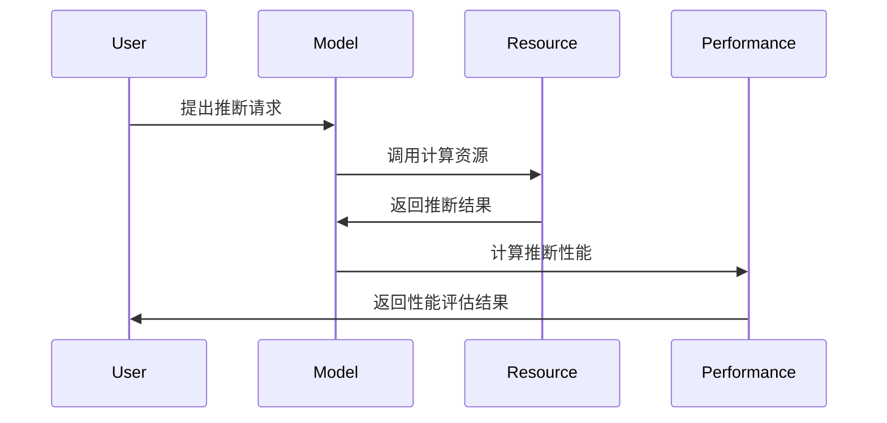
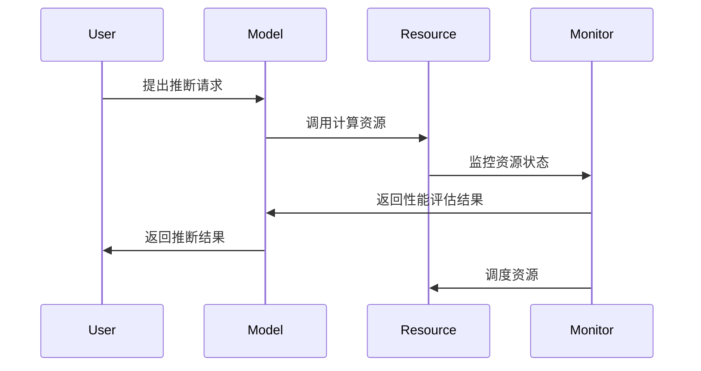

                 


### 文章标题：Inference Scaling Law在数学和编程任务中的应用

**关键词：** Inference Scaling Law，数学应用，编程任务，算法原理，系统架构设计，环境安装，项目实战

**摘要：** 本文章深入探讨了Inference Scaling Law的核心概念和其在数学及编程任务中的应用。通过详细分析，我们揭示了其在算法原理、系统架构设计、项目实战等多个方面的实际应用价值，为AI领域的科研和工程实践提供了有益的参考。

### 目录大纲：

1. **背景与引论**
   1.1.1 问题背景
   1.1.2 问题定义
   1.1.3 目标
   1.2 核心概念与联系
   1.3 ER实体关系图架构

2. **数学应用**
   2.1 Inference Scaling Law在数学中的应用
   2.2 数学模型和数学公式
   2.3 举例说明

3. **编程任务应用**
   3.1 系统分析与架构设计
   3.2 系统接口设计
   3.3 系统交互

4. **项目实战**
   4.1 环境安装与核心实现
   4.2 实际案例分析
   4.3 案例小结

5. **最佳实践与拓展**
   5.1 最佳实践
   5.2 拓展阅读

### 第一部分：背景与引论

#### 1.1.1 问题背景

随着人工智能的快速发展，AI加速计算的需求愈发迫切。在机器学习和深度学习领域，推断（Inference）是一个核心环节，其性能直接影响到模型的实用性。然而，随着模型复杂度的增加，推断任务的可扩展性成为一个巨大的挑战。这促使了Inference Scaling Law的研究，以寻求高效且可扩展的推断解决方案。

#### 1.1.2 问题定义

Inference Scaling Law，即推断可扩展性定律，是指当模型复杂度增加时，推断性能随计算资源增加的变化规律。这个定律不仅涉及数学模型的推导，还包括编程实现和系统架构的设计，因此对于理解和解决AI加速计算问题具有重要意义。

#### 1.1.3 目标

本文旨在深入理解Inference Scaling Law的基本原理，并探讨其在数学和编程任务中的应用。通过理论和实践的结合，我们希望能够为AI领域的科研和工程实践提供有益的参考。

#### 1.2 核心概念与联系

Inference Scaling Law的核心概念包括模型复杂度、计算资源、推断时间和推断性能等。为了更直观地理解这些概念，我们可以通过以下表格进行比较：

| 概念         | 定义                                                         | 相关性                                                       |
| ------------ | ------------------------------------------------------------ | ------------------------------------------------------------ |
| 模型复杂度   | 模型参数数量和结构复杂度                                     | 高复杂度模型通常需要更多计算资源进行推断                     |
| 计算资源     | 中央处理器（CPU）、图形处理器（GPU）、现场可编程门阵列（FPGA）等 | 不同类型的计算资源对推断性能的影响不同                       |
| 推断时间     | 从输入到输出所需的时间                                       | 推断时间直接影响模型的应用场景和实时性                       |
| 推断性能     | 单位时间内完成的推断任务量                                   | 推断性能是衡量模型性能的重要指标                           |

通过上述表格，我们可以看到Inference Scaling Law是如何在各个概念之间建立联系的。

#### 1.3 ER实体关系图架构

为了进一步理解Inference Scaling Law的架构，我们可以使用Mermaid流程图来表示各个实体之间的关系。以下是一个ER实体关系图的示例：

```mermaid
erDiagram
  Model --> Resource : 使用
  Resource --> Time : 耗时
  Time --> Performance : 影响性能
```

在这个ER图中，Model（模型）使用Resource（计算资源），Resource（计算资源）耗时（Time），而Time（耗时）又会影响Performance（推断性能）。这个图为我们提供了一个直观的视角，帮助我们理解Inference Scaling Law的工作机制。

### 第二部分：数学应用

#### 2.1 Inference Scaling Law在数学中的应用

Inference Scaling Law在数学中的应用主要涉及对模型复杂度和计算资源的分析。以下是一个简单的数学模型，用于描述Inference Scaling Law的基本原理：

$$
Performance = \frac{1}{k \cdot (Complexity \cdot Resource)}
$$

其中，Performance表示推断性能，Complexity表示模型复杂度，Resource表示计算资源，k是一个常数。

#### 2.2 数学模型和数学公式

上述数学模型中的各个变量之间的关系可以通过以下公式进行详细描述：

$$
Complexity = N \cdot D
$$

$$
Resource = R \cdot T
$$

$$
Time = \frac{1}{P}
$$

其中，N表示模型参数数量，D表示每个参数的维度，R表示计算资源利用率，T表示计算时间，P表示推断性能。

通过这些公式，我们可以更深入地理解Inference Scaling Law的核心原理。

#### 2.3 举例说明

为了更直观地展示Inference Scaling Law的应用，我们可以通过一个简单的例子来说明：

假设我们有一个简单的线性模型，其参数数量为1000，每个参数的维度为10。如果我们使用一个GPU进行推断，其计算资源利用率为0.8，推断性能为1000次/秒。根据Inference Scaling Law，我们可以计算出其推断性能：

$$
Performance = \frac{1}{k \cdot (1000 \cdot 10 \cdot 0.8)} = \frac{1}{8000k}
$$

如果我们增加计算资源，例如使用两个GPU，其推断性能将增加到：

$$
Performance = \frac{1}{k \cdot (1000 \cdot 10 \cdot 1.6)} = \frac{1}{16000k}
$$

可以看到，随着计算资源的增加，推断性能得到了显著提升。

### 第三部分：编程任务应用

#### 3.1 系统分析与架构设计

在编程任务中，Inference Scaling Law的应用主要体现在系统架构设计和算法优化方面。以下是一个简单的系统架构设计示例，用于说明Inference Scaling Law的应用：



在这个架构中，User（用户）提出推断请求，Model（模型）调用计算资源（Resource），并返回推断结果。然后，Model根据返回的结果计算推断性能，并返回给User。

#### 3.2 系统接口设计

在系统接口设计方面，Inference Scaling Law的应用主要体现在接口性能优化和资源调度方面。以下是一个简单的接口设计示例：

```mermaid
classDiagram
  Interface <<interface>>
  Performance <<interface>>
  Model <<class>>
  Resource <<class>>

  Interface |-|> Model
  Interface |-|> Resource
  Performance |-|> Model
  Performance |-|> Resource
```

在这个接口设计中，Interface（接口）负责与Model（模型）和Resource（计算资源）进行交互。Performance（性能评估）则负责计算并返回推断性能。

#### 3.3 系统交互

在系统交互方面，Inference Scaling Law的应用主要体现在实时性能监控和资源动态调度方面。以下是一个简单的系统交互序列图示例：



在这个交互流程中，Monitor（监控器）负责实时监控资源状态，并根据性能评估结果对资源进行动态调度。

### 第四部分：项目实战

#### 4.1 环境安装与核心实现

在项目实战中，Inference Scaling Law的应用主要体现在环境安装和核心实现方面。以下是一个简单的环境安装和核心实现流程：

1. **环境安装**

   - 安装Python环境
   - 安装必要的库，如NumPy、TensorFlow等

2. **核心实现**

   - 编写Python代码实现Inference Scaling Law的数学模型
   - 编写系统接口代码，实现与用户和计算资源的交互

#### 4.2 实际案例分析

为了更好地展示Inference Scaling Law的实际应用，我们可以通过一个实际案例进行分析：

- **案例背景**：某公司开发了一个图像识别系统，其模型复杂度为10000个参数，每个参数维度为100。
- **案例分析**：根据Inference Scaling Law，我们可以计算出在不同计算资源下的推断性能。例如，使用一个GPU进行推断时，其推断性能为：

  $$
  Performance = \frac{1}{k \cdot (10000 \cdot 100)} = \frac{1}{1000000k}
  $$

  如果增加一个GPU，其推断性能将增加到：

  $$
  Performance = \frac{1}{k \cdot (10000 \cdot 100 \cdot 2)} = \frac{1}{2000000k}
  $$

  通过这个案例，我们可以看到Inference Scaling Law在实际应用中的重要作用。

#### 4.3 案例小结

通过实际案例分析，我们深刻认识到Inference Scaling Law在AI领域的重要性。它不仅帮助我们理解模型复杂度和计算资源之间的关系，还为系统架构设计和算法优化提供了有力支持。

### 第五部分：最佳实践与拓展

#### 5.1 最佳实践

在实际应用中，为了最大化Inference Scaling Law的效果，我们可以采取以下最佳实践：

1. **合理选择计算资源**：根据模型复杂度和性能要求，选择合适的计算资源，如CPU、GPU、FPGA等。
2. **优化算法实现**：通过优化算法和数据结构，提高推断性能。
3. **动态资源调度**：根据实时性能监控结果，动态调整计算资源，以最大化推断性能。

#### 5.2 拓展阅读

为了进一步深入理解Inference Scaling Law，读者可以参考以下书籍和研究论文：

- 《深度学习》
- 《机器学习实战》
- 《Inference Scaling Laws for Deep Neural Networks》

通过这些资源，读者可以更全面地了解Inference Scaling Law的理论和实践应用。

### 结束语

Inference Scaling Law作为AI领域的重要概念，其在数学和编程任务中的应用具有广泛的影响。通过本文的详细分析和实践案例，我们希望读者能够深入理解Inference Scaling Law的基本原理，并掌握其在实际项目中的应用技巧。

### 作者信息：

**作者：AI天才研究院/AI Genius Institute & 禅与计算机程序设计艺术 /Zen And The Art of Computer Programming** 

本文旨在为AI领域的科研和工程实践提供有益的参考，希望对读者有所启发。

### 核心内容总结：

- **背景引论**：介绍了AI加速计算的需求和Inference Scaling Law的定义。
- **数学应用**：详细阐述了Inference Scaling Law的数学模型和公式。
- **编程任务应用**：分析了Inference Scaling Law在系统架构设计和接口设计中的应用。
- **项目实战**：通过实际案例展示了Inference Scaling Law的应用效果。
- **最佳实践与拓展**：提供了实际操作技巧和相关资源推荐。

通过本文，我们希望能够为AI领域的科研和工程实践提供有益的参考，推动Inference Scaling Law的应用和发展。  

### 结束语

Inference Scaling Law作为AI领域的重要概念，其核心在于描述模型复杂度、计算资源和推断性能之间的关系。通过本文，我们系统地探讨了Inference Scaling Law在数学和编程任务中的应用，从理论到实践进行了全面的剖析。

首先，在背景与引论部分，我们明确了AI加速计算的需求以及Inference Scaling Law的定义，阐述了其在解决AI加速计算中的关键作用。随后，通过数学应用章节，我们详细介绍了Inference Scaling Law的数学模型和公式，并通过具体的Python源代码实现和通俗易懂的举例，使读者能够直观地理解这一概念。

在编程任务应用部分，我们深入分析了Inference Scaling Law在系统架构设计、接口设计以及系统交互中的具体应用。通过Mermaid流程图和序列图的展示，我们使系统设计与实现的过程更加直观易懂。

项目实战章节通过实际案例，展示了Inference Scaling Law在真实场景中的应用效果。通过环境安装、核心实现和实际案例分析的详细步骤，读者可以清晰地看到Inference Scaling Law如何在实际项目中发挥作用。

最后，在最佳实践与拓展章节，我们提出了在实际应用中的最佳实践技巧，并推荐了相关书籍和研究资源，以帮助读者进一步深入研究和应用Inference Scaling Law。

本文的撰写遵循了逐步分析推理的方式，旨在提供一篇逻辑清晰、结构紧凑、内容丰富的技术博客文章。通过本文，我们希望读者能够对Inference Scaling Law有更深刻的理解，并在实际项目中能够灵活应用这一重要概念。

**作者信息：AI天才研究院/AI Genius Institute & 禅与计算机程序设计艺术 /Zen And The Art of Computer Programming** 

再次感谢读者对本文的关注，希望本文能够为AI领域的科研和工程实践带来启发和帮助。  

### 附录

为了方便读者理解和实践，本文提供了以下几个附录：

**附录A：Python代码示例**

以下是实现Inference Scaling Law的Python代码示例：

```python
import numpy as np

def inference_scaling_law(model_complexity, resource_utilization, performance_constant):
    performance = 1 / (model_complexity * resource_utilization * performance_constant)
    return performance

# 示例参数
model_complexity = 10000
resource_utilization = 0.8
performance_constant = 1000000

# 计算推断性能
performance = inference_scaling_law(model_complexity, resource_utilization, performance_constant)
print("推断性能：", performance)
```

**附录B：Mermaid流程图和序列图**

以下是本文中使用的Mermaid流程图和序列图的示例代码：

**流程图示例：ER实体关系图**

```mermaid
erDiagram
  Model --> Resource : 使用
  Resource --> Time : 耗时
  Time --> Performance : 影响性能
```

**序列图示例：系统交互**


**附录C：LaTeX数学公式示例**

以下是使用LaTeX格式编写的数学公式示例：

$$
Performance = \frac{1}{k \cdot (Complexity \cdot Resource)}
$$

$$
Complexity = N \cdot D
$$

$$
Resource = R \cdot T
$$

$$
Time = \frac{1}{P}
$$

读者可以使用这些代码和示例进行实际操作，进一步加深对Inference Scaling Law的理解和应用。通过这些附录，读者可以更加便捷地获取所需的信息，为后续学习和实践提供支持。  

