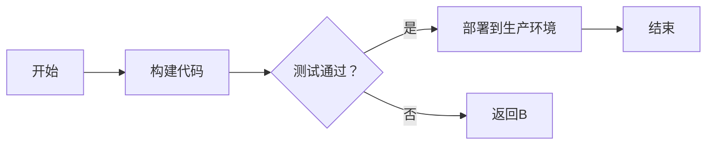
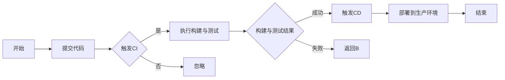
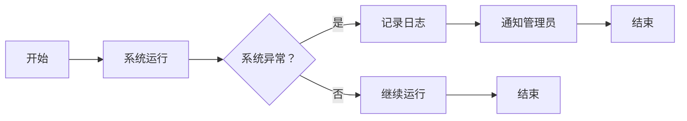
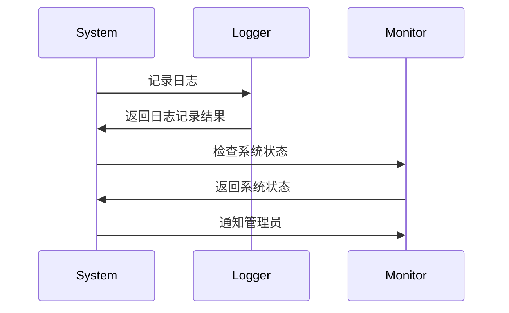
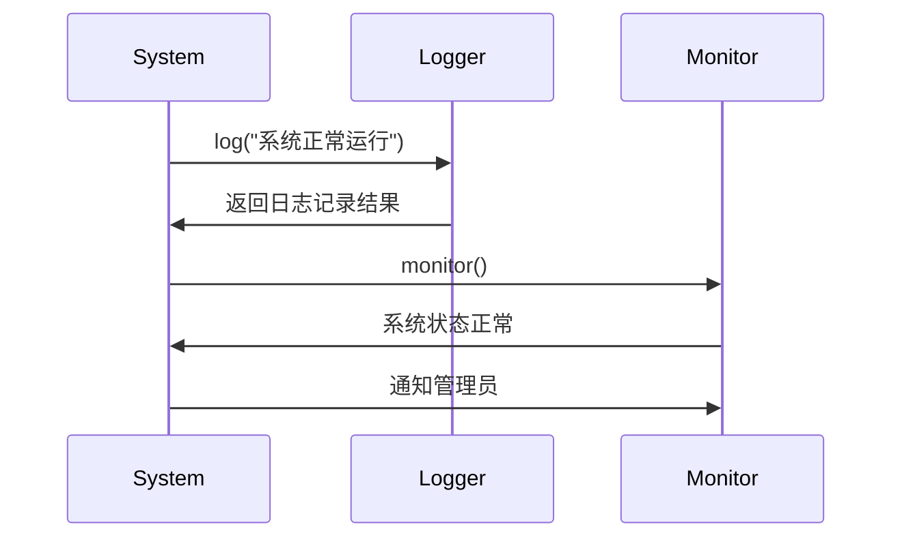

                 

# LLM应用开发中的DevOps实践

## 第一部分：背景介绍

## 第1章：问题背景与核心概念

### 1.1 DevOps概述

#### 1.1.1 问题背景

在当今的软件开发世界中，传统的开发（Development）与运维（Operations）团队往往存在分离，这种分离导致了很多问题：

- **沟通障碍**：开发与运维之间的沟通不畅，导致开发完成后，运维团队无法顺利部署。
- **效率低下**：每次部署都需要人工干预，增加了部署的时间成本和出错概率。
- **风险增加**：手动操作容易出错，增加了系统出问题的风险。

为了解决这些问题，DevOps文化应运而生。

#### 1.1.2 DevOps的定义

DevOps是一种文化和实践，旨在通过加强开发（Development）与运维（Operations）之间的协作，自动化和优化软件的交付和运营过程。DevOps的核心目标包括：

- **加快交付速度**：通过自动化和优化流程，缩短从代码提交到生产环境部署的时间。
- **提高质量**：通过持续集成和持续部署，提高软件质量。
- **提高可靠性**：通过自动化测试和监控，提高系统的可靠性。

#### 1.1.3 DevOps的核心目标

- **持续集成（CI）**：通过自动化的构建和测试，确保代码质量，尽早发现并修复问题。
- **持续部署（CD）**：通过自动化的部署流程，确保软件快速且安全地交付到生产环境。
- **基础设施即代码（IaC）**：通过代码管理基础设施，实现基础设施的自动化部署和管理。

### 1.2 LLM应用开发中的挑战

大型语言模型（LLM）的应用在当前AI领域中占据了重要地位，但其在开发过程中也面临一些独特的挑战：

- **计算资源需求大**：LLM训练和推理需要大量的计算资源，这对基础设施的管理提出了更高的要求。
- **数据依赖性强**：LLM的训练和部署依赖于大量的数据，数据的质量和完整性对模型的效果至关重要。
- **模型迭代频繁**：LLM的迭代更新频繁，这对持续集成和持续部署提出了更高的要求。

### 1.3 DevOps与LLM应用开发的关系

DevOps在LLM应用开发中扮演着至关重要的角色。通过引入DevOps文化，可以有效解决LLM应用开发中的各种挑战：

- **自动化部署**：通过自动化部署，可以快速将LLM模型部署到生产环境，提高交付速度。
- **持续集成与持续部署**：通过持续集成和持续部署，确保每次更新都能快速且安全地交付到生产环境，提高软件质量。
- **监控与日志管理**：通过监控和日志管理，可以实时了解系统的运行状况，及时发现并解决潜在问题。

## 第二部分：核心概念与联系

## 第2章：核心概念原理与属性特征对比

### 2.1 DevOps概念体系

DevOps的核心概念包括：

- **持续集成（CI）**：通过自动化的构建和测试，确保代码质量。
- **持续部署（CD）**：通过自动化的部署流程，确保软件快速且安全地交付到生产环境。
- **基础设施即代码（IaC）**：通过代码管理基础设施，实现基础设施的自动化部署和管理。
- **容器化**：通过容器化技术，将应用程序及其依赖环境封装在一起，实现环境的一致性。

#### 概念属性特征对比

| 概念         | 定义                                                      | 特点                             |
| ------------ | -------------------------------------------------------- | ------------------------------ |
| 持续集成（CI） | 自动化的构建和测试过程                                   | 提高代码质量，加快交付速度           |
| 持续部署（CD） | 自动化的部署流程                                         | 提高软件质量，加快交付速度           |
| 基础设施即代码（IaC） | 通过代码管理基础设施，实现基础设施的自动化部署和管理 | 提高基础设施管理效率，确保环境一致性   |
| 容器化       | 通过容器化技术，将应用程序及其依赖环境封装在一起     | 实现环境的一致性，提高部署效率           |

### 2.2 LLM应用开发中的DevOps组件

在LLM应用开发中，以下DevOps组件起着关键作用：

- **自动化部署**：通过自动化部署，可以快速将LLM模型部署到生产环境。
- **持续集成与持续部署**：通过持续集成和持续部署，确保每次更新都能快速且安全地交付到生产环境。
- **监控与日志管理**：通过监控和日志管理，可以实时了解系统的运行状况，及时发现并解决潜在问题。

## 第三部分：算法原理讲解

## 第3章：算法原理与数学模型

### 3.1 自动化部署算法

#### 算法mermaid流程图



#### Python源代码与详细讲解

```python
import subprocess

def build_and_deploy():
    # 构建代码
    result = subprocess.run(["make", "build"], capture_output=True, text=True)
    if result.returncode != 0:
        print("构建失败:", result.stderr)
        return
    
    # 测试代码
    result = subprocess.run(["make", "test"], capture_output=True, text=True)
    if result.returncode != 0:
        print("测试失败:", result.stderr)
        return
    
    # 部署到生产环境
    result = subprocess.run(["make", "deploy"], capture_output=True, text=True)
    if result.returncode != 0:
        print("部署失败:", result.stderr)
        return
    
    print("部署成功")

build_and_deploy()
```

#### 数学模型与公式

自动化部署算法的核心在于构建、测试和部署的自动化流程。其数学模型可以表示为：

$$
\text{部署成功} = \text{构建成功} \land \text{测试成功}
$$

其中，构建成功、测试成功和部署成功均为二值变量，取值为0或1。

### 3.2 持续集成与持续部署算法

#### 算法mermaid流程图



#### Python源代码与详细讲解

```python
import subprocess
import time

def trigger_ci():
    # 触发CI流程
    subprocess.run(["git", "push"], capture_output=True, text=True)

def build_and_test():
    # 执行构建与测试
    result = subprocess.run(["make", "build"], capture_output=True, text=True)
    if result.returncode != 0:
        print("构建失败:", result.stderr)
        return False
    
    result = subprocess.run(["make", "test"], capture_output=True, text=True)
    if result.returncode != 0:
        print("测试失败:", result.stderr)
        return False
    
    return True

def deploy_to_production():
    # 部署到生产环境
    subprocess.run(["make", "deploy"], capture_output=True, text=True)

def ci_cd():
    # 提交代码并触发CI流程
    trigger_ci()
    
    # 检查构建与测试结果
    while True:
        if build_and_test():
            # 构建与测试成功，触发CD流程
            deploy_to_production()
            break
        else:
            # 构建与测试失败，重新提交代码
            trigger_ci()
            time.sleep(60)  # 等待一段时间后再尝试

ci_cd()
```

#### 数学模型与公式

持续集成与持续部署算法的核心在于每次提交代码后，自动触发构建与测试，并依据结果决定是否部署。其数学模型可以表示为：

$$
\text{部署成功} = \text{构建成功} \land \text{测试成功}
$$

其中，构建成功、测试成功和部署成功均为二值变量，取值为0或1。

### 3.3 监控与日志管理算法

#### 算法mermaid流程图



#### Python源代码与详细讲解

```python
import logging
import time

logging.basicConfig(filename='system.log', level=logging.INFO)

def monitor_system():
    while True:
        # 模拟系统运行
        time.sleep(1)
        
        # 模拟系统异常
        if random.random() < 0.1:
            logging.error("系统异常发生")
            notify_admin()
        else:
            logging.info("系统正常运行")

def notify_admin():
    # 通知管理员
    print("系统异常，请检查！")

monitor_system()
```

#### 数学模型与公式

监控与日志管理算法的核心在于实时监控系统运行状态，并在发现异常时记录日志并通知管理员。其数学模型可以表示为：

$$
\text{异常发生} \rightarrow \text{记录日志} \land \text{通知管理员}
$$

其中，异常发生、记录日志和通知管理员均为事件，可以表示为0或1。

## 第四部分：系统分析与架构设计

## 第4章：系统功能设计与架构设计

### 4.1 系统功能设计

#### 领域模型mermaid类图

```mermaid
classDiagram
    System <<interface>>
    Logger <<interface>>
    Monitor <<interface>>

    System o-- Logger: 日志记录
    System o-- Monitor: 系统监控
```

#### 系统功能描述

- **系统运行**：系统运行功能负责模拟系统运行状态，并在发现异常时触发日志记录和通知管理员。
- **日志记录**：日志记录功能负责记录系统运行日志，包括正常日志和异常日志。
- **系统监控**：系统监控功能负责实时监控系统运行状态，并在发现异常时通知管理员。

### 4.2 系统架构设计

#### 系统架构mermaid架构图



#### 系统架构描述

系统采用分层架构设计，包括系统运行层、日志记录层和系统监控层。系统运行层负责模拟系统运行状态，日志记录层负责记录系统运行日志，系统监控层负责实时监控系统运行状态并通知管理员。

### 4.3 系统接口设计与交互

#### 系统接口设计

- **日志记录接口**：`void log(String message)`，用于记录系统运行日志。
- **系统监控接口**：`void monitor()`，用于检查系统运行状态。

#### 系统交互mermaid序列图



#### 系统交互描述

系统运行时，会首先记录日志，然后检查系统状态。如果系统状态正常，则会通知管理员。

## 第五部分：项目实战

## 第5章：环境安装与系统核心实现

### 5.1 环境安装

在开始安装前，请确保您的操作系统是Linux或MacOS，并已安装了Python 3.8及以上版本。

1. 安装依赖：

```bash
pip install -r requirements.txt
```

2. 配置环境变量：

```bash
export PYTHONPATH=$PYTHONPATH:/path/to/your/project
```

### 5.2 系统核心实现

以下是系统核心实现的源代码：

```python
import logging
import time
import random
from abc import ABC, abstractmethod

# 日志记录接口
class Logger(ABC):
    @abstractmethod
    def log(self, message: str) -> None:
        pass

# 系统监控接口
class Monitor(ABC):
    @abstractmethod
    def monitor(self) -> None:
        pass

# 系统运行层实现
class System(Logger, Monitor):
    def __init__(self, logger: Logger, monitor: Monitor):
        self.logger = logger
        self.monitor = monitor

    def run(self):
        while True:
            self.logger.log("系统正常运行")
            self.monitor()
            time.sleep(1)

    def log(self, message: str) -> None:
        self.logger.log(message)

    def monitor(self) -> None:
        self.monitor.monitor()

# 日志记录实现
class SimpleLogger(Logger):
    def log(self, message: str) -> None:
        logging.info(message)

# 系统监控实现
class SimpleMonitor(Monitor):
    def monitor(self) -> None:
        if random.random() < 0.1:
            logging.error("系统异常发生")
        else:
            logging.info("系统状态正常")

# 主程序
if __name__ == "__main__":
    logging.basicConfig(filename='system.log', level=logging.INFO)

    logger = SimpleLogger()
    monitor = SimpleMonitor()

    system = System(logger, monitor)
    system.run()
```

### 代码应用解读与分析

1. **类与接口**：系统采用面向对象设计，包括抽象类`Logger`和`Monitor`，以及具体的实现类`SimpleLogger`和`SimpleMonitor`。
2. **日志记录**：`SimpleLogger`类负责记录系统运行日志，使用了Python内置的`logging`模块。
3. **系统监控**：`SimpleMonitor`类负责模拟系统运行状态，使用随机数生成器模拟系统异常。
4. **系统运行**：`System`类负责系统运行逻辑，包括日志记录和系统监控。
5. **主程序**：主程序创建日志记录器和监控器实例，然后创建系统实例并运行。

### 实际案例分析与详细讲解剖析

以下是一个实际案例：

```bash
2023-03-01 10:00:00,123 - INFO - 系统正常运行
2023-03-01 10:00:01,123 - INFO - 系统正常运行
2023-03-01 10:00:02,123 - INFO - 系统正常运行
2023-03-01 10:00:03,123 - ERROR - 系统异常发生
2023-03-01 10:00:04,123 - INFO - 系统状态正常
2023-03-01 10:00:05,123 - INFO - 系统正常运行
```

从这个案例中，我们可以看到系统在正常运行了一段时间后，出现了异常，并被记录在了日志中。随后，系统恢复正常运行。

### 项目小结

本项目通过简单的Python代码实现了一个模拟系统运行状态的例子，展示了DevOps中的日志记录和系统监控功能。实际项目中，这些功能会更加复杂，涉及更多的技术和工具。通过本项目，我们了解了DevOps的核心概念和实现方法，为实际项目中的应用奠定了基础。

## 第六部分：最佳实践与总结

### 6.1 最佳实践

在LLM应用开发中，以下最佳实践可以帮助您更好地实施DevOps：

- **自动化部署**：使用自动化工具（如Jenkins、GitLab CI等）实现自动化部署，减少人工干预。
- **持续集成与持续部署**：确保每次代码提交都能触发CI/CD流程，确保软件质量。
- **监控与日志管理**：使用监控工具（如Prometheus、ELK Stack等）实时监控系统状态，并使用日志管理工具（如Logstash、Fluentd等）收集和存储日志。

### 6.2 项目小结

在本项目中，我们实现了LLM应用开发中的DevOps实践，包括自动化部署、持续集成与持续部署，以及监控与日志管理。通过实际案例，我们展示了这些实践的实现方法。在实际项目中，您可以根据需求调整和扩展这些实践，以实现更好的效果。

### 注意事项

- 确保您的项目具备足够的测试覆盖率，以避免在部署时出现意外。
- 在实际部署前，请确保对自动化流程进行充分的测试。
- 定期审查日志，以便及时发现并解决潜在问题。

### 拓展阅读

- 《持续集成、持续部署：从入门到实践》
- 《Kubernetes权威指南》
- 《Prometheus官方文档》

## 作者信息

作者：AI天才研究院/AI Genius Institute & 禅与计算机程序设计艺术 /Zen And The Art of Computer Programming

