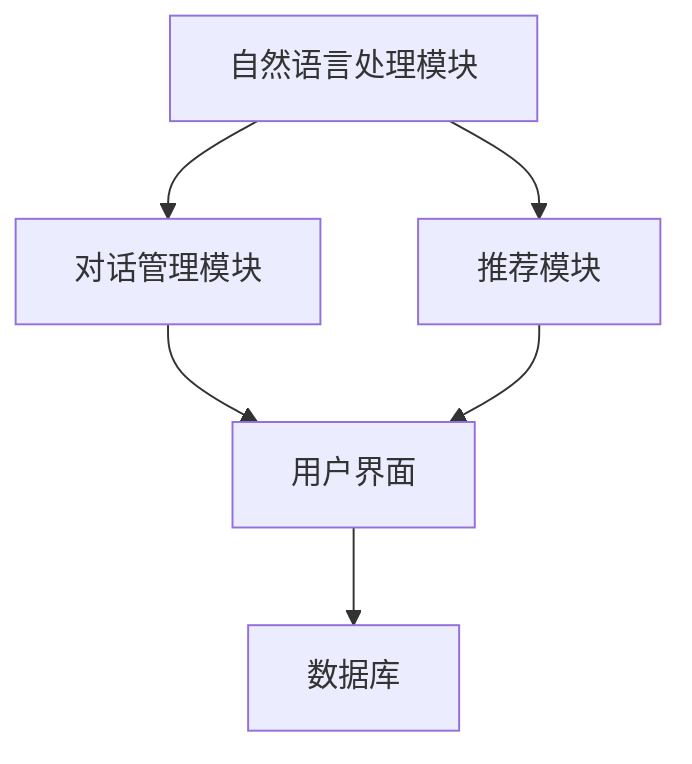

                 

## 《LLM应用开发中的DevOps实践》

### 关键词：LLM、DevOps、持续集成、持续部署、容器化、虚拟化

> 摘要：本文深入探讨了大型语言模型（LLM）应用开发中DevOps实践的必要性和方法。通过系统化的分析，本文介绍了LLM应用开发面临的挑战，阐述了DevOps的核心原则和工具，详细讲解了容器化与虚拟化技术在LLM应用开发中的应用，并提供了具体的DevOps流程和实践案例。文章旨在为开发者提供全面的指导，以高效构建和运维LLM应用。

---

### 《LLM应用开发中的DevOps实践》目录大纲

----------------------------------------------------------------

## 第一部分：背景与概述

### 第1章 DevOps概述

#### 1.1 DevOps的起源与发展

##### 1.1.1 DevOps的定义

##### 1.1.2 DevOps的核心原则

##### 1.1.3 DevOps与传统IT运营的比较

#### 1.2 LLM应用开发的挑战

##### 1.2.1 大规模语言模型的特性

##### 1.2.2 LLM应用开发中的挑战

##### 1.2.3 DevOps在LLM应用开发中的重要性

## 第二部分：DevOps基础

### 第2章 DevOps工具与技术

#### 2.1 版本控制工具

##### 2.1.1 Git的工作原理

##### 2.1.2 Git操作详解

##### 2.1.3 Git与其他版本控制工具的比较

#### 2.2 持续集成工具

##### 2.2.1 Jenkins的安装与配置

##### 2.2.2 Jenkins流水线的构建

##### 2.2.3 持续集成的好处与挑战

#### 2.3 持续部署工具

##### 2.3.1 Kubernetes的基本概念

##### 2.3.2 Kubernetes集群的部署

##### 2.3.3 使用Kubernetes进行应用部署

### 第3章 容器化与虚拟化

#### 3.1 容器化技术

##### 3.1.1 Docker的基本概念

##### 3.1.2 Docker的使用方法

##### 3.1.3 容器化技术的优势

#### 3.2 虚拟化技术

##### 3.2.1 虚拟化基础

##### 3.2.2 虚拟化技术的应用场景

##### 3.2.3 虚拟化与容器化的比较

## 第三部分：LLM应用开发中的DevOps实践

### 第4章 LLM应用开发流程

#### 4.1 LLM应用开发中的DevOps流程

##### 4.1.1 流程概述

##### 4.1.2 开发阶段

##### 4.1.3 部署阶段

##### 4.1.4 运维阶段

#### 4.2 版本控制与协作开发

##### 4.2.1 Git在LLM应用开发中的应用

##### 4.2.2 Git分支策略

##### 4.2.3 协作开发的最佳实践

### 第5章 持续集成与持续部署

#### 5.1 持续集成实践

##### 5.1.1 CI工具的选择

##### 5.1.2 CI流程的设计

##### 5.1.3 CI的常见问题与解决方法

#### 5.2 持续部署实践

##### 5.2.1 CD流程的设计

##### 5.2.2 Kubernetes在CD中的应用

##### 5.2.3 CD的监控与反馈机制

### 第6章 容器化与虚拟化在LLM应用开发中的应用

#### 6.1 容器化在LLM应用开发中的应用

##### 6.1.1 Docker在LLM应用开发中的应用

##### 6.1.2 容器镜像的构建与优化

##### 6.1.3 容器网络与存储配置

#### 6.2 虚拟化在LLM应用开发中的应用

##### 6.2.1 虚拟化技术在LLM应用开发中的优势

##### 6.2.2 虚拟化环境的管理与优化

##### 6.2.3 虚拟化与容器化的结合

### 第7章 DevOps在LLM应用运维中的实践

#### 7.1 监控与日志管理

##### 7.1.1 监控工具的选择

##### 7.1.2 监控指标的设计

##### 7.1.3 日志管理的最佳实践

#### 7.2 性能优化与资源调度

##### 7.2.1 性能优化的策略

##### 7.2.2 资源调度的方法

##### 7.2.3 自动化运维实践

## 第四部分：案例研究

### 第8章 案例研究一：某大型语言模型平台的DevOps实践

#### 8.1 项目背景

##### 8.1.1 项目简介

##### 8.1.2 项目目标

#### 8.2 DevOps架构设计

##### 8.2.1 架构设计思路

##### 8.2.2 系统架构图

##### 8.2.3 关键模块设计

#### 8.3 DevOps流程实现

##### 8.3.1 版本控制与协作开发

##### 8.3.2 持续集成与持续部署

##### 8.3.3 监控与日志管理

##### 8.3.4 性能优化与资源调度

#### 8.4 项目总结

##### 8.4.1 项目成果

##### 8.4.2 经验教训

##### 8.4.3 未来展望

----------------------------------------------------------------

在接下来的内容中，我们将一步一步深入探讨LLM应用开发中的DevOps实践，帮助您更好地理解和应用这一先进的技术方法。

---

## 第1章 DevOps概述

### 1.1 DevOps的起源与发展

**1.1.1 DevOps的定义**

DevOps是一种软件开发和运维的理念，旨在通过加强开发和运维团队之间的协作，实现软件交付和运维过程的自动化和高效化。DevOps不仅是一种技术实践，更是一种文化转变，其核心目标是通过消除开发与运维之间的隔阂，提高软件交付的速度和质量。

**1.1.2 DevOps的核心原则**

DevOps的核心原则包括：

1. **协作**：通过团队协作和沟通，消除开发和运维之间的障碍。
2. **自动化**：通过自动化工具和流程，减少手动操作，提高效率和稳定性。
3. **持续交付**：通过持续集成和持续部署，实现快速、可靠的软件交付。
4. **监控和反馈**：通过实时监控和反馈机制，及时发现和解决问题。

**1.1.3 DevOps与传统IT运营的比较**

传统IT运营模式中，开发团队负责软件的开发，运维团队负责软件的部署和维护。这种方式容易导致团队之间的沟通不畅，软件交付周期长，质量难以保证。而DevOps通过以下方式改进了传统IT运营：

1. **更快交付**：通过自动化和持续交付，缩短软件交付周期。
2. **更高质量**：通过协作和反馈，提高软件的质量和稳定性。
3. **更低成本**：通过减少重复工作和提高效率，降低运维成本。

### 1.2 LLM应用开发的挑战

**1.2.1 大规模语言模型的特性**

大型语言模型（LLM）具有以下特性：

1. **计算资源需求大**：LLM训练和推理需要大量计算资源，尤其是GPU资源。
2. **数据依赖性高**：LLM的性能高度依赖于训练数据的质量和数量。
3. **更新频繁**：为了保持模型的性能，需要定期更新模型，这通常涉及到大量的数据预处理和重新训练。

**1.2.2 LLM应用开发中的挑战**

1. **开发与运维分离**：由于LLM应用涉及大量的计算资源和数据处理，开发和运维团队之间的协作变得更加重要。
2. **环境一致性**：在开发环境中训练的模型需要在生产环境中保持一致，这要求开发和运维团队对环境的配置和管理有高度的一致性。
3. **持续优化**：为了提高LLM应用的性能，需要不断进行模型优化和系统调整，这需要高效的DevOps流程。

**1.2.3 DevOps在LLM应用开发中的重要性**

DevOps在LLM应用开发中具有重要意义：

1. **提高交付速度**：通过自动化和持续交付，可以快速部署和更新LLM应用。
2. **保证环境一致性**：通过标准化开发和运维流程，可以确保开发环境和生产环境的一致性。
3. **优化资源利用率**：通过自动化和优化，可以更高效地利用计算资源和数据资源。

### 1.3 总结

本章介绍了DevOps的起源与发展、核心原则以及与传统IT运营的比较。同时，分析了LLM应用开发的挑战以及DevOps在LLM应用开发中的重要性。接下来，我们将详细探讨DevOps的基础工具和技术，帮助您更好地理解DevOps实践。

---

## 第2章 DevOps工具与技术

### 2.1 版本控制工具

版本控制是DevOps实践的基础，它能够确保代码的版本一致性，支持协作开发，并便于问题的追踪和解决。以下是几种常见的版本控制工具：

**2.1.1 Git的工作原理**

Git是一种分布式版本控制系统，它将代码库分成多个分支，每个分支都可以独立开发，同时还可以随时合并代码。Git的核心原理包括：

1. **快照**：Git将代码库视为一系列的快照，每个快照代表代码库的一个版本。
2. **分支**：Git允许用户创建、切换和合并分支，从而实现多任务并行开发。
3. **提交**：每个修改都会生成一个提交，提交记录包括修改者的信息、提交时间和修改内容。

**2.1.2 Git操作详解**

以下是一些基本的Git操作：

1. **克隆仓库**：使用`git clone`命令克隆远程仓库到本地。
    ```shell
    git clone https://github.com/username/repository.git
    ```

2. **创建分支**：使用`git branch`命令创建新分支。
    ```shell
    git branch feature-new
    ```

3. **切换分支**：使用`git checkout`命令切换到指定分支。
    ```shell
    git checkout feature-new
    ```

4. **合并分支**：使用`git merge`命令将一个分支合并到另一个分支。
    ```shell
    git merge feature-new
    ```

5. **提交更改**：使用`git commit`命令提交更改。
    ```shell
    git commit -m "Update README.md"
    ```

6. **推送更改**：使用`git push`命令将本地分支的更改推送到远程仓库。
    ```shell
    git push origin feature-new
    ```

**2.1.3 Git与其他版本控制工具的比较**

相比于其他版本控制工具，如Subversion（SVN），Git具有以下优势：

1. **分布式**：Git是分布式版本控制系统，每个开发者都有自己的完整代码库，可以在没有网络连接的情况下工作。
2. **速度快**：Git的内部算法优化，使其在处理大量文件和大规模仓库时速度更快。
3. **灵活性强**：Git支持多种分支策略，便于多任务并行开发。

### 2.2 持续集成工具

持续集成（CI）是一种软件开发实践，通过自动化的方式将代码集成到代码库中，并快速发现集成错误。以下是几种常见的持续集成工具：

**2.2.1 Jenkins的安装与配置**

Jenkins是一个开源的持续集成工具，其安装和配置步骤如下：

1. **下载Jenkins**：访问Jenkins官网（[https://www.jenkins.io/](https://www.jenkins.io/)）下载最新版本的Jenkins。
2. **安装Jenkins**：解压下载的Jenkins包，运行Jenkins可执行文件。
3. **配置Jenkins**：启动Jenkins后，访问`http://localhost:8080/`，按照提示完成Jenkins的初始配置。

**2.2.2 Jenkins流水线的构建**

Jenkins流水线是一种自动化构建和部署的过程，其核心概念包括：

1. **阶段**：流水线中的任务分为多个阶段，如构建、测试、部署等。
2. **步骤**：每个阶段包含多个步骤，每个步骤可以是一个脚本、命令或插件。

以下是一个简单的Jenkins流水线示例：

```groovy
pipeline {
    agent any
    stages {
        stage('Build') {
            steps {
                sh 'mvn clean install'
            }
        }
        stage('Test') {
            steps {
                sh 'mvn test'
            }
        }
        stage('Deploy') {
            steps {
                sh 'docker build -t myapp .'
                sh 'docker run -d --name myapp myapp'
            }
        }
    }
}
```

**2.2.3 持续集成的好处与挑战**

持续集成的好处包括：

1. **快速发现错误**：通过自动化的构建和测试，可以快速发现集成错误。
2. **提高代码质量**：持续集成鼓励频繁提交和代码审查，有助于提高代码质量。
3. **缩短交付周期**：通过自动化流程，可以缩短软件交付周期。

持续集成也面临一些挑战：

1. **初始设置成本**：初次引入持续集成需要一定的技术和人力投入。
2. **维护成本**：持续集成系统需要定期维护和更新。
3. **代码质量要求**：持续集成要求代码质量较高，否则容易导致频繁的集成错误。

### 2.3 持续部署工具

持续部署（CD）是将代码从开发环境部署到生产环境的过程，其目标是通过自动化减少手动操作，提高部署的可靠性和速度。以下是几种常见的持续部署工具：

**2.3.1 Kubernetes的基本概念**

Kubernetes是一个开源的容器编排平台，它负责管理容器化应用的生命周期，包括部署、扩展和监控。Kubernetes的基本概念包括：

1. **Pod**：Pod是Kubernetes中的最小部署单元，它包含一个或多个容器。
2. **部署**：部署确保Pod按照指定的数量和配置运行。
3. **服务**：服务定义了如何访问Pod，它通常通过负载均衡将流量分配到多个Pod。
4. **状态集**：状态集确保Pod在故障时能够自动恢复。

**2.3.2 Kubernetes集群的部署**

部署Kubernetes集群可以分为以下步骤：

1. **选择基础设施**：选择适合的云服务提供商或本地硬件。
2. **安装Kubeadm**：使用Kubeadm安装Kubernetes集群。
3. **配置集群**：配置集群网络、存储和其他资源。
4. **安装和配置插件**：安装和配置Kubernetes所需的各种插件。

以下是一个简单的Kubernetes集群部署命令：

```shell
# 初始化主节点
kubeadm init --pod-network-cidr=10.244.0.0/16

# 配置kubectl工具
mkdir -p $HOME/.kube
sudo cp -i /etc/kubernetes/admin.conf $HOME/.kube/config
sudo chown $(id -u):$(id -g) $HOME/.kube/config

# 安装网络插件（如Calico）
kubectl apply -f https://docs.projectcalico.org/manifests/calico.yaml
```

**2.3.3 使用Kubernetes进行应用部署**

部署应用到Kubernetes集群通常包括以下步骤：

1. **编写YAML文件**：创建一个YAML文件，定义应用的部署配置。
2. **创建部署**：使用kubectl工具创建部署。
3. **监控部署**：监控部署的状态和资源使用情况。

以下是一个简单的部署示例：

```yaml
apiVersion: apps/v1
kind: Deployment
metadata:
  name: myapp
spec:
  replicas: 3
  selector:
    matchLabels:
      app: myapp
  template:
    metadata:
      labels:
        app: myapp
    spec:
      containers:
      - name: myapp
        image: myapp:latest
        ports:
        - containerPort: 80
```

```shell
kubectl apply -f deployment.yaml
```

### 2.4 总结

本章介绍了版本控制工具Git、持续集成工具Jenkins以及持续部署工具Kubernetes。通过这些工具，开发者可以更高效地进行协作、集成和部署，从而实现DevOps的目标。接下来，我们将探讨容器化与虚拟化技术，这些技术是DevOps实践的重要组成部分。

---

## 第3章 容器化与虚拟化

### 3.1 容器化技术

容器化是一种轻量级的虚拟化技术，它将应用及其依赖环境打包在一个独立的容器中，从而实现应用的快速部署、扩展和移植。以下是关于容器化技术的一些详细内容。

**3.1.1 Docker的基本概念**

Docker是一种开源的容器化平台，它允许开发者将应用程序及其依赖环境打包在一个轻量级的容器中。Docker的核心概念包括：

1. **容器**：容器是一个轻量级、可执行的独立环境，它包含了应用程序和所需的依赖。
2. **镜像**：镜像是一个静态的容器模板，它定义了容器中的应用程序和依赖环境。
3. **Dockerfile**：Dockerfile是一个文本文件，用于定义容器的构建过程，包括安装依赖、复制文件和设置环境变量等。
4. **仓库**：仓库是存储和管理镜像的存储库，它可以是本地仓库或远程仓库。

**3.1.2 Docker的使用方法**

以下是一些常用的Docker命令：

1. **启动容器**：使用`docker run`命令启动容器。
    ```shell
    docker run -d -p 8080:80 nginx
    ```

2. **查看容器**：使用`docker ps`命令查看正在运行的容器。
    ```shell
    docker ps
    ```

3. **停止容器**：使用`docker stop`命令停止容器。
    ```shell
    docker stop <container_id>
    ```

4. **创建镜像**：使用`docker build`命令创建镜像。
    ```shell
    docker build -t myapp:latest .
    ```

5. **推送镜像**：使用`docker push`命令将镜像推送到远程仓库。
    ```shell
    docker push myapp:latest
    ```

**3.1.3 容器化技术的优势**

容器化技术具有以下优势：

1. **轻量级**：容器化应用程序比虚拟机更轻量，因为它不包含操作系统，只包含应用程序和依赖环境。
2. **可移植性**：容器可以在不同的操作系统和环境中运行，因为它们是独立的、环境隔离的。
3. **可扩展性**：容器可以轻松地扩展和缩放，以满足应用程序的需求。
4. **自动化**：容器化应用程序可以通过脚本和自动化工具轻松部署和管理。

### 3.2 虚拟化技术

虚拟化技术是一种将物理资源抽象为虚拟资源的技术，它允许在同一物理主机上运行多个隔离的操作系统或应用程序。以下是关于虚拟化技术的一些详细内容。

**3.2.1 虚拟化基础**

虚拟化技术的基础概念包括：

1. **虚拟机**：虚拟机是一个虚拟的计算机系统，它可以在物理主机上运行。
2. **虚拟化层**：虚拟化层是一个软件层，它将物理资源抽象为虚拟资源，并提供虚拟机的管理和调度。
3. **虚拟化硬件**：虚拟化硬件是支持虚拟化技术的物理硬件，如虚拟化处理器和虚拟化网络设备。

**3.2.2 虚拟化技术的应用场景**

虚拟化技术适用于以下场景：

1. **服务器整合**：通过虚拟化技术，可以将多个物理服务器整合为一个虚拟化环境，从而提高资源利用率和管理效率。
2. **实验环境**：虚拟化技术可以创建隔离的实验环境，以便于测试和开发。
3. **资源调度**：虚拟化技术可以动态地调整资源分配，以满足不同应用程序的需求。

**3.2.3 虚拟化与容器化的比较**

虚拟化与容器化有以下不同点：

1. **资源隔离**：虚拟化通过虚拟机提供完整的操作系统隔离，而容器化通过命名空间和cgroups提供进程级别的隔离。
2. **性能开销**：虚拟化技术相比容器化技术有更高的性能开销，因为虚拟化层需要模拟硬件和操作系统。
3. **部署速度**：容器化应用程序比虚拟机更快地部署和启动，因为它们不需要完整的操作系统。

### 3.3 总结

本章介绍了容器化技术的基础知识和使用方法，以及虚拟化技术的基础和应用场景。容器化与虚拟化技术在DevOps实践中起着至关重要的作用，它们提供了灵活、可移植和可扩展的解决方案。接下来，我们将探讨LLM应用开发中的DevOps实践，以帮助开发者更好地构建和运维LLM应用。

---

## 第4章 LLM应用开发中的DevOps流程

### 4.1 LLM应用开发中的DevOps流程

在LLM应用开发中，DevOps流程是实现高效开发和运维的关键。下面我们详细讨论LLM应用开发中的DevOps流程，包括开发阶段、部署阶段和运维阶段。

**4.1.1 流程概述**

LLM应用开发中的DevOps流程通常包括以下阶段：

1. **开发阶段**：在这一阶段，开发团队负责编写和测试代码，构建和优化模型。
2. **部署阶段**：在这一阶段，持续集成和持续部署工具用于自动化构建、测试和部署LLM应用。
3. **运维阶段**：在这一阶段，运维团队负责监控应用性能、处理故障和进行系统升级。

**4.1.2 开发阶段**

在开发阶段，DevOps实践有助于提高开发效率和质量。以下是一些最佳实践：

1. **版本控制**：使用Git等版本控制工具进行代码管理，确保代码的一致性和可追溯性。
2. **代码审查**：通过代码审查，确保代码的质量和符合项目的开发标准。
3. **容器化**：使用Docker等容器化技术，将应用程序及其依赖环境打包在容器中，以便于部署和移植。
4. **持续集成**：使用Jenkins等持续集成工具，自动化构建和测试应用程序，确保代码的持续集成和稳定性。

**4.1.3 部署阶段**

在部署阶段，持续集成和持续部署（CI/CD）工具起着关键作用。以下是一些部署阶段的最佳实践：

1. **自动化构建**：使用CI工具自动化构建应用程序，确保每次提交的代码都可以顺利构建。
2. **容器化部署**：使用Kubernetes等容器编排工具，将容器化应用程序部署到生产环境中。
3. **蓝绿部署**：使用蓝绿部署策略，在旧版本和新版本之间切换，确保零停机升级。
4. **灰度发布**：通过灰度发布，逐步将流量切换到新版本，确保升级过程中的稳定性。

**4.1.4 运维阶段**

在运维阶段，监控和日志管理是确保应用稳定运行的重要手段。以下是一些运维阶段的最佳实践：

1. **监控**：使用Prometheus等监控工具，实时监控应用性能和系统资源使用情况。
2. **日志管理**：使用ELK（Elasticsearch、Logstash和Kibana）等日志管理工具，集中收集和展示日志数据。
3. **故障处理**：建立故障处理流程，确保在出现故障时能够快速响应和解决。
4. **自动化运维**：使用Ansible等自动化工具，实现自动化运维操作，减少人为错误。

### 4.2 版本控制与协作开发

版本控制和协作开发是DevOps流程的核心部分。以下是一些版本控制和协作开发的最佳实践：

**4.2.1 Git在LLM应用开发中的应用**

1. **分支管理策略**：采用分支管理策略，如Git Flow或GitHub Flow，确保分支的清晰和协作的高效。
2. **多分支开发**：在多个分支上进行开发，以便于并行处理不同的任务。
3. **代码合并**：在合并分支之前，进行充分的测试和代码审查，确保合并的代码质量。

**4.2.2 Git分支策略**

以下是几种常见的Git分支策略：

1. **Git Flow**：Git Flow是一种经典的分支管理策略，包括主分支（Master）、开发分支（Develop）和特性分支（Feature）。
2. **GitHub Flow**：GitHub Flow是一种轻量级的分支管理策略，强调快速提交、频繁合并和自动部署。

**4.2.3 协作开发的最佳实践**

1. **代码规范**：制定统一的代码规范，确保代码的可读性和可维护性。
2. **代码审查**：定期进行代码审查，确保代码的质量和符合项目的开发标准。
3. **文档记录**：及时记录项目文档，包括设计文档、开发日志和用户手册，以便于团队协作和后续维护。

### 4.3 总结

本章详细介绍了LLM应用开发中的DevOps流程，包括开发阶段、部署阶段和运维阶段。通过DevOps实践，开发者可以更高效地构建、部署和运维LLM应用。接下来，我们将探讨持续集成与持续部署（CI/CD）实践，进一步优化LLM应用的开发和部署过程。

---

## 第5章 持续集成与持续部署（CI/CD）实践

### 5.1 持续集成实践

持续集成（Continuous Integration，CI）是一种软件开发实践，通过自动化构建和测试，确保代码的连续性和稳定性。在LLM应用开发中，CI实践至关重要，可以大幅提高开发效率和代码质量。

**5.1.1 CI工具的选择**

选择适合的CI工具对于实现高效的CI流程至关重要。以下是一些流行的CI工具：

1. **Jenkins**：Jenkins是一个开源的CI工具，支持多种插件，具有高度的定制性和灵活性。
2. **Travis CI**：Travis CI是一个云端的CI工具，适用于GitHub项目，可以自动触发构建和测试。
3. **GitLab CI/CD**：GitLab CI/CD是GitLab集成的一部分，提供了强大的CI/CD功能，支持多种编程语言和框架。

**5.1.2 CI流程的设计**

设计一个高效的CI流程需要考虑以下几个方面：

1. **触发条件**：确定触发CI流程的条件，如代码提交、标签创建或定时任务。
2. **构建步骤**：定义构建步骤，包括下载依赖、编译代码和执行测试等。
3. **测试步骤**：设计测试步骤，包括单元测试、集成测试和性能测试等。
4. **报告和反馈**：生成构建报告和反馈，以便开发者和运维团队能够及时了解构建结果。

以下是一个简单的Jenkins CI流程示例：

```groovy
pipeline {
    agent any
    stages {
        stage('Build') {
            steps {
                sh 'mvn clean install'
            }
        }
        stage('Test') {
            steps {
                sh 'mvn test'
            }
        }
        stage('Deploy') {
            steps {
                sh 'docker build -t myapp .'
                sh 'docker run -d --name myapp myapp'
            }
        }
    }
}
```

**5.1.3 CI的好处与挑战**

持续集成的优势包括：

1. **快速反馈**：通过自动化测试，可以在代码提交后快速发现并修复问题。
2. **提高代码质量**：频繁的测试和代码审查有助于发现和消除代码中的缺陷。
3. **减少集成风险**：通过持续的集成，可以减少代码合并时的冲突和风险。

然而，CI也面临一些挑战：

1. **初始设置成本**：引入CI系统需要一定的技术和人力投入。
2. **维护成本**：CI系统需要定期更新和维护，以确保其正常运行。
3. **代码质量要求**：CI要求代码质量较高，否则可能导致频繁的构建失败。

### 5.2 持续部署实践

持续部署（Continuous Deployment，CD）是将应用程序自动部署到生产环境的过程。通过CD实践，可以大幅减少部署时间、提高部署可靠性和用户体验。

**5.2.1 CD流程的设计**

设计一个有效的CD流程需要考虑以下几个方面：

1. **环境配置**：确保开发、测试和生产环境的一致性。
2. **部署策略**：选择合适的部署策略，如蓝绿部署、灰度发布或滚动部署。
3. **自动化脚本**：编写自动化脚本，用于执行部署任务，如容器镜像构建、应用启动和配置更新等。
4. **监控与反馈**：部署后进行实时监控，确保应用运行稳定，并在出现问题时及时反馈和恢复。

以下是一个简单的Kubernetes CD流程示例：

1. **构建镜像**：在CI阶段构建应用程序的容器镜像。
    ```shell
    docker build -t myapp:latest .
    ```

2. **推送镜像**：将镜像推送到容器镜像仓库。
    ```shell
    docker push myapp:latest
    ```

3. **部署应用**：使用Kubernetes部署应用程序。
    ```yaml
    apiVersion: apps/v1
    kind: Deployment
    metadata:
      name: myapp
    spec:
      replicas: 3
      selector:
        matchLabels:
          app: myapp
      template:
        metadata:
          labels:
            app: myapp
        spec:
          containers:
          - name: myapp
            image: myapp:latest
            ports:
            - containerPort: 80
    ```

4. **应用部署**：使用kubectl工具部署应用程序。
    ```shell
    kubectl apply -f deployment.yaml
    ```

**5.2.2 Kubernetes在CD中的应用**

Kubernetes是一个强大的容器编排平台，它支持自动化部署、扩展和运维。以下是在CD流程中常用的Kubernetes功能：

1. **Deployment**：Deployment用于管理容器的部署和扩展，可以确保应用程序的稳定运行。
2. **Service**：Service用于将容器暴露给外部网络，可以实现负载均衡和访问控制。
3. **Ingress**：Ingress用于管理外部流量，可以实现自定义域名和路由规则。

**5.2.3 CD的监控与反馈机制**

在CD流程中，监控和反馈机制至关重要，可以确保部署的稳定性和可追溯性。以下是一些监控与反馈机制的实践：

1. **Prometheus**：Prometheus是一个开源的监控解决方案，可以实时监控应用程序的性能和健康状态。
2. **Grafana**：Grafana是一个开源的数据可视化平台，可以可视化Prometheus的数据，并提供告警功能。
3. **日志管理**：使用ELK（Elasticsearch、Logstash和Kibana）等日志管理工具，集中收集和展示日志数据，以便于问题追踪和故障排除。

### 5.3 总结

本章详细介绍了持续集成与持续部署（CI/CD）实践，包括CI工具的选择、CI流程的设计、CD流程的设计、Kubernetes在CD中的应用以及CD的监控与反馈机制。通过CI/CD实践，LLM应用开发者可以实现自动化、高效的开发和部署过程，提高开发效率和代码质量。接下来，我们将探讨容器化与虚拟化在LLM应用开发中的应用，进一步优化LLM应用的开发和运维。

---

## 第6章 容器化与虚拟化在LLM应用开发中的应用

### 6.1 容器化在LLM应用开发中的应用

容器化技术为LLM应用开发带来了极大的便利和效率。在容器化环境中，LLM应用可以更加灵活地部署和管理，从而满足快速迭代和高可用性的需求。

**6.1.1 Docker在LLM应用开发中的应用**

Docker是一种流行的容器化平台，它允许开发者将应用程序及其依赖环境打包在一个容器中。以下是Docker在LLM应用开发中的应用：

1. **容器镜像**：Docker镜像是一个静态的容器模板，它包含了应用程序的运行时环境、代码和依赖项。通过Docker镜像，LLM应用可以在任何支持Docker的环境中轻松部署。

2. **容器编排**：Docker Compose是一个用于定义和运行多容器Docker应用程序的工具。通过Docker Compose，开发者可以轻松管理多个容器，实现应用的分布式部署和管理。

3. **服务发现和负载均衡**：Docker Swarm和Kubernetes等容器编排工具支持服务发现和负载均衡功能，可以帮助开发者管理多个容器实例，确保应用的稳定运行和高可用性。

**6.1.2 容器镜像的构建与优化**

构建高效的容器镜像对于LLM应用的性能和资源利用率至关重要。以下是一些构建和优化容器镜像的最佳实践：

1. **最小化镜像大小**：通过删除不需要的文件和依赖，减小镜像的大小。可以使用Dockerfile的`COPY`指令逐步复制必要的文件，避免使用`COPY .`一次性复制所有文件。

2. **使用多阶段构建**：多阶段构建可以将应用程序的开发、测试和生产环境分离，从而减小镜像大小和提高构建效率。例如，可以首先构建依赖环境，然后构建应用程序代码，最后将两个阶段合并成最终的镜像。

3. **优化容器资源配置**：合理配置容器的CPU和内存资源，确保容器能够充分利用资源，同时避免资源不足或过度消耗。

**6.1.3 容器网络与存储配置**

容器网络和存储配置对于LLM应用的可扩展性和数据管理至关重要。以下是一些配置建议：

1. **容器网络**：使用容器网络可以实现容器之间的通信和负载均衡。Docker Swarm和Kubernetes等工具提供了丰富的网络功能，如容器路由、服务发现和负载均衡。

2. **容器存储**：容器存储可以是本地存储或远程存储。对于LLM应用，建议使用远程存储，如NFS或云存储，以便于数据的持久化和共享。

### 6.2 虚拟化在LLM应用开发中的应用

虚拟化技术为LLM应用开发提供了灵活的硬件资源管理和隔离环境。通过虚拟化，开发者可以在同一物理主机上运行多个隔离的操作系统和应用程序。

**6.2.1 虚拟化技术在LLM应用开发中的优势**

虚拟化技术在LLM应用开发中的优势包括：

1. **资源隔离**：通过虚拟化技术，LLM应用可以在隔离的环境中运行，从而避免资源争用和性能问题。

2. **灵活扩展**：虚拟化环境支持动态调整资源，如CPU、内存和存储，以满足应用的需求。

3. **高可用性**：虚拟化环境可以通过虚拟机镜像的备份和恢复实现应用的高可用性。

**6.2.2 虚拟化环境的管理与优化**

为了确保虚拟化环境的稳定性和性能，以下是一些管理和优化的最佳实践：

1. **虚拟机资源配置**：合理配置虚拟机的CPU、内存和存储资源，确保虚拟机能够充分利用物理硬件，同时避免资源浪费。

2. **网络优化**：优化虚拟化网络配置，包括网络带宽、延迟和丢包率，以确保虚拟机之间的通信效率和稳定性。

3. **监控与日志管理**：使用监控工具实时监控虚拟机的性能和资源使用情况，同时使用日志管理工具记录虚拟机的运行日志，以便于故障排查和性能分析。

### 6.3 虚拟化与容器化的结合

虚拟化与容器化技术的结合为LLM应用开发提供了更加灵活和高效的解决方案。以下是一些结合使用虚拟化和容器化的建议：

1. **混合部署**：在虚拟化环境中部署容器化应用，可以实现混合部署，结合虚拟化环境的高可用性和容器化的轻量级特性。

2. **虚拟化容器编排**：使用KVM或VMware等虚拟化平台提供的容器编排功能，可以统一管理虚拟机和容器，简化部署和管理过程。

3. **迁移与兼容性**：在容器化过程中，可以考虑使用虚拟化技术实现应用程序的迁移和兼容性，确保现有应用程序能够在新的容器化环境中正常运行。

### 6.4 总结

本章详细介绍了容器化与虚拟化技术在LLM应用开发中的应用，包括Docker在容器化环境中的应用、容器镜像的构建与优化、虚拟化技术在LLM应用开发中的优势以及虚拟化与容器化的结合使用。通过这些技术，开发者可以更加高效地构建、部署和管理LLM应用，提高开发效率和系统稳定性。接下来，我们将探讨DevOps在LLM应用运维中的实践，进一步优化LLM应用的运维过程。

---

## 第7章 DevOps在LLM应用运维中的实践

### 7.1 监控与日志管理

**7.1.1 监控工具的选择**

在LLM应用的运维中，选择合适的监控工具至关重要。以下是一些流行的监控工具：

1. **Prometheus**：Prometheus是一个开源的监控解决方案，具有强大的数据采集、存储和告警功能。
2. **Grafana**：Grafana是一个开源的数据可视化平台，可以与Prometheus等监控工具集成，提供丰富的图表和仪表板。
3. **Zabbix**：Zabbix是一个开源的监控工具，支持多种监控类型，包括系统性能、网络流量和应用程序监控。

**7.1.2 监控指标的设计**

监控指标的设计应考虑以下几个方面：

1. **CPU和内存使用率**：监控CPU和内存使用率，以确保LLM应用不会因资源不足而出现问题。
2. **GPU使用率**：由于LLM应用依赖于GPU计算，监控GPU使用率可以帮助及时发现和解决GPU资源不足的问题。
3. **网络带宽和延迟**：监控网络带宽和延迟，确保数据传输的稳定性和效率。
4. **磁盘空间使用率**：监控磁盘空间使用率，避免因磁盘空间不足导致的应用性能下降。

**7.1.3 日志管理的最佳实践**

日志管理是LLM应用运维的重要组成部分，以下是一些最佳实践：

1. **集中日志收集**：使用ELK（Elasticsearch、Logstash和Kibana）等工具，将日志集中收集到一台服务器上，以便于分析和查询。
2. **日志格式标准化**：制定统一的日志格式，确保日志的可读性和可解析性。
3. **日志告警机制**：配置日志告警机制，当出现错误日志时及时通知运维人员。
4. **日志分析工具**：使用日志分析工具，如Grok，对日志进行解析和分类，以便于快速定位问题。

### 7.2 性能优化与资源调度

**7.2.1 性能优化的策略**

为了提高LLM应用的性能，可以采取以下策略：

1. **负载均衡**：使用负载均衡器，如Nginx或HAProxy，将流量分配到多个LLM应用实例，以避免单点故障和资源瓶颈。
2. **缓存策略**：使用缓存技术，如Redis或Memcached，缓存频繁访问的数据，减少数据库和计算资源的负担。
3. **代码优化**：对LLM应用的代码进行优化，减少不必要的计算和数据库查询，提高应用的响应速度。

**7.2.2 资源调度的方法**

在LLM应用中，合理的资源调度对于保证应用性能和稳定性至关重要。以下是一些资源调度的方法：

1. **CPU调度策略**：使用Cgroups对CPU资源进行限制和隔离，避免一个应用占用过多CPU资源。
2. **内存调度策略**：使用内存限制和交换策略，确保每个应用都有足够的内存资源。
3. **GPU调度策略**：对于GPU密集型任务，可以使用NVIDIA的GPU管理工具进行调度和资源分配。

### 7.3 自动化运维实践

自动化运维是DevOps实践的核心之一，通过自动化工具和脚本，可以大幅提高运维效率和质量。以下是一些自动化运维的最佳实践：

1. **自动化部署**：使用容器编排工具，如Kubernetes，自动化部署LLM应用，确保部署的一致性和可靠性。
2. **自动化监控**：使用Prometheus等监控工具，自动化收集和报警，确保实时监控应用的性能和状态。
3. **自动化日志管理**：使用ELK等日志管理工具，自动化收集、存储和分析日志，方便故障排查和性能优化。

### 7.4 总结

本章详细介绍了DevOps在LLM应用运维中的实践，包括监控与日志管理、性能优化与资源调度以及自动化运维。通过这些实践，开发者可以更好地管理和维护LLM应用，提高系统稳定性和性能。接下来，我们将通过一个实际案例研究，深入探讨某大型语言模型平台的DevOps实践，以便更好地理解DevOps在LLM应用开发中的具体应用。

---

## 案例研究一：某大型语言模型平台的DevOps实践

### 8.1 项目背景

**8.1.1 项目简介**

某大型语言模型平台（以下简称“平台”）是一个基于人工智能技术提供智能对话服务的应用。平台旨在通过大规模语言模型（LLM）处理用户输入，生成自然、准确的回复，从而提高用户交互体验。平台的核心功能包括：

1. **自然语言处理**：利用LLM对用户输入进行解析，提取关键信息，并生成回复。
2. **对话管理**：管理用户对话流程，确保对话的连贯性和准确性。
3. **个性化推荐**：根据用户的历史对话记录，提供个性化的推荐和提醒。

**8.1.2 项目目标**

项目的主要目标包括：

1. **提高开发效率**：通过DevOps实践，实现自动化构建、测试和部署，提高开发团队的工作效率。
2. **确保系统稳定性**：通过监控和日志管理，实时监控系统的运行状态，确保平台的稳定性和可靠性。
3. **优化资源利用率**：通过性能优化和资源调度，提高计算资源和数据资源的利用率，降低运营成本。

### 8.2 DevOps架构设计

为了实现上述目标，项目团队设计了以下DevOps架构：

**8.2.1 架构设计思路**

架构设计思路包括：

1. **模块化**：将平台分为多个模块，如自然语言处理模块、对话管理模块和推荐模块，以便于独立开发和部署。
2. **分布式**：利用容器化和虚拟化技术，将应用部署到多个节点上，实现高可用性和可扩展性。
3. **自动化**：使用持续集成和持续部署（CI/CD）工具，实现自动化构建、测试和部署，提高开发效率和系统稳定性。

**8.2.2 系统架构图**

以下是系统架构图的简化版本：



**8.2.3 关键模块设计**

关键模块设计包括：

1. **自然语言处理模块**：负责处理用户输入，利用LLM生成回复。该模块采用容器化部署，以便于扩展和更新。
2. **对话管理模块**：负责管理用户对话流程，确保对话的连贯性和准确性。该模块采用分布式部署，以提高系统的可用性和响应速度。
3. **推荐模块**：根据用户的历史对话记录，提供个性化的推荐和提醒。该模块利用机器学习算法，实时更新推荐结果。

### 8.3 DevOps流程实现

**8.3.1 版本控制与协作开发**

为了实现高效的协作开发，项目团队采用了Git进行版本控制。以下是Git在项目中的应用：

1. **分支管理策略**：采用Git Flow分支管理策略，确保分支的清晰和协作的高效。主分支（Master）用于生产环境的部署，开发分支（Develop）用于合并特性分支，特性分支（Feature）用于开发新功能。
2. **代码审查**：在合并代码之前，进行代码审查，确保代码的质量和符合项目的开发标准。
3. **多分支开发**：在多个分支上进行开发，以便于并行处理不同的任务。

**8.3.2 持续集成与持续部署**

为了实现自动化构建、测试和部署，项目团队使用了Jenkins作为CI/CD工具。以下是CI/CD流程的实现：

1. **自动化构建**：使用Jenkins自动化构建应用程序，确保每次提交的代码都可以顺利构建。构建过程中，Jenkins会运行测试脚本，确保代码的稳定性和质量。
2. **容器化部署**：将应用程序容器化，使用Docker Compose进行部署。部署过程中，Jenkins会自动启动容器，并将其配置到Kubernetes集群中。
3. **监控与反馈**：使用Prometheus和Grafana监控系统的性能和状态，并在出现问题时及时触发告警。

**8.3.3 监控与日志管理**

为了确保平台的稳定性和可靠性，项目团队采用了以下监控与日志管理实践：

1. **集中日志收集**：使用ELK（Elasticsearch、Logstash和Kibana）工具，将日志集中收集到一台服务器上，以便于分析和查询。
2. **日志格式标准化**：制定统一的日志格式，确保日志的可读性和可解析性。
3. **日志告警机制**：配置日志告警机制，当出现错误日志时及时通知运维人员。

**8.3.4 性能优化与资源调度**

为了提高平台性能和资源利用率，项目团队采取了以下策略：

1. **负载均衡**：使用Nginx作为负载均衡器，将流量分配到多个应用实例，以避免单点故障和资源瓶颈。
2. **缓存策略**：使用Redis缓存频繁访问的数据，减少数据库和计算资源的负担。
3. **资源调度**：使用Kubernetes的自动扩缩容功能，根据负载情况动态调整应用实例的数量。

### 8.4 项目总结

**8.4.1 项目成果**

通过实施DevOps实践，项目取得了以下成果：

1. **提高了开发效率**：自动化构建、测试和部署减少了人工干预，提高了开发团队的工作效率。
2. **确保了系统稳定性**：通过监控和日志管理，实时监控系统的运行状态，确保平台的稳定性和可靠性。
3. **优化了资源利用率**：通过负载均衡和自动扩缩容，提高了计算资源和数据资源的利用率。

**8.4.2 经验教训**

项目团队总结了以下经验教训：

1. **重视自动化**：自动化是DevOps的核心，只有实现高度的自动化，才能提高开发效率和系统稳定性。
2. **持续优化**：DevOps实践不是一蹴而就的，需要持续优化和改进，以适应不断变化的需求和挑战。
3. **团队协作**：DevOps实践需要开发和运维团队的紧密协作，只有双方共同参与，才能实现DevOps的目标。

**8.4.3 未来展望**

未来，项目团队计划在以下方面进一步优化：

1. **加强监控与日志分析**：引入更先进的监控和分析工具，提高故障检测和问题解决的效率。
2. **提升代码质量**：引入代码质量评估工具，加强代码审查，提高代码的可靠性和可维护性。
3. **探索人工智能技术**：结合人工智能技术，进一步优化平台的对话管理和推荐功能，提高用户体验。

### 8.5 案例研究总结

通过本案例研究，我们深入探讨了某大型语言模型平台的DevOps实践。从项目背景到架构设计，再到DevOps流程实现和项目总结，我们详细介绍了如何通过DevOps实践提高开发效率、确保系统稳定性和优化资源利用率。本案例研究为我们提供了一个实际的参考，展示了DevOps在LLM应用开发中的具体应用和效果。

---

## 总结

本文全面探讨了LLM应用开发中的DevOps实践，从背景与概述、基础工具与技术、应用实践到案例研究，系统地阐述了DevOps在LLM应用开发中的重要性。通过本文，读者可以了解：

1. **DevOps的核心原则和工具**：包括版本控制工具（如Git）、持续集成工具（如Jenkins）和持续部署工具（如Kubernetes）。
2. **容器化与虚拟化技术**：详细介绍了Docker和虚拟化基础，以及它们在LLM应用开发中的应用。
3. **DevOps流程**：包括开发阶段、部署阶段和运维阶段的最佳实践。
4. **监控与日志管理**：介绍了监控工具的选择和日志管理的最佳实践。
5. **性能优化与资源调度**：探讨了负载均衡、缓存策略和资源调度方法。
6. **实际案例研究**：通过某大型语言模型平台的DevOps实践，展示了DevOps在LLM应用开发中的具体应用和效果。

### 最佳实践 Tips

1. **版本控制**：使用Git进行版本控制，确保代码的可追溯性和团队协作。
2. **自动化**：实现自动化构建、测试和部署，减少人工干预，提高效率。
3. **监控与反馈**：实时监控应用性能，确保快速响应和解决潜在问题。
4. **性能优化**：定期进行性能测试和优化，确保系统稳定性和响应速度。

### 小结

DevOps在LLM应用开发中的重要性不言而喻。通过DevOps实践，可以显著提高开发效率、确保系统稳定性和优化资源利用率。希望本文能为读者提供有益的参考和启示。

### 注意事项

1. **安全**：在部署和运维过程中，确保系统的安全性，防止潜在的安全风险。
2. **培训**：加强对团队成员的DevOps培训，提高整体团队的DevOps能力。

### 拓展阅读

1. **《DevOps实践指南》**：深入了解DevOps的理论和实践，提高DevOps技能。
2. **《容器化与虚拟化技术》**：深入探讨容器化和虚拟化技术，为LLM应用开发提供更多技术支持。

### 作者信息

**作者：AI天才研究院/AI Genius Institute & 禅与计算机程序设计艺术 /Zen And The Art of Computer Programming**

