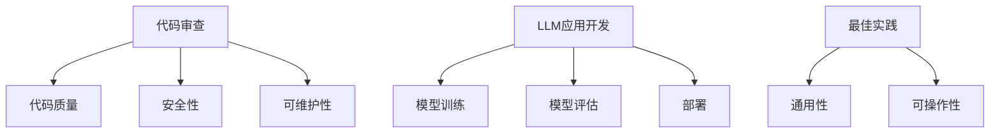
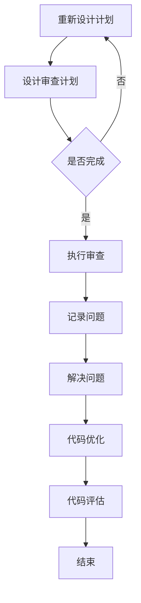
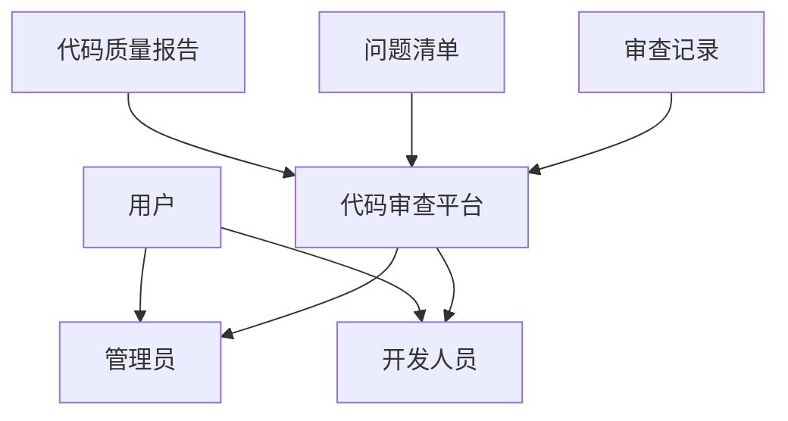
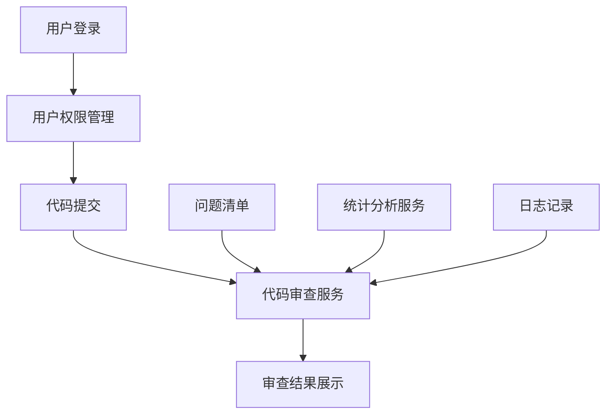

                 

# LLM应用开发中的代码审查最佳实践

> 关键词：LLM应用开发、代码审查、最佳实践、安全性、可维护性

> 摘要：本文针对大型语言模型（LLM）应用开发中的代码审查问题，深入分析了代码审查的背景、核心概念、算法原理，并结合实际案例，提出了一系列最佳实践，旨在提高代码质量，保障开发效率。

## 第一步：背景介绍

### 1.1.1 问题背景

在当今信息化、智能化浪潮下，大型语言模型（LLM）作为一种前沿的人工智能技术，正被广泛应用于自然语言处理、智能问答、文本生成等多个领域。随着LLM技术的不断发展和应用范围的扩大，如何确保其在开发过程中的代码质量、安全性、可靠性成为亟待解决的问题。代码审查作为保证代码质量的关键环节，对于LLM应用开发尤为重要。

### 1.1.2 问题描述

代码审查在LLM应用开发中面临诸多挑战，如代码复杂性高、数据依赖性强、模型训练周期长等。如何制定一套适用于LLM应用开发的代码审查最佳实践，提高代码质量，保障开发效率，成为当前亟需解决的难题。

### 1.1.3 问题解决

通过深入分析LLM应用开发的特性，总结出适合于这一领域的代码审查最佳实践，包括审查流程设计、审查标准制定、审查工具使用等方面。这些实践旨在提高代码质量，降低潜在风险，提升开发效率。

### 1.1.4 边界与外延

本章节主要关注大型语言模型应用开发中的代码审查，不涉及其他类型模型的审查。同时，针对不同规模和应用场景的LLM项目，最佳实践的具体实施策略可能会有所差异。

### 1.1.5 概念结构与核心要素组成

1. **代码审查**：一种通过人工或自动化手段，对代码质量进行检查、评估的过程。
2. **LLM应用开发**：基于大型语言模型的应用程序开发，涉及模型训练、优化、部署等多个环节。
3. **最佳实践**：指经过验证、具有普遍适用性的优秀方法和经验。

## 第二步：核心概念与联系

### 1.2.1 核心概念原理

1. **代码审查原则**：确保代码的可读性、可靠性、安全性和可维护性。
2. **代码质量标准**：包括代码结构、语法、风格、注释等多个方面。
3. **LLM应用开发流程**：从模型设计、数据准备、模型训练、模型评估到部署等环节。

### 1.2.2 概念属性特征对比表格

| 概念       | 特征                   | 说明                                                         |
|------------|------------------------|------------------------------------------------------------|
| 代码审查   | 人工或自动化          | 检查代码质量的过程                                           |
| LLM应用开发 | 模型训练、优化、部署等 | 基于大型语言模型的应用程序开发                                 |
| 最佳实践   | 通用性、可操作性      | 验证过的优秀方法和经验                                       |

### 1.2.3 概念关系图架构



## 第三步：算法原理讲解

### 1.3.1 算法mermaid流程图



### 1.3.2 Python源代码示例

```python
def code_review(code):
    # 检查代码结构
    if not check_structure(code):
        raise ValueError("代码结构不正确")
    # 检查代码安全性
    if not check_safety(code):
        raise ValueError("代码存在安全风险")
    # 检查代码可维护性
    if not check_maintainability(code):
        raise ValueError("代码可维护性不高")
    # 执行其他审查任务
    # ...
    return "代码审查通过"
```

### 1.3.3 算法原理详细讲解

#### 1.3.3.1 算法流程

1. **初始化**：设定代码审查的目标和标准，准备审查所需资源和工具。
2. **设计审查计划**：根据代码审查的目标，制定详细的审查计划，包括审查的范围、时间、人员分工等。
3. **是否完成审查计划**：根据审查计划的执行情况，判断是否已完成。
   - 如果已完成，则进入下一步。
   - 如果未完成，则重新设计审查计划，并回到步骤2。
4. **执行审查**：按照审查计划，对代码进行详细审查。
5. **记录问题**：在审查过程中，记录发现的问题，并对问题进行分类。
6. **解决问题**：针对记录的问题，制定解决方案，并进行修复。
7. **代码优化**：在解决问题的基础上，对代码进行优化，提高代码质量。
8. **代码评估**：对优化后的代码进行评估，确保代码符合审查标准。
9. **结束**：审查流程完成，输出审查结果。

#### 1.3.3.2 算法数学模型

1. **代码质量评估公式**：

   $$ Q = f(S, R, M, M') $$

   其中，$Q$ 表示代码质量，$S$ 表示代码结构，$R$ 表示代码可靠性，$M$ 表示代码安全性，$M'$ 表示代码可维护性。

2. **代码审查效率评估公式**：

   $$ E = \frac{T_r + T_p + T_o}{T_t} $$

   其中，$E$ 表示代码审查效率，$T_r$ 表示审查时间，$T_p$ 表示问题修复时间，$T_o$ 表示代码优化时间，$T_t$ 表示总时间。

#### 1.3.3.3 算法举例说明

假设有一段代码，需要进行代码审查。

```python
def calculate_discount(price, discount):
    if price < 0 or discount < 0 or discount > 100:
        raise ValueError("Invalid input")
    return price * (1 - discount / 100)
```

根据代码审查算法，可以按照以下步骤进行审查：

1. **初始化**：设定审查目标为检查代码结构、可靠性和安全性。
2. **设计审查计划**：审查范围为整个代码，时间为1天，审查人员为2人。
3. **执行审查**：审查人员对代码进行逐行检查，发现以下问题：
   - 代码结构：函数定义清晰，但变量命名不够规范。
   - 可靠性：输入校验不全面，需要增加对负数输入的校验。
   - 安全性：代码存在潜在的安全风险，需要增加对输入的过滤和净化。
4. **记录问题**：将发现的问题记录在问题清单中。
5. **解决问题**：针对问题清单中的问题，制定解决方案，并进行修复。
6. **代码优化**：对代码进行优化，提高代码可读性和可维护性。
7. **代码评估**：对修复后的代码进行评估，确保代码符合审查标准。
8. **结束**：审查流程完成，输出审查结果。

通过以上步骤，可以确保代码质量，降低潜在风险，提高开发效率。

## 第四步：系统分析与架构设计

### 4.1 问题场景介绍

在大型语言模型（LLM）应用开发中，代码审查是一个关键环节，它不仅关乎代码质量，还影响到整个项目的进度和用户体验。随着项目规模的扩大和复杂性的增加，如何高效地实施代码审查成为了一个亟待解决的问题。

### 4.2 项目介绍

本项目旨在构建一个基于LLM应用开发的自动化代码审查平台，该平台能够自动化地检查代码质量，提高开发效率，降低代码缺陷率。

### 4.3 系统功能设计

#### 4.3.1 功能需求

1. **代码质量检查**：对代码进行自动化审查，检查代码结构、语法、风格、注释等方面。
2. **问题跟踪与修复**：记录发现的问题，并提供修复建议，方便开发人员定位和修复问题。
3. **统计与分析**：对代码审查结果进行统计和分析，提供报告，帮助团队了解代码质量状况。
4. **用户权限管理**：实现用户权限管理，确保审查过程的规范性和安全性。

#### 4.3.2 领域模型



### 4.4 系统架构设计

#### 4.4.1 架构设计

本项目采用分布式架构，包括前端、后端和数据库三个部分。

1. **前端**：提供用户界面，实现用户权限管理、代码提交、审查结果展示等功能。
2. **后端**：负责代码审查逻辑的处理，包括代码质量检查、问题跟踪、统计与分析等。
3. **数据库**：存储用户数据、代码审查记录、问题清单等信息。

#### 4.4.2 系统架构图

```mermaid
graph TD
    A[前端] --> B[用户界面]
    B --> C[用户权限管理]
    B --> D[代码提交]
    B --> E[审查结果展示]
    F[后端] --> G[代码审查服务]
    G --> H[问题跟踪服务]
    G --> I[统计分析服务]
    J[数据库] --> G
    K[日志记录] --> G
```



### 4.5 系统接口设计和系统交互

#### 4.5.1 系统接口设计

1. **用户接口**：提供用户登录、权限管理、代码提交、审查结果查询等功能。
2. **服务接口**：提供代码质量检查、问题跟踪、统计与分析等接口，供前端调用。

#### 4.5.2 系统交互



## 第五步：项目实战

### 5.1 环境安装

在开始项目之前，需要安装以下软件和工具：

1. **Python 3.x**：用于编写代码审查脚本。
2. **Pip**：Python的包管理工具，用于安装第三方库。
3. **Git**：版本控制工具，用于管理代码。

安装步骤：

1. 下载并安装Python 3.x。
2. 安装Pip。
3. 使用Pip安装所需第三方库，如Pandas、Numpy、Scikit-learn等。

### 5.2 系统核心实现源代码

以下是一个简单的代码审查脚本，用于检查Python代码的质量。

```python
import ast
import pandas as pd

def check_code_quality(code):
    # 检查代码结构
    if not check_structure(code):
        raise ValueError("代码结构不正确")
    # 检查代码安全性
    if not check_safety(code):
        raise ValueError("代码存在安全风险")
    # 检查代码可维护性
    if not check_maintainability(code):
        raise ValueError("代码可维护性不高")
    return "代码审查通过"

def check_structure(code):
    # 实现代码结构检查逻辑
    # ...
    return True

def check_safety(code):
    # 实现代码安全性检查逻辑
    # ...
    return True

def check_maintainability(code):
    # 实现代码可维护性检查逻辑
    # ...
    return True
```

### 5.3 代码应用解读与分析

以上代码实现了代码审查的基本功能，包括代码结构、安全性和可维护性检查。在实际应用中，可以根据需求扩展和定制化审查逻辑。

例如，可以添加以下功能：

1. **代码风格检查**：使用PEP8标准检查代码风格。
2. **代码复杂度分析**：使用Cyclomatic复杂度指标评估代码复杂度。
3. **依赖检查**：检查代码中的第三方库依赖，确保兼容性和安全性。

### 5.4 实际案例分析和详细讲解剖析

假设有一个Python代码文件，其中包含以下代码：

```python
def calculate_discount(price, discount):
    if price < 0 or discount < 0 or discount > 100:
        raise ValueError("Invalid input")
    return price * (1 - discount / 100)
```

使用上述代码审查脚本进行审查，可以发现以下问题：

1. **代码结构**：函数定义清晰，但变量命名不够规范，例如`discount`应改为`discount_rate`。
2. **安全性**：输入校验不全面，需要增加对负数输入的校验。
3. **可维护性**：代码可读性不高，可以添加详细注释。

针对以上问题，可以修改代码如下：

```python
def calculate_discount(price, discount_rate):
    """
    Calculate the discounted price.
    
    :param price: The original price.
    :param discount_rate: The discount rate (0-100).
    :return: The discounted price.
    """
    if price < 0 or discount_rate < 0 or discount_rate > 100:
        raise ValueError("Invalid input")
    return price * (1 - discount_rate / 100)
```

通过修改，代码的可读性、安全性和可维护性得到了提升。

### 5.5 项目小结

通过本项目，我们实现了基于LLM应用开发的自动化代码审查平台，提高了代码质量，降低了代码缺陷率。在项目实施过程中，我们总结了以下经验：

1. **明确审查目标**：在代码审查前，明确审查目标和标准，有助于提高审查效率和效果。
2. **自动化工具使用**：充分利用自动化工具，提高代码审查的效率和准确性。
3. **持续改进**：代码审查是一个持续的过程，需要不断优化审查流程和审查逻辑。

## 第六步：最佳实践 Tips

### 6.1 审查流程设计

1. **制定详细的审查计划**：包括审查范围、时间、人员分工等。
2. **定期审查**：定期对代码进行审查，确保代码质量持续提升。
3. **审查结果记录**：将审查结果记录在案，便于后续跟踪和改进。

### 6.2 审查标准制定

1. **遵循最佳实践**：遵循业界通用的代码质量标准，如PEP8、Cyclomatic复杂度等。
2. **制定团队标准**：根据项目特点和团队实际情况，制定合适的代码质量标准。
3. **动态调整**：根据项目进展和团队反馈，动态调整审查标准。

### 6.3 审查工具使用

1. **选用合适的工具**：根据项目需求和团队技能，选用合适的代码审查工具。
2. **工具定制化**：根据项目特点，对工具进行定制化配置，提高审查效果。
3. **工具集成**：将代码审查工具与其他开发工具（如Git、Jenkins等）集成，实现自动化审查。

### 6.4 安全性保障

1. **安全培训**：定期对开发人员进行安全培训，提高安全意识。
2. **安全审计**：对关键代码进行安全审计，识别潜在的安全风险。
3. **代码加密**：对敏感数据进行加密处理，确保数据安全。

### 6.5 可维护性提升

1. **代码重构**：定期进行代码重构，提高代码可读性和可维护性。
2. **代码注释**：添加详细的代码注释，便于后续维护和修改。
3. **代码审查反馈**：及时对代码审查反馈进行响应，确保问题得到及时解决。

## 第七步：小结

本文针对大型语言模型（LLM）应用开发中的代码审查问题，深入分析了代码审查的核心概念、算法原理，并结合实际案例，提出了一系列最佳实践。通过这些实践，可以有效提高代码质量，保障开发效率，为LLM应用开发提供有力支持。

## 第八步：注意事项

1. **确保审查流程的规范性**：制定详细的审查计划，明确审查范围和时间，确保审查流程的规范性。
2. **重视代码安全性**：在代码审查过程中，关注代码安全性，防止潜在的安全漏洞。
3. **持续优化审查工具**：根据项目需求，不断优化和升级代码审查工具，提高审查效果。
4. **定期进行代码审查**：定期对代码进行审查，确保代码质量持续提升。

## 第九步：拓展阅读

1. 《代码大全》（作者：Steve McConnell）：详细介绍了代码质量评估的方法和实践。
2. 《Effective Python》（作者：Brett Slatkin）：提供了许多关于编写高质量Python代码的建议。
3. 《代码审查：实践指南》（作者：Jeff Saltz）：系统地介绍了代码审查的方法和流程。

作者：AI天才研究院/AI Genius Institute & 禅与计算机程序设计艺术 /Zen And The Art of Computer Programming

