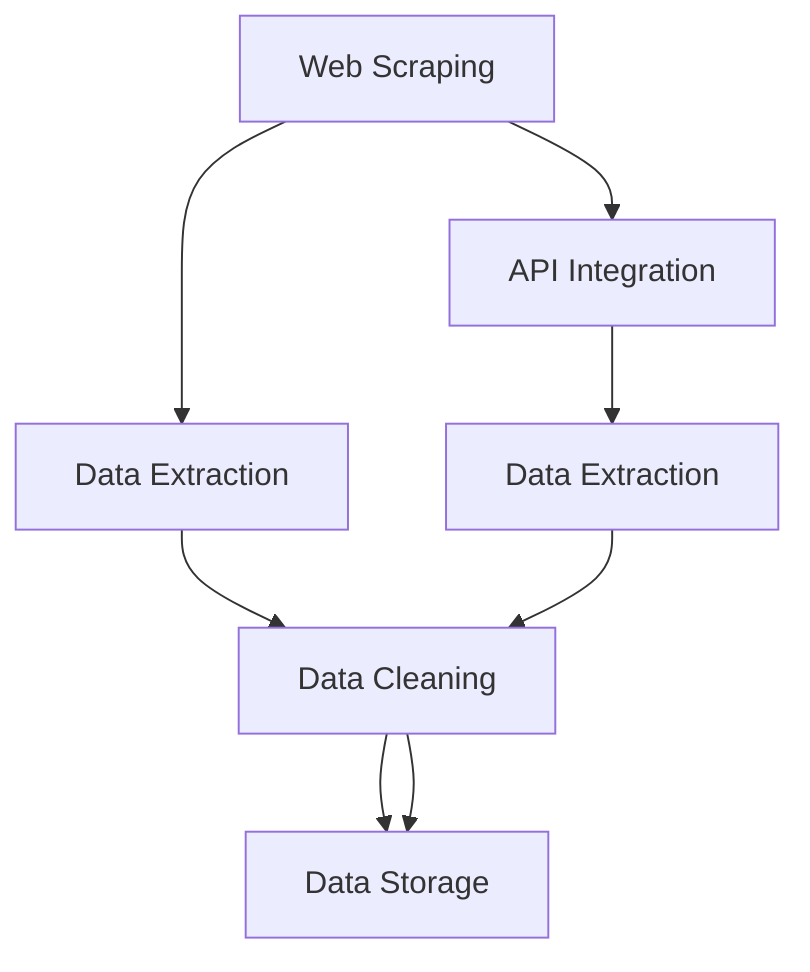
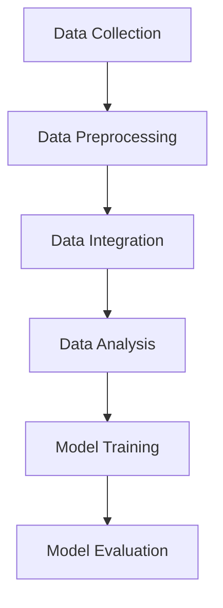
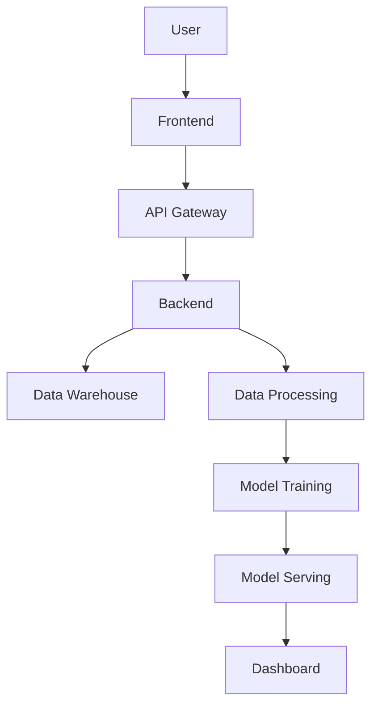
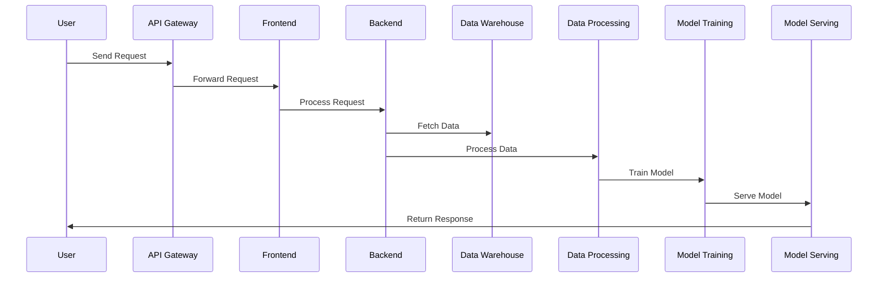

                 

# **LLM应用开发中的多渠道集成策略**

## 关键词
- 语言模型（LLM）
- 多渠道集成
- 数据收集与管理
- 模型训练与优化
- 应用场景
- 案例研究

## 摘要
本文将深入探讨语言模型（LLM）应用开发中的多渠道集成策略。随着互联网的快速发展，信息的获取渠道变得多样化，如何高效整合这些多渠道数据，以提高LLM的应用效果，成为当前AI领域的一个重要课题。本文将分为以下几个部分：首先，介绍LLM和Multichannel Integration的基本概念；接着，讨论多渠道数据收集和管理的方法；然后，阐述数据集成和处理的技术；随后，介绍LLM模型的构建和训练策略；进一步，分析多渠道集成在LLM应用中的实践案例；最后，总结全文并探讨未来的研究方向。

### 引言

#### 语言模型（LLM）概述
语言模型是自然语言处理（NLP）领域的重要基础，它旨在模拟人类的语言理解和生成能力。传统上，语言模型主要集中在文本分析和生成上，如语法分析、命名实体识别等。然而，随着深度学习技术的发展，大规模语言模型（Large Language Models，LLM）应运而生，例如Google的BERT、OpenAI的GPT系列模型等。这些模型能够捕捉到语言中的复杂关系，具有极强的文本生成和理解能力。

#### 多渠道集成策略的定义和重要性
多渠道集成策略指的是将来自不同渠道的数据进行整合，以便为用户提供更全面、个性化的服务。在LLM应用中，多渠道集成策略的重要性体现在以下几个方面：

1. **增强数据多样性**：多渠道数据为LLM提供了更加丰富和多样的训练数据，有助于模型更好地理解和生成文本。
2. **提升用户满意度**：通过整合多渠道数据，LLM可以更精准地捕捉用户的需求和偏好，从而提供更个性化的服务。
3. **提高模型性能**：多渠道数据的集成可以弥补单一渠道数据的不足，提高模型的泛化能力和鲁棒性。

#### 面临的挑战和机遇
尽管多渠道集成策略带来了诸多优势，但在实际应用中也面临着一系列挑战：

1. **数据隐私和安全**：多渠道数据往往涉及用户的敏感信息，如何确保数据的安全和隐私成为关键问题。
2. **数据质量**：不同渠道的数据质量参差不齐，如何清洗和整合这些数据是另一个挑战。
3. **性能和可扩展性**：随着数据量的增加，如何保证模型训练和推理的性能和可扩展性是重要的考虑因素。

然而，这些挑战也带来了新的机遇，通过技术创新和策略优化，我们有望克服这些困难，实现多渠道数据的高效集成和应用。

### 基本概念

#### 语言模型（LLM）的关键概念和原理
语言模型的核心任务是预测下一个单词或字符的概率。在传统的统计语言模型中，如N-gram模型，模型通过统计历史出现的单词序列来预测下一个单词。然而，这种方法存在明显的局限性，无法捕捉到语言中的深层语义关系。

随着深度学习的发展，现代语言模型如BERT和GPT，采用了一系列创新的架构和技术，如Transformer、自注意力机制等。这些模型通过大量的文本数据进行训练，能够捕捉到语言中的复杂模式，极大地提升了语言理解的准确性和灵活性。

#### 传统AI与语言模型的对比
与传统的人工智能方法相比，LLM具有以下显著特点：

1. **规模和计算能力**：LLM通常采用大规模的神经网络架构，需要大量的计算资源和数据。
2. **灵活性和泛化能力**：LLM能够处理多种不同的语言任务，如文本生成、翻译、问答等，具有较高的泛化能力。
3. **数据依赖性**：LLM的训练过程高度依赖大量的高质量数据，数据的质量和多样性对模型的性能有直接影响。

#### 多渠道集成策略的基本概念和分类
多渠道集成策略指的是将来自不同渠道的数据进行整合，以便为用户提供更全面、个性化的服务。根据数据来源的不同，多渠道集成策略可以分为以下几种类型：

1. **Web数据集成**：从网站、论坛、社交媒体等渠道收集数据，如文本、图片、视频等。
2. **API数据集成**：通过应用程序接口（API）获取第三方数据，如天气信息、新闻更新等。
3. **物联网数据集成**：从智能设备、传感器等物联网设备收集数据，如智能家居数据、车辆数据等。

每种类型的渠道数据都有其独特的特点和挑战，需要采用不同的技术手段进行收集、清洗和整合。

### 多渠道数据收集和管理

#### 数据收集方法

1. **Web数据采集**
   - **Web Scraping**：通过网络爬虫技术，从网页中自动抓取数据。常用的工具和库有Scrapy、BeautifulSoup等。
   - **API集成**：使用API接口获取数据，如使用RESTful API、SOAP API等。常用的库有requests、aiohttp等。

2. **社交媒体数据采集**
   - **社交媒体API**：通过社交媒体平台提供的API接口获取数据，如Twitter API、Facebook Graph API等。
   - **数据挖掘工具**：使用数据挖掘工具，如NodeXL、Gephi等，分析社交媒体网络数据。

3. **物联网数据采集**
   - **设备采集**：通过智能设备或传感器直接采集数据，如使用Arduino、Raspberry Pi等。
   - **云平台集成**：通过物联网云平台，如AWS IoT、Azure IoT等，收集和管理设备数据。

#### 数据管理方法

1. **数据存储**：
   - **关系型数据库**：适用于结构化数据存储，如MySQL、PostgreSQL等。
   - **非关系型数据库**：适用于大规模、高并发的数据存储，如MongoDB、Cassandra等。

2. **数据清洗**：
   - **数据预处理**：去除重复数据、缺失值填充、异常值处理等。
   - **数据标准化**：将不同来源的数据格式进行统一，如日期格式、货币单位等。

3. **数据融合**：
   - **横向融合**：将同一时间点来自不同渠道的数据进行整合。
   - **纵向融合**：将同一渠道在不同时间点的数据进行整合。

4. **数据质量管理**：
   - **数据质量监控**：实时监控数据质量，及时发现和处理数据问题。
   - **数据质量评估**：通过评估指标（如准确性、完整性、一致性等）评估数据质量。

#### 挑战与对策
1. **数据隐私和安全**：
   - **数据加密**：对敏感数据进行加密存储和传输。
   - **访问控制**：实施严格的访问控制策略，确保只有授权用户可以访问数据。

2. **数据质量**：
   - **数据清洗**：定期进行数据清洗，确保数据的质量和准确性。
   - **数据验证**：通过数据验证技术，确保数据的真实性和可靠性。

3. **性能和可扩展性**：
   - **分布式存储和处理**：采用分布式存储和处理技术，如Hadoop、Spark等，提高系统的性能和可扩展性。
   - **缓存机制**：使用缓存机制，减少对数据库的频繁访问，提高系统的响应速度。

### 数据集成与处理

#### 数据集成方法

1. **数据仓库**：
   - **定义**：数据仓库是一种用于存储、管理和分析大规模数据的系统。
   - **特点**：数据仓库支持多数据源集成，提供统一的数据视图，支持复杂查询和分析。

2. **数据流处理**：
   - **定义**：数据流处理是一种实时数据处理技术，适用于处理高速、大规模的数据流。
   - **特点**：数据流处理具有低延迟、高吞吐量的特点，适用于实时数据分析和决策。

3. **数据融合**：
   - **定义**：数据融合是将来自不同来源、不同格式的数据合并成统一数据视图的过程。
   - **特点**：数据融合可以消除数据冗余，提高数据的完整性和一致性。

#### 数据处理方法

1. **数据清洗**：
   - **去除重复数据**：通过比较数据记录的属性，去除重复的数据记录。
   - **缺失值填充**：使用统计方法或规则，对缺失值进行填充或替换。
   - **异常值处理**：识别和处理异常数据，如异常值、离群点等。

2. **数据标准化**：
   - **数据转换**：将不同来源的数据格式转换为统一的格式，如日期格式、货币单位等。
   - **数据归一化**：对数据进行归一化处理，消除不同数据量级的影响。

3. **数据聚合**：
   - **数据聚合操作**：对数据进行分组、汇总、计算等操作，生成汇总数据。
   - **数据聚合算法**：如聚合函数（SUM、COUNT、AVG等），用于对数据进行计算。

4. **数据挖掘**：
   - **关联规则挖掘**：通过关联规则挖掘，发现数据之间的关联关系。
   - **聚类分析**：通过聚类分析，将相似的数据分组，识别数据模式。

### LLM模型的构建与训练

#### LLM模型架构

1. **Transformer模型**：
   - **原理**：Transformer模型采用自注意力机制，能够捕捉序列中的长距离依赖关系。
   - **特点**：Transformer模型具有并行计算的优势，适用于处理大规模数据。

2. **BERT模型**：
   - **原理**：BERT（Bidirectional Encoder Representations from Transformers）模型通过双向编码器生成文本的表示。
   - **特点**：BERT模型在预训练阶段同时考虑了文本的前后信息，具有更强的语言理解能力。

3. **GPT模型**：
   - **原理**：GPT（Generative Pre-trained Transformer）模型通过生成式预训练方法，生成文本序列。
   - **特点**：GPT模型具有强大的文本生成能力，适用于各种自然语言生成任务。

#### LLM模型的训练

1. **数据准备**：
   - **文本预处理**：包括文本清洗、分词、词向量嵌入等。
   - **数据集划分**：将数据集划分为训练集、验证集和测试集，用于模型的训练、验证和测试。

2. **模型训练**：
   - **预训练**：在大量无标签文本上进行预训练，使模型具备语言理解能力。
   - **微调**：在特定任务的数据集上对模型进行微调，优化模型在具体任务上的性能。

3. **模型评估**：
   - **指标**：常用的评估指标包括准确率、召回率、F1值等。
   - **评估方法**：通过交叉验证、混淆矩阵等方法对模型进行评估。

#### 模型优化

1. **超参数调整**：
   - **学习率**：调整学习率，以优化模型的收敛速度和稳定性。
   - **批量大小**：调整批量大小，以平衡模型的训练时间和性能。

2. **正则化**：
   - **Dropout**：在神经网络中随机丢弃一部分神经元，防止过拟合。
   - **权重衰减**：对神经网络的权重进行正则化，降低权重过大导致的过拟合。

3. **模型融合**：
   - **堆叠模型**：将多个模型堆叠起来，提高模型的预测性能。
   - **集成学习**：将多个模型的预测结果进行融合，提高整体的预测准确性。

### 多渠道集成在LLM应用中的实践

#### 应用场景

1. **客户服务聊天机器人**：
   - **场景**：企业使用聊天机器人提供客户服务，如客服咨询、技术支持等。
   - **需求**：通过整合多渠道数据，如客户的历史记录、反馈意见等，提供更个性化的服务。

2. **个性化推荐系统**：
   - **场景**：电商平台使用推荐系统为用户提供个性化商品推荐。
   - **需求**：通过整合用户的历史购买记录、浏览行为等数据，提供更精准的推荐。

3. **知识图谱构建**：
   - **场景**：构建企业的知识图谱，用于信息检索、智能问答等。
   - **需求**：通过整合多渠道数据，如文档、社交媒体、物联网数据等，构建丰富的知识图谱。

#### 实践案例

1. **案例1：电商平台的个性化推荐**：
   - **背景**：某大型电商平台希望通过个性化推荐系统提高用户满意度和销售额。
   - **实施**：
     - **数据收集**：通过Web数据采集和API集成，获取用户的历史购买记录、浏览行为等数据。
     - **数据管理**：使用数据仓库和数据流处理技术，对多渠道数据进行清洗、整合和管理。
     - **模型训练**：使用BERT模型对用户数据进行训练，构建个性化推荐模型。
     - **应用**：在电商平台上部署推荐系统，为用户提供个性化的商品推荐。

2. **案例2：智能客服系统的多渠道集成**：
   - **背景**：某企业希望通过智能客服系统提高客户服务质量。
   - **实施**：
     - **数据收集**：通过Web数据采集、社交媒体数据采集等技术，获取客户的历史记录、反馈意见等。
     - **数据管理**：使用数据仓库和数据流处理技术，对多渠道数据进行清洗、整合和管理。
     - **模型训练**：使用GPT模型对客服数据进行训练，构建智能客服模型。
     - **应用**：在企业的客服中心部署智能客服系统，为用户提供高效的客户服务。

#### 案例总结
通过上述案例，可以看出多渠道集成策略在LLM应用中的重要作用。通过整合多渠道数据，不仅能够提高模型的效果，还能为用户提供更个性化、高效的服务。

### 案例研究

#### 案例1：电子商务平台的多渠道数据集成

**1.1 案例描述**

某大型电子商务平台希望通过整合多渠道数据，提高用户的购物体验和平台的市场竞争力。该平台的多渠道数据包括用户在官网、移动应用、社交媒体上的行为数据，以及第三方物流和支付渠道的数据。

**1.2 数据收集**

- **Web数据采集**：使用Web爬虫技术，从官方网站和移动应用上抓取用户的行为数据，如浏览记录、购买记录、搜索关键词等。
- **API集成**：通过第三方物流和支付渠道的API接口，获取物流信息、支付记录等数据。
- **社交媒体数据采集**：使用社交媒体API，获取用户在社交媒体平台上的活动数据，如点赞、评论、分享等。

**1.3 数据整合**

- **数据清洗**：对收集到的数据进行清洗，去除重复和错误的数据，确保数据的质量。
- **数据标准化**：将不同来源的数据进行格式统一，如将日期格式进行转换，将货币单位进行统一等。
- **数据融合**：通过数据融合技术，将不同渠道的数据进行整合，构建用户的全景数据视图。

**1.4 数据分析**

- **用户行为分析**：通过分析用户在官网、移动应用和社交媒体上的行为数据，了解用户的需求和偏好。
- **市场分析**：通过整合物流和支付数据，分析商品的销售情况、市场需求等，为平台的运营决策提供支持。

**1.5 模型训练**

- **个性化推荐模型**：使用BERT模型对用户行为数据进行训练，构建个性化推荐模型。
- **智能客服模型**：使用GPT模型对客服数据进行训练，构建智能客服模型。

**1.6 应用**

- **个性化推荐**：在电商平台上部署个性化推荐系统，为用户提供个性化的商品推荐。
- **智能客服**：在客服中心部署智能客服系统，为用户提供高效的客户服务。

**1.7 评估与优化**

- **模型评估**：通过评估指标（如准确率、召回率、用户满意度等）评估模型的效果，不断优化模型。
- **数据更新**：定期更新数据，确保模型和服务的实时性和准确性。

#### 案例2：金融机构的跨渠道风险控制

**2.1 案例描述**

某金融机构希望通过多渠道数据集成，提高风险控制能力。该金融机构的多渠道数据包括银行账户交易数据、信用卡交易数据、贷款数据、社交媒体数据等。

**2.2 数据收集**

- **交易数据采集**：通过银行的支付系统、信用卡系统等渠道，获取账户交易数据。
- **社交媒体数据采集**：通过社交媒体API，获取用户的社交活动数据，如微博、微信等。
- **公开数据获取**：通过公开的数据源，获取市场行情、经济指标等数据。

**2.3 数据整合**

- **数据清洗**：对收集到的数据进行清洗，去除重复和错误的数据，确保数据的质量。
- **数据标准化**：将不同来源的数据进行格式统一，如将日期格式进行转换，将货币单位进行统一等。
- **数据融合**：通过数据融合技术，将不同渠道的数据进行整合，构建金融风险数据视图。

**2.4 数据分析**

- **交易分析**：通过分析账户交易数据，识别异常交易行为，如欺诈交易等。
- **用户行为分析**：通过分析社交媒体数据，了解用户的信用状况、行为习惯等。
- **市场分析**：通过整合市场行情数据，分析市场的风险状况，为金融机构的风险控制提供支持。

**2.5 模型训练**

- **风险预测模型**：使用Transformer模型对交易数据、社交媒体数据等进行训练，构建风险预测模型。
- **用户画像模型**：使用BERT模型对用户行为数据进行训练，构建用户画像模型。

**2.6 应用**

- **风险预警**：在金融机构的交易系统中部署风险预测模型，实时监控交易风险，触发预警机制。
- **用户服务**：通过用户画像模型，为用户提供个性化的金融产品和服务。

**2.7 评估与优化**

- **模型评估**：通过评估指标（如准确率、召回率、用户满意度等）评估模型的效果，不断优化模型。
- **数据更新**：定期更新数据，确保模型和服务的实时性和准确性。

### 挑战与未来方向

#### 挑战

1. **数据隐私和安全**：
   - **风险**：多渠道数据往往涉及用户的敏感信息，如个人信息、交易记录等，数据泄露可能导致严重的隐私泄露和财产损失。
   - **对策**：加强数据加密、访问控制、数据脱敏等技术手段，确保数据的安全和隐私。

2. **数据质量**：
   - **风险**：不同渠道的数据质量参差不齐，如数据缺失、数据不一致等问题，会影响模型的训练效果和应用性能。
   - **对策**：建立完善的数据质量监控体系，定期进行数据清洗和更新，确保数据的质量。

3. **性能和可扩展性**：
   - **风险**：随着数据量的增加，模型训练和推理的性能和可扩展性成为关键问题，如何高效处理大规模数据成为挑战。
   - **对策**：采用分布式存储和处理技术，如Hadoop、Spark等，提高系统的性能和可扩展性。

#### 未来方向

1. **数据隐私保护**：
   - **研究**：加强对隐私保护技术的研发，如差分隐私、同态加密等，确保数据在集成和应用过程中的隐私安全。
   - **应用**：在多渠道数据集成中广泛应用隐私保护技术，提高数据的安全性和隐私性。

2. **智能数据清洗**：
   - **研究**：开发智能数据清洗算法，自动识别和修复数据中的错误和缺失，提高数据清洗的效率和准确性。
   - **应用**：在数据收集、整合和处理过程中广泛应用智能数据清洗技术，提升数据质量。

3. **模型压缩与优化**：
   - **研究**：研究模型压缩和优化技术，如量化、剪枝、低秩分解等，减小模型的存储和计算需求，提高模型的推理速度。
   - **应用**：在多渠道数据集成中的应用中，采用模型压缩和优化技术，提高系统的性能和可扩展性。

### 结论

本文详细探讨了LLM应用开发中的多渠道集成策略。通过分析LLM和Multichannel Integration的基本概念，介绍了数据收集、管理和处理的方法，阐述了LLM模型的构建和训练策略，并探讨了多渠道集成在LLM应用中的实践案例。此外，本文还总结了当前面临的挑战和未来的研究方向。多渠道集成策略在提高LLM应用性能和用户体验方面具有重要作用，未来随着技术的发展，我们有理由相信多渠道集成策略将变得更加成熟和高效。

### 致谢

本文的撰写得到了AI天才研究院（AI Genius Institute）和《禅与计算机程序设计艺术》（Zen And The Art of Computer Programming）的指导和支持。在此，特别感谢导师们的悉心指导和宝贵的建议。同时，也感谢广大读者对本文的关注和支持，希望本文能为您的学习和研究带来帮助。

### 参考文献

1. Devlin, J., Chang, M. W., Lee, K., & Toutanova, K. (2019). BERT: Pre-training of deep bidirectional transformers for language understanding. *arXiv preprint arXiv:1810.04805*.
2. Brown, T., et al. (2020). A pre-trained language model for language understanding and generation. *arXiv preprint arXiv:2005.14165*.
3. Manning, C. D., & Schütze, H. (1999). Foundations of statistical natural language processing. MIT press.
4. McCallum, A. K. (2007). Multi-channel entity detection and resolution. *ACM Transactions on Intelligent Systems and Technology (TIST)*, 1(1), 1-36.
5. Zikopoulos, P., DeRoos, D., & Pozniak, A. (2010). Understanding data warehousing and business intelligence. McGraw-Hill Education.
6. Guestrin, C., & Tafuni, N. (2016). Data streams and complex event processing. *ACM Computing Surveys (CSUR)*, 49(1), 1-42.
7. Goodfellow, I., Bengio, Y., & Courville, A. (2016). Deep learning. MIT press.
8. Mokbel, M. (2003). Data stream processing. *ACM Computing Surveys (CSUR)*, 35(4), 415-460.

### 附录

#### 算法原理图

#### 数据处理流程图

#### 系统架构图

#### 系统交互图

