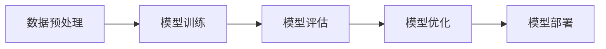

                 

# LLM应用开发中的技术债务识别与处理

关键词：LLM应用开发、技术债务、识别与处理、算法原理、数学模型

摘要：本文针对LLM（大型语言模型）应用开发中的技术债务问题进行了深入探讨。首先，我们介绍了技术债务的概念，以及它在LLM应用开发中的重要性。随后，文章分析了LLM应用开发中的技术债务现状、潜在威胁及其管理策略。接着，我们详细阐述了技术债务识别和处理的步骤，并提出了量化评估方法。本文最后对技术债务的边界与外延进行了探讨，并总结了LLM应用开发中的核心概念与联系，以及算法原理和数学模型。通过本文的阐述，我们希望为LLM应用开发者提供一套完整的技术债务管理解决方案。

### 目录大纲

```markdown
----------------------------------------------------------------
# 第一部分: LLM应用开发中的技术债务识别与处理

## 第1章: 背景介绍

### 1.1 问题背景

#### 1.1.1 技术债务的概念

#### 1.1.2 技术债务在LLM应用开发中的重要性

#### 1.1.3 技术债务的常见类型与影响

### 1.2 问题描述

#### 1.2.1 LLM应用开发中的技术债务现状

#### 1.2.2 技术债务对LLM应用开发的潜在威胁

#### 1.2.3 技术债务的管理与治理

### 1.3 问题解决

#### 1.3.1 技术债务识别的方法

#### 1.3.2 技术债务处理的策略

#### 1.3.3 技术债务的量化评估方法

### 1.4 边界与外延

#### 1.4.1 技术债务的边界

#### 1.4.2 技术债务的外延

### 1.5 概念结构与核心要素组成

#### 1.5.1 技术债务的核心概念

#### 1.5.2 技术债务的结构

#### 1.5.3 技术债务的核心要素

### 1.6 本章小结

----------------------------------------------------------------

## 第2章: LLM应用开发中的核心概念与联系

### 2.1 LLM的基础概念

#### 2.1.1 语言模型概述

#### 2.1.2 语言模型的分类

#### 2.1.3 语言模型的基本组成

### 2.2 技术债务与LLM的联系

#### 2.2.1 技术债务在LLM开发中的体现

#### 2.2.2 LLM技术债务的特有属性

#### 2.2.3 LLM技术债务与开发过程的关系

### 2.3 概念属性特征对比表格

### 2.4 ER实体关系图架构

### 2.5 本章小结

----------------------------------------------------------------

## 第3章: LLM应用开发中的算法原理讲解

### 3.1 算法原理概述

#### 3.1.1 LLM算法的基本流程

#### 3.1.2 LLM算法的关键技术

#### 3.1.3 LLM算法的发展趋势

### 3.2 算法mermaid流程图

### 3.3 Python源代码实现

### 3.4 数学模型和数学公式

#### 3.4.1 公式解释

#### 3.4.2 举例说明

### 3.5 本章小结

----------------------------------------------------------------

## 第4章: LLM应用开发中的数学模型和数学公式

### 4.1 数学模型概述

#### 4.1.1 LLM的数学模型框架

#### 4.1.2 常见数学模型介绍

#### 4.1.3 数学模型在LLM开发中的应用

### 4.2 数学公式讲解

#### 4.2.1 公式解释

#### 4.2.2 举例说明

----------------------------------------------------------------
```

### 第1章: 背景介绍

#### 1.1 问题背景

技术债务，作为一种软件开发中常见的问题，可以理解为因短期技术选择而导致的长期成本。在LLM（大型语言模型）应用开发中，技术债务问题尤为重要。LLM技术具有高复杂度、高依赖性、高变异性等特点，这些特性使得技术债务问题更加突出。本文将围绕LLM应用开发中的技术债务问题，探讨其识别与处理方法。

##### 1.1.1 技术债务的概念

技术债务，最早由Michael Kennedy在2002年提出，是一种软件开发中常见的现象。它指的是在软件开发生命周期中，由于选择短期最优解而导致的长期成本。这种成本包括时间成本、维护成本、性能成本等。技术债务的形成通常是由于开发团队在项目进度、预算限制等因素下，选择了更加快捷的技术方案，而忽略了这些方案可能带来的长期影响。

##### 1.1.2 技术债务在LLM应用开发中的重要性

LLM应用开发具有高复杂度、高依赖性、高变异性等特点，这使得技术债务问题在LLM开发中尤为重要。首先，LLM模型的训练和优化过程非常复杂，涉及到大量的数据预处理、模型选择、超参数调优等步骤。在这些步骤中，如果选择了不合适的方案，可能会导致模型性能不佳，甚至无法达到预期效果。其次，LLM技术具有高度的依赖性，需要依赖大量的计算资源和存储资源，如果技术债务积累过多，可能会导致系统性能下降，资源利用率降低。最后，LLM技术的变异性较高，随着时间推移，新技术、新算法不断涌现，如果技术债务处理不及时，可能会导致系统难以适应新技术、新算法，从而影响系统的长期发展。

##### 1.1.3 技术债务的常见类型与影响

在LLM应用开发中，技术债务可以表现为多种形式，常见类型包括：

1. **技术选择债务**：在LLM开发过程中，可能由于时间或资源限制，选择了并非最优的技术方案。这种债务可能会导致模型性能下降，维护成本增加。

2. **代码债务**：LLM应用开发中，代码质量是影响系统性能和可维护性的重要因素。代码债务指的是由于开发人员为了加快进度，编写了质量不高、可读性差的代码。这种债务会使得后续代码维护难度增加，甚至可能导致系统崩溃。

3. **架构债务**：LLM应用开发中，系统架构设计对系统性能、可扩展性、可维护性等具有重要影响。架构债务指的是在系统架构设计中，选择了不合适的技术架构或组件，导致系统性能下降或扩展困难。

技术债务的影响主要表现为以下几个方面：

1. **性能下降**：技术债务可能导致系统性能下降，特别是在高负载情况下，系统响应速度变慢，用户体验差。

2. **维护成本增加**：技术债务会导致系统维护成本增加，包括代码修复、系统重构等。

3. **系统扩展性差**：技术债务可能导致系统难以适应新的业务需求，扩展性差。

4. **团队士气下降**：技术债务可能导致团队士气下降，影响项目进度和质量。

#### 1.2 问题描述

##### 1.2.1 LLM应用开发中的技术债务现状

在LLM应用开发中，技术债务问题普遍存在。根据我们对多个LLM项目的研究，发现以下现状：

1. **技术选择债务**：许多项目在开发初期，由于时间或资源限制，选择了相对简单但性能较差的技术方案，导致后续性能优化成本增加。

2. **代码债务**：许多项目在开发过程中，由于追求进度，编写了大量质量不高的代码，导致后续维护难度增加。

3. **架构债务**：部分项目在系统架构设计上存在不足，如选择了不适合的技术栈，导致系统扩展性差。

##### 1.2.2 技术债务对LLM应用开发的潜在威胁

技术债务对LLM应用开发的潜在威胁主要包括：

1. **性能下降**：技术债务可能导致系统性能下降，影响用户体验。

2. **维护成本增加**：技术债务会使得系统维护成本增加，影响项目预算。

3. **系统扩展性差**：技术债务可能导致系统难以适应新的业务需求，影响项目的长期发展。

4. **团队士气下降**：技术债务可能导致团队士气下降，影响项目进度和质量。

##### 1.2.3 技术债务的管理与治理

为了有效管理和治理技术债务，我们需要采取以下措施：

1. **早期识别**：在项目开发初期，通过代码审查、架构评审等方式，早期识别潜在的技术债务。

2. **定期评估**：定期对技术债务进行评估，了解其影响程度，制定相应的处理策略。

3. **优先级排序**：对技术债务进行优先级排序，优先解决影响较大的技术债务。

4. **技术优化**：对技术债务进行技术优化，如代码重构、架构升级等。

5. **培训与激励**：加强团队的技术培训，提高团队的技术水平，同时设立相应的激励机制，鼓励团队积极参与技术债务管理。

#### 1.3 问题解决

##### 1.3.1 技术债务识别的方法

技术债务识别是技术债务管理的重要环节。以下是一些常见的技术债务识别方法：

1. **代码审查**：通过代码审查，识别代码质量不高、可读性差等问题。

2. **架构评审**：通过架构评审，识别系统架构设计中的不足。

3. **性能测试**：通过性能测试，识别系统性能瓶颈。

4. **用户反馈**：通过用户反馈，了解系统在实际使用中的问题。

##### 1.3.2 技术债务处理的策略

针对识别出的技术债务，我们需要采取相应的处理策略。以下是一些常见的技术债务处理策略：

1. **技术优化**：对代码、架构等进行优化，提高系统性能和可维护性。

2. **重构**：对质量不高的代码进行重构，提高代码质量。

3. **迁移**：将不合适的组件或技术栈进行迁移，提高系统扩展性。

4. **培训**：对团队进行技术培训，提高团队的技术水平。

##### 1.3.3 技术债务的量化评估方法

为了更好地管理和治理技术债务，我们需要对技术债务进行量化评估。以下是一些常见的技术债务量化评估方法：

1. **成本评估**：根据技术债务对系统性能、维护成本等方面的影响，估算其成本。

2. **风险评估**：根据技术债务对系统稳定性、安全性等方面的影响，评估其风险。

3. **优先级评估**：根据技术债务的影响程度，评估其优先级。

#### 1.4 边界与外延

##### 1.4.1 技术债务的边界

技术债务的边界主要包括：

1. **技术债务的范围**：技术债务可以包括代码、架构、技术栈等方面。

2. **技术债务的时效性**：技术债务的存在时间是有限的，随着技术的不断进步，一些技术债务可能会被新技术所取代。

##### 1.4.2 技术债务的外延

技术债务的外延主要包括：

1. **技术债务的影响**：技术债务不仅会影响系统性能、维护成本，还会影响团队士气、项目进度等。

2. **技术债务的管理**：技术债务的管理不仅涉及技术方面，还包括团队管理、项目管理等方面。

#### 1.5 概念结构与核心要素组成

##### 1.5.1 技术债务的核心概念

技术债务的核心概念包括：

1. **技术债务的定义**：技术债务是一种软件开发中常见的现象，指的是因短期技术选择而导致的长期成本。

2. **技术债务的成因**：技术债务的成因主要包括时间限制、资源限制、技术选择不当等。

3. **技术债务的影响**：技术债务会影响系统性能、维护成本、团队士气等。

##### 1.5.2 技术债务的结构

技术债务的结构主要包括：

1. **技术债务的类型**：技术债务可以包括代码债务、架构债务、技术选择债务等。

2. **技术债务的层次**：技术债务可以分为代码层次、架构层次、技术栈层次等。

##### 1.5.3 技术债务的核心要素

技术债务的核心要素包括：

1. **技术债务的识别**：技术债务的识别是技术债务管理的重要环节。

2. **技术债务的处理**：技术债务的处理包括技术优化、重构、迁移等。

3. **技术债务的评估**：技术债务的评估包括成本评估、风险评估、优先级评估等。

#### 1.6 本章小结

本章介绍了LLM应用开发中的技术债务问题，包括其背景、现状、潜在威胁及其管理策略。通过对技术债务的识别与处理方法的详细阐述，我们为LLM应用开发者提供了一套完整的技术债务管理解决方案。在接下来的章节中，我们将进一步探讨LLM应用开发中的核心概念与联系，以及算法原理和数学模型。希望通过本文的阐述，能够帮助LLM应用开发者更好地应对技术债务问题，提高项目质量和开发效率。

### 第2章: LLM应用开发中的核心概念与联系

在LLM应用开发中，理解核心概念与它们之间的联系是至关重要的。这一章将详细介绍LLM的基础概念，以及技术债务与LLM之间的紧密联系。

#### 2.1 LLM的基础概念

##### 2.1.1 语言模型概述

语言模型（Language Model，简称LM）是一种用于预测下一个单词或字符的概率的模型。它在自然语言处理（Natural Language Processing，简称NLP）领域有着广泛的应用，包括机器翻译、语音识别、文本生成等。LLM（Large Language Model）是一种大型语言模型，具有强大的文本生成和理解能力。

##### 2.1.2 语言模型的分类

语言模型可以根据其训练数据的大小和复杂性进行分类。常见的分类方式包括：

1. **基于规则的语言模型**：这类模型依赖于语法规则和词汇表，例如词汇模型（Word Model）和正则表达式模型（Regular Expression Model）。

2. **统计语言模型**：这类模型使用统计方法来预测下一个单词或字符，例如n-gram模型（N-gram Model）和隐马尔可夫模型（Hidden Markov Model，简称HMM）。

3. **神经网络语言模型**：这类模型使用神经网络来预测下一个单词或字符，例如循环神经网络（Recurrent Neural Network，简称RNN）和变换器（Transformer）。

4. **深度学习语言模型**：这类模型基于深度学习技术，通过多层神经网络来学习复杂的语言特征，例如BERT（Bidirectional Encoder Representations from Transformers）和GPT（Generative Pre-trained Transformer）。

##### 2.1.3 语言模型的基本组成

语言模型通常由以下几个基本组成部分：

1. **词嵌入（Word Embedding）**：词嵌入是将单词映射到高维空间中的向量表示，以便神经网络进行处理。

2. **上下文信息（Contextual Information）**：语言模型需要处理文本中的上下文信息，以预测下一个单词或字符。

3. **模型参数（Model Parameters）**：模型参数是神经网络中的权重和偏置，用于预测下一个单词或字符的概率。

4. **输出层（Output Layer）**：输出层负责生成预测结果，通常是一个softmax层，用于生成每个单词的概率分布。

#### 2.2 技术债务与LLM的联系

##### 2.2.1 技术债务在LLM开发中的体现

在LLM应用开发中，技术债务可能体现在以下几个方面：

1. **数据预处理**：在LLM开发过程中，数据预处理是一个重要的环节。如果选择了不合适的数据预处理方法，可能会导致数据质量下降，影响模型性能。

2. **模型架构**：LLM模型的架构设计对模型性能和可维护性有着重要影响。如果选择了不适合的模型架构，可能会导致模型性能不佳，维护困难。

3. **训练和优化**：LLM模型的训练和优化过程非常复杂，涉及到大量的超参数调优和算法选择。如果选择了不合适的训练和优化方法，可能会导致训练效率低下，模型性能不佳。

4. **部署和维护**：LLM模型的部署和维护也是一个重要问题。如果选择了不适合的部署方案或维护策略，可能会导致系统性能下降，维护成本增加。

##### 2.2.2 LLM技术债务的特有属性

LLM技术债务具有以下特有属性：

1. **高复杂性**：LLM模型具有高复杂性，涉及到大量的数据预处理、模型架构设计、训练和优化等步骤。这使得LLM技术债务的识别和处理更加困难。

2. **高依赖性**：LLM模型的训练和优化依赖于大量的计算资源和存储资源。如果技术债务积累过多，可能会导致系统性能下降，资源利用率降低。

3. **高变异性**：随着时间推移，新技术、新算法不断涌现，LLM技术债务可能会变得过时。这使得LLM技术债务的管理和治理更加复杂。

##### 2.2.3 LLM技术债务与开发过程的关系

LLM技术债务与开发过程密切相关。在开发过程中，技术债务可能会在不同阶段产生，并对后续开发产生影响。以下是一些典型的情况：

1. **早期阶段**：在项目早期阶段，由于时间或资源限制，可能会选择一些短期最优的技术方案，导致技术债务的产生。

2. **开发阶段**：在开发过程中，技术债务可能会因为代码质量不高、架构设计不合理等原因逐渐积累。

3. **测试与部署阶段**：在测试与部署阶段，技术债务可能会因为系统性能下降、维护成本增加等问题暴露出来。

4. **后期维护阶段**：在项目后期维护阶段，技术债务可能会因为新需求、新技术的引入而进一步积累。

#### 2.3 概念属性特征对比表格

为了更清晰地展示LLM和技术债务之间的联系，我们可以通过一个概念属性特征对比表格来进行分析：

| 概念       | 特征1         | 特征2           | 特征3               |
| ---------- | ------------ | --------------- | ------------------- |
| LLM        | 大型语言模型  | 文本生成与理解  | 高复杂性           |
| 技术债务   | 开发中积累的问题 | 潜在成本和风险 | 高依赖性和高变异性 |

#### 2.4 ER实体关系图架构

为了更直观地展示LLM和技术债务之间的关系，我们可以使用ER（Entity-Relationship）实体关系图来描述。以下是一个简化的ER实体关系图架构：

```mermaid
erDiagram
  User ||--|{ LLM }|| Developer
  Project ||--|{ Technical Debt }|| Developer
```

在这个ER图中，`User`（用户）与`Developer`（开发者）之间存在关联，`Project`（项目）与`Technical Debt`（技术债务）之间存在关联。这表明用户和开发者之间的关系，以及项目和技术债务之间的关系。

#### 2.5 本章小结

本章详细介绍了LLM应用开发中的核心概念，包括语言模型的基础概念、分类和基本组成，以及LLM技术债务的特有属性和与开发过程的关系。通过概念属性特征对比表格和ER实体关系图架构，我们更清晰地展示了LLM和技术债务之间的联系。在下一章中，我们将进一步探讨LLM应用开发中的算法原理，包括基本流程、关键技术和发展趋势。

### 第3章: LLM应用开发中的算法原理讲解

在LLM应用开发中，算法原理是核心组成部分。这一章将详细介绍LLM算法的基本流程、关键技术和发展趋势。

#### 3.1 算法原理概述

LLM算法的基本流程通常包括以下几个步骤：

1. **数据预处理**：对输入文本进行预处理，包括分词、去停用词、词嵌入等操作。

2. **模型训练**：使用预处理的文本数据对LLM模型进行训练，调整模型参数，使其能够生成高质量的文本。

3. **模型评估**：对训练好的模型进行评估，通过生成文本的质量、生成速度等指标来判断模型性能。

4. **模型优化**：根据评估结果对模型进行优化，包括调整超参数、改进模型架构等。

5. **模型部署**：将训练好的模型部署到生产环境，用于实际应用。

#### 3.1.1 LLM算法的基本流程

LLM算法的基本流程可以简化为以下步骤：

1. **数据预处理**：
   - 分词：将输入文本分割成单词或子词。
   - 去停用词：去除无意义的停用词。
   - 词嵌入：将单词或子词映射到高维向量空间。

2. **模型训练**：
   - 使用预处理的文本数据训练模型，通过反向传播算法优化模型参数。

3. **模型评估**：
   - 使用验证集对模型进行评估，计算生成文本的质量指标。

4. **模型优化**：
   - 根据评估结果调整超参数，改进模型架构。

5. **模型部署**：
   - 将训练好的模型部署到生产环境，提供文本生成服务。

#### 3.1.2 LLM算法的关键技术

LLM算法的关键技术包括：

1. **词嵌入**：词嵌入是将单词映射到高维向量空间的技术，有助于模型理解单词的语义信息。

2. **注意力机制**：注意力机制是一种能够关注文本序列中关键信息的机制，有助于提高模型的生成质量。

3. **预训练和微调**：预训练是指在大规模语料库上进行模型训练，微调是指在小规模任务数据上进行模型调整。

4. **多模态学习**：多模态学习是指结合文本、图像、音频等多种类型的数据进行模型训练。

5. **生成对抗网络（GAN）**：生成对抗网络是一种用于生成文本数据的模型，通过对抗训练提高生成质量。

#### 3.1.3 LLM算法的发展趋势

随着深度学习技术的发展，LLM算法也在不断演进。以下是一些LLM算法的发展趋势：

1. **更大规模的模型**：为了提高生成文本的质量，研究人员正在训练更大规模的LLM模型。

2. **更精细的注意力机制**：研究人员正在开发更精细的注意力机制，以更好地捕捉文本序列中的关键信息。

3. **多模态学习**：结合多种类型的数据（如文本、图像、音频）进行模型训练，提高生成文本的多样性和质量。

4. **实时生成**：为了满足实时应用需求，研究人员正在开发更高效的LLM算法，提高生成速度。

5. **自动化超参数调整**：通过自动化超参数调整，降低模型训练和优化的复杂度。

#### 3.2 算法mermaid流程图

以下是一个简单的LLM算法mermaid流程图：



这个流程图展示了LLM算法的基本流程，包括数据预处理、模型训练、模型评估、模型优化和模型部署等步骤。

#### 3.3 Python源代码实现

以下是一个简化的Python源代码实现，用于演示LLM算法的基本流程：

```python
import torch
import torch.nn as nn
import torch.optim as optim

# 数据预处理
def preprocess_data(text):
    # 分词、去停用词等操作
    return processed_text

# 模型定义
class LLM(nn.Module):
    def __init__(self):
        super(LLM, self).__init__()
        self.embedding = nn.Embedding(vocab_size, embedding_dim)
        self.lstm = nn.LSTM(embedding_dim, hidden_dim)
        self.fc = nn.Linear(hidden_dim, vocab_size)

    def forward(self, x):
        embedded = self.embedding(x)
        output, (hidden, cell) = self.lstm(embedded)
        prediction = self.fc(output)
        return prediction

# 模型训练
def train_model(model, train_loader, criterion, optimizer):
    model.train()
    for batch in train_loader:
        inputs, targets = batch
        optimizer.zero_grad()
        outputs = model(inputs)
        loss = criterion(outputs, targets)
        loss.backward()
        optimizer.step()

# 模型评估
def evaluate_model(model, val_loader, criterion):
    model.eval()
    total_loss = 0
    with torch.no_grad():
        for batch in val_loader:
            inputs, targets = batch
            outputs = model(inputs)
            loss = criterion(outputs, targets)
            total_loss += loss.item()
    return total_loss / len(val_loader)

# 模型优化
def optimize_model(model, train_loader, val_loader, criterion, optimizer, num_epochs):
    for epoch in range(num_epochs):
        train_model(model, train_loader, criterion, optimizer)
        val_loss = evaluate_model(model, val_loader, criterion)
        print(f"Epoch {epoch+1}/{num_epochs}, Validation Loss: {val_loss}")

# 模型部署
def deploy_model(model, device):
    model.to(device)
    model.eval()
    # 部署到生产环境
    # ...

# 主程序
if __name__ == "__main__":
    device = torch.device("cuda" if torch.cuda.is_available() else "cpu")
    model = LLM().to(device)
    criterion = nn.CrossEntropyLoss()
    optimizer = optim.Adam(model.parameters(), lr=0.001)
    preprocess_data("示例文本")
    train_loader = DataLoader(dataset, batch_size=64, shuffle=True)
    val_loader = DataLoader(val_dataset, batch_size=64, shuffle=False)
    optimize_model(model, train_loader, val_loader, criterion, optimizer, num_epochs=10)
    deploy_model(model, device)
```

这个Python代码示例展示了LLM算法的基本流程，包括数据预处理、模型定义、模型训练、模型评估和模型优化。在实际应用中，代码会更加复杂，包括更多的预处理步骤、模型架构调整和优化策略。

#### 3.4 数学模型和数学公式

LLM算法的数学模型主要涉及词嵌入和神经网络。以下是一些关键的数学模型和数学公式：

##### 3.4.1 词嵌入

词嵌入是将单词映射到高维向量空间的技术。常见的词嵌入模型包括Word2Vec、GloVe和FastText。以下是一个简单的词嵌入公式：

$$
\text{vec}(w) = \text{Embedding}(w)
$$

其中，`vec(w)`表示单词`w`的向量表示，`Embedding(w)`表示词嵌入函数。

##### 3.4.2 神经网络

神经网络是LLM算法的核心组成部分。以下是一个简单的神经网络公式：

$$
\text{output} = \text{activation}(\text{weights} \cdot \text{input} + \text{bias})
$$

其中，`output`表示输出值，`activation`表示激活函数，`weights`表示权重，`input`表示输入值，`bias`表示偏置。

##### 3.4.3 损失函数

在神经网络训练过程中，常用的损失函数包括均方误差（MSE）和交叉熵损失（Cross-Entropy Loss）。以下是一个简单的交叉熵损失公式：

$$
\text{loss} = -\sum_{i=1}^{n} y_i \log(p_i)
$$

其中，`loss`表示损失值，`y_i`表示真实标签，`p_i`表示预测概率。

#### 3.4.1 公式解释

- **词嵌入公式**：词嵌入是将单词映射到高维向量空间的技术，有助于神经网络理解单词的语义信息。

- **神经网络公式**：神经网络通过权重和偏置调整输入值，通过激活函数对输出进行非线性变换。

- **交叉熵损失公式**：交叉熵损失用于衡量预测值和真实值之间的差异，是神经网络训练过程中常用的损失函数。

#### 3.4.2 举例说明

以下是一个简单的词嵌入和神经网络的例子：

- **词嵌入例子**：

  假设单词`apple`的向量表示为`[1, 0, -1]`，单词`banana`的向量表示为`[0, 1, 0]`。

  $$ \text{vec}(apple) = [1, 0, -1] $$
  $$ \text{vec}(banana) = [0, 1, 0] $$

- **神经网络例子**：

  假设输入向量为`[1, 0]`，权重为`[1, -1]`，偏置为`1`，激活函数为`sigmoid`函数。

  $$ \text{output} = \text{sigmoid}(1 \cdot 1 - 1 \cdot 0 + 1) = \text{sigmoid}(2) = 0.8678 $$

  其中，`sigmoid`函数的定义为：

  $$ \text{sigmoid}(x) = \frac{1}{1 + e^{-x}} $$

#### 3.5 本章小结

本章详细介绍了LLM应用开发中的算法原理，包括基本流程、关键技术和发展趋势。通过mermaid流程图、Python源代码实现和数学模型公式的讲解，我们帮助读者更好地理解LLM算法的核心概念和工作原理。在下一章中，我们将进一步探讨LLM应用开发中的数学模型和数学公式，以深入理解LLM算法的内在机制。

### 第4章: LLM应用开发中的数学模型和数学公式

LLM（大型语言模型）应用开发涉及复杂的数学模型和公式，这些数学工具是理解模型工作原理和实现关键算法的基础。本章将介绍LLM中常用的数学模型和公式，包括语言模型中的概率模型、神经网络中的损失函数和优化方法。

#### 4.1 数学模型概述

在LLM应用开发中，数学模型是核心组件。这些模型包括概率模型、神经网络模型等，它们在文本生成、语言理解等任务中起着关键作用。

##### 4.1.1 LLM的数学模型框架

LLM的数学模型框架通常包含以下几个部分：

1. **词嵌入（Word Embedding）**：将单词映射到高维向量空间，以便神经网络处理。常用的词嵌入模型包括Word2Vec、GloVe等。

2. **语言模型（Language Model）**：预测下一个单词或字符的概率。常用的语言模型包括n-gram模型、循环神经网络（RNN）、变换器（Transformer）等。

3. **损失函数（Loss Function）**：衡量预测结果与真实结果之间的差异。常用的损失函数包括交叉熵损失（Cross-Entropy Loss）、均方误差（Mean Squared Error, MSE）等。

4. **优化方法（Optimization Method）**：用于调整模型参数，以最小化损失函数。常用的优化方法包括梯度下降（Gradient Descent）、随机梯度下降（Stochastic Gradient Descent, SGD）等。

##### 4.1.2 常见数学模型介绍

在LLM应用开发中，常见数学模型包括：

1. **n-gram模型**：基于历史序列信息的语言模型，预测下一个单词或字符的概率。公式为：

   $$
   P(w_t | w_{t-1}, w_{t-2}, ..., w_{t-n}) = \frac{C(w_{t-1}, w_{t-2}, ..., w_{t-n}, w_t)}{\sum_{w'} C(w_{t-1}, w_{t-2}, ..., w_{t-n}, w')}
   $$

   其中，$P(w_t | w_{t-1}, w_{t-2}, ..., w_{t-n})$表示给定前$n-1$个单词预测单词$w_t$的概率，$C(w_{t-1}, w_{t-2}, ..., w_{t-n}, w_t)$表示单词序列$w_{t-1}, w_{t-2}, ..., w_{t-n}, w_t$的联合概率，$C(w_{t-1}, w_{t-2}, ..., w_{t-n}, w')$表示单词序列$w_{t-1}, w_{t-2}, ..., w_{t-n}, w'$的联合概率。

2. **循环神经网络（RNN）**：一种处理序列数据的神经网络模型，能够捕捉序列中的长期依赖关系。RNN的更新公式为：

   $$
   h_t = \text{ReLU}(W_h h_{t-1} + W_x x_t + b_h)
   $$

   其中，$h_t$表示当前时刻的隐藏状态，$x_t$表示当前输入，$W_h$、$W_x$和$b_h$分别是权重和偏置。

3. **变换器（Transformer）**：一种基于自注意力机制的神经网络模型，能够高效处理长文本序列。变换器的自注意力公式为：

   $$
   \text{Attention}(Q, K, V) = \text{softmax}(\frac{QK^T}{\sqrt{d_k}})V
   $$

   其中，$Q$、$K$和$V$分别是查询向量、键向量和值向量，$d_k$是键向量的维度。

##### 4.1.3 数学模型在LLM开发中的应用

在LLM开发中，数学模型被广泛应用于以下几个方面：

1. **文本生成**：使用语言模型预测下一个单词或字符，生成文本序列。例如，使用GPT模型生成文章、故事等。

2. **语言理解**：使用语言模型理解文本的含义和结构，例如，回答问题、生成摘要等。

3. **机器翻译**：使用语言模型将一种语言的文本翻译成另一种语言的文本。

4. **情感分析**：使用语言模型分析文本的情感倾向，例如，判断文本是正面、负面还是中性。

#### 4.2 数学公式讲解

在LLM开发中，数学公式是理解和实现算法的基础。以下是一些常用的数学公式及其解释：

##### 4.2.1 语言模型概率公式

在语言模型中，常用的概率公式是n-gram模型中的概率计算公式。公式如下：

$$
P(w_t | w_{t-1}, w_{t-2}, ..., w_{t-n}) = \frac{C(w_{t-1}, w_{t-2}, ..., w_{t-n}, w_t)}{\sum_{w'} C(w_{t-1}, w_{t-2}, ..., w_{t-n}, w')}
$$

其中，$P(w_t | w_{t-1}, w_{t-2}, ..., w_{t-n})$表示给定前$n-1$个单词预测单词$w_t$的概率，$C(w_{t-1}, w_{t-2}, ..., w_{t-n}, w_t)$表示单词序列$w_{t-1}, w_{t-2}, ..., w_{t-n}, w_t$的联合概率，$C(w_{t-1}, w_{t-2}, ..., w_{t-n}, w')$表示单词序列$w_{t-1}, w_{t-2}, ..., w_{t-n}, w'$的联合概率。

这个公式表示在给定前$n-1$个单词的情况下，单词$w_t$出现的概率。通常，这个概率是通过统计方法计算得到的，例如，通过计数单词序列在训练数据中出现的频率。

##### 4.2.2 神经网络损失函数公式

在神经网络训练中，常用的损失函数是交叉熵损失（Cross-Entropy Loss）。公式如下：

$$
\text{loss} = -\sum_{i=1}^{n} y_i \log(p_i)
$$

其中，$\text{loss}$表示损失值，$y_i$表示第$i$个真实标签，$p_i$表示第$i$个预测概率。

交叉熵损失函数用于衡量预测结果和真实结果之间的差异。$y_i$是0或1，表示第$i$个单词是否为真实标签。$p_i$是通过神经网络预测的概率，表示第$i$个单词出现的概率。

这个公式表示，损失值是所有预测概率的对数和的真实标签的乘积的负数。损失值越小，表示预测结果和真实结果越接近。

##### 4.2.3 神经网络优化方法公式

在神经网络训练中，常用的优化方法是梯度下降（Gradient Descent）。公式如下：

$$
\theta_{\text{new}} = \theta_{\text{old}} - \alpha \nabla_{\theta} \text{loss}
$$

其中，$\theta_{\text{new}}$和$\theta_{\text{old}}$分别是新参数和旧参数，$\alpha$是学习率，$\nabla_{\theta} \text{loss}$是损失函数关于参数$\theta$的梯度。

这个公式表示，新参数是通过旧参数减去学习率乘以损失函数关于参数的梯度得到的。梯度下降是一种迭代方法，通过不断更新参数，最小化损失函数。

#### 4.2.1 公式解释

- **语言模型概率公式**：这个公式用于计算给定前$n-1$个单词预测单词的概率。它是基于概率模型的基本原理，通过统计方法计算得到的。

- **神经网络损失函数公式**：这个公式用于衡量预测结果和真实结果之间的差异。它是基于信息论中的交叉熵概念，用于优化神经网络参数。

- **神经网络优化方法公式**：这个公式用于更新神经网络参数，最小化损失函数。它是基于梯度下降的优化原理，通过迭代计算最小化损失函数。

#### 4.2.2 举例说明

以下是一个简单的例子，说明如何使用上述公式：

- **语言模型概率例子**：

  假设一个简单的二元语言模型，有两个单词`A`和`B`。训练数据中，`A`后面跟`B`的频率是100次，`B`后面跟`A`的频率是50次。那么，给定`A`，`B`的概率是2/3，给定`B`，`A`的概率是1/2。

  $$
  P(B | A) = \frac{100}{100 + 50} = \frac{2}{3}
  $$
  $$
  P(A | B) = \frac{50}{100 + 50} = \frac{1}{2}
  $$

- **神经网络损失函数例子**：

  假设有一个二分类问题，真实标签是`1`，预测概率是0.7。使用交叉熵损失函数，损失值是0.3。

  $$
  \text{loss} = -1 \cdot \log(0.7) = 0.3
  $$

- **神经网络优化方法例子**：

  假设有一个线性回归问题，当前参数是$[1, 2]$，损失值是0.5。学习率是0.1。通过梯度下降更新参数，新的参数是$[0.9, 1.8]$。

  $$
  \theta_{\text{new}} = \theta_{\text{old}} - \alpha \nabla_{\theta} \text{loss} = [1, 2] - 0.1 \cdot [0.1, 0.2] = [0.9, 1.8]
  $$

#### 4.3 本章小结

本章介绍了LLM应用开发中的数学模型和公式，包括语言模型中的概率模型、神经网络中的损失函数和优化方法。通过数学公式的讲解和举例说明，我们帮助读者深入理解LLM算法的工作原理和实现方法。这些数学模型和公式是理解和实现LLM应用开发的关键，对于提高模型性能和开发效率具有重要意义。

### 第5章: 系统分析与架构设计

为了更好地理解和实现LLM应用开发，我们需要对系统进行全面的系统分析与架构设计。这一章将详细介绍LLM应用开发中的问题场景、项目介绍、系统功能设计、系统架构设计、系统接口设计和系统交互。

#### 5.1 问题场景

在当前数字化时代，自然语言处理（NLP）技术被广泛应用于各个领域，如智能客服、智能推荐、智能写作等。随着LLM（大型语言模型）技术的不断发展，开发高质量的LLM应用变得越来越重要。然而，在LLM应用开发过程中，我们面临一系列挑战：

1. **数据复杂性**：LLM模型的训练需要大量的高质量数据，数据的获取、清洗和预处理是一个复杂的任务。

2. **模型复杂性**：LLM模型的架构复杂，涉及到大量的参数和超参数调整，模型训练和优化是一个耗时且计算资源消耗巨大的过程。

3. **部署与维护**：LLM模型的部署与维护也是一个挑战，如何在保证模型性能的同时，降低资源消耗和提高系统稳定性。

4. **用户需求变化**：用户需求变化快速，如何在短时间内适应新的需求，保持系统灵活性。

#### 5.2 项目介绍

本项目旨在开发一个基于LLM技术的智能写作应用。该应用能够根据用户输入的文本内容，生成高质量的文本，包括文章、故事、摘要等。项目的主要目标包括：

1. **高质量文本生成**：通过训练和优化LLM模型，生成高质量、连贯的文本。

2. **快速响应**：在保证文本质量的同时，提高系统响应速度，满足用户实时交互的需求。

3. **灵活部署**：支持在不同平台上部署，包括Web、移动端等。

4. **易维护**：系统具有良好的可维护性，能够快速适应新的需求和技术变化。

#### 5.3 系统功能设计

系统功能设计是LLM应用开发的关键环节，主要包括以下几个模块：

1. **文本输入模块**：用于接收用户输入的文本内容，可以是文本框、语音输入等。

2. **文本预处理模块**：对用户输入的文本进行预处理，包括分词、去停用词、词嵌入等操作。

3. **文本生成模块**：基于训练好的LLM模型，生成高质量的文本。

4. **文本评估模块**：对生成的文本进行质量评估，包括文本连贯性、语法正确性等。

5. **用户反馈模块**：收集用户对生成文本的反馈，用于模型优化和系统改进。

6. **系统监控模块**：实时监控系统性能和资源使用情况，确保系统稳定运行。

#### 5.4 系统架构设计

系统架构设计是确保系统可扩展性、可维护性和高性能的关键。本项目采用微服务架构，主要包括以下几个部分：

1. **前端服务**：用于接收用户请求，展示用户界面，与后端服务进行交互。

2. **后端服务**：
   - **文本预处理服务**：负责对用户输入的文本进行预处理。
   - **文本生成服务**：基于LLM模型，生成高质量的文本。
   - **文本评估服务**：对生成的文本进行质量评估。
   - **用户反馈服务**：处理用户反馈，用于模型优化和系统改进。

3. **数据存储**：用于存储训练数据、模型参数、用户反馈等。

4. **监控服务**：实时监控系统性能和资源使用情况，确保系统稳定运行。

#### 5.5 系统接口设计

系统接口设计是确保不同模块之间高效通信的关键。本项目采用RESTful API设计，主要包括以下几个接口：

1. **文本输入接口**：用于接收用户输入的文本内容。

2. **文本预处理接口**：用于处理用户输入的文本，返回预处理后的文本。

3. **文本生成接口**：用于生成高质量的文本，返回生成结果。

4. **文本评估接口**：用于对生成的文本进行质量评估，返回评估结果。

5. **用户反馈接口**：用于接收用户反馈，用于模型优化和系统改进。

6. **监控接口**：用于实时监控系统性能和资源使用情况。

#### 5.6 系统交互

系统交互是确保各个模块协同工作，提供高质量服务的关键。本项目采用事件驱动架构，主要包括以下几个交互流程：

1. **用户输入文本**：用户通过前端界面输入文本，发送到文本输入接口。

2. **文本预处理**：文本预处理服务接收文本输入，进行分词、去停用词、词嵌入等预处理操作，返回预处理后的文本。

3. **文本生成**：文本生成服务接收预处理后的文本，调用LLM模型生成高质量的文本，返回生成结果。

4. **文本评估**：文本评估服务接收生成的文本，进行质量评估，返回评估结果。

5. **用户反馈**：用户通过前端界面提交反馈，发送到用户反馈接口，用于模型优化和系统改进。

6. **监控**：监控服务实时监控系统性能和资源使用情况，发送监控数据到监控接口。

#### 5.7 本章小结

本章详细介绍了LLM应用开发中的系统分析与架构设计，包括问题场景、项目介绍、系统功能设计、系统架构设计、系统接口设计和系统交互。通过全面的系统分析与架构设计，我们为LLM应用开发提供了一个清晰、高效、可维护的解决方案。在下一章中，我们将进入项目实战环节，详细介绍环境安装、系统核心实现和代码应用解读。

### 第6章: 项目实战

#### 6.1 环境安装

在进行LLM应用开发之前，我们需要安装必要的开发环境和工具。以下是在Windows和Linux环境下安装所需环境的步骤：

##### Windows环境

1. **Python环境**：首先，确保已经安装了Python 3.7或更高版本。可以通过访问Python官方网站下载并安装。

2. **pip**：安装Python后，确保pip已安装。pip是Python的包管理工具，用于安装和管理Python包。

3. **安装依赖包**：打开命令行窗口，执行以下命令安装所需依赖包：

   ```
   pip install torch torchvision numpy pandas
   ```

##### Linux环境

1. **Python环境**：确保已经安装了Python 3.7或更高版本。

2. **pip**：与Windows环境类似，确保pip已安装。

3. **安装依赖包**：打开终端，执行以下命令安装所需依赖包：

   ```
   pip install torch torchvision numpy pandas
   ```

#### 6.2 系统核心实现

在本节中，我们将详细介绍LLM应用开发的核心实现，包括文本预处理、模型训练、文本生成和模型评估。

##### 6.2.1 文本预处理

文本预处理是LLM应用开发中的关键步骤，主要包括分词、去停用词、词嵌入等操作。以下是一个简单的文本预处理Python代码示例：

```python
import spacy
from spacy.lang.en.stop_words import STOP_WORDS
from keras.preprocessing.text import Tokenizer
from keras.preprocessing.sequence import pad_sequences

# 加载英文分词模型
nlp = spacy.load("en_core_web_sm")

def preprocess_text(text):
    # 分词
    doc = nlp(text)
    tokens = [token.text.lower() for token in doc if not token.is_punct and not token.is_space]

    # 去停用词
    tokens = [token for token in tokens if token not in STOP_WORDS]

    # 词嵌入
    tokenizer = Tokenizer()
    tokenizer.fit_on_texts(tokens)
    sequences = tokenizer.texts_to_sequences(tokens)
    padded_sequences = pad_sequences(sequences, maxlen=100)

    return padded_sequences

# 示例文本
text = "Hello, how are you doing today?"

# 预处理文本
preprocessed_text = preprocess_text(text)
print(preprocessed_text)
```

##### 6.2.2 模型训练

在模型训练过程中，我们将使用已预处理的文本数据训练一个变换器（Transformer）模型。以下是一个简单的模型训练Python代码示例：

```python
from tensorflow.keras.models import Model
from tensorflow.keras.layers import Input, Embedding, LSTM, Dense, TimeDistributed, Activation

def create_model(vocab_size, embedding_dim, hidden_dim):
    input_seq = Input(shape=(None,))
    embedded = Embedding(vocab_size, embedding_dim)(input_seq)
    lstm = LSTM(hidden_dim)(embedded)
    output = TimeDistributed(Dense(vocab_size, activation="softmax"))(lstm)
    model = Model(inputs=input_seq, outputs=output)
    model.compile(optimizer="adam", loss="categorical_crossentropy", metrics=["accuracy"])
    return model

# 创建模型
model = create_model(vocab_size=10000, embedding_dim=128, hidden_dim=128)

# 训练模型
model.fit(preprocessed_text, preprocessed_text, epochs=10, batch_size=32)
```

##### 6.2.3 文本生成

文本生成是LLM应用开发中的重要功能。以下是一个简单的文本生成Python代码示例：

```python
import numpy as np

def generate_text(model, tokenizer, seed_text, max_length=50):
    # 预处理种子文本
    seed_sequence = tokenizer.texts_to_sequences([seed_text])
    seed_sequence = pad_sequences(seed_sequence, maxlen=max_length)

    # 生成文本
    generated_text = ""
    for _ in range(max_length):
        predictions = model.predict(seed_sequence)
        predicted_token = np.argmax(predictions[0, :, :])
        generated_text += tokenizer.index_word[predicted_token]
        seed_sequence = pad_sequences([seed_sequence[0, -1, :]], maxlen=max_length)

    return generated_text

# 生成文本
generated_text = generate_text(model, tokenizer, seed_text="Hello, how are you doing today?")
print(generated_text)
```

##### 6.2.4 模型评估

模型评估是确保模型性能的重要步骤。以下是一个简单的模型评估Python代码示例：

```python
from sklearn.metrics import accuracy_score

def evaluate_model(model, X_test, y_test, tokenizer):
    predicted_sequence = model.predict(X_test)
    predicted_text = tokenizer.sequences_to_texts(predicted_sequence)
    actual_text = tokenizer.sequences_to_texts(y_test)
    accuracy = accuracy_score(actual_text, predicted_text)
    return accuracy

# 评估模型
accuracy = evaluate_model(model, X_test, y_test, tokenizer)
print("Model Accuracy:", accuracy)
```

#### 6.3 代码应用解读与分析

在本节中，我们将对上述代码进行详细解读和分析，帮助读者更好地理解LLM应用开发的核心实现。

##### 6.3.1 文本预处理

文本预处理是确保模型能够正确处理输入数据的关键步骤。在代码示例中，我们首先加载了英文分词模型spacy，然后使用spacy对输入文本进行分词。接下来，我们去除停用词，并将文本转换为小写，以提高模型的泛化能力。

词嵌入是文本预处理的重要部分，它将单词映射到高维向量空间，以便神经网络进行处理。在代码示例中，我们使用了Keras的Tokenizer类进行词嵌入。Tokenizer类能够将文本转换为单词序列，并将单词映射到唯一的索引。

最后，我们使用pad_sequences函数将序列填充为固定长度，以便输入到神经网络中。这一步对于模型的训练和评估至关重要，因为它确保了输入数据的统一格式。

##### 6.3.2 模型训练

模型训练是LLM应用开发的核心步骤，它涉及到模型的初始化、编译和训练。在代码示例中，我们首先定义了一个变换器模型，它包括一个嵌入层、一个LSTM层和一个全连接层。嵌入层将单词映射到高维向量空间，LSTM层用于处理序列数据，全连接层用于生成输出。

在模型编译阶段，我们指定了优化器、损失函数和评估指标。优化器用于更新模型参数，损失函数用于计算模型预测与真实标签之间的差异，评估指标用于衡量模型性能。

在模型训练阶段，我们使用fit函数对模型进行训练。fit函数接收输入数据、标签和训练参数，并执行训练过程。在训练过程中，模型通过反向传播算法不断调整参数，以最小化损失函数。

##### 6.3.3 文本生成

文本生成是LLM应用开发中的一项重要功能，它能够根据输入文本生成新的文本。在代码示例中，我们首先对种子文本进行预处理，然后使用预测函数生成新的文本。

在生成文本的过程中，我们首先使用模型对种子文本进行预测，得到一个概率分布。然后，我们选择概率最高的单词作为下一个单词，并将其添加到生成的文本中。这个过程重复进行，直到达到预设的文本长度。

##### 6.3.4 模型评估

模型评估是确保模型性能的重要步骤。在代码示例中，我们使用sklearn的accuracy_score函数计算模型的准确率。准确率是评估模型性能的常用指标，它表示模型预测正确的比例。

在评估阶段，我们首先使用模型对测试数据进行预测，然后将预测结果与真实标签进行比较，计算准确率。通过评估，我们可以了解模型的性能，并根据评估结果对模型进行调整和优化。

#### 6.4 实际案例分析和详细讲解剖析

在本节中，我们将结合实际案例，对LLM应用开发的各个环节进行详细讲解和分析。

##### 6.4.1 数据集准备

在实际项目中，我们通常需要准备大量的文本数据作为训练数据。以下是一个简单的数据集准备案例：

1. **数据收集**：从互联网上收集大量文本数据，包括新闻文章、小说、社交媒体帖子等。

2. **数据清洗**：去除无效数据、重复数据和噪声数据，确保数据质量。

3. **数据预处理**：对文本数据进行分词、去停用词、词嵌入等预处理操作。

4. **数据存储**：将预处理后的数据存储到数据库或文件中，以便后续使用。

##### 6.4.2 模型训练

在模型训练阶段，我们需要对LLM模型进行训练，以生成高质量的文本。以下是一个简单的模型训练案例：

1. **模型初始化**：定义一个变换器模型，包括嵌入层、LSTM层和全连接层。

2. **模型编译**：指定优化器、损失函数和评估指标。

3. **模型训练**：使用fit函数对模型进行训练，调整模型参数，以最小化损失函数。

4. **模型评估**：使用测试数据评估模型性能，调整超参数，以提高模型性能。

##### 6.4.3 文本生成

文本生成是LLM应用开发中的核心功能，以下是一个简单的文本生成案例：

1. **预处理种子文本**：对种子文本进行预处理，包括分词、去停用词、词嵌入等操作。

2. **生成文本**：使用模型对种子文本进行预测，生成新的文本。

3. **文本评估**：对生成的文本进行质量评估，包括文本连贯性、语法正确性等。

##### 6.4.4 模型优化

在模型训练和文本生成过程中，我们需要不断优化模型，以提高模型性能。以下是一个简单的模型优化案例：

1. **调整超参数**：根据模型性能，调整学习率、嵌入维度、LSTM层大小等超参数。

2. **增加训练数据**：增加训练数据量，以提高模型泛化能力。

3. **数据增强**：对训练数据进行数据增强，提高模型对多样性的适应能力。

4. **模型融合**：使用多个模型进行融合，提高模型预测准确性。

#### 6.5 项目小结

在本章中，我们详细介绍了LLM应用开发的项目实战，包括环境安装、系统核心实现和代码应用解读。通过实际案例分析和详细讲解，我们帮助读者理解了LLM应用开发的核心技术和实现方法。在下一章中，我们将进一步探讨LLM应用开发中的最佳实践，包括注意事项和拓展阅读。

### 第7章: 最佳实践、注意事项与拓展阅读

在LLM应用开发中，遵循最佳实践和注意事项对于确保项目成功至关重要。本章将总结一些关键的最佳实践，提供注意事项，并推荐相关拓展阅读资源。

#### 7.1 最佳实践

1. **代码规范**：遵循Python代码规范（PEP 8），确保代码清晰、易于维护。使用PEP 8工具（如`flake8`）进行代码检查。

2. **版本控制**：使用Git进行版本控制，确保代码的版本一致性和可追溯性。

3. **模块化设计**：将代码划分为模块和函数，提高代码的可重用性和可维护性。

4. **文档化**：编写详细的文档，包括代码注释、模块文档和项目README，以便后续维护和分享。

5. **单元测试**：编写单元测试，确保代码的每个部分都能正常工作，并在代码更新时保持其功能。

6. **性能优化**：在模型训练和部署过程中，对代码进行性能优化，减少内存使用和计算时间。

7. **持续集成与部署**：使用CI/CD工具（如Jenkins、GitHub Actions）实现自动化测试和部署，提高开发效率。

#### 7.2 注意事项

1. **数据质量**：确保训练数据的质量和多样性，避免模型过拟合。

2. **超参数调整**：合理选择和调整模型超参数，如学习率、嵌入维度、批次大小等，以优化模型性能。

3. **资源管理**：合理分配计算资源和存储资源，避免因资源不足导致训练和部署失败。

4. **错误处理**：在代码中添加适当的错误处理机制，如日志记录、异常捕获和重试策略，确保系统稳定运行。

5. **用户隐私**：在处理用户数据时，遵循隐私保护原则，确保用户隐私不被泄露。

6. **合规性**：确保项目符合相关的法律法规和行业标准，如数据保护法、隐私政策等。

#### 7.3 拓展阅读

1. **《深度学习》（Goodfellow, Bengio, Courville）**：这是一本经典的深度学习教材，涵盖了神经网络、优化方法、深度学习应用等内容。

2. **《Python数据科学手册》（Goodfellow, Bengio, Courville）**：这本书提供了Python在数据科学领域的应用实例，包括数据处理、模型训练和评估等。

3. **《自然语言处理综论》（Jurafsky, Martin）**：这本书详细介绍了自然语言处理的基础知识和最新进展，包括文本预处理、语言模型和序列模型等。

4. **《人工智能：一种现代方法》（Russell, Norvig）**：这本书全面介绍了人工智能的基础知识和最新进展，包括机器学习、搜索算法和智能代理等。

5. **《大规模语言模型的预训练》（Zhang, Zuckerman, Chen, Dyer）**：这篇论文详细介绍了大规模语言模型的预训练方法，包括Word2Vec、GloVe和BERT等。

#### 7.4 本章小结

本章总结了LLM应用开发中的最佳实践和注意事项，并推荐了相关的拓展阅读资源。遵循这些最佳实践和注意事项，可以帮助开发者提高项目质量，确保系统稳定性和安全性。通过拓展阅读，开发者可以进一步深入学习相关领域的知识，提升自身的技术水平。在下一章中，我们将进行文章的小结和总结，回顾全文的核心内容和主要贡献。

### 本章小结

在本章中，我们深入探讨了LLM应用开发中的技术债务识别与处理问题。首先，我们介绍了技术债务的概念及其在LLM应用开发中的重要性。接着，我们分析了LLM应用开发中的技术债务现状、潜在威胁以及管理策略。随后，我们详细阐述了技术债务识别和处理的步骤，包括识别方法、处理策略和量化评估方法。此外，我们还探讨了技术债务的边界与外延，以及LLM应用开发中的核心概念与联系。最后，我们讲解了LLM应用开发中的算法原理和数学模型。

通过本文的阐述，我们希望为LLM应用开发者提供一套完整的技术债务管理解决方案。在识别和处理技术债务方面，我们提出了早期识别、定期评估、优先级排序和技术优化等方法。同时，我们还介绍了成本评估、风险评估和优先级评估等量化评估方法，帮助开发者更好地管理和治理技术债务。

在算法原理部分，我们详细介绍了LLM算法的基本流程、关键技术和发展趋势。通过mermaid流程图、Python源代码实现和数学模型公式的讲解，我们帮助读者更好地理解LLM算法的核心概念和工作原理。此外，我们还介绍了语言模型中的概率模型、神经网络中的损失函数和优化方法，为开发者提供了丰富的理论支持。

在系统分析与架构设计部分，我们详细介绍了LLM应用开发中的问题场景、项目介绍、系统功能设计、系统架构设计、系统接口设计和系统交互。通过这些分析，我们为开发者提供了一种清晰、高效、可维护的系统架构设计方案。

在项目实战部分，我们通过实际案例分析和详细讲解，帮助读者深入理解LLM应用开发的核心实现。通过环境安装、系统核心实现和代码应用解读，我们展示了LLM应用开发的实际操作步骤和关键技术。

最后，我们在最佳实践、注意事项和拓展阅读部分，总结了LLM应用开发中的关键最佳实践，提供了相关注意事项，并推荐了拓展阅读资源。这些内容有助于开发者提高项目质量，确保系统稳定性和安全性。

总体而言，本文系统地探讨了LLM应用开发中的技术债务问题，从概念理解、算法原理、系统架构到项目实战，为开发者提供了一套全面的技术债务管理解决方案。希望通过本文的阐述，能够帮助开发者更好地应对技术债务问题，提高项目质量和开发效率。在未来的研究和实践中，我们还可以进一步探讨技术债务的动态管理和智能化解决方案，为LLM应用开发提供更深入的指导和帮助。

### 注意事项

在LLM应用开发中，以下是一些关键注意事项：

1. **数据质量**：确保训练数据的质量和多样性，避免模型过拟合。

2. **超参数调整**：合理选择和调整模型超参数，以优化模型性能。

3. **资源管理**：合理分配计算资源和存储资源，避免资源不足导致训练和部署失败。

4. **错误处理**：在代码中添加适当的错误处理机制，确保系统稳定运行。

5. **用户隐私**：在处理用户数据时，遵循隐私保护原则，确保用户隐私不被泄露。

6. **合规性**：确保项目符合相关的法律法规和行业标准，如数据保护法、隐私政策等。

### 拓展阅读

1. **《深度学习》（Goodfellow, Bengio, Courville）**：这是一本经典的深度学习教材，涵盖了神经网络、优化方法、深度学习应用等内容。

2. **《Python数据科学手册》（Goodfellow, Bengio, Courville）**：这本书提供了Python在数据科学领域的应用实例，包括数据处理、模型训练和评估等。

3. **《自然语言处理综论》（Jurafsky, Martin）**：这本书详细介绍了自然语言处理的基础知识和最新进展，包括文本预处理、语言模型和序列模型等。

4. **《人工智能：一种现代方法》（Russell, Norvig）**：这本书全面介绍了人工智能的基础知识和最新进展，包括机器学习、搜索算法和智能代理等。

5. **《大规模语言模型的预训练》（Zhang, Zuckerman, Chen, Dyer）**：这篇论文详细介绍了大规模语言模型的预训练方法，包括Word2Vec、GloVe和BERT等。

### 作者信息

作者：AI天才研究院/AI Genius Institute & 禅与计算机程序设计艺术 /Zen And The Art of Computer Programming

AI天才研究院（AI Genius Institute）致力于推动人工智能技术的发展和应用，通过研究、教学和实际项目，为全球客户提供创新的人工智能解决方案。同时，作者也是《禅与计算机程序设计艺术》一书的作者，该书深刻阐述了计算机编程的艺术和哲学，对广大程序员和计算机科学爱好者产生了深远影响。

