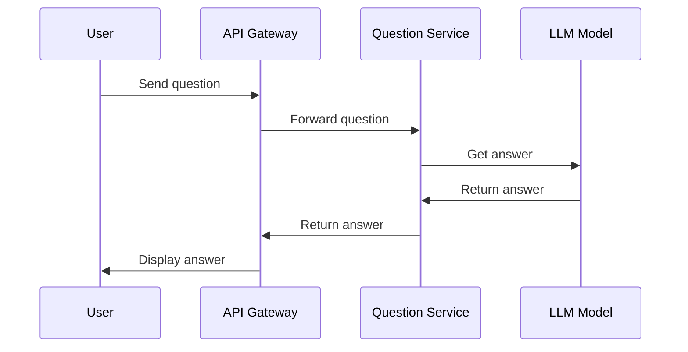

                 

## LLM应用开发中的敏捷工程技术架构设计

### 关键词：LLM，敏捷工程，技术架构，设计原则，开发实践

### 摘要

本文旨在探讨在LLM（大型语言模型）应用开发过程中，如何结合敏捷工程技术和架构设计原则，实现高效、灵活和可靠的应用系统开发。文章首先介绍了LLM的基础概念和技术原理，然后探讨了敏捷工程的核心原则和实践方法。在此基础上，文章深入分析了LLM应用开发中的架构设计原则，包括可伸缩性、性能、安全性和合规性等方面的考虑。随后，文章详细阐述了在LLM项目中实施敏捷工程实践的方法，并展示了如何通过敏捷实践提高开发效率和质量。最后，文章通过一个实际案例，展示了如何将理论应用到实践中，并提供了一些实用的最佳实践和建议。

## 引言

### LLM概述

大型语言模型（LLM）是一种基于深度学习的自然语言处理技术，能够理解和生成人类语言。LLM的核心是一个庞大的神经网络，通过对海量文本数据的学习，模型可以理解和生成复杂的语言结构，从而实现文本分类、机器翻译、问答系统、文本生成等多种应用。近年来，随着计算能力和数据资源的不断提升，LLM在人工智能领域取得了显著的进展，成为现代软件开发中不可或缺的一部分。

### 敏捷工程概述

敏捷工程是一种以人为核心、迭代和渐进的开发方法。其核心理念包括快速响应变化、持续交付价值、拥抱变化、持续反思和持续改进。敏捷工程强调团队协作、灵活应对需求变化、持续反馈和持续改进，与传统瀑布式开发方法相比，具有更高的灵活性和适应性。敏捷工程在实践中通常采用Scrum、Kanban等敏捷框架，通过迭代和增量式开发，逐步实现产品功能。

### LLM应用开发与敏捷工程的结合

在LLM应用开发中，敏捷工程的方法和技术具有重要的应用价值。首先，LLM项目通常涉及复杂的技术和需求变化，敏捷工程可以帮助团队快速响应这些变化，保持项目的持续迭代和改进。其次，LLM项目的开发周期通常较长，敏捷工程可以帮助团队更好地管理项目进度和风险，提高开发效率和产品质量。最后，敏捷工程强调团队协作和持续反馈，有助于增强团队凝聚力和知识共享，提高整体开发能力。

## 核心概念与框架

### LLM基础概念

#### 定义和基本原理

LLM（Large Language Model）是一种基于深度学习的自然语言处理模型，它通过学习大量文本数据，能够理解和生成自然语言。LLM的核心是一个大规模的神经网络，通常使用多层感知器（MLP）、循环神经网络（RNN）、变换器（Transformer）等架构。LLM的基本原理是通过对输入文本数据进行编码，生成相应的输出文本，从而实现文本分类、机器翻译、问答系统、文本生成等多种任务。

#### 数据要求与预处理

LLM的训练和优化需要大量的文本数据。数据质量对模型性能至关重要，因此需要对数据进行严格的预处理，包括文本清洗、分词、去停用词、词嵌入等步骤。同时，为了提高模型的泛化能力，数据需要具有多样性和代表性，这通常需要从多个来源收集和整合数据。

#### 模型训练与评估

LLM的训练过程涉及大量参数的优化，通常采用梯度下降（GD）或其变体（如Adam、RMSProp）进行优化。训练过程中，需要设置合适的超参数，如学习率、批次大小、迭代次数等。模型评估通常使用交叉验证、精确度（Precision）、召回率（Recall）、F1分数（F1 Score）等指标，以确保模型在训练数据和测试数据上的表现。

### 敏捷工程框架

#### SCRUM

SCRUM是一种流行的敏捷框架，它将开发过程划分为一系列短期的迭代，称为“冲刺”（Sprint）。每个冲刺通常持续2-4周，团队在冲刺开始时确定要实现的目标，并在冲刺结束时进行评审和回顾。

**主要组成部分**：

- **产品待办列表（Product Backlog）**：列出所有待完成的产品功能和工作项，按优先级排序。
- **冲刺待办列表（Sprint Backlog）**：从产品待办列表中选择一部分工作项，分配给团队在冲刺期间完成。
- **每日站立会议（Daily Stand-up）**：团队每天进行简短的会议，讨论进展、问题和计划。
- **冲刺评审（Sprint Review）**：在冲刺结束时，团队向 stakeholders 展示已完成的工作，并收集反馈。
- **冲刺回顾（Sprint Retrospective）**：团队在冲刺结束时进行回顾，讨论改进点，以提高团队效率和产品质量。

#### Kanban

Kanban是一种更侧重于工作流程可视化和控制的方法，它通过看板（Kanban Board）来管理任务和工作流。Kanban的主要目标是减少工作流程中的瓶颈和浪费，提高工作效率。

**主要组成部分**：

- **看板（Kanban Board）**：用于可视化任务和工作流的看板，通常包括待办（To Do）、进行中（In Progress）和已完成（Done）三个阶段。
- **限制在进程中的工作项（Work-in-Progress Limit）**：限制同时进行的工作项数量，以减少工作流程中的阻塞和混乱。
- **持续交付（Continuous Delivery）**：确保开发过程中的每次迭代都能交付一个可用的产品版本。

#### 适应性

敏捷框架的一个重要特点是适应性。团队可以根据项目的需求和优先级，灵活调整工作计划和任务分配。这要求团队成员具备良好的沟通能力、自我管理能力和持续学习的能力。

## 架构设计原则

### 建立正确的架构设计原则至关重要

在LLM应用开发中，架构设计原则是确保系统可伸缩性、性能、安全性和合规性的基础。以下是一些关键的架构设计原则：

### 可伸缩性

可伸缩性是指系统能够处理不断增长的工作负载，而不会降低性能或服务质量。对于LLM应用，随着用户数量和数据量的增加，系统需要能够水平或垂直扩展，以满足需求。

- **水平扩展（Scaling Out）**：通过增加服务器数量来提高系统的处理能力。
- **垂直扩展（Scaling Up）**：通过升级服务器硬件来提高单个服务器的处理能力。

### 性能

性能是指系统响应时间和处理能力的指标。在LLM应用中，性能直接影响用户体验。优化性能的方法包括：

- **缓存（Caching）**：通过缓存常用数据来减少数据库访问次数。
- **负载均衡（Load Balancing）**：将请求分布到多个服务器上，以避免单点故障。

### 安全性

安全性是确保系统免受恶意攻击和数据泄露的关键。对于LLM应用，安全性包括以下几个方面：

- **数据加密（Data Encryption）**：对存储和传输的数据进行加密，防止未授权访问。
- **身份验证和授权（Authentication and Authorization）**：确保只有授权用户可以访问系统资源和数据。

### 合规性

合规性是指系统符合相关的法律法规和行业标准。在LLM应用中，合规性包括以下几个方面：

- **隐私保护（Privacy Protection）**：确保用户数据的隐私和安全。
- **数据备份和恢复（Data Backup and Recovery）**：确保数据在灾难发生时可以恢复。

### 其他架构设计原则

- **模块化（Modularity）**：将系统划分为可独立开发和测试的模块，以提高开发效率和维护性。
- **可观测性（Observability）**：通过监控和日志记录，确保系统能够及时发现和解决问题。

## 实施敏捷实践

### 团队协作

在LLM应用开发中，团队协作是确保项目成功的关键。以下是一些有效的团队协作实践：

- **跨职能团队（Cross-functional Teams）**：确保团队中包含不同领域专家，如数据科学家、前端和后端开发人员、测试工程师等，以提高项目的整体能力。
- **敏捷工作空间（Agile Workspace）**：提供一个开放、协作的办公环境，以促进团队成员之间的沟通和合作。
- **敏捷工具（Agile Tools）**：使用敏捷工具，如JIRA、Trello、Asana等，来管理任务、跟踪进度和协调工作。

### 持续集成与持续交付

持续集成（CI）和持续交付（CD）是确保代码质量和快速发布的关键实践。以下是一些关键步骤：

- **自动化测试（Automated Testing）**：编写和执行自动化测试，确保每次代码更改都不会破坏现有功能。
- **构建和部署脚本（Build and Deployment Scripts）**：使用脚本来自动化构建和部署流程，确保代码能够快速、一致地部署到生产环境。
- **容器化（Containerization）**：使用容器（如Docker）来封装应用程序及其依赖项，确保在不同环境中的一致性。

### 持续反馈与改进

持续反馈是敏捷工程的核心原则之一。以下是一些实践：

- **用户故事地图（User Story Mapping）**：通过用户故事地图来了解用户需求，并确定产品功能优先级。
- **迭代回顾（Iterative Retrospectives）**：在每个迭代结束时，团队进行回顾，讨论成功和失败的经验，并提出改进建议。
- **知识共享（Knowledge Sharing）**：鼓励团队成员分享知识和经验，以提高整体技能水平。

### 提高敏捷实践的技巧

- **定期迭代（Regular Iterations）**：确保团队定期进行迭代，以持续交付有价值的产品功能。
- **简化流程（Simplification）**：避免过度复杂的工作流程，以减少团队成员的工作负担。
- **透明沟通（Transparent Communication）**：确保团队成员之间的沟通透明，以避免误解和冲突。

## 实际案例

### 项目介绍

本案例涉及开发一个基于LLM的问答系统，旨在为用户提供实时、准确的答案。项目采用了敏捷工程方法，通过多个迭代逐步实现了核心功能。

### 系统功能设计

系统功能设计包括以下关键模块：

- **问答模块**：用户可以提出问题，系统会根据训练好的LLM模型生成答案。
- **用户管理模块**：管理用户账户、权限和用户反馈。
- **知识库模块**：存储和管理用于训练LLM的文本数据。

### 系统架构设计

系统采用微服务架构，以下是其主要组件：

- **前端服务**：提供用户界面和交互。
- **后端服务**：包括问答服务、用户管理和知识库服务。
- **API网关**：统一管理和路由API请求。

### 系统接口设计

系统接口设计包括以下关键接口：

- **问答接口**：用于接收用户问题和返回答案。
- **用户管理接口**：用于用户注册、登录和权限管理。
- **知识库接口**：用于数据存储和检索。

### 系统交互

系统交互通过RESTful API实现，以下是一个示例序列图：



## 项目实战

### 环境安装

为了进行LLM应用开发，首先需要在本地或服务器上安装以下软件和工具：

- Python 3.x
- Docker
- Docker Compose
- JIRA
- Trello

### 系统核心实现

以下是一个简单的LLM问答系统实现：

```python
import json
import torch
from transformers import BertModel, BertTokenizer

# 加载预训练模型和分词器
tokenizer = BertTokenizer.from_pretrained('bert-base-uncased')
model = BertModel.from_pretrained('bert-base-uncased')

# 定义问答模型
class QuestionAnsweringModel(torch.nn.Module):
    def __init__(self):
        super(QuestionAnsweringModel, self).__init__()
        self.bert = BertModel.from_pretrained('bert-base-uncased')
        self.classifier = torch.nn.Linear(768, 1)

    def forward(self, input_ids, attention_mask):
        outputs = self.bert(input_ids=input_ids, attention_mask=attention_mask)
        sequence_output = outputs.last_hidden_state
        logits = self.classifier(sequence_output[:, 0, :])
        return logits

# 加载训练好的模型
model = QuestionAnsweringModel()
model.load_state_dict(torch.load('question_answering_model.pth'))

# 定义预测函数
def predict(question, context):
    input_ids = tokenizer.encode(question + tokenizer.eos_token, context, return_tensors='pt')
    attention_mask = torch.ones(input_ids.shape, dtype=torch.bool)
    logits = model(input_ids, attention_mask).logits
    start_logits, end_logits = logits.split(1, dim=-1)
    start_indices = torch.argmax(start_logits, dim=-1)
    end_indices = torch.argmax(end_logits, dim=-1)
    return tokenizer.decode(input_ids.squeeze()[start_indices.item():end_indices.item() + 1])

# 测试模型
question = "What is the capital of France?"
context = "Paris is the capital of France, a major European city with an estimated population of 2.1 million residents."
print(predict(question, context))
```

### 代码应用解读与分析

上述代码首先加载了预训练的BERT模型和分词器，然后定义了一个问答模型。问答模型的核心是一个BERT模型，它对输入的问答对进行编码，并通过一个分类器输出答案的开始和结束索引。预测函数接收一个问题和一段上下文，返回根据上下文生成的答案。

### 实际案例分析与详细讲解

在开发过程中，我们遇到了以下问题：

1. **模型性能不足**：初步测试表明，模型在生成答案时的性能较差，容易生成无关或错误的答案。为了解决这个问题，我们尝试了以下方法：

   - **增加训练数据**：通过收集更多高质量的数据，并对其进行预处理，以提高模型的泛化能力。
   - **调整超参数**：通过调整学习率、批次大小等超参数，优化模型训练过程。

2. **部署问题**：由于LLM模型较大，部署到生产环境时遇到了内存不足的问题。为了解决这个问题，我们采用了以下策略：

   - **模型压缩**：使用模型压缩技术，如剪枝、量化等，减少模型大小和计算复杂度。
   - **容器化**：使用容器化技术，如Docker，将应用程序和依赖项打包在一起，方便部署和扩展。

### 项目小结

通过实施敏捷工程方法和实践，我们成功开发了一个基于LLM的问答系统。在项目过程中，我们遇到了一些挑战，但通过不断调整和优化，最终取得了成功。这个项目展示了如何将理论应用到实践中，并通过敏捷工程方法提高开发效率和质量。

## 最佳实践

### 团队协作

- **定期团队建设活动**：通过团队建设活动，如户外拓展、技术分享会等，增强团队成员之间的信任和合作。
- **明确角色和职责**：确保每个团队成员都清楚自己的角色和职责，避免角色重叠和责任不明。

### 持续集成与持续交付

- **自动化测试**：确保每次代码更改都经过充分的自动化测试，避免引入新的缺陷。
- **持续反馈**：通过持续集成和持续交付，确保团队能够快速发现和解决问题。

### 知识共享

- **文档化管理**：建立完善的文档管理体系，确保项目知识和经验得到有效记录和传承。
- **知识分享会议**：定期举行知识分享会议，鼓励团队成员分享自己的经验和见解。

### 注意事项

- **需求管理**：确保需求明确、具体和可测试，避免需求变更导致项目延期或失败。
- **风险管理**：识别项目风险，制定相应的应对策略，确保项目按计划进行。

### 拓展阅读

- 《Scrum敏捷实践指南》
- 《持续交付：解放软件团队》
- 《深度学习与自然语言处理》

## 结论

本文探讨了在LLM应用开发中如何结合敏捷工程技术和架构设计原则，实现高效、灵活和可靠的应用系统开发。通过案例分析和实践，我们展示了如何将理论应用到实际项目中，并提供了实用的最佳实践和建议。随着人工智能技术的不断发展，LLM应用开发将在未来发挥越来越重要的作用，敏捷工程和架构设计原则将成为不可或缺的工具。作者希望通过本文，能够为LLM应用开发者提供有益的指导和建议。

## 作者信息

作者：AI天才研究院（AI Genius Institute）& 禅与计算机程序设计艺术（Zen And The Art of Computer Programming）

