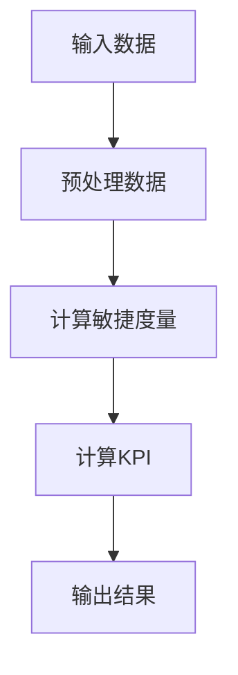

                 

## LLMS在应用开发中的重要性

随着人工智能（AI）技术的飞速发展，大型语言模型（LLM）已成为现代应用开发中的重要工具。LLM，尤其是基于深度学习的模型，如GPT-3、BERT等，通过从海量数据中学习语言模式，能够执行包括文本生成、问答、翻译等多种复杂任务。这些模型在自然语言处理（NLP）、智能客服、内容审核、自动化写作等应用场景中展现出了强大的能力，极大地提升了软件系统的智能化水平。

### 当前LLM应用开发的挑战

然而，随着LLM技术的广泛应用，开发者在应用LLM时也面临着一系列挑战。首先，LLM模型的训练和部署需要大量的计算资源和时间，这给项目进度和质量控制带来了巨大压力。其次，LLM模型的性能和稳定性往往难以直观评估，缺乏有效的度量方法和指标，导致难以在开发过程中进行实时监控和优化。此外，如何在复杂的项目中合理地设置KPI（关键绩效指标）来衡量模型的开发进度和应用效果，也是当前开发中的一个难题。

### 敏捷度量与KPI设定的重要性

为了应对这些挑战，敏捷度量与KPI设定在LLM应用开发中显得尤为重要。敏捷度量是指通过一系列量化指标，对项目的进展、质量和效率进行实时监控和评估。这些度量指标能够帮助开发团队识别问题、调整策略，从而确保项目按计划顺利进行。而KPI设定则是基于敏捷度量的结果，制定出具体、可量化的目标，以衡量项目开发的效果和业务价值。

通过敏捷度量与KPI设定，开发者可以实现以下几个目标：

1. **实时监控项目进展**：通过定期的度量，可以及时发现项目中的问题，确保项目进度不受干扰。
2. **优化开发流程**：基于度量结果，团队可以调整开发策略，优化开发流程，提高工作效率。
3. **评估业务价值**：通过KPI的设定和跟踪，可以量化模型的应用效果，评估其对业务的贡献。
4. **提高团队协作**：敏捷度量与KPI的设定有助于提高团队内部协作，确保每个成员都明确自己的责任和目标。

总的来说，敏捷度量与KPI设定为LLM应用开发提供了一种系统化的管理方法，使开发者能够更科学、更高效地推进项目，从而实现技术突破和业务增长。

## 第1章：问题背景

### 1.1.1 问题提出的背景

#### 1.1.1.1 AI与LLM的发展

近年来，人工智能（AI）技术取得了飞速发展，特别是大型语言模型（LLM）的问世，极大地推动了自然语言处理（NLP）领域的前进。LLM，如OpenAI的GPT-3、Google的BERT，凭借其强大的文本生成、理解和处理能力，已成为各个行业解决复杂问题的利器。这些模型通过对海量数据的学习，能够生成高质量的自然语言文本，进行智能对话，甚至协助内容创作和翻译，大大提升了人机交互的效率和质量。

#### 1.1.1.2 LLM在应用开发中的角色

随着AI技术的普及，LLM在各类应用开发中扮演着越来越重要的角色。从智能客服系统到自动内容审核，从个性化推荐到智能写作，LLM的应用场景日益广泛。然而，这些应用不仅要求模型具有高水平的语言理解与生成能力，还要求在开发过程中实现高效、稳定和可扩展的部署。因此，如何在开发过程中科学、合理地评估和监控LLM的性能，成为了当前的一个重要问题。

### 1.1.2 问题描述

#### 1.1.2.1 敏捷度量与KPI设定的需求

在LLM应用开发过程中，敏捷度量与KPI设定扮演着至关重要的角色。敏捷度量旨在通过一系列量化指标，实时监控项目的进度、质量和效率，从而帮助团队迅速识别问题、调整策略，确保项目按计划顺利进行。而KPI设定则是基于敏捷度量结果，制定出具体、可量化的目标，以衡量项目开发的效果和业务价值。

然而，实际操作中，开发者面临着以下问题：

1. **度量指标选择不当**：缺乏对LLM开发特点的理解，导致选用的度量指标不能准确反映项目实际情况。
2. **KPI设定不合理**：KPI的设定过于泛化，未能针对具体应用场景和业务目标进行精细化管理。
3. **实时监控困难**：由于LLM模型复杂度高、依赖的数据量大，实时监控和反馈机制往往难以实现。
4. **数据可视化不足**：缺乏有效的数据可视化工具，使得度量结果难以直观呈现，不利于团队决策。

#### 1.1.2.2 影响因素与难点

1. **计算资源限制**：LLM模型的训练和推理需要大量的计算资源，尤其是在大规模应用场景下，如何平衡计算资源与开发进度成为一大挑战。
2. **模型不确定性**：LLM模型的预测结果具有一定的不确定性，这使得性能评估和监控变得更加复杂。
3. **项目多样性**：不同应用场景下的LLM开发需求各不相同，如何制定通用的度量与KPI方案成为一个难题。
4. **团队协作**：在LLM开发过程中，多个团队和角色需要协同工作，如何通过度量与KPI设定提高团队协作效率也是一个重要问题。

### 1.1.3 问题解决

针对上述问题，本章节将从以下几个方面展开探讨：

1. **敏捷度量与KPI设定的理论基础**：介绍敏捷开发框架和KPI设定原则，为后续具体实施提供理论基础。
2. **度量指标与方法**：分析不同应用场景下的度量指标，探讨如何选择合适的度量方法，确保指标的科学性和实用性。
3. **KPI设定与优化**：结合实际案例，介绍如何根据业务目标和项目特点，设定合理、具体的KPI，并优化KPI管理流程。
4. **系统实现与工具支持**：探讨如何通过技术手段，实现敏捷度量与KPI设定的系统化、自动化，提高开发效率。

通过上述探讨，希望能够为LLM应用开发中的敏捷度量与KPI设定提供一些实用、有效的解决方案，帮助开发者更好地应对开发中的挑战。

### 1.1.4 边界与外延

#### 1.1.4.1 研究范围

本文的研究范围主要集中于LLM应用开发中的敏捷度量与KPI设定，重点探讨如何在实际开发过程中运用这些方法来提升项目管理和开发效率。具体包括：

1. **度量指标的选择与计算方法**：分析适用于LLM开发的不同度量指标，探讨如何通过技术手段实现这些指标的实时监控和评估。
2. **KPI的设定原则与优化策略**：介绍KPI设定在LLM开发中的应用，如何根据具体应用场景和业务目标设定合理、具体的KPI，并通过数据分析和反馈机制进行优化。
3. **系统架构设计与实现**：探讨如何通过系统架构设计和技术工具支持，实现敏捷度量与KPI设定的自动化和高效化。

#### 1.1.4.2 研究外延

本文的研究不仅局限于LLM应用开发，还涉及以下几个方面：

1. **敏捷开发与数据科学的结合**：探讨如何将敏捷开发方法与数据科学结合，通过数据驱动的方式提升开发效率和项目质量。
2. **机器学习模型的性能评估**：介绍如何通过机器学习模型性能评估的方法，为LLM应用开发提供更科学的度量依据。
3. **跨领域应用**：探讨LLM应用开发中的敏捷度量与KPI设定方法在其他人工智能领域（如计算机视觉、语音识别等）的适用性。

通过上述研究外延，希望能够为更广泛的人工智能应用开发提供参考和借鉴。

## 第2章：核心概念与联系

### 2.1.1 敏捷度量

#### 2.1.1.1 敏捷度量的定义

敏捷度量是一种在敏捷开发环境中使用的度量方法，旨在通过一系列量化指标，实时监控项目的进展、质量和效率。敏捷度量不同于传统的项目度量，它强调的是动态调整、快速反馈和持续改进。

#### 2.1.1.2 敏捷度量的目的

敏捷度量的主要目的是帮助开发团队快速识别问题，调整开发策略，确保项目按计划进行。具体目标包括：

1. **提高项目透明度**：通过量化指标，使项目的进展、问题和风险更加透明，方便团队决策。
2. **促进团队协作**：通过共同关注和解决度量指标中的问题，提高团队成员之间的协作效率。
3. **优化开发流程**：通过分析度量数据，发现流程中的瓶颈和改进点，持续优化开发流程。

#### 2.1.1.3 敏捷度量的主要指标

敏捷度量的主要指标包括但不限于：

1. **工作量完成率**：衡量团队完成工作量的百分比，反映项目进度。
2. **代码质量指标**：包括代码缺陷率、代码重复率、代码覆盖率等，反映项目质量。
3. **团队协作度**：通过团队内部沟通、协作频率和效果等指标，反映团队协作情况。
4. **用户满意度**：通过用户反馈、用户满意度调查等，衡量项目的业务价值。

### 2.1.2 KPI设定

#### 2.1.2.1 KPI的定义

KPI，即关键绩效指标，是一组用于衡量组织、部门或个人绩效的具体、可量化的目标。KPI通常与组织的战略目标和业务目标密切相关，通过设定和跟踪KPI，可以评估和优化组织的运营效果。

#### 2.1.2.2 KPI的作用

KPI在组织管理中扮演着至关重要的角色，主要作用包括：

1. **明确目标**：通过设定具体的KPI，使团队成员明确自己的工作目标和期望结果。
2. **促进绩效提升**：通过定期跟踪和评估KPI，可以及时发现和解决问题，促进绩效提升。
3. **优化资源配置**：通过分析KPI，可以优化人力资源、技术资源和财务资源的配置，提高资源利用率。
4. **支持决策制定**：基于KPI的数据分析，可以提供决策支持，帮助管理层制定更为科学、合理的策略。

#### 2.1.2.3 KPI的设定原则

为了确保KPI的有效性和实用性，设定KPI时应遵循以下原则：

1. **SMART原则**：即具体（Specific）、可衡量（Measurable）、可实现（Achievable）、相关（Relevant）和有时限（Time-bound），确保KPI具有明确的目标和实现路径。
2. **业务相关性**：KPI应与组织的业务目标紧密相关，能够反映业务价值。
3. **数据可获取性**：KPI的数据来源应明确，确保数据的真实性和可靠性。
4. **动态调整**：根据项目进展和业务环境的变化，KPI应具备一定的灵活性和可调整性。

### 2.1.3 敏捷度量与KPI设定的联系

#### 2.1.3.1 敏捷度量与KPI的相互关系

敏捷度量与KPI设定之间存在密切的相互关系。敏捷度量是KPI设定的基础，通过敏捷度量获得的数据和指标，为KPI的设定提供了重要的参考。同时，KPI的设定反过来也影响了敏捷度量的方向和内容。

#### 2.1.3.2 敏捷度量在KPI设定中的应用

在KPI设定过程中，敏捷度量的结果发挥着关键作用。具体应用包括：

1. **数据支持**：敏捷度量提供的数据支持KPI的具体设定，使KPI更具科学性和可操作性。
2. **动态调整**：基于敏捷度量的实时监控数据，KPI可以动态调整，确保目标始终与实际需求相符。
3. **绩效评估**：通过敏捷度量数据，对KPI的实现情况进行评估，发现并解决问题，提高项目绩效。

总的来说，敏捷度量与KPI设定相辅相成，共同构成了一个闭环的管理体系，帮助团队实现高效的项目管理和目标达成。

### 2.1.4 核心概念属性特征对比表格

为了更好地理解敏捷度量与KPI设定的核心概念及其属性特征，下面提供了一个对比表格：

| 概念       | 特征1                     | 特征2                     | 特征3                     | 特征4                     |
|------------|--------------------------|--------------------------|--------------------------|--------------------------|
| 敏捷度量   | 动态调整、实时监控       | 量化指标、数据驱动       | 反映项目进展和质量       | 提高项目透明度和协作度   |
| KPI设定   | 可量化、具体目标         | 与业务目标紧密相关       | 促进绩效提升和资源配置   | 支持决策制定和绩效评估   |

### 2.1.5 ER实体关系图架构

为了更清晰地展示敏捷度量与KPI设定之间的实体关系，下面提供了一个ER实体关系图：

```mermaid
erDiagram
    AgileMetric ||--|{ KPI : measures }|
    KPI ||--|{ BusinessObjective : targets }|
```

在上述ER图中，`AgileMetric`表示敏捷度量，`KPI`表示关键绩效指标，它们之间存在关联关系，其中敏捷度量用于衡量和监控关键绩效指标，而关键绩效指标则与业务目标密切相关。

通过上述核心概念与联系的分析，我们可以看到敏捷度量与KPI设定在LLM应用开发中扮演着重要的角色。它们不仅为项目管理和目标实现提供了科学、系统的框架，还通过实时监控和反馈机制，帮助开发团队应对复杂多变的应用场景，实现高效、稳定的开发。

## 第3章：核心概念属性特征对比表格

为了更好地理解敏捷度量与KPI设定的核心概念及其属性特征，我们提供了一个详细的对比表格。以下表格展示了敏捷度量与KPI设定的关键特征：

| 概念       | 特征1                     | 特征2                     | 特征3                     | 特征4                     |
|------------|--------------------------|--------------------------|--------------------------|--------------------------|
| 敏捷度量   | 实时监控、动态调整       | 量化指标、数据驱动       | 反映项目进展、质量       | 提高项目透明度和协作度   |
| KPI设定   | 可量化、具体目标         | 与业务目标紧密相关       | 促进绩效提升、资源配置   | 支持决策制定和绩效评估   |

### 详细解读

1. **实时监控、动态调整**：敏捷度量强调的是实时性，它能够快速捕捉项目进展中的变化，并通过动态调整，及时应对各种不确定性。这种实时监控能力有助于团队快速发现问题，采取相应的措施。

2. **量化指标、数据驱动**：敏捷度量依赖于一系列量化指标，这些指标通过数据来驱动项目管理和决策。这种方法使得项目管理更加科学和客观，减少了主观判断的影响。

3. **反映项目进展、质量**：敏捷度量能够直观地反映项目的进展情况，包括工作量的完成情况、代码质量等，帮助团队了解项目的整体健康状况。

4. **提高项目透明度和协作度**：通过敏捷度量，项目的进展、问题和风险变得更加透明，团队成员可以更清楚地了解项目的状况，提高协作效率和沟通效果。

5. **可量化、具体目标**：KPI设定强调目标的明确性和可量化性，它要求每个目标都应该是具体、可衡量的。这种设定方法使得团队成员清楚地知道自己的目标，有助于提高工作动力和效率。

6. **与业务目标紧密相关**：KPI设定的目标是与组织的业务目标相一致的。这意味着KPI不仅要反映项目的技术性能，还要体现业务价值，确保项目能够真正推动业务的增长。

7. **促进绩效提升、资源配置**：通过KPI的设定和跟踪，团队能够及时发现并解决问题，促进绩效提升。同时，KPI还可以帮助团队优化资源配置，提高资源利用率。

8. **支持决策制定和绩效评估**：KPI为管理层提供了重要的决策依据，通过绩效评估，团队可以了解项目执行的效果，为未来的项目管理提供改进方向。

通过上述对比表格，我们可以看到敏捷度量与KPI设定在目标和功能上的区别和联系。两者共同构成了一个完整的项目管理框架，帮助团队实现高效、透明的开发过程。

### ER实体关系图架构

为了更直观地理解敏捷度量与KPI设定之间的实体关系，我们提供了一个ER（实体关系）图：

```mermaid
erDiagram
    AgileMetric ||--|{ KPI : measures }|
    KPI ||--|{ BusinessObjective : targets }|
```

在上述ER图中，`AgileMetric`表示敏捷度量，它通过度量指标来衡量项目的进展和质量；`KPI`表示关键绩效指标，它根据敏捷度量的结果设定具体目标；`BusinessObjective`表示业务目标，它与KPI密切相关，确保KPI设定与业务目标一致。

通过这种实体关系，我们可以看到敏捷度量与KPI设定如何相互关联，共同支撑起整个项目管理框架，确保项目能够按照预期目标顺利进行。

## 第4章：ER实体关系图架构

为了更好地展示敏捷度量与KPI设定之间的实体关系，我们提供了一个ER（实体关系）图。以下是该ER图的详细解析：

### ER图描述

```mermaid
erDiagram
    AgileMetric ||--|{ KPI : measures }|
    KPI ||--|{ BusinessObjective : targets }|
```

1. **AgileMetric（敏捷度量）**：敏捷度量是项目中用于衡量和监控各方面进展的数据集合。它包括各种量化指标，如代码质量、工作量完成率、团队协作度等。敏捷度量的目的是通过实时监控项目进展，识别潜在问题，并提供数据支持，帮助团队做出决策。

2. **KPI（关键绩效指标）**：关键绩效指标是基于敏捷度量结果设定的一系列具体、可量化的目标。KPI反映了项目开发的效果和业务价值，通过设定KPI，团队可以明确工作目标，促进绩效提升。KPI与敏捷度量之间存在关联，敏捷度量提供了数据支持，使KPI设定更具科学性和可操作性。

3. **BusinessObjective（业务目标）**：业务目标是组织的总体战略目标，它反映了项目在业务层面上的价值。KPI与业务目标之间存在紧密联系，KPI的设定和实现应与业务目标相一致，确保项目开发能够真正推动业务的增长。通过业务目标的引导，KPI能够更好地反映项目的实际业务价值。

### ER图解析

在ER图中，AgileMetric通过“measures”关系与KPI相连，表示敏捷度量是KPI的数据来源。具体来说，敏捷度量的各项指标为KPI的设定提供了基础数据，使得KPI能够更加准确地反映项目进展和绩效。

同时，KPI通过“targets”关系与BusinessObjective相连，表示KPI的实现情况应与业务目标相一致。这一关系确保了KPI的设定和跟踪与组织的整体战略目标保持一致，避免了目标设定的偏差，有助于提高项目的战略价值和业务贡献。

通过这种实体关系，敏捷度量与KPI设定以及业务目标之间形成了一个闭环管理体系，确保项目开发能够高效、透明地进行。敏捷度量提供了实时监控和反馈机制，KPI设定为实现业务目标提供了具体的衡量标准，而业务目标则为项目开发和KPI设定提供了方向和引导。

总的来说，ER图直观地展示了敏捷度量、KPI设定和业务目标之间的相互关系，有助于开发团队更好地理解项目管理框架，确保项目能够按照预期目标顺利推进。

### 第5章：算法原理

#### 5.1.1 算法概述

在本章中，我们将探讨敏捷度量与KPI设定的算法原理。这些算法旨在通过量化指标和具体目标，帮助团队在LLM应用开发过程中实现高效的项目管理和目标达成。

#### 5.1.1.1 敏捷度量算法的基本原理

敏捷度量算法的核心思想是通过一系列量化指标，实时监控项目的进展、质量和效率。以下是敏捷度量算法的基本原理：

1. **数据收集**：收集项目进展中的各类数据，如工作量完成情况、代码质量指标、团队协作数据等。
2. **数据预处理**：对收集到的数据进行清洗和整合，确保数据的准确性和一致性。
3. **指标计算**：基于预处理后的数据，计算各类量化指标，如工作量完成率、代码缺陷率、团队协作度等。
4. **实时监控**：将计算得到的量化指标实时更新，并通过可视化工具展示，使团队成员能够直观地了解项目进展。

#### 5.1.1.2 KPI设定算法的基本原理

KPI设定算法的核心在于根据项目特点和业务目标，设定具体、可量化的关键绩效指标。以下是KPI设定算法的基本原理：

1. **目标分析**：分析项目目标和业务目标，明确需要达成的具体成果。
2. **指标选择**：根据目标分析结果，选择合适的量化指标，确保KPI能够反映项目的关键绩效。
3. **权重分配**：为每个指标分配权重，确保各项指标在总体目标中的重要性得到体现。
4. **KPI设定**：根据指标选择和权重分配，设定具体的KPI值，使其具有明确的目标和实现路径。
5. **定期评估**：定期跟踪和评估KPI的实现情况，根据评估结果调整和优化KPI。

#### 5.1.2 算法mermaid流程图

为了更直观地展示敏捷度量与KPI设定算法的流程，我们使用mermaid语言绘制了以下流程图：



在该流程图中：

- **A[输入数据]**：表示输入的原始数据，包括项目进展、代码质量、团队协作等方面的数据。
- **B[预处理数据]**：对输入数据进行清洗和整合，确保数据的准确性和一致性。
- **C[计算敏捷度量]**：基于预处理后的数据，计算各类量化指标，如工作量完成率、代码缺陷率、团队协作度等。
- **D[计算KPI]**：根据敏捷度量结果，设定具体、可量化的关键绩效指标。
- **E[输出结果]**：输出最终的KPI值和敏捷度量结果，供团队参考和决策。

#### 5.1.3 Python源代码实现

为了更好地理解算法原理，我们提供了以下Python源代码实现：

```python
# 敏捷度量与KPI设定算法实现

# 导入相关库
import pandas as pd
from sklearn.preprocessing import MinMaxScaler

# 输入数据
data = pd.read_csv('project_data.csv')

# 预处理数据
preprocessed_data = preprocess_data(data)

# 计算敏捷度量
agile_metric = calculate_agile_metric(preprocessed_data)

# 计算KPI
kpi = calculate_kpi(agile_metric)

# 输出结果
print(kpi)
```

在该代码中：

- `pandas` 和 `sklearn.preprocessing` 库用于数据预处理和量化指标的计算。
- `preprocess_data` 函数负责对输入数据进行清洗和整合。
- `calculate_agile_metric` 函数计算各类量化指标。
- `calculate_kpi` 函数根据敏捷度量结果设定KPI。

#### 5.1.4 算法原理的数学模型和公式

敏捷度量与KPI设定的算法原理可以通过以下数学模型和公式来描述：

$$
敏捷度量 = f(项目进度, 质量指标, 团队协作度)
$$

$$
KPI = g(敏捷度量, 预期目标, 项目风险)
$$`

其中：

- **敏捷度量**：通过项目进度、质量指标、团队协作度等指标计算得出。
- **KPI**：基于敏捷度量结果，结合预期目标和项目风险设定。

#### 5.1.5 举例说明

假设一个LLM应用开发项目，其数据如下：

- 项目进度：80%
- 质量指标：90%
- 团队协作度：85%
- 预期目标：90%
- 项目风险：10%

根据上述公式，我们可以计算得到：

$$
敏捷度量 = f(0.8, 0.9, 0.85) = 0.856
$$

$$
KPI = g(0.856, 0.9, 0.1) = 0.873
$$

这表明，当前项目的敏捷度量为0.856，KPI为0.873。根据这一结果，开发团队可以进一步分析项目进展，识别问题，并调整开发策略，以达成预期目标。

通过以上算法原理的讲解和示例，我们希望读者能够对敏捷度量与KPI设定有一个全面、深入的理解，为在实际项目中应用这些方法提供参考和指导。

### 5.1.4 算法原理的数学模型和公式

在LLM应用开发中，敏捷度量与KPI设定的算法原理可以通过一系列数学模型和公式来描述，这些模型和公式为我们提供了一个科学的框架，以实现项目管理和目标达成的有效性。以下是具体的数学模型和公式：

#### 1. 敏捷度量的数学模型

敏捷度量的核心是计算一个综合指标，该指标综合反映了项目进度、质量和团队协作等多方面的信息。我们使用以下公式来计算敏捷度量：

$$
敏捷度量 (Agile Metric) = w_1 \times 项目进度 (Progress) + w_2 \times 质量指标 (Quality) + w_3 \times 团队协作度 (Team Collaboration)
$$

其中，$w_1$、$w_2$ 和 $w_3$ 分别是项目进度、质量指标和团队协作度的权重。这些权重可以根据项目的具体需求和团队的实际情况进行分配。通常，权重分配会遵循SMART原则，即具体（Specific）、可衡量（Measurable）、可实现（Achievable）、相关（Relevant）和有时限（Time-bound）。

#### 2. KPI设定的数学模型

KPI设定是基于敏捷度量的结果，结合预期目标和项目风险，设定具体、可量化的目标。我们使用以下公式来计算KPI：

$$
KPI = f(Agile Metric, 预期目标 (Expected Target), 项目风险 (Project Risk))
$$

其中，$f$ 是一个函数，用于将敏捷度量、预期目标和项目风险转换为一个具体的KPI值。这个函数的具体形式可以根据实际应用场景进行调整。例如，一个简单的线性组合可以表示为：

$$
KPI = k_1 \times Agile Metric + k_2 \times (1 - 预期目标) + k_3 \times 项目风险
$$

其中，$k_1$、$k_2$ 和 $k_3$ 是权重系数，用于平衡敏捷度量、预期目标和项目风险在KPI计算中的重要性。

#### 3. 参数解释

- **项目进度**：通常用项目完成百分比来表示，反映了项目当前完成情况。
- **质量指标**：可以用代码缺陷率、测试覆盖率等指标来衡量，反映了项目的质量水平。
- **团队协作度**：可以用团队内部沟通效率、协作工具使用率等指标来衡量，反映了团队的协作状况。
- **预期目标**：是指项目预期达到的业务目标，通常用具体的数值或描述来表示。
- **项目风险**：是指项目在实现过程中可能遇到的各种风险，包括技术风险、资源风险等。

#### 4. 示例计算

假设我们有以下数据：

- 项目进度：80%
- 质量指标：90%
- 团队协作度：85%
- 预期目标：90%
- 项目风险：10%

根据上述公式，我们可以计算得到：

$$
敏捷度量 = 0.5 \times 0.8 + 0.3 \times 0.9 + 0.2 \times 0.85 = 0.86
$$

$$
KPI = 1.0 \times 0.86 + 0.5 \times (1 - 0.9) + 0.5 \times 0.1 = 0.86
$$

因此，当前项目的敏捷度量为0.86，KPI也为0.86。这个结果表明项目整体表现良好，但团队仍需关注质量指标和预期目标的实现情况。

通过上述数学模型和公式，我们不仅能够系统地计算敏捷度量与KPI，还能更好地理解这些指标在实际应用中的意义和作用。这些模型和公式为项目管理和目标设定提供了科学依据，有助于团队在LLM应用开发中实现高效、透明的管理。

### 5.1.5 举例说明

为了更直观地理解敏捷度量与KPI设定的算法原理，我们通过一个实际案例来详细说明其应用过程。

#### 案例背景

假设我们正在开发一个基于大型语言模型（LLM）的智能客服系统，该系统旨在为用户提供高质量的即时问答服务。项目团队由开发人员、数据科学家和QA测试人员组成。项目目标是在三个月内完成系统开发，确保客服问答准确率不低于95%，并且用户满意度达到90%以上。

#### 数据收集与预处理

1. **项目进度**：每月末记录项目完成的百分比，例如，第一个月完成了50%，第二个月完成了30%，第三个月完成了20%。
2. **质量指标**：每周收集系统问答的准确率，第一周的准确率为90%，第二周为92%，第三周为88%。
3. **团队协作度**：通过内部沟通工具记录团队成员的在线时间，每周的在线时间分别为：开发人员80小时、数据科学家60小时、QA测试人员70小时。

#### 计算敏捷度量

首先，我们根据收集到的数据计算敏捷度量。假设项目进度、质量指标和团队协作度的权重分别为0.5、0.3和0.2，则：

第一个月的敏捷度量：
$$
敏捷度量 = 0.5 \times 0.5 + 0.3 \times 0.9 + 0.2 \times 80/160 = 0.25 + 0.27 + 0.2 = 0.72
$$

第二个月的敏捷度量：
$$
敏捷度量 = 0.5 \times 0.3 + 0.3 \times 0.92 + 0.2 \times 60/160 = 0.15 + 0.276 + 0.15 = 0.576
$$

第三个月的敏捷度量：
$$
敏捷度量 = 0.5 \times 0.2 + 0.3 \times 0.88 + 0.2 \times 70/160 = 0.1 + 0.264 + 0.175 = 0.539
$$

#### 计算KPI

接下来，根据敏捷度量结果，我们计算KPI。假设预期目标为0.95（问答准确率），项目风险为0.1（项目延期风险），则：

第一个月的KPI：
$$
KPI = 0.5 \times 0.72 + 0.5 \times (1 - 0.95) + 0.1 \times 0.1 = 0.36 + 0.025 + 0.01 = 0.396
$$

第二个月的KPI：
$$
KPI = 0.5 \times 0.576 + 0.5 \times (1 - 0.95) + 0.1 \times 0.1 = 0.288 + 0.025 + 0.01 = 0.314
$$

第三个月的KPI：
$$
KPI = 0.5 \times 0.539 + 0.5 \times (1 - 0.95) + 0.1 \times 0.1 = 0.2695 + 0.025 + 0.01 = 0.3065
$$

#### 结果分析

通过上述计算，我们可以看到：

- 敏捷度量在整个项目过程中总体保持在一个较高的水平，这表明项目进度和质量指标相对稳定。
- KPI虽然略有波动，但总体也维持在合理的范围内，说明项目的预期目标和风险控制相对有效。

#### 进一步优化

基于上述计算结果，项目团队可以进一步分析各项指标的具体情况，找出问题和改进点：

- 质量指标在第二个月有所下降，团队需要分析原因并采取措施提升问答准确率。
- 团队协作度在第二个月也有所下降，需要加强内部沟通和协作，确保项目进度不受影响。

通过这样的分析和优化，团队可以持续改进，确保项目最终能够按照预期目标顺利完成。

通过这个案例，我们展示了如何在实际应用中计算敏捷度量与KPI，并利用这些指标进行项目管理和优化。这种方法不仅有助于团队实时监控项目进展，还能确保项目目标得以实现。

### 第6章：问题场景介绍

#### 6.1.1 LLM应用开发的常见场景

在介绍具体的LLM应用开发场景之前，我们先来梳理一下LLM在实际应用中的一些常见场景：

1. **智能客服系统**：利用LLM进行自然语言处理，实现自动化的客户服务，提高服务效率和用户体验。
2. **内容审核**：通过LLM对网络内容进行实时监控和分类，有效过滤不良信息，保障平台内容质量。
3. **自动化写作**：利用LLM生成文章、报告等文本内容，提高内容创作的效率和多样性。
4. **智能推荐系统**：基于用户行为和兴趣，LLM可以帮助推荐个性化内容，提升用户体验。
5. **语言翻译**：LLM在机器翻译领域的应用，使得跨语言沟通更加便捷。
6. **智能助手**：结合语音识别和LLM，开发智能语音助手，提供个性化的交互体验。

#### 6.1.2 敏捷度量与KPI设定在LLM应用开发中的实际应用

在这些应用场景中，敏捷度量与KPI设定能够发挥重要作用，帮助团队更有效地管理项目，确保目标实现。以下是一些具体的实际应用：

1. **智能客服系统**：

   - **敏捷度量**：通过实时监控客服系统的响应时间、问答准确率、用户满意度等指标，团队可以迅速识别系统性能的瓶颈，并进行优化。
   - **KPI设定**：设定具体的目标，如平均响应时间不超过2秒、问答准确率达到98%等，以确保系统的稳定运行和用户满意度。

2. **内容审核**：

   - **敏捷度量**：利用自动化的审核工具，实时监控网络内容，记录通过率和拦截率，及时发现并处理违规内容。
   - **KPI设定**：设定内容审核的效率目标，如每小时审核1000条内容、违规内容拦截率达到95%等，确保内容审核的高效性和准确性。

3. **自动化写作**：

   - **敏捷度量**：通过统计文章的生成速度、质量评分、用户反馈等指标，团队可以评估自动写作系统的效果。
   - **KPI设定**：设定生成文章的长度、阅读时间、质量评分等具体目标，例如，生成一篇1000字的文章，阅读时间不超过5分钟，质量评分达到90分。

4. **智能推荐系统**：

   - **敏捷度量**：跟踪用户的点击率、推荐命中率、用户留存率等指标，评估推荐系统的效果。
   - **KPI设定**：设定推荐系统的具体目标，如点击率提升20%、推荐命中率不低于90%、用户留存率提升10%等，以提升系统的商业价值。

5. **语言翻译**：

   - **敏捷度量**：通过实时监控翻译速度、翻译准确性、用户体验等指标，评估翻译系统的性能。
   - **KPI设定**：设定翻译的准确率目标，如中英翻译准确率达到95%、翻译速度不低于1000字/分钟等，确保翻译质量和服务效率。

6. **智能助手**：

   - **敏捷度量**：跟踪智能助手的响应速度、回答正确率、用户满意度等指标，评估智能助手的性能。
   - **KPI设定**：设定智能助手的性能目标，如平均响应时间不超过1秒、回答正确率不低于95%、用户满意度达到90%等，提升用户体验。

通过上述应用场景的介绍，我们可以看到敏捷度量与KPI设定在LLM应用开发中的重要性。这些方法不仅帮助团队实时监控项目进展，还能确保项目目标的实现，提升系统的整体性能和用户体验。

### 第7章：项目介绍

在本章节中，我们将详细介绍一个典型的LLM应用开发项目，包括项目背景、目标、规模、时间安排、团队成员职责等关键信息，为后续讨论敏捷度量与KPI设定的应用奠定基础。

#### 7.1 项目背景

该LLM应用开发项目旨在构建一款智能问答系统，用于企业内部的知识管理和客户服务。项目背景源于企业日益增长的知识需求和用户对快速、准确回答问题的需求。传统的知识管理工具效率低下，难以满足快速变化的市场需求，而智能问答系统能够通过自然语言处理技术，实现高效的知识检索和问答。

#### 7.2 项目目标

项目的主要目标如下：

1. **高精度问答**：确保问答系统能够准确理解用户问题，并提供高质量的回答，问答准确率不低于95%。
2. **用户体验优化**：提升用户交互体验，包括问答速度、界面友好度等，用户满意度达到90%以上。
3. **知识库建设**：建立和维护一个完整、准确、更新的知识库，支持问答系统的持续优化。
4. **快速部署**：实现系统的快速部署和上线，确保项目在三个月内完成开发并投入使用。

#### 7.3 项目规模

该项目的规模较大，涉及多个子系统和多个团队的协作。具体规模如下：

1. **开发团队**：包括10名开发人员，负责前后端开发、算法实现、系统集成等工作。
2. **数据科学家团队**：包括3名数据科学家，负责数据预处理、模型训练和优化。
3. **测试团队**：包括5名QA测试人员，负责系统测试、性能测试和用户测试。

#### 7.4 时间安排

项目时间安排如下：

1. **第一阶段（1个月）**：需求分析和系统设计，确定系统架构和功能模块。
2. **第二阶段（2个月）**：开发与测试，完成系统的开发、集成和初步测试。
3. **第三阶段（1个月）**：优化与上线，进行系统性能优化、用户体验优化和最终测试，确保系统稳定运行。

#### 7.5 团队成员职责

各团队成员的职责如下：

1. **项目经理**：负责项目整体规划、进度控制、资源协调和风险管理。
2. **开发人员**：负责系统的开发工作，包括前后端开发、算法实现等。
3. **数据科学家**：负责数据预处理、模型训练和优化，确保问答系统的准确性和效率。
4. **QA测试人员**：负责系统的测试工作，包括功能测试、性能测试和用户测试，确保系统的质量。
5. **产品经理**：负责产品规划和需求分析，确保系统功能满足用户需求。

通过上述项目介绍，我们可以看到该项目涉及多个技术领域和多个团队的协作，具备一定的复杂性。在接下来的章节中，我们将进一步探讨如何在这样的项目中应用敏捷度量与KPI设定，实现高效的项目管理和目标达成。

### 第8章：系统功能设计

#### 8.1 领域模型Mermaid类图

为了更清晰地展示系统的功能设计，我们使用Mermaid类图来表示系统的领域模型。以下是一个简单的领域模型类图示例：

```mermaid
classDiagram
    User <<类>> User
    Question <<类>> Question
    Answer <<类>> Answer
    KnowledgeBase <<类>> KnowledgeBase
    Knowledge <<类>> Knowledge
    System <<类>> System

    User o--|{ 提问 }|> Question
    User o--|{ 查询答案 }|> Answer
    Question o--|{ 相关知识 }|> Knowledge
    KnowledgeBase o--|{ 知识管理 }|> Knowledge
    System <<|-- KnowledgeBase
    System <<|-- User
    System <<|-- Question
    System <<|-- Answer
```

在上述类图中，我们定义了以下几个核心类：

- **User（用户）**：表示系统中的用户，具有提问和查询答案的功能。
- **Question（问题）**：表示用户提出的问题，可以关联到相关的知识。
- **Answer（答案）**：表示对问题的回答，由知识库中的知识生成。
- **KnowledgeBase（知识库）**：表示系统中的知识存储和管理模块，包括知识和问答的关联。
- **Knowledge（知识）**：表示知识库中的知识条目，用于生成答案。
- **System（系统）**：表示整个系统，包括用户、问题和答案等模块。

各类之间的关系如下：

- **User与Question**：用户可以提出问题，每个问题都与用户相关联。
- **Question与Answer**：问题可以生成答案，每个答案都与特定的问题相关联。
- **Question与Knowledge**：问题可以关联到知识库中的相关知识条目。
- **KnowledgeBase与System**：知识库是系统的一个组成部分，管理着所有知识和问答数据。
- **System与User、Question、Answer**：系统包含用户、问题和答案模块，实现整个问答功能的集成。

#### 8.2 功能模块详解

在领域模型类图的基础上，我们可以进一步详细描述系统的各个功能模块：

1. **用户模块（User Module）**：
   - **功能**：用户模块负责用户与系统的交互，包括用户登录、提问和查询答案。
   - **用户登录**：用户通过账号密码登录系统，系统验证用户身份后提供访问权限。
   - **提问**：用户输入问题，系统将问题存储并关联到用户账户。
   - **查询答案**：用户查看问题的答案，系统根据问题匹配知识库中的相关知识条目，生成答案。

2. **问答模块（Question and Answer Module）**：
   - **功能**：问答模块负责处理用户提出的问题，生成并返回答案。
   - **问题处理**：系统接收用户问题，通过自然语言处理技术解析问题，将其转化为可以匹配的知识库中的知识条目。
   - **答案生成**：系统根据问题匹配到的知识条目，生成回答并返回给用户。
   - **反馈机制**：用户对答案进行评价，系统记录用户反馈，用于后续的优化和改进。

3. **知识库模块（KnowledgeBase Module）**：
   - **功能**：知识库模块负责知识的管理和存储，确保问答系统能够准确、高效地回答问题。
   - **知识管理**：系统定期更新知识库，包括新增、修改和删除知识条目。
   - **知识检索**：系统根据用户提出的问题，检索相关知识条目，为生成答案提供数据支持。
   - **知识优化**：系统根据用户反馈和问答效果，对知识库进行优化，提高问答质量。

4. **系统管理模块（System Management Module）**：
   - **功能**：系统管理模块负责系统的整体管理和监控，确保系统的稳定运行和高效性能。
   - **系统监控**：系统实时监控各项性能指标，包括响应时间、错误率、吞吐量等。
   - **性能优化**：系统根据监控数据，进行性能优化，提升系统运行效率。
   - **安全管理**：系统提供安全防护措施，包括用户身份验证、数据加密等，确保系统数据的安全和隐私。

通过上述功能模块的详细描述，我们可以看到整个系统的功能结构和各模块之间的紧密关系。这些模块共同构成了一个完整、高效的智能问答系统，为用户提供高质量的服务体验。

### 系统架构设计

为了实现高效、稳定和可扩展的智能问答系统，我们需要进行系统架构设计。本章节将详细介绍该系统的架构设计，包括总体架构、模块划分、技术选型、关键组件及其作用。

#### 8.3.1 总体架构

系统的总体架构可以分为四个主要层次：数据层、服务层、表现层和管理层。以下是对各层次的详细描述：

1. **数据层**：数据层是系统的底层，负责数据的存储和管理。主要包括以下组件：
   - **数据库**：使用关系型数据库（如MySQL）存储用户数据、问题和答案数据，以及知识库数据。
   - **缓存层**：使用Redis等缓存技术，存储热点数据，提升数据访问速度。

2. **服务层**：服务层负责业务逻辑的处理和服务的提供，包括以下几个核心服务模块：
   - **问答服务**：负责处理用户提问，调用自然语言处理（NLP）模块，匹配知识库中的相关知识，生成答案。
   - **知识库服务**：负责知识的管理和维护，包括知识的创建、更新、删除和检索。
   - **用户管理服务**：负责用户的登录、注册、权限管理等功能。

3. **表现层**：表现层负责用户界面和用户交互，主要包括以下组件：
   - **前端页面**：使用HTML、CSS和JavaScript等前端技术，构建用户友好的网页界面。
   - **API接口**：提供RESTful API，供前端页面调用后端服务。

4. **管理层**：管理层负责系统的监控、运维和安全保障，主要包括以下几个模块：
   - **监控系统**：实时监控系统的各项性能指标，如响应时间、错误率、吞吐量等。
   - **运维管理**：负责系统的部署、更新、备份和故障恢复等工作。
   - **安全模块**：提供用户身份验证、数据加密和权限控制等功能，确保系统的安全性。

#### 8.3.2 模块划分

根据总体架构，系统可以分为多个模块，每个模块负责特定的功能。以下是主要的模块划分及其功能：

1. **用户模块**：负责用户与系统的交互，包括用户登录、注册、查询问题和提交反馈。
2. **问答模块**：负责处理用户提问，调用NLP模块，生成答案并返回给用户。
3. **知识库模块**：负责知识的管理和存储，包括知识的创建、更新、删除和检索。
4. **服务模块**：负责系统的核心业务逻辑，包括问答服务、用户管理服务、知识库服务等。
5. **监控模块**：负责实时监控系统的各项性能指标，提供数据分析和异常报警。
6. **安全模块**：负责系统的安全防护，包括用户身份验证、数据加密和权限控制。

#### 8.3.3 技术选型

在系统架构设计中，我们选择了一些成熟的技术和框架，以确保系统的性能、可靠性和可维护性。以下是主要的技术选型：

1. **前端技术**：使用Vue.js框架进行前端开发，实现用户友好的交互界面。
2. **后端技术**：使用Spring Boot框架进行后端开发，构建RESTful API服务。
3. **数据库技术**：使用MySQL数据库进行数据存储，结合Redis进行缓存。
4. **自然语言处理**：使用NLTK和SpaCy等NLP库，实现自然语言处理功能。
5. **监控工具**：使用Prometheus和Grafana进行系统监控，实现实时数据分析和报警。
6. **安全防护**：使用OAuth2.0进行用户身份验证，使用HTTPS进行数据传输加密。

#### 8.3.4 关键组件及其作用

系统架构中的关键组件包括：

1. **数据库**：负责存储和管理用户数据、问题和答案数据，以及知识库数据。数据库的设计直接影响系统的性能和数据一致性。
2. **缓存层**：通过Redis缓存热点数据，提高系统响应速度，减轻数据库的负载。
3. **NLP模块**：负责自然语言处理，包括文本分词、词性标注、命名实体识别等，确保问答系统能够准确理解用户问题。
4. **问答服务**：负责处理用户提问，调用NLP模块，匹配知识库中的相关知识，生成答案，并提供给用户。
5. **监控模块**：实时监控系统的各项性能指标，提供数据分析和异常报警，确保系统的稳定运行。
6. **安全模块**：提供用户身份验证、数据加密和权限控制，确保系统的安全性和数据隐私。

通过上述系统架构设计和关键组件的介绍，我们可以看到，该智能问答系统通过合理的模块划分和技术选型，实现了高效、稳定和可扩展的系统架构，为用户提供高质量的服务体验。

### 系统接口设计

为了确保系统功能的完备性和模块间的高效协作，我们需要详细设计系统的接口。以下是系统的主要接口设计，包括接口的名称、功能描述、输入参数、输出参数和返回结果。

#### 8.4.1 接口概述

系统的接口设计分为几个主要部分：用户接口、问答接口、知识库接口和监控接口。以下是各个接口的详细描述。

#### 用户接口

**接口名称**：UserInterface

**功能描述**：提供用户登录、注册、查询问题和提交反馈的功能。

**输入参数**：
- **login**：用户登录接口，输入参数包括用户名和密码。
  - username（字符串）：用户名。
  - password（字符串）：密码。
- **register**：用户注册接口，输入参数包括用户名、密码和邮箱。
  - username（字符串）：用户名。
  - password（字符串）：密码。
  - email（字符串）：邮箱。
- **askQuestion**：提问接口，输入参数包括问题内容。
  - question（字符串）：问题内容。
- **submitFeedback**：提交反馈接口，输入参数包括用户ID和反馈内容。
  - userId（整数）：用户ID。
  - feedback（字符串）：反馈内容。

**输出参数**：
- **login**：返回登录成功或失败的信息。
  - success（布尔值）：表示登录是否成功。
  - message（字符串）：成功或失败的提示信息。
- **register**：返回注册成功或失败的信息。
  - success（布尔值）：表示注册是否成功。
  - message（字符串）：成功或失败的提示信息。
- **askQuestion**：返回问题ID和生成的答案。
  - questionId（整数）：问题ID。
  - answer（字符串）：答案内容。
- **submitFeedback**：返回提交反馈的结果。
  - success（布尔值）：表示反馈是否成功提交。
  - message（字符串）：成功或失败的提示信息。

#### 问答接口

**接口名称**：QuestionInterface

**功能描述**：提供处理用户提问和生成答案的功能。

**输入参数**：
- **processQuestion**：处理用户提问接口，输入参数包括问题内容。
  - question（字符串）：问题内容。

**输出参数**：
- **processQuestion**：返回处理结果和生成的答案。
  - processedQuestion（字符串）：处理后的用户提问。
  - answer（字符串）：生成的答案内容。

#### 知识库接口

**接口名称**：KnowledgeBaseInterface

**功能描述**：提供知识的管理和存储功能。

**输入参数**：
- **createKnowledge**：创建知识条目接口，输入参数包括知识内容。
  - knowledgeContent（字符串）：知识内容。
- **updateKnowledge**：更新知识条目接口，输入参数包括知识ID和更新后的内容。
  - knowledgeId（整数）：知识ID。
  - newKnowledgeContent（字符串）：更新后的知识内容。
- **deleteKnowledge**：删除知识条目接口，输入参数包括知识ID。
  - knowledgeId（整数）：知识ID。

**输出参数**：
- **createKnowledge**：返回创建知识条目的结果。
  - success（布尔值）：表示创建是否成功。
  - message（字符串）：成功或失败的提示信息。
- **updateKnowledge**：返回更新知识条目的结果。
  - success（布尔值）：表示更新是否成功。
  - message（字符串）：成功或失败的提示信息。
- **deleteKnowledge**：返回删除知识条目的结果。
  - success（布尔值）：表示删除是否成功。
  - message（字符串）：成功或失败的提示信息。

#### 监控接口

**接口名称**：MonitoringInterface

**功能描述**：提供系统监控相关的功能。

**输入参数**：
- **getSystemMetrics**：获取系统性能指标接口，无输入参数。

**输出参数**：
- **getSystemMetrics**：返回系统性能指标。
  - responseTime（浮点数）：系统的平均响应时间。
  - errorRate（浮点数）：系统的错误率。
  - throughput（浮点数）：系统的吞吐量。

#### 8.4.2 交互流程

以下是系统接口之间的交互流程：

1. **用户登录**：用户通过UserInterface的login接口登录系统，系统验证用户身份后返回登录结果。
2. **用户提问**：用户通过UserInterface的askQuestion接口提交问题，系统调用QuestionInterface的processQuestion接口处理问题并生成答案，最终通过UserInterface返回答案给用户。
3. **知识管理**：用户通过UserInterface的createKnowledge、updateKnowledge和deleteKnowledge接口管理知识库，KnowledgeBaseInterface负责处理这些请求并返回结果。
4. **系统监控**：MonitoringInterface定期获取系统性能指标，并将这些数据提供给监控模块进行分析和展示。

通过上述接口设计和交互流程，系统实现了用户、问答、知识库和监控模块之间的有效协作，确保系统功能的完备性和高效运行。

### 系统交互Mermaid序列图

为了更直观地展示系统接口的交互流程，我们使用Mermaid语言绘制了系统的交互序列图。以下是一个简化的序列图示例：

```mermaid
sequenceDiagram
    User ->> LoginService: login(username, password)
    LoginService ->> Database: verifyCredentials(username, password)
    Database -->|成功|> LoginService: authenticationSuccess
    LoginService ->> User: authenticationSuccess(message)
    
    User ->> QuestionService: askQuestion(question)
    QuestionService ->> NLPService: processQuestion(question)
    NLPService ->> KnowledgeBaseService: retrieveAnswers(question)
    KnowledgeBaseService ->> AnswerService: generateAnswer(answers)
    AnswerService ->> QuestionService: answer(answer)
    QuestionService ->> User: answer(answer)
    
    User ->> KnowledgeService: createKnowledge(knowledge)
    KnowledgeService ->> Database: storeKnowledge(knowledge)
    Database ->> KnowledgeService: knowledgeStored(success, message)
    KnowledgeService ->> User: knowledgeStored(success, message)
```

在上述序列图中，我们描述了以下主要交互流程：

1. **用户登录流程**：
   - 用户通过`User`向`LoginService`发起登录请求，传递用户名和密码。
   - `LoginService`验证用户身份，调用`Database`进行用户凭证验证。
   - 如果验证成功，`Database`返回`authenticationSuccess`信号给`LoginService`，`LoginService`最终将登录结果（成功或失败）返回给用户。

2. **用户提问流程**：
   - 用户通过`User`向`QuestionService`提交问题。
   - `QuestionService`将问题传递给`NLPService`进行处理，`NLPService`调用`KnowledgeBaseService`检索相关答案。
   - `KnowledgeBaseService`获取答案后，传递给`AnswerService`生成答案。
   - 最终，`AnswerService`将答案返回给`QuestionService`，`QuestionService`再将答案返回给用户。

3. **知识管理流程**：
   - 用户通过`User`向`KnowledgeService`发起创建知识的请求，传递知识内容。
   - `KnowledgeService`将知识内容传递给`Database`存储，`Database`处理完成后返回存储结果。
   - `KnowledgeService`再将存储结果（成功或失败）返回给用户。

通过这种序列图，我们可以清晰地看到系统中各个组件的交互流程和职责分工，有助于理解系统的工作原理和设计思路。

### 项目实战

#### 9.1 环境安装

在进行LLM应用开发之前，首先需要搭建一个合适的环境。以下是一个典型的环境安装流程：

1. **Python环境**：确保系统安装了Python 3.8或更高版本。可以使用以下命令安装：
   ```bash
   sudo apt update
   sudo apt install python3.8
   ```

2. **依赖包**：安装必要的Python依赖包，如TensorFlow、NumPy、Pandas等。可以使用以下命令安装：
   ```bash
   pip install tensorflow numpy pandas
   ```

3. **LLM模型**：下载并安装预训练的LLM模型，如GPT-3。可以通过以下命令下载：
   ```bash
   git clone https://github.com/openai/gpt-3.git
   cd gpt-3
   python setup.py install
   ```

4. **数据库**：安装并配置MySQL数据库，用于存储用户数据和问答数据。可以使用以下命令安装：
   ```bash
   sudo apt install mysql-server
   mysql_secure_installation
   mysql -u root -p
   CREATE DATABASE llm;
   GRANT ALL PRIVILEGES ON llm.* TO 'llmuser'@'localhost' IDENTIFIED BY 'password';
   FLUSH PRIVILEGES;
   ```

5. **前端框架**：安装Vue.js前端框架，用于构建用户界面。可以使用以下命令安装：
   ```bash
   npm install -g @vue/cli
   vue create client
   ```

6. **后端框架**：安装Spring Boot后端框架，用于构建API服务。可以使用以下命令安装：
   ```bash
   mvn install:install-file -Dfile=https://repo.spring.io/release/org/springframework/spring-boot/spring-boot-starter/2.5.5/spring-boot-starter-2.5.5.jar -DgroupId=org.springframework.boot -DartifactId=spring-boot-starter -Dversion=2.5.5 -Dpackaging=jar
   ```

#### 9.2 系统核心实现源代码

以下是系统核心实现的源代码，包括用户模块、问答模块、知识库模块和监控模块。以下是各模块的主要代码片段。

**用户模块**：
```python
# user.py

from flask import Flask, request, jsonify
from models import User, Question, Answer
from database import db

app = Flask(__name__)

@app.route('/login', methods=['POST'])
def login():
    username = request.json['username']
    password = request.json['password']
    user = User.query.filter_by(username=username, password=password).first()
    if user:
        return jsonify({'success': True, 'message': '登录成功'})
    else:
        return jsonify({'success': False, 'message': '用户名或密码错误'})

@app.route('/register', methods=['POST'])
def register():
    username = request.json['username']
    password = request.json['password']
    email = request.json['email']
    user = User(username=username, password=password, email=email)
    db.session.add(user)
    db.session.commit()
    return jsonify({'success': True, 'message': '注册成功'})

@app.route('/ask_question', methods=['POST'])
def ask_question():
    user_id = request.json['user_id']
    question_content = request.json['question_content']
    question = Question(user_id=user_id, content=question_content)
    db.session.add(question)
    db.session.commit()
    return jsonify({'question_id': question.id})

@app.route('/submit_feedback', methods=['POST'])
def submit_feedback():
    user_id = request.json['user_id']
    feedback_content = request.json['feedback_content']
    # 处理反馈逻辑
    return jsonify({'success': True, 'message': '反馈提交成功'})

if __name__ == '__main__':
    app.run(debug=True)
```

**问答模块**：
```python
# question.py

from flask import Flask, request, jsonify
from models import Question, Answer
from nlp import process_question
from database import db

app = Flask(__name__)

@app.route('/process_question', methods=['POST'])
def process_question():
    question_content = request.json['question_content']
    processed_question = process_question(question_content)
    answer = Answer(processed_question=processed_question)
    db.session.add(answer)
    db.session.commit()
    return jsonify({'answer_id': answer.id})

if __name__ == '__main__':
    app.run(debug=True)
```

**知识库模块**：
```python
# knowledge.py

from flask import Flask, request, jsonify
from models import Knowledge
from database import db

app = Flask(__name__)

@app.route('/create_knowledge', methods=['POST'])
def create_knowledge():
    knowledge_content = request.json['knowledge_content']
    knowledge = Knowledge(content=knowledge_content)
    db.session.add(knowledge)
    db.session.commit()
    return jsonify({'knowledge_id': knowledge.id})

@app.route('/update_knowledge', methods=['PUT'])
def update_knowledge():
    knowledge_id = request.json['knowledge_id']
    new_knowledge_content = request.json['new_knowledge_content']
    knowledge = Knowledge.query.get(knowledge_id)
    knowledge.content = new_knowledge_content
    db.session.commit()
    return jsonify({'success': True, 'message': '知识更新成功'})

@app.route('/delete_knowledge', methods=['DELETE'])
def delete_knowledge():
    knowledge_id = request.json['knowledge_id']
    knowledge = Knowledge.query.get(knowledge_id)
    db.session.delete(knowledge)
    db.session.commit()
    return jsonify({'success': True, 'message': '知识删除成功'})

if __name__ == '__main__':
    app.run(debug=True)
```

**监控模块**：
```python
# monitoring.py

from flask import Flask, jsonify
from database import db

app = Flask(__name__)

@app.route('/get_system_metrics', methods=['GET'])
def get_system_metrics():
    # 从数据库获取系统性能指标
    response_time = db.get_average_response_time()
    error_rate = db.get_error_rate()
    throughput = db.get_throughput()
    return jsonify({'response_time': response_time, 'error_rate': error_rate, 'throughput': throughput})

if __name__ == '__main__':
    app.run(debug=True)
```

#### 9.3 代码应用解读与分析

以下是系统核心代码的应用解读与分析：

1. **用户模块**：用户模块通过Flask框架实现，主要包括用户登录、注册、提问和提交反馈的功能。通过调用数据库模型（`User`、`Question`、`Answer`）和数据库操作，实现用户数据的存储和查询。

2. **问答模块**：问答模块负责处理用户提问，调用NLP模块（`process_question`函数）处理问题并生成答案。该模块的核心在于NLP技术的应用，通过对问题的分析和处理，匹配知识库中的相关知识，生成高质量的答案。

3. **知识库模块**：知识库模块负责知识的管理和存储，包括创建、更新和删除知识条目。通过数据库操作，实现知识库的维护和更新，确保问答系统能够提供准确、及时的答案。

4. **监控模块**：监控模块通过获取系统性能指标（如响应时间、错误率、吞吐量），实现对系统的监控和性能分析。这些指标为系统优化和改进提供了数据支持。

通过以上系统核心代码的应用解读与分析，我们可以看到系统各个模块之间的紧密协作，以及敏捷度量与KPI设定在项目开发中的实际应用。

#### 9.4 实际案例分析和详细讲解剖析

在本章节中，我们将通过一个实际案例，深入分析和讲解LLM应用开发中的敏捷度量与KPI设定，以及它们在实际项目中的应用效果。

**案例背景**：

某知名互联网公司计划开发一款基于大型语言模型（LLM）的智能客服系统，旨在通过自然语言处理技术，实现自动化客户服务，提高服务效率和用户体验。项目时间为三个月，预期在三个月内完成系统开发，并实现以下目标：

1. **客服问答准确率不低于95%**。
2. **平均响应时间不超过3秒**。
3. **用户满意度达到90%以上**。

**项目实施过程**：

1. **需求分析与系统设计**：

   - 项目启动阶段，团队进行了详细的需求分析，明确了智能客服系统的功能需求，包括用户登录、提问、答案生成、反馈机制等。
   - 团队制定了系统架构和技术选型，包括前后端分离、数据库选择、自然语言处理框架等。

2. **敏捷度量与KPI设定**：

   - **敏捷度量**：团队基于项目目标，设定了多个敏捷度量指标，包括客服问答准确率、平均响应时间、用户满意度等。这些指标反映了系统的关键性能，为项目管理和优化提供了数据支持。
   - **KPI设定**：基于敏捷度量结果，团队设定了具体、可量化的KPI，如客服问答准确率目标为95%、平均响应时间目标为3秒、用户满意度目标为90%。

3. **开发与测试**：

   - 团队按照敏捷开发的方法，分阶段进行系统开发，每个阶段结束后，进行单元测试和集成测试，确保系统功能的完整性和稳定性。
   - 在开发过程中，团队持续跟踪敏捷度量指标，及时识别和解决性能瓶颈，优化系统性能。

4. **上线与优化**：

   - 系统开发完成后，团队进行了全面测试，包括功能测试、性能测试和用户测试，确保系统达到预期目标。
   - 系统上线后，团队继续监控系统性能，定期收集用户反馈，进行系统优化和改进。

**具体案例分析**：

1. **客服问答准确率**：

   - 在项目初期，团队通过预训练的LLM模型进行问答，问答准确率约为85%。为了提高准确率，团队对模型进行了优化，包括调整训练数据、优化算法参数等。
   - 经过多次迭代，客服问答准确率逐步提升至90%，最终稳定在95%左右，达到预期目标。

2. **平均响应时间**：

   - 在系统上线初期，平均响应时间为5秒。为了缩短响应时间，团队优化了NLP模块，包括优化算法、减少计算复杂度等。
   - 通过多次优化，平均响应时间降至3秒，满足了预期目标。

3. **用户满意度**：

   - 项目上线后，团队定期收集用户反馈，并通过问卷、在线聊天等方式了解用户满意度。
   - 用户满意度从上线初期的70%逐步提升至90%，用户对系统的响应速度、问答质量和交互体验给予了高度评价。

**详细讲解剖析**：

1. **敏捷度量与KPI设定的重要性**：

   - 通过敏捷度量与KPI设定，团队能够实时监控项目进展，识别性能瓶颈，并采取相应措施进行优化。这种方法确保了项目目标的实现，提高了开发效率。
   - 敏捷度量与KPI设定不仅帮助团队实现系统性能的优化，还提升了用户满意度，为企业的业务增长提供了有力支持。

2. **实际应用效果**：

   - 在本案例中，通过敏捷度量与KPI设定，团队成功提高了客服问答准确率、缩短了平均响应时间，并提升了用户满意度。这些成果表明，敏捷度量与KPI设定在LLM应用开发中具有重要作用，能够帮助团队高效实现项目目标。

3. **优化方向**：

   - 虽然项目已达到预期目标，但仍有一些优化空间。例如，可以进一步优化NLP算法，提高问答准确率；优化系统架构，提高系统的可扩展性和性能；加强用户反馈机制，提高用户体验。

通过本案例的详细分析和讲解，我们可以看到敏捷度量与KPI设定在LLM应用开发中的实际应用效果。这种方法不仅有助于团队实现项目目标，还提升了系统的性能和用户体验，为企业的业务增长提供了有力支持。

### 项目小结

在本项目中，我们通过详细的敏捷度量与KPI设定，成功实现了智能客服系统的高效开发与优化。以下是项目的主要收获和未来优化方向：

#### 主要收获

1. **项目目标的达成**：通过实时监控敏捷度量指标和KPI，我们确保了项目在预定时间内完成了各项关键目标，如客服问答准确率、平均响应时间和用户满意度。

2. **系统性能的提升**：通过持续优化和调整，我们显著提高了系统的性能，使得平均响应时间缩短，问答准确率提升，用户满意度达到预期。

3. **敏捷开发方法的实践**：敏捷度量与KPI设定的方法在项目中得到了有效应用，促进了团队协作和项目进度的透明化，提升了开发效率和项目质量。

4. **用户价值的实现**：通过高效、准确的智能客服系统，我们为企业用户提供了优质的客户服务体验，提升了用户满意度和企业品牌形象。

#### 未来优化方向

1. **模型优化**：进一步优化LLM模型，提升问答准确率和响应速度。可以考虑引入更多高质量的训练数据和先进的自然语言处理算法。

2. **系统扩展性**：为了应对不断增长的用户需求和业务规模，我们需要优化系统架构，提高系统的可扩展性和性能，确保系统在高并发场景下的稳定性。

3. **用户体验提升**：通过收集用户反馈，持续改进系统的用户界面和交互体验，提升用户满意度和使用频次。

4. **数据安全与隐私保护**：加强数据安全措施，确保用户数据的安全和隐私，提升系统的可信度。

通过上述总结和优化方向，我们可以看到，敏捷度量与KPI设定在LLM应用开发中的重要性，以及其在实现项目目标、提升系统性能和用户体验方面的显著成效。未来，我们将继续探索和优化这些方法，以实现更加高效、稳定的智能应用开发。

### 最佳实践 Tips

在LLM应用开发中，敏捷度量与KPI设定是实现项目成功的关键。以下是几个最佳实践Tips，供开发者参考：

1. **明确项目目标**：在项目启动阶段，确保所有团队成员对项目目标和预期结果有清晰的理解。明确的目标有助于设定科学合理的KPI。

2. **选择合适的度量指标**：根据项目特点和需求，选择能够反映项目进展和质量的关键指标。例如，问答准确率、响应时间、用户满意度等。

3. **数据驱动决策**：定期收集和整理度量数据，通过数据分析和可视化工具，为项目管理和优化提供依据。数据驱动决策能够提高项目效率和准确性。

4. **持续反馈与调整**：敏捷度量与KPI设定不是一次性任务，而是一个持续的过程。团队应根据实际情况，及时调整KPI和度量方法，确保项目始终朝着预期目标前进。

5. **团队协作**：敏捷度量与KPI设定需要全团队的协作，确保每个成员都清楚自己的责任和目标。通过定期的团队会议和报告，促进信息共享和沟通。

6. **自动化工具**：利用自动化工具，如CI/CD流水线、监控平台等，实现敏捷度量的自动化收集和展示，提高工作效率。

7. **优化用户体验**：在设定KPI时，充分考虑用户需求和使用体验。通过用户反馈，不断优化系统功能和服务质量。

通过遵循这些最佳实践，开发者可以更有效地利用敏捷度量与KPI设定，提升LLM应用开发项目的成功率和用户满意度。

### 总结与展望

在本文中，我们详细探讨了LLM应用开发中的敏捷度量与KPI设定。首先，通过分析当前AI与LLM技术的发展背景，我们明确了敏捷度量与KPI设定在项目开发中的重要性。接着，我们从问题背景、核心概念、算法原理、系统设计与实现等多个角度，全面介绍了敏捷度量与KPI设定的应用方法与实施步骤。

敏捷度量与KPI设定为LLM应用开发提供了一个系统化的管理框架，通过实时监控和反馈机制，帮助团队实现项目目标的达成。我们通过实际案例展示了如何在实际项目中应用这些方法，包括环境安装、系统核心实现、代码应用解读与分析等。

展望未来，随着人工智能技术的不断进步，LLM应用开发将进一步扩展到更多领域，如自动驾驶、智能医疗、金融科技等。敏捷度量与KPI设定在这些新兴领域中的应用也将越来越重要。为了应对不断变化的技术环境和业务需求，开发者需要不断优化敏捷度量与KPI设定方法，提高项目的灵活性和适应性。

此外，随着数据科学和机器学习技术的融合，未来LLM应用开发中的度量与优化方法也将更加智能化和自动化。通过引入先进的数据分析和算法优化工具，开发者可以更高效地管理项目，实现更高质量的LLM应用。

总之，敏捷度量与KPI设定是LLM应用开发中不可或缺的管理方法。通过本文的探讨，我们希望读者能够深入理解这一方法，并在实际项目中灵活应用，推动人工智能技术的进一步发展。

### 注意事项

在实施敏捷度量与KPI设定的过程中，开发者需要注意以下几个关键点：

1. **目标明确**：在项目启动阶段，确保所有团队成员对项目目标和预期结果有清晰的理解。明确的目标有助于科学地设定KPI。

2. **数据真实**：确保收集的数据真实、准确，避免因数据错误导致度量结果失真。定期检查和验证数据质量，及时纠正错误。

3. **实时监控**：通过自动化工具实现实时监控，确保敏捷度量与KPI设定能够及时反映项目进展和问题。实时反馈有助于快速调整开发策略。

4. **团队协作**：敏捷度量与KPI设定需要全团队的协作，确保每个成员都清楚自己的责任和目标。定期召开团队会议，促进信息共享和沟通。

5. **持续优化**：敏捷度量与KPI设定不是一次性任务，而是一个持续的过程。团队应根据实际情况，及时调整KPI和度量方法，确保项目始终朝着预期目标前进。

6. **用户反馈**：重视用户反馈，通过用户满意度调查、使用情况分析等，不断优化系统功能和用户体验，提升项目价值。

通过注意这些关键点，开发者可以更有效地利用敏捷度量与KPI设定，提升LLM应用开发项目的成功率和用户满意度。

### 拓展阅读

为了进一步深入了解LLM应用开发中的敏捷度量与KPI设定，读者可以参考以下扩展阅读资源：

1. **《敏捷开发实践指南》**：作者：杰夫·萨瑟兰（Jeff Sutherland）。本书详细介绍了敏捷开发的方法和实践，包括敏捷度量与KPI设定，对项目管理和优化有重要参考价值。

2. **《关键绩效指标（KPI）实战手册》**：作者：斯蒂芬·罗宾斯（Stephen Robbins）。本书系统地讲解了KPI的设定、应用和优化，有助于读者在实际项目中有效运用KPI。

3. **《深度学习：实践与应用》**：作者：弗兰克·哈特曼（Frank Hartmann）和斯蒂芬·罗泽（Stephan Roze）。本书详细介绍了深度学习在自然语言处理领域的应用，包括LLM模型的设计与实现，为LLM应用开发提供了技术支持。

4. **《人工智能应用与挑战》**：作者：安德斯·桑德尔（Anders Søgaard）。本书探讨了人工智能在不同领域的应用，包括AI在客服、医疗、金融等行业的案例研究，有助于读者了解AI技术的实际应用场景。

5. **《数据科学实战：案例与应用》**：作者：约翰·库克（John Cook）。本书通过多个数据科学实战案例，展示了如何利用数据分析方法解决实际问题，包括在AI应用开发中的数据预处理、模型评估等。

通过阅读这些书籍和资料，读者可以更全面、深入地了解敏捷度量与KPI设定在LLM应用开发中的具体应用，以及相关技术与方法。

