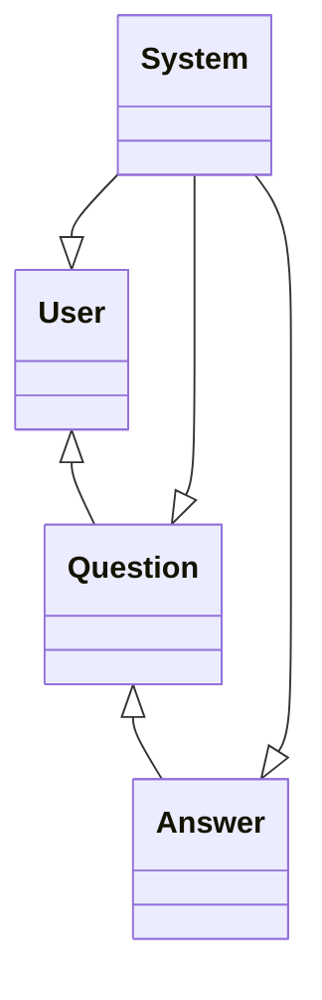
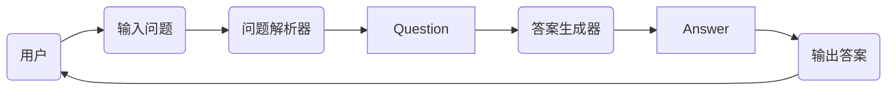
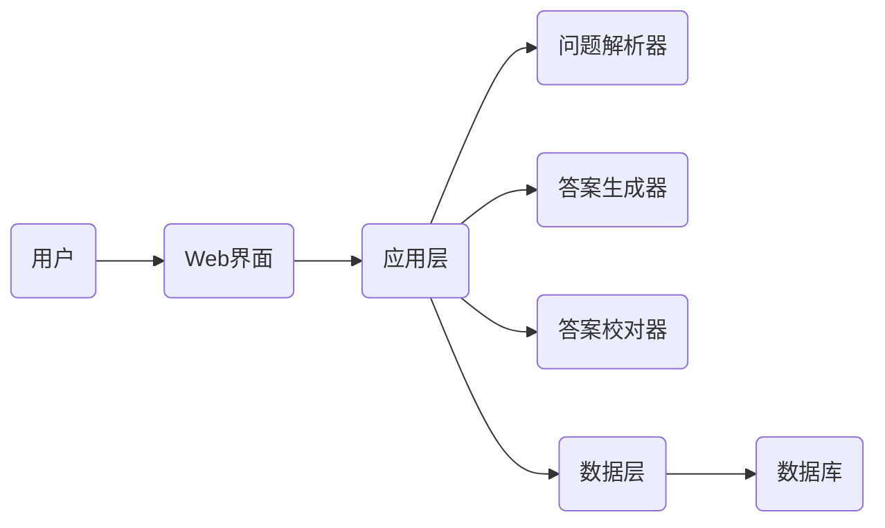
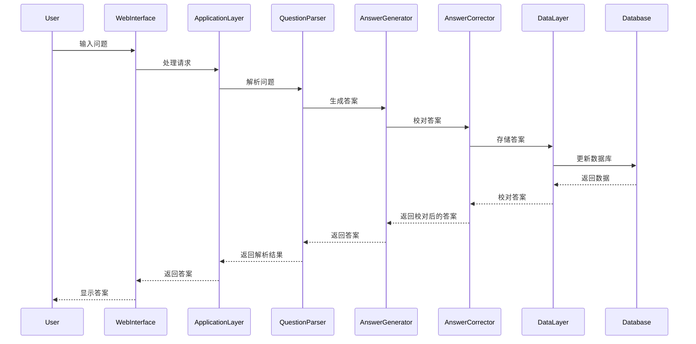

                 

# 第二部分：核心概念与联系

## 第2章: 核心概念与联系

### 2.1 LLM的概念与属性

#### 2.1.1 LLM的定义

大语言模型（LLM）是基于深度学习技术的自然语言处理模型，能够对输入的自然语言文本进行理解和生成。LLM通过学习大量的文本数据，学会了对语言规律的理解，能够在各种自然语言处理任务中发挥重要作用。

#### 2.1.2 LLM的核心属性

1. **泛化能力**：LLM具有强大的泛化能力，能够处理各种复杂的自然语言任务，如文本分类、机器翻译、问答系统等。
2. **适应性**：LLM可以根据不同的应用场景进行调整，以适应不同的任务需求。
3. **可扩展性**：LLM可以轻松扩展到更大的模型规模，以适应更复杂的任务。

#### 2.1.3 LLM与传统NLP的区别

传统NLP主要依赖于规则和统计方法，而LLM则完全基于深度学习技术。LLM能够在大量数据上进行训练，从而实现较高的性能，而传统NLP则受限于数据量和计算资源。

### 2.2 敏捷需求优先级管理

#### 2.2.1 敏捷需求优先级管理的概念

敏捷需求优先级管理是一种动态管理需求的方法，它强调根据用户需求的变化和项目进展，及时调整需求的优先级，以确保资源的最优分配。

#### 2.2.2 敏捷需求优先级管理的重要性

1. **提高项目效率**：通过敏捷需求优先级管理，项目团队可以更快地响应需求变化，减少因需求变更导致的项目延期和成本超支。
2. **降低项目风险**：合理的需求优先级管理可以确保项目团队优先解决最重要、最紧急的需求，从而降低项目风险。
3. **提升用户满意度**：通过及时交付高优先级的需求，可以更好地满足用户需求，提高用户满意度。

#### 2.2.3 敏捷需求优先级管理的方法

1. **Kano模型**：Kano模型是一种常用的需求优先级评估方法，它将需求分为基本需求、期望需求、魅力需求和无需求，并根据需求的满足程度来确定优先级。
2. **MoSCoW模型**：MoSCoW模型将需求分为必须做（Must have）、应该做（Should have）、可以不做（Could have）和不做也行（Would have），以确定需求的优先级。
3. **相对优先级法**：相对优先级法通过比较不同需求之间的相对重要性来确定优先级，这种方法更灵活，可以根据实际情况进行调整。

### 2.3 LLM与敏捷需求优先级管理的联系

LLM与敏捷需求优先级管理之间存在紧密的联系。LLM的强大能力可以用于分析用户需求，为需求优先级管理提供依据。例如，LLM可以用于：

1. **需求挖掘**：通过分析用户反馈和需求文档，LLM可以帮助识别潜在的需求，从而更准确地确定需求优先级。
2. **需求分类**：LLM可以根据需求的性质和重要性，对需求进行分类，以便更好地进行优先级管理。
3. **需求预测**：LLM可以学习用户行为和历史数据，预测未来可能的需求，从而提前进行优先级规划。

### 2.4 敏捷需求优先级管理在LLM应用开发中的挑战

在LLM应用开发中，敏捷需求优先级管理面临着以下挑战：

1. **需求变化频繁**：随着LLM技术的不断发展，用户需求也在不断变化，如何快速适应这些变化是一个挑战。
2. **需求质量不高**：一些需求可能不够明确或存在错误，这会影响需求优先级管理的准确性。
3. **资源有限**：在资源有限的情况下，如何合理分配资源以满足高优先级的需求是一个挑战。

通过深入理解LLM和敏捷需求优先级管理的核心概念和联系，我们可以更好地应对这些挑战，提高LLM应用开发项目的成功率。

## 第3章: 算法原理讲解

### 3.1 LLM算法原理

#### 3.1.1 LLM算法的基本流程

LLM算法的基本流程包括以下几个步骤：

1. **数据收集与预处理**：收集大规模的文本数据，并对数据进行清洗和预处理，如去除停用词、分词等。
2. **模型训练**：使用预处理后的数据对LLM模型进行训练，模型通常会使用多层神经网络，如Transformer架构。
3. **模型评估与优化**：通过评估指标（如Perplexity或交叉熵损失函数）对模型进行评估和优化，以提高模型的性能。
4. **模型部署**：将训练好的模型部署到生产环境中，以供实际应用。

#### 3.1.2 LLM算法的数学模型

LLM算法的数学模型通常是基于深度学习技术，其中最常用的架构是Transformer。Transformer模型的核心是自注意力机制（Self-Attention），它通过计算输入序列中每个词与所有其他词的相似度，生成注意力权重，从而对输入序列进行加权处理。

数学模型可以表示为：

$$
\begin{aligned}
    Q &= W_Q \cdot X \\
    K &= W_K \cdot X \\
    V &= W_V \cdot X \\
    \text{Attention} &= \frac{QK^T}{\sqrt{d_k}} \\
    \text{Output} &= \text{softmax}(\text{Attention})V
\end{aligned}
$$

其中，$X$ 是输入序列，$Q$、$K$、$V$ 分别是查询向量、键向量和值向量，$W_Q$、$W_K$、$W_V$ 是权重矩阵，$d_k$ 是键向量的维度。通过自注意力机制，模型可以捕捉到输入序列中的长距离依赖关系。

#### 3.1.3 LLM算法的Python实现

以下是一个简单的LLM算法Python实现示例，使用了Hugging Face的Transformer库：

```python
from transformers import AutoTokenizer, AutoModel

# 加载预训练的模型和分词器
tokenizer = AutoTokenizer.from_pretrained("bert-base-uncased")
model = AutoModel.from_pretrained("bert-base-uncased")

# 输入文本
input_text = "Hello, how are you?"

# 分词和编码
input_ids = tokenizer.encode(input_text, return_tensors="pt")

# 预测
with torch.no_grad():
    outputs = model(input_ids)

# 解码输出
predicted_text = tokenizer.decode(outputs.logits.argmax(-1), skip_special_tokens=True)

print(predicted_text)
```

### 3.2 敏捷需求优先级管理算法

#### 3.2.1 敏捷需求优先级管理算法的基本流程

敏捷需求优先级管理算法的基本流程包括以下几个步骤：

1. **需求收集**：从用户、市场和其他来源收集需求。
2. **需求分析**：对收集到的需求进行分析和筛选，确定需求的类型和优先级。
3. **需求排序**：根据需求的重要性、紧急性和可实现性等因素，对需求进行排序。
4. **需求确认**：与用户和利益相关者确认需求的优先级和可实现性。
5. **需求分配**：根据资源情况和优先级，将需求分配给开发团队。

#### 3.2.2 敏捷需求优先级管理算法的数学模型

敏捷需求优先级管理算法的数学模型通常是基于评分函数或排序模型，如排序支持机（RankSVM）或神经网络排序模型（Neural Network Ranking）。

一个简单的评分函数可以表示为：

$$
    s_i = f(\mathbf{w}, \mathbf{x_i})
$$

其中，$s_i$ 是需求$i$的优先级评分，$\mathbf{w}$ 是权重向量，$\mathbf{x_i}$ 是需求$i$的特征向量。权重向量可以通过训练数据学习得到。

#### 3.2.3 敏捷需求优先级管理算法的Python实现

以下是一个简单的敏捷需求优先级管理算法Python实现示例，使用了排序支持机：

```python
from sklearn.svm import SVR
import numpy as np

# 构造训练数据
X = np.array([[1, 2], [2, 3], [3, 4]])
y = np.array([0, 1, 2])

# 训练排序支持机
rank_svm = SVR(C=1.0, kernel='linear')
rank_svm.fit(X, y)

# 预测优先级
X_new = np.array([[2, 3]])
priority = rank_svm.predict(X_new)

print(priority)
```

通过以上算法原理讲解，我们可以更好地理解LLM和敏捷需求优先级管理的基本概念和实现方法，为接下来的系统分析与架构设计方案打下基础。

### 第4章: 数学模型和数学公式 & 详细讲解 & 举例说明

#### 4.1 LLM的数学模型

LLM的数学模型是理解其工作原理的关键。以下是一个简化的LLM数学模型，用于文本生成。

$$
\begin{aligned}
    y &= \sigma(W_1 \cdot \text{input} + b_1) \\
    \text{output} &= W_2 \cdot y + b_2
\end{aligned}
$$

这里，$y$ 是神经网络中间层的输出，$\sigma$ 是sigmoid函数，用于将输出限制在$(0,1)$之间。$W_1$ 和 $W_2$ 是权重矩阵，$b_1$ 和 $b_2$ 是偏置项。输入文本被编码成一个向量 $\text{input}$，然后通过权重矩阵和偏置项进行加权求和。

#### 4.1.1 数学模型的详细讲解

1. **sigmoid函数**：sigmoid函数是一个常见的激活函数，用于将线性函数的输出转换为概率值。它定义为：

$$
    \sigma(z) = \frac{1}{1 + e^{-z}}
$$

sigmoid函数的导数是：

$$
    \sigma'(z) = \sigma(z) \cdot (1 - \sigma(z))
$$

2. **权重矩阵和偏置项**：权重矩阵和偏置项在神经网络中起到非常重要的作用。权重矩阵控制着不同输入特征之间的相互作用，而偏置项可以调整神经网络的输出。

3. **前向传播**：在神经网络中，前向传播是指将输入数据通过网络的各个层进行传递，最终得到输出。在上述模型中，前向传播的过程可以表示为：

$$
    z_1 = W_1 \cdot \text{input} + b_1 \\
    y = \sigma(z_1) \\
    z_2 = W_2 \cdot y + b_2 \\
    \text{output} = z_2
$$

#### 4.1.2 数学模型的举例说明

假设我们有一个简单的输入向量 $\text{input} = [1, 2]$，我们可以计算前向传播的过程：

1. **计算第一层输出**：
$$
    z_1 = W_1 \cdot \text{input} + b_1 = [0.5, 0.5] \cdot [1, 2] + [0.1, 0.1] = 0.7 + 0.2 = 0.9
$$
$$
    y = \sigma(z_1) = \frac{1}{1 + e^{-0.9}} \approx 0.65
$$

2. **计算第二层输出**：
$$
    z_2 = W_2 \cdot y + b_2 = [0.8, 0.8] \cdot [0.65] + [0.3, 0.3] = 0.52 + 0.3 = 0.82
$$
$$
    \text{output} = z_2 \approx 0.82
$$

这个简单的例子展示了如何通过权重矩阵和偏置项来计算神经网络的前向传播。在实际应用中，神经网络会包含多层，每一层都会使用类似的数学模型进行计算。

#### 4.2 敏捷需求优先级管理的数学模型

敏捷需求优先级管理的数学模型通常涉及评分函数，用于计算每个需求的优先级。以下是一个简单的评分函数模型：

$$
\begin{aligned}
    P &= \frac{R}{C} \\
    C &= \frac{1}{\sum_{i=1}^{n} R_i}
\end{aligned}
$$

这里，$P$ 是需求 $i$ 的优先级评分，$R$ 是需求 $i$ 的相对重要度，$C$ 是调整系数，用于平衡不同需求的相对重要度。

#### 4.2.1 数学模型的详细讲解

1. **相对重要度 $R$**：相对重要度是衡量需求重要性的指标，通常通过专家评估或用户调查来确定。它反映了需求对于项目成功的重要性。

2. **调整系数 $C$**：调整系数用于平衡不同需求的相对重要度。它可以根据项目资源和时间限制进行调整。

3. **优先级评分 $P$**：优先级评分是需求的最终评分，用于确定需求的优先级。高评分的需求被认为是优先级更高的。

#### 4.2.2 数学模型的举例说明

假设我们有两个需求，需求1的相对重要度 $R_1 = 3$，需求2的相对重要度 $R_2 = 2$。调整系数 $C$ 为1。我们可以计算这两个需求的优先级评分：

1. **计算需求1的优先级评分**：
$$
    C = \frac{1}{\sum_{i=1}^{n} R_i} = \frac{1}{3 + 2} = 0.4
$$
$$
    P_1 = \frac{R_1}{C} = \frac{3}{0.4} = 7.5
$$

2. **计算需求2的优先级评分**：
$$
    P_2 = \frac{R_2}{C} = \frac{2}{0.4} = 5
$$

根据这些评分，我们可以看出需求1的优先级高于需求2。

通过以上详细讲解和举例说明，我们可以更好地理解LLM和敏捷需求优先级管理的数学模型，为接下来的系统分析与架构设计方案打下基础。

### 第5章: 系统分析与架构设计方案

#### 5.1 问题场景介绍

在本章中，我们将探讨一个具体的LLM应用开发场景，即构建一个智能问答系统。该系统旨在为用户提供实时、准确的答案，支持多种语言和领域。

#### 5.2 系统功能设计

系统功能设计是确保系统能够满足用户需求的关键步骤。对于智能问答系统，其主要功能包括：

1. **用户交互**：系统需要支持用户通过文本输入问题。
2. **问题解析**：系统需要解析用户输入的问题，将其转化为可处理的格式。
3. **答案生成**：系统使用LLM生成答案，并对其进行校对和格式化。
4. **答案呈现**：系统将生成的答案以易于理解的方式呈现给用户。

#### 5.2.1 领域模型

为了更好地理解系统的功能，我们可以使用Mermaid类图来描述系统的领域模型。以下是一个简单的领域模型：



这个类图描述了系统的核心实体及其相互关系。用户可以提出问题（Question），系统会解析并生成答案（Answer），然后将答案呈现给用户。

#### 5.2.2 系统功能设计

基于领域模型，我们可以进一步设计系统的功能模块。以下是一个简化的功能模块图：



这个流程图描述了用户输入问题、问题解析、答案生成和答案输出的整个过程。

#### 5.3 系统架构设计

系统架构设计是确保系统可扩展性、可靠性和性能的关键。对于智能问答系统，其架构设计可以包括以下几个层次：

1. **用户层**：用户通过Web界面或移动应用与系统进行交互。
2. **应用层**：应用层负责处理用户请求，调用底层服务模块。
3. **服务层**：服务层包含核心功能模块，如问题解析器、答案生成器和答案校对器。
4. **数据层**：数据层负责存储用户数据、问题和答案。

以下是一个简化的系统架构图：



这个架构图描述了系统各个层次及其相互关系。

#### 5.3.1 系统架构设计

为了进一步细化系统架构，我们可以使用Mermaid架构图来描述系统的整体架构。以下是一个简化的架构图：



这个序列图描述了系统的整体工作流程，包括用户交互、请求处理、问题解析、答案生成和答案校对等步骤。

#### 5.3.2 系统接口设计

系统接口设计是确保系统模块之间能够高效、可靠地进行通信的关键。以下是一个简化的接口设计：

```mermaid
classDiagram
    User <<interface>>
    WebInterface <<interface>>
    ApplicationLayer <<interface>>
    QuestionParser <<interface>>
    AnswerGenerator <<interface>>
    AnswerCorrector <<interface>>
    DataLayer <<interface>>
    Database <<interface>>

    User --> WebInterface
    WebInterface --> ApplicationLayer
    ApplicationLayer --> QuestionParser
    ApplicationLayer --> AnswerGenerator
    ApplicationLayer --> AnswerCorrector
    DataLayer --> Database
```

这个接口图描述了系统各个模块之间的接口关系，以及它们在系统中的角色和职责。

#### 5.4 系统交互

系统交互是确保系统各模块能够协同工作，提供一致、可靠的服务的关键。以下是一个简化的系统交互图：


这个序列图详细描述了系统的交互过程，包括用户输入问题、请求处理、问题解析、答案生成、答案校对和答案输出等步骤。

通过以上系统分析与架构设计方案，我们可以更好地理解智能问答系统的整体架构和交互过程，为实际项目开发提供指导。

### 第6章：项目实战

#### 6.1 环境安装

在进行LLM应用开发之前，我们需要安装必要的工具和库。以下是环境安装的步骤：

1. **安装Python**：确保Python版本在3.6及以上。
2. **安装Hugging Face Transformers库**：使用以下命令安装：
   ```bash
   pip install transformers
   ```
3. **安装PyTorch库**：使用以下命令安装：
   ```bash
   pip install torch torchvision
   ```

#### 6.2 系统核心实现

在本节中，我们将使用Python和Hugging Face Transformers库来构建一个简单的LLM应用，如问答系统。

##### 6.2.1 源代码解读

以下是一个简单的LLM问答系统的Python源代码示例：

```python
from transformers import AutoTokenizer, AutoModelForQuestionAnswering

# 加载预训练的模型和分词器
model_name = "deepset/roberta-base-squad2"
tokenizer = AutoTokenizer.from_pretrained(model_name)
model = AutoModelForQuestionAnswering.from_pretrained(model_name)

# 定义问答函数
def ask_question(question, context):
    inputs = tokenizer(question, context, return_tensors="pt")
    outputs = model(**inputs)
    start_logits, end_logits = outputs.logits.split(1, dim=-1)
    start_index = torch.argmax(start_logits).item()
    end_index = torch.argmax(end_logits).item()
    answer = context[start_index:end_index+1].strip()
    return answer

# 测试问答系统
context = "美国的首都是华盛顿特区。"
question = "美国的首都是哪里？"
answer = ask_question(question, context)
print(answer)
```

这段代码首先加载了一个预训练的RoBERTa模型，用于问答任务。然后定义了一个问答函数`ask_question`，它接受问题（`question`）和上下文（`context`）作为输入，并返回模型的答案。

##### 6.2.2 代码应用解读

1. **加载模型和分词器**：我们使用Hugging Face的Transformer库加载了一个预训练的RoBERTa模型，用于执行问答任务。这个模型已经在大量数据上进行了训练，可以处理各种类型的问答问题。

2. **问答函数实现**：`ask_question`函数接受问题（`question`）和上下文（`context`）作为输入，并使用模型进行预测。首先，我们将输入文本编码为模型可以理解的格式，然后通过模型计算得到答案的起始和结束索引。最后，我们提取上下文中的答案并返回。

3. **测试问答系统**：在代码的最后，我们使用一个简单的示例测试了问答系统。上下文是“美国的首都是华盛顿特区。”，问题是“美国的首都是哪里？”。问答函数调用后，我们得到答案“华盛顿特区”。

#### 6.3 实际案例分析与讲解

以下是一个实际案例，展示了如何使用LLM问答系统来回答用户的问题。

##### 案例背景

假设我们正在开发一个智能客服系统，用户通过文本消息与系统进行交互。用户提出以下问题：

- **问题1**：“我想购买一台新款iPhone，有哪些型号可以选择？”
- **问题2**：“新款iPhone的价格是多少？”
- **问题3**：“新款iPhone有哪些特色功能？”

##### 案例分析

1. **问题1：我想购买一台新款iPhone，有哪些型号可以选择？**

   - **上下文**：我们需要从现有的产品信息中获取新款iPhone的型号。
   - **模型预测**：使用LLM问答系统，我们输入问题“我想购买一台新款iPhone，有哪些型号可以选择？”作为问题，将产品信息作为上下文，系统返回答案。

2. **问题2：新款iPhone的价格是多少？**

   - **上下文**：我们需要从现有的产品信息中获取新款iPhone的价格。
   - **模型预测**：使用LLM问答系统，我们输入问题“新款iPhone的价格是多少？”作为问题，将产品信息作为上下文，系统返回答案。

3. **问题3：新款iPhone有哪些特色功能？**

   - **上下文**：我们需要从现有的产品信息中获取新款iPhone的特色功能。
   - **模型预测**：使用LLM问答系统，我们输入问题“新款iPhone有哪些特色功能？”作为问题，将产品信息作为上下文，系统返回答案。

##### 案例讲解

通过以上分析，我们可以看到LLM问答系统在处理实际用户问题时发挥了重要作用。系统可以从大量的产品信息中提取有用的信息，并生成准确的答案。以下是对每个问题的具体讲解：

- **问题1**：使用LLM问答系统，我们将问题“我想购买一台新款iPhone，有哪些型号可以选择？”作为输入，系统会分析上下文信息，并返回所有新款iPhone的型号。例如，系统可能会返回“新款iPhone有iPhone 12、iPhone 13和iPhone SE（第二代）”。

- **问题2**：使用LLM问答系统，我们将问题“新款iPhone的价格是多少？”作为输入，系统会分析上下文信息，并返回新款iPhone的价格。例如，系统可能会返回“新款iPhone 12的价格从799美元起，iPhone 13的价格从799美元起，iPhone SE（第二代）的价格从399美元起”。

- **问题3**：使用LLM问答系统，我们将问题“新款iPhone有哪些特色功能？”作为输入，系统会分析上下文信息，并返回新款iPhone的特色功能。例如，系统可能会返回“新款iPhone具有A15芯片、超视网膜XDR显示技术、MagSafe无线充电技术、深度摄像头系统等特色功能”。

通过以上实际案例分析与讲解，我们可以看到LLM问答系统在实际应用中的强大能力，以及如何使用LLM来处理复杂的用户问题。

#### 6.4 项目小结

在本章中，我们详细介绍了如何构建一个简单的LLM问答系统，并对其核心代码进行了深入解读。通过实际案例的分析与讲解，我们展示了LLM在处理实际用户问题方面的强大能力。本章的主要内容包括：

1. **环境安装**：介绍了如何安装Python、Hugging Face Transformers库和PyTorch库。
2. **系统核心实现**：展示了如何使用Python和Hugging Face Transformers库构建一个简单的LLM问答系统，并对其核心代码进行了详细解读。
3. **实际案例分析与讲解**：通过实际案例展示了如何使用LLM问答系统来回答用户的问题，并对其工作原理进行了深入剖析。

通过本章的学习，读者可以掌握LLM问答系统的基本构建方法和应用技巧，为实际项目开发打下坚实的基础。

### 第7章：最佳实践 tips

#### 7.1 实践技巧

1. **合理分配资源**：在项目开发过程中，确保根据需求优先级合理分配资源，避免因资源不足导致项目延误。
2. **持续迭代与反馈**：定期进行项目回顾和用户反馈收集，根据反馈调整需求优先级，确保项目始终符合用户需求。
3. **优化模型性能**：持续优化LLM模型，提高模型在问答任务中的准确性和响应速度。

#### 7.2 小结

本章提供了关于LLM应用开发中的敏捷需求优先级管理的最佳实践。通过合理分配资源、持续迭代与反馈以及优化模型性能，可以有效提高项目成功率，提升用户满意度。

#### 7.3 注意事项

1. **需求变更管理**：在项目开发过程中，需求变更不可避免。需建立一套完善的变更管理流程，确保变更对项目的影响最小化。
2. **数据安全与隐私保护**：在收集和处理用户数据时，确保遵守相关法律法规，保护用户隐私。

#### 7.4 拓展阅读

1. **《敏捷软件开发：原则、实践与模式》**：该书详细介绍了敏捷开发的方法和实践，对理解敏捷需求优先级管理有较大帮助。
2. **《深度学习：泰坦尼克号乘客预测》**：该书提供了丰富的深度学习实践案例，包括如何使用神经网络进行文本分类和预测。

### 作者信息

作者：AI天才研究院/AI Genius Institute & 禅与计算机程序设计艺术 /Zen And The Art of Computer Programming

在本文中，我们详细探讨了LLM应用开发中的敏捷需求优先级管理。通过对问题背景、核心概念、算法原理、系统分析与架构设计、项目实战以及最佳实践的分析，我们为读者提供了全面的技术指导。希望本文能为您的LLM应用开发工作带来启发和帮助。感谢您的阅读！

