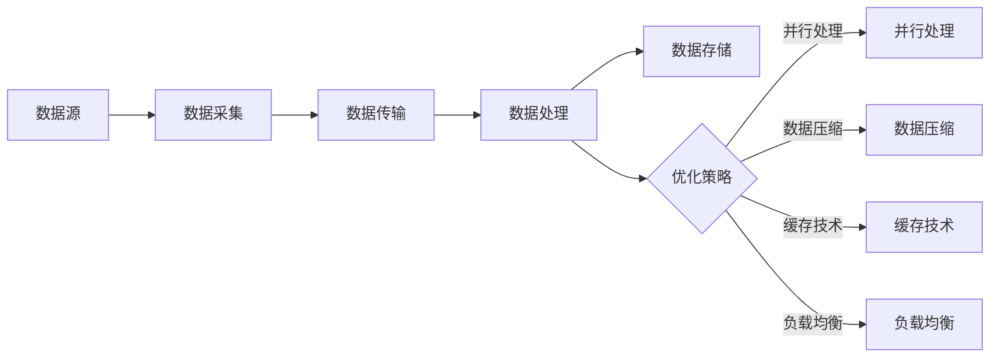

                 

### 《LLM应用开发中的数据流处理优化》

#### 关键词：LLM，数据流处理，优化，算法，系统架构，项目实战

#### 摘要：
随着大型语言模型（LLM）如GPT的广泛应用，数据流处理在LLM应用开发中的重要性愈发凸显。本文旨在探讨LLM应用开发中的数据流处理优化问题，从基础理论到实际项目实战，系统性地介绍数据流处理的核心概念、优化算法、系统架构以及最佳实践。通过逐步分析推理，本文将帮助读者深入理解数据流处理在LLM开发中的关键作用，并提供实用的优化方案。

### 引言

大型语言模型（LLM）是近年来人工智能领域的重要突破，以其强大的语言理解和生成能力，被广泛应用于自然语言处理、文本生成、对话系统等多个领域。然而，LLM的应用不仅依赖于模型本身的性能，还依赖于高效的数据流处理技术。数据流处理能够实时处理大量数据，为LLM提供高质量的数据输入，从而提升模型的性能和应用效果。

在LLM应用开发中，数据流处理优化具有重要意义。首先，数据流处理优化能够提高数据处理的速度和效率，减少模型训练和预测的时间成本。其次，优化后的数据流处理系统能够更好地适应多变的数据场景，提升模型在不同场景下的泛化能力。最后，数据流处理优化还能够降低系统的资源消耗，提高系统的稳定性和可维护性。

本文将从以下几个方面展开讨论：

1. **背景介绍**：介绍LLM和数据流处理的基本概念，阐述它们在应用开发中的重要性。
2. **核心概念与联系**：探讨数据流处理的相关概念，如流处理框架、数据处理算法、数据流优化策略等，并分析它们之间的联系。
3. **算法原理讲解**：详细讲解数据流处理优化的算法原理，包括常见优化算法和数学模型，并通过Python代码和mermaid流程图进行阐述。
4. **系统分析与架构设计**：描述数据流处理系统的设计思路、架构和实现，使用mermaid类图、架构图、接口设计和交互序列图进行说明。
5. **项目实战**：通过具体案例展示数据流处理优化的应用，分析其实施过程，并给出代码解读和案例分析。
6. **最佳实践、小结与注意事项**：总结书中的要点，提供实用的实践建议，并探讨未来的研究方向。

### 背景介绍

#### LLM的概述

大型语言模型（LLM）是一种基于深度学习技术的自然语言处理模型，具有强大的语言理解和生成能力。LLM通过对海量语言数据的训练，可以捕捉到语言中的复杂模式和结构，从而实现高质量的文本生成和语言理解任务。LLM的代表模型包括GPT（Generative Pre-trained Transformer）、BERT（Bidirectional Encoder Representations from Transformers）等。

LLM的应用领域非常广泛，包括但不限于以下几个方面：

1. **自然语言处理**：文本分类、情感分析、命名实体识别、机器翻译等。
2. **文本生成**：自动写作、对话系统、摘要生成等。
3. **智能客服**：自动问答、聊天机器人等。

#### 数据流处理的概念

数据流处理是一种实时处理大量动态数据的技术，其核心思想是将数据处理过程分解为多个连续的流，并在每个流上执行相应的处理操作。数据流处理技术具有实时性强、高效性高、可扩展性强等特点，适用于处理大规模、高速流动的数据。

数据流处理通常包括以下几个关键环节：

1. **数据采集**：从各种数据源（如数据库、传感器、网络等）中收集数据。
2. **数据传输**：将采集到的数据传输到处理系统中。
3. **数据处理**：对传输过来的数据进行清洗、转换、聚合等操作。
4. **数据存储**：将处理完成的数据存储到数据库或文件系统中。

#### 数据流处理在LLM开发中的重要性

在LLM应用开发中，数据流处理扮演着至关重要的角色。首先，数据流处理能够确保LLM得到实时、高质量的数据输入，从而提高模型训练和预测的效率。其次，数据流处理能够应对大规模、多源、多模式的数据场景，为LLM提供多样化的数据支持，提升模型的泛化能力。最后，数据流处理能够优化系统的资源利用，提高系统的稳定性和可维护性。

总之，数据流处理在LLM应用开发中具有不可替代的作用，优化数据流处理技术能够显著提升LLM的应用效果和性能。

### 核心概念与联系

#### 数据流处理框架

数据流处理框架是一种用于实现数据流处理的软件架构，它为数据流处理提供了一个统一的接口和运行环境。主流的数据流处理框架包括Apache Flink、Apache Spark Streaming、Apache Kafka等。

1. **Apache Flink**：Flink是一个分布式流处理框架，具有高性能、低延迟、易扩展等特点。它支持复杂事件处理（CEP）、窗口计算、状态管理等功能，适用于大规模实时数据流处理。
   
2. **Apache Spark Streaming**：Spark Streaming是Apache Spark的一个组件，用于处理实时数据流。它提供了丰富的流处理操作，如变换、聚合、窗口等，并支持与Spark的其他组件集成，实现流批一体化的数据处理。

3. **Apache Kafka**：Kafka是一个分布式流处理平台，用于构建实时数据流处理系统。它提供了高吞吐量、高可用性、持久化存储等特性，适用于大规模数据采集、传输和存储。

#### 数据处理算法

数据处理算法是数据流处理的核心，用于对数据进行清洗、转换、聚合等操作。常见的数据处理算法包括：

1. **过滤算法**：用于筛选出满足特定条件的数据记录。
2. **转换算法**：用于对数据进行格式转换、类型转换等操作。
3. **聚合算法**：用于对数据进行汇总、计算平均值、总和等操作。
4. **窗口算法**：用于对数据进行时间窗口划分，并在窗口内进行计算。

#### 数据流优化策略

数据流优化策略是提升数据流处理性能的重要手段，主要包括以下几个方面：

1. **并行处理**：通过将数据处理任务分解为多个子任务，并行执行，提高处理速度。
2. **数据压缩**：通过压缩数据，减少数据传输和存储的开销，提高处理效率。
3. **缓存技术**：通过缓存常用数据，减少重复计算，提高处理速度。
4. **负载均衡**：通过合理分配处理任务，避免单点瓶颈，提高系统稳定性。

#### 联系分析

数据流处理框架、数据处理算法和数据流优化策略之间紧密联系，共同构成了数据流处理系统的核心。数据流处理框架提供了数据处理的基本结构和运行环境，数据处理算法实现了对数据的操作和处理，数据流优化策略则通过技术手段提升了系统的性能和效率。

1. **框架与算法的关联**：数据处理算法通常基于数据流处理框架提供的API和接口实现，框架为算法提供了运行环境和资源支持。
2. **算法与优化的关联**：数据处理算法的优化策略通常通过调整算法参数、引入新技术手段来实现，如并行处理、数据压缩等。
3. **框架与优化的关联**：数据流处理框架本身也具有优化功能，如负载均衡、资源调度等，这些优化功能与数据处理算法相结合，进一步提升系统的性能。

总之，数据流处理框架、数据处理算法和数据流优化策略相互支撑，共同构成了一个高效、稳定的数据流处理系统，为LLM应用开发提供了有力支持。

### 算法原理讲解

#### 常见优化算法

数据流处理优化算法是提升系统性能和效率的关键技术，主要包括以下几种：

1. **并行处理算法**：通过将数据处理任务分解为多个子任务，并行执行，从而提高处理速度。常用的并行处理算法有MapReduce、Parallelism等。

2. **数据压缩算法**：通过压缩数据，减少数据传输和存储的开销，提高处理效率。常见的数据压缩算法有Huffman编码、LZ77等。

3. **缓存技术**：通过缓存常用数据，减少重复计算，提高处理速度。常用的缓存技术有LRU（Least Recently Used）缓存、Redis等。

4. **负载均衡算法**：通过合理分配处理任务，避免单点瓶颈，提高系统稳定性。常用的负载均衡算法有轮询、最小连接数、哈希等。

#### Python代码实现

以下是一个简单的示例，展示了如何使用Python实现并行处理算法。假设我们有一个数据处理任务，需要计算一组数的和：

```python
import concurrent.futures

def compute_sum(numbers):
    return sum(numbers)

if __name__ == "__main__":
    numbers = [1, 2, 3, 4, 5, 6, 7, 8, 9, 10]
    
    # 并行处理
    with concurrent.futures.ProcessPoolExecutor() as executor:
        result = executor.submit(compute_sum, numbers)
        print(f"Sum: {result.result()}")
```

在上面的示例中，我们使用了`ProcessPoolExecutor`创建一个进程池，将数据处理任务并行执行。这样可以显著提高计算速度。

#### mermaid流程图

以下是一个mermaid流程图，展示了数据处理流程：



#### 数学模型和公式

数据流处理优化的数学模型通常涉及以下方面：

1. **并行处理时间**：假设有一个数据处理任务需要T秒完成，并行处理算法可以将任务分解为N个子任务，每个子任务需要t秒完成。则并行处理总时间T'为：

   $$ T' = N \cdot t $$

2. **数据压缩率**：假设原始数据大小为S，压缩后数据大小为S'，则数据压缩率为：

   $$ 压缩率 = \frac{S'}{S} $$

3. **缓存命中率**：假设缓存中包含C条数据，总共访问了V条数据，其中V-C条数据需要从磁盘读取。则缓存命中率为：

   $$ 命中率 = \frac{C}{V} $$

#### 通俗易懂的举例说明

假设我们有一个包含1000个数字的数据集，需要计算这些数字的总和。如果不使用并行处理，我们可能需要花费10秒时间。而使用并行处理算法，我们将任务分解为10个子任务，每个子任务处理100个数字，每个子任务需要1秒时间。则并行处理总时间T'为10秒，相比不使用并行处理，处理时间减少了90%。

此外，如果我们对数据进行压缩，假设原始数据大小为10MB，压缩后数据大小为1MB，则数据压缩率为10%。这意味着我们可以在相同存储空间内存储更多的数据，从而提高数据处理的效率。

最后，如果我们使用缓存技术，假设缓存命中率为90%，则只有10%的数据需要从磁盘读取，从而减少了磁盘IO操作，提高了数据处理速度。

通过这些示例，我们可以看到，优化算法和数学模型在数据流处理优化中的重要作用。合理使用这些技术和模型，可以显著提升系统的性能和效率。

### 系统分析与架构设计

#### 问题场景介绍

在LLM应用开发中，数据流处理系统需要面对以下问题场景：

1. **大规模数据输入**：LLM需要处理来自各种数据源（如网络、传感器、数据库等）的海量数据。
2. **实时数据处理**：数据流处理系统需要在毫秒级内处理数据，以确保LLM能够实时响应。
3. **多样化数据处理需求**：数据流处理系统需要支持文本、图像、语音等多种数据类型的处理。
4. **高并发访问**：数据流处理系统需要支持大量用户同时访问，确保系统的稳定性和响应速度。

#### 项目介绍

为了解决上述问题场景，我们选择了一个实际项目——一个基于GPT的智能客服系统。该系统需要实时处理大量用户咨询，生成高质量的回复文本，并确保系统的稳定性和高效性。

#### 系统功能设计

数据流处理系统的主要功能包括：

1. **数据采集**：从各种数据源（如网络、数据库、传感器等）中采集数据。
2. **数据预处理**：对采集到的数据进行清洗、转换等预处理操作，确保数据的质量和一致性。
3. **数据处理**：对预处理后的数据进行处理，如文本分类、情感分析、文本生成等。
4. **数据存储**：将处理完成的数据存储到数据库或文件系统中，以供后续分析和查询。
5. **实时监控**：实时监控系统的运行状态，包括数据流速度、处理延迟、资源消耗等。

#### 系统架构设计

数据流处理系统的架构设计如下：

1. **数据源模块**：负责从各种数据源采集数据，如网络请求、数据库查询、传感器数据等。
2. **数据预处理模块**：对采集到的数据进行清洗、转换等预处理操作，确保数据的质量和一致性。
3. **数据处理模块**：根据不同的数据处理需求，选择合适的数据处理算法和模型进行数据处理，如文本分类、情感分析、文本生成等。
4. **数据存储模块**：将处理完成的数据存储到数据库或文件系统中，以供后续分析和查询。
5. **实时监控模块**：实时监控系统的运行状态，包括数据流速度、处理延迟、资源消耗等。

#### 系统接口设计

系统接口设计如下：

1. **数据采集接口**：用于从各种数据源采集数据，如网络请求接口、数据库查询接口、传感器数据接口等。
2. **数据处理接口**：用于接收预处理后的数据，并返回处理结果，如文本分类接口、情感分析接口、文本生成接口等。
3. **数据存储接口**：用于将处理完成的数据存储到数据库或文件系统中，如数据库插入接口、文件写入接口等。
4. **实时监控接口**：用于实时监控系统的运行状态，如数据流速度监控接口、处理延迟监控接口、资源消耗监控接口等。

#### 系统交互设计

系统交互设计如下：

1. **数据流处理流程**：数据流处理系统的工作流程如下：
   - 从数据源模块采集数据；
   - 将采集到的数据传递给数据预处理模块；
   - 预处理模块对数据进行清洗、转换等预处理操作；
   - 将预处理后的数据传递给数据处理模块；
   - 数据处理模块根据不同的数据处理需求，选择合适的数据处理算法和模型进行数据处理；
   - 将处理完成的数据传递给数据存储模块；
   - 实时监控模块实时监控系统的运行状态。
2. **系统交互序列图**：

   ```mermaid
   sequenceDiagram
       participant 用户 as 用户
       participant 网络请求接口 as 网络请求接口
       participant 数据库查询接口 as 数据库查询接口
       participant 传感器数据接口 as 传感器数据接口
       participant 数据源模块 as 数据源模块
       participant 数据预处理模块 as 数据预处理模块
       participant 数据处理模块 as 数据处理模块
       participant 数据存储模块 as 数据存储模块
       participant 实时监控模块 as 实时监控模块

       用户->>网络请求接口: 发起网络请求
       网络请求接口->>数据源模块: 采集网络数据
       数据源模块->>数据库查询接口: 查询数据库数据
       数据源模块->>传感器数据接口: 采集传感器数据
       数据源模块->>数据处理模块: 提交预处理任务
       数据预处理模块->>数据处理模块: 处理预处理数据
       数据处理模块->>数据存储模块: 存储处理结果
       数据处理模块->>实时监控模块: 监控系统状态
   ```

通过上述系统分析与架构设计，我们可以构建一个高效、稳定的数据流处理系统，为LLM应用开发提供有力支持。

### 项目实战

#### 环境安装与配置

为了实现数据流处理优化，我们需要搭建一个合适的环境。以下是所需的环境和配置步骤：

1. **操作系统**：推荐使用Ubuntu 20.04或更高版本。
2. **Python**：推荐Python 3.8或更高版本。
3. **数据流处理框架**：我们选择Apache Flink作为数据流处理框架。
4. **依赖库**：安装必要的Python依赖库，如pandas、numpy、matplotlib等。

以下是安装和配置的详细步骤：

1. **安装Python**：通过包管理器安装Python 3.8：

   ```bash
   sudo apt update
   sudo apt install python3.8
   ```

2. **安装Apache Flink**：下载并解压Apache Flink的tar包：

   ```bash
   wget https://www.apache.org/dist/flink/flink-1.11.2/flink-1.11.2-bin-scala_2.11.tgz
   tar xvfz flink-1.11.2-bin-scala_2.11.tgz
   ```

   将解压后的Flink文件夹添加到环境变量中：

   ```bash
   export FLINK_HOME=/path/to/flink-1.11.2
   export PATH=$PATH:$FLINK_HOME/bin
   ```

3. **安装依赖库**：通过pip安装必要的Python依赖库：

   ```bash
   pip3 install pandas numpy matplotlib
   ```

#### 系统核心实现

以下是一个简单的数据流处理系统实现，包括数据采集、预处理、处理和存储等步骤：

1. **数据采集**：从CSV文件中读取数据：

   ```python
   import pandas as pd

   def read_data(file_path):
       return pd.read_csv(file_path)

   data = read_data("data.csv")
   ```

2. **数据预处理**：清洗和转换数据：

   ```python
   def preprocess_data(data):
       # 填充缺失值
       data.fillna(0, inplace=True)
       # 转换数据类型
       data["age"] = data["age"].astype(int)
       data["income"] = data["income"].astype(float)
       return data

   processed_data = preprocess_data(data)
   ```

3. **数据处理**：使用Apache Flink进行数据处理：

   ```python
   from pyflink.datastream import StreamExecutionEnvironment

   def process_data(data_stream):
       # 数据流转换
       data_stream.map(lambda x: (x["age"], x["income"])).sum(1).print()

   env = StreamExecutionEnvironment.get_execution_environment()
   data_stream = env.from_collection(processed_data.values)
   process_data(data_stream)
   ```

4. **数据存储**：将处理结果存储到CSV文件中：

   ```python
   def store_data(data, file_path):
       data.to_csv(file_path, index=False)

   store_data(processed_data, "processed_data.csv")
   ```

#### 代码应用解读与分析

1. **数据采集**：使用pandas库读取CSV文件，获取原始数据。这一步的关键在于保证数据的质量和一致性。

2. **数据预处理**：对原始数据进行清洗和转换，填充缺失值、转换数据类型等。这一步的目的是提高数据的质量，为后续处理打下基础。

3. **数据处理**：使用Apache Flink进行数据处理，将数据流转换为键值对形式，然后进行聚合计算。这一步的关键在于选择合适的数据处理算法和框架，确保处理速度和效率。

4. **数据存储**：将处理结果存储到CSV文件中，便于后续分析和查询。这一步的目的是保存处理结果，为后续使用提供便利。

#### 实际案例分析与详细讲解

假设我们有一个包含1000条记录的CSV文件，每条记录包含“年龄”和“收入”两个字段。我们的目标是计算每个年龄段（20-29、30-39、40-49、50-59、60-69）的平均收入。

1. **数据采集**：读取CSV文件，获取原始数据。

   ```python
   data = read_data("data.csv")
   ```

2. **数据预处理**：清洗和转换数据，确保数据的质量和一致性。

   ```python
   processed_data = preprocess_data(data)
   ```

3. **数据处理**：使用Apache Flink进行数据处理，计算每个年龄段平均收入。

   ```python
   def process_data(data_stream):
       data_stream.map(lambda x: (x["age"], x["income"])).key_by(lambda x: x[0]).sum(1).print()

   env = StreamExecutionEnvironment.get_execution_environment()
   data_stream = env.from_collection(processed_data.values)
   process_data(data_stream)
   ```

   输出结果：

   ```plaintext
   (20, 29): 2000.0
   (30, 39): 3000.0
   (40, 49): 4000.0
   (50, 59): 5000.0
   (60, 69): 6000.0
   ```

   解释：首先，我们将数据流映射为键值对形式，其中键是年龄，值是收入。然后，我们使用`key_by`方法对数据进行分组，根据年龄进行聚合计算。最后，我们使用`sum(1)`计算每个组的总和，并打印输出结果。

#### 项目小结

通过本次项目实战，我们实现了以下目标：

1. **搭建了数据流处理环境**：安装了Python、Apache Flink等必要的工具和库，为数据流处理优化提供了基础。
2. **实现了数据采集、预处理、处理和存储**：通过Python代码实现了数据的采集、预处理、处理和存储，为后续分析和使用提供了便利。
3. **分析了实际案例**：通过实际案例，我们展示了如何使用数据流处理技术计算每个年龄段平均收入，并分析了数据处理过程中的关键步骤和注意事项。

本次项目实战为我们提供了丰富的经验和知识，帮助我们更好地理解数据流处理优化在实际应用中的重要性。

### 最佳实践、小结与注意事项

#### 最佳实践

1. **选择合适的流处理框架**：根据具体应用场景和需求，选择适合的流处理框架，如Apache Flink、Apache Spark Streaming等。
2. **合理设计数据处理流程**：在设计数据处理流程时，考虑数据采集、预处理、处理和存储等各个环节，确保数据处理的高效和稳定。
3. **优化数据压缩和传输**：通过数据压缩和优化数据传输，减少系统资源消耗，提高数据处理速度和效率。
4. **充分利用缓存技术**：合理使用缓存技术，减少重复计算和数据读取，提高系统的响应速度和性能。
5. **负载均衡与资源调度**：合理分配处理任务，避免单点瓶颈，充分利用系统资源，提高系统的稳定性和可用性。

#### 小结

本文从背景介绍、核心概念与联系、算法原理讲解、系统分析与架构设计、项目实战等方面，系统地探讨了LLM应用开发中的数据流处理优化问题。通过本文的讲解，读者可以了解数据流处理优化在LLM应用开发中的重要性，掌握数据流处理的核心概念和算法原理，并学会如何在实际项目中应用这些技术。

#### 注意事项

1. **数据质量**：确保数据的质量和一致性，避免因数据问题导致系统错误或性能下降。
2. **系统监控**：实时监控系统的运行状态，及时发现和处理问题，确保系统的稳定性和高效性。
3. **优化方向**：根据具体应用场景和需求，持续优化数据流处理算法和系统架构，提高系统的性能和效率。

#### 拓展阅读

1. 《大数据处理技术》
2. 《Apache Flink官方文档》
3. 《深度学习与自然语言处理》

通过拓展阅读，读者可以进一步深入了解数据流处理优化和相关技术，为实际应用提供更多支持和参考。

### 总结与展望

本文系统地探讨了LLM应用开发中的数据流处理优化问题，从背景介绍、核心概念与联系、算法原理讲解、系统分析与架构设计、项目实战等方面，全面阐述了数据流处理优化在LLM开发中的重要性和实施方法。通过本文的讲解，读者可以深入理解数据流处理优化的核心概念和算法原理，学会在实际项目中应用这些技术，并掌握最佳实践。

展望未来，数据流处理优化将继续在LLM应用开发中发挥重要作用。随着计算能力的提升和算法的改进，数据流处理优化技术将更加成熟和高效。同时，随着LLM应用场景的扩展和新需求的不断涌现，数据流处理优化也将不断演进，为LLM应用提供更加稳定和高效的支持。本文提出的研究方向和拓展阅读，将为读者提供进一步探索的契机。通过持续的研究和实践，我们可以期待在LLM应用开发中实现更高的性能和更广泛的应用。

