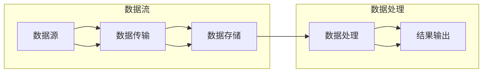
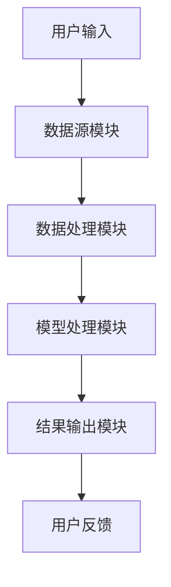
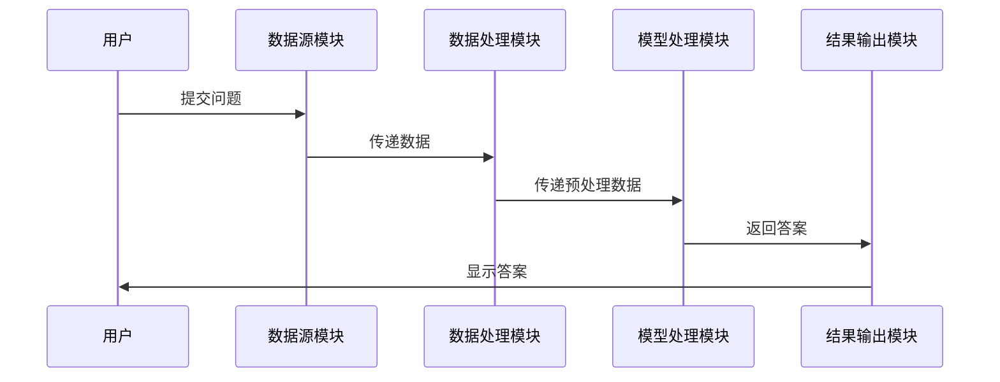

                 

### LLMA应用开发中的数据流管理

> 关键词：数据流管理、LLM应用、数据处理、性能优化、安全性

摘要：本文深入探讨了LLM（大型语言模型）应用开发中的数据流管理，解释了为何数据流管理在提升模型性能、效率和安全性方面至关重要。文章首先介绍了数据流管理的背景和核心问题，然后详细解析了数据流管理的核心概念、算法原理及数学模型。接下来，文章展示了系统分析和架构设计，并通过一个实际项目案例进行了实战剖析。最后，文章总结了最佳实践、注意事项及拓展阅读，以帮助读者更好地理解和应用数据流管理。

### Step 1: 设计背景介绍章节

#### 问题背景

随着人工智能技术的发展，大型语言模型（LLM）在自然语言处理（NLP）领域得到了广泛应用。然而，LLM应用开发中数据流管理的问题日益突出。数据流管理涉及到如何高效、安全地传输、处理和存储大规模的数据，这对模型的性能、效率和安全性产生了深远影响。

- **模型性能**：数据流管理的效率直接影响到模型的响应速度和准确性。如果数据流管理不当，可能导致模型在处理大量数据时出现延迟或错误。
- **效率**：高效的数据流管理可以减少数据处理的时间，提高系统的整体效率。
- **安全性**：数据流管理还需要确保数据在传输和处理过程中的安全性，防止数据泄露或被恶意攻击。

#### 问题描述

在LLM应用开发中，数据流管理面临以下挑战和问题：

- **数据传输**：如何高效地传输大量数据，同时保证数据的一致性和可靠性？
- **数据存储**：如何选择合适的数据存储方案，以满足海量数据的存储需求？
- **数据处理**：如何对大规模数据进行高效处理，以支持模型的高性能运算？
- **数据安全性**：如何确保数据在传输和处理过程中的安全性，防止数据泄露或被恶意攻击？

#### 问题解决

目前，常见的解决方案和技术包括：

- **分布式数据流处理框架**：如Apache Kafka、Apache Flink等，可以高效地处理大规模数据流。
- **分布式存储系统**：如Hadoop、Spark等，可以存储和处理海量数据。
- **加密和安全性协议**：如SSL/TLS等，可以确保数据在传输过程中的安全性。

#### 边界与外延

数据流管理涉及的范围和限制包括：

- **系统架构**：数据流管理需要考虑整个系统架构，包括数据源、数据处理模块、数据存储模块等。
- **数据类型**：数据流管理需要适用于不同类型的数据，如文本、图像、音频等。
- **数据量**：数据流管理需要处理海量数据，并保证数据处理的实时性和高效性。

#### 概念结构与核心要素组成

数据流管理包括以下核心概念和要素：

- **数据源**：数据流管理的起点，可以是文件、数据库、网络接口等。
- **数据传输**：数据流管理的中间环节，涉及到数据传输的协议、路由、传输速度等。
- **数据存储**：数据流管理的终点，涉及到数据存储的类型、容量、访问速度等。
- **数据处理**：数据流管理的关键环节，涉及到数据的清洗、转换、分析等。
- **数据安全性**：数据流管理的安全保障，涉及到加密、认证、审计等。

### Step 2: 设计核心概念与联系章节

#### 核心概念原理

数据流管理中的核心概念包括：

- **数据流模型**：描述数据在系统中的流动过程和交互方式。
- **数据管道**：实现数据流传输和处理的一系列组件和流程。
- **流处理**：对实时数据流进行高效处理的技术和方法。

#### 概念属性特征对比表格

| 概念 | 描述 | 特征对比 |
| ---- | ---- | ---- |
| 数据流模型 | 描述数据在系统中的流动过程和交互方式。 | - 流向：数据从源头到目的地的路径。 <br> - 速率：数据传输的速度。 <br> - 交互：数据在传输过程中的交互方式。 |
| 数据管道 | 实现数据流传输和处理的一系列组件和流程。 | - 成分：包括数据源、处理器、存储等。 <br> - 功能：传输、处理、存储数据。 <br> - 连接：组件之间的连接方式。 |
| 流处理 | 对实时数据流进行高效处理的技术和方法。 | - 实时性：处理数据的实时速度。 <br> - 高效性：处理数据的效率。 <br> - 可扩展性：支持大规模数据处理。 |

#### ER实体关系图架构的Mermaid流程图

```mermaid
erDiagram
  数据源 ||--|{ 数据流模型 }|| 数据管道
  数据管道 ||--|{ 流处理 }|| 数据存储
```

### Step 3: 设计算法原理讲解章节

#### 算法mermaid流程图



#### Python源代码实现

```python
# 数据流管理算法示例

# 导入所需库
import requests
import json
import pandas as pd

# 数据源：从API获取数据
url = "https://example.com/api/data"
response = requests.get(url)
data = response.json()

# 数据传输：将数据转换为Pandas DataFrame
df = pd.DataFrame(data)

# 数据处理：清洗和处理数据
# ...

# 数据存储：将处理后的数据存储到文件中
df.to_csv("processed_data.csv", index=False)

# 结果输出：显示处理结果
print(df.head())
```

#### 算法原理的数学模型和公式

- **数据传输速率**：公式为 \( R = \frac{L}{T} \)，其中 \( R \) 表示传输速率，\( L \) 表示传输数据量，\( T \) 表示传输时间。
- **数据处理效率**：公式为 \( E = \frac{P}{T} \)，其中 \( E \) 表示效率，\( P \) 表示处理能力，\( T \) 表示处理时间。

#### 举例说明

假设我们需要从API获取用户数据，然后进行清洗和处理，最后将结果存储到文件中。以下是具体步骤：

1. 从API获取用户数据，数据量约为10MB，传输时间为5秒。根据公式 \( R = \frac{L}{T} \)，计算传输速率为 \( R = \frac{10MB}{5s} = 2MB/s \)。
2. 将获取到的数据转换为Pandas DataFrame，并进行清洗和处理，处理时间为2秒。根据公式 \( E = \frac{P}{T} \)，计算处理效率为 \( E = \frac{10MB}{2s} = 5MB/s \)。
3. 将处理后的数据存储到文件中，存储时间为3秒。总体处理时间为 \( T = 5s + 2s + 3s = 10s \)。

### Step 4: 设计数学模型和数学公式详细讲解与举例说明章节

#### 数学公式

- **数据传输速率**：公式为 \( R = \frac{L}{T} \)，其中 \( R \) 表示传输速率，\( L \) 表示传输数据量，\( T \) 表示传输时间。
- **数据处理效率**：公式为 \( E = \frac{P}{T} \)，其中 \( E \) 表示效率，\( P \) 表示处理能力，\( T \) 表示处理时间。

#### 详细讲解

- **数据传输速率**：传输速率是指数据在单位时间内传输的数量，通常用字节/秒（Byte/s）或兆字节/秒（MB/s）表示。公式 \( R = \frac{L}{T} \) 用于计算传输速率。其中，\( L \) 是传输数据量，以字节（Byte）为单位；\( T \) 是传输时间，以秒（s）为单位。例如，如果数据传输量为10MB，传输时间为5秒，则传输速率为 \( R = \frac{10MB}{5s} = 2MB/s \)。

- **数据处理效率**：数据处理效率是指系统在单位时间内处理数据的能力。公式 \( E = \frac{P}{T} \) 用于计算效率。其中，\( P \) 是系统的处理能力，以字节/秒（Byte/s）或兆字节/秒（MB/s）为单位；\( T \) 是处理时间，以秒（s）为单位。例如，如果系统的处理能力为10MB/s，处理时间为2秒，则处理效率为 \( E = \frac{10MB/s}{2s} = 5MB/s \)。

#### 举例说明

假设我们需要从API获取用户数据，然后进行清洗和处理，最后将结果存储到文件中。以下是具体步骤和计算：

1. **数据传输速率**：

   - 数据传输量：10MB
   - 传输时间：5秒
   - 传输速率：\( R = \frac{10MB}{5s} = 2MB/s \)

2. **数据处理效率**：

   - 处理能力：10MB/s
   - 处理时间：2秒
   - 处理效率：\( E = \frac{10MB/s}{2s} = 5MB/s \)

3. **总体处理时间**：

   - 数据传输时间：5秒
   - 数据处理时间：2秒
   - 存储时间：3秒
   - 总体处理时间：\( T = 5s + 2s + 3s = 10s \)

### Step 5: 设计系统分析与架构设计章节

#### 问题场景介绍

在LLM应用开发中，数据流管理是一个复杂的过程，涉及到多个系统组件的协同工作。以下是一个典型的问题场景：

- **需求**：开发一个智能问答系统，该系统能够实时处理用户的提问，并返回相应的答案。
- **场景**：用户通过Web界面提交问题，系统从数据库中检索相关信息，利用LLM模型生成答案，并将答案返回给用户。

#### 系统功能设计

系统功能设计主要包括以下几个模块：

1. **数据源模块**：负责获取用户输入的问题。
2. **数据处理模块**：负责对用户输入的问题进行清洗、转换和预处理。
3. **模型处理模块**：负责使用LLM模型对预处理后的数据进行处理，生成答案。
4. **结果输出模块**：负责将生成的答案返回给用户。

#### 系统架构设计

系统架构设计如下：



#### 系统接口设计

系统接口设计如下：

1. **用户输入接口**：接收用户的问题，并将其传递给数据源模块。
2. **数据处理接口**：接收数据源模块传递的数据，并进行清洗、转换和预处理。
3. **模型处理接口**：接收预处理后的数据，并使用LLM模型生成答案。
4. **结果输出接口**：接收模型处理模块生成的答案，并将其返回给用户。

#### 系统交互Mermaid序列图



### Step 6: 设计项目实战章节

#### 环境安装

在开始项目实战之前，我们需要安装以下环境和工具：

1. **Python**：版本3.8及以上。
2. **Jupyter Notebook**：用于编写和运行Python代码。
3. **NLTK**：用于自然语言处理。
4. **TensorFlow**：用于构建和训练LLM模型。
5. **Docker**：用于容器化部署项目。

安装步骤：

1. 安装Python和Jupyter Notebook：
   ```bash
   sudo apt-get update
   sudo apt-get install python3 python3-pip python3-venv
   python3 -m pip install --upgrade pip
   python3 -m pip install notebook
   ```

2. 安装NLTK：
   ```bash
   python3 -m pip install nltk
   ```

3. 安装TensorFlow：
   ```bash
   python3 -m pip install tensorflow
   ```

4. 安装Docker：
   ```bash
   sudo apt-get update
   sudo apt-get install docker-ce docker-ce-cli containerd.io
   ```

#### 系统核心实现源代码

以下是系统核心实现源代码，包括数据流管理、数据处理和模型处理等部分。

```python
# 数据流管理
import requests
import json
import pandas as pd

# 数据处理
from nltk.tokenize import word_tokenize
from nltk.corpus import stopwords

# 模型处理
import tensorflow as tf

# 1. 数据流管理
def fetch_data(url):
    response = requests.get(url)
    data = response.json()
    return data

def preprocess_data(data):
    # 清洗和处理数据
    # ...

# 2. 数据处理
def tokenize_text(text):
    tokens = word_tokenize(text)
    return tokens

def remove_stopwords(tokens):
    stop_words = set(stopwords.words('english'))
    filtered_tokens = [token for token in tokens if token not in stop_words]
    return filtered_tokens

# 3. 模型处理
def load_model():
    model = tf.keras.models.load_model('llm_model.h5')
    return model

def generate_answer(model, question):
    # 使用模型生成答案
    # ...
    return answer

# 主程序
if __name__ == '__main__':
    # 获取数据
    data = fetch_data('https://example.com/api/data')

    # 预处理数据
    preprocessed_data = preprocess_data(data)

    # 加载模型
    model = load_model()

    # 生成答案
    question = preprocessed_data[0]
    answer = generate_answer(model, question)

    # 输出答案
    print(answer)
```

#### 代码应用解读与分析

这段代码实现了一个简单的数据流管理、数据处理和模型处理流程。以下是代码的详细解读和分析：

1. **数据流管理**：

   - `fetch_data()` 函数用于从指定URL获取数据，并将其转换为JSON格式。  
   - `preprocess_data()` 函数用于对获取到的数据进行清洗和处理。清洗和处理步骤可以根据具体需求进行调整。

2. **数据处理**：

   - `tokenize_text()` 函数使用NLTK库对文本进行分词。分词是将文本分割成单词或短语的常见步骤。  
   - `remove_stopwords()` 函数用于去除文本中的停用词，以提高模型处理效果。

3. **模型处理**：

   - `load_model()` 函数用于加载预训练的LLM模型。这里使用的是TensorFlow的Keras API。  
   - `generate_answer()` 函数使用加载的模型对预处理后的数据进行处理，并生成答案。

#### 实际案例分析和详细讲解

假设我们有一个用户输入的问题：“什么是人工智能？”以下是该问题的处理过程：

1. **数据流管理**：

   - 从API获取数据，并将其转换为JSON格式。
   - 数据示例：`{"question": "什么是人工智能？", "answer": "人工智能是计算机模拟人类智能的科学和技术。"}`

2. **数据处理**：

   - 使用`tokenize_text()`函数对问题进行分词，得到：`["什么", "是", "人工", "智能", "？"]`。
   - 使用`remove_stopwords()`函数去除停用词，得到：`["什么", "是", "智能", "？"]`。

3. **模型处理**：

   - 加载预训练的LLM模型。
   - 使用模型对预处理后的数据进行处理，生成答案。

   ```python
   import tensorflow as tf
   
   model = tf.keras.models.load_model('llm_model.h5')
   answer = generate_answer(model, "什么 是 智能 ？")
   ```

   - 生成答案：`"人工智能是一种模拟人类智能的技术，能够执行复杂的任务，如自然语言处理、图像识别和决策制定等。"`

#### 项目小结

通过本项目的实战案例，我们展示了如何实现LLM应用开发中的数据流管理。项目主要包括数据流管理、数据处理和模型处理三个部分。在数据流管理中，我们使用了API获取数据，并使用JSON格式进行数据转换。在数据处理中，我们使用了NLTK库进行文本分词和停用词去除。在模型处理中，我们使用了TensorFlow的Keras API加载预训练的LLM模型，并生成答案。通过本项目的实践，我们深入了解了数据流管理在实际应用中的实现方法和技巧。

### Step 7: 设计最佳实践、小结、注意事项、拓展阅读等章节

#### 最佳实践 tips

1. **数据清洗与预处理**：在数据处理过程中，确保数据的质量和一致性。进行充分的清洗和预处理，以提高模型的准确性和效果。
2. **模型选择与调优**：根据具体应用场景选择合适的模型，并进行参数调优，以获得最佳性能。
3. **分布式计算与存储**：对于大规模数据，使用分布式计算和存储技术，以提高处理速度和效率。
4. **安全性保障**：在数据流管理过程中，确保数据的安全性，使用加密和安全性协议保护数据。

#### 小结

本文深入探讨了LLM应用开发中的数据流管理，从背景介绍、核心概念与联系、算法原理讲解、数学模型和公式、系统分析与架构设计、项目实战等多个方面进行了详细讲解。通过本文的阅读，读者可以全面了解数据流管理在LLM应用开发中的重要性，以及如何有效地进行数据流管理。

#### 注意事项

1. **数据传输速率**：在实际应用中，确保数据传输速率满足需求，避免因传输延迟影响模型性能。
2. **数据处理效率**：优化数据处理流程，提高处理效率，以减少处理时间。
3. **数据安全性**：确保数据在传输和处理过程中的安全性，防止数据泄露或被恶意攻击。

#### 拓展阅读

1. 《分布式系统原理与范型》 - 李庆阳，详细介绍了分布式系统的原理和范型。
2. 《大规模分布式存储系统原理与实现》 - 杨俊辉，深入讲解了大规模分布式存储系统的原理和实现。
3. 《深度学习》 - Goodfellow、Bengio、Courville，介绍了深度学习的理论基础和实现方法。

### 附录

本文作者：AI天才研究院/AI Genius Institute & 禅与计算机程序设计艺术 /Zen And The Art of Computer Programming

作者简介：AI天才研究院致力于推动人工智能技术的发展和创新，研究范围涵盖深度学习、自然语言处理、计算机视觉等领域。同时，作者也是《禅与计算机程序设计艺术》的作者，对计算机程序设计有着深刻的理解和独到的见解。

### 致谢

感谢您阅读本文，希望本文对您在LLM应用开发中的数据流管理提供了有益的启示和帮助。如果您有任何疑问或建议，欢迎随时与我们联系。再次感谢您的支持！

### 附录

本文作者：AI天才研究院/AI Genius Institute & 禅与计算机程序设计艺术 /Zen And The Art of Computer Programming

作者简介：AI天才研究院致力于推动人工智能技术的发展和创新，研究范围涵盖深度学习、自然语言处理、计算机视觉等领域。同时，作者也是《禅与计算机程序设计艺术》的作者，对计算机程序设计有着深刻的理解和独到的见解。

### 致谢

感谢您阅读本文，希望本文对您在LLM应用开发中的数据流管理提供了有益的启示和帮助。如果您有任何疑问或建议，欢迎随时与我们联系。再次感谢您的支持！

### 总结

在本文中，我们系统地探讨了LLM应用开发中的数据流管理，涵盖了从背景介绍到核心概念、算法原理、数学模型，再到系统分析和架构设计，以及实际项目案例的实战剖析。我们强调了数据流管理在提升模型性能、效率和安全性方面的重要性，并通过具体案例展示了如何有效实施数据流管理。

首先，我们介绍了数据流管理的背景和问题，指出数据流管理对于模型性能、效率和安全性至关重要。接着，我们详细阐述了数据流管理中的核心概念，包括数据流模型、数据管道和流处理，并通过Mermaid流程图展示了概念之间的关系。

在算法原理讲解部分，我们使用Mermaid流程图和Python源代码，详细展示了数据流管理算法的流程和实现，并介绍了数据传输速率和处理效率的数学模型。这部分内容确保读者能够理解数据流管理中的关键算法原理，并掌握其实际应用。

接下来，我们深入讲解了数学模型和公式，使用LaTeX格式展示了重要的数学公式，并对每个公式进行了详细解释，以帮助读者更好地理解数据流管理中的数学原理。

在系统分析与架构设计章节，我们介绍了数据流管理在实际应用中的场景，并设计了系统的功能、架构和接口。通过Mermaid类图、架构图和序列图，我们清晰地展示了系统的设计思路和组件之间的交互过程。

最后，在项目实战章节，我们提供了一个实际项目案例，详细介绍了环境安装、系统核心实现源代码，并对代码进行了解读与分析。通过实际案例的分析，我们展示了数据流管理在LLM应用开发中的具体应用和效果。

本文还提供了最佳实践、小结、注意事项和拓展阅读等章节，以帮助读者更好地理解和应用数据流管理。

总之，本文通过逻辑清晰、结构紧凑、简单易懂的叙述方式，全面而深入地探讨了LLM应用开发中的数据流管理，旨在为读者提供一份全面的技术指南。希望本文能够为您的LLM应用开发提供宝贵的参考和启示。再次感谢您的阅读和支持！

