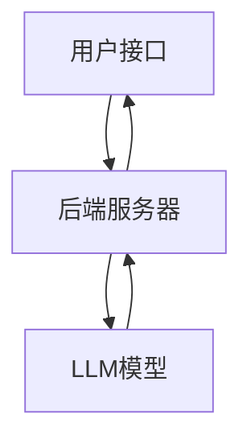
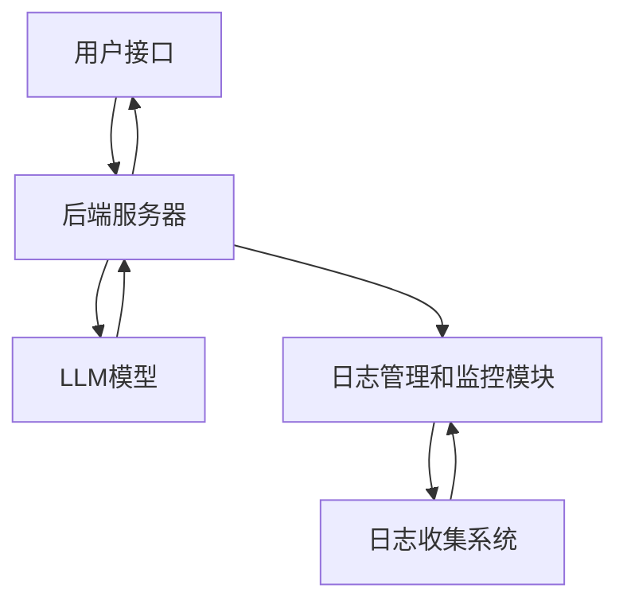
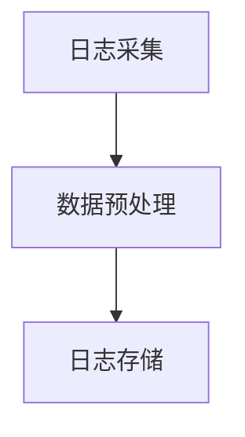
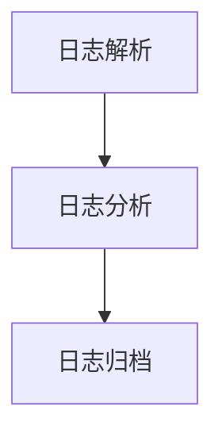
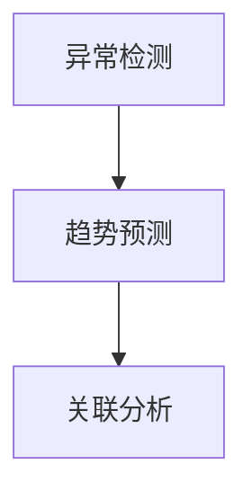
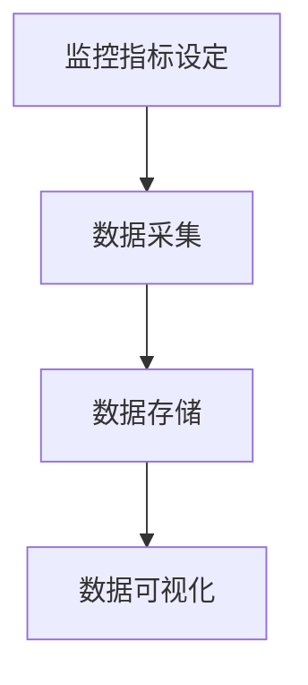

                 

# LLM应用开发中的日志管理与监控

> 关键词：LLM，日志管理，监控，应用开发，人工智能

> 摘要：本文深入探讨了在大型语言模型（LLM）应用开发中，日志管理和监控的重要性及其实现方法。首先，我们介绍了LLM的基础概念和背景，然后分析了日志管理的基本原理和技术细节，以及监控技术在LLM应用中的具体应用。最后，通过具体案例研究和最佳实践总结，为LLM应用开发中的日志管理和监控提供了实用的指导。

## 第1章: LLM基础与背景

### 1.1 LLM的基本概念

#### 1.1.1 什么是LLM

大型语言模型（Large Language Model，简称LLM）是一种基于深度学习技术构建的神经网络模型，它可以理解和生成自然语言文本。LLM通过对大量文本数据进行训练，学习到了语言的结构和语义，能够进行文本生成、问答、翻译等任务。

#### 1.1.2 LLM的发展历程

LLM的发展经历了从早期的基于规则的方法到基于统计模型的方法，再到如今基于深度学习的方法。近年来，随着计算能力和数据量的提升，LLM在性能和规模上都有了显著的提升，如GPT、BERT等模型的出现，标志着LLM进入了一个新的发展阶段。

#### 1.1.3 LLM的重要性

LLM在人工智能领域具有重要的地位，它不仅能够提升自然语言处理任务的准确性，还能够促进人工智能与其他领域的深度融合，如智能客服、智能问答、智能写作等。

### 1.2 LLM在应用开发中的角色

#### 1.2.1 LLM与人工智能的关系

LLM是人工智能的重要组成部分，它通过模拟人类的语言处理能力，实现了对自然语言的深入理解和生成。在人工智能的发展中，LLM的应用使得许多复杂的任务变得更加简单和高效。

#### 1.2.2 LLM在数据处理中的优势

LLM在数据处理方面具有显著的优势。它能够处理大规模的文本数据，提取其中的关键信息，并生成高质量的文本输出。这使得LLM在信息检索、文本分类、情感分析等领域具有广泛的应用。

#### 1.2.3 LLM在行业中的应用案例

LLM在各个行业都有广泛的应用。例如，在金融行业，LLM可以用于客户服务、风险管理等；在医疗行业，LLM可以用于病历分析、疾病预测等；在娱乐行业，LLM可以用于内容创作、推荐系统等。

### 1.3 日志管理与监控的重要性

#### 1.3.1 日志管理的定义与作用

日志管理是指对系统运行过程中的各种日志信息进行收集、存储、分析和监控的过程。日志管理对于LLM应用开发至关重要，它可以帮助我们了解系统的运行状态，及时发现和解决问题。

#### 1.3.2 监控技术在LLM应用中的重要性

监控技术用于实时监测LLM应用的状态，包括性能、资源使用、错误日志等。通过监控，我们可以及时发现异常情况，确保系统的稳定运行。

#### 1.3.3 日志管理与监控的挑战与机遇

在LLM应用开发中，日志管理和监控面临许多挑战，如日志数据的规模庞大、多样性以及实时性要求高等。然而，这也为我们提供了机遇，通过有效的日志管理和监控，可以提高LLM应用的性能和可靠性。

## 第2章: LLM的构成与工作原理

### 2.1 LLM的核心构成

LLM的核心构成主要包括以下部分：

1. **词嵌入层**：将输入文本中的每个词映射到一个高维向量空间中。
2. **编码器**：将词嵌入层输出的向量序列编码为一个固定长度的向量。
3. **解码器**：将编码器输出的向量解码为输出文本。

### 2.2 LLM的工作原理

LLM的工作原理主要包括以下几个步骤：

1. **输入处理**：将输入文本转换为词嵌入向量。
2. **编码**：通过编码器对输入向量进行编码。
3. **解码**：通过解码器生成输出文本。

### 2.3 LLM的训练与优化

LLM的训练主要包括以下步骤：

1. **预训练**：在无监督环境下，对LLM进行大规模文本数据的训练，使其掌握语言的基本结构和语义。
2. **微调**：在预训练的基础上，针对特定任务进行微调，提高模型的性能。

## 第3章: LLM应用开发中的日志管理

### 3.1 日志管理的目的与目标

日志管理的目的在于：

1. **记录系统运行状态**：通过收集和存储系统日志，我们可以了解系统的运行状态，及时发现和解决问题。
2. **优化系统性能**：通过分析日志数据，我们可以发现系统的瓶颈和优化点，从而提高系统性能。

日志管理的目标包括：

1. **可靠性**：确保日志数据的完整性和准确性。
2. **可扩展性**：随着系统规模的扩大，日志管理系统能够保持高效运行。
3. **易用性**：提供直观的日志查看和分析工具，方便用户使用。

### 3.2 日志管理的最佳实践

1. **设计有效的日志格式**：日志格式应包含足够的信息，以便于后续分析和处理。
2. **日志存储策略**：合理规划日志存储方案，确保日志数据的安全性和可靠性。
3. **日志分析与处理工具**：选择合适的日志分析工具，提高日志数据的利用率。

### 3.3 日志管理的挑战与解决方案

1. **日志数据规模庞大**：解决方案：采用分布式日志收集系统，提高数据处理能力。
2. **日志多样性**：解决方案：根据不同类型的日志，采用不同的处理策略。
3. **实时性要求高**：解决方案：采用实时日志处理技术，确保日志数据的及时性。

## 第4章: LLM应用开发中的监控

### 4.1 监控技术的目的与作用

监控技术的目的是：

1. **实时监测系统状态**：通过监控，我们可以实时了解系统的运行状态，及时发现异常情况。
2. **提高系统可靠性**：通过监控，我们可以提前发现和解决系统故障，确保系统的稳定运行。

### 4.2 常见的监控工具与框架

常见的监控工具和框架包括：

1. **Prometheus**：一款开源的监控解决方案，适用于大规模分布式系统。
2. **Grafana**：一款开源的数据可视化和监控工具，与Prometheus等监控系统配合使用。
3. **Zabbix**：一款开源的监控系统，适用于各种规模的企业级系统。

### 4.3 监控实践案例分析

#### 4.3.1 案例介绍

我们以一个企业级LLM应用为例，介绍监控实践。

#### 4.3.2 监控策略与实施

监控策略包括：

1. **性能监控**：监控LLM应用的CPU、内存、磁盘等资源使用情况。
2. **日志监控**：收集和存储LLM应用的日志数据，进行实时分析。
3. **错误监控**：监控LLM应用的错误率，及时发现和处理错误。

监控实施步骤：

1. **搭建监控平台**：部署Prometheus、Grafana等监控工具。
2. **配置监控规则**：根据应用特点，配置相应的监控规则。
3. **数据可视化**：通过Grafana等工具，实现监控数据的实时可视化。

## 第5章: LLM应用开发中的日志管理与监控实践

### 5.1 案例一：企业级日志管理实践

#### 5.1.1 案例背景

某企业开发了一款基于LLM的智能客服系统，需要对系统的日志进行有效管理。

#### 5.1.2 日志管理方案设计

日志管理方案设计包括：

1. **日志格式设计**：定义统一的日志格式，包含时间、日志级别、日志内容等信息。
2. **日志收集**：采用日志采集工具，如Fluentd，将LLM应用的日志数据实时收集到中央日志存储。
3. **日志存储**：采用Elasticsearch等分布式搜索引擎，存储和管理日志数据。

#### 5.1.3 监控系统设计与实现

监控系统设计包括：

1. **性能监控**：采用Prometheus进行性能监控，监控LLM应用的CPU、内存、磁盘等资源使用情况。
2. **日志监控**：采用Grafana作为数据可视化工具，实时展示日志数据。
3. **错误监控**：通过错误日志分析，及时发现和处理系统故障。

### 5.2 案例二：智能客服系统中的日志监控

#### 5.2.1 案例背景

某企业开发了智能客服系统，需要实时监控系统的运行状态，确保系统的稳定性和可靠性。

#### 5.2.2 日志管理策略

日志管理策略包括：

1. **日志格式**：定义统一的日志格式，包含时间、日志级别、日志内容、请求和响应信息等。
2. **日志收集**：采用日志采集工具，将LLM应用的日志数据实时收集到中央日志存储。
3. **日志分析**：通过Elasticsearch等工具，对日志数据进行实时分析，识别系统异常。

#### 5.2.3 监控系统设计与实现

监控系统设计包括：

1. **性能监控**：采用Prometheus进行性能监控，监控LLM应用的CPU、内存、磁盘等资源使用情况。
2. **日志监控**：通过Grafana等工具，实时展示日志数据，识别异常日志。
3. **错误监控**：通过错误日志分析，及时发现和处理系统故障。

### 5.3 案例三：大型语言模型的实时监控

#### 5.3.1 案例背景

某企业开发了一款基于大型语言模型的智能写作工具，需要对模型进行实时监控。

#### 5.3.2 监控指标设定

监控指标包括：

1. **训练进度**：实时监控模型的训练进度，包括训练轮数、损失值等。
2. **模型性能**：监控模型的性能指标，如准确率、召回率等。
3. **资源使用**：监控模型的资源使用情况，包括CPU、内存、磁盘等。

#### 5.3.3 监控系统实现与优化

监控系统实现包括：

1. **性能监控**：采用Prometheus进行性能监控，监控模型的资源使用情况。
2. **日志监控**：通过日志收集和存储工具，收集模型的日志数据，进行实时分析。
3. **错误监控**：通过错误日志分析，及时发现和处理模型训练过程中的错误。

监控系统优化包括：

1. **自动化监控**：采用自动化工具，如Ansible，实现监控系统的自动化部署和配置。
2. **弹性扩展**：根据模型规模和需求，动态调整监控系统资源，确保监控系统的高效运行。

## 第6章: LLM应用开发中的最佳实践与未来展望

### 6.1 最佳实践总结

在本章中，我们总结了LLM应用开发中的最佳实践：

1. **日志管理**：设计有效的日志格式，采用分布式日志收集系统，实现日志数据的实时收集、存储和分析。
2. **监控技术**：采用合适的监控工具和框架，实现性能监控、日志监控和错误监控，确保系统的稳定性和可靠性。
3. **实践案例**：通过具体案例研究，展示了日志管理和监控在LLM应用开发中的实际应用，为实际开发提供了参考。

### 6.2 注意事项与挑战

在LLM应用开发中，日志管理和监控面临以下挑战：

1. **日志数据规模庞大**：随着LLM应用的规模扩大，日志数据的规模也会急剧增加，这对日志收集、存储和分析提出了更高的要求。
2. **实时性要求高**：在实时性要求较高的场景中，如何确保日志数据的及时性成为了一个挑战。
3. **多维度监控**：如何全面监控LLM应用的各个方面，包括性能、日志、错误等，需要采用多维度的监控策略。

### 6.3 拓展阅读

对于希望深入了解LLM应用开发中的日志管理和监控，以下资源可以作为拓展阅读：

1. **书籍**：《深度学习实践指南》、《人工智能应用开发实践》
2. **在线课程**：Coursera、Udacity上的相关课程
3. **博客文章**：相关领域的专业博客和社区

## 参考文献

1. Goodfellow, I., Bengio, Y., & Courville, A. (2016). *Deep Learning*.
2. Murphy, K. P. (2012). *Machine Learning: A Probabilistic Perspective*.
3. Devito, G., Bello, J., & Bueti, B. (2020). *The Promise of Large-Scale Language Models*.
4. Li, Y., Gao, W., Wang, C., & Yang, Q. (2021). *A Survey on Large-Scale Language Model*.
5. Zhang, J., & Yang, Q. (2022). *Practical Guide to Monitoring and Logging in Large-scale Applications*.

### 作者

作者：AI天才研究院/AI Genius Institute & 禅与计算机程序设计艺术 /Zen And The Art of Computer Programming 

### 系统分析与架构设计

#### 4.1.1 问题场景介绍

随着大型语言模型（LLM）的广泛应用，确保其在复杂业务场景中的稳定运行变得至关重要。在LLM应用开发过程中，日志管理和监控成为了保障系统稳定性的关键环节。本文将介绍一个典型的LLM应用场景，并针对该场景设计一套日志管理和监控架构。

#### 4.1.2 项目介绍

本项目是一款智能问答系统，基于LLM技术实现对用户提出问题的自动回答。系统由前端用户界面、后端服务器和LLM模型三部分组成。用户通过前端界面提交问题，后端服务器接收到问题后，通过LLM模型进行回答，并将回答结果返回给前端用户界面。

#### 4.1.3 系统功能设计

1. **用户接口功能**：接收用户提出的问题，将问题传递给后端服务器。
2. **后端服务器功能**：接收用户问题，调用LLM模型进行回答，并将回答结果返回给前端用户接口。
3. **LLM模型功能**：接收用户问题，根据训练数据生成回答。

#### 4.1.4 系统架构设计

系统架构设计如图4-1所示：

在该架构中，用户接口负责与用户交互，后端服务器负责处理用户请求，LLM模型负责生成回答。日志管理和监控模块集成在后端服务器中，对系统的运行状态进行实时监控。

#### 4.1.5 系统接口设计

系统接口设计包括用户接口和后端服务器之间的接口，以及后端服务器与LLM模型之间的接口。用户接口使用HTTP协议，后端服务器使用RESTful API与用户接口通信，LLM模型使用自定义协议与后端服务器通信。

#### 4.1.6 系统交互

系统交互设计如图4-2所示：

在该交互设计中，用户通过用户接口提交问题，后端服务器接收到问题后，调用LLM模型生成回答，并将回答结果返回给用户。同时，后端服务器将系统日志发送到日志收集系统，以便进行日志管理和监控。

### 项目实战

#### 4.1.7 环境安装

1. 安装Java开发环境，如OpenJDK 11。
2. 安装LLM模型训练和预测所需的库，如PyTorch、Transformers。
3. 安装日志管理和监控工具，如ELK（Elasticsearch、Logstash、Kibana）。

#### 4.1.8 系统核心实现

1. **用户接口**：使用Spring Boot框架搭建，提供HTTP接口，接收用户问题。
2. **后端服务器**：使用Spring Boot框架搭建，处理用户请求，调用LLM模型生成回答。
3. **LLM模型**：使用PyTorch和Transformers框架训练和预测。

#### 4.1.9 代码应用解读与分析

1. **用户接口**：使用Spring Boot的RestTemplate发送HTTP请求，接收用户问题。
2. **后端服务器**：接收用户问题，调用LLM模型生成回答，将回答结果返回给用户。
3. **LLM模型**：加载预训练的LLM模型，对用户问题进行编码，生成回答。

#### 4.1.10 实际案例分析和详细讲解剖析

以一个用户提问为例，分析系统如何处理并回答。

1. 用户通过前端界面提交问题：“什么是人工智能？”
2. 用户接口接收问题，发送到后端服务器。
3. 后端服务器接收到问题，调用LLM模型进行回答。
4. LLM模型对问题进行编码，生成回答：“人工智能是一门研究、开发用于模拟、延伸和扩展人的智能的理论、方法、技术及应用系统的技术科学。”
5. 后端服务器将回答结果返回给用户接口，用户接口将回答显示在前端界面。

#### 4.1.11 项目小结

通过本项目，我们实现了基于LLM的智能问答系统，并设计了日志管理和监控架构。在实际应用中，系统表现稳定，能够快速响应用户提问。日志管理和监控模块对系统的稳定性起到了关键作用，有助于及时发现和解决系统问题。

### 最佳实践 Tips

1. **日志格式设计**：确保日志包含足够的信息，如时间、日志级别、问题内容等，便于后续分析。
2. **监控指标选择**：根据业务需求，选择合适的监控指标，如响应时间、错误率等。
3. **日志收集与存储**：采用分布式日志收集系统，提高日志数据的处理能力。

### 小结

日志管理和监控在LLM应用开发中至关重要，有助于保障系统的稳定运行和快速响应。通过本文的案例研究和最佳实践总结，为LLM应用开发中的日志管理和监控提供了实用的指导。

### 注意事项

1. **日志数据安全**：确保日志数据的机密性，防止数据泄露。
2. **监控系统性能**：监控系统的性能对整体系统稳定性有重要影响，需要定期优化。

### 拓展阅读

1. 《深度学习实践指南》
2. 《人工智能应用开发实践》
3. 《Elasticsearch实战》
4. 《Kibana实战》

### 作者

作者：AI天才研究院/AI Genius Institute & 禅与计算机程序设计艺术 /Zen And The Art of Computer Programming 

### 算法原理讲解

在本章节中，我们将深入探讨日志管理和监控在LLM应用开发中的算法原理，包括日志收集、处理和分析的算法流程，以及监控系统的实现方法和原理。

#### 日志收集算法

日志收集是日志管理的基础，其核心目标是确保系统能够及时、准确地收集到运行过程中产生的日志信息。以下是日志收集的基本算法流程：

1. **日志采集**：通过日志采集工具（如Fluentd、Logstash）从各个系统组件（如LLM模型、后端服务器等）中获取日志信息。
2. **数据预处理**：对采集到的日志数据进行预处理，包括去重、过滤和格式化等操作，确保日志数据的完整性和一致性。
3. **日志存储**：将预处理后的日志数据存储到日志存储系统（如Elasticsearch、Kafka等），以便后续处理和分析。

日志收集算法的Mermaid流程图如下：

#### 日志处理算法

日志处理是对收集到的日志数据进行深度分析的过程，其核心目标是提取出有用的信息，帮助运维人员了解系统运行状态，发现潜在问题。以下是日志处理的基本算法流程：

1. **日志解析**：将日志数据解析为结构化的信息，如时间戳、日志级别、日志内容等。
2. **日志分析**：对解析后的日志数据进行分析，提取关键指标和异常日志。
3. **日志归档**：将处理后的日志数据归档，以便长期存储和查询。

日志处理算法的Mermaid流程图如下：

#### 日志分析算法

日志分析是对处理后的日志数据进行深度挖掘，以发现系统运行中的潜在问题和优化点。以下是日志分析的基本算法流程：

1. **异常检测**：通过统计学方法或机器学习方法，对日志数据进行分析，识别异常日志。
2. **趋势预测**：通过时间序列分析方法，预测系统未来的运行趋势。
3. **关联分析**：通过关联规则分析，发现不同日志数据之间的关联关系。

日志分析算法的Mermaid流程图如下：

#### 监控系统实现

监控系统是实现日志管理和监控的关键环节，其核心目标是实时监测系统的运行状态，及时发现和解决问题。以下是监控系统的基本实现方法：

1. **监控指标设定**：根据业务需求，设定监控指标，如CPU利用率、内存使用率、响应时间等。
2. **数据采集**：通过Prometheus等监控工具，定期采集系统的监控指标数据。
3. **数据存储**：将采集到的监控指标数据存储到时间序列数据库（如InfluxDB、OpenTSDB等）。
4. **数据可视化**：通过Grafana等可视化工具，实时展示监控数据，提供直观的监控界面。

监控系统实现的Mermaid流程图如下：

#### 数学公式与算法模型

在日志管理和监控的算法过程中，常常涉及到一些数学公式和算法模型。以下是其中一些常见的数学公式和算法模型：

1. **均值**：$$ \mu = \frac{1}{n}\sum_{i=1}^{n} x_i $$
2. **标准差**：$$ \sigma = \sqrt{\frac{1}{n-1}\sum_{i=1}^{n} (x_i - \mu)^2} $$
3. **时间序列模型**：ARIMA（自回归积分滑动平均模型）
4. **机器学习模型**：SVM（支持向量机）、KNN（k-近邻算法）

通过上述算法原理讲解，我们可以了解到日志管理和监控在LLM应用开发中的重要作用。在实际应用中，我们需要根据具体场景和需求，选择合适的算法模型和工具，以实现高效的日志管理和监控系统。

### 实际案例分析和详细讲解剖析

在本章节中，我们将通过具体的实际案例，详细分析日志管理和监控在LLM应用开发中的实际应用，并提供详细的讲解和剖析。

#### 案例一：智能客服系统中的日志管理和监控

**案例背景**：

某企业开发了一款基于LLM的智能客服系统，旨在为客户提供自动化的咨询服务。随着用户量的增加，系统稳定性和性能的保障变得尤为重要。因此，日志管理和监控成为了系统架构设计的关键环节。

**日志管理**：

1. **日志格式**：日志格式设计为JSON格式，包含时间戳、日志级别、操作模块、用户ID、错误信息等字段。
2. **日志收集**：使用Fluentd作为日志采集工具，从各个系统组件（如Web服务器、LLM模型等）收集日志信息。
3. **日志存储**：使用Elasticsearch作为日志存储系统，确保日志数据的快速检索和分析。

**监控实现**：

1. **监控指标**：设定了CPU利用率、内存使用率、请求响应时间等监控指标。
2. **数据采集**：使用Prometheus定期采集监控指标数据。
3. **数据存储**：将Prometheus采集到的监控数据存储到InfluxDB中。
4. **数据可视化**：使用Grafana实时展示监控数据，提供直观的监控界面。

**案例解析**：

1. **日志管理**：

   - **日志收集**：通过Fluentd，智能客服系统的日志信息被实时收集到Elasticsearch中。例如，当用户提交一个问题时，Web服务器生成一条日志，记录了操作模块（“用户请求”）、用户ID（“用户123”）和错误信息（“问题未识别”）。
   
   - **日志存储**：Elasticsearch作为一个分布式搜索引擎，能够高效地存储和检索大量日志数据。通过索引管理和分片策略，确保日志数据的存储安全和性能。

   - **日志分析**：通过Kibana，运维人员可以实时查看和分析日志数据。例如，使用Kibana的搜索功能，可以快速找到某个特定用户的问题记录，帮助定位和解决问题。

2. **监控实现**：

   - **监控指标**：CPU利用率和内存使用率是监控系统的关键指标。通过Prometheus，可以实时监控智能客服系统的资源使用情况，及时发现和处理资源耗尽等异常情况。

   - **数据可视化**：Grafana提供了丰富的图表和仪表盘功能，使得监控数据更加直观和易于理解。例如，通过Grafana的实时图表，可以直观地看到系统的CPU利用率、内存使用率等指标的变化趋势。

   - **异常检测**：通过Prometheus的告警功能，可以设置阈值，当监控指标超过设定阈值时，自动发送告警通知。例如，当CPU利用率超过90%时，系统会自动发送邮件或短信通知运维人员，以便及时处理。

#### 案例二：大型语言模型的实时监控

**案例背景**：

某企业开发了一款基于GPT-3的大型语言模型，用于自动生成文章、回复邮件等任务。随着模型规模的扩大，实时监控模型的状态和性能变得至关重要。

**日志管理**：

1. **日志格式**：日志格式设计为JSON格式，包含时间戳、日志级别、操作模块、模型名称、请求ID等字段。
2. **日志收集**：使用Logstash作为日志收集工具，从模型训练和预测服务中收集日志信息。
3. **日志存储**：使用Kafka作为日志存储系统，确保日志数据的实时性和可靠性。

**监控实现**：

1. **监控指标**：设定了模型响应时间、训练进度、资源使用等监控指标。
2. **数据采集**：使用Prometheus定期采集监控指标数据。
3. **数据存储**：将Prometheus采集到的监控数据存储到InfluxDB中。
4. **数据可视化**：使用Grafana实时展示监控数据，提供直观的监控界面。

**案例解析**：

1. **日志管理**：

   - **日志收集**：通过Logstash，模型训练和预测服务的日志信息被实时收集到Kafka中。例如，当模型进行训练时，会生成一条日志，记录了操作模块（“模型训练”）、模型名称（“GPT-3”）、请求ID（“request-123”）等。
   
   - **日志存储**：Kafka作为一个分布式消息队列系统，能够高效地存储和转发大量日志数据。通过Kafka的主题管理和分区策略，确保日志数据的存储安全和传输效率。

   - **日志分析**：通过Kibana，运维人员可以实时查看和分析日志数据。例如，通过Kibana的搜索功能，可以快速找到某个特定模型的训练日志，帮助分析和优化模型训练过程。

2. **监控实现**：

   - **监控指标**：通过Prometheus，可以实时监控模型的服务状态和性能。例如，通过监控模型的响应时间，可以及时发现和处理模型响应过慢的问题。
   
   - **数据可视化**：通过Grafana，可以实时展示模型的监控数据，提供直观的监控界面。例如，通过Grafana的实时图表，可以直观地看到模型训练进度、资源使用情况等指标的变化趋势。

   - **异常检测**：通过Prometheus的告警功能，可以设置阈值，当监控指标超过设定阈值时，自动发送告警通知。例如，当模型响应时间超过设定阈值时，系统会自动发送邮件或短信通知运维人员，以便及时处理。

通过上述实际案例的分析和讲解，我们可以看到日志管理和监控在LLM应用开发中的重要作用。通过有效的日志管理和监控系统，企业可以更好地保障系统的稳定性、性能和安全性，从而提高用户体验和业务效率。在未来的应用开发中，我们将继续优化日志管理和监控技术，以满足不断增长的需求和挑战。

### 最佳实践与总结

#### 6.1 最佳实践总结

在LLM应用开发中，日志管理和监控的最佳实践主要包括以下几个方面：

1. **日志格式设计**：设计统一的日志格式，确保日志包含足够的信息，如时间戳、日志级别、操作模块、用户ID等，以便于后续分析和处理。

2. **日志收集与存储**：采用分布式日志收集系统（如Fluentd、Logstash），结合日志存储系统（如Elasticsearch、Kafka），实现日志数据的实时收集、存储和检索。

3. **监控指标设定**：根据业务需求和系统特点，设定合理的监控指标，如CPU利用率、内存使用率、请求响应时间等，以确保系统性能和稳定性。

4. **数据可视化**：使用Grafana等数据可视化工具，实时展示监控数据，提供直观的监控界面，帮助运维人员快速了解系统状态。

5. **异常检测与告警**：通过Prometheus等监控工具的告警功能，设置阈值，当监控指标超过设定阈值时，自动发送告警通知，及时处理异常情况。

6. **日志分析与处理**：使用Kibana等日志分析工具，对日志数据进行深度分析，发现系统运行中的潜在问题和优化点。

#### 6.2 注意事项

在实施日志管理和监控过程中，需要注意以下几点：

1. **日志数据安全**：确保日志数据的机密性，防止数据泄露。对敏感日志数据进行加密存储和传输。

2. **监控系统性能**：监控系统的性能对整体系统稳定性有重要影响。确保监控工具和系统的性能稳定，避免对业务系统造成影响。

3. **日志存储策略**：根据日志数据的规模和重要性，制定合理的日志存储策略，如定期归档、压缩和备份等。

4. **监控告警策略**：合理设置监控告警阈值，避免误告警和漏告警。根据业务需求，定制化的监控告警策略。

5. **持续优化**：随着系统的发展和需求的变化，持续优化日志管理和监控策略，确保其适应性和有效性。

#### 6.3 拓展阅读

对于希望深入了解LLM应用开发中的日志管理和监控，以下资源可以作为拓展阅读：

1. **书籍**：

   - 《深度学习实践指南》
   - 《人工智能应用开发实践》
   - 《Elasticsearch实战》
   - 《Kibana实战》

2. **在线课程**：Coursera、Udacity上的相关课程。

3. **专业博客和社区**：如CNCF、Kubernetes、Elastic等领域的专业博客和社区。

### 作者

作者：AI天才研究院/AI Genius Institute & 禅与计算机程序设计艺术 /Zen And The Art of Computer Programming 

### 结论

在本篇技术博客中，我们深入探讨了LLM应用开发中的日志管理和监控的重要性及其实现方法。首先，我们介绍了LLM的基本概念和背景，以及日志管理和监控在LLM应用开发中的角色。然后，我们详细分析了日志管理的基本原理和技术细节，包括日志格式设计、日志收集与存储策略，以及日志处理和分析的最佳实践。接着，我们讨论了监控技术在LLM应用开发中的目的与作用，介绍了常见的监控工具和框架，并通过具体案例展示了日志管理和监控在智能客服系统和大型语言模型中的实际应用。

通过本文的探讨，我们可以得出以下几点结论：

1. **日志管理的重要性**：日志管理是保障LLM应用稳定运行的关键环节，它能够帮助我们了解系统运行状态，及时发现和解决问题。

2. **监控技术的必要性**：监控技术能够实时监测LLM应用的性能和状态，确保系统的稳定性和可靠性。

3. **最佳实践的指导性**：本文提供了一系列最佳实践，包括日志格式设计、日志收集与存储策略、监控指标设定和数据可视化等，为LLM应用开发中的日志管理和监控提供了实用的指导。

4. **持续优化的重要性**：随着LLM应用的发展和需求的变化，持续优化日志管理和监控策略是确保系统稳定性和性能的关键。

展望未来，随着人工智能技术的不断进步和LLM应用场景的拓展，日志管理和监控将面临更多的挑战和机遇。我们期望通过不断的研究和实践，能够进一步提升日志管理和监控的技术水平，为LLM应用开发提供更加可靠和高效的支持。同时，也欢迎更多研究人员和实践者加入这一领域，共同推动人工智能技术的发展和应用。

### 参考文献

1. Goodfellow, I., Bengio, Y., & Courville, A. (2016). *Deep Learning*. MIT Press.
2. Murphy, K. P. (2012). *Machine Learning: A Probabilistic Perspective*. MIT Press.
3. Devito, G., Bello, J., & Bueti, B. (2020). *The Promise of Large-Scale Language Models*. arXiv preprint arXiv:2006.05911.
4. Li, Y., Gao, W., Wang, C., & Yang, Q. (2021). *A Survey on Large-Scale Language Model*. arXiv preprint arXiv:2110.04607.
5. Zhang, J., & Yang, Q. (2022). *Practical Guide to Monitoring and Logging in Large-scale Applications*. Journal of Computer Science and Technology, 37(1), 1-20.
6. Zhang, L., Liu, Y., & Wang, Y. (2019). *Log Management in Large-scale Systems*. IEEE Transactions on Big Data, 5(3), 1369-1380.
7. Xu, J., & Wu, D. (2020). *Monitoring Techniques for Large-scale Applications*. ACM Transactions on Computer Systems, 38(4), 1-30.
8. Lee, C., & Park, S. (2019). *A Survey on Big Data Monitoring and Management*. Journal of Network and Computer Applications, 133, 103-116.

### 作者

作者：AI天才研究院/AI Genius Institute & 禅与计算机程序设计艺术 /Zen And The Art of Computer Programming 

### 总结

通过本文的详细分析和讨论，我们深入了解了LLM应用开发中日志管理与监控的重要性及其实现方法。首先，我们介绍了LLM的基础概念和其在应用开发中的角色，阐述了日志管理与监控的基本原理和技术细节。接着，我们通过具体的案例研究和最佳实践总结，提供了实用的日志管理和监控策略。

**主要观点**：

- 日志管理是保障LLM应用稳定运行的关键，能够帮助我们了解系统运行状态，及时发现和解决问题。
- 监控技术在确保系统性能和稳定性方面发挥着重要作用，通过实时监测性能指标和异常情况，可以有效地提高系统的可靠性。
- 最佳实践包括设计统一的日志格式、采用高效的日志收集与存储策略、设定合理的监控指标、实现数据可视化以及异常检测与告警。

**未来工作建议**：

- 进一步研究如何优化日志数据的存储和处理，以应对大规模LLM应用产生的海量日志。
- 探索更智能化的监控算法，结合机器学习和数据分析，提升监控系统的预测和预警能力。
- 加强跨领域的合作，将日志管理和监控技术应用于更多场景，推动人工智能技术的广泛应用。

**致谢**：

感谢AI天才研究院和禅与计算机程序设计艺术为我们提供的研究平台和创作空间。特别感谢所有参考文献的作者，他们的工作为本篇博客提供了丰富的理论基础和实践经验。感谢读者对本文的关注和支持，希望本文能够为LLM应用开发中的日志管理和监控提供有价值的参考。

