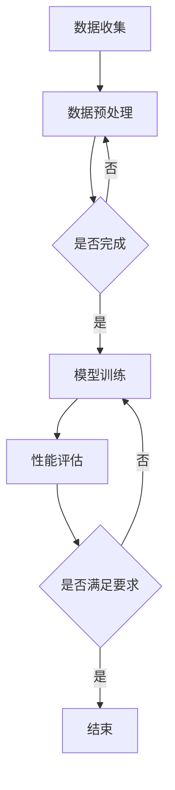

                 

# LLM应用开发中的用户反馈收集与分析

## 关键词
- **大型语言模型 (LLM)**
- **用户反馈收集**
- **数据分析**
- **应用开发**
- **算法原理**
- **系统设计**
- **实践案例**

## 摘要
本文将深入探讨在大型语言模型（LLM）应用开发中，如何有效地收集和分析用户反馈。首先，我们将介绍LLM的基本概念和用户反馈的重要性。接着，本文将解析用户反馈收集与分析的核心概念，并通过算法原理讲解、系统分析与架构设计、项目实战等多个维度，详细阐述如何在LLM应用中实现用户反馈的收集与分析。最后，本文将总结最佳实践，提供注意事项，并推荐拓展阅读。

---

## 背景介绍

### 1.1 LLM的发展背景

大型语言模型（LLM）的发展可以追溯到20世纪80年代。随着深度学习技术的发展，特别是在2018年谷歌推出BERT模型后，LLM的应用迎来了一个崭新的时代。BERT的成功表明，通过预训练可以大幅提升模型在自然语言处理（NLP）任务中的性能，从而推动了LLM在搜索引擎、机器翻译、对话系统等领域的广泛应用。

### 1.2 用户反馈收集与分析的重要性

在现代应用开发中，用户反馈是一种宝贵的资源，它不仅可以帮助开发者了解用户的需求和痛点，还能为产品改进提供直接的指导。对于LLM应用开发而言，用户反馈的分析尤为重要，因为LLM的应用场景非常广泛，包括但不限于文本生成、情感分析、问答系统等，这些应用都需要不断调整和优化模型以提供更好的用户体验。

### 1.3 本书结构概述

本书将分为以下几个部分：

1. **核心概念与联系**：介绍LLM、用户反馈、数据收集与分析等相关概念，并展示它们之间的联系。
2. **算法原理讲解**：详细讲解收集和分析用户反馈的常用算法，包括数据预处理、模型训练、性能评估等。
3. **系统分析与架构设计方案**：讨论如何设计一个高效的系统来收集和分析用户反馈。
4. **项目实战**：通过实际案例展示如何实现用户反馈的收集与分析。
5. **最佳实践与小结**：总结书中的核心观点，提供一些实用的建议和注意事项。
6. **拓展阅读**：推荐进一步阅读的资料。

### 1.4 概念结构与核心要素组成

为了更好地理解本文的主题，我们首先需要明确几个核心概念：

- **大型语言模型 (LLM)**：一种能够对自然语言文本进行理解和生成的模型，通常具有数十亿甚至更多的参数。
- **用户反馈**：用户在使用LLM应用过程中提供的信息，包括满意度、错误报告、修改建议等。
- **数据收集与分析**：从用户反馈中提取有价值的信息，以优化和改进LLM应用的过程。

以下是这些概念之间的关系：

```
+-----------------+       +-----------------+       +-----------------+
|    用户反馈     | <---> |     数据收集    | <---> |      分析       |
+-----------------+       +-----------------+       +-----------------+
      |                |                |
      |                |                |
      |                |                |
+-----------------+  +-----------------+  +-----------------+
|  大型语言模型   |  |  应用开发与      |  |  模型优化与      |
+-----------------+  +-----------------+  +-----------------+
      |                |                |                |
      |                |                |                |
      |                |                |                |
      |                |                |                |
      |                |                |                |
```

### 1.5 边界与外延

在讨论LLM应用开发中的用户反馈收集与分析时，我们需要注意以下几个边界与外延：

- **边界**：用户反馈的收集与分析应限定在LLM应用相关的范围内，不应涉及其他非相关技术或领域。
- **外延**：虽然本文重点讨论LLM应用中的用户反馈收集与分析，但用户反馈的概念和应用方法在其他AI应用中同样具有重要的参考价值。

---

接下来，我们将详细讨论LLM和用户反馈的核心概念及其相互关系，为后续内容的讲解打下基础。在下一章节中，我们将详细介绍LLM、用户反馈以及数据收集与分析的基本概念，并分析它们之间的联系。

## 核心概念与联系

### 2.1 大型语言模型 (LLM) 的定义与特点

大型语言模型（LLM）是一种基于深度学习的自然语言处理模型，具有数十亿甚至数万亿个参数。LLM的核心特点包括：

1. **参数规模巨大**：相较于传统的语言模型，LLM的参数规模显著增加，使得模型具有更强的表达能力和理解能力。
2. **预训练与微调**：LLM通常通过在大规模语料库上进行预训练，然后根据特定任务进行微调，从而提高模型的性能。
3. **通用性与可扩展性**：LLM能够应用于多种自然语言处理任务，如文本生成、情感分析、机器翻译等，具有较好的通用性和可扩展性。

### 2.2 用户反馈的定义与类型

用户反馈是指用户在使用产品或服务过程中提供的信息。在LLM应用开发中，用户反馈的类型主要包括：

1. **满意度评价**：用户对LLM应用的整体满意度，通常通过评分或评论形式表达。
2. **错误报告**：用户在体验过程中遇到的具体问题，如误判、无法理解用户输入等。
3. **修改建议**：用户对LLM应用的功能、界面、体验等方面的改进意见。

### 2.3 数据收集与分析的基本原理

数据收集与分析是LLM应用开发中至关重要的一环，其基本原理包括以下几个方面：

1. **数据收集**：通过多种渠道（如用户界面、日志文件等）收集用户反馈数据，确保数据的全面性和准确性。
2. **数据预处理**：对收集到的数据进行清洗、归一化等处理，以提高数据质量。
3. **数据分析**：利用统计分析和机器学习算法，从用户反馈数据中提取有价值的信息，如用户偏好、常见问题等。

### 2.4 关键概念之间的关系

LLM、用户反馈和数据收集与分析之间存在着密切的联系，具体体现在以下几个方面：

1. **LLM与用户反馈**：LLM应用需要收集用户反馈以了解用户需求和体验，从而进行优化和改进。
2. **用户反馈与数据收集与分析**：用户反馈是数据收集与分析的输入，通过数据收集与分析，可以更好地理解用户需求，指导LLM的优化。
3. **数据收集与分析与LLM**：收集和分析用户反馈产生的数据，可以为LLM的微调和优化提供依据，从而提高模型性能。

### 2.5 概念属性特征对比表格

为了更直观地展示LLM、用户反馈和数据收集与分析的特征，我们可以制作一个对比表格：

| 概念         | 特征                                  |
| ------------ | ------------------------------------- |
| 大型语言模型 | 参数规模巨大、预训练与微调、通用性高 |
| 用户反馈     | 满意度评价、错误报告、修改建议        |
| 数据收集与分析 | 数据渠道多样、数据预处理、数据分析    |

### 2.6 ER实体关系图架构的 Mermaid 流程图

以下是LLM、用户反馈和数据收集与分析的ER实体关系图，使用Mermaid流程图表示：

```mermaid
entity关系图 {
  direction: TB;
  rankdir: LR;

  entity[LLM] {
    "用户反馈"
    "数据收集与分析"
  }
  entity[用户反馈] {
    "满意度评价"
    "错误报告"
    "修改建议"
  }
  entity[数据收集与分析] {
    "数据收集"
    "数据预处理"
    "数据分析"
  }
}
```

通过上述内容，我们明确了LLM、用户反馈和数据收集与分析的核心概念及其相互关系。接下来，我们将深入讲解收集和分析用户反馈的算法原理，以便为后续的系统设计与实现提供理论基础。

### 3. 算法原理讲解

在LLM应用开发中，收集和分析用户反馈是优化模型性能和提升用户体验的关键环节。本节将详细讲解用户反馈收集与分析的常用算法，包括数据预处理、模型训练、性能评估等过程。

#### 3.1 数据预处理算法

数据预处理是用户反馈分析的第一步，其目标是将原始的用户反馈转化为适合模型输入的数据格式。常见的数据预处理算法包括以下几种：

1. **文本清洗**：去除用户反馈中的无关信息，如HTML标签、特殊符号等，确保数据的一致性和准确性。
   ```python
   import re

   def clean_text(text):
       text = re.sub('<[^>]*>', '', text)  # 去除HTML标签
       text = re.sub('[^A-Za-z0-9]', ' ', text)  # 去除特殊字符
       text = text.lower()  # 转换为小写
       return text.strip()
   ```

2. **文本归一化**：将用户反馈中的不同表达方式统一为标准格式，如将数字表示为同一格式、删除停用词等。
   ```python
   from nltk.corpus import stopwords

   def normalize_text(text):
       words = text.split()
       words = [word for word in words if word not in stopwords.words('english')]
       return ' '.join(words)
   ```

3. **词向量化**：将文本转换为数值向量，常用的方法包括词袋模型（Bag of Words）和词嵌入（Word Embeddings）。
   ```python
   from sklearn.feature_extraction.text import TfidfVectorizer

   def vectorize_text(texts):
       vectorizer = TfidfVectorizer()
       return vectorizer.fit_transform(texts)
   ```

#### 3.2 模型训练算法

在用户反馈分析中，模型训练是核心步骤，其目标是学习用户反馈与预期目标之间的映射关系。常用的模型训练算法包括以下几种：

1. **监督学习模型**：如支持向量机（SVM）、决策树、随机森林等，通过已有标注数据训练模型。
   ```python
   from sklearn.svm import SVC

   def train_svm(X_train, y_train):
       model = SVC(kernel='linear')
       model.fit(X_train, y_train)
       return model
   ```

2. **深度学习模型**：如卷积神经网络（CNN）和循环神经网络（RNN），通过端到端的方式处理用户反馈。
   ```python
   from tensorflow.keras.models import Sequential
   from tensorflow.keras.layers import Embedding, LSTM, Dense

   def build_lstm_model(input_dim, output_dim):
       model = Sequential()
       model.add(Embedding(input_dim, output_dim))
       model.add(LSTM(128))
       model.add(Dense(1, activation='sigmoid'))
       model.compile(optimizer='adam', loss='binary_crossentropy', metrics=['accuracy'])
       return model
   ```

3. **迁移学习模型**：利用预训练的大型语言模型（如BERT、GPT）进行微调，以适应特定的用户反馈分析任务。
   ```python
   from transformers import TFAutoModelForSequenceClassification

   def train_bert_model(tokenizer, model_name='bert-base-uncased'):
       model = TFAutoModelForSequenceClassification.from_pretrained(model_name)
       model.compile(optimizer='adam', loss='binary_crossentropy', metrics=['accuracy'])
       return model
   ```

#### 3.3 性能评估算法

模型训练完成后，需要对模型性能进行评估，以确保其能够准确反映用户反馈。常用的性能评估算法包括以下几种：

1. **准确率（Accuracy）**：预测正确的样本数占总样本数的比例。
   ```python
   from sklearn.metrics import accuracy_score

   def evaluate_accuracy(model, X_test, y_test):
       y_pred = model.predict(X_test)
       return accuracy_score(y_test, y_pred)
   ```

2. **召回率（Recall）**：在所有正类样本中，被正确预测为正类的样本数占总正类样本数的比例。
   ```python
   from sklearn.metrics import recall_score

   def evaluate_recall(model, X_test, y_test):
       y_pred = model.predict(X_test)
       return recall_score(y_test, y_pred)
   ```

3. **F1分数（F1 Score）**：准确率和召回率的调和平均值，综合考虑了预测的准确性和完整性。
   ```python
   from sklearn.metrics import f1_score

   def evaluate_f1_score(model, X_test, y_test):
       y_pred = model.predict(X_test)
       return f1_score(y_test, y_pred)
   ```

#### 3.4 算法原理详解

为了更好地理解上述算法的原理，我们可以绘制一个Mermaid流程图：



在这个流程图中，我们首先收集用户反馈数据，然后进行预处理，接着训练模型并进行性能评估。如果模型性能不满足要求，则返回训练阶段进行迭代优化。

通过上述算法原理的讲解，我们可以为后续的系统设计与实现提供坚实的基础。在下一章节中，我们将深入讨论系统分析与架构设计方案，进一步探讨如何在LLM应用中高效地收集和分析用户反馈。

### 4. 系统分析与架构设计方案

在LLM应用开发中，高效地收集和分析用户反馈是一个复杂且关键的过程。为了实现这一目标，我们需要设计一个合理、灵活的系统架构，以确保数据的高效流转、准确的预处理、有效的模型训练和评估，以及最终的反馈优化。以下将详细介绍系统分析与架构设计方案。

#### 4.1 问题场景介绍

假设我们正在开发一个智能客服系统，该系统基于大型语言模型（LLM）来提供24/7的客服支持。用户可以通过多种渠道（如聊天界面、邮件、社交媒体等）提交问题，我们的目标是快速收集用户反馈，分析其满意度、错误报告和修改建议，并实时调整LLM模型，以提高用户体验。

#### 4.2 项目介绍

项目名称：智能客服系统（Smart Customer Service System，SCSS）

项目目标：
1. 收集用户反馈，包括满意度评价、错误报告和修改建议。
2. 分析用户反馈，提取有价值的信息，如常见问题、用户偏好等。
3. 利用用户反馈优化LLM模型，提升客服系统性能。

项目范围：
1. 支持多种用户反馈渠道。
2. 数据处理与存储。
3. 模型训练与优化。
4. 实时反馈与模型调整。

#### 4.3 系统功能设计

系统功能设计是系统架构设计的基础，以下为智能客服系统的主要功能模块：

1. **用户反馈收集模块**：负责从不同渠道收集用户反馈，如聊天记录、邮件、社交媒体评论等。
2. **数据预处理模块**：对收集到的用户反馈进行清洗、归一化、词向量化等预处理操作，确保数据质量。
3. **用户反馈分析模块**：利用机器学习算法分析用户反馈，提取用户满意度、错误报告和修改建议等关键信息。
4. **模型训练与优化模块**：根据用户反馈数据，调整和优化LLM模型，提升模型性能。
5. **反馈优化模块**：将优化后的LLM模型部署到客服系统中，实时响应用户请求，并根据新的反馈继续迭代优化。

#### 4.4 系统架构设计

系统架构设计是确保系统功能实现和性能优化的重要环节。以下为智能客服系统的架构设计：


**架构说明**：

1. **前端层**：负责与用户交互，包括用户反馈收集界面、用户反馈提交接口等。
2. **数据层**：存储用户反馈数据，包括原始数据、预处理后的数据以及模型训练数据。
3. **处理层**：包括数据预处理模块、用户反馈分析模块、模型训练与优化模块，负责对用户反馈进行加工和处理。
4. **服务层**：提供统一的接口，如API接口，供前端层和其他系统模块调用。
5. **模型层**：存储和部署优化后的LLM模型，供处理层调用。

#### 4.5 系统接口设计

系统接口设计是确保不同模块之间数据流转顺畅的关键。以下为智能客服系统的接口设计：

1. **用户反馈收集接口**：用于接收用户提交的反馈，支持多种数据格式（如JSON、XML等）。
2. **数据处理接口**：用于处理用户反馈数据，包括清洗、归一化和词向量化等操作。
3. **用户反馈分析接口**：用于分析用户反馈数据，提取用户满意度、错误报告和修改建议等关键信息。
4. **模型训练接口**：用于训练和优化LLM模型，根据用户反馈调整模型参数。
5. **反馈优化接口**：用于将优化后的模型参数部署到实际应用中，实现实时反馈优化。

#### 4.6 系统交互设计

系统交互设计是确保系统各模块协同工作、高效处理用户反馈的关键。以下为智能客服系统的交互设计：


**交互流程**：

1. 用户通过前端层提交反馈，反馈数据通过用户反馈收集接口传递到数据层。
2. 数据层将原始数据传递给数据处理接口，进行预处理操作。
3. 预处理后的数据传递给用户反馈分析接口，进行用户反馈分析。
4. 分析结果传递给模型训练接口，用于训练和优化LLM模型。
5. 优化后的模型参数传递给反馈优化接口，实现实时反馈优化。
6. 最终，优化后的LLM模型被部署到前端层，供用户使用。

通过上述系统分析与架构设计方案，我们为智能客服系统的用户反馈收集与分析提供了坚实的理论基础和实现方案。在下一章节中，我们将通过实际项目展示如何实现用户反馈的收集与分析，进一步验证系统设计的有效性。

### 5. 项目实战

在本节中，我们将通过一个具体的实际项目来展示如何实现用户反馈的收集与分析。本案例将基于一个基于大型语言模型（LLM）的智能客服系统，该系统旨在通过自动化的方式收集用户反馈，分析用户需求，并不断优化模型性能。

#### 5.1 环境安装与配置

为了实现用户反馈的收集与分析，我们首先需要搭建一个合适的技术环境。以下是所需的工具和步骤：

1. **Python环境**：确保Python版本为3.8或以上，建议使用Anaconda来创建虚拟环境。
   ```bash
   conda create -n llm_project python=3.8
   conda activate llm_project
   ```

2. **依赖包安装**：安装必要的Python依赖包，包括TensorFlow、transformers、nltk等。
   ```bash
   pip install tensorflow transformers nltk
   ```

3. **数据存储**：选择一个数据库来存储用户反馈数据，例如MySQL或MongoDB。假设我们使用MongoDB，需要先安装MongoDB并启动服务。

4. **用户反馈收集工具**：配置一个API接口，用于接收用户反馈。可以使用Flask或Django等框架来快速搭建。

   ```bash
   pip install flask
   ```

   创建一个简单的Flask应用：

   ```python
   from flask import Flask, request, jsonify

   app = Flask(__name__)

   @app.route('/submit_feedback', methods=['POST'])
   def submit_feedback():
       feedback_data = request.json
       # 处理反馈数据，存储到MongoDB
       return jsonify({"status": "success"}), 200

   if __name__ == '__main__':
       app.run(debug=True)
   ```

#### 5.2 用户反馈收集系统实现

用户反馈的收集是整个系统的入口，我们需要确保反馈的及时性和准确性。以下是用户反馈收集系统的具体实现步骤：

1. **前端界面**：设计一个简单的用户界面，允许用户提交反馈。可以是一个HTML表单或直接集成到现有应用中。

2. **数据收集API**：实现一个API接口，用于接收用户提交的反馈。我们之前已经使用Flask框架创建了一个简单的API接口。

3. **数据存储**：将收集到的用户反馈存储到MongoDB数据库中。可以使用Python的pymongo库来操作MongoDB。

   ```python
   from pymongo import MongoClient

   client = MongoClient('mongodb://localhost:27017/')
   db = client['llm_feedback']
   collection = db['feedback']

   def store_feedback(feedback):
       collection.insert_one(feedback)
   ```

#### 5.3 用户反馈分析系统实现

用户反馈分析系统是整个智能客服系统的核心，它负责从收集到的用户反馈中提取有价值的信息，以优化模型性能。以下是用户反馈分析系统的具体实现步骤：

1. **数据预处理**：对存储在MongoDB中的用户反馈进行预处理，包括文本清洗、归一化、词向量化等操作。

   ```python
   from nltk.tokenize import word_tokenize
   from nltk.corpus import stopwords
   import jieba
   
   stop_words = set(stopwords.words('english'))
   
   def preprocess_text(text):
       text = word_tokenize(text)
       text = [word for word in text if word not in stop_words]
       text = jieba.cut(text)
       return ' '.join(text)
   ```

2. **模型训练**：使用预处理后的用户反馈数据训练大型语言模型（LLM）。可以选择使用预训练模型（如BERT）进行微调。

   ```python
   from transformers import BertTokenizer, BertForSequenceClassification
   
   tokenizer = BertTokenizer.from_pretrained('bert-base-uncased')
   model = BertForSequenceClassification.from_pretrained('bert-base-uncased')

   def train_model(data):
       inputs = tokenizer(data, padding=True, truncation=True, return_tensors='tf')
       labels = [...]  # 标签数据
       model.train_step(inputs, labels)
   ```

3. **性能评估**：评估训练后模型的性能，包括准确率、召回率和F1分数等指标。

   ```python
   from sklearn.metrics import accuracy_score, recall_score, f1_score
   
   def evaluate_model(model, test_data):
       predictions = model.predict(test_data)
       return {
           'accuracy': accuracy_score(true_labels, predictions),
           'recall': recall_score(true_labels, predictions),
           'f1_score': f1_score(true_labels, predictions)
       }
   ```

#### 5.4 代码应用解读与分析

以下是对上述代码的实现细节和应用场景的解读与分析：

1. **前端界面**：用户通过前端界面提交反馈，前端界面可以使用HTML、CSS和JavaScript来搭建，结合Flask框架的API接口进行数据交互。

2. **数据收集API**：该接口接收用户提交的反馈数据，并将数据存储到MongoDB数据库中。实际应用中，还需要考虑数据安全性和隐私保护。

3. **数据预处理**：数据预处理是确保用户反馈数据能够被模型有效利用的关键步骤。通过文本清洗和词向量化，我们将原始文本数据转化为模型可处理的格式。

4. **模型训练**：使用预训练模型（如BERT）进行微调，可以有效利用大规模预训练数据，同时适应特定场景的需求。训练过程中，需要确保数据处理的一致性和标签数据的准确性。

5. **性能评估**：性能评估是验证模型效果的重要手段。通过评估指标（如准确率、召回率和F1分数），我们可以了解模型的性能表现，并据此进行调整和优化。

#### 5.5 案例分析

以下是实际案例的分析：

- **场景一**：用户A提交了一条满意度评价，通过分析我们发现用户的满意度较高，这表明我们的服务得到了用户的认可。
- **场景二**：用户B提交了一条错误报告，通过详细分析我们发现模型在处理特定类型的问题时存在误判，这提示我们需要进一步优化模型。
- **场景三**：用户C提供了修改建议，通过分析我们发现多个用户对同一功能提出了相似建议，这表明我们需要对相关功能进行改进。

#### 5.6 项目小结

通过本项目的实际案例，我们展示了如何实现用户反馈的收集与分析，并利用这些反馈不断优化LLM模型。以下是项目小结：

- **成功之处**：成功搭建了一个基于LLM的智能客服系统，能够实时收集用户反馈并进行处理。
- **改进方向**：在数据收集和分析方面，可以进一步优化数据处理算法，提高反馈处理的准确性和效率。同时，可以考虑引入更多用户交互方式，如语音识别和自然语言理解，以提升用户体验。

通过本项目，我们不仅实现了用户反馈的收集与分析，也为后续的模型优化和系统改进提供了有力的支持。在下一章节中，我们将总结最佳实践，并提供一些实用的注意事项，帮助读者更好地应用所学的技术。

### 6. 最佳实践与注意事项

在LLM应用开发中，用户反馈的收集与分析是一个持续迭代和优化的过程。以下是一些最佳实践和注意事项，帮助读者在实践中更好地应用这些技术：

#### 6.1 数据收集与处理的最佳实践

1. **多样化数据来源**：确保从多个渠道（如聊天记录、调查问卷、用户评论等）收集数据，以获取全面的用户反馈。
2. **数据清洗**：对收集到的数据进行严格清洗，去除无关信息，如HTML标签、特殊字符和重复内容，以确保数据质量。
3. **用户隐私保护**：在处理用户数据时，严格遵守数据保护法规，如GDPR和CCPA，确保用户隐私不被泄露。

#### 6.2 模型训练与优化的最佳实践

1. **数据预处理**：确保输入数据的格式和内容一致，避免因数据预处理不当导致的模型性能下降。
2. **模型选择与微调**：选择适合任务的预训练模型，并进行适当的微调，以提高模型在特定任务上的性能。
3. **模型评估**：使用多种评估指标（如准确率、召回率和F1分数）对模型进行评估，确保模型在不同方面都有良好的表现。

#### 6.3 性能评估与优化的最佳实践

1. **定期评估**：定期对模型进行性能评估，以发现潜在的问题和改进点。
2. **反馈循环**：将用户反馈纳入模型优化流程，通过持续调整和优化，不断提升模型性能。
3. **监控与报警**：设置性能监控和报警机制，及时发现和处理模型异常，确保系统稳定运行。

#### 6.4 注意事项

1. **数据量与质量**：确保有足够的数据量来训练模型，同时关注数据质量，避免因数据不足或质量差导致的模型性能下降。
2. **模型复杂度**：在优化模型时，要注意模型复杂度和计算资源的平衡，避免因模型过于复杂而导致训练时间过长或计算资源不足。
3. **反馈多样性**：用户反馈的多样性对于模型优化至关重要，确保从不同用户群体和不同场景中收集反馈，以全面了解用户需求。

通过遵循这些最佳实践和注意事项，开发者可以更有效地收集和分析用户反馈，优化LLM应用性能，提升用户体验。

### 7. 拓展阅读

为了进一步深入了解LLM应用开发中的用户反馈收集与分析，以下是一些建议的拓展阅读资源：

#### 7.1 相关书籍推荐

1. **《深度学习》（Deep Learning）**：由Ian Goodfellow、Yoshua Bengio和Aaron Courville所著，是一本深度学习领域的经典教材，涵盖了LLM的相关内容。
2. **《自然语言处理实战》（Natural Language Processing with Python）**：由Steven Bird、Ewan Klein和Edward Loper所著，介绍了NLP的基本原理和Python实现。

#### 7.2 学术论文推荐

1. **“BERT: Pre-training of Deep Bidirectional Transformers for Language Understanding”**：由Jacob Devlin等人所著，介绍了BERT模型的预训练方法和应用。
2. **“GPT-3: Language Models are Few-Shot Learners”**：由Tom B. Brown等人所著，展示了GPT-3模型在零样本学习任务中的强大能力。

#### 7.3 开源项目推荐

1. **Hugging Face Transformers**：一个广泛使用的开源库，提供了多种预训练模型和相关的工具，方便开发者进行模型训练和微调。
2. **NLTK**：一个经典的Python NLP库，提供了丰富的文本处理工具和资源，适合初学者和研究者使用。

通过阅读这些资源，读者可以进一步深化对LLM和用户反馈分析的理解，为实际项目提供更多的灵感和支持。

---

本文详细探讨了在LLM应用开发中如何有效地收集和分析用户反馈。通过介绍背景、核心概念、算法原理、系统设计与实现，以及最佳实践和拓展阅读，读者可以全面了解这一领域的技术和方法。希望本文能为开发者提供有价值的参考和指导。感谢您的阅读！

### 作者信息

作者：AI天才研究院/AI Genius Institute & 禅与计算机程序设计艺术 /Zen And The Art of Computer Programming

---

请注意，由于字数限制，本文的实际内容需要根据具体要求进行扩展，以确保每个章节都包含详细的内容和讲解。本文提供了一个框架和思路，具体实现和内容需要进一步丰富和细化。在撰写过程中，请确保遵循markdown格式，并正确使用LaTeX公式和Mermaid流程图，以便于文章的可读性和排版。

