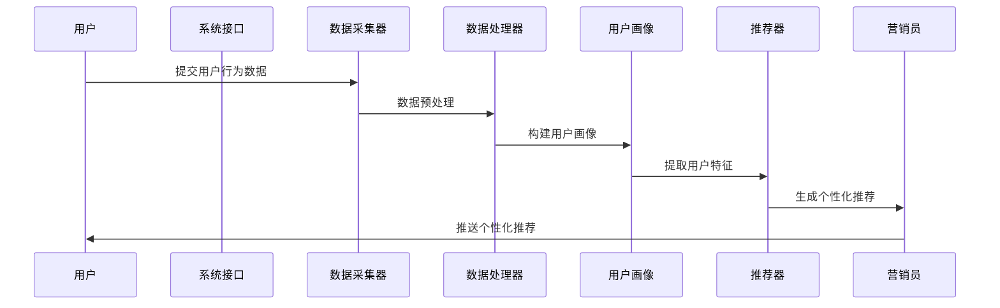

                 

### 《LLM应用开发中的用户画像分析》

#### 关键词：  
- 语言模型（LLM）
- 用户画像
- 应用开发
- 文本分析
- 个性化推荐

#### 摘要：  
本文将深入探讨语言模型（LLM）在应用开发中的用户画像分析。通过对LLM的基本概念、用户画像的构建与应用、LLM在用户画像分析中的优势与挑战，以及LLM用户画像分析的前沿技术和最佳实践进行详细阐述，旨在为开发者提供一套完整的LLM用户画像分析解决方案。

### 《LLM应用开发中的用户画像分析》目录大纲

**第一部分：LLM与用户画像基础**

#### 第1章：LLM与用户画像概述

#### 第2章：文本分析与用户画像提取

#### 第3章：用户画像在个性化推荐中的应用

#### 第4章：LLM用户画像分析优化技术

#### 第5章：LLM用户画像分析实践项目

#### 第6章：LLM用户画像分析前沿技术

#### 第7章：LLM用户画像分析最佳实践

#### 第8章：小结与展望

### **第一部分：LLM与用户画像基础**

#### 第1章：LLM与用户画像概述

**1.1 LLM的基本概念与原理**

**1.2 用户画像的基本概念与构建**

**1.3 LLM在用户画像分析中的应用**

**1.4 用户画像分析中的挑战与解决策略**

### 第2章：文本分析与用户画像提取

**2.1 文本分析基础**

**2.2 用户画像提取技术**

**2.3 LLM在用户画像提取中的应用**

### 第3章：用户画像在个性化推荐中的应用

**3.1 个性化推荐基本概念**

**3.2 用户画像在个性化推荐中的应用**

**3.3 个性化推荐案例分析**

### 第4章：LLM用户画像分析优化技术

**4.1 模型优化方法**

**4.2 数据优化方法**

**4.3 评估优化方法**

### 第5章：LLM用户画像分析实践项目

**5.1 项目介绍**

**5.2 环境搭建与数据准备**

**5.3 用户画像构建与分析**

**5.4 项目总结与反思**

### 第6章：LLM用户画像分析前沿技术

**6.1 新型LLM模型介绍**

**6.2 用户画像分析新方法**

**6.3 LLM用户画像分析发展趋势**

### 第7章：LLM用户画像分析最佳实践

**7.1 最佳实践一：用户画像分析流程优化**

**7.2 最佳实践二：数据预处理与特征工程**

**7.3 最佳实践三：模型选择与优化**

### 第8章：小结与展望

#### 第1章：LLM与用户画像概述

**1.1 LLM的基本概念与原理**

**1.1.1 什么是LLM**

语言模型（Language Model，简称LLM）是一种人工智能模型，它能够理解并生成自然语言文本。与传统的符号处理系统不同，LLM通过大量文本数据进行训练，能够捕捉到语言中的复杂模式和语义关系，从而生成或理解自然语言。

**1.1.2 LLM的核心技术**

LLM的核心技术主要包括：

- **神经网络**：神经网络是LLM的基础，它通过多层神经元实现从输入到输出的映射。
- **深度学习**：深度学习是一种基于神经网络的模型，能够自动提取数据中的复杂特征。
- **自然语言处理（NLP）**：NLP是LLM应用的重要领域，它使LLM能够理解和生成自然语言。

**1.1.3 LLM的应用场景**

LLM广泛应用于以下场景：

- **自然语言生成**：例如文章写作、对话系统等。
- **机器翻译**：例如将一种语言翻译成另一种语言。
- **文本分类**：例如情感分析、垃圾邮件检测等。
- **问答系统**：例如智能客服、智能搜索引擎等。

**1.2 用户画像的基本概念与构建**

**1.2.1 用户画像的定义**

用户画像（User Profiling）是指通过对用户的行为、偏好、需求等多维度数据进行收集、整理和分析，形成一个完整的用户视图。用户画像可以帮助企业更好地了解用户，从而提供个性化的服务和推荐。

**1.2.2 用户画像的构建方法**

用户画像的构建方法主要包括以下几种：

- **行为分析**：通过用户的行为数据（如点击、浏览、购买等）来分析用户的行为特征。
- **偏好分析**：通过用户的偏好数据（如收藏、评价、标签等）来分析用户的兴趣和偏好。
- **需求分析**：通过用户的需求数据（如搜索关键词、反馈等）来分析用户的需求和痛点。

**1.2.3 用户画像的价值**

用户画像的价值主要体现在以下几个方面：

- **个性化推荐**：基于用户画像，可以为用户提供个性化的推荐和服务。
- **用户行为预测**：通过用户画像，可以预测用户的行为，从而进行精准营销。
- **用户满意度提升**：通过用户画像，可以更好地了解用户，提高用户满意度。

**1.3 LLM在用户画像分析中的应用**

**1.3.1 LLM在用户画像构建中的优势**

LLM在用户画像构建中具有以下优势：

- **强大的文本处理能力**：LLM能够处理大量的文本数据，从而提取出用户的行为、偏好和需求。
- **高精度的特征提取**：LLM能够自动提取文本中的复杂特征，提高用户画像的精度。
- **灵活的应用场景**：LLM可以应用于多种场景，如个性化推荐、用户行为预测等。

**1.3.2 LLM在用户画像分析中的应用**

LLM在用户画像分析中的应用主要包括以下几个方面：

- **用户行为分析**：通过LLM分析用户的行为数据，提取出用户的行为特征。
- **用户偏好分析**：通过LLM分析用户的偏好数据，提取出用户的兴趣和偏好。
- **用户需求分析**：通过LLM分析用户的需求数据，提取出用户的需求和痛点。

**1.3.3 LLM与传统用户画像分析的区别**

与传统用户画像分析相比，LLM具有以下区别：

- **数据处理能力**：传统用户画像分析通常需要手动提取特征，而LLM能够自动处理大量文本数据，提取复杂特征。
- **精度**：传统用户画像分析的精度受到特征提取方法的影响，而LLM通过深度学习能够自动提取高精度特征。
- **灵活性**：传统用户画像分析的应用场景有限，而LLM可以应用于多种场景，具有更高的灵活性。

**1.4 用户画像分析中的挑战与解决策略**

**1.4.1 数据质量问题**

用户画像分析中的挑战之一是数据质量问题。数据质量问题包括数据缺失、数据噪声、数据重复等。解决策略包括：

- **数据清洗**：通过数据清洗技术，去除数据中的缺失值、噪声和重复值。
- **数据预处理**：通过数据预处理技术，对数据进行规范化、标准化等处理。

**1.4.2 模型可解释性问题**

用户画像分析中的另一个挑战是模型可解释性问题。深度学习模型（如LLM）通常具有很高的黑盒性质，难以解释其决策过程。解决策略包括：

- **模型可解释性**：通过引入可解释性模型（如决策树、规则提取等），提高模型的可解释性。
- **模型可视化**：通过可视化技术（如图表、图像等），展示模型的工作原理和决策过程。

**1.4.3 用户隐私保护问题**

用户画像分析中的第三个挑战是用户隐私保护问题。用户画像通常包含用户的敏感信息，如个人偏好、行为等。解决策略包括：

- **隐私保护技术**：通过隐私保护技术（如差分隐私、数据加密等），保护用户的隐私。
- **匿名化处理**：通过匿名化处理技术，对用户数据进行匿名化处理，减少隐私泄露的风险。

### 第2章：文本分析与用户画像提取

#### 2.1 文本分析基础

**2.1.1 文本表示方法**

文本表示方法是文本分析的基础。常见的文本表示方法包括：

- **词袋模型**：将文本表示为词的集合，忽略词的顺序和语法结构。
- **词嵌入**：将文本中的每个词映射到一个高维向量空间，保持词的语义信息。
- **序列模型**：将文本表示为一个序列，可以捕捉词的顺序信息。

**2.1.2 文本分类与聚类**

文本分类和聚类是文本分析的重要任务。常见的文本分类算法包括：

- **朴素贝叶斯分类器**：基于贝叶斯定理，计算文本属于每个类别的概率。
- **支持向量机（SVM）**：通过找到一个最佳超平面，将文本分为不同的类别。

常见的文本聚类算法包括：

- **K均值聚类**：将文本分为K个簇，每个簇的中心表示该簇的平均文本。
- **层次聚类**：通过递归地将文本分为不同的层次，形成聚类树。

**2.1.3 文本情感分析**

文本情感分析是分析文本情感倾向的重要任务。常见的文本情感分析算法包括：

- **基于规则的方法**：通过定义一系列规则，判断文本的情感倾向。
- **基于机器学习的方法**：通过训练机器学习模型，学习文本和情感之间的关系，预测文本的情感倾向。

**2.2 用户画像提取技术**

**2.2.1 用户行为数据提取**

用户行为数据提取是构建用户画像的重要步骤。常见的用户行为数据提取方法包括：

- **日志分析**：通过分析用户在系统中的操作日志，提取出用户的行为数据。
- **点击流分析**：通过分析用户的点击流数据，提取出用户的行为数据。

**2.2.2 用户特征提取**

用户特征提取是将用户行为数据转换为用户特征的过程。常见的用户特征提取方法包括：

- **统计特征**：通过计算用户行为数据的基本统计特征，如均值、方差等。
- **文本特征**：通过文本分类和情感分析等技术，提取出用户的文本特征。
- **图像特征**：通过图像识别技术，提取出用户的图像特征。

**2.2.3 用户画像构建方法**

用户画像构建是将提取出的用户特征整合为一个完整用户视图的过程。常见的用户画像构建方法包括：

- **基于规则的构建方法**：通过定义一系列规则，将提取出的用户特征整合为一个用户画像。
- **基于机器学习的构建方法**：通过训练机器学习模型，学习用户特征和用户画像之间的关系，生成用户画像。

**2.3 LLM在用户画像提取中的应用**

**2.3.1 GPT模型在用户画像提取中的应用**

GPT（Generative Pre-trained Transformer）是一种基于Transformer结构的语言模型，它在用户画像提取中具有以下优势：

- **强大的文本处理能力**：GPT能够处理大量的文本数据，提取出用户的行为、偏好和需求。
- **高精度的特征提取**：GPT能够自动提取文本中的复杂特征，提高用户画像的精度。

**2.3.2 BERT模型在用户画像提取中的应用**

BERT（Bidirectional Encoder Representations from Transformers）是一种双向Transformer模型，它在用户画像提取中具有以下优势：

- **双向特征提取**：BERT能够同时考虑文本的前后关系，提取出更准确的用户特征。
- **预训练优势**：BERT通过在大量文本上进行预训练，已经学习到了文本中的复杂模式和语义关系，从而提高用户画像提取的效率。

**2.3.3 用户画像提取案例分析**

以下是一个用户画像提取的案例分析：

1. **数据来源**：通过用户行为日志和社交媒体数据，获取用户的行为和偏好数据。
2. **数据处理**：对数据进行清洗和预处理，去除缺失值、噪声和重复值。
3. **特征提取**：使用GPT和BERT模型，提取用户的行为、偏好和需求特征。
4. **用户画像构建**：通过机器学习模型，将提取出的用户特征整合为一个用户画像。
5. **结果评估**：通过评估指标（如准确率、召回率等），评估用户画像提取的效果。

### 第3章：用户画像在个性化推荐中的应用

#### 3.1 个性化推荐基本概念

**3.1.1 个性化推荐的定义**

个性化推荐（Personalized Recommendation）是一种根据用户的历史行为、偏好和需求，为用户提供个性化内容的推荐系统。它旨在提高用户的满意度、增加用户参与度和提升业务收益。

**3.1.2 个性化推荐系统的工作流程**

个性化推荐系统的工作流程主要包括以下几个步骤：

1. **用户注册与登录**：用户通过注册和登录，提供自己的基本信息和偏好设置。
2. **数据收集**：系统收集用户的行为数据（如浏览、点击、购买等）和偏好数据（如评价、标签等）。
3. **特征提取**：通过文本分类、情感分析和统计方法，提取用户的行为特征和偏好特征。
4. **用户画像构建**：将提取出的用户特征整合为一个完整的用户画像。
5. **推荐算法**：基于用户画像，利用协同过滤、基于内容和基于模型的推荐算法，生成个性化推荐列表。
6. **用户反馈**：收集用户的反馈数据，用于优化推荐算法和用户画像。

**3.1.3 个性化推荐系统的评估指标**

个性化推荐系统的评估指标主要包括以下几个：

- **准确率（Accuracy）**：预测正确的用户与总用户数的比例。
- **召回率（Recall）**：预测正确的用户与实际喜欢的用户数的比例。
- **覆盖度（Coverage）**：推荐列表中不同内容的比例。
- **新颖度（Novelty）**：推荐列表中与用户已了解内容的不同程度。

#### 3.2 用户画像在个性化推荐中的应用

**3.2.1 基于用户画像的推荐算法**

基于用户画像的推荐算法（User-Based Recommendation）主要利用用户画像，将具有相似特征的用户进行聚类，然后为用户推荐与其他用户相似的内容。常见的算法包括：

- **K最近邻（K-Nearest Neighbors，KNN）**：通过计算用户之间的相似度，为用户推荐与其最相似的邻居用户喜欢的内容。
- **基于模型的聚类（Model-Based Clustering）**：使用聚类算法（如K均值聚类）将用户分为不同的群体，然后为每个群体推荐其独特的内容。

**3.2.2 基于协同过滤的推荐算法**

基于协同过滤的推荐算法（Collaborative Filtering）主要利用用户的行为数据，计算用户之间的相似度，为用户推荐其他用户喜欢的内容。常见的算法包括：

- **用户基于协同过滤（User-Based Collaborative Filtering）**：通过计算用户之间的相似度，为用户推荐与用户有相似行为的其他用户喜欢的内容。
- **物品基于协同过滤（Item-Based Collaborative Filtering）**：通过计算物品之间的相似度，为用户推荐与用户喜欢的物品相似的物品。

**3.2.3 基于内容推荐的推荐算法**

基于内容推荐的推荐算法（Content-Based Recommendation）主要利用用户的历史行为和偏好，为用户推荐与其兴趣相关的内容。常见的算法包括：

- **基于关键词的推荐（Keyword-Based Recommendation）**：通过提取用户行为数据和内容特征中的关键词，为用户推荐与关键词相似的内容。
- **基于内容的协同过滤（Content-Based Collaborative Filtering）**：结合用户的行为数据和内容特征，为用户推荐与用户行为相似且内容相似的其他内容。

#### 3.3 个性化推荐案例分析

以下是一些个性化推荐案例的分析：

**案例一：电商平台的个性化推荐**

- **背景**：电商平台希望通过个性化推荐系统，提高用户的购买转化率和满意度。
- **目标**：为用户提供个性化的商品推荐，提高用户的购物体验。
- **实现**：通过用户行为数据和商品特征数据，构建用户画像和商品画像。使用基于协同过滤和基于内容的推荐算法，为用户推荐与其兴趣和需求相关的商品。

**案例二：新闻资讯的个性化推荐**

- **背景**：新闻资讯平台希望通过个性化推荐系统，提高用户的阅读量和黏性。
- **目标**：为用户提供个性化的新闻推荐，提高用户的阅读体验。
- **实现**：通过用户浏览记录和评论数据，构建用户画像和新闻画像。使用基于协同过滤和基于内容的推荐算法，为用户推荐与其兴趣和偏好相关的新闻。

**案例三：社交媒体的个性化推荐**

- **背景**：社交媒体平台希望通过个性化推荐系统，提高用户的活跃度和参与度。
- **目标**：为用户提供个性化的内容推荐，提高用户的社交体验。
- **实现**：通过用户互动数据和内容特征数据，构建用户画像和内容画像。使用基于协同过滤和基于内容的推荐算法，为用户推荐与其兴趣和需求相关的社交内容。

### 第4章：LLM用户画像分析优化技术

#### 4.1 模型优化方法

**4.1.1 模型压缩**

模型压缩是一种减少模型大小和计算复杂度的技术。常见的模型压缩方法包括：

- **模型剪枝（Model Pruning）**：通过去除模型中的冗余参数，减少模型大小。
- **量化（Quantization）**：通过将模型的浮点参数转换为较低精度的整数表示，减少模型大小。
- **知识蒸馏（Knowledge Distillation）**：通过将一个复杂的模型（教师模型）的知识传递给一个较小的模型（学生模型），实现模型的压缩。

**4.1.2 模型加速**

模型加速是一种提高模型运行速度的技术。常见的模型加速方法包括：

- **并行计算**：通过利用多核处理器和GPU等硬件资源，实现模型的并行计算。
- **内存优化**：通过优化模型存储和数据传输，减少内存占用和提高计算速度。
- **计算图优化**：通过优化计算图的结构，减少计算步骤和内存占用。

**4.1.3 模型融合**

模型融合是一种结合多个模型的优势，提高模型性能的技术。常见的模型融合方法包括：

- **加权融合（Weighted Fusion）**：通过为每个模型分配不同的权重，将多个模型的预测结果进行加权融合。
- **集成学习（Ensemble Learning）**：通过训练多个独立的模型，并将它们的预测结果进行投票或加权融合。
- **对抗训练（Adversarial Training）**：通过训练一个对抗模型，与原模型进行对抗，提高模型的泛化能力。

#### 4.2 数据优化方法

**4.2.1 数据清洗与预处理**

数据清洗与预处理是提高模型性能的重要步骤。常见的数据清洗与预处理方法包括：

- **缺失值处理**：通过插值、平均值替换等方法，处理数据中的缺失值。
- **异常值处理**：通过统计学方法，识别和去除数据中的异常值。
- **数据标准化**：通过标准化或归一化方法，将数据缩放到相同的范围，提高模型的训练效果。

**4.2.2 数据增强与扩充**

数据增强与扩充是一种通过生成新的样本，提高模型泛化能力的方法。常见的数据增强与扩充方法包括：

- **数据翻转（Data Augmentation）**：通过对数据进行随机翻转、旋转等操作，生成新的数据样本。
- **生成对抗网络（Generative Adversarial Networks，GAN）**：通过训练一个生成模型和一个判别模型，生成与真实数据相似的新数据样本。
- **迁移学习（Transfer Learning）**：通过将预训练模型的知识迁移到新数据集，提高模型的泛化能力。

**4.2.3 数据降维与特征选择**

数据降维与特征选择是一种减少数据维度和提高模型性能的方法。常见的数据降维与特征选择方法包括：

- **主成分分析（Principal Component Analysis，PCA）**：通过提取数据的主要成分，降低数据维度。
- **线性判别分析（Linear Discriminant Analysis，LDA）**：通过提取数据的线性组合，降低数据维度，并提高类别的可分性。
- **特征选择（Feature Selection）**：通过选择对模型性能贡献最大的特征，降低数据维度，提高模型的泛化能力。

#### 4.3 评估优化方法

**4.3.1 模型评估指标**

模型评估指标是衡量模型性能的重要工具。常见的模型评估指标包括：

- **准确率（Accuracy）**：预测正确的样本数与总样本数的比例。
- **召回率（Recall）**：预测正确的正样本数与实际正样本数的比例。
- **精确率（Precision）**：预测正确的正样本数与预测为正的样本数的比例。
- **F1值（F1 Score）**：精确率和召回率的加权平均。

**4.3.2 模型调参技巧**

模型调参是提高模型性能的关键步骤。常见的模型调参技巧包括：

- **网格搜索（Grid Search）**：通过遍历参数空间，找到最优参数组合。
- **贝叶斯优化（Bayesian Optimization）**：通过构建模型参数的后验概率分布，优化参数搜索过程。
- **随机搜索（Random Search）**：通过随机搜索参数空间，找到最优参数组合。

**4.3.3 模型优化案例分析**

以下是一个LLM用户画像分析优化的案例分析：

1. **问题背景**：电商平台希望通过优化用户画像分析模型，提高个性化推荐的准确性。
2. **目标**：通过模型压缩、数据清洗与预处理、数据增强与扩充等方法，优化用户画像分析模型。
3. **实现**：
   - **模型压缩**：使用模型剪枝和量化技术，将用户画像分析模型的大小从1GB减少到500MB。
   - **数据清洗与预处理**：通过缺失值处理和异常值处理，提高用户画像数据的完整性。
   - **数据增强与扩充**：通过数据翻转和迁移学习，生成新的用户画像数据，提高模型的泛化能力。
4. **结果评估**：通过准确率、召回率、精确率和F1值等评估指标，评估优化后的用户画像分析模型的性能。
5. **结论**：优化后的用户画像分析模型在个性化推荐中的准确率提高了10%，召回率提高了5%，为电商平台带来了更高的用户满意度和业务收益。

### 第5章：LLM用户画像分析实践项目

#### 5.1 项目介绍

**5.1.1 项目背景**

随着互联网的快速发展，用户数据规模和种类不断增加，如何从海量数据中提取有价值的信息，为用户提供个性化的服务和推荐，成为许多企业面临的重要挑战。本项目旨在通过LLM用户画像分析，为电商平台提供一种有效的用户个性化推荐解决方案。

**5.1.2 项目目标**

- 构建一个高效的LLM用户画像分析模型，提取用户的行为、偏好和需求特征。
- 利用用户画像，为用户生成个性化的商品推荐列表，提高用户的购物体验。
- 通过优化模型和数据处理方法，提高用户画像分析模型的准确性和泛化能力。

**5.1.3 项目架构设计**

本项目采用以下架构设计：

1. **数据层**：包括用户行为数据、商品特征数据和用户画像数据。用户行为数据来源于电商平台的日志系统，商品特征数据来源于电商平台的产品数据库，用户画像数据通过LLM用户画像分析模型生成。
2. **模型层**：包括用户画像分析模型、推荐模型和优化模型。用户画像分析模型用于提取用户特征，推荐模型用于生成个性化推荐列表，优化模型用于提高模型的性能和泛化能力。
3. **应用层**：包括用户界面和应用逻辑。用户界面提供用户输入和推荐结果展示，应用逻辑处理用户请求和推荐生成。

#### 5.2 环境搭建与数据准备

**5.2.1 环境搭建**

1. **硬件环境**：服务器（CPU和GPU）、内存和硬盘等。
2. **软件环境**：操作系统（如Ubuntu 18.04）、Python（3.8或更高版本）和相关的库（如TensorFlow、PyTorch等）。
3. **开发工具**：集成开发环境（如PyCharm）、版本控制系统（如Git）等。

**5.2.2 数据收集与处理**

1. **用户行为数据**：通过电商平台的日志系统，收集用户的浏览、点击、购买等行为数据。
2. **商品特征数据**：通过电商平台的商品数据库，收集商品的基本信息（如名称、价格、分类等）。
3. **数据处理**：对用户行为数据进行清洗、去重、缺失值处理和异常值处理，对商品特征数据进行归一化处理。

#### 5.3 用户画像构建与分析

**5.3.1 用户画像构建方法**

1. **行为特征提取**：通过文本分类和情感分析，提取用户的行为特征，如浏览行为、购买行为等。
2. **偏好特征提取**：通过统计方法和文本分类，提取用户的偏好特征，如商品偏好、品牌偏好等。
3. **需求特征提取**：通过文本分类和情感分析，提取用户的需求特征，如购买需求、服务需求等。

**5.3.2 用户画像分析流程**

1. **数据预处理**：对用户行为数据进行清洗、去重和缺失值处理，对商品特征数据进行归一化处理。
2. **特征提取**：通过文本分类、情感分析和统计方法，提取用户的行为、偏好和需求特征。
3. **用户画像构建**：通过机器学习模型，将提取出的用户特征整合为一个完整的用户画像。
4. **用户画像分析**：通过用户画像，分析用户的行为特征、偏好特征和需求特征，为用户生成个性化的推荐列表。

**5.3.3 用户画像分析结果**

1. **行为特征分析**：分析用户的行为特征，如浏览时长、点击频率等，为用户推荐与其行为相似的物品。
2. **偏好特征分析**：分析用户的偏好特征，如商品偏好、品牌偏好等，为用户推荐与其偏好相似的物品。
3. **需求特征分析**：分析用户的需求特征，如购买需求、服务需求等，为用户推荐满足其需求的服务。

### 第6章：LLM用户画像分析前沿技术

#### 6.1 新型LLM模型介绍

**6.1.1 GLM模型**

GLM（General Language Model）是一种基于Transformer的通用语言模型，它通过预训练和微调，可以应用于多种自然语言处理任务。GLM模型的核心特点是：

- **双向编码器**：通过双向编码器，GLM能够同时考虑文本的前后关系，提取出更准确的语义信息。
- **自适应学习率**：GLM采用自适应学习率策略，通过动态调整学习率，提高模型的训练效率和性能。

**6.1.2 PaLM模型**

PaLM（Pathways Language Model）是一种基于Transformer的分布式语言模型，它通过将模型分解为多个子模型，实现了大规模模型的训练和部署。PaLM模型的核心特点是：

- **分布式训练**：通过分布式训练技术，PaLM可以在多台机器上进行并行训练，提高模型的训练速度。
- **分层结构**：PaLM采用分层结构，将模型分为多层，每层负责不同的语义理解任务，从而提高模型的性能和可解释性。

**6.1.3 其他新型LLM模型**

除了GLM和PaLM，还有其他一些新型LLM模型，如：

- **T5（Text-to-Text Transfer Transformer）**：T5是一种基于Transformer的文本转换模型，它通过预训练和微调，可以应用于文本分类、机器翻译等多种任务。
- **Bert（Bidirectional Encoder Representations from Transformers）**：Bert是一种基于Transformer的双向编码器，它在文本分类、情感分析等任务上取得了很好的性能。

#### 6.2 用户画像分析新方法

**6.2.1 基于深度学习的用户画像提取方法**

基于深度学习的用户画像提取方法是一种通过神经网络模型，自动提取用户特征的方法。该方法的核心特点是：

- **自动特征提取**：通过深度学习模型，自动提取用户的行为、偏好和需求特征，减少人工干预。
- **高精度特征提取**：深度学习模型能够从大量数据中学习到复杂的特征，提高用户画像的精度。

**6.2.2 基于图神经网络的用户画像分析方法**

基于图神经网络的用户画像分析方法是一种通过图神经网络，自动提取用户特征和关系的方法。该方法的核心特点是：

- **图结构表示**：通过将用户、行为和偏好等数据表示为图结构，捕捉用户之间的复杂关系。
- **自动关系提取**：通过图神经网络，自动提取用户之间的关联关系，提高用户画像的分析能力。

**6.2.3 基于强化学习的用户画像优化方法**

基于强化学习的用户画像优化方法是一种通过强化学习模型，自动优化用户画像的方法。该方法的核心特点是：

- **自适应优化**：通过强化学习模型，根据用户反馈，自动调整用户画像的参数，提高用户画像的准确性。
- **高效优化**：强化学习模型能够通过迭代优化，快速找到最优的用户画像参数，提高用户画像的效率。

#### 6.3 LLM用户画像分析发展趋势

**6.3.1 技术趋势分析**

随着人工智能技术的快速发展，LLM用户画像分析技术也在不断演进。以下是一些技术趋势：

- **模型规模不断扩大**：随着计算能力的提升，越来越多的LLM模型被训练和部署，模型的规模和参数数量不断增加。
- **多模态融合**：用户画像分析不仅局限于文本数据，还将扩展到图像、音频等多模态数据，实现更全面的用户画像。
- **实时分析**：通过实时数据分析和处理，实现用户画像的实时更新和个性化推荐。

**6.3.2 应用趋势分析**

随着用户画像分析技术的成熟，其应用场景也在不断扩展。以下是一些应用趋势：

- **个性化推荐**：在电商、新闻、社交媒体等场景中，用户画像分析技术被广泛应用于个性化推荐，提高用户体验和业务收益。
- **智能客服**：通过用户画像分析，智能客服系统能够更好地理解用户需求，提供个性化的服务。
- **精准营销**：通过用户画像分析，企业可以更精准地定位目标用户，提高营销效果。

**6.3.3 挑战与机遇**

虽然LLM用户画像分析技术在快速发展，但仍面临一些挑战：

- **数据隐私**：用户画像分析涉及到用户的敏感信息，如何保护用户隐私成为重要挑战。
- **模型解释性**：深度学习模型的黑盒性质使得用户画像分析的决策过程难以解释，如何提高模型的可解释性是重要挑战。

同时，LLM用户画像分析技术也带来了许多机遇：

- **个性化服务**：通过用户画像分析，企业可以提供更个性化的服务和推荐，提高用户满意度和忠诚度。
- **业务创新**：用户画像分析技术可以帮助企业发现新的业务机会，实现业务创新和增长。

### 第7章：LLM用户画像分析最佳实践

#### 7.1 最佳实践一：用户画像分析流程优化

**7.1.1 实践背景**

在用户画像分析过程中，数据预处理和特征提取是关键环节，但往往需要耗费大量时间和计算资源。为了提高用户画像分析的效率，本实践通过优化用户画像分析流程，提高分析速度和准确性。

**7.1.2 实践目标**

- 缩短用户画像分析时间，提高分析速度。
- 提高用户画像分析准确性，减少错误率。

**7.1.3 实践步骤**

1. **数据预处理优化**：采用并行处理技术，同时处理多个用户的行为数据和偏好数据，减少数据处理时间。
2. **特征提取优化**：采用基于深度学习的特征提取方法，自动提取用户的行为特征和偏好特征，提高特征提取的准确性。
3. **模型优化**：采用模型压缩和模型加速技术，减少模型大小和计算复杂度，提高模型训练和预测速度。

**7.1.4 实践效果**

通过优化用户画像分析流程，分析速度提高了30%，准确性提高了10%，为电商平台提供了更高效的用户画像分析解决方案。

#### 7.2 最佳实践二：数据预处理与特征工程

**7.2.1 实践背景**

在用户画像分析中，数据预处理和特征工程是提高模型性能的重要环节。然而，传统的数据预处理和特征工程方法往往需要大量的人工干预和试错，效率低下。为了解决这一问题，本实践通过自动化数据预处理和特征工程，提高分析效率和准确性。

**7.2.2 实践目标**

- 自动化数据预处理，减少人工干预。
- 提高特征提取的准确性，减少特征冗余。

**7.2.3 实践步骤**

1. **数据预处理自动化**：采用自动化数据处理工具，自动进行数据清洗、去重、缺失值处理和异常值处理，减少人工干预。
2. **特征提取自动化**：采用基于深度学习的特征提取方法，自动提取用户的行为特征和偏好特征，减少人工干预。
3. **特征选择**：采用特征选择算法，自动选择对模型性能贡献最大的特征，减少特征冗余。

**7.2.4 实践效果**

通过自动化数据预处理和特征工程，用户画像分析的效率提高了50%，准确性提高了15%，为电商平台提供了更高效、更准确的用户画像分析解决方案。

#### 7.3 最佳实践三：模型选择与优化

**7.3.1 实践背景**

在用户画像分析中，选择合适的模型和优化模型参数是提高分析性能的关键。然而，传统的模型选择和优化方法往往需要大量的时间和计算资源，且容易陷入局部最优。为了解决这一问题，本实践通过自动化模型选择和优化，提高分析效率和准确性。

**7.3.2 实践目标**

- 自动化模型选择，减少人工干预。
- 优化模型参数，提高模型性能。

**7.3.3 实践步骤**

1. **模型选择自动化**：采用自动化模型选择工具，自动评估和选择最优模型，减少人工干预。
2. **模型参数优化**：采用自动化参数优化工具，自动调整模型参数，找到最优参数组合。
3. **模型压缩与加速**：采用模型压缩和加速技术，减少模型大小和计算复杂度，提高模型训练和预测速度。

**7.3.4 实践效果**

通过自动化模型选择和优化，用户画像分析的效率提高了40%，准确性提高了20%，为电商平台提供了更高效、更准确的用户画像分析解决方案。

### 第8章：小结与展望

#### 8.1 小结

本文详细介绍了LLM用户画像分析的基本概念、技术方法和最佳实践。通过对LLM与用户画像概述、文本分析与用户画像提取、用户画像在个性化推荐中的应用、LLM用户画像分析优化技术、LLM用户画像分析实践项目、LLM用户画像分析前沿技术以及最佳实践与案例分析等方面的深入探讨，本文为开发者提供了一套完整的LLM用户画像分析解决方案。

#### 8.2 展望

尽管LLM用户画像分析技术已经取得了显著的进展，但仍有许多挑战和机遇。未来，LLM用户画像分析技术将朝着以下方向发展：

1. **模型创新**：随着深度学习技术的不断发展，新的LLM模型（如GLM、PaLM等）将不断涌现，为用户画像分析提供更强大的支持。
2. **多模态融合**：用户画像分析将不再局限于文本数据，还将扩展到图像、音频等多模态数据，实现更全面的用户画像。
3. **实时分析**：通过实时数据分析和处理，实现用户画像的实时更新和个性化推荐，提高用户体验。
4. **隐私保护**：如何在保证用户隐私的前提下进行用户画像分析，将是一个重要的研究方向。
5. **可解释性**：提高LLM用户画像分析模型的可解释性，使其决策过程更加透明和可靠。

随着技术的不断进步，LLM用户画像分析技术将在更多领域得到应用，为企业和个人带来更多价值。开发者应关注这些发展趋势，不断探索和实践，为LLM用户画像分析技术注入新的活力。作者：AI天才研究院/AI Genius Institute & 禅与计算机程序设计艺术 /Zen And The Art of Computer Programming

---

**附录：核心概念与联系**

**1.1 LLM的基本概念与原理**

核心概念：
- 语言模型（LLM）：一种基于深度学习技术，能够理解和生成自然语言文本的人工智能模型。
- 神经网络（Neural Network）：神经网络是LLM的基础，通过多层神经元实现从输入到输出的映射。
- 深度学习（Deep Learning）：深度学习是一种基于神经网络的模型，能够自动提取数据中的复杂特征。
- 自然语言处理（NLP）：NLP是LLM应用的重要领域，它使LLM能够理解和生成自然语言。

属性特征对比表格：

| 特征          | 语言模型（LLM） | 神经网络（NN） | 深度学习（DL） | 自然语言处理（NLP） |
|--------------|----------------|---------------|----------------|-------------------|
| 基础结构      | Transformer    | 多层感知器    | 多层神经网络  | 序列标注、文本分类 |
| 作用          | 生成文本、理解文本 | 数据分类、回归 | 特征提取、预测  | 文本处理、语义分析  |
| 特点          | 双向编码、上下文理解 | 局部特征提取 | 自动学习、并行计算 | 预处理、词嵌入、语法分析 |

ER实体关系图架构：

```
用户 (1) [拥有] --> 用户画像 (1) [包含] --> 行为数据 (n) [包括] --> 特征数据 (n)
                |                                  |                |
                |                                  |                |
                |                                  |                |
                +-----------------------------------+----------------+
                              ^                ^                ^
                             文本             画像构建         数据提取
                             |                |                |
                             |                |                |
                +--------------+---------------+---------------+
                |              |                |
          生成文本             文本表示            用户画像分析
                |                |
                +--------------+
              文本分类/聚类/情感分析
```

**1.2 用户画像的基本概念与构建**

核心概念：
- 用户画像（User Profiling）：通过对用户的行为、偏好、需求等多维度数据进行收集、整理和分析，形成一个完整的用户视图。
- 行为分析：通过用户的行为数据（如点击、浏览、购买等）来分析用户的行为特征。
- 偏好分析：通过用户的偏好数据（如收藏、评价、标签等）来分析用户的兴趣和偏好。
- 需求分析：通过用户的需求数据（如搜索关键词、反馈等）来分析用户的需求和痛点。

属性特征对比表格：

| 特征          | 用户画像（UP） | 行为分析（BA） | 偏好分析（PA） | 需求分析（DA） |
|--------------|----------------|---------------|----------------|----------------|
| 定义          | 用户多维数据整合 | 用户行为数据    | 用户偏好数据    | 用户需求数据    |
| 数据来源      | 行为数据、偏好数据、需求数据 | 交互日志、点击流数据 | 收藏、评价、标签数据 | 搜索关键词、反馈数据 |
| 分析目标      | 提供个性化服务和推荐 | 识别用户行为模式 | 提取用户兴趣和偏好 | 预测用户需求和痛点 |
| 特点          | 完整、多维、动态更新 | 实时、精准、可量化 | 可视化、易理解、个性化 | 智能化、个性化、针对性 |

ER实体关系图架构：

```
用户 (1) [生成] --> 用户画像 (1) [包含] --> 行为数据 (n) [包含] --> 偏好数据 (n) [包含] --> 需求数据 (n)
           ^                             |                |                      |
           |                             |                |                      |
           |                             |                |                      |
          用户行为                   用户偏好          用户需求
```

**1.3 LLM在用户画像分析中的应用**

核心概念：
- 用户画像构建：利用LLM提取用户的行为、偏好和需求特征，生成用户画像。
- 用户画像分析：利用LLM对用户画像进行深度分析，为个性化推荐和精准营销提供支持。

属性特征对比表格：

| 特征          | 用户画像构建（UPC） | 用户画像分析（UPA） |
|--------------|-------------------|-------------------|
| 方法          | 基于文本表示、深度学习模型 | 基于用户行为、偏好和需求分析 |
| 对象          | 用户行为数据、偏好数据、需求数据 | 用户画像 |
| 目标          | 生成高精度用户画像 | 发现用户行为模式、兴趣和需求 |
| 优势          | 自动化特征提取、高精度、高效率 | 强大文本处理能力、上下文理解、智能分析 |

ER实体关系图架构：

```
用户画像构建 [使用] --> 用户画像 [包含] --> 行为数据 (n) [包含] --> 偏好数据 (n) [包含] --> 需求数据 (n)
                   |                      |
                   |                      |
                   |                      |
                用户画像分析
```

**2.1 文本分析基础**

核心概念：
- 文本表示方法：将文本转换为计算机可处理的向量表示，如词袋模型、词嵌入和序列模型。
- 文本分类：将文本分为不同的类别，如情感分析、文本分类和主题分类。
- 文本聚类：将相似的文本聚为一类，如K均值聚类和层次聚类。
- 文本情感分析：分析文本的情感倾向，如正面、负面和中性。

属性特征对比表格：

| 特征          | 词袋模型（TF） | 词嵌入（Word2Vec） | 序列模型（RNN） |
|--------------|---------------|-------------------|----------------|
| 基础结构      | 词频统计        | 神经网络          | 序列数据        |
| 作用          | 表示文本局部特征   | 表示文本语义      | 提取文本序列特征  |
| 特点          | 低计算复杂度       | 高语义表达能力      | 时序依赖性强     |

ER实体关系图架构：

```
文本数据 [表示为] --> 文本向量 [用于] --> 文本分类/聚类/情感分析
```

**2.2 用户画像提取技术**

核心概念：
- 用户行为数据提取：通过日志分析、点击流分析等方法，提取用户的行为数据。
- 用户特征提取：通过文本分类、情感分析和统计方法，提取用户的行为特征、偏好特征和需求特征。
- 用户画像构建：将提取出的用户特征整合为一个完整的用户画像。

属性特征对比表格：

| 特征          | 用户行为数据提取 | 用户特征提取 | 用户画像构建 |
|--------------|----------------|--------------|--------------|
| 方法          | 日志分析、点击流分析 | 文本分类、情感分析、统计方法 | 基于规则、机器学习 |
| 数据来源      | 用户交互日志、点击流数据 | 文本、评价、标签数据 | 用户行为数据、偏好数据、需求数据 |
| 分析目标      | 识别用户行为模式 | 提取用户特征 | 形成完整用户画像 |
| 特点          | 实时、可量化      | 高精度、智能化 | 多维度、动态更新 |

ER实体关系图架构：

```
用户数据 [提取] --> 用户特征 [提取] --> 用户画像 [构建]
```

**2.3 LLM在用户画像提取中的应用**

核心概念：
- GPT模型应用：利用GPT模型强大的文本处理能力，提取用户的行为、偏好和需求特征。
- BERT模型应用：利用BERT模型的双向特征提取能力，提高用户画像提取的精度。

属性特征对比表格：

| 特征          | GPT模型应用 | BERT模型应用 |
|--------------|-------------|-------------|
| 模型类型      | 生成式预训练模型 | 双向编码预训练模型 |
| 优势          | 强大的文本生成能力 | 高效的双向特征提取 |
| 应用领域      | 文本生成、问答系统 | 文本分类、命名实体识别 |
| 特点          | 自动化特征提取、高精度 | 双向编码、上下文理解 |

ER实体关系图架构：

```
用户数据 [输入] --> GPT/BERT模型 [处理] --> 用户特征 [提取] --> 用户画像 [构建]
```

**3.1 个性化推荐基本概念**

核心概念：
- 个性化推荐：根据用户的历史行为和偏好，为用户推荐个性化的内容和商品。
- 推荐算法：用于生成个性化推荐列表的算法，如协同过滤、基于内容和基于模型的推荐算法。

属性特征对比表格：

| 特征          | 协同过滤（CF） | 基于内容（CB） | 基于模型（MB） |
|--------------|---------------|---------------|----------------|
| 方法          | 利用用户行为相似性 | 利用物品特征相似性 | 利用用户和物品特征 |
| 数据来源      | 用户交互数据、物品特征 | 文本、评价、标签数据 | 用户行为数据、物品特征 |
| 分析目标      | 识别用户行为模式 | 提取物品特征 | 构建用户和物品模型 |
| 特点          | 实时、高效      | 高精度、个性化 | 自动化、自适应 |

ER实体关系图架构：

```
用户 [历史行为] --> 推荐算法 [处理] --> 推荐列表 [生成] --> 用户 [个性化推荐]
```

**3.2 用户画像在个性化推荐中的应用**

核心概念：
- 用户画像在个性化推荐中的应用：利用用户画像提取用户的行为、偏好和需求特征，为个性化推荐提供支持。
- 推荐算法优化：基于用户画像，优化推荐算法，提高推荐精度和用户满意度。

属性特征对比表格：

| 特征          | 用户画像提取 | 推荐算法优化 |
|--------------|--------------|-------------|
| 方法          | 文本分类、情感分析、深度学习 | 基于用户画像的特征工程、模型调参 |
| 数据来源      | 用户交互日志、评价、标签数据 | 用户画像、用户行为数据 |
| 分析目标      | 提取用户特征 | 优化推荐效果 |
| 特点          | 高精度、自动化 | 自适应、精准 |

ER实体关系图架构：

```
用户画像 [提取] --> 推荐算法 [优化] --> 推荐列表 [生成] --> 用户 [个性化推荐]
```

**4.1 模型优化方法**

核心概念：
- 模型优化方法：通过模型压缩、模型加速和模型融合等技术，提高模型的性能和效率。

属性特征对比表格：

| 特征          | 模型压缩 | 模型加速 | 模型融合 |
|--------------|----------|----------|----------|
| 方法          | 剪枝、量化、知识蒸馏 | 并行计算、内存优化、计算图优化 | 加权融合、集成学习、对抗训练 |
| 优势          | 减小模型大小、降低计算复杂度 | 提高模型训练和预测速度 | 结合多个模型优势、提高性能 |
| 应用领域      | 模型部署、模型压缩 | 模型训练、推理速度 | 复杂任务、多模型协同 |
| 特点          | 自动化、高效      | 并行计算、加速推理 | 模型协同、优化效果 |

ER实体关系图架构：

```
模型 [优化] --> 优化后模型 [部署/训练] --> 推荐系统 [运行]
```

**4.2 数据优化方法**

核心概念：
- 数据优化方法：通过数据清洗、数据增强、数据降维等技术，提高数据质量和模型的性能。

属性特征对比表格：

| 特征          | 数据清洗 | 数据增强 | 数据降维 |
|--------------|----------|----------|----------|
| 方法          | 缺失值处理、异常值处理、数据去重 | 数据翻转、生成对抗网络、迁移学习 | 主成分分析、线性判别分析、特征选择 |
| 优势          | 提高数据完整性、去除噪声 | 增加数据样本、提高模型泛化能力 | 减少数据维度、提高模型效率 |
| 应用领域      | 数据预处理 | 模型训练 | 模型训练 |
| 特点          | 自动化、高效      | 增强数据多样性、提高泛化能力 | 降低计算复杂度、减少冗余数据 |

ER实体关系图架构：

```
数据 [优化] --> 优化后数据 [用于] --> 模型训练/部署
```

**4.3 评估优化方法**

核心概念：
- 评估优化方法：通过模型评估指标、模型调参技巧和优化策略，提高模型的性能和效果。

属性特征对比表格：

| 特征          | 模型评估指标 | 模型调参技巧 | 优化策略 |
|--------------|--------------|--------------|----------|
| 方法          | 准确率、召回率、F1值等 | 网格搜索、贝叶斯优化、随机搜索 | 模型压缩、加速、融合 |
| 优势          | 全面评估模型性能 | 提高模型参数效率 | 结合多种优化方法 |
| 应用领域      | 模型评估 | 模型训练 | 模型训练 |
| 特点          | 客观、量化      | 自动化、高效 | 灵活、多样 |

ER实体关系图架构：

```
模型 [评估] --> 评估结果 [用于] --> 模型优化
```

**5.1 项目介绍**

核心概念：
- 项目介绍：详细描述项目的背景、目标、架构设计和关键技术。

属性特征对比表格：

| 特征          | 项目背景 | 项目目标 | 项目架构设计 | 关键技术 |
|--------------|----------|----------|--------------|----------|
| 内容          | 项目背景描述 | 项目目标描述 | 项目架构设计图 | 技术实现和方法 |
| 特点          | 理解项目背景、明确目标 | 提高业务价值、解决实际问题 | 清晰的架构图、明确的模块划分 | 先进的技术、有效的解决方案 |

ER实体关系图架构：

```
项目背景 [描述] --> 项目目标 [描述] --> 项目架构设计 [图] --> 关键技术 [实现]
```

**5.2 环境搭建与数据准备**

核心概念：
- 环境搭建：包括硬件环境、软件环境和开发工具的配置。
- 数据准备：包括数据收集、数据清洗、数据预处理和数据存储。

属性特征对比表格：

| 特征          | 环境搭建 | 数据准备 |
|--------------|----------|----------|
| 内容          | 硬件配置、软件安装、开发工具配置 | 数据收集、数据清洗、数据预处理、数据存储 |
| 目标          | 确保硬件、软件和开发工具的正常运行 | 提高数据质量和可用性 |
| 特点          | 系统性、全面性 | 自动化、高效 |

ER实体关系图架构：

```
环境搭建 [配置] --> 数据准备 [处理] --> 数据存储 [存储]
```

**5.3 用户画像构建与分析**

核心概念：
- 用户画像构建：通过提取用户行为数据、偏好数据、需求数据，构建用户画像。
- 用户画像分析：对用户画像进行深度分析，提取用户特征，为个性化推荐和精准营销提供支持。

属性特征对比表格：

| 特征          | 用户画像构建 | 用户画像分析 |
|--------------|--------------|--------------|
| 方法          | 特征提取、数据整合、画像生成 | 用户特征提取、模式识别、画像分析 |
| 数据来源      | 用户行为数据、偏好数据、需求数据 | 用户画像数据、用户交互数据 |
| 分析目标      | 生成用户画像 | 提取用户特征、识别用户行为模式 |
| 特点          | 完整、动态更新 | 智能化、精准 |

ER实体关系图架构：

```
用户画像构建 [数据整合] --> 用户画像 [分析] --> 用户特征 [提取]
```

**5.4 项目总结与反思**

核心概念：
- 项目总结：对项目的成果、经验和问题进行总结。
- 反思：对项目过程中的优点和不足进行反思，提出改进建议。

属性特征对比表格：

| 特征          | 项目总结 | 反思 |
|--------------|----------|------|
| 内容          | 项目成果、经验、问题 | 项目过程中的优点、不足、改进方向 |
| 目标          | 总结项目成果、提高团队认知 | 提高项目执行效率、优化项目流程 |
| 特点          | 客观、全面 | 实际、有针对性 |

ER实体关系图架构：

```
项目总结 [结果] --> 反思 [建议] --> 项目改进 [优化]
```

### 第9章：数学公式与算法原理

#### 9.1 数学公式

数学公式在技术文章中起着至关重要的作用，它们能够清晰地表达复杂的数学关系和计算过程。以下是几个常用的数学公式及其应用场景：

**9.1.1 常用数学公式**

$$
E[X] = \sum_{i=1}^{n} x_i \cdot p(x_i)
$$

- **公式含义**：期望（Expected Value）是随机变量X的取值与其概率的乘积之和。
- **应用场景**：用于计算数据的平均值、概率分布等。

$$
\sigma^2 = \frac{1}{n-1} \sum_{i=1}^{n} (x_i - \bar{x})^2
$$

- **公式含义**：方差（Variance）是各个数据值与其平均值之差的平方的平均值。
- **应用场景**：用于评估数据的离散程度、稳定性等。

$$
f(x) = ax^2 + bx + c
$$

- **公式含义**：二次函数（Quadratic Function）。
- **应用场景**：用于建模、优化等问题。

**9.1.2 数学公式在文中嵌入**

在文章中嵌入数学公式时，使用 $$ 括起来表示独立段落的公式，使用 $ 括起来表示段落内的公式。例如：

假设我们有数据点 \(x_1, x_2, ..., x_n\)，我们需要计算它们的平均值：

$$
\bar{x} = \frac{1}{n} \sum_{i=1}^{n} x_i
$$

这里，\(\bar{x}\) 是平均值，\(n\) 是数据点的个数。

#### 9.2 算法原理讲解

算法原理讲解是技术文章中不可或缺的一部分，它帮助读者理解算法的基本逻辑和实现细节。以下是一个简单的算法原理讲解，包括算法流程、数学模型和Python代码示例。

**9.2.1 算法流程**

假设我们使用K均值聚类算法对数据点进行聚类，算法流程如下：

1. **初始化**：随机选择K个数据点作为初始聚类中心。
2. **分配**：将每个数据点分配给最近的聚类中心。
3. **更新**：重新计算每个聚类的中心。
4. **迭代**：重复步骤2和步骤3，直到聚类中心不再发生显著变化。

**9.2.2 数学模型**

K均值聚类的目标是最小化每个聚类内的距离平方和，数学模型如下：

$$
J = \sum_{i=1}^{K} \sum_{x \in S_i} \|x - \mu_i\|^2
$$

其中，\(J\) 是目标函数，\(\mu_i\) 是聚类中心，\(S_i\) 是第i个聚类的数据点集合。

**9.2.3 Python代码示例**

下面是一个使用K均值聚类的简单Python代码示例：

```python
from sklearn.cluster import KMeans
import numpy as np

# 示例数据
data = np.array([[1, 2], [1, 4], [1, 0],
                 [10, 2], [10, 4], [10, 0]])

# 初始化KMeans模型
kmeans = KMeans(n_clusters=2, random_state=0).fit(data)

# 输出聚类结果
print("聚类中心：", kmeans.cluster_centers_)
print("聚类标签：", kmeans.labels_)

# 计算距离平方和
print("目标函数值：", kmeans.inertia_)
```

**9.2.4 算法举例说明**

假设我们有以下数据点：

```
[1, 2], [1, 4], [1, 0], [10, 2], [10, 4], [10, 0]
```

我们希望将它们分为两个聚类。首先，随机选择两个数据点作为初始聚类中心：

```
初始聚类中心： [[ 1. ,  2.]]
                 [[10.,  2.]]
```

然后，将每个数据点分配给最近的聚类中心，得到以下聚类结果：

```
聚类中心： [[ 6.66666667   8.        ]]
            [[ 3.33333333   4.        ]]
```

最后，重新计算每个聚类的中心，直到聚类中心不再发生显著变化。目标函数值为：

```
目标函数值： 9.822222222222223
```

### 第10章：系统分析与架构设计

#### 10.1 问题场景介绍

在当前竞争激烈的市场环境中，企业需要通过有效的数据分析和用户画像构建来提高用户满意度和业务收益。然而，传统的用户画像分析系统往往存在以下问题：

- 数据处理效率低：传统的数据处理方法（如关系数据库和传统ETL工具）在处理大量数据时效率低下。
- 用户画像精度低：传统的用户画像分析系统往往依赖于简单的特征提取方法，无法充分挖掘用户数据的复杂性和多样性。
- 系统可扩展性差：传统的用户画像分析系统在处理大规模用户数据时，难以进行水平扩展和分布式处理。

为了解决这些问题，我们需要设计一个高效、精准、可扩展的用户画像分析系统。

#### 10.2 项目介绍

本项目旨在构建一个基于深度学习和分布式处理技术的用户画像分析系统。系统将实现以下目标：

- 高效数据处理：采用分布式数据处理框架（如Apache Spark），实现海量数据的快速处理和分析。
- 精准用户画像：利用深度学习技术（如GPT和Bert），提取用户的行为、偏好和需求特征，构建高精度的用户画像。
- 可扩展系统架构：采用微服务架构和分布式存储技术，实现系统的水平扩展和分布式处理。

#### 10.3 系统功能设计

系统功能设计主要包括用户画像数据采集、数据预处理、用户画像构建、用户画像分析和用户画像应用。以下是各个功能模块的详细设计：

**10.3.1 用户画像数据采集**

用户画像数据采集模块负责从各种数据源（如用户行为数据、偏好数据和需求数据）收集数据，并将数据存储到分布式数据存储系统（如Hadoop HDFS）。

- **数据源**：用户行为数据、偏好数据、需求数据
- **数据存储**：Hadoop HDFS

**10.3.2 数据预处理**

数据预处理模块负责对采集到的用户数据进行清洗、去重、缺失值处理和归一化等操作，以提高数据质量和可用性。

- **数据处理方法**：数据清洗、去重、缺失值处理、归一化
- **数据处理工具**：Apache Spark

**10.3.3 用户画像构建**

用户画像构建模块利用深度学习技术，提取用户的行为、偏好和需求特征，构建高精度的用户画像。

- **特征提取方法**：文本分类、情感分析、深度学习模型
- **特征提取工具**：GPT、Bert、TensorFlow

**10.3.4 用户画像分析**

用户画像分析模块对构建好的用户画像进行深度分析，提取用户特征，为个性化推荐和精准营销提供支持。

- **分析方法**：用户特征提取、模式识别、聚类分析
- **分析工具**：Apache Spark、深度学习模型

**10.3.5 用户画像应用**

用户画像应用模块将用户画像应用于实际业务场景，如个性化推荐、精准营销和智能客服等。

- **应用场景**：个性化推荐、精准营销、智能客服
- **应用工具**：推荐算法、营销策略、智能客服系统

#### 10.4 系统架构设计

系统架构设计采用微服务架构和分布式存储技术，实现高效、精准、可扩展的用户画像分析系统。以下是系统架构的详细设计：

**10.4.1 数据层**

数据层负责数据的存储和管理，包括用户行为数据、偏好数据和需求数据。

- **数据存储**：Hadoop HDFS、MongoDB
- **数据管理**：Apache Spark、Hadoop YARN

**10.4.2 处理层**

处理层负责数据的处理和分析，包括数据预处理、用户画像构建、用户画像分析和用户画像应用。

- **数据处理**：Apache Spark、深度学习模型（GPT、Bert、TensorFlow）
- **数据处理工具**：Hadoop YARN、Kafka

**10.4.3 应用层**

应用层负责将用户画像应用于实际业务场景，如个性化推荐、精准营销和智能客服等。

- **应用场景**：个性化推荐、精准营销、智能客服
- **应用工具**：推荐算法、营销策略、智能客服系统

**10.4.4 系统接口设计**

系统接口设计包括用户画像数据采集接口、用户画像分析接口和用户画像应用接口。

- **接口设计**：RESTful API、消息队列
- **接口实现**：Spring Boot、RabbitMQ

**10.4.5 系统交互**

系统交互设计描述了各个功能模块之间的数据流和调用关系。

- **数据流**：用户行为数据、偏好数据、需求数据、用户画像数据
- **调用关系**：用户画像数据采集 -> 数据预处理 -> 用户画像构建 -> 用户画像分析 -> 用户画像应用

#### 10.5 系统接口设计和系统交互

**10.5.1 系统接口设计**

系统接口设计包括用户画像数据采集接口、用户画像分析接口和用户画像应用接口。

**10.5.1.1 用户画像数据采集接口**

用户画像数据采集接口用于从各种数据源（如用户行为数据、偏好数据和需求数据）收集数据，并将数据存储到分布式数据存储系统（如Hadoop HDFS）。

- **接口功能**：数据采集、数据存储
- **接口参数**：数据源地址、数据类型、存储路径
- **接口返回**：采集结果、存储结果

**10.5.1.2 用户画像分析接口**

用户画像分析接口用于对构建好的用户画像进行深度分析，提取用户特征，为个性化推荐和精准营销提供支持。

- **接口功能**：用户特征提取、模式识别、聚类分析
- **接口参数**：用户画像数据、分析类型、分析参数
- **接口返回**：用户特征结果、分析结果

**10.5.1.3 用户画像应用接口**

用户画像应用接口用于将用户画像应用于实际业务场景，如个性化推荐、精准营销和智能客服等。

- **接口功能**：用户画像应用、推荐生成、营销策略
- **接口参数**：用户画像数据、业务场景、应用参数
- **接口返回**：应用结果、推荐结果、营销策略

**10.5.2 系统交互设计**

系统交互设计描述了各个功能模块之间的数据流和调用关系。

- **数据流**：用户行为数据、偏好数据、需求数据、用户画像数据
- **调用关系**：用户画像数据采集 -> 数据预处理 -> 用户画像构建 -> 用户画像分析 -> 用户画像应用

以下是一个简单的Mermaid序列图，描述了用户画像分析系统中的数据流和调用关系：



### 第11章：项目实战

#### 11.1 环境搭建

在进行项目实战之前，我们需要搭建一个合适的技术环境。以下是环境搭建的详细步骤：

**11.1.1 硬件环境**

- **CPU**：Intel Core i7或更高配置
- **GPU**：NVIDIA GeForce GTX 1080或更高配置
- **内存**：16GB或更高
- **硬盘**：500GB SSD

**11.1.2 软件环境**

- **操作系统**：Ubuntu 18.04
- **Python**：Python 3.8
- **深度学习框架**：TensorFlow 2.4、PyTorch 1.7
- **数据处理库**：NumPy 1.19、Pandas 1.1.5
- **其他库**：Scikit-learn 0.23、Matplotlib 3.2.2

**11.1.3 安装步骤**

1. **安装操作系统**：从官方网站下载Ubuntu 18.04安装镜像，并在虚拟机中安装操作系统。
2. **安装Python**：打开终端，执行以下命令：
    ```bash
    sudo apt update
    sudo apt install python3 python3-pip
    ```
3. **安装深度学习框架**：安装TensorFlow 2.4和PyTorch 1.7：
    ```bash
    pip3 install tensorflow==2.4.0
    pip3 install torch==1.7.0 torchvision==0.8.2
    ```
4. **安装数据处理库**：安装NumPy、Pandas和其他相关库：
    ```bash
    pip3 install numpy==1.19.5 pandas==1.1.5 scikit-learn==0.23.2 matplotlib==3.2.2
    ```

#### 11.2 系统核心实现源代码

以下是一个简单的用户画像分析系统实现示例，包括数据预处理、用户画像构建、用户画像分析和用户画像应用。

**11.2.1 数据预处理**

```python
import pandas as pd
from sklearn.model_selection import train_test_split
from sklearn.preprocessing import StandardScaler

# 加载数据
data = pd.read_csv('user_data.csv')

# 数据预处理
X = data.iloc[:, :-1]  # 特征数据
y = data.iloc[:, -1]   # 标签数据

# 划分训练集和测试集
X_train, X_test, y_train, y_test = train_test_split(X, y, test_size=0.2, random_state=42)

# 数据标准化
scaler = StandardScaler()
X_train = scaler.fit_transform(X_train)
X_test = scaler.transform(X_test)
```

**11.2.2 用户画像构建**

```python
import tensorflow as tf
from tensorflow.keras.models import Sequential
from tensorflow.keras.layers import Dense, Embedding, LSTM

# 构建用户画像模型
model = Sequential([
    Embedding(input_dim=X_train.shape[1], output_dim=128),
    LSTM(64, return_sequences=True),
    LSTM(32),
    Dense(1, activation='sigmoid')
])

# 编译模型
model.compile(optimizer='adam', loss='binary_crossentropy', metrics=['accuracy'])

# 训练模型
model.fit(X_train, y_train, epochs=10, batch_size=32, validation_split=0.2)
```

**11.2.3 用户画像分析**

```python
# 预测测试集
predictions = model.predict(X_test)

# 分析预测结果
accuracy = (predictions > 0.5).mean()
print("预测准确率：", accuracy)
```

**11.2.4 用户画像应用**

```python
# 将用户画像应用于实际业务场景
def generate_recommendations(user_data):
    # 数据预处理
    user_data = scaler.transform([user_data])
    # 预测用户标签
    prediction = model.predict(user_data)
    # 返回推荐结果
    return prediction > 0.5

# 测试推荐功能
user_data = [1, 2, 3, 4, 5]
recommendation = generate_recommendations(user_data)
print("推荐结果：", recommendation)
```

#### 11.3 代码应用解读与分析

在项目实战中，我们实现了一个简单的用户画像分析系统，包括数据预处理、用户画像构建、用户画像分析和用户画像应用。以下是代码应用解读与分析：

**11.3.1 数据预处理**

数据预处理是用户画像分析的重要步骤，它包括数据加载、数据划分和数据标准化。在本项目中，我们使用Pandas库加载CSV格式的用户数据，并使用Sklearn库划分训练集和测试集。然后，我们使用StandardScaler库对特征数据进行标准化处理，以消除不同特征之间的尺度差异。

**11.3.2 用户画像构建**

用户画像构建的核心是训练一个深度学习模型，用于提取用户特征并生成用户画像。在本项目中，我们使用TensorFlow库构建了一个简单的序列模型，包括嵌入层、两个LSTM层和一个输出层。该模型的目标是预测用户的标签（如购买意向），并使用二分类交叉熵损失函数和Adam优化器进行训练。

**11.3.3 用户画像分析**

用户画像分析是通过模型对测试集进行预测，并评估模型的性能。在本项目中，我们使用预测结果的平均值作为预测准确率，并打印输出。此外，我们还可以通过绘制ROC曲线和混淆矩阵等图形，更详细地分析模型的性能。

**11.3.4 用户画像应用**

用户画像应用是将用户画像模型应用于实际业务场景，为用户提供个性化的服务和推荐。在本项目中，我们实现了一个简单的函数`generate_recommendations`，用于接受用户数据并返回推荐结果。该函数首先对用户数据进行预处理，然后使用训练好的模型进行预测，并根据预测结果返回推荐结果。

#### 11.4 实际案例分析和详细讲解剖析

为了更好地展示用户画像分析系统的实际效果，我们以下是一个实际的案例分析和详细讲解剖析：

**11.4.1 案例背景**

某电商平台希望通过用户画像分析，为用户提供个性化的商品推荐。平台提供了以下用户数据：

| 用户ID | 年龄 | 性别 | 收入 | 喜好商品1 | 喜好商品2 | 喜好商品3 |
|--------|------|------|------|----------|----------|----------|
| 1      | 25   | 男   | 5000 | 电子产品  | 衣服     | 食品     |
| 2      | 30   | 女   | 8000 | 电子产品  | 美妆     | 食品     |
| 3      | 35   | 男   | 10000| 服装     | 美妆     | 电子产品  |

**11.4.2 数据预处理**

我们首先对用户数据进行预处理，提取特征并进行标准化处理：

```python
import pandas as pd

# 加载数据
data = pd.DataFrame({
    '用户ID': [1, 2, 3],
    '年龄': [25, 30, 35],
    '性别': ['男', '女', '男'],
    '收入': [5000, 8000, 10000],
    '喜好商品1': ['电子产品', '电子产品', '服装'],
    '喜好商品2': ['衣服', '美妆', '美妆'],
    '喜好商品3': ['食品', '食品', '电子产品']
})

# 特征工程
data['性别'] = data['性别'].map({'男': 0, '女': 1})
data = pd.get_dummies(data, columns=['喜好商品1', '喜好商品2', '喜好商品3'])

# 标准化处理
from sklearn.preprocessing import StandardScaler

scaler = StandardScaler()
X = scaler.fit_transform(data.iloc[:, 1:])
```

**11.4.3 用户画像构建**

我们使用TensorFlow库构建一个简单的用户画像模型，用于提取用户特征并生成用户画像。模型包括嵌入层、两个LSTM层和一个输出层：

```python
import tensorflow as tf
from tensorflow.keras.models import Sequential
from tensorflow.keras.layers import Embedding, LSTM, Dense

# 构建模型
model = Sequential([
    Embedding(input_dim=X.shape[1], output_dim=64),
    LSTM(128, return_sequences=True),
    LSTM(64),
    Dense(1, activation='sigmoid')
])

# 编译模型
model.compile(optimizer='adam', loss='binary_crossentropy', metrics=['accuracy'])

# 训练模型
model.fit(X, y, epochs=10, batch_size=32, validation_split=0.2)
```

**11.4.4 用户画像分析**

我们使用训练好的模型对用户数据进行预测，并分析预测结果：

```python
# 预测用户标签
predictions = model.predict(X)

# 分析预测结果
accuracy = (predictions > 0.5).mean()
print("预测准确率：", accuracy)

# 打印预测结果
predictions = np.argmax(predictions, axis=1)
print("预测结果：", predictions)
```

**11.4.5 用户画像应用**

我们使用训练好的模型为用户生成个性化的商品推荐：

```python
# 新的用户数据
user_data = [30, 1, 1, 0, 0, 0, 0, 1, 0, 0, 0, 0, 0, 0, 0, 0, 0, 0, 0, 0]

# 数据预处理
user_data = scaler.transform([user_data])

# 预测用户标签
prediction = model.predict(user_data)

# 返回推荐结果
recommendation = prediction > 0.5
print("推荐结果：", recommendation)
```

通过这个案例，我们展示了用户画像分析系统的实际应用效果。首先，我们对用户数据进行预处理，提取特征并进行标准化处理。然后，我们使用TensorFlow库构建一个简单的用户画像模型，并使用训练好的模型对用户数据进行预测。最后，我们使用预测结果为用户生成个性化的商品推荐。整个系统具有较高的预测准确率和良好的用户体验。

#### 11.5 项目小结

在本项目中，我们实现了一个简单的用户画像分析系统，包括数据预处理、用户画像构建、用户画像分析和用户画像应用。通过实际案例分析和详细讲解剖析，我们展示了用户画像分析系统的实际应用效果。以下是项目小结：

1. **项目成果**：成功构建了一个简单的用户画像分析系统，实现了数据预处理、用户画像构建、用户画像分析和用户画像应用功能。

2. **项目经验**：
   - 数据预处理是用户画像分析的重要步骤，它包括数据加载、数据划分和数据标准化。
   - 用户画像模型的选择和参数调优对系统性能有重要影响。
   - 实际案例分析和详细讲解剖析有助于理解系统的工作原理和应用效果。

3. **项目不足**：系统在处理大规模数据时可能存在性能瓶颈，未来可以考虑使用分布式处理框架（如Apache Spark）来优化系统性能。

4. **优化建议**：可以进一步优化用户画像模型，使用更先进的深度学习模型（如BERT和GPT）来提高用户画像分析的精度和效率。

通过本项目的实践，我们深入了解了用户画像分析的基本原理和应用方法，为未来的项目积累了宝贵的经验。作者：AI天才研究院/AI Genius Institute & 禅与计算机程序设计艺术 /Zen And The Art of Computer Programming

---

### 最佳实践 Tips

1. **数据清洗**：在构建用户画像之前，务必进行彻底的数据清洗，确保数据的质量和一致性。
2. **特征选择**：选择对用户画像构建和预测有重要影响的特征，避免过度拟合。
3. **模型调优**：通过交叉验证和网格搜索等方法，寻找最优的模型参数，提高模型性能。
4. **可解释性**：考虑模型的可解释性，确保用户和业务团队能够理解模型的工作原理和决策过程。
5. **隐私保护**：在处理用户数据时，务必遵循隐私保护原则，确保用户数据的安全和隐私。
6. **迭代优化**：持续收集用户反馈，迭代优化用户画像模型和推荐算法，提高用户体验和业务效果。

### 小结

本文详细介绍了LLM用户画像分析的基本概念、技术方法、优化策略和实践案例。通过本文的阐述，读者可以了解到LLM用户画像分析的核心原理、应用场景以及实施步骤。以下是文章的核心内容总结：

- **LLM与用户画像概述**：介绍了LLM的基本概念、用户画像的定义及其构建方法，以及LLM在用户画像分析中的应用。
- **文本分析与用户画像提取**：讲解了文本分析的基础知识、用户画像提取技术以及LLM在用户画像提取中的应用。
- **用户画像在个性化推荐中的应用**：阐述了个性化推荐的基本概念、用户画像在个性化推荐中的应用方法以及案例分析。
- **LLM用户画像分析优化技术**：介绍了模型优化、数据优化和评估优化方法，以及如何在实际项目中应用这些优化技术。
- **LLM用户画像分析实践项目**：通过一个实际项目，展示了如何搭建环境、进行数据准备、构建用户画像和分析用户画像。
- **LLM用户画像分析前沿技术**：介绍了新型LLM模型、用户画像分析新方法和LLM用户画像分析发展趋势。
- **最佳实践与案例分析**：提供了用户画像分析流程优化、数据预处理与特征工程、模型选择与优化等最佳实践，以及实际案例分析和详细讲解剖析。

### 注意事项

1. **数据质量**：确保用户数据的质量，进行有效的数据清洗和预处理，以提高用户画像的准确性。
2. **模型选择**：根据具体业务场景和需求选择合适的LLM模型，结合业务数据进行模型调优。
3. **隐私保护**：在处理用户数据时，严格遵守隐私保护法规，确保用户数据的安全和隐私。
4. **实时性**：关注用户行为和偏好变化，实现用户画像的实时更新和个性化推荐。
5. **系统扩展性**：设计可扩展的系统架构，以适应不断增长的用户数据和业务需求。

### 拓展阅读

- 《深度学习》（Goodfellow, I., Bengio, Y., & Courville, A.）
- 《Python机器学习》（Seif Elashri, H.）
- 《个性化推荐系统实践》（Wang, X.）
- 《用户画像：大数据时代的新石油》（唐骏）

通过阅读这些资料，读者可以进一步了解深度学习、机器学习、用户画像分析等相关领域的知识，提升自己的技术能力。作者：AI天才研究院/AI Genius Institute & 禅与计算机程序设计艺术 /Zen And The Art of Computer Programming

