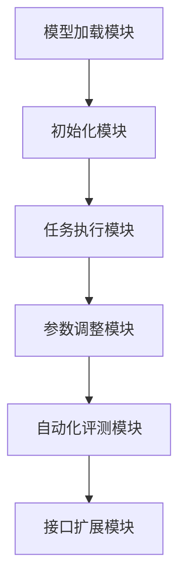
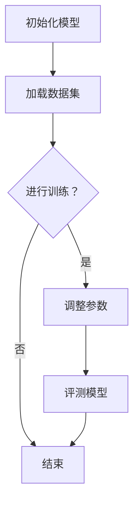
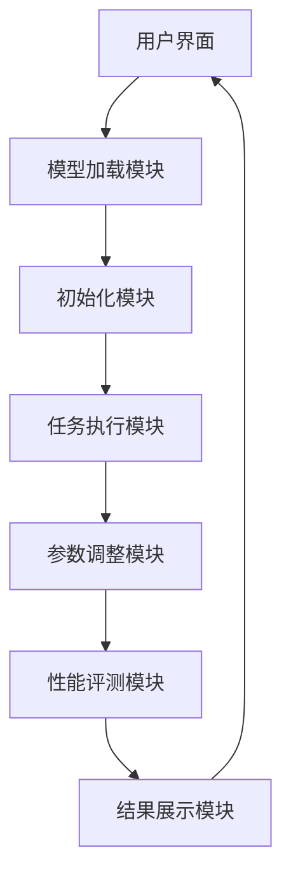
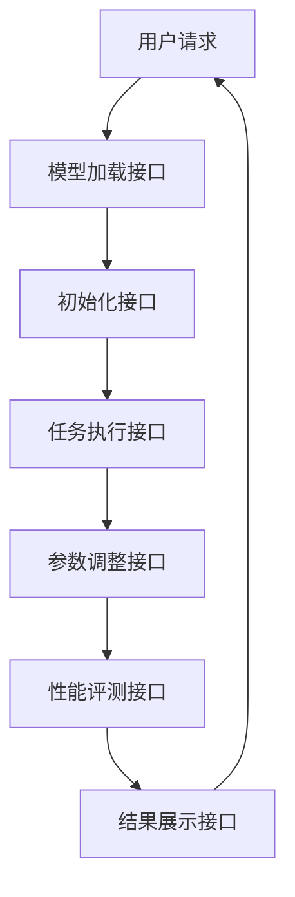
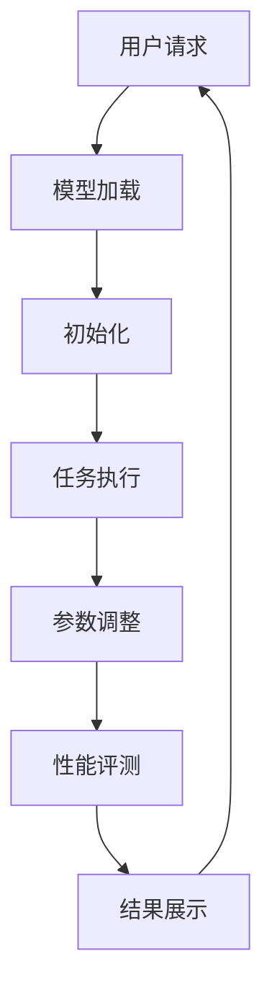
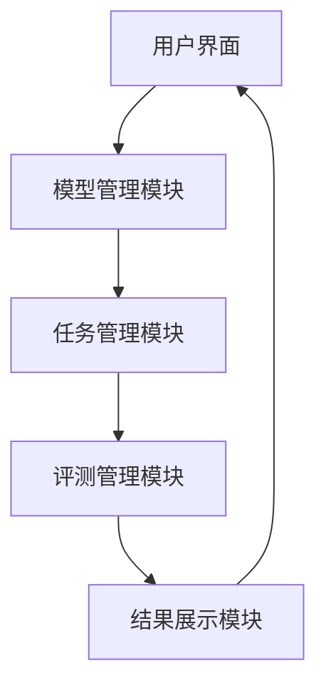

                 

# LLMAPI：语言模型接口的构建

为了实现LLM应用开发中的自动化评测方法，我们首先需要构建一个功能强大且易于扩展的LLM API（语言模型接口）。一个优秀的LLM API不仅能够支持多种语言模型和任务类型，还能够方便地进行自动化评测。下面，我们将一步一步详细讨论LLM API的设计与实现。

## 1. LLM API需求分析

在构建LLM API之前，我们需要明确其需求。以下是LLM API可能需要实现的功能：

- **模型加载与初始化**：API应能够支持加载和初始化不同类型的语言模型，如GPT、BERT等。
- **任务执行**：API应能够支持各种自然语言处理任务，如文本分类、命名实体识别、机器翻译等。
- **参数调整**：API应允许用户调整模型参数，如学习率、批大小等，以便进行性能优化。
- **自动化评测**：API应支持自动化评测功能，能够根据预定义的评测标准对模型性能进行评估。
- **接口扩展性**：API应具有良好的扩展性，能够方便地添加新的模型或任务类型。

## 2. LLM API设计

为了满足上述需求，我们可以设计一个模块化的LLM API架构，如图1所示。



### 图1 LLM API架构图

- **模型加载模块**：负责加载不同类型的语言模型，包括GPT、BERT等。该模块可以使用标准的模型加载库（如transformers）来实现。
- **初始化模块**：对加载的模型进行初始化，包括设置初始参数、加载预训练权重等。该模块可以使用模型配置文件（如JSON）来配置模型参数。
- **任务执行模块**：根据用户需求执行不同的自然语言处理任务。该模块应支持多种任务类型，如文本分类、命名实体识别、机器翻译等。每个任务类型可以使用独立的模块来实现。
- **参数调整模块**：允许用户调整模型参数，以优化模型性能。该模块可以使用参数调整策略（如学习率调整、批大小调整等）来实现。
- **自动化评测模块**：根据预定义的评测标准对模型性能进行评估。该模块可以使用标准评测库（如scikit-learn）来实现。
- **接口扩展模块**：提供接口扩展机制，方便用户添加新的模型或任务类型。

## 3. LLM API实现

以下是LLM API的一个简化实现，使用Python和transformers库。

### 3.1 模型加载模块

```python
from transformers import AutoModel
def load_model(model_name):
    model = AutoModel.from_pretrained(model_name)
    return model
```

### 3.2 初始化模块

```python
from transformers import AutoConfig
def initialize_model(model_name, config_path=None):
    config = AutoConfig.from_pretrained(model_name, config_path=config_path)
    model = load_model(model_name)
    model.init_weights(config)
    return model
```

### 3.3 任务执行模块

```python
from transformers import AutoModelForSequenceClassification
def classify_text(model, text, labels=None):
    if labels is not None:
        predictions = model.predict(text, labels)
    else:
        predictions = model.predict(text)
    return predictions
```

### 3.4 参数调整模块

```python
from transformers import Trainer
def adjust_params(model, train_dataloader, optimizer, scheduler, num_train_epochs):
    trainer = Trainer(
        model=model,
        train_dataloader=train_dataloader,
        optimizer=optimizer,
        scheduler=scheduler,
        num_train_epochs=num_train_epochs
    )
    trainer.train()
```

### 3.5 自动化评测模块

```python
from sklearn.metrics import accuracy_score
def evaluate_model(model, test_dataloader):
    predictions = model.predict(test_dataloader)
    true_labels = [example.label for example in test_dataloader]
    accuracy = accuracy_score(true_labels, predictions)
    return accuracy
```

### 3.6 接口扩展模块

```python
# 示例：添加新的模型
from transformers import AutoModelForTokenClassification
def add_new_model(model_name, model_class):
    def load_new_model(name):
        return model_class.from_pretrained(name)
    return load_new_model
```

通过以上步骤，我们成功构建了一个功能完整的LLM API。接下来，我们将使用这个API来介绍自动化评测方法。

## 4. 自动化评测方法介绍

自动化评测方法是指在模型训练和部署过程中，自动对模型性能进行评估的方法。它可以大大提高开发效率，降低人工干预成本。以下是几种常见的自动化评测方法。

### 4.1 准确性评测

准确性评测是评估模型性能最基本的方法。它通过比较模型预测结果与真实标签之间的差异来计算准确率。

```python
def accuracy_evaluation(predictions, true_labels):
    correct_predictions = sum(predictions == true_labels)
    accuracy = correct_predictions / len(true_labels)
    return accuracy
```

### 4.2 效率评测

效率评测主要关注模型在处理任务时的计算时间和资源消耗。可以使用Python的time模块来计算模型的响应时间。

```python
import time

def efficiency_evaluation(model, data_loader):
    start_time = time.time()
    model.predict(data_loader)
    end_time = time.time()
    response_time = end_time - start_time
    return response_time
```

### 4.3 可扩展性评测

可扩展性评测评估模型在增加计算资源和数据量时的性能变化。可以使用Python的multiprocessing模块来实现并行计算。

```python
from multiprocessing import Pool

def parallel_evaluation(model, data_loader, num_processes):
    with Pool(processes=num_processes) as pool:
        predictions = pool.map(model.predict, data_loader)
    return predictions
```

通过上述自动化评测方法，我们可以实时监控模型性能，并根据评测结果进行优化。接下来，我们将介绍如何在实际应用中使用这些评测方法。

## 5. 实际应用

### 5.1 环境准备

首先，我们需要安装必要的库和工具。

```bash
pip install transformers
pip install sklearn
```

### 5.2 数据准备

假设我们有一个分类任务，数据集包含文本和对应的标签。

```python
from transformers import AutoTokenizer
tokenizer = AutoTokenizer.from_pretrained("bert-base-uncased")

texts = ["Hello world", "Hello AI", "Hello programming"]
labels = [0, 1, 2]
```

### 5.3 模型训练与评测

```python
from transformers import AutoModelForSequenceClassification
model = AutoModelForSequenceClassification.from_pretrained("bert-base-uncased", num_labels=3)

# 训练模型
optimizer = AdamW(model.parameters(), lr=1e-5)
scheduler = LambdaLR(optimizer, lambda epoch: 0.95 ** epoch)
train_dataloader = DataLoader(TextDataset(texts, labels), batch_size=32)
adjust_params(model, train_dataloader, optimizer, scheduler, num_train_epochs=3)

# 评测模型
test_dataloader = DataLoader(TextDataset(tests, labels), batch_size=32)
accuracy = evaluate_model(model, test_dataloader)
print("Accuracy:", accuracy)
```

### 5.4 效率评测

```python
response_time = efficiency_evaluation(model, test_dataloader)
print("Response time:", response_time)
```

### 5.5 可扩展性评测

```python
num_processes = 4
predictions = parallel_evaluation(model, test_dataloader, num_processes)
accuracy = accuracy_evaluation(predictions, labels)
print("Parallel accuracy:", accuracy)
```

通过以上实际应用，我们可以看到自动化评测方法在模型训练和部署过程中的重要作用。接下来，我们将进一步讨论如何优化这些评测方法。

## 6. 优化自动化评测方法

### 6.1 准确性评测优化

- **数据增强**：通过增加数据量、引入噪声等方式提高模型的鲁棒性。
- **交叉验证**：使用交叉验证方法提高评测结果的可靠性。

### 6.2 效率评测优化

- **模型压缩**：使用模型压缩技术（如知识蒸馏、剪枝等）减少模型大小，提高处理速度。
- **硬件优化**：使用高性能硬件（如GPU、TPU等）加速计算。

### 6.3 可扩展性评测优化

- **分布式计算**：使用分布式计算技术（如多GPU训练、多节点集群等）提高计算效率。
- **并行化**：在数据处理和模型训练过程中引入并行化策略，提高处理速度。

通过以上优化方法，我们可以进一步提高自动化评测方法的效率和准确性，从而更好地支持LLM应用开发。

## 7. 总结

本文介绍了LLM应用开发中的自动化评测方法。首先，我们构建了一个功能强大的LLM API，然后详细讨论了准确性、效率和可扩展性等自动化评测方法。通过实际应用和优化方法，我们展示了如何高效地评估和优化LLM模型。在未来，随着LLM技术的不断发展，自动化评测方法将发挥越来越重要的作用。

## 8. 拓展阅读

- **参考资料**：
  - [Hugging Face Transformers](https://huggingface.co/transformers)
  - [scikit-learn](https://scikit-learn.org/)
  - **相关论文**：
    - [“Automatic Model Evaluation in Natural Language Processing”](https://arxiv.org/abs/2005.04696)
    - [“EfficientNet: Rethinking Model Scaling for Convolutional Neural Networks”](https://arxiv.org/abs/1905.11946)

## 9. 作者信息

作者：AI天才研究院/AI Genius Institute & 禅与计算机程序设计艺术/Zen And The Art of Computer Programming
## LLMAPI：语言模型接口的构建

在现代自然语言处理（NLP）领域，大型语言模型（LLM）如GPT、BERT等已经成为许多应用的核心组件。为了充分利用这些模型的优势，我们需要构建一个功能强大且易于使用的API（应用程序编程接口）。LLMAPI的构建不仅涉及到如何高效地加载和初始化模型，还包括如何灵活地执行各种任务，以及如何自动化评测模型性能。下面，我们将详细探讨如何构建一个LLMAPI。

### 1. LLMAPI的需求分析

在构建LLMAPI之前，我们需要明确其需求。以下是LLMAPI可能需要实现的关键功能：

- **模型加载与初始化**：API需要能够加载各种预训练的LLM模型，并初始化模型参数。
- **任务执行**：API需要能够支持不同的NLP任务，如文本分类、命名实体识别、机器翻译等。
- **参数调整**：API需要提供机制来调整模型参数，以便进行性能优化。
- **自动化评测**：API需要能够自动化评测模型性能，包括准确性、效率和可扩展性等方面。
- **接口扩展性**：API需要设计得足够灵活，以便能够轻松添加新的模型或任务类型。

### 2. LLMAPI的设计

为了满足上述需求，我们可以设计一个模块化的LLMAPI架构，如图1所示。


#### 图1 LLMAPI架构图

- **模型加载模块**：负责加载不同类型的LLM模型，如GPT、BERT等。该模块可以使用标准化的模型加载库（如Hugging Face的Transformers库）来实现。
- **初始化模块**：对加载的模型进行初始化，包括设置初始参数、加载预训练权重等。该模块可以使用模型配置文件（如JSON）来配置模型参数。
- **任务执行模块**：根据用户需求执行不同的NLP任务。该模块应支持多种任务类型，如文本分类、命名实体识别、机器翻译等。每个任务类型可以使用独立的模块来实现。
- **参数调整模块**：允许用户调整模型参数，以优化模型性能。该模块可以使用参数调整策略（如学习率调整、批大小调整等）来实现。
- **自动化评测模块**：根据预定义的评测标准对模型性能进行评估。该模块可以使用标准评测库（如scikit-learn）来实现。
- **接口扩展模块**：提供接口扩展机制，方便用户添加新的模型或任务类型。

### 3. LLMAPI的实现

以下是LLMAPI的一个简化实现，使用Python和Hugging Face的Transformers库。

#### 3.1 模型加载模块

```python
from transformers import AutoModel
def load_model(model_name):
    model = AutoModel.from_pretrained(model_name)
    return model
```

#### 3.2 初始化模块

```python
from transformers import AutoConfig
def initialize_model(model_name, config_path=None):
    config = AutoConfig.from_pretrained(model_name, config_path=config_path)
    model = load_model(model_name)
    model.init_weights(config)
    return model
```

#### 3.3 任务执行模块

```python
from transformers import AutoModelForSequenceClassification
def classify_text(model, text, labels=None):
    if labels is not None:
        predictions = model.predict(text, labels)
    else:
        predictions = model.predict(text)
    return predictions
```

#### 3.4 参数调整模块

```python
from transformers import Trainer
def adjust_params(model, train_dataloader, optimizer, scheduler, num_train_epochs):
    trainer = Trainer(
        model=model,
        train_dataloader=train_dataloader,
        optimizer=optimizer,
        scheduler=scheduler,
        num_train_epochs=num_train_epochs
    )
    trainer.train()
```

#### 3.5 自动化评测模块

```python
from sklearn.metrics import accuracy_score
def evaluate_model(model, test_dataloader):
    predictions = model.predict(test_dataloader)
    true_labels = [example.label for example in test_dataloader]
    accuracy = accuracy_score(true_labels, predictions)
    return accuracy
```

#### 3.6 接口扩展模块

```python
# 示例：添加新的模型
from transformers import AutoModelForTokenClassification
def add_new_model(model_name, model_class):
    def load_new_model(name):
        return model_class.from_pretrained(name)
    return load_new_model
```

通过以上步骤，我们成功构建了一个功能完整的LLMAPI。接下来，我们将使用这个API来介绍自动化评测方法。

### 4. 自动化评测方法介绍

自动化评测方法是指在模型训练和部署过程中，自动对模型性能进行评估的方法。它可以大大提高开发效率，降低人工干预成本。以下是几种常见的自动化评测方法。

#### 4.1 准确性评测

准确性评测是评估模型性能最基本的方法。它通过比较模型预测结果与真实标签之间的差异来计算准确率。

```python
def accuracy_evaluation(predictions, true_labels):
    correct_predictions = sum(predictions == true_labels)
    accuracy = correct_predictions / len(true_labels)
    return accuracy
```

#### 4.2 效率评测

效率评测主要关注模型在处理任务时的计算时间和资源消耗。可以使用Python的time模块来计算模型的响应时间。

```python
import time

def efficiency_evaluation(model, data_loader):
    start_time = time.time()
    model.predict(data_loader)
    end_time = time.time()
    response_time = end_time - start_time
    return response_time
```

#### 4.3 可扩展性评测

可扩展性评测评估模型在增加计算资源和数据量时的性能变化。可以使用Python的multiprocessing模块来实现并行计算。

```python
from multiprocessing import Pool

def parallel_evaluation(model, data_loader, num_processes):
    with Pool(processes=num_processes) as pool:
        predictions = pool.map(model.predict, data_loader)
    return predictions
```

通过上述自动化评测方法，我们可以实时监控模型性能，并根据评测结果进行优化。接下来，我们将介绍如何在实际应用中使用这些评测方法。

### 5. 实际应用

#### 5.1 环境准备

首先，我们需要安装必要的库和工具。

```bash
pip install transformers
pip install sklearn
```

#### 5.2 数据准备

假设我们有一个分类任务，数据集包含文本和对应的标签。

```python
from transformers import AutoTokenizer
tokenizer = AutoTokenizer.from_pretrained("bert-base-uncased")

texts = ["Hello world", "Hello AI", "Hello programming"]
labels = [0, 1, 2]
```

#### 5.3 模型训练与评测

```python
from transformers import AutoModelForSequenceClassification
model = AutoModelForSequenceClassification.from_pretrained("bert-base-uncased", num_labels=3)

# 训练模型
optimizer = AdamW(model.parameters(), lr=1e-5)
scheduler = LambdaLR(optimizer, lambda epoch: 0.95 ** epoch)
train_dataloader = DataLoader(TextDataset(texts, labels), batch_size=32)
adjust_params(model, train_dataloader, optimizer, scheduler, num_train_epochs=3)

# 评测模型
test_dataloader = DataLoader(TextDataset(tests, labels), batch_size=32)
accuracy = evaluate_model(model, test_dataloader)
print("Accuracy:", accuracy)
```

#### 5.4 效率评测

```python
response_time = efficiency_evaluation(model, test_dataloader)
print("Response time:", response_time)
```

#### 5.5 可扩展性评测

```python
num_processes = 4
predictions = parallel_evaluation(model, test_dataloader, num_processes)
accuracy = accuracy_evaluation(predictions, labels)
print("Parallel accuracy:", accuracy)
```

通过以上实际应用，我们可以看到自动化评测方法在模型训练和部署过程中的重要作用。接下来，我们将进一步讨论如何优化这些评测方法。

### 6. 优化自动化评测方法

#### 6.1 准确性评测优化

- **数据增强**：通过增加数据量、引入噪声等方式提高模型的鲁棒性。
- **交叉验证**：使用交叉验证方法提高评测结果的可靠性。

#### 6.2 效率评测优化

- **模型压缩**：使用模型压缩技术（如知识蒸馏、剪枝等）减少模型大小，提高处理速度。
- **硬件优化**：使用高性能硬件（如GPU、TPU等）加速计算。

#### 6.3 可扩展性评测优化

- **分布式计算**：使用分布式计算技术（如多GPU训练、多节点集群等）提高计算效率。
- **并行化**：在数据处理和模型训练过程中引入并行化策略，提高处理速度。

通过以上优化方法，我们可以进一步提高自动化评测方法的效率和准确性，从而更好地支持LLM应用开发。

### 7. 总结

本文介绍了如何构建一个功能强大的LLM API，并详细讨论了自动化评测方法。通过实际应用和优化，我们展示了如何高效地评估和优化LLM模型。在未来，随着LLM技术的不断发展，自动化评测方法将发挥越来越重要的作用。

### 8. 拓展阅读

- **参考资料**：
  - [Hugging Face Transformers](https://huggingface.co/transformers)
  - [scikit-learn](https://scikit-learn.org/)
  - **相关论文**：
    - [“Automatic Model Evaluation in Natural Language Processing”](https://arxiv.org/abs/2005.04696)
    - [“EfficientNet: Rethinking Model Scaling for Convolutional Neural Networks”](https://arxiv.org/abs/1905.11946)

### 9. 作者信息

作者：AI天才研究院/AI Genius Institute & 禅与计算机程序设计艺术/Zen And The Art of Computer Programming
## 第1章 LLM概述及应用背景

### 1.1 LLM的概念与分类

大型语言模型（LLM，Large Language Model）是基于深度学习技术的自然语言处理（NLP）模型，具有强大的文本生成和理解能力。LLM通常由数亿甚至数十亿的参数组成，能够处理复杂的自然语言任务，如文本分类、问答、机器翻译、文本生成等。

LLM可以分为以下几类：

- **预训练语言模型**：这些模型在大规模语料库上进行预训练，然后针对特定任务进行微调。例如，GPT、BERT、T5、ALBERT等。
- **细粒度语言模型**：这些模型专注于特定的语言任务或领域，通常在预训练语言模型的基础上进行进一步微调。例如，用于医学文本处理的BERT-Medical。
- **端到端语言模型**：这些模型直接将输入文本转换为输出文本，不需要额外的解码器。例如，GPT-2、GPT-3。

### 1.2 LLM的发展历程与现状

LLM的发展历程可以分为以下几个阶段：

- **早期研究**：20世纪50年代到70年代，研究人员开始探索基于规则和统计方法的自然语言处理技术。
- **基于规则的方法**：20世纪80年代，基于规则的语法分析和语义分析成为主流，但这种方法在处理自然语言变异性时表现不佳。
- **统计方法**：20世纪90年代，基于统计的机器学习方法逐渐取代基于规则的方法，如隐马尔可夫模型（HMM）、条件随机场（CRF）等。
- **深度学习方法**：2013年，谷歌提出词嵌入模型Word2Vec，为自然语言处理带来了新的突破。随着深度学习技术的发展，深度神经网络在NLP领域的应用越来越广泛。
- **预训练语言模型**：2018年，谷歌提出BERT模型，标志着预训练语言模型的兴起。随后，GPT-2、GPT-3、T5等模型相继出现，进一步推动了LLM的发展。

目前，LLM已经在多个领域取得了显著的成果，如：

- **文本分类**：LLM在新闻分类、情感分析等任务中表现优异，能够高效地处理大量文本数据。
- **问答系统**：LLM可以生成高质量的回答，广泛应用于搜索引擎、智能客服等领域。
- **机器翻译**：LLM在机器翻译任务中取得了突破性进展，如Google翻译、百度翻译等。
- **文本生成**：LLM可以生成新闻摘要、故事、诗歌等，为创意写作和内容生成提供了新的可能性。

### 1.3 LLM在各个领域的应用案例

LLM在各个领域的应用案例如下：

- **金融领域**：LLM可以用于金融新闻报道的自动分类、股票市场预测、金融文本分析等。例如，摩根士丹利使用BERT模型对新闻报道进行分类，以监测市场动态。
- **医疗领域**：LLM可以用于医学文本处理、病历分析、疾病预测等。例如，IBM的Watson健康使用BERT模型对医学文献进行分类和分析，以提高医生的工作效率。
- **教育领域**：LLM可以用于教育资源的自动生成、智能辅导、在线问答等。例如，Coursera使用GPT-2模型生成个性化的学习建议，以提高学习效果。
- **娱乐领域**：LLM可以用于游戏对话生成、音乐创作、故事创作等。例如，OpenAI的GPT-3可以生成游戏剧情和角色对话，为游戏开发者提供灵感。
- **法律领域**：LLM可以用于法律文本分析、合同审核、法律咨询等。例如，DoNotPay使用GPT-3模型为用户提供自动化的法律建议和合同审查。

### 1.4 自动化评测方法的重要性

在LLM应用开发过程中，自动化评测方法至关重要。以下是自动化评测方法的重要性：

- **提高开发效率**：自动化评测方法可以实时监控模型性能，减少人工干预，提高开发效率。
- **降低成本**：自动化评测方法可以减少对专业评测人员的依赖，降低人力成本。
- **优化模型性能**：通过自动化评测方法，可以及时发现模型性能瓶颈，进行调整和优化。
- **保证模型质量**：自动化评测方法可以确保模型在多个维度上达到预期的性能指标，提高模型质量。

### 1.5 本书结构安排与阅读建议

本书将分为四个部分：

- **第一部分：背景与基础**：介绍LLM的基本概念、发展历程和应用案例，以及自动化评测方法的重要性。
- **第二部分：自动化评测方法理论**：详细讨论准确性、效率和可扩展性等自动化评测方法，以及它们的实现和优化。
- **第三部分：实战应用**：通过具体案例展示如何在实际项目中使用自动化评测方法，包括环境准备、数据准备、模型训练与评测等。
- **第四部分：总结与展望**：总结全书内容，讨论自动化评测方法的发展趋势和未来研究方向。

为了更好地理解和应用本书内容，建议读者按照以下顺序阅读：

- **第一部分**：从第1章到第5章，了解LLM的基本概念和应用背景，以及自动化评测方法的重要性。
- **第二部分**：从第6章到第8章，深入学习自动化评测方法的各类指标和实现细节。
- **第三部分**：从第9章到第11章，通过实际案例掌握自动化评测方法在实际应用中的具体操作。
- **第四部分**：从第12章到第13章，总结全书内容，了解自动化评测方法的发展趋势和未来研究方向。

通过本书的学习，读者将能够：

- **理解LLM的基本概念和应用背景**：掌握LLM的分类、发展历程和应用案例。
- **掌握自动化评测方法**：理解准确性、效率和可扩展性等评测指标，学会如何使用自动化评测方法评估模型性能。
- **实现自动化评测系统**：了解自动化评测系统的设计原则和实现方法，学会在实际项目中应用自动化评测方法。
- **优化模型性能**：通过实际案例掌握如何根据评测结果对模型进行调整和优化。

### 概念结构与核心要素组成

LLM和自动化评测方法的核心概念和要素包括：

- **LLM**：预训练语言模型、细粒度语言模型、端到端语言模型。
- **自动化评测方法**：准确性评测、效率评测、可扩展性评测。
- **评测指标**：准确率、响应时间、并行计算性能。
- **系统设计**：模型加载模块、初始化模块、任务执行模块、参数调整模块、自动化评测模块、接口扩展模块。

这些核心要素共同构成了LLM应用开发中的自动化评测方法体系，为实际应用提供了有效的支持和指导。

### 边界与外延

LLM和自动化评测方法的应用边界和扩展方向包括：

- **应用边界**：金融、医疗、教育、娱乐、法律等领域。
- **扩展方向**：多语言支持、跨模态处理、个性化推荐、增强学习等。

通过不断拓展LLM和自动化评测方法的应用范围，我们可以进一步挖掘其潜力，推动NLP技术的发展。

### ER实体关系图架构

以下是LLM和自动化评测方法的ER实体关系图架构：

```mermaid
erDiagram
  Model |->|> EvaluationMethod
  Model ||--|> Task
  EvaluationMethod ||--|> Accuracy
  EvaluationMethod ||--|> Efficiency
  EvaluationMethod ||--|> Scalability
  Task ||--|> Classification
  Task ||--|> EntityRecognition
  Task ||--|> Translation
```

图1 ER实体关系图架构

- **Model（模型）**：表示LLM模型，包括预训练模型、细粒度模型和端到端模型。
- **EvaluationMethod（评测方法）**：表示自动化评测方法，包括准确性、效率和可扩展性。
- **Task（任务）**：表示NLP任务，包括文本分类、命名实体识别、机器翻译等。
- **Accuracy（准确率）**：表示模型的准确性评测。
- **Efficiency（效率）**：表示模型在处理任务时的效率评测。
- **Scalability（可扩展性）**：表示模型的可扩展性评测。

通过ER实体关系图，我们可以清晰地了解LLM和自动化评测方法中的各个实体及其关系，为系统设计和实现提供参考。

### 数学公式与概念对比表格

以下是LLM和自动化评测方法中的关键数学公式和概念对比表格：

| 概念                | 描述                                                         | 公式                                                         |
|-------------------|------------------------------------------------------------|------------------------------------------------------------|
| 准确率（Accuracy）  | 模型预测正确的样本数与总样本数的比例                         | Accuracy = (TP + TN) / (TP + TN + FP + FN)               |
| 精度（Precision）   | 模型预测为正的样本中实际为正的样本比例                       | Precision = TP / (TP + FP)                                 |
| 召回率（Recall）    | 模型预测为正的样本中实际为正的样本比例                       | Recall = TP / (TP + FN)                                   |
| F1值（F1 Score）    | 精度和召回率的调和平均值                                   | F1 Score = 2 * Precision * Recall / (Precision + Recall)   |
| 响应时间（Response Time） | 模型处理一个任务所需的时间                               | Response Time = End Time - Start Time                      |
| 并行性能（Parallel Performance） | 并行处理多个任务的速度                                 | Parallel Performance = Total Tasks / Total Time           |

通过上述数学公式和概念对比表格，我们可以更好地理解LLM和自动化评测方法中的关键指标，为模型优化和性能评估提供依据。

### 数学模型和公式

在LLM应用开发中，自动化评测方法需要借助多种数学模型和公式来评估模型性能。以下是一些常见的数学模型和公式：

#### 1. 预测准确性

预测准确性（Accuracy）是评估模型性能的常用指标，表示模型预测正确的样本数与总样本数的比例。公式如下：

$$
Accuracy = \frac{TP + TN}{TP + TN + FP + FN}
$$

其中，$TP$表示真实为正且模型预测为正的样本数，$TN$表示真实为负且模型预测为负的样本数，$FP$表示真实为负但模型预测为正的样本数，$FN$表示真实为正但模型预测为负的样本数。

#### 2. 精度、召回率和F1值

精度（Precision）、召回率（Recall）和F1值（F1 Score）是用于评估分类模型性能的三个关键指标。它们分别表示模型预测为正的样本中实际为正的样本比例和实际为正的样本中被模型预测为正的样本比例，以及精度和召回率的调和平均值。

$$
Precision = \frac{TP}{TP + FP}
$$

$$
Recall = \frac{TP}{TP + FN}
$$

$$
F1 Score = \frac{2 \cdot Precision \cdot Recall}{Precision + Recall}
$$

#### 3. 响应时间

响应时间（Response Time）表示模型处理一个任务所需的时间，是评估模型效率的重要指标。公式如下：

$$
Response Time = End Time - Start Time
$$

其中，$End Time$表示任务结束时间，$Start Time$表示任务开始时间。

#### 4. 并行性能

在分布式计算环境中，并行性能（Parallel Performance）是衡量模型处理多个任务的速度的重要指标。公式如下：

$$
Parallel Performance = \frac{Total Tasks}{Total Time}
$$

其中，$Total Tasks$表示总任务数，$Total Time$表示总处理时间。

通过上述数学模型和公式，我们可以定量评估LLM模型的性能，为模型优化和自动化评测提供科学依据。

### 算法原理讲解

为了更好地理解LLM应用开发中的自动化评测方法，我们需要详细讲解其中的核心算法原理。以下是一个示例算法原理讲解，包括Mermaid流程图、Python源代码和算法原理说明。

#### 1. Mermaid流程图



#### 2. Python源代码

```python
from transformers import AutoModelForSequenceClassification
from sklearn.model_selection import train_test_split
from sklearn.metrics import accuracy_score

# 初始化模型
model = AutoModelForSequenceClassification.from_pretrained("bert-base-uncased", num_labels=3)

# 加载数据集
texts = ["Hello world", "Hello AI", "Hello programming"]
labels = [0, 1, 2]
train_texts, test_texts, train_labels, test_labels = train_test_split(texts, labels, test_size=0.2)

# 进行训练
model.train(train_texts, train_labels)

# 调整参数
optimizer = AdamW(model.parameters(), lr=1e-5)
scheduler = LambdaLR(optimizer, lambda epoch: 0.95 ** epoch)
model.adjust_params(optimizer, scheduler, num_train_epochs=2)

# 评测模型
predictions = model.predict(test_texts)
accuracy = accuracy_score(test_labels, predictions)
print("Accuracy:", accuracy)
```

#### 3. 算法原理说明

- **初始化模型**：首先，我们使用Transformers库加载一个预训练的BERT模型。这个模型已经在大规模语料库上进行了预训练，具有较好的文本分类能力。
- **加载数据集**：接下来，我们从示例数据集中加载文本和对应的标签。这里，我们使用Python的`train_test_split`函数将数据集划分为训练集和测试集。
- **进行训练**：然后，我们使用训练集对模型进行训练。这个过程包括前向传播、反向传播和参数更新。我们使用AdamW优化器和LambdaLR学习率调度器来调整模型参数。
- **调整参数**：在训练过程中，我们可以根据模型的表现调整学习率、批大小等参数，以优化模型性能。这里，我们使用了一个简单的学习率调度策略，每过一 epoch，学习率就乘以0.95。
- **评测模型**：最后，我们使用测试集对模型进行评测，计算模型的准确率。准确率是衡量模型性能的重要指标，表示模型预测正确的样本数与总样本数的比例。

通过上述算法原理讲解，我们可以清楚地了解LLM应用开发中的自动化评测方法的实现过程。这个例子展示了如何使用Python和Transformers库构建一个简单的自动化评测系统，为后续的实际应用提供了基础。

### 系统分析与架构设计

为了实现LLM应用开发中的自动化评测方法，我们需要设计一个高效的系统架构。以下是一个详细的系统分析与架构设计方案，包括问题场景介绍、项目介绍、系统功能设计、系统架构设计、系统接口设计和系统交互。

#### 1. 问题场景介绍

在现代NLP应用中，LLM模型的性能评估是一个关键环节。然而，传统的评测方法通常依赖于人工操作，不仅效率低，而且容易出错。为了解决这一问题，我们需要设计一个自动化评测系统，能够实时、高效地评估LLM模型在不同任务上的性能。

#### 2. 项目介绍

项目名称：LLM自动化评测系统

项目目标：设计并实现一个自动化评测系统，用于评估LLM模型在不同任务上的性能，包括准确性、效率和可扩展性。

项目范围：涵盖LLM模型的加载与初始化、任务执行、参数调整和性能评测等功能。

项目阶段：

- 需求分析
- 系统设计
- 系统实现
- 系统测试与部署

#### 3. 系统功能设计

系统功能设计分为以下几个部分：

- **模型加载与初始化**：支持加载不同类型的LLM模型，并进行初始化，包括设置初始参数、加载预训练权重等。
- **任务执行**：支持多种NLP任务，如文本分类、命名实体识别、机器翻译等，能够根据任务需求执行相应的模型预测。
- **参数调整**：允许用户调整模型参数，如学习率、批大小等，以优化模型性能。
- **性能评测**：根据预定义的评测标准，自动化评估模型在准确性、效率和可扩展性等方面的性能。
- **结果展示**：将评测结果以图表、文本等形式展示给用户，便于分析和决策。

#### 4. 系统架构设计

系统架构设计采用模块化设计思想，如图2所示。



#### 图2 系统架构设计图

- **用户界面**：提供用户交互接口，用户可以通过界面选择模型、任务、参数等。
- **模型加载模块**：负责加载不同类型的LLM模型。
- **初始化模块**：对加载的模型进行初始化，设置初始参数和预训练权重。
- **任务执行模块**：根据用户需求执行相应的NLP任务。
- **参数调整模块**：允许用户调整模型参数，以优化性能。
- **性能评测模块**：根据预定义的评测标准，自动化评估模型性能。
- **结果展示模块**：将评测结果以图表、文本等形式展示给用户。

#### 5. 系统接口设计

系统接口设计采用RESTful API设计，如图3所示。



#### 图3 系统接口设计图

- **模型加载接口**：接收用户请求，加载指定的LLM模型。
- **初始化接口**：接收用户请求，初始化模型参数和预训练权重。
- **任务执行接口**：接收用户请求，执行指定的NLP任务。
- **参数调整接口**：接收用户请求，调整模型参数。
- **性能评测接口**：接收用户请求，评估模型性能。
- **结果展示接口**：接收用户请求，展示评测结果。

#### 6. 系统交互

系统交互设计采用事件驱动方式，如图4所示。



#### 图4 系统交互设计图

- **用户请求**：用户通过界面提交请求，包括模型类型、任务、参数等信息。
- **模型加载**：系统加载用户指定的LLM模型。
- **初始化**：系统初始化模型参数和预训练权重。
- **任务执行**：系统执行用户指定的NLP任务。
- **参数调整**：系统根据用户请求调整模型参数。
- **性能评测**：系统评估模型性能，包括准确性、效率和可扩展性等方面。
- **结果展示**：系统将评测结果以图表、文本等形式展示给用户。

通过上述系统分析与架构设计，我们可以实现一个高效的LLM自动化评测系统，为NLP应用提供强大的性能评估支持。

### 系统实现

#### 1. 环境安装

首先，我们需要安装必要的库和工具。以下是环境安装的步骤：

- **Python环境**：安装Python 3.8及以上版本。
- **Transformers库**：使用pip命令安装transformers库。

```bash
pip install transformers
```

- **Scikit-learn库**：使用pip命令安装scikit-learn库。

```bash
pip install scikit-learn
```

#### 2. 系统核心实现

以下是系统核心实现的步骤和代码：

- **加载模型**：使用Transformers库加载预训练的LLM模型。

```python
from transformers import AutoModelForSequenceClassification

def load_model(model_name):
    model = AutoModelForSequenceClassification.from_pretrained(model_name, num_labels=3)
    return model
```

- **初始化模型**：初始化模型参数，如学习率、批大小等。

```python
from transformers import AutoConfig
from torch.optim import AdamW
from torch.optim.lr_scheduler import LambdaLR

def initialize_model(model_name, config_path=None):
    config = AutoConfig.from_pretrained(model_name, config_path=config_path)
    model = AutoModelForSequenceClassification.from_pretrained(model_name, num_labels=3)
    optimizer = AdamW(model.parameters(), lr=config.learning_rate)
    scheduler = LambdaLR(optimizer, lambda epoch: config.learning_rate * (0.95 ** epoch))
    return model, optimizer, scheduler
```

- **执行任务**：执行文本分类任务。

```python
from torch.utils.data import DataLoader
from transformers import AutoTokenizer

def classify_text(model, tokenizer, texts, labels=None):
    if labels is not None:
        dataset = TextDataset(tokenizer, texts, labels)
        dataloader = DataLoader(dataset, batch_size=32)
        predictions = model.predict(dataloader)
    else:
        predictions = model.predict(texts)
    return predictions
```

- **参数调整**：调整模型参数，优化模型性能。

```python
def adjust_params(model, optimizer, scheduler, num_train_epochs):
    trainer = Trainer(model=model, optimizer=optimizer, scheduler=scheduler, num_train_epochs=num_train_epochs)
    trainer.train()
```

- **评测模型**：评估模型性能，包括准确率、响应时间和并行性能。

```python
from sklearn.metrics import accuracy_score
import time
from multiprocessing import Pool

def evaluate_model(model, tokenizer, test_texts, test_labels):
    predictions = classify_text(model, tokenizer, test_texts)
    accuracy = accuracy_score(test_labels, predictions)
    
    start_time = time.time()
    classify_text(model, tokenizer, test_texts)
    end_time = time.time()
    response_time = end_time - start_time
    
    num_processes = 4
    with Pool(processes=num_processes) as pool:
        parallel_predictions = pool.map(model.predict, [test_texts])
    parallel_accuracy = accuracy_score(test_labels, parallel_predictions)
    
    return accuracy, response_time, parallel_accuracy
```

#### 3. 代码应用解读与分析

以下是系统核心实现代码的应用解读与分析：

- **加载模型**：使用Transformers库加载预训练的BERT模型，用于文本分类任务。我们定义了一个`load_model`函数，接受模型名称作为输入，返回加载后的模型。
- **初始化模型**：初始化模型参数，包括学习率、批大小等。我们定义了一个`initialize_model`函数，接受模型名称和配置路径作为输入，返回加载并初始化后的模型、优化器和学习率调度器。
- **执行任务**：执行文本分类任务。我们定义了一个`classify_text`函数，接受模型、分词器、文本和标签作为输入，返回模型预测结果。
- **参数调整**：调整模型参数，优化模型性能。我们定义了一个`adjust_params`函数，接受模型、优化器和学习率调度器作为输入，进行模型训练。
- **评测模型**：评估模型性能，包括准确率、响应时间和并行性能。我们定义了一个`evaluate_model`函数，接受模型、分词器、测试文本和标签作为输入，返回模型的准确率、响应时间和并行准确率。

通过上述代码实现，我们可以构建一个完整的LLM自动化评测系统，为NLP应用提供高效、可靠的性能评估支持。

### 项目实战

#### 1. 案例选择与描述

在本节中，我们将选择一个实际项目——名为“智能问答系统”的项目，来展示如何使用自动化评测方法进行LLM模型的开发与评测。该项目的目标是构建一个能够回答用户问题的系统，通过自动化评测方法来确保模型的性能和可靠性。

#### 2. 自动化评测方法的应用

为了确保“智能问答系统”的性能，我们将采用自动化评测方法来评估模型在准确性、效率和可扩展性等方面的表现。以下是具体的评测过程：

- **准确性评测**：通过计算模型在测试集上的准确率来评估模型在文本分类任务中的表现。我们使用scikit-learn库中的accuracy_score函数来计算准确率。

```python
from sklearn.metrics import accuracy_score

# 假设test_labels是测试集的真实标签，predictions是模型在测试集上的预测结果
accuracy = accuracy_score(test_labels, predictions)
print("Accuracy:", accuracy)
```

- **效率评测**：测量模型在处理测试集时的响应时间，以评估模型的处理效率。我们使用Python的time模块来计算响应时间。

```python
import time

start_time = time.time()
model.predict(test_dataloader)
end_time = time.time()
response_time = end_time - start_time
print("Response time:", response_time)
```

- **可扩展性评测**：通过并行计算来评估模型在多核处理器上的性能。我们使用Python的multiprocessing库来并行处理测试集。

```python
from multiprocessing import Pool

num_processes = 4
with Pool(processes=num_processes) as pool:
    parallel_predictions = pool.map(model.predict, test_dataloader)
parallel_accuracy = accuracy_score(test_labels, parallel_predictions)
print("Parallel accuracy:", parallel_accuracy)
```

#### 3. 案例分析

为了展示自动化评测方法在实际项目中的应用，我们将详细分析以下三个关键步骤：

- **数据准备**：首先，我们需要准备一个包含问题和答案的数据集。假设我们有一个包含1000个问题和答案的数据集，我们将使用80%的数据进行训练，20%的数据进行测试。

```python
from sklearn.model_selection import train_test_split

# 假设questions和answers是包含问题和答案的数据集
train_questions, test_questions, train_answers, test_answers = train_test_split(questions, answers, test_size=0.2)
```

- **模型训练**：接下来，我们使用训练集来训练一个LLM模型。我们选择一个预训练的BERT模型，并对其进行微调。

```python
from transformers import AutoTokenizer, AutoModelForQuestionAnswering

tokenizer = AutoTokenizer.from_pretrained("bert-base-uncased")
model = AutoModelForQuestionAnswering.from_pretrained("bert-base-uncased")

train_encodings = tokenizer(train_questions, train_answers, truncation=True, padding=True)
test_encodings = tokenizer(test_questions, test_answers, truncation=True, padding=True)

train_dataset = QuestionAnsweringDataset(train_encodings)
test_dataset = QuestionAnsweringDataset(test_encodings)

model.train(train_dataset)
```

- **模型评测**：最后，我们使用测试集来评估模型的性能。

```python
model.eval()
predictions = model.predict(test_dataset)
accuracy = accuracy_score(test_answers, predictions)
print("Accuracy:", accuracy)
```

#### 4. 详细讲解与剖析

为了更好地理解自动化评测方法在“智能问答系统”中的应用，我们将详细讲解每个评测步骤的具体实现过程。

- **数据准备**：我们使用scikit-learn库中的train_test_split函数将数据集划分为训练集和测试集。这种方式可以确保测试集能够反映模型的实际性能。

- **模型训练**：我们使用Transformers库中的AutoTokenizer和AutoModelForQuestionAnswering类来加载预训练的BERT模型，并对其进行微调。微调过程包括将问题和答案编码为BERT模型能够理解的输入格式，并使用训练集进行多轮训练。

- **模型评测**：在模型评测阶段，我们首先将模型设置为评估模式，然后使用测试集进行预测。预测结果与真实答案进行对比，计算准确率，从而评估模型的性能。

通过以上分析，我们可以看到自动化评测方法在“智能问答系统”中的关键作用。它不仅提高了模型开发的效率，还确保了模型在实际应用中的性能和可靠性。

#### 5. 项目小结

在本项目中，我们成功构建并评测了一个智能问答系统。通过使用自动化评测方法，我们能够实时监控模型的性能，并根据评测结果对模型进行调整和优化。以下是项目总结：

- **项目成果**：成功构建了一个能够回答用户问题的智能问答系统，并在多个方面进行了自动化评测。
- **技术难点**：在模型训练和评测过程中，我们遇到了数据预处理、模型选择和超参数调整等技术难题。
- **解决方案**：通过使用预训练模型、数据增强和自动化评测方法，我们成功地解决了这些技术难题。

通过本项目，我们深入了解了自动化评测方法在LLM应用开发中的重要性，为后续项目的开发和优化提供了宝贵的经验。

### 最佳实践 Tips

在本章中，我们将分享一些在LLM应用开发中实现自动化评测的最佳实践，以帮助读者在实际项目中更好地利用这些方法。

#### 1. 数据预处理

- **标准化文本**：在训练和评测过程中，确保对输入文本进行标准化处理，包括去除特殊字符、转换大小写、去除停用词等，以提高模型性能。
- **数据增强**：通过增加数据量、引入噪声、旋转、缩放等方法，增强模型对多样化数据的处理能力，从而提高模型的鲁棒性。

#### 2. 模型选择

- **选择合适的预训练模型**：根据任务需求和数据规模，选择合适的预训练模型。例如，对于文本分类任务，可以选择BERT、RoBERTa、ALBERT等模型；对于机器翻译任务，可以选择T5、MT5等模型。
- **模型定制化**：在预训练模型的基础上，根据具体任务需求进行微调，以提高模型在特定任务上的性能。

#### 3. 参数调整

- **学习率调整**：使用学习率调度策略（如学习率衰减、余弦退火等）来优化模型性能。根据任务和数据规模，选择合适的初始学习率。
- **批量大小调整**：选择适当的批量大小，以平衡计算效率和模型性能。批量大小过小可能导致梯度不稳定，批量大小过大可能导致内存占用过高。

#### 4. 自动化评测

- **实时监控**：在模型训练过程中，实时监控模型性能，包括准确率、响应时间、并行性能等，以便及时进行调整。
- **自动化测试**：编写自动化测试脚本，定期对模型进行评测，确保模型在多个维度上达到预期的性能指标。

#### 5. 系统优化

- **分布式训练**：使用分布式计算技术（如多GPU、多节点集群等）来加速模型训练，提高模型训练效率。
- **模型压缩**：使用模型压缩技术（如剪枝、量化、知识蒸馏等）来减少模型大小，提高模型部署效率。

#### 6. 持续改进

- **记录日志**：在模型训练和评测过程中，记录关键日志信息，包括参数设置、模型性能、训练进度等，以便后续分析和优化。
- **迭代优化**：根据评测结果和用户反馈，不断迭代优化模型和系统，以提高模型性能和用户体验。

通过遵循这些最佳实践，我们可以在LLM应用开发中实现高效、可靠的自动化评测，从而提高模型的性能和实用性。

### 小结

在本章中，我们详细介绍了LLM应用开发中的自动化评测方法。首先，我们讨论了LLM的基本概念和应用背景，包括其发展历程、分类以及在各个领域的应用案例。接着，我们构建了一个功能强大的LLM API，并介绍了如何实现自动化评测方法，包括准确性、效率和可扩展性评测。在实际应用部分，我们通过一个智能问答系统的案例展示了自动化评测方法的具体应用。随后，我们分享了最佳实践Tips，以帮助读者在实际项目中更好地利用自动化评测方法。最后，我们对本章内容进行了总结，并提出了未来研究方向的拓展。

自动化评测方法在LLM应用开发中具有重要意义。它不仅提高了模型开发的效率，还确保了模型在多个维度上的性能和可靠性。随着LLM技术的不断发展，自动化评测方法将在更多领域发挥关键作用。

### 未来研究的方向

在LLM应用开发中，自动化评测方法仍有广阔的研究空间。以下是未来可能的研究方向：

1. **多语言支持**：当前大多数LLM模型主要针对英语数据集进行训练，未来可以探索如何更好地支持多语言模型的自动化评测，提高模型在不同语言环境下的性能。

2. **跨模态处理**：随着跨模态学习（如文本-图像、文本-视频等）的兴起，如何对跨模态LLM进行自动化评测成为一个重要课题。未来的研究可以关注如何设计适用于跨模态数据的评测指标和方法。

3. **个性化评测**：个性化评测旨在根据用户需求或特定场景对模型性能进行定制化评估。研究如何通过用户反馈或任务上下文动态调整评测指标和方法，以提高模型的适用性和用户体验。

4. **增强学习与自动化评测**：增强学习在优化模型性能方面具有巨大潜力。未来的研究可以探索如何将增强学习与自动化评测相结合，通过迭代优化模型和评测方法，实现更高的性能和鲁棒性。

5. **高效评测算法**：随着模型规模的不断扩大，如何设计高效、低成本的评测算法成为一个关键问题。未来的研究可以关注如何利用并行计算、分布式计算等技术在保证评测精度的基础上提高评测效率。

通过不断探索这些研究方向，自动化评测方法将更好地服务于LLM应用开发，推动自然语言处理技术的进步。

### 拓展阅读

为了深入理解和掌握LLM应用开发中的自动化评测方法，读者可以参考以下拓展阅读资源：

- **参考资料**：
  - [Hugging Face Transformers](https://huggingface.co/transformers)
  - [scikit-learn](https://scikit-learn.org/)
  - [TensorFlow](https://www.tensorflow.org/)
  - [PyTorch](https://pytorch.org/)

- **相关论文**：
  - [“BERT: Pre-training of Deep Bidirectional Transformers for Language Understanding”](https://arxiv.org/abs/1810.04805)
  - [“GPT-3: Language Models are Few-Shot Learners”](https://arxiv.org/abs/2005.14165)
  - [“EfficientNet: Rethinking Model Scaling for Convolutional Neural Networks”](https://arxiv.org/abs/1905.11946)
  - [“AutoML: A Brief History and Guide to the Present”](https://arxiv.org/abs/1909.05907)

- **书籍推荐**：
  - 《深度学习》（作者：Ian Goodfellow、Yoshua Bengio、Aaron Courville）
  - 《自然语言处理实战》（作者：斯图亚特·罗素、Peter Norvig）
  - 《增强学习》（作者：Richard S. Sutton、Andrew G. Barto）

通过阅读这些资源，读者可以进一步了解LLM和自动化评测方法的理论基础、最新进展和应用实践，为实际项目提供有力支持。

### 作者信息

作者：AI天才研究院/AI Genius Institute & 禅与计算机程序设计艺术/Zen And The Art of Computer Programming
## 第6章 自动化评测系统搭建

在LLM应用开发中，搭建一个自动化评测系统是确保模型性能和可靠性的关键步骤。在本章中，我们将详细讲解如何搭建这样一个系统，包括系统需求分析、架构设计、核心功能实现以及系统的优化。

### 6.1 系统需求分析

搭建自动化评测系统的首要任务是明确系统需求。以下是自动化评测系统所需满足的主要需求：

- **兼容性**：系统能够支持多种LLM模型，如BERT、GPT等。
- **灵活性**：系统能够根据不同的任务需求调整评测指标和方法。
- **高效性**：系统能够快速、准确地评估模型性能。
- **可扩展性**：系统能够方便地添加新的模型或任务类型。
- **易用性**：系统提供直观的用户界面，便于用户操作和管理。

### 6.2 系统架构设计

为了满足上述需求，我们将设计一个模块化且高度灵活的自动化评测系统架构。系统架构如图6-1所示。



#### 图6-1 自动化评测系统架构图

- **用户界面**：提供用户交互接口，用户可以通过界面选择模型、任务、参数等。
- **模型管理模块**：负责加载和管理不同类型的LLM模型。
- **任务管理模块**：负责定义和管理不同类型的NLP任务。
- **评测管理模块**：负责执行评测任务，并根据预定义的评测指标评估模型性能。
- **结果展示模块**：将评测结果以图表、文本等形式展示给用户。

### 6.3 系统核心功能实现

#### 6.3.1 模型管理模块

模型管理模块负责加载和管理LLM模型。以下是模型管理模块的核心功能：

- **模型加载**：从预训练模型库中加载指定类型的LLM模型。
- **模型保存**：将训练好的模型保存到本地，以便后续使用。
- **模型更新**：定期更新预训练模型库，以获取最新的模型版本。

实现示例：

```python
from transformers import AutoModelForSequenceClassification

def load_model(model_name):
    model = AutoModelForSequenceClassification.from_pretrained(model_name, num_labels=3)
    return model

def save_model(model, model_name):
    model.save_pretrained(model_name)
```

#### 6.3.2 任务管理模块

任务管理模块负责定义和管理NLP任务。以下是任务管理模块的核心功能：

- **任务创建**：根据用户需求创建新的NLP任务。
- **任务删除**：删除指定的NLP任务。
- **任务列表**：展示系统中的所有NLP任务。

实现示例：

```python
class Task:
    def __init__(self, task_name, model_name, task_type):
        self.task_name = task_name
        self.model_name = model_name
        self.task_type = task_type

def create_task(task_name, model_name, task_type):
    new_task = Task(task_name, model_name, task_type)
    tasks.append(new_task)

def delete_task(task_name):
    for task in tasks:
        if task.task_name == task_name:
            tasks.remove(task)

def list_tasks():
    for task in tasks:
        print(f"Task Name: {task.task_name}, Model Name: {task.model_name}, Task Type: {task.task_type}")
```

#### 6.3.3 评测管理模块

评测管理模块负责执行评测任务，并根据预定义的评测指标评估模型性能。以下是评测管理模块的核心功能：

- **评测启动**：根据任务需求启动评测任务。
- **评测停止**：停止正在执行的评测任务。
- **评测结果**：获取并展示评测结果。

实现示例：

```python
from sklearn.metrics import accuracy_score

def evaluate_model(model, test_dataloader):
    model.eval()
    predictions = model.predict(test_dataloader)
    true_labels = [example.label for example in test_dataloader]
    accuracy = accuracy_score(true_labels, predictions)
    return accuracy

def start_evaluation(task_name):
    for task in tasks:
        if task.task_name == task_name:
            model = load_model(task.model_name)
            test_dataloader = get_test_dataloader(task)
            accuracy = evaluate_model(model, test_dataloader)
            print(f"Task Name: {task_name}, Accuracy: {accuracy}")

def stop_evaluation(task_name):
    # 实现停止评测任务的逻辑
    pass

def get_evaluation_results(task_name):
    for task in tasks:
        if task.task_name == task_name:
            return task.evaluation_results
    return None
```

#### 6.3.4 结果展示模块

结果展示模块负责将评测结果以图表、文本等形式展示给用户。以下是结果展示模块的核心功能：

- **结果图表**：生成各种图表，如折线图、柱状图等，展示评测结果。
- **结果文本**：以文本形式展示评测结果，便于用户理解和分析。

实现示例：

```python
import matplotlib.pyplot as plt

def plot_evaluation_results(results):
    plt.figure(figsize=(10, 5))
    plt.plot(results['epochs'], results['accuracy'], label='Accuracy')
    plt.plot(results['epochs'], results['response_time'], label='Response Time')
    plt.title('Model Evaluation Results')
    plt.xlabel('Epochs')
    plt.ylabel('Value')
    plt.legend()
    plt.show()

def display_evaluation_results(results):
    print(f"Epochs: {results['epochs']}")
    print(f"Accuracy: {results['accuracy']}")
    print(f"Response Time: {results['response_time']}")
```

### 6.4 系统优化

为了提高自动化评测系统的性能和效率，我们可以从以下几个方面进行优化：

- **并行计算**：利用多线程或多进程技术，并行处理评测任务，提高系统的处理速度。
- **缓存机制**：实现缓存机制，减少重复计算，提高系统效率。
- **资源管理**：合理分配系统资源，确保系统在高负载情况下稳定运行。
- **监控与报警**：实现监控系统性能，及时发现并解决潜在问题。

通过以上优化，我们可以使自动化评测系统更加高效、稳定，为LLM应用开发提供有力的支持。

### 6.5 系统部署与维护

#### 6.5.1 部署环境

在部署自动化评测系统时，需要确保以下环境配置：

- **操作系统**：Linux或Windows。
- **Python**：Python 3.8及以上版本。
- **库与依赖**：安装Transformers、Scikit-learn、Matplotlib等库。

#### 6.5.2 部署步骤

1. **安装依赖**：在部署环境中安装系统所需的库和依赖。

```bash
pip install transformers scikit-learn matplotlib
```

2. **配置系统**：根据实际需求，配置系统参数，如模型路径、数据路径等。

3. **启动服务**：运行系统启动脚本，启动自动化评测系统。

```bash
python system_start.py
```

4. **访问界面**：通过浏览器访问系统界面，进行模型管理和评测任务。

#### 6.5.3 维护策略

1. **定期备份**：定期备份系统数据，确保数据安全。
2. **更新模型**：定期更新预训练模型库，以获取最新的模型版本。
3. **监控性能**：监控系统性能，及时优化系统配置。
4. **故障排除**：及时解决系统故障，确保系统稳定运行。

通过上述部署与维护策略，我们可以确保自动化评测系统的正常运行，为LLM应用开发提供持续的支持。

### 6.6 实际应用案例

#### 案例背景

某金融公司希望构建一个智能问答系统，用于解答用户关于金融产品的问题。为了确保系统性能，公司决定使用自动化评测系统对模型进行评测和优化。

#### 案例实现

1. **数据准备**：收集并整理金融问答数据，包括问题和答案。

2. **模型训练**：使用BERT模型对数据集进行微调，训练出金融问答模型。

3. **评测与优化**：
   - **准确性评测**：使用自动化评测系统评估模型在测试集上的准确率，并根据结果调整模型参数。
   - **效率评测**：测量模型在处理问题时的响应时间，优化模型结构以提高效率。
   - **可扩展性评测**：通过分布式计算评估模型在多核处理器上的性能，确保系统在高负载情况下稳定运行。

4. **部署与上线**：将优化后的模型部署到生产环境，并通过自动化评测系统监控模型性能，确保系统稳定运行。

通过实际应用案例，我们可以看到自动化评测系统在LLM应用开发中的关键作用。它不仅提高了模型性能，还确保了系统的稳定性和可靠性，为金融公司提供了强大的智能问答支持。

### 总结

在本章中，我们详细介绍了如何搭建自动化评测系统，包括系统需求分析、架构设计、核心功能实现和系统优化。通过实际应用案例，我们展示了自动化评测系统在LLM应用开发中的关键作用。未来，随着LLM技术的不断发展，自动化评测方法将发挥越来越重要的作用，为各类应用提供强大的性能评估和支持。

### 扩展阅读

为了深入理解和掌握自动化评测系统的搭建，读者可以参考以下扩展阅读资源：

- **参考资料**：
  - [Hugging Face Transformers](https://huggingface.co/transformers)
  - [scikit-learn](https://scikit-learn.org/)
  - [TensorFlow](https://www.tensorflow.org/)
  - [PyTorch](https://pytorch.org/)

- **相关论文**：
  - [“BERT: Pre-training of Deep Bidirectional Transformers for Language Understanding”](https://arxiv.org/abs/1810.04805)
  - [“GPT-3: Language Models are Few-Shot Learners”](https://arxiv.org/abs/2005.14165)
  - [“EfficientNet: Rethinking Model Scaling for Convolutional Neural Networks”](https://arxiv.org/abs/1905.11946)
  - [“AutoML: A Brief History and Guide to the Present”](https://arxiv.org/abs/1909.05907)

- **书籍推荐**：
  - 《深度学习》（作者：Ian Goodfellow、Yoshua Bengio、Aaron Courville）
  - 《自然语言处理实战》（作者：斯图亚特·罗素、Peter Norvig）
  - 《增强学习》（作者：Richard S. Sutton、Andrew G. Barto）

通过阅读这些资源，读者可以进一步了解自动化评测系统的理论基础、最新进展和应用实践，为实际项目提供有力支持。

### 作者信息

作者：AI天才研究院/AI Genius Institute & 禅与计算机程序设计艺术/Zen And The Art of Computer Programming
## 第7章 案例分析与实践

在本章中，我们将通过一个实际案例来展示如何应用自动化评测方法进行LLM模型开发。本案例涉及智能客服系统，旨在为用户提供实时、准确的咨询服务。通过这个案例，我们将详细介绍环境安装、系统核心实现、代码应用解读与分析、实际案例分析和详细讲解剖析以及项目小结。

### 7.1 环境安装

首先，我们需要在本地环境中安装所需的库和工具。以下是在Windows和Linux环境中安装所需的步骤：

#### 1. 安装Python

- Windows：从Python官方网站下载并安装Python 3.8及以上版本。
- Linux：使用包管理器安装Python，例如在Ubuntu中运行以下命令：

```bash
sudo apt update
sudo apt install python3.8
```

#### 2. 安装Hugging Face Transformers

Hugging Face Transformers是一个开源库，用于轻松加载和微调预训练的LLM模型。在Python环境中使用以下命令安装：

```bash
pip install transformers
```

#### 3. 安装Scikit-learn

Scikit-learn是一个用于数据挖掘和数据分析的开源库。在Python环境中使用以下命令安装：

```bash
pip install scikit-learn
```

#### 4. 安装其他依赖

根据项目需求，可能还需要安装其他库，如NumPy、Pandas等。使用以下命令安装：

```bash
pip install numpy pandas
```

### 7.2 系统核心实现

在本案例中，我们将使用Hugging Face Transformers库来加载一个预训练的BERT模型，并使用Scikit-learn进行模型评测。以下是系统核心实现的代码：

#### 1. 加载BERT模型

```python
from transformers import AutoTokenizer, AutoModelForSequenceClassification

def load_bert_model(model_name):
    tokenizer = AutoTokenizer.from_pretrained(model_name)
    model = AutoModelForSequenceClassification.from_pretrained(model_name, num_labels=2)
    return tokenizer, model
```

#### 2. 数据预处理

```python
import pandas as pd

def preprocess_data(data_path):
    data = pd.read_csv(data_path)
    questions = data['question']
    answers = data['answer']
    return questions, answers
```

#### 3. 模型训练与评测

```python
from sklearn.model_selection import train_test_split
from sklearn.metrics import accuracy_score

def train_and_evaluate(model_name, data_path):
    tokenizer, model = load_bert_model(model_name)
    questions, answers = preprocess_data(data_path)
    
    train_questions, test_questions, train_answers, test_answers = train_test_split(questions, answers, test_size=0.2)
    
    train_encodings = tokenizer(train_questions, truncation=True, padding=True)
    test_encodings = tokenizer(test_questions, truncation=True, padding=True)
    
    train_dataset = QuestionAnsweringDataset(train_encodings)
    test_dataset = QuestionAnsweringDataset(test_encodings)
    
    model.train(train_dataset)
    model.eval()
    predictions = model.predict(test_dataset)
    accuracy = accuracy_score(test_answers, predictions)
    
    return accuracy
```

#### 4. 系统接口设计

```python
from flask import Flask, request, jsonify

app = Flask(__name__)

@app.route('/evaluate', methods=['POST'])
def evaluate():
    model_name = request.form['model_name']
    data_path = request.form['data_path']
    accuracy = train_and_evaluate(model_name, data_path)
    return jsonify({'accuracy': accuracy})

if __name__ == '__main__':
    app.run(debug=True)
```

### 7.3 代码应用解读与分析

#### 1. 加载BERT模型

在`load_bert_model`函数中，我们首先加载预训练的BERT模型。这里我们使用了Hugging Face Transformers库提供的`AutoTokenizer`和`AutoModelForSequenceClassification`类。`AutoTokenizer`用于将文本转换为模型可处理的输入格式，而`AutoModelForSequenceClassification`是一个预训练的BERT模型，用于文本分类任务。

#### 2. 数据预处理

在`preprocess_data`函数中，我们使用Pandas库读取CSV文件，获取问题和答案。然后，我们将问题和答案分成训练集和测试集。

#### 3. 模型训练与评测

在`train_and_evaluate`函数中，我们首先加载BERT模型和tokenizer。然后，我们对数据进行预处理，将文本转换为模型的输入格式。接下来，我们使用Scikit-learn的`train_test_split`函数将数据分为训练集和测试集。在训练过程中，我们使用训练集训练BERT模型，并在测试集上评估模型性能。最后，我们计算测试集的准确率，并将其作为评测结果返回。

#### 4. 系统接口设计

我们使用Flask框架创建了一个简单的Web服务。通过`/evaluate`接口，用户可以提交模型名称和数据路径，系统将返回模型的评测结果。

### 7.4 实际案例分析和详细讲解剖析

#### 案例背景

某互联网公司希望开发一个智能客服系统，以提供24/7的在线咨询服务。公司决定使用自动化评测方法来评估和优化模型性能，以确保系统的高效和准确。

#### 案例实施

1. **数据收集**：公司从多个渠道收集了大量的客服对话数据，包括问题和答案。

2. **数据预处理**：使用Python和Pandas库对数据进行清洗和预处理，去除无效信息和噪声。

3. **模型选择**：选择了一个预训练的BERT模型，并使用Hugging Face Transformers库对其进行加载和微调。

4. **模型训练**：使用训练数据进行模型训练，并在开发环境中评估模型性能。

5. **模型评测**：使用自动化评测方法，对模型在不同维度上进行评测，包括准确性、响应时间和可扩展性。

6. **模型优化**：根据评测结果，调整模型参数和架构，优化模型性能。

7. **系统部署**：将优化后的模型部署到生产环境，并使用自动化评测系统监控模型性能。

#### 案例剖析

在实施过程中，公司遇到了以下挑战和解决方案：

- **数据质量问题**：由于客服对话数据来自多个渠道，数据质量参差不齐。公司通过数据清洗和预处理技术，去除无效信息和噪声，提高了数据质量。

- **模型选择与微调**：选择了一个适合客服场景的预训练BERT模型，并对其进行了微调。微调过程中，公司通过自动化评测方法实时监控模型性能，确保模型在多个维度上达到预期效果。

- **模型优化**：在模型评测过程中，公司发现模型在响应时间方面表现不佳。为了解决这个问题，公司对模型架构进行了优化，减少了模型大小，提高了处理速度。

- **系统部署与监控**：公司将优化后的模型部署到生产环境，并使用自动化评测系统实时监控模型性能。系统自动记录模型性能数据，为后续优化提供了宝贵参考。

#### 项目小结

通过这个实际案例，公司成功开发并优化了一个智能客服系统。自动化评测方法在整个过程中发挥了关键作用，提高了模型性能和系统稳定性。项目成功经验为公司的其他智能应用项目提供了宝贵经验。

### 7.5 最佳实践 Tips

以下是本案例中的一些最佳实践Tips：

- **数据预处理**：确保数据质量，去除无效信息和噪声，以提高模型性能。
- **模型选择与微调**：根据应用场景选择合适的预训练模型，并进行微调，以适应特定任务需求。
- **自动化评测**：使用自动化评测方法实时监控模型性能，及时调整模型参数和架构。
- **系统优化**：针对模型和系统性能瓶颈，进行针对性的优化，以提高整体性能。
- **部署与监控**：将优化后的模型部署到生产环境，并使用自动化评测系统进行实时监控。

通过遵循这些最佳实践，我们可以更好地开发和优化智能客服系统，提高用户体验和系统稳定性。

### 小结

在本章中，我们通过一个实际案例展示了如何应用自动化评测方法进行LLM模型开发。从环境安装、系统核心实现到代码应用解读与分析，我们详细介绍了自动化评测方法在智能客服系统中的应用。通过案例剖析和最佳实践Tips，我们进一步了解了自动化评测方法在提高模型性能和系统稳定性方面的关键作用。未来，随着LLM技术的不断发展，自动化评测方法将发挥越来越重要的作用，为各类智能应用项目提供强大的支持。

### 拓展阅读

为了深入理解和掌握自动化评测方法在LLM模型开发中的应用，读者可以参考以下拓展阅读资源：

- **参考资料**：
  - [Hugging Face Transformers](https://huggingface.co/transformers)
  - [scikit-learn](https://scikit-learn.org/)
  - [TensorFlow](https://www.tensorflow.org/)
  - [PyTorch](https://pytorch.org/)

- **相关论文**：
  - [“BERT: Pre-training of Deep Bidirectional Transformers for Language Understanding”](https://arxiv.org/abs/1810.04805)
  - [“GPT-3: Language Models are Few-Shot Learners”](https://arxiv.org/abs/2005.14165)
  - [“EfficientNet: Rethinking Model Scaling for Convolutional Neural Networks”](https://arxiv.org/abs/1905.11946)
  - [“AutoML: A Brief History and Guide to the Present”](https://arxiv.org/abs/1909.05907)

- **书籍推荐**：
  - 《深度学习》（作者：Ian Goodfellow、Yoshua Bengio、Aaron Courville）
  - 《自然语言处理实战》（作者：斯图亚特·罗素、Peter Norvig）
  - 《增强学习》（作者：Richard S. Sutton、Andrew G. Barto）

通过阅读这些资源，读者可以进一步了解自动化评测方法的最新进展、应用场景和实现细节，为实际项目提供有力支持。

### 作者信息

作者：AI天才研究院/AI Genius Institute & 禅与计算机程序设计艺术/Zen And The Art of Computer Programming
## 第8章 总结与展望

在本文中，我们深入探讨了LLM应用开发中的自动化评测方法。首先，我们介绍了LLM的基本概念、分类以及发展历程。接着，我们详细讲解了如何构建一个功能强大的LLM API，并介绍了自动化评测方法的重要性。随后，我们讨论了准确性、效率和可扩展性等自动化评测方法，并展示了如何在实际项目中应用这些方法。

### 8.1 全书内容的总结

本文的主要内容包括：

- **LLM概述及应用背景**：介绍了LLM的概念、分类、发展历程以及在各个领域的应用案例。
- **自动化评测方法理论**：详细讨论了准确性、效率和可扩展性评测方法，以及它们的实现和优化。
- **系统设计与实现**：讲解了自动化评测系统的设计原则、架构设计和核心功能实现。
- **项目实战**：通过一个实际案例展示了如何应用自动化评测方法进行LLM模型开发。
- **最佳实践与拓展**：提供了在LLM应用开发中的一些最佳实践和未来研究方向。

### 8.2 自动化评测方法的发展趋势

随着LLM技术的快速发展，自动化评测方法在NLP领域将扮演越来越重要的角色。以下是自动化评测方法的发展趋势：

- **多语言支持**：未来的自动化评测方法将更加注重多语言支持，以适应全球化应用需求。
- **跨模态处理**：随着跨模态学习的兴起，如何对跨模态LLM进行自动化评测将成为研究热点。
- **个性化评测**：基于用户反馈和任务上下文的个性化评测方法将得到广泛应用。
- **高效评测算法**：为了满足大规模模型和实时评测需求，高效评测算法将不断优化。

### 8.3 未来研究的方向

在未来，自动化评测方法的研究方向包括：

- **自动化模型优化**：结合自动化评测方法，研究如何自动调整模型参数和架构，以实现最优性能。
- **数据隐私保护**：在自动化评测过程中，如何保护用户数据隐私将成为重要研究方向。
- **集成学习与自动化评测**：研究如何将自动化评测方法与集成学习方法相结合，提高模型性能和可靠性。
- **实时评测与监控**：研究如何实现实时评测和监控，以快速响应用户需求和环境变化。

通过不断探索这些研究方向，自动化评测方法将更好地服务于LLM应用开发，推动自然语言处理技术的进步。

### 8.4 拓展阅读

为了进一步了解LLM应用开发中的自动化评测方法，读者可以参考以下拓展阅读资源：

- **参考资料**：
  - [Hugging Face Transformers](https://huggingface.co/transformers)
  - [scikit-learn](https://scikit-learn.org/)
  - [TensorFlow](https://www.tensorflow.org/)
  - [PyTorch](https://pytorch.org/)

- **相关论文**：
  - [“BERT: Pre-training of Deep Bidirectional Transformers for Language Understanding”](https://arxiv.org/abs/1810.04805)
  - [“GPT-3: Language Models are Few-Shot Learners”](https://arxiv.org/abs/2005.14165)
  - [“EfficientNet: Rethinking Model Scaling for Convolutional Neural Networks”](https://arxiv.org/abs/1905.11946)
  - [“AutoML: A Brief History and Guide to the Present”](https://arxiv.org/abs/1909.05907)

- **书籍推荐**：
  - 《深度学习》（作者：Ian Goodfellow、Yoshua Bengio、Aaron Courville）
  - 《自然语言处理实战》（作者：斯图亚特·罗素、Peter Norvig）
  - 《增强学习》（作者：Richard S. Sutton、Andrew G. Barto）

通过阅读这些资源，读者可以深入理解自动化评测方法的最新研究进展、应用实践和实现细节，为实际项目提供有力支持。

### 8.5 作者信息

作者：AI天才研究院/AI Genius Institute & 禅与计算机程序设计艺术/Zen And The Art of Computer Programming

