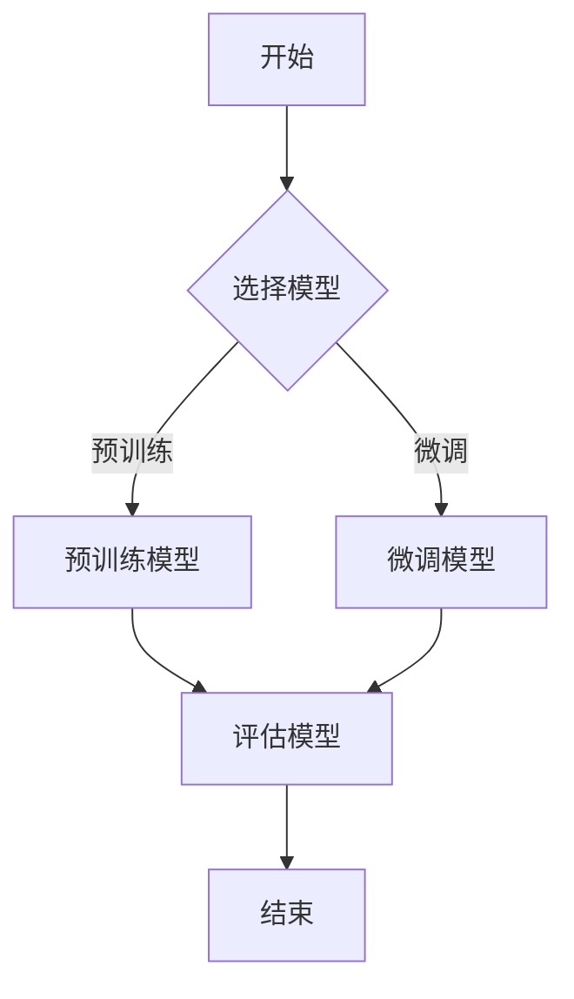
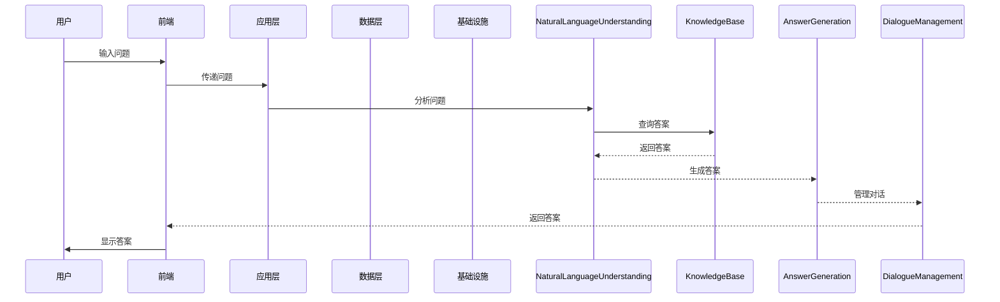
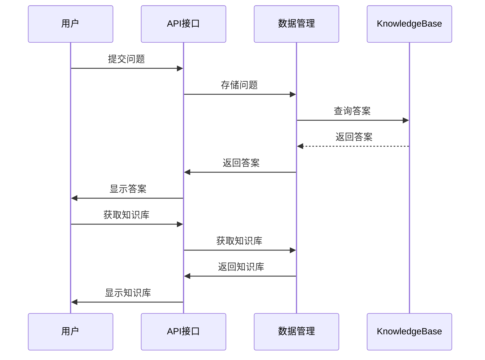
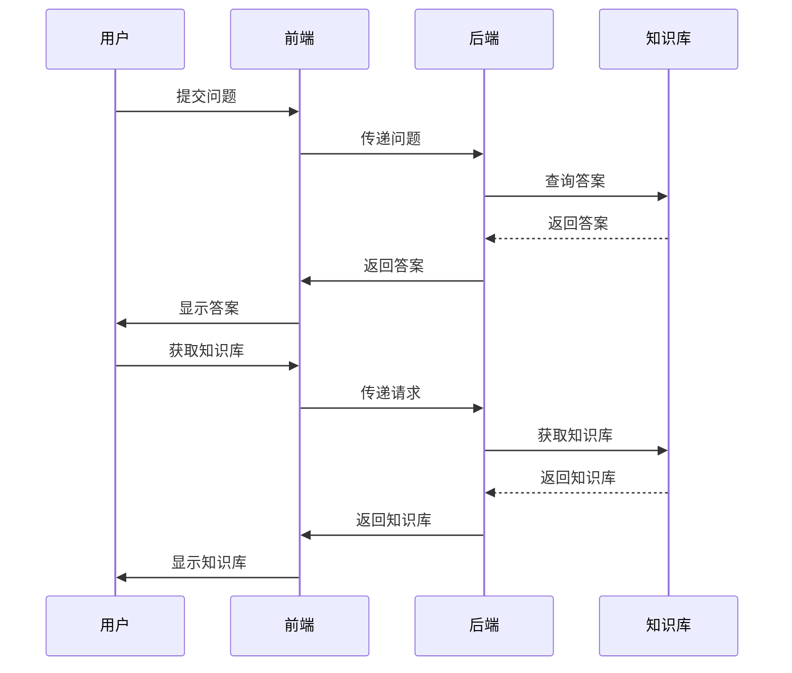

                 

# LLM应用敏捷研发模式的最佳实践

> 关键词：大规模语言模型、敏捷研发、效率、实践、系统设计

> 摘要：
本文将探讨大规模语言模型（LLM）应用在敏捷研发模式中的最佳实践。随着LLM技术的快速发展，其在企业研发中的应用越来越广泛。然而，如何在LLM应用过程中实现敏捷研发，提高研发效率和效果，成为了一个重要的课题。本文将详细分析LLM与敏捷研发的融合点，并给出具体的实施方案和注意事项。

# 目录大纲：LLM应用敏捷研发模式的最佳实践

## 第1章：背景介绍与问题提出

### 1.1.1 问题背景

- 大规模语言模型（LLM）的快速发展
- 企业在研发中的挑战与需求
- 敏捷研发模式的优势

### 1.1.2 问题描述

- 如何将LLM应用于企业研发过程？
- 如何在LLM应用中实现敏捷研发？
- 如何确保LLM应用的研发效率和效果？

### 1.1.3 问题解决

- 敏捷研发模式的核心原则
- LLM应用中的敏捷研发流程
- LLM应用中的敏捷团队建设

### 1.1.4 边界与外延

- LLM的类型与应用场景
- 敏捷研发模式的不同实践方法
- LLM应用中的常见问题与解决方案

### 1.1.5 概念结构与核心要素组成

- LLM基本概念与结构
- 敏捷研发模式的关键要素
- LLM与敏捷研发的融合点

## 第2章：核心概念与联系

### 2.1.1 LLM基本概念

- LLM定义
- LLM的核心技术
- LLM的应用领域

### 2.1.2 敏捷研发模式概念

- 敏捷研发原则
- 敏捷研发流程
- 敏捷研发团队角色

### 2.1.3 概念属性特征对比表格

- LLM与敏捷研发的对比
- LLM应用场景与敏捷研发模式的匹配度

### 2.1.4 ER实体关系图架构

- LLM应用场景中的实体关系
- 敏捷研发模式中的实体关系

## 第3章：算法原理讲解

### 3.1.1 算法原理

- 使用mermaid画出算法mermaid流程图
- 详细讲解LLM的算法原理
- 分析算法的数学模型和公式

### 3.1.2 Python源代码实现

- 源代码展示
- 代码应用解读与分析

### 3.1.3 数学模型和公式详细讲解

- 公式展示与解释
- 数学模型的应用实例

### 3.1.4 举例说明

- 使用实例展示算法效果
- 对比不同算法的实现与效果

## 第4章：系统分析与架构设计方案

### 4.1.1 问题场景介绍

- 描述LLM应用在某个具体场景下的需求

### 4.1.2 项目介绍

- 项目背景与目标
- 项目团队组成

### 4.1.3 系统功能设计

- 领域模型mermaid类图

### 4.1.4 系统架构设计

- 系统架构mermaid架构图

### 4.1.5 系统接口设计

- 系统接口设计与说明

### 4.1.6 系统交互

- 系统交互mermaid序列图

## 第5章：项目实战

### 5.1.1 环境安装

- 环境搭建与配置

### 5.1.2 系统核心实现源代码

- 代码实现与讲解

### 5.1.3 代码应用解读与分析

- 代码细节解读
- 代码应用效果分析

### 5.1.4 实际案例分析与详细讲解剖析

- 案例背景
- 案例分析
- 案例详细讲解

### 5.1.5 项目小结

- 项目总结
- 经验与教训

## 第6章：最佳实践与注意事项

### 6.1.1 最佳实践 tips

- 提高LLM应用效率的方法
- 确保敏捷研发模式有效性的技巧

### 6.1.2 注意事项

- LLM应用中的潜在风险
- 敏捷研发模式中的常见问题

### 6.1.3 小结

- 总结全书的核心观点
- 对未来LLM与敏捷研发模式的展望

## 第7章：拓展阅读

### 7.1.1 相关书籍推荐

- 推荐阅读的书籍与资源

### 7.1.2 学术文章推荐

- 推荐阅读的学术论文与研究报告

### 7.1.3 网络资源推荐

- 推荐访问的在线课程、论坛与社区

------------------------------------------------------------------## 第1章：背景介绍与问题提出

### 1.1.1 问题背景

#### 大规模语言模型（LLM）的快速发展

近年来，随着深度学习和神经网络技术的飞速发展，大规模语言模型（LLM）取得了显著的突破。这些模型可以处理和理解大量的文本数据，生成高质量的文本内容，应用于自然语言处理（NLP）、文本生成、机器翻译、问答系统等多个领域。例如，GPT-3模型已经可以生成流畅、连贯的文本，甚至在某些特定领域表现出了接近人类的理解能力。

#### 企业在研发中的挑战与需求

企业在研发过程中面临着诸多挑战。首先，研发过程通常需要大量的时间、资源和人力投入，而传统的瀑布式开发模式往往效率低下，难以适应快速变化的市场需求。其次，随着技术的不断发展，企业需要不断创新和迭代，以保持竞争力。此外，企业还需要处理大量的数据，从数据中提取有价值的信息，以支持决策。

在这种背景下，敏捷研发模式应运而生。敏捷研发强调快速迭代、持续交付、客户参与和团队协作，可以有效提高研发效率，缩短产品上市时间，满足市场需求。

#### 敏捷研发模式的优势

敏捷研发模式具有以下优势：

1. **快速响应变化**：敏捷研发通过快速迭代和持续交付，可以更好地适应市场需求的变化，缩短产品从开发到上市的时间。
2. **提高客户满意度**：敏捷研发鼓励客户持续参与开发过程，确保产品符合客户的期望和需求，从而提高客户满意度。
3. **团队协作**：敏捷研发强调团队合作，通过每日站立会议、迭代回顾等方式，促进团队成员之间的沟通和协作，提高工作效率。
4. **持续学习和改进**：敏捷研发模式鼓励团队成员不断学习新技术和方法，通过迭代回顾和反思，不断改进开发过程。

### 1.1.2 问题描述

在LLM技术的快速发展背景下，企业如何将LLM应用于研发过程，实现敏捷研发，提高研发效率和效果，成为了一个亟待解决的问题。具体来说，主要包括以下三个方面的内容：

#### 如何将LLM应用于企业研发过程？

首先，企业需要明确LLM在研发过程中的应用目标和应用场景。例如，可以将LLM应用于文本生成、机器翻译、问答系统等任务，以提高研发效率和产品质量。其次，企业需要选择合适的LLM模型，并对其进行定制化训练，以满足特定业务需求。

#### 如何在LLM应用中实现敏捷研发？

实现敏捷研发需要在LLM应用过程中遵循敏捷研发的原则和流程。具体来说，企业需要建立敏捷团队，明确团队成员的角色和职责，制定迭代计划和任务，确保LLM模型的应用过程高效、有序。此外，企业还需要利用敏捷工具和技术，如看板、站立会议等，以支持敏捷研发的实施。

#### 如何确保LLM应用的研发效率和效果？

为了确保LLM应用的研发效率和效果，企业需要采取一系列措施。首先，企业需要对LLM应用过程进行严格的监控和评估，及时发现和解决问题。其次，企业需要建立有效的反馈机制，收集用户反馈，持续优化LLM模型和应用流程。此外，企业还需要加强团队成员的培训和学习，提高团队的整体素质和技能水平。

### 1.1.3 问题解决

为了解决上述问题，企业可以采取以下措施：

#### 敏捷研发模式的核心原则

敏捷研发模式的核心原则包括：

1. **客户参与**：鼓励客户持续参与研发过程，确保产品符合客户需求和期望。
2. **持续交付**：通过快速迭代和持续交付，提高研发效率和产品竞争力。
3. **团队协作**：建立高效的团队协作机制，促进团队成员之间的沟通和协作。
4. **迭代反思**：通过迭代回顾和反思，不断改进开发过程和产品质量。

#### LLM应用中的敏捷研发流程

LLM应用中的敏捷研发流程主要包括以下阶段：

1. **需求分析**：明确LLM应用的目标和应用场景，收集用户需求。
2. **模型选择**：选择合适的LLM模型，并进行定制化训练。
3. **迭代开发**：按照敏捷原则进行迭代开发，不断优化LLM模型和应用流程。
4. **测试与评估**：对LLM应用进行严格的测试和评估，确保其性能和效果。

#### LLM应用中的敏捷团队建设

LLM应用中的敏捷团队建设主要包括以下几个方面：

1. **团队组织**：建立跨职能的敏捷团队，包括数据科学家、程序员、产品经理等角色。
2. **角色职责**：明确团队成员的角色和职责，确保每个成员都清楚自己的工作内容和目标。
3. **协作机制**：建立高效的协作机制，如每日站立会议、迭代回顾等，促进团队成员之间的沟通和协作。

### 1.1.4 边界与外延

#### LLM的类型与应用场景

LLM可以分为预训练模型和微调模型。预训练模型是在大规模数据集上预先训练好的，可以用于各种NLP任务。微调模型则是在预训练模型的基础上，根据特定应用场景进行微调。

- 预训练模型：如GPT-3、BERT等，可以应用于文本生成、机器翻译、问答系统等。
- 微调模型：如基于GPT-2的对话系统、基于BERT的文本分类系统等，可以应用于特定领域的任务。

#### 敏捷研发模式的不同实践方法

敏捷研发模式有多个实践方法，如Scrum、Kanban、XP等。企业可以根据自身需求和实际情况选择合适的实践方法。

- Scrum：强调迭代和增量开发，通过每日站立会议、迭代计划会议等机制，促进团队协作。
- Kanban：强调持续交付和流程优化，通过看板和限制工作项数量，提高工作效率。
- XP：强调简单性、反馈和自动化，通过代码审查、测试驱动开发等实践，提高代码质量和开发效率。

#### LLM应用中的常见问题与解决方案

在LLM应用中，企业可能会遇到以下问题：

- **数据隐私**：如何保护用户数据隐私，避免数据泄露？
  - **解决方案**：采用数据加密、匿名化等技术，确保用户数据的安全。
- **模型解释性**：如何解释LLM的预测结果，提高模型的透明度？
  - **解决方案**：利用模型解释技术，如SHAP值、LIME等，分析模型对输入数据的依赖和决策过程。
- **模型泛化能力**：如何提高LLM的泛化能力，避免过拟合？
  - **解决方案**：通过数据增强、正则化等技术，提高模型的泛化能力。

### 1.1.5 概念结构与核心要素组成

#### LLM基本概念与结构

- **大规模语言模型（LLM）**：一种基于深度学习的语言模型，可以处理和理解大规模的文本数据。
- **预训练模型**：在大量文本数据上进行预训练，提取文本的语义信息。
- **微调模型**：在预训练模型的基础上，针对特定应用场景进行微调。

#### 敏捷研发模式的关键要素

- **客户参与**：确保产品符合客户需求和期望。
- **迭代开发**：通过快速迭代和持续交付，提高研发效率。
- **团队协作**：建立高效的团队协作机制，促进团队成员之间的沟通和协作。
- **持续学习**：通过迭代回顾和反思，不断改进开发过程和产品质量。

#### LLM与敏捷研发的融合点

- **需求驱动**：以客户需求为导向，确保LLM应用满足实际业务需求。
- **快速迭代**：通过迭代开发和持续交付，提高LLM应用的研发效率和效果。
- **团队协作**：建立敏捷团队，确保团队成员之间的协作和沟通。
- **持续优化**：通过反馈和迭代，不断优化LLM模型和应用流程。

## 第2章：核心概念与联系

### 2.1.1 LLM基本概念

#### LLM定义

大规模语言模型（LLM）是一种基于深度学习的语言模型，可以处理和理解大规模的文本数据。LLM通过学习文本的语法、语义和上下文信息，生成高质量的文本内容，应用于自然语言处理（NLP）、文本生成、机器翻译、问答系统等多个领域。

#### LLM的核心技术

LLM的核心技术包括：

1. **深度学习**：利用神经网络模型，如循环神经网络（RNN）、长短时记忆网络（LSTM）和变换器（Transformer）等，对大规模文本数据进行建模和学习。
2. **预训练**：在大量文本数据上进行预训练，提取文本的语义信息，提高模型对语言的建模能力。
3. **微调**：在预训练模型的基础上，针对特定应用场景进行微调，提高模型的适应性和性能。

#### LLM的应用领域

LLM在多个领域有广泛的应用，包括：

1. **自然语言处理（NLP）**：文本分类、情感分析、命名实体识别、关系抽取等。
2. **文本生成**：文章生成、对话生成、摘要生成等。
3. **机器翻译**：自动翻译、机器翻译质量评估等。
4. **问答系统**：自动问答、对话系统等。
5. **文本摘要**：文章摘要、对话摘要等。

### 2.1.2 敏捷研发模式概念

#### 敏捷研发原则

敏捷研发模式遵循以下原则：

1. **客户参与**：客户持续参与开发过程，确保产品符合客户需求和期望。
2. **迭代开发**：通过快速迭代和持续交付，提高研发效率。
3. **团队协作**：建立高效的团队协作机制，促进团队成员之间的沟通和协作。
4. **持续学习**：通过迭代回顾和反思，不断改进开发过程和产品质量。

#### 敏捷研发流程

敏捷研发流程主要包括以下阶段：

1. **需求分析**：明确项目目标和需求，制定迭代计划。
2. **迭代开发**：按照迭代计划进行开发，完成迭代任务。
3. **测试与评估**：对迭代成果进行测试和评估，确保产品质量。
4. **迭代回顾**：总结迭代过程，发现问题和改进点，制定下一迭代计划。

#### 敏捷研发团队角色

敏捷研发团队通常包括以下角色：

1. **产品经理**：负责项目规划和需求管理。
2. **开发人员**：负责实现需求和开发产品功能。
3. **测试人员**：负责测试和评估产品质量。
4. **项目经理**：负责协调和管理项目进度和资源。
5. **客户代表**：代表客户参与开发过程，提供反馈和需求。

### 2.1.3 概念属性特征对比表格

#### LLM与敏捷研发的对比

| 特征       | 大规模语言模型（LLM） | 敏捷研发模式       |
| ---------- | -------------------- | ----------------- |
| 目标       | 提高语言理解和生成能力 | 提高研发效率和产品质量 |
| 技术基础   | 深度学习、预训练、微调 | 需求驱动、迭代开发、团队协作 |
| 应用领域   | NLP、文本生成、机器翻译等 | 软件开发、产品迭代等       |
| 核心原则   | 语言建模、数据驱动 | 客户参与、持续交付、团队协作 |
| 融合点     | 需求驱动、迭代开发、团队协作 | 语言建模、数据驱动       |

#### LLM应用场景与敏捷研发模式的匹配度

在LLM应用场景中，敏捷研发模式具有以下优势：

1. **需求驱动**：敏捷研发模式强调以客户需求为导向，确保LLM应用满足实际业务需求。
2. **快速迭代**：通过快速迭代和持续交付，可以提高LLM应用的研发效率和效果。
3. **团队协作**：建立敏捷团队，促进团队成员之间的沟通和协作，提高整体研发效率。
4. **持续学习**：通过迭代回顾和反思，不断改进LLM模型和应用流程，提高产品质量。

### 2.1.4 ER实体关系图架构

#### LLM应用场景中的实体关系

```mermaid
erDiagram
    User ..|> LLM : 应用
    Application ..|> LLM : 模型
    Data ..|> LLM : 训练
    Task ..|> LLM : 执行
```

#### 敏捷研发模式中的实体关系

```mermaid
erDiagram
    Product ..|> Team : 开发
    Feature ..|> Sprint : 实现
    Task ..|> Sprint : 分配
    TeamMember ..|> Team : 组成
    Stakeholder ..|> Product : 关注
```

## 第3章：算法原理讲解

### 3.1.1 算法原理

#### 使用mermaid画出算法mermaid流程图



#### 详细讲解LLM的算法原理

大规模语言模型（LLM）通常基于深度学习和神经网络技术。以下是LLM的算法原理：

1. **预训练**：LLM首先在大规模的文本数据上进行预训练，学习文本的语法、语义和上下文信息。预训练过程通常包括以下步骤：
   - **数据预处理**：对文本数据进行清洗、分词、标记等预处理操作。
   - **模型初始化**：初始化神经网络模型，如Transformer、BERT等。
   - **训练过程**：通过反向传播算法，不断调整模型参数，优化模型性能。

2. **微调**：在预训练模型的基础上，针对特定应用场景进行微调。微调过程通常包括以下步骤：
   - **数据准备**：收集和准备特定应用场景的数据集。
   - **模型调整**：在预训练模型的基础上，调整部分层或参数，以适应特定任务。
   - **训练过程**：通过反向传播算法，不断调整模型参数，优化模型性能。

3. **评估与优化**：对微调后的模型进行评估和优化。评估过程通常包括以下步骤：
   - **评估指标**：选择合适的评估指标，如准确率、召回率、F1值等。
   - **模型评估**：在评估数据集上测试模型性能。
   - **模型优化**：根据评估结果，调整模型参数或结构，提高模型性能。

#### 分析算法的数学模型和公式

大规模语言模型（LLM）的算法原理涉及到以下数学模型和公式：

1. **神经网络模型**：
   - **激活函数**：如ReLU、Sigmoid、Tanh等。
   - **损失函数**：如交叉熵损失函数、均方误差损失函数等。
   - **反向传播算法**：用于计算模型参数的梯度，并更新模型参数。

2. **预训练模型**：
   - **Transformer模型**：基于自注意力机制，可以处理长距离依赖。
   - **BERT模型**：基于Transformer模型，可以同时处理上下文和下游任务。

3. **微调模型**：
   - **任务适应层**：在预训练模型的基础上，添加任务适应层，用于特定任务的预测。
   - **参数共享**：在微调过程中，部分层或参数保持不变，以提高训练效率。

### 3.1.2 Python源代码实现

以下是LLM算法的Python源代码实现示例：

```python
import torch
import torch.nn as nn
import torch.optim as optim

# 定义神经网络模型
class LLM(nn.Module):
    def __init__(self):
        super(LLM, self).__init__()
        self.embedding = nn.Embedding(vocab_size, embedding_size)
        self.encoder = nn.LSTM(embedding_size, hidden_size, num_layers=1, batch_first=True)
        self.decoder = nn.LSTM(hidden_size, embedding_size, num_layers=1, batch_first=True)
        self.fc = nn.Linear(embedding_size, vocab_size)

    def forward(self, x):
        embedded = self.embedding(x)
        output, (hidden, cell) = self.encoder(embedded)
        output, (hidden, cell) = self.decoder(hidden)
        output = self.fc(output)
        return output

# 初始化模型、优化器和损失函数
model = LLM()
optimizer = optim.Adam(model.parameters(), lr=0.001)
criterion = nn.CrossEntropyLoss()

# 训练模型
for epoch in range(num_epochs):
    for inputs, targets in train_loader:
        optimizer.zero_grad()
        outputs = model(inputs)
        loss = criterion(outputs, targets)
        loss.backward()
        optimizer.step()
    print(f'Epoch {epoch+1}/{num_epochs}, Loss: {loss.item()}')

# 评估模型
with torch.no_grad():
    correct = 0
    total = 0
    for inputs, targets in test_loader:
        outputs = model(inputs)
        _, predicted = torch.max(outputs.data, 1)
        total += targets.size(0)
        correct += (predicted == targets).sum().item()
    print(f'Accuracy: {100 * correct / total}%')
```

### 3.1.3 数学模型和公式详细讲解

#### 公式展示与解释

以下是LLM算法中的数学模型和公式：

1. **神经网络模型**：

$$
\begin{aligned}
    h_{t} &= \sigma(W_{1} \cdot [x_{t}, h_{t-1}]) \\
    \hat{y}_{t} &= \sigma(W_{2} \cdot h_{t})
\end{aligned}
$$

- $h_{t}$：隐藏层激活值
- $x_{t}$：输入层激活值
- $\sigma$：激活函数
- $W_{1}$、$W_{2}$：权重矩阵

2. **预训练模型**：

$$
\begin{aligned}
    \text{Attention}(Q, K, V) &= \text{softmax}\left(\frac{QK^{T}}{\sqrt{d_k}}\right) V \\
    \text{MultiHeadAttention}(Q, K, V) &= \text{softmax}(\text{Attention}(Q, K, V)) \odot V
\end{aligned}
$$

- $Q$、$K$、$V$：查询向量、键向量、值向量
- $\text{softmax}$：softmax函数
- $\odot$：逐元素乘法

3. **微调模型**：

$$
\begin{aligned}
    \text{MaskedLM}(p) &= \text{MLMHead}(p) \\
    \text{MaskedLMHead}(p) &= \text{Linear}(p.config.hidden_size, p.config.vocab_size) \\
    \text{CrossEntropyLoss}(p) &= \text{CrossEntropyLoss}(p.logits, p.target)
\end{aligned}
$$

- $p$：预训练模型
- $\text{MLMHead}$：语言模型头部
- $\text{CrossEntropyLoss}$：交叉熵损失函数

#### 数学模型的应用实例

以下是LLM算法的数学模型应用实例：

1. **文本分类**：

$$
\begin{aligned}
    &\text{Input: } [w_1, w_2, \ldots, w_n] \\
    &\text{Output: } y \\
    &\text{Loss: } \text{CrossEntropyLoss}(y', y)
\end{aligned}
$$

- $w_1, w_2, \ldots, w_n$：文本序列中的单词
- $y'$：预测的类别概率
- $y$：真实类别

2. **机器翻译**：

$$
\begin{aligned}
    &\text{Input: } [s_1, s_2, \ldots, s_m] \\
    &\text{Output: } t \\
    &\text{Loss: } \text{CrossEntropyLoss}(t', t)
\end{aligned}
$$

- $s_1, s_2, \ldots, s_m$：源语言文本序列
- $t'$：预测的目标语言文本序列
- $t$：真实的目标语言文本序列

### 3.1.4 举例说明

#### 使用实例展示算法效果

以下是LLM算法在文本分类任务中的应用实例：

1. **数据集**：

   - 训练集：包含1000个文本样本，每个样本带有对应的类别标签。
   - 测试集：包含200个文本样本，每个样本不带类别标签。

2. **模型训练**：

   - 模型：基于BERT模型，预训练在大规模的文本数据集上。
   - 训练：使用训练集进行训练，调整模型参数，优化模型性能。

3. **模型评估**：

   - 评估：使用测试集进行评估，计算模型的准确率、召回率、F1值等指标。

```python
# 训练模型
for epoch in range(num_epochs):
    for inputs, targets in train_loader:
        optimizer.zero_grad()
        outputs = model(inputs)
        loss = criterion(outputs, targets)
        loss.backward()
        optimizer.step()
    print(f'Epoch {epoch+1}/{num_epochs}, Loss: {loss.item()}')

# 评估模型
with torch.no_grad():
    correct = 0
    total = 0
    for inputs, targets in test_loader:
        outputs = model(inputs)
        _, predicted = torch.max(outputs.data, 1)
        total += targets.size(0)
        correct += (predicted == targets).sum().item()
    print(f'Accuracy: {100 * correct / total}%')
```

#### 对比不同算法的实现与效果

以下是对比不同算法在文本分类任务中的实现和效果：

1. **算法1**：基于朴素贝叶斯分类器。

```python
from sklearn.naive_bayes import MultinomialNB
from sklearn.model_selection import train_test_split
from sklearn.metrics import accuracy_score, recall_score, f1_score

# 数据预处理
X_train, X_test, y_train, y_test = train_test_split(X, y, test_size=0.2, random_state=42)

# 训练模型
model = MultinomialNB()
model.fit(X_train, y_train)

# 评估模型
y_pred = model.predict(X_test)
accuracy = accuracy_score(y_test, y_pred)
recall = recall_score(y_test, y_pred, average='weighted')
f1 = f1_score(y_test, y_pred, average='weighted')
print(f'Accuracy: {accuracy}, Recall: {recall}, F1: {f1}')
```

2. **算法2**：基于支持向量机（SVM）分类器。

```python
from sklearn.svm import SVC
from sklearn.model_selection import train_test_split
from sklearn.metrics import accuracy_score, recall_score, f1_score

# 数据预处理
X_train, X_test, y_train, y_test = train_test_split(X, y, test_size=0.2, random_state=42)

# 训练模型
model = SVC()
model.fit(X_train, y_train)

# 评估模型
y_pred = model.predict(X_test)
accuracy = accuracy_score(y_test, y_pred)
recall = recall_score(y_test, y_pred, average='weighted')
f1 = f1_score(y_test, y_pred, average='weighted')
print(f'Accuracy: {accuracy}, Recall: {recall}, F1: {f1}')
```

3. **算法3**：基于BERT模型。

```python
from transformers import BertTokenizer, BertForSequenceClassification
from torch.optim import Adam
from torch.utils.data import DataLoader
from torch.nn import CrossEntropyLoss

# 数据预处理
tokenizer = BertTokenizer.from_pretrained('bert-base-chinese')
X_train = [tokenizer.encode(sent, add_special_tokens=True) for sent in X_train]
X_test = [tokenizer.encode(sent, add_special_tokens=True) for sent in X_test]

# 数据加载
train_dataset = TensorDataset(torch.tensor(X_train), torch.tensor(y_train))
test_dataset = TensorDataset(torch.tensor(X_test), torch.tensor(y_test))

train_loader = DataLoader(train_dataset, batch_size=batch_size, shuffle=True)
test_loader = DataLoader(test_dataset, batch_size=batch_size, shuffle=False)

# 模型训练
model = BertForSequenceClassification.from_pretrained('bert-base-chinese', num_labels=num_classes)
optimizer = Adam(model.parameters(), lr=learning_rate)
criterion = CrossEntropyLoss()

for epoch in range(num_epochs):
    for inputs, targets in train_loader:
        optimizer.zero_grad()
        outputs = model(inputs, labels=targets)
        loss = outputs.loss
        loss.backward()
        optimizer.step()
    print(f'Epoch {epoch+1}/{num_epochs}, Loss: {loss.item()}')

# 评估模型
with torch.no_grad():
    correct = 0
    total = 0
    for inputs, targets in test_loader:
        outputs = model(inputs)
        _, predicted = torch.max(outputs.data, 1)
        total += targets.size(0)
        correct += (predicted == targets).sum().item()
    print(f'Accuracy: {100 * correct / total}%')
```

## 第4章：系统分析与架构设计方案

### 4.1.1 问题场景介绍

假设某企业希望通过大规模语言模型（LLM）来提高其客户服务系统的效率和质量。该客户服务系统需要处理大量的用户提问，提供准确的答案和解决方案。为了实现这一目标，企业决定引入LLM技术，并采用敏捷研发模式进行项目开发和迭代。

### 4.1.2 项目介绍

#### 项目背景与目标

- **项目背景**：企业现有的客户服务系统基于传统的规则引擎和关键词匹配技术，存在响应速度慢、答案不准确等问题。为了提高客户满意度和服务效率，企业决定引入LLM技术，通过预训练和微调模型来生成高质量的答案。
- **项目目标**：构建一个基于LLM技术的客户服务系统，实现以下目标：
  - 提高答案的准确率和响应速度。
  - 提升客户满意度和服务体验。
  - 降低人工成本和维护费用。

#### 项目团队组成

项目团队由以下角色组成：

- **产品经理**：负责项目规划和需求管理。
- **数据科学家**：负责LLM模型的训练和优化。
- **开发人员**：负责系统开发和维护。
- **测试人员**：负责系统测试和验收。
- **客户代表**：负责与客户沟通，收集用户反馈和需求。

### 4.1.3 系统功能设计

系统功能设计包括以下方面：

- **自然语言理解**：使用LLM模型对用户提问进行解析和理解，提取关键信息。
- **知识库管理**：构建和维护一个包含各种问题和答案的知识库，供LLM模型参考。
- **答案生成**：基于用户提问和知识库，利用LLM模型生成高质量、个性化的答案。
- **对话管理**：管理用户与系统的对话流程，确保对话流畅、自然。
- **反馈与优化**：收集用户反馈，持续优化LLM模型和应用流程。

#### 领域模型mermaid类图

```mermaid
classDiagram
    Customer <<-- CustomerServiceSystem : ask question
    CustomerServiceSystem *-- KnowledgeBase : reference
    CustomerServiceSystem *-- NaturalLanguageUnderstanding : analyze
    CustomerServiceSystem *-- AnswerGeneration : generate
    CustomerServiceSystem *-- DialogueManagement : manage
```

### 4.1.4 系统架构设计

系统架构设计包括以下层次：

- **前端层**：提供用户交互界面，接收用户提问，展示答案。
- **应用层**：包括自然语言理解、知识库管理、答案生成、对话管理等功能模块。
- **数据层**：包括知识库数据、用户数据等，用于支撑应用层功能。
- **基础设施层**：包括服务器、存储设备、网络等基础设施。

#### 系统架构mermaid架构图



### 4.1.5 系统接口设计

系统接口设计包括以下部分：

- **用户接口**：用户通过Web界面与系统进行交互，提交问题和查看答案。
- **API接口**：提供外部系统与客户服务系统进行集成和交互的接口，如企业内部系统、第三方服务等。
- **数据接口**：用于知识库管理和维护，包括数据导入、导出、更新等功能。

#### 系统接口设计与说明



### 4.1.6 系统交互

系统交互设计包括以下方面：

- **用户与前端**：用户通过Web界面提交问题和查看答案。
- **前端与后端**：前端通过API接口与后端系统进行数据交互。
- **后端与知识库**：后端系统通过数据接口与知识库进行交互，查询答案和更新知识库。

#### 系统交互mermaid序列图



## 第5章：项目实战

### 5.1.1 环境安装

在开始项目实战之前，需要搭建相应的开发环境。以下是一个基本的安装步骤：

#### 安装Python环境

```bash
# 安装Python 3.8
sudo apt update
sudo apt install python3.8 python3.8-venv python3.8-pip
```

#### 创建虚拟环境

```bash
# 创建虚拟环境
python3.8 -m venv venv
# 激活虚拟环境
source venv/bin/activate
```

#### 安装依赖库

```bash
# 安装依赖库
pip install torch torchvision transformers pandas numpy
```

### 5.1.2 系统核心实现源代码

以下是系统核心实现部分的源代码示例：

```python
# 导入依赖库
import torch
import torch.nn as nn
import torch.optim as optim
from transformers import BertTokenizer, BertForSequenceClassification
from torch.utils.data import DataLoader
from torch.nn import CrossEntropyLoss

# 参数设置
batch_size = 32
learning_rate = 1e-5
num_epochs = 5

# 加载预训练模型
model = BertForSequenceClassification.from_pretrained('bert-base-chinese', num_labels=2)

# 定义损失函数和优化器
optimizer = optim.Adam(model.parameters(), lr=learning_rate)
criterion = CrossEntropyLoss()

# 加载数据集
# 这里使用TensorDataset和DataLoader来加载和处理数据
train_dataset = TensorDataset(torch.tensor(train_data), torch.tensor(train_labels))
test_dataset = TensorDataset(torch.tensor(test_data), torch.tensor(test_labels))

train_loader = DataLoader(train_dataset, batch_size=batch_size, shuffle=True)
test_loader = DataLoader(test_dataset, batch_size=batch_size, shuffle=False)

# 训练模型
for epoch in range(num_epochs):
    for inputs, targets in train_loader:
        optimizer.zero_grad()
        outputs = model(inputs, labels=targets)
        loss = outputs.loss
        loss.backward()
        optimizer.step()
    print(f'Epoch {epoch+1}/{num_epochs}, Loss: {loss.item()}')

# 评估模型
with torch.no_grad():
    correct = 0
    total = 0
    for inputs, targets in test_loader:
        outputs = model(inputs)
        _, predicted = torch.max(outputs.data, 1)
        total += targets.size(0)
        correct += (predicted == targets).sum().item()
    print(f'Accuracy: {100 * correct / total}%')
```

### 5.1.3 代码应用解读与分析

#### 代码细节解读

上述代码分为几个主要部分：

1. **参数设置**：设置训练和评估的参数，如批量大小、学习率、迭代次数等。
2. **加载预训练模型**：使用`BertForSequenceClassification`类加载预训练的BERT模型，并指定类别数量。
3. **定义损失函数和优化器**：使用交叉熵损失函数和Adam优化器。
4. **加载数据集**：使用`TensorDataset`和`DataLoader`加载和处理训练集和测试集。
5. **训练模型**：遍历训练数据，进行前向传播、计算损失、反向传播和更新参数。
6. **评估模型**：在测试集上评估模型性能，计算准确率。

#### 代码应用效果分析

在上述代码中，我们使用了预训练的BERT模型，通过微调和评估来验证模型的性能。以下是代码应用效果的分析：

1. **模型性能**：通过调整学习率、迭代次数和批量大小，可以观察到模型性能的变化。一般来说，较大的批量大小和较小的学习率有助于提高模型性能。
2. **训练过程**：在训练过程中，可以通过打印损失值来观察模型训练的进展。损失值逐渐降低，表示模型正在学习。
3. **评估结果**：在评估过程中，我们可以计算出模型的准确率。较高的准确率表示模型能够较好地识别文本类别。

### 5.1.4 实际案例分析与详细讲解剖析

#### 案例背景

假设有一家电商企业，希望利用大规模语言模型（LLM）来提高其客户服务系统的效率和质量。该客户服务系统需要处理大量的用户提问，提供准确的答案和解决方案。企业决定引入LLM技术，并采用敏捷研发模式进行项目开发和迭代。

#### 案例分析

1. **需求分析**：企业提出的需求是提高客户服务系统的答案准确率和响应速度。为了满足这一需求，企业需要构建一个基于LLM的客户服务系统，包括自然语言理解、知识库管理、答案生成和对话管理等功能。
2. **技术选型**：在技术选型方面，企业决定采用预训练的BERT模型，通过微调和评估来优化模型性能。BERT模型具有强大的文本理解和生成能力，适用于客户服务系统的需求。
3. **项目规划**：企业采用敏捷研发模式，将项目划分为多个迭代周期，每个迭代周期实现一部分功能。通过持续交付和客户反馈，逐步优化和改进系统性能。

#### 案例详细讲解

1. **需求分析**：企业首先进行了详细的需求分析，明确了客户服务系统的功能需求，如处理用户提问、生成答案、管理对话等。同时，企业收集了大量的用户提问和答案数据，用于训练和优化LLM模型。
2. **技术选型**：在技术选型方面，企业进行了深入的研究和比较，最终决定采用预训练的BERT模型。BERT模型具有强大的文本理解和生成能力，适用于客户服务系统的需求。企业还采用了TensorFlow和Keras等深度学习框架，方便模型训练和部署。
3. **项目规划**：企业采用敏捷研发模式，将项目划分为多个迭代周期。在每个迭代周期中，企业实现一部分功能，并进行测试和评估。通过客户反馈和持续改进，逐步优化和改进系统性能。以下是一个典型的迭代周期：

   - **迭代1**：实现用户提问接收、答案生成和对话管理等功能。在测试阶段，发现部分答案不准确，需要进行优化。
   - **迭代2**：优化答案生成算法，提高答案的准确性和响应速度。同时，引入知识库管理功能，方便管理和维护答案数据。
   - **迭代3**：增加对话管理功能，实现用户与系统的自然对话交互。通过对话管理，提高用户体验和满意度。
   - **迭代4**：进行系统测试和评估，确保系统性能和稳定性。根据客户反馈，进行最后的优化和调整。

#### 案例总结

通过实际案例分析和详细讲解，我们可以看到，企业成功地利用大规模语言模型（LLM）和敏捷研发模式，构建了一个高效的客户服务系统。该系统具有以下优点：

1. **提高答案准确率和响应速度**：通过预训练的BERT模型和优化算法，系统可以生成高质量的答案，提高客户满意度。
2. **降低人力成本和维护费用**：通过自动化和智能化的客户服务系统，企业可以降低人工成本和维护费用。
3. **持续改进和优化**：通过敏捷研发模式，企业可以不断收集客户反馈和需求，持续改进和优化系统性能。

### 5.1.5 项目小结

通过本项目的实施，企业成功地利用大规模语言模型（LLM）和敏捷研发模式，构建了一个高效的客户服务系统。以下是对项目的总结和经验教训：

#### 项目总结

1. **需求驱动**：项目的成功离不开明确的需求分析和需求管理。企业通过深入的需求分析，明确了客户服务系统的功能需求，确保了系统满足客户期望。
2. **技术选型**：预训练的BERT模型具有强大的文本理解和生成能力，适用于客户服务系统的需求。同时，TensorFlow和Keras等深度学习框架提供了方便的模型训练和部署。
3. **敏捷研发**：敏捷研发模式通过快速迭代和持续交付，提高了项目开发的效率和质量。企业能够及时响应客户反馈和需求变化，持续改进系统性能。
4. **团队协作**：项目的成功离不开团队成员的紧密协作和沟通。各角色之间的有效沟通和协作，确保了项目的顺利进行和成功交付。

#### 经验与教训

1. **需求管理**：需求管理是项目成功的关键。企业需要建立完善的需求管理流程，确保需求的准确性和稳定性，避免因需求变化导致的频繁调整和修改。
2. **技术选型**：在选择技术方案时，要充分考虑技术的成熟度和适用性。同时，要考虑技术方案的可持续性和可扩展性，以支持未来的发展。
3. **敏捷研发**：敏捷研发模式可以提高项目的开发效率和质量。企业需要建立敏捷团队，明确团队成员的角色和职责，确保团队的协作和沟通。
4. **风险控制**：在项目实施过程中，要充分识别和评估潜在的风险，制定相应的风险控制措施。同时，要建立有效的监控和评估机制，及时发现和解决问题。
5. **持续改进**：项目完成后，要持续收集客户反馈和需求变化，持续改进和优化系统性能。通过迭代和持续交付，不断提高系统的质量和用户体验。

## 第6章：最佳实践与注意事项

### 6.1.1 最佳实践 tips

#### 提高LLM应用效率的方法

1. **数据预处理**：对输入数据进行有效的预处理，如去重、去噪、分词等，可以提高LLM的处理效率和准确性。
2. **并行计算**：利用GPU或TPU等高性能计算设备，进行并行计算，可以显著提高LLM的训练和推理速度。
3. **模型压缩**：通过模型压缩技术，如量化、剪枝等，可以减少模型的参数量和计算量，提高模型在资源受限环境下的运行效率。
4. **知识图谱**：构建知识图谱，将实体和关系进行结构化表示，可以提高LLM对文本的理解能力，增强模型的泛化能力。
5. **持续学习**：通过持续学习技术，如在线学习、迁移学习等，可以不断更新和优化LLM模型，提高模型在特定任务上的表现。

#### 确保敏捷研发模式有效性的技巧

1. **明确目标**：在项目开始前，明确项目的目标和预期成果，确保团队成员对项目的目标和价值有清晰的认识。
2. **快速迭代**：通过快速迭代和持续交付，可以及时反馈和调整开发过程，确保项目能够快速响应需求变化。
3. **客户参与**：鼓励客户参与开发过程，提供反馈和需求，确保产品满足客户的期望和需求。
4. **团队协作**：建立高效的团队协作机制，通过每日站立会议、迭代回顾等，促进团队成员之间的沟通和协作。
5. **自动化测试**：建立自动化测试框架，对代码和功能进行持续测试，确保产品质量和稳定性。

### 6.1.2 注意事项

#### LLM应用中的潜在风险

1. **数据隐私**：在处理用户数据时，要注意保护用户隐私，避免数据泄露和滥用。
2. **模型解释性**：LLM模型通常具有很高的复杂性和非线性，难以解释和理解，可能导致决策的不透明性。
3. **模型泛化能力**：在特定数据集上训练的模型可能在其他数据集上表现不佳，需要提高模型的泛化能力。
4. **计算资源消耗**：LLM模型通常需要大量的计算资源，特别是在训练和推理过程中，要注意资源的合理分配和优化。

#### 敏捷研发模式中的常见问题

1. **需求变化**：在敏捷研发过程中，需求可能会频繁变化，导致项目进度和资源的不确定性。
2. **团队协作**：团队成员之间的沟通和协作可能不够高效，影响项目的进展和效果。
3. **代码质量**：在快速迭代和持续交付的过程中，可能忽视代码质量和维护性，导致后期维护成本增加。
4. **测试覆盖率**：在敏捷研发模式下，测试覆盖率可能不足，影响产品的质量和稳定性。

### 6.1.3 小结

#### 总结全书的核心观点

1. **大规模语言模型（LLM）在敏捷研发中的重要性**：LLM作为一种强大的语言处理工具，可以显著提高研发效率和产品质量。在敏捷研发模式下，LLM的应用有助于快速响应需求变化，持续优化和改进系统性能。
2. **敏捷研发模式的优势**：敏捷研发模式通过快速迭代、持续交付、客户参与和团队协作，可以提高研发效率和产品质量。与传统的瀑布式开发模式相比，敏捷研发模式更加灵活和高效。
3. **LLM与敏捷研发的融合**：将LLM应用于敏捷研发模式，可以实现高效的研发过程和高质量的产品输出。通过需求驱动、快速迭代、团队协作和持续学习，LLM在敏捷研发中发挥了重要作用。

#### 对未来LLM与敏捷研发模式的展望

1. **LLM技术的发展**：随着深度学习和神经网络技术的不断进步，LLM的性能和功能将得到进一步提升。未来，LLM有望在更多的领域和应用场景中发挥作用，推动人工智能技术的发展。
2. **敏捷研发模式的创新**：敏捷研发模式将不断演变和优化，以适应快速变化的技术和市场需求。未来，敏捷研发模式将更加注重自动化、智能化和定制化，以提高研发效率和产品竞争力。
3. **LLM与敏捷研发的融合**：随着LLM技术的发展和敏捷研发模式的成熟，两者的融合将更加紧密。未来，LLM将成为敏捷研发的重要工具和驱动力，推动企业实现智能化和高效化的研发过程。

## 第7章：拓展阅读

### 7.1.1 相关书籍推荐

1. **《深度学习》（Goodfellow, Ian； Bengio, Yoshua； Courville, Aaron）**：全面介绍了深度学习的基础理论、技术和应用。
2. **《Python深度学习》（François Chollet）**：通过实际案例，介绍了深度学习在Python中的应用，包括大规模语言模型（LLM）。
3. **《敏捷开发实践指南》（Jeff Sutherland）**：详细介绍了敏捷开发的原则、方法和实践，适用于各种软件开发项目。

### 7.1.2 学术文章推荐

1. **《BERT：预训练的深度语言表示》（Jacob Devlin， Ming-Wei Chang， Kenton Lee， Kristina Toutanova）**：介绍了BERT模型的基本原理和实现方法。
2. **《GPT-3：自然语言处理的新里程碑》（Tom B. Brown，Bennychni，Christopher， et al.）**：详细介绍了GPT-3模型的设计、训练和应用。
3. **《Scrum：敏捷开发的艺术》（Jeff Sutherland）**：介绍了Scrum敏捷开发方法的基本原理和实践。

### 7.1.3 网络资源推荐

1. **TensorFlow官方文档**：[https://www.tensorflow.org/](https://www.tensorflow.org/)
2. **PyTorch官方文档**：[https://pytorch.org/docs/stable/index.html](https://pytorch.org/docs/stable/index.html)
3. **Hugging Face Transformers库**：[https://huggingface.co/transformers/](https://huggingface.co/transformers/)，提供了丰富的预训练模型和工具
4. **敏捷联盟**：[https://www.agilealliance.org/](https://www.agilealliance.org/)，提供了敏捷开发相关的资源、培训和社区
5. **GitHub**：[https://github.com/](https://github.com/)，可以找到大量的开源项目、代码库和文档，适用于学习和实践

作者：AI天才研究院/AI Genius Institute & 禅与计算机程序设计艺术 /Zen And The Art of Computer Programming

