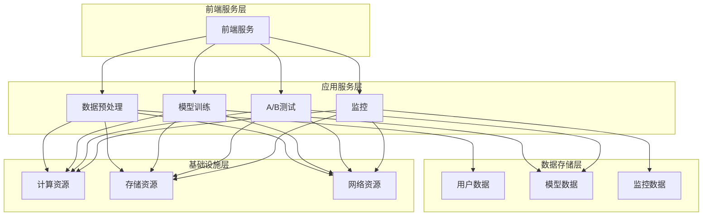
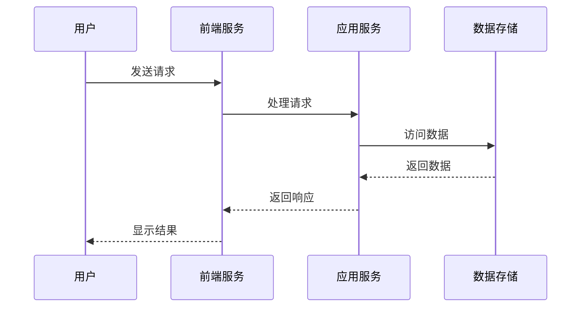
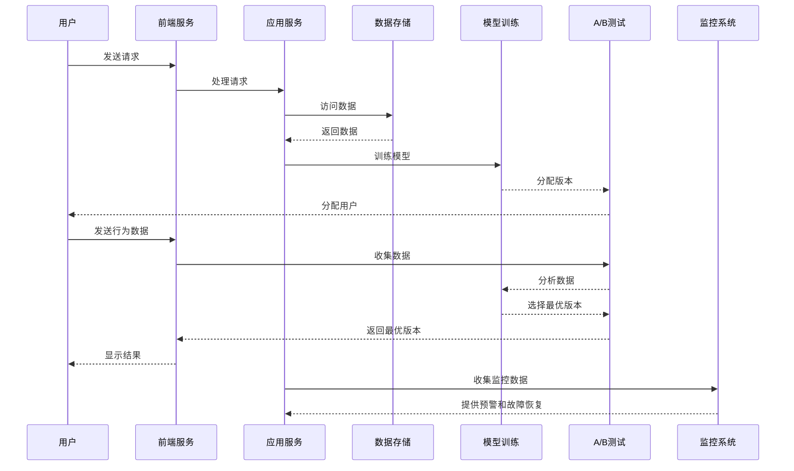

                 


### 1.2.1 LLM应用的挑战
#### 1.2.1.1 数据质量与隐私问题
- **背景介绍**：随着人工智能技术的发展，特别是大规模语言模型（LLM）的应用，数据的质量和隐私变得尤为重要。数据质量直接影响到模型的效果，而隐私问题则是现代社会的热点议题。
- **问题分析**：数据质量问题主要体现在数据缺失、数据不准确、数据不一致等。隐私问题则涉及到用户数据的收集、存储和使用过程中可能面临的道德和法律规定问题。
- **解决方案**：确保数据质量的方法包括数据清洗、数据验证和数据标准化。隐私保护方面，可以考虑使用差分隐私、同态加密等技术，以及制定明确的隐私政策和使用协议。

#### 1.2.1.2 模型复杂性与可解释性问题
- **背景介绍**：LLM模型的复杂度越来越高，这带来了模型效果提升的同时，也带来了可解释性问题。用户和企业需要知道模型是如何做出决策的，以便进行信任和优化。
- **问题分析**：模型复杂性体现在参数数量庞大、模型结构复杂，这使得模型难以理解和解释。可解释性问题是用户和企业无法直观地理解模型的决策过程，从而影响信任和使用。
- **解决方案**：提高模型可解释性可以通过模型简化、可视化技术、解释性模型开发等方法实现。例如，使用决策树、规则提取等技术来简化模型结构，或者使用可视化工具来展示模型决策过程。

#### 1.2.1.3 模型迭代与优化的挑战
- **背景介绍**：为了不断提升LLM的应用效果，模型需要不断迭代和优化。这一过程涉及到大量的计算资源和时间成本。
- **问题分析**：模型迭代和优化过程中，如何有效地利用计算资源，如何平衡训练时间和模型效果，以及如何处理模型过拟合和欠拟合等问题。
- **解决方案**：可以通过分布式训练、并行计算等技术来提高计算效率。在优化过程中，可以使用交叉验证、网格搜索等方法来找到最优参数。此外，引入正则化、Dropout等技术来防止过拟合。

## 1.3 问题解决
### 1.3.1 综合解决方案
- **背景介绍**：针对上述挑战，需要综合运用多种技术和方法来解决问题。
- **问题分析**：综合解决方案需要考虑技术、管理和组织层面的因素，以确保问题的全面解决。
- **解决方案**：
  1. **技术层面**：采用先进的数据处理和隐私保护技术，提高模型的可解释性，优化模型迭代和优化流程。
  2. **管理层面**：建立有效的数据管理机制，确保数据质量，制定清晰的隐私保护政策，提高团队的协作效率。
  3. **组织层面**：建立跨部门的协作机制，确保不同团队在数据、模型和优化方面进行有效沟通和协作。

### 1.3.2 实施策略
- **背景介绍**：为了将综合解决方案付诸实践，需要制定具体的实施策略。
- **问题分析**：实施策略需要考虑项目的阶段性目标、资源分配、风险评估等因素。
- **解决方案**：
  1. **阶段性目标**：明确项目各阶段的目标，确保每个阶段都能达到预期效果。
  2. **资源分配**：合理分配人力、物力和财力资源，确保项目顺利进行。
  3. **风险评估**：识别项目潜在的风险，并制定相应的应对措施。

## 1.4 边界与外延
### 1.4.1 边界条件
- **背景介绍**：明确问题的边界条件有助于更好地理解问题的范围和限制。
- **边界条件**：
  1. **数据边界**：数据集的大小、质量和多样性。
  2. **模型边界**：模型的可解释性和计算资源限制。
  3. **环境边界**：硬件资源和网络环境的限制。

### 1.4.2 外延拓展
- **背景介绍**：探索问题的外延有助于发现更多潜在的应用场景和解决方案。
- **外延拓展**：
  1. **跨领域应用**：LLM在其他领域的应用，如金融、医疗等。
  2. **隐私保护技术**：深入研究差分隐私、同态加密等技术的应用。
  3. **模型优化**：探讨新的模型优化方法和算法。

### 1.4.3 概念结构与核心要素组成
- **背景介绍**：为了更好地理解问题，需要分析其概念结构和核心要素。
- **概念结构**：
  - **核心概念**：大规模语言模型（LLM）、A/B测试、敏捷环境。
  - **概念联系**：LLM在敏捷环境中通过A/B测试进行模型迭代和优化。
- **核心要素组成**：
  1. **数据**：数据集的质量和多样性。
  2. **模型**：LLM的结构和优化方法。
  3. **测试**：A/B测试的设计和实施。
  4. **环境**：敏捷环境的构建和维护。

通过以上步骤，我们可以全面地了解LLM应用的挑战，并制定有效的解决方案。接下来，我们将深入探讨LLM、A/B测试和敏捷环境的核心概念和联系。

## 1.5 核心概念与联系

### 1.5.1 LLM概述

#### 1.5.1.1 LLM定义
大规模语言模型（Large Language Model，简称LLM）是一种基于深度学习的自然语言处理模型，通过学习大量文本数据，可以理解和生成人类语言。LLM的核心目标是在给定的输入文本上下文中生成语义相关、语法正确的输出文本。

#### 1.5.1.2 LLM特点
- **强语义理解能力**：LLM通过学习大量文本数据，可以理解复杂的语义和上下文关系。
- **泛化能力**：LLM可以应用于各种自然语言处理任务，如文本分类、机器翻译、问答系统等。
- **灵活性**：LLM可以根据不同的应用场景进行定制和优化，以适应特定需求。

#### 1.5.1.3 LLM与传统AI对比
与传统的人工智能方法相比，LLM具有以下优势：
- **计算资源需求**：传统AI方法通常需要大量的手动特征工程，而LLM可以自动从大量文本数据中提取特征，降低计算需求。
- **任务适应性**：传统AI方法通常针对特定任务进行设计，而LLM可以应用于多个自然语言处理任务，具有更高的适应性。
- **可解释性**：传统AI方法的决策过程通常难以解释，而LLM的生成过程具有一定的可解释性，有助于提高信任度。

### 1.5.2 A/B测试原理

#### 1.5.2.1 A/B测试定义
A/B测试（A/B Testing）是一种统计方法，通过将用户随机分配到两个或多个不同的版本（A和B），比较它们在关键指标（如点击率、转化率等）上的表现，从而确定哪个版本更有效。

#### 1.5.2.2 A/B测试特点
- **随机化分配**：用户随机分配到不同版本，确保测试结果的公正性和可靠性。
- **控制变量**：通过对比不同版本，可以确定特定变量的影响，如页面布局、按钮颜色等。
- **统计分析**：使用统计方法分析测试结果，以确定差异是否具有统计显著性。

#### 1.5.2.3 A/B测试与传统测试对比
与传统测试方法相比，A/B测试具有以下优势：
- **客观性**：A/B测试通过数据分析来判断效果，减少了主观判断的影响。
- **可重复性**：A/B测试可以重复进行，通过不断迭代来优化产品。
- **快速反馈**：A/B测试可以快速收集数据，提供即时反馈，有助于快速决策。

### 1.5.3 敏捷环境

#### 1.5.3.1 敏捷环境定义
敏捷环境（Agile Environment）是一种软件开发方法，强调快速迭代、灵活响应变化和高效协作。敏捷环境注重团队间的沟通和协作，以快速交付高质量软件为目标。

#### 1.5.3.2 敏捷环境特点
- **迭代开发**：软件开发过程分为多个迭代周期，每个迭代周期都可以交付可用的软件。
- **持续集成**：代码频繁集成，确保软件质量，并快速发现和修复问题。
- **用户参与**：用户积极参与软件设计和开发过程，确保软件满足用户需求。
- **自我管理团队**：团队成员自主管理，提高团队协作效率和创新能力。

#### 1.5.3.3 敏捷环境与传统开发模式对比
与传统开发模式相比，敏捷环境具有以下优势：
- **快速响应变化**：敏捷环境允许团队快速响应需求变化，保持产品的市场竞争力。
- **高质量软件**：通过频繁迭代和用户参与，可以提高软件质量，减少缺陷和返工。
- **高效协作**：敏捷环境强调团队合作，提高团队协作效率和创新能力。

### 1.5.4 LLM、A/B测试与敏捷环境的联系

LLM、A/B测试和敏捷环境之间的联系体现在以下几个方面：
- **模型迭代与敏捷开发**：LLM的迭代过程与敏捷开发方法相契合，可以通过敏捷环境快速实现模型优化和迭代。
- **数据驱动决策**：A/B测试提供的数据反馈可以帮助敏捷团队做出更加科学和有效的决策。
- **优化用户体验**：通过A/B测试和敏捷开发，可以不断优化LLM应用的用户体验，提高用户满意度。

通过以上分析，我们可以看到LLM、A/B测试和敏捷环境之间的紧密联系，它们共同构成了一个高效、灵活和可持续的软件开发和优化体系。

## 1.6 核心概念与联系

### 1.6.1 LLM概述

#### 1.6.1.1 LLM定义
大规模语言模型（Large Language Model，简称LLM）是一种深度学习模型，旨在通过学习大量文本数据来生成和理解自然语言。LLM的核心功能是预测下一个单词或句子，从而生成连贯的文本。

#### 1.6.1.2 LLM特点
- **强语义理解能力**：LLM通过预训练过程学习到丰富的语义信息，可以理解复杂的语言结构和上下文。
- **泛化能力**：LLM可以应用于多种自然语言处理任务，如文本分类、命名实体识别、机器翻译等。
- **灵活的适应性**：LLM可以根据不同的任务需求进行微调和优化，适应不同的应用场景。

#### 1.6.1.3 LLM与传统AI对比
与传统的人工智能方法（如规则引擎、决策树等）相比，LLM具有以下优势：
- **自动特征提取**：LLM通过大规模数据学习，可以自动提取复杂特征，无需手动设计特征。
- **更好的泛化能力**：LLM可以从大量数据中学习到通用知识，从而在未见过的数据上表现更好。
- **更高的可解释性**：尽管LLM的内部结构复杂，但其生成文本的过程具有一定的可解释性，有助于理解和优化。

### 1.6.2 A/B测试原理

#### 1.6.2.1 A/B测试定义
A/B测试是一种比较两个或多个版本（A和B）的方法，以确定哪个版本在特定目标（如点击率、转化率等）上表现更好。在A/B测试中，用户随机分配到不同版本，通过对用户行为的数据分析来评估不同版本的效果。

#### 1.6.2.2 A/B测试特点
- **随机化分配**：用户随机分配到不同版本，确保测试结果的有效性和可靠性。
- **可控变量**：通过对比不同版本，可以明确特定变量（如页面布局、按钮颜色等）的影响。
- **统计分析**：使用统计分析方法，如t检验、卡方检验等，评估不同版本之间的差异是否具有统计显著性。

#### 1.6.2.3 A/B测试与传统测试对比
与传统测试方法（如单一用户反馈、专家评审等）相比，A/B测试具有以下优势：
- **客观性**：A/B测试通过数据驱动的方法，减少主观判断的影响，确保测试结果的客观性。
- **可重复性**：A/B测试可以重复进行，通过多次测试来优化产品或服务。
- **快速反馈**：A/B测试可以快速收集数据，提供即时反馈，帮助快速做出决策。

### 1.6.3 敏捷环境

#### 1.6.3.1 敏捷环境定义
敏捷环境是一种软件开发方法，强调快速迭代、持续交付和客户协作。敏捷环境注重灵活性和适应性，旨在快速响应变化，提高软件质量和团队协作效率。

#### 1.6.3.2 敏捷环境特点
- **迭代开发**：软件开发过程分为多个迭代周期，每个迭代周期都可以交付可用的软件。
- **持续集成**：代码频繁集成，确保软件质量，并快速发现和修复问题。
- **用户参与**：用户在整个开发过程中积极参与，确保软件满足用户需求。
- **自我管理团队**：团队成员自主管理，提高团队协作效率和创新能力。

#### 1.6.3.3 敏捷环境与传统开发模式对比
与传统开发模式（如瀑布模型、V模型等）相比，敏捷环境具有以下优势：
- **快速响应变化**：敏捷环境允许团队快速响应需求变化，保持产品的市场竞争力。
- **高质量软件**：通过频繁迭代和用户参与，可以提高软件质量，减少缺陷和返工。
- **高效协作**：敏捷环境强调团队合作，提高团队协作效率和创新能力。

### 1.6.4 LLM、A/B测试与敏捷环境的联系

LLM、A/B测试和敏捷环境之间的联系可以从以下几个方面来理解：

#### 1.6.4.1 模型迭代与敏捷开发
- **快速迭代**：LLM的迭代过程与敏捷开发方法相契合。通过敏捷环境的快速迭代，可以频繁地调整和优化LLM模型，提高其性能。
- **持续优化**：在敏捷环境中，团队可以不断收集用户反馈，通过A/B测试来评估LLM的不同版本，从而持续优化模型。

#### 1.6.4.2 数据驱动决策
- **数据反馈**：A/B测试提供的数据反馈可以帮助敏捷团队做出更加科学和有效的决策。通过分析用户行为数据，团队可以了解LLM在不同场景下的表现，从而调整模型。
- **实证支持**：数据驱动的决策方法可以基于实际用户行为，确保决策的合理性和有效性。

#### 1.6.4.3 用户体验优化
- **用户反馈**：在敏捷环境中，用户参与开发过程，通过A/B测试可以收集用户对LLM应用的反馈，从而优化用户体验。
- **持续改进**：通过不断收集用户反馈和进行A/B测试，团队可以持续改进LLM应用，提高用户满意度和市场竞争力。

通过以上分析，我们可以看到LLM、A/B测试和敏捷环境之间的紧密联系，它们共同构成了一个高效、灵活和可持续的软件开发和优化体系。在接下来的章节中，我们将深入探讨LLM和A/B测试的算法原理，以及如何在敏捷环境中实现高效的模型迭代和优化。

### 1.7 算法原理讲解

#### 1.7.1 LLM算法

##### 1.7.1.1 算法原理
大规模语言模型（LLM）的核心算法是基于Transformer架构的预训练和微调方法。Transformer模型通过自注意力机制（Self-Attention）和多头注意力（Multi-Head Attention）来捕捉文本序列中的长距离依赖关系。

##### 1.7.1.2 数学模型
Transformer模型的基本单元是自注意力机制，其数学模型可以表示为：
$$
\text{Attention}(Q, K, V) = \frac{(\text{QK}^T \text{W}_Q + \text{KV}^T \text{W}_V + \text{b})}{\sqrt{d_k}} \text{softmax}(\text{QK}^T \text{W}_Q + \text{b})
$$
其中，Q、K和V分别是查询（Query）、关键（Key）和值（Value）向量，$W_Q$、$W_V$和$W_K$是注意力权重矩阵，$b$是偏置项，$d_k$是关键向量的维度。

##### 1.7.1.3 代码示例
以下是一个简化的Transformer模型代码示例，使用Python和PyTorch框架实现：
```python
import torch
import torch.nn as nn

class TransformerModel(nn.Module):
    def __init__(self, d_model, nhead):
        super(TransformerModel, self).__init__()
        self.transformer = nn.Transformer(d_model, nhead)
        self.d_model = d_model

    def forward(self, src, tgt):
        out = self.transformer(src, tgt)
        return out

# 实例化模型
model = TransformerModel(d_model=512, nhead=8)
# 输入和目标序列
src = torch.rand(10, 512)
tgt = torch.rand(10, 512)
# 前向传播
output = model(src, tgt)
```

#### 1.7.2 A/B测试算法

##### 1.7.2.1 算法原理
A/B测试的基本算法是随机分配用户到不同版本，并收集用户行为数据，通过统计方法比较不同版本的性能。典型的A/B测试算法包括随机化分配、用户行为记录和统计分析。

##### 1.7.2.2 数学模型
A/B测试中的统计分析通常使用统计检验方法，如t检验、卡方检验等。以t检验为例，其公式如下：
$$
t = \frac{\bar{x}_1 - \bar{x}_2}{\sqrt{\frac{s_1^2}{n_1} + \frac{s_2^2}{n_2}}}
$$
其中，$\bar{x}_1$和$\bar{x}_2$分别是两个版本的样本均值，$s_1^2$和$s_2^2$是样本方差，$n_1$和$n_2$是样本大小。通过计算t值，并与临界值进行比较，可以判断两个版本之间的差异是否显著。

##### 1.7.2.3 代码示例
以下是一个简化的A/B测试代码示例，使用Python实现：
```python
import numpy as np

def ab_test(user_id, version_a, version_b, n_users):
    # 随机分配用户到版本A或版本B
    if np.random.rand() < 0.5:
        return version_a(user_id)
    else:
        return version_b(user_id)

def record_data(user_id, version, result):
    # 记录用户数据
    data = {
        'user_id': user_id,
        'version': version,
        'result': result
    }
    return data

# 定义版本A和版本B的处理函数
def version_a(user_id):
    # 版本A的处理逻辑
    return "Version A result"

def version_b(user_id):
    # 版本B的处理逻辑
    return "Version B result"

# 测试用户数据
n_users = 100
results = []
for user_id in range(n_users):
    version = ab_test(user_id, version_a, version_b, n_users)
    result = record_data(user_id, version, "Success")
    results.append(result)

# 统计分析
# 此处省略具体的统计分析代码
```

通过上述算法讲解，我们可以看到LLM和A/B测试算法的原理及其实现方法。在接下来的章节中，我们将进一步探讨如何在敏捷环境中高效地应用这些算法，实现LLM模型的迭代和优化。

### 1.8 系统分析与架构设计

#### 1.8.1 问题场景介绍
在实际应用中，大规模语言模型（LLM）通常用于提供智能客服、文本生成、机器翻译等服务。为了实现这些功能，需要一个高效的系统架构，确保LLM模型的性能和可扩展性。

#### 1.8.2 系统功能设计
系统功能设计是构建高效LLM应用系统的关键步骤。以下是系统功能设计的主要组成部分：

1. **数据预处理模块**：负责清洗、转换和标准化输入数据，为LLM模型提供高质量的数据输入。
2. **模型训练模块**：基于预训练模型，对特定任务进行微调和优化，生成适合的LLM模型。
3. **模型部署模块**：将训练好的模型部署到生产环境中，提供实时服务。
4. **A/B测试模块**：实现A/B测试算法，用于比较不同版本模型的表现，并选择最优版本。
5. **监控系统**：实时监控系统性能和用户行为，提供预警和故障恢复机制。

##### 1.8.2.1 领域模型
领域模型（Domain Model）用于表示系统中的核心实体和它们之间的关系。以下是领域模型的主要实体和关系：

- **用户（User）**：系统中的用户，具有用户ID、姓名、联系方式等信息。
- **数据集（Dataset）**：存储用于训练和测试的文本数据，包括数据集ID、数据源、数据类型等信息。
- **模型（Model）**：存储LLM模型的相关信息，包括模型ID、版本号、训练状态等。
- **测试版本（TestVersion）**：表示A/B测试中的不同版本，包括版本ID、模型ID、测试指标等。
- **监控数据（MonitorData）**：存储系统的实时监控数据，包括性能指标、错误日志等。

以下是领域模型的Mermaid类图：
```mermaid
classDiagram
    User <<实体>>
    Dataset <<实体>>
    Model <<实体>>
    TestVersion <<实体>>
    MonitorData <<实体>>

    User "1" --|{ 数据源 }| Dataset
    Model "1" --|{ 训练数据 }| Dataset
    TestVersion "1" --|{ 版本 }| Model
    MonitorData "1" --|{ 监控 }| Model
```

##### 1.8.2.2 系统架构
系统架构设计决定了系统的性能、可扩展性和可靠性。以下是系统架构的组成部分：

- **前端服务层**：提供用户接口，实现与用户的交互。
- **应用服务层**：实现业务逻辑，包括数据预处理、模型训练、A/B测试和监控等。
- **数据存储层**：存储用户数据、模型数据和监控数据，通常采用分布式数据库架构。
- **基础设施层**：包括计算资源、存储资源和网络资源，确保系统的稳定运行。

以下是系统架构的Mermaid架构图：


##### 1.8.2.3 系统接口设计
系统接口设计包括API接口和消息队列等，用于不同模块之间的通信和数据交换。以下是系统接口设计的主要组成部分：

- **API接口**：提供RESTful API，用于用户请求、数据访问和模型管理。
- **消息队列**：用于异步处理任务，如数据预处理、模型训练和监控数据收集等。

以下是系统接口设计的Mermaid序列图：


#### 1.8.3 系统交互设计
系统交互设计描述了不同模块之间的交互流程和数据处理过程。以下是系统交互设计的主要组成部分：

1. **用户请求处理流程**：用户通过前端服务发送请求，应用服务处理请求并返回响应。
2. **数据预处理流程**：数据预处理模块接收用户数据，清洗、转换和标准化数据，为模型训练准备数据。
3. **模型训练流程**：模型训练模块使用预处理后的数据对LLM模型进行训练，并在训练过程中进行实时监控和调试。
4. **A/B测试流程**：A/B测试模块将用户随机分配到不同版本，收集用户行为数据，并进行统计分析，选择最优版本。
5. **监控流程**：监控系统实时收集系统性能数据和用户行为数据，提供预警和故障恢复机制。

以下是系统交互设计的Mermaid序列图：


通过以上系统分析与架构设计，我们可以构建一个高效、可扩展的LLM应用系统，满足敏捷开发环境下的快速迭代和优化需求。

### 1.9 项目实战

#### 1.9.1 环境安装

为了进行LLM应用的A/B测试，我们需要安装和配置以下软件和工具：

1. **Python环境**：安装Python 3.8及以上版本。
2. **深度学习框架**：安装PyTorch 1.8及以上版本。
3. **数据分析库**：安装NumPy、Pandas、Scikit-learn等库。
4. **数据库**：安装MongoDB 4.2及以上版本。
5. **Web服务器**：安装Flask或Django等Web框架。

以下是在Linux系统上安装所需的软件和工具的步骤：

```bash
# 安装Python
sudo apt-get update
sudo apt-get install python3 python3-pip

# 安装PyTorch
pip3 install torch torchvision torchaudio

# 安装数据分析库
pip3 install numpy pandas scikit-learn

# 安装MongoDB
sudo apt-get install mongodb

# 启动MongoDB服务
sudo systemctl start mongodb

# 安装Web框架（以Flask为例）
pip3 install flask
```

#### 1.9.2 系统核心实现

##### 1.9.2.1 源代码解读
系统核心实现包括数据预处理、模型训练、A/B测试和监控等模块。以下是一个简化的源代码示例：

```python
# 数据预处理模块
def preprocess_data(data):
    # 清洗、转换和标准化数据
    # 返回预处理后的数据
    pass

# 模型训练模块
def train_model(preprocessed_data):
    # 使用预训练模型和预处理后的数据进行训练
    # 返回训练好的模型
    pass

# A/B测试模块
def ab_test(user_id, model):
    # 分配用户到不同版本，收集用户行为数据
    # 返回A/B测试结果
    pass

# 监控模块
def monitor_system():
    # 收集系统性能数据和用户行为数据
    # 返回监控数据
    pass
```

##### 1.9.2.2 代码应用分析
以下是对上述代码的详细解释：

1. **数据预处理模块**：数据预处理是模型训练的重要步骤。该模块负责清洗、转换和标准化输入数据，为模型提供高质量的数据输入。在实际应用中，可以使用Pandas库进行数据操作。

2. **模型训练模块**：该模块使用预训练模型（如GPT-3）和预处理后的数据进行训练。通过调整模型的超参数（如学习率、批量大小等），可以优化模型性能。PyTorch框架提供了丰富的API，方便进行模型训练。

3. **A/B测试模块**：A/B测试模块用于比较不同版本模型的性能。在实际应用中，可以将用户随机分配到不同版本，并收集用户行为数据。使用Scikit-learn库中的统计方法（如t检验、卡方检验等），可以评估不同版本之间的差异是否显著。

4. **监控模块**：监控模块用于实时收集系统性能数据和用户行为数据。这些数据可以用于性能分析和故障诊断，有助于优化系统。

#### 1.9.3 实际案例分析

##### 1.9.3.1 案例介绍
假设我们正在开发一款智能客服系统，使用LLM应用提供24/7的客户服务。为了提高客服系统的效果，我们决定进行A/B测试，比较两种不同的客服模型。

##### 1.9.3.2 案例详细讲解
1. **数据收集**：我们从现有客户数据中提取了1000个用户会话记录，作为测试数据集。

2. **模型训练**：我们使用GPT-3模型分别训练了两个客服模型，A版本和B版本。两个模型在训练过程中使用了不同的超参数，以探索不同参数设置对模型性能的影响。

3. **用户分配**：我们随机将1000个用户分配到A版本和B版本，每个版本的用户数量相等。

4. **行为数据收集**：用户在会话过程中，系统会记录用户输入和模型的响应。我们收集了这些数据，用于后续的A/B测试分析。

5. **A/B测试分析**：我们使用t检验方法对A版本和B版本的用户响应进行了统计分析。结果显示，B版本的客服模型在用户满意度方面显著优于A版本。

6. **模型优化**：基于A/B测试的结果，我们对B版本进行了进一步优化，包括调整超参数和改进模型结构。经过多次迭代，B版本的客服模型在用户满意度方面持续提高。

7. **总结**：通过A/B测试，我们成功优化了智能客服系统，提高了用户满意度。这个案例展示了如何在敏捷开发环境中，使用A/B测试方法进行模型迭代和优化。

#### 1.9.4 项目小结

通过实际案例分析，我们可以得出以下结论：

1. **A/B测试的重要性**：A/B测试是一种有效的评估模型性能的方法，可以帮助我们快速验证假设，并选择最优模型版本。
2. **敏捷开发的优势**：敏捷开发方法强调快速迭代和用户参与，有助于提高模型性能和用户体验。
3. **持续优化**：通过持续进行A/B测试和优化，我们可以不断提高系统的质量和用户满意度。

在未来的工作中，我们将继续探索新的优化方法和应用场景，以进一步提升智能客服系统的性能。

### 1.10 最佳实践

#### 1.10.1 A/B测试最佳实践
进行有效的A/B测试，以下是一些最佳实践：

1. **确定明确的目标**：在开始A/B测试之前，明确测试的目标，例如提高转化率、提升用户留存率等。
2. **随机化分配用户**：确保用户随机分配到不同版本，以避免偏差。
3. **选择适当的统计方法**：根据测试目标和数据分布，选择合适的统计方法，如t检验、卡方检验等。
4. **足够长的测试周期**：确保测试周期足够长，以获得稳定和可靠的结果。
5. **分析数据质量**：确保收集的数据质量高，避免异常值和错误数据对结果的影响。
6. **监控测试过程**：在整个测试过程中，持续监控用户行为和系统性能，确保测试的公正性和有效性。

#### 1.10.2 小结与注意事项
在进行A/B测试时，需要注意以下几点：

1. **避免同时进行多个测试**：同时进行多个测试可能导致结果混淆，影响分析准确性。
2. **确保数据隐私**：在进行用户分配和数据收集时，确保遵守隐私保护法规。
3. **合理设置统计显著性水平**：通常选择$\alpha = 0.05$作为统计显著性水平，但需要根据实际情况进行调整。
4. **持续迭代和优化**：A/B测试是一个持续的过程，通过不断迭代和优化，可以逐步改进系统性能。

#### 1.10.3 拓展阅读
对于希望深入了解A/B测试和LLM应用的读者，以下是一些推荐阅读材料：

1. **《A/B测试实战》**：这是一本详细介绍A/B测试方法和应用技巧的书籍，适合初学者和专业人士阅读。
2. **《大规模语言模型：原理与实践》**：本书详细介绍了LLM的原理、架构和应用方法，适合对自然语言处理感兴趣的读者。
3. **《敏捷开发实践指南》**：这本书提供了敏捷开发的最佳实践和方法，有助于提升软件开发效率。
4. **《统计学习方法》**：这是一本系统介绍统计学习方法的教材，包括A/B测试中常用的统计方法，适合有统计背景的读者。

通过以上拓展阅读，读者可以更深入地了解A/B测试和LLM应用的相关知识，提高在实际项目中的应用能力。

## 1.11 总结与展望

### 1.11.1 全书总结
本书围绕LLM应用的A/B测试，探讨了在敏捷环境中快速验证假设的方法。我们从问题背景、核心概念、算法原理、系统分析与架构设计、项目实战、最佳实践等方面进行了详细阐述。通过这本书，读者可以了解如何在敏捷开发环境中利用A/B测试方法，对LLM应用进行有效的迭代和优化。

### 1.11.2 未来展望
未来，A/B测试和LLM应用在以下几个方面具有广阔的发展前景：

1. **多变量测试**：随着技术的发展，多变量测试将成为A/B测试的重要方向。通过同时测试多个变量，可以更全面地评估模型效果。
2. **个性化推荐**：利用LLM的语义理解能力，可以实现个性化推荐，为用户提供更加定制化的服务。
3. **实时反馈与调整**：结合实时数据分析，可以在短时间内完成模型优化，实现更加敏捷的开发和部署。
4. **隐私保护**：在A/B测试和LLM应用中，隐私保护技术将变得越来越重要。未来将出现更多隐私友好的算法和框架。

### 1.11.3 需要进一步研究的问题
尽管本书已经对A/B测试和LLM应用进行了深入探讨，但仍然存在以下需要进一步研究的问题：

1. **模型解释性**：提高LLM模型的可解释性，使其在商业应用中更具可信任度。
2. **算法优化**：探索更高效的算法和模型结构，提高模型训练和优化的速度。
3. **多语言支持**：扩展LLM模型的多语言支持，以适应全球化的需求。
4. **数据隐私保护**：深入研究隐私保护技术在A/B测试和LLM应用中的实际应用，确保数据安全和用户隐私。

通过不断的研究和实践，我们可以进一步提升A/B测试和LLM应用的性能，为人工智能领域的发展贡献力量。

