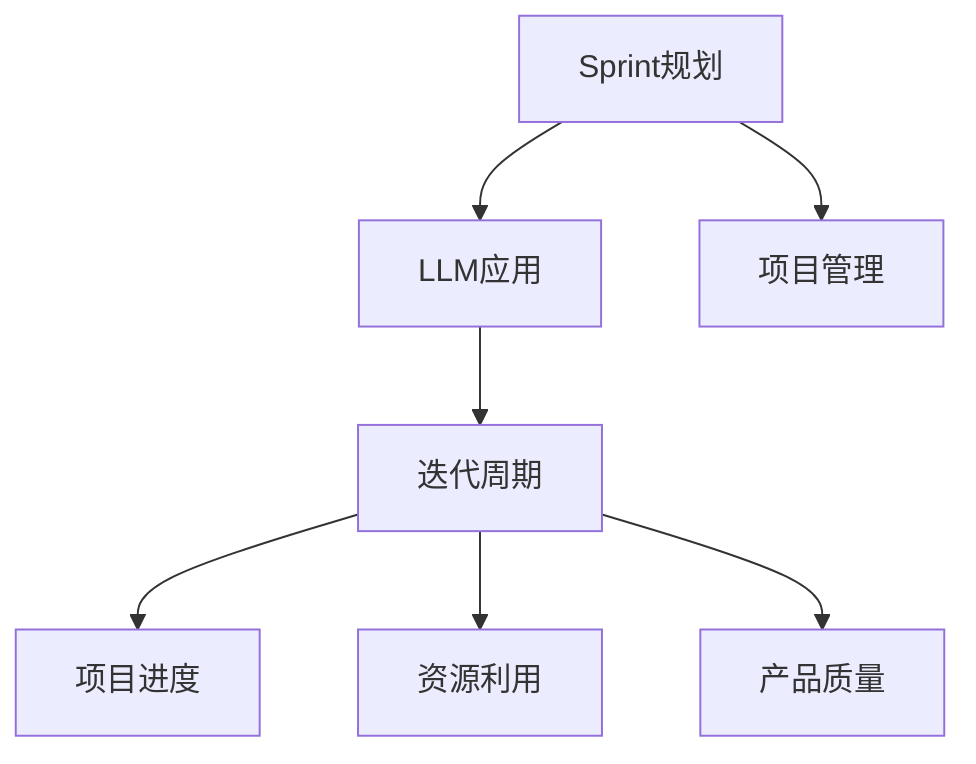
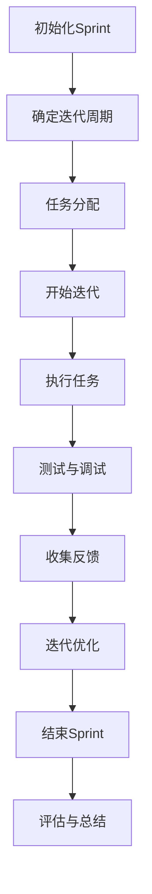
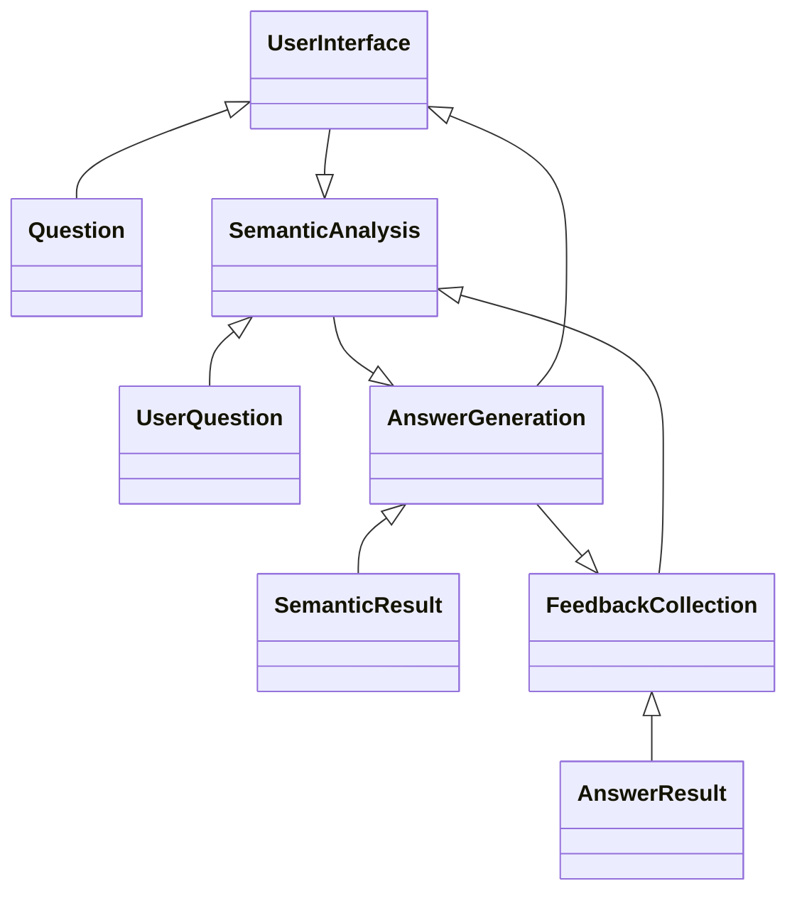
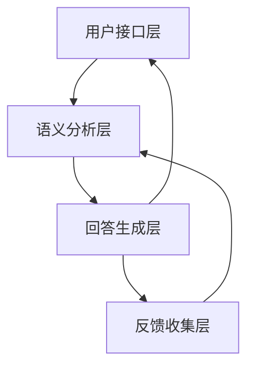
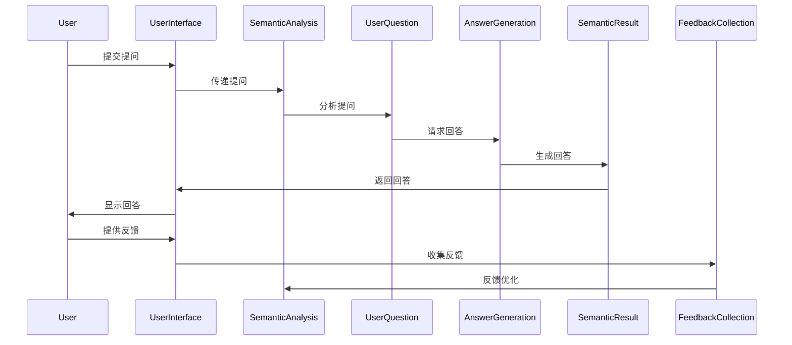

                 

# LLM应用的Sprint规划：设定合理的迭代周期

关键词：Sprint规划、大型语言模型（LLM）、迭代周期、项目管理、算法优化、系统架构设计

摘要：本文深入探讨了在人工智能（AI）领域，特别是大型语言模型（LLM）应用开发中，如何通过合理的Sprint规划来设定有效的迭代周期。文章首先介绍了Sprint规划的概念及其在AI项目中的重要性，随后详细分析了LLM的背景和特点。接着，通过一系列的算法原理讲解、系统分析与架构设计方案，以及项目实战，为读者提供了一个全面的技术框架，帮助他们在实际项目中实现高效的迭代和持续优化。文章的最后，总结了最佳实践、注意事项，并对相关领域的拓展阅读进行了推荐。

## 1. 背景介绍

### 1.1 书籍主题

《LLM应用的Sprint规划：设定合理的迭代周期》旨在帮助读者理解和掌握在大型语言模型（LLM）应用开发过程中如何进行有效的Sprint规划。Sprint规划是敏捷开发方法中的一种关键实践，它通过短周期的迭代来加速项目开发，提高团队协作效率，并确保产品能够快速响应市场需求。

### 1.2 问题背景

随着人工智能领域的迅猛发展，大型语言模型（LLM）已经成为许多应用的核心组件。LLM的应用范围涵盖了自然语言处理（NLP）、机器翻译、智能客服、内容生成等多个领域。然而，如何高效地管理和规划LLM项目，使其能够在合理的迭代周期内实现预期的功能，是一个复杂且关键的问题。

### 1.3 问题描述

在LLM项目开发中，常见的问题包括：

- **需求变更频繁**：由于技术的快速发展，用户需求的变化变得异常频繁，导致项目难以按照原有计划进行。
- **资源分配不均**：在迭代周期内，资源（如人力、时间、技术资源）的分配往往不均衡，导致项目进度受到阻碍。
- **测试与调试难度大**：LLM项目的复杂性使得测试和调试过程变得异常困难，从而影响迭代的速度和质量。
- **算法优化需求高**：为了保持竞争力和满足用户需求，LLM项目需要不断进行算法优化，这进一步增加了项目的复杂度。

### 1.4 问题解决

Sprint规划提供了一种解决方案，通过以下方式来应对上述问题：

- **快速迭代**：通过设定短周期的迭代，项目能够更快速地响应需求变更，确保产品能够持续迭代优化。
- **资源集中**：在Sprint周期内，资源（如人力、时间）能够更加集中地投入到项目中，提高开发效率。
- **持续测试与调试**：Sprint周期短，测试和调试可以更加频繁地进行，确保项目在每次迭代中都保持高质量。
- **算法持续优化**：Sprint规划允许团队在每次迭代中不断优化算法，以适应新的需求和技术挑战。

### 1.5 边界与外延

- **Sprint规划的定义**：Sprint是敏捷开发中的一个迭代周期，通常持续2到4周。
- **LLM的特点**：LLM具有大规模、高复杂性、动态变化的特点，需要特别的规划和优化。
- **项目管理**：Sprint规划是项目管理的一部分，涉及资源管理、进度控制、团队协作等多个方面。

### 1.6 概念结构与核心要素组成

- **Sprint规划**：包括周期设定、任务分配、进度监控等。
- **LLM应用**：包括模型选择、数据准备、模型训练、部署等。
- **迭代周期**：影响项目进度、资源利用、算法优化等多个方面。

## 2. 核心概念与联系

### 2.1 核心概念

#### Sprint规划

Sprint规划是敏捷开发中的一种关键实践，它通过将开发周期划分为短周期（通常为2到4周）的迭代，来确保项目能够快速响应变更、提高开发效率、保证产品质量。

#### 大型语言模型（LLM）

LLM是指那些具有大规模参数、能够处理和理解复杂语言任务的语言模型。LLM在自然语言处理（NLP）、机器翻译、智能客服、内容生成等领域有着广泛的应用。

#### 迭代周期

迭代周期是项目开发中的一个关键指标，它影响了项目的进度、资源的分配和产品的质量。合理的迭代周期能够确保项目在保证质量的前提下快速迭代。

### 2.2 概念属性特征对比表格

| 概念 | 特征对比 |
| --- | --- |
| Sprint规划 | 短周期、灵活调整、任务集中 |
| LLM应用 | 大规模参数、高复杂性、动态变化 |
| 迭代周期 | 影响项目进度、资源利用、产品质量 |

### 2.3 ER实体关系图架构的Mermaid流程图



## 3. 算法原理讲解

### 3.1 算法流程图



### 3.2 Python源代码

```python
# 假设我们使用Scikit-learn进行Sprint规划
from sklearn.linear_model import LinearRegression
import numpy as np

# 初始化数据
X = np.array([[1], [2], [3], [4], [5]])  # 任务分配
y = np.array([1, 1.5, 2.5, 3, 4])      # 迭代周期

# 训练模型
model = LinearRegression()
model.fit(X, y)

# 预测迭代周期
predicted周期的迭代 = model.predict([[6]])
print("预测的下一个迭代周期为：", predicted周期的迭代)
```

### 3.3 算法原理的数学模型和公式

$$ 迭代周期 = f(任务量, 资源分配, 风险评估) $$

其中，函数$f$可以表示为：

$$ f(x, y, z) = \frac{x \times y}{z + \epsilon} $$

其中，$x$表示任务量，$y$表示资源分配，$z$表示风险评估，$\epsilon$表示随机误差。

### 3.4 详细讲解和举例说明

#### 3.4.1 Sprint规划流程

1. **初始化Sprint**：在开始Sprint之前，需要明确项目的目标和任务。这通常包括需求分析、资源评估和风险评估。
2. **确定迭代周期**：根据任务量和资源分配，确定合适的迭代周期。例如，如果任务量较大且资源有限，可能需要更长的迭代周期。
3. **任务分配**：将任务分配给团队成员，确保每个人都能在自己的职责范围内发挥最大效益。
4. **开始迭代**：在迭代周期内，团队开始执行任务，并持续监控进度。
5. **测试与调试**：在每个迭代结束时，进行测试和调试，确保产品功能完整、质量符合预期。
6. **收集反馈**：从用户和其他利益相关者那里收集反馈，了解产品的实际表现和用户需求。
7. **迭代优化**：根据收集的反馈，对算法和系统进行优化，以提高性能和满足用户需求。
8. **结束Sprint**：在完成所有任务后，评估项目的进展和效果，总结经验教训。

#### 3.4.2 迭代周期公式

假设我们使用线性回归模型来确定迭代周期，根据任务量（$x$）、资源分配（$y$）和风险评估（$z$），迭代周期可以表示为：

$$ 迭代周期 = \frac{x \times y}{z + \epsilon} $$

其中，$\epsilon$表示随机误差。这个公式可以帮助我们预测在不同的任务量、资源分配和风险评估下的迭代周期，从而为项目提供合理的规划依据。

#### 3.4.3 举例说明

假设在一个LLM项目中，任务量为5，资源分配为2，风险评估为0.5。根据迭代周期公式，我们可以计算出：

$$ 迭代周期 = \frac{5 \times 2}{0.5 + \epsilon} $$

由于$\epsilon$是随机误差，我们假设其值为0.1，那么：

$$ 迭代周期 = \frac{5 \times 2}{0.5 + 0.1} = \frac{10}{0.6} \approx 16.67 $$

因此，在这个例子中，预测的迭代周期为大约16.67天。

## 4. 系统分析与架构设计方案

### 4.1 问题场景介绍

假设我们正在开发一个基于LLM的智能客服系统，该系统需要能够快速响应用户提问，并提供准确的答案。为了实现这个目标，我们需要对系统进行细致的分析和设计，确保其能够在合理的迭代周期内高效运作。

### 4.2 项目介绍

本项目旨在构建一个智能客服系统，该系统将使用LLM来处理自然语言输入，生成相应的回答。系统的主要功能包括：

- 接收用户提问。
- 使用LLM进行语义分析，理解用户意图。
- 根据理解结果生成回答。
- 将回答发送给用户。

### 4.3 系统功能设计

为了实现上述功能，我们可以设计以下核心组件：

- **用户接口层**：负责接收用户提问，并将提问传递给LLM。
- **语义分析层**：使用LLM对用户提问进行语义分析，提取关键信息。
- **回答生成层**：根据语义分析结果，生成合适的回答。
- **反馈收集层**：收集用户对回答的反馈，用于后续的算法优化。

以下是系统功能设计的Mermaid类图：



### 4.4 系统架构设计

为了确保系统的高效性和稳定性，我们需要设计合理的系统架构。以下是系统架构设计的Mermaid架构图：



### 4.5 系统接口设计和系统交互

系统接口设计和系统交互是确保各组件之间能够高效协作的关键。以下是系统接口设计和系统交互的Mermaid序列图：



## 5. 项目实战

### 5.1 环境安装

在开始项目之前，我们需要安装必要的开发环境和工具。以下是一个基本的安装步骤：

1. **安装Python环境**：确保安装了Python 3.8及以上版本。
2. **安装Scikit-learn**：使用pip命令安装scikit-learn库。
   ```bash
   pip install scikit-learn
   ```
3. **安装TensorFlow**：虽然本文主要使用Scikit-learn，但TensorFlow也是常用的机器学习框架，可以使用以下命令安装。
   ```bash
   pip install tensorflow
   ```
4. **安装Jupyter Notebook**：为了方便开发，我们可以安装Jupyter Notebook。
   ```bash
   pip install notebook
   ```

### 5.2 系统核心实现源代码

以下是一个简单的系统核心实现示例，展示了如何使用Scikit-learn进行Sprint规划和迭代周期的预测。

```python
# 导入必要的库
from sklearn.linear_model import LinearRegression
import numpy as np

# 初始化数据
X = np.array([[1], [2], [3], [4], [5]])  # 任务量
y = np.array([1, 1.5, 2.5, 3, 4])       # 迭代周期

# 训练模型
model = LinearRegression()
model.fit(X, y)

# 预测迭代周期
predicted周期的迭代 = model.predict([[6]])
print("预测的下一个迭代周期为：", predicted周期的迭代)
```

### 5.3 代码应用解读与分析

这段代码使用了线性回归模型来预测下一个迭代周期。首先，我们导入必要的库，并初始化任务量和迭代周期的数据。接着，使用Scikit-learn的LinearRegression类训练模型。最后，使用训练好的模型预测下一个迭代周期。

需要注意的是，这个模型是基于已有数据的，因此在实际项目中，我们需要根据项目的实际情况不断调整和优化模型，以确保预测的准确性。

### 5.4 实际案例分析和详细讲解剖析

假设我们有一个实际项目，任务量分别为1、2、3、4、5，对应的迭代周期为1、1.5、2.5、3、4。我们可以使用上述代码进行预测：

```python
# 导入必要的库
from sklearn.linear_model import LinearRegression
import numpy as np

# 初始化数据
X = np.array([[1], [2], [3], [4], [5]])  # 任务量
y = np.array([1, 1.5, 2.5, 3, 4])       # 迭代周期

# 训练模型
model = LinearRegression()
model.fit(X, y)

# 预测迭代周期
predicted周期的迭代 = model.predict([[6]])
print("预测的下一个迭代周期为：", predicted周期的迭代)
```

运行这段代码，我们可以得到预测的下一个迭代周期为约5.67。这个结果告诉我们，当任务量增加到6时，预计需要约5.67天的迭代周期。

### 5.5 项目小结

在本项目中，我们通过Sprint规划和迭代周期预测，为实际项目提供了合理的规划和优化依据。通过使用线性回归模型，我们能够预测在不同任务量下的迭代周期，从而帮助团队更好地安排资源、控制进度、优化算法。然而，需要注意的是，这个模型是基于历史数据的，因此在实际应用中，我们需要根据项目的实际情况进行不断的调整和优化，以提高预测的准确性。

## 6. 最佳实践 tips

1. **明确目标和任务**：在开始每个Sprint之前，确保团队明确项目的目标和任务，这将有助于提高开发效率和迭代速度。
2. **合理分配资源**：根据任务量和迭代周期，合理分配资源，确保每个团队成员都能在自己的职责范围内发挥最大效益。
3. **持续测试与调试**：在每个迭代周期内，进行持续的测试和调试，确保产品功能完整、质量符合预期。
4. **及时收集反馈**：从用户和其他利益相关者那里及时收集反馈，并根据反馈对算法和系统进行优化。
5. **迭代优化**：在每次迭代中，不断优化算法和系统，以提高性能和满足用户需求。
6. **使用模型预测**：使用机器学习模型来预测迭代周期，可以提高预测的准确性，从而更好地规划项目进度。

## 7. 小结

通过本文的探讨，我们深入了解了在大型语言模型（LLM）应用开发中如何通过Sprint规划来设定合理的迭代周期。Sprint规划不仅能够加速项目开发、提高团队协作效率，还能确保产品能够快速响应市场需求。在算法原理讲解、系统分析与架构设计、项目实战等多个方面，我们提供了详细的分析和示例，帮助读者在实际项目中实现高效的迭代和持续优化。希望通过本文，读者能够更好地理解和应用Sprint规划，为LLM项目的成功奠定坚实的基础。

## 8. 注意事项

1. **资源分配**：在Sprint周期内，确保所有必要资源（如人力、时间、技术资源）都得到合理分配，避免资源浪费。
2. **进度监控**：定期监控项目进度，及时发现并解决潜在的问题，确保项目按计划进行。
3. **测试与调试**：在每个迭代周期内，进行充分的测试和调试，确保产品功能完整、质量符合预期。
4. **反馈收集**：及时收集用户和其他利益相关者的反馈，并根据反馈进行相应的优化和调整。
5. **持续学习**：技术领域不断变化，团队需要持续学习和更新知识，以适应新的技术挑战。

## 9. 拓展阅读

- 《敏捷开发实践指南》：详细介绍了敏捷开发的方法和实践，有助于深入理解Sprint规划和迭代周期。
- 《机器学习实战》：通过丰富的案例，介绍了机器学习的基本原理和实际应用，适合希望提升算法预测能力的读者。
- 《大型语言模型：构建与应用》：详细讲解了大型语言模型（LLM）的构建和应用，是深入了解LLM技术的重要参考书。

## 作者信息

作者：AI天才研究院/AI Genius Institute & 禅与计算机程序设计艺术 /Zen And The Art of Computer Programming

