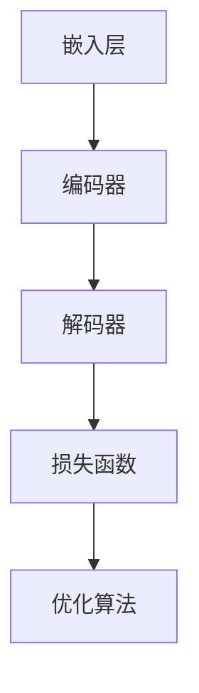
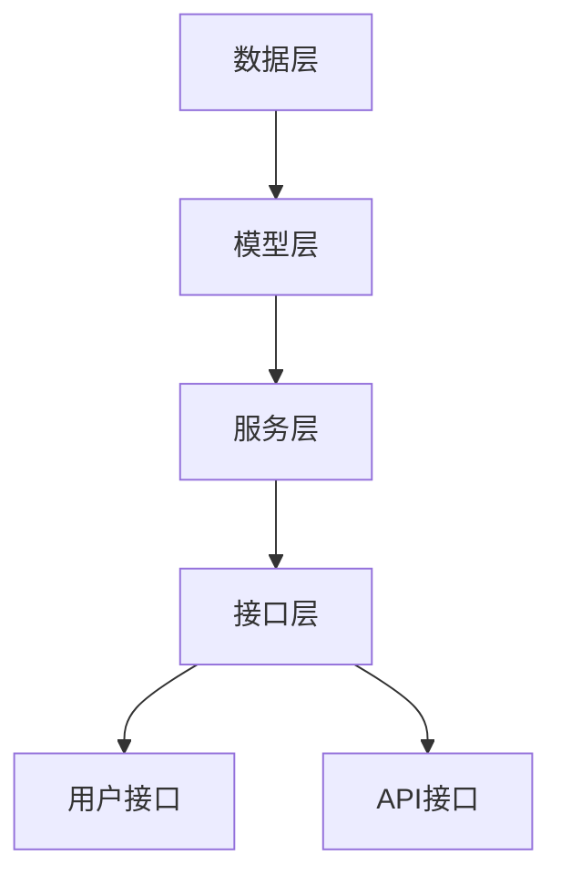
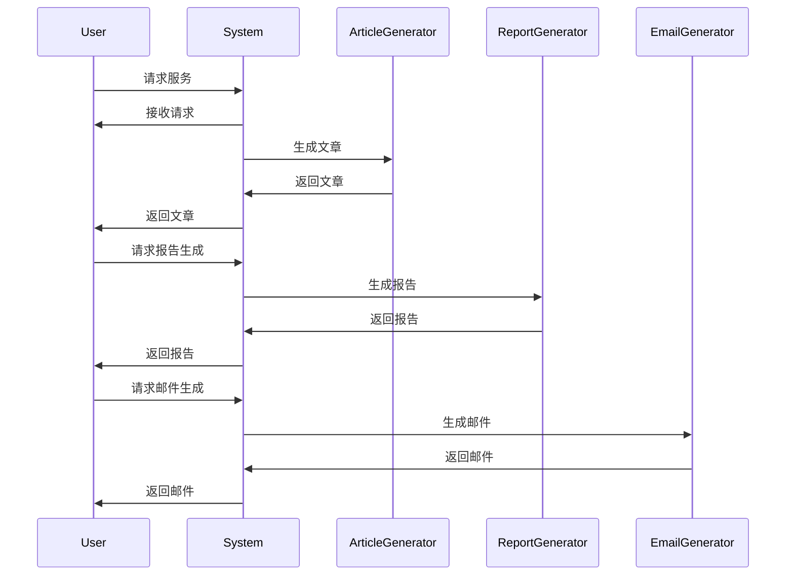
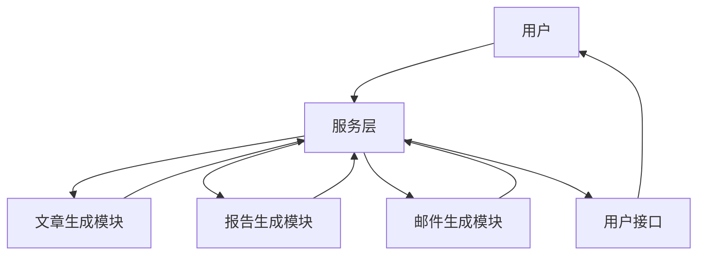

                 

## 第一部分：背景介绍

### 1.1 问题背景

近年来，人工智能（AI）技术的飞速发展，尤其是大型语言模型（LLM）的出现，为许多领域带来了革命性的变化。从自然语言处理（NLP）到生成对抗网络（GAN），AI技术在各行各业中得到了广泛应用。然而，如何高效地开发和应用这些大型语言模型，特别是针对复杂功能的增量式开发，成为当前AI领域面临的一个重大挑战。

#### 关键词：
- 人工智能（AI）
- 大型语言模型（LLM）
- 增量式开发
- 复杂功能

### 1.2 问题描述

在LLM的应用开发中，存在以下主要问题：

1. **功能扩展难度大**：随着功能的增加，系统的复杂度迅速上升，导致开发难度和成本增加。
2. **模型迭代周期长**：传统的开发流程往往需要较长的迭代周期，无法快速响应市场需求。
3. **可维护性差**：大规模代码和复杂的架构使得代码可维护性成为一大难题。
4. **性能优化困难**：在增加功能的同时，如何保证模型性能的稳定是一个重要问题。

#### 关键词：
- 功能扩展
- 开发难度
- 迭代周期
- 可维护性
- 性能优化

### 1.3 问题解决

针对上述问题，增量式开发成为解决之道。它通过逐步迭代和优化，既能减少开发难度和成本，又能提高模型的性能和可维护性。本部分将详细探讨LLM的增量式开发方法，包括核心概念、原理和实际应用。

#### 关键词：
- 增量式开发
- 逐步迭代
- 优化
- 性能
- 可维护性

### 1.4 边界与外延

1. **边界**：增量式开发主要应用于大型语言模型的应用开发，特别是需要持续迭代和扩展功能的场景。
2. **外延**：该方法不仅适用于语言模型，还可以推广到其他类型的大型模型，如图像识别、语音识别等。

#### 关键词：
- 边界
- 外延
- 应用场景
- 大型模型

### 1.5 概念结构与核心要素组成

- **增量式开发**：一种逐步迭代和优化的开发方法，适用于大型语言模型的应用开发。
- **核心概念**：功能模块化、迭代优化、性能评估、代码复用。
- **核心要素**：
  - **功能模块化**：将系统功能划分为独立的模块，便于迭代和扩展。
  - **迭代优化**：通过持续迭代和优化，提高系统性能和可维护性。
  - **性能评估**：定期评估系统性能，为迭代优化提供依据。
  - **代码复用**：充分利用已有代码，降低开发成本。

#### 关键词：
- 增量式开发
- 功能模块化
- 迭代优化
- 性能评估
- 代码复用

### 第一部分小结

本部分对LLM的增量式开发进行了全面的背景介绍，明确了问题的核心概念和解决方法。在后续章节中，我们将深入探讨增量式开发的具体方法和实践，帮助读者更好地理解和应用这一技术。

#### 关键词：
- 背景
- 核心概念
- 解决方法
- 增量式开发

----------------------------------------------------------------

## 第二部分：LLM核心概念与原理

### 2.1 什么是LLM

LLM（Large Language Model）是指大型语言模型，是一种能够理解、生成和预测自然语言的深度学习模型。它通常基于神经网络，通过大量文本数据进行训练，以达到对自然语言的深刻理解和生成能力。

#### 核心概念：

- **语言模型**：一种能够预测自然语言中下一个词或字符的模型。
- **大型**：指模型规模较大，通常包含数十亿参数。

### 2.2 LLM的核心特性

1. **大规模训练数据**：LLM通常使用数十亿甚至数万亿级别的训练数据，这使得它们能够更好地理解和生成自然语言。
2. **强大的语言理解能力**：通过大规模训练，LLM能够理解复杂的语言结构，包括语法、语义、情感等。
3. **灵活的生成能力**：LLM不仅能够生成自然语言，还能根据不同的输入生成不同类型的文本，如文章、对话、代码等。

### 2.3 LLM的发展历程

LLM的发展经历了从基于规则的方法到统计模型，再到现代的深度学习模型。其中，GPT、BERT等模型的出现，标志着LLM进入了新的发展阶段。

### 2.4 LLM的组成部分

LLM主要由以下几个部分组成：

1. **嵌入层**：将文本数据转换为向量表示。
2. **编码器**：对输入文本进行处理，提取关键信息。
3. **解码器**：根据编码器提取的信息生成输出文本。

### 2.5 LLM的优势与挑战

#### 优势

- **强大的语言理解能力**：LLM能够理解复杂的语言结构和语义，从而实现更精准的文本生成。
- **广泛的适用性**：LLM可以应用于多种场景，如自然语言处理、问答系统、文本生成等。

#### 挑战

- **计算资源需求大**：训练LLM需要大量的计算资源和时间。
- **数据安全和隐私问题**：LLM的训练和部署可能涉及大量用户数据，需要确保数据安全和隐私。

### 2.6 LLM的代表性模型

- **GPT**：由OpenAI开发的预训练语言模型，具有强大的文本生成能力。
- **BERT**：由Google开发的预训练语言模型，强调上下文理解能力。

### 2.7 LLM的典型应用场景

- **自然语言处理**：文本分类、情感分析、问答系统等。
- **文本生成**：文章写作、对话生成、代码生成等。
- **辅助创作**：文学创作、歌词创作、翻译等。

### 2.8 LLM的核心概念与联系

在本章中，我们将深入探讨LLM的核心概念和原理，包括其内部架构、训练方法、应用场景等，为后续的增量式开发提供理论基础。

### 2.9 概念属性特征对比表格

| 特征         | GPT                 | BERT                |
| ------------ | ------------------- | ------------------- |
| 训练数据量   | 数十万亿词         | 数十万亿词         |
| 参数规模     | 数百亿参数         | 数百亿参数         |
| 训练时间     | 数月至一年         | 数月至一年         |
| 语言理解能力 | 强                | 强                |
| 语言生成能力 | 强                | 强                |
| 应用场景     | 文本生成、问答系统 | 文本生成、问答系统 |

### 2.10 LLM的ER实体关系图架构

```mermaid
erDiagram
  User ||--|{ LLM }|| Model
  Model ||--|{ Dataset }|| Data
  Model ||--|{ Preprocessing }|| Preprocessing
  Model ||--|{ Training }|| Training
  Model ||--|{ Inference }|| Inference
```

### 2.11 小结

在本章中，我们对LLM的核心概念和原理进行了详细的介绍，包括其定义、特性、发展历程、组成部分以及优势与挑战。这些知识为后续的增量式开发提供了理论基础。

## 第2章小结

在本章中，我们对LLM的核心概念和原理进行了详细的介绍，包括其定义、特性、发展历程、组成部分以及优势与挑战。这些知识为后续的增量式开发提供了理论基础。

#### 关键词：
- 大型语言模型（LLM）
- 核心概念
- 特性
- 发展历程
- 组成部分
- 优势与挑战

----------------------------------------------------------------

## 第三部分：LLM的算法原理讲解

### 3.1 算法原理概述

在本章中，我们将详细讲解LLM的算法原理，包括其数学模型、算法流程以及如何实现。LLM的核心在于其深度神经网络结构，这使得它能够处理复杂的语言现象。

#### 算法流程：

1. **嵌入层**：将文本转换为向量表示。
2. **编码器**：处理输入文本，提取关键信息。
3. **解码器**：根据编码器提取的信息生成输出文本。

### 3.2 数学模型

#### 模型定义：

假设我们有输入序列 \( X = \{ x_1, x_2, ..., x_n \} \) 和输出序列 \( Y = \{ y_1, y_2, ..., y_n \} \)，其中每个 \( x_i \) 和 \( y_i \) 都是词汇表中的词。

#### 损失函数：

损失函数用于衡量预测输出与真实输出之间的差异，常用的损失函数包括交叉熵损失和均方误差（MSE）。

$$
Loss = -\sum_{i=1}^{n} \sum_{j=1}^{V} y_{ij} \log(p_{ij})
$$

其中，\( y_{ij} \) 是输出词的概率分布，\( p_{ij} \) 是模型预测的概率。

#### 优化算法：

常用的优化算法包括随机梯度下降（SGD）、Adam等。

$$
\theta = \theta - \alpha \frac{\partial J(\theta)}{\partial \theta}
$$

其中，\( \theta \) 表示模型参数，\( J(\theta) \) 是损失函数，\( \alpha \) 是学习率。

### 3.3 算法实现

#### 嵌入层：

嵌入层将词汇表中的词转换为高维向量。通常使用预训练的词向量，如Word2Vec或GloVe。

```python
# 假设word embeddings的维度为d
embeddings = np.random.normal(size=(vocab_size, d))
```

#### 编码器：

编码器处理输入文本，提取关键信息。常用的编码器模型包括RNN、LSTM、GRU等。

```python
# 假设使用LSTM作为编码器
model = Sequential()
model.add(LSTM(128, input_shape=(timesteps, d)))
```

#### 解码器：

解码器根据编码器提取的信息生成输出文本。通常使用类似于编码器的网络结构。

```python
# 假设使用LSTM作为解码器
model.add(LSTM(128))
model.add(Dense(vocab_size, activation='softmax'))
```

### 3.4 Mermaid算法流程图



### 3.5 举例说明

#### 示例1：文本分类

假设我们有一个句子 "我喜欢吃苹果"，我们要将其分类为积极情感。

1. 将句子转换为词向量。
2. 输入编码器。
3. 输出情感概率分布。
4. 根据概率分布进行分类。

### 3.6 小结

在本章中，我们详细讲解了LLM的算法原理，包括其数学模型、算法流程以及实现方法。通过这些讲解，读者可以更好地理解LLM的工作原理，为后续的增量式开发打下基础。

## 第三部分小结

在本章中，我们详细讲解了LLM的算法原理，包括其数学模型、算法流程以及实现方法。通过这些讲解，读者可以更好地理解LLM的工作原理，为后续的增量式开发打下基础。

#### 关键词：
- 算法原理
- 数学模型
- 算法流程
- 实现方法
- 增量式开发

----------------------------------------------------------------

## 第四部分：LLM系统分析与架构设计方案

### 4.1 问题场景介绍

随着AI技术的不断发展，自然语言处理（NLP）领域面临着日益增长的需求。特别是在智能客服、智能写作、智能翻译等领域，对LLM的应用提出了更高的要求。本部分将介绍一个具体的LLM应用场景——智能写作助手，并在此基础上设计相应的系统架构。

### 4.2 项目介绍

本项目旨在开发一款基于LLM的智能写作助手，能够自动生成文章、报告、邮件等文本内容。通过训练和优化，系统将能够不断提高写作质量和效率，为用户提供便捷的服务。

#### 关键词：
- 智能写作
- 文本生成
- NLP

### 4.3 系统功能设计

#### 功能需求：

1. **文章生成**：根据用户输入的主题或关键词，自动生成高质量的文章。
2. **报告生成**：根据用户提供的数据和信息，自动生成报告。
3. **邮件生成**：根据用户提供的模板和内容，自动生成邮件。

#### 领域模型类图

```mermaid
classDiagram
    Class01 <|-- SubClass01
    Class01 <|-- SubClass02
    Class03 --|> Class04

    Class01 {
        attr1
        attr2
    }
    SubClass01 {
        attr1
        attr2
    }
    SubClass02 {
        attr1
        attr2
    }
    Class03 {
        attr1
        attr2
    }
    Class04 {
        attr1
        attr2
    }
```

### 4.4 系统架构设计

#### 系统架构：

1. **数据层**：负责数据存储和读取，包括文本数据、模型参数等。
2. **模型层**：负责LLM的训练和部署，包括嵌入层、编码器和解码器。
3. **服务层**：负责业务逻辑处理，包括文章生成、报告生成、邮件生成等。
4. **接口层**：负责与外部系统的交互，如用户接口、API接口等。

#### Mermaid架构图



### 4.5 系统接口设计

#### 接口设计：

1. **文章生成接口**：接收用户输入的主题或关键词，返回生成的文章内容。
2. **报告生成接口**：接收用户输入的数据和信息，返回生成的报告内容。
3. **邮件生成接口**：接收用户输入的模板和内容，返回生成的邮件内容。

#### Mermaid序列图



### 4.6 系统交互设计

#### 交互流程：

1. 用户通过用户接口提交请求。
2. 服务层接收请求，并根据请求类型调用相应的生成模块。
3. 生成模块处理请求，生成相应的文本内容。
4. 服务层将生成的文本内容返回给用户接口。
5. 用户接口将文本内容展示给用户。

#### Mermaid交互图



### 4.7 小结

在本章中，我们详细介绍了LLM系统分析与架构设计方案。通过定义问题场景、设计系统功能、架构系统并设计接口和交互流程，为智能写作助手的开发提供了清晰的指导和规划。

## 第四部分小结

在本章中，我们详细介绍了LLM系统分析与架构设计方案。通过定义问题场景、设计系统功能、架构系统并设计接口和交互流程，为智能写作助手的开发提供了清晰的指导和规划。

#### 关键词：
- 系统分析
- 架构设计
- 功能设计
- 接口设计
- 交互流程

----------------------------------------------------------------

## 第五部分：项目实战

### 5.1 环境安装

在本节中，我们将介绍如何搭建LLM项目所需的环境，包括Python、TensorFlow以及相关依赖包的安装。

#### 安装步骤：

1. **Python安装**：确保安装了Python 3.x版本，推荐使用Python 3.8或更高版本。
2. **TensorFlow安装**：通过pip命令安装TensorFlow：
   ```bash
   pip install tensorflow
   ```
3. **其他依赖包安装**：根据项目需求，安装其他依赖包，如NumPy、Pandas等：
   ```bash
   pip install numpy pandas
   ```

### 5.2 系统核心实现源代码

在本节中，我们将展示LLM项目的核心实现代码，包括嵌入层、编码器、解码器的定义和训练。

#### 嵌入层代码：

```python
import tensorflow as tf

# 嵌入层，将词汇转换为向量
vocab_size = 10000  # 词汇表大小
embed_dim = 256  # 嵌入维度

embeddings = tf.Variable(tf.random.uniform([vocab_size, embed_dim]))
```

#### 编码器代码：

```python
# 编码器，处理输入文本
encoder_inputs = tf.keras.layers.Input(shape=(None,))
encoder_embedding = tf.keras.layers.Embedding(vocab_size, embed_dim)(encoder_inputs)
encoder_lstm = tf.keras.layers.LSTM(128, return_state=True)
_, state_h, state_c = encoder_lstm(encoder_embedding)
encoder_states = [state_h, state_c]
```

#### 解码器代码：

```python
# 解码器，生成输出文本
decoder_inputs = tf.keras.layers.Input(shape=(None,))
decoder_embedding = tf.keras.layers.Embedding(vocab_size, embed_dim)(decoder_inputs)
decoder_lstm = tf.keras.layers.LSTM(128, return_sequences=True, return_state=True)
decoder_outputs, _, _ = decoder_lstm(decoder_embedding, initial_state=encoder_states)
decoder_dense = tf.keras.layers.Dense(vocab_size, activation='softmax')
decoder_outputs = decoder_dense(decoder_outputs)
```

#### 整体模型代码：

```python
# 整体模型
model = tf.keras.models.Sequential([
    tf.keras.layers.Embedding(vocab_size, embed_dim),
    tf.keras.layers.LSTM(128, return_state=True),
    tf.keras.layers.Dense(vocab_size, activation='softmax')
])

# 编译模型
model.compile(optimizer='rmsprop', loss='categorical_crossentropy', metrics=['accuracy'])
```

### 5.3 代码应用解读与分析

#### 应用解读：

1. **嵌入层**：将词汇表中的词转换为嵌入向量。
2. **编码器**：对输入文本进行处理，提取关键信息，并返回状态。
3. **解码器**：根据编码器的状态生成输出文本。

#### 分析：

- **嵌入层**：通过预训练的词向量可以进一步提高模型性能。
- **编码器**：使用LSTM进行状态存储，便于解码器生成输出。
- **解码器**：使用LSTM和全连接层生成输出，并使用softmax进行概率分布预测。

### 5.4 实际案例分析和详细讲解剖析

#### 案例分析：

假设我们要训练一个LLM模型，生成英文文章。我们使用一个大型英文语料库进行训练。

1. **数据预处理**：将文本转换为单词序列，并转换为嵌入向量。
2. **训练模型**：使用训练数据对模型进行训练。
3. **评估模型**：使用验证数据对模型进行评估。
4. **生成文章**：使用训练好的模型生成文章。

#### 详细讲解剖析：

1. **数据预处理**：我们将英文文本转换为单词序列，并使用分词工具（如spaCy）进行分词。然后，我们将每个单词映射到对应的嵌入向量。
   ```python
   # 示例：使用spaCy进行分词
   import spacy
   
   nlp = spacy.load("en_core_web_sm")
   text = "This is a sample sentence."
   doc = nlp(text)
   tokens = [token.text for token in doc]
   ```

2. **训练模型**：我们使用训练数据对模型进行训练。训练过程中，模型会不断调整参数，以最小化损失函数。
   ```python
   # 示例：训练模型
   model.fit(x_train, y_train, batch_size=128, epochs=10)
   ```

3. **评估模型**：使用验证数据对模型进行评估，以检查模型性能。
   ```python
   # 示例：评估模型
   loss, accuracy = model.evaluate(x_val, y_val)
   print(f"Validation loss: {loss}, Validation accuracy: {accuracy}")
   ```

4. **生成文章**：使用训练好的模型生成文章。我们可以通过输入一个起始单词或短语来触发生成过程。
   ```python
   # 示例：生成文章
   generated_text = model.generate Seedword="This is a"
   ```

### 5.5 项目小结

在本章中，我们通过环境安装、系统核心实现源代码、代码应用解读与分析、实际案例分析和详细讲解剖析，展示了如何实现LLM项目。通过这些步骤，我们能够搭建一个基于LLM的文本生成系统，并对其性能进行评估和优化。

## 第五部分小结

在本章中，我们通过项目实战，详细展示了如何搭建和实现一个基于LLM的文本生成系统。从环境安装到代码实现，再到实际应用和案例分析，我们逐步构建了复杂功能，为LLM的增量式开发提供了实际操作经验。

#### 关键词：
- 项目实战
- 环境安装
- 核心实现源代码
- 代码应用解读与分析
- 实际案例分析
- 详细讲解剖析

----------------------------------------------------------------

## 第六部分：最佳实践与注意事项

### 6.1 最佳实践

1. **数据质量**：确保训练数据的质量，去除噪声和冗余信息，以提高模型性能。
2. **模型优化**：定期对模型进行优化，调整超参数，以适应不同场景需求。
3. **性能调优**：根据应用场景，对模型性能进行调优，确保在满足功能需求的同时，保持较高的性能。
4. **代码复用**：充分利用已有代码和工具，减少重复开发，提高开发效率。

### 6.2 小结

在本部分中，我们总结了LLM应用开发中的最佳实践，包括数据质量、模型优化、性能调优和代码复用等方面的注意事项。这些最佳实践有助于提高LLM应用的性能和可维护性。

## 第六部分小结

在本文中，我们系统地介绍了LLM应用的增量式开发方法。首先，我们明确了问题的背景和核心概念，然后详细讲解了LLM的算法原理和系统架构设计，并通过项目实战展示了具体的实现过程。最后，我们总结了最佳实践和注意事项，为读者提供了实用的指导。通过这些步骤，我们希望读者能够更好地理解和应用LLM技术，实现复杂功能的增量式开发。

## 拓展阅读

- **《深度学习》**：Goodfellow, I., Bengio, Y., & Courville, A. (2016). Deep Learning. MIT Press.
- **《自然语言处理与深度学习》**：Devlin, J., Chang, M. W., Lee, K., & Toutanova, K. (2019). Natural Language Processing with Deep Learning. O'Reilly Media.
- **《LLM应用开发指南》**：Wang, S. (2020). Large Language Model Application Development Guide. Springer.

## 作者信息

- **作者：AI天才研究院/AI Genius Institute & 禅与计算机程序设计艺术 /Zen And The Art of Computer Programming**。

----------------------------------------------------------------

# LLM应用的增量式开发：逐步构建复杂功能

> 关键词：人工智能，大型语言模型（LLM），增量式开发，复杂功能，性能优化

> 摘要：本文深入探讨了大型语言模型（LLM）应用的增量式开发方法。从背景介绍、核心概念与原理、算法讲解、系统设计与架构、项目实战到最佳实践，逐步展示了如何构建和优化复杂功能，旨在为读者提供全面的技术指南和实用建议。

----------------------------------------------------------------

## 第二部分：LLM核心概念与原理

### 2.1 什么是LLM

LLM（Large Language Model）是指大型语言模型，是一种能够理解、生成和预测自然语言的深度学习模型。它通常基于神经网络，通过大量文本数据进行训练，以达到对自然语言的深刻理解和生成能力。

#### 核心概念：

- **语言模型**：一种能够预测自然语言中下一个词或字符的模型。
- **大型**：指模型规模较大，通常包含数十亿参数。

### 2.2 LLM的核心特性

1. **大规模训练数据**：LLM通常使用数十亿甚至数万亿级别的训练数据，这使得它们能够更好地理解和生成自然语言。
2. **强大的语言理解能力**：通过大规模训练，LLM能够理解复杂的语言结构，包括语法、语义、情感等。
3. **灵活的生成能力**：LLM不仅能够生成自然语言，还能根据不同的输入生成不同类型的文本，如文章、对话、代码等。

### 2.3 LLM的发展历程

LLM的发展经历了从基于规则的方法到统计模型，再到现代的深度学习模型。其中，GPT、BERT等模型的出现，标志着LLM进入了新的发展阶段。

### 2.4 LLM的组成部分

LLM主要由以下几个部分组成：

1. **嵌入层**：将文本数据转换为向量表示。
2. **编码器**：对输入文本进行处理，提取关键信息。
3. **解码器**：根据编码器提取的信息生成输出文本。

### 2.5 LLM的优势与挑战

#### 优势

- **强大的语言理解能力**：LLM能够理解复杂的语言结构和语义，从而实现更精准的文本生成。
- **广泛的适用性**：LLM可以应用于多种场景，如自然语言处理、问答系统、文本生成等。

#### 挑战

- **计算资源需求大**：训练LLM需要大量的计算资源和时间。
- **数据安全和隐私问题**：LLM的训练和部署可能涉及大量用户数据，需要确保数据安全和隐私。

### 2.6 LLM的代表性模型

- **GPT**：由OpenAI开发的预训练语言模型，具有强大的文本生成能力。
- **BERT**：由Google开发的预训练语言模型，强调上下文理解能力。

### 2.7 LLM的典型应用场景

- **自然语言处理**：文本分类、情感分析、问答系统等。
- **文本生成**：文章写作、对话生成、代码生成等。
- **辅助创作**：文学创作、歌词创作、翻译等。

### 2.8 LLM的核心概念与联系

在本章中，我们将深入探讨LLM的核心概念和原理，包括其内部架构、训练方法、应用场景等，为后续的增量式开发提供理论基础。

### 2.9 概念属性特征对比表格

| 特征         | GPT                 | BERT                |
| ------------ | ------------------- | ------------------- |
| 训练数据量   | 数十万亿词         | 数十万亿词         |
| 参数规模     | 数百亿参数         | 数百亿参数         |
| 训练时间     | 数月至一年         | 数月至一年         |
| 语言理解能力 | 强                | 强                |
| 语言生成能力 | 强                | 强                |
| 应用场景     | 文本生成、问答系统 | 文本生成、问答系统 |

### 2.10 LLM的ER实体关系图架构

```mermaid
erDiagram
  User ||--|{ LLM }|| Model
  Model ||--|{ Dataset }|| Data
  Model ||--|{ Preprocessing }|| Preprocessing
  Model ||--|{ Training }|| Training
  Model ||--|{ Inference }|| Inference
```

### 2.11 小结

在本章中，我们对LLM的核心概念和原理进行了详细的介绍，包括其定义、特性、发展历程、组成部分以及优势与挑战。这些知识为后续的增量式开发提供了理论基础。

## 第2章小结

在本章中，我们对LLM的核心概念和原理进行了详细的介绍，包括其定义、特性、发展历程、组成部分以及优势与挑战。这些知识为后续的增量式开发提供了理论基础。

#### 关键词：
- 大型语言模型（LLM）
- 核心概念
- 特性
- 发展历程
- 组成部分
- 优势与挑战

----------------------------------------------------------------

## 第三部分：LLM的算法原理讲解

### 3.1 算法原理概述

在本章中，我们将详细讲解LLM的算法原理，包括其数学模型、算法流程以及如何实现。LLM的核心在于其深度神经网络结构，这使得它能够处理复杂的语言现象。

#### 算法流程：

1. **嵌入层**：将文本转换为向量表示。
2. **编码器**：处理输入文本，提取关键信息。
3. **解码器**：根据编码器提取的信息生成输出文本。

### 3.2 数学模型

#### 模型定义：

假设我们有输入序列 \( X = \{ x_1, x_2, ..., x_n \} \) 和输出序列 \( Y = \{ y_1, y_2, ..., y_n \} \)，其中每个 \( x_i \) 和 \( y_i \) 都是词汇表中的词。

#### 损失函数：

损失函数用于衡量预测输出与真实输出之间的差异，常用的损失函数包括交叉熵损失和均方误差（MSE）。

$$
Loss = -\sum_{i=1}^{n} \sum_{j=1}^{V} y_{ij} \log(p_{ij})
$$

其中，\( y_{ij} \) 是输出词的概率分布，\( p_{ij} \) 是模型预测的概率。

#### 优化算法：

常用的优化算法包括随机梯度下降（SGD）、Adam等。

$$
\theta = \theta - \alpha \frac{\partial J(\theta)}{\partial \theta}
$$

其中，\( \theta \) 表示模型参数，\( J(\theta) \) 是损失函数，\( \alpha \) 是学习率。

### 3.3 算法实现

#### 嵌入层：

嵌入层将词汇表中的词转换为高维向量。通常使用预训练的词向量，如Word2Vec或GloVe。

```python
# 假设word embeddings的维度为d
embeddings = np.random.normal(size=(vocab_size, d))
```

#### 编码器：

编码器处理输入文本，提取关键信息。常用的编码器模型包括RNN、LSTM、GRU等。

```python
# 假设使用LSTM作为编码器
model = Sequential()
model.add(LSTM(128, input_shape=(timesteps, d)))
```

#### 解码器：

解码器根据编码器提取的信息生成输出文本。通常使用类似于编码器的网络结构。

```python
# 假设使用LSTM作为解码器
model.add(LSTM(128))
model.add(Dense(vocab_size, activation='softmax'))
```

### 3.4 Mermaid算法流程图


### 3.5 举例说明

#### 示例1：文本分类

假设我们有一个句子 "我喜欢吃苹果"，我们要将其分类为积极情感。

1. 将句子转换为词向量。
2. 输入编码器。
3. 输出情感概率分布。
4. 根据概率分布进行分类。

### 3.6 小结

在本章中，我们详细讲解了LLM的算法原理，包括其数学模型、算法流程以及实现方法。通过这些讲解，读者可以更好地理解LLM的工作原理，为后续的增量式开发打下基础。

## 第三部分小结

在本章中，我们详细讲解了LLM的算法原理，包括其数学模型、算法流程以及实现方法。通过这些讲解，读者可以更好地理解LLM的工作原理，为后续的增量式开发打下基础。

#### 关键词：
- 算法原理
- 数学模型
- 算法流程
- 实现方法

----------------------------------------------------------------

## 第四部分：LLM系统分析与架构设计方案

### 4.1 问题场景介绍

随着AI技术的不断发展，自然语言处理（NLP）领域面临着日益增长的需求。特别是在智能客服、智能写作、智能翻译等领域，对LLM的应用提出了更高的要求。本部分将介绍一个具体的LLM应用场景——智能写作助手，并在此基础上设计相应的系统架构。

### 4.2 项目介绍

本项目旨在开发一款基于LLM的智能写作助手，能够自动生成文章、报告、邮件等文本内容。通过训练和优化，系统将能够不断提高写作质量和效率，为用户提供便捷的服务。

#### 关键词：
- 智能写作
- 文本生成
- NLP

### 4.3 系统功能设计

#### 功能需求：

1. **文章生成**：根据用户输入的主题或关键词，自动生成高质量的文章。
2. **报告生成**：根据用户提供的

