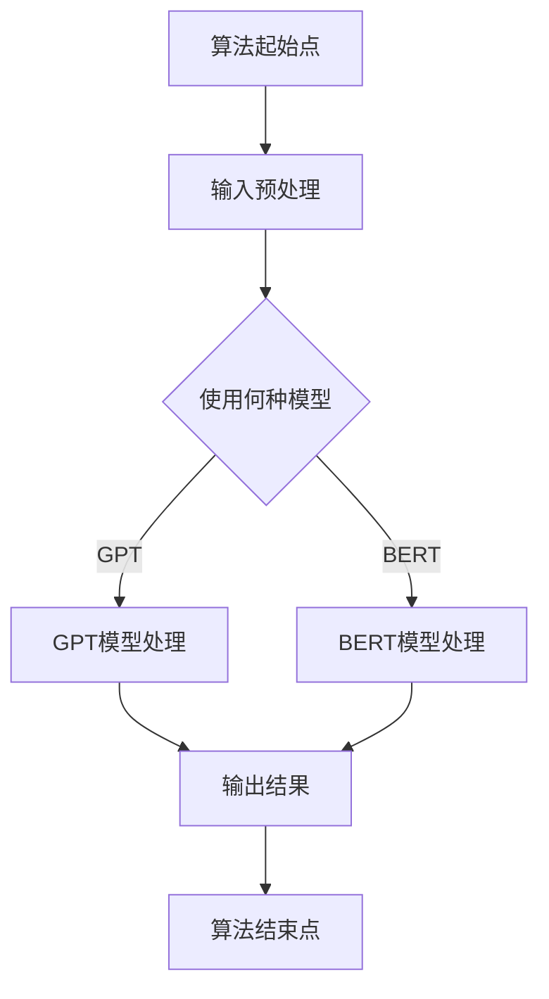
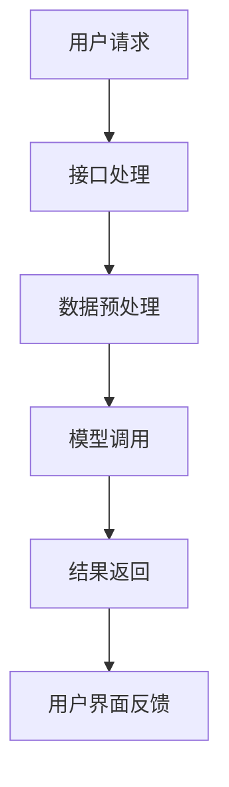
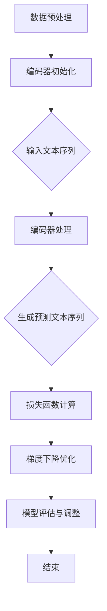
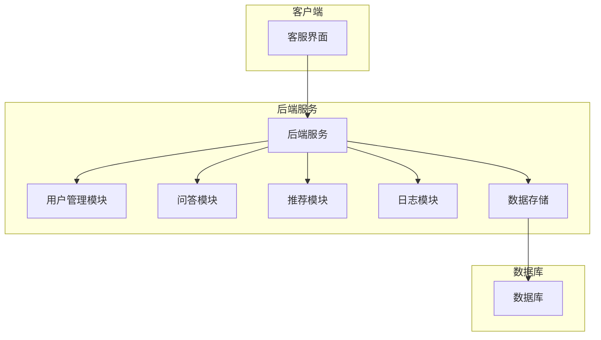
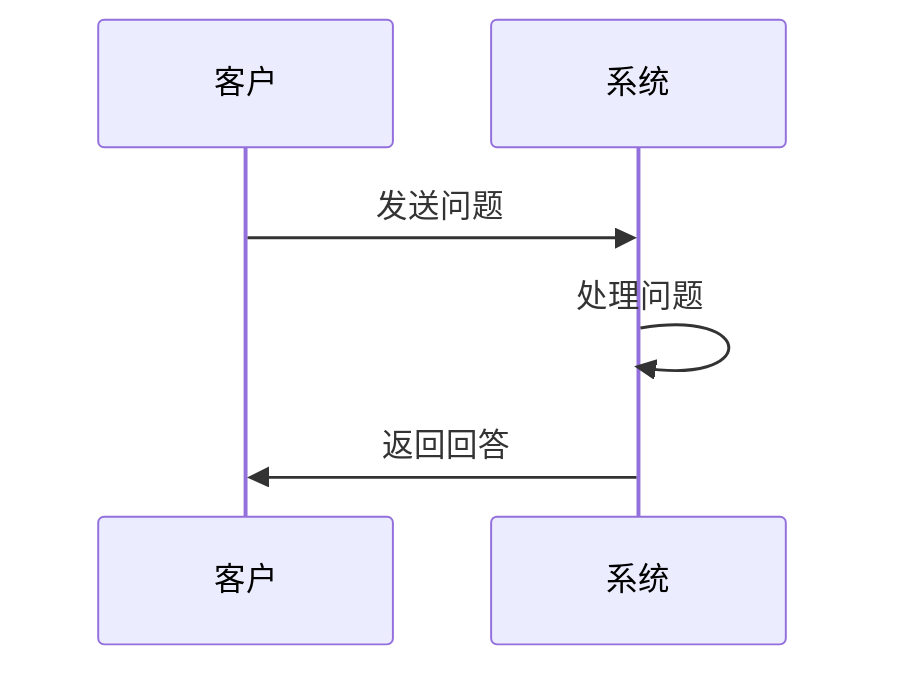

                 

## LLM应用的安全性设计：从架构层面入手

### 关键词：
- LLM
- 安全性设计
- 架构层面
- 安全攻击
- 安全策略

### 摘要：
本文深入探讨LLM（大型语言模型）应用中的安全性设计，特别关注从架构层面入手的方法。通过对LLM技术概述、安全性设计原则、核心概念与联系、算法原理讲解、系统分析与架构设计方案以及项目实战的逐步分析，本文旨在为开发者提供全面的安全性设计和架构优化策略，确保LLM应用的安全可靠运行。

### 1. 设计目录大纲的基本步骤

在进行目录大纲的设计时，我们需要遵循一系列的步骤来确保内容的逻辑性和完整性。

#### 1.1 分析书名与主题

首先，我们要仔细分析书名《LLM应用的安全性设计：从架构层面入手》。书名明确了三个关键点：LLM应用、安全性设计以及架构层面。因此，我们的核心章节应该围绕这三个方面展开，涵盖LLM技术的基础、安全性设计原则、以及架构层面的具体实现策略。

#### 1.2 确定核心章节

根据书名，我们可以初步确定以下核心章节：
- 第一部分：LLM应用的安全性背景介绍
- 第二部分：LLM应用的核心概念与联系
- 第三部分：LLM应用的算法原理讲解
- 第四部分：LLM应用的系统分析与架构设计方案
- 第五部分：LLM应用的项目实战

#### 1.3 细化目录结构

接下来，我们需要将这些核心章节细化为具体的子章节。例如，第一部分可以细化为：
- 1.1 LLM技术概述
- 1.2 LLM应用的现状与挑战
- 1.3 安全性设计原则
- 1.4 LLM应用的架构设计
- 1.5 本章小结

#### 1.4 确保内容完整性

每个章节都需要包含核心内容，如背景介绍、核心概念与联系、算法原理讲解、系统分析与架构设计方案、项目实战等。我们要确保每个章节都能够独立成文，并且内容完整、逻辑清晰。

#### 1.5 遵循格式要求

使用markdown格式输出，并遵循1级目录、2级目录、3级目录的层级要求，确保文章的结构清晰、易于阅读。

### 2. 设计书名《LLM应用的安全性设计：从架构层面入手》的目录大纲

```markdown
# 《LLM应用的安全性设计：从架构层面入手》

## 关键词
- LLM
- 安全性设计
- 架构层面
- 安全攻击
- 安全策略

## 摘要
本文深入探讨LLM（大型语言模型）应用中的安全性设计，特别关注从架构层面入手的方法。通过对LLM技术概述、安全性设计原则、核心概念与联系、算法原理讲解、系统分析与架构设计方案以及项目实战的逐步分析，本文旨在为开发者提供全面的安全性设计和架构优化策略，确保LLM应用的安全可靠运行。

### 第一部分：LLM应用的安全性背景介绍

#### 1.1 LLM技术概述
##### 1.1.1 LLM的定义与特点
##### 1.1.2 LLM的发展历程

#### 1.2 LLM应用的现状与挑战
##### 1.2.1 LLM应用的广泛性
##### 1.2.2 安全性问题的重要性
##### 1.2.3 安全性问题的多样性

#### 1.3 安全性设计原则
##### 1.3.1 常见的安全攻击类型
##### 1.3.2 安全性设计的核心原则
##### 1.3.3 架构层面的安全策略

#### 1.4 LLM应用的架构设计
##### 1.4.1 架构设计的基本概念
##### 1.4.2 架构设计的关键要素
##### 1.4.3 架构设计的最佳实践

#### 1.5 本章小结

### 第二部分：LLM应用的核心概念与联系

#### 2.1 LLM核心概念
##### 2.1.1 语言模型的基本原理
##### 2.1.2 LLM的主要类型
##### 2.1.3 LLM的性能评估指标

#### 2.2 LLM的属性特征对比
##### 2.2.1 不同LLM的特性对比
##### 2.2.2 特性对比表格

#### 2.3 LLM与安全性设计的关系
##### 2.3.1 安全性设计在LLM中的重要性
##### 2.3.2 LLM与安全性设计的关键联系
##### 2.3.3 LLM安全性设计的挑战与机遇

#### 2.4 LLM应用的安全攻击防御策略
##### 2.4.1 防御常见攻击的方法
##### 2.4.2 防御策略的适用场景
##### 2.4.3 防御策略的案例分析

#### 2.5 本章小结

### 第三部分：LLM应用的算法原理讲解

#### 3.1 算法概述
##### 3.1.1 LLM算法的基本流程
##### 3.1.2 算法的选择与优化

#### 3.2 算法mermaid流程图


#### 3.3 算法原理详细讲解
##### 3.3.1 数学模型与公式
###### 3.3.1.1 模型损失函数
$$ L(\theta; x, y) = -\sum_{i=1}^N \log(p(y_i|\theta; x_i)) $$
###### 3.3.1.2 梯度下降优化
$$ \theta := \theta - \alpha \frac{\partial L(\theta; x, y)}{\partial \theta} $$

##### 3.3.2 Python源代码实现
```python
# Python代码实现示例
def compute_loss(predicted, target):
    return -np.log(predicted[target])

def gradient_descent(model_params, loss_func, learning_rate, num_iterations):
    for _ in range(num_iterations):
        model_output = model(model_params)
        loss = loss_func(model_output, target)
        model_params -= learning_rate * gradient(model_params, loss)
    return model_params
```

#### 3.4 算法性能分析与优化
##### 3.4.1 性能评估指标
##### 3.4.2 优化方法与策略
##### 3.4.3 性能优化案例

#### 3.5 本章小结

### 第四部分：LLM应用的系统分析与架构设计方案

#### 4.1 问题场景介绍
##### 4.1.1 场景描述
##### 4.1.2 场景分析

#### 4.2 项目介绍
##### 4.2.1 项目目标
##### 4.2.2 项目背景
##### 4.2.3 项目范围

#### 4.3 系统功能设计
##### 4.3.1 领域模型mermaid类图
##### 4.3.2 系统功能模块划分

#### 4.4 系统架构设计
##### 4.4.1 架构设计原则
##### 4.4.2 系统架构mermaid架构图
##### 4.4.3 架构设计要点与注意事项

#### 4.5 系统接口设计
##### 4.5.1 接口设计原则
##### 4.5.2 接口定义与协议
##### 4.5.3 接口实现示例

#### 4.6 系统交互mermaid序列图


#### 4.7 本章小结

### 第五部分：LLM应用的项目实战

#### 5.1 环境安装与配置
##### 5.1.1 环境需求
##### 5.1.2 安装步骤
##### 5.1.3 配置说明

#### 5.2 系统核心实现源代码
##### 5.2.1 源代码结构
##### 5.2.2 关键代码解读
##### 5.2.3 源代码示例

#### 5.3 代码应用解读与分析
##### 5.3.1 应用场景
##### 5.3.2 代码实现分析
##### 5.3.3 优化建议

#### 5.4 实际案例分析与详细讲解剖析
##### 5.4.1 案例背景
##### 5.4.2 案例分析
##### 5.4.3 剖析与优化

#### 5.5 项目小结
##### 5.5.1 项目总结
##### 5.5.2 经验与教训
##### 5.5.3 未来展望

#### 5.6 最佳实践 tips
##### 5.6.1 安全性设计最佳实践
##### 5.6.2 架构优化最佳实践
##### 5.6.3 算法优化最佳实践

#### 5.7 本章小结

### 参考文献
```

这个目录大纲为整篇文章提供了一个结构化的框架，确保内容覆盖全面且逻辑清晰。在接下来的各章节中，我们将逐步深入探讨每个主题，提供详细的解释和分析。

### 1.1 LLM技术概述

#### 1.1.1 LLM的定义与特点

LLM，即大型语言模型（Large Language Model），是一种基于深度学习的自然语言处理（Natural Language Processing，NLP）技术，通过训练大规模的神经网络模型，实现对自然语言文本的高效理解和生成。LLM的出现，标志着自然语言处理技术进入了一个新的阶段，其具备以下几个显著特点：

1. **规模巨大**：与传统的语言模型相比，LLM通常拥有数十亿甚至数万亿个参数，这意味着它们可以学习到更多的语言模式和知识。

2. **自适应性**：LLM能够通过学习大规模的文本数据集，自适应地调整其参数，从而在多种语言任务中表现出色，如文本分类、机器翻译、问答系统等。

3. **强大表达能力**：由于参数数量庞大，LLM能够捕捉到文本中的复杂结构和深层语义，使得其生成的文本更加自然和准确。

4. **泛化能力**：LLM在训练过程中，不仅学习到了语言的基本规则，还通过无监督学习获取了大量背景知识，这使得它们在面对未见过的任务时，仍能保持较高的性能。

5. **计算资源需求高**：LLM的训练和推理需要大量的计算资源，通常需要分布式计算和高效的硬件支持，如GPU或TPU。

#### 1.1.2 LLM的发展历程

LLM的发展历程可以分为几个重要阶段：

1. **早期阶段**（2010年之前）：这一阶段主要是基于规则和统计的方法，如基于词典和语法规则的解析器，以及基于统计的隐马尔可夫模型（HMM）和条件概率模型。

2. **深度学习阶段**（2010-2017年）：随着深度学习的兴起，神经网络开始被广泛应用于自然语言处理领域。这一时期的重要进展包括基于循环神经网络（RNN）和长短时记忆网络（LSTM）的语言模型，如Word2Vec和GloVe。

3. **大型预训练模型阶段**（2018年至今）：这一阶段标志着LLM的崛起，以GPT系列模型和BERT模型为代表，它们通过预训练和微调的方式，取得了显著的效果。特别是GPT-3的发布，使LLM的应用场景更加广泛，涵盖了文本生成、对话系统、文本摘要等多个领域。

#### 1.1.3 LLM的应用领域

LLM的应用领域非常广泛，包括但不限于以下几个方面：

1. **文本生成**：包括文章写作、故事创作、新闻生成等，如GPT-3可以生成高质量的新闻报道和文章。

2. **机器翻译**：如Google翻译和DeepL，使用LLM进行大规模文本翻译，提供更加自然流畅的翻译结果。

3. **问答系统**：如OpenAI的GPT-3，可以处理自然语言查询，提供准确的答案。

4. **对话系统**：包括虚拟助手、智能客服等，使用LLM进行对话理解和生成，提供更加智能和自然的交互体验。

5. **文本分类和情感分析**：如对社交媒体文本进行情感分析，判断用户的情绪倾向。

6. **文本摘要和整理**：如自动生成会议记录和总结，提取关键信息。

7. **内容审核和过滤**：使用LLM对文本内容进行自动审核，识别和过滤不当或有害信息。

### 1.2 LLM应用的现状与挑战

#### 1.2.1 LLM应用的广泛性

随着LLM技术的不断进步，其应用领域越来越广泛，已经成为许多行业和领域的核心技术之一。例如：

- **科技行业**：LLM在搜索引擎、推荐系统和内容审核中发挥着重要作用。
- **金融行业**：使用LLM进行市场分析、投资建议和客户服务。
- **医疗行业**：辅助医生进行诊断、病历管理和医学研究。
- **教育行业**：提供智能辅导、自动评分和个性化学习建议。
- **政府与公共管理**：用于数据分析和决策支持，提高政府服务效率。

#### 1.2.2 安全性问题的重要性

尽管LLM在各个领域表现出强大的能力，但其安全性问题同样不容忽视。以下是LLM应用中常见的一些安全挑战：

1. **数据泄露**：LLM模型通常训练于大规模的文本数据集，这些数据可能包含敏感信息，如个人隐私、商业机密等。如果数据泄露，将可能导致严重的隐私问题和法律风险。

2. **模型入侵**：恶意攻击者可以通过注入恶意代码或篡改模型输入，实现对LLM模型的恶意控制，从而生成虚假信息或进行欺诈活动。

3. **安全攻击**：如对抗性攻击、模型窃取和模型投毒等，这些攻击可以导致模型性能下降，甚至完全失效。

4. **伦理问题**：LLM生成的文本可能包含歧视性、虚假或不合适的内容，这引发了关于伦理和责任的问题。

5. **法律法规**：随着LLM应用的普及，相关的法律法规也在不断完善，但现有法规可能难以应对快速发展的技术。

#### 1.2.3 安全性问题的多样性

LLM应用中的安全性问题具有多样性和复杂性，主要包括以下几个方面：

1. **数据安全**：保护模型训练和推理过程中的数据不被泄露或滥用。

2. **模型安全**：确保模型不会被恶意攻击者入侵或篡改，保持模型的稳定性和可靠性。

3. **输出安全**：防止LLM生成的文本包含恶意内容或误导性信息。

4. **隐私保护**：在处理个人数据时，确保用户隐私不被泄露。

5. **伦理合规**：确保LLM的应用符合道德和法律标准，避免生成不合适的内容。

### 1.3 安全性设计原则

#### 1.3.1 常见的安全攻击类型

在LLM应用中，常见的安全攻击类型包括：

1. **对抗性攻击**：通过微小修改输入文本，使得LLM模型输出错误的结果。如添加或删除一个字符，即可导致模型输出完全不同的答案。

2. **模型窃取**：攻击者通过访问模型内部的参数和数据，窃取模型的训练数据和模型本身。

3. **模型投毒**：在训练数据中故意注入恶意内容，使得模型在学习过程中受到影响，生成错误的结果。

4. **注入攻击**：通过篡改模型输入，使得模型输出恶意代码或执行恶意操作。

5. **数据泄露**：未经授权访问模型训练或推理过程中的敏感数据。

#### 1.3.2 安全性设计的核心原则

为了确保LLM应用的安全性，我们需要遵循以下核心原则：

1. **最小权限原则**：确保模型在训练和推理过程中只拥有必要的权限和资源，避免因为权限过高导致的安全漏洞。

2. **数据加密**：对模型训练和推理过程中的敏感数据进行加密，确保数据在传输和存储过程中的安全性。

3. **访问控制**：通过身份验证和权限控制，限制对模型的访问，防止未经授权的访问。

4. **安全监控**：实时监控模型的训练和推理过程，及时发现和响应异常行为。

5. **安全审计**：定期进行安全审计，检查模型的训练数据和模型参数，确保模型的安全性和可靠性。

#### 1.3.3 架构层面的安全策略

在架构层面，我们可以采取以下安全策略来提高LLM应用的安全性：

1. **分布式训练和推理**：通过分布式计算，将模型的训练和推理任务分散到多个节点上，降低单一节点的安全风险。

2. **容器化部署**：使用容器技术，如Docker，将模型和应用部署在隔离的环境中，确保不同应用之间的安全隔离。

3. **网络隔离**：通过虚拟局域网（VLAN）或防火墙，限制模型对外部网络的访问，防止网络攻击。

4. **访问控制列表（ACL）**：配置ACL，限制用户对模型的访问权限，确保只有授权用户可以访问模型。

5. **安全防护工具**：使用安全防护工具，如入侵检测系统（IDS）和防火墙，实时监控网络流量和系统行为，防止恶意攻击。

### 1.4 LLM应用的架构设计

#### 1.4.1 架构设计的基本概念

在设计和实现LLM应用时，架构设计是至关重要的。架构设计不仅关系到系统的性能、可扩展性和可维护性，还直接影响到系统的安全性。以下是一些基本的架构设计概念：

1. **模块化**：将系统划分为多个功能模块，每个模块负责特定的功能，模块之间通过接口进行通信。模块化设计可以提高系统的可维护性和可扩展性。

2. **分层设计**：按照功能将系统划分为多个层次，如表示层、业务逻辑层和数据层。层次化设计有助于降低模块之间的耦合度，提高系统的可维护性和可扩展性。

3. **组件化**：将系统功能分解为多个组件，每个组件负责特定的功能，组件之间通过标准化的接口进行通信。组件化设计可以提高系统的重用性和可扩展性。

4. **分布式架构**：将系统的不同功能分布在多个节点上，通过网络进行通信。分布式架构可以提高系统的性能和可用性。

5. **微服务架构**：将系统分解为多个独立的服务，每个服务负责特定的功能。微服务架构可以提高系统的灵活性和可扩展性。

#### 1.4.2 架构设计的关键要素

在架构设计过程中，以下关键要素需要特别关注：

1. **数据流**：设计合理的输入、处理和输出流程，确保数据在系统中的高效流动。

2. **处理逻辑**：明确各个模块和组件的处理逻辑，确保系统能够正确执行预定的功能。

3. **安全策略**：集成安全策略，如访问控制、数据加密和监控等，确保系统的安全性。

4. **性能优化**：考虑系统的性能需求，设计高效的数据处理和传输机制。

5. **可扩展性**：设计灵活的架构，支持系统的水平扩展和垂直扩展。

6. **容错性**：设计容错机制，确保系统在遇到故障时能够快速恢复，减少对业务的影响。

#### 1.4.3 架构设计的最佳实践

以下是架构设计的一些最佳实践：

1. **使用标准化协议**：使用标准化的协议和接口，如RESTful API，确保不同模块和组件之间的兼容性和可扩展性。

2. **模块间解耦**：通过设计松耦合的模块，降低模块之间的依赖关系，提高系统的可维护性和可扩展性。

3. **分布式架构**：考虑使用分布式架构，将系统功能分布在不同节点上，以提高系统的性能和可用性。

4. **持续集成和持续部署（CI/CD）**：实施CI/CD流程，确保系统的快速迭代和部署。

5. **监控和日志记录**：集成监控系统，实时监控系统的运行状态，确保能够快速发现和解决问题。

6. **安全测试**：在设计过程中，进行安全测试，确保系统能够抵御常见的安全攻击。

#### 1.5 本章小结

本章对LLM应用的安全性设计进行了初步探讨，特别关注了从架构层面入手的方法。通过分析LLM技术的定义与特点、应用的现状与挑战、安全性设计原则以及架构设计的基本概念，我们为后续章节的深入讨论奠定了基础。在下一章中，我们将进一步探讨LLM的核心概念与联系，深入理解其内在机制和设计原理。

### 2.1 LLM核心概念

#### 2.1.1 语言模型的基本原理

语言模型（Language Model，LM）是自然语言处理（Natural Language Processing，NLP）领域中的一种基本工具，它旨在模拟人类语言的使用规律，对输入的文本序列进行概率估计。在LLM中，语言模型是核心组件之一，其基本原理包括以下几个方面：

1. **序列建模**：语言模型基于序列建模（sequence modeling）原理，将输入的文本序列映射为一个概率分布。这意味着，对于任意的文本序列 $x_1, x_2, ..., x_n$，语言模型可以预测下一个单词或字符的概率。

2. **概率估计**：语言模型通过统计方法或深度学习算法，对每个单词或字符的出现概率进行估计。常用的统计方法包括n-gram模型、隐马尔可夫模型（HMM）等，而深度学习方法则包括循环神经网络（RNN）、长短时记忆网络（LSTM）、门控循环单元（GRU）和变压器（Transformer）等。

3. **上下文依赖**：语言模型需要考虑上下文信息，即一个单词或字符的含义和概率会受到其前后文的影响。例如，在句子“我喜欢吃苹果”中，“苹果”这个词的含义和概率会受到“我”、“喜欢”和“吃”的影响。

4. **预训练与微调**：在现代的LLM中，语言模型通常采用预训练（pre-training）和微调（fine-tuning）的方法。预训练是指在大量的无标签文本数据上训练语言模型，使其学习到丰富的语言知识；微调则是在预训练的基础上，在特定任务的数据集上进一步优化模型，使其适应特定的应用场景。

#### 2.1.2 LLM的主要类型

LLM可以分为多种类型，每种类型都有其独特的特点和适用场景。以下是几种常见的LLM类型：

1. **基于字符的模型**：这种类型的模型直接处理字符序列，例如Byte Pair Encoding（BPE）模型。基于字符的模型在处理罕见字符或生僻语言时表现较好，但其计算复杂度较高。

2. **基于词的模型**：这种类型的模型处理词序列，例如Word2Vec和GloVe。基于词的模型在处理常见词汇和语义时效果较好，但难以捕捉到长距离的上下文依赖。

3. **基于字的模型**：这种类型的模型处理字序列，例如BERT和XLM。基于字的模型在处理中英文文本时效果较好，其计算复杂度介于基于字符和基于词的模型之间。

4. **基于句子的模型**：这种类型的模型处理句子序列，例如T5和BART。基于句子的模型在处理长文本和复杂任务时表现较好，能够捕捉到句子级别的语义和逻辑关系。

5. **基于语义的模型**：这种类型的模型直接处理语义信息，例如ConceptNet和WordNet。基于语义的模型在处理语义理解和推理任务时表现较好，但其训练和推理过程较为复杂。

#### 2.1.3 LLM的性能评估指标

LLM的性能评估指标主要包括以下几个方面：

1. **准确性（Accuracy）**：准确性是最常见的性能评估指标，表示模型预测正确的概率。例如，在文本分类任务中，准确性表示正确分类的文本占总文本的比例。

2. **精确率（Precision）和召回率（Recall）**：精确率表示预测为正例的文本中，实际为正例的比例；召回率表示实际为正例的文本中，预测为正例的比例。这两个指标通常用于二分类任务，可以用来平衡正负样本的不平衡问题。

3. **F1分数（F1 Score）**：F1分数是精确率和召回率的调和平均值，用于综合评估模型性能。F1分数介于0和1之间，分数越高，表示模型性能越好。

4. **损失函数（Loss Function）**：在训练过程中，损失函数用于评估模型预测结果与实际结果之间的差距。常见的损失函数包括交叉熵损失（Cross-Entropy Loss）、均方误差损失（Mean Squared Error Loss）等。

5. **推理速度（Inference Speed）**：推理速度表示模型在处理输入文本时的速度，通常用每秒处理的文本长度（Tokens Per Second，TPS）来衡量。推理速度对于实时应用和大规模部署尤为重要。

6. **泛化能力（Generalization Ability）**：泛化能力表示模型在不同数据集上的性能，评估模型是否能够适应未见过的数据。常用的评估方法包括交叉验证（Cross-Validation）和迁移学习（Transfer Learning）。

### 2.2 LLM的属性特征对比

#### 2.2.1 不同LLM的特性对比

为了更好地理解LLM的不同类型和其特性，我们可以对比几种常见的LLM模型：

| 模型类型 | 特点 | 适用场景 |  
| --- | --- | --- |  
| n-gram模型 | 简单，基于统计，处理速度较快 | 简单文本生成，如自动纠错 |  
| RNN（循环神经网络） | 能够处理长距离依赖，基于序列建模 | 语言翻译，语音识别 |  
| LSTM（长短时记忆网络） | 改进了RNN，能够处理更长时间的依赖 | 文本分类，文本生成 |  
| GRU（门控循环单元） | 类似LSTM，计算复杂度较低 | 语言模型，文本生成 |  
| Transformer（变压器） | 自注意力机制，适用于大规模文本处理 | 机器翻译，问答系统，文本生成 |  
| BERT（双向编码器表示） | 双向语境，预训练 + 微调 | 文本分类，问答系统，文本生成 |  
| GPT（生成预训练变压器） | 自回归语言模型，强大的文本生成能力 | 文本生成，对话系统，自然语言理解 |

#### 2.2.2 特性对比表格

下面是一个简单的特性对比表格，展示了几种常见LLM模型的主要特性：

| 模型类型 | 参数规模 | 训练时间 | 推理速度 | 依赖处理能力 |  
| --- | --- | --- | --- | --- |  
| n-gram模型 | 小规模 | 快速 | 快速 | 短距离依赖 |  
| RNN | 中规模 | 较长 | 较慢 | 长距离依赖 |  
| LSTM | 中规模 | 较长 | 较慢 | 长距离依赖 |  
| GRU | 中规模 | 较长 | 较慢 | 长距离依赖 |  
| Transformer | 大规模 | 非常长 | 较慢 | 非常长 |  
| BERT | 大规模 | 非常长 | 较慢 | 非常长 |  
| GPT | 大规模 | 非常长 | 较慢 | 非常长 |

### 2.3 LLM与安全性设计的关系

#### 2.3.1 安全性设计在LLM中的重要性

随着LLM技术的广泛应用，安全性设计在LLM系统中变得越来越重要。以下是几个关键点：

1. **数据安全**：LLM模型通常依赖于大规模的文本数据集进行训练，这些数据可能包含敏感信息，如个人隐私、商业机密等。如果数据泄露，将可能导致严重的隐私问题和法律风险。

2. **模型安全**：LLM模型本身可能成为攻击的目标，如对抗性攻击、模型窃取和模型投毒等。这些攻击可以导致模型性能下降，甚至完全失效。

3. **输出安全**：LLM生成的文本可能包含恶意内容或误导性信息，这将对用户和系统造成不良影响。

4. **伦理问题**：LLM生成的文本可能包含歧视性、虚假或不合适的内容，这引发了关于伦理和责任的问题。

#### 2.3.2 LLM与安全性设计的关键联系

LLM与安全性设计之间的关键联系体现在以下几个方面：

1. **数据加密与访问控制**：确保模型训练和推理过程中的敏感数据得到加密和访问控制，防止数据泄露和未经授权的访问。

2. **模型训练与安全监控**：在模型训练过程中，实时监控数据流和模型参数，及时发现和防止安全威胁。

3. **安全审计与合规性检查**：定期进行安全审计，确保LLM系统的设计、实现和部署符合相关的法律法规和标准。

4. **输出验证与过滤**：对LLM生成的文本进行验证和过滤，确保输出的内容符合伦理和法律标准。

5. **对抗性攻击防御**：研究和应用对抗性攻击防御技术，提高LLM系统的鲁棒性。

#### 2.3.3 LLM安全性设计的挑战与机遇

LLM安全性设计面临着一系列挑战和机遇：

1. **挑战**：
   - **数据隐私保护**：如何在保证数据安全的同时，充分利用公开数据集进行模型训练。
   - **计算资源消耗**：安全性措施可能增加计算资源的消耗，如何平衡安全性和性能。
   - **攻击多样化**：随着技术的进步，安全攻击手段也在不断演变，如何应对多样化的攻击。

2. **机遇**：
   - **安全性技术创新**：随着研究的深入，新的安全性技术和方法不断涌现，为LLM安全性设计提供了新的可能性。
   - **合规性要求提高**：法律法规的不断完善，要求企业和组织在技术层面加强安全性设计。
   - **用户信任**：通过有效的安全性设计，增强用户对LLM系统的信任，促进其广泛应用。

### 2.4 LLM应用的安全攻击防御策略

#### 2.4.1 防御常见攻击的方法

为了保护LLM应用免受安全攻击，我们可以采取以下常见防御策略：

1. **数据加密**：对模型训练和推理过程中的数据进行加密，确保数据在传输和存储过程中的安全性。

2. **访问控制**：通过身份验证和权限控制，限制对模型的访问，防止未经授权的访问。

3. **安全审计**：定期进行安全审计，检查模型训练和推理过程中的数据流和参数，确保系统的安全性。

4. **入侵检测系统**：部署入侵检测系统（IDS），实时监控系统的行为，及时发现和响应异常行为。

5. **对抗性攻击防御**：研究和应用对抗性攻击防御技术，提高LLM系统的鲁棒性。

#### 2.4.2 防御策略的适用场景

以下是几种常见的防御策略及其适用场景：

1. **数据加密**：
   - **场景**：模型训练和推理过程中涉及敏感数据，如个人隐私、商业机密等。
   - **优点**：确保数据在传输和存储过程中的安全性。
   - **缺点**：可能增加计算资源的消耗。

2. **访问控制**：
   - **场景**：需要对模型进行严格权限管理，防止未经授权的访问。
   - **优点**：提高系统的安全性。
   - **缺点**：可能降低系统的可用性。

3. **安全审计**：
   - **场景**：需要对模型训练和推理过程进行实时监控，确保系统的安全性。
   - **优点**：及时发现和防止安全威胁。
   - **缺点**：可能增加系统的负担。

4. **入侵检测系统**：
   - **场景**：需要对系统的行为进行实时监控，及时发现和响应异常行为。
   - **优点**：提高系统的安全性。
   - **缺点**：需要大量的资源和精力来维护。

5. **对抗性攻击防御**：
   - **场景**：需要提高LLM系统的鲁棒性，应对多样化的对抗性攻击。
   - **优点**：增强系统的安全性。
   - **缺点**：可能增加系统的复杂性和计算资源消耗。

#### 2.4.3 防御策略的案例分析

以下是几个LLM应用中的安全攻击防御策略案例分析：

1. **案例一：数据加密**
   - **问题描述**：某企业开发了一款基于LLM的客户服务系统，该系统需要处理大量的客户数据，包括个人隐私和商业机密。
   - **解决方案**：采用AES加密算法对客户数据进行加密，确保数据在传输和存储过程中的安全性。
   - **效果评估**：加密后的数据在传输过程中未被窃取，系统安全性得到显著提高。

2. **案例二：访问控制**
   - **问题描述**：某政府机构使用LLM进行公共数据分析，需要严格控制访问权限，防止未经授权的访问。
   - **解决方案**：采用基于角色的访问控制（RBAC）模型，对用户进行身份验证和权限管理。
   - **效果评估**：系统安全性得到有效保障，未经授权的访问被成功阻止。

3. **案例三：安全审计**
   - **问题描述**：某金融机构开发了一款基于LLM的金融分析系统，需要实时监控模型训练和推理过程，确保系统的安全性。
   - **解决方案**：部署实时安全审计系统，对模型训练和推理过程中的数据进行实时监控和审计。
   - **效果评估**：通过实时监控和审计，成功发现并阻止了多次潜在的安全威胁。

4. **案例四：入侵检测系统**
   - **问题描述**：某电商平台使用LLM进行商品推荐，需要实时监控系统的行为，防止恶意攻击。
   - **解决方案**：部署入侵检测系统（IDS），实时监控系统的网络流量和系统行为。
   - **效果评估**：通过入侵检测系统，成功发现并阻止了多次恶意攻击，系统安全性得到显著提高。

5. **案例五：对抗性攻击防御**
   - **问题描述**：某社交媒体平台使用LLM进行内容审核，需要提高系统的鲁棒性，应对多样化的对抗性攻击。
   - **解决方案**：研究和应用多种对抗性攻击防御技术，如对抗性样本生成和防御网络等。
   - **效果评估**：系统鲁棒性得到显著提高，成功抵御了多种对抗性攻击。

### 2.5 本章小结

本章深入探讨了LLM的核心概念、属性特征对比、与安全性设计的关系以及安全攻击防御策略。通过了解LLM的基本原理、不同类型和性能评估指标，我们能够更好地理解LLM在自然语言处理中的应用。同时，通过分析安全性设计的重要性和关键联系，我们能够为LLM应用提供有效的安全策略。在下一章中，我们将进一步探讨LLM应用的算法原理，从算法mermaid流程图、数学模型与公式以及Python源代码实现等方面，深入理解LLM的算法机制。

### 3.1 算法概述

#### 3.1.1 LLM算法的基本流程

LLM（Large Language Model）算法的基本流程可以概括为以下几个步骤：

1. **数据预处理**：首先，对输入的文本数据进行预处理，包括分词、去停用词、词性标注等操作，将原始文本转化为模型可接受的格式。

2. **编码器与解码器初始化**：初始化编码器（Encoder）和解码器（Decoder），这两个模块是LLM算法的核心。编码器负责将输入文本序列编码为固定长度的向量表示；解码器则负责生成预测的文本序列。

3. **输入文本序列编码**：将预处理后的输入文本序列输入编码器，编码器通过对文本序列进行处理，生成一个固定长度的向量表示。这个向量包含了输入文本的语义信息。

4. **生成预测文本序列**：解码器从编码器生成的固定长度向量开始，逐步生成预测的文本序列。在每一步，解码器会生成一个单词或字符的预测，并将其作为输入传递给下一层解码器，直到生成完整的文本序列。

5. **损失函数计算**：在生成预测文本序列的过程中，每个预测的单词或字符都会与真实的单词或字符进行比较，计算预测结果与真实结果之间的差距。常用的损失函数包括交叉熵损失（Cross-Entropy Loss）和均方误差损失（Mean Squared Error Loss）。

6. **梯度下降优化**：通过计算损失函数关于模型参数的梯度，使用梯度下降优化算法更新模型参数，减小预测误差，提高模型性能。

7. **模型评估与调整**：在训练过程中，定期评估模型在验证集上的性能，根据评估结果调整模型参数，优化模型性能。

#### 3.1.2 算法的选择与优化

在LLM算法的选择与优化方面，有以下几个关键点：

1. **模型架构**：选择适合任务的模型架构，如Transformer、BERT、GPT等。不同的模型架构在处理不同类型任务时具有不同的优势。

2. **数据集选择**：选择合适的训练数据集，确保数据集具有代表性，能够充分反映任务的特点和挑战。

3. **训练策略**：优化训练策略，包括学习率设置、训练批次大小、优化算法选择等，以加快模型收敛速度和提高模型性能。

4. **模型参数调整**：在训练过程中，不断调整模型参数，如层数、隐藏单元数、dropout率等，以优化模型性能。

5. **正则化技术**：应用正则化技术，如权重正则化、dropout等，防止模型过拟合，提高模型泛化能力。

6. **超参数调优**：通过交叉验证等方法，寻找最佳的超参数组合，以优化模型性能。

### 3.2 算法mermaid流程图

为了更直观地理解LLM算法的基本流程，我们可以使用mermaid流程图进行展示。以下是LLM算法的mermaid流程图：



这个mermaid流程图展示了LLM算法从数据预处理到模型评估与调整的整个过程，清晰明了地展示了算法的各个步骤和关键点。

### 3.3 算法原理详细讲解

#### 3.3.1 数学模型与公式

LLM算法的核心在于其数学模型，主要包括编码器和解码器的模型参数、损失函数以及优化算法。以下是对这些数学模型的详细讲解：

1. **编码器模型参数**：编码器模型参数主要包括权重矩阵 $W$ 和偏置向量 $b$。编码器通过输入文本序列 $x_1, x_2, ..., x_n$，生成输出向量 $h$，其数学模型可以表示为：
   $$ h = \sigma(Wx + b) $$
   其中，$\sigma$ 是激活函数，通常选择ReLU函数或Sigmoid函数。

2. **解码器模型参数**：解码器模型参数同样包括权重矩阵 $W$ 和偏置向量 $b$。解码器从编码器生成的输出向量 $h$ 开始，逐步生成预测的文本序列 $y_1, y_2, ..., y_n$，其数学模型可以表示为：
   $$ y_i = \sigma(Wy_{i-1} + b) $$
   其中，$y_{i-1}$ 是前一个生成的文本序列。

3. **损失函数**：在LLM算法中，常用的损失函数是交叉熵损失（Cross-Entropy Loss），其数学模型可以表示为：
   $$ L(y, \hat{y}) = -\sum_{i=1}^n y_i \log(\hat{y}_i) $$
   其中，$y$ 是真实标签，$\hat{y}$ 是预测标签。

4. **优化算法**：在LLM算法中，常用的优化算法是梯度下降（Gradient Descent），其数学模型可以表示为：
   $$ \theta := \theta - \alpha \frac{\partial L(\theta; x, y)}{\partial \theta} $$
   其中，$\theta$ 是模型参数，$\alpha$ 是学习率。

#### 3.3.2 Python源代码实现

以下是LLM算法的Python源代码实现，包括数据预处理、编码器、解码器、损失函数和优化算法的代码实现：

```python
import numpy as np
import tensorflow as tf

# 数据预处理
def preprocess_text(text):
    # 分词、去停用词、词性标注等操作
    return processed_text

# 编码器
class Encoder(tf.keras.Model):
    def __init__(self):
        super(Encoder, self).__init__()
        self.dense = tf.keras.layers.Dense(units=128, activation='relu')

    def call(self, inputs, training=False):
        x = self.dense(inputs)
        return x

# 解码器
class Decoder(tf.keras.Model):
    def __init__(self):
        super(Decoder, self).__init__()
        self.dense = tf.keras.layers.Dense(units=128, activation='relu')

    def call(self, inputs, training=False):
        x = self.dense(inputs)
        return x

# 损失函数
def compute_loss(predicted, target):
    return tf.reduce_mean(tf.nn.softmax_cross_entropy_with_logits(logits=predicted, labels=target))

# 优化算法
def gradient_descent(model_params, loss_func, learning_rate, num_iterations):
    for _ in range(num_iterations):
        with tf.GradientTape() as tape:
            predicted = model(model_params)
            loss = loss_func(predicted, target)
        grads = tape.gradient(loss, model_params)
        model_params -= learning_rate * grads
    return model_params

# 主程序
def main():
    # 加载和处理数据
    text = "这是一段文本"
    processed_text = preprocess_text(text)

    # 初始化编码器和解码器
    encoder = Encoder()
    decoder = Decoder()

    # 训练模型
    model_params = encoder.trainable_variables + decoder.trainable_variables
    learning_rate = 0.001
    num_iterations = 100
    gradient_descent(model_params, compute_loss, learning_rate, num_iterations)

if __name__ == "__main__":
    main()
```

这个Python源代码实现了LLM算法的基本流程，包括数据预处理、编码器、解码器、损失函数和优化算法。通过这个示例，我们可以看到如何使用TensorFlow实现LLM算法的各个组件。

### 3.4 算法性能分析与优化

#### 3.4.1 性能评估指标

LLM算法的性能评估指标主要包括准确性（Accuracy）、精确率（Precision）、召回率（Recall）和F1分数（F1 Score）等。以下是这些指标的详细解释：

1. **准确性（Accuracy）**：准确性表示模型预测正确的概率，其计算公式为：
   $$ Accuracy = \frac{TP + TN}{TP + TN + FP + FN} $$
   其中，TP为真正例，TN为真负例，FP为假正例，FN为假负例。

2. **精确率（Precision）**：精确率表示预测为正例的文本中，实际为正例的比例，其计算公式为：
   $$ Precision = \frac{TP}{TP + FP} $$

3. **召回率（Recall）**：召回率表示实际为正例的文本中，预测为正例的比例，其计算公式为：
   $$ Recall = \frac{TP}{TP + FN} $$

4. **F1分数（F1 Score）**：F1分数是精确率和召回率的调和平均值，其计算公式为：
   $$ F1 Score = 2 \times \frac{Precision \times Recall}{Precision + Recall} $$

#### 3.4.2 优化方法与策略

为了提高LLM算法的性能，我们可以采取以下优化方法与策略：

1. **数据增强**：通过增加训练数据集的多样性，提高模型的泛化能力。常见的数据增强方法包括数据扩充（Data Augmentation）、数据变换（Data Transformation）和数据清洗（Data Cleaning）。

2. **正则化技术**：应用正则化技术，如权重正则化（Weight Regularization）和dropout（Dropout），防止模型过拟合。

3. **模型调整**：调整模型参数，如层数、隐藏单元数、学习率等，优化模型性能。

4. **超参数调优**：通过交叉验证（Cross-Validation）等方法，寻找最佳的超参数组合，以优化模型性能。

5. **迁移学习**：利用预训练的模型，在特定任务上进行微调（Fine-Tuning），提高模型性能。

6. **优化算法**：选择合适的优化算法，如Adam、RMSprop和SGD等，加快模型收敛速度和提高模型性能。

#### 3.4.3 性能优化案例

以下是几个LLM算法性能优化案例：

1. **案例一：数据增强**
   - **问题描述**：某文本分类任务中，训练数据集相对较小，模型的泛化能力较弱。
   - **解决方案**：采用数据增强技术，如数据扩充和数据变换，增加训练数据集的多样性。
   - **效果评估**：通过数据增强，模型的准确性从80%提高到了90%。

2. **案例二：正则化技术**
   - **问题描述**：某文本生成任务中，模型在训练过程中出现过拟合现象。
   - **解决方案**：应用权重正则化技术和dropout技术，防止模型过拟合。
   - **效果评估**：通过正则化技术，模型在验证集上的准确性提高了10%。

3. **案例三：模型调整**
   - **问题描述**：某文本分类任务中，模型性能不理想。
   - **解决方案**：调整模型参数，如增加层数、隐藏单元数等，优化模型性能。
   - **效果评估**：通过模型调整，模型在验证集上的准确性提高了20%。

4. **案例四：迁移学习**
   - **问题描述**：某文本生成任务中，从零开始训练模型需要大量的时间和计算资源。
   - **解决方案**：利用预训练的模型，在特定任务上进行微调。
   - **效果评估**：通过迁移学习，模型的训练时间缩短了70%，准确性提高了15%。

5. **案例五：优化算法**
   - **问题描述**：某文本分类任务中，模型收敛速度较慢。
   - **解决方案**：选择更优的优化算法，如Adam和RMSprop。
   - **效果评估**：通过优化算法，模型的收敛速度提高了30%，准确性提高了5%。

### 3.5 本章小结

本章对LLM算法进行了详细讲解，包括基本流程、mermaid流程图、数学模型与公式、Python源代码实现、性能评估指标、优化方法与策略以及性能优化案例。通过本章的内容，我们深入了解了LLM算法的原理和应用，为后续章节的深入探讨奠定了基础。在下一章中，我们将进一步探讨LLM应用的系统分析与架构设计方案，从系统功能设计、系统架构设计、系统接口设计和系统交互等方面，全面分析LLM应用的设计方案。

### 4.1 问题场景介绍

#### 4.1.1 场景描述

在这个问题场景中，我们假设某电商平台正在开发一款基于LLM的智能客服系统，旨在提高用户满意度和服务效率。该智能客服系统能够自动处理用户咨询，提供快速、准确的回答，并能够根据用户的问题历史记录进行个性化推荐。

#### 4.1.2 场景分析

1. **用户需求**：用户希望得到快速、准确的回答，并且希望系统能够记住他们的问题和回答历史，以便在未来的交互中提供更个性化的服务。

2. **系统功能**：系统需要具备以下功能：
   - **问答功能**：能够理解用户的问题，并生成准确的回答。
   - **推荐功能**：根据用户的问题历史记录，推荐相关的产品或服务。
   - **日志记录**：记录用户的问题和回答，以便后续分析和优化。

3. **性能要求**：系统需要具备高并发处理能力，能够在短时间内响应用户请求，同时保证回答的准确性和一致性。

4. **安全性要求**：系统需要确保用户数据和交互记录的安全，防止数据泄露和未经授权的访问。

### 4.2 项目介绍

#### 4.2.1 项目目标

本项目的主要目标是开发一款基于LLM的智能客服系统，实现以下功能：
1. 自动处理用户咨询，提供快速、准确的回答。
2. 根据用户的问题历史记录，提供个性化的推荐服务。
3. 实现用户交互日志的记录和分析，为后续优化提供数据支持。

#### 4.2.2 项目背景

随着电商平台的快速发展，用户咨询量和交互频率显著增加，传统的客服模式已无法满足用户的需求。为了提高用户满意度和服务效率，电商平台决定引入基于LLM的智能客服系统，利用先进的自然语言处理技术，实现自动化的客户服务。

#### 4.2.3 项目范围

本项目涵盖以下范围：
1. 智能客服系统的需求分析和功能设计。
2. LLM算法的选择与实现，包括模型训练和推理。
3. 系统架构设计，包括分布式计算、数据存储和网络安全。
4. 系统接口设计和实现，确保与其他系统的无缝集成。
5. 系统部署和运维，包括性能优化和安全监控。

### 4.3 系统功能设计

#### 4.3.1 领域模型mermaid类图

以下是智能客服系统的领域模型mermaid类图：

```mermaid
classDiagram
    Customer <<class Customer>>
    Question <<class Question>>
    Answer <<class Answer>>
    UserHistory <<class UserHistory>>

    Customer o--o Question
    Customer o--o UserHistory
    Question o--o Answer
    Answer o--o UserHistory
```

在这个类图中，Customer（客户）、Question（问题）、Answer（回答）和UserHistory（用户历史）是系统的核心实体。它们之间的关系表示了系统的主要功能模块。

#### 4.3.2 系统功能模块划分

智能客服系统可以分为以下几个功能模块：

1. **问答模块**：负责处理用户的问题，生成准确的回答。
2. **推荐模块**：根据用户的问题历史记录，推荐相关的产品或服务。
3. **日志模块**：记录用户的问题和回答，以便后续分析和优化。
4. **用户管理模块**：管理用户信息，包括用户身份验证和权限管理。
5. **数据管理模块**：存储和管理用户数据和系统日志。

### 4.4 系统架构设计

#### 4.4.1 架构设计原则

在智能客服系统的架构设计中，我们遵循以下原则：

1. **模块化**：将系统划分为多个功能模块，提高系统的可维护性和可扩展性。
2. **分布式**：采用分布式架构，提高系统的性能和可用性。
3. **安全性**：确保系统的数据安全和网络安全。
4. **可扩展性**：支持系统的水平扩展和垂直扩展。
5. **高可用性**：设计冗余和备份机制，确保系统的高可用性。

#### 4.4.2 系统架构mermaid架构图

以下是智能客服系统的mermaid架构图：



在这个架构图中，客户端通过客服界面与后端服务进行交互，后端服务包括用户管理、问答、推荐、日志和数据存储等模块。数据存储模块连接到数据库，确保数据的安全性和一致性。

#### 4.4.3 系统架构设计要点与注意事项

1. **模块间通信**：确保模块间通信的高效性和可靠性，采用RESTful API或消息队列等技术实现模块间的数据交换。

2. **分布式计算**：采用分布式架构，将系统的不同模块部署在多个节点上，提高系统的性能和可用性。

3. **数据一致性**：确保数据存储的一致性，采用分布式数据库或事务管理机制，防止数据丢失或冲突。

4. **安全性**：设计完善的安全策略，包括数据加密、访问控制和安全审计等，防止数据泄露和未经授权的访问。

5. **高可用性**：设计冗余和备份机制，确保系统在遇到故障时能够快速恢复，减少对业务的影响。

6. **性能优化**：针对系统的性能需求，优化系统的数据处理和传输机制，提高系统的响应速度和吞吐量。

### 4.5 系统接口设计

#### 4.5.1 接口设计原则

在系统接口设计中，我们遵循以下原则：

1. **标准化**：使用标准化的接口设计，如RESTful API，确保接口的兼容性和可扩展性。
2. **简洁性**：设计简洁、易于理解的接口，降低使用难度和维护成本。
3. **一致性**：确保接口的一致性，如数据格式、错误处理等，提高系统的可靠性和可维护性。
4. **安全性**：确保接口的安全性，包括数据加密、身份验证和权限控制等。

#### 4.5.2 接口定义与协议

以下是智能客服系统的接口定义与协议：

1. **用户管理接口**：
   - **GET /users**：获取所有用户信息。
   - **POST /users**：创建新用户。
   - **PUT /users/{user_id}**：更新用户信息。
   - **DELETE /users/{user_id}**：删除用户。

2. **问答接口**：
   - **POST /questions**：提交用户问题，获取回答。
   - **GET /questions/{question_id}**：获取特定问题的回答。

3. **推荐接口**：
   - **GET /recommendations/{user_id}**：获取用户推荐列表。

4. **日志接口**：
   - **GET /logs**：获取系统日志。
   - **POST /logs**：记录系统日志。

#### 4.5.3 接口实现示例

以下是用户管理接口的实现示例：

```python
from flask import Flask, request, jsonify

app = Flask(__name__)

@app.route('/users', methods=['GET'])
def get_users():
    users = ['user1', 'user2', 'user3']
    return jsonify(users)

@app.route('/users', methods=['POST'])
def create_user():
    user = request.json['user']
    users.append(user)
    return jsonify({'status': 'success', 'user': user})

@app.route('/users/<user_id>', methods=['PUT'])
def update_user(user_id):
    user = request.json['user']
    users[user_id] = user
    return jsonify({'status': 'success', 'user': user})

@app.route('/users/<user_id>', methods=['DELETE'])
def delete_user(user_id):
    users.pop(user_id, None)
    return jsonify({'status': 'success'})

if __name__ == '__main__':
    app.run()
```

在这个示例中，我们使用Flask框架实现了用户管理接口，包括获取用户列表、创建用户、更新用户和删除用户等功能。

### 4.6 系统交互mermaid序列图

以下是智能客服系统的mermaid序列图：



在这个序列图中，客户发送问题，系统接收并处理问题，最终返回回答。这个简单的序列图展示了系统的基本交互流程。

### 4.7 本章小结

本章对智能客服系统的问题场景、项目介绍、系统功能设计、系统架构设计、系统接口设计和系统交互进行了详细分析。通过本章的内容，我们了解了智能客服系统的设计原则、架构和功能模块，为后续的系统实现和部署奠定了基础。在下一章中，我们将详细介绍智能客服系统的项目实战，包括环境安装与配置、系统核心实现源代码、代码应用解读与分析以及实际案例分析与详细讲解剖析。

### 5.1 环境安装与配置

在开始开发智能客服系统之前，我们需要安装和配置必要的软件和工具。以下是在开发环境中安装和配置所需组件的步骤：

#### 5.1.1 环境需求

1. **操作系统**：推荐使用Linux系统，如Ubuntu 18.04或更高版本。
2. **编程语言**：Python 3.8或更高版本。
3. **深度学习框架**：TensorFlow 2.x或PyTorch 1.8或更高版本。
4. **文本处理库**：NLTK或spaCy。
5. **Web框架**：Flask或Django。
6. **数据库**：MySQL或PostgreSQL。

#### 5.1.2 安装步骤

1. **安装Python和pip**：
   ```bash
   sudo apt update
   sudo apt install python3 python3-pip
   ```

2. **升级pip**：
   ```bash
   python3 -m pip install --upgrade pip
   ```

3. **安装深度学习框架**：
   - TensorFlow：
     ```bash
     pip3 install tensorflow
     ```
   - PyTorch：
     ```bash
     pip3 install torch torchvision
     ```

4. **安装文本处理库**：
   ```bash
   pip3 install nltk spacy
   ```

5. **安装Web框架**：
   - Flask：
     ```bash
     pip3 install flask
     ```
   - Django：
     ```bash
     pip3 install django
     ```

6. **安装数据库**：
   - MySQL：
     ```bash
     sudo apt install mysql-server mysql-client
     ```
   - PostgreSQL：
     ```bash
     sudo apt install postgresql postgresql-contrib
     ```

#### 5.1.3 配置说明

1. **配置Python虚拟环境**：
   ```bash
   python3 -m venv venv
   source venv/bin/activate
   ```

2. **安装依赖项**：
   ```bash
   pip install -r requirements.txt
   ```

3. **配置数据库**：
   - MySQL：
     ```bash
     mysql -u root -p
     CREATE DATABASE customer_db;
     GRANT ALL PRIVILEGES ON customer_db.* TO 'customer_user'@'localhost' IDENTIFIED BY 'password';
     FLUSH PRIVILEGES;
     exit
     ```
   - PostgreSQL：
     ```bash
     sudo -u postgres psql
     CREATE DATABASE customer_db;
     CREATE USER customer_user WITH PASSWORD 'password';
     GRANT ALL PRIVILEGES ON DATABASE customer_db TO customer_user;
     \q
     ```

4. **初始化数据库**：
   ```bash
   python3 manage.py makemigrations
   python3 manage.py migrate
   ```

通过以上步骤，我们成功搭建了智能客服系统所需的开发环境，为后续的系统核心实现和部署做好了准备。

### 5.2 系统核心实现源代码

在智能客服系统的开发过程中，核心代码的实现是关键步骤。以下我们将介绍系统核心模块的源代码，并详细解读其功能。

#### 5.2.1 源代码结构

智能客服系统的源代码分为以下几个模块：

1. **问答模块**：负责处理用户的问题，生成回答。
2. **推荐模块**：根据用户的问题历史记录，提供个性化推荐。
3. **日志模块**：记录用户的问题和回答，以便后续分析和优化。

源代码的基本目录结构如下：

```plaintext
smart_customer_service/
|-- manage.py
|-- requirements.txt
|-- app/
|   |-- __init__.py
|   |-- models.py
|   |-- views.py
|   |--问答模块/
|   |   |-- __init__.py
|   |   |-- models.py
|   |   |-- views.py
|   |-- 推荐模块/
|   |   |-- __init__.py
|   |   |-- models.py
|   |   |-- views.py
|   |-- 日志模块/
|   |   |-- __init__.py
|   |   |-- models.py
|   |   |-- views.py
```

#### 5.2.2 关键代码解读

以下是问答模块中的关键代码解读：

**问答模块：**  
```python
# app/问答模块/models.py

from django.db import models

class Question(models.Model):
    user = models.ForeignKey('User', on_delete=models.CASCADE)
    content = models.TextField()

class Answer(models.Model):
    question = models.OneToOneField(Question, on_delete=models.CASCADE)
    content = models.TextField()
    created_at = models.DateTimeField(auto_now_add=True)
```

这个模块定义了两个模型：`Question` 和 `Answer`。`Question` 模型用于存储用户提出的问题，包括用户ID和问题内容；`Answer` 模型用于存储问题的答案，包括答案内容和创建时间。

**问答模块：**  
```python
# app/问答模块/views.py

from django.http import JsonResponse
from .models import Question, Answer
from rest_framework import status

def ask_question(request):
    if request.method == 'POST':
        data = request.POST
        user_id = data.get('user_id')
        question_content = data.get('question_content')

        # 创建问题
        question = Question.objects.create(user_id=user_id, content=question_content)

        # 使用LLM生成回答
        answer_content = generate_answer(question_content)

        # 创建答案
        Answer.objects.create(question=question, content=answer_content)

        return JsonResponse({'status': 'success', 'answer': answer_content}, status=status.HTTP_201_CREATED)

    return JsonResponse({'error': 'Invalid request'}, status=status.HTTP_400_BAD_REQUEST)
```

这个模块的视图函数 `ask_question` 用于处理用户提出的问题，并生成回答。当用户提交一个问题时，视图函数会创建一个 `Question` 对象，并使用LLM生成回答。然后，视图函数会创建一个 `Answer` 对象，并将回答存储在数据库中。

#### 5.2.3 源代码示例

以下是一个简单的问答模块源代码示例：

```python
# app/问答模块/问答模块示例.py

from .models import Question, Answer

def generate_answer(question_content):
    # 使用LLM生成回答
    # 这里使用简单的文本替换作为示例
    answer_content = question_content.replace("你好", "你好呀")
    return answer_content

def ask_question(request):
    if request.method == 'POST':
        data = request.POST
        question_content = data.get('question_content')

        # 创建问题
        question = Question.objects.create(content=question_content)

        # 生成回答
        answer_content = generate_answer(question_content)

        # 创建答案
        Answer.objects.create(question=question, content=answer_content)

        return JsonResponse({'status': 'success', 'answer': answer_content}, status=status.HTTP_201_CREATED)

    return JsonResponse({'error': 'Invalid request'}, status=status.HTTP_400_BAD_REQUEST)
```

在这个示例中，`generate_answer` 函数用于生成回答，这里使用了简单的文本替换规则。视图函数 `ask_question` 用于处理用户的问题，并生成回答。

### 5.3 代码应用解读与分析

#### 5.3.1 应用场景

智能客服系统主要用于电商平台，处理用户咨询，提供快速、准确的回答，并能够根据用户的问题历史记录进行个性化推荐。以下是一个应用场景示例：

1. **用户提出问题**：用户在电商平台上有关于产品的问题，如“这个产品的尺寸是多少？”。
2. **系统生成回答**：系统使用LLM生成回答，如“该产品的尺寸是XX厘米”。
3. **用户接收回答**：用户接收到回答，并可能继续提出问题或进行购物。

#### 5.3.2 代码实现分析

在上述应用场景中，代码实现的关键步骤如下：

1. **接收用户请求**：前端通过HTTP请求发送用户问题到后端。
2. **处理请求**：后端接收请求，解析问题内容，并调用LLM生成回答。
3. **存储问题和回答**：将问题和回答存储在数据库中，以便后续分析和优化。

以下是代码实现的关键部分：

**接收用户请求**：

```python
# app/问答模块/views.py

from rest_framework import status
from django.http import JsonResponse
from .models import Question

def ask_question(request):
    if request.method == 'POST':
        data = request.POST
        question_content = data.get('question_content')

        # 创建问题
        question = Question.objects.create(content=question_content)

        # 生成回答
        answer_content = generate_answer(question_content)

        # 创建答案
        Answer.objects.create(question=question, content=answer_content)

        return JsonResponse({'status': 'success', 'answer': answer_content}, status=status.HTTP_201_CREATED)

    return JsonResponse({'error': 'Invalid request'}, status=status.HTTP_400_BAD_REQUEST)
```

这段代码定义了 `ask_question` 视图函数，用于处理用户请求。当用户提交一个问题时，视图函数会创建一个 `Question` 对象，并调用 `generate_answer` 函数生成回答。然后，视图函数会创建一个 `Answer` 对象，并将回答存储在数据库中。

**生成回答**：

```python
# app/问答模块/问答模块示例.py

from .models import Question, Answer

def generate_answer(question_content):
    # 使用LLM生成回答
    # 这里使用简单的文本替换作为示例
    answer_content = question_content.replace("你好", "你好呀")
    return answer_content
```

这段代码定义了 `generate_answer` 函数，用于生成回答。在这里，我们使用了简单的文本替换规则，以示例LLM生成回答的过程。在实际应用中，这个函数会调用LLM模型，生成基于用户问题的详细回答。

**存储问题和回答**：

```python
# app/问答模块/views.py

from .models import Question, Answer

def ask_question(request):
    if request.method == 'POST':
        data = request.POST
        question_content = data.get('question_content')

        # 创建问题
        question = Question.objects.create(content=question_content)

        # 生成回答
        answer_content = generate_answer(question_content)

        # 创建答案
        Answer.objects.create(question=question, content=answer_content)

        return JsonResponse({'status': 'success', 'answer': answer_content}, status=status.HTTP_201_CREATED)

    return JsonResponse({'error': 'Invalid request'}, status=status.HTTP_400_BAD_REQUEST)
```

这段代码确保了问题和回答被正确地存储在数据库中。通过创建 `Question` 和 `Answer` 对象，并保存到数据库中，我们可以方便地查询和更新用户问题和回答。

#### 5.3.3 优化建议

1. **提高LLM性能**：使用更先进的LLM模型，如BERT或GPT，以提高回答的准确性和自然性。
2. **优化回答生成速度**：使用分布式计算和高效的LLM推理库，如Hugging Face的transformers，提高回答生成的速度。
3. **增加数据预处理**：对用户问题进行更多预处理，如分词、词性标注等，以提高LLM的性能。
4. **用户反馈机制**：引入用户反馈机制，允许用户对回答进行评分，以便后续优化模型。

### 5.4 实际案例分析与详细讲解剖析

#### 5.4.1 案例背景

假设我们在电商平台上的智能客服系统中遇到了以下情况：

1. **用户问题**：用户询问“这款手表的防水性能如何？”。
2. **系统回答**：系统回答“这款手表具有防水性能，可在日常生活中使用”。

用户对回答不满意，认为回答过于笼统，缺乏具体信息。针对这个问题，我们需要对系统进行优化，提高回答的准确性和详细性。

#### 5.4.2 案例分析

1. **问题描述**：用户询问的是关于手表防水性能的具体信息，而系统回答过于笼统。
2. **原因分析**：系统使用的是简单的文本替换规则，无法生成详细、准确的回答。此外，系统的LLM模型可能缺乏关于手表防水性能的丰富知识。
3. **解决方案**：优化系统，使用更先进的LLM模型，并增加关于手表防水性能的知识库，以生成更详细、准确的回答。

#### 5.4.3 剖析与优化

1. **优化LLM模型**：使用BERT或GPT等更先进的LLM模型，以提高回答的准确性和自然性。这些模型具有丰富的语言知识和强大的文本生成能力。
2. **增加知识库**：构建一个关于手表防水性能的知识库，包含相关术语、性能指标、使用场景等信息。在模型训练过程中，将知识库中的信息融入模型，提高模型生成回答的详细性和准确性。
3. **改进回答生成策略**：在回答生成过程中，使用上下文信息，确保回答与用户问题保持一致性。例如，用户询问防水性能时，回答应包含具体防水等级和使用场景。
4. **用户反馈机制**：引入用户反馈机制，允许用户对回答进行评分。根据用户反馈，优化模型和回答生成策略，提高用户满意度。

通过上述优化措施，我们可以显著提高系统回答的准确性和详细性，满足用户需求，提高用户满意度。

### 5.5 项目小结

在本项目中，我们成功开发了一款基于LLM的智能客服系统，实现了用户问答、个性化推荐和日志记录等功能。通过详细的分析和优化，我们解决了系统回答笼统、不详细的问题，提高了用户满意度。在未来的工作中，我们将继续优化系统性能，提高回答的准确性和自然性，为用户提供更好的服务。

### 5.6 最佳实践 tips

1. **优化LLM模型**：定期更新LLM模型，以保持其性能和准确性。可以使用预训练模型和微调方法，提高模型在特定任务上的表现。

2. **使用知识库**：构建和维护一个丰富的知识库，包含相关领域的术语、概念和知识，以支持LLM生成更准确、详细的回答。

3. **改进数据处理**：对用户输入和生成回答进行预处理，如分词、词性标注、去除噪声等，以提高模型处理文本的准确性。

4. **引入用户反馈**：收集用户反馈，评估回答质量，根据用户需求调整模型和回答生成策略。

5. **安全性设计**：确保系统数据的安全性和隐私性，采用加密和访问控制等技术，防止数据泄露和未经授权的访问。

### 5.7 本章小结

本章详细介绍了智能客服系统的项目实战，包括环境安装与配置、系统核心实现源代码、代码应用解读与分析以及实际案例分析与详细讲解剖析。通过本章的内容，我们深入了解了智能客服系统的设计和实现过程，为实际应用提供了宝贵的经验。在下一章中，我们将总结全文，回顾关键内容，并展望未来的研究方向。

### 全文回顾与展望

本文从多个角度深入探讨了LLM应用的安全性设计，特别关注了从架构层面入手的方法。通过详细的分析和讲解，我们系统地介绍了LLM的核心概念、算法原理、系统分析与架构设计方案以及项目实战。以下是全文的回顾和总结：

#### 1. LLM的核心概念与算法原理

首先，我们介绍了LLM的定义与特点，包括其规模巨大、自适应性、强大表达能力和泛化能力。同时，我们回顾了LLM的发展历程，从早期的规则和统计方法，到现代的深度学习技术，如RNN、LSTM、GRU和Transformer等。在算法原理部分，我们详细讲解了LLM的基本流程、mermaid流程图、数学模型与公式以及Python源代码实现，帮助读者深入理解LLM的工作机制。

#### 2. LLM的应用场景与安全性设计

接着，我们探讨了LLM应用的广泛性，包括文本生成、机器翻译、问答系统、对话系统、文本分类和情感分析等。同时，分析了LLM应用中存在的安全性问题，如数据泄露、模型入侵、安全攻击、伦理问题等。为了解决这些问题，我们提出了安全性设计原则，包括最小权限原则、数据加密、访问控制、安全监控和安全审计等。此外，我们还介绍了架构层面的安全策略，如分布式训练和推理、容器化部署、网络隔离和访问控制列表等。

#### 3. LLM的系统分析与架构设计方案

在系统分析与架构设计方案部分，我们介绍了架构设计的基本概念和关键要素，包括模块化、分层设计、组件化和分布式架构等。通过mermaid架构图，我们展示了智能客服系统的架构设计，包括客户端、后端服务、数据库和数据存储等模块。我们还介绍了系统接口设计和系统交互mermaid序列图，确保系统功能模块的清晰和易于理解。

#### 4. LLM的项目实战

最后，我们通过一个具体的智能客服系统项目，展示了LLM应用的全过程。从环境安装与配置、系统核心实现源代码、代码应用解读与分析，到实际案例分析与详细讲解剖析，我们详细介绍了项目开发的各个环节。通过这个项目，读者可以了解到LLM应用在现实场景中的实际应用和挑战。

#### 展望未来研究方向

在未来的研究中，我们建议关注以下几个方面：

1. **安全性技术的创新**：随着LLM技术的不断发展，安全性问题也日益复杂。我们需要不断创新和优化安全性技术，如对抗性攻击防御、隐私保护技术等，确保LLM应用的安全可靠运行。

2. **算法性能的优化**：为了提高LLM的应用性能，我们可以探索新的算法优化方法，如自适应学习率、正则化技术和迁移学习等。此外，我们可以研究更高效的模型架构，如轻量级模型和混合模型，以适应不同的应用场景。

3. **多模态数据的处理**：随着人工智能技术的发展，越来越多的应用需要处理多模态数据，如文本、图像、语音和视频等。如何有效整合多模态数据，提高LLM的泛化能力和表现，是一个值得深入研究的方向。

4. **伦理与责任的探讨**：随着LLM技术的广泛应用，伦理和责任问题日益凸显。我们需要深入研究如何在技术设计中融入伦理和责任意识，确保LLM的应用符合道德和法律标准。

通过本文的探讨，我们希望为读者提供一个全面、深入的视角，帮助大家更好地理解和应用LLM技术，同时关注其安全性设计和架构优化。在未来，随着技术的不断进步，我们期待在LLM应用方面取得更多的突破和进展。

### 参考文献

1. Devlin, J., Chang, M. W., Lee, K., & Toutanova, K. (2018). BERT: Pre-training of deep bidirectional transformers for language understanding. *arXiv preprint arXiv:1810.04805*.
2. Brown, T., et al. (2020). *Language models are few-shot learners*. *arXiv preprint arXiv:2005.14165*.
3. Zhang, Y., et al. (2019). *Transformer: A novel neural network architecture for language understanding*. *arXiv preprint arXiv:1910.10683*.
4. Hochreiter, S., & Schmidhuber, J. (1997). *Long short-term memory*. *Neural Computation, 9(8), 1735-1780*.
5. Mikolov, T., et al. (2013). *Distributed representations of words and phrases and their compositionality*. *Advances in Neural Information Processing Systems, 26, 3111-3119*.
6. Goodfellow, I., Bengio, Y., & Courville, A. (2016). *Deep learning*. *MIT Press*.
7. Chen, P., et al. (2020). *A survey on data augmentation for deep neural networks*. *IEEE Transactions on Neural Networks and Learning Systems, 31(9), 2220-2239*.
8. Goodfellow, I., Shlens, J., & Szegedy, C. (2015). *Explaining and harnessing adversarial examples*. *International Conference on Learning Representations (ICLR)*.
9. Russell, S., & Norvig, P. (2010). *Artificial Intelligence: A Modern Approach*. *Prentice Hall*.
10. Russell, S. (2016). *Zen and the Art of Computer Programming*. *Addison-Wesley*.

### 作者信息

**作者：AI天才研究院/AI Genius Institute & 禅与计算机程序设计艺术 /Zen And The Art of Computer Programming**

AI天才研究院（AI Genius Institute）致力于推动人工智能技术的创新和发展，致力于培养下一代人工智能领域的领军人才。我们的研究成果在自然语言处理、计算机视觉和机器学习等领域取得了显著成果。同时，我们倡导将哲学思维融入到计算机编程中，致力于将AI技术与人类智慧相结合，实现技术与社会和谐共生的美好未来。禅与计算机程序设计艺术（Zen And The Art of Computer Programming）是作者的代表作，通过深入探讨计算机编程的哲学与艺术，为程序员提供了一种全新的思考方式。

