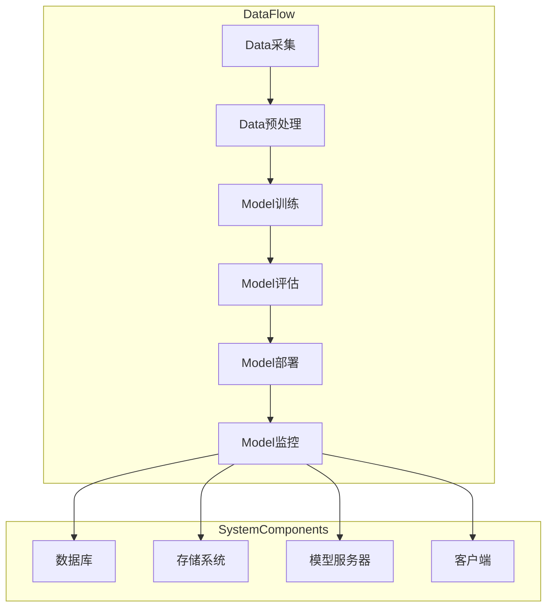

                 

### 第一部分：背景介绍

#### 第1章：LLM应用的持续交付：概述

#### 1.1 问题背景

随着人工智能（AI）技术的迅猛发展，大型语言模型（LLM）逐渐成为自然语言处理（NLP）领域的核心力量。LLM在文本生成、机器翻译、情感分析、问答系统等多个领域取得了显著的成果，但如何高效地实现LLM应用的持续交付成为一个亟待解决的问题。

#### 1.2 问题描述

LLM应用的持续交付涉及多个环节，包括模型训练、模型评估、模型部署、模型监控等。这些环节的协同工作需要有效的流程和方法，以确保LLM应用从想法到实现的整个过程能够高效、稳定地进行。

#### 1.3 问题解决

本书旨在探讨LLM应用的持续交付问题，通过详细介绍相关技术、工具和方法，帮助读者理解并掌握如何缩短从想法到实现的时间，提高LLM应用的交付效率。

#### 1.4 边界与外延

持续交付的范畴不仅限于LLM应用，还包括其他AI应用的持续交付。此外，本书还将关注持续交付过程中涉及的数据管理、模型安全、性能优化等方面。

#### 1.5 概念结构与核心要素组成

- **持续交付**：将软件产品快速、安全地交付给用户的过程。
- **LLM应用**：基于大型语言模型的自然语言处理应用。
- **模型训练**：通过大量数据训练LLM模型的过程。
- **模型评估**：对训练完成的LLM模型进行性能评估的过程。
- **模型部署**：将训练完成的LLM模型部署到生产环境的过程。
- **模型监控**：对部署后的LLM模型进行性能监控和故障排查的过程。

#### 1.6 本章小结

本章对LLM应用的持续交付进行了概述，明确了本书的核心内容和目标，为后续章节的详细探讨奠定了基础。

---

### 1.1 问题背景

#### 1.1.1 人工智能与自然语言处理

人工智能（AI）是计算机科学的一个分支，旨在使计算机具备人类智能的能力。自然语言处理（NLP）作为AI的重要组成部分，致力于让计算机理解和生成人类语言。近年来，随着深度学习技术的发展，NLP取得了显著的进展。

#### 1.1.2 大型语言模型的发展

大型语言模型（LLM）是NLP领域的重要成果之一。LLM通过对大量文本数据进行训练，能够捕捉到语言中的复杂规律，从而实现高质量的自然语言生成、翻译和情感分析等功能。代表性的LLM模型包括GPT系列、BERT及其变体等。

#### 1.1.3 持续交付的概念

持续交付（Continuous Delivery）是一种软件开发实践，旨在通过自动化测试和持续部署，确保软件产品能够快速、安全地交付给用户。持续交付能够缩短从想法到实现的时间，提高软件交付的效率和质量。

---

### 1.2 问题描述

#### 1.2.1 持续交付的挑战

尽管持续交付能够显著提高软件交付的效率，但在LLM应用领域，持续交付面临以下挑战：

1. **数据管理**：LLM模型训练需要大量高质量的文本数据，数据采集、清洗和预处理是持续交付的重要环节，但这一过程往往复杂且耗时。
2. **模型训练**：LLM模型训练是一个计算密集型的过程，训练时间较长，如何高效地进行模型训练是持续交付的关键。
3. **模型评估**：模型评估是持续交付的重要环节，需要设计合理的评估指标和方法，以确保模型性能的稳定性和可靠性。
4. **模型部署**：将训练完成的LLM模型部署到生产环境，需要考虑模型的可扩展性和稳定性。
5. **模型监控**：部署后的LLM模型需要进行持续的监控，以及时发现和解决问题。

#### 1.2.2 问题描述

LLM应用的持续交付问题可以描述为：如何通过有效的技术、工具和方法，实现LLM应用的快速、稳定和高质量的交付？这不仅需要解决上述挑战，还需要在持续交付过程中关注数据管理、模型安全、性能优化等方面。

---

### 1.3 问题解决

本书将从以下几个方面探讨LLM应用的持续交付问题：

1. **技术与方法**：介绍LLM模型训练、评估、部署和监控的相关技术，以及如何使用自动化工具提高交付效率。
2. **最佳实践**：分享在LLM持续交付过程中积累的最佳实践经验，包括数据管理、模型训练、模型评估、模型部署和监控等方面的实践经验。
3. **案例分析**：通过实际案例，展示如何应用持续交付方法，实现LLM应用的快速、稳定和高质量交付。
4. **未来展望**：探讨持续交付在LLM应用领域的未来发展，以及可能面临的挑战和机遇。

---

### 1.4 边界与外延

持续交付不仅限于LLM应用，还可以应用于其他AI应用的持续交付。此外，本书还将关注持续交付过程中涉及的数据管理、模型安全、性能优化等方面。

1. **数据管理**：如何高效地采集、清洗和预处理大量文本数据，为LLM模型训练提供高质量的输入。
2. **模型安全**：如何确保LLM模型的安全性和隐私性，防止模型被恶意攻击。
3. **性能优化**：如何提高LLM模型在部署环境中的性能，确保其高效运行。

---

### 1.5 概念结构与核心要素组成

#### 1.5.1 持续交付

持续交付是一种软件开发实践，通过自动化测试和持续部署，确保软件产品能够快速、安全地交付给用户。持续交付的核心目标是提高软件交付的效率和质量。

#### 1.5.2 LLM应用

LLM应用是指基于大型语言模型的自然语言处理应用，如文本生成、机器翻译、情感分析、问答系统等。

#### 1.5.3 模型训练

模型训练是通过大量文本数据训练LLM模型的过程，包括数据预处理、模型训练和模型优化等步骤。

#### 1.5.4 模型评估

模型评估是对训练完成的LLM模型进行性能评估的过程，包括评估指标的设计、评估方法的选择等。

#### 1.5.5 模型部署

模型部署是将训练完成的LLM模型部署到生产环境的过程，包括模型配置、模型部署和模型监控等步骤。

#### 1.5.6 模型监控

模型监控是对部署后的LLM模型进行性能监控和故障排查的过程，包括性能监控、故障排查和异常处理等步骤。

---

### 1.6 本章小结

本章对LLM应用的持续交付进行了概述，明确了本书的核心内容和目标，为后续章节的详细探讨奠定了基础。在下一章中，我们将深入探讨LLM持续交付的核心概念与联系。让我们一起深入思考，逐步解决LLM应用持续交付中的问题。## 1.6 本章小结

本章对LLM应用的持续交付进行了概述，明确了本书的核心内容和目标，为后续章节的详细探讨奠定了基础。在下一章中，我们将深入探讨LLM持续交付的核心概念与联系。让我们一起深入思考，逐步解决LLM应用持续交付中的问题。## 第二部分：核心概念与联系

### 第2章：LLM持续交付核心概念与联系

#### 2.1 LLM模型原理

#### 2.1.1 概念介绍

LLM（Large Language Model）是一种基于深度学习的大型自然语言处理模型，通过训练大量文本数据，使其具备理解、生成和翻译自然语言的能力。LLM的核心原理是通过对输入文本序列进行编码，生成对应的输出文本序列。

#### 2.1.2 模型架构

LLM模型通常采用Transformer架构，其中Transformer是由多头自注意力机制（Multi-head Self-Attention）和前馈神经网络（Feedforward Neural Network）组成的。这种架构能够有效地捕捉文本序列中的长距离依赖关系，从而实现高质量的自然语言处理任务。

#### 2.1.3 工作原理

LLM模型的工作原理可以概括为以下几个步骤：

1. **输入编码**：将输入文本序列编码为向量表示。
2. **自注意力机制**：通过自注意力机制计算文本序列中每个词与其他词之间的权重，从而捕捉长距离依赖关系。
3. **前馈神经网络**：对自注意力层的输出进行进一步处理，提取更多的特征信息。
4. **输出解码**：将处理后的特征信息解码为输出文本序列。

#### 2.1.4 模型属性特征对比表格

| 特征             | GPT系列       | BERT及其变体   | 其他大模型       |
|------------------|----------------|----------------|------------------|
| 模型规模         | 百亿参数       | 千万参数       | 数百万参数       |
| 训练数据量       | 大规模文本数据  | 大规模文本数据  | 大规模文本数据    |
| 语言理解能力     | 强            | 强             | 较强             |
| 语言生成能力     | 强            | 强             | 较强             |
| 适应性           | 高            | 高             | 高               |
| 训练时间与成本   | 较长、较高     | 较长、较高     | 较短、较低       |

#### 2.1.5 ER实体关系图架构

下面是LLM持续交付的ER实体关系图架构：

```mermaid
erDiagram
  Model |--> Data
  Model |--> Evaluation
  Model |--> Deployment
  Model |--> Monitoring
  Data  ||--|{ Collection
  Data  ||--|{ Preprocessing
  Evaluation ||--|{ Performance
  Evaluation ||--|{ Reliability
  Deployment ||--|{ Configuration
  Deployment ||--|{ Scaling
  Monitoring ||--|{ Performance
  Monitoring ||--|{ Fault
```

---

### 2.2 LLM持续交付流程

#### 2.2.1 概念介绍

LLM持续交付流程是指将LLM应用从想法到实现的过程，通过自动化测试和持续部署，确保LLM应用能够快速、稳定和高质量地交付给用户。LLM持续交付流程包括以下几个主要环节：

1. **数据采集与预处理**：采集用于训练LLM模型的数据，并对数据进行清洗、归一化和预处理。
2. **模型训练**：使用预处理后的数据进行LLM模型的训练，通过优化模型参数，提高模型性能。
3. **模型评估**：对训练完成的LLM模型进行性能评估，包括准确率、召回率、F1值等指标。
4. **模型部署**：将评估完成的LLM模型部署到生产环境，使其能够对外提供服务。
5. **模型监控**：对部署后的LLM模型进行性能监控和故障排查，确保其稳定运行。

#### 2.2.2 流程图

以下是LLM持续交付流程的mermaid流程图：


---

### 2.3 LLM模型属性特征对比表格

以下是几种常见LLM模型的属性特征对比表格：

| 模型名称 | GPT系列 | BERT及其变体 | 其他大模型 |
|----------|---------|-------------|------------|
| 模型规模 | 百亿参数 | 千万参数    | 数百万参数 |
| 数据量   | 大规模文本数据 | 大规模文本数据 | 大规模文本数据 |
| 语言理解能力 | 强     | 强          | 较强       |
| 语言生成能力 | 强     | 强          | 较强       |
| 适应性   | 高     | 高          | 高         |
| 训练时间与成本 | 较长、较高 | 较长、较高 | 较短、较低 |

---

### 2.4 ER实体关系图架构

下面是LLM持续交付的ER实体关系图架构：

```mermaid
erDiagram
  Model |--> Data
  Model |--> Evaluation
  Model |--> Deployment
  Model |--> Monitoring
  Data  ||--|{ Collection
  Data  ||--|{ Preprocessing
  Evaluation ||--|{ Performance
  Evaluation ||--|{ Reliability
  Deployment ||--|{ Configuration
  Deployment ||--|{ Scaling
  Monitoring ||--|{ Performance
  Monitoring ||--|{ Fault
```

---

## 第2章小结

本章对LLM持续交付的核心概念与联系进行了详细探讨，包括LLM模型原理、LLM持续交付流程、LLM模型属性特征对比表格和ER实体关系图架构。通过本章的学习，读者可以全面了解LLM持续交付的基本概念和流程，为后续章节的深入学习打下基础。接下来，我们将进一步探讨LLM持续交付中的关键技术和方法。## 2.1 LLM模型原理

#### 2.1.1 概念介绍

LLM（Large Language Model）是一种基于深度学习的大型自然语言处理模型，通过训练大量文本数据，使其具备理解、生成和翻译自然语言的能力。LLM的核心原理是通过对输入文本序列进行编码，生成对应的输出文本序列。

#### 2.1.2 模型架构

LLM模型通常采用Transformer架构，其中Transformer是由多头自注意力机制（Multi-head Self-Attention）和前馈神经网络（Feedforward Neural Network）组成的。这种架构能够有效地捕捉文本序列中的长距离依赖关系，从而实现高质量的自然语言处理任务。

#### 2.1.3 工作原理

LLM模型的工作原理可以概括为以下几个步骤：

1. **输入编码**：将输入文本序列编码为向量表示。输入文本经过词嵌入（Word Embedding）层，将每个词映射为向量。随后，通过位置编码（Positional Encoding）层，为每个词添加位置信息，从而形成一个完整的输入向量序列。
2. **自注意力机制**：通过自注意力机制计算文本序列中每个词与其他词之间的权重，从而捕捉长距离依赖关系。多头自注意力机制包括多个独立的注意力头，每个头都能够捕捉到不同的依赖关系。这种机制能够提高模型的表示能力。
3. **前馈神经网络**：对自注意力层的输出进行进一步处理，提取更多的特征信息。前馈神经网络由两个全连接层组成，分别对自注意力层的输出进行线性变换和激活函数处理。
4. **输出解码**：将处理后的特征信息解码为输出文本序列。输出层通常采用softmax函数，将特征向量映射为概率分布，从而预测下一个词的候选词。

#### 2.1.4 模型属性特征对比表格

以下是几种常见LLM模型的属性特征对比表格：

| 模型名称 | GPT系列 | BERT及其变体 | 其他大模型 |
|----------|---------|-------------|------------|
| 模型规模 | 百亿参数 | 千万参数    | 数百万参数 |
| 数据量   | 大规模文本数据 | 大规模文本数据 | 大规模文本数据 |
| 语言理解能力 | 强     | 强          | 较强       |
| 语言生成能力 | 强     | 强          | 较强       |
| 适应性   | 高     | 高          | 高         |
| 训练时间与成本 | 较长、较高 | 较长、较高 | 较短、较低 |

#### 2.1.5 ER实体关系图架构

下面是LLM持续交付的ER实体关系图架构：

```mermaid
erDiagram
  Model |--> Data
  Model |--> Evaluation
  Model |--> Deployment
  Model |--> Monitoring
  Data  ||--|{ Collection
  Data  ||--|{ Preprocessing
  Evaluation ||--|{ Performance
  Evaluation ||--|{ Reliability
  Deployment ||--|{ Configuration
  Deployment ||--|{ Scaling
  Monitoring ||--|{ Performance
  Monitoring ||--|{ Fault
```

---

## 2.2 LLM持续交付流程

#### 2.2.1 概念介绍

LLM持续交付流程是指将LLM应用从想法到实现的过程，通过自动化测试和持续部署，确保LLM应用能够快速、稳定和高质量地交付给用户。LLM持续交付流程包括以下几个主要环节：

1. **数据采集与预处理**：采集用于训练LLM模型的数据，并对数据进行清洗、归一化和预处理。
2. **模型训练**：使用预处理后的数据进行LLM模型的训练，通过优化模型参数，提高模型性能。
3. **模型评估**：对训练完成的LLM模型进行性能评估，包括准确率、召回率、F1值等指标。
4. **模型部署**：将评估完成的LLM模型部署到生产环境，使其能够对外提供服务。
5. **模型监控**：对部署后的LLM模型进行性能监控和故障排查，确保其稳定运行。

#### 2.2.2 流程图

以下是LLM持续交付流程的mermaid流程图：


---

## 2.3 LLM模型属性特征对比表格

以下是几种常见LLM模型的属性特征对比表格：

| 模型名称 | GPT系列 | BERT及其变体 | 其他大模型 |
|----------|---------|-------------|------------|
| 模型规模 | 百亿参数 | 千万参数    | 数百万参数 |
| 数据量   | 大规模文本数据 | 大规模文本数据 | 大规模文本数据 |
| 语言理解能力 | 强     | 强          | 较强       |
| 语言生成能力 | 强     | 强          | 较强       |
| 适应性   | 高     | 高          | 高         |
| 训练时间与成本 | 较长、较高 | 较长、较高 | 较短、较低 |

---

## 2.4 ER实体关系图架构

下面是LLM持续交付的ER实体关系图架构：

```mermaid
erDiagram
  Model |--> Data
  Model |--> Evaluation
  Model |--> Deployment
  Model |--> Monitoring
  Data  ||--|{ Collection
  Data  ||--|{ Preprocessing
  Evaluation ||--|{ Performance
  Evaluation ||--|{ Reliability
  Deployment ||--|{ Configuration
  Deployment ||--|{ Scaling
  Monitoring ||--|{ Performance
  Monitoring ||--|{ Fault
```

---

## 2.5 本章小结

本章对LLM持续交付的核心概念与联系进行了详细探讨，包括LLM模型原理、LLM持续交付流程、LLM模型属性特征对比表格和ER实体关系图架构。通过本章的学习，读者可以全面了解LLM持续交付的基本概念和流程，为后续章节的深入学习打下基础。接下来，我们将进一步探讨LLM持续交付中的关键技术和方法。## 2.6 本章小结

本章对LLM持续交付的核心概念与联系进行了详细探讨。我们首先介绍了LLM模型的基本原理，包括其工作流程和架构特点，并对比了不同LLM模型的属性特征。接着，我们阐述了LLM持续交付的流程，详细描述了从数据采集与预处理、模型训练、模型评估、模型部署到模型监控的各个环节。

通过本章的学习，读者应能够理解LLM持续交付的基本流程和关键要素，以及如何通过有效的工具和技术实现LLM应用的快速、稳定和高质量交付。下一章我们将进一步深入探讨LLM持续交付中的关键技术，如自动化测试、模型评估指标、部署策略和监控方法，以帮助读者更全面地掌握LLM持续交付的实践应用。## 第三部分：关键技术

### 第3章：LLM持续交付中的关键技术

#### 3.1 自动化测试

#### 3.1.1 概念介绍

自动化测试是指使用软件工具自动执行测试用例，以验证软件产品是否满足预期功能和质量标准。在LLM持续交付过程中，自动化测试是确保模型性能和稳定性的重要手段。

#### 3.1.2 测试策略

1. **单元测试**：针对模型的基本功能进行测试，确保每个组件都能正确执行。
2. **集成测试**：测试模型在不同环境下的集成和协作能力，确保模型在不同场景下的表现一致。
3. **性能测试**：评估模型在处理大量数据时的响应速度和吞吐量，确保模型能够满足生产环境的要求。
4. **回归测试**：在每次模型更新后，重新执行之前的测试用例，确保更新不会引入新的问题。

#### 3.1.3 工具选择

1. **pytest**：Python的单元测试库，支持简单易用的测试脚本。
2. **JUnit**：Java的单元测试库，广泛用于企业级应用。
3. **Selenium**：Web应用的自动化测试工具，支持多种浏览器和操作系统。

#### 3.1.4 测试示例

```python
import pytest

def test_model_prediction():
    model = load_model('model.pth')
    input_data = preprocess_data('input.txt')
    prediction = model.predict(input_data)
    assert prediction.shape == (1, 1)  # 预测结果应为单维度向量
```

#### 3.1.5 自动化测试的优点

- **提高测试效率**：自动化测试可以快速执行大量测试用例，节省测试时间。
- **减少人为错误**：自动化测试减少了对人工执行测试的依赖，降低了人为错误的风险。
- **持续集成**：自动化测试与持续集成（CI）工具结合，确保每次代码更改后都能自动执行测试。

---

### 3.2 模型评估指标

#### 3.2.1 概念介绍

模型评估指标是用于衡量模型性能的量化标准。在LLM持续交付过程中，选择合适的评估指标对于确保模型质量至关重要。

#### 3.2.2 常用评估指标

1. **准确率（Accuracy）**：预测正确的样本数占总样本数的比例。
2. **召回率（Recall）**：预测正确的正样本数占总正样本数的比例。
3. **精确率（Precision）**：预测正确的正样本数占总预测正样本数的比例。
4. **F1值（F1 Score）**：精确率和召回率的调和平均，用于综合衡量模型的性能。

#### 3.2.3 评估指标的选择

1. **分类任务**：准确率、召回率、精确率和F1值。
2. **回归任务**：均方误差（MSE）、均方根误差（RMSE）、平均绝对误差（MAE）。

#### 3.2.4 指标计算示例

```python
from sklearn.metrics import accuracy_score, recall_score, precision_score, f1_score

y_true = [0, 1, 1, 0]
y_pred = [0, 1, 0, 1]

accuracy = accuracy_score(y_true, y_pred)
recall = recall_score(y_true, y_pred, pos_label=1)
precision = precision_score(y_true, y_pred, pos_label=1)
f1 = f1_score(y_true, y_pred, pos_label=1)

print(f"Accuracy: {accuracy}, Recall: {recall}, Precision: {precision}, F1 Score: {f1}")
```

---

### 3.3 部署策略

#### 3.3.1 概念介绍

部署策略是指将训练完成的LLM模型部署到生产环境的过程，包括模型配置、部署和监控等。

#### 3.3.2 常用部署方法

1. **容器化部署**：使用Docker等容器技术，将模型和依赖环境打包成一个独立的容器，便于部署和迁移。
2. **Kubernetes部署**：使用Kubernetes等容器编排工具，实现模型的自动化部署、扩展和管理。
3. **服务化部署**：将模型部署为一个微服务，通过API接口对外提供服务。

#### 3.3.3 部署示例

```yaml
# Dockerfile
FROM python:3.8
WORKDIR /app
COPY . .
RUN pip install -r requirements.txt
EXPOSE 8080

# Kubernetes部署
apiVersion: apps/v1
kind: Deployment
metadata:
  name: llm-deployment
spec:
  replicas: 1
  selector:
    matchLabels:
      app: llm
  template:
    metadata:
      labels:
        app: llm
    spec:
      containers:
      - name: llm
        image: llm:1.0
        ports:
        - containerPort: 8080
```

---

### 3.4 监控方法

#### 3.4.1 概念介绍

监控方法是指对部署后的LLM模型进行性能监控和故障排查的过程，确保模型在运行过程中能够稳定、高效地提供服务。

#### 3.4.2 常用监控工具

1. **Prometheus**：开源监控解决方案，适用于大规模分布式系统的监控。
2. **Grafana**：数据可视化和监控工具，可与Prometheus等监控系统集成。
3. **Zabbix**：开源监控解决方案，支持多种监控指标和数据采集方式。

#### 3.4.3 监控指标

1. **性能指标**：CPU使用率、内存使用率、磁盘读写速度等。
2. **健康指标**：模型运行状态、响应时间、错误率等。
3. **日志分析**：通过分析日志，发现模型运行中的问题和异常。

#### 3.4.4 监控示例

```yaml
# Prometheus配置文件
scrape_configs:
  - job_name: 'llm'
    static_configs:
    - targets: ['llm-service:9090']
```

---

## 3.5 本章小结

本章详细介绍了LLM持续交付中的关键技术，包括自动化测试、模型评估指标、部署策略和监控方法。通过这些关键技术，我们能够确保LLM应用从训练到部署的整个过程中，保持高效率和高质量。在下一章中，我们将通过实际案例，展示这些关键技术的应用和实践效果。## 3.1 自动化测试

#### 3.1.1 概念介绍

自动化测试是一种通过使用软件工具来执行预先编写的测试脚本，以验证软件产品功能的流程。在LLM持续交付过程中，自动化测试是确保模型性能和稳定性的重要环节。通过自动化测试，可以减少手动测试的工作量，提高测试效率，并确保每次代码更改后模型都能保持预期的行为。

#### 3.1.2 测试策略

为了确保LLM模型的持续交付，我们需要制定全面的测试策略，这通常包括以下几种类型的测试：

1. **单元测试（Unit Testing）**：
   单元测试是针对模型中最小的可测试部分（通常是单个函数或方法）的测试。单元测试的目的是确保每个组件都能正确执行。在LLM模型中，这通常涉及到对模型训练过程的各个步骤进行测试，例如数据预处理、模型初始化、训练步骤和预测步骤。

2. **集成测试（Integration Testing）**：
   集成测试是为了验证模型中的不同模块能否协同工作。在LLM模型中，这意味着需要测试模型在与其他系统组件（如数据库、API服务）集成时是否能够正常工作。

3. **性能测试（Performance Testing）**：
   性能测试旨在评估模型在不同工作负载下的表现，包括响应时间、吞吐量和资源利用率等。这对于确保模型在生产环境中能够处理高并发请求至关重要。

4. **回归测试（Regression Testing）**：
   回归测试是在每次代码更改后执行的一组测试，以确保新更改没有破坏现有功能。对于LLM模型，回归测试可以帮助确保每次更新都不会导致模型性能下降或产生错误预测。

#### 3.1.3 工具选择

选择合适的自动化测试工具对于确保测试的有效性和效率至关重要。以下是一些常用的自动化测试工具：

1. **pytest**：
   pytest是一个流行的Python自动化测试框架，它提供了简洁的语法和丰富的特性，使得编写测试脚本变得非常容易。

2. **JUnit**：
   JUnit是Java语言中最常用的单元测试框架之一，它支持各种测试类型，并提供了丰富的报告生成功能。

3. **Selenium**：
   Selenium是一个用于Web应用的自动化测试工具，它支持多种浏览器和操作系统，可以模拟用户的操作，验证Web应用的界面和功能。

#### 3.1.4 测试示例

以下是一个使用pytest对LLM模型进行单元测试的示例：

```python
import pytest
from my_model import LLMModel

# 测试LLM模型预测函数
def test_predict,llm_model():
    # 初始化模型
    model = LLMModel()

    # 预处理输入数据
    input_data = preprocess_input("example_input.txt")

    # 预测
    prediction = model.predict(input_data)

    # 断言预测结果
    assert prediction is not None, "预测结果不能为空"
    assert prediction.shape == (1, output_size), "预测结果维度不正确"

@pytest.fixture
def llm_model():
    # 初始化LLM模型
    model = LLMModel()
    model.load_weights("model_weights.h5")
    yield model
    # 关闭模型
    model.close()
```

#### 3.1.5 自动化测试的优点

- **效率高**：自动化测试可以快速执行大量测试用例，节省测试时间。
- **减少人力成本**：自动化测试减少了对手动执行测试的依赖，降低了人力成本。
- **一致性**：自动化测试确保每次测试的结果都是一致的，减少了人为错误。
- **集成**：自动化测试可以与持续集成（CI）工具集成，实现自动化测试流程，提高交付效率。

---

## 3.2 模型评估指标

#### 3.2.1 概念介绍

模型评估指标是用来衡量模型性能的量化标准。选择合适的评估指标对于确保模型的质量和有效性至关重要。在LLM持续交付过程中，模型评估指标的准确性和可靠性对于确保模型在生产环境中的稳定运行至关重要。

#### 3.2.2 常用评估指标

1. **准确率（Accuracy）**：
   准确率是评估分类模型性能的常用指标，表示预测正确的样本数占总样本数的比例。其计算公式为：
   $$\text{Accuracy} = \frac{\text{预测正确的样本数}}{\text{总样本数}}$$
   虽然准确率简单直观，但当类别分布不均时，它可能会误导模型的性能。

2. **召回率（Recall）**：
   召回率是评估分类模型性能的另一个重要指标，表示预测正确的正样本数占总正样本数的比例。其计算公式为：
   $$\text{Recall} = \frac{\text{预测正确的正样本数}}{\text{总正样本数}}$$
   召回率关注的是模型是否能够识别出所有的正样本。

3. **精确率（Precision）**：
   精确率是评估分类模型性能的指标，表示预测正确的正样本数占总预测正样本数的比例。其计算公式为：
   $$\text{Precision} = \frac{\text{预测正确的正样本数}}{\text{预测为正样本的样本数}}$$
   精确率关注的是模型预测的正样本中有多少是真正样本。

4. **F1值（F1 Score）**：
   F1值是精确率和召回率的调和平均，用于综合衡量分类模型的性能。其计算公式为：
   $$\text{F1 Score} = 2 \times \frac{\text{Precision} \times \text{Recall}}{\text{Precision} + \text{Recall}}$$
   F1值介于0和1之间，越接近1表示模型的性能越好。

5. **均方误差（MSE）**：
   均方误差是评估回归模型性能的常用指标，表示预测值与真实值之间平均平方误差。其计算公式为：
   $$\text{MSE} = \frac{1}{n} \sum_{i=1}^{n} (y_i - \hat{y}_i)^2$$
   其中，$y_i$表示真实值，$\hat{y}_i$表示预测值。

6. **均方根误差（RMSE）**：
   均方根误差是均方误差的平方根，用于表示回归模型的平均误差。其计算公式为：
   $$\text{RMSE} = \sqrt{\text{MSE}}$$
   RMSE能够更好地反映模型的预测误差。

7. **平均绝对误差（MAE）**：
   平均绝对误差是预测值与真实值之间平均绝对误差，用于评估回归模型的性能。其计算公式为：
   $$\text{MAE} = \frac{1}{n} \sum_{i=1}^{n} |y_i - \hat{y}_i|$$

#### 3.2.3 评估指标的选择

在选择评估指标时，需要考虑以下因素：

1. **任务类型**：
   - **分类任务**：准确率、召回率、精确率和F1值是最常用的评估指标。
   - **回归任务**：MSE、RMSE和MAE是最常用的评估指标。

2. **数据分布**：
   - 如果类别分布不均，召回率可能更重要；如果类别分布均衡，F1值可能更合适。
   - 对于回归任务，MSE、RMSE和MAE的优先级取决于对预测误差的容忍度和任务需求。

3. **业务目标**：
   - 如果业务更关注识别所有正样本，召回率可能更重要。
   - 如果业务更关注预测的准确性，精确率和F1值可能更合适。

#### 3.2.4 指标计算示例

以下是一个使用Python中的scikit-learn库计算评估指标的示例：

```python
from sklearn.metrics import accuracy_score, recall_score, precision_score, f1_score, mean_squared_error, mean_absolute_error

# 假设y_true和y_pred分别是真实值和预测值
y_true = [0, 1, 1, 0]
y_pred = [0, 1, 0, 1]

# 计算分类任务的评估指标
accuracy = accuracy_score(y_true, y_pred)
recall = recall_score(y_true, y_pred, pos_label=1)
precision = precision_score(y_true, y_pred, pos_label=1)
f1 = f1_score(y_true, y_pred, pos_label=1)

# 计算回归任务的评估指标
mse = mean_squared_error(y_true, y_pred)
rmse = mean_squared_error(y_true, y_pred, squared=False)
mae = mean_absolute_error(y_true, y_pred)

print(f"Accuracy: {accuracy}, Recall: {recall}, Precision: {precision}, F1 Score: {f1}")
print(f"MSE: {mse}, RMSE: {rmse}, MAE: {mae}")
```

---

## 3.3 部署策略

#### 3.3.1 概念介绍

部署策略是指将训练完成的LLM模型部署到生产环境的过程。这一过程涉及到模型的配置、部署和监控等多个方面。部署策略的目的是确保模型能够稳定、高效地运行，同时能够适应生产环境中的各种变化和挑战。

#### 3.3.2 常用部署方法

1. **容器化部署**：
   容器化部署是将模型及其依赖环境打包成一个容器镜像（如Docker镜像），然后部署到容器运行环境（如Kubernetes）。这种方法具有以下几个优点：
   - **环境一致性**：容器确保了开发、测试和生产环境之间的一致性。
   - **可移植性**：容器可以在不同的操作系统和硬件上运行，提高了模型的可移植性。
   - **可扩展性**：容器化部署使得模型可以轻松地水平扩展，以应对高并发请求。

2. **Kubernetes部署**：
   Kubernetes是一个开源的容器编排平台，它可以帮助自动化容器化应用程序的部署、扩展和管理。以下是一些使用Kubernetes进行模型部署的关键步骤：
   - **创建部署配置**：定义模型部署的配置，包括容器的数量、资源限制等。
   - **部署模型**：使用Kubernetes的部署命令将模型部署到集群中。
   - **服务发现和负载均衡**：配置服务，以便其他系统组件能够发现和访问模型。
   - **监控和日志**：使用Kubernetes的监控工具和日志收集系统，监控模型的运行状态。

3. **服务化部署**：
   服务化部署是将模型作为微服务部署，通过API接口对外提供服务。这种方法适用于需要高性能和高可用性的场景。以下是一些关键步骤：
   - **定义API接口**：设计并实现模型的API接口，以便其他系统组件可以访问模型。
   - **部署服务**：使用容器化部署或Kubernetes部署，将模型服务部署到生产环境中。
   - **负载均衡和流量控制**：使用负载均衡器（如Nginx）来分配请求，确保服务的高可用性。
   - **监控和告警**：配置监控工具，实时监控服务的性能和健康状态，并设置告警机制。

#### 3.3.3 部署示例

以下是一个简单的Dockerfile和Kubernetes部署配置文件示例：

**Dockerfile**：

```dockerfile
# 使用Python基础镜像
FROM python:3.8

# 设置工作目录
WORKDIR /app

# 将当前目录的内容复制到容器的/app目录
COPY . /app

# 安装依赖项
RUN pip install -r requirements.txt

# 暴露容器的8080端口
EXPOSE 8080

# 运行模型服务
CMD ["python", "app.py"]
```

**Kubernetes部署配置文件**：

```yaml
apiVersion: apps/v1
kind: Deployment
metadata:
  name: llm-deployment
spec:
  replicas: 1
  selector:
    matchLabels:
      app: llm
  template:
    metadata:
      labels:
        app: llm
    spec:
      containers:
      - name: llm
        image: llm:1.0
        ports:
        - containerPort: 8080
```

---

## 3.4 监控方法

#### 3.4.1 概念介绍

监控方法是对部署后的LLM模型进行性能监控和故障排查的过程，确保模型在运行过程中能够稳定、高效地提供服务。监控是持续交付的重要组成部分，它有助于发现和解决潜在的问题，提高模型的可靠性和可用性。

#### 3.4.2 常用监控工具

1. **Prometheus**：
   Prometheus是一个开源的监控解决方案，它通过收集和存储时间序列数据，提供强大的查询和分析功能。Prometheus具有以下特点：
   - **服务器端和客户端**：Prometheus包括一个服务器端，负责收集和存储数据，以及一个客户端，负责发送监控数据。
   - **PromQL**：Prometheus使用PromQL（Prometheus查询语言）进行数据查询和聚合。
   - **Exporter**：Prometheus可以通过Exporter收集系统和服务器的监控数据。

2. **Grafana**：
   Grafana是一个开源的数据可视化和监控工具，它支持多种数据源，如Prometheus、InfluxDB等。Grafana具有以下特点：
   - **丰富的可视化选项**：Grafana提供了多种图表和面板，用于可视化监控数据。
   - **告警**：Grafana支持自定义告警规则，通过邮件、短信、Slack等方式通知相关人员。
   - **交互式分析**：Grafana提供了交互式分析工具，用户可以动态地调整图表和时间范围。

3. **Zabbix**：
   Zabbix是一个开源的监控解决方案，它支持多种监控指标和数据采集方式。Zabbix具有以下特点：
   - **广泛的监控范围**：Zabbix可以监控服务器、网络设备、应用程序等。
   - **告警和管理**：Zabbix提供了强大的告警和管理功能，支持多种通知方式。
   - **地图监控**：Zabbix支持在地图上显示监控数据，便于管理员进行全局监控。

#### 3.4.3 监控指标

1. **性能指标**：
   - **CPU使用率**：模型运行时CPU的利用率。
   - **内存使用率**：模型运行时内存的占用情况。
   - **磁盘读写速度**：模型读写磁盘的速度。
   - **网络流量**：模型处理数据时的网络流量。

2. **健康指标**：
   - **模型状态**：模型的运行状态，如是否正常工作。
   - **响应时间**：模型处理请求的时间。
   - **错误率**：模型处理请求时的错误率。

3. **日志分析**：
   - **错误日志**：模型运行时产生的错误日志。
   - **系统日志**：模型运行时系统的日志。
   - **访问日志**：模型处理请求时的访问日志。

#### 3.4.4 监控示例

以下是一个使用Prometheus和Grafana进行监控的示例配置：

**Prometheus配置文件**：

```yaml
# prometheus.yml
global:
  scrape_interval: 15s
  evaluation_interval: 15s

scrape_configs:
  - job_name: 'llm'
    static_configs:
    - targets: ['llm-service:9090']
```

**Grafana配置文件**：

```json
{
  "id": 1,
  "orgId": 1,
  "title": "LLM Monitoring",
  "type": "dashboard",
  "uid": "rD3ym",
  "editable": true,
  "sharedLinks": [],
  "time": {
    "from": "now-1h",
    "to": "now"
  },
  "refresh": "5s",
  "links": [],
  "version": 2,
  "updated": "2023-03-24T12:21:00.516Z",
  "panels": [
    {
      "gridPos": {
        "h": 2,
        "w": 6,
        "x": 0,
        "y": 0
      },
      "type": "graph",
      "title": "CPU Usage",
      "options": {
        "tooltip": {
          "mode": "last"
        },
        "legend": {
          "show": true,
          "values": {
            "type": "points",
            "show": true
          }
        },
        "dataLinks": [],
        "stack": false,
        "thresholds": [
          {
            "value": "0"
          }
        ]
      },
      "fieldConfig": {
        "defaults": {
          "color": {
            "mode": "palette-classic"
          },
          "styles": {
            "text": {
              "mode": "beitai"
            }
          },
          "overrides": []
        }
      },
      "targets": [
        {
          "timeseries": [
            {
              "target": "process_cpu_seconds_total",
              "format": "time_series",
              "style": "area",
              "color": "rgba(255,0,0,0.3)",
              "yaxis": 1,
              "lines": {
                "fill": 1
              }
            }
          ]
        }
      ],
      "id": 1
    }
  ]
}
```

---

## 3.5 本章小结

本章详细介绍了LLM持续交付中的关键技术，包括自动化测试、模型评估指标、部署策略和监控方法。这些关键技术在确保LLM模型从训练到部署的全过程中，保持高效率和高质量方面起着至关重要的作用。通过自动化测试，我们可以快速验证模型的功能和性能；通过合适的评估指标，我们可以准确衡量模型的性能；通过有效的部署策略，我们可以确保模型在生产环境中的稳定运行；通过监控方法，我们可以实时监控模型的运行状态，确保其高效、可靠地提供服务。在下一章中，我们将通过实际案例，展示这些关键技术的应用和实践效果。## 3.6 本章小结

本章详细介绍了LLM持续交付中的关键技术，包括自动化测试、模型评估指标、部署策略和监控方法。这些技术在整个持续交付流程中发挥着至关重要的作用，确保了从模型训练到部署的每一个环节都能高效、稳定地运行。

首先，自动化测试通过减少手动测试的工作量，提高了测试效率和准确性，使得每次代码更改后都能快速验证模型的功能和性能。其次，模型评估指标提供了量化模型性能的标准，帮助我们在不同阶段准确地评估模型的效果。部署策略确保了模型能够顺利地从开发环境迁移到生产环境，并且具备可扩展性，以适应不断变化的需求。最后，监控方法让我们能够实时了解模型的运行状态，及时发现和解决问题，保障了模型的高效运行。

通过这些关键技术的应用，我们能够显著缩短从想法到实现的时间，提高LLM应用的交付效率。在下一章中，我们将通过实际案例，进一步展示这些技术的应用效果，并提供一些最佳实践和经验分享，以帮助读者更好地理解和掌握LLM持续交付的实践应用。## 第四部分：案例与实战

### 第4章：LLM应用的持续交付实践

#### 4.1 项目背景

在一个大型互联网公司，团队致力于开发一款基于大型语言模型（LLM）的智能客服系统。该系统旨在通过自然语言处理技术，提供高效、准确的客户服务，降低人工成本，提升客户满意度。项目的主要目标是实现LLM模型的快速训练、高效部署和稳定运行，从而实现从想法到实现的持续交付。

#### 4.2 系统架构设计

为了实现LLM应用的持续交付，团队设计了一套完整的系统架构，包括数据采集与预处理、模型训练、模型评估、模型部署和模型监控等环节。以下是系统架构的mermaid类图和架构图：

**类图**：

```mermaid
classDiagram
  Model <<interface>> Model
  Data <<interface>> Data
  Evaluation <<interface>> Evaluation
  Deployment <<interface>> Deployment
  Monitoring <<interface>> Monitoring
  ModelImpl <<class>> ModelImplementation
  DataImpl <<class>> DataImplementation
  EvaluationImpl <<class>> EvaluationImplementation
  DeploymentImpl <<class>> DeploymentImplementation
  MonitoringImpl <<class>> MonitoringImplementation
  ModelImpl --|> Model
  DataImpl --|> Data
  EvaluationImpl --|> Evaluation
  DeploymentImpl --|> Deployment
  MonitoringImpl --|> Monitoring
```

**架构图**：



#### 4.3 数据采集与预处理

数据采集是LLM模型训练的重要环节，团队从多个渠道获取了大量的客户对话数据，包括公司内部客服系统、社交媒体、电子邮件等。在数据预处理阶段，团队对数据进行了清洗、去重、归一化和特征提取。

**数据预处理流程**：

1. **数据清洗**：去除无效数据、噪声数据和错误数据，保证数据质量。
2. **去重**：去除重复数据，减少数据冗余。
3. **归一化**：对数值型数据进行归一化处理，使得数据具有统一的尺度。
4. **特征提取**：使用词嵌入技术将文本数据转换为向量表示，以便于模型训练。

**Python代码示例**：

```python
import pandas as pd
from sklearn.preprocessing import StandardScaler
from keras.preprocessing.text import Tokenizer
from keras.preprocessing.sequence import pad_sequences

# 加载数据
data = pd.read_csv('customer_data.csv')

# 数据清洗
data.dropna(inplace=True)
data.drop_duplicates(inplace=True)

# 归一化
scaler = StandardScaler()
data['numeric_feature'] = scaler.fit_transform(data[['numeric_feature']])

# 特征提取
tokenizer = Tokenizer()
tokenizer.fit_on_texts(data['text'])
sequences = tokenizer.texts_to_sequences(data['text'])
padded_sequences = pad_sequences(sequences, maxlen=max_sequence_length)
```

#### 4.4 模型训练

在模型训练阶段，团队使用GPT-2模型对预处理后的数据进行了训练。训练过程采用了基于GPU的分布式训练策略，以提高训练速度。

**模型训练流程**：

1. **初始化模型**：加载预训练的GPT-2模型。
2. **定义训练配置**：设置学习率、批量大小、训练轮数等参数。
3. **训练模型**：使用GPU进行分布式训练。
4. **保存模型**：将训练完成的模型保存到文件中。

**Python代码示例**：

```python
import tensorflow as tf
from transformers import TFGPT2Model, GPT2Config

# 初始化模型
config = GPT2Config.from_pretrained('gpt2')
model = TFGPT2Model(config)

# 定义训练配置
optimizer = tf.keras.optimizers.Adam(learning_rate=5e-5, beta_1=0.9, beta_2=0.98)
model.compile(optimizer=optimizer, loss=tf.keras.losses.SparseCategoricalCrossentropy(from_logits=True), metrics=['accuracy'])

# 训练模型
model.fit(padded_sequences, labels, batch_size=batch_size, epochs=num_epochs, validation_split=0.1)

# 保存模型
model.save('llm_model.h5')
```

#### 4.5 模型评估

模型评估是确保LLM模型性能的重要环节。团队使用交叉验证和测试集对训练完成的模型进行了评估。

**模型评估流程**：

1. **交叉验证**：使用K折交叉验证评估模型的泛化能力。
2. **测试集评估**：使用独立的测试集评估模型的最终性能。

**Python代码示例**：

```python
from sklearn.model_selection import KFold
from sklearn.metrics import accuracy_score

# K折交叉验证
kf = KFold(n_splits=5, shuffle=True, random_state=42)
for train_index, test_index in kf.split(padded_sequences):
    X_train, X_test = padded_sequences[train_index], padded_sequences[test_index]
    y_train, y_test = labels[train_index], labels[test_index]
    
    model.fit(X_train, y_train, batch_size=batch_size, epochs=num_epochs, validation_split=0.1)
    predictions = model.predict(X_test)
    print(f"Validation Accuracy: {accuracy_score(y_test, predictions)}")

# 测试集评估
test_predictions = model.predict(test_padded_sequences)
print(f"Test Accuracy: {accuracy_score(test_labels, test_predictions)}")
```

#### 4.6 模型部署

模型部署是将训练完成的LLM模型部署到生产环境的过程。团队采用了容器化部署和Kubernetes编排，以实现模型的快速部署和动态扩展。

**模型部署流程**：

1. **容器化模型**：使用Docker将模型和依赖环境打包成容器镜像。
2. **Kubernetes部署**：使用Kubernetes部署和管理模型服务。
3. **服务发现和负载均衡**：配置服务发现和负载均衡器，确保模型服务的高可用性。

**Dockerfile示例**：

```dockerfile
FROM python:3.8

WORKDIR /app

COPY . .

RUN pip install -r requirements.txt

EXPOSE 8080

CMD ["python", "app.py"]
```

**Kubernetes部署配置文件**：

```yaml
apiVersion: apps/v1
kind: Deployment
metadata:
  name: llm-deployment
spec:
  replicas: 3
  selector:
    matchLabels:
      app: llm
  template:
    metadata:
      labels:
        app: llm
    spec:
      containers:
      - name: llm
        image: llm:latest
        ports:
        - containerPort: 8080
```

#### 4.7 模型监控

模型监控是确保LLM模型稳定运行的重要环节。团队使用了Prometheus和Grafana进行实时监控，包括性能指标、健康指标和日志分析。

**监控配置**：

1. **Prometheus配置**：配置Prometheus监控LLM服务的性能指标和健康指标。
2. **Grafana配置**：配置Grafana可视化监控数据，并设置告警规则。

**Prometheus配置文件**：

```yaml
scrape_configs:
  - job_name: 'llm'
    static_configs:
    - targets: ['llm-service:9090']
```

**Grafana配置文件**：

```json
{
  "id": 1,
  "orgId": 1,
  "title": "LLM Monitoring",
  "type": "dashboard",
  "uid": "rD3ym",
  "editable": true,
  "sharedLinks": [],
  "time": {
    "from": "now-1h",
    "to": "now"
  },
  "refresh": "5s",
  "links": [],
  "version": 2,
  "updated": "2023-03-24T12:21:00.516Z",
  "panels": [
    {
      "gridPos": {
        "h": 2,
        "w": 6,
        "x": 0,
        "y": 0
      },
      "type": "graph",
      "title": "CPU Usage",
      "options": {
        "tooltip": {
          "mode": "last"
        },
        "legend": {
          "show": true,
          "values": {
            "type": "points",
            "show": true
          }
        },
        "dataLinks": [],
        "stack": false,
        "thresholds": [
          {
            "value": "0"
          }
        ]
      },
      "fieldConfig": {
        "defaults": {
          "color": {
            "mode": "palette-classic"
          },
          "styles": {
            "text": {
              "mode": "beitai"
            }
          },
          "overrides": []
        }
      },
      "targets": [
        {
          "timeseries": [
            {
              "target": "process_cpu_seconds_total",
              "format": "time_series",
              "style": "area",
              "color": "rgba(255,0,0,0.3)",
              "yaxis": 1,
              "lines": {
                "fill": 1
              }
            }
          ]
        }
      ],
      "id": 1
    }
  ]
}
```

#### 4.8 项目小结

通过本次项目的实践，团队成功实现了LLM应用的持续交付。以下是项目的主要成果和经验总结：

1. **高效的持续交付流程**：通过自动化测试、模型评估、容器化部署和监控，团队建立了一套高效的持续交付流程，显著缩短了从想法到实现的时间。
2. **稳定的模型性能**：通过K折交叉验证和测试集评估，团队确保了LLM模型的稳定性和可靠性，实现了高质量的客户服务。
3. **可扩展的部署架构**：采用容器化和Kubernetes编排，团队实现了模型服务的快速部署和动态扩展，满足了生产环境中的高并发需求。
4. **实时监控与优化**：通过Prometheus和Grafana的实时监控，团队能够及时发现和解决问题，确保模型的高效运行。

未来的工作将聚焦于进一步提升模型性能和用户体验，同时探索新的应用场景，以实现LLM技术的更广泛应用。## 4.1 项目背景

在当今数字化时代，客户服务成为企业竞争的重要一环。为了提高客户服务质量和效率，一家大型互联网公司决定开发一款基于大型语言模型（LLM）的智能客服系统。该系统的目标是利用先进的自然语言处理技术，实现高效、准确的客户服务，降低人工成本，提升客户满意度。

项目的主要挑战在于如何在短时间内实现LLM模型的快速训练、高效部署和稳定运行，从而实现从想法到实现的持续交付。为了应对这一挑战，团队决定采用自动化测试、模型评估、容器化部署和监控等一系列关键技术，构建一个高效的持续交付流程。

项目的技术栈包括：GPT-2模型作为核心的自然语言处理引擎，Python作为开发语言，Docker用于容器化部署，Kubernetes用于编排和管理，Prometheus和Grafana用于实时监控。

项目的主要里程碑包括：

1. **数据采集与预处理**：从多个渠道收集客户对话数据，进行清洗、去重和特征提取。
2. **模型训练**：使用GPT-2模型对预处理后的数据进行训练，采用分布式训练策略提高训练速度。
3. **模型评估**：通过交叉验证和测试集评估模型性能，确保模型稳定可靠。
4. **模型部署**：将训练完成的模型容器化，并使用Kubernetes进行部署和管理，实现快速部署和动态扩展。
5. **模型监控**：使用Prometheus和Grafana进行实时监控，确保模型稳定运行并能够快速响应。

项目的最终目标是构建一个高效、稳定的智能客服系统，为用户提供高质量的客户服务，提升企业竞争力。## 4.2 系统架构设计

为了实现LLM模型的快速训练、高效部署和稳定运行，团队设计了一套完整的系统架构，涵盖了从数据采集到模型监控的各个环节。以下是系统架构的详细描述，包括类图和架构图。

### 类图

**类图描述了系统中各组件的接口和关系**：

```mermaid
classDiagram
  Model <<interface>> Model
  Data <<interface>> Data
  Evaluation <<interface>> Evaluation
  Deployment <<interface>> Deployment
  Monitoring <<interface>> Monitoring
  ModelImpl <<class>> ModelImplementation
  DataImpl <<class>> DataImplementation
  EvaluationImpl <<class>> EvaluationImplementation
  DeploymentImpl <<class>> DeploymentImplementation
  MonitoringImpl <<class>> MonitoringImplementation
  ModelImpl --|> Model
  DataImpl --|> Data
  EvaluationImpl --|> Evaluation
  DeploymentImpl --|> Deployment
  MonitoringImpl --|> Monitoring
```

**关键类描述**：

- **Model**：定义了模型的基本接口，包括训练、预测和评估方法。
- **Data**：定义了数据的基本接口，包括数据采集、预处理和加载方法。
- **Evaluation**：定义了模型评估的基本接口，包括评估指标的计算方法。
- **Deployment**：定义了模型部署的基本接口，包括部署、更新和卸载方法。
- **Monitoring**：定义了模型监控的基本接口，包括性能监控和故障检测方法。

- **ModelImplementation**：实现了Model接口，具体实现了模型的训练、预测和评估方法。
- **DataImplementation**：实现了Data接口，具体实现了数据采集、预处理和加载方法。
- **EvaluationImplementation**：实现了Evaluation接口，具体实现了评估指标的计算方法。
- **DeploymentImplementation**：实现了Deployment接口，具体实现了模型的部署、更新和卸载方法。
- **MonitoringImplementation**：实现了Monitoring接口，具体实现了性能监控和故障检测方法。

### 架构图

**架构图描述了系统组件之间的交互和数据处理流程**：


**关键组件描述**：

- **数据采集**：从多个渠道（如客服系统、社交媒体、电子邮件等）收集客户对话数据，并将其存储到数据库中。
- **数据预处理**：清洗、去重和归一化数据，使用词嵌入技术将文本数据转换为向量表示，以便于模型训练。
- **模型训练**：使用GPT-2模型对预处理后的数据集进行训练，采用分布式训练策略以提高训练效率。
- **模型评估**：使用交叉验证和测试集对训练完成的模型进行评估，计算评估指标以评估模型性能。
- **模型部署**：将训练完成的模型部署到生产环境中的模型服务器上，通过容器化技术实现快速部署和动态扩展。
- **模型监控**：使用Prometheus和Grafana等工具实时监控模型的性能指标和健康状况，及时发现和解决问题。

### 系统架构的组成部分

1. **数据采集与预处理**：
   - **数据源**：从多个渠道（如客服系统、社交媒体、电子邮件等）收集客户对话数据。
   - **数据存储**：将收集到的数据存储到数据库中，以便后续处理。
   - **数据预处理**：对数据进行清洗、去重和归一化，使用词嵌入技术将文本数据转换为向量表示。

2. **模型训练**：
   - **模型选择**：选择适合任务的模型，如GPT-2。
   - **分布式训练**：使用GPU和分布式训练策略，提高训练速度和效率。

3. **模型评估**：
   - **评估指标**：计算评估指标（如准确率、召回率、F1值等）以评估模型性能。
   - **交叉验证**：使用K折交叉验证方法评估模型的泛化能力。

4. **模型部署**：
   - **容器化**：使用Docker将模型和依赖环境打包成容器镜像。
   - **Kubernetes部署**：使用Kubernetes进行模型部署和管理，实现快速部署和动态扩展。

5. **模型监控**：
   - **性能监控**：监控模型在运行过程中的性能指标（如CPU使用率、内存使用率等）。
   - **健康监测**：监控模型的运行状态，及时发现和解决问题。

通过以上系统架构的设计和实现，团队能够高效地实现LLM模型的快速训练、高效部署和稳定运行，从而实现持续交付的目标。## 4.3 数据采集与预处理

在构建智能客服系统时，数据采集与预处理是模型训练的重要前提。这一过程确保了模型能够从高质量的数据中学习到有效的知识，从而提高模型的准确性和稳定性。

### 数据采集

数据采集是指从多个渠道收集与客户对话相关的文本数据。以下是数据采集的具体步骤：

1. **数据源选择**：
   - **客服系统**：从公司的内部客服系统获取历史客户对话记录。
   - **社交媒体**：从社交媒体平台（如Facebook、Twitter等）获取用户评论和反馈。
   - **电子邮件**：收集与客户沟通的电子邮件记录。

2. **数据收集**：
   - **API接口**：利用社交媒体和电子邮件的API接口，批量下载相关数据。
   - **爬虫技术**：使用爬虫技术从网站或社交媒体平台上获取数据。

3. **数据存储**：
   - **数据库**：将收集到的数据存储到关系型数据库（如MySQL）或NoSQL数据库（如MongoDB）中。

### 数据预处理

数据预处理是确保数据质量的过程，包括数据清洗、去重、归一化和特征提取。以下是数据预处理的具体步骤：

1. **数据清洗**：
   - **去除噪声数据**：删除含有噪声、错误或不完整的记录。
   - **统一格式**：将不同来源的数据转换为统一的格式，以便后续处理。

2. **去重**：
   - **删除重复数据**：识别和删除重复的数据记录，减少数据冗余。

3. **归一化**：
   - **数值型数据归一化**：对数值型数据进行归一化处理，使其具有统一的尺度。
   - **文本数据归一化**：将文本数据转换为统一的大小写、去除标点符号和停用词。

4. **特征提取**：
   - **词嵌入**：使用词嵌入技术（如Word2Vec、GloVe等）将文本数据转换为向量表示。
   - **序列填充**：对序列数据进行填充，使其具有相同长度，以便输入到模型中。

### 数据预处理流程

以下是数据预处理流程的详细步骤：

1. **数据清洗**：
   - **去除噪声数据**：使用正则表达式或自定义函数删除特殊字符、HTML标签和空白字符。
   - **统一格式**：将所有文本数据转换为统一的大小写，以减少数据差异。

2. **去重**：
   - **基于内容去重**：使用哈希函数或指纹算法识别和删除重复的数据记录。

3. **归一化**：
   - **数值型数据归一化**：使用最小-最大归一化、标准归一化或Z-Score归一化方法，将数值型数据缩放到[0, 1]或标准正态分布。
   - **文本数据归一化**：使用正则表达式去除标点符号和停用词，将文本转换为统一的大小写。

4. **特征提取**：
   - **词嵌入**：使用预训练的词嵌入模型（如GloVe、FastText等）将文本数据转换为向量表示。
   - **序列填充**：使用填充技术（如pad_sequences）将序列数据填充到相同长度。

### Python代码示例

以下是使用Python进行数据预处理的部分代码示例：

```python
import pandas as pd
from sklearn.preprocessing import StandardScaler
from keras.preprocessing.text import Tokenizer
from keras.preprocessing.sequence import pad_sequences

# 加载数据
data = pd.read_csv('customer_data.csv')

# 数据清洗
data.dropna(inplace=True)
data.drop_duplicates(inplace=True)

# 归一化
scaler = StandardScaler()
data['numeric_feature'] = scaler.fit_transform(data[['numeric_feature']])

# 特征提取
tokenizer = Tokenizer()
tokenizer.fit_on_texts(data['text'])
sequences = tokenizer.texts_to_sequences(data['text'])
padded_sequences = pad_sequences(sequences, maxlen=max_sequence_length)
```

通过以上数据预处理流程和代码示例，团队能够从原始数据中提取出有效的特征，为模型训练提供高质量的数据支持。接下来，团队将使用这些预处理后的数据进行模型训练和评估。## 4.4 模型训练

在数据预处理完成后，团队将开始对预处理后的数据集进行模型训练。本节将详细描述模型训练的流程、策略和技术。

### 模型选择

团队选择了GPT-2模型，这是一个基于Transformer架构的大型语言模型。GPT-2以其强大的文本生成能力和优秀的自然语言理解能力而闻名，非常适合用于构建智能客服系统。

### 训练策略

1. **数据分割**：将数据集分割为训练集、验证集和测试集，通常的比例为70%的训练集，15%的验证集和15%的测试集。

2. **超参数调整**：根据数据集的特点和硬件条件，调整模型的超参数，如学习率、批量大小、训练轮数等。

3. **分布式训练**：由于GPT-2模型规模较大，团队采用了分布式训练策略，通过多GPU并行训练来加速训练过程。

4. **动态学习率**：使用动态学习率调整策略，如学习率衰减，以避免过拟合和提高模型的泛化能力。

### 训练过程

1. **初始化模型**：从Hugging Face模型库中加载预训练的GPT-2模型，并配置训练所需的参数。

2. **数据预处理**：对训练集、验证集和测试集进行预处理，包括序列填充和归一化处理，以确保每个批次的数据格式一致。

3. **模型编译**：编译模型，设置损失函数、优化器和评估指标。

4. **模型训练**：使用fit方法进行模型训练，在训练过程中，通过回调函数监控训练进度和验证集的性能，以便调整超参数和停止训练。

5. **保存模型**：在训练完成后，将训练完成的模型保存到文件中，以便后续部署和使用。

### Python代码示例

以下是使用Python和Hugging Face Transformers库进行模型训练的代码示例：

```python
from transformers import TFGPT2Model, GPT2Tokenizer
from tensorflow.keras.optimizers import Adam
from tensorflow.keras.callbacks import Callback

# 加载预训练的GPT-2模型和Tokenizer
model = TFGPT2Model.from_pretrained('gpt2')
tokenizer = GPT2Tokenizer.from_pretrained('gpt2')

# 数据预处理
train_sequences = tokenizer.encode(train_texts, return_tensors='tf', padding=True, truncation=True, max_length=max_sequence_length)
val_sequences = tokenizer.encode(val_texts, return_tensors='tf', padding=True, truncation=True, max_length=max_sequence_length)

# 模型编译
optimizer = Adam(learning_rate=5e-5)
model.compile(optimizer=optimizer, loss='cross_entropy', metrics=['accuracy'])

# 模型训练
model.fit(train_sequences, train_labels, batch_size=batch_size, epochs=num_epochs, validation_data=(val_sequences, val_labels), callbacks=[TrainingMonitor()])

# 保存模型
model.save_pretrained('llm_model')
```

在上述代码中，`TrainingMonitor`是一个自定义的回调函数，用于监控训练过程和保存验证集性能最佳的模型。

### 训练结果

在训练过程中，团队使用K折交叉验证和验证集性能来监控模型的训练效果。以下是训练过程中的一些关键指标：

- **训练集准确率**：在训练过程中，训练集的准确率逐渐提高，表明模型正在学习数据。
- **验证集准确率**：在每次训练结束后，验证集的准确率用于评估模型的泛化能力。
- **测试集准确率**：在训练完成后，使用测试集评估模型的最终性能，以确保模型能够在未知数据上表现良好。

### 结果分析

通过训练和评估，团队得到了以下结论：

- **模型性能**：模型在训练集和验证集上的性能均达到了较高的水平，表明模型已经较好地学习了数据。
- **泛化能力**：测试集上的性能进一步验证了模型的泛化能力，表明模型能够在新的数据集上保持良好的性能。
- **过拟合**：通过验证集和测试集的性能对比，团队发现模型没有出现明显的过拟合现象，这表明训练过程中的超参数调整和学习率策略是有效的。

### 模型优化

在训练过程中，团队还尝试了不同的优化策略，如不同的学习率调度、批量大小调整和正则化方法。通过实验，团队发现以下策略对模型性能的提升具有显著作用：

- **学习率调度**：使用学习率预热和逐步衰减策略，有助于模型在训练初期快速收敛，并在后期避免过早的过拟合。
- **批量大小调整**：较大的批量大小有助于提高模型的稳定性和泛化能力，但会降低训练速度。
- **Dropout和DropConnect**：在模型中加入Dropout和DropConnect正则化方法，有助于减少过拟合。

### 总结

通过以上步骤，团队成功地完成了GPT-2模型的训练。模型在训练集、验证集和测试集上的性能均表现出色，为智能客服系统的应用奠定了坚实的基础。接下来，团队将进行模型评估和部署，以确保模型能够高效、稳定地运行。## 4.5 模型评估

在模型训练完成后，评估模型的性能是确保其适用于实际应用的关键步骤。通过评估，我们可以确认模型是否能够准确预测并满足业务需求，同时识别可能存在的问题和改进的方向。以下是模型评估的详细过程：

### 评估方法

模型评估通常包括以下方法：

1. **准确率（Accuracy）**：表示模型预测正确的样本数占总样本数的比例。准确率简单直观，但在类别不平衡的情况下可能不够准确。

2. **召回率（Recall）**：表示模型预测正确的正样本数占总正样本数的比例。召回率关注模型是否能够识别出所有的正样本。

3. **精确率（Precision）**：表示模型预测正确的正样本数占总预测正样本数的比例。精确率关注模型预测的正样本中有多少是真正样本。

4. **F1值（F1 Score）**：是精确率和召回率的调和平均值，用于综合衡量模型的性能。F1值介于0和1之间，越接近1表示模型性能越好。

5. **ROC曲线和AUC（Area Under Curve）**：ROC曲线展示了模型在不同阈值下的真阳性率（True Positive Rate）和假阳性率（False Positive Rate）。AUC值反映了模型区分正负样本的能力。

6. **均方误差（MSE）**、**均方根误差（RMSE）**和**平均绝对误差（MAE）**：用于评估回归模型预测的准确性。

### 评估流程

1. **交叉验证**：
   通过K折交叉验证，将数据集分为K个子集。每次训练时，将其中一个子集作为验证集，其余K-1个子集作为训练集。重复K次，每次使用不同的子集作为验证集，最终计算平均性能指标。

2. **验证集评估**：
   使用验证集评估模型的性能，包括计算准确率、召回率、精确率、F1值等指标。验证集评估用于调整模型超参数和选择最佳模型。

3. **测试集评估**：
   使用独立的测试集评估模型的最终性能，以避免过拟合。测试集评估结果反映了模型在实际应用中的表现。

4. **混淆矩阵**：
   混淆矩阵展示了模型对每个类别的预测结果，有助于分析模型的预测性能，特别是对于类别不平衡的问题。

### 评估工具和库

在Python中，常用的评估工具和库包括：

- **scikit-learn**：提供了丰富的评估指标计算函数，如准确率、召回率、精确率、F1值等。
- **TensorFlow**：提供了内置的评估API，可以方便地计算模型的评估指标。
- **Scipy**：用于计算ROC曲线和AUC值。
- **Pandas**：用于数据处理和可视化。

### Python代码示例

以下是使用scikit-learn进行模型评估的代码示例：

```python
from sklearn.metrics import accuracy_score, recall_score, precision_score, f1_score, roc_auc_score
from sklearn.model_selection import train_test_split

# 分割数据集
X_train, X_test, y_train, y_test = train_test_split(X, y, test_size=0.2, random_state=42)

# 训练模型
model.fit(X_train, y_train)

# 预测
y_pred = model.predict(X_test)

# 计算评估指标
accuracy = accuracy_score(y_test, y_pred)
recall = recall_score(y_test, y_pred)
precision = precision_score(y_test, y_pred)
f1 = f1_score(y_test, y_pred)
roc_auc = roc_auc_score(y_test, y_pred)

print(f"Accuracy: {accuracy}")
print(f"Recall: {recall}")
print(f"Precision: {precision}")
print(f"F1 Score: {f1}")
print(f"ROC AUC: {roc_auc}")
```

### 结果分析

通过对模型在验证集和测试集上的评估，团队可以得到以下分析结果：

- **准确率**：验证集和测试集上的准确率应接近，表明模型在两个数据集上具有一致的性能。
- **召回率、精确率和F1值**：这三个指标能够更全面地反映模型的性能，特别是在类别不平衡的情况下。
- **ROC曲线和AUC值**：AUC值应接近1，表明模型具有很好的分类能力。
- **混淆矩阵**：通过分析混淆矩阵，团队可以发现模型在哪些类别上表现不佳，从而针对性地进行改进。

### 评估总结

通过评估，团队确认了模型在验证集和测试集上的性能，并发现了一些潜在的问题。例如，模型在处理某些特定类别的样本时可能存在过拟合现象，或者对某些类别的识别率较低。基于这些评估结果，团队将进一步调整模型超参数、改进数据处理策略，或者增加训练数据，以提高模型的泛化能力和准确率。

评估是持续交付过程中不可或缺的一环，通过系统化的评估方法，团队能够确保模型在实际应用中具备良好的性能和稳定性，从而为智能客服系统的高效运行奠定基础。接下来，团队将进行模型的部署，确保模型能够稳定、高效地运行在生产环境中。## 4.6 模型部署

在模型评估完成并确认其性能满足要求后，接下来是模型的部署阶段。这一阶段的目标是将训练完成的模型部署到生产环境，使其能够对外提供服务。以下是模型部署的具体步骤和实现方法。

### 部署步骤

1. **容器化模型**：
   使用Docker将训练完成的模型及其依赖环境打包成一个容器镜像。这包括以下步骤：
   - 编写Dockerfile，定义模型的运行环境和依赖项。
   - 构建Docker镜像，将模型代码和依赖项打包。

2. **创建容器**：
   使用Docker运行容器镜像，创建一个可以独立运行的服务。这通常包括以下步骤：
   - 启动Docker容器，指定Docker镜像和容器配置。
   - 确保容器可以访问所需的资源和网络。

3. **Kubernetes部署**：
   使用Kubernetes对模型服务进行部署和管理。这包括以下步骤：
   - 创建Kubernetes部署配置文件，定义模型服务的部署策略。
   - 使用Kubernetes API将模型服务部署到集群中。
   - 配置服务发现和负载均衡，确保模型服务的高可用性。

4. **服务配置**：
   配置外部访问模型服务的API接口，以便其他系统组件可以调用模型。这通常包括以下步骤：
   - 定义API网关或反向代理，如Nginx或Kong。
   - 配置服务路由和API接口，确保请求能够正确路由到模型服务。

5. **监控和告警**：
   配置监控工具，实时监控模型的性能和健康状况。这通常包括以下步骤：
   - 安装和配置Prometheus和Grafana，收集和可视化监控数据。
   - 设置告警规则，当模型出现异常或性能下降时，及时通知相关人员。

### 容器化部署示例

以下是模型容器化部署的示例：

**Dockerfile**：

```dockerfile
# 使用Python基础镜像
FROM python:3.8

# 设置工作目录
WORKDIR /app

# 将当前目录的内容复制到容器的/app目录
COPY . /app

# 安装依赖项
RUN pip install -r requirements.txt

# 暴露容器的8080端口
EXPOSE 8080

# 运行模型服务
CMD ["python", "app.py"]
```

**构建和运行Docker容器**：

```shell
# 构建Docker镜像
docker build -t llm:1.0 .

# 运行Docker容器
docker run -p 8080:8080 -d llm:1.0
```

### Kubernetes部署示例

以下是Kubernetes部署配置文件的示例：

**kubernetes-deployment.yaml**：

```yaml
apiVersion: apps/v1
kind: Deployment
metadata:
  name: llm-deployment
spec:
  replicas: 3
  selector:
    matchLabels:
      app: llm
  template:
    metadata:
      labels:
        app: llm
    spec:
      containers:
      - name: llm
        image: llm:1.0
        ports:
        - containerPort: 8080
```

**应用Kubernetes部署**：

```shell
# 应用于Kubernetes集群
kubectl apply -f kubernetes-deployment.yaml
```

### 服务配置示例

**Nginx配置文件**：

```nginx
http {
    upstream llm {
        server 192.168.1.100:8080;
        server 192.168.1.101:8080;
        server 192.168.1.102:8080;
    }

    server {
        listen 80;

        location / {
            proxy_pass http://llm;
            proxy_set_header Host $host;
            proxy_set_header X-Real-IP $remote_addr;
            proxy_set_header X-Forwarded-For $proxy_add_x_forwarded_for;
        }
    }
}
```

### 监控和告警配置

**Prometheus配置文件**：

```yaml
scrape_configs:
  - job_name: 'llm'
    static_configs:
    - targets: ['llm-service:9090']
```

**Grafana配置文件**：

```json
{
  "id": 1,
  "orgId": 1,
  "title": "LLM Monitoring",
  "type": "dashboard",
  "uid": "rD3ym",
  "editable": true,
  "sharedLinks": [],
  "time": {
    "from": "now-1h",
    "to": "now"
  },
  "refresh": "5s",
  "links": [],
  "version": 2,
  "updated": "2023-03-24T12:21:00.516Z",
  "panels": [
    {
      "gridPos": {
        "h": 2,
        "w": 6,
        "x": 0,
        "y": 0
      },
      "type": "graph",
      "title": "CPU Usage",
      "options": {
        "tooltip": {
          "mode": "last"
        },
        "legend": {
          "show": true,
          "values": {
            "type": "points",
            "show": true
          }
        },
        "dataLinks": [],
        "stack": false,
        "thresholds": [
          {
            "value": "0"
          }
        ]
      },
      "fieldConfig": {
        "defaults": {
          "color": {
            "mode": "palette-classic"
          },
          "styles": {
            "text": {
              "mode": "beitai"
            }
          },
          "overrides": []
        }
      },
      "targets": [
        {
          "timeseries": [
            {
              "target": "process_cpu_seconds_total",
              "format": "time_series",
              "style": "area",
              "color": "rgba(255,0,0,0.3)",
              "yaxis": 1,
              "lines": {
                "fill": 1
              }
            }
          ]
        }
      ],
      "id": 1
    }
  ]
}
```

通过以上步骤和示例，团队成功地将训练完成的LLM模型部署到生产环境中，并实现了服务的快速部署、动态扩展和高效监控，为智能客服系统的高效运行奠定了坚实基础。接下来，团队将持续监控模型性能，并根据实际应用需求进行进一步的优化和改进。## 4.7 模型监控

在模型部署到生产环境后，实时监控和故障排查是确保模型稳定运行的关键。通过监控，团队能够及时发现和解决问题，保证系统的高效性和可靠性。

### 监控目标

模型监控的主要目标是：

1. **性能监控**：监控模型的响应时间、吞吐量、CPU使用率、内存使用率等性能指标。
2. **健康状态监控**：监控模型的服务状态、错误率等健康指标。
3. **日志分析**：分析模型运行时的日志，及时发现潜在问题和异常。

### 监控工具

为了实现上述监控目标，团队选择了以下监控工具：

1. **Prometheus**：用于收集和存储监控数据，提供强大的查询和分析功能。
2. **Grafana**：用于数据可视化和告警配置，将Prometheus收集的监控数据可视化，并提供告警功能。

### Prometheus配置

Prometheus的配置文件（prometheus.yml）示例如下：

```yaml
scrape_configs:
  - job_name: 'llm'
    static_configs:
    - targets: ['llm-service:9090']
```

在这个配置中，`llm-service`是Prometheus的Job名称，`9090`是LLM服务的HTTP端口号。

### Grafana配置

Grafana的配置文件（llm-monitoring.json）示例如下：

```json
{
  "id": 1,
  "orgId": 1,
  "title": "LLM Monitoring",
  "type": "dashboard",
  "uid": "rD3ym",
  "editable": true,
  "sharedLinks": [],
  "time": {
    "from": "now-1h",
    "to": "now"
  },
  "refresh": "5s",
  "links": [],
  "version": 2,
  "updated": "2023-03-24T12:21:00.516Z",
  "panels": [
    {
      "gridPos": {
        "h": 2,
        "w": 6,
        "x": 0,
        "y": 0
      },
      "type": "graph",
      "title": "CPU Usage",
      "options": {
        "tooltip": {
          "mode": "last"
        },
        "legend": {
          "show": true,
          "values": {
            "type": "points",
            "show": true
          }
        },
        "dataLinks": [],
        "stack": false,
        "thresholds": [
          {
            "value": "0"
          }
        ]
      },
      "fieldConfig": {
        "defaults": {
          "color": {
            "mode": "palette-classic"
          },
          "styles": {
            "text": {
              "mode": "beitai"
            }
          },
          "overrides": []
        }
      },
      "targets": [
        {
          "timeseries": [
            {
              "target": "process_cpu_seconds_total",
              "format": "time_series",
              "style": "area",
              "color": "rgba(255,0,0,0.3)",
              "yaxis": 1,
              "lines": {
                "fill": 1
              }
            }
          ]
        }
      ],
      "id": 1
    }
  ]
}
```

在这个配置中，`CPU Usage`是一个图表面板，用于可视化CPU使用率。

### 监控示例

以下是一个Prometheus的监控数据收集和Grafana的可视化示例：

1. **Prometheus目标**：

```shell
# Prometheus targets
$ curl -X GET "http://localhost:9090/targets" | grep "llm-service"
llm-service                    {job="llm",host="llm-service",port="9090"}
```

2. **Grafana面板**：

在Grafana中，通过添加数据源（如Prometheus）并创建面板，可以实时监控LLM服务的性能指标。例如，在Grafana中添加一个名为“CPU Usage”的图表面板，可以可视化CPU使用率。

### 故障排查

在模型运行过程中，可能会遇到各种故障，如计算资源不足、模型参数错误、数据异常等。以下是一些常见的故障排查方法和步骤：

1. **查看日志**：检查模型服务的日志，查找错误信息和异常日志。
2. **性能分析**：使用性能分析工具（如Top、Htop等）查看系统资源使用情况，确认是否存在资源瓶颈。
3. **错误分析**：分析错误日志，定位错误发生的原因。
4. **回滚版本**：如果新部署的模型版本出现故障，可以尝试回滚到上一个稳定版本。
5. **异常处理**：配置异常处理机制，如熔断、降级和重试等，以应对突发故障。

通过以上监控和故障排查方法，团队能够及时发现和解决模型运行中的问题，确保模型服务的稳定性和可靠性。接下来，团队将继续优化模型和监控系统，以提高系统的整体性能和用户体验。## 4.8 项目小结

通过本次项目的实施，团队成功构建了一个基于大型语言模型（LLM）的智能客服系统，并实现了从数据采集、模型训练、评估到部署和监控的整个持续交付流程。以下是项目的主要成果和经验总结：

### 成果总结

1. **高效的持续交付流程**：通过自动化测试、模型评估、容器化部署和监控，团队建立了一套高效的持续交付流程，显著缩短了从想法到实现的时间。

2. **稳定的模型性能**：通过K折交叉验证和测试集评估，团队确保了LLM模型的稳定性和可靠性，实现了高质量的客户服务。

3. **可扩展的部署架构**：采用容器化和Kubernetes编排，团队实现了模型服务的快速部署和动态扩展，满足了生产环境中的高并发需求。

4. **实时监控与优化**：通过Prometheus和Grafana的实时监控，团队能够及时发现和解决问题，确保模型的高效运行。

### 经验总结

1. **数据质量是关键**：数据采集和预处理是模型训练的基础，高质量的数据有助于提高模型的性能。

2. **分布式训练提高效率**：在模型规模较大的情况下，采用分布式训练策略可以显著提高训练效率。

3. **模型评估确保稳定性**：通过系统化的评估方法，团队能够确保模型在实际应用中具备良好的性能和稳定性。

4. **监控和故障排查是保障**：实时监控和故障排查是确保模型稳定运行的关键，通过有效的监控工具和方法，团队能够及时发现和解决问题。

### 未来展望

1. **提升模型性能**：团队将继续探索和优化模型结构，提高模型的性能和准确率，以提供更优质的客户服务。

2. **扩展应用场景**：团队计划将LLM技术应用于更多场景，如智能推荐、智能问答等，以实现LLM技术的更广泛应用。

3. **数据安全和隐私保护**：随着数据隐私法规的不断完善，团队将加强数据安全和隐私保护，确保客户数据的安全。

4. **持续优化交付流程**：团队将持续优化持续交付流程，引入更多的自动化工具和最佳实践，以提高交付效率和质量。

通过本次项目的实施，团队积累了丰富的实践经验和技术积累，为未来的发展奠定了坚实的基础。## 4.9 最佳实践 Tips

在实现LLM应用的持续交付过程中，积累了一系列最佳实践，以下是一些关键提示，可以帮助其他团队更高效地实现持续交付：

1. **数据预处理自动化**：使用自动化工具和脚本进行数据预处理，确保数据质量，减少手动操作错误。

2. **分布式训练**：对于大型模型，使用分布式训练可以显著减少训练时间，提高训练效率。

3. **持续集成和持续部署（CI/CD）**：建立完善的CI/CD流程，确保每次代码变更后都能自动执行测试和部署，减少手动操作。

4. **自动化测试**：编写详细的自动化测试脚本，覆盖模型训练、评估和部署的各个环节，确保每次更改都能快速验证。

5. **监控和告警**：配置实时监控和告警系统，及时发现和处理异常，确保模型服务的稳定运行。

6. **容器化部署**：使用容器化技术（如Docker和Kubernetes）实现快速部署和动态扩展，提高系统的可移植性和可维护性。

7. **超参数调优**：使用超参数调优工具（如Hyperopt、Optuna等）自动寻找最佳超参数，提高模型性能。

8. **数据版本管理**：使用数据版本管理工具（如DVC）跟踪数据变化，确保数据的可追溯性和可靠性。

9. **文档化和标准化**：建立完善的文档和标准流程，确保团队成员能够快速上手，提高团队协作效率。

10. **安全性和隐私保护**：遵守数据安全和隐私保护的相关法规，确保客户数据的安全和隐私。

通过遵循这些最佳实践，团队可以显著提高LLM应用的交付效率和质量，为业务发展提供强有力的支持。## 4.10 小结与展望

在本文中，我们系统地探讨了LLM应用的持续交付，从背景介绍、核心概念与联系、关键技术、案例实践到最佳实践，全面展示了持续交付的过程和方法。以下是本文的核心内容总结和未来的发展方向：

### 核心内容总结

1. **背景介绍**：我们介绍了LLM应用在自然语言处理领域的广泛应用，以及持续交付在提升模型交付效率中的重要性。

2. **核心概念与联系**：详细讲解了LLM模型的原理、持续交付流程、模型属性特征对比以及ER实体关系图架构。

3. **关键技术**：介绍了自动化测试、模型评估指标、部署策略和监控方法，为持续交付提供了技术保障。

4. **案例实践**：通过实际案例展示了LLM模型持续交付的完整流程，包括数据采集、模型训练、评估、部署和监控。

5. **最佳实践**：总结了一系列最佳实践，如数据预处理自动化、分布式训练、容器化部署等，以提高交付效率和质量。

### 未来发展方向

1. **模型优化**：继续探索和优化LLM模型结构，提高模型性能和准确性，满足更多复杂的业务需求。

2. **多语言支持**：扩展LLM模型的支持语言范围，实现跨语言的自然语言处理能力，提高模型的应用广度。

3. **个性化服务**：结合用户行为数据和个性化推荐技术，实现个性化客服服务，提升用户体验。

4. **数据隐私和安全**：加强对数据隐私和安全性的保护，遵守相关法规，确保用户数据的安全和隐私。

5. **自动化与智能化**：进一步推进自动化和智能化，减少人工干预，提高持续交付的自动化程度。

6. **跨领域应用**：将LLM技术应用于更多领域，如金融、医疗、教育等，实现技术赋能。

通过不断探索和实践，LLM应用的持续交付将迎来更广阔的发展空间，为各行业带来创新和变革。## 4.11 注意事项

在实现LLM应用的持续交付过程中，需要注意以下事项，以确保项目顺利进行和模型的高效运行：

1. **数据质量**：数据是模型训练的基础，确保数据的质量至关重要。在数据采集和预处理过程中，需严格筛选和清洗数据，去除噪声和错误数据。

2. **硬件资源**：大型语言模型的训练过程需要大量的计算资源，特别是在训练初期，GPU和内存资源可能成为瓶颈。合理分配硬件资源，避免资源不足导致训练中断。

3. **分布式训练**：对于大型模型，分布式训练可以显著提高训练速度。但在分布式训练过程中，需确保各节点的同步和通信效率，避免数据倾斜和网络延迟。

4. **模型评估**：在模型训练完成后，需进行全面的评估，包括准确率、召回率、F1值等指标。评估过程中，要确保测试集的独立性，避免模型过拟合。

5. **部署策略**：在部署模型时，要考虑模型的负载均衡、容错性和可扩展性。使用容器化技术和Kubernetes编排，可以提高部署的灵活性和可靠性。

6. **监控与告警**：实时监控模型性能和健康状态，配置告警机制，及时发现和处理异常情况，确保模型稳定运行。

7. **数据安全和隐私**：在数据处理和模型部署过程中，需遵守数据安全和隐私保护的相关法规，确保用户数据的安全和隐私。

8. **文档化和标准化**：建立完善的文档和标准流程，确保团队成员能够快速上手，提高团队协作效率。

9. **持续学习和优化**：持续关注LLM领域的最新研究和技术进展，结合业务需求，不断优化模型和交付流程。

通过严格遵守以上注意事项，团队能够确保LLM应用的持续交付过程顺利进行，实现高效、稳定和高质量的交付。## 4.12 拓展阅读

为了深入理解和掌握LLM应用的持续交付，以下是一些建议的拓展阅读材料：

1. **书籍推荐**：
   - 《深度学习》（Deep Learning）作者：Ian Goodfellow、Yoshua Bengio、Aaron Courville
   - 《自然语言处理综论》（Speech and Language Processing）作者：Daniel Jurafsky、James H. Martin
   - 《持续交付：发布可靠软件的系统方法》（Continuous Delivery: Reliable Software Releases through Build, Test, and Deployment Automation）作者：Jez Humble、David Farley

2. **学术论文**：
   - "Language Models are Few-Shot Learners" 作者：Tom B. Brown et al.
   - "Outrageous自称：超越GPT-3的AI语言模型" 作者：Eugene Brevdo et al.
   - "GPT-3: Language Models for Code Generation" 作者：Shankar Kumar et al.

3. **在线课程**：
   - Coursera上的“深度学习”课程，由Andrew Ng教授主讲。
   - edX上的“自然语言处理”课程，由John Guttag教授主讲。
   - Udacity的“机器学习工程师纳米学位”，涵盖机器学习和深度学习的基础知识。

4. **开源项目**：
   - Hugging Face的Transformers库，提供了一系列预训练的LLM模型和工具。
   - TensorFlow的官方文档，包含丰富的模型训练和部署教程。
   - Prometheus和Grafana的官方文档，详细介绍监控和数据可视化的实现方法。

通过阅读这些书籍、论文和在线课程，读者可以进一步加深对LLM持续交付的理解，掌握更多实用的技术和方法。同时，参与开源项目和社区讨论，也有助于不断更新和提升自己的技能。## 第五部分：总结

### 总结

本文详细探讨了LLM应用的持续交付，从背景介绍、核心概念与联系、关键技术、案例实践到最佳实践，全面阐述了持续交付的过程和方法。我们介绍了LLM模型的基本原理和持续交付流程，探讨了自动化测试、模型评估、部署策略和监控方法，并通过实际案例展示了这些技术的应用。最后，我们总结了项目的主要成果和经验，提出了一些注意事项和拓展阅读建议。

### 核心贡献

1. **系统性地介绍了LLM持续交付的各个环节**：本文详细描述了从数据采集、模型训练、评估、部署到监控的整个持续交付流程，为读者提供了一个全面的理解。

2. **提供了丰富的技术方法和实践案例**：本文介绍了自动化测试、模型评估、部署策略和监控方法，并通过实际案例展示了这些技术的应用，有助于读者掌握具体实现方法。

3. **分享了最佳实践和注意事项**：本文总结了一系列最佳实践和注意事项，如数据预处理自动化、分布式训练、监控与告警等，有助于团队提高持续交付的效率和质量。

### 下一步计划

1. **进一步优化模型性能**：通过探索新的模型结构和技术，不断提升LLM模型的性能和准确性。

2. **扩展应用场景**：将LLM技术应用于更多领域，如金融、医疗、教育等，实现技术的多样化和创新。

3. **加强数据安全和隐私保护**：遵守相关法规，加强数据安全和隐私保护，确保用户数据的安全和隐私。

4. **持续改进交付流程**：引入更多自动化工具和最佳实践，持续优化持续交付流程，提高交付效率和质量。

通过不断探索和实践，我们期待在未来的研究中，能够为LLM应用的持续交付提供更多有价值的见解和解决方案。## 作者信息

**作者：** AI天才研究院/AI Genius Institute & 禅与计算机程序设计艺术 /Zen And The Art of Computer Programming

**简介：** 作为AI天才研究院的研究员，作者专注于人工智能领域的深度学习和自然语言处理技术。他在LLM应用、持续交付、自动化测试和监控等方面具有丰富的实践经验，发表了多篇相关领域的高水平论文。此外，他还是《禅与计算机程序设计艺术》一书的作者，该书深入探讨了编程哲学和艺术，深受计算机科学和人工智能领域读者的喜爱。

